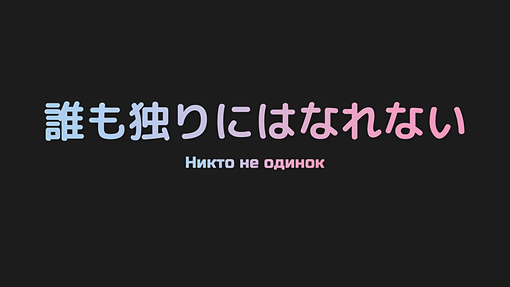
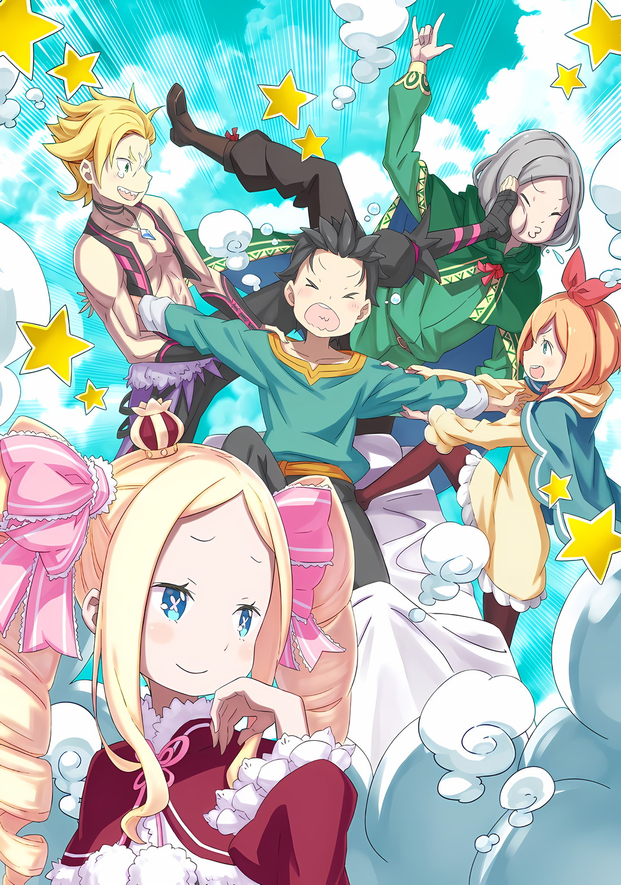
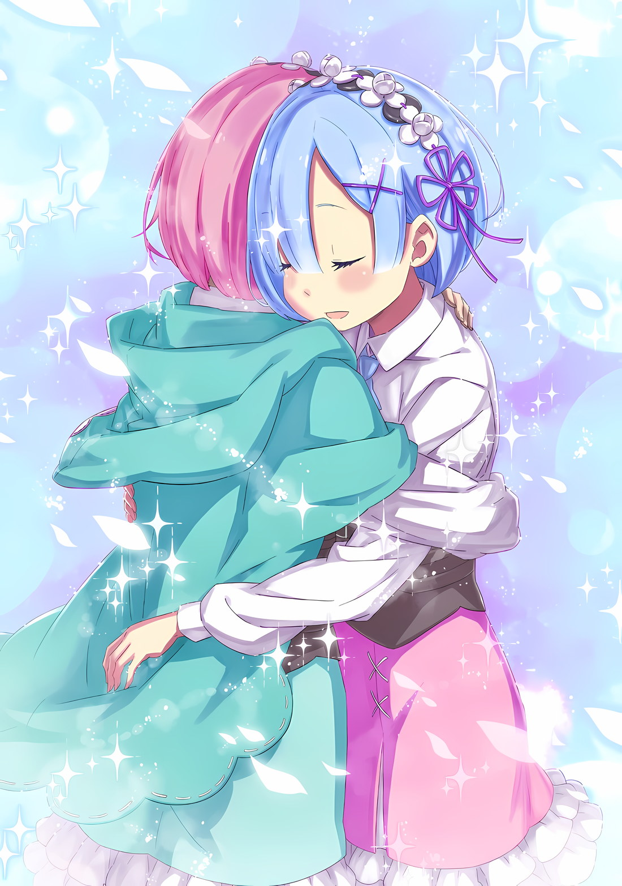

*※※※※※※※※※※※*

…Обморок и сон, хотя и то, и другое — одно и то же нарушение сознания, чем они отличаются?

Конечно, Субару, который, вероятно, был одним из ведущих мировых экспертов по обморокам, не понимал, чем эти два явления отличаются друг от друга.

Что он мог сказать наверняка, так это то, что если и обморок, и сон давали организму отдых, то, как ему показалось, обморок имеет лишь половину этого эффекта.

Возможно, это было лишь вопросом ощущения, но он чувствовал именно так.

Это определенно было связано с тем, что, в отличие от сна, при обмороке чувства окружающих тебя людей были слишком разными.

Если у человека нет связи с другими людьми, и никто не беспокоится о нем, то, возможно, нет никакой разницы между обмороком и сном.

Однако…,

Субару: …Ах.

Его веки дрогнули, и из горла вырвался слабый вздох.

Таким хрупким и беспомощным жестом, возвращая себя к реальности, Нацуки Субару медленно пробудился от темноты.

Субару: …

Субару поднял свое лицо от берега реальности, на который он себя вытащил, и на мгновение забыл перевести дух.

Его взору предстал незнакомый потолок… сколько раз он просыпался в незнакомом месте, подобном этому, и использовал свою голову, чтобы попытаться выяснить, где он находится?

Однако то, что обычно было бы одиночной задачей, на этот раз было не так.

Беатрис: …Ох, ты наконец-то проснулся, я полагаю. Субару такой безнадежный соня, в самом деле.

Субару: Беатрис…

Знакомое, милое лицо заслонило от Субару незнакомый потолок.

Беатрис, с опущенными бровями и бледными глазами, смотрела на Субару; она была девушкой, которая, вероятно, разделила с ним больше всего моментов бодрствования.

Когда Беатрис попала в поле зрения Субару, он понял, что кто-то держит его за руку, которая, казалось, лежала на постели, и от этого его губы разжались.

Субару: Ты, случайно, не держала меня все это время за руку?

Беатрис: Конечно, я полагаю. Бетти — партнер Субару, в самом деле. Кроме того, я полагаю, Субару слишком часто бывает везде один. Если тебе не нравится быть прикованным, то держаться за руки — самый эффективный способ держать тебя в узде, в самом деле.

Субару: Как и ожидалось, ты действительно хорошо понимаешь мой характер…

Субару мог лишь посмеиваться над надутым лицом Беатрис, так как не знал, что ответить.

Субару всегда находил способ сделать то, что должно быть сделано, даже если он был прикован, но всегда было очень душераздирающе отпускать руку, которую держали.

Субару был чувствителен к боли, так что это был самый эффективный способ удержать его от ухода.

Субару: Ах, где мы находимся? Что мы сейчас делаем…

Беатрис: Успокойся, Субару, я полагаю. Понятно, что ты хочешь быть обеспокоенным многими вещами, но… что еще более важно, сначала оглянись вокруг себя, в самом деле.

Субару: Вокруг себя?

Беатрис приложила палец к губам и изобразила серьезность, глядя на Субару, который хотел знать, что происходит.

Субару, который чувствовал себя неспокойным и нетерпеливым, застыл на месте и заставил себя моргнуть, когда последовал совету Беатрис посмотреть вокруг на что-то, кроме нее и потолка.

И тогда у него перехватило дыхание.

…Вокруг себя, отдыхающего в кровати, он увидел множество храпящих людей.

Субару: …

Каюта была совсем не просторной. Только одна кровать, на которой спал Субару, занимала половину пространства. Внутри каюты было более десяти человек, плотно заполонивших ее.

Кроме того, это было немыслимое сборище.

Субару: Танза и Гарфиэль? И Хиайн, и ребята, и Луи, и даже Утаката…

Беатрис: Это еще не все, я полагаю. Бетти могла выиграть только одну руку, но другую…

Когда ему сказали это, Субару обернулся и понял, что его держали не только за правую руку, но и за левую. И вот она, крепко держа его за руку и положив верхнюю часть своего тела на кровать…,

Субару: …Петра.

С большой ленточкой, завязанной на ее голове, само лицо маленькой девочки, даже спящей, было очаровательным.

Сколько же трудностей и проблем она преодолела, чтобы держать его за руку? Он не был знаком с дорожной одеждой Петры, которая была покрыта грязью и наполнена заботами маленькой девочки о том, чтобы быть изящной.

То, что она была в таком состоянии, было доказательством того, что ей наконец-то удалось добраться сюда.

Беатрис: Но самое трудное, что пришлось сделать Петре, это воспользоваться возможностью взять Субару за руку, в самом деле. Это была борьба для всех, я полагаю.

Субару: Эй, эй, ты хочешь сказать, что все хотели взять меня за руку, пока я спал? Неважно, как ты это говоришь, что-то настолько глупое — это…

Беатрис: В самом деле, это не глупо.

Субару чуть не рассмеялся над этой шуткой, но тихий голос Беатрис его остановил.

Глаза Субару широко раскрылись, когда Беатрис подняла свою крепко сжатую руку и указала на нее,

Беатрис: Все мы очень переживали за Субару, я полагаю. Если держание Субару за руку поможет, то пусть даже это будет просто так, мы готовы сделать все, что угодно, в самом деле.

Субару: …

Беатрис: Возможно, я полагаю, Субару должен лучше понимать то, насколько велико его присутствие. В самом деле, это то, что Бетти говорила тебе снова и снова в течение долгого времени.

Тихий тон ее голоса звучал несколько встревоженно, но слова Беатрис были наполнены слишком большим состраданием.

Сказать что-то подобное с такими глазами и голосом, для него это было невозможно проигнорировать.

Однако даже Субару не позволял себе думать, что он не оказывает влияния на всех окружающих, и что им не следует дорожить…,

Субару: …Только из-за того, что я уменьшился, все стали слишком опекать меня.

???: Ну не знаю. По мне, так лучше бы Нацуки-сан сначала задумался о своем уменьшении, а не о чрезмерной заботе окружающих.

Субару: …!

Внезапно плечи Субару вздрогнули от голоса, который он услышал.

Голос неожиданно прозвучал, доносясь от входа в маленькую каюту, дверь сдвинулась в сторону, и оттуда выглянул человек с мягкими чертами лица.

Субару: Отто?!

Отто: Да, это я, но… прошу, тише. Пожалуйста, прими во внимание чувства Петры-чан и Гарфиэля.

Субару: Их чувства…

Отто: Это так, они ждут, когда Нацуки-сан проснется, понимаешь? Конечно, это потому, что они хотят первыми поговорить с пробудившимся Нацуки-саном. Но если они узнают, что я вот так появился и воспользовался этой привилегией, как сильно они бы на меня обиделись?

Субару: Хо, ты такой плохой парень.

Отто: Даже когда Нацуки-сан так уменьшился, ты, кажется, не стал меньше говорить.

Приложив палец к губам и понизив голос, появившийся молодой человек… Отто оглядел каюту.

Он сделал озабоченное выражение лица, внутри каюты было так тесно, что ступить было почти некуда. Отто выглядел раздраженным, но он каким-то образом сумел найти точку опоры и подошел к кровати,

Отто: Беатрис-чан, тебе тоже спасибо, что позаботилась о Нацуки-сане.

Беатрис: Уставать не от чего, я полагаю… Что еще более важно, собираешься ли ты, в самом деле, сообщить им об этом?

Отто: Конечно, я позабочусь о том, чтобы все знали, что Нацуки-сан проснулся, но…

Поскольку Беатрис смотрела на него укоризненным взглядом, Отто произносил слова через раз, горько улыбаясь. Придав этим разрозненным словам более важный смысл, он посмотрел на Субару, лежащего в кровати,

Отто: Хотя мне и больно, но поскольку я был свидетелем несвоевременного пробуждения Нацуки-сана, пока не стало слишком шумно, я хотел бы обратиться к тебе с личной жалобой.

Субару: Какая наглость с твоей стороны вести себя так мило…

Отто: Да, я все-таки торговец.

Коснувшись своей головы без шляпы, Отто рассмеялся с лицом, не выражающим обиды.

Эта улыбка вызвала у Субару те же мурашки, что и пристальный взгляд его врагов, или тот же холодок, который он почувствовал, когда навлек на себя недовольство Танзы; испытывая это ощущение, Субару глубоко вздохнул.

Признаться, отчасти из-за того, что его отправили в Империю Волакия, Субару считал, что не так сильно виноват в последующих бедах; тем не менее, это было правдой, что он заставил людей волноваться.

Какие бы жалобы на него ни сыпались, он должен принимать их спокойно.

Субару: Хорошо, выкладывай мне все, что у тебя есть. Но мой менталитет также был соответствующим образом натренирован здесь. Не думай, что сможешь уничтожить меня с помощью половинчатых слов.

Отто: Что это за хвастовство такое? Что ж, я не собираюсь читать тебе длинную лекцию. Поскольку я не единственный, кто хочет тебе что-то сказать, я буду краток. …Нацуки-сан.

Субару: Да?

Отто: …Я рад, что ты смог благополучно воссоединиться с нами. Прошу, не беспокойся обо мне так сильно.

Субару: …

Протянулась рука и опустилась на маленькое плечо Субару.

Почувствовав пальцы Отто, которые были сильнее, чем то впечатление, которое производило его лицо, они слегка дрогнули на его плече, а затем у Субару перехватило горло.

Крепко нахмурив брови, Отто сморщил нос, когда произносил эти слова; поскольку он всегда был тем, кто смотрел на себя непредвзято, его сдерживаемые эмоции ослабли.

Субару: Гх…

Его тренированная психическая решимость и готовность принять любой удар — все это было напрасно.

Те слова, которые произнес Отто, были убийственным ударом, безжалостно разрушающим барьеры Нацуки Субару, наносящим смертельный урон в обнаженную душу.

Короче говоря, это была нечестная игра.

Отто: В любом случае, это лучше всего действует на Нацуки-сане, верно?

Субару: Ты, ты сволочь… кх.

Перед дрожащим Субару, который напряг выражение своего лица, находившееся на грани срыва, на лице Отто появилась дерзкая, спокойная и многозначительная улыбка.

Будучи полностью водимым за нос, Субару не смог удержаться от того, чтобы его лицо не покраснело от чувства поражения. …Нет, были и другие методы. В качестве мести Отто за то, что тот его перехитрил, хотя это было далеко не победой, но, по крайней мере, способом не дать ему уйти с победой,

Этим было…,

Субару: Ааа! Я проиграл, я проиграл, это полный проигрыш, Отто, ты подлец!!!

Отто: Э!?

Хотя его лицо было красным, Субару лукаво улыбнулся, громко заявив о своем поражении. Как только он услышал это, лицо Отто побледнело, и он воскликнул.

При этом, поскольку спор Субару и Отто эхом отдавался в пределах каюты, естественно, один за другим их услышали спящие товарищи… Нет, скорее, спящая львиная стая начала просыпаться.

И вот так, с ликованием и упреком, произошло извержение чувств радости и печали.

Внутри шумной каюты, рядом с обеспокоенными Субару и Отто, Беатрис наблюдала за происходящим от начала и до конца, подперев подбородок руками,

Беатрис: Боже правый… они ведут себя слишком по-детски, я полагаю.

Сказав это, с видом одинокого стороннего наблюдателя, она с нежностью смотрела на эту сцену.

*△▼△▼△▼△*

…Одновременная эвакуация граждан из столицы Империи Рапганы.

Это было дело огромной важности, которое началось, когда Субару был без сознания, и среди большой группы, занимавшейся этим, он очнулся в кабине драконьей повозки, выделенной для перевозки важных персон.

Запряженная огромным количеством наземных драконов, она представляла собой передвижной спальный корпус, экстраординарное изделие, которое можно было использовать как для эвакуации, так и для восстановления сил. При таком августейшем обращении казалось, что Субару вывезли из столицы Империи.

Хиайн: Братишка! Я очень рад, что ты в безопасности! Когда сила покинула мое тело по дороге, я чертовски забеспокоился! Потому что не мог понять, что с тобой могло случиться!

Вайц: Мне будет все равно, если этот бородатый ублюдок умрет, но если мы потеряем тебя, эскадрону придет конец… Если ты будешь на грани смерти, используй меня или кого-нибудь другого в качестве щита…

Идра: Формулировка Вайца меня беспокоит, но я согласен. Шварц, я искренне рад, что ты очнулся. И как член эскадрона, и как свой человек.

Такова была реакция тех, кто прочно входил в группу, ожидавшую пробуждения Субару, тех троих из его «Отряда», которые сопровождали его с Острова Гладиаторов, — Хиайна, Вайца и Идры.

Независимо от Идры, который был с ним во время битвы, Хиайн и Вайц, должно быть, особенно волновались, поскольку ушли порознь.

Это была не единственная причина, по которой он должен был извиниться перед этими тремя.

Субару: Виноват. Из-за того, что я упал в обморок, все усиления, должно быть, оборвались…

Вайц: Не парься об этом… К счастью, это случилось только тогда, когда мы уже начали эвакуироваться.

Хиайн: Точно! Единственным, кто чуть не погиб от того, что нас оборвало, был этот ублюдок с черепом, он как раз поддерживал рухнувшую колонну. Если бы губернатора там не было, он бы был раздавлен насмерть…

Вайц: Разве я не говорил тебе не рассказывать об этом…!

Как обычно, вдумчивая забота Вайца о Субару была разрушена неуместным комментарием Хиайна. Увидев сцену ссорящегося дуэта, Идра пожал плечами.

В центре столицы Империи, когда «Кор Леонис» вышел из строя, он, который в результате должен был подвергнуться опасности,

Идра: Как сказал Вайц, не парься из-за этого, Шварц. С того момента, как мы решили следовать за тобой, все, что произойдет после этого, будет нашей собственной ответственностью.

Субару: Но…

Идра: И даже если я скажу это, я знаю, что ты единственный, кто будет волноваться. …Я оставлю остальную часть обсуждения тем девушкам, которые, похоже, знают тебя дольше, чем мы.

Как всегда, Идра умел рационально завершить разговор.

Благодаря этому Субару, который мог выдвигать только эмоциональные возражения, был вынужден замолчать. Идра вышел из каюты вместе с Хиайном и Вайцем, которые все еще боролись друг с другом.

В тот момент, когда они уходили, за ними устремилась маленькая фигура,

Субару: Танза.

Танза: …Я искренне приношу прощения за то, что не смогла быть полезной в такой ответственный момент. Я очень рада, что вы очнулись, Шварц-сама.

Отчаянно повесив голову, Танза ответила формальным тоном.

Вспоминая то время, когда они были разлучены в столице Империи, он мог понять сожаления Танзы о том, что у нее недостаточно сил. Однако, похоже, это была не единственная причина ее удрученного выражения лица.

Субару: Что случилось? Если что-то произошло…

Танза: …Нет, это не то, о чем я должна сейчас говорить со Шварцом-сама. Пожалуйста, не спеша дайте отдых своему телу и проведите время со всеми.

После секундного колебания Танза тоже вышла из каюты, ничего больше не сказав.

Он попытался дотянуться до ее хрупкой спины, но обе руки Субару были заняты. Тем не менее, не желая оставлять ее одну, его сердце взывало к Танзе, сделавшую такое лицо.

В глубине души он твердо решил, что обязательно узнает причину этого лица позже.

Затем…,

???: …Субару.

После того как он проводил тех, кто покинул каюту раньше, то, что сформулировалось в этот момент, словно с нетерпением ждало, чтобы окликнуть его, являлось живым голосом в тоне серебряных колокольчиков, нежно ударяющим по его барабанным перепонкам.

Субару: …

Секунда — это было время, необходимое ему, чтобы среагировать на этот голос и повернуться к ней.

Беспокойство из-за того, что заставил ее волноваться, или смущение из-за того, что не мог встретиться с ней лицом к лицу, или какая-то мелочная гордость — все это не было причиной.

Просто Субару действительно нужно было морально подготовиться.

В конце концов…,

Субару: Эмилия.

Потому что, просто назвав имя другого человека, сердце Субару испытало сладкое, покалывающее чувство.

На зов Субару, полный нервозности, девушка… Эмилия мягко улыбнулась,

Эмилия: Ммм, я рада наконец-то снова тебя видеть… Даже находясь так далеко, ты нашел много друзей, Субару. Я ооочень рада.

Субару: Друзей…

Эмилия: Да. В конце концов, Субару, все ооочень беспокоились о тебе и никогда не отходили от тебя ни на шаг.

Услышав слова Эмилии, Субару опустил голову, вспоминая, в каком состоянии была каюта минуту назад.

Как бы ни были велики чувства Субару по поводу того, что он заставил их волноваться, всякий раз, когда ему говорили, что это его плохая привычка, он чувствовал себя из-за этого неловко, но…

Субару: Я такой счастливчик.

Эмилия: Это определенно так. Но я хочу, чтобы Субару становился все более и более счастливым, так что этой крошечной суммы совсем недостаточно.

Субару: Даже после всего хорошего, что ты для меня сделала?

Эмилия: Когда Субару делает что-то для меня, он когда-нибудь чувствует удовлетворение от того, что этого достаточно?

Эмилия наклонила голову, и пока она чувствовала, как ее прекрасные серебристые волосы каскадом падают на стройные плечи, Субару растерялся, полностью загнанный в угол.

Она была права. Когда он хотел сделать что-то для людей, которых любил, он никогда не думал, достаточно ли того, что он делает, а скорее думал, может ли он сделать что-то еще.

Увидев реакцию Субару, Эмилия улыбнулась и сказала «Хехе»,

Эмилия: Что ты думаешь? Я ведь не ошиблась, верно? Мой Рыцарь.

Субару: …Ага. Ты так сильно выросла, пока меня не было, и я так горжусь тобой, но я очень скучал по тебе, Эмилия!

Эмилия: Эмилия?

Субару: …Нет, Эмилия-тан.

Когда его снова спросили, Субару вспомнил то давно забытое имя, которым он ее называл.

Да, именно так Субару называл девушку, которая была такой важной, такой драгоценной, такой милой, что при мысли о ней у него замирало сердце.

Как только он назвал Эмилию этим именем, чувство гармонии быстро овладело им.

Пока Субару размышлял об этом чувстве,

Петра: Сестренка Эмилия! Самое время нам поболтать с Субару!

Долгожданное, нежное настроение между Субару и Эмилией было прервано Петрой, девочкой, которая заявила о своем присутствии, подняв свою маленькую ручку.

Очнувшись после предыдущей суматохи и не имея возможности спокойно отпраздновать воссоединение из-за последовавшего хаоса, Петра жаждала возможности воссоединия, а в ее круглых глазах горел гнев.

Петра: Мы еще не смогли нормально поговорить с Субару. …За исключением Отто-сана, который прокрался к нам.

Отто: Ах. Это не так, я не пытался прокрасться…

Гарфиэль: О? О? Оправдания Оттобро. Какие оправдания он собирается вкинуть, разве нам всем не интересно это узнать? То, что ты прокрался сюда втихую, ранит даже крутого меня, знаешь ли…

Отто: Даже Гарфиэль огрызается на меня!?

Гарфиэль разочарованно опустил плечи и сделал печальный жест. Когда он наложил свою атаку поверх атаки Петры, Отто широко раскрыл глаза и воскликнул.

Затем Беатрис дополнила: «В самом деле, это так», как бы добавляя оскорбление к нанесенному ему ущербу.

Беатрис: Бетти слышала, я полагаю. Отто сам сказал, что он тайно пришел поговорить с Субару, чтобы Петра и остальные не узнали об этом, в самом деле.

Эмилия: Хах, серьезно? Отто-кун, я понимаю, что ты чувствуешь, но мы все волновались за Субару, так что тебе не стоило жульничать.

Отто: У меня нет союзников! Вместо того, чтобы понести ужасную потерю, это причиняет гораздо большую боль!

Получив упрек от предательницы Беатрис и Эмилии, которые честно отреагировали на это, Отто схватился за грудь и был жестоко наказан за свои поступки.

Смеясь над такой оживленной группой людей,

Фредерика: Несмотря на дурные привычки Отто-самы, я безмерно рада, что мы смогли встретиться, так как Эмилия-сама, Беатрис-сама и, конечно же, Петра не были ни капельки счастливы.

Фредерика произнесла это тихо.

Она, как и Петра, тоже была одета в дорожный наряд, а не в форму горничной, что было редким зрелищем. Однако Субару тут же был удивлен, увидев еще более редкое зрелище.

В уголке глаза улыбающейся Фредерики появилась слеза, и она почти начала стекать по ее щеке.

Петра: С-сестренка Фредерика, ты плачешь!

Фредерика: А? Ах, м-мои извинения. Я просто, знаете ли, почувствовала огромное облегчение… Как неприлично с моей стороны.

Субару: …Нет, это вовсе не неприлично. Вот как ты за меня волновалась.

Слезы Фредерики удивили его, но в большей степени он был благодарен ей.

Как и сказала Фредерика, они бросились на поиски пропавших Субару и Рем, и количество трудностей, которые им пришлось преодолеть, чтобы добраться сюда, было неизмеримо.

Они находились в Империи, находящейся в состоянии гражданской войны, с границами, пересечь которые должно было быть нелегко.

Чтобы добраться до Субару, им пришлось преодолеть множество препятствий, которые не могли быть пройдены надлежащими средствами.

Субару: Поистине, всем большое спасибо.

Гарфиэль: Хе-хе, вполне естественно, что мы пришли сюда. Без Капитана крутые мы не можем собраться ни в каком виде.

Петра: Да, Гарф-сан прав… Хотя я удивлена, что ты стал таким маленьким.

Гарфиэль потер переносицу, а Петра, улыбаясь и кивая, вступила в разговор.

Конечно, нельзя было сказать, что все закончилось только тем, что они собрались все вместе… по крайней мере, не с учетом нынешнего состояния Субару. Как и ожидалось, они не собирались возвращаться в Королевство Лугуника с Субару в уменьшенном состоянии.

Нацуки Субару не сможет стоять рядом с Эмилией, если не вернется к своему первоначальному восемнадцатилетнему возрасту.

Субару: Ну, Беатрис… кхм! Беако, ты не возражаешь, если я встану рядом с тобой?

Беатрис: Нет ничего плохого в том, чтобы находиться на одном уровне глаз, я полагаю. Но Бетти уже скучает по объятиям Субару, в самом деле. Вот почему большой Субару предпочтительнее, я полагаю.

Петра: Я тоже! Я тоже думаю, что большой Субару лучше. Я думаю, что нынешний Субару симпатичный и милый, но…

Эмилия: О, ты тоже считаешь его милым. Я рада, что не только я так думаю.

То, что Эмилия немного отклонилась от темы разговора, вызвало непринужденную атмосферу, распространившуюся по каюте.

Субару мог ощутить ностальгию по давно разлученному лагерю Эмилии в этой мягкой, непередаваемой атмосфере, и его душа обрела чувство удовлетворения.

Будучи заброшенным в Империю Волакия, он провел время с «Племенем Судрак», Флопом, Медиум, а позже с членами с Острова Гладиаторов, все из которых сформировали Эскадрон Плеяд. Однако атмосфера этого воссоединения отличалась от любой из них.

Хотя все, кого он встречал, были драгоценны, ценность этого пространства, которое так долго держали вдали от него, была тем, что он ценил.

Субару: Но, как и ожидалось, полагаю, Розвааль или Рам не смогли прийти. Нет, пожалуй, только Эмилия-тан — это довольно скверно.

Субару криво улыбнулся, когда упомянул о лицах, которых он не увидел в каюте.

Мейли тоже не было, но ей было бы трудно пересечь границу, чтобы сопровождать Эмилию и остальных из-за ее положения. По всей вероятности, она осталась в особняке вместе с Рам и…

Эмилия: А? Нет, ты ошибаешься. Рам и Розвааль здесь, с нами. Они очень беспокоились о тебе, Субару.

Субару: …Что?

Мысли Субару были разрушены ответом Эмилии, у которой было странное выражение лица.

Глаза Субару расширились от шока, когда красивый голос Эмилии зазвучал в его голове. Она сказала, что Рам и Розвааль пришли с ними.

Присутствие Розвааля было огромной неожиданностью, но сейчас это было отложено в сторону.

Ведь проблема была не в Розваале,

Субару: Рам, она тоже здесь?

Петра: Она здесь. Сестренка Рам тоже беспокоилась о тебе, Субару… Ах! Только не говори ей об этом, хорошо?

Субару: Я не буду. Не буду. Я не буду говорить ей об этом, но это не то, о чем я хотел сказать…

Покачав головой, слова Петры заставили мозг Субару включиться.

Он говорил о том, что присутствие Рам здесь означало…,

Субару: Неужели, она уже встретилась с Рем?

Эмилия: Ах…

Как только Субару задал этот вопрос, выражение лица всех, кроме Субару, вдруг стало напряженным.

Именно такой реакции Субару боялся больше всего.

Реакция Эмилии и остальных, которая были из разряда «Я забыла сказать Субару», подсказала ему, что это случилось, пока он спал.

…Воссоединение разлученных сестер, Рам и Рем.

Субару: Ааааах!!! Я так хотел быть там!!!

Эмилия: П-прости, Субару, но мы хотели, чтобы они увидели друг друга как можно скорее…!

Субару: Я знаю, я знаю, я такой чертов идиот… Кх!

Закрыв лицо руками, Субару воскликнул о собственной глупости из-за того, что упустил исторический момент.

Эмилия и остальные изо всех сил пытались утешить Субару, но в этом не было ничьей вины, и раны Субару оставались незалеченными.

Если уж на то пошло, то именно Субару был больше всего виноват в том, что проспал в такой ответственный момент.

Несмотря на это…,

Субару: К-как это было? Обе их реакции…

Эмилия: Эм, ну, сначала они слегка стеснялись… Но это было по-настоящему особенное чувство! Я даже немного поплакала!

Субару: Гхааааа!

Беатрис: Эмилия! Тебе не нужно было подробно останавливаться на этом, в самом деле! Бедный Субару, я полагаю!

Эмилия: Хах, точно! Прости, прости!

Несмотря на это, его досада ничуть не уменьшилась, и Субару остался в полном разочаровании.

Проливая слезы разочарования, Субару в очередной раз осознал, как сильно он ненавидит тот факт, что это ювенильное тело не может сдержать слез, когда он собирается плакать по-настоящему.

*△▼△▼△▼△*

Рем: …

Прямо перед ней, из-за двери, до которой она собиралась дотянуться, раздался мощный, громкий крик.

Громкий голос и его содержание не позволили Рем сдвинуться с места, ее разум был охвачен нерешительностью, ее красивые брови сошлись на переносице, и она не знала, что делать.

Луи: Уу, ау?

Рем: …Эм, прости, Луи-чан, я знаю, что ты хочешь его увидеть.

Луи, обняв Рем за талию, с любопытством смотрела на нее.

Когда потерявший сознание Субару очнулся, Луи хотела сама поговорить с ним, но сдержалась и бросилась к Рем.

Затем, взяв ее за руку, она повела ее в спальную комнату Субару…,

Рем: …

Голоса, доносившиеся из каюты, принадлежали Субару и его спутникам.

Это могло показаться чужим делом, но, похоже, эти спутники были близкими родственниками Рем. Как и в случае с Субару, она не чувствовала с ними связи.

Рем: Они совсем не плохие люди, я знаю это.

Группа по поиску Субару и Рем, возглавляемая Эмилией, была очень внимательна к своим товарищам, полна активности и, прежде всего, хороших людей.

Согласно тому, что она слышала, они прибыли из Королевства, соседствующего с Империей, хотя им было запрещено пересекать границу, и даже участвовали в гражданской войне, к которой не имели никакого отношения.

Все это было сделано для спасения Субару… точнее, Субару и Рем, которые оказались втянуты в восстание в Империи.

Точно так же, как Рем не могла избежать этой борьбы в Империи…

???: …Я слышу жадный голос Барусу.

Размышляя, Рем слегка вздохнула, когда внезапно чей-то голос окликнул ее сзади.

Вместо Рем обернулась Луи, обнимавшая ее за талию. Обладательница этого голоса оглянулась на Луи, которая смотрела на нее, и издала небольшой вздох,

???: Перестань смотреть на Рам таким обвиняющим взглядом. Это был жесткий урок любви для Барусу… Нет, любви здесь нет, так что это просто жестко. Да, исключительно жесткий урок.

Рем: …Значит ли это, что он тебе не нравится?

???: Здесь нет ненависти, просто много возможностей для презрения.

С этими словами Рем также повернулась к другой стороне, которая медленно шла к ней, гулко ступая ботинками.

Ей потребовалось время, чтобы обернуться и посмотреть в том направлении, так как ей нужно было набраться смелости, чтобы взглянуть прямо в лицо собеседнику.

В конце концов, это лицо было знакомо Рем, хотя она его и не помнила.

Это была…,

Рем: …Рам-сан.

Рам: Какой холодный способ обращения к Рам, учитывая, что она готова называться старшей сестрой.

Рем: Для меня все это настолько неожиданно, что…

Девушка, которая стояла перед ней, обхватив себя за локти и выпятив грудь… Рам, так она сама себя называла себя, и так ее называли окружающие, — была очень похожа на Рем.

Отличия заключались в цвете волос и глаз, а также в переполнявшей их уверенности.

Похоже, что она была старшей сестрой Рем, которая ничего о ней не помнила.

Честно говоря, отрицать было нечего, если сравнить черты их лица. Имя ее старшей сестры, которое Субару уже не раз говорил ей, должно было быть «Рам».

Но прежде всего, в голове Рем, несомненно, преобладало…,

Рам: Что бы ты ни думала, сердце Рем это почувствует, ведь Рам и Рем — сестры… Синестезия не лжет.

Рем: Синестезия…

Рам: Своего рода связь душ между близнецами. Все это время Рам чувствовала присутствие Рем… Отличается ли Рем?

Рем: …

Рем сомкнула губы, глядя на Рам, которая сузила свои светло-малиновые глаза, задавая прямой вопрос.

Если спросить, отличается ли Рем от других, то нет, совсем нет. Хотя она не очень хорошо понимала, что такое Синестезия, внутри нее было очень, очень сильное ощущение, что она чувствует себя другой.

Это было всепоглощающее чувство безопасности по отношению к Рам, с которой она, предположительно, встречалась впервые.

Рем: …Но я боюсь.

Рам: Боишься?

Рем: Испытывать такие чувства к тебе, с которой я обменялась всего несколькими словами за такое короткое время.

Для Рем, потерявшей память, Субару и Луи были единственными двумя людьми, которые присутствовали в тот момент, когда началось ее нынешнее «я». В силу обстоятельств, она оттолкнула Субару и сначала держала Луи рядом с собой.

После этого Рем познакомилась с судракийками, Флопом и Медиум, Присциллой и Катей, и, по-своему, установила с ними различные отношения.

Но даже тогда само существование Рам обогнало их всех сразу и пыталось встать на вершине.

Рем: Вот чего я боюсь…

Это невыразимое чувство безопасности, это были приближающиеся шаги прошлого.

Дело было не в том, что она не хотела вернуть себе утраченные воспоминания. Но также казалось, что с их возвращением многие проблемы Рем наверняка вернутся к ней.

Но в то же время она боялась, что, когда эти шаги настигнут ее, все изменится.

*Если все то, что ты видела, все то, что ты чувствовала, все то, о чем ты думала, если все это изменится.*

Да, решительно, сильно Рем закрыла глаза и схватилась за грудь.

И тут…,

Рам: Да. …Какое облегчение.

Рем: А?

Раздался неожиданный голос, и Рем приоткрыла плотно сомкнутые веки, чтобы посмотреть вверх.

Рам, которая сжала свои локти перед Рем, уставилась на нее, слегка опустив уголки глаз, и задаваясь вопросом, что она только что сказала,

Рам: Рам думает так же, как Рем. Боюсь.

Рем: Боишься, ты имеешь в виду…

Рам: Что если Рем естественным образом примет Синестезию и прыгнет в грудь Рам как данность? …Да, Рам боится.

Рем: …

Поскольку у нее было нежное выражение лица, но она говорила о страхе, Рем начала меньше понимать, что чувствовала Рам перед ней. …Нет, дело было не в этом.

Понимание того, чего она не понимала, вот что сбивало ее с толку.

Луи: У!

Внезапно, вместо Рем, в глазах которой плавало смятение, застонала Луи, когда она обняла ее за талию.

Луи, смотревшая на Рам снизу вверх, почувствовала трепет в сердце Рем и заострила взгляд, как будто хотела отругать Рам за то, что она вызвала это.

Встретив взгляд Луи, глаза Рам слегка сузились,

Рам: Пытаешься встать между Рам и Рем? Из всех людей, ты?

Луи: Аа-у!

Рам: Значит, ты не собираешься отступать. Это сложно, но не неприятно.

Что за история произошла между ними, если Рам сказала такое, показывая признаки того, что она также знает Луи, а затем снова посмотрела в глаза Рем. Когда их взгляды встретились, она не смогла оторвать их друг от друга.

Несмотря на то, что ее сердце было словно обожжено интенсивностью этого взгляда, ее душа была привязана к ней.

Ее тревога становилась все сильнее и сильнее.

Так же сильно, как и ее влечение к Рам.

Остро почувствовав это, Рем сильно прикусила губу,

Рем: Ты, безусловно, должна быть моей старшей сестрой. Я могу поверить в это без всяких сомнений. Просто…

Рам: Даже если твое сердце убеждено, твой разум — нет?

Рем: …Да.

Рам: Хорошо. Тогда пока все в порядке.

Рем слабо кивнула, и Рам сократила дистанцию еще одним шагом.

Плечи Рем напряглись при виде ее приближения, и Луи шагнула вперед, чтобы ее защитить. Но Рем мягко сжала Луи за плечо и сказала: «Все в порядке», останавливая нежную маленькую девочку.

Затем, по собственной воле, они устремили свои взгляды прямо на Рам.

Под пристальным взглядом Рем Рам разжала свои скрещенные руки и протянула ладонь. Рука, предложенная человеком, чье сердце уже признало в ней сестру.

Рам: Я Рам. Твоя старшая сестра, несомненно, рожденная, чтобы любить тебя.

Рем: …

Рам: Хотя, есть и другие люди, столь же важные для твоей независимой старшей сестры.

Глаза Рем расширились от слов, произнесенных с таким спокойствием и уверенностью.

Затем, когда смысл сказанного начал доходить до нее, с ее губ сорвался вздох. Рем лишь слегка улыбнулась и рассмеялась,

Рем: Оказывается, ты пугающий человек. Когда я разговариваю с тобой, мне кажется, что мое тело просто отдается этому чувству безопасности, которое я испытываю.

Рам: Ничего не поделаешь, Рам — такая старшая сестра, которой хочется доверять и любить до конца.

Рем: Да, сестра Рам.

Рам гордо выпятила грудь, а Рем робко схватила ее за руку, которая наконец-то обратилась к ней таким образом. Услышав это, Рам слегка приподняла брови.

Рем потребовалась храбрость, чтобы обратиться к ней таким образом, поэтому такая реакция была неожиданной.

Рем: Ммм?

Рам: …Как бы сильно меня ни раздражало то, что я поступаю так, как сказал Барусу, это не очень-то удобно.

Рем: Э?

Рам: …Сестра.

Рем: А?

Рем расширила свои глаза, когда Рам на мгновение нахмурилась, а затем продолжила свои слова. В ответ на реакцию Рем Рам повторила еще раз, сказав то же самое.

Рам: Обращайся к Рам как сестра. Так удобнее всего.

Рем: …Сестра Рам?

Рам: Имя не нужно.

Рем: …Сестра.

Делая то, что ей было велено, приближаясь все ближе к тому, как Рам хотела, чтобы ее называли, последняя крепко зажмурила свои глаза. Затем она потянула руку Рем, за которую та ухватилась, к себе; Рем рефлекторно пошатнулась, но тут Рам мягко подхватила ее тело спереди и обняла.

Продолжая в том же духе, Рам прильнула губами к уху Рем, и,

Рам: Теперь Рам ясно почувствовала это. …Рам — это сестра Рем.

Рем: Я тоже это чувствую.

Таким образом, как только ее обняли, то, чего она боялась, выплеснулось из нее наружу.

То, что она называла чувством безопасности, оказалось влечением к ее душе, любовью к Рам. Крепко, нежно это охватило Рем, которая была без воспоминаний.

Рам: …Как бы Рам ни было больно это говорить, но готова ли ты к этому, Рем?

Рем: Готова… к чему?

Рам: Готова войти внутрь; нам нужно показать это Барусу, не говоря уже о том, чтобы показать это Эмилии-сама и остальным. Мы должны похвастаться нашей сестринской любовью, это развеет все тревоги.

От слов Рам Рем закрыла глаза.

Даже сейчас, будь то Эмилия и все остальные, а также Субару, как она должна смотреть им в лицо и какое у нее должно быть выражение лица, — это были вопросы, на которые она не находила ответа.

Но, по крайней мере, не было никаких сомнений в том, что Рам ее сестра, и в ее чувствах к ней.

Рем: Да, сестра.

Рам: Как я и думала, возможно, нам следует отложить это до тех пор, пока ты не назовешь Рам так сотню раз.

Рем: Сестра…

Рам: Это шутка.

Когда Рем кивнула, Рам отпустила шутку, которая вовсе не прозвучала как шутка.

Видя такое озорное поведение своей сестры, сердце Рем наполнилось облегчением, пусть даже на одно мгновение, несмотря на чувство срочности, несмотря на тот факт, что они находились в ситуации, которая в иных обстоятельствах была делом чрезвычайной важности.

Луи: Уау, ауааау~?

Рем: Да, я в порядке. И спасибо тебе, Луи-чан, за твою заботу.

Луи: Ух!

Луи, все это время стоявшая рядом с Рем, была застигнута врасплох в середине диалога Рем и Рам. Улыбкой избавив ее от страхов, Рем нежно погладила по голове добрую маленькую девочку.

Затем, с Луи на буксире, Рем набралась смелости и встала в один ряд со своей сестрой, которая развернулась на полпути.

Не останавливаясь, Рам и Рем обменялись взглядами, кивнули друг другу, и вдвоем потянулись к двери перед собой и…,

Рем: …Простите нас. Даже снаружи я слышала, как вы сильно шумели.

Рам: Это был очень похожий на Барусу вопль, напоминающий множество вместе взятых маленьких животных, не так ли?

И вот, обе сестры вошли в каюту, в которой находились их спутники.

*△▼△▼△▼△*

Субару: Хаа… Такое чувство, будто с моих плеч свалился огромный груз…

Остро ощущая, что огромный груз свалился с его груди, Субару пробормотал это.

Этот огромный груз на его груди, это была ответственность, которую Субару должен был взять на себя… поскольку рядом не было никого, кто мог бы защитить Рем, он должен был довести этот долг до конца, и сделать так, чтобы Рам, Эмилия и все остальные смогли встретиться с ней.

Однако, по правде говоря, когда он узнал, что не присутствовал на воссоединении сестер, Рам и Рем, его охватила печаль, сродни той, что испытывают при конце света.

Субару: Если бы я только мог представить их двоих, выстроившихся бок о бок, вот так…

Поведение этих двоих, вместе посетивших каюту Субару, заставило его поверить, что все прошло, по крайней мере, не так уж плохо, даже если он и не знал точно, какой обмен мнениями состоялся между сестрами.

Как только Субару понял это, разочарование, которое он испытывал до этого, исчезло, и его охватило чувство облегчения.

Наконец-то он добился того, что Рем и Рам смогли воссоединиться.

Он сделал так, что Рем смогла встретиться с Эмилией, с Беатрис, со всеми остальными.

Он не знал, насколько это можно было бы назвать его заслугой, но, несмотря ни на что, это было сделано.

То, что Субару также смог встретиться с Эмилией и группой, стало поводом для радости.

Субару: Хотя, я все еще маленький, и воспоминания Рем еще не вернулись…

Однако он чувствовал, что семена надежды прорастают.

Что касается вопроса о размерах Субару, то можно сказать, что способ его решения можно будет увидеть в ближайшем будущем; и, конечно же, он сможет найти способ вернуть воспоминания Рем.

Итак, то, что произошло дальше, было…,

Беатрис: …В самом деле, это действительно нормально, если с тобой не будет Бетти?

Субару: Нет, я совсем не такой невозмутимый, но этот парень не покажет своего лица, когда ты рядом, Беако, так что потакай моему эгоизму хоть ненадолго.

Беатрис: Если что-нибудь случится, сразу же зови Бетти, я полагаю. Бетти появится в мгновение ока, в самом деле.

Субару: Я буду рассчитывать на тебя.

До самого конца Беатрис не хотела отпускать руку Субару.

Глубоко заботливая девушка нежно отстранила свою руку; как только Эмилия и все остальные неохотно расстались с ним и вышли, Субару остался один в каюте, наполненной тишиной.

Как только все факторы, способствовавшие тому, что до этого момента все было так оживленно, покинули каюту, Субару мгновенно охватило множество дурных предчувствий.

В каких масштабах было предпринято отступление из столицы Империи? Удалось ли выяснить происхождение той орды зомби? Улучшились ли отношения между имперской армией и повстанцами? По какой причине Эмилия и остальные намеренно не затрагивали ничего, кроме оптимистичных тем? Чем объясняется мрачное выражение лица Танзы?

И чем закончились события, которые произошли незадолго до этого, когда Субару потерял сознание?

Субару: Даже если ты ответишь не на все, можешь ли ты как минимум дать ответ примерно на половину из них?

???: …Это будет зависеть от того, насколько ты готов пойти на компромисс.

В спальном помещении, где не было людей, на слова Субару, произнесенные в тот момент, когда он поднял верхнюю часть своего тела с кровати, ответила фигура, которая, вероятно, ждала, когда все закончат уходить.

Послышался звук твердого, неторопливого шага ботинок по полу в достойной манере, подчеркнутой позой, которая без всяких колебаний заявляла о своем присутствии окружающим.

Его манера поведения, острый блеск глаз — ничто из этого не стерлось из его памяти. И все же в чем-то они заметно отличались друг от друга, этот человек… этот черноволосый мужчина, Субару пристально уставился на его красивую внешность.

А затем…,

???: Насколько красноречиво ты будешь говорить, Нацуки Субару? …О «Звездочет» Драконьего Королевства.

Итак, с враждебными черными глазами Винсент Волакия начал допрашивать Нацуки Субару.
