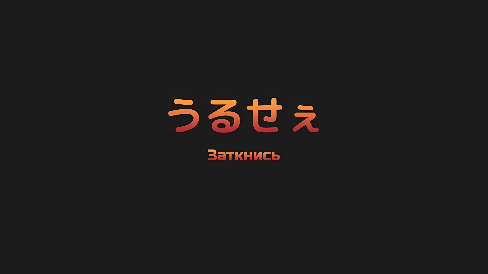

*※※※※※※※※※※※*

???: …Вы собираетесь его навестить, Авель-сан?

Остановившись на оклик со своей стороны, Винсент обернулся.

Несколько повозок были сцеплены друг с другом и рассматривались как одна длинная драконья повозка, что позволяло использовать «Божественную Защиту Уклонения от Ветра» множества наземных драконов по всей длине… Винсент закрыл один глаз, увидев знакомую синеволосую девушку, стоящую на перекрестке, через который он перешел.

Оглядываясь назад, он понимал, что прошло много времени с тех пор, как он в последний раз обменивался с ней подобными словами.

Винсент: Достигли ли незваные гости из Королевства своей цели?

Синеволосая девушка: Их цель — не я, а…

Винсент: Прекрати. Не отнимай мое время ерундой, в которую даже ты сама не до конца веришь. Время драгоценно. Особенно в нынешних обстоятельствах. Ты ведь знаешь об этом.

Синеволосая девушка: …

При звуке резкого голоса Винсента, девушка повесила голову с опущенными глазами.

Однако она быстро подняла этот вопрос снова, приняв точку зрения Винсента о том, что время ограничено,

Синеволосая девушка: Вы собираетесь его навестить, Авель-сан?

И она снова обрушила на него тот же самый вопрос.

Винсент: Я не Авель. Я Винсент Волакия.

На этот вопрос Винсент ответил, не меняя выражения лица.

Авель было его временным именем, которым он воспользовался для собственного удобства во время бегства, и не более того. Он взял его от фамилии Авелюкс, своего семейного имени времен, предшествовавших его восхождению на трон Империи, к которому он более не испытывал особой привязанности.

Но прямо сейчас его недовольство тем, что его так назвали, было сильнее.

Винсент: …Поступило сообщение, что это существо проснулось. Я должен встретиться с ним лицом к лицу.

Отбросив недовольство, Винсент ответил на вопрос девушки.

Что бы она ни думала, это не изменило бы решения Винсента. Он с самого начала не думал, что у нее были такие мысли или намерения.

Защищенная, пронесенная по жизни, страдающая, и по прошествии долгого периода времени приходящая к естественному выводу.

Как и многие другие, она была всего лишь обычным одиноким человеком.

Таким образом, Винсент попытался прервать этот диалог.

Однако…,

Синеволосая девушка: Он вам не враг, Авель-сан.

Винсент: …Что?

Получив ответ девушки, от которой он ожидал тишины и подавленности, с содержанием, противоречащим его ожиданиям, Винсент насупил брови.

Девушка пристально посмотрела на Винсента, ее бледно-голубые глаза несли в себе определенную цель.

В них появился свет, которого не было в момент их расставания; робко и в то же время смело он проникал в Винсента, словно пытаясь запугать его.

Винсент: …Я Винсент Волакия. Третьего раза не будет.

Синеволосая девушка: Мне жаль. Но у меня нет моих воспоминаний, поэтому я мало что знаю о Его Превосходительстве Императоре Винсенте. Так что я ничего не могу ему сказать.

Винсент: …

Синеволосая девушка: Он вам не враг, Авель-сан.

Не отводя взгляда, девушка еще раз подчеркнула это.

Винсент хорошо понимал ее, основываясь на способностях, которыми она обладала: она была вожжами, с помощью которых можно было контролировать Нацуки Субару, и ценным пользователем магии исцеления.

Если бы она заняла такую самоуверенную позицию по отношению к Винсенту, осознавая свое положение, он был бы вынужден не делать ничего другого, кроме как признать ее обладательницей значительных способностей. Однако, похоже, это было не так.

И таким образом…,

Винсент: Ты, как ты там сказала тебя зовут?

Синеволосая девушка: Рем. По крайней мере, теперь я могу точно ответить на этот вопрос.

Винсент: Девушка, у которой нет воспоминаний, делает заявление?

Рем: Это странно. Даже если мое сердце и мой разум ничего не помнят, есть вещи, которым тебя может научить твое окружение. Я знаю, что я Рем, благодаря человеку, который твердил мне об этом все время.

То ли это была благодарность, то ли недовольство, девушка… Рем и сама не понимала, какую из двух тем передавала ее манера говорить.

Однако, поняв, что это не связано с отвращением или другими негативными мыслями, Винсент пришел к выводу, что в дальнейшем разговоре нет необходимости.

Повернувшись спиной, он пошел прочь. И по мере того, как он это делал,

Винсент: Рем, никогда больше не позволяй себе так бесполезно тратить мое время. При следующем проявлении неучтивости в мой адрес, я снесу тебе голову.

Оставив ее с этими словами, он закончил свой разговор с Рем.

И затем…,

Винсент: Насколько красноречиво ты будешь говорить, Нацуки Субару? …О «Звездочет» Драконьего Королевства.

*△▼△▼△▼△*

Остро ощущая направленную на него враждебность, Субару столкнулся лицом к лицу с этим человеком.

Оглядываясь назад, его отношения с этим человеком можно было бы охарактеризовать словом «загадочный».

Во время их первой встречи он был подозрительным человеком в маске, разбившим лагерь в лесу. В тот раз Субару судорожно искал Рем и Луи, которых потерял из виду; поэтому он не стал отчаянно докапываться до сути дела, но этот человек был далеко не просто подозрительной личностью.

Следующая их встреча произошла в клетке «Племени Судрак»; Субару с трудом мог объяснить, почему этот человек вел себя так самонадеянно, несмотря на свой статус пленника. Он предпочел бы, чтобы был какой-нибудь способ спастись, потому что после этого его заставили принять участие в «Ритуале Крови», в котором он действовал без плана.

Впоследствии, несмотря на его помощь в возвращении Рем, однажды ему пришлось расстаться с Субару; однако он знал, что у группы Субару не будет другого выбора, кроме как вернуться. То, что он не сообщил им об этих обстоятельствах, было проявлением его коварства.

Сразу же после этого он полностью поддержал план Субару по захвату Города-крепости Гуарал; в качестве танцовщиц, которые шли под именами Нацуми Шварц, Вьянка и Флора, они вместе вошли во вражескую крепость.

Были сомнения по поводу его необычных отношений с Присциллой; а после, в Городе Демонов, за ним ухаживала Йорна; и без колебаний он заявил, что Луи не следует позволять жить; так и закончились их отношения после расставания.

И даже тогда, когда Субару сбежал с Острова Гладиаторов, и как только он услышал о положении, охватившей Империю в целом, он был полностью убежден, что эта ситуация была спровоцирована тем человеком, Императором, который был свергнут со своего трона.

Покинув столицу Империи Рапгану, он принял командование над огромным количеством людей, совершавших свое отступление и эвакуировавшихся. И снова он возглавил народ Империи, как тот, кто находится на вершине власти, как тот, кого считают самым мудрым Императором…

Субару: Для меня большая честь, что сам Винсент Волакия-сан пришел навестить меня. И ты прибыл как раз вовремя; не можешь ли ты почистить мне аблоко?

Винсент: Не играй со мной в игры. Во-первых, я не из тех, кто занимается чисткой фруктов. Где здесь вообще аблоки?

Субару: Где…?

На вопрос мужчины, который зашел в спальное помещение и подошел к нему, Субару отвел взгляд в сторону.

Даже в другом мире при посещении раненого или больного человека было принято приносить фрукты; возможно, в подобных ситуациях это было своего рода клише. По этой причине рядом с его кроватью стояла корзинка с аблоками.

Естественно, его собеседник тоже должен был видеть ее.

Субару: Вон в той корзинке с фруктами. Красненькие, ну разве они не аппетитные?

Винсент: Глупец, ты что, пытаешься меня одурачить? Аблоко — это плод белого цвета.

Субару: Ну, оно станет белым, как только ты его почистишь, но… Подожди, я припоминаю, кажется, у меня уже был подобный обмен мнениями, хранящийся далеко-далеко на задворках моей памяти.

Воспоминания об этом были довольно смутными, но у него возникло ощущение, что когда-то давно, у него был такой же разговор.

Подробности того, с кем он тогда разговаривал, вспомнить не удалось, но в его памяти осталось то же впечатление, что и сейчас, — что знатные люди докатились до крайности.

В любом случае…,

Субару: Есть вещи, которые ты можешь не знать. Как неожиданно.

С таким не слишком напряженным предисловием к их первому за последнее время взаимному обмену словами, чувствуя, что они начали не так уж плохо, Субару так и заявил об этом.

На слова Субару, мужчина… Авель, протянул руку к корзинке и разрезал аблоко пополам при помощи оставленного там ножа. Естественно, стало видно поперечный срез белых внутренностей этого красного плода.

Субару: …

Увидев этот неоспоримый результат, хватит ли у него ума признать то, что было фактом в их предыдущем обмене? Авель отложил нож и, оставив разделенный пополам фрукт в корзинке, повернулся к Субару.

В его черных глазах, которые все еще блестели, была безошибочная враждебность.

Субару: Не может быть, ты злишься на меня за то, что я поставил тебя в неловкое положение из-за цвета аблока…? Ты ведь только что обозвал меня глупцом.

Винсент: «Звездочет» Драконьего Королевства, так и было.

Субару: Так оно и было.

В очередной раз осознав, как к нему отнеслись, Субару нахмурился, так как понятия не имел, о чем идет речь.

Этот термин был не из тех, о которых он не помнил. Если он не ошибался, из того, что он слышал, это было что-то вроде термина, относящегося к предсказателям, которые сопровождали Императора в Империи.

Подобно «Драконьему Камню Истории», скрижали пророчеств Королевства Лугуника, они были существами, которые говорили о будущем.

Субару: Нет, такое чувство, что ты говорил об этом в еще более худшем смысле… Ты выразился так, будто заглядываешь в ближайшее будущее.

Винсент: Я признаю это как таковое, без сомнения. Именно так я и воспринимаю эти вещи.

Субару: Если это так, то ты только что говорил обо мне как о соглядатае, ты это осознаешь?

Если бы времена не изменились, разве по нормальным стандартам он не имел бы права прирезать Авеля за оскорбление? Или, выражаясь современными терминами, о которых знал Субару, он был готов бороться за диффамацию личности в гражданском суде.

Однако, получив ответ Субару, лицо Авеля ничуть не дрогнуло. Его черные глаза, такого же цвета, что и у Субару, но отличающиеся глубиной, говорили, что он не намерен ему подыгрывать.

Конечно, Субару тоже не собирался подыгрывать…,

Винсент: Ты, как много ты знаешь?

Субару: Как много я знаю о текущей ситуации? Если ты об этом, то мне не рассказали многих деталей. Эмилия и все остальные беспокоились обо мне сразу после того, как я проснулся… Но я знаю, что мы в самом разгаре эвакуации.

Винсент: …

Субару: Гражданская война на время прекратилась, сейчас все бегут из столицы Империи… Хотя можно подумать, что это будет настоящий хаос, однако не похоже, что это превратилось в огромные беспорядки.

Драконьи повозки непрерывно двигались, ночной пейзаж за окном менялся в медленном темпе, но благодаря «Божественной Защите Уклонения от Ветра», защищающей их от вибрации и завывания ветра, все было тихо.

Можно было подумать, что в пассажирских повозках очень тихо, а то, что драконьи повозки ни разу не остановили свое шествие, свидетельствовало о том, что никаких серьезных проблем не возникло.

И это несмотря на то, что перевозилось значительное количество людей, предположительно, сотни тысяч.

Субару: «Девять Божественных Генералов» и все такое прочее, вероятно, служили объединяющей силой, но одного этого было бы недостаточно. Как я и думал, ты очень большая шишка, старина.

Винсент: …

Субару: Честно говоря, когда я услышал историю о том, как тебя предали твоя правая рука и доверенное лицо, сместив с трона, я действительно думал, будет ли хорошо, если ты вернешься на должность Императора, но, как оказалось, это был правильный вариант.

Лидерство и харизма, это так называемые качества тех, кто стоит выше других.

Эти качества были не просто результатом выдающихся способностей, их, вероятно, можно было приобрести через кровь, пот и слезы, но людей, обладающих этими качествами от рождения, было немало.

К таким людям относились Короли каждой страны, главы многих организаций.

В этом смысле Авель, которому было на что опереться в трудную минуту, все еще сохранял потенциал быть тем, за кем пойдут, на кого будут равняться окружающие.

Субару: Меня бесит, что вместо того, чтобы спорить по этому поводу, я больше склонялся к тому, чтобы поверить в это. Но я был прав, ты — Император…

Винсент: …Это тоже соответствует твоим ожиданиям?

Субару: А?

Голос был тихим, но в нем явно слышались эмоции. Поскольку это казалось чем-то из ряда вон выходящим, мозг Субару отказывался это воспринимать.

В результате Субару не успел увернуться от протянутой руки, его лоб был прижат к кровати, тело последовало тому же примеру. И, прежде чем он успел возразить относительно того, что, черт возьми, происходит, он почувствовал, как что-то острое упирается ему в горло.

Он сразу же понял, что это был кончик ножа, которым только что разрезали аблоко.

Он понял это, но не знал, что за этим стоит. Он не понимал значения того, что Авель взял этот нож и повернул его к Субару таким образом, направляя на него свою враждебность… Нет, направляя свою ненависть, ту самую ненависть, которой был наполнен его голос.

Субару: …

Находясь в непосредственной близости, на расстоянии дыхания друг от друга, Субару и Авель обменялись взглядами.

Если бы Субару в этот момент неосторожно повысил голос, взывая о помощи, Авель без колебаний перерезал бы ему ножом горло.

Но, с другой стороны, то, что Авель не сделал этого сразу, объяснялось тем, что у него не было для этого причин.

Субару: Что ты хочешь… Хк.

Винсент: Это должен быть мой вопрос; каковы твои планы? В какой степени ты видел, как будет развиваться нынешний ход событий? Все ли до сих пор соответствовало нарисованной тобой картине?

Субару: Я же говорил тебе…! Говорил, что не понимаю, о чем ты говоришь. Что я затеваю…?

Винсент: …Почему ты оставил меня, а не Чишу?

По сравнению с лезвием у его горла, тон его голоса резанул гораздо глубже. Это заставило Субару замолчать, и рука Авеля задрожала, когда он сжимал нож.

Глядя на Субару в упор, Авель скрежетал молярами, твердя это.

Это было не то, что Субару мог сразу осознать.

Субару: Авель…

Винсент: Винсент Волакия.

Субару: …

Винсент: Я не Авель. Я не кто иной, как Семьдесят Седьмой Император Империи Волакия, Винсент Волакия. …Это и есть тот курс, который ты желал, не так ли?

Заявляя это так, словно он выдавливал из себя слова, Авель… Нет, Винсент назвал свое имя с оттенком раздражения.

Не совсем понимая смысл такого отношения, будто он проклинал себя за то, что назвал свое имя именно так, Субару ссутулил брови. Потому что, несомненно, он бы так и сделал.

Субару: Ты… пошел на войну, чтобы вернуть себе это имя и корону, не так ли…?

Винсент: Неверно. Я стремился исполнить свой долг Императора. Договор с «Племенем Судрак», падение Города-крепости, переговоры с Йорной Миссигр и провокация гражданской войны — все это было сделано с этой целью.

Субару: Твой долг Императора…?

Винсент: Находясь на троне, Винсент Волакия будет убит. Исходя из этого, «Великое Бедствие» попытается уничтожить Империю, а средства противодействия ей будут оставлены Винсентом Волакией. Это мой долг.

Субару: Хах…

Когда Винсент впервые перечислил ему детали своего дела, Субару хрипло выдохнул.

Выражение «Великое Бедствие» было незнакомо ушам Субару, но еще больше его поразило то, как Винсент все это пересказал.

По его словам, после кончины Винсента Волакии начнется «Великое Бедствие».

Затем он также заявил, что оставит после себя средства, с помощью которых можно будет противостоять этому «Великому Бедствию».

Вместо того чтобы искать эти средства, он оставил их позади.

Судя по тому, как он говорил, это было похоже на…

Субару: То, как ты говорил… Как будто ты знал, что умрешь…

Твердо ощущая холодное острие смерти на шее, Субару пробормотал это.

«Смерть», возможно, подкрадывалась все ближе к Субару, а черные глаза Винсента неуверенно дрогнули. По огромному пространству, простиравшемуся за пределами его черной окраски глаз, он догадывался о его истинной сущности.

Это была покорность, украшенная волей к сопротивлению.

Винсент: Действительно. Я включил свою смерть в свои расчеты. Я оставил после себя планы, чтобы гарантировать, что Империя Волакия не падет, даже после моей кончины.

И таким образом, никто иной, как сам Винсент, подтвердил правильность его интуиции; в следующее мгновение разум Субару окрасился в красный цвет, а его эмоции вырвались наружу.

Субару: ТЫ УБЛЮДОК, ПРЕКРАТИ, ЧЕРТ ВОЗЬМИ, ВАЛЯТЬ ДУРАКА!

Оскалив зубы и сверкнув глазами от гнева, Субару одарил Винсента… Нет, трусливого ублюдка перед собой смертельным взглядом и закричал. В его шее вспыхнула острая боль, но это можно было отложить на гораздо, гораздо позднее время.

Прямо здесь и сейчас было более важно просто выбить все дерьмо из этого слабака с самодовольным выражением лица.

Субару: После манипулирования столькими людьми, после того как ты заставил их пересечь столько опасных мостов, после того как они совершили с тобой столько ненужных обходных путей, ты планировал умереть в конце всего этого? Не шути так!

Винсент: Как будто я могу шутить. Все, о чем ты сказал, было сделано потому, что это была дорога, по которой нужно было идти. Последствия моей смерти ничто по сравнению с судьбой Империи, поставленной на карту.

Субару: Дело не в этом! Я хочу сказать, почему первое, что ты делаешь, это отказываешься от своей собственной жизни? Какое-то огромное бедствие? Не знаю! Не лучше ли просто остаться в живых и встретить это самому!?

Винсент: Ты что, не знаешь ничего лучше, кроме как болтать всякую чушь? Пока я жив, «Великое Бедствие» не наступит. Такова предпосылка этого плана. Это нельзя отменить…

Субару: Кто, черт возьми, решил, что это нельзя отменить? У тебя хорошая голова на плечах, так что будь то «Великое Бедствие» или что-то другое, ты мог бы просто обмануть его и выманить, а затем…

Винсент: …Но ведь это вы, «Звездочеты», заявили, что это никогда не будет отменено!

Винсент, сдерживая свои эмоции, сентиментально отвечал Субару, болтавшему без умолку. Но эмоции первого дошли до такой степени, что теперь взорвались на глазах последнего.

Насколько неожиданной была эта вспышка ярости с точки зрения Винсента? Если бы он сам не схватил лезвие ножа, направленного в сторону Субару, своей противоположной рукой, кто знает, куда бы вонзился кончик ножа; таков был поток эмоций.

Из левой руки Винсента, схватившейся за кончик лезвия, каплями стекала кровь, пачкая белые простыни.

Однако ни Субару, ни Винсент не обращали никакого внимания на падающие капли крови, вместо этого они сосредоточили свое внимание на глазах друг друга, на самой сути существа другого человека за пределами этих глаз.

В очередной раз Винсент окрестил Субару «Звездочетом».

В этом заключалась безошибочная причина того, почему Винсент Волакия ненавидел Нацуки Субару, питал к нему враждебность, доходя даже до того, что наставлял на него нож.

Именно потому, что он случайно понял это, эти сомнения не могли быть разрешены.

Субару: «Звездочеты»… заявили…

Винсент: ……«Звездочеты» слышат голоса Наблюдателей с небес, которые существуют за пределами этих рамок. Они говорят о событиях, которые могут произойти в далеком будущем, предоставляя нам возможность минимизировать ущерб. Но это лишь вопрос масштаба ущерба. А не о том, как предотвратить это заранее.

С отвращением в голосе, но стараясь по возможности подавить любые эмоции, Винсент начал говорить.

Содержание его речи напомнило Субару об одной вещи. Если бы «Звездочеты» действительно были способны предсказывать будущее, то, судя по его опыту, изменить его будет не так-то просто.

Независимо от того, можно ли назвать это силой судьбы или естественным течением времени, оно будет придерживаться предопределенного пути настолько, насколько это возможно; те, кто попытается избежать надвигающихся трагедий, будут поставлены на колени.

Предсказания «Звездочетов» были сродни тому, что Субару знал по собственному опыту.

К примеру, если бы Субару «Посмертно Возвратился» из-за природной катастрофы, даже если бы он смог призвать всех укрыться, готовясь к ней, он был бы не в состоянии остановить саму природную катастрофу.

Сможет ли он предотвратить разрушение домов и зданий, или даже полностью предотвратить гибель людей, он не узнает, пока не попробует, но он не сомневался, что это будет трудно.

Винсент: Много раз в прошлом «Звездочеты» правильно предсказывали, что Империю постигнут опасности. Эти кризисы были преодолены в максимально возможной степени, но некоторые вещи нельзя было спасти. Поэтому планы необходимы.

Субару: Планы…

Винсент: Планы, с помощью которых можно свести ущерб к минимуму, и сократить потери до максимально близких к нулю.

…В будущем тоже ожидаются бедствия, и можно предпринять шаги, чтобы большее число людей смогло их преодолеть. Можно сделать так, чтобы большее число людей не осталось позади.

Если Винсент Волакия трудился, не жалея сил, ради того, чтобы это свершилось,

Винсент: Это вы, «Звездочеты», нашептывали мне мою смерть. Как смеешь ты, с такими устами, твердить, что моей смерти нужно противостоять? Ты что, играешь со мной… со **мной***!?

* Теперь, став Императором, Винсент вновь использует «余» в качестве местоимения, как это было видно в 107 Главе 7 Арки. Однако здесь его маска Императора рушится, и он возвращается к использованию «俺» в качестве местоимения, как он делал это до восхождения на трон и после свержения, что отмечено здесь полужирным текстом (дальнейшее использование будет отмечено таким же образом).

Субару: П-подожди, подожди секунду! Я не «Звездочет» или что-то в этом роде…

Винсент: …Ты видишь вещи, которым еще предстоит произойти. Прекрати свой обман, Нацуки Субару.

Произнеся эти скупые слова, Субару испытал ощущение, что его сердце в груди остановилось.

В процессе выплескивания содержимого собственного сердца, маска Императора спала, и на другой стороне показалось не лицо Винсента Волакии, а лицо человека, изобилующего недостатками, по имени Авель.

И, наконец, как только мужчина посмотрел прямо на него, как только он произнес эти слова, Субару окончательно все понял.

Субару: …Ах.

Винсент… Нет, Авель окрестил его «Звездочетом», и Субару понял причину этого.

Авель видел «Посмертное Возвращение» Субару насквозь**.**

Точнее говоря, он видел не «Посмертное Возвращение» Субару, а скорее, тот факт, что он возвращался в прошлое, теряя свою жизнь и принося информацию из будущего… Он понял, что Субару обладает средствами, позволяющими узнать, что ждет его впереди.

Тогда он понял, что это сродни способности предвидения, которой, как знал Авель, обладают «Звездочеты».

Субару: …

Если подумать, то вполне естественно, что подобная ошибка могла произойти.

Потому что, конечно же, так оно и было. Сам Субару, в своем стремлении к пониманию и постижению, нашел в рассказе Авеля о «Звездочетах» нечто общее со своим собственным «Посмертным Возвращением».

Вооруженный знанием о прецеденте, представленном «Звездочетами», если Субару достигнет результатов, выходящих за пределы его возможностей, не удивительно, что он обнаружит связь… Нет, что он будет идентифицировать его как одно целое.

Интуиция Авеля была надежной. Его проницательность, безусловно, позволяла тщательно изучить все вещи.

С такой интуицией он сразу же понял, что Субару выживал не во всех ситуациях, с которыми он сталкивался в Империи, благодаря своим незрелым способностям и чистой случайности.

Вот почему, это определенно было именно поэтому.

Субару: Так вот почему ты всегда старался прислушиваться к моим советам?

Если Авель интерпретировал совет Субару как предложение, возникшее в результате выбора наиболее оптимального хода с помощью видения будущего, то каким бы идиотским ни казалось это предложение, он не смог бы отмахнуться от него.

Отказ допустить, чтобы «Племя Судрак» сгорело в огне, переодевание с целью захвата Города-крепости, путешествие в Город Демонов Хаосфлейм, переговоры с Йорной — все это было так.

Авель всегда изучал возможность реализации предложений Субару, тщательно анализируя их.

Таким образом Авель пытался втянуть Субару, которого он считал «Звездочетом», в борьбу за выживание Империи, используя его как пешку на доске. …После того, как он сам погибнет, Субару станет еще одним средством противодействия.

Несмотря на это…,

Винсент: …Ты оставил **меня**, а не Чишу.

Субару: …

Винсент: Нацуки Субару, ты обычный человек.

В форме, отличной от предыдущей, тембр этого голоса был лишен сентиментальности.

Не было никаких попыток подавить эмоции. Если бы такая попытка действительно имела место, эти самые настоящие эмоции все равно прорвались бы наружу, способные быть услышанными в их стремлении обратиться вовне.

Но ничего не было слышно. Они не были подавлены, эти эмоции умерли.

И таким тоном, лишенным эмоций, Авель выпустил на волю слова, лишенные оттенка, в адрес Субару.

Винсент: Наивное, зеленое, незрелое человеческое существо, хранящее в себе много горечи. Ты не обладаешь ни добродетелью, ни порочностью, достойными упоминания. Не обладая ни тем, ни другим, ты бы ничего не добился и умер бы обычным человеком.

Характеристика Субару, произнесенная с такой непринужденностью, не оставила места для возражений.

По справедливому суждению Авеля, Субару не мог стать кем-то особенным. Даже погрузившись в незрелость своего тела и разума, вернув свой дух в те дни, когда он считал себя ребенком-вундеркиндом, он знал, кем, в конечном итоге, он станет в грядущем будущем — неполноценным человеческим существом.

Но…,

Винсент: Тебе дарована возможность превзойти банальных, заурядных людей. Идеально используя это, ты дожил до сегодняшнего дня. Ты не был банальным, ты не был заурядным человеком, у тебя нет сильной склонности ни к добродетели, ни к порочности.

Субару: Авель…

Винсент: Ты… посредственный человек… Если так, то почему.

Твердо и властно Авель крепко стиснул зубы, глядя на Субару.

Он отбросил свое выражение лица, благородство, грациозность, самообладание, уверенность в себе и все остальное, обнажив свой истинный лик, видимый за сорванной маской Императора, его голос дрожал.

И таким дрожащим голосом, таким трепетным гласом, он воскликнул.

Винсент: Почему, почему ты оставил **меня**, Нацуки Субару!

Субару: …

Винсент: У тебя нет ни связей с этой Империей, ни каких-либо обязательств. Ты мог бы довольствоваться защитой многих из тех, кого ты узнал до сих пор, и не ничем более. По какой причине ты спас **меня**? По какой причине тебе пришло в голову попытаться спасти **меня**, человека, который с тобой не ладит…!

Субару: …

Винсент: Почему… хк.

Из-за сильных эмоций его хриплый голос передавал, насколько монументальным было желание Авеля задать этот вопрос «Почему».

Все сильнее и сильнее он сжимал лезвие ножа, еще глубже впивавшегося в его руку; поток крови становился все интенсивнее, на это было так больно смотреть, что Субару мгновенно попытался ослабить хватку Авеля и остановить кровотечение.

Однако…,

Винсент: Не трогай **меня**!

Субару: Агх!

Его рука была с силой отброшена, и, мгновенно почувствовав боль в протянутой руке, Субару скорчил гримасу.

Присмотревшись, Субару увидел, что нож в руке этого поразительно непохожего на себя Авеля порезал его собственную руку, и из нее тоже капля за каплей сочилась кровь.

В промежутке между двумя противостоящими друг другу людьми, простыни становились все более запятнанными их кровью, кровью, которая продолжала струиться без всяких попыток остановить ее.

И таким образом, не обращая внимания на кровь, текущую из них на испачканные простыни и пол,

Винсент: …Только что, когда ты протянул руку, чтобы оказать помощь, ты сделал это снова. Это то, что больше всего сбивает с толку, и то, что больше всего несовместимо со **мной** в твоем образе жизни.

Субару: …

Винсент: Время от времени ты оставляешь все на волю эмоций, которые ощущаешь в данный момент, отбрасывая в сторону все убеждения и идеи, которые ты испытывал до этого момента. Ты не следуешь тому, на что решился, легко меняя курс, который, по твоему мнению, тебе следовало бы избрать. Ты не в состоянии классифицировать, что следует спасать, а что нет, протягивая руку всем без разбора.

Субару: …Ах.

Глядя на налитые кровью сверкающие глаза Авеля, Субару затаил дыхание.

Даже боль от кровоточащей раны стала отдаляться, а мысли Субару замерли. Ведь то, что сейчас сказал Авель, имело точно такой же смысл, как и то, что мучило его совсем недавно.

*Тодд: «…Но ты был готов выбрать, спасать Катю или нет, верно?»*

Субару: …

Прежде чем он пришел в сознание, даже прежде чем он его потерял, именно эти слова были брошены в его адрес.

Что он и Нацуки Субару были несовместимы во всех возможных смыслах, что Нацуки Субару — чудовище, которое он никогда не сможет понять, — таково было лезвие слов, которое Тодд Фанг нацелил на него, решительно заставив их разойтись против его воли.

Он не пришел к выводу о том, что Субару «Посмертно Возвращается» или о том, что он «Звездочет», но, возможно, именно его наблюдательность, отточенная за всю его жизнь в качестве оборотня, идиосинкразировала* Субару и определила его как такового.

* **Идиосинкрази́я** — генетически обусловленная реакция, возникающая у некоторых людей в ответ на определённые неспецифические (в отличие от аллергии) раздражители.

*Тодд: «Ты чертовски непоследователен! Твои глаза говорят, что ты готов умереть в любой момент, ты готов эгоистично положить на чашу весов жизни других людей, но когда дело доходит до этого, ты отчаянно сопротивляешься. Это жутко!»*

Субару: …Хк.

Холодный взгляд Тодда, его голос, лишенный теплоты, наложился на взгляд Авеля перед ним.

В глазах Авеля, в его голосе слышался пыл ярости; тем не менее, эти два явления все же пересеклись. Причиной этого, несомненно, было то, что они оба хотели распрощаться с Субару.

Это было предисловие к изгнанию Нацуки Субару, избавлению мира от того, чей способ существования был несовместим с их.

*Тодд: «Отсутствие самосознания — плохая черта. Ты выбираешь между жизнью и смертью. Кого спасать, кому позволить умереть — ты решаешь сам. Я проявлю благосклонность к тем, кто подлизывается ко мне, но мне нет дела до тех, кто этого не делает. Я без колебаний буду льстить кому угодно, но…»*

*Тодд: «Как я могу иметь отношения с человеком, который решает, кому жить, а кому умереть, основываясь на своих переменчивых прихотях?»*

Таким образом, то, что побудило Тодда к совершению тех отвратительных поступков, согласно его словам, было образом мышления и поведения Субару.

Конечно, Субару не счел себя виноватым и не принял эти слова. Это было то, что он всегда делал и считал правильным, по-своему, в стиле Субару. Но если бы он так легко изменил свой путь, то он не смог бы показаться на глаза своим друзьям, которые следовали за ним и верили в него до сих пор.

Но в то же время, безусловно, существовала неоспоримая истина.

…Субару выбирал, кому жить, а кому умереть, как ему и заявили.

С помощью Полномочия «Посмертного Возвращения» Субару изменил судьбы тех, кто был ему дорог.

У кого не было выбора, кроме как потерять свою жизнь, у кого не было выбора, кроме как причинить ему боль, у кого не было выбора, кроме как бороться за то, что было им дорого, у кого не было выбора, кроме как лишить себя возможности достичь взаимопонимания. Он изменил их судьбы и сохранил им жизнь.

Благодаря принятым решениям и действиям Субару, число людей вокруг него, потерявших жизнь или ставших несчастными, несомненно, уменьшилось.

Однако Нацуки Субару не мог спасти каждого человека.

Независимо от того, ушел ли он, не спасая их, или не имея возможности их спасти — хотя это зависело от того, сделал ли он это превентивно или реактивно, его решение было таковым. И вот, несмотря на то, что он уже не мог повернуть время вспять, поступательное движение реальности навязало себя как незыблемое.

Это было не так, как если бы он уничтожил всех своих «Врагов».

Но дело было и не в том, что он спас всех своих «Врагов». Как же тогда Субару приходил к решению, кого спасать, а кого нет?

Тодд опасался, что это могут быть личные симпатии и антипатии Субару.

Винсент: Нет, это не так, Нацуки Субару. Это не зависит от твоей симпатии или антипатии к другим.

Субару: …А?

Слова Авеля, покачавшего головой, остановили Субару, который снова осознал пропасть между ним и Тоддом, которую он так и не смог преодолеть.

Когда Субару затаил дыхание и поднял лицо, Авель передал это.

Винсент: Если бы ты определял, кого спасать, а кого нет, основываясь на своих субъективных предпочтениях в отношении характеров людей, я бы смог это понять. Но ты спасаешь даже тех, кого ненавидишь. Таких, как **я**.

Субару: Это…

*Не так*, хотел он заявить, но слова Субару не были продолжены.

Ненавидел ли Субару Авеля настолько, чтобы бросить его в последний момент, он понял бы, только если бы провел глубокий самоанализ, но то, что он протянул руку тому, кого ненавидел, было правдой.

Он не смог дотянуться. Несмотря на это, Субару также попытался протянуть руку и Тодду.

Завершать дела, не отпустив их. Несмотря на их конфликт, Луи оставалась рядом с Субару и по сей день.

Ему говорили, что он протягивает руку помощи тем, кого ненавидит, и именно так он и поступал.

Винсент: …Забери своих людей из Королевства и покинь Волакию.

Когда Субару размышлял о своих прежних поступках, его поразили эти непредвиденные слова.

Медленно подняв глаза, он посмотрел на Авеля, который вернул нож в своей руке в корзинку с фруктами, гневный оттенок стерся с его лица, сплетая слова в тандем с тем, что было его выражением лица до этих событий.

Он продолжил говорить с Субару, который был удивлен переменой в поведении и содержанием брошенных в его адрес слов.

Винсент: С этого момента Империя будет ввергнута в битву против «Великого Бедствия». Доска отличается от той, которую я пытался воссоздать, но способы еще остались. Ты здесь не нужен.

Субару: Чт…

Винсент: Я уже вдоволь наслушался твоих глупостей. Какими бы ни были твои намерения, то, что ты уже сделал, следует считать определенным. Подвергать сомнению обоснованность твоих рассуждений по этому поводу было бы поступком, сродни тщетности крайних мер.

Это были слова, обращенные не столько к Субару, сколько к самому себе.

Обмен, в котором он был эмоционален с Субару, и обмен, в котором он выплеснул все свои эмоции; Авель собирался в одностороннем порядке прекратить обмен, включающий в себя все, что произошло здесь.

Такое поведение не было для него слишком нехарактерным.

Имя «Чиша» упоминалось и когда все становилось эмоциональным, и когда эмоции утихали.

Судя по тому, как он все это озвучил, Чиша, очевидно, погиб во время осады столицы Империи; почему Субару не спас его, спросить об этом, должно быть, было истинным намерением Авеля.

Пытаясь скрыть эти намерения, Авель наверняка постарается сделать вид, что ничего подобного никогда не происходило.

Винсент: Приготовься к возвращению в свою страну. Все необходимые меры для пересечения границы будут приняты. Все последующее будет проблемой Империи… Моей проблемой.

Таким образом, изменение способа обращения к себе и сдерживание всего своего поведения как Авеля были признаками решения, к которому он пришел, чтобы двигаться вперед как Император Винсент Волакия.

А насколько значимыми, насколько тяжелыми были возложенные на него обязанности, и были ли они причиной его решения — все это Субару не мог понять.

Нацуки Субару не мог понять Винсента Волакию.

Точно так же Винсент Волакия не мог понять Нацуки Субару.

И тем самым этот бесплодный период подходил к концу, не оставляя ничего другого, кроме взаимного кровопролития…

*Тодд: «Ты чудовище. Похлеще того зомби.»*

Что понять друг друга невозможно, что пропасть не преодолеть, что разлука неизбежна; они оба пришли к такому выводу самостоятельно, оба произвольно приняли такое решение, и оба сами положили этому конец.

*Не жалеете ли вы, что все закончилось так, как закончилось, чертовы недоумки?*

Субару: Эй, Авель.

Повернувшись спиной, всем своим поведением показывая, что разговор подошел к концу, Император направился к двери. Его удаляющуюся стройную спину, окликнули, и, сделав спокойный, короткий вдох, он остановил свои шаги.

И в этот момент Император, с глазами, лишенными тепла, повернул свой лик через плечо и заговорил,

Винсент: Пойми уже. Я — Винсент Волакия, и такого человека, как Авель…

Субару: …Заткнись к черту. Давай посмотрим, как ты будешь скрипеть зубами!

Воспользовавшись упругими пружинами кровати и сорвавшись с места, Субару, наконец, влетел в это лицо.

В это лицо, лицо того, кто решил покончить со всем сам, напыщенное лицо того, кто имел наглость эгоистично сказать ему поторопиться и уйти, одиозное лицо того, кто намеревался взять абсолютно все и вся на себя; так или иначе, уже не в силах остановить себя от невероятного гнева, раздражения и ярости, Субару впечатал свой маленький, окровавленный кулак в это лицо. Это было то, что он хотел сделать уже очень, очень давно.
