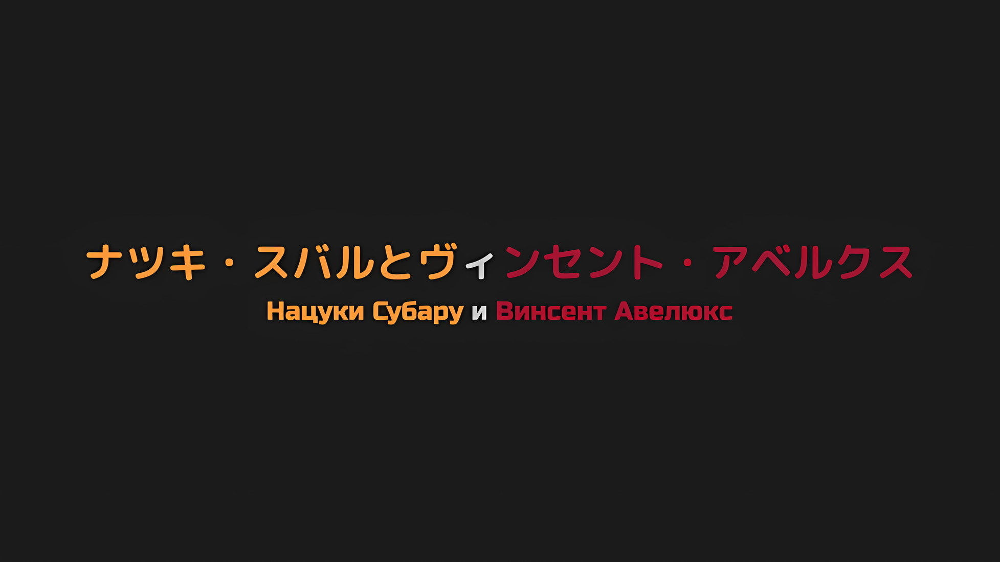
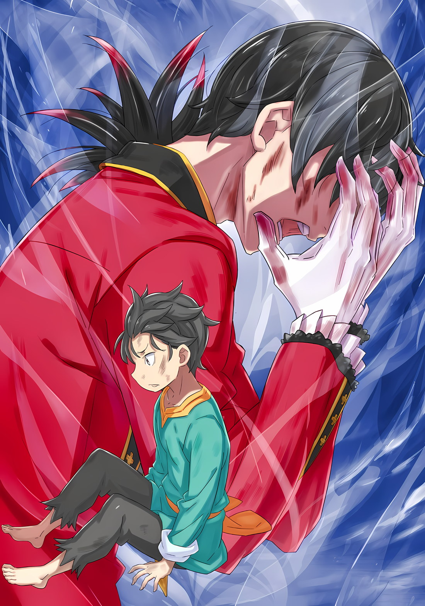

*※※※※※※※※※※※*

В тот момент, когда он нанес этот удар, его больше всего расстроило то, что он стал меньше.

Даже больше, чем трагедия на Острове Гладиаторов, для предотвращения которой он объединил всех; даже больше, чем «Спарка», с помощью которой он склонил Густава на свою сторону; даже больше, чем его диалог с Сесилусом под луной; в этот самый момент его расстроило то, что он мог бы ударить его чуть сильнее, будь у него более крупное тело.

Винсент: Ты…!

Получив удар кулаком по левой щеке от юного Субару, Император, чье лицо было испачкано кровью, расширил глаза.

Его взгляд был устремлен на собственные ноги, глядя на Субару, который неудачно приземлился, рухнув на пол. Однако, хотя его лицо и отражало шок, на нем не было возмущения. Его удивление было сильнее, чем унижение, которое он испытывал.

Император, получив от кулака Субару больше шока, чем боли, прижал руку к месту нанесенной атаки,

Винсент: Неужели тебе не дорога твоя жизнь!? Если бы я поднял руку, Пламя «Меча Света» опалило бы само твое существо…

Субару: Да, она мне не дорога! По сравнению с тем, чтобы просто позволить тебе уйти, не дав по щам прямо здесь и сейчас, что-то вроде сгорания заживо не так уж и страшно!

Винсент: Что…

Получив хмурый взгляд от Императора, Субару вскочил на ноги и твердо ответил.

В этот момент, когда усталость еще оставалась в его теле, он потерял равновесие и упал навзничь, ударившись об дверь, но это было как раз кстати. Прислонившись к двери, Субару раскинул руки, тем самым преградив Императору путь.

То, что он не дорожил собственной жизнью, было откровенной ложью.

Но в этом противостоянии «око за око» он не хотел выказывать даже и намека на слабость.

Этот Император без обиняков выкладывал все, что хотел донести, поэтому, будь то кулаки или слова, Субару не будет удовлетворен, пока не откроет ответный огонь.

Субару: Все именно так, как вы, ребята, говорите. Я думаю, меня нельзя понять. В конце концов, даже я сам не очень понимаю, каковы мои критерии для принятия мер.

Винсент: …«Вы, ребята», говоришь?

Прикусив губу, Император нахмурился, когда Субару пристально смотрел на него.

Опустив руку со щеки, его лицо было осквернено кровью, сочащейся из руки Субару, Император был в недоумении от факта, что заявление Субару было направлено сразу на несколько целей, возможно, оно было адресовано кому-то помимо него самого.

Однако, сколько бы он ни размышлял над этим, он никак не мог понять. Человек перед глазами Субару был Императором, в то время как другой был не более чем солдатом без офицерского звания.

И все же раны, которые оба нанесли Субару, шрамы, на которые они оба указали, были одними и теми же.

Субару: Я хочу расставить приоритеты в отношении людей, которые мне нравятся, людей, которыми я дорожу, и защитить их. Это мои искренние чувства. Но, даже если это кто-то, кого я ненавижу, или кто-то, кого я не знаю, и он подвергается опасности прямо у меня на глазах, тогда я…

Тодд сказал, что Субару будет выбирать, кого спасать, основываясь на своих субъективных симпатиях и антипатиях.

Авель сказал, что Субару будет безрассудно выбирать, кого спасать, не взирая на свои симпатии или антипатии.

И то, и другое верно, а поскольку и то, и другое верно, то оба варианта ошибочны.

В конце концов…,

Субару: Но… неужели это действительно так плохо…?

Винсент: Что?

Субару: Неужели это так плохо? Без решимости пытаться взвалить весь мир на свою спину и без всякого великого значения, неужели это действительно так плохо, если я импульсивно спасаю тех, кто находится прямо передо мной!?

Когда Субару повысил голос, яростно топая ногами, Император расширил свои черные глаза.

Несмотря на то, что Субару все еще находился в нехарактерной для него быстрой смене выражений и манер поведения, он все же потребовал от него ответа.

Субару: Все именно так, как ты и сказал! Я рассматриваю вещи в пределах своего собственного кругозора, я тянусь так далеко, как только могу, это то, что я делаю и по сей день. Что в этом такого плохого!?

Винсент: Теперь ты смеешь возражать!? Что такого плохого, ты говоришь? Разве это не очевидно!? По какой причине ты не придаешь значения общей картине, а действуешь в соответствии со своими эгоистичными эмоциями? Полномочие, данное тебе, по какой причине ты не используешь его с пользой!?

Субару: Я использую абсолютно все! Я стою здесь потому, что использую все, что в моих силах! Не поддаваться эмоциям, хах!? Перестань говорить как идиот! То, как я буду использовать свои собственные эмоции, зависит только от меня!

Винсент: Тогда хотя бы действуй в соответствии с этими эмоциями! Если ты должен решать чью-то жизнь или смерть, основываясь на своих симпатиях и антипатиях, то ни в коем случае отклоняйся от этого метода. Твой образ бытия изобилует искажениями.

Субару: Если это твой вывод из того, что я веду добросовестную жизнь, то я полностью за то, чтобы у меня была искаженная личность!

Поскольку Император все еще продолжал упрекать Субару за его поведение, тот в ответ нанес мощный удар ногой. Снова и снова пиная голень Императора, его гнев, который невозможно было сдержать, вырвался наружу в полной мере.

Пока Субару обрушивал удары, заряженные его неистовством, Император исказил свои щеки, и,

Винсент: Этот разговор не имеет смысла.

С этими словами он попытался прервать этот разговор в одностороннем порядке. Он снова сделал это в одностороннем порядке.

Пытаясь таким образом оставить позади пропасть между их представлениями о ценностях, он схватил Субару за плечи. Обладая физической силой ребенка, он не мог противостоять Императору, который попытался сдвинуть его с дороги.

Поэтому Субару изо всех сил укусил его за руку.

Винсент: …Хк, ты!

Субару: *Перештань быть эгоиштом!*

Кусая без удержу, он оставил царапины и следы своих зубов на правой руке Императора. Его правая кровоточила, когда он с силой разжал ее, вместе с левой, на которой была рана от ножа, обе руки Императора сочились кровью.

Пролив кровь великой и благородной верхушки Империи, Субару не сможет избежать смертной казни.

Субару: Это произойдет только в том случае, если страна все еще будет существовать, тупой идиот!

Винсент: Что ты… гх!!!

В тот момент, когда его стряхнули, маленький Субару обхватил Императора спереди, прижал его голову к своему животу и скосил колени. Этому боевому приему он научился у Вайца, который разработал его сам.

Продолжая применять учение Вайца, он занял позицию верхом и добился доминирования по правилам уличного боя.

Когда Император упал на спину, усевшись ему на грудь, чтобы придавить его своим весом, Субару схватил его за воротник и ударил об пол. Если бы кого-то били по затылку снова и снова, независимо от того, кто это был, он был бы мгновенно нокаутирован.

Однако…,

Винсент: Не увлекайся!

В первый раз — шок; во второй раз — замешательство; в третий раз, хотя ему и удалось прижать затылок к земле, его остановила простая разница в силе. Более того, он был сброшен с тела Императора, когда его схватили за волосы.

Вскрикнув «Гхааааарх!», когда он рухнул на пол, Субару периферийным зрением увидел, как Император встал на ноги, и снова попытался направиться к двери.

Субару: Как будто я тебе позволю!

Прыгнув на колени Императора сзади, он с помощью чистой силы остановил движение тела к двери. Однако из-за чрезмерного импульса Субару, Император был опрокинут вперед.

Результат…,

Винсент: Ух.

Затем, с глухим стуком, Император врезался лицом в дверь каюты.

Винсент: …

Раздался твердый звук, звук того, как он приложил ладони к двери, к которой было прижато его лицо, и таким образом Император снова поднялся на ноги, после того как упал лицом вниз. Затем, повернувшись, Император схватил Субару обеими руками за шиворот и приподнял его.

Тела обоих крутанулись, чтобы поменяться местами, Субару ударился спиной об дверь, оказавшись прижатым к ней с силой, и издал «Ах» от боли.

На его глазах нос и лоб Императора покраснели; он в упор смотрел на Субару, ноги которого были подвешены.

Винсент: Ты, чего ты хочешь? Какова твоя цель? Чего ты желаешь!?

Субару: Я хочу врезать тебе! Моя цель — врезать тебе! Мое желание — врезать тебе!

Винсент: Ты…!

Субару: А что насчет тебя, чего ты хочешь? Какова твоя цель? Чего, черт возьми, ты желаешь!?

Винсент: …

Пойманный за воротник, вцепившийся в руки Императора, Субару брызнул слюной, когда закричал в ответ.

Затем, повернув голову, он открыл рот, в попытке еще раз укусить Императора за руку, но, как бы он ни старался, ему не удавалось дотянуться до нее. По крайней мере, слюна скапливалась на руке Императора, когда он плевался.

Таким образом, когда его рука была испачкана слюной Субару, щека Императора напряглась по причине, не связанной с этим позором; он пробормотал.

Винсент: Мое желание…?

Субару: Верно. Должно же быть что-то, что ты хотел сделать, кроме как извергать в мой адрес высокопарные и бессмысленные слова. В противном случае, ты бы не стал приходить ко мне в такое напряженное время.

Винсент: …

Субару: Разве ты не тот, кто больше всех не понимает себя? Во время нашего разговора было что-то, во что ты вложил больше всего энергии, что-то, во что ты вложил больше всего эмоций. Это то, что для тебя важнее всего.

Тема эвакуации из столицы Империи или тема подозрений, что Субару — «Звездочет». От темы общения с Эмилией и остальными, которые прибыли из Королевства, к теме разногласий, проистекающего из неспособности понять образ жизни Субару.

Теперь, когда он подумал об этом, не было никаких слов, выражающих сочувствие к Субару после его выздоровления и после потери сознания; во-первых, этот ублюдок ничего не сказал о том, что это была их первая встреча после Города Демонов.

Но если оставить в стороне все эти многочисленные дела, то одна тема, которой он был увлечен больше всего, была очевидна.

Субару: …Чиша.

Винсент: …Почему, Нацуки Субару.

Жар, который вспыхнул незадолго до этого во время их схватки, исчез, однако, на его место пришел холодный жар, жар, разожженный этим вопросом, произнесенным еще раз.

Если то, что сопровождало насилие, было алым пламенем, то этот вопрос сопровождался пламенем лазурного оттенка.

Это лазурное пламя, пылающее в его глазах, опаляло Субару, когда он стоял перед Императором, который задал свой вопрос.

Винсент: Я был тем, кто обучал его. Если бы это был он, он бы смог выполнить ту же работу, что и я, без малейших отклонений. Можно даже сказать, что он превосходил меня в военной мощи, если исходить из определенных обстоятельств.

Субару: …

Винсент: Не было никакой разницы между моими способностями и способностями Чиши. Кто бы из нас ни остался, он бы взял на себя борьбу против «Великого Бедствия», доведя ее до конца. …Почему.

Глядя прямо в черные глаза Субару, Император… Нет, черные глаза Авеля дрогнули.

Маска Императора, которую он, вероятно, носил вместе с решимостью никогда больше ее не снимать, была сорвана с него вскоре после того, как он так закалил себя. И вот, Субару взглянул на лицо Авеля.

И, наконец, не как Император этой страны, а как одинокий человек, потерявший кого-то дорогого, Авель не мог не задать Субару вопрос.

Винсент: Почему, несмотря на ненависть ко **мне**, ты позволил **мне** жить, а Чише умереть, Нацуки Субару?

Разобравшись в том, что он хотел спросить у Субару, Авель задал ему тот же вопрос, что и до их потасовки.

Печаль, хрупкость, звучащие в этом голосе, были несравнимы с тем, что было до этого.

Император, известный как Винсент Волакия, использовал абсолютно все, что было в его распоряжении, на благо Империи.

Управляя великой страной, которая обладала самыми обширными землями среди тех, что известны в этом мире как Четыре Великие Страны, Винсент Волакия правил как Император, вездесущий и всевидящий.

То, что Император, известный как Винсент Волакия, задал этот вопрос не ради Империи, а скорее как простой человек, было свидетельством того, что этот единственный вопрос имел вес, сравнимый с весом самой Империи.

Почувствовав это своей кожей, кровью, мозгом, душой, сердце Субару затрепетало.

В то же время, в отличие от всплеска эмоций Авеля, эмоции Субару были спокойными.

Субару: …

Почему человек, известный как Чиша, должен был умереть?

Без ведома Субару, Авель и Чиша были помещены на разные чаши весов, и одна из этих двух сторон оказалась в ситуации, не подлежащей спасению.

Таким образом, Авель намеревался разделить судьбу весов, когда его собственная чаша склонилась к гибели.

Это видение было закрашено. …Скорее всего, самим покойным Чишей.

…Авель, вероятно, уже давно готовился к собственной смерти.

Если человек родился, то когда-нибудь его жизнь обязательно подойдет к концу. Об этом знали все. Но ситуация Авеля совершенно не походила на ту реальность, которую все бессознательно игнорировали.

Решимость идти навстречу неминуемой смерти ничем не отличалась от того, как Субару противостоял спусковому крючку своего «Посмертного Возвращения».

Авель всегда готовился к собственной смерти, которая рано или поздно наступит.

С той же решимостью, что и Субару, который боролся до конца, веря, что приход «Смерти» можно изменить, что это то, что должно быть изменено, несмотря ни на что, Авель продолжал бороться.

Если бы Субару ушел, не погибнув, Эмилия, Рем и Беатрис в конечном итоге умерли бы.

Отто и все остальные, Танза и все остальные, Судрак, Флоп и Медиум, огромное количество людей в конечном итоге умерли бы. В обмен на свою собственную жизнь он пытался позволить всем выжить.

Если он пришел сюда, чтобы вложить всю свою решимость в достижение этой цели, то, должно быть, то же самое произошло и с Авелем.

Винсент: Я завершил все приготовления с этой целью. Но даже так…

Эмилия, Рем и Беатрис — все они заняли место Субару, позволив ему выжить.

Чтобы Субару мог жить, Отто и все остальные, Танза и все остальные, Судрак, Флоп и Медиум, огромное количество других людей стали жертвами, чтобы он мог выжить.

Даже если никто другой не был способен понять это отчаяние, Нацуки Субару был единственным человеком, который должен был помнить об этом.

Сводя на нет эту возможность, закрашивая эту реальность с помощью своего Полномочия, Нацуки Субару был единственным человеком, который не стал бы отрицать отчаяние, через которое проходил Авель, не обращая на это никакого внимания.

Глотнув воздуха, он понял, что должен сказать еще кое-что в дополнение.

Субару: …Я не «Звездочет», Авель.

Винсент: …

Слова, которые он произнес, вероятно, показались Авелю предательством на таком позднем этапе игры.

На этом позднем этапе игры Субару не ответил на желание Авеля, оставив его при себе. Но, как бы сильно Авель ни подозревал Субару, реальность не менялась.

Возможно, Субару был способен делать то же самое, что и «Звездочет».

Возможно, Субару обладал средствами, позволяющими вмешиваться в судьбу в большей степени, чем возможности самого «Звездочета».

Но даже в этом случае он не был всемогущим. Он никогда не сможет стать всемогущим.

Было бы хорошо, если бы он стал всемогущим, но он никогда не сможет быть достаточно всемогущим.

Субару: Вот почему я не смог спасти этого человека, Чишу, о котором ты говоришь. Я бы тоже не знал, как его спасти. Но я просто скажу кое-что…

Винсент: …Что именно.

Субару: …Предположим, у меня действительно была бы сила, подобная той, о которой ты говоришь, даже тогда я предпочел бы спасти тебя, которого я ненавижу, а не того, кого я не знаю. Без таких причин, как предвидение будущего, я бы поступил именно так. Это то, что я сделаю.

Воистину, даже он сам считал свою натуру беспомощной.

Но именно к такому результату пришел Нацуки Субару, опираясь на способности, которыми он обладал, в пределах того, что он понимал как сферу своих собственных возможностей.

Винсент: …

Медленно сила покидала хватку Авеля за воротник, и тело Субару освободилось.

Пока его спина ткнулась в дверь, тело Субару соскользнуло вниз. Даже сейчас руки Авеля держались за воротник Субару, но пальцы, белые от вложенной в них силы, теперь потеряли свой бледный оттенок вместе с упомянутой силой.

Если бы он действительно хотел убрать эти руки, он мог бы легко это сделать; однако Субару этого не сделал.

Поскольку они все еще держали его воротник, Субару просто назвал его имя: «Авель»…

Винсент: Если ты утверждаешь, что не являешься «Звездочетом»…

Таков был слабый звук, сорвавшийся с губ Авеля.

Но сам Авель не был удовлетворен звуком, который он издал, и не стал продолжать. Его черные глаза начали блуждать в поисках слов, которых он действительно желал.

Он хотел выразить свои эмоции словами.

Возможно, Император Империи, который до сих пор ни разу не совершал ничего подобного, который ни разу не делал того, на что был способен даже младенец, теперь сделает это.

Винсент: Ты… попытался бы спасти **меня**, несмотря ни на что…

Субару: …

Винсент: В ситуации, когда на кону стоит выживание Империи, ты занимаешь меня такими незначительными пустяками…

Субару: …

Винсент: Я… Я! С тех пор, как я увидел твой образ жизни…

Субару: …

Каждый раз его слова застревали на полпути.

Независимо от слов, независимо от эмоций, их было недостаточно, чтобы выразить то, что Авель чувствовал в глубине души. Неоднократно Авель замолкал, пересматривал свои слова и исправлял себя, но Субару не торопил его.

Винсент: Ты… ненавидишь **меня**, считаешь **меня** врагом…

Понимая, что отклик на его желания не выходит за рамки его запинающихся слов, Авель начинал слова, которые он должен был произносить заново, снова и снова.

Он, известный как самый мудрый Император с момента основания Империи Волакия, человек, чью мудрость уважали все, делал это.

И вот, после повторений за повторениями, ему, наконец, удалось это сделать.

Винсент: Я…

Субару: …

Винсент: Я… решился на **свою** смерть… Я не решился… потерять кого-то дорогого.

Он лишь выковал свою решимость быть тем, кто оставит остальных позади, но она не была культивирована.

Возможно, он даже и не задумывался о том, какие слова оставит после себя в последние минуты своей жизни. Существовала даже вероятность того, что кое-где можно было бы найти записки, оставленные после его смерти, если бы они порылись.

Все было сделано ради того, чтобы доверить дело тем, кто продолжит его, с решимостью, которая даже не рассматривала возможность того, что он окажется на стороне, которой доверяют.

Винсент: Почему?

Дрожащим голосом спросил он.

Говоря дрожащим голосом, Авель оторвал свои руки от воротника Субару. Эти руки, его собственные, очень окровавленные руки, он поднес их к своему лицу, скрывая свое выражение.

Император, который ни за что бы не сомкнул оба глаза в присутствии других, закрыл лицо обеими руками.

Винсент: Почему ты оставил **меня** и умер, Чиша……!?

Винсент Волакия упал на колени, уткнувшись лицом в руки, его голос дрожал, а из черных глаз, возможно, даже навернулись слезы.

Потеряв очень, очень важного человека, мужчина, у которого, вероятно, не было времени даже погоревать, не имея необходимости надевать маску Императора перед грубым и неуважительным существом, которого он ненавидел, упал на колени.

Став свидетелем этого, Субару сделал очень долгий и невероятно глубокий вдох…,

Субару: …Мне жаль.

С этими словами, как человек, борющийся с неразумной судьбой, он предстал перед человеком, который был ранен, но искренне продолжал бороться, и произнес слова, которые никогда не смогут служить утешением.

*△▼△▼△▼△*

Когда он замахнулся на попытавшегося уйти Авеля, Субару вспомнил, как Отто однажды ударил его подобным образом.

Субару: Ты невероятен. Я никогда не смогу быть таким умным, как ты… Хотя я никогда не скажу такого ему в лицо.

Поскольку он чувствовал себя смущенным и раздраженным, он действительно не хотел так прямо заявлять об этом этому человеку.

Самое большее, о чем он был готов подумать, — это о том, что однажды, когда Отто будет умирать от старости, он сядет на край его кровати и скажет: «Честно говоря, я считаю тебя невероятным». Если бы он действительно пошел на это, он верил, что Отто, даже в свои предсмертные минуты, ответит: «Тогда почему ты молчал об этом до сих пор!?».

Как бы то ни было…,

Субару: …

С глухим стуком Авель прислонился спиной к стене каюты, усевшись на пол, и стал наблюдать за тусклым интерьером комнаты, обняв одно из своих коленей.

Субару тоже рассеянно наслаждался тишиной, сидя рядом с ним со скрещенными ногами.

С самого начала истинными переживаниями Субару, несомненно, были чувства благодарности к Отто, наряду с желанием немного поиздеваться над ним.

Некоторое время назад, когда Субару был на грани того, чтобы согнуться под тяжестью попыток нести все и вся в одиночку, Отто ударил Субару по щеке, обрушив на него слова, которые ему нужно было услышать.

Что он напускал на себя бесполезный вид перед своими друзьями, так ему сказали. …Этот опыт придал Субару смелости вскочить с кровати.

Но опять же…,

Субару: Не то чтобы мы с тобой друзья или что-то в этом роде.

Винсент: …Конечно. Не говори о таких отвратительных вещах. Быть твоим другом… Нет, я просто не нуждаюсь в таких друзьях как ты. И они мне никогда не понадобятся.

Субару: Значит, ты рассуждаешь не о том, что не можешь завести друзей, а о том, что не хочешь их заводить? Я тоже так делал, когда притворялся гордым волком-одиночкой, но для окружающих это совершенно очевидно.

Винсент: Твое неуважение не знает границ, не так ли?

Сидя рядом друг с другом, но не глядя друг на друга, Субару и Авель обменивались словами.

Больше не было горячих эмоций от их потасовки, но, с другой стороны, они не исчезли настолько, чтобы прервать разговор на полпути, и они не могли изображать вежливость.

Лицо, одежда и руки Субару были повсюду окрашены кровью.

Разумеется, лицо, волосы и одежда Авеля тоже были перепачканы кровью.

Внутри каюты простыни были испачканы кровью, а нож валялся на полу. Тут и там виднелись пятна разбрызганной крови, повсюду были следы повреждений.

Количество крови было недостаточным для того, чтобы назвать это помещение местом убийства, но достаточным, чтобы оно выглядело как место преступления.

Субару: Но, даже если мы будем метаться, мы никогда не сможем разрушить всю каюту. Вот каков наш с тобой индивидуальный предел, твой и мой.

Даже когда Субару и Авель впали в безудержное буйство, самое большее, что они смогли сделать, — это поломать мебель.

Если бы в буйстве участвовали действительно опасные люди, живущие в этом мире, каюта была бы разрушена в мгновение ока, и от нее не осталось бы и следа. Сколько бы времени понадобилось Эмилии, с ее очаровательным лицом и руками, чтобы восхитительно демонтировать эту каюту?

Субару: Даже если мы с тобой бросимся друг на друга, в этом не будет ничего такого восхитительного.

Винсент: …В чем твоя проблема?

Субару: А как насчет тебя, в чем, черт возьми, твоя проблема? Вот что я тебе скажу, твоя история чертовски запутана, я даже не могу понять, о чем ты хочешь поговорить.

Винсент: …

Авель молчал и размышлял.

Причина, по которой он придержал язык, скорее всего, заключалась в том, что он был осведомлен о том, насколько разрозненными были темы. Это было результатом того, что он затыкал уши от призывов о своих истинных намерениях и выбирал только те темы, которые были ему приятны на слух и хорошо лились; с тех пор как он был на взводе, не было ни одной темы, которая была бы искренней.

Такова была суть речи Авеля до этого момента, и теперь он тоже осознал свое упущение.

Следовательно, Субару ждал, чтобы увидеть, как он оправится от всего этого…,

Винсент: Нацуки Субару, это правда, что ты не «Звездочет»?

Субару: …Это правда. Я не «Звездочет» или что-то в этом роде. Такие вещи, как предчувствия будущего, больше подходят к Культу Ведьмы, чем ко мне. Я не очень-то дружу с этими ребятами.

Винсент: Я слышал, что вы убили двух Архиепископов Греха в Лугунике.

Субару: Это не разглашается, но на самом деле их уже трое. «Чревоугодие» тоже… Нет, довольно сложно сказать, побеждено «Чревоугодие» или нет, так что забудь об этом. Ситуация с Луи тоже… АА!

Винсент: Что такое?

Субару: Ты ведь ничего не делал Луи, верно? В конце концов, я все еще не простил тебя за тот раз, когда ты сказал, что Луи должна быть убита.

В Городе Демонов Хаосфлейм твердая позиция Авеля по отношению к Луи послужила причиной того, что Субару отделился от него и остальных, став действовать независимо.

Когда стало известно, что она является Архиепископом Греха, Авель заявил, что ее не потерпят.

Исходя из этого, Субару двинулся отдельно от Авеля и остальной части их группы; он и Луи изолированно и без посторонней помощи направились к замку Йорны…,

Субару: Несмотря на то, что произошло до сих пор, я все равно тебя не прощу.

Винсент: Не говори глупостей. Хотя, разве не ты был тем, кто искренне ненавидел эту девушку?

Субару: Раньше — это раньше, сейчас — это сейчас. Начнем с того, что если бы ты сохранил свое впечатление обо мне с нашей первой встречи, ты бы усомнился в моем здравомыслии, учитывая, с кем я общаюсь.

Винсент: В твоем здравомыслии я сомневался еще со времен Племени Судрак. …Твое беспокойство излишне.

Субару: Ха?

Винсент: Этой девушке не было причинено никакого вреда. В конце концов, то, что я пытался тогда сказать, заключалось не в том, что мы должны казнить на месте того, чья личность, очевидно, была Архиепископом Греха.

Субару: Что…!?

Винсент: Ты сделал поспешный вывод. Усердно поразмышляй над этим.

Получив ответ о том, что его беспокойство было излишним, Субару растерялся, не находя слов. Но, даже если предположить, что это была правда, холодное и безразличное отношение Авеля отчасти стало причиной того, что он сделал столь поспешный вывод.

Суммирование отношения Авеля к происходящему до этого момента привело к его тогдашнему недоверию.

Субару: Это… было проблемой твоего отношения…

Винсент: Это было необходимо. На случай того, если ты когда-нибудь захочешь сохранить мне жизнь.

Субару: …

Винсент: Все, включая это, основывалось на предположении, что ты был «Звездочетом». Ты, продолжающий добиваться результатов, невиданных в Королевстве, совершил подвиги, на которые не способен обычный человек.

Субару: Это…

Винсент: Хотя, мне не было необходимости из кожи вон лезть, чтобы ухудшить твое впечатление обо мне. Даже если бы я не вел себя так, ты тот тип людей, которые будут ненавидеть **меня** больше всего. Отвращение и презрение — они оба изливаются из твоего сердца.

Субару: ТЫ! ЧЕРТОВ! УБЛЮДОК…!

Будь то ложь, правда, хорошее или плохое, слова Авеля заставили вены вздуться на лбу Субару.

Но по мере того, как он выяснял свои с ним отношения, ступая по тонкому льду, Авель вступил в контакт с Субару в психическом состоянии, сродни хождению по натянутому канату.

С Субару на льду и Авелем, идущим по натянутому канату, никакое взаимодействие подобного рода никогда не могло бы протекать гладко.

В конце концов, каждый из них шел, глядя на собственные ноги, а не на лицо другого.

Субару: …Я ничего не знаю о Чише. Он выгнал тебя с трона и превратил себя в тебя, притворяясь Императором. Я встретил его только в Хаосфлейме, когда он выдавал себя за Императора.

Винсент: …

Субару: Я не могу понять, о чем думал этот человек, и что он замышлял, выгнав тебя из дворца. Но ты так расстроился потому что он умер, и если он действительно умер, когда должен был умереть ты, то я понимаю это. Поэтому…

Сбивчиво Субару рассказал о том, что думает.

Поскольку у них было негласное соглашение не встречаться взглядами, Субару не мог увидеть выражение лица Авеля, когда он произносил эти слова. Это было немного пугающе.

Этот человек был тем, кого Авель оплакивал до такой степени, что не мог сохранить душевное равновесие.

Что касается Субару, то, говоря об этом человеке, ничего о нем не зная, его замечания, возможно, могли бы слишком сильно ранить сердце Авеля.

Но, подумал он.

Даже если это было не так давно, будучи втянутым в ситуацию, которая касалась выживания нации, будучи полностью манипулируемым этим человеком, назвавшимся Авелем, Субару подумал.

Субару: Этот Чиша, он, конечно, был невероятен.

Хотя, возможно, это и было неуместно, но, подняв лицо, он издал энергичный голос.

Это не было насильственной попыткой скрасить обстановку, это была похвала, похвала, переполнявшая сердце Субару.

В действительности, сколько таких было на самом деле? Сколько было людей способных предать предсказания человека, известного как самый мудрый Император с момента основания Империи Волакия, который формировал почти все до последней детали исключительно в рамках своего собственного разума, который ценил, чтобы все происходило в соответствии с его ожиданиями; сколько было людей, способных пойти против этого, и выполнить свои собственные цели таким впечатляющим образом?

Одного этого было более чем достаточно, чтобы заслужить восхищение Субару.

Более того, он проявил себя до такой степени, что Авель, оставленный позади, остался в нерешительности и разочаровании. Он не знал, соответствовало ли это возложенным на него ожиданиям.

Субару: Ты сказал, что нет большой разницы, кто останется позади — ты или этот человек. Если это правда, то есть только одна причина, по которой этот человек создал такую ситуацию.

Винсент: …Ты.

Субару говорил так, как думал, и, не поворачиваясь к нему лицом, Авель издал приглушенный голос.

Он не был уверен, присутствовал ли в этом голосе гнев или нет, особенно потому, что он обошелся без словесных нападок на Субару в привычной для последнего манере,

Винсент: Ты, ты хочешь сказать, что понял? Причину, по которой Чиша устроил против **меня** заговор?

Действительно, это было скорее нечто, побудившее Субару озвучить вывод, к которому он пришел.

Винсент: …

Авель желал получить ответ.

Ответ, который не мог придумать даже его собственный умный мозг. Чтобы нечто подобное прозвучало из уст Субару, который даже не знал человека, известного как Чиша, даже если у Авеля не было никаких ожиданий, он стал ожидать.

Он не мог не думать об этих ожиданиях как о дополнительном давлении, но,

Субару: Что ж, не важно, что ты обо мне будешь думать, мы зашли уже так далеко…

Как только он встал в знак протеста, не осталось причин колебаться в том, чтобы говорить именно то, что он думал.

Причина, по которой Чиша оставил позади не себя, а Авеля, пришла Субару в голову.

Это была…,

Субару: Когда судьба захотела убить тебя, ты смирился с тем, что противник — это судьба. Должно быть, это его рассердило.

Винсент: …А?

Субару: Есть еще такая черта, как желание, чтобы кто-то жил даже за счет твоей собственной жизни. Но я не думаю, что это тот случай. В конце концов, то, как ты живешь, не заставит никого делать для тебя ничего подобного.

Он мог понять чувство, когда кто-то может хотеть, чтобы другой человек жил, даже если это означает, что сам он умрет.

Но для того, чтобы зародить подобное чувство, нужно думать о другом человеке как о дорогом, а для этого нужна причина, которая заставит его так думать.

Готовясь к собственной неминуемой смерти, отчаянно пытаясь проложить путь ради тех, кто продолжит его дело, Авель не мог допустить, чтобы кто-то думал о нем подобным образом.

Поэтому ответ Субару был таков.

Субару: Чиша рассердился из-за тебя. В конце концов, он даже доказал это.

Винсент: Доказал это, говоришь? Доказал что? …Доказал, что против **меня** был устроен заговор и что я был глупцом?

Субару: Флоп-сан и Мизельда-сан, наверное, тоже поняли, что ты болван с хорошей головой. Я имею в виду… предел досягаемости вещи, известной как судьба.

Винсент: Судьба…

Словно впервые произнося это слово, язык Авеля познакомился с этим незнакомым понятием, пробормотав его.

На самом деле, для Авеля, который противостоял всему лоб в лоб и бесконечно сопротивлялся, будучи вооруженным своими предсказаниями, все препятствия были вербализуемы. Скорее всего, он и не подозревал, что его противником является нечто столь абсурдное, столь бесформенное, как «Cудьба».

Но, вне всяких сомнений, противником, перед которым Авель бессознательно смирился с поражением, была судьба.

В то же время Чиша доказал это, пожертвовав собственной жизнью и позволив Авелю жить.

Субару: С судьбой можно бороться. …Нет никаких причин сдаваться, ни единой.

Винсент: …

Затаив дыхание, Авель молчал, словно слова, сказанные ему, поразили его в самое сердце.

Если бы он не считал своего врага «Судьбой», то, скорее всего, ему бы и в голову не пришло сопротивляться или бороться с ней. Он бы даже не задумывался об этом.

Однако, если бы он узнал, кем именно был этот «Враг», что могло бы произойти?

Если бы он, самый мудрый Император с момента основания Империи Волакия, узнал бы истинную сущность своего «Врага», что бы он сделал?

Субару: …Авель, я не «Звездочет».

Винсент: …

Субару: Но…

Рядом с Авелем, который хранил молчание, заговорил Субару, положив руки на колени своих скрещенных ног.

Когда его обвинили, он отрицал это, но его снова обвиняли. После отрицания его обвинили, и он снова стал отрицать.

Хотя объяснить или подтвердить вопрос собственного Полномочия, вопрос «Посмертного Возвращения», было тем, что он был не в состоянии сделать, Субару также решил кое-что в своем сердце во время этого диалога.

Это что-то было тем, что должно было стать его вероятным ответом Тодду Фангу, который словами полностью загнал его в угол, лишив возможности ответить в четких формулировках перед разлукой.

Субару: Я спасу столько людей, сколько смогу, пока они находятся в пределах досягаемости моей руки. Тем не менее, если все же есть жизни, которые я не в состоянии спасти, это…

Винсент: …Поражение, нанесенное тебе судьбой, разве не так?

Субару: …Я не могу добиться полной победы. В конце концов, не только я борюсь с судьбой.

Он не сможет спасти все.

Таким образом, Субару не смог заявить, что он собирается спасти все, даже начиная с этого момента.

Взывая к этой неизбежной судьбе, чтобы она свершилась, клянясь продолжать бороться с судьбой, но все еще сталкиваясь с гибелью людей, Нацуки Субару скорбел и причитал, только чтобы затем продолжать заявлять о подобных вещах.

И таким образом, ради уменьшения шансов на то, что он будет оплакивать, ради уменьшения шансов на то, что он будет проливать слезы…

Субару: Одолжи мне свою силу, Авель. Если ты это сделаешь, я также одолжу тебе свою.

Винсент: …

Субару: С этого момента я буду сотрудничать в полном объеме…! При этом я не буду говорить эгоистичные вещи, не посоветовавшись с Эмилией и остальными, но такова уж моя страсть. Вот почему…

Сказав это, Субару решительно хлопнул себя по коленям и встал.

Затем, не глядя на Авеля, он медленно направился в середину каюты, к краю кровати. Бросив боковой взгляд на растрепанные и испачканные кровью простыни, Субару запустил руку в корзинку с фруктами.

Внутри лежало аблоко, которое Авель бросил после того, как разделил его пополам. На поперечном срезе белые внутренности стали светло-коричневыми от воздействия воздуха, но, не обращая на это внимания, Субару поднял дольки.

Затем…,

Субару: Помоги мне доесть аблоко, которое ты разрезал пополам.

Бросив половинку аблока Авелю, он впился зубами в ту дольку, которую держал в руках.

С приятным звуком сладкий сок фрукта медленно наполнил его рот, и Субару посмотрел на лицо Авеля, все еще сидящего на полу.

Поймав брошенное ему аблоко, Авель опустил к нему глаза и после секундного колебания откусил кусочек.

С таким же приятным звуком кисло-сладкий вкус заполнил его рот.

Понравилось ли оно ему или не понравилось, возненавидел он его или полюбил, было совершенно не связано с этим вкусом.

Как и у других живых существ, у них не было никакой разницы во вкусе аблока, которое они ели вместе.

Винсент: Нацуки Субару.

Субару: В чем дело?

Винсент: Ты мне не нравишься.

Субару: Нгх.

Винсент: …Но мне нужна твоя сила.

Заявив это, Авель медленно встал. С полусъеденным аблоком в руке, он устремил свои черные глаза на Субару.

В очередной раз он скрыл все оттенки нехарактерных эмоций, которые он проявлял в каюте, за своим сознанием Императора; однако, пока они все еще проявлялись в его глазах и голосе, хоть и очень слабо,

Винсент: Прими мои извинения за многочисленные грубости. О Рыцарь Королевства.

С этими словами, увидев, как Император Священной Империи Волакия склонил голову, Субару улыбнулся.

Улыбаясь и откусывая то, что осталось от аблока,

Субару: Я не буду извиняться за свои многочисленные неуважительные поступки, Император Империи.

И с этим был сделан первый шаг к исправлению несоответствий в их отношениях, которые были ошибочными с самого их начала.
