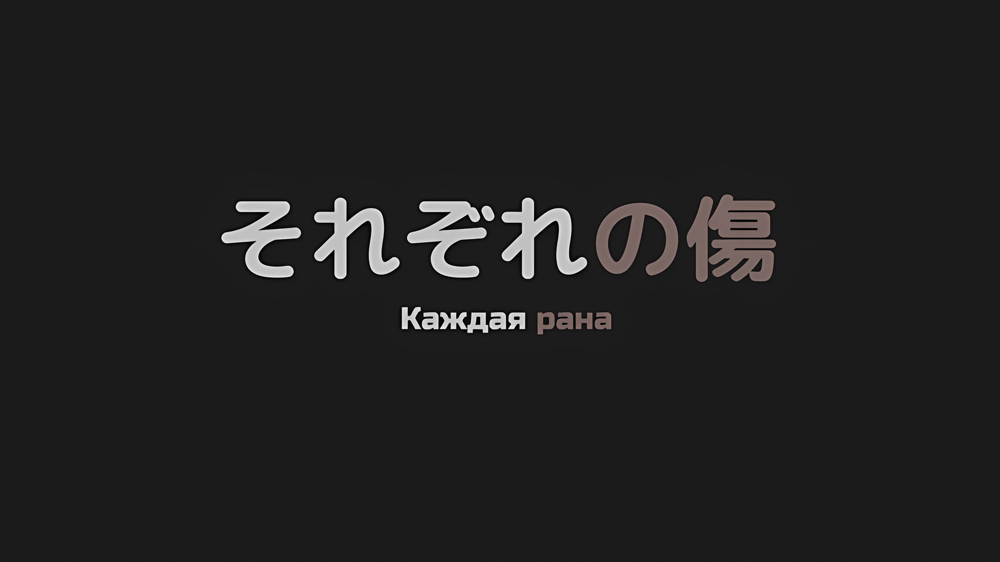

*※※※※※※※※※※※*

???: …Ты тоже пришла, Рем.

Рем тихонько подняла голову, когда чей-то голос окликнул ее сбоку.

У сцепки соединенных драконьих повозок, сребровласая девушка открыла дверь соседней повозки и окликнула Рем, которая прислонилась спиной к стене… это была Эмилия.

У нее было красивое лицо с мягким взглядом, а за руку ее держала девушка. Это была Беатрис, которая бросилась к Субару во время хаоса в столице Империи.

Это было трогательное зрелище, но чувства Рем к ним были крайне сложными.

Конечно, отчасти это было связано с тем, что эти девушки были связаны с потерянными «Воспоминаниями» Рем, о которых она сама ничего не знала, но это была не единственная причина.

В отличие от Рам, которая, как она инстинктивно знала, была ее сестрой, и других людей, называвших себя ее спутниками, эти двое были особенными. …Их особенностью было то, что они глубоко связаны с Субару.

Обе они чувствовали особенно сильную связь с ним во время ситуации вокруг столицы Империи, во время отступления и впоследствии, когда они навещали Субару, пока он был без сознания.

Рем не знала, почему это ее так сильно беспокоило…

Рем: Эмилия-сан и Беатрис-чан…

Беатрис: Я полагаю, Рем тоже обеспокоена тем, куда движется дискуссия.

Рем: Обеспокоена… Да, точно, обеспокоена.

На вопрос Беатрис, которая обратилась к ней по имени, Рем слегка опустила глаза.

Рем стояла в пустом проходе, чтобы наблюдать за каютой, расположенной на небольшом расстоянии… каютой, отведенной Нацуки Субару в качестве спального помещения.

Субару и Авель сейчас находились лицом к лицу в тихой каюте после того, как большая толпа посетителей разошлась.

У Авеля было мрачное лицо, и когда его видели, он часто надевал маску О́ни, так что Рем было приятно увидеть его истинное лицо.

Однако, насколько знала Рем, Авель всегда хмурился, когда снимал маску. Но сегодня его и без того мрачное лицо выглядело еще более суровым, чем раньше.

Эмилия: Рем, ты ведь уже давно общаешься с Субару и Авелем… э-э, Императором Винсентом, не так ли? Они хорошие друзья?

Рем: Я не привыкла называть его Императором Винсентом. И у меня не сложилось впечатления, что эти двое очень дружны друг с другом. Я бы сказала, что, хотя они и приходили к согласию по некоторым идеям, они не ладят…

Эмилия: Ах, я так и думала…

Беатрис: Ну, в самом деле, это было предсказуемо. Образ мышления Авеля для Субару подобен сочетанию масла и воды, я полагаю. Бетти предпочитает сентиментальный образ мыслей Субару, в самом деле.

Эмилия: Боже, Беатрис так быстро начинает питать симпатию к Субару. Ты должна как следует выслушать версию Авеля… Гм, версию Императора Винсента!

Плечи Эмилии поникли от ответа Рем, но ее губы надулись при последующем утверждении Беатрис.

На глазах у Рем, которой показалось, что выражение ее лица меняется от мгновения к мгновению, Эмилия добавила удивленное «Ах» и посмотрела на нее.

Эмилия: Ох, и, Рем, поскольку мы в Волакии, ты должна называть меня Эмили…

Рем: …Эм, а в этом есть какой-то смысл?

Эмилия: Ну, конечно, есть. Никто ведь не думает, что я Эмилия. Верно, Беатрис?

Беатрис: Поскольку Бетти также питает симпатию к Эмилии, я полагаю, что не отвечать в данном случае — это проявление доброты.

Эмилия: Хах!? Что это значит!?

Глаза Эмилии расширились от такого доброжелательного отношения Беатрис, когда она взяла ее за руку.

Рем ощущала, что ее чувства находятся во власти этих двоих, поскольку она видела их трудноразрешимое взаимодействие, но вскоре она полюбила Эмилию и Беатрис.

Во-первых, если то, что она слышала, было правдой, они многим рисковали, приехав в эту страну на поиски Рем и Субару. Они никак не могли ей не понравиться.

Рем: В отличие от него, в них нет ничего подозрительного.

От Субару исходил запах, который внушал яростную, инстинктивную тревогу. Если враждебность Рем во многом объяснялась именно этим, то в Эмилии и остальных не было и следа этого.

Так что, как и в случае с Луи, «Племенем Судрак», Флопом и другими, не было никаких причин огрызаться на них.

Хотя…,

Рем: …Запах этого человека, внезапно ставший слабее, тоже пугает.

Она беспокоилась о Субару, который потерял свой сильный запах за то время, пока они были разлучены.

Поскольку она не знала, что именно это такое, а между существующим и несуществующим определенно лучше, чтобы его не было, она хотела сказать, что ситуация улучшилась.

И, пока она размышляла над этим,

???: Хаах? Это Рем-чан, Эмили-чан и Беатрис-чан!

Дверь повозки, стоящей на противоположной стороне от того места, где стояли Рем и остальные, открылась, и появившаяся вторая сторона громким голосом назвала имена всех троих.

Энергично размахивая руками, к ним направилась высокая женщина… ее длинные золотистые волосы были свободно уложены, кожа обнажена, как у танцовщицы, и, самое главное, у нее были вполне взрослые руки и ноги, соответствующие ее возрасту.

Это была…,

???: …Медиум-сан.

Медиум: Йа-ху! Возможно, вы тоже беспокоитесь об Авеле-чин и Субару-чине?

Эмилия: Да, верно. Медиум-чан тоже?

Медиум: Да, да! Видишь, у меня наконец-то снова большое тело, не так ли? Теперь, в отличие от того времени, когда я была маленькой, я могу остановить драку взрослых, так что я подумала, что могу быть полезной.

Выпятив грудь, Медиум ответила именно так… они не видели ее долгое время, но, как и Субару, она была одной из тех, чья внешность превратилась из взрослой в детскую.

Маленькая Медиум была очень милой, сохранив свой живой характер, но ее очарование оставалось неизменным независимо от длины ее рук и ног, поэтому знакомая фигура успокоила Рем.

Похоже, что Медиум была очень расстроена, когда стала маленькой, и, казалось, сейчас она наслаждалась своим возвращением к большому телу настолько, насколько это было возможно.

В любом случае…,

Рем: Остановить драку… то есть, между тем человеком и Авелем-сан?

Медиум: Это так~? Прошло много времени с тех пор, как эти двое разговаривали как следует, не собираются ли они впасть в ярость?

Рем: Не знаю… Если не брать в расчет того человека, я не могу представить себе Авеля-сан впавшего в бешенство.

С суровым лицом и резким голосом, у нее сложилось впечатление, что Авель был тем, кто говорил болезненные вещи.

Однако, в отличие от Рем, которая нахмурилась из-за опасений Медиум, мнения Эмилии и Беатрис, похоже, были ближе к стороне Медиум,

Беатрис: Бетти, в самом деле, согласна с Медиум. По крайней мере, Субару есть что сказать этому Императору, так что он, я полагаю, на него огрызнется.

Эмилия: Это правда. Я, Эмили, тоже немного волнуюсь. Драка — это не только нанесение ударов друг другу, но и причинение боли словами.

Рем: …Так ли это?

Конечно, это не будет потасовкой, поскольку не было никаких признаков того, что Авель поднимет на него руку, но вполне возможно, что Субару может стать эмоциональным, и спор усилится.

Поскольку Авель был рациональным, Рем чувствовала, что он обходит Субару сравнительно чаще, но сейчас у него может не быть большой свободы действий. Она не обменялась множеством слов с Авелем, который вновь стал Императором, но она могла понять беспокойство Медиум и Беатрис.

И это предположение сразу же подтвердилось.

Субару: …Готов? Так или иначе, мы проберемся к Гарфиэлю. Я уверен, что он поймет наши неизбежные обстоятельства.

Винсент: Скандал о том, как Рыцарь Королевства поднял руку на Императора Империи?

Субару: Не забывай, если дело дойдет до суда, я расскажу обо всем, что ты затеял, в крайнем случае…!

Наконец, дверь каюты открылась, пока они продолжали тихий обмен мнениями.

Взгляды тех людей из группы Рем, кто ждал окончания дискуссии, встретились с черными глазами двух мужчин, когда они выглянули, чтобы посмотреть, есть ли кто-нибудь в проходе.

Субару открыл рот, воскликнув «Ах», в то время как Авель нахмурился, издав «Агх».

Однако это была не вся реакция группы Рем, когда они увидели состояние этих двоих. В конце концов, и Субару, и Авель, показавшие свои лица, были в крови.

Рем: Невероятно…

Медиум: Вы двое поссорились гораздо сильнее, чем я думала!?

Эмилия: О, о нет! Беатрис! Быстрее, вылечи его…

Беатрис: Я же говорила, в самом деле! Бетти должна была там присутствовать, я полагаю!!!

Субару и Авель столкнулись взглядами с группой девушек, которые встретили их в суматохе. Затем Авель вздохнул, а Субару поднял руки в знак покорности.

После этого,

Субару: Эм, вы определенно разозлитесь, так что, прежде чем это произойдет, я должен сказать вам… Мы помирились.

С кривой улыбкой на своем жалком лице он сказал это так, как будто у него были, по крайней мере, какие-то хорошие новости.

*△▼△▼△▼△*

…В конце концов, их ранами оказались лишь небольшие порезы на руках, ничего впечатляющего.

Медиум: Но в каюте сейчас беспорядок, и… У нас нет другой каюты, которую мы могли бы подготовить.

Субару: Нет, я не собираюсь говорить тебе что-то настолько важное, как подготовить другую каюту. Я серьезно задумался над тем, что я… Ах! Медиум-сан! Ты снова в норме!

Медиум: Хехе~, верно, Субару-чин! Ах, нет, так не годится! Я рада, что ты это сказал, но я также зла на тебя. Вы двое безнадежны~.

Сказав это, Медиум положила руки на талию и отругала Субару за его неудачную попытку сменить тему разговора.

Плечи Субару опустились в раскаянии; однако, вместо подавленного Субару, именно Авель, с которым он подрался, получил главный удар от Медиум.

Медиум: Авель-чин, пока Субару-чин маленький, ты не можешь вести себя незрело, ясно?

Винсент: …Ты, ты понимаешь, что ты только что сделала? Ты подняла руку на Императора.

Медиум: Потому что ты такой великий и все такое, и никто никогда не ругал тебя, Авель-чин, ты ведь вырос таким, не так ли?

Винсент: …

Авель нахмурился и скрестил руки, а Медиум тем временем бросила на него укоризненный взгляд. Как вы могли понять из произошедшей сейчас перепалки, Медиум, неожиданно для всех, наотмашь шлепнула Авеля по голове.

Глядя на катастрофическое состояние каюты, вполне резонно было бы отругать Авеля за драку с молодо выглядящим Субару, но Рем была поражена этим абсурдным поступком.

Рем: Если Медиум-сан не против, можно я тоже его ударю?

Винсент: Не присоединяйся к ней. В настоящее время у меня нет возможности по отдельности рассматривать каждый случай неуважения. Не делай того, из-за чего после войны мне придется потратить время, чтобы решить, стоит ли наказывать тебя, сопоставляя это с твоими достижениями.

Рем: Как жаль.

Конечно, она не ожидала получить разрешение, но для Рем было полезно услышать «после войны» из уст Авеля.

По крайней мере, Авель смотрел в будущее. Хотя она не знала, что было сказано во время их разговора внутри, по сравнению с тем, что было до того, как он посетил эту каюту, ей показалось, что свет и цвет в его глазах улучшились.

Эмилия: …Ладно, это хорошо. Но тебе нужно переодеться, иначе все будут беспокоиться, ты можешь пойти повидаться со всеми после того, как оденешься должным образом, ясно?

Беатрис: Воистину, от тебя столько хлопот, в самом деле. Я полагаю, ты не можешь позволить Бетти обрести хоть какой-то душевный покой.

Субару: Простите, простите. Но прошло уже много времени, это кажется таким необычным. Некоторое время единственными людьми, которые беспокоились обо мне, были, за исключением Танзы, только мужчины.

Вытерев кровь с лица и рук Субару полотенцем, которое было у нее с собой, Эмилия погладила его по голове.

Беатрис, протянув руки и пытаясь залечить его раны, пожала плечами, похоже, испытывая не только чувство облегчения, но и чувство радости.

Казалось, они обе были счастливы, что заботятся о Субару.

Глядя на это, Рем почему-то почувствовала, как у нее защемило в груди.

Медиум: Эй, эй, Авель-чин, как думаешь, ты справишься?

Не заметив того, что произошло в сердце Рем, Медиум наклонила голову, задавая Авелю этот вопрос.

Авель прищурил свои черные глаза в ответ на ее вопрос, а через мгновение кивнул головой.

Винсент: Нет никаких проблем. На самом деле, глупо показывать на меня пальцем и спрашивать, могу ли я усердно трудиться. С тех пор как я решил, что займу трон Империи, я потерял право действовать бессистемно.

Медиум: …? Значит ли это, что ты собираешься продолжать усердно трудиться в качестве Императора?

Винсент: …Это глупый способ выразить это, но, грубо говоря, да.

Медиум: Понятно! Тогда я тоже согласна! Давай работать вместе~!

Лицо Медиум внезапно просветлело, и она протянула свою руку в сторону Авеля. Он посмотрел на ее руку и отвернулся.

В ответ на холодное отношение Авеля, Медиум отстранила руку и хлопнула в ладоши.

Медиум: Может, тогда пойдем к остальным? Братуха тоже хотел поговорить с Авелем-чин.

Винсент: У меня нет времени на разговор с этой вещью, но летающий драконий корабль Серены Дракрой тоже должен скоро вернуться. В любом случае, сейчас мне нужно поговорить с главными действующими лицами.

Рем: …Ах, пожалуйста, подождите.

По настоянию Медиум Авель задрал подбородок.

Авель, который любил быстро улаживать дела, знал, что с этого момента должны состояться важные дискуссии, чтобы обсудить, как справиться с проблемами, возникшими в столице Империи.

Естественно, уже было решено, что Субару и Эмилия будут присутствовать, но перед этим Рем должна была сказать кое-что важное.

Первая половина причины, по которой Рем стояла там, заключалась в ее беспокойстве по поводу запутанных отношений между Субару и Авелем, но вторая половина была вызвана именно этим.

Субару: Авель, у меня тоже есть кое-что, что я хочу сделать, прежде чем встречусь со всеми… кое-что, что я просто обязан сделать. Так что позволь мне сначала сделать это.

Рем: Ах…

Прервав обмен мнениями, Рем попыталась рассказать им о причине своего визита. Однако Субару остановил ее, когда начал говорить, обратив свой пристальный взгляд в ее сторону.

Этот взгляд дал ей понять, что то, что он просто обязан был сделать, было тем же самым, что пыталась сказать Рем. Поэтому она поджала губы и кивнула.

И тогда…,

Субару: …Рем, отведи меня к Кате-сан.

*△▼△▼△▼△*

???: Что за херня, сопляк? Тебе тут не рады.

Войдя в намеченную каюту, глаза Субару расширились, когда его поприветствовал вульгарный голос.

За открытой дверью стоял человек с грубым голосом, который соответствовал его лицу с повязкой на глазу… на мгновение ему было трудно открыть ящик своей памяти, но потом его осенило.

Субару: Джамал… верно?

Джамал: А? Откуда ты знаешь мое имя? Я тебя не знаю.

Субару: Ты жив…

Джамал: Разве ты не чертовски грубый маленький сопляк, а!?

Мужчину, открывшего рот с неожиданно чистым набором зубов и издавшего горловой рык, звали Джамал.

Когда Субару занесло в Империю Волакия, он был одним из первых имперцев, с которыми он столкнулся… и именно этот человек был товарищем Тодда Фанга.

Насколько Субару знал, это было в Городе-крепости Гуарал, когда Тодд помог сбежать Генералу Первого Класса, ранее попавшему в плен, где его должны были схватить как военнопленного оставшиеся в тылу охранники.

После этого, из-за того, что Субару пришлось многое пережить, его безопасность, честно говоря, вылетела у него из головы.

Субару: Почему ты в этой каюте?

Джамал: Что странного в том, что я нахожусь в каюте своей младшей сестры?

Субару: Младшей сестры… ах.

Услышав, как его подозрения тают из-за ответа, Субару вспомнил.

Это напомнило ему, что Тодд упомянул, что его невеста была младшей сестрой Джамала. Значит, люди, стоящие перед ним, Джамал и Катя, были родными братом и сестрой.

Хрупкая Катя и грозно-отвязный Джамал были родными братом и сестрой.

Субару: Ну, и цвет ваших волос, и их пушистость похожи…?

Джамал: Я не улавливаю, о чем ты говоришь, но я понимаю, что ты меня бесишь. Сопляк, если ты не хочешь, чтобы тебе причинили боль, ты должен…

??? …Старший брат! Прекрати!

Возможно, раздраженный отношением Субару, Джамал закатал рукава и сделал жест, пытаясь выгнать его силой. Но прежде чем он успел это сделать, пронзительный голос сзади призвал его остановиться.

Заглянув в каюту со стороны Джамала, можно было увидеть, что ее планировка была похожа на ту, в которой спал Субару, а на кровати в дальнем конце помещения лежала девушка.

Этой девушкой была…,

Субару: Катя-сан.

Катя: Ты, ты наконец-то проснулся… Ты, ты слишком много спал. Серьезно, серьезно…

Катя посмотрела на Субару, который стоял напротив ее брата, и тот увидел, что она приподнялась на кровати. Затем Джамал быстро подошел к ней и сказал: «Ой, ой».

Джамал: Спокойнее! Двигайся аккуратнее, а то помрешь еще.

Катя: Не такая уж я и хрупкая! Не сравнивай меня с братом, который не умер, даже когда должен был умереть…

Джамал: Начнем с того что я не сдох, но вы, черти, все равно эгоистично похоронили меня…!

Джамал, наотрез отвергший заботу и теперь заклейменный как покойник, слегка вздрогнул.

Казалось, многое произошло во время воссоединения этих братьев и сестер, но Субару не собирался в это углубляться. У него была другая причина для визита.

Рем: …Ты в порядке?

Субару слегка опустил взгляд и увидел, что его ноги не очень далеко сдвинулись от входа в каюту, и именно поэтому Рем, которая была с ним, спросила об этом.

Извинившись перед Эмилией, Авелем и остальными, Субару зашел в эту каюту вместе с Рем.

Как подруга Кати, Рем имела все основания присутствовать здесь. …Только потому, что она тоже хотела услышать, что Субару будет делать дальше.

Субару: Да, я в порядке.

Кивнув, Субару вошел в каюту.

На кровати Катя и Джамал все еще о чем-то спорили, но, когда Субару пришел с Рем, Катя была единственной, кто закрыл рот.

Как и прежде, она держала свои голубые глаза, обрамленные длинными ресницами, опущенными вниз,

Катя: …Твоему телу уже лучше?

Даже если это была лишь прелюдия к основной теме, ее забота о теле Субару была доброй.

Ее тон был резким и грубым, но не было никаких сомнений в том, что в душе она была прекрасной девушкой, и именно поэтому она сблизилась с ненадежной Рем.

Этой девушке Субару должен был все рассказать.

Субару: Да, все хорошо. Спасибо, что побеспокоились обо мне.

Катя: …Я не побеспокоилась или что-то в этом роде. Просто эта девушка казалась встревоженной.

Субару: …

Субару взглянул на Рем, которая стояла рядом с ним, выражение ее лица было жестким.

Примерно зная, о чем пойдет речь, он не стал слишком остро реагировать на слова Кати, как обычно.

Хотя это было то, чего он ожидал, Субару упрекнул себя в собственной слабости, которая заставляла его откладывать главную тему. Сделав глубокий вдох, он выдохнул.

И затем…,

Субару: Прости. Я не смог вернуть Тодда.

Да, он сообщил ей о необратимом расколе между ним и Тоддом в столице Империи.

Катя: ……

Охваченный горем, Субару открыл жестокую правду, крепко сжав свой маленький кулак.

В конце битвы в столице Империи, несмотря на то, что Тодд помог им прорваться через осаду зомби, их столкновение было практически неизбежным.

Субару решил не убивать Тодда, человека, который ненавидел и презирал образ мыслей Субару и был полон решимости избавиться от него, и они столкнулись лицом к лицу друг с другом.

Но в конце концов…,

Субару: Эм, его унесло наводнением, которое хлынуло на город, и больше ничего…

Катя: …Ох.

Субару: Просто в борьбе с зомби он действовал как приманка и получил много ранений. Вот почему…

Во время доклада Субару раздался хриплый выдох Кати. Как бы перекрывая этот вздох, Субару описал Кате то, что он видел, но не так, как он это видел.

Если бы Субару захотел, он мог бы дать Кате надежду.

Реальность была такова, что в последний раз, когда Субару видел Тодда, тот был поглощен тем мутным течением и исчез. Если его тело не было найдено, то можно было бы дать ей надежду на его выживание.

Но Субару не стал этого делать.

Субару: …

В последний раз Субару видел Тодда, когда его фигура была поглощена потоком.

Однако подробное описание было упущено. Если быть точным, то в последний раз Субару видел Тодда, когда тот был в форме оборотня, которого поглотили мутные воды в результате глубокого удара топором в грудь.

…Он был тяжело ранен, без сознания, и его поглотило мутное течение. Он не мог избежать вреда.

Джамал: ……Кх.

Услышав рассказ Субару, Джамал крепко стиснул зубы, и эхо разнеслось по всей каюте.

Для Джамала Тодд был его товарищем и, более того, будущим шурином, которому он решил доверить свою сестру Катю.

Это было ужасно странное чувство, но, если это возможно, Субару также хотел надеяться, что Тодд выжил.

Поскольку его ожидания были серьезно обмануты, их отношения стали мишенью для его жизни, и в мире, где Субару фактически Посмертно Возвратился, Тодд был противником, который неоднократно лишал его жизни.

Однако, поскольку у него был опыт общения с Тоддом во многих случаях, он все понял.

Тодд был обычным человеком без каких-либо особых способностей. Тот факт, что он был оборотнем, не был преимуществом, которое могло бы переломить эту опасную для жизни ситуацию.

В беспомощной ситуации, когда Субару бы погиб, Тодд тоже лишился бы своей жизни.

Тодд Фанг, он был поглощен этим наводнением и погиб.

Как человек, который, в конце концов, был самым близким свидетелем последнего момента его жизни, Субару пришел к такому выводу.

Субару: …

В каюте воцарилась тишина.

Постепенно тишина, казалось, обожгла ему лоб и затылок. Ему предстояло жить с душевной болью; это было то, что он решил взять на себя сам.

И вот, через некоторое время, когда он продолжал испытывать ощущение, что его кожу жжет…,

Катя: …Ты, ты не увидел решающую часть этого, не так ли? Тогда, может быть, он не умер?

Ее голос, прерывающийся и трещащий, заставил Субару посмотреть вверх.

Не только Субару, но и Рем с Джамалом, все смотрели на Катю. Она теребила свои волосы, ее голубые глаза подрагивали.

Катя: Что, что если ты знаешь? Если ты видел, как Тодду проломили голову, или разрезали его тело пополам, или сожгли дотла, или что-то подобное, знаешь? Если ты это видел, ты мог бы так подумать, да, но…

Рем: Катя-сан…

Катя: Но видишь ли, он очень, очень цепляется за свою жизнь. К тому же, когда мы расставались, он сказал мне, что скоро вернется… Определенно, вернется ко мне… Он никогда бы не солгал. Даже когда он сказал мне, что мой брат умер! Он просто оговорился, вот и все!

Рем: Катя-сан!

Повысив голос, Катя начала рвать на себе волосы. Вид этого заставил Рем окликнуть ее, и она села на кровать, чтобы удержать ее голову.

Прижимая голову Кати к своей груди, Рем гладила ее по спине.

Рем: Медленно, дыши медленно. Я здесь, рядом с тобой…

Катя: Ты, ты ошибаешься… он бы не стал… так просто… верно? Верно, Рем?

Рем: Катя-сан…

Крупные слезы потекли из глаз Кати, намочив одежду Рем, когда она обнимала ее. Не обращая на это внимания, Рем продолжала гладить спину своей рыдающей подруги.

Сердце Субару сильно разрывалось от искренней реакции Кати.

Он понял.

Что Кате будет больно, если рассказать ей о Тодде. Это были очень, очень сложные отношения, но чувства Тодда к Кате, скорее всего, были искренними. Катя тоже очень дорожила Тоддом. Вот почему были эти слезы.

Вот почему Субару не упомянул более жестокую правду.

Это было то, о чем Рем даже и не подозревала. …Именно Рем прикончила Тодда, превратившегося в оборотня, топором.

Чтобы защитить Субару, Рем покончила с Тоддом.

Поскольку Тодд в то время был в своей форме оборотня, и поскольку он отменил свое звериное обличье только после того, как погрузился в воду, Рем не знала об этом факте. Более того, Субару не собирался просвещать ее на этот счет.

Субару не верил, что правда имеет здесь какую-либо ценность.

Тодд любил Катю, а Катя любила его в ответ. Вот что имело значение. Не было причин уничтожать эти воспоминания и зацикливаться на том, что произошло на самом деле.

Субару: Тодд действительно заботился о Кате-сан. До самого конца.

Это был единственный мотив без всякой лжи, который Нацуки Субару, цель грубого убийственного намерения Тодда Фанга, мог передать Кате Орели.

Катя: …Хк.

Катя, всхлипывая, обхватила руками спину Рем, когда та обнимала ее, и было видно, как ее ногти сильно впиваются в спину Рем. Это было больно, но она молча терпела.

В каюте, наполненной рыданиями, Рем взглянула на Субару и покачала головой.

Этим жестом Рем выразила желание оставить Катю ей, а также благодарность Субару, который пришел подготовленным к такому исходу.

Джамал: …Прости, что заставил тебя играть такую неприятную роль, сопляк.

Джамал сказал это Субару, когда они выходили из каюты, оставив Рем и Катю позади.

Когда Субару поднял бровь на удивительно прямолинейные слова Джамала, тот мрачно сморщил нос, сказав: «Я знаю».

Джамал: Информировать семью погибшего это тяжелая роль. Неважно, насколько героически и отважно погиб человек, все равно найдутся те, кому захочется поныть.

Субару: …А как насчет тебя?

Джамал: А?

Субару: Ведь для тебя Тодд — твой товарищ, жених твоей сестры, и он — кто-то особенный, верно?

С искаженными щеками Джамал размышлял над вопросом Субару.

После минутного молчания он коснулся пальцем повязки, закрывавшей его правый глаз,

Джамал: Я не знаю. Если бы этот ублюдок выжил, я бы посмеялся над тем, что мы оба не смогли сдохнуть, но этот шаг полностью отпал. Что ж, если он погиб в бою, значит, он выполнил свою работу имперского солдата. Даже если он жестоко высмеивал это.

Субару: …

Когда он сказал это, Джамал тихонько фыркнул и рассмеялся над последней частью.

Субару не мог сказать, был ли это смех при мысли о нехарактерном конце Тодда, или это был смех, основанный на каком-то имперском стиле, которого Субару не понимал.

Как бы то ни было, Субару не чувствовал, что может смеяться над чьей-то смертью.

Джамал: Это просто.

На глазах у Субару, который размышлял об этом, Джамал внезапно продолжил.

Субару широко раскрыл глаза от тона его голоса. Ибо в голосе Джамала звучал не гнев или одиночество, а нечто более похожее на предвкушение.

И это впечатление оказалось верным. Джамал продолжил,

Джамал: Я не думаю, что этот сукин сын умер бы так просто. По крайней мере, я не видел как он умер.

Субару: Это… Ой.

Джамал: Заткнись, сопляк. Независимо от того, что я думаю, это надежда для Кати.

Палец Джамала щелкнул Субару по лбу, когда тот собирался непроизвольно возразить. Заставив его замолчать, Джамал дернул подбородком в сторону двери позади себя.

Субару не мог понять, была ли надежда, о которой говорил Джамал, радужной или суровой. Однако он понимал, что не имеет права вмешиваться.

Только те, кого пригласили и кому разрешили участвовать в жизни Кати и Тодда, имели право вмешиваться в их чувства… Субару не обладал достаточной квалификацией для этого.

Джамал: Черт, для парня, который ненавидел драться, у него был довольно вспыльчивый настрой. И из-за этого он пересек гораздо более опасную черту, чем я.

Глядя в потолок коридора, Джамал высказал эту критику в адрес Тодда.

Несмотря на то, что Джамал не показывал своего лица и его голос дрожал, Субару все еще не был квалифицирован, чтобы указать на это.

*△▼△▼△▼△*

???: Здраааавстуй~, Субару-кун, ты хорошо выглядишь, не так лииии~? Ты помолодел, интересно, это благодаря еде Империи?

Субару: Удивительно. Единственный человек, который мог бы так безвкусно пошутить, увидев меня в таком состоянии, — это Розвааль.

Розвааль: О боже, никто другой не был достаточно спокоен, чтобы сделать это, веееерно~? Кстати, на данный момент в этом месте я ношу имя Дадли… С этого момента давай будем ладить, хорошо?

Его голубой глаз был закрыт, а желтый глаз подмигивал ему — выражение, которое Субару давно не видел… Субару расплылся в улыбке, столкнувшись лицом к лицу с Розваалем.

Как и ожидалось, Розвааль был невозмутим, глядя на уменьшившегося в размерах Субару, при этом он также решил не упоминать, что его стиль отличался от его обычного костюма клоуна. Это было немного досадно, это напоминало ему о том, как он менял тон голоса и намеренно ничего не объяснял.

После того, как Субару сообщил Кате о последних минутах жизни Тодда, он отправился в середину соединенных драконьих повозок к более просторной пассажирской повозке, которая была приготовлена для него.

Соединенные драконьи повозки… Согласно предварительным сведениям Субару, по своей структуре они были похожи на электрические и железнодорожные поезда, подобные которым можно было встретить только в Империи Волакия, которая была более плоской, чем большинство других стран.

Конечно, если говорить о том, у кого больше всего земных драконов, то это было Королевство Лугуника; поэтому он решил, что будет держать в уголке своего сознания мысль о том, что, вероятно, можно было бы создать нечто подобное, при условии, что он выберет подходящую местность.

Розвааль: Эта соединенная драконья повозка, осмелюсь сказать, что она является одним из секретов Империи. Насколько я слышал, она была изобретена одним из «Девяти Божественных Генералов», известных своей мудростью…

Субару: Я так и знал. Я никогда не видел ничего подобного в Королевстве… Если подумать, то мы действительно видели многое из внутренней работы Империи.

Розвааль: Хахаха, будет катастрофой, если нам не дадут вернуться только потому, что мы слишком часто заглядывали на темную сторону Империи. С этого момента, я думаю, будет разумно, если мы проведем некоторое время с закрытыми глазами.

Субару: Это тоже не повод для смеха…

Розвааль от души рассмеялся в знак согласия, когда Субару проворчал это. Подслушав их разговор, Отто изобразил встревоженное выражение лица.

Пассажирская повозка, о которой идет речь, представляла собой вагон-ресторан со множеством столиков, рассчитанных на то, чтобы вместить примерно двадцать человек. Однако все эти столы предназначались не для трапезы, а скорее для обсуждений, таких как собрания и военные советы.

На самом деле, Субару и Розвааль были там не единственными; было также много других лиц.

Конечно же, там были Эмилия и Беатрис, которые пришли сюда раньше и сидели за одним столом с Рам.

Рам бросила презрительный взгляд на Субару, который пришел один.

Рам: Маленький Барусик, что случилось с Рем? Разве ты не должен быть вместе с ней?

Субару: Тебе действительно не нужно использовать эту приставку… Прямо сейчас Рем с Катей-сан. Не думаю, что мы увидим ее лицо во время этого обсуждения.

Рам: …Ах, да.

Вздохнув, Рам не стала углубляться в ответ Субару.

Наконец-то Рам удалось познакомиться со своей младшей сестрой Рем, но, судя по всему, они не были так привязаны друг к другу, как думал Субару. С самого начала у него сложилось впечатление, что они очень близки друг с другом, поэтому он надеялся, что сестры будут постоянно держать друг друга за руки.

Рам: Рам и Рем — оба самостоятельные личности. Не надо навязывать нам свои эгоистичные чувства, маленький Барусик. Это отвратительно.

Субару: Не читай чужие мысли! Я не веду себя отвратительно!

Рам: Пока Рам не могла быть рядом, именно люди из окружения Рем поддерживали ее. Не думай принижать эти отношения. Бесстыжий, неразвитый Барусик.

Субару: Посмотрим, сколько времени тебе понадобится, чтобы использовать все вариации моего прозвища, старшая сестра…!

Пока его щеки дергались от различных слов и действий Рам, Субару глубоко вздохнул.

Рам была права; торопиться было бы бесполезно. Прежде всего, сестры успешно воссоединились, поэтому им не следует спешить, потихоньку продвигаясь вперед.

Беспокоиться было не о чем, так как между Рам и Рем существовала связь, которую никто не мог нарушить.

Он смог поверить в это по той атмосфере, которую ощущал, когда они вместе пришли навестить Субару.

Субару: Но, это все наши участники? А как насчет Петры, Фредерики и Гарфиэля?

Эмилия: Петра-чан и Фредерика заботятся о сражающихся солдатах. Гарфиэль тоже занят с ранеными.

Субару: Бои, они все еще продолжаются?

Эмилия: Да, продолжаются. Субару, я думаю, ты их много видел в столице Империи…

Что касается местонахождения пропавших членов группы, Эмилия немного замешкалась со своим ответом.

О том, что она собиралась сказать, Субару мог догадаться.

Субару: Зомби…

Отто: Ч-что это за странное название?

Субару: Мертвый человек, который может передвигаться. В моем родном городе мы называем их зомби. Я подумал, что будет лучше, если у них будет название, поэтому я именовал их так для удобства.

Отто: Не слишком ли много странных вещей происходит в твоем родном городе, Нацуки-сан?

Отто бросил укоризненный взгляд на Субару, чей рот искривился в улыбке.

В этом случае он задумался о том, стоит ли ему утверждать, что этот мир, в котором действительно появились зомби, был странным, или же его мир, в котором зомби были предметом стольких художественных произведений, но на самом деле не существовали, был более странным. Поистине непостижимый вопрос измерений.

Розвааль: Понятно, это неплохо, зомби. По крайней мере, мы можем не называть их «трупами солдат».

Затем Розвааль вклинился между разговором Субару и Отто.

Субару задумался над словами «трупы солдат», которые прозвучали из его уст.

Субару: Похоже, это напрямую связано с плохими воспоминаниями, да?

Розвааль: Это действительно так. Это одно из тех воспоминаний, которые я не хочу вспоминать.

Беатрис: Как и обсуждалось в столице Империи, можно с уверенностью сказать, что это результат «Таинства Бессмертного Короля», я полагаю. Согласно записям, совсем недавно оно использовалось во время гражданской войны в Королевстве.

Субару: Так вот почему это плохие воспоминания.

Встретив пристальный взгляд Субару, Розвааль неопределенно улыбнулся и отказался говорить что-либо еще.

Розвааль обладал глубокими знаниями о прошлом. Даже если бы он сам не участвовал в гражданской войне, у него все равно мог бы возникнуть неприятный опыт с «Таинством Бессмертного Короля».

Беатрис: Но, насколько известно Бетти, это тайное искусство должно быть очень нестабильным, я полагаю. Создать такое большое количество зомби и воспроизвести их так хорошо, это должно быть невозможно, в самом деле.

Субару: Но ведь они передвигались и разговаривали, так что для этого должна быть какая-то причина, верно?

Беатрис: …Бетти тоже чешет голову, я полагаю. Дадли, ты не должен бездельничать, в самом деле.

Розвааль: Боже, боже, мне обидно, что ты думаешь, что я бездельничаю. Поскольку это касается и меня, у меня нет причин срезать какие-либо углы. Кроме того, все ваши жизни также поставлены на карту.

Беатрис: Бетти не знает, насколько тебе можно доверять, я полагаю.

Розвааль: Я понимаю. Потому что твоя жизнь тоже поставлена на карту.

Беатрис: Да что ты вообще понимаешь, в самом деле! Ты просто шутишь еще больше, я полагаю!

Розвааль дал этот ответ, положив подбородок на сложенные руки, отчего лицо Беатрис покраснело, и она закричала на него.

Беатрис взорвалась от досады из-за его поддразнивания, но даже Субару не был уверен, о чем на самом деле думал Розвааль. Однако, поскольку Беатрис была партнером Субару, он опустил веко и высунул язык.

Эмилия: Ну, я не совсем уверена в деталях, но ничего, если я буду называть их «Зонби», как и Субару?

Отто: Я не вижу в этом никакой проблемы. Это короче, чем говорить «трупы солдат».

Субару: Этот способ заключения соглашения подобен Отто…

И вот так, на этом разговор Субару с остальными подошел к концу,

Беллстетз: …Ваше Превосходительство, согласно докладу, который я получил от Генерала Второго Класса Кафмы, они останутся в Тропиках Гайрахала, чтобы как можно больше присматривать за отставшими.

Гоз: Также, по сообщению Генерала Первого Класса Ольбарта, он использует тактику задержки с шиноби под его командованием! Однако, он сказал, что поскольку их противник не нуждается в пополнении запасов воды и продовольствия, то кажется, его возможности уменьшились примерно вдвое!

Винсент: Что касается Кафмы Ирулюкса и Ольбарта Данкелькена, скажите им, чтобы они продолжали свои операции, как и делали. Серена Дракрой, что с твоим летающим драконьим кораблем?

Серена: Еще не вернулся. Надеюсь, тот факт, что это занимает больше времени, чем ожидалось, не означает, что Укрепленный Город пал.

Винсент: …Если он выполняет ту цель, для которой был построен, Укрепленный Город не должен быть неподготовленным.

И вот, под звуки шагов и важных разговоров, Авель и трое его Императорских последователей… старик, крупный мужчина и красивая девушка — вошли в повозку.

Субару не знал ни одного из их имен.

Отто: Старик — премьер-министр Беллстетз Фондальфон, крупный мужчина — Генерал Первого Класса Гоз Ральфон, а эта девушка — Верховная Графиня Серена Дракрой.

Субару: Ты меня спас… Гоз — это, кажется, тот парень, которого схватили за то, что он помог Авелю сбежать.

Отто догадался о причине хмурого лица Субару и сделал свой комментарий… Среди имен, которые Субару слышал от него, было имя одного из «Девяти Божественных Генералов», чье выживание, как предполагалось, было под угрозой.

О нем говорили, что он мог бы считаться союзником, если бы выжил, поэтому он был искренне рад видеть его на стороне Авеля.

Винсент: Все здесь? Хорошо, тогда мы можем начать военный совет.

Субару: Эй, а как же Флоп-сан и остальные?

Винсент: Если бы была нехватка рабочей силы, как в Городе-крепости, это была бы совсем другая история, но, какую ценность для этого военного совета представляет добавление торговца?

Отто: Это правда. Интересно, почему я вообще здесь…?

Субару и Отто наклонили свои головы на слова Авеля.

Но причина, по которой Отто наклонил голову, не была известна в лагере Эмилии, включая Субару. Для Отто было вполне естественно присутствовать здесь.

Рам даже презрительно усмехнулась над ним, издав «Ха».

Субару: Таритта-сан, Мизельда-сан и остальные расположились в пассажирской повозке сзади; так что их не будет на этом обсуждении, верно?

Беллстетз: Да. Это то, что мы получили от «Племени Судрак». Они дали мне действительно обнадеживающий ответ, что когда придет время использовать свою власть, они сделают это в полную силу.

Гоз: Конечно, я никогда не думал, что у меня будет возможность стоять бок о бок с «Племенем Судрак», известным своей храбростью и отвагой! Если бы это не была борьба за выживание Империи, я был бы еще больше взволнован! Проклятье!

Винсент: Ты производишь слишком много шума. Держи рот закрытым.

Авель заткнул Гоза, заставив его сжать кулаки, которые были размером с голову ребенка, пока он сдерживал себя. Это было неучтивое замечание, но поскольку никто не обратил внимания, вероятно, это был обычный обмен мнениями между ними.

Во всяком случае, теперь он понял, почему Флоп и «Племя Судрак» не присутствовали.

Эмилия: Субару, твои друзья из Империи…

Субару: Я уже сказал всем в эскадроне, что буду выступать как их представитель. Эм, есть кое-что, что я хочу обсудить со всеми. Особенно с Беако.

Беатрис: С Бетти…? У меня не очень хорошее предчувствие по этому поводу, в самом деле.

Субару: Так, так, так.

В настоящее время он попросил своих товарищей из Эскадрона Плеяд воздержаться от участия в этой встрече.

В конце концов, Субару и Авель находились в одной каюте. Одно неверное слово, и Вайц мог бы напасть на Авеля в попытке передать трон Субару.

Ложь о том, что Субару был незаконнорожденным сыном Авеля… Винсента Волакии, что он был «Черноволосым Наследным Принцем», все еще продолжалась. В конечном счете ему нужно было решить и этот вопрос.

Субару: Хотя, было бы неплохо, если бы Танза была здесь…

Субару был единственным, кто присутствовал на собрании как член эскадрона. Ему было не по себе выпроваживать ее из каюты, так как она неважно выглядела.

Как и в тот раз, когда она навестила его, ему определенно придется поговорить с Танзой позже.

Субару: Кроме того, я не видел поблизости Луи…

Рам: Эта девочка с Медиум и Флопом. Кажется, у тебя к ней много чувств, но что ты собираешься с ней делать, Барусу?

Субару: …Мы можем поговорить об этом и позже.

Светло-малиновые глаза Рам сузились, и Субару почувствовал себя обязанным ответить.

Рам знала, что Луи присутствовала в Сторожевой Башне Плеяд прямо перед тем, как Субару и Рем были отправлены в Империю. Естественно, из уст Рам и Авеля истинная личность Луи должна была стать известна всем.

Тем не менее, она хотела бы знать, кто, наряду с каким трудом и стараниями, позволил ей оказаться на борту этой соединенной драконьей повозки.

Кроме того, им нужно было найти наилучший компромисс для Луи.

Винсент: Теперь, когда ты, наконец, все понял, мы начнем этот военный совет, Нацуки Субару.

Субару: Ты не забывай, что я держу в руках грандиозный скандал, ясно? То есть, вроде бы так, но не совсем.

Отношение Авеля внешне не изменилось, хотя он отчетливо помнил, как тот кротко склонил голову. Используя пренебрежительные слова по отношению к его поведению, Субару остановил его.

Тем не менее, был компаньон, передвижения которого еще не были подтверждены.

Это была…,

Субару: …А что насчет Присциллы? Она, должно быть, была в Гуарале, и разве она не была также в столице Империи? Кроме того, Танза упоминала Йорну.

Субару спросил это, как бы говоря «она должна была присутствовать», глядя на лицо Авеля.

Каким-то образом Присцилла и ее веселая группа компаньонов прибыли в Империю Волакия. Ал даже сопровождал его в Город Демонов Хаосфлейм, поэтому он был уверен, что они участвовали в битве за столицу Империи Рапгану.

Что касается Йорны, Субару и его группа получили информацию о том, что она присоединилась к повстанцам. Танза также почувствовала присутствие Йорны в столице Империи.

Естественно, такие лица должны находиться на борту соединенной драконьей повозки.

Говоря о лице, которого он не видел, он также не заметил и Сесилуса, но настроение этого человека было таким же, как и до того, как он покинул Остров Гладиаторов, поэтому он не беспокоился о нем…,

Субару: …Эй?

Однако, когда Субару спросил о них, Авель замолчал и закрыл один глаз.

Заподозрив неладное с его реакцией, Субару нахмурил брови и огляделся, чтобы увидеть, что не только у Авеля была такая реакция.

По какой-то причине никто ничего не говорил о передвижениях группы Присциллы.

Если бы Присцилла и остальные члены ее группы бессердечно вернулись в Королевство до осады столицы Империи, то Эмилия и остальные были бы удивлены, услышав ее имя.

Но это было не так. И ответом на это неловкое молчание было…,

Беатрис: …Субару, я полагаю, это держалось в секрете, чтобы не волновать тебя.

Субару: Беако?

Беатрис начала действовать прежде, чем он успел отреагировать, и сжала руку Субару. Его щеки напряглись от ее вступления.

Затем Эмилия переключила свое внимание на Субару, который неосознанно крепко держал Беатрис за руку,

Эмилия: Сохраняй спокойствие и послушай меня, Субару. Насчет Присциллы и Йорны-сан…

На мгновение она сделала паузу.

Эмилия продолжила то, что казалось затянувшимся ответом обеспокоенному Субару.

Этим было…,

Эмилия: Когда мы все вместе бежали из столицы Империи, мы не нашли этих двоих. …Но я хочу верить, что они в безопасности.

…Это было несомненным доказательством ран, нанесенных им во время осады столицы Империи.
