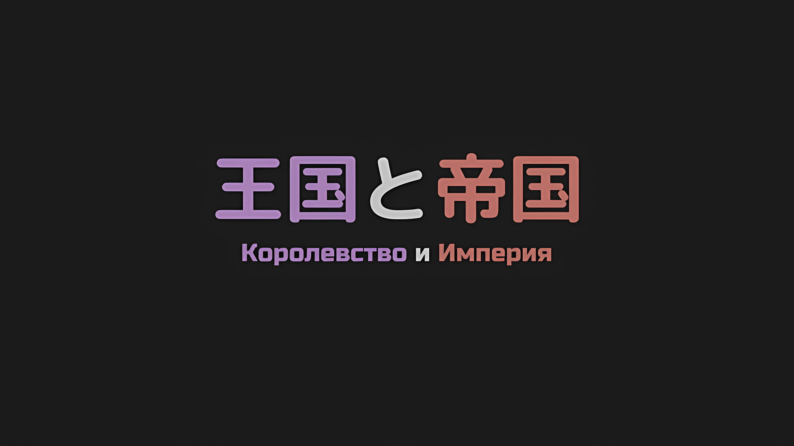
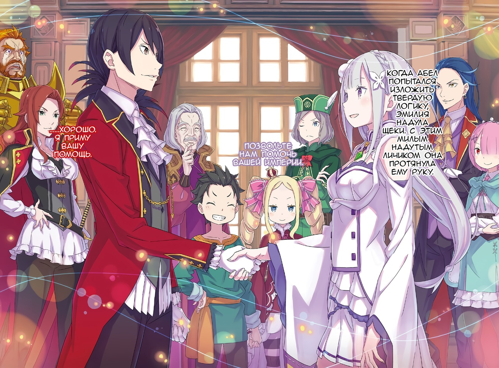
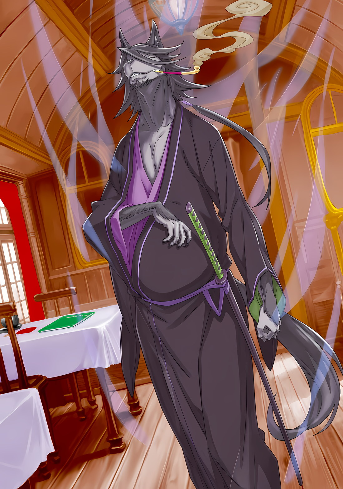

*※※※※※※※※※※※*

…Присцилла и Йорна не вернулись.

Отсутствие разногласий со стороны других людей в каюте дало понять, что он не ослышался, услышав поразительную информацию, прозвучавшую из уст Эмилии.

Осада столицы Империи Рапганы в разгар битвы между регулярной армией Империи и восставшими против них повстанцами, можно было только представить себе масштаб роли, которую сыграли Присцилла и Йорна.

В то же время кулаки Субару крепко сжались от осознания одной вещи.

Субару: Значит, удрученное выражение лица Танзы было тому причиной…

Субару очнулся на кровати в соединенной драконьей повозке, и несколько членов эскадрона пришли его навестить. Он был обеспокоен тем, что среди них Танза все это время выглядела подавленной.

Субару планировал обсудить дальнейшие действия с Эмилией, Авелем и остальными, а затем попытаться снова расспросить Танзу, когда все уляжется. Однако, прежде чем он успел это сделать, ему стала ясна причина ее беспокойства.

Субару: Значит, даже если эти двое не вернулись, мы все равно покинули столицу Империи!?

Винсент: …Нет конца списку тех, кто участвовал в битве и еще не вернулся. Конечно, присутствие ее и Йорны Миссигр было бы существенным, но к ним не должно быть особого отношения.

Субару: Но Йорна-сан…! Даже тогда! У тебя же должна быть какая-то связь с Присциллой.

Субару обратился к Авелю, когда тот выглянул в окно драконьей повозки, наблюдая за проплывающими мимо пейзажами и думая об удаляющейся вдаль столице Империи.

Он не знал всех подробностей сложившейся ситуации. Но Присцилла, которая подоспела к его затруднительному положению в Городе-крепости, буквально прилетела туда, предположительно, чтобы защитить Авеля.

Последовавший за этим обмен мнениями, хоть и был острым, как будто они направили друг на друга клинки, казалось, имел определенное чувство фамильярности между двумя людьми, которые хорошо знали друг друга.

Авель, должно быть, не смирился с тем, что Присцилла покинула его.

Вероятно, его предыдущая смятенная реакция в каюте Субару была вызвана не только смертью человека, известного как Чиша.

Гоз: Ты, как ты смеешь так грубо разговаривать с Его Превосходительством!

Однако тем, кто возразил против поведения Субару, был не сам Авель, а крупный мужчина рядом с ним.

Гоз Ральфон, человек со шрамом на лице, облаченный в золотые доспехи; в то время как громкость его голоса извергалась подобно вулкану, он смотрел сверху вниз на мальчика затравливающего Императора, которому Гоз поклялся в верности.

Гоз: Учитывая особенности ситуации в столице Империи, было бы вполне естественно, если бы Его Превосходительство покинуло столицу! Оставшиеся генералы, солдаты и народ поймут справедливость суждения Его Превосходительства!

Субару: Я не говорю о том, правильно это было или нет. Я пытаюсь сказать, что…

Гоз: ТЫ…!

Винсент: Прекрати это, Гоз Ральфон. Не в его характере молчать.

Лицо Гоза покраснело от настойчивости Субару, но Авель остановил его движением руки.

При звуке спокойного голоса Авеля Гоз закрыл свой полуоткрытый рот и почтительно склонил голову. Субару, напротив, посмотрел на Авеля со смущенным выражением лица,

Субару: Извини за весь этот сыр-бор. Но я собираюсь повторить тебе то же самое.

Винсент: Все так, как сказал Гоз. Оставаться в столице Империи при нынешних обстоятельствах равносильно тому, чтобы расстаться со своей жизнью. Я не мог принять такое решение. Конечно, есть опасения относительно безопасности Присциллы и Йорны Миссигр…

Эмилия: Знаешь, Субару, все не так плохо… Ну, эмм, говорят, что даже среди плохих новостей всегда есть надежда.

Стоя перед Субару, Эмилия положила руку ему на плечо, нахмурив брови.

Она, как и Субару, была очень обеспокоена безопасностью Присциллы и Йорны. Если она сказала, что надежда есть, то это относилось и к Субару.

Субару: Что ты имеешь в виду под надеждой?

Эмилия: Присцилла и Йорна-сан ооочень сильны, но не только это, у них есть сила влиять на окружающих их людей.

Субару: Окружающих их людей… это да. Хотя я не знаю, относится ли это к Присцилле.

Йорна, правительница Города Демонов Хаосфлейм, усилила мощь всего города с помощью своей «Техники Брака Душ» — способности соединять путь своей души со всеми жителями города.

Это относилось и к Танзе, чья несравненная сила, несмотря на то, что она была всего лишь милой девочкой-оленем, отличалась от общего усиления Эскадрона Плеяд.

Похоже, это был довольно мощный поддерживающий эффект, и он сохранялся даже на Острове Гладиаторов, далеко от Хаосфлейма, и даже во время осады столицы Империи…

Субару: …Может ли быть так, что усиления Танзы все еще на месте?

Беатрис: Кроме того, я полагаю, эффект на тех, кто присоединился к нам из Города Демонов все еще на месте.

Рам: Естественно, это означает, что Генерал Первого Класса Йорна, владеющая этим мистическим искусством, жива и здорова. Вот почему Эмили, у которой нервный характер, не паникует.

Эмилия: Да, я не паникую. И с Присциллой то же самое.

Субару: Присцилла такая же?

Беатрис и Рам подтвердили догадку Субару. Последующее заявление Эмилии о том, что Йорна и Присцилла одинаковы, заставило Субару нахмуриться.

Если принять это за чистую монету, то это означало бы, что Присцилла использует ту же технику, что и Йорна.

Субару: Но эта способность не очень похожа на Присциллу, и, кроме того, Авель сказал мне, что «Технику Брака Душ» безумно сложно использовать. Это была ложь?

Винсент: Глупец. Какой смысл мне тебя обманывать? Мне все равно, что ты думаешь обо мне сейчас, но здесь нет причин безрассудно провоцировать вражду. Думай своей головой.

Субару: Если это не должно было спровоцировать мою враждебность, то ты не годишься на роль Императора.

Даже если это было не в этот раз, в ближайшем будущем такое поведение непременно привело бы к восстанию.

Когда Субару поднял этот вопрос, Гоз снова пришел в ярость, но Беллстетз, стоявший рядом с ним, вмешался и предотвратил крупный инцидент.

Отто: В любом случае, хотя я понимаю впечатление Нацуки-сана о Присцилле-сама, она является пользователем этой так называемой «Техники Брака Душ». Я видел это своими собственными глазами.

Эмилия: Отто-кун прав, я тоже это видела. Однако, в отличие от необычного использования техники Йорной, в ее случае она применяется только к ее любимому слуге-куну.

Субару: Ее любимый, Шульт…? Кстати говоря, что насчет Ала?

В связи с тем, что Присцилла не вернулась, когда разговор зашел о ее лагере, Субару спросил о человеке в железном шлеме, которого не видели ни здесь, ни в соединенных драконьих повозках.

Ал занимал должность Рыцаря Присциллы, хотя и хозяин, и слуга этого совсем не одобряли.

Он тоже был покладистым и легкомысленным, но, безусловно, был предан Присцилле. Естественно, Ал, должно быть, чувствовал большую ответственность за то, что Присцилла не вернулась.

Беатрис: …Этот человек, в самом деле, он не сел в драконью повозку и остался в столице Империи. Как и предположил Субару, я полагаю, он предпринимает действия по поиску Присциллы.

Субару: Этот парень…! Не может быть, он совсем один?

Рам: Он придерживался мнения, что в одиночку быстрее адаптируется к меняющимся обстоятельствам. Рам согласна с этой идеей. Не стоит оставлять столько людей в столице Империи при таких обстоятельствах.

Субару: Черт, так вот почему… хк.

Он получил ответ об отсутствующем Але, но этот факт заставил Субару наморщить лоб.

Несмотря на свою внешность, Ал был довольно проницательным, и он был тем, кто специализировался на выживании в ситуациях, выходящих за рамки его возможностей. Тем не менее, не было никаких сомнений в том, что его сила была на ступень ниже, чем у тех, кто был по-настоящему силен.

Несмотря на то, что Ал знал об этом, он поддерживал Субару, как родного. Даже в Городе Демонов было много случаев, когда Субару потерял бы свою жизнь, если бы не он.

Отто: Что касается лагеря Присциллы-сама, то она находится на вершине. Ал-доно, ее последователь, и Хейнкель-доно, который сопровождал ее, пропали без вести. Шульт-кун отдыхает в каюте.

Субару: Хейнкель… почему-то это имя вызывает у меня невероятно неприятные воспоминания…

Отто: Он пьяница.

Беатрис: Это описание не передает сути, в самом деле… Он отец Райнхарда, я полагаю.

Субару: …! Этот дерьмовый отец! Почему этот мужик в Империи!?

Широко раскрыв глаза, Субару извлек из глубин своей памяти неприятное воспоминание.

В Городе Водных Врат, Пристелле, Хейнкель был человеком, который испортил атмосферу, когда все они сидели в гармонии. По этому вопросу он был с Присциллой и другими, но было удивительно, что он присутствовал и в Империи.

Эгоист и эгоцентрист, казалось, он никогда бы не захотел приехать в Империю Волакия.

Эмилия: Но Хейнкель-сан тоже пропал.

Субару: Так же, как Присцилла и Йорна, он не вернулся… Черт, я не знаю, как к этому относиться.

Конечно, он не хотел его смерти и не думал, что он должен умереть.

С другой стороны, он не был тем человеком, о котором он думал с любовью, поэтому у него не было причин желать ему остаться в живых, кроме желания не огорчать Райнхарда или Вильгельма.

Но у него была мысль о результатах его участия в той битве.

Субару: …

Хейнкель, человек из Королевства Лугуника и отец Райнхарда, «Святого Меча».

Ситуация, в которой этот человек, втянутый в битву за Империю Волакия, в конечном счете потерял свою жизнь; мысль об этом заставила даже Субару, который не был с ним в дружеских отношениях, почувствовать горечь.

Субару должен был вернуться в Королевство со всеми своими драгоценными спутниками, несмотря ни на что.

И вот, это случилось в тот момент, когда Субару только-только укрепил свою решимость.

Отто: Обстоятельства Присциллы-сама и Йорны-сан таковы, как я тебе уже говорил. Вдобавок ко всему, я хотел бы сделать заявление, прежде чем мы начнем совет, посвященный будущему курсу действий.

Тем, кто начал говорить после того, как в каюте воцарилась тяжелая тишина, был Отто.

Он встал на месте и поднял вверх указательный палец, чтобы привлечь внимание окружающих, и,

Отто: Как я уверен, вы уже знаете, мы — жители Королевства. Признав, что мы несем ответственность за пересечение границы во время, когда нам не разрешалось ее пересекать, я заявляю следующее.

Винсент: …Изложи это.

Отто: Да. …Мы достигли своей цели. Как только мы войдем в Укрепленный Город Гаркла, мы отправимся на север через Города-государства Карараги, а затем вернемся в Королевство Лугуника.

В разгар этого беспрецедентного кризиса в Империи Волакия, перед Императором Волакии, который переживал чрезвычайную ситуацию, когда его страна была доведена до краха, Отто сделал четкое заявление.

*△▼△▼△▼△*

Отто: …Нацуки-сан и Эмили, пожалуйста, храните молчание.

Это было сказано Субару и Эмилии еще до того, как они успели что-либо возразить, что выбило ветер из их парусов.

Не обращая на них внимания, заявление Отто застало Субару и Эмилию врасплох еще до того, как они начали бурно протестовать, и это позволило ему сделать первый шаг.

Впрочем, реакция Субару и Эмилии была естественной.

В условиях разрушения столицы Империи и отсутствия информации о безопасности Присциллы и Йорны, было бы слишком экстремально строить планы по их возвращению в родную страну.

Рам: Вы можете назвать меня бессердечной, но Рам согласна с планом Отто. Мы вернули Рем и, попутно, коротконогого Барусика. Эти результаты являются удовлетворительными.

Эмилия: Рам… хк.

Рам: Бесполезно смотреть на меня печальными глазами, Эмили. Ты тоже должна понимать. Просто группа Рам неожиданно добилась своего, ничего не потеряв. Идти дальше слишком опасно.

Вместо Субару и Эмилии, которым было приказано молчать, Рам высказала свое согласие с планом Отто.

Рам, холодно ответив на умоляющий взгляд Эмилии, полузакрыла глаза в своей обычной позе, сидя на стуле и обхватив себя за локоть.

Неожиданно они добились своего, ничего не потеряв. …Рам была права, выразив это именно так.

По сути, им не удалось вернуть Присциллу и Йорну обратно в это место. Не было никакой гарантии, что это не случится с кем-то из их лагеря.

Серена: Дадли, ты согласен со своей женой?

Розвааль: Она не моя жена, но в целом я согласен с ними обоими.

Той, кто привел Розвааля к этой теме, была Серена, красивая женщина с заметным белым шрамом на лице.

Была ли та, кого Серена назвала «женой», Рам? Отрицая это утверждение, Розвааль согласился с Отто и Рам.

Розвааль: На самом деле, если смотреть только на наши цели, я бы сказал, что это идеальное достижение. Его конечности стали немного короче, а девушка, которая должна была спать, превратилась в сорванца, но результаты превосходны. Думаю, что уход в Королевство здесь будет решением с наименьшим страхом потерь.

Рам: Даже если зубы Барусика еще не вылезли, Рам говорит, что потери минимальны.

Субару: Все мои зубы уже вылезли, черт возьми…!

Надеясь, что спорить не придется, Рам высказала свое впечатление о размерах Субару. Как бы то ни было, учитывая неудачный ход беседы, взгляд Субару блуждал по сторонам.

Отто, Рам и Розвааль были тремя людьми в лагере Эмилии, которые обладали сильным голосом на совещаниях по выработке политики благодаря своей практической мудрости.

Несмотря на то, что они были короной лагеря Эмилии, не было ничего необычного в том, что мнение Эмилии и Субару не принималось. Скорее, это было вполне обычным явлением.

Субару: Значит, на нашей стороне только Беако…?

Беатрис: …Прости, Субару, но Бетти, в самом деле, больше на их стороне. Не слишком ли опасно еще больше связываться с Империей, учитывая, что Субару уменьшился, я полагаю?

Субару: Ни за что, даже ты!

Глаза Субару расширились от шока из-за неожиданного предательства своего партнера.

Однако, хотя она и выглядела извиняющейся, не было никаких признаков того, что Беатрис хотела сказать: «В самом деле, это шутка». Она говорила так, потому что действительно заботилась о Субару.

Короче говоря…,

Эмилия: Субару…

Субару: …Только Эмилия-тан и я.

Крепко сжимая свои белые руки, аметистовые глаза Эмилии дрогнули. Субару откашлялся в ответ на ее призыв и покрылся холодным потом от того, что он оказался в таком затруднительном положении.

По крайней мере, если бы присутствовали другие, которых в данный момент не было, это была бы совсем другая история…

Отто: Для справки, Петра-чан согласна с нами. Фредерика-сан пассивна, но предпочла бы вернуться в нашу родную страну… Гарфиэль единственный, кто на вашей стороне.

Субару: Только Эмилия-тан, Гарфиэль и я!? Хватит шутить!

Эмилия: Ухх… почему-то я чувствую себя ооочень беспомощной…

Когда их желаемое разбилось о прагматизм, беспомощность мнения Субару и Эмилии укрепилась.

Если бы это было собрание, где решения принимались путем рукопашной схватки, присутствие Эмилии и Гарфиэля было бы подавляющим преимуществом, но для других видов собраний они просто не подходили.

Гоз: Боже! Что за фарс! Я не могу на это смотреть!

Именно Гоз сказал это, фыркнув на споры группы Субару.

Для него, который ранее жаловался на его отношение к Авелю, должно быть, все слова и поступки фракции Субару были неуважительными по отношению к Императору.

Сделав большой шаг вперед, Гоз схватил Субару за шею. Он действительно это сделал, и когда он поднял его двумя толстыми пальцами, Субару удивленно воскликнул: «Ах!»

Гоз: Это дело Империи! Если вы являетесь гражданами Королевства, а не Империи, то вы должны пересечь границу как можно скорее, в соответствии с установленной вами политикой! Ваша сила не требуется!

Субару: Подо-подожди секунду! Мы еще не закончили нашу часть разговора…

Гоз: Тишина…!!!

Когда его ноги болтались в воздухе, от громогласного голоса у Субару закружилась голова.

Даже когда он закрыл уши руками, голос Гоза все равно проникал сквозь эту защиту, как будто это было оружие. Однако его аргумент исходил из его гордости за то, что он имперский солдат, и у Субару не было причин следовать его примеру.

Кроме того, то же самое было справедливо и для посторонних, кроме Субару.

Эмилия: Достаточно, Гоз-сан. Сначала опустите Субару на место, а затем мы сможем поговорить об этом как следует.

Эмилия сразу же шагнула вперед, положив руки на бедра.

Она посмотрела на Гоза, который держал в руках Субару, и передала ему свою твердую волю. Ее отношение заставило Гоза сильно нахмуриться, и с лицом, покрытым шрамами, он посмотрел вниз на Эмилию.

Гоз: А ты, я погляжу, разделяешь мнение этого мальчика! Но! Волки Меча Империи не примут никакой благотворительности! Ваша помощь не требуется! Присоединяйся к своим товарищам и немедленно…

Эмилия: Это! Я ооочень сильно возражаю против этого!

Гоз: Что!?

Эмилия: Вы говорите, что наша сила не требуется! Но! Я думаю, что это совсем не так!

Беатрис: Ее голос стал громким в пылу момента, в самом деле.

Не желая уступать Гозу в энергичности, голос Эмилии, похожий на звон серебряного колокольчика, становился все громче и громче.

Красота осталась нетронутой, но голос Эмилии больше походил на звон большого колокола, чем обычного, и когда она бросила ему прямой вызов, выражение лица Гоза исказилось.

Ткнув пальцем в сторону Гоза, у которого было искаженное выражение лица, Эмилия продолжила,

Эмилия: В конце концов! Даже в битве за столицу Империи, если бы не я, Присцилла и остальные, всем было бы ооочень тяжело!

Гоз: …Хк!

Эмилия: Все мы! Мы были весьма сильны, не так ли, Беллстетз-сан?

Говоря громким голосом, Эмилия перевела разговор на Беллстетза.

Узкие, как нитки, глаза старика не были поражены внезапной номинацией: «Да, я полагаю, что так», — ответил он, покручивая пальцами усы вокруг своего рта,

Беллстетз: С моей стороны было неожиданным, что Генералы Первого Класса не смогли добиться успеха в своих сражениях. Если таков был вклад этих девушек…

Серена: Странно говорить о вещах с нашей точки зрения, но белый свет, выпущенный из дворца… он был рассеян той девочкой в платье.

Беллстетз: …Боже мой.

Подперев подбородок, Серена упомянула о достижении Беатрис. Услышав это, выражение лица Беллстетза слегка напряглось, когда он задался вопросом, что она сделала со светом.

Как раз перед тем, как Субару и его команда прибыли на поле боя, один выстрел едва не решил исход битвы… было упомянуто достижение Беатрис в устранении этого выстрела, поэтому, как ее партнер, он был горд.

Субару: Ну, Гоз-сан, предпосылки теперь другие, верно? Ты говоришь, что вам не нужна наша помощь, но без нас ситуация была бы намного хуже.

Эмилия: Да! Я не знаю точно, но представляю, что все было бы намного хуже!

Беатрис: Эмили, пришло время убавить громкость, я полагаю.

Субару и Эмилия атаковали волнами, Серена и Беллстетз также оказывали поддержку, заставляя губы Гоза подрагивать.

Было бы трудно, если бы только Субару и его команда настаивали, но в этой ситуации признание Серены и ее коллег, которые также участвовали в совещании высшего уровня, казалось, было очень эффективным против Гоза, который излучал сильное впечатление человека, прошедшего путь военного.

Однако…,

Гоз: …Я, безусловно, признаю ваш вклад. Но! В первую очередь, вы еще не завершили самые важные обсуждения между собой!

Субару: Это…!

Эмилия: Это так…

Он привел им разумный контраргумент, и Субару с Эмилией были обескуражены.

Здесь, даже если они смогут одолеть Гоза, это будет означать лишь то, что они победили легкого противника, но не то, что идеи Субару и его союзников останутся неоспоренными.

Скорее, по сравнению с Гозом, здесь были более сложные для убеждения люди.

Отто: Я знаю, что это прозвучит бессердечно, но позвольте мне это сказать.

Как только Субару идентифицировал своего врага, Отто заговорил так, словно предвидел это.

Начав говорить таким тоном, который не предвещал ничего хорошего, Отто перевел взгляд с Субару, которого схватили, на Гоза, который держал его, и,

Отто: Как и сказал Генерал Первого Класса Гоз, это дело Империи. В отличие от необходимости ситуации, постигшей нас, активное вмешательство с этого момента может стать… международным инцидентом, вмешательством во внутренние дела других стран.

Субару: Гх… хк.

Отто: Прежде всего, почему ты так сильно хочешь вмешаться, Нацуки-сан? Как бы то ни было, это, вероятно, связано с твоими обязательствами перед людьми, которых ты узнал в Империи до этого момента, или с чем-то другим, верно?

Субару: Не говори так, будто знаешь, что происходит! Но в любом случае, неужели то, чего я хочу, так плохо?

Отто: Не плохо, но у меня есть кое-что, чтобы убедить тебя. …Ну, я имею в виду, что, если Нацуки-сан заберет из Империи всех людей, которых он не может бросить?

Отто был из тех, кто стремился решать проблемы с помощью разума, поэтому, демонстрируя эту философию в наибольшей степени, он заставил глаза Субару широко раскрыться от возмутительного заявления, которое он только что выдвинул. Гоз был удивлен не меньше, его пальцы соскользнули, и он уронил Субару на пол.

Естественно, это застало врасплох и Эмилию. Помогая Субару, который упал на пол, она оглянулась и спросила: «Отто-кун?»,

Эмилия: Что ты хочешь этим сказать? Не может быть, ты действительно…

Отто: Здесь нет никакого подвоха, это именно то, что я предлагаю. Что в этих обстоятельствах мы должны совершить безрассудный поступок и забрать людей, которые хотят пойти с нами. К счастью, у нас есть право принимать решения.

Оглянувшись, Отто перевел взгляд на Розвааля.

Розвааль якобы скрывал свою личность в Империи, но было истиной, что он являлся самым влиятельным человеком в лагере Эмилии. Если мнение Отто будет принято, то именно Розвааль будет гарантировать прием тех, кто ищет убежища.

В ответ на вызывающую манеру Отто, Розвааль закрыл свой желтый глаз,

Розвааль: По крайней мере, я уверен, что мой наниматель не откажется. Если это спасет нас от риска, на который мы бы не пошли, то это необходимые расходы.

Рам: Раз уж вы заговорили о Барусике, то с его незрелым мышлением большинство людей, к которым он привязался, скорее всего, те, у кого нет сил сражаться. Это люди, о которых Империя не будет жалеть, если их отпустит.

В то время как переговоры проходили на пугающем уровне, Субару и компания оставались в стороне, пока о них говорили.

Ни чрезмерно развитое чувство самосохранения Розвааля, ни предположения Рам, основанные на ее понимании характера Субару, не нашли места для вмешательства, и разговор продолжался в сумбурной манере.

Отто: Что вы думаете, Ваше Превосходительство Император? Если мы сможем максимально сократить число жертв в вашей стране, то наше предложение не так уж и плохо, верно?

Винсент: …Очень хорошо продуманное предложение. Такое, от которого трудно так просто отказаться.

Отто: Благодарю вас за внимание.

Слова Авеля подтвердили, что это было разумное предложение, и Отто светски поклонился. Однако, что касается Отто, то было бы неудивительно, если бы он представлял себя высунувшим язык.

Империализм и Отто были несовместимы. Не обязательно в плане способностей, но в плане характера.

Как и Субару, Отто, похоже, не любил Империю.

В этом они были одного мнения. Единственное, что Отто делал в дополнение ко всему этому, — это упорядочивал вещи в соответствии с их важностью.

Субару: Гх…

Это было похоже на то, как если бы он пошел и сам заделал дыру в корабле, на котором им предстояло плыть, но в итоге переделал корабль в совершенно другой.

Этот корабль плыл в направлении, отличном от того, которого желал Субару, но он плыл по течению, чтобы защитить жизни дорогих людей Субару, направляясь к другому берегу.

Субару знал, что все это было продумано с учетом его и его спутников.

Он знал это, и все же.

Отто: Как насчет этого, Нацуки-сан, это лучшее, что я могу сделать с точки зрения компромисса и рассмотрения.

Вместо того чтобы безжалостно отвергать мнение Субару, Отто постарался максимально учесть его точку зрения и, в то же время, обеспечить их безопасность.

Он считал себя надежным парнем, но он был слишком хлопотным противником, когда у них возникали серьезные разногласия. Он был человеком, которого следовало напоить и оставить в пьяном ступоре еще до того, как возникла эта дискуссия.

Учитывая превосходящее теоретическое вооружение Отто, что мог сделать Субару, у которого была только лишь кипарисовая палка…

Эмилия: …Эй, Авель, я хочу вас кое о чем спросить.

Субару: Эмилия-тан?

Внезапно Эмилия, которая, должно быть, разделяла то же мнение, что и Субару, и в то же время чувствовала такое же разочарование от того, что ею помыкают, обратилась к Авелю с замечанием.

Глядя на ее профиль, глаза Субару расширились.

В отличие от Субару, который был вынужден замолчать, поскольку выглядел расстроенным и пытался найти выход из ситуации, ни глаза Эмилии, ни ее профиль не показывали признаков того, что она не в состоянии справиться с ситуацией.

Услышав достойный и храбрый оклик Эмилии, черные глаза Авеля устремили на нее свой пристальный взгляд.

Под влиянием его молчания тонкие губы Эмилии шевельнулись,

Эмилия: Сколько всего людей в Империи Волакия?

Винсент: …Гражданская война в этом месяце, вероятно, значительно сократила это число; но до этого оно составляло примерно пятьдесят миллионов или около того.

Эмилия: Понятно.

Нахмурив брови, Авель ответил на вопрос Эмилии. Услышав его ответ, она испустила короткий вздох, а затем поднесла палец к губам и посмотрела на Субару.

И тогда…,

Эмилия: Ты слышал его, Субару.

Субару: …

Именно так Эмилия сказала это Субару.

На мгновение Субару не смог уловить смысл ее слов, а затем его глаза сразу же расширились, а щеки напряглись.

Затем, на мгновение замешкавшись, он задумался, что ему следует делать с тем, что вызвало такую реакцию,

Беатрис: Субару, Бетти уже высказала свое мнение, в самом деле. Но…

Субару: Беатрис…

Беатрис: Бетти всегда будет на стороне Субару, я полагаю.

Держась за нерешительную руку Субару, Беатрис прижалась к нему всем телом.

Беатрис была почти одного роста с Субару, и ее глаза были еще ближе, чем обычно; когда они уставились на него, Субару глубоко вдохнул и выдохнул.

Затем, все еще находясь под ожидающим взглядом Эмилии, Субару посмотрел на Отто.

Посмотрев на него снизу вверх, он заговорил.

Субару: Пятьдесят миллионов.

Отто: …Что?

Услышав это грубое заявление, Отто переспросил его, приподняв свои тонкие брови.

При этом ответе грудь Субару вздыбилась, щеки исказились в улыбке, а затем он повторил то, что сказал.

Субару: Ты, ты говорил про это раньше. Ты сказал мне взять с собой в Королевство всех людей, которых я не могу бросить. В таком случае! Те, кого я не могу бросить, — это пятьдесят миллионов человек!

Отто: …Хк, Нацуки-сан!

Субару: Я знаю! Ты прав! Это я несу чушь! Я понимаю, что вы все прибыли сюда, чтобы спасти меня и Рем, и я понимаю, о чем ты говоришь! Но!

Он протянул руку к Отто, который приподнял бровь, и, хотя Субару насмехался над самим собой, он не мог потянуть свой собственный вес.

Он ни за что не смог бы победить Отто, Рам и Розвааля, если бы был вынужден урезонить их. Так что тогда Субару сделал бы все, что мог, имея на своей стороне Эмилию и Гарфиэля.

Иными словами, столкнувшись с логикой, он стал неразумным с помощью эмоциональных аргументов.

Субару: Это чертовски плохая ситуация! Если мы уйдем и Империя будет разрушена, что тогда? Одной мысли об этом уже достаточно, чтобы мне не захотелось есть!

Отто: А как насчет риска, который мы понесем? Если мы спасем пятьдесят миллионов незнакомцев, но взамен один из нас умрет или получит незаживающую рану, это будет гораздо больнее.

Субару: Я не позволю никому из нас умереть или попасть в такую беду. Это абсолют! Это абсолют, так что какое, черт возьми, значение это имеет?

Субару ответил Отто, который был загнан в угол. Затем он посмотрел не на Отто, а на Розвааля, который стоял в стороне с закрытым глазом.

Субару: Розвааль! Ты должен знать. Мои абсолюты — это абсолюты.

Розвааль: …Я Дадли, Субару-кун, хотя было бы слишком нечестно с моей стороны не кивнуть головой на этот вопрос, учитывая мои высокие ожидания от твоих абсолютов.

Хотя это и несколько окольный способ выразить это, Розвааль поднял руки в ответ на мнение Субару.

Даже если он и не знал о «Посмертном Возвращении», Розвааль был в курсе о Полномочии Субару. Таким образом, та его часть, которая возлагала надежды на это Полномочие, не позволила бы испортить настроение Субару.

В первую очередь, если бы он поддался на уговоры Розвааля здесь, что стало бы с его клятвой, данной в «Святилище».

Эмилия: Рам, пожалуйста…

Рам: …Эмили, у тебя есть хоть что-то, чтобы убедить Рам?

Эмилия: Я просто пытаюсь сделать все, что в моих силах, и я хочу помочь всем… Так что, пожалуйста.

Напротив, Эмилия применила смехотворно грубый силовой подход и попросила Рам об одолжении.

Если бы Субару сделал то же самое, Рам безжалостно отвесила бы ему словесную оплеуху, но она была не в состоянии эффективно отреагировать на напористость Эмилии.

Затем Рам тихонько вздохнула.

Рам: Рам была бы не против, если бы Рем можно было вернуть домой. Но Рем стала такой близкой к людям Империи… Если это проигнорировать, то это нанесет ущерб достоинству Рам как старшей сестры, что она только сейчас наконец осознала.

Эмилия: Рам…!

Рам: Прекрати, это раздражает.

Она обняла Рам, которая закрыла глаза и нашла свою собственную причину для компромисса. Та ответила на объятия Эмилии с неприятным выражением лица.

И вот, Розвааль и Рам уступили так, как это могло быть достигнуто только путем упорной работы.

Однако…,

Субару: Отто, пожалуйста…!

Отто: Ты собираешься использовать то же убеждение слезами, что и Эмили? Прости, но я не такой, как Рам-сан. Я не настолько глуп, чтобы подписывать контракт, когда не знаю, какую цену мне придется заплатить.

Субару: Беако тоже умоляет тебя…!

Беатрис: Б-Бетти тоже умоляет тебя, в самом деле.

Отто: Даже если вас будет двое или трое, я не сдвинусь с места.

Субару призвал Беатрис попросить его присоединиться к ним, но Отто упредил Эмилию, которая обнимала Рам, от своего присоединения.

По лицу Отто было видно, что он твердо решил не поддаваться эмоциям, его упрямство было сродни тому, как Субару противостоял маниакально одержимому Розваалю. Однако, даже если бы он прямо сейчас передал это клеветническое замечание Отто, тот не стал бы его слушать.

Отто: Мы только рискуем, нет никаких преимуществ в том, чтобы согласиться с мнением Нацуки-сана и остальных. Ты даже не удовлетворяешь условиям, чтобы убедить меня слезами. Рам-сан, и Дадли-сан тоже, пожалуйста, не будьте с ними так снисходительны.

Розвааль: Боже, меня отругали.

Рам: Для человека с социальным положением Отто, ты довольно дерзок.

Отто говорил сурово, Розвааль пожал плечами, а Рам нахмурилась. Но у них не было мнения, отличного от мнения Отто, поэтому они не стали спорить дальше.

На самом деле, если бы крепость, известную как Отто, не удалось бы завоевать, они бы не смогли справиться с этой ситуацией.

В конце концов, просто навязать сверху обстоятельства, с которыми все не согласны, было тем, что ни Эмилия, ни лагерь Эмилии не могли счесть приемлемым.

Тогда…,

Винсент: …Ты сказал, что нет никаких преимуществ. В таком случае, разговор бы изменился, если бы были преимущества.

Отто: …

Это был не Субару и не Эмилия, а Авель, который вмешался в разговор.

Когда Император вмешался в разговор, взгляд Отто заострился. В отличие от легкомысленной манеры Субару говорить, Отто обратил свой неучтивый взгляд на Императора.

Отто: Если есть хоть какое-то преимущество, то да. Что вы задумали? Заранее скажу, что нет никакой возможной компенсации, которая могла бы сделать это стоящим для нас…

Винсент: …По отношению к Королевской Кандидатке Королевства Лугуника я официально прошу о сотрудничестве.

Отто: …Хк.

На предложение Авеля, выражение лица Отто напряглось, и он горлом издал какой-то звук.

В то же время, несколько лиц начали яростно дрожать, и в большей степени, чем у Субару и его спутников, это были выражения тех, кто был на стороне Империи. Серена рассмеялась над этими словами, в то время как прищуренные глаза Беллстетза расширились.

Затем, с удивлением на лице, Гоз развел руками, словно это был конец света,

Гоз: Пожалуйста, подождите, Ваше Превосходительство!!! Просьба о сотрудничестве с Королевством… Это! Это не имеет прецендента в Священной Империи Волакия!!!

Винсент: Какая разница, есть прецедент или нет? Если ты так говоришь, то какой должен быть прецедент для неприглядного Императора, который потерял свою столицу Империи из-за такой наглой своры? Такая глупая зацикленность.

Гоз: НО! Солдаты, генералы и граждане будут сетовать, что вы приняли решение, недостойное Волка Меча, если вы решите положиться на помощь другой нации! Я говорю это почтительно, но это бросит тень на авторитет Вашего Превосходительства Императора!

Винсент: Тень на мой авторитет… Такое глупое беспокойство.

Отвечая на громкую жалобу Гоза, Авель покачал головой.

При этом заявлении Гоз застыл, его глаза расширились. Оглянувшись на него, Авель назвал имя своего слуги: «Гоз Ральфон».

Винсент: В настоящее время пустопорожний авторитет без всякого содержания является тем, что нам нужно? …Это не так. Сейчас Империя желает победить. Перегрызть глотки нашим врагам, искупаться в их крови, полакомиться их жизнями, но прежде чем все это произойдет, победа, которую мы одержим, станет тем, что определит завтрашний день Империи.

Гоз: В-Ваше Превосходительство…

Винсент: Те, кто вонзает свои клыки и становится помехой, все они — «Враги» кодекса железа и крови, заложенного Винсентом Волакией. Отвечай от всего сердца, Гоз Ральфон.

Гоз: …

Винсент: …Ты, ты мой «Враг»?

Когда ему тихо задали этот вопрос, все тело Гоза начало дрожать.

Не проявляя никаких признаков противостояния с Субару в каюте, стоя прямо, Авель демонстрировал свою мощь Императора.

В его взгляде, в его голосе, в самом его существе была доминирующая сила, и Гозу пришлось столкнуться с этой силой лицом к лицу, в одиночку.

Затем, после периода тщательного размышления, которое, должно быть, длилось менее пяти секунд, Гоз…,

Гоз: Я прошу прощения у Вашего Превосходительства за то, что отнял так много времени. …Я Гоз Ральфон! Молот войны, который сокрушит множество препятствий, стоящих на пути Его Превосходительства! Никогда! Я никогда не стану «Врагом» Вашего Превосходительства!!!

Винсент: Если это так, то отлично. Я полагаюсь на твою работу. Работай усерднее.

Гоз: Так точно!!! …Так точно!?

Кивнув на бурный ответ Гоза, Авель ответил, что его подчиненные должны работать на пределе своих возможностей. Согласившись с этим, Гоз издал громоподобный звук.

Возможно, именно слова, которые добавил Авель, вызвали его удивление.

Гоз: …Хк, я приложу все свои силы!!!

Слезы текли по его лицу, Гоз вытер их своей толстой рукой и дрожащим голосом снова дал обещание Авелю.

Отвернувшись от него, Авель взглянул на Серену и Беллстетза,

Винсент: У вас двоих тоже нет возражений?

Серена: Нет. Ваш взгляд мне по душе, и сейчас я чувствую большую преданность Его Превосходительству, чем когда-либо.

Беллстетз: Нет, даже от меня. За исключением того, что я более чем немного удивлен.

Винсент: Хмм.

Серена улыбнулась, а Беллстетз снова сузил глаза. Фыркнув на их поведение, Авель прошел вперед и встал перед Эмилией.

Затем он посмотрел на Эмилию,

Винсент: Ты правильно меня поняла, Кандидатка на Королевские Выборы. Империя Волакия официально просит сотрудничества с Королевством Лугуника, чтобы положить конец этой ситуации. …Одолжи нам свою силу.

Эмилия: …Вы знаете, Авель. Я бы, конечно, тоже хотела вам помочь. Но я действительно не понимаю, о чем вы говорите, когда упоминаете об этой Кандидатке на Королевские Выборы.

Субару: Эмилия-тан, нет! Это один из тех случаев, когда тебе не нужно держать это в секрете!

Эмилия: Что!? Ты уверен!?

Эмилия, которая выглядела очень расстроенной предложением Авеля, расширила глаза.

Субару и Беатрис несколько раз кивнули ей в ответ, и Эмилия посмотрела на Рам, которая все еще находился в ее объятиях, в поисках дальнейшего подтверждения.

Затем Рам стряхнула объятия Эмилии и оттолкнула ее от себя.

Рам: Да, конечно. …Делайте, что хотите, Эмилия-сама.

Эмилия: …Ах.

Когда Рам назвала ее «Эмилия», она удивилась, ее глаза загорелись. Эмилия моргнула, чтобы скрыть свою радость за веками, а затем снова повернулась лицом к Авелю.

Пока Авель, слегка нахмурив брови, ждал, что она продолжит, Эмилия прочистила горло, произнеся «Кхм»,

Эмилия: Я Эмилия, просто Эмилия, одна из Кандидаток на Королевские Выборы, которые должны определить следующую Королеву Королевства Лугуника. И та, кто хочет помочь Империи, которая сейчас в опасности.

Винсент: …Это официальная просьба; Империя Волакия никогда бы не обратилась за сотрудничеством к человеку из другой страны, даже занимающему столь ответственное положение. Поэтому, если этот факт станет достоянием общественности, это послужит попутным ветром для вас, кто борется за трон в Королевстве…

Эмилия: Боже! Такого рода вещи могут подождать! Сейчас я хочу сделать вот что!

Когда Авель попытался изложить твердую логику, Эмилия надула щеки. С этим милым надутым личиком она протянула ему руку.

Медленно опустив поднятую руку, Эмилия протянула ее Авелю,

Эмилия: Позвольте нам помочь вашей Империи.

В конце концов, казалось, что именно Эмилия была единственной, кто затронул эту тему. Посмотрев на ее протянутую руку, Авель на мгновение бросил взгляд в сторону Субару.

Субару улыбнулся и кивнул с лукавым выражением лица, заметив легкое недоумение, появившееся в черных глазах Авеля.

Субару: Непременно, Ваше Превосходительство Император. Я разрешаю вам подержать за руку мою Эмилию-тан.

Эмилия: И именно поэтому я говорю, что Субару — мой.

Эмилия язвительно ответила на легкомысленный комментарий Субару, на что Авель закрыл один глаз и вздохнул.

Затем его рука медленно взяла протянутую руку Эмилии,

Винсент: …Хорошо. Я приму вашу помощь.

И это, в конце концов, было очень похоже на Авеля, когда речь шла о налаживании сотрудничества между двумя странами.

*△▼△▼△▼△*

…И таким образом, Эмилия и Авель пожали друг другу руки, и исторический момент между Королевством Лугуника и Империей Волакия был выгравирован.

Субару: Эмм, Отто-сан, есть мнение насчет этого…?

Это событие с участием Субару и Эмилии, Авеля и стороны Империи достигло кульминации, и их обмен в конечном итоге дошел до рукопожатия, но Отто, тот, кто первым предложил нечто подобное, остался позади.

Компромисс с Розваалем и Рам был найден, но поскольку Отто, для которого это было не так, остался в стороне, Субару охватила тревога.

Осознавая, что перегнул палку, он подсознательно спросил мнение Отто, подмасливая его официальными выражениями и вежливым поведением.

Отто: …

И на этот робкий вопрос, заданный Субару, Отто ничего не ответил.

Слишком напуганный, чтобы посмотреть на лицо Отто, Субару был очень обеспокоен тем, что ему ответили молчанием. Недолго думая, он прижал Беатрис к себе, и их щеки соприкоснулись,

Субару: Ч-что мне делать, Беако… Отто не хочет со мной разговаривать…

Беатрис: Бетти понимает это чувство, я полагаю. С точки зрения Отто, он, должно быть, чувствует, что ты выставил его полным дураком, в самом деле. Ты разрушил его идею и выставил его полным клоуном, я полагаю.

Субару: Клоун, даже если он не так уж сильно похож на Розвааля…

Беатрис: Прекрати, в самом деле! Оскорбление, столь серьезное, только разозлит его еще больше, я полагаю!

В панике Субару и Беатрис вместе искали выход из тупика.

Он хотел загладить свою вину за то, что заставил Отто потерять лицо, но что он должен был сделать?

Субару: Сделать тебе массаж ног или плеч…?

Беатрис: В самом деле, ты будто извиняешься за то, что разозлил своих родителей…

Субару: Потому что я не могу придумать ничего другого! Отто, я умоляю тебя… ик!

Поскольку Субару не смог придумать достаточно достойного предложения, Отто, до этого момента молча стоявший перед ним, резко придвинул стул и с грохотом сел на него.

Удивленные таким неожиданным поступком, Субару и Беатрис отпрыгнули назад, все еще обнимая друг друга. Конечно же, дело было не в том, что он сел на стул для того, чтобы ему сделали массаж плеч.

И, перед паническим дуэтом Субару и Беатрис, Отто поднес руку ко лбу…,

Отто: …Ну что, устроился как следует в том месте, где хотел?

Субару: Э…?

Выпустив длинный и глубокий вздох, Отто помассировал кожу вокруг глаз. Внимая его словам, Субару был поставлен в тупик, и, моргнув глазами в знак «Не может быть», он заговорил,

Субару: Не может быть, ты с самого начала думал, что это произойдет…

Отто: Я не думал, что все так обернется, но мне не терпелось сделать что-то настолько масштабное. Потому что я точно не знал, на какие уступки пойдет Император Винсент. Но, поскольку Нацуки-сан с Эмилией-сама все равно не изменили бы своего мнения, мне нужно было найти компромисс.

Субару: А, о, у, э, а, о, у…

Столкнувшись с таким беспечным ответом Отто, Субару разинул рот. В недоумении он отвернулся от него, но тут его глаза встретились со взглядами Розвааля и Рам.

Затем на лицах этих двоих тоже появилось выражение, говорившее о том, что по большей части они все понимали.

Субару: Вы, вы, ЖУТКИЕЕЕЕЕЕ…!!!

Отто: Как обидно! Прежде всего, это случилось только потому, что ты был таким упрямым, Нацуки-сан!

Субару: Аааааа, я больше не могу доверять никому, кроме Беако и Эмилии-тан… И Рем! И Луи! И Танзы, и всех из эскадрона, и Флопа-сан, и Медиум-сан, и Мизельды-сан, и Племени Судрак!

Беатрис: Я полагаю, было еще много других!

Крепко обнимая Беатрис, Субару не мог не испытывать страха перед тщательной умственной подготовкой Отто и других членов команды мозговиков. Возможно, Авель в какой-то степени вник в их планы, но даже в этом случае.

Субару: Нет, жутко, жутко, я действительно не могу с этим справиться. С этого момента я буду использовать эмоциональный подход.

Беатрис: Бетти не понимает такого вывода, но она считает, что будет лучше, если Субару выберет путь, на котором он будет честен с самим собой, в самом деле. Если этот путь эмоциональный, то Бетти он нравится, я полагаю.

Субару: Да, я тоже тебя люблю. Боже, правда…

Наконец, воздействие предыдущего шока от Отто начало проходить, и Субару почувствовал облегчение.

И это произошло как раз в тот момент, когда его чувства утихли после этого обмена репликами.

…Неожиданно в каюте раздались хлопки в ладоши.

???: …О господи, такое чувство, что я только что наткнулся на что-то невероятно восхитительное. Настолько чертовски восхитительное, что это довольно большое дело.

Раздались громкие аплодисменты, и, рефлекторно обернувшись, чтобы посмотреть, кто хлопает в ладоши, Субару затаил дыхание, заметив присутствие незнакомой фигуры.

В углу каюты, где раньше никого не было, теперь стояла высокая фигура, которую никто не успел заметить. Хлопая в ладоши, эта личность наблюдала за происходящим обменом мнениями.

…Никто до этого в каюте не замечал его присутствия.

Гоз: Кто ты, черт возьми, такой!? Как ты сюда попал……!?!?

???: Ах, черт. Что ж, я случайно похлопал, хотя меня не приглашали. Так не пойдет, так не пойдет, это моя дурная привычка — неосознанно хвалить любых достойных похвалы детей, которых я нахожу.

В тот же миг, защищая Эмилию и Авеля за своей спиной, Гоз принял боевую стойку.

И перед Гозом, выражение лица которого стало леденящим кровь, стоял некто, сохранявший безразличное отношение, как будто все происходящее не имело к нему никакого отношения, покусывая свое золотое кисэру, которое он достал из кармана, с проницательной улыбкой.

Эта фигура и так была ужасно не к месту, а еще больше бросался в глаза ее внешний вид.

Ростом почти в два метра и с черными волосами на теле, его обаятельный, улыбающийся лик обладал некоторым шармом, а в сочетании с неухоженной черной шерстью он производил впечатление мягкого собакочеловека.

Одетый в кимоно и кусающий свое кисэру, незаметно появившись в соединенной драконьей повозке, где собрались многие ключевые фигуры Империи, он, естественно, привлек внимание всех присутствующих.

???: Боже-боже, похоже, вам всем очень любопытно узнать обо мне, не так ли?

Эмилия: Кто вы? Зачем вы пришли сюда?

Переводя взгляд, собакочеловек почесал пальцем свой затылок. И Эмилия, защищенная спиной Гоза, спросила у него об этом.

В ответ на этот вопрос собакочеловек наклонил голову. Очертания его пасти, усеянной клыками, расплылись в улыбке, и таким образом он заговорил,

???: Что ж, меня зовут Халибель, не возражаете, если я заскочу поздороваться?

Так он заявил.
