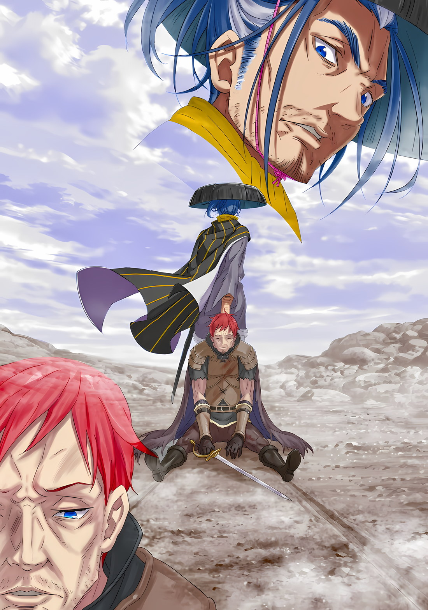

*※※※※※※※※※※※*

Сказав это беззаботным тоном, зверочеловек почесал голову и широко ухмыльнулся, грызя свое золотое кисэру.

У него был в меру длинный черный мех и выражение лица, придававшее ему вполне приветливый вид. Когда он стоял, ни в его мягкой манере говорить, ни в его расслабленной позе не ощущалось никакой злобы и настороженности.

Неважно, что среди этих соединенных драконьих повозок, в каюте, где проходила конференция между важными фигурами Королевства и Империи, никто из этих влиятельных особ не замечал его присутствия до этого.

Гоз: Халибель, говоришь…?

Действительно, с дрожью страха, смешанной с его суровым голосом, когда он бормотал это, Гоз был тем, кто проявлял наибольшую бдительность по отношению к этому присутствию, поскольку он защищал как своего господина, так и нового союзника позади себя.

Сам он был одним из «Девяти Божественных Генералов», военным, чье имя было среди тех, кто считался самыми сильными в этой Империи, полной воинов, — Генералом Первого Класса. Но даже Гоз не распознал невидимости зверочеловека, который сейчас стоял перед его глазами.

Но сам по себе этот факт был не единственной причиной жесткости его голоса.

Винсент: ……«Хвалитель», хм? Какие дела здесь могут быть у краеугольного камня Городов-государств?

Защищенный спиной Гоза, глядя поверх его крупного тела и устремляя свой взгляд на зверочеловека… на Халибеля, Авель спросил об этом.

Возможно, дело было в хорошо известном псевдониме этого собакочеловека, который он произнес, прежде чем задать свой вопрос. По какой-то причине Субару показалось, что он где-то уже слышал это прозвище, и от удивления он стал искать его в своей коробке со взбудораженными воспоминаниями.

И тут, когда Субару насупил брови, Халибель, демонстрируя свою улыбку, перевел на него взгляд своих прищуренных глаз.

Халибель: Если хорошенько подумать, то имя не так уж и важно. Что ж, это просто то, как они меня называют, поскольку я люблю хвалить, а что-то вроде «краеугольного камня» можно списать на то, что они меня переоценивают.

Субару: Переоценивают…

Халибель: Да-да. Просто в Карараги нет никого сильнее меня.

Халибель дал свой ответ в спокойной манере, как будто он просто обсуждал погоду.

Эти слова сильно удивили Субару; как только его разум обработал слово «Карараги», то, на чем он застрял всего мгновение назад, внезапно озарилось пониманием.

«Хвалитель» Городов-государств Карараги, значение этого прозвища было…,

Гоз: Сильнейший шиноби Городов-государств Карараги! По какой причине ты сел в эту драконью повозку!?!?

В следующий момент, опустившись на пол драконьей повозки с силой, достаточной для взрыва, Гоз направил свое оружие, булаву, в сторону Халибеля, когда тот стоял на месте.

Оружие Гоза было булавой необычной формы, чем-то похожей на длинное копье с шипастым шаром, прикрепленным к наконечнику для нанесения удара. Она была похожа на моргенштерн, которым когда-то любила пользоваться Рем, но ее размер и вес слишком уж соответствовали предмету, принадлежавшему Гозу.

Как бы то ни было, при внезапном появлении сильнейшего из Городов-государств, военный Империи принял стойку, выставив вперед свое оружие.

Возможно, могло показаться, что при таком раскладе ситуация будет взрывоопасной.

Однако…,

Халибель: Это я вызвал весь этот переполох, так что, возможно, не мне это говорить, но бросьте, разве мы все не можем просто посидеть и поболтать, не заводясь?

Гоз: Нгх, гх…

Проворно наклонив голову, когда булава была направлена в его сторону, Халибель заговорил. Лицо Гоза напряглось, когда он услышал его слова, а рука, в которую он вложил силу, задрожала.

Против острия золотой булавы, которую держал Гоз, Халибель протянул свое кисэру такого же золотого оттенка. Благодаря этому оружие Гоза стало неспособно совершать даже малейшие движения.

Гоз: …

Вероятно, Халибель искусно контролировал баланс силы, вложенной в кисэру, и не давал булаве Гоза двигаться вверх, вниз, влево, вправо и, конечно же, вперед.

Как бы Гоз ни пытался двигать своим оружием, кисэру оказывало давление с противоположной стороны, не давая ему двигаться. Это была не просто грубая сила; скорее, это была высшая точка техники, позволяющая идеально контролировать поток его силы.

Гоз: Ты… хк!

Лицо Гоза покраснело, и звук скрежета его моляров раздался по всей каюте. Но даже по сравнению с лязганьем зубов Гоза, серия действий, совершенных Халибелем, была слишком тихой.

В этот момент существо, известное как Халибель, завершало свою оценку этого места.

Винсент: Прекрати это, Гоз. Кроме того, если бы у него было намерение причинить нам вред, он бы отрубил головы всем собравшимся еще задолго до того, как заявил о своем присутствии аплодисментами.

Эмилия: Раз вы этого не сделали, значит, вы нам не враг… верно?

Наблюдая за тихим нападением Гоза и защитой Халибеля, Авель и Эмилия вмешались.

Как и сказали оба, на самом деле, если бы Халибель захотел, то не было бы ничего странного в том, что все находившиеся в повозке были бы убиты еще до того, как узнали о его присутствии.

Когда это было отмечено, большой рот Халибеля расплылся в подобии улыбки, и,

Халибель: Да-да, я рад, что вы смогли понять. Кроме Императора-сан, полудьяволица, должно быть, очень хорошая и честная девушка. Несмотря на то, что тебя ненавидят так же, как и меня, тебя воспитали честной… твои родители, должно быть, достойны восхищения.

Эмилия: Спасибо. Я тоже считаю, что мне весьма повезло, ведь меня воспитали Пак, Матушка и Дейзе.

Когда Эмилия положила руку на грудь и поблагодарила его, Халибель кивнул и убрал свое кисэру. В тот же миг специализированное оружие Гоза высвободилось, но он не стал делать ничего безрассудного, например, замахиваться на Халибеля.

Хотя он был расстроен, Гоз продолжал внимательно следить за Халибелем, и,

Гоз: Если ты пойдешь против предыдущих слов, я одолею тебя, даже если это будет стоить мне жизни. Помни об этом.

Халибель: Я не собираюсь этого делать, правда, не собираюсь. Смотри-ка, я сижу весь такой красивый и хорошо себя веду.

Размахивая руками, Халибель подтянул хвостом стул рядом с собой, а затем обнял одно из своих колен, усаживаясь поудобнее.

Он был примерно такого же роста, как Гоз, но когда он так выгибал свою стройную фигуру, впечатление о нем как о собаке крупной породы усиливалось. Не похоже, что его слова о хорошем поведении были сарказмом.

Розвааль: Как бы то ни было, я не ожидал, что Карараги вмешается здеееесь~. Даже если не в такой степени, как Королевство и Империя, я не слышал, чтобы Города-государства когда-либо хорошо ладили с Империей. Тем более, когда речь, в частности, идет о твоем официально объявленном положении.

Халибель: О, вы все обо мне знаете? Боже, это смущает, потому что я чувствую себя какой-то знаменитостью.

Субару: Розвааль, когда ты говоришь об «официально объявленном положении» этой особы…

Рам: Барусик такой же невежественный, каким кажется, поэтому Рам сообщит ему. «Хвалитель», Халибель, — это человек-волк.

Человек-волк; получив эту информацию от Рам, сердце и тело Субару на мгновение затрепетало.

Однако это не было реакцией на Халибеля, который был перед ним; скорее, причина, по которой он задрожал, заключалась в другом. То, о чем сообщила ему Рам, само по себе тоже не помогло Субару внезапно что-либо понять.

Но, не обращая внимания на непонимание Субару, разговор продолжился так, как того требовал здравый смысл.

Винсент: Ты должен быть осведомлен об отношении Империи к людям-волкам. Пересекая границу и ступая сюда, ты действительно выглядишь весьма безрассудным.

Халибель: Конечно, я знал это, хотя у меня не слишком хорошие предчувствия на этот счет. Но вы все также должны знать причину, по которой я не скрываю того факта, что я человек-волк, потому что никто не может меня убить. Судя по всему, Сесилуса здесь тоже нет.

Субару: …! Эй, ты знаешь о Сеси?

Халибель: Хм? О, я действительно знаю его, да? В конце концов, однажды он пришел, чтобы попытаться убить меня. Но почему-то после небольшой стычки, он сказал что-то вроде «Похоже, развязки не будет!» и ушел.

Хотя тема разговора отклонилась от вопроса о людях-волках, Халибель без скромности ответил на вопрос Субару.

Это был неожиданный ответ и неожиданная точка соприкосновения. Сесилус и Халибель однажды схлестнулись в смертельном поединке, и, судя по текущему разговору, казалось, что именно Сесилус затеял драку, и в это было очень легко поверить.

Более того…,

Беллстетз: В Империи Волакия, которая демонстрирует свою решительную позицию по отношению к людям-волкам, появился самый известный, самый могущественный человек из Городов-государств Карараги. К тому же, он невежливо сделал это в той самой каюте, где находится Его Превосходительство Винсент.

Серена: Если я могу добавить, он вник в содержание важной конференции между нашей страной и Королевством. О боже, разве это не та ситуация, которая требует обезглавливания, даже если это означает использование «Синей Молнии»?

Розвааль: …Серена, не могла бы ты не подвергать опасности всех присутствующих в данный момент из-за своих плохих вкусов?

Воспользовавшись тем, что Беллстетз кратко описал ситуацию, Серена с юмором добавила свое опасное мнение. Экстремальность ее слов была такова, что Розвааль рефлекторно бросил предупреждение, соответствующее его чувствам.

На этом первоначальное удивление и пыл, вызванные внезапным появлением Халибеля, более или менее угасли, и затем они вернулись к первоначальному вопросу.

Винсент: Третьего раза не будет. По какому делу ты пришел, «Хвалитель»?

Независимо от того, был ли Халибель напуган вооруженной мощью присутствующих, слово «лесть» не существовало в лексиконе Авеля. Наблюдая за владельцем словаря, который намеренно вычеркнул все слова о скромности и смирении, Субару перевел дух, гадая, как отреагирует Халибель.

Но, вопреки нарастающему напряжению, Халибель остался сидеть, опираясь подбородком на свои руки, лежащие на столе,

Халибель: Не нужно быть таким напряженным, я говорил о том, зачем пришел, еще в самом начале, не так ли? Я просто хотел спросить, можно ли мне заскочить поздороваться?

Субару: Под этим «поздороваться» ты подразумеваешь что-то вроде вырывания всех наших сердец вместо того, чтобы на самом деле поприветствовать нас…?

Халибель: Обалдеть! Ну и пугающие вещи ты придумываешь, пацан, не так ли? Я бы так не поступил.

Беатрис: В таком случае, ты хочешь сказать, что твоей целью было просто появиться и поздороваться, я полагаю?

Халибель: Это так?

Протестуя против Субару, который с опаской пытался выяснить стиль приветствия шиноби, Халибель также равнодушно ответил на вопрос Беатрис после того, как она продолжила за Субару.

Зайдя так далеко, действительно казалось, что у Халибеля не было намерений прибегать к насилию.

Отто: В первую очередь, он тот, кто может убить нас, не прибегая к обходным путям. Разве не было бы дурным вкусом вот так играть с нами, а затем лишить жизни?

Субару: Я тоже испугался, но ты не должен вытягивать такое мнение из людей… Но, если это так…

Эмилия: Если это так? Ты что-то придумал, Субару?

Сглотнув слюну, Субару представил себе нечто пугающее, когда понял отношение Халибеля.

После того, как Эмилия задала ему этот вопрос, предполагая, что его мысленный образ характера Халибеля был таким…,

Субару: Если и Райнхард, и он действительно порядочные, тогда с Сеси затруднительное положение…

Винсент: Прекрати это, Нацуки Субару. Возможно, о вашем сотрудничестве и просили, но я не припоминаю, чтобы разрешал вам расследовать скандалы в моей стране.

Беллстетз: Скандалы… Лично я не смог бы перечислить все случаи, связанные с Генералом Первого Класса Сесилусом.

Что касается вопроса о человечности Сесилуса, то не только Субару и Авель, но даже Беллстетз, все сошлись во мнении. Хотя он здесь не присутствовал, о Сесилусе говорили пренебрежительно; но, скорее всего, если бы он был здесь, Субару был уверен, что о нем все равно говорили бы то же самое.

На самом деле, Субару очень нравилась фантазия о том, что сильные мира сего будут вести себя подобающим образом, поэтому в этом отношении поведение Райнхарда и Халибеля было для него идеальным.

С другой стороны, он также считал, что если бы Сесилуса не было на Острове Гладиаторов, все пошло бы не так хорошо, так что это была история о том, что у всего есть свои плюсы и минусы.

Эмилия: И что? В конце концов, какова цель вашего приветствия? Эта драконья повозка направляется на север, но граница Карараги еще дальше… Этого недостаточно, чтобы вызвать у вас осторожность, верно?

Халибель: Мм-хмм~, наверное, было бы гораздо быстрее, если бы вы спросили об этом моего нанимателя, а не меня. Все немного усложнилось с тех пор, как я напортачил, неосторожно хлопнув в ладоши… Ах, похоже, это должно произойти в любой момент, так что.

Эмилия: В любой момент…

Глаза Халибеля выглядели довольными с оттенком смущения; однако, он поднял лицо, что-то осознав, и привлеченный этим Субару проследил за его взглядом.

Его волчья морда повернулась к двери, ведущей в соседнюю повозку. Ровно через секунду кто-то постучался в дверь с другой стороны.

???: …Простите, что прерываю собрание. Есть кое-что, о чем я должен сообщить.

С этими словами голос, который он слышал раньше, провозгласил это, и Авель бесшумно приказал ему: «Войди». Дверь открылась, и в каюту вошла фигура маленького человечка с пушистыми волосами.

При виде его Субару расширил глаза.

Субару: Зикр-сан! Слава богу, с вами все в порядке!

Зикр: Действительно, нет необходимости беспокоиться. Очень хорошо, что вы тоже целы и невредимы, мисс Нацуми.

Субару: Все еще так обращаться ко мне, даже когда я в этой форме…

И когда они встретились, и когда расставались, мужчина улыбнулся переодетому Субару, и, увидев, что имперский Генерал Второго Класса Зикр Осман жив и здоров, он с облегчением похлопал себя по груди.

Затем, улыбающееся выражение лица Зикра стало жестче, и,

Зикр: Ваше Превосходительство, я должен кое-что доложить… Но та особа вон там…

Винсент: Не обращай на него внимания. Возможно, он небезосновательно связан с твоим докладом.

Авель недобро отнесся к беспокойству Зикра по поводу присутствия Халибеля, который находился в углу каюты. Но Зикр привык к тому, что Император пресекает слова и кивнул с «Так точно»,

Зикр: Вернулся летающий драконий корабль Верховной Графини Дракрой. С высокопоставленными лицами из Укрепленного Города Гаркла, а также гостями из Городов-государств.

Винсент: …Гостями из Городов-государств.

Пробормотал Авель, устремив свои черные глаза на Халибеля.

Поскольку пунктом назначения этих соединенных драконьих повозок был Укрепленный Город Гаркла, было вполне естественно, что соответствующие люди прибыли сюда на летающих драконах. Если бы их одновременно сопровождали люди из Карараги, то было бы невозможно, чтобы они не были связаны с Халибелем.

Другими словами…,

Эмилия: Халибель-сан, вы пришли раньше этих людей?

Халибель: Ну, я не слишком хорошо переношу высоту.

Независимо от того, были ли его милые слова прямым ответом или же нет, Халибель подтвердил, что информация, которую принес Зикр, была с ним связана.

Даже если Субару мог понять, что Халибель плохо переносит высоту и поэтому не сел на борт, он не улавливал, как тот смог прибыть быстрее, чем летающий драконий корабль; но не было смысла говорить что-то подобное сверхлюдям этого мира. Даже Сесилус мог бегать быстрее, чем что-то летящее по воздуху, так что это было примерно одно и то же.

В любом случае…,

Серена: Они даже взяли на себя труд сесть на мой летающий драконий корабль. Значит, мы должны ожидать, что придут очень высокопоставленные люди и скажут какие-то очень важные вещи?

Зикр: По крайней мере, так утверждает сама изысканная гостья.

Винсент: Судя по тому, как ты говоришь, это женщина?

Доклад Зикра было легко понять: женщина прибыла из Городов-государств Карараги.

Субару озадаченно склонил голову набок, но по какой-то причине его друзья отреагировали иначе. Беатрис крепче сжала его руку, посмотрела в сторону Эмилии и,

Беатрис: Эмилия, речь идет о гостях из Карараги, в самом деле.

Эмилия: Да, действительно. Возможно, это может быть…

Субару: А? А? Вы двое случайно не…

*Знаете что-нибудь?* Это произошло как раз в тот момент, когда Субару почти закончил свой вопрос.

???: …Почему же, даже несмотря на то, что люди прошли через все трудности, спеша добраться до Империи, ты говоришь такие бессердечные вещи, Нацуки-кун?

Субару: …

Неожиданно его прервал голос, элегантный тембр которого доносился из-за спины Зикра.

Этот гость ждал на сцепке соседней повозки, но у него должен был быть довольно острый слух, чтобы участвовать в этом разговоре. И он был доволен этим острым слухом.

В конце концов, торговцы были людьми, которым всегда приходилось напрягать слух в поисках возможности получить прибыль.

Беллстетз: Ваше Превосходительство, что следует предпринять?

Исходя из того факта, что обладатель этого голоса слышал обсуждаемые вопросы, Беллстетз поинтересовался мнением Авеля. На этот вопрос последний посмотрел в сторону Субару и проследил за выражением его лица.

Затем Авель бросил свой взор в сторону двери, из-за которой доносился голос,

Винсент: Почему-то кажется, что это не просто хамство и самонадеянность. Покажи свое лицо.

Гость: Тогда я не стану воздерживаться.

Получив разрешение Императора, обладатель голоса мягко ответил. И, прежде чем кто-либо успел заметить, Халибель, стоявший прямо возле двери, открыл рукой дверцу повозки, приглашая гостя внутрь.

Заметив внимание Халибеля, человек, теперь уже видимый, улыбнулся со словами: «Спасибо», а затем…,

Гость: Прошло довольно много времени с тех пор, как мы в последний раз встречались лицом к лицу, но я очень рада видеть, что у тебя все хорошо.

Субару: О…

Гость: Все же, если дело касается попадания в разного рода неприятности, то вы с Эмилией-сан, в этом плане, те еще эксперты. Похоже, вам снова понадобится наша помощь.

С непринужденным тоном, с улыбкой на лице, с безжалостной оценкой, с собранными в пучок светло-фиолетовыми волосами и с руками, спрятанными в рукавах кимоно, стояла женщина, закутанная в лисий шарф… Анастасия Хосин.

А рядом с ней шел ее сопровождающий — молодой человек в одежде японского стиля.

Субару: Анастасия-сан и… Юлиус!?

Увидев двух людей, которых он никогда не думал здесь встретить, Субару был ошеломлен.

Услышав надтреснутый голос Субару, Анастасия прикрыла рот рукой и улыбнулась, а молодой человек, чье имя было названо… Юлиус провел пальцем по ужасному шраму под своим левым глазом и посмотрел на Субару.

И тогда…,

Юлиус: …Я хотел сказать, что рад за твою безопасность, но почему с тобой постоянно что-то не так?

Субару: Не говори так, будто я всегда создаю проблемы на уровне превращения в маленького!!!

После их воссоединения вместо радости раздался гневный голос.

*△▼△▼△▼△*

Когда все силы покинули его колени, он подался вперед и рухнул на опустошенную равнину.

Не имея даже силы воли для того, чтобы поддержать свое тело, земля безжалостно врезалась ему в лицо. Он почувствовал свербящую боль в своем носу, а из его разбитых губ потекла кровь.

Взяв эту кровь на язык, он слегка смочил внутреннюю часть своего рта, который пересох до костей.

???: …

Ни в одной части его тела не осталось ни малейшей силы.

Если он потерял всю силу воли, то и его физической силе не потребовалось бы много времени, чтобы полностью исчезнуть. И теперь, когда и то, и другое полностью иссякло, он, вероятно, умрет и сгниет на том самом месте, на котором рухнул.

Абсолютно все, абсолютно все и вся было напрасно.

То, что он пытался сделать, то, что он был в ярости от того, что должен был сделать, то, что он продолжал делать просто по привычке, — абсолютно все это было напрасно.

В конце концов, он просто не мог быть никем иным, кроме как самим собой. То, что называлось адом, существовало внутри него.

В таком случае, у него не было ни малейшего шанса этого избежать. Не было никого, кто мог бы этого избежать. Нельзя покинуть ад имени самого тебя.

???: Боже… проклятье…

Из его уст пересохшим голосом вырвалось отчаяние.

В этот момент даже слезы больше не могли пролиться. У него не было ни страсти, ни квалификации для такого дела.

Все было чертовски причудливо. Это было не то место, до которого он мог дотянуться. Тянуться до места, до которого он не мог дотянуться, — это была самая большая ошибка в его жизни; и все же он снова сделал то же самое.

Не было никакого самоанализа. Вот почему он не мог ничего делать, кроме как сожалеть.

Не было ни малейшего шанса, что он когда-нибудь сможет полюбить кого-то, похожего на него самого, поэтому ему ничего не оставалось, кроме как ненавидеть того, кем он был, пока, в конце концов, он не возненавидел само свое существо.

Он даже не был в состоянии любить тех, кого любил. Уже достаточно; неудачники, которые были так же чертовски никчемны, как и он сам, должны были просто поторопиться и…

???: …О? Я думал, что просто сниму все пожитки с мертвого тела, но подумать только, в тебе еще есть дыхание. Это заслуживает браво, браво.

Внезапно над головой рухнувшего тела послышался чей-то голос.

Его телу не хватало энергии, чтобы сделать даже малейшее движение, но обладатель этого голоса протянул свою руку и перевернул его. Мгновенно его зрение погрузилось в яркий свет чистого голубого неба, и он застонал, издав «Арххх».

Слезы, которые так и не выступили от его позора и раскаяния, теперь постепенно начали наворачиваться.

Это было непомерно обидно.

Абсолютно все и вся, каждый сантиметр этого тела, неужели все это будет функционировать только ради него самого, и больше ни для чего другого?

Незнакомец: Ты чем-то расстроен, мистер Падучий? Дружище, с твоим телом, все еще живым и здоровым, это будет не более чем миг.

???: Подумать только… я все еще жив…

Незнакомец: Ого, так это тот тип людей, которым осточертела жизнь? Боже мой… насколько я знаю, есть только один способ побороть такие мрачные мысли.

???: …

Он почувствовал, как обладатель голоса улыбнулся, и его перевернутое лицо врезалось в чистое голубое небо, отраженное в его собственном зрении. Из-за бликов сзади ему было трудно разглядеть его лицо, но он понял, что этот человек был с широкой ухмылкой.

Эта ухмылка не была насмешкой над ним, и поэтому он не смог понять причины такого выражения лица.

Однако…,

???: Что… мы собираемся делать?

Не найдя ответа в себе, он поинтересовался мыслями человека, который был ему непонятен.

Проклиная себя за то, что все еще хочет спастись, он задал вопрос, чтобы узнать ответ, который был гораздо более уважаемым, чем он сам.

Услышав этот вопрос, человек улыбнулся еще шире, как бы говоря, что тот попал прямо в точку, а затем,

Незнакомец: Разве это не очевидно? …Мы отправляемся пить тонны выпивки, столько, чтобы можно было в ней купаться.

Сразу после ответа человек схватил его за воротник и начал тянуть за собой, прилагая огромную силу. Мужчина, вытянув обе ноги, быстро двинулся по пустоши.

Используя тот факт, что он был не в состоянии сопротивляться, в качестве оправдания, мужчина что-то напевал, пока тянул его за собой, и,

Незнакомец: Я Роуэн, скупой ронин. А как насчет тебя, дружище?

???: …

Роуэн: Дружище, у тебя же должно быть имя, верно? Хуже не будет, если ты его мне назовешь.

Спокойный и чересчур фамильярный, наблюдая за отношением человека, назвавшегося Роуэном, он глубоко вздохнул.

Он не был обязан отвечать, но и особых причин молчать у него тоже не было; Человек, не заботящийся о том, что с ним станет…,

???: …Хейнкель.

Таким образом, поскольку ни один из них не понимал положения другого, Хейнкель Астрея назвал свое имя.

Он не мог знать. …Что совпадение и предначертание были старыми трюками, которыми судьба всегда любила пользоваться.
