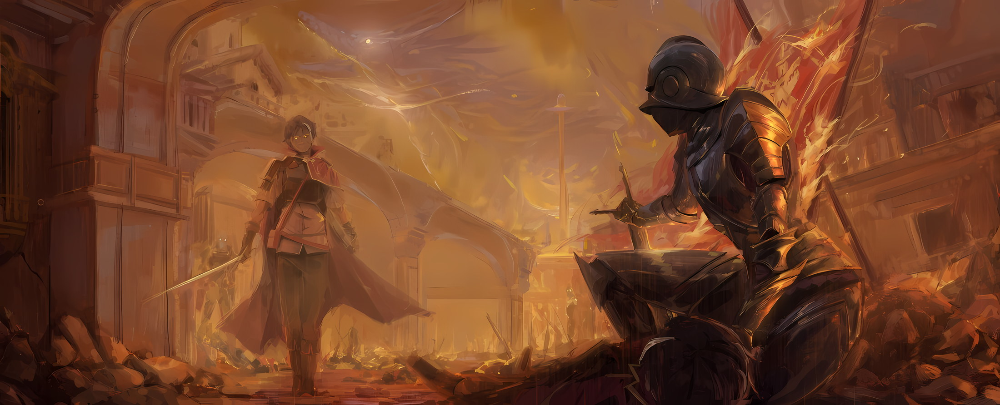
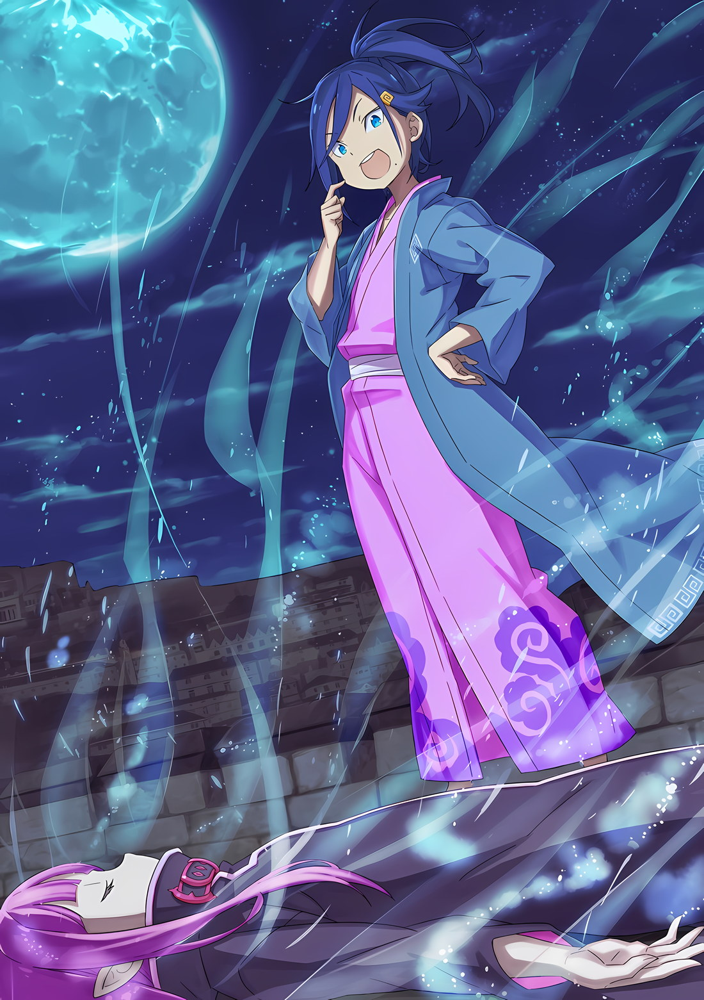

*※※※※※※※※※※※*

…Бледная кожа, лишенная цвета, и золотые венчики, расположенные в центре темных глазных яблок.

С внезапным появлением нежити имперская армия и армия повстанцев были буквально облиты холодной водой в ходе битвы за столицу Империи Рапгану.

Никто не успел заметить, как битва между живыми, борющимися за контроль над Империей, превратилась в борьбу за существование между живыми и мертвыми, и она становилась все более ожесточенной.

???: ААААААААААА…!!!

Подняв громкий вопль, он взмахнул двуручным мечом и обрушил его на стоящего перед ним противника.

В попытке блокировать удар противник поднял откуда-то взятый им потрепанный меч, но разящий удар все же разрушил такое хрупкое орудие и впился прямо ему в череп.

Черепная коробка была раздроблена, после чего последовала не захватывающая сцена извержения крови и мозгового содержимого, к тому же осколки черепа разлетелись в беспорядке, будто разбился керамический сосуд; совершенно немыслимый для человека способ смерти.

Не только внешний вид этих созданий был нечеловеческим, но и даже то, как они умирали, противоречило представлениям о человеческой природе.

Будучи жителем Империи, можно было наблюдать представителей рас, обладающих экстравагантными чертами внешности, но даже будь это противник с нестандартным количеством рук или глаз, способ его смерти оставался неизменным.

Закономерно, что у тех, кто обладает жизнью, ее завершение должно происходить подобающим этому качеству образом.

Однако у этой нежити ничего подобного не наблюдалось. Возможно, именно поэтому он до сих пор испытывал к ним столь сильное отвращение.

Даже в Империи, где жизни, по сравнению с другими странами, были дешевы, не попирали саму жизнь так, как это делала данная нежить.

Генерал: Держать линию фронта на расстоянии! Обеспечить эвакуацию Его Превосходительству Императору и гражданским лицам!

Солдаты: ОООООО…!!!

Когда один из «Генералов» громко отдал приказ, солдаты вокруг него заголосили, словно в лихорадке.

Вследствие появления нежити, бесчинств «Облачного Дракона» и приближающегося разрушения оплота водохранилища в северной части столицы Империи, Его Превосходительство Император принял решение оставить столицу и вывести все войска.

Имперская армия направила все свои силы на помощь в эвакуации Императора и жителей столицы. По иронии судьбы, с появлением третьей стороны борьба с повстанческой армией оказалась неразрешенной. Не осталось различий между регулярной армией и повстанцами, живые и мертвые были расколоты на друзей и врагов, и ожесточенная битва все бушевала.

Имперский солдат, только что сразивший одну нежить, удерживал позицию. Он и окружавшие его солдаты всеми силами стремились остановить как можно больше нежити, пускай даже одну, и повлечь их за собой на верную смерть.

Солдат: Понятия не имею, что это за твари. Но…

Солдат: Если это Его Превосходительство Император!

Солдат: Он обязательно найдет способ изничтожить вас!

Кем бы ни был враг, их вера в вершину Империи, Винсента Волакию, никогда не поколеблется. Это была главная причина, по которой солдаты могли удерживать свои позиции без малейшего намека на страх.

Винсент продолжал добиваться результатов. Количество пролитой крови и груды трупов врагов Винсента являлось основой веры в него имперских солдат.

Учитывая абсолютность его правления, боевой дух Винсента отличался чистотой от тех, кто так легкомысленно замышлял восстание.

И, соответственно, его боевой дух, нацеленный на нежить, сотрясающую Империю, был точно таким же.

Генерал: …Хк! Всем войскам, прикончить эту тварь!

«Генерал» снова закричал в ответ на наступление нежити с массивным телом.

Лысая нежить крупного телосложения взмахнула руками, и стоявшие на ее пути имперские солдаты разлетелись, словно клочки бумаги. Если бы они позволили этой крупной нежити делать все, что ей вздумается, в линии фронта образовалась бы брешь, и оборонительная позиция, на создание которой они потратили столько сил, вероятно, рухнула бы.

Чтобы не допустить этого, солдаты, повинуясь приказу «Генерала», разом бросились к огромному телу.

Солдат: Уу, ООАААААААААААААААА!

Солдат, подскочивший первым, получил удар, пробивший ему голову; уклоняясь от летящей к нему туши, один из имперских солдат, держась ближе к земле, нанес удар по ногам огромной нежити.

Атака удалась, и стойка противника рухнула. Но, совершив столь дерзкий поступок, имперский солдат встретился взглядом с золотыми венчиками, смотревшими на него сверху вниз, и узрел тусклый блеск меча, забранного у кого-то другого.

За мгновение до того, как он был рассечен его острием, перед имперским солдатом возникла фигура человека.

Генерал: Покончи… с этим… кх

Пронзенный в грудь, «Генерал» вскрикнул, и кровь хлынула из его рта.

Заслоненный «Генералом», имперский солдат перевел дух и, выскочив из-за его спины, со всей силы рубанул мечом по голове гигантской нежити.

От удара меч раскололся пополам, однако без какой-либо контратаки все тело огромной нежити разлетелось на куски.

И вот, когда «Генерал» рухнул наземь спиной, огромная нежить была сражена.

С пронзенной грудью «Генерал» встретил свой конец, а имперский солдат, восхищенный такой храбростью, взял из его рук меч на замену своему сломанному.

Затем, повертев головой по сторонам, он стал искать следующего противника…,

Имперский солдат: Ебанный ад…

Пробормотал имперский солдат, его щеки искривились, когда он пальцами опустил надетый на него шлем.

Только что избежав смерти, имперский солдат уставился на следующую нежить, появившуюся в его поле зрения… Там был «Генерал», который только что погиб, защищая его, с аналогичным снаряжением и лицом.

Рядом с ним лежал труп «Генерала», а сам он сжимал в руках генеральский меч.

И тем не менее, перед ним стоял с бледным лицом и золотыми глазами тот же самый «Генерал».

Имперский солдат: Ебанный ад…

Поле боя, где даже товарищи по оружию могли стать нежитью, превращаясь во врагов сразу же после смерти.

На этих затопленных землях, которые он хотел проклясть, где смерть была почти неминуема, имперский солдат поднял свой меч и продолжил сражаться, покуда позволяла его жизнь.

*△▼△▼△▼△*

…Соединенные драконьи повозки покинули столицу Империи Рапгану и направилась в сторону Укрепленного Города Гаркла.

Исторический союз, заключенный между лагерем Эмилии и руководством Империи Волакия, в этой повозке неожиданно столкнулся с непредвиденным вмешательством.

Хотя, что касается причины этого вмешательства…,

Анастасия: В чем дело? Несмотря на то, что мы так волновались за Нацуки-куна… было бы печально, посмотри он на нас как на незваных гостей.

Субару: Да не смотрел я так! Я рад, что мы смогли должным образом встретиться. Для Анастасии-сан это само собой разумеется, но даже если это Юлиус с его суровым выражением лица, я рад и тому, и другому.

Анастасия: Ну, это не совсем суровое выражение, просто причина в твоей внешности.

И вот эти двое, Юлиус и Анастасия, внезапно взошедшие на борт соединенной драконьей повозки, с интересом оглядели с ног до головы уменьшившегося Субару.

Естественно, для Субару встреча с этими двумя людьми была чем-то вроде неожиданности.

Уровень неожиданности был сравним с тем, когда Присцилла внезапно спустилась с небес в Городе-крепости.

Впрочем, почему эти двое оказались в Империи Волакия, Субару не считал себя настолько наивным, чтобы не догадаться о причине.

Субару: Я могу понять, что Эмилия-тан и остальные искали нас, но чтобы Анастасия-сан и Юлиус… проделали весь этот путь через Карараги только ради меня?

Анастасия: Да, именно так. Это было грандиозное приключение — проехать через три страны. Пересечь границу Волакии дело отнюдь не легкое, а само путешествие было, мягко говоря, довольно затратным.

Субару: Угх…

Анастасия: Не хочу показаться скупым человеком, но я буду рада, если вы не забудете о тех расходах, ради которых мы ломали спины.

Отправка в Империю не зависела от Субару, но когда он услышал о том, что за него беспокоятся, на его сердце стало тяжело. Под взглядом и словами Анастасии казалось, что Субару вот-вот будет обременен огромным долгом признательности.

Однако в этот момент возле шеи Анастасии раздался голос, который назвал ее «Ана»,

Ехидна: Не стоит безрассудно задирать Нацуки-куна. Учитывая его нынешнюю внешность, как ни посмотри, Ана, ты выглядишь как злодейка, издевающаяся над ребенком.

Субару: А…

Когда Субару приподнял брови на этот голос, вторая сторона ответила вилянием белого хвоста.

Это был лисий шарф, который Анастасия, одетая в кимоно, накинула на свои плечи. Иными словами, это была Искусственный Дух Ехидна, которую Анастасия носила с собой.

В отличие от Ведьмы с таким же именем, Субару узнал Ехидну как спутницу, с которой он вместе прошел через испытание Сторожевой Башни Плеяд. Услышав ее голос, Субару почувствовал облегчение и спокойствие.

Таким образом, из всех спутников, с которыми он расстался в Сторожевой Башне Плеяд, когда Субару показал свое лицо находившейся снаружи Патраш, только Мейли пока не увидела, что он в безопасности.

В любом случае…,

Эмилия: Анастасия-сан! Юлиус тоже, вы благополучно добрались до Волакии!

Анастасия: Я рада, что Эмилия-сан и остальные тоже в безопасности. Что касается трудностей во время путешествия… Я не смогла найти Нацуки-куна раньше, чем Эмилия-сан и остальные, поэтому мне немного неловко.

Эмилия: Нет, от одной этой мысли я чувствую себя ооочень счастливой. Спасибо.

Эмилия поприветствовала появление Анастасии с непринужденной улыбкой на лице.

Действительно, ситуация в Империи Волакия и так была напряженной, а тут еще и катастрофа с нежитью после гражданской войны. Поневоле возникает мысль, что она очень благодарна за то, что не пересеклась с Анастасией и остальными в столице Империи.

И на этом радость от столь неожиданного воссоединения прервалась…,

Винсент: Вы уже закончили возобновлять старую дружбу? Независимо от того, знаете вы об этом или нет, время военной конференции ограничено.

Тем, кто испортил настроение этими словами, с наглым видом и скрещенными руками, был Авель.

С необычайно терпеливым поведением он пытался оценить атмосферу, но, похоже, больше не мог молчать. Сделав язвительное замечание, Авель бросил косой взгляд в сторону Субару, а затем сказал,

Винсент: Еще один твой знакомый. Как неожиданно, что твое влияние простирается даже до Карараги.

Субару: Что касается этого, то все немного сложнее. Анастасия-сан и остальные находятся на стороне Карараги, но не совсем на стороне Карараги… Так что же с ними?

Озадаченный вопрос Субару был вызван присутствием Халибеля, который стоял рядом с Анастасией и остальными. Халибель, волк, известный как сильнейший в Городах-государствах Карараги, демонстрировал свое существование, потряхивая кисэру, которое он держал в руках. Субару стало интересно, какое положение занимает Анастасия и ее группа, учитывая титул и принадлежность Халибеля.

Юлиус: Я возьму это объяснение на себя. Я расскажу из первых уст о том, как нам удалось попасть на этот летающий драконий корабль.

На вопрос Субару Юлиус провел пальцем по своему шраму под левым глазом и принялся отвечать.

Новый белый шрам на лице Юлиуса, в сочетании с его непривычным внешним видом в традиционном японском костюме, подчеркивал его величественную и красивую ауру, вызывая у Субару странное ощущение.

Нельзя сказать, что влияние «Инфантилизации» не сказалось на восприятии Субару, но, скорее всего, это ощущение было вызвано изменениями со стороны Юлиуса.

Казалось, что нынешний Юлиус стал более спокойным, чем раньше.

Хотя в его прошлом поведении «Безупречного Рыцаря» присутствовала элегантность, это, казалось, отличалось от его нынешнего самообладания. Можно даже сказать, что оно резко контрастировало с ним.

Его поведение, будто он сбросил давно износившиеся доспехи, было следствием пережитого в Сторожевой Башне Плеяд или же за этим стояла какая-то другая причина? Это оставалось неясным.

Юлиус: …Ваше Превосходительство Император Винсент Волакия, я рад видеть вас в целости и сохранности. Для меня нежданно большая честь вновь иметь с вами аудиенцию.

Не обращая внимания на впечатление Субару, Юлиус, сделав шаг вперед, элегантно поклонился.

Авель, защищенный крупным телосложением Гоза, поднял брови в ответ на приветствие Юлиуса. Субару тоже испытывал чувство неловкости от того, что Юлиус сказал слово «вновь».

Винсент: «Вновь» говоришь, хм. Но я не помню, чтобы давал аудиенцию мечнику из Городов-государств, как и не узнаю твоего лица. Что побудило тебя сказать «вновь»?

Юлиус: Со всем уважением, однажды я получил возможность взглянуть на вас. Однако в то время я был не мечником Городов-государств, а Рыцарем Королевства.

Винсент: Королевства…

Услышав ответ Юлиуса, который не выказал ни малейшего страха, обращаясь к Императору Волакии, черные глаза Авеля сузились в глубоком раздумье, но он никак не смог найти воспоминания об этом событии.

С таким величавым поведением Юлиус никак не мог солгать. Таким образом, несмотря на то, что эти двое были действительно знакомы друг с другом, Авель забыл об этом.

Другими словами, это свидетельствовало о том, что эффект «Чревоугодия», из-за которого окружающие Юлиуса люди забыли о нем, еще не был устранен.

Винсент: Ты вводишь меня в заблуждение, и поэтому я не понимаю твоего поведения. …Беллстетз.

Беллстетз: Да. Я тоже не помню, чтобы когда-либо видел этого человека.

Винсент: Редкий случай, когда Беллстетз не присутствует на аудиенции. Иными словами, это вопрос не между мной и тобой, а более масштабный.

Одним лишь словом поставив под сомнение присутствие Юлиуса в воспоминаниях Беллстетза, Авель выявил, что в расхождении представлений между ним и Юлиусом замешаны экстраординарные обстоятельства.

Наблюдая за речью и поведением Авеля, Субару не мог не пробормотать: «Неужели он серьезно?»,

Субару: Разве можно так легко согласиться с этим? Что-то настолько абсурдное…

Винсент: Мы находимся в самом разгаре чрезвычайной ситуации, когда мертвые восстали, а Император был вынужден покинуть столицу Империи. Если говорить о великой схеме вещей, то тот факт, что твое тело уменьшилось, тоже не имеет большого значения. Важно то, может ли это быть воспринято как возможное.

Субару: Я бы не сказал, что мое уменьшение — это что-то, что происходит каждый день.

Какие бы глубокие тайны ни таил в себе этот мир, даже если они считались правдоподобными теориями только потому, что их можно было измыслить, это не означало, что это можно было так легко принять, сказав: «А, да, ясно».

Когда Субару насупил лоб, Беатрис, держа его за ладонь, другой рукой потерла морщинку меж его бровей.

Беатрис: Не стоит слишком много думать об этом, я полагаю. Гораздо удобнее, если у них хватит терпения принять это, чем если они будут упрямиться по этому поводу, в самом деле.

Субару: …Это верно. Кроме того, это довольно приятно, пожалуйста, продолжай в том же духе.

Беатрис: Вас поняла, я полагаю.

Пока Субару продолжал наслаждаться массажем бровей от Беатрис, Юлиус, отбросив вопросы, возникшие после первого акта приветствия, вернулся к основной теме.

Этим было…,

Юлиус: Прежде всего, присутствующая здесь леди — это Анастасия Хосин-сама… Полагаю, вы уже осведомлены о личности и статусе Эмилии-сама, но Анастасия-сама также имеет аналогичный статус.

Серена: Хохо, аналогичный мисс Эмилии. Другими словами, Кандидатки на пост следующего Короля Королевства собрались вместе в чужой стране. Боже мой, это довольно забавная и редкая ситуация.

Серена весело скривила шрам на своем лице, а Юлиус молча кивнул в ответ на ее слова. В подтверждение его слов взгляды членов лагеря Империи обратились к Эмилии, и, встретившись с ними, ее губы сложились в улыбку.

Эмилия: Да, Юлиус говорит правду. Мы с Анастасией-сан являемся Кандидатками Королевских Выборов, к тому же мы друзья.

Анастасия: Дружить мы будем после окончания Королевских Выборов. …В соответствии с этим вступлением, я являюсь представительницей карарагской Торговой Компании Хосин и одной из Кандидаток Королевских Выборов в Королевстве Лугуника.

Винсент: В дополнение к столь впечатляющему титулу, ты еще и являешься лицом Королевства?

Анастасия: Мне несколько жаль, если мой титул вас удивил, но, по правде говоря, это не единственный титул, который я имею на данный момент. Именно поэтому мы отправились в путь на этом летающем драконьем корабле, не так ли?

Совсем недавно Авель заключил дружеский союз с Эмилией. Когда он выразил свое неодобрение по поводу того, что в дело вмешался еще один человек из Королевства, Анастасия пресекла это.

Когда Анастасия отметила, что у нее есть титул, который еще не раскрыт, Эмилия приложила палец к своим губам с недоуменным выражением лица.

Эмилия: Анастасия-сан является представительницей Торговой Компании, Кандидаткой Королевских Выборов… И это еще не все? О, может быть, работодательница группы наемников, в которую входят Мими и остальные?

Анастасия: «Железный Клык» находится под юрисдикцией Торговой Компании Хосин, поэтому я не считаю нужным добавлять его к титулу представительницы Торговой Компании. Но все же это отдельный вопрос.

Эмилия: Отдельный…

Сказав Анастасии, что она некорректна, Эмилия пробормотала это очаровательным, обеспокоенным голосом.

А рядом с Анастасией, которая улыбалась поведению Эмилии, находился Юлиус, жестом указавший на нее рукой,

Юлиус: По этому случаю Анастасия-сама действует от имени Лиги Городов Карараги. Будучи назначенной эмиссаром, она отправилась в Империю.

Отто: …Лиги Городов Карараги!?

Услышав ответ Юлиуса, голос Отто сорвался.

Отто нарушил молчание с неловким выражением лица, и Субару счел это подходящей возможностью спросить: «Что такое Лига Городов?»,

Субару: Я слышал, что Карараги называют Городами-государствами, страной со множеством городов, объединившихся вместе.

Отто: …Это правильное представление. Города-государства Карараги — это, грубо говоря, страна, состоящая из десяти крупных городов. В каждом городе есть свой мэр, который является его представителем, и есть совет, сформированный этими людьми, который и является Лигой Городов.

Субару: Хм… Это похоже на Совет Десяти в Пристелле.

Отто: Скорее, Совет Десяти в Пристелле вдохновлен Лигой Городов. Как и в случае с «Павильоном Водное Хагоромо», в Пристелле на границе наблюдается большой приток представителей культуры Карараги.

Субару: О, если подумать об этом…

«Павильон Водное Хагоромо», где они остановились по приглашению Анастасии и ее спутников, как внутри, так и снаружи имел стиль вафуу, который был привнесен из Карараги.

Забегая вперед, Субару полагал, что японский стиль Карараги сам по себе может быть знанием, пришедшим из его мира, но до поры до времени он отложил эту мысль.

В любом случае…,

Субару: Это не мирная ситуация, когда ты не только Кандидатка Королевских Выборов, но еще и прибыла в Империю по приказу Лиги Городов в качестве эмиссара.

Анастасия: Ты прав. Хотя и не так плохо, как с Лугуникой, но у Волакии не самые хорошие отношения с Карараги. Я имею в виду, что Империя в принципе враждебна ко всем.

Субару: Наверное, это потому, что Император такой резкий. Не исключено, что отныне его углы станут немного круглее.

Винсент: Молчать.

Когда Субару присоединился к наглым и грубым комментариям Анастасии, Авель, не меняя выражения своего лица, сделал Субару замечание.

В ответ на это Субару высунул язык, отчего Юлиус был ошарашен этим обменом с Авелем.

Сразу после этого он удивленно посмотрел на Субару, но так как объяснять было бы очень долго, Субару решил скрыть это, также высунув язык в сторону Юлиуса.

Анастасия: Мы слышали о беспорядках в Волакии, когда были в Карараги, но прибыли сюда не для того, чтобы воспользоваться этим.

Винсент: Это очень благоприятно. Однако это не означает, что у тебя нет намерения это сделать.

Анастасия: Что ж, чтобы выжить, нужно быть сильным. Разве вам не было бы неудобно при безвозмездной помощи?

Винсент: …Разумеется.

При виде озорства в глазах Анастасии, взгляд Авеля ненадолго переметнулся к Эмилии.

Эмилия смотрела на них с любопытством, но, с точки зрения Авеля и Анастасии, добрые намерения Эмилии были, пожалуй, куда более неожиданными.

Даже Субару не стал бы говорить, что они должны безвозмездно помочь Авелю и остальным, а если бы и сказал, то Отто устроил бы ему тысячу адских проповедей.

Затем хриплый голос попросил разрешения высказаться.

Получив молчаливое согласие Авеля, Беллстетз обратил свои узкие, почти нитевидные глаза на Анастасию и Юлиуса, сказав,

Беллстетз: Мне любопытно, позвольте спросить, почему Города-государства направили эмиссара в Империю при ее нынешнем состоянии? Может быть, вы подозреваете, что проблемы Империи дошли до вашей страны, и вы их преследуете?

Анастасия: Даже в Карараги, где считают, что «Время и деньги имеют одинаковую ценность», вряд ли бы пришли говорить о деньгах в разгар столь напряженного дня. Кроме того, вмешательство во внутренние дела принесет только убытки, если к этому не быть готовыми.

Винсент: Ты лукавишь. Разве я не говорил, что время ограничено.

Анастасия: Вы очень нетерпеливы, не так ли? Ладно, ладно, ладно. …Халибель.

Халибель: Хм? Ты не против, чтобы я говорил?

Анастасия подозвала к себе Халибеля, так как лидеры Империи с нетерпением ждали дальнейшего развития событий.

Прислонившись к стенке драконьей повозки, Халибель, пускавший дым из своего кисэру, поглаживал шерсть на подбородке, наблюдая за тем, как вокруг него собираются взгляды.

По мнению Субару, его мех был действительно красивым, пышным и густошерстным.

Халибель: Тогда я продолжу… На самом деле, в Карараги уже давно происходит что-то странное. В общем, Лига Городов настоятельно просит меня разобраться с этим.

Субару: Что-то странное?

Халибель: Вы ведь можете представить, о чем я говорю, верно? …Хотоке*-сан начали двигаться.

* В Японии 仏 (хотоке) — это слово, используемое для обозначения Будды, но оно также часто используется для обозначения мертвых. В данном случае Халибель использует катаканский вариант ホトケさん (Хотоке-сан) этого термина. Это уникальный японский способ обозначения умерших, и поэтому Субару понимает, что он означает, в то время как остальные люди Волакии и Лугуники остаются в замешательстве.

Эмилия: Хо-то-ке?

Субару ахнул от этих непринужденных, слегка претенциозных слов Халибеля. Но Эмилия, Гоз и другие наклонили головы, услышав незнакомое слово.

Увидев такую реакцию, Халибель криво улыбнулся и сказал: «Извините, извините»,

Халибель: Ну да, точно, эта фраза на карарагском диалекте, так что никто из вас не смог бы ее понять. В Карараги, когда вы говорите Хотоке-сан, это означает труп. Я пытаюсь сказать…

Субару: …Ты хочешь сказать, что Города-государства также понесли ущерб от нежити?

Халибель: Что-то в этом роде.

Халибель спокойно кивнул, и тот же шок, который только что испытал Субару, вновь охватил Эмилию и остальных.

Учитывая, что нежить появилась в битве за столицу Империи, если то же самое произошло и в Карараги, то это означает, что крупный инцидент произошел не только в Империи.

Субару: Тогда, если нам не повезет, это может иметь глобальный масштаб, верно? Что случилось с зомби-беспорядком в Карараги?

Халибель: Зомби?

Субару: Ходячие мертвецы! Будет легче понять, если у нас есть для них название.

Халибель: Хахаа, понятно, понятно. Почему-то, несмотря на то, что я не знаю этого слова, оно так хорошо ложится на язык.

Получив ответ Субару, Халибель погрыз свое кисэру и ответил в несколько приподнятом настроении. Но, раздосадованный такой реакцией Халибеля, Субару поспешно выкрикнул: «Халибель-сан!».

Если с каждым мгновением катаклизм нежити постоянно разрастался…

Субару: Это значит, что мы не можем терять ни минуты. То, что вы приехали в Империю, это…

Халибель: Не волнуйся, я уже ликвидировал зомби-беспорядок, случившийся в Карараги. Так что не стоит так переживать насчет этого.

Субару: А…

Халибель: Ты такой милый паренек, как насчет конфетки…? Ахх, у меня нет с собой конфеток.

Халибель, даже не порывшись в рукавах, легкомысленным тоном успокоил Субару. Последний невольно надул губы, чувствуя упрек в своей поспешности.

Юлиус: Согласно результатам расследования, проведенного мистером Халибелем, нежить… Нет, зомби, следуя за потоком, где был нанесен ущерб, похоже, постепенно продвигаются в сторону Империи. Поэтому, чтобы расследовать чрезвычайную ситуацию, произошедшую в их стране, и предупредить вашу страну об опасности, Лига Городов…

Анастасия: Мы наняли Халибеля, так как он был полностью информирован о ситуации, а я взяла на себя роль эмиссара Лиги Городов. Это также было неплохим подспорьем при пересечении границы.

Так Анастасия быстро подвела итог тому, как она взяла на себя роль эмиссара Лиги Городов.

Может быть, она и старалась не говорить слишком серьезно, но, к сожалению, как бы она ни старалась, содержание этого вопроса было таково, что не могло не стать тяжелым.

В частности, тот факт, что ранее в Карараги произошел катаклизм нежити, был…,

Винсент: Инцидент, произошедший в Городах-государствах, предшествовал Империи. Если это так, то можно сказать, что нынешняя катастрофа нежити была принесена в Империю из вашей страны, верно?

Анастасия: Наверное, это возможно, но у нас другое мнение.

Винсент: Хо. Если это не попытка избежать ответственности, то дай мне это услышать.

Анастасия: Похоже, что Карараги было первым местом, где Хотоке-сан… где зомби, нанесли ущерб. …Но я думаю, что главной целью была Волакия, а Карараги лишь тренировочная площадка.

Анастасия ответила на ехидные замечания Авеля с неизменной позицией.

Вопреки ее элегантной манере поведения, гипотеза, которую она выдвинула, была довольно экстремальной. Мнение о том, что Карараги — это тренировочная площадка, а Волакия — главное событие, было слишком суровым.

Эмилия: Почему Анастасия-сан так считает? Что Карараги — это несерьезно, а Волакия — это реальная цель.

Анастасия: Масштаб ущерба.

Когда Эмилия задала вопрос, который имел в виду Субару, Анастасия ответила именно так. В то время как взгляд ее бледно-бирюзовых глаз столкнулся с аметистовыми глазами Эмилии,

Анастасия: Рассказ был запутанным, но Гаркла получила первые сообщения о причиненном столице Империи ущербе. Даже если это не совсем точно, это правда, что зомби захватили столицу Империи, не так ли?

Юлиус: Необычно, что столица Империи в центре Волакии захвачена, а ее граждане массово эвакуированы. Отныне я не сомневаюсь, что намерения «Врага», создавшего эту ситуацию, лежат в Империи.

Винсент: Ваши рассуждения здравы.

Выслушав умозаключения Анастасии и Юлиуса, Авель дал краткий ответ.

Однако, глубоко задумавшись за своими спокойными черными глазами, Император, предварив свою речь словами «В этой связи», перевел взгляд на Халибеля,

Винсент: Ущерб, который, по твоим словам, ты пресек в Городах-государствах, что там произошло на самом деле? Несмотря на состояние Империи, я ничего не слышал о том, чтобы Города-государства были разрушены нежитью.

Халибель: Верно. Я остановил их до того, как это случилось… впрочем, даже если я так говорю, похоже, что их целью было не навести беспорядок в Карараги, а просто размяться, как и сказала маленькая Ана.

Винсент: Что это значит?

Халибель: Проще говоря, зомби, с которыми я столкнулся, полностью заменили всех людей в городе и вели тот же образ жизни, что и живые. Похоже, они не хотели, чтобы мы знали, что они поменялись местами.

Субару: Чт…

Когда Халибель раскрыл правду, Субару потерял дар речи.

И не только Субару был поражен. У всех собравшихся мудрых людей было задумчивое выражение лица, и все, кто был удивлен, как Субару, потеряли дар речи.

Наверное, этого и следовало ожидать. Просто сейчас история Халибеля значительно отличалась от того, что можно было предположить.

Гоз: Ты, ты говоришь, что эта нежить дошла до того, что маскируется под живых? Да, это правда, что Ее Превосходительство Ламия говорила так же, как и тогда, когда была жива…! Но даже так!

Серена: Если воспринимать их как живых, то это разрушает представление о них как о противнике, который нападает без разбора. То, что некоторые из них разумны, уже доставляет неудобства, но если это произойдет, то придется сильно изменить отношение к ним как к врагам. Это становится слишком занятным.

Гоз: Что вас так занимает, Верховная Графиня Дракрой! Даже ваша наглость должна иметь свои границы!!!

Взгляды Гоза и Серены столкнулись как шокирующее воплощение этого заблуждения.

Впрочем, такая реакция этих двоих была естественной. На самом деле, Субару придерживался того же мнения. Это были не те противники, с которыми можно было просто сражаться, это был вопрос использования их слабостей.

Но все же…,

Эмилия: Эй, Халибель-сан, вы сказали, что все в городе превратились в «Зонби»… Но сколько людей жило в том городе?

Это был вопрос, который должен был кто-то задать.

Субару пожалел, что вместо себя он позволил сделать это Эмилии. И это сожаление стало еще сильнее, когда он услышал ответ Халибеля.

Это было потому…,

Халибель: …Примерно, где-то около двух тысяч человек.

Эмилия: Так много…

Ответ Халибеля четко обозначил масштаб ущерба.

Можно было только представить себе такой масштаб; от этого выражение лица Эмилии сильно помрачнело, а в груди Субару засела холодная острая заноза.

Однако были не только те, кого огорчил ответ Халибеля, но и те, кто смотрел в будущее.

Винсент: Если столько мертвых замаскировались под живых, то мне остается только констатировать, что дела обстоят весьма скверно. Что послужило причиной их разоблачения?

Анастасия: Причина, по которой их обнаружили, заключалась в количестве припасов, которые поступали в город и вывозились из него. Они маскировались, но количество живых и мертвых людей не совпадало. Хотоке-сан не нуждаются в пище и питьевой воде, отсюда и расхождение.

Винсент: Граница между живыми и мертвыми. …Похоже, ее нельзя пересечь.

В отличие от Субару, чьи эмоции его остановили, Авель и Анастасия продолжили.

В то время как он чувствовал разочарование от этой разницы, он также не хотел забывать о своих словах, сказанных Авелю, о необходимости не отбрасывать это разочарование.

Винсент: Беллстетз, у тебя ведь была армия, размещенная в западной части Империи, верно?

Безразличный к тому, что Субару скрипит зубами, Авель задал этот вопрос Беллстетзу.

Беллстетз коротко кивнул головой в ответ на вопрос Императора, и,

Беллстетз: Мы получали сообщения о волнениях вдоль государственной границы с Карараги на западе. Это было до того, как признаки гражданской войны разрослись, но мы опасались встречных шагов и поляризации повстанческой армии, поэтому поддерживали постоянную активность, чтобы держать их в узде. …Не может быть.

Винсент: Тот, кому была доверена эта армия, должно быть, Груви Гамлет, не так ли?

Узкие нитевидные глаза Беллстетза слегка приоткрылись, обнажив его удивление. Как бы соглашаясь с мыслью премьер-министра, Авель испустил небольшой вздох.

Тот, о ком шла речь, несомненно, был одним из «Девяти Божественных Генералов»… он должен был быть Генералом Первого Класса, с которым Субару так и не довелось встретиться лицом к лицу.

Причина, по которой Авель вяло сузил глаза, произнося имя этого персонажа, была…,

Гоз: Ваше Превосходительство! Нет… Нет! Генерал Первого Класса Груви!

Винсент: Сдерживая беспорядки на границе с Городами-государствами… Если из-за этого они не участвовали во время большой битвы в столице Империи, и если дело дошло до того, что мы даже не можем с ними встретиться, то нам остается предполагать только худшее.

Серена: Предполагать только худшее, хм? Даже мне трудно назвать это забавным.

Лицо Гоза покраснело, и Серена согнала с губ тонкую улыбку.

Кивнув на реакцию ведущих фигур, Авель заговорил.

Винсент: …Груви Гамлет и его армия уже попали в руки нежити. Если они не объединятся с нами в будущем, мы должны действовать исходя из этого предположения.

Гоз: …Кх!

В ответ на слова Авеля все тело Гоза задрожало, и он заскрежетал коренными молярами.

Это была не метафора, он действительно заскрежетал молярами. По телу воина по имени Гоз Ральфон пробежала волна негодования: вероятность того, что он потерял своего товарища, сильно по нему ударила.

Даже для Субару и остальных, не знавших его лично, это был немой удар.

Беллстетз: Ваше Превосходительство, в соответствии с вашими рассуждениями, если нежить может прикидываться живой, то…

Винсент: Несомненно, сообщения из разных регионов сами по себе утратили достоверность. Без повышения точности информации вступить в битву за возвращение столицы Империи будет практически невозможно.

Какие из доставленных донесений принадлежали живым союзникам, а какие врагу-нежити, было неизвестно.

Представив себе такую пугающую возможность, Субару затаил дыхание.

Субару: Другими словами, именно по этой причине Лига Городов доверила Анастасии-сан быть их эмиссаром…

Анастасия: Ощущение кризиса, вы ведь тоже его чувствуете, не так ли? Нельзя допустить, чтобы оно распространилось. Поэтому нам разрешили поехать лишь небольшой группой надежных людей.

Анастасия кивнула, и Юлиус с Халибелем тоже выразили согласие.

В связи с началом противостояния с нежитью, они были двумя надежными людьми, выбранными за их индивидуальный боевой потенциал.

Субару: А как же Рикардо, Мими и остальные?

Анастасия: Они создают единый фронт с Лигой Городов на границе. В принципе, они не собираются пересекать границу Империи. Если это не закончится Империей, Карараги придется быть наготове.

Халибель: Это не очень хорошее предзнаменование, но дайте мне передохнуть. Что ж, сейчас уже слишком поздно что-либо предпринимать против острого языка маленькой Аны.

Анастасия: Халибель.

Анастасия, ответившая на вопрос о местонахождении отсутствующего «Железного Клыка», с улыбкой посмотрела на Халибеля. Она мягким жестом приложила руку к щеке, не сводя с него глаз,

Анастасия: Я не обратила на это внимания в первый раз, но, может быть, ты перестанешь называть меня маленькой Аной? Я уже не ребенок, к тому же я представительница Карараги.

Халибель: Хотя ты и говоришь, что не ребенок, ты выглядишь ничуть не иначе, чем когда была маленькой девочкой. Да и твой характер не изменился с тех давних времен, когда ты вместе с Рикардо была такой плутовкой…

Анастасия: Халибель.

Халибель: Ладно-ладно, виноват.

Махнув рукой, Халибель поднял белый флаг перед Анастасией.

Кажущиеся знакомыми отношения между этими двумя людьми были интригующими, но по сравнению с насущной проблемой это можно было считать лишь мелочью.

С точки зрения защиты от беспрецедентного катаклизма нежити…

Юлиус: Я еще раз хотел бы передать намерения Лиги Городов Карараги. Для того, чтобы сдержать ущерб, нанесенный нежитью… ущерб, нанесенный зомби, Города-государства окажут Империи максимально возможную поддержку.

Винсент: …Что касается поддержки, мы можем обсудить детали позже. Есть ли у вас какие-нибудь идеи по поводу того, как остановить эту ситуацию?

Халибель: Что касается этого, то восставший Хотоке-сан не является естественным явлением, так? Несомненно, это результат коварных замыслов некоего типа. Другими словами…

Анастасия: …Организатор, заклинатель, зачинщик или как вы там еще его называете, должен быть обезврежен.

Огромная проблема, которая может ввергнуть весь мир в кризис, и план ее решения.

Остановить незримого «Врага», ответственного за эту проблему, было первоочередной задачей Королевства Лугуника, Империи Волакия и Лиги Городов Карараги…

Субару: …Неопознанный «Враг».

Подумав о «Враге», истинная природа которого была неизвестна, Субару тихо пробормотал это.

Как выглядел этот «Враг», и о чем он думал, готовясь совершить столь ужасные варварские действия?

От одной только мысли о трудностях и препятствиях, которые ждали их на пути к победе над этим пока еще невиданным «Врагом», по его позвоночнику струился холодный пот.

Однако…,

Субару: …При таком количестве собравшихся здесь участников.

Сердце Субару, охваченное страхом, все же было ободрено присутствием тех, кто его сопровождал.

Лагерь Эмилии, который прибыл в Империю в поисках Субару и остальных, лидеры Империи, твердо решившие объединиться во имя ее защиты, и надежное подкрепление из Карараги.

Субару: Что бы ни задумал «Враг», мы ни за что не проиграем…!

Это было искреннее заявление Нацуки Субару о войне с «Врагом».

*△▼△▼△▼△*

…Разумеется, это произошло примерно в то же время, что и всплеск энтузиазма Субару в соединенных драконьих повозках.

Свирепые воды водохранилища хлынули из разрушенного оплота, захлестнув столицу Империи.

В то время как мутный поток сметал здания, рвал на части людей и деревья, синеволосый мальчик, выбравшийся на возвышенность, прикрывался козырьком ладони, разглядывая открывающийся вид.

Мальчик: Боже, я пытался выиграть столько времени, сколько мог, но мне интересно, все ли смогли успешно сбежать. Надеюсь, Босс и остальные не позволили крови прилить к их головам и не испортили решение об отступлении.

Легкомысленно пробормотал Сесилус, одетый в кимоно и носящий зори.

В этой грандиозной битве за столицу Империи, когда самая сложная во всех отношениях проблема, связанная с полным изменением ситуации, была определена его природной интуицией и драматическим мышлением, ведущий актер мира ринулся на сцену.

На самом деле, если бы Сесилус не предпринял столь эгоистичных и произвольных действий, столица Империи была бы поглощена водой намного раньше, и гораздо больше людей не смогли бы спастись, что привело бы к огромному количеству жертв.

В этом смысле действия Сесилуса, не оправдав ничьих ожиданий, случайно привели к удачному для многих исходу.

Однако это было не так для Сесилуса, как для человека, которого это касалось.

С внезапным появлением нежити ситуация в битве за столицу Империи изменилась, и, пытаясь застать врасплох третьего «Врага», пытавшегося вырвать победу путем грубого вмешательства, Сесилус бросился вперед.

Несомненно, он пребывал в таком состоянии, что мог бы сам себе петь дифирамбы о том, что это было представление, призванное очаровать весь мир.

И все же…,

Сесилус: Даже так, это было совершенно неожиданно.

В столице Империи, поглощенной мутным потоком, Сесилус пробормотал это, почесывая свои щеки при виде нежити, которая, как и он, перебралась на возвышенности, но все еще продолжала зацикливаться на живых.

Не было сомнений, что они существовали вне естественного порядка вещей, воскрешенные с помощью техники, неизвестной даже Сесилусу.

Более того, ему довелось столкнуться с самим творцом, сделавшим их такими.

И хотя до этого момента все происходило в соответствии с интуицией Сесилуса…,

Сесилус: …Невероятно, кто бы мог подумать, что ситуация не разрешится даже после смерти заклинателя!

К ногам Сесилуса, когда он повысил голос, рухнул заклинатель, который воскресил и повелевал нежитью.

Молодая девушка с красивыми розовыми волосами и длинными ушами была примерно того же возраста, что и Сесилус. Столкнувшись лицом к лицу с «Синей Молнией», Сесилусом, она была «Ведьмой», чья жизнь уже подошла к своему концу.
