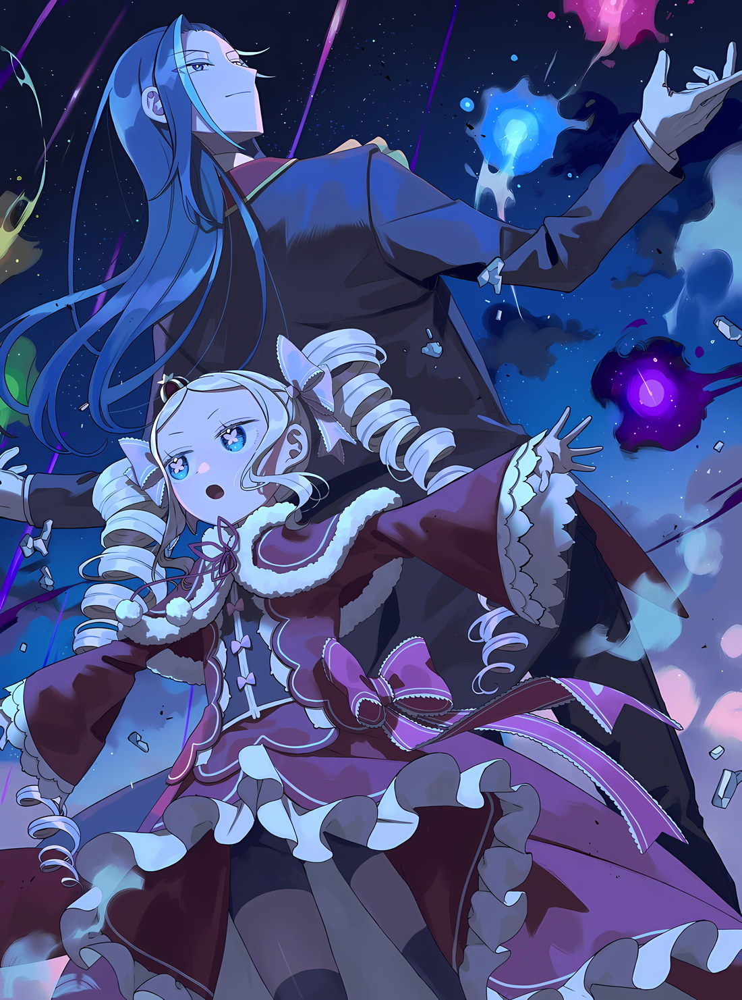
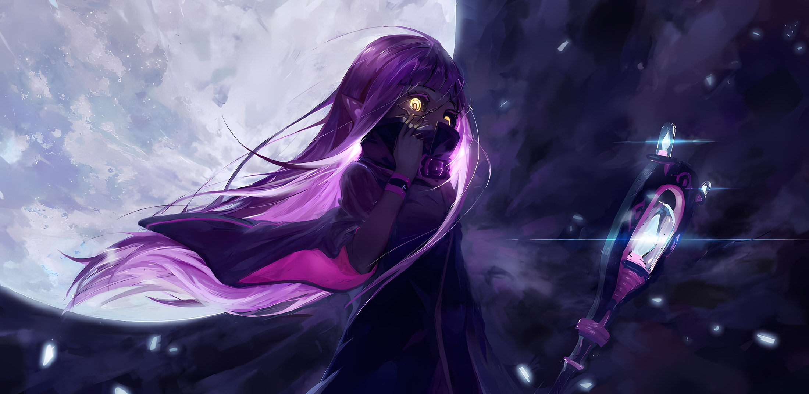
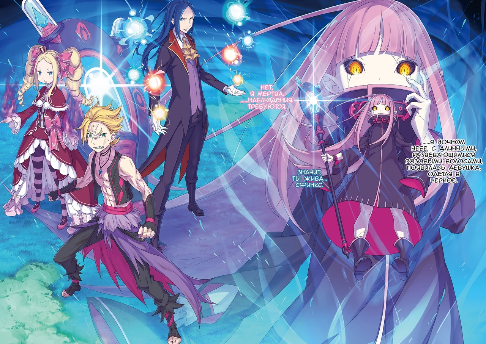

*※※※※※※※※※※※*

Как бы это ни было необходимо, но уверенность в том, что это беспрецедентная ситуация, только усиливалась.

Среди событий, происходивших в Лугунике и занесенных в книги по истории, был случай, напоминающий эту необычную ситуацию, но в той череде событий этот случай не рассматривался как нечто значительное.

……«Война Полулюдей».

Это была массовая гражданская война, происходившая в прошлом Лугуники, и, как и в нынешней ситуации, это был единственный зафиксированный в истории случай, когда мертвые восстали в качестве врагов.

Однако в книгах по истории основное внимание уделялось трениям между человеческими и получеловеческими племенами, а о необычных нападениях, совершенных в рамках гражданской войны, подробно не писалось.

Это было прискорбно. Если бы подробности того времени были записаны более обстоятельно…,

???: Я не отстану от этих тварей!!!

С ревом и взмахом кулака группа имперских солдат, каждый из которых был бледен лицом, разлетелась в разные стороны.

Опираясь на энергию, исходившую от земли, на которую он твердо ступил, он со всей силы нанес удар, который, пожалуй, был ближе к рубящему удару, чем к обычному.

Он быстро повторил атаку во второй и третий раз, причем каждый удар разбивал строй противника. …Нет, это не было чем-то таким впечатляющим, как строй.

На первый взгляд, силуэты противника приближались бок о бок, но у них не было ни тактического руководства, ни координации, ни стратегии. Если бы это было так, то они были бы просто скоплением отдельных людей.

Если бы они были просто скоплением индивидуумов, Гарфиэль не стал бы отставать от них.

Однако…,

???: Эх-ах! Уах!

Резкий выпад, и шею Гарфиэля пронзил двойной удар.

Почувствовав, что волосы встают дыбом, он уставился на своего противника; тот внезапно появился, отбрасывая осколки разбитой нежити, — это была другая нежить, непохожая на остальных.

Гарфиэль: Тц.

Щелкнув языком, он приподнял плечо и проверил шею, по которой слегка прошлось острие меча.

Разница между первым и вторым ударами была примерно в палец. Это была техника мастера, который намеренно демонстрировал удар, от которого можно уклониться, а затем вторым ударом пытался отрубить противнику голову.

Они были не более чем группой людей без какой-либо формации, но среди них изредка встречались те, кто обладал подобным уровнем мастерства.

В результате все оказалось несколько сложнее, чем предполагалось, и он решил, что из каждых двадцати особей нежити есть один опытный. В связи с этим он не мог бездумно поддерживать своих союзников, говоря, что все будет хорошо, если они будут работать вместе.

Если исходить из оценки ситуации, то вполне возможно, что отряд из ста человек может быть уничтожен одной опытной нежитью.

Опытная нежить: Эх-ах! Уах…!

Гарфиэль поморщил нос, после чего нежить снова нанесла тот же двойной удар.

В противоположность тому, что было показано ранее, дальность действия техники изменилась и стала более смелой. Раньше разница составляла кончик пальца, а теперь кулак. Глубокий порез размером с кулак мог оказаться смертельным, независимо от того, насколько поверхностным он был.

Однако нежить, применившая этот прием, расширила глаза, и ее лицо резко контрастировало с ликом уверенного в победе человека.

Причина была проста… правая рука, в которой он держал меч, сломалась у запястья.

Гарфиэль: Сколько бы очевидных приемов ты ни проделывал, хватка меча, когда ты делаешь выпад, всегда остается в одном и том же положении. «У Трехголового Вальгрена Только Одно Туловище»… Ха!

Он сменил положение, чтобы раздробить левую руку, а затем вогнал кулак в изумленное лицо противника.

Как только удар пришелся по затылку, голова нежити разлетелась, словно лопнувший фрукт. Когда голова раскрошилась, по ее туловищу и ногам пошли трещины, в результате чего все тело нежити разбилось вдребезги.

Гарфиэль: Мне это не по душе.

Глядя на останки поверженного врага, Гарфиэль произнес эти слова.

Гарфиэля раздражало то, как нежить была повержена и уничтожена. Поскольку эти создания были уже мертвы, описывать это как способ смерти было бы неуместно, и более того, само то, как они рассыпались, лишало Гарфиэля ощущения того, что он сражается с чем-то, что имеет жизнь.

Оставалось лишь слабое ощущение холода, заставляющее его задуматься о том, против чего же он сражается.

Гарфиэль: …

Гарфиэль вытер рукой пот с подбородка и, оглядевшись, заметил на ночной равнине, ставшей полем боя, нескончаемый поток солдат нежити.

Для борьбы с ними была создана тактическая группа задержки, в которую входил Гарфиэль.

Изначально Гарфиэль был назначен в медицинское подразделение, чтобы использовать свою магию исцеления, но политика предотвращения ранений подходила его натуре больше, чем лечение раненых.

*Петра: «Гарф-сан, твоя суетливость вызывает беспокойство! Если ты такой неугомонный, иди и помоги тем, кто сражается сам.»*

Так сказала Петра, которая усердно работала в том же медицинском подразделении, что и Гарфиэль.

Гарфиэль, хотя и не по ее настоянию, поспешил наружу. В действительности, будучи добровольцем, он считал, что добился неплохих результатов.

Однако он не был настолько самодоволен, чтобы сказать, что работает здесь лучше всех.

Причина была в том, что…,

???: Сделайте это!!!

В черноте ночи раздался резкий крик, сразу после которого послышались звуки выстрелов из натянутых тетив.

В ответ на крик Таритты, вождя «Племени Судрак», посыпался невероятно плотный град стрел.

Они падали не по отдельности, а единым скоплением, от которого невозможно было уклониться; единственным способом спастись было либо поймать их, либо отразить. Нежить, не имея другого выхода, пыталась использовать свое оружие и щиты.

Однако…,

Куна: Вижу!

Хоули: Давай!

Нежить, сосредоточенная на небе над головой, была поражена стрелой, выпущенной из мощного лука под напористый голос.

Сказать, что их пробило насквозь, было бы преуменьшением; этот абсурдный удар был подобен тому, как если бы их на полной скорости протаранила драконья повозка. Нежить, занявшая оборонительную позицию, была снесена вместе с группой, стоявшей за ними.

Гарфиэль: Крутой я не должен проигрывать вам, но это, блядь, безумие.

Слабая нежить была уничтожена ливнем стрел, захлестнувшим все вокруг, а сильная нежить, пережившая эту атаку, была расстреляна из мощного лука. Ритм слаженных действий охотников очень впечатлил Гарфиэля.

Даже движения Гарфиэля остановились бы, если бы он превратился в ежа от пронзивших его стрел, а к этому прибавлялся еще и огромный урон от мощного лука, от которого он не мог уклониться. Он счел за счастье иметь такую тактику на своей стороне.

Гарфиэль: Ну, я понятия не имею, что там происходит…

В отличие от огромной силы Судрак, еще одна группа вызвала восхищение Гарфиэля, но уже другим способом… Они сопровождали Субару, который должен был в одиночку сражаться в Империи, они были группой, которая имела суровый вид; самопровозглашенный «Эскадрон Плеяд».

Плеяды: ВПЕРЕД, ВПЕРЕД, ВПЕРЕД, ВПЕРЕД…!

Плеяды: СИЛЬНЕЙШИЕ! НЕСОКРУШИМЫЕ! ПЕРВОКЛАССНЫЕ! ПРЕВОСХОДНЫЕ!!!

Плеяды: УООООООО…!!!

В разгар ночной битвы они звучали чрезвычайно громко, и на взгляд Гарфиэля не было заметно, чтобы кто-то из них отличался особым боевым мастерством. Конечно, многие из них, похоже, отточили свои приемы до уровня имперского солдата.

Трудно сказать, было ли большинство из них тренированными, но они хорошо поддавались своим инстинктам и буйству.

Но, несмотря на это, они были сильны. Уже сейчас разница в физической силе была как между взрослым и ребенком.

???: Это восхитительно. Их сила освежает.

Голос донесся до Гарфиэля, который смотрел на то, как сражается Эскадрон Плеяд. Когда он повернул голову, рядом с ним стояла женщина с темно-коричневой кожей и выкрашенными в красный цвет волосами… Мизельда.

Мизельда, у которой одна нога была деревянной, с улыбкой цвета крови смотрела на жестокий стиль боя эскадрона.

Гарфиэль: Я не очень понимаю, но они имеют какое-то отношение к Капитану. Я задаюсь вопросом, что они делают, но я не беспокоюсь, что это что-то плохое.

Мизельда: Капитан… Субару, что ли? Эмилия и остальные очень ему доверяют.

Гарфиэль: Ха! Доверяют? Такое слово преуменьшение. Капитан — это человек, человек, который возвращает ожидания и веру крутому мне в сто кратном размере!

Это не было ни преувеличением, ни блефом; от чистого сердца Гарфиэль нисколько не сомневался в том, что восхваляет его таким образом. После ответа Гарфиэля улыбка Мизельды изменилась.

С маски войны она переменилась на нечто более спокойное и несущее в себе понимание.

Мизельда: Мне тоже понятно это чувство. Во время «Ритуала Крови» и во всех последующих сражениях Субару продолжал демонстрировать нам свою силу. У него душа воина. Пусть у него и не очень красивое лицо для мужчины, но он стал бы хорошим мужем для Таритты.

Гарфиэль: Хватит говорить о его лице! Капитан также беспокоится о том, как выглядят его глаза! Кроме того…

Мизельда: Кроме того?

Гарфиэль: Сколько бы Капитан ни очаровывал других, у него уже есть та, в которую он решил влюбиться.

Мизельда: …Понятно. Да, именно так.

Гарфиэль потер пальцем переносицу, а Мизельда глубокомысленно кивнула.

Он не знал, в какой степени ее слова были шуткой, а в какой — искренней похвалой, но тот факт, что Субару ценили и в Империи, вызывал у Гарфиэля гордость.

Где бы он ни находился, Субару привлекал к себе окружающих и добивался больших результатов.

Однако, несмотря на то, что Субару мог прекрасно уживаться в любом месте, где бы он ни оказался, желание Гарфиэля и коллективная воля всего лагеря заключались в том, чтобы он остался с ними.

Именно по этой причине все приложили немало усилий, чтобы поспешить в сердце Империи.

Гарфиэль: И при этом у них хватило наглости встать на пути крутых нас по воссоединению с Капитаном… Кх

Гарфиэль был военным офицером, который любил состязаться с сильными. Но он не был боевым наркоманом, который предпочитал сражаться со всеми подряд, независимо от времени и места.

Воссоединение с важным товарищем в ситуации, когда это восхитительное время воссоединения прерывается постоянно появляющимися врагами, наполняло его сердце не счастьем, а исключительно ненавистью.

Гарфиэль: Но они, конечно, очень странные, не так ли?

Мизельда: Оживающие мертвецы — это противоестественно. Я понимаю, о чем ты говоришь…

Гарфиэль: А, я не это имел в виду.

Мизельда: …?

Его клыки скрипнули, когда он прикусил их; Мизельда приподняла бровь, услышав бормотание Гарфиэля.

Целенаправленно отвечая на ее сомнение, Гарфиэль дернул подбородком, направляя взгляд на группу нежити, в которую все еще летели стрелы Судрак.

Гарфиэль: Присмотрись, и ты поймешь… Нет надежного способа прикончить этих тварей. Одни ломаются от одной стрелы, а другие не ломаются даже от пяти.

Мизельда: Есть и крепкие звери. Прямо как люди. Разве это не одно и то же?

Гарфиэль: Я знаю разницу между сильными и слабыми. Это не то…

Он не мог толком объяснить, но, по мнению Гарфиэля, даже среди нежити, казавшейся примерно одинаковой по силе, он чувствовал разницу в уровне их выносливости.

Попадет стрела в жизненно важное место или нет, похоже, не имело особого значения. Одни, казалось, не страдали, даже когда стрела пробивала им глаз, другие разлетались вдребезги от одной стрелы, вонзившейся в плечо.

Создавалось впечатление, что их просто оценивали по силе или слабости их жизненной силы…

Гарфиэль: Проклятье! От одной мысли об этом у меня голова болит! «Одного Шага Недостаточно Перед Гилтилоу». Если мы просто раздавим их всех, я все равно не буду иметь значения…

Розвааль: …В этом и заключается идея «Одного Шага Недостаточно Перед Гилтилоу», не так лиии~?

В этот момент плечи Гарфиэля вздрогнули в ответ на голос, раздавшийся у него над головой.

Он поспешно поднял голову, и увидел силуэт, неторопливо приближающийся к нему со стороны затянутого тучами ночного неба. Он неуклонно рос, превращаясь в человека, которого Гарфиэль не мог выносить.

И тогда…,

Розвааль: Раз уж ты так стараешься, давай я тебе помогууу~.

Гарфиэль: Дадли, ты ублюдок…

Розвааль: Упс. Мне неловко говорить об этом после того, как ты окончательно привык к такому псевдониму, но после нашей встречи больше нет необходимости скрывать мое ииимя~. Так что, как обычно, ты можешь…

Гарфиэль: Гребаный Розвааль…!!!

Розвааль: Хотя эта приставка лишняя, но ты можешь называть меня и так, я не прооотив~.

Действительно, приземлившись наземь, Розвааль захохотал, вызвав раздражение Гарфиэля.

После вторжения в Волакию он, может быть, и избавился от грима на лице и экстравагантных костюмов, но его уникальная манера говорить, которую тоже следовало бы скрывать, вернулась.

Услышав, что псевдоним тоже отменен, можно было сделать вывод, что разговор в драконьей повозке, вероятно, улажен.

Переговоры, о которых говорили Отто, Фредерика и остальные, позволили прийти к консенсусу относительно их участия в делах Империи… без искажения чувств Субару и Эмилии.

Это само по себе радовало Гарфиэля.

Гарфиэль: Если ты закончил трындеть, я хотел бы услышать, как все прошло… Беатрис! Ты переметнулась на другую сторону? Нечасто тебя увидишь рядом с этим ублюдком.

Беатрис: В самом деле, это вызвано необходимостью. По возможности, Бетти не хотела бы покидать Субару ни на секунду, я полагаю. Но ничего не поделаешь, раз уж на меня так рассчитывают, в самом деле.

С этими словами Беатрис вырвалась из объятий Розвааля.

Поскольку это продолжалось всего месяц, Беатрис была активна даже в отсутствие Субару, и теперь, когда ей все же удалось с ним воссоединиться, Гарфиэль подумал, что она решительно настроена больше никогда с ним не расставаться.

И действительно, перед тем как все собрались, чтобы наброситься на проснувшегося Субару в соединенной драконьей повозке, девушка с совершенно решительным выражением в глазах лепетала подобные слова.

Причина, по которой она оставила Субару и появилась на поле боя вместе с Розваалем, заключалась в следующем…,

Беатрис: Гарфиэль, я здесь для того, чтобы выяснить происхождение беспокойства, которое ты почувствовал, я полагаю.

Гарфиэль: Происхождение беспокойства?

Розвааль: Если ты вступаешь в бой, не зная своего врага, результаты будут составлять меньше половины от того, что ты ожидал. Ты компенсируешь это, узнав своего врага. Особенно это касается нашего нынешнего противника, окутанного слииишком~ большим количеством тайн.

Отпустив Беатрис, Розвааль взмахнул руками, словно чувствуя себя несколько одиноко. При этих словах Гарфиэль почувствовал оптимизм по поводу исхода разговора, и его боевой дух возрос.

Даже несмотря на то, что носителем этого послания был презренный Розвааль.

Мизельда: Не Дадли, а Розвааль… Значит, это твое настоящее имя?

Розвааль: Да, мисс Мизельда. По некоторым причинам я был вынужден скрывать свое имя. Я приношу свои извинения. Не только я, но и Эмилия-сама, которую вы знали как Эмилииии~, была вынуждена сделать то же сааамое~.

Мизельда: Это было сделано человеком с симпатичным лицом. Так что вы прощены.

Беатрис: Какая возмутительная основа для принятия решения, в самом деле…

Мизельда отнеслась к вопросу о псевдонимах со свойственным ей пониманием ценностей.

Стоявший рядом с ней Гарфиэль посмотрел в сторону пары Розвааля и Беатрис,

Гарфиэль: Итак, сражение в Империи продолжается, а причина вашего прихода в том, что…

Беатрис: События, выходящие за рамки разумного, лучше всего определяются магами, обладающими способностью вмешиваться в разум, я полагаю.

Розвааль: Это историческое сотрудничество между Лугуникой и Волакией. Самое ценное, что Королевство может предложить им взамен — это магический подход к определению причииины~.

Если знания мага могли помочь определить причину бесконечного потока нежити, то, конечно, в лагере Эмилии не было никого более квалифицированного, чем Розвааль и Беатрис.

Эмилия была Пользователем Духовных Искусств, Рам была из тех, кто полагается на свои органы чувств, а Петра все еще находилась в процессе обучения.

Розвааль: И каково это — сражаться с ними в течение длительного времени? Ты что-нибудь понял?

Гарфиэль: …Я не очень понимаю разницу между теми, кого легко победить, и теми, кого трудно. Я думаю, есть какая-то причина, помимо того, сильны они или слабы, но…

Розвааль: Хм. Значит, живучесть и жизнеспособность каждого индивидуума различна?

Гарфиэль внутренне щелкнул языком, глядя на Розвааля, который в задумчивости провел длинным тонким пальцем по своему подбородку.

Ему, конечно, не нравились любые действия Розвааля, но щелканье языком сейчас было вызвано не его раздражением, а тем, что он рассчитывал на его мысли и знания.

Ведь он искренне считал, что в данной ситуации Розвааль был надежен.

Беатрис: Розвааль, ошарашенный взгляд не приводит к ответам, в самом деле.

Розвааль: Согласен. Тогда, если дело дойдет до этого… Беатрис, сколько у тебя осталось маны?

Беатрис: После встречи с Субару я чувствую себя превосходно, я полагаю.

Розвааль: Очень хорошо. Тогдаааа~…

Внезапно улыбнувшись, гетерохроматические глаза Розвааля сузились, и вскоре в воздухе вокруг него вспыхнули четыре разноцветных огонька — мана.

Розвааль щелкнул пальцами, и четыре разноцветных огонька со скоростью стрелы помчались сквозь ночную тьму, поражая дальнюю группу нежити, причем каждый огонек проявлял свою собственную силу.

Одна из нежитей вспыхнула, другая оказалась в ледяной оболочке. Одной нежити отрубило конечности лезвием ветра, а другую пронзила в пах глыба камня, поднявшаяся из-под земли.

Все они получили смертельные раны, разрушительная сила которых через секунду с треском раздробила их на бесконечно малые кусочки. Гарфиэль и даже Мизельда слегка приподняли брови от удивления.

Розвааль: Как и было заявлено, именно атрибут огня работает наиболее эффектиииивно~. Ветер работает плохо, а земля ничем не отличается от обычных ударов. Замораживание, похоже, неэффективно с точки зрения расхода маны.

Впрочем, для Розвааля, исполнителя атаки, важно было не то, что нежить была повержена, а то, насколько сильно атаки воздействовали на поверженную нежить.

И тогда Беатрис тоже принялась за исследование, но иначе, чем Розвааль.

Беатрис: …Вита.

Беатрис подняла руку к ночному небу, и ее магия вмешалась в ливень стрел, выпущенный «Племенем Судрак», когда они пронзили небо.

Бесчисленное множество стрел посыпалось на нежить, их вес многократно увеличился под действием Магии Тени Беатрис… магии, изменяющей вес цели.

О том, насколько возросла их сила, можно было судить по эффектному звуку, который издавала каждая стрела, вонзаясь в землю.

Беатрис: Как и сказал Гарфиэль, не существует объяснения, почему одни зомби рассыпаются, а другие нет, даже если стрелы имеют разный вес и разную силу, в самом деле.

Гарфиэль: Если сделать все стрелы тяжелее, не будет ли трудно заметить разницу?

Беатрис: Не думай о Бетти так скромно, я полагаю. Вместо того чтобы сделать все стрелы одного веса, каждая стрела была опробована по-разному.

Беатрис сердито надула щеки, как маленькая девочка, но ее ответ в попытке не прослыть дурочкой был еще глупее.

Гарфиэль, как человек, умеющий пользоваться магией, хотя и специализирующийся на исцелении, понимал всю точность магических манипуляций, которые проделывала Беатрис.

Можно было понять, что то, что она только что проделала с помощью магии, было равносильно тому, как если бы она вдевала нитку во множество иголок сразу, не используя рук.

Кроме того, Беатрис и Розвааль были…,

Розвааль: Причина их разрушения заключается не в потере конеееечностей~. Некоторые из них живы даже после того, как им вырезали жизненно важные органы. Хотя внешне они гуманоиды, лучше не думать о них как о живых существаааах~.

Беатрис: Нелегко кому-то, кроме тебя, относиться к ним как к неживым существам, когда они смеются, злятся и даже разговаривают, я полагаю. …Может быть, это зависит от накопления определенного количества повреждений, в самом деле.

Розвааль: Это весьма оскорбительная оценка. Я провел много времени со всеми вами, и мне кажется, что я восстановил большую часть своей человееечности~. Некоторых из них можно завалить, просто оторвав одну ногу. Если это условие накопления урона, то оно не схооодится~.

Беатрис: Рассматривать это как простое различие в индивидуальной выносливости нелепо, я полагаю.

Розвааль: А какая еще может быть причина? Поток маны равномерен.

Беатрис: Действительно, он равномерен… Подожди, в самом деле. Он излишне равномерен, я полагаю.

Обмениваясь шутками друг с другом, Розвааль и Беатрис продолжали исследовать противника.

Удивительно, но в процессе обсуждения они вдвоем проверяли диспозицию напавшей на них нежити, используя свои магические способности.

Огонь, ветер и пурпурные стрелы бушевали, отчего нежить не могла к ним приблизиться, сражаясь спина к спине.

Конечно, Гарфиэль и Мизельда тоже атаковали нежить, чтобы не подпустить ее к себе, но даже без них Розвааль и Беатрис не останавливались.

Хотя он не стал этого говорить, так как Беатрис это бы точно не понравилось…,

Мизельда: Эти двое на пике синергии.

Гарфиэль: Мы не можем допустить, чтобы они это услышали.

Как и Гарфиэль, Мизельда дала точно такую же оценку.

Демонстрируя координацию, которую можно было описать только так, Беатрис, не зная, о чем они думают, опустила брови и крикнула: «Розвааль!».

Беатрис: Я собираюсь прикоснуться к ним всего один раз, в самом деле.

Розвааль: …Как безрассудно.

Сказав это, Беатрис легонько ударила ногой по земле и прыгнула вперед.

Взмахнув подолом платья, маленькое тело Беатрис взлетело, как перышко. Это был неестественный прыжок — ее собственный вес был устранен с помощью Магии Тени.

Как оказалось, Беатрис направлялась к одинокой нежити, которая стояла к ней спиной… почувствовав приближение Беатрис, она развернулась лицом к ней.

Розвааль: Дзивальд.

Мгновение спустя правая рука нежити, державшая меч, испарилась, когда она намеревалась ударить Беатрис.

Розвааль указал на нежить. Белый свет, исходивший от кончика его пальца, обжег руку противника. Нежить застыла в изумлении, и Беатрис положила руку ей на лоб.

Затем глаза Беатрис расширились,

Беатрис: Как и ожидалось, я полагаю.

Беатрис недовольно хмыкнула, когда ее тело отдернула рука, обхватившая ее тонкую талию.

Прижав Беатрис к себе, Розвааль поменялся с ней местами и нанес резкий удар кулаком руки, противоположной той, что держала ее, раздробив голову нежити, прежде чем та успела прийти в себя.

Розвааль: О горе, я единственный, кого будет ругать Субару-кун.

Беатрис: А ведь именно Бетти получит всю похвалу от Субару, в самом деле. …Полагаю, это магия восстановления.

Розвааль: …Так вот в чем причина.

Розвааль, который жаловался на безрассудство Беатрис, закрыл свой желтый глаз на то, что ему было сказано вместо извинений.

Нынешнее взаимодействие с нежитью придало Беатрис некую уверенность. Казалось, Розвааль понял это в нескольких словах, но, к сожалению, Гарфиэль не имел ни малейшего представления о том, что это значит.

Гарфиэль: Эй, я вообще ничего не вдуплил! Объясни это так, чтобы даже Эмилия-сама смогла понять!

Беатрис: По сути, Эмилия и Гарфиэль примерно одинаковы по уровню понимания, в самом деле. …Теперь мы знаем строение тела зомби и механизм, лежащий в его основе, я полагаю.

Гарфиэль: Как я и спросил, что это значит?

Гарфиэль задал этот вопрос, скрежеща молярами.

Гарфиэль уже знал о существовании магии восстановления. Это была магия, позволяющая восстанавливать поврежденные предметы, он слышал, что лучшие мастера могли даже восстанавливать из пепла сгоревшие книги.

Однако говорили, что таких магов было немного, и что у них были заметные недостатки, такие как необходимость в высокой магической точности и склонность восстановленных предметов к ухудшению качества.

И, самое главное, нельзя было восстановить человеческую жизнь. …Это не реставрация и не ремонт, а запретная область чего-то вроде «Таинства Бессмертного Короля», о котором уже несколько раз шла речь.

Розвааль: Наставница выбрала для своих вместилищ ману, а я для своих — кровь. …Однако этот «Враг» предпочел для своих вместилищ землю, неужели его не беспокоит, если содержимое переполнится?

Розвааль, прикрыв рот, рассказал об откровении, которое дала ему Беатрис.

Даже тогда понимание Гарфиэля не соответствовало их уровню, но он мог догадаться, что это путь, который приведет к ответам, ужасно тревожным и неприятным даже для Гарфиэля.

Не обращая внимания на Гарфиэля, Розвааль посмотрел на Беатрис с мрачным выражением лица.

Розвааль: Беатрис, это ведь не «Таинство Бессмертного Короля», верно?

Беатрис: …Основа та же, но подход другой, в самом деле. В «Таинстве Бессмертного Короля» на первом месте стоит вместилище, а на втором душа, я полагаю. Однако, что касается этих зомби,

Розвааль: На первом месте стоит душа, а на втором вместилище. …Тело меняет форму, чтобы соответствовать душе.

На замечание Розвааля Беатрис глубокомысленно кивнула.

Как обычно, Гарфиэль не смог понять, что именно было главным в обмене мнениями между ними. Гарфиэль, сдерживая горечь, вдруг не поверил своим глазам.

Гарфиэль: …

Розвааль стоял перед ним с выражением, отражавшим еще большее страдание, чем у Гарфиэля.

Он и представить себе не мог, что на его лице может появиться такое искаженное выражение. …Да, Гарфиэль надеялся когда-нибудь ударить его в живот, желая вызвать на лице страдание, но по причине, не связанной с желанием Гарфиэля, Розвааль был в агонии.

С отражением этой агонии в глазах, Розвааль открыл рот.

Розвааль: …Мне кажется, я знаю, кто этот «Враг».

Гарфиэль : …Неужели?! Тогда…

Розвааль: Но, погодите. Этого не может быть. Ведь от моей руки она…

От прежнего спокойствия не осталось и следа, в голосе Розвааля появились колебания и сомнения.

Гарфиэль моргнул и тут же оскалил зубы. Если бы это был сам Гарфиэль, вполне возможно, что ему пришла бы в голову какая-нибудь абсурдная идея.

Однако эта мысль пришла в голову не Гарфиэлю, а Розваалю.

Гарфиэль: Ублюдок, сейчас не время для проявления слабости.

Розвааль: …

Беатрис: Розвааль, проясни-ка мне одну вещь, в самом деле.

Гарфиэль наклонился вперед, словно желая схватить Розвааля за воротник. Однако прежде чем его рука успела вытянуться в агрессивном порыве, голос Беатрис поразил притихшего Розвааля.

Беатрис подняла глаза на Розвааля и, дождавшись, пока он встретит ее взгляд, сказала,

Беатрис: Причина твоей нерешительности, я полагаю, связана с Матушкой?

Розвааль: …Неужели меня так легко прочитать?

Беатрис: В самом деле, только вопросы о Матушке, могут тебя так сильно расстроить. И еще, с недавних пор, о Рам, я полагаю.

Розвааль: Я уверен, что меня бы тоже захлестнули эмоции, если бы с тобой что-то случилось.

При этих словах Розвааль, ответивший кривой улыбкой, крепко зажмурил глаза и подтянул щеки. Затем, отбросив прежнюю нерешительность и слабость, он открыл глаза и кивнул.

Розвааль: Наблюдение Беатрис верно. Механизм, с помощью которого зомби оживают без оригинального трупа, — это применение магии восстановления. Необходимым для этого условием является вызов души, что подразумевает применение «Таинства Бессмертного Короля».

Беатрис: В самом деле, и магия восстановления, и «Таинство Бессмертного Короля» — это не те техники, которые можно использовать сразу после понимания теории. Начнем с того, что объединить такие принципиально разные виды магии — это подвиг, и нельзя сказать, что на это способна хотя бы горстка гениев, я полагаю. Те, кому это под силу, должны быть…

Розвааль: …Из рода Наставницы. Однако это не может быть Наставница. Поэтому…

«Наставница», о которой говорил Розвааль, и «Матушка», о которой говорила Беатрис, были одним и тем же человеком, и ни в коем случае нельзя было сказать, что этот человек совершенно не связан с Гарфиэлем.

Хотя это и могло сбить с толку, поскольку было несколько человек с одним и тем же именем, но, услышав, что речь идет об этой «Ведьме», Гарфиэль сразу же все понял.

Одно слово Беатрис прорвалось сквозь муки Розвааля, и его отношение к попыткам признать то, чего он не хотел признавать, также могло сыграть свою роль в понимании Гарфиэля.

Однако…,

Мизельда: …Какой хамский взгляд.

Неожиданно Мизельда тихо прошептала это.

Поскольку речь шла о тонкостях магии, Мизельда, которая, вероятно, не могла уследить за разговором Розвааля и Беатрис лучше, чем Гарфиэль, перестала понимать причину мучений Розвааля и сосредоточилась исключительно на атаке нежити.

Женщина застыла на месте, устремив вверх свои свирепые глаза, сузившиеся в знак агрессии.

Гарфиэль тоже посмотрел на цель пронзительного взгляда охотницы и поперхнулся. Не только Гарфиэль, но и Беатрис с Розваалем.

Однако причины, стоящие за реакциями этих троих, были несколько иными.

Для Гарфиэля это было связано с тем, что он увидел знакомую фигуру, которой не должно было здесь быть.

Для Беатрис и Розвааля, похоже, причиной было более негативное чувство.

…В ночном небе, с длинными, развевающимися розовыми волосами, появилась девушка, одетая в черное.

Ее лицо было таким же, как у той, кем восхищался Гарфиэль с тех самых пор, как себя помнил; она смотрела на Гарфиэля сверху вниз, с холодными глазами, которые никогда не были на него обращены подобным образом.

Девушка: Это не было желаемым, но реализация прошла успешно… Похоже, сей мир признал мою судьбу.

Знакомое лицо пробормотало знакомым голосом, нежно проводя рукой по трещине на своем лице и разглядывая Гарфиэля и остальных сквозь золотые радужки.

В ответ на это Розвааль звучно сглотнул слюну и открыл рот.

Розвааль: Значит, ты жива… Сфинкс.

Сфинкс: Нет, я мертва. …Наблюдения: Требуются.

Безразличным голосом, словно поддразнивая, девушка, внешне очень похожая на Рюдзу, бабушку Гарфиэля… «Ведьма», Сфинкс, с лицом нежити, заявила об этом.
