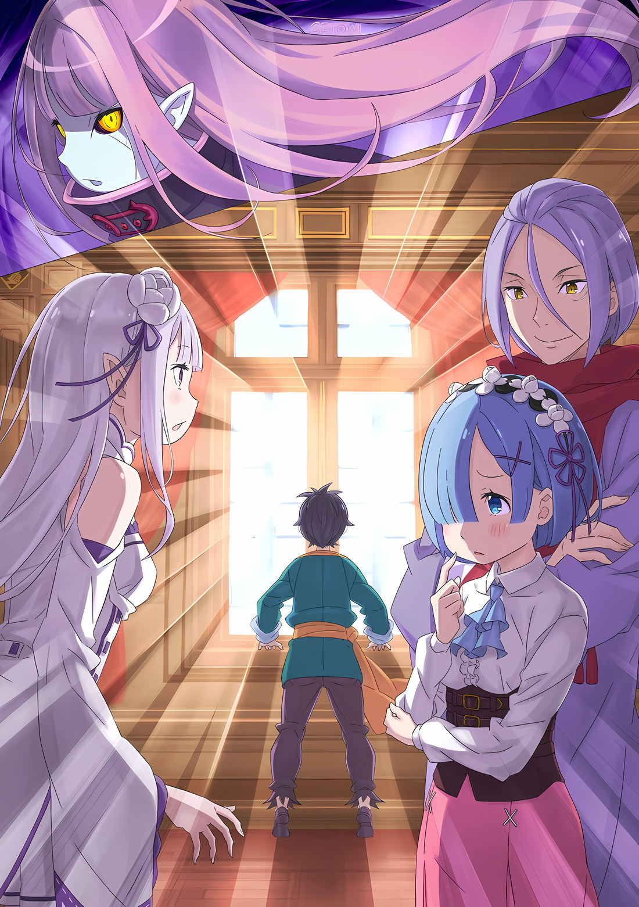

*※※※※※※※※※※※*

Длинные розовые волосы развевались, и в воздухе парила девушка, одетая в черное.

Девушка с чуть продолговатыми ушами сузила свои тонкие глаза, и эта внешняя особенность служила доказательством ее принадлежности к эльфам — расе, которая была ненавистна в этом мире.

Впрочем, эти внешние признаки были, строго говоря, заблуждением.

Ведь если докопаться до истории этой девушки, то самым необычным в ней окажется не принадлежность к эльфам, а способ ее рождения.

Используя эльфийку Рюдзу Мейер в качестве образца, в «Святилище» по определенной технологии были созданы реплики… которые создавались с помощью механизмов, аналогичных Искусственным Духам, и представляли собой совершенно новую жизнь.

Среди множества созданных копий была одна, признанная самой неудачной.

Она предала намерения «Ведьмы», которая создала эту технику и использовала механизмы, что привело к большому количеству жертв, и была вписана в историю Королевства как крупная катастрофа.

…Искусственный монстр, созданный в результате того, что Ехидна, «Ведьма Жадности», не смогла воспроизвести свое собственное существование; это была Сфинкс.

Розвааль: …

При виде «Врага», парящего в ночном небе, Розвааль вздрогнул.

Неожиданная встреча с врагом, которого не должно было существовать, неслабо потрясла его психику. …Нет, пусть это будет признано без всяких притворств.

Это был совершенно сокрушительный удар, способный заставить сердце Розвааля разорваться на части.

Это было воссоединение, которое не должно было произойти.

Что касается монстра в воздухе, то больше всех о ее существовании знал именно Розвааль. Ведь ему довелось столкнуться со Сфинкс, когда она сеяла хаос во время «Войны Полулюдей».

Жизнь этого монстра должна была быть раздавлена кулаком Розвааля того поколения.

И все-таки…,

Сфинкс: Отсутствие четырех конечностей, негативно. Что касается памяти, то она цела до самого последнего момента. Моя форма… закреплена в непредусмотренном состоянии. Самосознание — это проблематично, не так ли? Контрмеры: Требуются.

Вытянув руки в воздухе, Сфинкс пробормотала это тихим голосом.

Ее золотые радужки и бледная кожа, лишенная цвета, безошибочно выдавали в ней нежить, но при этом она обладала более сильным самосознанием, чем любая из нежити, с которой Розвааль и остальные сталкивались до сих пор.

Присутствие воспоминаний и самоощущения из их жизни; расшифровка степени различия этого элемента у нежити была причиной, по которой Розвааль и остальные пришли сюда… Но это была ошибка.

Ошибка, длившаяся около сорока лет.

То, что Сфинкс выжила, стало для Розвааля большим ударом, но еще больше он сожалел о том, что Беатрис и Гарфиэль присутствовали здесь.

Он не должен был позволить этой встрече состояться.

Независимо от истинной сущности Сфинкс, «Враг» обладал именно такой внешностью — внешностью, к которой Беатрис и Гарфиэль испытывали эмоциональную привязанность; он совершенно точно не должен был позволить этой встрече состояться.

Скрыв это сожаление за морганием глаз, Розвааль облачил свое сердце в броню и, не отрывая взгляда от Сфинкс…,

Розвааль: …Гарфиэль, не стоит спешить.

Гарфиэль: …Беатрис, встань позади меня.

Беатрис: …Розвааль, успокойся, в самом деле.

Все трое одновременно повысили друг на друга голос, и наступил момент безмолвия.

Если каждый из них обращался к тому, кто, по их мнению, был наиболее эмоционален, значит, все они справились с первоначальным шоком и теперь думали о будущем.

Выяснение впечатлений Беатрис и Гарфиэля было отложено.

Мизельда: Она не только умеет говорить, но и обладает другим характером. Эта нежить особенная, верно?

В отличие от Розвааля и остальных, Мизельда, у которой не было причин для напряжения, сузила глаза.

Прежде чем Беатрис или Гарфиэль успели бросить несколько слов в адрес Сфинкс, Розвааль открыл рот.

Розвааль: В это трудно поверить, но ты выжила в качестве нежити после «Войны Полулюдей»?

Сфинкс: Я чувствую небольшую неточность в этой формулировке. Если термин «нежить» адекватен, то не будет ли термин «выжить» неподходящим?

Розвааль: Понятно. Ты не намерена отвечать на вопрос. …Как всегда, ты действуешь людям на нервы.

Сфинкс: Форма твоего вопроса была некорректной, я лишь указала на это.

Это был ответ, который нельзя было назвать иначе, как раздражающим, но выражение лица Сфинкс не изменилось.

С самого начала девушка была монстром без каких-либо эмоций, а став нежитью, она потеряла и то, что можно было назвать сердечной теплотой. Точнее, это можно назвать холодом безжизненного тела.

Но в тот момент, когда она обрела это мертвое тело, Розвааль почувствовал нестерпимое беспокойство.

Здесь использовались те же механизмы, что и в технике создания реплик, придуманной «Ведьмой Жадности» Ехидной, а также Искусственных Духов, чьи тела создавались с помощью маны.

Кроме того, в «Таинство Бессмертного Короля» были внесены усовершенствования, которые они с Беатрис поспешно расшифровали.

Очевидно, что это чудовище стало еще более опасным, чем когда-либо прежде.

Гарфиэль: Что за херню ты творишь, ба?

Возможно, расстроенный отсутствием прогресса в обмене мнениями Розвааля, Гарфиэль вмешался в разговор.

Юноша, лязгая острыми клыками и сверкая изумрудно-зелеными глазами, возмущенно воскликнул,

Гарфиэль: Я в курсе, что есть и другие, кто выглядит и говорит так же, как бабуля. Но, видишь ли, я знаю всех, у кого лицо бабули, поименно и точно знаю, где они находятся.

Сфинкс: …

Гарфиэль: Что же ты, блядь, такое?

Гарфиэль говорил о Рюдзу, бабушке, которую он очень любил, и о репликах, которые родились так же, как и она, но не имели своего самосознания из-за того, что им не была отведена определенная роль.

Даже этим репликам были даны имена, а Рюдзу, которые жили самостоятельно, теперь занимались их воспитанием, надеясь, что когда-нибудь им можно будет доверить выполнение обязанностей в лагере.

Так или иначе, интуиция Гарфиэля подсказывала ему, что Сфинкс — не одна из них, а скорее другая, родившаяся таким же образом.

Для Гарфиэля она ничем не отличалась от кощунственного существа, запятнавшего его семью. В ответ на вопрос пылкого юноши Сфинкс молча опустила глаза,

Сфинкс: С недавнего времени, похоже, атмосферная мана была нарушена вами двумя.

Гарфиэль: …Тц!

Она полностью проигнорировала присутствие Гарфиэля.

Как будто вопрос и не был задан, взгляд Сфинкс обратился к Розваалю и Беатрис. При этом у Гарфиэля перехватило дыхание, а гнев в его глазах разгорелся с новой силой.

Поняв гнев Гарфиэля, Розвааль закрыл один глаз. Он посмотрел на Сфинкс только желтым глазом, разрываясь между руганью и провокацией.

Беатрис: У меня есть смутное представление о том, кем ты можешь быть, я полагаю.

Розвааль: Беатрис.

Беатрис: В самом деле, будь спокоен, Розвааль. Это всплыло, когда Бетти была уединена в «Запретной Библиотеке», так что твое молчание по этому поводу, полагаю, пока что останется без внимания. Но…

Беатрис его опередила, пока он все еще подбирал слова, и Розвааль вздохнул.

Похоже, она узнала причину, по которой Розвааль не раскрыл существование Сфинкс. Учитывая это, неумелость Розвааля обязательно настигнет его позже.

Однако сейчас…,

Беатрис: На этот раз я не дам тебе уйти, в самом деле.

Подняв руку, Беатрис посмотрела на Сфинкс своими круглыми глазами. Встретившись взглядом с твердой решимостью в глазах Беатрис, Сфинкс кивнула.

Монстр, направив свою руку в сторону Беатрис,

Сфинкс: Я тоже распознала угрозу. Устранение: Требуется.

В тот момент, когда прозвучали слова, которые не должны были быть произнесены, эмоции в глазах Беатрис и Сфинкс слегка усилились…,

Розвааль: …Пожалуйста, умри.

Быстрее, чем кто-либо другой, вырвавшийся наружу огонь магии Розвааля возвестил о начале битвы.

*△▼△▼△▼△*

Остановившись в коридоре соединенной драконьей повозки, Субару с внезапной тревогой взглянул в окно.

Тусклое ночное небо простиралось над равнинами Империи, и, молясь о безопасности маленькой девушки, которую отправили туда, он приложил руку к груди, почувствовав слабый стук своего сердца.

Эмилия: Субару, ты в порядке?

Заметив такое состояние Субару, Эмилия окликнула его.

Эмилия сузила свои прекрасные аметистовые глаза, глядя на него, и Субару поднял руки, говоря: «Да, я в порядке».

Переговоры между лагерем Эмилии, представителями Волакии и эмиссарами Карараги подошли к концу, и теперь эксперты обменивались идеями в численных областях, таких как расчет военного потенциала и обеспечение логистики.

Он мог быть полезен, если требовался стратегический прорыв, но когда речь шла о прагматичном управлении таким большим количеством людей, Субару не мог не чувствовать, что ему не хватает умения.

Субару: Даже в Эскадроне Плеяд этим занимались Густав-сан и Идра…

Эмилия: Да, я тоже понимаю, что чувствует Субару. Честно говоря, я бы хотела быть полезной в таких обсуждениях… Но я только мешаю Отто-куну.

Субару: Скорее, что-то не так с Рам и Отто, которые остаются там и участвуют в такой напряженной дискуссии. Независимо от старшей сестры, я думаю, что этот чувак потерял способность чувствовать страх.

Эмилия: Боже, как ни крути, ты преувеличиваешь. Отто-кун ооочень старается ради нас.

Эмилия надула щеки, услышав, как Субару оценил слишком надежного сотрудника внутренних дел лагеря.

В этой спокойной обстановке, когда он стоял перед Эмилией, радость от того, что ему удалось воссоединиться с ней, и от того, что она все так же идеально подходила ему, как и всегда, не давала покоя его сердцу.

Каждое утро, когда он видел ее, его сердце трепетало, но после столь долгого времени это произвело на него огромное впечатление.

Субару: Как бы мне хотелось сегодня наполнить свое сердце восхвалением очаровательности Эмилии-тан, но…

Эмилия: Беатрис и Розвааль, ты ведь волнуешься за них?

Субару: Ради меня, Беако, возможно, будет слишком сильно усердствовать.

Когда она безошибочно поняла, почему он смотрел в окно на небо, Субару криво улыбнулся.

Хотя он сказал это в шутку, не было ничего удивительного в том, что он сильно беспокоился. На самом деле Беатрис и вправду ушла, тяжело дыша, ради Субару.

Еще одним поводом для беспокойства стало сотрудничество с Розваалем, к которому она испытывала сложные чувства.

Беатрис и Розвааль, о которых зашел разговор, покинули соединенную драконью повозку, сошлись с группой, выполнявшей тактическую задержку сил противника, и проводили их осмотр.

Осмотр этот, собственно говоря, заключался в выяснении характеристик нежити.

Субару: По сути, им предстоит выяснить, воскрешают ли зомби с помощью «Таинства Бессмертного Короля», о котором мы уже столько слышали, или же на самом деле это происходит с помощью магии…?

Эмилия: В Волакии, похоже, меньше пользователей магии, чем в Лугунике, поэтому я уверена, что есть вещи, которые заметят только сведущие Беатрис и Розвааль. Если они смогут объяснить Авелю и его группе, что они там найдут, я думаю, это поможет.

Сказав это, Эмилия слегка наклонила голову,

Эмилия: Честно говоря, я бы тоже хотела быть полезной… Но я не ооочень разбираюсь в магии. В конце концов, я всегда просто использую ее, когда произношу «Хияяя!»…

Субару: Это потому, что Эмилия-тан больше интуитивный человек. Твои потребности отличаются от потребностей книжного червя Беако или отаку Розвааля. Есть сцены, где ты действительно сияешь, так что все в порядке. На самом деле, в моих глазах ты всегда сияешь, как вечерняя звезда!

Эмилия: Прости, я не понимаю, о чем ты говоришь.

Он попытался подбодрить Эмилию, расстроенную тем, что она не может помочь Беатрис и Розваалю, но его слова не возымели действия.

Тем не менее, то, что Эмилия и он смогли таким образом поделиться проблемами и не обременять себя ими, было удачей.

Начнем с того, что Беатрис и Розвааль были не единственными, за кого беспокоился Субару. Он переживал за Гарфиэля, а также за всех членов Эскадрона Плеяд, которые сражались в том же месте.

Из всех членов эскадрона только Танза осталась на соединенных драконьих повозках, остальные временно высадились и присоединились к тактическим силам задержки.

Члены эскадрона были его товарищами, которые до сих пор все как один преодолевали ожесточенные сражения.

Субару доверял им всем, в том числе и Сесилусу, который почему-то до сих пор не вернулся к ним, несмотря на то, сколько уже прошло времени.

Субару: Но даже если так, беспокойство есть беспокойство~! Пожалуйста, все, не будьте слишком безрассудными и не увлекайтесь…

Субару сложил руки в молитве.

???: …Субару, Эмилия-сама, так вот где вы были.

Эмилия: А, Юлиус.

Дверь, отделявшая проход, отворилась, и Эмилия подняла брови на красивого мужчину, появившегося с другой стороны. Как она и сказала, там появился Юлиус в традиционном японском костюме и с рыцарским мечом.

Поклонившись, он подошел к стоящим в коридоре Субару и Эмилии, а затем расслабил губы, которые еще несколько минут назад были несколько напряжены,

Юлиус: Тогда мне не удалось обменяться с тобой несколькими словами.

Субару: Э… да. Я заставил волноваться и тебя, и Анастасию-сан, и Ехидну. Спасибо, что проделали весь этот путь, чтобы найти меня.

Юлиус: …Как удивительно.

Как только Субару искренне поблагодарил Анастасию и Юлиуса за их усилия, последний серьезно поднял брови,

Юлиус: Подумать только, ты так искренне выражаешь свою благодарность. Может быть, это потому, что ты стал моложе, и твое упрямство уменьшилось в соответствии с твоим внешним видом?

Субару: Заткнись! Может, в этом и есть какой-то вред, но, даже если бы я не уменьшился, по крайней мере, я бы сказал спасибо! Как ты думаешь, где мы вообще находимся? Это ад!

Эмилия: Это Волакия, а не ад. А то, что ты так говоришь, это некрасиво по отношению к Авелю и другим жителям Империи.

Субару: О, правда? Большинство причин, по которым мне кажется, что эта страна — настоящий ад, связано с тем, как поступает этот парень, так разве я не имею права оскорблять его?

Конечно, он считал, что у Авеля есть своя точка зрения, и нетрудно было представить, что он методом проб и ошибок пытается по-своему эффективно управлять Империей. Но раз уж результатом этого стали те муки, которые пришлось пережить Субару, он должен иметь право сказать хотя бы это.

Эмилия, казалось, была в растерянности, что ответить на жалобы Субару, и, видимо, в немалой степени чувствовала, что не может опровергнуть сказанное им.

Юлиус же в ответ на язвительные замечания Субару погладил пальцем шрам вокруг глаза,

Юлиус: …Я обдумывал это во время встречи, но Субару, какие у тебя отношения с Его Превосходительством Императором Винсентом? Твой язык сейчас был слишком неуместен.

Субару: Если ты считаешь, что это было неуважительно, то ты бы упал в обморок, если бы узнал, что я сделал с этим парнем. Скажу сразу, но я веду себя так не потому, что у меня есть особые привилегии, как у ребенка. На самом деле, я веду себя так потому, что этот парень не смог удержать вожжи на том старике.

Юлиус: Мне даже страшно представить. Эмилия-сама, у вас есть какие-нибудь подробности о том, что произошло?

Эмилия: Да. Ты говоришь о том, что Субару и Авель сблизились гораздо сильнее, чем ожидалось, верно? Сначала я беспокоилась, смогут ли они поладить… но, честно говоря, Субару ооочень быстро заводит друзей.

Субару: Друзей, хмММм…

С сожалением глядя на Эмилию, которая хвасталась так, словно это было ее собственное достижение, Субару размышлял о том, какое место в его отношениях занимает присутствие Авеля.

По крайней мере, несмотря на то, что они избивали друг друга, изливая душу, они не были похожи на парочку преступников, которые подрались в русле реки и тут же пригрелись друг у друга.

Юлиус: …Субару, решил ли ты, что считаешь меня своим другом?

Субару: А? Ну, наверное, да. Раньше я считал это сомнительным, но сейчас мы вместе пересекли песчаные дюны, так что, вроде бы, все в порядке? Думаю, все в порядке.

Юлиус: Понятно, это радует. После сообщения о том, что ты, Эмилия-сама и остальные целы и невредимы, это второе по силе облегчение.

Преувеличенной шуткой сомнения Юлиуса были на время развеяны.

Однако это было только начало, учитывая нынешнее положение Субару, которое с первого взгляда было очевидно каждому. Самая большая проблема Субару еще не была решена.

Юлиус: Субару, насчет твоего тела…

Субару: Старый шиноби сделал это со мной. Тебе тоже стоит попробовать. Я бы хотел на это посмотреть.

Юлиус: Воздержусь. Я не очень хочу встречаться со своим молодым «я». Лучше уж с кем-нибудь вроде Анастасии-сама или Эмилии-сама, они были бы просто очаровательны в своем юном возрасте.

Субару: Юная Эмилия-тан! О да! Почему я не думал об этом!

Эмилия: Я? Хммм, не знаю. Я видела маленькую себя в «Святилище», и мне кажется, что нынешние Субару и Беатрис куда симпатичнее.

Эмилия, не слишком высоко оценивавшая себя, сказала бы то же самое, но это никак не могло быть истиной.

Раз взрослая Эмилия была так красива, то, должно быть, и в детстве она была красивой девочкой. То есть она могла бы поравняться с Беатрис…

Юлиус: Тем не менее, услышав от тебя такие слова, я почувствовал облегчение. Похоже, что путь к твоему возвращению в нормальное состояние уже пройден.

Эмилия кивнула, сказав: «Верно».

Будучи выше Субару, она сзади положила руку ему на плечо,

Эмилия: Дедушка, который сделал Субару маленьким, похоже, тоже один из союзников Авеля. Сейчас он сражается с «Зонби», поэтому, когда он вернется, мы попросим его вернуть Субару в нормальное состояние. И тогда…

Субару: Ах~, вообще-то, я должен тебе кое-что сказать по этому поводу.

Эмилия: …?

Субару почувствовал себя неловко и оглянулся на Эмилию, которая стояла прямо за его спиной. Эмилия, положившая руку на плечо Субару, расширила глаза от его слов.

Юлиус, стоявший лицом к нему, нахмурил брови. А Субару, почесав пальцем щеку, заявил,

Субару: Я планирую не возвращаться к своему первоначальному размеру даже после возвращения Ольбарта-сан. Думаю, пока будет удобнее оставаться в таком маленьком облике.

Эмилия: Э!? Почему? Может быть, потому что детскому организму требуется меньше пищи? Если это так, то я могу поделиться с тобой своей порцией…

Субару: Твоя забота невероятно мила, но дело не в этом.

Покачав головой, Субару мягко отмахнулся от предположения Эмилии. В ответ на слова Субару, Юлиус принял серьезное выражение лица, сузив свои желтые глаза,

Юлиус: В конце концов, это же ты. Значит, это должно быть что-то, что ты считаешь нужным…

Субару: Ах. Я не представил их ни вам, ни Анастасии-сан, но я стал товарищем для некоторых людей из Волакии, членов Эскадрона Плеяд.

Юлиус: Плеяд…

Поскольку существовала Сторожевая Башня Плеяд, Юлиус насторожился при произнесении этого названия. Однако, не желая прерывать разговор, он проигнорировал это сомнение и призвал Субару продолжить.

Кивнув на это, Субару продолжил,

Субару: Когда члены эскадрона, я не знаю всех подробностей, но когда все мы, включая меня, объединяем свои чувства в одно целое, мы становимся невероятно сильными. Это не просто сила эмоций или что-то в этом роде.

Юлиус: …Эмилия-сама?

Эмилия: Хм, похоже на правду. Эта девочка по имени Танза-чан и другие друзья Субару ооочень сильные и ооочень упорно сражаются.

Субару: И я обманул всех этих друзей. …Ложь о том, что я сын Императора.

Даже после утверждения Эмилии, последовавшие за этим слова заставили Юлиуса изумленно ахнуть. Эмилия, также ошеломленная, прикрыла рукой рот, из которого вырвалось «Ах».

Эмилия: Помнится, ты говорил, что так представился… Но ведь Волакия — это не то место, где ты родился, верно, Субару?

Субару: Ахх, конечно же, нет. Мой родной город не похож на этот ад. Он более гармоничный, наполненный любовью и миром.

Юлиус: …Даже в Укрепленном Городе я слышал разговоры о «Черноволосом Наследном Принце». И когда я услышал слово «черноволосый», я сразу подумал о тебе.

Субару: Чтобы вы знали, это придумал Авель, так что, пожалуйста, направляйте свои претензии на него. В любом случае, важно, чтобы все в эскадроне верили в это. Вот почему…

Отправляясь с Острова Гладиаторов, Субару заставил своих спутников, которых он уговорил пойти с ним, поверить в то, что он сын Императора Волакии.

Сегодня на этой лжи зиждилось единство Эскадрона Плеяд. Субару не собирался навсегда оставлять все в таком состоянии, он не хотел продолжать обманывать их.

Ведь когда беспрецедентное Великое Бедствие, сотрясающее Империю Волакия, будет устранено, Субару вернется к своему нормальному размеру и вместе с Эмилией, Рем и остальными членами лагеря совершит триумфальное возвращение в Королевство Лугуника.

А для того чтобы Субару и все остальные завершили эту битву победой, помощь Эскадрона Плеяд была просто необходима.

Субару: Вот почему я пока не могу вернуться. Я должен быть тем «Нацуки Шварцом», в которого верят в эскадроне. По крайней мере, до тех пор, пока эта битва за возвращение Империи не закончится.

Эмилия: Субару…

Крепко сжав маленькие кулачки, которые он уже привык видеть, Субару четко заявил о своем решении.

Пока Субару не объявил об этом Эмилии и Юлиусу, он тоже не знал, как поступить.

Это было само собой разумеющимся, но большая форма была ему больше по душе, чем маленькая. Он испытывал сильное желание вернуться в свое прежнее тело, слегка приобнять Беатрис и поговорить с Эмилией на одном уровне глаз.

Но это желание Субару не могло сравниться с тем, что было действительно необходимо.

Юлиус: …Воистину, где бы ты ни был и какую бы форму ни принимал, ты остаешься тем же самым.

Услышав решимость Субару, Юлиус с небольшим выдохом заговорил. Он зачесал рукой челку назад и посмотрел на Субару с выражением удивления и понимания,

Юлиус: Ты заставляешь принимать самые сложные и неожиданные решения. Будь то для себя или для кого-то другого.

Субару: …Это не такое уж достойное восхищения решение. «Я хочу еще немного побыть ребенком»; такую решимость можно услышать в песне эпохи Шоуа.

Сказав это Юлиусу, Субару ответил, чувствуя некоторое смущение. Затем на голову Субару осторожно положили руку, он повернул голову и встретился взглядом с парой аметистовых глаз.

Эмилия опустила кончики своих бровей и ласково посмотрела на Субару.

Эмилия: Сделав это, Субару снова заставит меня волноваться.

Субару: У меня нет для этого оправдания. Нет, я действительно хочу вернуться в свое привычное тело и пофлиртовать с Эмилией. Но…

Эмилия: Знаю. Субару много об этом думал и выбрал лучший, на его взгляд, вариант, верно? Я чувствую то же самое, что и Юлиус, Субару просто такой какой есть.

Взволнованный Субару двигал руками вверх-вниз, а Эмилия улыбалась, глядя на его панику. Она положила руку на голову Субару и ткнула пальцем в его нос, продолжая: «Но ты знаешь»,

Эмилия: Каким бы маленьким ни был Субару, я знаю, что Субару останется Субару. Даже если ты не вернешься из маленького размера, я буду ждать тебя, пока ты снова не станешь большим.

Субару: В то же время, я бы хотел избежать невозможности вернуться к нормальной жизни, но… Что ты только что…?

Эмилия: …?

Нежный тон голоса заставил Субару моргнуть, ему показалось, будто в его адрес прозвучало нечто невероятное. Но собеседница, возможно, не поняв смысла реакции Субару, наклонила голову с любопытством и совершенно невинным выражением лица.

Нет, даже просто наклон ее головы в сторону заставил его смутиться. В ней сидела невероятная искусительница.

Эмилия: …

Чувствуя, как щеки непроизвольно окрашиваются в красный цвет, Субару обратился за помощью к Юлиусу. Однако тот, встретив взгляд Субару, лишь пожал плечами и бессердечно отмахнулся от его просьбы.

Он мысленно проклял ненадежного Юлиуса, подумав, что, возможно, они вовсе не друзья, и огляделся по сторонам, сожалея о своем прежнем суждении…,

???: Хах?

И в тот момент, когда в коридор вышла девушка с одной из кают, его взгляд столкнулся с ее взглядом, и она уставилась прямо на него.

*△▼△▼△▼△*

???: Хах?

Да, это была девушка с голубыми волосами и светло-голубыми глазами, которая обращалась к Субару и остальным… и как только Субару увидел ее, его лицо озарилось.

Субару: Рем, замечательно. Я тоже хотел с тобой поговорить.

Когда появилась Рем, Субару отвлекся от событий, которые только что произошли.

У Субару, потерявшего сознание после стычки в столице при участии Эмилии, Беатрис и других, не было времени поговорить с Рем.

После стычки с Авелем и рассказа Кате о том, что нужно было сказать, Субару оставил ее на руках у Рем и сразу отправился на обсуждение.

Обсуждение подошло к концу, и вот они снова встретились.

Субару: Что ж, что с Катей-сан? Она успокоилась?

Рем: …Поскольку обстоятельства сложились так, как сложились, это так просто не произойдет. Однако сейчас она уже устала плакать и уснула, поэтому ее брат присматривает за ней.

Субару: Понятно. Ох, да. Прости, что доверил тебе такую сложную роль.

Рем: …Я сделала это, потому что хотела сделать это. Кстати…

Отвечая Субару, Рем слегка понизила тон голоса. Субару наклонил голову, недоумевая, что происходит.

Но, прежде чем Рем успела произнести хоть слово…,

Юлиус: …Мисс Рем, вы проснулись!

Да, Юлиус, удивленный присутствием Рем, поспешил высказаться.

Его глаза расширились, а голос разразился искренним удивлением и радостью, и Субару кивнул головой: «Точно!»,

Субару: Виноват. Я должен был сказать тебе, Анастасии-сан и Ехидне. Рем проснулась после того, как мы со всеми расстались. Но…

Юлиус: Я не помню мисс Рем. Значит, у нее такие же обстоятельства, как и у меня?

Субару: Мало того, она находится в гибридной ситуации, похожей на положение Круш-сан.

Юлиус: …Значит, у нее нет воспоминаний?

Юлиус нахмурил брови, услышав объяснение Субару.

Он быстро понял, что это не та ситуация, когда можно открыто радоваться, и, казалось, растерялся, не зная, что сказать. Но стоило ему сомкнуть веки, как, открыв их, он вновь обрел бесстрашное выражение лица,

Юлиус: Мисс Рем, прошу прощения за столь неожиданное обращение к вам. Я — Юлиус Юклиус… и я Рыцарь в услужении у одного человека, а также по совместительству друг Субару.

Рем: Вы его друг…

Субару: От этого акцента мне хочется протестовать, но да. Он один из них. Он один из тех, кто очень помог мне, когда ты не просыпалась, Рем.

Рем: То есть…

Рем удивленно подняла брови, когда ей рассказали о его отношениях с Юлиусом, который милостиво поклонился. Взяв паузу от удивления, Рем тоже склонила голову в ответ.

Рем: Спасибо за беспокойство. Не могу сказать, что я в полном порядке, но на данный момент я могу стоять и ходить на собственных ногах.

Юлиус: Это уже хорошо. И для тебя самой, и для всех окружающих, кто думает о тебе.

Рем: …Да.

Субару, как обычно, захотелось обругать его за беззаботную и задумчивую манеру говорить, но в присутствии Рем, положившей руку на грудь и тихонько кивавшей, невозможно было произнести столь укоризненные слова.

В любом случае, он был рад, что смог сообщить Юлиусу о том, что Рем уже проснулась. Позже он должен был сообщить об этом Анастасии и остальным.

Субару: Я очень рад, что Анастасия-сан с остальными приехали в Империю, и я смог увидеть Рем в такой обстановке. Ты ведь тоже волновался за нас.

Юлиус: Да. Анастасия-сама тоже очень переживала. И хотя мисс Рем этого не помнит, мне, как человеку, путешествовавшему с ней, очень радостно.

Эмилия: Да, я тоже так думаю. Это все благодаря стараниям Субару.

Так сказала улыбающаяся Эмилия, еще раз погладив Субару по голове.

Из-за разницы в росте ей было легко гладить его, однако, когда его гладили снова и снова, он чувствовал себя ребенком, и это было очень обидно.

Это было очень приятно, но его мужественное сердце не хотело позволять Эмилии обращаться с ним как с ребенком.

Субару: Э-Эмилия-тан, не надо так сильно меня опекать.

Эмилия: Я думаю, что ты милый, но я не пытаюсь быть слишком ласковой, понимаешь? Я думаю, Субару великолепен. Как и полагается моему Рыцарю.

Рем: Ха?

Эмилия: Что?

И в тот момент, когда Эмилия гладила Субару по голове, неожиданно раздался резкий голос, и ее рука остановилась.

Глаза Эмилии расширились, и она увидела Рем, стоящую напротив Субару.

Это была Рем с бледно-голубыми глазами, которая смотрела на руку Эмилии, лежащую на голове Субару.

Эмилия: Рем? Все в порядке?

Рем: Нет, есть кое-что, что меня несколько смущает. Эмилия-сан, можно я кое-что уточню?

Эмилия: Уточнить? Да, валяй, вершай…

Субару: Кто вообще в наше время говорит «валяй, вершай»…

Положив одну руку ему на голову, а другую на затылок, Эмилия и Субару в унисон наклонили головы в ответ на слова Рем.

Рем с подозрением посмотрела поочередно на Субару и Эмилию,

Рем: …Какие у вас отношения?

Эмилия: Субару и я?

Субару: Я и Эмилия-тан?

Субару и Эмилия обменялись взглядами в ответ на вопрос Рем.

Действительно, Рем только что воссоединилась со всеми в лагере Эмилии, и хотя ему сказали, что понимание ее отношений с Рам достигнуто, пока больше никаких подробностей не было.

Если это правда, то, возможно, им стоит провести это в присутствии всех…,

Субару: Верно. Проще говоря, Эмилия-тан — верхушка нашего лагеря, будущий Король страны под названием Королевство Лугуника.

Эмилия: Я все еще работаю над тем, чтобы стать ею, так что я Кандидатка. И поэтому Субару мой союзник номер один, мой Рыцарь.

Рем: Твой союзник номер один…

Субару: Да, я делаю все возможное, чтобы мечта моей Эмилии-тан осуществилась.

Эмилия: Да, он делает все возможное. Пусть я и не его, но Субару — мой.

На гордые слова Субару ответила смущенная Эмилия. Выслушав их ответ, Рем приложила руку ко лбу.

Затем, поразмыслив некоторое время, она сказала,

Рем: Простите меня, это сбивает с толку; я ли тому причина?

Юлиус: …Нет, я не считаю вас виноватой, мисс Рем. Впрочем, это мнение стороннего наблюдателя.

Рем: Спасибо вам за это…

Юлиус почему-то именно так ответил Рем, и та, похоже, была чем-то обеспокоена.

Было непонятно, почему Юлиус, который был не из их лагеря, отнесся к Рем с таким пониманием, когда не только Субару, но и Эмилия не понимали ее замешательства.

Эмилия: Возможно, я просто слишком много рассказала о Лугунике нынешней Рем…

Субару: Я местами уже рассказывал ей об этом… Возможно, Присцилла наговорила ей лишнего в Гуарале…

Юлиус: Подождите. Почему здесь упоминается имя Присциллы-сама? В это трудно поверить, но Присцилла-сама тоже здесь, в Империи Волакия?

Рем: Хм, ничего, если мы сначала разберемся с моим недоумением?

В попытке разрешить ранее возникшие вопросы появились и новые, так что они оказались на грани того, чтобы пойти по замкнутому кругу.

В данный момент шла борьба за определение приоритета вопросов: чувствовалось, что существует слишком много тем, которые необходимо было как следует обсудить с Юлиусом, Анастасией и остальными.

Первым и главным приоритетом, все же, должно было стать прояснение недоумения Рем, но…,

Субару: …

Пока они с Эмилией пытались найти разгадку замешательства Рем, внимание Субару внезапно привлекло нечто, проплывшее мимо в уголке его глаза.

Это было нечто за окном, в мгновение ока спустившееся с ночного неба на поле.

Эмилия: Субару?

Когда глаза Субару непроизвольно расширились, его окликнул вопросительный голос Эмилии. Не ответив ей, Субару бросился к окну и выглянул наружу.

В обычной ситуации Субару никогда бы не проигнорировал зов Эмилии. Однако сейчас, вместо того чтобы ответить на него, он предпочел подтвердить только что увиденное.

Его глаза напряглись, всматриваясь в проплывающий мимо пейзаж, и он вновь сфокусировал свой взгляд на том, что спустилось с ночного неба.

Это была…,

Субару: …Что она здесь делает?

Человек, которого здесь не должно было быть; вытащив ее из глубин собственной памяти, Субару несколько раз моргнул и произнес это имя.

Человек, который должен был жить мирной жизнью в Королевстве Лугуника…,

Субару: …Рюдзу-сан?

???: …

Она никак не могла расслышать шепот Субару.

Несмотря на расстояние и громкость голоса, который невозможно было услышать, глаза Субару встретились с глазами маленькой фигуры, направлявшейся к нему, и он инстинктивно почувствовал, что они оба почувствовали друг друга.

Не сводя глаз с Субару, маленькая фигура пошевелила губами и что-то сказала.

Субару наклонился вперед, пытаясь расслышать, что именно…,

Субару: …Ах.

…Сразу же после этого на соединенные драконьи повозки обрушился белый свет, который поглотил Нацуки Субару и большинство находившихся на борту людей, полностью их уничтожив.
