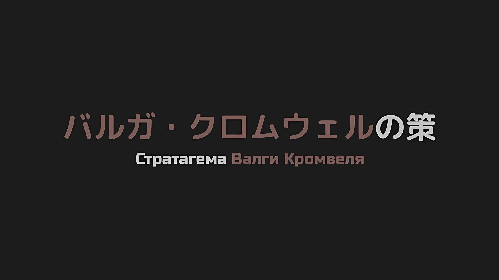
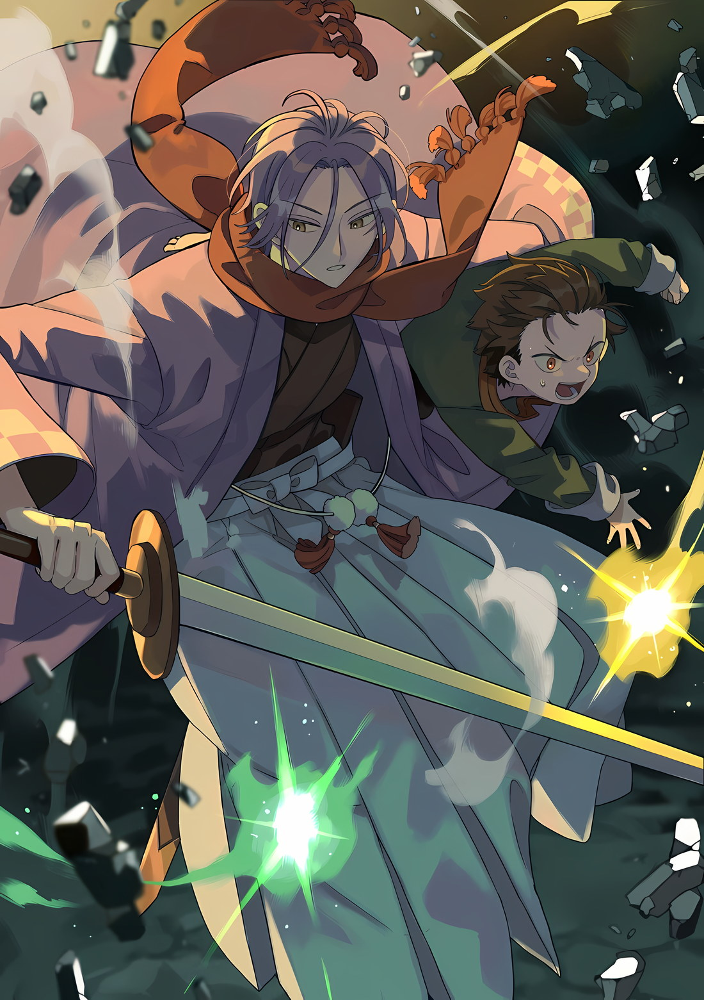
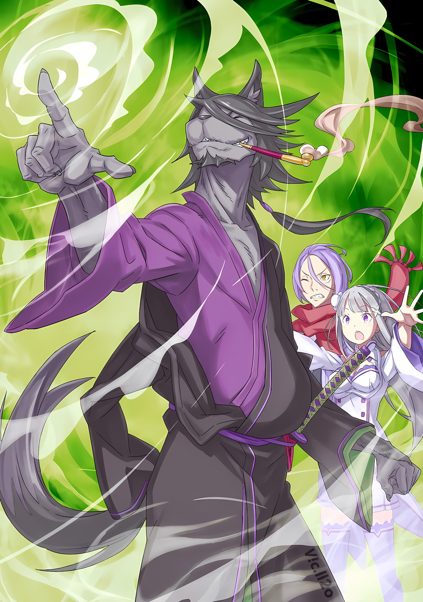
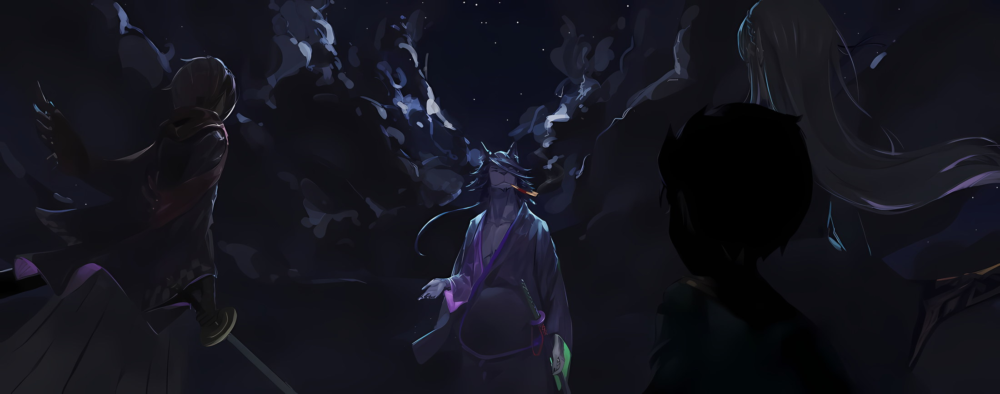

*※※※※※※※※※※※*

Сражение началось с мощного залпа нетерпеливого Розвааля.

Розвааль: …Пожалуйста, умри.

И вдруг, в противовес этим холодным словам, разразился испепеляющий огонь, который словно выжег небо дотла.

Пламя яростно полыхнуло, разом охватив всю небесную твердь. Воспламенившееся небо привлекло внимание всех, в том числе и воинов, которые все еще сражались с нежитью, рискуя своими жизнями.

Даже если цель состояла в том, чтобы превратить в пепел одного врага, это было уже слишком.

Беатрис: Я полагаю, что это такой же акт варварства, как спалить целый особняк, лишь для того чтобы уничтожить маленькое насекомое в одной из комнат.

Сжечь особняк ради достижения цели было безрассудным поступком, на который отважились бы только Петра и Отто.

Если бы не их решимость, она, возможно, так и не набралась бы смелости покинуть «Запретную Библиотеку»; Беатрис была им втайне за это благодарна, но все равно считала, что это уже перебор.

Своим первым же ударом Розвааль продемонстрировал, что его чрезмерная жестокость не уступает тем двоим.

Однако…,

???: Уровень угрозы распознан, Корректировка: Требуется.

После уклонения по воздуху, чтобы спастись от пылающего ночного неба, враг… Сфинкс осталась цела и невредима.

Даже несмотря на то, что они пережили трудности с поджогом особняка, было бы бессмысленно, если бы маленькое насекомое, ставшее мишенью, сбежало. В данном случае казалось, что Розвааль только опалил небо и напугал всех вокруг, ничего не добившись.

Впрочем, если бы Розвааль был единственным человеком, присутствующим здесь.

Беатрис: Эль Минья.

С розовыми волосами, свободно развевающимися в небе, Сфинкс парила на пути мерцающих темно-фиолетовых вспышек, которые внезапно появлялись. Это была вершина магии, которая обладала способностью замораживать время цели и разбивать его вдребезги.

Это была смертоносная атака, которая, как уже и было установлено, являлась самой эффективной против нежити.

Беатрис: В самом деле, плохо, что никто, кроме Субару и Бетти, не может культивировать Магию Тени.

Против армии нежити можно было бы ничего не бояться, имея полный состав пользователей Магии Тени.

Даже Беатрис, которая прожила так долго, никогда не была свидетелем сцены, когда более десяти пользователей Магии Тени были собраны в одном месте, поэтому она знала, что это будет невозможным предложением.

С такими бесполезными мыслями Беатрис упреждающе уничтожила в себе все колебания.

…Чтобы сразить отвратительного «Врага», который имел то же лицо, что и Рюдзу Мейер.

Беатрис: Рюдзу…

Мимолетная улыбка Рюдзу Мейер пронеслась в сознании Беатрис.

В отличие от Рюдзу, которых Гарфиэль и Фредерика безмерно любили как своих бабушек, Рюдзу Мейер, их прародитель, была первым другом всей жизни для Беатрис.

В те времена она была не в состоянии осознать это. Она слишком поздно это поняла.

Но теперь все было иначе. Теперь Беатрис могла полностью осознать всю значимость ее присутствия. Именно поэтому «Враг», принявший такую форму, с точки зрения Беатрис, был…,

Беатрис: Бетти разозлилась, я полагаю!

Взревев, Беатрис увидела, как Сфинкс бросилась лоб в лоб на выпущенные фиолетовые стрелы.

Глаза «Врага» ненадолго сузились, когда он поднял обе руки перед лицом, и белый свет выстрелил из всех десяти его пальцев, сметая все Миньи на своем пути.

Не издав ни звука, темно-фиолетовые кристаллы разлетелись на кусочки… Однако этого было недостаточно, чтобы уничтожить разочарование Беатрис.

Сфинкс: …Кх.

Хотя Сфинкс, предположительно, отмахнулась от угрозы, выражение ее лица слегка исказилось.

Причина заключалась в том, что разрушенные темно-фиолетовые кристаллы, в своем раздробленном состоянии превратились в летящую шрапнель, которая разлеталась и преследовала быстро парящую Сфинкс.

Беатрис: Магия — это идея, и как только ты думаешь, что остановил ее, все идет наперекосяк, в самом деле.

Однако важна была не форма кристаллической стрелы, которая представляла собой Минью. Речь шла об эффекте замораживания и сокрушения времени того, кого она поразила.

Ведь даже если она и не имела формы стрелы, до тех пор, пока она пронзала противника, ее форма и размер не имели значения.

Следовательно, летящая шрапнель Беатрис, с ее разгоревшимся духом соперничества, не позволила бы Сфинкс сбежать.

И тогда…,

Сфинкс: Уровень угрозы распознан, повтор, Корректировка: Требуе…

???: …Ты опоздала на сто лет, чтобы это переосмыслить.

Уклоняясь от летящей Миньи, которая должна была превратить ее в камень, когда она упорно пыталась сбежать, прямо перед Сфинкс возник злобный лик Гарфиэля, который вскочил с земли и ударил ее ногой.

Острые глаза, оскаленные клыки, Гарфиэль зарычал, как свирепый зверь, и мощно взмахнул своими изящными руками, пытаясь со всей силы ударить Сфинкс.

На мгновение взгляды Гарфиэля и Сфинкс пересеклись.

Гарфиэль не мог решиться нанести удар кулаком по противнику с таким же лицом, как у его бабушки, и от этого у него защемило сердце,

Гарфиэль: По сравнению с бабулей, запах твоего сердца совершенно, мать твою, другой…!!!

Для надежного военного офицера из лагеря Эмилии такие заботы были излишни.

Разжавшийся кулак ударил Сфинкс по щеке; тело девушки пулей полетело с воздуха прямиком в землю, причем кулак с огромной силой продолжал придавливать ее к земле.

Раздался громовой треск и поднялось облако пыли, словно обрушился большой камень; Беатрис видела, как тело Сфинкс трепетало, словно лист, по другую сторону руки Гарфиэля.

Удар Гарфиэля был нанесен с чистой яростью, без всякого подобия милосердия или колебаний.

Если бы она получила прямое попадание, то даже один удар, вероятно, свел бы Беатрис с маной; Сфинкс снесло, когда она откатилась за шлейф.

Розвааль: Наш круг из трех человек. Это была отличная командная работа, не так лиии~?

Беатрис: Сказал тот, кто первым потерял самообладание, я полагаю.

Гарфиэль: Командная работа с тобой — это, блядь, омерзительно.

Когда Розвааль пожал плечами, как бы говоря, что его это совершенно не беспокоит, Беатрис и Гарфиэль ответили ему грубыми словами.

Получив такое холодное обращение, Розвааль снова пожал плечами.

И тогда…,

Сфинкс: …Повтор, уровень угрозы… распознан. Корректировка: …Требуется.

Сфинкс пробормотала это, медленно перемещая свое тело по земле, по мере того как шлейф стал оседать.

Упав на землю и вымазавшись в грязи, Сфинкс не выказывала ни малейших признаков боли, но по звучанию ее голоса было понятно, что она накопила повреждения.

Сфинкс: ……

Тем не менее, ее золотые радужки сияли, когда она устремила свой пристальный взгляд на этих троих.

В них не было чувств враждебности или гнева, скорее это был чудовищный взгляд разума, который видел в них лишь мишени для своего любопытства.

Гарфиэль: Тц, мне это не по душе.

Так же, как и Беатрис, Гарфиэль почувствовал, как от взгляда своего врага по его позвоночнику пробежал холодок, и прищелкнул языком. Розвааль же молча сузил глаза и начал разминать ману внутри себя, испытывая явный дискомфорт.

Розвааль снова бросил взгляд в сторону, размышляя, не стоит ли ему рвануть вперед, а Беатрис сверкнула глазами на Сфинкс, когда та встала, а затем сразу же двинулась вперед.

Выступая в качестве представителя этой ненадежной пары, она попытается выяснить ее истинные намерения…,

Беатрис: Сфинкс, я осмелюсь окликнуть тебя, в самом деле. О чем ты…

*Думаешь?*; Это случилось в тот момент, когда Беатрис пыталась закончить свой вопрос.

Сфинкс: …

Теперь, стоя, тело Сфинкс задрожало, и ее взгляд упал на собственную грудь.

Из маленькой груди Сфинкс торчал кончик лезвия. Это было смертоносное лезвие, которое вонзилось ей в спину и торчало из груди.

И той, кто сжимала это лезвие, была…,

???: У меня плохое предчувствие насчет этой девушки. Нет никаких причин оставлять ее в живых.

Мизельда, которая заявила это в жестокой манере, выдернула кинжал, которым нанесла удар, и снова воткнула его в девушку.

После того как три концентрированных удара продырявили спину и грудь, она схватила Сфинкс за волосы и с силой задрала ее голову вверх, а затем безжалостно перерезала ей шею кинжалом, зажатым в обратном хвате.

Это было тело нежити. Никакой крови не пролилось, но не было сомнений, что все это являлось летальным.

Тело Сфинкс повалилось вперед на колени, а затем рухнуло лицом вниз.

Беатрис: Т-т-ты… Кх…

Рядом с рухнувшей Сфинкс Мизельда проверяла, не попала ли кровь на ее кинжал; увидев это, Беатрис застыла на месте и уставилась на нее расширенными глазами, не находя слов.

Розвааль и Гарфиэль также потеряли дар речи от действий Мизельды.

Мизельда склонила голову набок, красивая, с глазами, которые и так производили сильное впечатление на состояние этих троих,

Мизельда: Я знаю, что у нее была с вами связь, ребятки. Впрочем, речами вы будете разбрасываться возле ее могилы. Таков обычай поля боя.

Гарфиэль: Пожалуй, это верно…

Это был прямолинейный взгляд на вещи, но Гарфиэль смирился с тем, что он неопровержим.

Беатрис не раз удивлялась чувству ценностей в Волакии, но она изменила свое представление об их суровости, полагая, что ее восприятие все еще было наивным.

Розвааль: Сфинкс.

Розвааль, не обращая внимания на волнение Беатрис и Гарфиэля, шагнул вперед. Он посмотрел вниз на рухнувшую Сфинкс и боковым взглядом, не проявляющим особых эмоций, назвал ее имя.

Удар Мизельды, смертельный удар, был очевиден не только по расположению ран, но и по тому, как рухнуло тело Сфинкс.

Большинство нижней части ее тела уже превратилось в пыль, а лицо девушки, на котором с самого начала были трещины, начало осыпаться, и это был лишь вопрос времени, когда все ее тело рассыплется на мелкие кусочки.

Однако жизненные силы Сфинкс как нежити еще не были исчерпаны.

У нее не было сил на контратаку или тщетную борьбу, но у нее осталось достаточно энергии, чтобы пошевелить золотыми радужками глаз и оглянуться на Розвааля, который смотрел на нее сверху вниз.

Розвааль: …

Хотя он знал, что внутри она совсем другой человек, его сердце все равно разрывалось от боли, когда он видел, как разрушается внешность Рюдзу.

То, что чувствовал Розвааль, вероятно, отличалось от сентиментальности Беатрис, но основательный реализм Мизельды помешал ей и, возможно, лишил ее средств для смягчения этой сентиментальности.

Как бы то ни было, главным виновником мучений Беатрис, Гарфиэля и Розвааля была…,

Сфинкс: …Размышления, должны быть: Требуются.

В разгар крошения ее тела было слышно, как Сфинкс бормочет, так и не показав на своем лице никаких признаков боли.

Сфинкс: …Для вас троих.

Однако последовавшие за этим слова свидетельствовали об обратном.

Беатрис затаила дыхание от добавленных слов, а Гарфиэль гаркнул «А?».

Беатрис тоже не совсем поняла их истинный смысл. Но она почувствовала, что это не просто брошенная фраза, которую можно проигнорировать.

Отсюда…,

Розвааль: …Черт возьми!

Розвааль поднял голову, будто его обыграли.

На его лице появилось выражение нетерпения и раскаяния, и он повернулся к тылу. …Назад, к небу, по которому он летел вместе с Беатрис, к соединенным драконьим повозкам, которые все еще продвигались вперед.

Точно так же, привлеченная беспокойством Розвааля, Беатрис повернулась лицом в ту сторону.

Затем, пока ее охватило волнение в собственной маленькой груди,

Беатрис: …Субару.

Так она назвала его имя.

*△▼△▼△▼△*

Одно мгновение, да, все произошло в одно мгновение.

Заметив что-то неладное, сразу же после того, как он высказал свои сомнения, все было охвачено белым светом.

Эмилия, которая была рядом с ним, Рем и даже Юлиус — никто из них не успел среагировать. Естественно, Субару тоже не смог ничего сделать, так как белый свет поглотил все вокруг и исчез.

Нацуки Субару сразу же понял, что это значит.

…То, что его жизнь была уничтожена, и произошло «Посмертное Возвращение».

В подтверждение этого…,

*???: «…Я люблю тебя.»*

Словно желая сказать, что, найдя его однажды, она уже никогда его не отпустит, до него донесся шепот ее голоса.

Рем: Хм, ничего, если мы сначала разберемся с моим недоумением?

В тот момент, когда он услышал этот голос, наполненный в равной степени изумлением и усталостью, а также нотками раздражения, Субару включил внутри себя тумблер «Готовсь, НАЧАЛИ!».

Субару: …

Проверив свою точку опоры и ситуацию вокруг, он определил конкретный момент по лицам присутствующих.

Сцена происходила в коридоре соединенных драконьих повозок, когда Рем присоединилась к разговору, который он вел с Эмилией и Юлиусом. Судя по течению разговора, последним замечанием Субару было «Возможно, Присцилла наговорила ей лишнего в Гуарале…», которое было сделано в раздумьях о состоянии Рем. Впереди соединенных драконьих повозок Авель, Отто и некоторые другие прорабатывали детали, касающиеся военного потенциала. Беатрис была отослана довольно далеко вместе с Розваалем, и они применяли магический подход, чтобы найти средства для борьбы с нежитью. Эти двое направились туда, где Гарфиэль и «Племя Судрак» вели ожесточенные бои, вместе со всеми членами «Эскадрона Плеяд», которые также должны были там находиться. Это чувство, сродни молитве о том, чтобы никто не получил серьезных ранений, наряду с верой в то, что если это они, то с ними все будет в порядке, заставляло его сердце забиться сильнее.

…Субару, щелкнув переключателем, в одно мгновение пропустил через себя все, что было до этого момента.

Эмилия: Субару?

Удивленным голосом Эмилия окликнула Субару. На мгновение ее взгляд, должно быть, уловил быстрое движение его глаз, шныряющих туда-сюда.

Однажды, увидев Субару в таком же состоянии, Танза указала ему на это.

*Танза: «Глаза Шварца-сама постоянно шныряли туда-сюда. Это было жутковато.»*

Так Танза, тщательно подбирающая слова, но так и не сумевшая найти подходящие, прокомментировала необычное поведение Субару, пытавшегося разобраться в ситуации сразу после «Посмертного Возвращения».

Если Эмилия видела то же самое, то ее более сдержанная реакция была вполне объяснима.

В общем…,

Субару: Эмилия, обожди немного.

Когда он поднял руку, чтобы избежать расспросов, осознание Субару было отточено до острия ножа.

В условиях, когда после смерти повторная попытка была само собой разумеющейся, та самая интуиция, которая была необходима для выживания всех на Острове Гладиаторов, охватила Субару, и для того, чтобы выяснить причину, приведшую к его «Смерти», его концентрация была доведена до предела.

Сейчас было не время суетиться над чересчур вялыми мыслями типа «Неужели я только что умер?».

Без интуиции, которая могла бы догнать реальность, рассуждая: «Если я только что умер…», он никогда бы не смог прийти к решению.

Ему было абсолютно необходимо понять, что если он не сможет быстро сделать это переключение, то это приведет к тому, что Субару и те, кто его окружает, потеряют свои жизни в двойном размере.

Рем: …? Эм…

Эмилия: Рем, пожалуйста.

Рядом с Субару, который был сосредоточен, Рем со слегка насупленными бровями посмотрела на него вопросительным взглядом. Но Эмилия остановила ее взгляд жестом руки, как бы удерживая ее от вопроса.

Тем временем Субару закончил соотнесение своей «Смерти» с событиями, предшествовавшими «Посмертному Возвращению»,

Субару: …

За окном несущейся соединенной драконьей повозки, он снова увидел инородный объект, который сливался с пейзажем.

Мгновенно Субару подскочил к окну драконьей повозки и,

Субару: …Юлиус! Наружу!

Юлиус: Понял!

Эмилия и Рем чувствовали внезапную перемену в Субару, и Юлиус, разумеется, тоже.

Тот факт, что он, ни секунды не раздумывая, бросился в бой по зову Субару, был тому подтверждением. Позади Субару, когда тот подскочил к окну, Юлиус выхватил свой рыцарский меч, разрезав стену коридора диагональным взмахом, и вытянул свою длинную ногу, отбивая ее вниз.

Затем, взяв Субару под руку, он прыгнул за пределы эффективного радиуса действия «Божественной Защиты Уклонения от Ветра» многочисленных земных драконов.

Юлиус: Предоставь приземление мне!

Субару: Я рассчитываю на тебя.

В тот момент, когда они вышли из зоны действия Божественной Защиты, свирепый ветер и инерция потрепали Субару и Юлиуса. Но Субару передал все приготовления к выживанию Юлиусу, который принял их на себя.

Два Квази Духа желтого и зеленого цвета мягко возникли вокруг Юлиуса, один из которых превратился в одеяло ветра, а другой превратил землю в подушку, чтобы помочь им приземлиться.

Техника Юлиуса, сплетенная из его обновленной связи с Квази Духами*, была виртуозной, однако внимание Субару она нисколько не привлекла.

* Здесь Духи Юлиуса (精霊) называются Квази Духами (準精霊). В шестой арке они были переведены из разряда Квази в разряд обычных Духов, так что это либо ошибка автора, либо следствие того, что Субару находится под воздействием инфантилизации, заставляющей его забыть эту деталь.

Даже когда окно, через которое он выпрыгнул, было разрушено вместе со стеной, даже когда он элегантно приземлился сквозь последовавший за этим ураган, его взгляд оставался прикованным к одной точке… к девушке, которая спускалась с неба.

Субару: Я так и знал, такая же, как и Рюдзу-сан…

Со своими розовыми волосами и черными одеяниями она была идентична прекрасной и пожилой леди Рюдзу. Но, как бы сильно Эмилия и остальные ни переживали за Субару и Рем, они бы не стали тащить Рюдзу в Империю Волакия.

Другими словами, это не могла быть настоящая Рюдзу, как и не было никакой вероятности, что это был кто-то из реплик, например Пико или другие, все из которых имели ту же внешность, что и Рюдзу.

Чтобы их различать, всем им были сделаны разные прически, выданы индивидуальные ленты и украшения для волос. Тот факт, что ни одного из этих элементов не было, означал, что это не мог быть никто из них.

Субару: Юлиус! Эта девушка! Схватить ее!

Субару прокричал это, указывая на фальшивую Рюдзу в воздухе, еще до того, как они приземлились на землю.

Услышав просьбу Субару, Юлиус тоже заметил девушку, сливающуюся с ночным небом. Оставив все вопросы о том, кто или что она делает, «Безупречный» ринулся в бой.

Бросив Субару на мягкую почву, тело Юлиуса окутали остатки одеяла ветра, и он использовал его как точку опоры, чтобы прыгнуть в воздухе и по прямой линии продвинуться к фальшивой Рюдзу.

Вследствие его необычайного импульса, фальшивая Рюдзу также распознала его как угрозу.

В тот же миг он осознал, что глаза фальшивой Рюдзу, даже ночью, светятся ярким золотым цветом, и понял, что она — бледнокожая нежить, чего он не мог распознать на расстоянии.

Без промедления фальшивая Рюдзу направила руку в сторону Юлиуса, и в тот момент, когда она уже собиралась выпустить в него мерзкий белый свет, он…,

Юлиус: …Ин, Несс, одолжите мне свою силу.

Белый свет, не похожий на тот, что горел на кончиках пальцев фальшивой Рюдзу, заставил все тело Юлиуса слабо светиться, и, в свою очередь, черный свет тускло окутал все тело фальшивой Рюдзу.

В тот момент, когда стало ясно, что Магия Света и Магия Тьмы одновременно используются двумя Квази Духами, меч Рыцаря Юлиуса сверкнул, и силы покинули руку фальшивой Рюдзу, в которой раньше был свет.

Фальшивая-Рюдзу: Объяснение: Требуется.

Юлиус: Я перерезал сухожилие в твоем плече. Конечно, скорее всего, оно скоро восстановится…

Юлиус искренне ответил фальшивой Рюдзу, которая спросила о причине отсутствия сил в своей руке. В конце своего ответа Юлиус крутанулся в воздухе, и его длинная, воющая нога ударила по парящей девушке, сбив ее тело на землю.

В том месте, где упала фальшивая Рюдзу, земля трансформировалась вместе с желтым светом. Земля, ставшая вязкой, мягко и глубоко приняла тело девушки, а затем вся разом затвердела.

В результате фальшивая Рюдзу застряла, словно завернутая в одеяло из камня.

Юлиус: Я рекомендую тебе не сопротивляться. Если ты не прислушаешься к этому предупреждению, я буду относиться к тебе как к «Врагу», будь ты живой или мертвой.

Фальшивая-Рюдзу: …

Взмахнув мечом перед фальшивой Рюдзу, которая лежала спиной на земле, Юлиус заявил это.

Сделав таким образом своего противника бессильным, Юлиус кивнул Субару, который убедился в этом сам. Не имея иного выбора, кроме как наблюдать за развитием событий, Субару почесал пальцем щеку,

Субару: Нет, это именно то, что я от тебя и хотел… Но, если серьезно, этот парень. Очевидно, что ты стал намного сильнее, чем был раньше.

Его стиль боя при содействии Квази Духов был более утонченным и изысканным, чем раньше.

Заключив контракт с Квази Духами шести различных атрибутов, «Духовный Рыцарь» демонстрировал свой гибридный стиль боя, сочетающий в себе как магию, так и мастерство фехтования.

Эмилия: Вау, потрясающе, ты уложил ее в мгновение ока.

А из-за спины Субару, бегущего по траве, появилась Эмилия.

Похоже, она спрыгнула с драконьей повозки в погоне за Субару и Юлиусом, ее глаза расширились, когда она увидела, что у нее не будет возможности что-либо сделать из-за блестящего мастерства Юлиуса.

Субару: Эмилия-тан, а что с Рем?

Эмилия: Я попросила ее передать Отто-куну и остальным, что вы с Юлиусом выпрыгнули. Мне тоже нужно было спешить, поэтому я сразу пошла за вами, но все же…

Субару: Нет, дело не в том, что ты была медленной, Эмилия-тан. Дело в том, что этот парень был слишком быстр. Кроме того, это был правильный выбор — не приводить сюда Рем.

Казалось, что если бы это была нынешняя Рем, она могла бы спуститься вместе с Эмилией, но благодаря здравому смыслу последней она не оказалась бы в опасности.

Подумав об этом, он пришел к выводу, что Рем, у которой остались воспоминания, определенно спрыгнула бы вниз, так что Эмилия поступила очень правильно, приказав ей в любом случае оставаться позади.

Как бы то ни было…,

Эмилия: Это ведь не Рюдзу-сан, верно?

Субару: Внешне она в точности на нее похожа, но нет никаких сомнений, что это зомби. Если подумать, может ли кто-то вроде Беако или Рюдзу-сан стать зомби…?

Он не хотел даже думать о том, что Беатрис или Рюдзу могут умереть, но оставалось место для сомнений в том, что зомбификация была возможна для этих девушек, чьи тела были устроены иначе, чем у обычных существ.

В действительности, поскольку существовала нежить, принявшая облик Рюдзу, ее происхождение должно было быть таким же, как и у Рюдзу, если только она не была чудесным двойником.

В таком случае они проведут расследование без лишних раздумий, поэтому Субару и Эмилия направились к фальшивой Рюдзу, которую схватил Юлиус.

Юлиус: Это зомби, который способен думать и говорить. Субару, пожалуйста, будь осторожен.

Субару: Да. На самом деле, есть большая вероятность того, что она гораздо опаснее, чем можно предположить по ее внешнему виду. Эмилия-тан, не могла бы ты тоже быть осторожной и смотреть в оба.

Эмилия: Да, предоставь это мне. Если ты будешь вести себя хорошо, эмм…

Порученная быть бдительной, Эмилия оживилась, но потерялась в догадках, что сказать фальшивой Рюдзу.

Было сомнительно, что предупреждение «Если ты не будешь сопротивляться, мы не причиним тебе вреда» будет иметь смысл против нежити. Тем не менее, они не должны были терять бдительности.

Это маленькое существо за одно мгновение разнесло в клочья соединенные драконьи повозки, в которых находились Субару и остальные.

Даже если ее четыре конечности были скованы, нельзя было с уверенностью сказать, что она полностью обездвижена.

Субару: Очень жаль, что твой упреждающий удар не удался.

Фальшивая-Рюдзу: …Ты…

Субару: Меня зовут… — это то, что я бы сказал, исходя из условного рефлекса называть свое имя, но я не стремлюсь подружиться с тобой. Ничего страшного, если наши отношения ограничатся тем, что ты — опасный человек, а я — тот, кто мешает твоим планам.

Фальшивая-Рюдзу: Вижу, ты необычайно способный человек. Хотя, на первый взгляд, у тебя нет никаких выдающихся способностей.

Фальшивая-Рюдзу, раскинувшись на земле и глядя на Субару снизу вверх, высказала свое мнение.

Он привык к тому, что его недооценивают, поэтому не был расстроен такой оценкой. Рядом с ним, казалось, Эмилия хотела что-то сказать, но Юлиус покачал головой, остановив ее.

В любом случае…,

Субару: Никаких других зомби не приближается. Ты просто бросилась вперед в одиночку, потому что умеешь летать? Если ты рванула вперед, думая, что сможешь нас победить, то это очень скверно.

На самом деле он уже однажды был убит ее упреждающей атакой, но он не хотел, чтобы это стало известно.

Если бы его провокация заставила противника заговорить, это было бы выгодно. Однако, похоже, что ее побледневшая кожа была не просто для показухи, и никакой эмоциональной реакции не последовало.

Но, это было клише для такого типа людей — соблазн показать свой интеллект, делая повторяющиеся заявления, которые противоречили их целям.

Если потребуется, Субару был готов устроить представление всей жизни в роли самого глупого ребенка, какой только мог у него получиться.

Однако…,

Фальшивая-Рюдзу: …Валга Кромвель.

Субару: А?

Внезапно губы лежащей девушки произнесли незнакомый термин.

…Нет, это звучало как нечто, что он уже где-то слышал, но Субару не мог сразу вспомнить, когда это было и о чем шла речь.

В то время как Субару нахмурил брови, у Эмилии и Юлиуса была другая реакция.

Оба они отреагировали так, будто знали это имя.

Но, прежде чем Эмилия или остальные смогли подвергнуть сомнению слова фальшивой Рюдзу…,

Фальшивая-Рюдзу: Это его стратагема, которая не была реализована в то время.

Действительно, первой продолжила фальшивая Рюдзу.

Таким образом, последующее развитие событий также плавно перетекало друг в друга, не оставляя места для вопроса, который уже был отложен от того, чтобы однажды быть заданным.

Эмилия: Субару!!!

Мгновение спустя Субару увидел, как изменилось выражение лица Эмилии, и его с силой потянуло в ее объятия. В этот момент Эмилия скрежетнула коренными зубами и создала вокруг Субару, Юлиуса и себя стену льда.

Внутри стены льда Юлиус также приготовил свой рыцарский меч, который был направлен на фальшивую Рюдзу возле его ног, и окутался радужным светом сконцентрированной силы своих шести Квази Духов.

В ответ на предстоящую опасность Эмилия и Юлиус в одно мгновение завершили свои приготовления.

Затем они…,

Субару: …Что…

Белый свет пролился дождем с небес, уничтожив их всех разом, словно в жестокой насмешке.

*△▼△▼△▼△*

Рем: Хм, ничего, если мы сначала разберемся с моим недоумением?

Субару: …Хк.

Раздался голос Рем, наполненный в равной степени изумлением, усталостью и раздражением, и Субару сделал короткий вдох.

Чувство раскаяния из-за того, что он не смог предотвратить приход «Смерти», о которой, в отличие от прошлого раза, он уже знал, а также дрожь в его душе, вызванная шоком, который он предвидел, пронзили сердце Субару изнутри.

…Он совершенно неправильно оценил причину своей «Смерти».

Это было результатом того, что он ухватился за самое очевидное видимое изменение и самонадеянно решил, что предотвратил его.

В первый раз интервал между тем, как он заметил существование фальшивой Рюдзу, и его «Смертью» был слишком коротким, что заставило его пропустить то, что произошло на самом деле.

Абсурдно мощный белый свет, уничтоживший Субару и остальных, был выпущен не фальшивой Рюдзу, а появился откуда-то из другого места.

Эмилия: Субару?

Субару: …Эмилия, обожди немного.

Заметив задумчивость Субару, Эмилия наклонила голову, на что он в ответ поднял руку.

Приостановив самоанализ, он отбросил все сожаления. Если в размышлениях еще есть место для роста, то сожаления — это всего лишь жалость человека к себе за то, что он хотел бы сделать.

При таком подходе ни себя, которого он жалел, ни всех остальных, которых он игнорировал, не спасти.

Он не мог этого допустить. Он не допустит этого абсолютно никогда.

В тот момент фальшивая Рюдзу упомянула Валгу Кромвеля. Субару еще не осознал, что это означает, но Эмилия и Юлиус, похоже, поняли о чем речь. Возможно, ему стоит узнать подробности. …Нет, это может подождать. Даже если он узнает, кто такой этот Валга, гнев белого света, который следовал за ним, просто так не исчезнет. Эта атака была очень даже реальной, более того, это была запредельно мощная угроза, которая стояла на пути Субару и остальных. С ней нужно было бороться, но можно ли было в первую очередь предотвратить ее появление? Невозможно, чтобы ситуация с фальшивой Рюдзу и эта атака не были связаны между собой, но захочет ли она, нежить, вести переговоры? Если бы она была нежитью, способной к общению, не опасно ли было бы закрывать дверь для переговоров? Нет, если бы с ней можно было договориться, то она бы не пыталась убить их сразу, без всякого диалога. Независимо от того, можно с ней договориться или нет, для того, чтобы сесть за стол переговоров, сначала нужно его накрыть…

Рем: …? Эм…

Эмилия: Рем, пожалуйста.

Находясь рядом с Субару, мысли которого искрились на полном ходу, Эмилия остановила вопрос Рем.

Поток событий был таким же, как и раньше, однако с этого момента его нужно было направить в другое русло. В своем сознании он обработал все произошедшее по порядку, и для того, чтобы сойти с этого рельсового пути, заканчивающегося «Смертью», в этот критический момент необходимо было что-то изменить.

По этой причине…,

Субару: …Юлиус! Наружу! Эмилия, ты с нами!

Юлиус: Понял!

Эмилия: Да! Поняла!

В тот момент, когда он мельком увидел за окном форму молодой девушки, предвестницы «Смерти», которая скоро наступит, он подскочил к оконному проему и позвал Эмилию и Юлиуса за собой.

Не раздумывая, Юлиус ударом меча разрезал стену соединенной драконьей повозки, и как только она была выбита, Субару и двое других устремились наружу. Как раз перед тем, как они вышли из зоны действия «Божественной Защиты Уклонения от Ветра», он закричал.

Субару: …Рем! Мне нужна твоя услуга!

Так он заявил.

*△▼△▼△▼△*

Мелькнула длинная нога, удар которой сбил фальшивую Рюдзу на землю, изменившаяся природа земли подхватила тело нежити, и вновь земляное одеяло сковало все ее тело.

Юлиус: Я рекомендую тебе не сопротивляться. Если ты не прислушаешься к этому предупреждению, я буду относиться к тебе как к «Врагу», будь ты живой или мертвой.

Фальшивая-Рюдзу: …

Находясь рядом, когда она лежала на земле, фальшивая Рюдзу уставилась на Юлиуса, который вскинул перед ней свой меч. Может быть, она и восхищалась элегантным мастерством Юлиуса, но его стиль боя не использовал никаких преимуществ от «Посмертного Возвращения» Субару.

Увидев Юлиуса, который доминировал над противником благодаря своим чистым способностям, Субару сжал кулак.

Эмилия: Это ведь не Рюдзу-сан, верно?

За долю секунды Юлиус нейтрализовал своего противника, а Эмилия, одновременно спрыгнувшая вниз с соединенных драконьих повозок, нахмурила свои изящные брови, глядя на фальшивую Рюдзу у его ног.

Субару тоже не знал истинной личности фальшивой Рюдзу. Но он знал, что она — нежить, желающая и способная причинить вред Субару и остальным; кроме этого, он ничего больше не знал.

Субару: У них одинаковая внешность, но она не является ни Рюдзу-сан, ни Пико, ни остальными. Что более важно, поставь меня на место и будь начеку! Приготовься, Эмилия!

Эмилия: Быть начеку? Даже при том, что об этой девушке уже позаботился Юлиус?

Субару: Надвигается нечто большее. Что-то, что может убить нас, если мы не будем готовы.

Сказав это, Субару спрыгнул вниз из объятий Эмилии.

На этот раз Эмилию оставили для приземления, а Юлиуса попросили немедленно остановить фальшивую Рюдзу. С этими словами Субару кивнул удивленной Эмилии и бросился к Юлиусу, который сдерживал фальшивую Рюдзу,

Субару: Хорошая работа! Но дальше — больше! Вот-вот с неба прилетит мощный выстрел! Если его не остановить, мы все окажемся в большой опасности!

Юлиус: С неба?

Субару: Эмилия также делает глубокие вдохи!

Не обращая внимания на мелкие детали, Субару указал на Эмилию позади себя.

Там, широко раскинув руки, Эмилия делала медленные, долгие, глубокие вдохи. Ее концентрация улучшалась, готовясь к тому, что должно было произойти.

Юлиус кивнул на это головой, и Квази Духи шести цветов собрались вокруг него.

Фальшивая-Рюдзу: …Ты…

Эмилия и Юлиус поспешили с приготовлениями, а фальшивая Рюдзу, прикованная к земле, скептически посмотрела на Субару.

Исходя из происходящего обмена мнениями, она быстро поняла, что причиной ее прижатой головы является быстрая сообразительность Субару. Но на этом удивление фальшивой Рюдзу не закончилось.

Субару: Валга Кромвель.

Фальшивая-Рюдзу: …

Субару: Так ведь зовут вашего военного стратега, не так ли?

Закрыв один глаз, Субару передал фальшивой Рюдзу, что он разгадал ее планы.

На самом деле, ни намерения фальшивой Рюдзу, ни даже личность Валги Кромвеля не были ему известны, но это была техника блефа, не раскрывающая этого факта.

Информация, полученная от самой фальшивой Рюдзу, привела ее в замешательство.

Фактически, до сих пор она оставалась невозмутимой, но теперь ее щеки напряглись, и она посмотрела на Субару с большей интенсивностью в глазах, чем когда-либо прежде.

Фальшивая-Рюдзу: Я считала, что осторожность необходима для пользователя магии и Духовного Рыцаря; но, похоже, в твоем отношении тоже — Осторожность: Требуется.

Субару: …Твоя стратагема была раскрыта. Будь любезной и прими свое поражение.

Субару попытался продолжить блефовать. Но поскольку обман не смог повлиять на дух фальшивой Рюдзу, это означало, что ее план был совершенно иным.

Стратагема фальшивой Рюдзу была не из тех, которые проваливаются, если их видят насквозь.

Фальшивая-Рюдзу: Стратагема Валги — это то, что невозможно предотвратить, даже если это будет воспринято.

В этот момент белый свет с неба нацелился на Субару и его друзей… нет, это было не так.

Выпущенный белый свет был нацелен не на Субару и его друзей, а на лежащую фальшивую Рюдзу, чтобы уничтожить все, что находится на этой поверхности.

Эмилия: …Субару!!!

Прежде чем свет «Смерти» уничтожил существование Субару, Эмилия протянула руки и развернула ледяной барьер, который с силой столкнулся с ним лоб в лоб.

В то же самое время Субару был подтянут за воротник, и его тело упало на землю у ног Эмилии. На глазах Субару фальшивая Рюдзу, которая располагалась ближе к свету, чем он, была поглощена белым светом и растворилась.

Возможно, так всегда и было.

Этот белый свет был чем-то высвобожденным, нацеленным на фальшивую Рюдзу. Ее присутствие стало маркером, на который был направлен белый свет, и последствия удара поглотили Субару и остальных, а также соединенную драконью повозку.

Она стала живой мишенью для подавляющей мощной бомбардировки, направляясь в самую гущу врагов. …Нет, поскольку она уже была мертва, она стала мертвой мишенью. В любом случае, тот, кто первоначально предложил это, был полным безумцем.

Субару: Этот сумасшедший идиот Валга Кромвель!!!

Юлиус: Аль Клаузерия!!!

На искренний крик Субару Юлиус произнес заклинание, направив острие меча к свету.

Возникла радужная аврора и ее сияние столкнулось с белым светом, словно со стеной; она едва сдерживала свет, чтобы он не разрушил несколько ледяных барьеров, созданных Эмилией.

Белый свет разрушения, и защитная ледяная стена, одетая в аврору.

В отличие от прошлого раза, когда у них не было другого выбора, кроме как встретиться с ним без достаточной подготовки, здесь было время разработать стратегию борьбы с белым светом. По этой причине Эмилия и Юлиус смогли противостоять атаке в сравнении с предыдущей попыткой.

Но, тем не менее…,

Эмилия: Угх, яяааа…Хк!

Юлиус: Гх, уу… Кх.

С отчаянием в голосе Эмилия и Юлиус боролись с белым светом.

Насколько же он был силен, если даже объединенные усилия этих двоих не могли с ним справиться? Не имея возможности что-либо сделать в этой ситуации, Субару мог только поддержать Эмилию.

Субару: Держитесь! Вы двое, не сдавайтесь!

Стиснув коренные зубы и не имея возможности оказать физическую помощь, Субару выкрикнул психологическую поддержку.

Было бы неплохо, если бы это расшевелило их двоих и дало бы им силы полностью погасить белый свет, но не всегда все шло так гладко.

Независимо от ситуации, спасение не может быть внезапно предложено из пустоты.

Как бы человек ни желал и ни молился, он не мог играть картами, которые ему не сдали в игре.

Вот почему…,

???: …Вы молодцы, что позвали меня, это чертовски похвально.

Действительно, услышав беззаботный голос, который контрастировал с остротой ситуации, Субару затаил дыхание.

Рядом с ними кто-то появился. Затем этот кто-то погладил Субару по голове своей большой рукой и вышел перед Эмилией и Юлиусом, выглядя так, будто он просто прогуливался в спокойной обстановке.

Эти двое тоже были удивлены внезапным поведением этой особы, но…,

???: Вот тебе и мертвая точка*.

* В оригинальном японском языке термин «мертвая точка» (死穴) представляет собой комбинацию кандзи, обозначающих «смерть» и «дыра». В японском языке этого слова нет, однако оно есть в китайском, и там оно означает «слабое место» или «слабая точка».

Как только прозвучали эти слова, некто двинулся вперед перед троицей и, взмахнув своей рукой, которую он вытащил из рукава, бросил что-то в белый свет.

Свет обладал силой, способной все поглотить и обратить в пыль. За барьером, который Эмилия и Юлиус использовали, чтобы его удержать, все тоже было поглощено, а затем исчезло.

Или так казалось.

Эмилия: Не может быть…

Выпустив голос, похожий на вздох, Эмилия расширила свои аметистовые глаза.

В ее прекрасных глазах не отражалась белая «Смерть», которая была так близко, более того, она полностью исчезла; вместо нее отражалось ночное небо, покрытое густыми облаками, которые теперь были выдолблены в форме света.

Став свидетелями того же самого, и Субару, и Юлиус потеряли дар речи.

Ледяная стена, покрытая авророй, которая столкнулась со светом, также исчезла, а фальшивая Рюдзу, которая использовала себя в качестве мишени, растворилась в свете, ничего после себя не оставив…,

???: Это благодаря голубой девушке О́ни, которая пошла и позвала меня. Но вы трое очень хорошо держались. Как насчет того, чтобы я дал вам немного конфеток?

Сказав это, и только что уничтожив своей рукой всепоглощающую «Смерть», человек-волк, сильнейший из Городов-государств, повернулся к ним и широко ухмыльнулся, глядя на полностью ошарашенных Субару и его друзей.

Затем он пошарил рукой в своей одежде и, наклонив голову с кисэру во рту, произнес,

???: Оох, упс, а у меня нет с собой конфеток.

С этими словами он взмахнул пустой рукой в воздухе, отчего обессиленный Субару упал на ягодицы.
