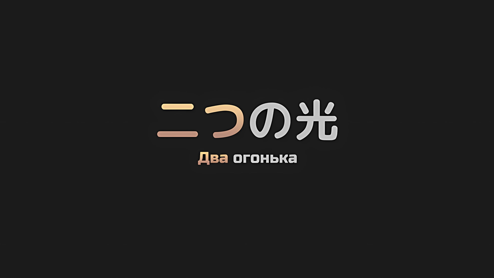
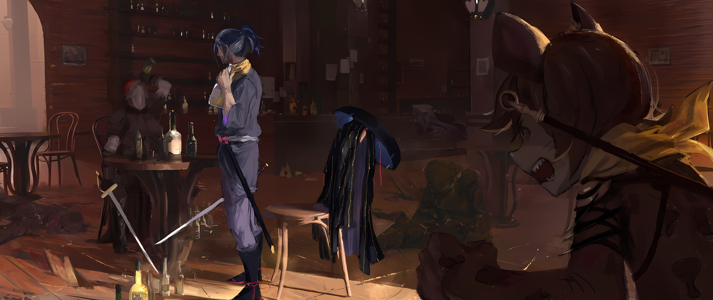

*※※※※※※※※※※※*

Розвааль: …Личность врага стала ясна. Провал «Ведьмы», который когда-то посеял хаос в Королевстве… существо по имени Сфинкс, худший вид монстра.

В соединенных драконьих повозках вновь было созвано экстренное совещание, и Розвааль, поспешно вернувшийся с поля боя, оглядел всех собравшихся и дал такое объяснение.

Сфинкс… так звали фальшивую Рюдзу, с которой столкнулась группа Субару.

И еще…,

Субару: Ты сказал, что она бесчинствовала в Королевстве, когда это произошло?

Розвааль: …Приблизительно сорок лет назад, в разгар «Войны Полулюдей».

Субару: …Хк!

Услышав ответ Розвааля, Субару удивленно расширил глаза.

«Война Полулюдей» часто всплывала в разговорах, но это было событие, произошедшее исключительно в Королевстве Лугуника, ставшем ареной гражданской войны. Подумать только, что он услышит об этом, даже находясь в Империи Волакия.

Юлиус: Согласно записям, во время «Войны Полулюдей», Сфинкс входила в тройку представителей получеловеческой стороны, с которыми следовало быть наиболее осторожными. Я слышал, что ее глубокие познания в магии значительно обострили ужасы «Войны Полулюдей».

Эмилия: Кажется, я тоже встречала это имя, изучая историю Королевства. И еще имя, которое упоминал Субару… Валга Кромвель, верно?

Юлиус: …Действительно. Это имя также соответствует одному из тех, с кем следовало бы быть осторожным.

Встретившись с фальшивой Рюдзу… со Сфинкс, и ощутив угрозу, которую она представляла, Эмилия и Юлиус вспомнили и о другом имени, которое было упомянуто в тот момент.

Им показалось, что Субару внезапно выпалил это имя, но, судя по реакции Сфинкс, они поняли, что она и названный человек не связаны между собой.

Впрочем, Субару и сам не знал, что так зовут человека, причастного к «Войне Полулюдей».

Субару: Другими словами, наши враги — Сфинкс и этот Валга Кромвель, а люди, которые бесчинствовали во время «Войны Полулюдей», теперь бесчинствуют и в Империи? Я не очень понимаю, почему…

Анастасия: «Война Полулюдей» была более сорока лет назад. Я также изучала историю Королевства, и я знаю, за что выступала сторона полулюдей во время гражданской войны… Мне кажется, что эта ситуация не соответствует этому.

Субару: Понятно. В любом случае, я рад, что Беако и остальные в безопасности, но…

В прошлом Сфинкс и Валга сеяли хаос в Королевстве, но было бы нелогично, если бы эти двое теперь бесчинствовали в Империи, поэтому и Субару, и Анастасия с сомнением наклонили головы.

При таком раскладе казалось вероятным, что последний из трех людей, которых следовало опасаться во время гражданской войны, также окажется врагом.

Беатрис: В самом деле, это невозможно. Последний из них… тот, кого звали Либре Ферми, был подтвержден в библиотеке Сторожевой Башни Плеяд, я полагаю. Нет никаких сомнений в том, что он числится среди мертвых, в самом деле.

Прижавшись к Субару, Беатрис развеяла его беспокойство.

С тех пор как он узнал о том, в каком затруднительном положении оказалась его группа, Беатрис, которая прилетела обратно вместе с Розваалем, твердо решила не отходить от Субару ни на шаг.

Субару тоже было больно отпускать ее на поле боя, поэтому он более чем охотно согласился с милой решимостью Беатрис.

Как бы то ни было…,

Субару: Поэтому мы можем быть спокойны, если у него есть «Книга Мертвых»… но разве можно так утверждать? Мы имеем дело с зомби, так что мне начинает казаться естественным, что он там есть.

Юлиус: Если так, то это пугающая перспектива. Возможность того, что мы имеем дело не просто с обычными зомби, а с героями или злодеями, чьи имена были выгравированы в истории.

Субару: Герои, выгравированные в историю, хах…? Эй, ты же не собираешься слишком волноваться, верно?

Юлиус: К сожалению, я уже столкнулся с Рейдом Астрея. Таким образом, я дисциплинирую себя, чтобы не питать чрезмерных надежд.

Юлиус пожал плечами, и Субару бросил в его сторону сомневающийся взгляд.

На самом деле, когда в башне зашла речь о Рейде, стало еще более очевидно, что Юлиус — настоящий любитель истории. Он также правильно уладил отношения с Рейдом. Он был не из тех, кто отстает от жизни, но Субару сомневался в его высказывании о том, что он может сохранить самообладание, столкнувшись с выдающейся личностью.

Отто: Сейчас не время говорить об этом… На данный момент группа Нацуки-сана смогла остановить одну из козырных карт противника, но это было не идеально. Хорошая новость заключается в том, что Сфинкс, которая казалась грозным противником, выбыла раньше времени, но…

Гарфиэль: Извини, Оттобро. По правде говоря, нельзя утверждать это наверняка.

Отто: А?

Когда Гарфиэль, скрестив руки и оскалив клыки, сказал ему это с невнятным произношением, Отто расширил глаза. Гарфиэль, неподвижно смотревший на Отто, вернулся с поля боя, все его тело было покрыто грязью, и руками он жестикулировал в сторону Беатрис и Розвааля,

Гарфиэль: Эта мразь, Сфинкс, встала пред крутым мной, Беатрис и этим ублюдком. Лицо, которое она напялила, меня чертовски взбесило, типа, вы, блядь, должно быть, издеваетесь надо мной…

Эмилия: Да, это так. У нее было такое же лицо, как и у Рюдзу-сан. Это, наверное, было ооочень неприятно для Гарфиэля.

Гарфиэль: Что ж, если она не моя бабуля, то она не моя бабуля, как бы сильно она ни была на нее похожа. Вот почему я без колебаний вступил с ней в бой. Проблема в том, что произошло после.

Эмилия: После?

Когда Эмилия наклонила голову, Гарфиэль глубокомысленно кивнул.

Его мужественный лик был необычайно омрачен, и со вздохом он сказал,

Гарфиэль: …Нет никаких сомнений в том, что крутые мы справились с этой Сфинкс. Я своими глазами видел, как она разлетелась на куски, до такой степени, что это было похоже на «Бесполезную Козырную Карту* Ригириги». Это…

* Идиома Гарфиэля — リギリギの抱え落ち, где 抱え落ち — это сленг видеоигр, означающий смерть игрока до того, как он сможет использовать специальный предмет или способность, находящуюся в его распоряжении. Мы перевели это как «Бесполезную козырную карту».

Беатрис: Полагаю, это и было целью Сфинкс.

Приняв заключение Гарфиэля, Беатрис крепко сжала руку Субару.

Она сжала пальцы Субару так крепко, что они побелели, показывая степень шока, который произвела на Беатрис цель Сфинкс.

С нежностью глядя на Беатрис, Розвааль продолжил: «Позвольте мне закончить».

Розвааль: Сфинкс, безусловно, умерла на наших глазах, а затем она умерла еще раз на глазах Субару-куна и его группы. Из этого можно сделать простой вывод… Сфинкс может умирать неоднократно, каждый раз возрождаясь в виде зомби.

Субару: Что…!?

Розвааль: Пожалуй, что еще хуже, так это то, что воскресший зомби знает о своей предыдущей смерти и обстоятельствах, которые ее вызвали. Другими словами, она в курсе, что Субару-кун и Халибель-доно являются основными факторами, которые помешали ее плану взорвать соединенную драконью повозку.

Все: …

Хотя это было всего лишь предположение, в самом конце Розвааль высказал страшную мысль.

Но со многими моментами они, безусловно, могли согласиться. Посреди разрушительного света, который лился дождем, и в то же время под ударом, который превратил бы ее в пыль, Сфинкс казалась ни капельки не расстроенной.

Существуют люди, которые, столкнувшись с собственной смертью, остаются невозмутимыми.

Однако, если отсутствие реакции Сфинкс на «Смерть» было вызвано тем, что она не считала это «Смертью», то Субару показалось это вполне логичным.

Субару: Это похоже на…

*…*«*Посмертное Возвращение»*, подумал Субару, хотя и не произнес этого вслух.

Он подумал о том, что потеря собственной жизни — это не ущерб, а скорее даже оружие, используемое для совершения разрушительной атаки. Функциональное различие заключалось в том, что сама реальность «Смерти» никуда не исчезнет.

Если подумать, то «Посмертное Возвращение» Субару можно сравнить с неприятной способностью «Овладевания» Петельгейзе, с которым он когда-то сражался.

Юлиус: Неважно, сколько раз она потерпит поражение, хм?

На мгновение, когда Юлиус пробормотал это, его глаза встретились со взглядом Субару.

Возможно, Юлиус, равно как и Субару, сравнил хлопотливый характер Сфинкс с Петельгейзе. Хотя, в отличие от Петельгейзе, Сфинкс не «Овладевала» другими, так что, возможно, это можно назвать «Посмертным Бегством»,

Субару: Если вы не можете кого-то одолеть, сколько бы раз вы ни пытались, то есть только один верный способ победить: просто продолжайте одерживать победу, пока у противника не закончатся экстра жизни, вот и все!

Эмилия: Экзтра жизни? Эээ, это…

Субару: Это означает оставшееся количество раз, когда можно вернуться к жизни. Независимо от того, насколько опасен противник, он никак не сможет возрождаться столько раз, сколько захочет, не имея ограничений. Определенно существует предел. Верно?

Он чувствовал, что ему было не до разговоров, но оставшиеся жизни, казалось, в конце концов должны были быть израсходованы.

Если они постоянно будут убивать Сфинкс, пока у нее не закончатся жизни, то ее спокойное лицо, вопреки мыслям о том, что она не может умереть, уже не сможет сохранять самообладание.

Субару: Вот почему нам не нужно пребывать в унынии. Давайте просто порадуемся тому, что мы сбили с нее спесь! Спасибо, Рем!

Рем: …! Я-я не сделала ничего такого важного.

В ответ на неожиданный оклик, Рем покачала головой. Однако она была слишком скромна, чтобы сказать, что сделала что-то важное.

Сразу же после «Посмертного Возвращения», Субару вышел из соединенной драконьей повозки в сопровождении Эмилии и Юлиуса, а затем попросил оставшуюся внутри Рем передать остальным сообщение. …Разыскать самого сильного из Карараги.

Субару: Если бы Рем не пошла и не привела Халибеля-сан, то Эмилия, Юлиус, я и соединенные драконьи повозки уже бы превратились в пыль. Если бы это случилось, Беако стала бы вдовой, потерявшей меня, и, вечно меня оплакивающей, монашкой.

Беатрис: Не стоит вот так вскользь заявлять о худшем из возможных исходов, в самом деле! Это нечто немыслимое! Если ты умрешь и оставишь после себя только Бетти, то она действительно станет монашкой, я полагаю!

Эмилия: Хм, наверное, именно благодаря Рем Беатрис не стала монашкой, и поэтому мы сейчас можем так разговаривать. Спасибо.

Рем: …Я, поняла. По крайней мере, мне так кажется.

Рем была несколько сдержана, принимая благодарность и от Беатрис, которая была чуть ли не в слезах, и от Эмилии, которая улыбалась.

Вид Эмилии, Беатрис и Рем, снова собравшихся вместе, заставил сердце Субару заколотиться от эмоций. Затем он перевел взгляд на стоящую там высокую фигуру,

Субару: Разумеется, спасибо, Халибель-сан. Честно говоря, я просто рассчитывал на репутацию имени Халибеля-сан, чтобы узнать, сможешь ли ты что-нибудь с этим сделать…

Халибель: Хахаха, разве это не хорошая черта — быть честным? На самом деле, я тоже удивился, когда меня вдруг позвала синяя девушка О́ни. Если бы в меня попали, когда я даже и не подозревал об этом, я бы уже тоже был мертв, понимаешь? Я чувствую, что мне удалось избежать смерти, лишь потому, что она рассказала мне об этом.

Халибель рассмеялся с апломбом, не подобающим его достижениям.

В его спокойном тоне не было ощущения срочности, но без него Субару и остальные были бы уничтожены. То, что Субару во второй раз решил вызвать его на помощь, было правильным решением, но было страшно представить, что если бы его не было бы в этой соединенной драконьей повозке.

За это короткое время ему бы нужно было собрать всех бойцов на борту драконьей повозки и найти наилучшее решение. Но даже в этом случае не было никакой гарантии, что решение могло быть найдено, и это действительно было благодаря сильнейшему из Городов-государств.

Анастасия: Вы так говорите, но как вы на самом деле это сделали?

Эмилия: Мы с Юлиусом старались изо всех сил, но, по-моему, у нас немного не получилось, поэтому я ооочень рада, что Анастасия-сан привлекла на нашу сторону Халибеля-сан.

Анастасия: Понятно, понятно. Ну что ж, тогда это стоило того, чтобы потратить все деньги, дабы заставить его поехать с нами.

Тихо Эмилия и Анастасия провели повторную оценку Халибеля, которому не хватало чувства срочности, и смогли поразмыслить над ситуацией, поскольку все предприняли наилучшие из возможных вариантов действий.

Таков был вывод Субару из невероятного нападения, произошедшего незадолго до этого…,

Субару: Вот так и произошла вся эта заварушка. Ну, это было быстро, и мы сделали все возможное, чтобы спасти всем жизни. И, конечно, тебе есть что сказать, не так ли?

Винсент: Это была отличная услуга.

Субару: Ты ублюдок…!

Когда Император Авель, до этого момента молча слушавший доклад, выразил свою благодарность, Нацуки Субару сильно потряс кулаком.

*△▼△▼△▼△*

Хотя это было само собой разумеющимся, стратегия «Посмертное Бегство», использованная Сфинкс при нападении на соединенные драконьи повозки, должна была быть доведена до сведения имперских лидеров, ставших заинтересованными сторонами, еще до того, как они смогли об этом узнать.

Соединенные драконьи повозки должны были представлять собой очень важный и строго конфиденциальный секрет Империи Волакия; поскольку часть ценного транспортного средства пришлось уничтожить, требовалось конкретное объяснение.

Как бы то ни было…,

Субару: Несмотря на то, что мы положили конец подобной ситуации, ты просто улаживаешь ее словами «отличная услуга»…

Гоз: Что вы говорите, Нацуки-доно! Разве можно желать большей награды, чем слова благодарности от Его Превосходительства! Вам должно быть стыдно, как подданному Империи, которой правит Его Превосходительство!!!

Эмилия: Гоз-сан! Не заблуждайтесь! Субару дитя не Империи, а Королевства, точно так же, как и мы!

Субару: Эмилия, твой голос снова стал громким.

В отличие от имперских солдат, которые максимально проявили свою преданность, слова благодарности Авеля не были достаточной наградой для Субару.

Хотя, если бы это была благодарность от Эмилии, чей голос стал громче, чем у Гоза, то это могло бы компенсировать недовольство Субару.

Винсент: В настоящее время мы вытеснены из столицы Империи и находимся на пути к восстановлению состояния, при котором мы сможем справиться с ситуацией. Даже если ты потребуешь награду, соответствующую вашим достижениям, я не стану давать пустых обещаний. Таким образом, у меня есть только слова, чтобы одарить вас.

Субару: Не говори так горделиво, что твой кошелек пуст…! Ваааааа, Анастасия-сан!

Анастасия: Да, да, не стоит так расстраиваться. Я позабочусь о том, чтобы ты, Юлиус и Эмилия-сан получили свои доли, непомерно оплаченные Империей.

Субару: Дааа! Порви его!

Субару поднял руки со слезами на глазах из-за надежности Анастасии, а Авель нахмурился и вздохнул. Затем, вернув обсуждение к первоначальной теме, он сказал: «Итак»,

Винсент: Эта нежить, о которой идет речь… та, которую зовут Сфинкс, вы хотите сказать, что она является центральной фигурой нынешнего «Великого Бедствия»?

Розвааль: По крайней мере, она должна быть той, кто создал технику, оживившую такое большооое~ количество зомби. Изменения и улучшения существующих техник — вот чем может заниматься этот провал.

Эмилия: Розвааль, я знаю, что ты ее ненавидишь, но не надо говорить так много гадостей.

Розвааль ответил Авелю, и Эмилия слегка приподняла брови в ответ на его слова. Ее нежные аметистовые глаза стали суровыми, и она устремила свой взгляд на Розвааля,

Эмилия: Нам ведь не нужны грубые слова, верно? Если ты постоянно будешь говорить гадости, то даже если тебе удастся сделать что-то хорошее, никто не захочет слушать, что ты на самом деле чувствуешь.

Розвааль: …Да, я буду иметь это в виду.

Эмилия: Да, пожалуйста.

Розвааль криво улыбнулся, покорно склонив голову в ответ на жалобу улыбающейся Эмилии.

Хотя ее мягкий характер остался неизменным, Субару почувствовал, что образ мышления Эмилии стал более изощренным. Было бы неплохо, если бы и Розвааль ощутил то же самое.

Затем, оставив мысли Субару в стороне…,

Винсент: Я слышал, что Сфинкс разбушевалась во время гражданской войны в Королевстве. Что стало с теми обстоятельствами?

Юлиус: Согласно записям Королевства, Сфинкс, Валга Кромвель и Либре Ферми были убиты до окончания гражданской войны. Потеря этих троих привела к тому, что в гражданской войне сторона полулюдей оказалась в невыгодном положении… Это то, что я помню.

Винсент: Ясно. …Но не может быть, чтобы нежить просто беспричинно появлялась из земли. Разве это не вина вашего Королевства, что они превращаются в нежить и в настоящее время опустошают обширные земли Империи?

Розвааль: О боже, такой высокопоставленный человек, как Его Превосходительство Император Винсент, говорит самые абсурдные вещи.

Когда Авель задал этот вопрос, закрыв один глаз, Розвааль улыбнулся и пожал плечами.

Он указал рукой на вид за окном,

Розвааль: Глубинные тайны их мыслей до сих пор неизвестны, но поскольку они несут бедствие Империи, а не Королевству, в котором у них остались воспоминания о поражении, становится очевидно, что их планы отличаются от тех, что были в те времена. Учитывая их тишину в течение последних сорока лет, невозможно представить, что записи Королевства ошибочны.

Сказав все это, Розвааль убрал руку и поднял один палец, говоря: «Но опять же»,

Розвааль: Если и были те, кто непосредственно принимал участие в «Войне Полулюдей» и имел возможность убить Сфинкс, но не смог этого сделать, то, как вы и сказали, Ваше Превосходительство, я считаю, что они должны быть обвиненыыы~.

Винсент: Глупец. Они участвовали в гражданской войне Королевства более сорока лет назад; спрашивать старого солдата, который решал исход битвы, недостойно даже обсуждения.

Субару: Что ж, это верно. Для начала, я рад, что ты не из тех, кто выдвигает столь необоснованные претензии… А? В чем дело, Беако, у тебя неприятное выражение лица.

Беатрис: …Лицо Бетти всегда очаровательно, я полагаю.

Авель быстро согласился с тем, что Розвааль привел веские аргументы, и отказался от своей точки зрения.

Может быть, такая сдержанность и является привычкой, но это плохая привычка, поэтому лучше ее изменить. Пока Субару размышлял об этом, Беатрис по какой-то причине напустила на себя хмурый вид.

Конечно, она была очаровательна, но, видимо, что-то в этой перепалке тяготило Беатрис. Возможно, это выражение ее лица было связано с Розваалем.

Винсент: Итак, что еще ты обнаружил? То, что ты так драматично спрыгнул, не является достижением, если оно привело к тому же результату, что и пребывание в драконьей повозке.

Беатрис: В самом деле, именно Субару, а не Бетти и другие, устроил из всего этого драматическое шоу. Но, я полагаю, это также долг Бетти — взять на себя ответственность за драматическое шоу Субару.

Розвааль: Конечно, в нашем труде были и свои плодыыы~. Не так много об особенностях зомби, но несколько вещееей~ мы все же узнали.

На вопрос Авеля, Беатрис и Розвааль уверенно дали ответ.

Обращаясь к этим двоим, Субару щелкнул пальцами и сказал: «Как от вас и ожидалось».

Субару: Ну и что? Вы выяснили слабое место зомби? Если мы это выяснили, то нам больше не придется бояться Сфинкс, когда она появится вновь.

Отто: Нацуки-сан, пожалуйста, не возлагай слишком больших надежд. Как бы ты на это ни посмотрел, такие впечатляющие результаты…

Беатрис: В самом деле, вы слишком недооцениваете Бетти и Розвааля. Конечно, мы все выяснили, я полагаю.

Отто: Аа!?

Субару: Да неужели!?

Субару и Отто были поражены словами Беатрис, ее грудь вздымилась, а лицо стало самодовольным. Беатрис, довольная их реакцией, улыбнулась и ответила: «Естественно, в самом деле»,

Беатрис: Полагаю, что намеком была интуиция Гарфиэля. Гарфиэль, который уже буйствовал на поле боя раньше Бетти и Розвааля, заметил нечто странное, в самом деле.

Гарфиэль: Впрочем, если бы не появилась Беатрис и этот ублюдок, я бы, даже, возможно, и не вспомнил бы об этом.

Розвааль: По-моему, это очень глупо, что ты обладаешь такой превосходной интуицией, но при этом совершенно ей не доверяешь… А? Я хотел сделать тебе комплимент, но…

Гарфиэль: Я буду недоволен, независимо от того, хвалишь ты меня или критикуешь.

Когда Гарфиэль, упрекая его, высунул свой язык, Розвааль закрыл один глаз и пожал плечами.

Не обращая внимания на их обычные препирательства, Беатрис продолжила.

Беатрис: Гарфиэль заметил разницу в прочности зомби, я полагаю. Одни зомби умирали от одной стрелы, а другие оставались живы и здоровы даже после того, как их пронзали десять стрел. В этом, собственно, и заключается разница.

Эмилия: Но разве это не потому, что сила каждого «Зонби» разная? Например, я сильнее Субару, поэтому такое расхождение вполне возможно.

Беатрис: Полагаю, дело не в этом. Даже при равной разнице в силе между Субару и Анастасией, все равно оставалось расхождение между одной стрелой и десятью, в самом деле.

Анастасия: Если сравнивать со мной, то, похоже, Нацуки-кун все такой же жалкий, как и всегда.

Изящно улыбнувшись, Анастасия посмотрела на Субару. Но, поскольку Субару уменьшился в размерах, опровергнуть это утверждение ему было нечем, и он ответил на ее беспокойство взмахом руки.

Однако упоминание Беатрис о расхождении, безусловно, его заинтересовало. А также тот факт, что Беатрис и Розвааль раскрыли истину, лежащую в основе этого несоответствия.

Ответом было…,

Винсент: Изложи свой вывод. Что вызвало расхождения между нежитью?

Беатрис: …Насекомые, я полагаю.

Субару: Насекомые…?

Когда Авель получил ответ на свой вопрос, Субару нахмурил брови, размышляя над содержанием полученных слов.

Затем Беатрис посмотрела в сторону Розвааля и кивнула. По этому сигналу тот достал что-то из своего кармана,

Розвааль: Пожалуйста, будьте предельно осторожны. Оно было заморожено чтобы приостановить его активность, но если лед расколется, предположительно, здесь пояяявится~ зомби.

Субару: О чем ты говоришь… Эй, эй, эй, что это за хрень!?

Розвааль: Беатрис ведь сказала это, не так ли? Это насекомое. Я бы даже осмелился назвать его «Жуком-ядром».

В тот момент, когда он говорил это, в руке Розвааля между пальцами была зажата небольшая глыба льда размером примерно с монету, внутри которой находился красный круглый объект.

При ближайшем рассмотрении он понял, что это был маленький круглый жучок, похожий на гусеницу…

Розвааль: Этот Жук-ядро скрывается в теле каждого зомби. И этот червь — жизненная линия зомби… другими словами, он, несомненно, является их ядром.

Субару: Эти жуки — их ядро, значит…

Юлиус: …Понятно. Значит, истинная природа предполагаемого Гарфиэлем расхождения заключалась в разнице между точками, в которых стрела убивала Жука-ядро в теле зомби.

Хотя шок Субару от столкновения с жуком еще не прошел, Юлиус понял детали таким образом.

Услышав слова Юлиуса, остальные тоже пришли к пониманию. Конечно, Субару также наконец-то понял цель существования жуков…,

Субару: То есть ты хочешь сказать, что Жук-ядро — это сердце зомби?

Розвааль: Мы будем продолжать работать над разгадкой техники, но этот Жук-ядро получает информацию о цели, которая должна превратиться в зомби, а затем воспроизводит ее первоначальную форму, делая сосуд из земли… Таков наш вывод.

Беатрис: Действительно, в самом деле.

Не возражая, Беатрис кивнула головой в знак согласия с выводом Розвааля.

Но Субару был совершенно потрясен тем, к какому выводу они пришли.

Если бы зомби были созданы с помощью магии, он мог бы принять это в рамках фэнтези. Однако, когда речь зашла о магических жуках, создающих зомби, чувство отвращения взяло верх.

Субару: Хоть в детстве я и любил ловить жуков, как жалко…

Отто: Впрочем, я не думаю, что это та ситуация, когда стоит об этом размышлять. …В любом случае, наши люди добились хороших результатов. Как вы на это смотрите, Ваше Превосходительство Император?

Винсент: По крайней мере, вы доказали, что не просто некомпетентная кучка лиц, которые много говорят и не достигают никаких результатов. Я признаю это. Это была большая услуга.

Отто: …Возможно, было бы лучше, если бы я не спрашивал.

Не зависимо от людей Империи, эти хвалебные слова были неблаговидны для жителей Королевства, в том числе и для Субару.

Как бы то ни было, но даже упрямому Авелю не оставалось ничего другого, кроме как признать результаты, которых добились Беатрис и Розвааль.

В глубине души он, наверное, ворчал «Гррр».

Субару: Вы проделали большую работу; это моя Беако.

Беатрис: Разумеется, я полагаю. В этом и заключается компетентность партнера Субару. В отличие от той оленихи, которая прошла с Субару лишь через некоторые трудности, я полагаю.

Субару: Вместо того, чтобы обижаться, не лучше ли тебе поладить с Танзой? Эмилия-тан ведь просила не говорить ничего плохого!

Успокоив Беатрис, странно проявлявшую свою конкурентоспособность, Субару пообещал погладить ее сто раз, чтобы восстановить ее настроение, а затем снова посмотрел на Авеля и остальных.

Когда Авель ответил ему взглядом, Субару, выпятив грудь, сказал: «Ну что?»,

Субару: Это мои надежные союзники. Все мои громкие слова оправдались, не так ли?

Винсент: Я признаю твою заслугу в защите от нападения на драконью повозку. Но по какой причине ты должен так настойчиво хвастаться передо мной своими успехами, чтобы почувствовать удовлетворение? Твои достижения достаточно заметны глазу.

Субару: Хех, что бы ты ни говорил, это звучит так, будто ты обиженный неудачник. В конце концов, сейчас я чувствую себя прекрасно.

Субару фыркнул в ответ на недовольный ответ Авеля. Эмилия воскликнула: «Нет!», рассердившись на него за такое отношение, но он не смог скрыть своих истинных чувств.

Затем, возможно, нетерпеливые к успехам Субару и его партии, лидеры Империи… Беллстетз и Серена — обменялись несколькими словами, после чего Авель посмотрел в их сторону,

Беллстетз: Ваше Превосходительство, жители Королевства… Поскольку наш знакомый Маркграф Мейзерс и его спутники продемонстрировали столь впечатляющие успехи, не будет ли бесчестным, если наша сторона не сможет дать выгодные ответы?

Винсент: Верховная Графиня Дракрой, по какой причине это тебя так забавляет?

Серена: Забавляет, говорите? Прошу прощения, Ваше Превосходительство. Я и сама этого не осознавала, но, возможно, это результат того, что мое собственное достоинство как имперской знати подвергается испытанию, предполагая, что мы находимся в ситуации, когда престиж Империи должен быть продемонстрирован для сохранения нашей чести.

Винсент: …

Положив руку на свою пышную грудь, Серена сказала это, и белый шрам на ее лице исказился. Она не улыбалась, но тон ее голоса и выражение глаз были вполне добродушными. В ситуации, когда она абсолютно не являлась главенствующей, она проявила выдающуюся душевную стойкость, чтобы разговаривать с Императором в таком тоне.

Субару: Возможно ли, что Серена-сан довольно опасный человек?

Гарфиэль: Не знаю, плохая она или нет, но она дружит с Розваалем.

Субару: Ах~.

В поисках информации о Серене, с которой он практически не контактировал, первой брошенной бомбы оказалось достаточно, чтобы разрушить стену его сомнений.

Однако трудно было сказать, кто именно — Розвааль или Серена — решил подружиться. В конце концов, было ясно как день, что их приграничная дружба стала причиной того, что Эмилия и другие смогли проделать весь этот путь в Империю, чтобы найти Субару и остальных.

Если подумать, Розвааль тоже вел себя очень дерзко во время Церемонии Королевских Выборов.

Логично предположить, что он дружил с Сереной, которая так относилась к Авелю.

Анастасия: Прошло уже достаточно времени, чтобы я могла об этом говорить, но Нацуки-кун ведь тоже был таким в те времена, верно?

Субару: Я тебя не слышу, я тебя не слышу, я тебя не слышу…

Субару закрыл уши и убежал от неприятного прошлого; «То, что ты сделал в прошлом, никуда не исчезнет*», равнодушные глаза того самого человека, который когда-то проповедовал ему это, теперь словно вонзились в него.

* Субару вспоминает слова Анастасии, сказанные ему в 3 Арке.

И с таким же равнодушным взглядом Серена милостиво повернулась к Императору и продолжила его в чем-то убеждать.

Серена: В любом случае, Ваше Превосходительство, должно быть, считает это полезным. Именно поэтому вы держите их рядом с собой, но это всего лишь подозрения такой женщины, как я.

Винсент: Хватит. Даже если бы ты не была столь беспринципна в своих словах, я бы все равно понял.

Фыркнув, Авель преградил Серене путь рукой. Затем он стер весь оттенок раздумий и сказал то, к чему она его подтолкнула.

Этим было…,

Винсент: …Есть кое-кто, кто обладает информацией, способной стать для нас полезной в противостоянии с этим «Великим Бедствием». Необходимо услышать, что скажет этот человек, прежде чем мы прибудем в Укрепленный Город.

*△▼△▼△▼△*

???: О-о-о~, вы наконец-то собираетесь меня выслушать? В таком случае я очень рад, Ваше Превосходительство.

Человек, который, по слухам, был заключен за дверью наглухо запертой каюты в драконьей повозке, приветливо улыбнулся, увидев фигуру Авеля.

Однако для него, находящегося в таком заточении, это было не то, чему следовало улыбаться.

Ведь все его тело было сковано цепями и привязано к стулу, чтобы не дать ему сбежать.

Субару: Эй-эй, Авель, как ни посмотри, это…

Винсент: Необходимая мера. К худу или к добру, но потеря этого человека станет серьезным ударом для нашей стороны. Позволь мне тебя предупредить, если снять с него оковы, он с легкостью уйдет на верную смерть.

???: Нелееепо~, что я уйду на смерть! Просто до сих пор я делал все возможное, чтобы остановить «Великое Бедствие»… Если это будет сделано ради этой цели, то неважно, потеряю я свою жизнь или нет.

Субару: Ооо…

Бездумно улыбаясь, хрупкий парень раскачивался взад-вперед на стуле, к которому был привязан.

Чувствуя некое безумие от такой манеры говорить, даже Субару мог поверить, что доводы Авеля не были преувеличением.

Однако, несмотря на то, что он казался не более чем подозрительным…,

Субару: Этот «Звездочет»… Убирк-сан, верно? Ты сказал, что мы можем на него положиться?

Убирк: Чегооо~, обидно, что во мне сомневаются… Погоди, если приглядеться, не ты ли тот самый «Звездочет»-сан из Королевства, мимо которого я проходииил~ в Хаосфлейме!?

Субару: Ты совершенно не прав. А! Это не ты, случаем, вбил в голову этому парню мысль о том, что я «Звездочет»? Я с ним из-за этого на кулаках подрался!

Хрупкий парень с сияющим лицом… Убирк, произнес грубое замечание, которое заставило Субару огрызнуться.

То, что к Субару относились как к представителю сомнительной профессии «Звездочета», доставляло ему массу неудобств. Конечно, поскольку «Звездочеты» брали на себя некую роль пророков, Субару понимал, что существует вероятность того, что он, способный «Посмертно Возвращаться», может оказаться таким же, как и они; но даже в этом случае это доставляло большие неудобства.

Так или иначе…,

Субару: Я не такой, как ты. Имей это в виду.

Убирк: Ааа~? Это странно. Я слышал, что ты такой же, однако…

Субару: От звезд? В таком случае, Авель, мы не можем положиться на этого человека.

Если бы вдруг выяснилось, что звезды дали неверные ответы, он, к сожалению, хотел бы избежать этого прямо сейчас.

В настоящий момент важно было получить от звезд точную информацию, какой бы пустяковой она ни была. Расплывчатые пророчества, которые можно интерпретировать в любую сторону, подобно эффекту Барнума, были излишни.

Поэтому он разочарованно отвернулся, но…,

Убирк: Стой-стой, пожалуйста, подождиии~! Я поняяял~! Ты неее~ «Звездочет»! Для меня это не имеет никакого значения!

Субару: Меня беспокоит твоя манера говорить, но даже если ты изменишь свое заявление, это не значит, что твой авторитет внезапно восстановится…

Убирк: Мне все равно, что вы держииите~ меня взаперти. Но, пожалуйста, хотя бы выслушайте то, что я услышал от звезд. Большего от вас и не требуется!

Субару: …

Убирк с силой крутанулся на своем стуле, его глаза пылали. Цепи, обмотанные вокруг него, с силой разорвали ему кожу до такой степени, что его кровь начала нещадно хлестать.

Совершенно не обращая внимания на боль, он попытался передать информацию, которую услышал от звезд как «Звездочет». Если бы ему удалось это сделать, травмы бы не имели для него никакого значения.

Казалось, что даже его собственная жизнь не имела для него никакого значения.

Субару: Авель, эти «Звездочеты»…

Винсент: Отбрось чувства. Выслушай то, что он скажет, а затем реши, стоит ли это рассматривать.

Такая сильная помешанность на звездах вызвала у Субару неприятное чувство дежавю. Но Авель не согласился с этим суждением Субару и упреждающе перевел взгляд на Убирка.

Увидев готовность Авеля внимать, Убирк прекратил корчиться, на его нежном лице появилась улыбка.

Убирк: Будьте уверены, Ваше Превосходительство. Каким бы могущественным ни было «Великое Бедствие», звееезды~ всегда будут на вашей стороне.

Винсент: Ты про те жестокие звезды, которые не видят разницы между Винсентом Волакией и тем, кто остался позади, хм? Не смеши меня. …Говори. Что ты должен передать?

Убирк: Два.

Авель задал этот вопрос, скрестив руки, и Убирк дал короткий ответ.

Услышав это, Субару пробормотал: «Два», и Авель, помолчав, призвал его продолжать.

Субару очень сомневался, можно ли ему доверять, но, по крайней мере, этот «Звездочет», как говорили, предсказал наступление «Великого Бедствия», и сейчас он должен был предоставить информацию ради сотрясающейся Империи.

Этим было…,

Убирк: Два огонька, призванные отвратить опасность «Великого Бедствия». Первая, принесенная «Звездочетом» Королевства… вернее, мальчиком, который таковым не является, — девочка, не способная общаться с помощью слов.

Субару: …Что?

Убирк взглянул на Субару, который, застыв на месте от услышанного, расширил глаза.

Он сомневался, стоит ли верить словам Убирка, но после того, как они прозвучали, не было никаких причин ему доверять.

В конце концов, существовал только один человек, который соответствовал заявленным требованиям Убирка.

И тогда, не дав ему и секунды оправиться от такого удара, Убирк продолжил.

Теми же устами, которыми он только что раскрыл один из так называемых двух огоньков, он продолжил путь к оставшемуся светилу.

Этим огоньком был…,

Убирк: …Самый сведущий Империи в проклятиях, зверочеловек, стоящий на одной из девяти вершин.

*△▼△▼△▼△*

Запыхаясь и отталкиваясь от земли, он с силой бежал вверх по каменистой горной тропе.

???: Блядь, блядь, блядь, блядь, эти ебаные выблядки…!

Даже энергичность в его словах стала слабее; он понимал, что выбивается из сил.

Бегать по равнинам и сражаться без сна и отдыха — это то, что он делал всегда, с самого детства, чтобы выжить в этих обширных землях Империи.

Тем не менее, стресс от десятидневного отсутствия еды и воды — это совершенно другая грань.

???: …Кх.

*Нюх*; когда в носовую полость проник запах земли, смешанный с чем-то странным, он яростно напряг свои конечности.

Он не пытался ни навострить уши, ни поймать что-то глазами. Он был способен полностью воспринимать окружающий мир только через то, что мог учуять его нос. Даже позиции, численность и общее вооружение врагов.

Именно поэтому он понимал, что окружен сотней вражеских войск, что все это безнадежно, сколько бы он ни сокращал их численность; от этого ему хотелось думать, что его нос потерял остроту.

???: ЭТИ ЕБАНЫЕ ВЫБЛЯДКИ!

Однако он тут же отогнал эти мысли и вонзил свое оружие в запах земли.

Первый, второй, третий; тела врагов, получивших прямое попадание, разлетелись на куски, и эта атака пробила противников с другой стороны, позволив ему с силой прорвать кольцо окружения и вырваться наружу.

Сколько бы он их ни уничтожал, бледные земляные марионетки постоянно появлялись.

Эти кошмарные твари низкого качества, несомненно, охотились за его жизнью.

Армия, которой он командовал, была уничтожена, и когда он это понял, было уже слишком поздно; сомневаясь в своих способностях «Генерала», он продолжал бежать на восток, все дальше и дальше, борясь за свою жизнь.

Даже если он пытался куда-то приткнуться, пути все равно преграждались; он не только умирал от голода и жажды, но и в последний раз общался с живым человеком, когда расставался со своим вторым командиром.

По меньшей мере, было бы неплохо, если бы хоть кто-то из его подчиненных смог выжить.

???: Тц…!!!

В тот момент, когда его мысли отклонились от основной темы, его реакция на удар противника стала запоздалой.

Наплечник защитил его от вражеской атаки, когда она задела его плечо, и, воспользовавшись возможностью уклониться от удара, он оттолкнулся от поверхности горной тропы. По сравнению с подъемом по узкой тропе, усеянной препятствиями, соскользнуть с обрыва было гораздо удобнее.

Приняв такое решение, он побежал вниз по крутому, как прямой угол, обрыву и начал быстрее избавляться от преследующих его врагов.

Если даже он окажется загнанным в угол от количества набросившихся на него врагов, небольшая передышка будет как нельзя кстати.

Рассчитывая на это, он бежал, бежал и бежал…,

???: …Хк, этот запах…

Смешиваясь с землей, растительностью и легким ароматом цветов, запах жизни защекотал его носовую полость.

Почувствовав что-то отличное от запаха железа, исходившего от оружия, которым владели его преследователи, его мысли на мгновение разлетелись на тысячу кусочков, но он тут же сориентировался в ситуации и последовал за этим запахом жизни.

Он колебался, стоит ли втягивать других людей в схватку с этим врагом.

Однако если бы он этого не сделал, то продолжил бы страдать от голода и жажды, теряя все свои силы. Это было бы самым глупым, самым дурацким заключением, к которому он мог прийти.

???: …Ебать, скрытая деревня?

Следуя за запахом жизни, он попал в уединенное поселение среди гор.

В Империи было немало людей, которые бросали свои земли, чтобы уйти от налогов, и либо становились бандитами, либо уходили жить в горы или леса. Вероятно, это поселение было одной из таких скрытых деревень.

Как «Генерал» Империи, он обычно не мог допустить существования этой скрытой деревни, но…,

???: Это пиздец как срочно! Пока все в порядке! Более важно…

Заинтересовавшись, нет ли здесь кого-нибудь, он окинул взглядом все поселение и шмыгнул носом, обнаружив, что в поле его зрения никого не появилось.

Источником запаха жизни являлось именно это поселение, но то, что сильно щекотало его носовую полость, было не стойким ароматом, а зловонием кого-то, кто в данный момент здесь присутствовал.

Он двинулся в том направлении, и, если бы это были люди, способные сражаться, он бы попросил их о помощи.

Даже если бы ему удалось выиграть немного времени, он, вероятно, смог бы использовать его, чтобы восстановить свои физические силы с помощью еды и воды.

Пробудив свое сердце прямо перед тем, как ему грозила смерть, он, опираясь на запах, направился к одному из больших зданий в поселении.

Подойдя ко входу, он ворвался внутрь.

???: Эй! Я не знаю, кто вы, но не могли бы вы протянуть мне руку помощи против этих выблядков…

…В это мгновение навстречу его появлению яростно взметнулись два столба ветра.

???: ОХУЕТЬ КАК БЛИЗКО!!!

Он тут же откинул голову и бедра назад, чтобы увернуться от этого; он запоздало понял, что это были резкие рубящие удары.

Он ворвался внутрь, требуя помощи, а вместо этого его попытались убить; он оскалил клыки и пристально посмотрел на противника, совершившего такой глупый поступок.

И тут…,

????: О? Это очень странное событие! Подумать только, мы пытались выяснить, кто будет следующим мертвецом — мужчина или женщина, а в итоге в дело вступил живой тип… Красноволосый! Похоже, я победитель нашего пари!

?????: Завались, захлопнись, сдохни. Победа, поражение, все это, бля, ничего не стоит…

В этот момент перед его глазами возникло просторное здание, где за круглым столом сидели двое мужчин средних лет… Более того, от них несло спиртным.

Один из них сжимал в руках катану, а другой рыцарский меч; при виде пьяного состояния этих двоих в нем вспыхнула злость, и на мгновение он забыл о своем пустом желудке и пересохшем горле…,

???: Эй, мудачье, сейчас опасные дни для Империи, это, блядь, не лучшее время для того, чтобы бухать до усрачки, МАТЬ ВАШУ!!!

С этими словами «Мастер Проклятых Инструментов», Груви Гамлет, воскликнул в ужасающе прямолинейной манере.
