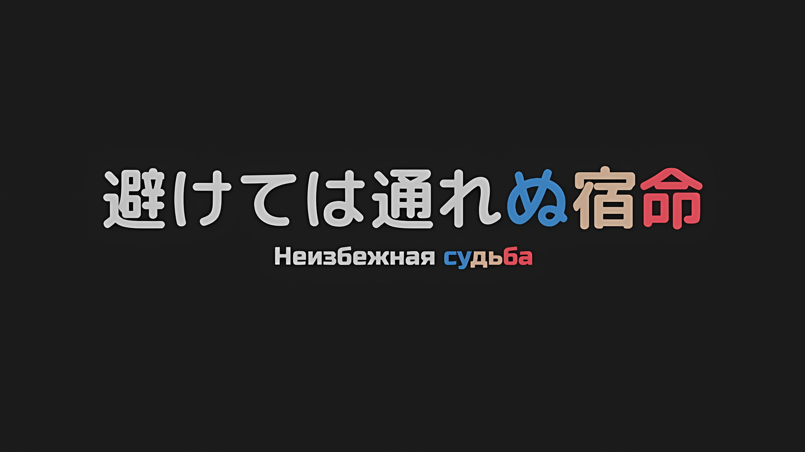
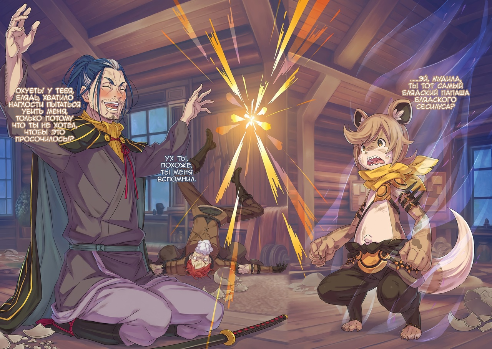

*※※※※※※※※※※※*

В таверне витал густой запах спиртного и земли.

У входа валялись пустые бутылки и бочки из-под спиртного, а также обломки земляных кукол, которые, вероятно, некогда были похожи на людей.

Все это нагромоздили двое мужчин средних лет, ворчавших в баре за выпивкой…,

???: О? Этот джентльмен, у меня такое чувство, что я где-то его уже видел… Что скажешь, Красноволосый? Узнаешь этого джентльмена-Пушистика!?

Груви: Кого ты, сука, назвал Пушистиком!? Не пизди, блядь! Я только и делал, что убегал, без еды и воды, так что я сейчас ПИЗДЕЦ КАК ИЗМОТАН…!

Когда мужчина с румяным лицом добродушно ухмыльнулся, хорошенько шлепнув себя по коленям, Груви набросился на него.

Почему-то мужчина средних лет, с завязанными на затылке синими волосами, услышав жалобу Груви, начал смеяться со все возрастающим весельем и словами «Это неизбежно, неизбежно!».

Похоже, что он был полностью пьян.

Поскольку о синем типе не могло быть и речи, Груви посмотрел на второго, на красного мужчину средних лет. Тот спокойно сидел на стуле и глядел на бутылку в своей руке.

Груви: Эй! Вон ты, Красноволосый, блядь! Ты такой же, как и этот синеволосый мудила!?

Красноволосый: …

Груви: Не вздумай меня игнорировать! Перестань, сука, молчать и посмотри на…

Красноволосый: …Завались.

*Меня*; Не успел Груви закончить фразу, как ему в отместку метнулась серебристая вспышка.

Оставаясь на стуле, он нанес горизонтальный удар, целясь в шею Груви. Нечто подобное уже было, когда он только ворвался в таверну, но в данном случае речь шла о точном ударе мечом, направленном на поражение жизненно важных органов противника.

Если бы противником был не Груви, удар мог бы оказаться смертельным, но,

Груви: Ты с кем, блядь, драку затеял, ПОЛУДУРОК!!!

Уклонившись таким образом, что атака мечом прошла лишь по кончику его носа, Груви сделал шаг вперед и в одно мгновение сократил расстояние, а его кулак с воем впечатался в боковую часть туловища красноволосого мужчины средних лет, отчего ударная волна отбросила его к стене.

Кашляя «Кхх» и крича от боли, тело красного закрутилось в полете. Мужчина врезался в стену, не предпринимая никаких мер для самозащиты, и, бросив на него косой взгляд, Груви поймал в воздухе бутылку с выпивкой, которая переворачивалась в вертикальном положении.

Алкоголь, который пил красный, Груви с огромной силой залил себе в глотку.

Груви: Кхаах!!! Как же жжет… Я бы предпочел воду и любую злоебучую еду, но…

Синеволосый мужчина: …Браво, браво! Ваши навыки не вызывают сомнений, мистер Пушистик. Красноволосый должен был быть очень сильным, я удивлен, что вы так легко с ним справились!

Груви: Ха?

Оглянувшись на красноволосого мужчину, прислоненного к стене, синий опустился на колени и протянул свою катану, как бы говоря, что он уже побежден.

Синеволосый мужчина, опустившись на колени, с покрасневшим лицом похвалил силу Груви и, показав, что не намерен давать отпор, склонил голову.

Синеволосый мужчина: Мы доставили вам массу хлопот, мистер Пушистик! Мы просто странники, и мы бесцельно забрели в это поселение. Но когда мы наткнулись на эту деревню, она уже была в таком виде; все жители исчезли, и ее заняла группа этих земляных кусков.

Груви: …То есть, ты хочешь сказать, что у вас, ебнутых недоумков, не было иного выбора, кроме как нажраться выпивки, которую оставили после себя мертвецы?

Синеволосый мужчина: Дорогой мой, мне несколько неловко, но вы абсолютно правы! Нам было скучно, и поэтому мы решили поспорить, кто будет следующим земляным куском, вошедшим в эту дверь, — мужчина или женщина.

Улыбаясь, как дурачок, синеволосый мужчина поведал подробности пари, которое заставило бы их забыть о том, что сейчас чрезвычайная ситуация.

Эти подробности были бессмысленны, но Груви так и не смог понять, играют ли они в азартные игры с не принадлежащим им алкоголем или ставят на кон собственную жизнь. Где бы эти люди ни жили, где бы они ни умирали, все зависело от их собственной прихоти.

Однако…,

Груви: …Мне это, блядь, не нравится.

Синеволосый мужчина: Хе, что вы имеете в виду?

Груви: Выблядок, у тебя хватило наглости встать на колени и предложить свою катану, делая вид, что ты не собираешься сражаться, но мой нос не обманешь… Не смей, блядь, смотреть на меня с таким убийственным намерением.

Синеволосый мужчина: …

*Нюх*; Груви шмыгнул носом и уставился на синеволосого мужчину, на что тот ответил обеспокоенным выражением лица, почесав щеку со звуком «Эхх». Но то, что он не высказал отрицания, объясняется не тем, что он не смог сразу подобрать нужные слова, а тем, что он понимал, что небрежное оправдание вызовет гнев Груви.

Этот синий мужчина средних лет с тех пор, как был побит красный, постоянно скрывал намерение убить Груви за своими словами и поведением.

Ворвавшись сюда после преследования земляных марионеток, он, вместо того чтобы передохнуть, связался с неприятным противником… И, только подумав об этом, Груви понял.

Груви: …Ублюдок, я вспомнил твой дерьмовый запах.

Груви вспомнил тот запах, который он уже где-то чувствовал, и все волоски на его теле встали дыбом.

Он не мог сказать, что помнил все ароматы, которые когда-либо чувствовал, но характерные запахи было трудно забыть. Столкнувшись с этим запахом, разбавленным убийственным намерением, он попытался вспомнить личность своего противника…,

Груви: …Эй, мудила, ты тот самый блядский папаша блядского Сесилуса?

Высказав пришедшее на ум воспоминание, Груви уставился на своего противника.

Под острым взглядом Груви синеволосый мужчина сделал мерзкое выражение лица,

Синеволосый мужчина: Ух ты, похоже, ты меня вспомнил.

Груви: ОХУЕТЬ! У тебя, блядь, хватило наглости пытаться убить меня, только потому что ты не хотел, чтобы это просочилось!? ТЫ, СУКА, ИЗДЕВАЕШЬСЯ НАДО МНОЙ! Начнем с того, что с какого, блядь, хера ты вообще жив!? Разве Сесилус тебя не грохнул!?

Синеволосый мужчина: Даже если ты спросишь меня почему, я смогу ответить только то, что я жив, потому что я жив. Однако, если станет известно, что я выжил, это будет ужасно для меня некстати.

Небрежно покачивая головой из стороны в сторону, синий мужчина средних лет бессовестно сказал это… Он был отцом Сесилуса Сегмунта, «Первого» из «Девяти Божественных Генералов».

В прошлом он часто посещал Кристальный Дворец вместе с Сесилусом, поэтому Груви не раз бывал у него на глазах. Однако несколько лет назад он совершил акт кощунства в имперском дворце и был зарублен не кем иным, как собственным сыном Сесилусом; его следовало считать мертвым.

Синеволосый мужчина: Они повсюду развесили плакаты о моем розыске, должно быть, у тебя отшибло память, если ты думал, что я умер.

Груви: Я просто думал, что этот тупоголовый Сесилус не напортачит. Умение этого выблядка владеть мечом — единственная, блядь, надежная черта в нем; если он все же проебался, значит, он кусок дерьма. Не может, блядь, быть, чтобы он взял на себя свободу действий только потому, что это был его блядский родитель.

Синеволосый мужчина: …Дело не в этом. Мастерство этого парня никогда не притупится из-за семейных уз.

Груви: …

Получив такое решительное заявление, Груви отказался от слов, которыми собирался огрызнуться.

Он мало что знал о детско-родительских отношениях между этим синеволосым мужчиной и Сесилусом. Но это был именно тот отец, который вырастил Сесилуса, чтобы тот стал тем, кем он являлся сейчас. Нетрудно было предположить, что он тоже был ни на что не годным монстром.

Если навыки Сесилуса не притупились, когда он убивал своего отца, то в этом тоже, вероятно, был свой резон.

Однако…,

Груви: Дерьмово…

После того, как за ним гнались и гнались, а он постоянно убегал, ему наконец-то удалось наткнуться на живых людей, но это была пара пьяниц… Более того, один из них был разыскиваемым преступником, а другой был склонен к насилию в нетрезвом виде.

Он проклинал свое невезение и хотел погрязнуть в отчаянии.

Красноволосый: Агх, гахк…

Синеволосый мужчина: О, ты еще и Красноволосого в живых оставил. А ты добрый, мистер Пушистик.

Груви: …Я не очень-то с ним и возился. Этот Красноволосый оказался просто, блядь, пиздецки крепким.

Красноволосый мужчина, прижатый к стене, выдержал удар Груви, который должен был превратить внутренности его тела в сплошную кашу, и едва не захлебнулся в собственной рвоте, хлынувшей из его рта.

Даже в таком измученном состоянии Груви мог бы одолеть этот сине-красный дуэт мужчин средних лет, однако…,

Синеволосый мужчина: …На улице шумно, не так ли?

Как только синеволосый мужчина сказал это, в поселение ворвался запах отвратительной земли.

Груви стало ясно, что они в большом количестве окружили скрытую деревню. Почувствовав носом, что к ним постепенно приближаются, Груви впал в ярость.

Он избил бы этих двух мужчин средних лет до полусмерти и боролся бы изо всех сил, чтобы прорвать эту осаду; потом бы он отыскал кого-нибудь получше этих двух пьяниц и нашел бы время, чтобы набить свое брюхо едой и водой.

Можно ли достичь этого идеала? Если нет…,

Груви: …Ты, блядский выродок, давай заключим сделку.

Синеволосый мужчина: С уважением слушаю.

Все еще сидя на коленях, синеволосый мужчина смиренно положил свою катану набок.

До недавнего времени этот мужчина пытался убить Груви с точно такой же позой и поведением, до такой степени, что ему хотелось назвать его наглым лжецом, и все же запах убийственного намерения теперь улетучился.

Чувствуя раздражение по этому поводу, Груви заговорил.

Груви: Чего бы мне это ни стоило, я должен вернуться к Его Превосходительству и остальным. Даже если для этого мне придется использовать вас, тупиц, чтобы добраться туда. Вот почему…

Синеволосый мужчина: …

Груви: Я использую свою власть Генерала Первого Класса, чтобы снять тебя с розыска. Взамен ты будешь сотрудничать со мной и поможешь мне вернуться в столицу Империи.

Для Груви это было последним отчаянным средством.

Будь он в идеальном состоянии, ему бы и в голову не пришло полагаться на таких людей. Но если он останется упрямым и рухнет, кому это будет выгодно?

Груви: Тому ебаному куску дерьма, который создал всю эту злоебучую ситуацию.

Честно говоря, он чувствовал, что за гражданской войной, сотрясающей Империю Волакия, многое происходит в тени.

Бдительное наблюдение за западной стороной было действительно правдоподобной причиной, по которой его отправили подальше от столицы Империи, но и в этом случае он несколько подозревал, что у Винсента были совсем другие мотивы.

Причина, по которой он покорно следовал этому, заключалась в том, что он считал нормальным верить в суждения Винсента.

Таким образом, чтобы получить ответ на вопрос, во что он верил, Груви не оставалось ничего другого, кроме как вернуться.

Поэтому…,

Груви: ТЫ ПРИНИМАЕШЬ СДЕЛКУ ИЛИ НЕТ, РЕШАЙ УЖЕ, СУКИН ТЫ СЫН!

Груви оскалил клыки и завопил, а напротив него синий мужчина средних лет в задумчивости закрыл один глаз.

Не успел мужчина, мысли которого было трудно прочитать, озвучить свой ответ, как позади Груви раздался громкий треск; дверь таверны была выбита с внешней стороны.

Сохраняя энергию, потраченную на выламывание двери, бледные земляные марионетки ворвались внутрь. Не успели их руки дотянуться до маленькой спины Груви, как сверкнул меч.

В результате взмаха катаны головы земляных марионеток отделились от туловищ и превратились в куски земли.

Тот, кто это делал, синеволосый мужчина, естественным движением вернул катану в свои ножны и встал на ноги. Затем мужчина, с румяным лицом, погладил свободной рукой щетину на своем подбородке,

Синеволосый мужчина: В дополнение к снятию меня с розыска, какую денежку мне заплатят?

Груви: Да ты, блядь, в натуре ахуевший кусок дерьма…

Приняв этот бесстыдный вопрос в качестве ответа, Груви сделал долгий, глубокий вдох. Затем, казалось, его зрение закружилось, и…,

Груви: Блядь.

Действительно, его физические силы достигли своего неизбежного предела, и сознание Груви погрузилось в темное русло реки.

Синеволосый мужчина: Боже милостивый, подумать только, он задремал и отложил разбор тонкостей на потом, этот джентльмен-Пушистик довольно приятный тип.

Вяло повалившись на землю, маленький зверочеловек от души захрапел.

Один из вершин военной мощи Империи Волакия, Груви Гамлет из «Девяти Божественных Генералов»; глядя на него, Роуэн Сегмунт с красным от спиртного лицом в задумчивости наклонил голову.

Груви не был похож на того, кто пойдет против своего слова.

По его мнению, этих условий было достаточно. Конечно, он также рассматривал возможность продолжить бегство; он мог бы проткнуть сердце спящего Груви прямо здесь, но тогда он просто продолжил бы свою жизнь в бегах.

Роуэн: Если бы я так поступил, кому бы это было выгодно? К тому же, с моей стороны было бы более инициативно, если бы я воспринял это как то, что мне сопутствует удача. …Наконец-то поднимается занавес третьего акта моей жизни!

Когда Роуэн твердо ступил на землю, его обеспокоила легкая судорога в левой ноге; однако затем он усмехнулся про себя, поняв, что больше нет необходимости принимать ответные меры.

Тем не менее, сейчас первоочередной задачей было выбраться из этого места живым, поэтому, почувствовав присутствие земляных кусков, собравшихся возле бара, он поднял Груви.

Затем он подошел к своему товарищу, который лежал вверх ногами у стены… к Хейнкелю, и дал ему хорошего пинка.

Роуэн: Эй, Красноволосый, подъем! Ситуация изменилась!

Хейнкель: Ах, хах…?

Роуэн: Я буду плохо спать, если брошу тебя здесь! Красноволосый, если твоя жизнь зашла в тупик, то лучший выход — это взять в руки меч и сражаться бок о бок со мной!

Роуэн заговорил очень громким голосом, и Хейнкель нехотя распахнул глаза.

Перевернутым зрением он посмотрел на Роуэна и на Груви, который лежал на плече первого; слегка взмахнув ногами, он перевернулся на спину, но тут же начал шататься из-за головокружения,

Хейнкель: Что за…? Чувствую себя как дерьмо…

Роуэн: То, что ты дал такой ответ, получив удар от Генерала Первого Класса — это не что иное, как большая удача. Ну да ладно, мы уже почти выпили здесь все спиртное, так что самое время дрейфовать к следующему месту.

Хейнкель: …А что насчет этого зверочеловека? Мы его съедим?

Роуэн: Может быть, если вдруг нам понадобится еда, но пока мы не будем этого делать. Что ж…

Вытерев рукавом рот Хейнкеля от выблеванной выпивки, Роуэн от души похлопал его по спине. Затем, снова пристроив тело Груви у себя на плече, он обернулся.

В таверну сразу же ворвались земляные куски. Столкнувшись с ними, Роуэн одной рукой выхватил свою катану из ножен и широко ухмыльнулся,

Роуэн: Оставайся в живых и жди, мой блудный сын. …Тебе все еще предстоит пройти путь, прежде чем ты достигнешь Небесного Меча.

*△▼△▼△▼△*

…Чтобы отвратить опасность «Великого Бедствия», нужны были два огонька.

Таково было пророчество «Звездочета» Убирка, заключенного в цепях… Нет, как бы выразился он сам, это была заповедь.

Это заявление «Звездочета» — существа, почитаемого в Империи Волакия и, по слухам, точно предсказавшего множество событий, — произвело на Субару неизгладимое впечатление.

Честно говоря, Субару не очень-то и верил в пророчества и предчувствия.

Он считал подобные вещи своего рода мошенничеством с использованием различных психологических приемов. Конечно, он понимал, что в этом другом мире вполне могут происходить явления, не подчиняющиеся здравому смыслу.

В конце концов, в зависимости от того, как к этому относиться, результаты, к которым привело «Посмертное Возвращение» Субару, можно рассматривать как способ предотвращения наихудшего будущего с помощью предвидения.

Он был бы более благодарен, если бы мог узнавать будущее без необходимости умирать.

Независимо от этого…,

Субару: …Девочка, не способная общаться с помощью слов.

Перефразируя, можно было сказать, что Субару не был «Звездочетом», идущим на такие меры только для того, чтобы передать точную информацию.

Этот намек навел Субару на мысль об одном человеке, и у него перехватило дыхание.

Однако, прежде чем Субару успел поинтересоваться истинными намерениями, Авель, стоявший рядом с ним, обратил свой холодный взгляд на Убирка,

Винсент: Если один из огоньков, о которых ты говоришь, это Груви Гамлет, то он уже мертв.

Убирк: А?

Убирк расширил глаза и разинул рот от такого прямого заявления.

Этого следовало ожидать. Если бы кому-то сказали, что объект его грандиозного заявления мертв, то у любого была бы такая реакция. На самом деле Субару тоже был поражен заявлением Авеля.

Не обращая внимания на удивление Субару и окружающих, Авель, сложив руки, слегка пожал плечами,

Винсент: Из уст, напыщенно заявлявших, что звезды на моей стороне, прозвучало такое? Это, мягко говоря, разочаровывает.

Субару: Постой, постой, постой! Не говори так, будто это истинная правда! Это еще не доказано!

Винсент: Глупец. Поскольку нет никаких признаков его приближения, он все равно что мертв.

Субару: Не надо путать «все равно что мертв» с «он мертв»! Ты так сильно задумываешься о худших сценариях, что мысленно убиваешь людей!

Субару энергично огрызнулся на слова Авеля, который, похоже, без нужды взбудоражил Убирка. Не было никакой причины обманывать Убирка прямо сейчас, так что это была заслуженная отповедь.

В ответ на обмен мнениями Субару и Авеля, Убирк издал явно облегченный вздох,

Убирк: Я-я не получил никаких свееедений~ о том, жив он или нет. Значит, вполне разумно считать, что Генерал Первого Класса Груви неее~ мертв?

Винсент: Мы давно потеряли с ним связь, и от армии, которую он должен был возглавлять на западе, нет никаких сведений. Если его местонахождение неизвестно, было бы конструктивнее считать, что он мертв.

Субару: Конструктивнее в плане чего? Кладбища?

Возможно, Субару воспринял эти слова как подколку, но во взгляде Авеля появился оттенок суровости. Однако, поскольку отступать от своей позиции не было смысла, Субару высунул язык в ответ и повернулся к Убирку.

Его доверие к «Звездочету» оставалось в лучшем случае шатким.

Субару: В тот момент, когда звезды говорили с тобой, Убирк-сан, этот Груви точно был жив? Если бы он был жив, то было бы легче убедить этого парня.

Убирк: Мне очень жаааль~, но все, что я получил от звезд, — это сведения о тех, кто может противостоять «Великому Бедствию». Я не знаю, являются ли эти люди живыыыми~ или нет.

Винсент: Получается, что Груви Гамлет, умерев, имеет контрмеры против «Великого Бедствия»?

Вопрос о жизни и смерти начинал надоедать, и Субару отказался от дальнейших попыток его исправить. Однако замечание Авеля, сделанное им вскользь, имело серьезные последствия для будущего.

Если предположить, что пророчество Убирка правдоподобно, то уникальная вещь, которой обладал только Груви, была бы необходимым компонентом для остановки этого бедствия.

В дополнение к этому…,

Субару: …Луи.

Если один из двух огоньков, о которых говорил Убирк, обозначал Груви Гамлета, Генерала Первого Класса Империи, то второй указывал на нее.

Девочка, которая была отправлена в Волакию вместе с Субару и Рем. Она преодолела вместе с ними бесчисленные трудности, присоединилась к ним в этой цепочке драконьих повозок и была одним из самых проблемных личностей даже в этом мире; как заявил Убирк, она была необходима для предотвращения бедствия.

Луи и Груви, между этими двумя должно было быть что-то общее, что помогло бы победить «Врага».

Винсент: Груви Гамлет известен как «Мастер Проклятых Инструментов», он хорошо знаком с магией и Проклятыми Искусствами, а также обладает навыками создания оборудования, использующего эти техники.

Вероятно, он рассуждал в том же ключе, что и Субару.

То, что раскрыл Авель, было уникальным навыком, которым обладал Груви. Он не мог быть скопирован другими, что, вероятно, и послужило причиной его избрания в качестве одного из огоньков.

Субару: Значит, как один из Генералов Первого Класса, он должен быть довольно сильным, верно?

Винсент: Нет сомнений, что он достаточно компетентен. Даже среди зверолюдей его чувства чрезвычайно остры, в особенности обоняние; никто во всей Империи не может с ним соперничать. Но, исходя из условий, заявленных этим чертовым «Звездочетом», его навыки воина — это не то, что требует внимания.

Субару: Я понял… Магия и Проклятые Искусства?

Что касается магии, то Беатрис и Розвааль уже показали многообещающие результаты.

Они обнаружили, что Жуки-ядра, скрывающиеся внутри нежити, несомненно, являются центром механизма, порождающего нежить.

Однако ни Беатрис, ни Розвааль не входили в число тех двух огоньков, о которых говорил Убирк.

По сути, акцент должен был быть сделан не на исключительных пользователях магии, а скорее…,

Субару & Винсент: …Проклятые Искусства.

Субару и Авель заговорили одновременно, а их черные глаза обменялись взглядами.

То, что не только он, но и Авель пришли к такому же выводу, укрепило убежденность Субару. Почти наверняка Груви был выбран в качестве контрмеры против нежити из-за его знаний в области Проклятых Искусств.

В дополнение к магическому подходу, добавление подхода, основывающегося на Проклятых Искусствах, могло бы дать какие-то эффективные меры против нежити.

Винсент: Не считая Груви Гамлета, единственным, кто владеет Проклятыми Искусствами, является Ольбарт Данкелькен. Необходимо срочно собрать всех, кто обладает подобными знаниями. Что насчет твоей стороны?

Субару: Что касается нас, то у Беако есть некоторые знания, а сам я все еще проклят. Интересно, кто более сведущ — Розвааль или старшая сестра…

Винсент: …Если не брать во внимание эту часть, то необходимо, чтобы они говорили, руководствуясь собственными знаниями.

В прошлом, когда его покусала и прокляла стая Зверодемонов Вольгармов, Субару сказали, что последствия этого все еще остаются в его теле.

К счастью, поскольку это не мешало его повседневной жизни, он оставил все как есть; впрочем, поскольку проклятие напоминало неопознаваемую бородавку на его теле, было бы ложью, если бы он сказал, что оно его не беспокоит.

Как бы то ни было, по мнению Авеля, было необходимо собрать всех, кто обладал знаниями о проклятиях, чтобы прийти к тем выводам, которые мог бы им дать ведущий эксперт Груви.

Пока Субару размышлял над этим, Авель тихо добавил: «И в дополнение к этому».

Винсент: …У тебя есть ответ на вопрос, какое преимущество принесет Империи существование этой девчонки?

Естественно, разговор перешел на Луи, и вопрос Авеля был обращен к Субару.

Субару: …

Прежде чем дать ответ на этот вопрос, Субару, сохраняя молчание, заставил Авеля подождать.

Однако один миг превратился в два, а затем и в три, а он все никак не мог прийти к четкому ответу.

То, о чем его спрашивали, было ясно, и столь же ясно, без всяких сомнений, было и то, что у самого Субару не было ответа.

Винсент: Когда мы делили аблоко, я сказал это. …То, что я пытался тогда сказать, заключалось не в том, что мы должны казнить на месте того, чья личность, очевидно, была Архиепископом Греха.

Как бы в ответ на молчание Субару, Авель продолжил разговор о Луи.

В конце их постыдной драки Субару и Авель разделили между собой аблоко, и во время обмена мнениями они также упомянули Луи.

Тогда Авель действительно сказал, что не собирается наказывать Луи из-за ее личности, но…,

Винсент: Даже сейчас эти мысли остаются неизменными. …Ибо не я должен решать, кем станет эта девчонка, а ты.

Субару: …Я должен определить Луи?

Винсент: Тот, кто глубоко вовлечен в поведение этой девчонки, — не я, а ты. Даже если эта девчонка доверит свою судьбу другому, желанным буду не я, а ты.

Стоя рядом с ним и чувствуя жажду в горле, Авель заявил это как ни в чем не бывало и перевел взгляд с Субару обратно на Убирка,

Винсент: В том, что ты услышал от звезд, нет никакой ошибки? Что для того, чтобы противостоять «Великому Бедствию», существование девчонки, которую этот человек привел с собой, является ключом?

Убирк: …Да, моя версия не изменииилась~. Как и в случае с Генералом Первого Класса Груви, я не знаааю~, что звезды признали в этом ребенке.

Цепи зазвенели, когда он пожал плечами, и Убирк заложил семя неизменной дилеммы.

Ему еще не было известно, как оно прорастет, какие бутоны на нем сформируются и какие цветы распустятся. Но даже не зная этого, Субару прекрасно понимал, что он не может просто продолжать носить семена с собой, не позволяя цветам ни цвести, ни увядать.

И пока Субару переживал по поводу этой ситуации, Император, который ни за что на свете не стал бы пытаться понять чужую боль, продолжил говорить с Субару без малейшей доли милосердия.

Винсент: Скорее приходи к заключению. Впрочем, это только в том случае, если вкус того аблока и все твои громкие слова не были фальшью.

*△▼△▼△▼△*

Эмилия: …Субару, ты услышал, что хотел?

Выйдя из каюты, где Убирка держали в плену, он был встречен встревоженной Эмилией.

Существование «Звездочетов» в Империи Волакия считалось конфиденциальной информацией, поэтому жителям Королевства, за исключением Субару, не разрешалось присутствовать в той комнате.

Субару уже был знаком с Убирком, и, похоже, Авель решил, что ему следует разрешить услышать, что скажет «Звездочет».

Субару: Если ты спрашиваешь, услышал ли я это, то я услышал, а если ты спрашиваешь, не услышал ли я этого, то я не услышал…

Беатрис: …Этот ответ совершенно не соответствует сути дела, в самом деле. Ты хочешь сказать, что это была напрасная трата времени, я полагаю?

Субару: Нет, я так не думаю.

Беатрис подбежала к Субару, произношение которого неосознанно ухудшилось, и взяла его за руку, нахмурив брови.

Однако ни Беатрис, ни Эмилия, ни Отто, ни Гарфиэль, которые также здесь присутствовали, не хотели торопить Субару с ответом.

Смутно чувствуя, что их сострадание отличается от сострадания людей Империи, он захотел насладиться теплотой их доброты, которой ему так сильно не хватало.

Однако…,

Субару: …Это не выход.

Это было не то, от чего он мог бы вечно отворачиваться.

Ситуация, перевесив его нечестность, достигла критической точки. Прежде всего, в момент разлуки с теми, кто мог бы простить его избегание, больше всего пострадает не Субару.

Поэтому…,

Субару: Слушайте все, хотя это также делается ради Империи, есть кое-что, о чем я хочу серьезно поговорить.

Эмилия: Что-то, что ты хочешь обсудить со всеми?

Субару: Да.

Отвечая на вопрос Эмилии, Субару кивнул и глубоко вздохнул.

Для всех здесь собравшихся, и даже для тех, кто был дорог Субару, но здесь не присутствовал, это была тема, которую они абсолютно не могли обойти стороной, и которую они не должны были избегать.

И этим было…,

Субару: …О Архиепископе Греха «Чревоугодия» Луи Арнеб; Давайте обсудим это как следует.
