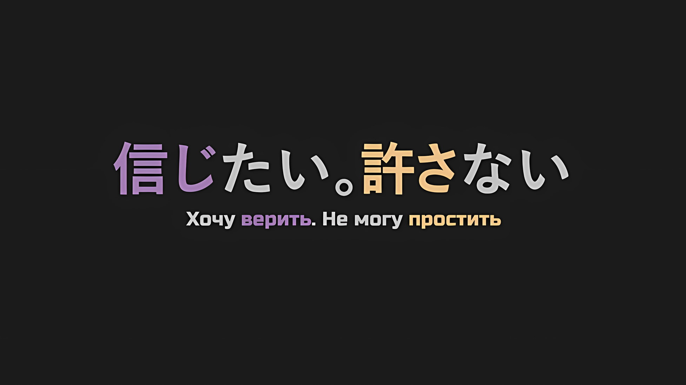

*※※※※※※※※※※※*

???: …Шеф, можно вас на минутку?

Когда его сзади окликнул голос, Винсент Волакия приостановил свой шаг.

Даже не обернувшись, он уже знал, кто является обладателем этого голоса. Стоило ему услышать голос или увидеть человека, как он уже никогда его не забывал. Этот случай не стал исключением; он мгновенно понял, что это белокурый, голубоглазый торговец… Флоп О'Коннелл.

Винсент: К сожалению, выживание Империи сейчас находится в кризисном состоянии. У меня нет времени на легкомысленную болтовню с тобой.

Хотя Винсент и постиг это, он не хотел идти дальше постижения.

Прорицание, полученное им всего минуту назад от «Звездочета» Убирка, не оставляло ему иного выбора, кроме как обсудить с Беллстетзом, Сереной и остальными, как им следует поступить.

Груви был назначен в качестве контрмеры против врага, но поскольку существовала большая вероятность того, что он погиб, разрабатывать план, зависящий от него, было бы поступком, сродни вершине дурости. С этой точки зрения, возлагать надежды на Нацуки Субару, который должен был убедить другого назначенного человека, было идеей не столь предосудительной.

Во-первых, не было никаких шансов, что Винсенту удастся убедить эту девочку.

Он даже не смог бы прийти с ней к взаимопониманию. Поскольку карты в руках Винсента не могли быть использованы против девочки, логично было предоставить Субару разбираться с этой стороной двух огоньков.

Таким образом, единственное, что мог сделать Винсент, — это продолжать тщательно изучать детали в поисках реалистичного плана…,

Флоп: Ой-ой, вы не можете знать, легкомысленная это болтовня или нет, пока не поговорите и не узнаете! Каким бы умным Шеф ни был, я сомневаюсь, что вы можете определить, какие у меня есть семена разговора, до того, как их польете!

Винсент: Ты…

С этими словами Флоп схватил Винсента за плечо, когда тот попытался возобновить свою поступь, не давая ему двигаться дальше. Это нельзя было назвать иначе как безрассудным поступком, вершиной неосмотрительности.

При других обстоятельствах это был бы варварский поступок, за который Флопа обезглавили бы на месте.

Винсент: Немедленно отпусти меня, в противном случае прощайся с жизнью.

Флоп: Конечно, я бы тоже хотел начать разговор с вами прямо сейчас. Однако я хочу, чтобы у нас было достаточно времени для нормального обсуждения этого вопроса. Мы не можем торопить события.

Винсент: Я приказал тебе не языком молоть, а отпустить меня…

???: Ну, ну, не надо так говорить, Авель-чин. Лучше поговори с братухой.

Винсент: …Кх!?

В тот момент, когда он обернулся назад и хмуро посмотрел на Флопа, который все еще держал руку на плече Винсента, впереди раздался голос; одновременно с этим было совершено еще одно безрассудное действие — две руки схватили его за бока и подняли вверх.

Затаив дыхание, и теперь весело улыбаясь, Медиум О'Коннелл сделала это… Родные брат и сестра, Флоп и Медиум, одарили Винсента улыбками спереди и сзади.

Медиум: Авель-чин, ты ведь все это время не обращал на братуху внимания, верно? Братуха настолько изранен и измучен, что ему все время требуется передышка, так что не будь букой и просто выслушай то, что он скажет~.

Винсент: Не говори ерунды. Начнем с того, что как долго вы еще будете обращаться ко мне с таким фамильярным отношением? Как только изменится ситуация, изменится и позиция каждого. Теперь все уже не так, как было в Племени Судрак и Городе-крепости.

Медиум: Ну, может быть, ты и ведешь себя как Император, но я думаю, что с твоей стороны, Авель-чин, было бы неправильно насмехаться над нами! Братуха!

Флоп: Понял, дорогая сестра!

Неразумная пара брата и сестры не обратила внимания на слова Винсента.

На задорный призыв младшей сестры Флоп, ответив столь же энергично, быстро открыл соседнюю гостевую каюту, затем Медиум занесла Винсента внутрь, после чего дверь была закрыта.

Быстро заключив Императора в запертую комнату, Медиум наконец освободила Винсента.

Винсент: Вы двое, вы хоть осознаете, что это настолько варварский поступок, что не только вы, но и все члены вашей семьи понесут за него наказание?

Флоп: Хахахахаха, к сожалению для вас, Шеф, наша семья состоит только из двух человек, — брата и сестры. Так что ваше заявление не представляет особой угрозы.

Медиум: Ах, но, братух, а как же все из детского дома? Даже если мы и не связаны кровным родством, все, кто сбежал, — наша семья!

Флоп: Хахахахаха, раз уж ты об этом заговорила! Шеф, пожалуйста, найдите в себе силы нас простить!

Винсент: …Немедленно меня освободите и будьте паиньками.

Независимо от ситуации, поведение членов семьи О'Коннелл казалось неизменным.

Медиум была уменьшена и увеличена в размерах, а Флоп, очевидно, был ранен, но, видя их обоих в таком состоянии, он начал что-то подозревать.

Если тело человека уменьшалось и увеличивалось в размерах, это, как правило, было тяжелым бременем для его разума, но Медиум была слишком мало осведомлена о том, что ее тело уменьшилось, а затем снова выросло.

Он слышал, что Флоп получил тяжелую рану, которая поставила его на грань смерти, однако он тоже был полон жизни. …Нет, в области его шеи был заметен какой-то оттенок, похоже, он скрывал цвет своей кожи с помощью макияжа.

Флоп: В конце концов, для торговцев очень важно хорошо себя подать.

Винсент: …

Флоп: Однако, хотя это всегда было непреложным правилом торговли — обмениваться на то, что тебе нужно — я не могу удовлетворить текущие требования Шефа. Я больше не хочу откладывать это на потом.

Винсент: О чем ты говоришь…

Флоп: Мне было доверено послание. …Послание от того, кто исполнял обязанности Императора вместо вас.

Ожидавший, что он начнет нести всякую чушь, Винсент слегка расширил глаза.

Заключив Императора в пустую каюту, О'Коннелл пытались сообщить о чем-то Винсенту. …В этом мире был только один человек, занимавший подобный пост.

Вот почему…,

Флоп: Вы должны услышать его слова, Шеф. …Нет, Ваше Превосходительство Император, Винсент Волакия.

Поэтому, когда Флоп впервые продемонстрировал серьезное выражение лица, Винсент не стал его перебивать.

*△▼△▼△▼△*

…Архиепископ Греха «Чревоугодия», Луи Арнеб.

Когда он произнес эти слова вслух, Субару почувствовал, как в его сердце раздался скрежет. Хотя она всегда была на расстоянии вытянутой руки, он не решался снять крышку этого ящика с табу. Это был ящик Пандоры, который можно было открыть в любой момент, стоит только захотеть.

Субару: …

Решив, что этот разговор не подходит для коридора, они переместились в просторную гостевую каюту.

То, что Авель разрешил им пользоваться этой каютой в случае необходимости, было редким проявлением заботы о чувствах других людей. …Хотя, если учесть, что решение этого вопроса было крайне важным для Империи, то, наверное, это было бы вполне естественно.

В гостевой каюте собрались Эмилия, Беатрис, Отто, Гарфиэль и Розвааль, а также…,

Анастасия: Архиепископ Греха «Чревоугодия»… Действительно, эта связь, кажется, всплывает без разбора.

Изящно коснувшись своей щеки, Анастасия тихо прошептала это, а Юлиус, который был рядом с ней, хранил торжественное молчание. Участие этих двоих было крайне необходимо.

И не только потому, что они преодолели огромное расстояние, чтобы пересечь границу и помочь Субару и его друзьям, но и потому, что они тоже пострадали от ущерба, причиненного «Чревоугодием».

Субару: Луи, которая является главной фигурой в этом деле, сейчас находится с Рем и некоторыми другими. Думаю, все, кроме Анастасии-сан и Юлиуса, уже должны быть знакомы с Луи, однако…

Беатрис: Разумеется, в самом деле… Честно говоря, поначалу это было неприятным сюрпризом, я полагаю.

Субару: Я тоже так думал.

То, что Беатрис назвала это «сюрпризом», скорее всего, было щедрым преуменьшением.

На самом деле, когда Субару впервые осознал, что его переместили вместе с Луи, его единственным намерением было защитить Рем, что заставило его принять довольно агрессивную позицию. Поначалу Рем относилась к нему настороженно, воспринимая его как человека, которому нельзя доверять.

Субару не знал, при каких обстоятельствах Эмилия и остальные познакомились с Луи, но нетрудно было предположить, что их первое знакомство было сопряжено с напряжением.

В связи с этим он хотел выразить благодарность за то, что никто не прибег к крайним мерам.

Субару: Вы все молодцы, что сдержались. Я уверен, что Отто и Гарфиэль были готовы в любой момент разразиться криком.

Отто: Действительно, мы с Гарфиэлем считали, что ее необходимо либо устранить, либо заключить. То, что она не подверглась ни тому, ни другому, объясняется тем, что Эмилия-сама всех убедила.

Субару: Эмилия-тан всех убедила…

Как и следовало ожидать, Отто был в первых рядах радикальной фракции, но его взгляды, очевидно, были смягчены Эмилией, которая принадлежала к умеренной фракции.

Когда Субару и остальные обратили на нее свои взгляды, она коротко кивнула, сказав: «Да».

Эмилия: Медиум-чан всеми силами защищала этого ребенка… Луи. Учитывая, как сильно окружающие дорожили ею, мне было страшновато пытаться решать все и вся на месте.

Субару: Понятно, Медиум-сан поступила именно так…

Услышав, что Медиум защитила Луи, Субару почувствовал слабое облегчение.

Изначально Луи очень привязалась к веселой и заботливой Медиум. Тем не менее, последний раз Субару наблюдал их отношения в Городе Демонов Хаосфлейм, когда Медиум боялась Луи после того, как выяснилось, что она Архиепископ Греха.

Если после этого Медиум все еще защищала Луи, значит, в ее чувствах произошел какой-то сдвиг, о котором Субару ничего не знал. Это его обрадовало.

Эмилия: Я тоже с этим сталкивалась. Люди говорили, что я ооочень страшная, что я всем кажусь Ведьмой, и что никто вокруг не хочет со мной связываться. Так что…

Отто: В случае Эмилии-сама это связано с иррациональным предубеждением против полуэльфов. Однако с этой девочкой есть разница. Четкое различие, обусловленное не чем иным, как ее собственными действиями.

Эмилия: Отто-кун…

Когда Эмилия объяснила, почему она поддерживает Луи, помимо Медиум, Отто резко высказал свое суровое мнение. Он без колебаний разъяснил свою позицию союзника Эмилии и одновременно противника Луи.

Действительно, их совместный путь до сих пор был не более чем отсрочкой до окончательной развязки.

Розвааль: Можно мне сказать пару слов?

В напряженной атмосфере, созданной заявлением Отто, Розвааль небрежно поднял руку.

Когда взгляд Субару побудил его заговорить, Розвааль закрыл голубой глаз,

Розвааль: Рам, Анастасия-сама и я присоединились пооозже~. Мы действительно не знаем, как ведет себя эта девочка, Луи… но нет ли в ней чего-нибудь подозрительного? Разумеется, Гарфиэль держал востро уши, глаза и нос, не так ли?

Гарфиэль: Я не сиял так повсюду. Но я должен согласиться с Оттобро. Вот почему с момента нашей встречи и до самой битвы я внимательно следил за ней, но…

Розвааль: Значит, все оказалось напрасным. Тогдааа~, как ты можешь окончательно утверждать, что эта девочка — опасный Архиепископ Греха?

Отто: Из-за Беатрис и меня. В Пристелле мы столкнулись с девочкой, выдававшей себя за Луи Арнеб, Архиепископа «Чревоугодия». Мне тогда проткнули ногу, и я этого не забуду.

Розвааль, представляющий тех, кто имел мало контактов с Луи, сделал заявление, на которое Гарфиэль и Отто высказали свои мнения.

Поглаживая свою ногу, Отто вспоминал о травме, из-за которой он на некоторое время был выведен из строя.

Стало понятно, почему Отто очень настороженно относился к Луи.

Юлиус: Прошу прощения за то, что следую за Маркграфом, но могу ли я тоже высказаться?

Как только Розвааль задал свой вопрос, Юлиус быстро присоединился к разговору.

Во время разговора о «Чревоугодии» Юлиус, с самого начала напустивший на себя сложное выражение лица, краем глаза взглянул на еще более мрачного Субару и сказал,

Юлиус: Сначала я бы хотел уточнить. Верно ли, что девочка по имени Луи, которая сейчас едет в этой драконьей повозке, та же самая личность, что и Архиепископ Греха «Чревоугодия»?

Эмилия: …? Что ты имеешь в виду?

Юлиус: Эмилия-сама и леди Рам должны быть в курсе. Чтобы копировать силы тех, кого оно пожирает, «Чревоугодие» меняло свой облик, чтобы соответствовать жертве. Другими словами…

Анастасия: То есть ты допускаешь возможность, что Луи, о которой мы говорим, и Архиепископ Греха «Чревоугодия» — это не одно и то же лицо, а одно, поглощенное другим?

На лицах Эмилии и остальных было написано удивление по поводу предположения Юлиуса.

Действительно, учитывая природу «Чревоугодия», это была и не такая уж невероятная теория. Если «Чревоугодие» могло имитировать форму того, кого оно поглощало, то логично, что оригинал, который был поглощен, все еще где-то существует.

Если это так, то существование Луи можно было бы отделить от существования «Чревоугодия».

Однако…,

Субару: …Нет, это маловероятно. Луи воспроизводит способности тех, кого она поглотила. Должно быть, это связано с Полномочием «Чревоугодия».

Юлиус: Ясно. Приношу свои извинения за столь ошибочные предположения.

Юлиус закрыл глаза и извинился, а Субару покачал головой.

Юлиус был не виноват. Если бы его гипотеза была верна, Субару не был бы так обеспокоен, как сейчас. Но они не могли прибегнуть к импровизированным решениям, созданным путем обхода проблемы на цыпочках.

Им нужен был не просто ответ, а ответ, основанный на общем понимании истины.

Луи была перенесена вместе с Субару в Империю Волакия; и все же, несмотря на то, что Субару так жестоко с ней обращался, она то и дело пыталась ему помочь, получала ранения и даже подвергала свою жизнь опасности.

Это была она, Луи Арнеб, Архиепископ Греха «Чревоугодия», которая была тем же самым человеком, что и Луи, которую все они знали. Чтобы заставить всех признать, что она необходима для предстоящей битвы…

Субару: …Прежде всего, позвольте мне объяснить, что произошло между мной и Луи в Империи после того, как я был отправлен сюда с Рем, и до того, как кто-либо из вас столкнулся с Луи.

Все: …

Все молча устремили на него свои взгляды.

Под пристальными взглядами своих верных товарищей Субару безошибочно ощутил чувство удушья. Как будто сейчас начнется оценка экзаменов или проверка ответов.

Это была проверка того, действительно ли Луи может быть принята товарищами такой, какая она есть.

Эмилия: Субару, не нужно торопиться.

Эмилия мягко успокаивала Субару, который готовился к тому, что ему предстоит. Беатрис, стоявшая рядом с ним, нежно сжала его руку, кивнув в знак одобрения.

Успокоенный их вниманием, Субару сделал глубокий вдох и начал говорить.

Субару: Самое первое, что мы заметили, — это то, что мы находимся рядом с большим лесом далеко на востоке…

*△▼△▼△▼△*

Он намеревался говорить прямо, подбирая слова так, чтобы как можно более кратко передать факты.

И все же то, о чем ему предстояло рассказать, хлынуло, как бурлящий родник, заставив остро осознать, что, несмотря на краткость времени, дни, о которых ему предстояло поведать, были наполнены значимыми моментами.

Начнем с того, что за короткий период времени произошло огромное количество неприятностей.

Все они состояли из несчастных случаев, угрожавших жизни Субару, Рем и их спутников, в которых, естественно, неизбежно была вовлечена Луи.

Естественно. …Да, это действительно было естественно.

Ведь Луи все это время была рядом с Субару и остальными, терпя от него враждебность и получая доброту от Рем, и при этом она не была обескуражена грубым обращением Субару.

Так что…,

Субару: …Луи и я, сотрудничая с Йорной-сан, сумели выиграть пари у Ольбарта-сана. Правда, пришлось немного схитрить, так как мы изменили правила, превратив прятки в пятнашки.

Все: …

Субару: После этого в Хаосфлейме произошло нечто ужасное, как вы, возможно, уже слышали. Люди, живущие там, чудом спаслись, и объединились с Авелем и его повстанцами. Там я потерял сознание и отделился от них… Вы, наверное, знаете больше о том, что случилось с Луи после этого, верно?

Эмилия: …Да. Мы встретили Авеля и остальных, когда они вернулись в разрушенный Гуарал.

Эмилия кивнула в подтверждение слов Субару, и он закончил свое объяснение, тяжело вздохнув.

Несмотря на то, что Субару собирался не отнимать много времени, в итоге рассказ затянулся почти на час. Он был благодарен, что за это время его спутники в основном не перебивали его и внимательно слушали.

Субару неизбежно приходилось рассказывать историю со своей точки зрения, но он старался быть как можно более отстраненным в изложении событий.

Исходя из этого…,

Субару: Как я уже и говорил, Луи не вела себя подозрительно, пока была со мной. Думаю, вы можете услышать то же самое и от Рем.

Отто: Мы в этом нисколько не сомневаемся. Если бы мы действительно сочли ее подозрительной, Рам-сан ни за что не позволила бы ей находиться рядом с Рем-сан.

Когда речь шла о ее семье, и особенно о Рем, не было нужды упоминать о том, насколько пристально Рам за ней следила.

На самом деле, основной причиной того, что она одолела «Чревоугодие» Лея Батенкайтоса в Сторожевой Башне Плеяд, было ее глубокое неприятие любого вмешательства в отношения между ней и Рем.

Рам, способная пойти на такое ради сестры, которую она не помнит.

Если бы она почувствовала хоть малейший намек на опасность со стороны Луи, для нее было бы немыслимо оставить ее рядом с только-только очнувшейся Рем.

Анастасия: …Мы примерно представляем, насколько тяжело тебе было, Нацуки-кун.

Анастасия, до сих пор молча слушавшая, помассировала пальцем бровь, признавая жестокость путешествия Субару.

Даже для такой мудрой женщины, как она, последовательность событий представляла собой объем информации, на переваривание которой требовалось время и силы. Кое-как справившись со всем этим, Анастасия убрала палец со лба,

Анастасия: Мне любопытно, что случилось с тобой, Нацуки-кун, после того, как ты потерял сознание в Городе Демонов, но поскольку это не главная тема, давай оставим ее в стороне.

Субару: Да, в данный момент важна Луи. Как я уже сказал, Луи до сих пор не показала нам свою опасную сторону. Да и пророчество Убирка, «Звездочета»… это тоже фактор. Так что в предстоящей битве, если Луи будет сотрудничать с нами…

Анастасия: …Вопрос по поводу твоей истории, где точка компромисса, которую ты собираешься принять?

Вот так тихое замечание остановило ход мыслей Субару.

Пальцем, до этого массировавшим ее бровь, Анастасия нежно провела по своим губам, высказав свои мысли. Ее интеллектуально живые глаза цвета морской волны завладели сердцем Субару, когда она продолжила,

Анастасия: Я не против твоей идеи использовать все, что есть в нашем распоряжении, Нацуки-кун. Даже Мейли-сан, которая помогла нам пересечь Песчаные Дюны Аугрии, изначально была врагом. Если уж мы делаем такие различия, то это касается и этой девочки.

Субару: Это ведь одно и то же, верно? Мейли и Луи должны быть в одинаковом положении.

Анастасия: Нет, это не так. …И я уверена, что все, кроме тебя, Нацуки-кун, так думают.

Субару: …Хк.

Столкнувшись с таким спокойным утверждением, Субару удивленно оглядел остальных.

Слова Анастасии эхом отдавались в голове Субару, и он внимательно изучал лица всех присутствующих, надеясь, что хоть кто-нибудь из них возразит.

Однако ни один из них не оправдал его ожиданий.

Субару: Все… Кх.

Отто: Поскольку никто не хочет говорить об этом, скажу я.

Среди группы людей с серьезным выражением лица Отто поднял руку, не меняя своего поведения.

Однако его неизменное поведение не свидетельствовало об отсутствии эмоциональной реакции, а было лишь отражением его спокойствия, сохранявшегося с самого начала встречи.

При этом ни его взгляд, ни голос не выражали безоговорочной поддержки Субару.

Отто: Я согласен с Анастасией-сама. Ситуация с ней и с Мейли-чан разная. Они не в одинаковом положении.

Субару: Отто!

Отто: Я возьму на себя смелость и скажу то, что, судя по всему, не скажет никто другой. …Это потому, что она — Архиепископ Греха.

Отто спокойным тоном ответил Субару, чей голос непроизвольно повысился.

Предвосхищая его слова, ответ Отто как нельзя лучше подходил для объяснения того, почему никто из присутствующих не принял сторону Субару.

Беатрис: Субару, Бетти хочет поддержать Субару, в самом деле. Если Субару говорит, что эта девочка… Луи, не имеет злых намерений, Бетти тоже может в это поверить, я полагаю. Но…

Розвааль: Дело в том, что среди пострадавших от «Чревоугодия» есть и мы. Учитывая, что ущерб не так легко определить, интересно, каков масштаб потенциальных жееертв~?

Юлиус: Хоть это и невозможно подтвердить… Я не могу представить себе, что чувствуют те, кто потерял себя, был забыт другими и не смог вернуться, не имея никого, к кому можно было бы обратиться.

Вслед за обеспокоенной Беатрис, Розвааль и Юлиус высказали свои искренние мнения, как человек, сильно обеспокоенный судьбой жертвы, и как реальная жертва Полномочия «Чревоугодия» соответственно.

Все: …

Розвааль и Юлиус были правы: те, кто знал, что пострадал, оказались в сравнительно лучшем положении.

Должно быть, было много жертв, которые не могли ничего сделать, кроме как впасть в настоящее отчаяние, потеряв свои «Имена» и «Воспоминания», и оставшись без места, куда можно вернуться, не имея возможности спастись.

И, таким образом, Архиепископ Греха «Чревоугодия», породивший множество жертв…,

Эмилия: Дело не в том, что все в это не верят.

Субару: Эмилия…

Эмилия: Дело не в том, что… Скорее, я думаю, что они не могут ее простить.

В объяснениях Субару не было недостатка, как и в том, что его чувства до них не дошли.

Слова Эмилии, нахмурившей брови, разбили ему сердце, так как она объяснила, что на самом деле проблема не в этом.

Зная о том, как Луи провела время с Субару, и зная, что произошло после его отсутствия, Эмилия и остальные понимали, что «Нынешняя» Луи не представляет для них угрозы.

Понимая это, вопрос заключался в действиях «Бывшей» Луи.

Анастасия: …То, что ты сделал, никуда не исчезнет.

Субару: …Хк.

Анастасия тихо прошептала эти слова.

Когда-то это было отчаянное предупреждение, которое заставило Нацуки Субару замереть, разбившись вдребезги.

То, что эти слова были брошены в его адрес, существовало только в нем самом. И вот снова, при другом повороте событий, из ее уст они донеслись до ушей Субару.

Анастасия: Сколько бы Нацуки-кун ни пытался убедить нас в том, что этот ребенок безобиден, это ничуть не уменьшает причиненного ею вреда. В действительности жертвы остаются жертвами… Это не поверхностная проблема, от которой можно отмахнуться притворством ради собственной выгоды.

Субару: …Хх.

Анастасия: Во-первых, не кажется ли тебе, что это должно произойти после возвращения всех «Имен» и «Воспоминаний», которые были съедены до сих пор? Даже если ты попытаешься продолжить без них, разве Нацуки-кун не будет этим недоволен?

Резкие слова Анастасии поочередно вонзались в застывшего Субару.

Все их аргументы были вескими, но наибольшую боль причинял последний пункт… что они не смогут даже стоять на самом фундаменте решения судьбы Луи, если не вернут похищенные «Воспоминания» и «Имена».

Это и было решающей предпосылкой к словам Эмилии: «Они не могут ее простить».

Розвааль: Что ж, Его Превосходительство Император знает о пророчестве, которое слышал Субару-кун. Сказать, что мы не позволим этой девочке, Луи, сотрудничать с нами в битве, просто немыслимо, не так лиии~?

Гарфиэль: А? Че ты хочешь этим сказать? Выражайся яснее.

Розвааль: Неприятно, что ты вымещаешь свое раздражение на мне, однако… чем бы ни закончилось наше обсуждение, план по вовлечению девочки не изменится. Единственное, что остается, так это то, как с ней будут обращаться после этого.

Субару: Обращаться…?

В душе Розвааля нарастало нетерпение, ведь он продолжал вести разговор окольными тропами даже после того, как ему было сказано говорить яснее. В ответ на серьезный взгляд Субару, Розвааль пожал плечами и ответил.

Этим было…,

Розвааль: Вопрос в том, что мы можем сказать ей, чтобы она стала сотрууудничать~. Например, мы можем пообещать ей амнистию, как только преодолеем этот кризис, угрожающий Империи. И тогда, когда все будет сделано, соответствующее наказание за ее преступления будет торжественно приведено в исполнение. Это лучший способ решить проблему без каких-либо проблем в будущем.

Гарфиэль: …Кх, хватит дурью маяться!

В ответ на объяснения Розвааля о его коварном плане, Гарфиэль сверкнул клыками и огрызнулся. Он свирепо уставился на Розвааля,

Гарфиэль: Даже если другой тип — злодей, мы не должны опускаться до того же уровня! Подкидывать несуществующую приманку только для того, чтобы она помогла, я ни за что этого не одобрю!

Розвааль: Ох, неужели? Знаешь, мне кажется, Отто-кун думал о том же…

Гарфиэль: Не приплетай себя к Оттобро!

Отто: …Маркграф говорит от имени большинства. Архиепископы Греха не должны быть амнистированы. Или,

Тут Отто на мгновение приостановился и пристально посмотрел на Субару.

Когда Субару судорожно сглотнул слюну под его пристальным взглядом, он безжалостно продолжил.

Отто: Нацуки-сан пытается создать прецедент, когда Архиепископы Греха будут прощены?

Субару: …Кх, я не намерен делать ничего подобного. В этом мире есть злодеи, которых нельзя прощать. Архиепископы Греха из Культа Ведьмы определенно из их числа.

Петельгейзе, Регулус, братья Лой и Лей, Сириус, Капелла; все Архиепископы Греха, с которыми Субару сталкивался до сих пор, неизменно были далеко за пределами искупления.

Это были существа, готовые без колебаний принести в жертву других ради удовлетворения собственных желаний.

Однако…,

Отто: …Ты хочешь сказать, что Луи Арнеб не такая?

Субару: Это, нуу…

Вопрос Отто попытался вскрыть глубины сердца Субару.

Архиепископы Греха не должны быть прощены. Не только Отто, но и все остальные провели эту линию на песке, и Субару это прекрасно понимал.

Однако настойчивое стремление выделить Луи в отдельную категорию, как сказал Отто, было действительно странным.

Субару: …

Под пристальными взглядами всех присутствующих Субару вновь задался вопросом.

Что Субару хотел сделать с Луи? В «Зале Воспоминаний» они питали друг к другу сильную ненависть, и Субару решил не спасать ее, когда она мучилась от последствий «Посмертного Возвращения». Он не считал этот выбор ошибкой. Даже если бы он снова оказался в подобной ситуации, то, скорее всего, принял бы то же самое решение.

Однако в то же время он хорошо знал Луи, разделившую с ним трудности в Империи Волакия.

Тот факт, что он был свидетелем того, как она рисковала своей жизнью ради его спасения и неоднократно умирала за это, несомненно, был выгравирован в его душе.

В какой-то момент бдительность Субару растаяла под влиянием искренности Луи…,

Эмилия: Как?

Субару: …

Внезапно Субару задали тихий вопрос, как раз в тот момент, когда он глубоко задумался.

Приоткрыв веки, он увидел, что на него смотрят аметистовые глаза Эмилии. Она прищурила глаза с длинными ресницами и повторила тот же вопрос еще раз.

Этим было…,

Эмилия: Как Субару пришел к такому выводу?

Субару: Как, спрашиваешь…

Эмилия: Ты ведь действительно терпеть не мог Архиепископа Греха «Чревоугодия», так ведь, Субару? Ты думал, что не сможешь ее простить. Так почему же сейчас?

Субару: Потому что… разве я тебе уже не говорил? Она… Луи, в этой Империи с нами…

Они пережили много трудностей, и Луи храбро пыталась защитить Субару и Рем.

События в Империи наложили на Субару отпечаток не меньший, а то и больший, чем непростительный враг, которым она считалась в «Зале Воспоминаний». Вот почему.

Вот почему отношение Нацуки Субару к Луи изменилось.

Юлиус: Субару, позволь мне еще раз донести до тебя суровую правду.

Юлиус негромко обратился к Субару, который неуверенно отвечал на вопрос Эмилии.

То, что он предварил это «суровой правдой», заставило Субару насторожиться. Когда он приготовился к этому, Юлиус провел пальцем по шраму под своим левым глазом и обратился к нему.

Юлиус: Человечество в этом мире не простит Архиепископа Греха «Чревоугодия», девочку, известную как Луи Арнеб. Будь то Королевство или Империя, можно сказать, что это консенсус всего мира.

Субару: …

Юлиус: Даже если бы она сбежала в любой уголок мира, нет места, где бы ее помиловали. Преступные деяния влекут за собой наказание. А Архиепископ Греха — это преступник, чьи грехи можно искупить только жизнью.

В этой преамбуле суровой правды не было ни капли фальши.

Юлиус решительно произнес ее четким, сильным тоном, не оставляя места для недоразумений.

В этом мире не было места, где Луи Арнеб могла бы жить и быть прощенной.

На эти тяжелые слова Субару не смог ничего ответить.

Однако…,

Юлиус: Я тоже не желаю Архиепископам Греха ничего, кроме смерти. Ничего, кроме «Cмерти», для существ, которых мы считаем врагами мира. Это то, что я могу сказать от всей души.

Субару: …Что?

Отто: ЮЛИУС ЮКЛИУС!!!

Тот, кто резко повысил голос, глядя на Юлиуса, был Отто.

Субару, не понимая смысла этих слов, остался в стороне с широко раскрытыми глазами, так как Отто и Юлиус пронзительно смотрели друг на друга.

Взгляд Юлиуса был полон боли, а взгляд Отто — горечи, их глаза ранили друг друга.

Отто: Для тебя, постороннего, говорить такое — возмутительный эгоизм…!

Юлиус: Мне очень жаль, но я хотел бы исправить ваше представление об этом вопросе. Я тоже являюсь одной из сторон. Я имею право высказать свое мнение, так что позвольте мне воспользоваться этим правом.

Отто: …Кх!

Стиснув зубы, Отто устремил взгляд на Юлиуса.

Несмотря на то, что он знал, что не сравнится с ним по боевой мощи, интенсивность его взгляда не ослабевала. Юлиус закрыл один глаз от такой силы воли Отто и испустил небольшой вздох.

Субару: Ничего, кроме «Смерти», для Архиепископов Греха…

Находясь рядом с ними, Субару пробормотал себе это под нос, почувствовав, будто часть его мозга онемела.

Что пытался сказать Юлиус, и почему проницательный Отто набросился на него. Субару не заметил того, что было скрыто за поверхностным уровнем слов.

Ничего, кроме «Смерти», для Архиепископов Греха не желали. Мир не простит Луи Арнеб.

Архиепископов Греха, Луи Арнеб, мир не…

Субару: …Ах.

Беатрис: Субару, сейчас будет говорить Бетти.

В тот момент, когда он почувствовал, как легкий ветерок прошелся по его лабиринту мыслей, Беатрис заговорила.

Она посмотрела на Субару своими круглыми глазами с характерным рисунком,

Беатрис: Бетти столкнулась с Архиепископом Греха Луи еще в Пристелле, я полагаю. После этого, когда мы случайно встретились в Империи, Бетти именно так и подумала о состоянии этой девочки, в самом деле. …Словно она — совсем другой человек, я полагаю.

Субару: …

Беатрис: Эта девочка, я полагаю, отличается от Архиепископа Греха, которого знает Бетти. А как это было с точки зрения Субару, в самом деле? С точки зрения Субару, который лично общался с Архиепископом Греха, я полагаю.

Добрые, но неотвратимые слова Беатрис заставили его задуматься.

Он понял, что она имела в виду. Для Субару это было то, что он отказывался и не желал признавать.

Что нынешняя «Луи» и Луи Арнеб, которую он встретил в «Зале Воспоминаний», казались разными людьми.

Однако, опровергнув подозрения Юлиуса, «Луи» воспользовалась своим Полномочием. Как и «Чревоугодие», она могла свободно использовать особые способности съеденных ею жертв.

«Луи» по-прежнему обладала Полномочием «Чревоугодия», но ее разум был рожден заново.

Это было похоже на…,

Субару: Прямо как я, когда потерял воспоминания.

Если это действительно было так, то страдала ли «Луи» все это время?

Подобно тому, как Субару гнался за фантомом «Нацуки Субару», переживая и страдая от того, что не может доверять окружающим, «Луи» тоже искала помощи?

Даже если это так, «Луи» все равно помогала Субару и Рем и дожила до сегодняшнего дня.

Тогда…,

Эмилия: …Знаешь, я думала об этом все это время. Как только ты совершил что-то плохое, уже слишком поздно это исправлять?

Субару: Эмилия…

Эмилия: Ты извиняешься, искупаешь вину, но даже тогда, если тебе говорят, что этого недостаточно, то иногда тебе надоедают извинения и искупления, верно? Вот я и думала, как бы это предотвратить… но найти такое потрясающее решение нелегко. Однако…

Субару: Однако?

Эмилия: Есть только один, один-единственный метод, который может сработать. Этому методу научил меня Субару.

Эмилия прижала руку к груди и тщательно подбирала слова, которые могли бы полностью передать ее эмоции.

Услышав ее слова, Субару заглянул в свое сердце. Но среди того, чему Субару учил Эмилию, не нашлось ничего, что можно было бы применить к этому моменту.

На Субару, который не знал, чего ожидать, Эмилия посмотрела нежным взглядом,

Эмилия: Нужно думать «Я хочу, чтобы этот человек был счастлив» больше, чем «Я не прощу этого человека».

Субару: …

Эмилия: Чтобы множество людей вокруг думали: «Я хочу, чтобы этот человек был счастлив». Я думаю, что для того, чтобы мы могли простить этого ребенка, необходимо, чтобы она заставила нас думать именно так.

Слова Эмилии медленно и нежно проникли в сердце Субару.

Метод, позволяющий прощать плохих людей. Метод, позволяющий прощать злые поступки. Средство спасения, которое может лежать за пределами извинений и искупления, — таков был искренне обдуманный ответ Эмилии.

Узнала ли она об этом из того, что сделал Субару, или же это было то, чему он когда-то ее научил, он не знал.

Но ему показалось, что эти слова прочно запали в сердце Субару.

Почему Субару так переживал за Архиепископа Греха, за «Луи»?

Да потому, что «Луи» сделала для Субару больше, чем Луи.

Поэтому…,

Анастасия: Еще раз, позволь мне спросить тебя о том же.

Услышав слова Эмилии и слабый вздох Субару, Анастасия заговорила.

Поглаживая Шарфидну, обвившуюся вокруг ее шеи, она посмотрела на Субару и Эмилию, сказав,

Анастасия: …В твоей истории, где точка компромисса, которую ты собираешься принять?

Так она заявила.

*△▼△▼△▼△*

Луи: Аау?

Зажав между ладонями лицо Луи, которая с любопытством смотрела на нее, Рем издала долгий, протяжный вздох.

Такая реакция Рем вызвала на лице Луи все большее недоумение, поскольку ее щеки оставались прижатыми.

Судя по поведению девочки, Рем подумала, что она, должно быть, заставила ее волноваться.

Даже несмотря на то, что она думала…,

Рем: Хаа…

???: Довольно вздыхать, Рем. Что-то случилось?

Рем: Сестра…

В тот момент, когда она вздохнула, рядом с ней раздался нежный голос.

Это была Рам, которая, приготовив чай, вернулась в отведенную ей гостевую каюту. Позади нее шла девочка с рогами… Танза, как вспомнила Рем.

Заметив взгляд Рем, Рам кивнула и сказала: «Ах»,

Рам: Похоже, ей нечем было заняться в свободное время, поэтому Рам взяла ее с собой.

Танза: Не то чтобы мне нечем заняться…

Рам: Неужели? На твоем лице было выражение недовольства, когда тебя оставили в стороне от остальных крикунов. Даже у Империи есть такие идеи, как желание сражаться, чтобы защитить женщин и детей. Рам думала, что они еще глупее.

Рем: С-сестра, это небольшое преувеличение…

Щеки Рем слегка порозовели от такого прямолинейного заявления сестры.

Потребовалось немало времени, чтобы прийти к полному взаимопониманию между ней и сестрой, но, несмотря на это, Рем чувствовала, как ее сердце трепещет при каждом движении Рам, поскольку ее обращение было искренним.

Тем не менее, Танза выглядела недовольной тем, как выразилась Рам.

Танза: Возможно, это правда, что многие люди в эскадроне, особенно Сесилус-сама, думают о вещах просто, но среди них есть и те, кто так же остроумен, как Губернатор.

Рем: Ясно. Значит, это остроумный Губернатор велел тебе остаться?

Танза: …Нет, это Шварц-сама велел мне отдохнуть.

Луи: У.

В ответ на реплику Рам уголки рта Танзы слегка напряглись. И тут же Луи, щеки которой обхватила Рем, застонала от усилившегося давления рук.

*О нет!* подумала Рем, извиняясь перед Луи со словами «Прости».

Рем: Я сделала это по своей неосторожности. Ты в порядке, Луи-чан?

Луи: Ауу… Уау?

Рем: …Нет, это не имеет к этому никакого отношения.

Луи: Уу.

Луи с сомнением посмотрела на Рем, услышав ее ответ.

Отвернувшись от Луи, она встретилась глазами с Рам, которая как раз наливала чай. Она поставила перед Рем чашку теплого ароматного чая,

Рам: Несмотря на то, что это секретная драконья повозка Империи, она не так хорошо снабжена чайными листьями, как можно было бы ожидать. Вкус не слишком примечательный, но он согреет твое тело.

Рем: С-спасибо. Сейчас я сделаю глоток.

Рам: Ну и? Сделал ли Барусу что-нибудь грубое по отношению к тебе?

Рем: *Пфююю*

Наконец, отпустив щеки Луи, она, едва набрав в рот чай, выплеснула его. Когда Рем быстро поставила чашку, Луи попыталась вытереть ее лицо своим рукавом.

Рем: Я в порядке, в порядке, Луи-чан… Что случилось, сестра?

Рам: Ничего особенного. Поведение Барусу обычно грубое и бесцеремонное. Даже если это догадки, велика вероятность, что именно из-за этого лицо Рем выглядит таким мрачным.

Рем: Это тоже небольшое преувеличение, независимо от того, как ты это говоришь…

Иными словами, это была всего лишь догадка, и Рем вздохнула с облегчением, когда Луи вытерла ей лицо. Но и этой реакции было достаточно, чтобы проницательная Рам догадалась о причине ее вздоха.

Рам села напротив Рем и уставилась на нее, скрестив ноги и наклонив свою чашку.

Под давлением этого молчания Рем вскоре сдалась и призналась.

Рем: Хм, насчет Эмилии-сан…

Рам: Эмилии-сама? Да, Эмилия-сама тоже в чем-то невежественна и невнимательна, не так ли? Так вот почему лицо Рем было таким мрачным?

Рем: Н-нет, дело не в этом! Просто… Я хотела спросить, какие отношения между этим человеком, которого зовут Нацуки Субару, и Эмилией-сан…

Понизив тон голоса, Рем удалось задать свой вопрос, сохраняя спокойствие.

Однако в этот момент Рем и не подозревала, что уже сам выбор этой темы заставил сузиться светло-малиновые глаза Рам.

Тем не менее, проницательная старшая сестра тихо пробормотала: «Понятно».

Рам: Что ж, Рам должна разорвать Барусу на куски. Давай позже сделаем это вместе.

Рем: Сестра!?

Рам: Хехе, это будет сестринское сотрудничество. Полагаю, порой Барусу бывает полезен.

Ее слабо улыбающаяся сестра обладала чарующей красотой, но ее высказывания были крайне тревожными. И, услышав замечания Рам, Танза в буквальном смысле слова уперлась рогами.

Она сделала глоток чая, который был заварен для нее, и, хоть она и была удивлена вкусом, издала «Ого»,

Танза: Не слишком ли неосторожное заявление? Барусу… Полагаю, это касается Шварца-сама. Если вы наложите руки на Шварца-сама, я и весь наш эскадрон не проявим милосердия.

Рам: Это очень смелый ответ… Танза, сколько тебе лет?

Танза: …? В этом году мне исполнится двенадцать.

Рам: Вот как. Это все объясняет.

Танза: Несмотря на то, что вы достигли некоторого понимания, я не в состоянии понять.

Рем одобрила точку зрения недовольной Танзы.

Почему Рам достигла понимания, услышав возраст Танзы? Начнем с того, что Рам даже не ответила на вопрос Рем.

*Эм, а какие отношения у этой девушки, Эмилии, с Субару?*

Рем: …Они были ужасно близки.

Если бы ее спросили: «И что?», Рем не смогла бы ответить ничего, кроме «Ха?», но у нее было много мыслей о том, насколько близки эти двое.

Поэтому Рем предпочла решить этот вопрос как можно скорее, чтобы сосредоточиться на своих проблемах.

Проблемы Рем, то есть… В любом случае, это были проблемы Рем.

Рем: Все верно. Это всего лишь пустяковый вопрос, который нужно решить как можно скорее, чтобы я могла заняться более важными проблемами. Ни больше, ни меньше.

???: …Рем, у тебя есть минутка?

Рем: Ха!?

От громкого толчка Рем рефлекторно приподнялась. Это заставило ее неосознанно схватить Луи, которая сидела у нее на коленях.

Рем подняла Луи, которая от удивления издала «Аууу!», и она еще раз извинилась перед ней, глядя в сторону двери гостевой каюты, в том направлении, откуда ее окликнули,

Рем: К-кто это?

Рам: Не просто кто, а Барусу, тот, кого надо разорвать на куски. …Похоже, что их дискуссия закончена.

Рем: Ах…

На слова Рам, изящно отпившей чай, Рем испустила небольшой вздох и обняла Луи. Со словами «Ау?» Луи повернула голову, и Рем закрыла глаза, зарывшись кончиком носа в ее золотистые волосы.

Рем присутствовала при нападении на соединенные драконьи повозки, но после этого она не присоединилась к последующей дискуссии, в которой Авель с серьезным выражением лица принимал Субару.

Разумеется, она была бы бесполезна даже в том случае, если бы ее впутали в важный разговор, а еще ее беспокоил тот небольшой вопрос, который она подняла ранее.

Однако самой главной причиной было…,

Луи: У?

Причина заключалась в том, что она испытывала неприятные опасения по поводу того, кто был в ее объятиях, Луи.

Она и сама не знала почему, но сердце Рем инстинктивно подсказывало, что она должна быть рядом с Луи. Поэтому, когда она вот так закрылась в этой гостевой каюте…,

Танза: …Шварц-сама, входите.

Субару: Ах, спасибо… Подождите, Танза тоже здесь?

Танза: Да, поскольку Шварц-сама со всеми сговорился и заставил меня остаться.

Субару: В том, как ты это сказала, есть что-то такое, что заставляет меня чувствовать себя виноватым…

Пока Рем была в замешательстве, Танза поприветствовала посетителя.

Когда Танза обрушила на него несколько возмущенных жалоб, вошедший озабоченно почесал голову. Несмотря на то, что его рост уменьшился, атмосфера его обеспокоенного профиля практически не изменилась.

Вероятно, это было связано с тем, что даже если бы он стал немного выше, детское выражение на его лице никуда бы не исчезло.

Рем: Несмотря на злые глаза, он странный человек…

Субару: Эй!? Кто-то только что сказал что-то плохое о моих глазах? Я все слышал, вы знаете?

Рам: Это весьма значительный подвиг. Подумать только, жалобы жителей Королевства Лугуника могут быть услышаны по ту сторону границы.

Субару: Не может быть, чтобы все Королевство говорило о моих глазах! Наверняка они ведут восхитительную беседу об ужине, планах на завтра и прочем!

Дав преувеличенный ответ на поддразнивание Рам, Субару с размаху вошел в комнату.

По какой-то причине Рем не могла смотреть на Субару, поэтому она спрятала лицо за Луи, которую обнимала, и не стала встречаться с ним взглядом.

Вместо этого Луи заняла ее место и обратилась к Субару «Уау».

Субару: Эй, Луи, у меня к тебе тоже есть дело. Ты случайно не знаешь, где Рем?

Луи: Аауу.

Субару: Понятно, значит, ты не знаешь. Ну что ж, я разбит. А ведь я хотел сказать ей что-то важное…

Рем: …Если это важно, то, пожалуйста, не шути и переходи к делу.

Субару: Ого, Рем! Так ты была позади Луи? А я и не заметил!

Субару сделал неестественную и преувеличенную реакцию, когда Рем вмешалась в разговор. Но, похоже, его вынужденное поведение одурачило Луи, и она пожала плечами, разочарованная тем, что не смогла скрыть от него Рем.

Опустив Луи на пол и погладив ее по голове, чтобы успокоить, Рем сузила свои глаза.

Рем: …Может быть, ты перебарщиваешь?

Субару: …

Рем: Кажется, я уже говорила об этом. Пожалуйста, перестань перебарщивать и взваливать на себя такое безрассудное бремя. В конце концов, ты не Герой, который может сделать все.

Рем процитировала те же слова, которые говорила ему в прошлом.

Глаза Субару расширились от этих слов, однако он тут же ухмыльнулся и сказал,

Субару: Нет, на удивление, меня объективно считают Суперменом, так что, хоть я и благодарен Рем за ее мнение, я просто приму его как милый голос.

Рем: Пожалуйста, не шути так.

Субару: Я не шучу. …Рем, я должен рассказать тебе кое-что важное о Луи.

Выпрямившись, Субару стер с лица ухмылку и сказал это прямо.

Услышав это, Рем перевела дыхание, а Рам вздохнула,

Рам: Барусу, Рам и Танза должны уйти?

Субару: Нет, все в порядке, если старшая сестра и Танза останутся. Первая может быть представителем Отдела Старших Сестер, а вторая — Представителем Отдела Лоли.

Рам: Ты хочешь сказать, что Рам превосходит Фредерику как старшая сестра. Разумеется.

Танза: Эм, что вы имеете в виду под отделом «лоли»…?

По просьбе присутствующих Рам выпятила грудь, а Танза наклонила голову.

Затем Рем осторожно притянула Луи поближе к себе, а Субару снова обратил на них свой взгляд. Прижав затылок Луи к своей груди, она устремила на него свой взгляд.

А затем…,

Субару: …Давайте разберемся с этим. Эти прекрасные отношения между нами, которые мы не совсем понимаем.
