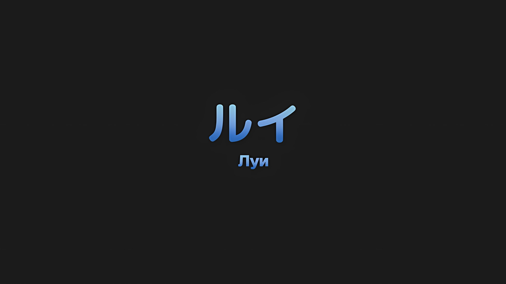
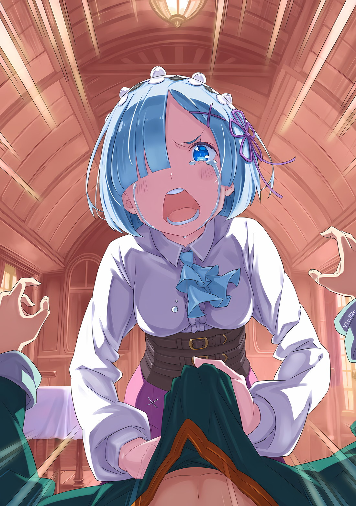
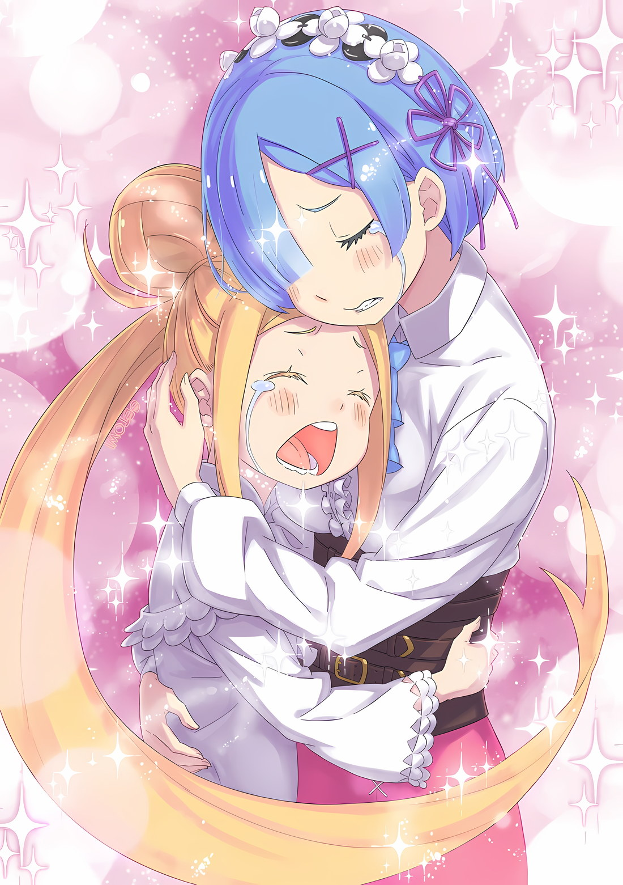

*※※※※※※※※※※※*

Воистину, их отношения были своеобразными, подумал Нацуки Субару.

Возможно, их следовало бы назвать не своеобразными, а зловредным провидением, которое вело Субару и его спутников до сих пор.

Их идеологии, их пути — все это он презирал всеми фибрами своей души; Империя Волакия.

Та, которая вызывала у него невыносимую тоску, заставляя плакать от боли в сердце по непонятным причинам; лишенная своих «Воспоминаний», Рем.

Та, на кого он свалил всю вину, кого он безмерно ненавидел; Архиепископ Греха «Чревоугодия», Луи Арнеб.

Оказавшись в ситуации, которую он не мог не проклинать, сетуя и гневаясь в соответствии с проложенным для него путем, в то время как он неоднократно продолжал терпеть крушение, Субару смог пережить эти дни, умирая снова и снова.

Здесь же находились люди, с которыми он вступил в контакт, которые помогли ему, а он им; Империя Волакия.

Он был вместе с той, чья доброта и глубокая забота заставляли его плакать; лишенная своих «Воспоминаний», Рем.

Та, которая снова и снова рисковала своей жизнью, храбро посвящая себя ему; Архиепископ Греха «Чревоугодия», Луи Арнеб.

Пережив проклятие, которое ему было уготовано, отказавшись следовать проложенному для него пути, пока они продолжали нежно ранить друг друга, Субару смог пережить эти дни, умирая снова и снова.

Что это было — проклятие, горе или ненависть? Или, может быть, без проклятий, без горя, это было прощение?

Пришло время разобраться в этих отношениях, которые до сих пор оставались двусмысленными.

Субару: …

Когда Субару вошел в гостевую каюту, там царила напряженная атмосфера.

В комнате находились Рем и Луи, а также Рам и Танза — всего четверо. Первые двое были непосредственно причастны к делу, а последние двое — свидетели; Субару хотел поговорить с ними.

Эмилия, Беатрис и остальные ждали решения.

Независимо от того, в какой форме будет дан ответ Нацуки Субару, они ждали.

Рем: …Закончился ли важный разговор с Авелем-сан?

До Субару, раздумывавшего над тем, как затронуть эту тему, первой заговорила Рем.

Рем сидела рядом с Луи, держа ее руку в своей, и ее слова, независимо от того, осознавала она это или нет, выглядели как попытка удержать ситуацию под контролем.

В ответ на ее вопрос Субару покачал головой,

Субару: На данный момент разговор приостановлен. Это обсуждение не может продолжаться до тех пор, пока мы не решим наши собственные вопросы… Обсуждение с Авелем также затрагивает Луи.

Луи: Аау?

Рем: А что, Луи-чан тоже в этом участвует?

Субару: Согласно пророчеству «Звездочета», Луи необходима для победы в этой битве.

Рем: …Хк.

Когда Субару, ничего не скрывая, рассказал о предпосылках, на лице Рем появилось выражение горечи. Держа Луи за руку, Рем посмотрела своими бледно-голубыми глазами на Субару и сказала: «То есть»,

Рем: Ты хочешь сказать, что собираешься заставить Луи-чан сражаться? Несмотря на то, что она такая маленькая, совсем еще ребенок, который ничего не понимает, ты предлагаешь такую жестокую вещь…

Субару: Нужно ли ей сражаться — это вопрос на потом. Но сначала позволь мне кое-что прояснить. …Мнение о том, что Луи — просто ребенок, который ничего не понимает, ошибочно.

Рем: Что ты…

Субару: Несмотря на то, что ей сложно общаться с помощью слов, Луи четко понимает, в какой ситуации находится. Она сама выбирает, на чьей стороне быть, а на чьей — нет. Зная это, сейчас она здесь, с нами.

Рем: Это… Кх.

На спокойные слова Субару Рем опустила голову, потеряв дар речи.

Рем поняла, что возражение Субару было правдой. Ведь если бы это было не так, Луи бы здесь уже не было.

С момента попадания в Империю Волакия она оказалась в непонятной ситуации; она вела себя как привязчивый ребенок, накладывая свой отпечаток на первых встречных людей — Субару и Рем… Однако это не могло объяснить множество жестоких испытаний, через которые они прошли вместе.

Если наложение отпечатков было не признаком любви, а проявлением инстинкта защиты, стремящегося найти хранителя, чтобы выжить, то само собой разумеется, что совместное пребывание с Субару и Рем было пагубным для выживания Луи.

Если она просто хотела выжить, то Луи было бы легче, не будь она с Субару и его спутниками.

Рам: В этом вопросе Рам согласна с Барусу. Хотя от Рем мы услышали лишь отдельные фрагменты ситуации, то, что этот ребенок находится здесь, несмотря на то, что его разлучили с Рем и Барусу, является результатом ее собственного выбора.

Рем: Сестра…

Рам: Не пойми меня неправильно, Рем. Рам полностью на стороне Рем и в глубине души она твердо решила разорвать Барусу на куски вместе с тобой, но она не будет искажать правду.

Субару: В этом заявлении была одна часть, которую я не могу проигнорировать, но спасибо.

С чувством, находящимся где-то между благодарностью и горечью, Субару поблагодарил Рам, которая вмешалась в разговор.

По мнению Субару, со стороны Рам это тоже было похоже на попытку сдержать ситуацию. В то же время это свидетельствовало о том, что Рам будет беспристрастна в этом разговоре и не намерена эмоционально вставать на сторону Рем.

Это в точности соответствовало тому, как Рем часто описывала свою оценку поведения Рам.

Субару: Старшая сестра слишком добра… хах?

Независимо от того, были ли услышаны эти слова, прозвучавшие из его уст, Рам фыркнула, не проронив ни слова, а затем скрестила свои стройные ноги и поднесла к губам чашку с чаем.

Рядом с ней Танза, которая, казалось, немного заскучала, посмотрела на Субару своими черными глазами,

Танза: Как и Рам, я также не буду поддерживать Шварца-сама. Я не в состоянии оценить ситуацию, поэтому прошу не заблуждаться, если вы намеревались сделать из меня союзника.

Субару: Я знаю. Танза надежно строга со мной. Я не надеялся, что ты примешь мою сторону.

Танза: …

Субару: А? Похоже, тебя это несколько расстроило? Почему?

Последовав примеру Рам и заявив о своем статусе беспристрастного свидетеля, Танза немного погрустнела.

Выражение лица Танзы редко менялось, но это угрюмое выражение было относительно обычным. Чаще всего оно появлялось в ответ на неразумные слова и действия Сесилуса или когда Хиайн слишком много говорил.

Кроме того, довольно часто оно было направлено на Субару.

Тем не менее, благодаря тому, что Рам и Танза высказали свои позиции, он уже закончил мысленно готовиться.

С этими словами Субару вновь повернулся лицом к Рем и Луи.

И тогда…,

Субару: Луи, мы собираемся обсудить кое-что важное. Это касается тебя, и я не буду скрывать того, что чувствую в глубине души. Ты выслушаешь меня и не будешь никуда убегать?

Луи: …Аау!

Субару: Понял. Ты хорошая девочка. Спасибо.

После секундного колебания Луи оживленно кивнула.

Эта реакция была еще одним доказательством того, что она хорошо понимала, о чем говорят Субару и окружающие ее люди. Рем, избегая зрительного контакта, посмотрела на профиль Луи.

Рем надеялась увидеть нужные ей эмоции; если бы Луи проявила хоть малейший признак дискомфорта, она могла бы использовать это как повод для прекращения разговора.

Но в профиле Луи она так и не смогла найти для этого повода.

Субару: Рем, Луи, я думаю, вы оба поняли. Что с самого начала я всегда настороженно относился к Луи, что я всегда сторонился ее… и что я всегда ее ненавидел.

Рем: …

Субару: Причина чрезмерной подозрительности Рем по отношению ко мне поначалу заключалась именно в этом. Когда я попытался хоть как-то разделить вас двоих, мне даже сломали пальцы.

Рем: В тот раз… Я зашла слишком далеко.

Субару: Все в порядке. Оглядываясь назад, можно сказать, что это просто еще одно хорошее воспоминание между мной и Рем.

Рем: А?

Отвечая на это, Субару сгибал пальцы левой руки, после чего Рем скорчила гримасу, словно сомневаясь в его здравом уме. Не только Рем, но и Рам с Танзой сделали похожие лица, поэтому, несмотря на то, что речь шла о сломанных пальцах, Субару сменил тему, сказав: «В любом случае», прежде чем его сердце могло быть разбито.

Субару: Я очень опасался Луи. И поэтому Рем относилась ко мне с подозрением. Я не знаю, что ты чувствовала, Луи, но ты наверняка ощущала ту напряженную атмосферу, верно?

Луи: Уу?

Субару: Даже после того, как мы в какой-то момент разделились, а затем снова воссоединились вместе со всеми судракийками, даже после того, как мы отступили из Гуарала, а затем уже во время его осады, так было всегда.

Из-за этого пропасть между Субару и Рем становилась все больше и больше, и ее было трудно заполнить.

Что касается причин, по которым Субару испытывал ненависть к Луи, то, несомненно, большое влияние оказало то, что ее существование привело к ухудшению его отношений с Рем.

Его неприязнь к Луи начала меняться только после того, как они прибыли в Город Демонов Хаосфлейм, разлучившись с Рем.

Проводя время с Луи без Рем в качестве посредника, она изо всех сил старалась защитить Субару, и постепенно ему не оставалось ничего другого, кроме как признать это.

Поэтому после того, как они расстались в Городе Демонов, и он воссоединился с Беатрис в столице Империи, он был искренне рад, что Луи тоже там была. В тот момент в нем не осталось ни капли той враждебности, которая была с ним с самого начала.

Субару: Если бы и дальше так было, если бы мы продолжали жить, не задумываясь об этом, то, я думаю, было бы легче. Но это просто невозможно. Это то же самое, что и рана. Одни раны заживают, если их не трогать, в то время как другие станут только серьезнее. Это та рана, которую мы не можем оставить в покое.

Для того чтобы рана зажила, ее нужно было лечить.

А для лечения нельзя было полагаться только на магию или медицину, в некоторых случаях требовались более смелые методы.

Таким образом, это была та рана, при которой у них не было другого выбора, кроме как прибегнуть к подобным средствам.

Поэтому…,

Субару: До сих пор я ни разу не говорил об этом. О причине, по которой я ненавидел тебя, Луи.

Луи: Уау…

Глядя в эти голубые глаза, Субару излил свои чувства.

Словно отвечая на серьезный взгляд и тон Субару, Луи тоже не отводила глаз. Девочка решила принять все, что он скажет.

Однако вместо этого…,

Рем: …Пожалуйста, прекрати.

Прикусив губу, Рем заговорила дрожащим голосом.

С дрожью и мольбой в голосе она продолжала держать Луи за руку. …Нет, это неверно. Это было не так. Это не Луи держали за руку, а Рем.

Именно Луи держала за руку Рем, это было совершенно очевидно.

Рем: Я не… хочу это слышать. Причина, по которой ты возненавидел Луи-чан, меня не волнует. Разве нельзя считать, что ты просто бессердечный?

Слабо покачав головой в знак отказа, Рем отвергла слова Субару.

Не желая давить на руку Луи, она сжала другую свою руку так сильно, что кости заскрипели, Рем пыталась отвергнуть то, что должно было последовать дальше.

Он хотел уважать чувства Рем. Он хотел исполнить все ее желания.

Субару: Извини, я не позволю тебе затыкать уши по этому поводу.

Но он не мог этого сделать.

Он не мог ни исполнить ее желания, ни проявить к ней уважение.

Если она не желала слушать, то единственным выходом для нее было покинуть эту комнату. Субару не имел права останавливать Рем, если она действительно этого хотела.

Впрочем, Рем тоже это понимала.

Затыкать уши от слов Субару было равносильно тому, чтобы отвернуться от своих собственных потерянных «Воспоминаний», и…,

Рем: …

И еще это означало бы предать чувства Рам, которая молча наблюдала за ней.

Рем: Даже так, я не хочу… не хочу… это слышать… хк.

Зажмурив глаза и стиснув зубы, Рем решила никуда не убегать.

Однако ей очень, очень сильно хотелось отвергнуть дальнейшие слова Субару.

Субару, пораженный ее словами, снова устремил свой взгляд на Луи.

Луи: Уау.

Губы Луи шевельнулись, и она произнесла звук, не складывающийся в целостное слово.

Он прекрасно понимал, что она называет его по имени — «Субару».

И поскольку он это понимал.

Субару: Луи, причина, по которой я тебя ненавидел… почему я презирал тебя, это…

Рем: ОСТАНОВИСЬ… хк!!!

Субару: …Потому что именно ты, Архиепископ Греха «Чревоугодия», виновна в краже «Воспоминаний» Рем.

…Поскольку он это понимал, Субару ничего не оставалось, кроме как дать ответ.

*△▼△▼△▼△*

Он сказал это. Наконец-то он произнес слова, которые до сих пор оставались невысказанными.

В тот момент, когда он сказал ей об этом, не было ни глубоких эмоций, связанных с обнажением тайны, ни душераздирающего чувства осуждения отвратительной личности.

Даже сейчас, когда он раскрыл то, что было заперто в его сердце, не было ничего, кроме мучительной тяжести и боли.

А с последующими событиями стало только хуже.

Рем: Уаааааа… Хк!!!

Повысив голос и скорчив гримасу, руки Рем потянулись к нему.

Ее руки схватили Субару за воротник и с огромной силой повалили его на землю; он не мог оказать никакого сопротивления, так как она находилась на его теле.

Возможно, ему бы не удалось сделать это, даже если бы его тело не стало меньше, но теперь, когда он стал меньше, это было особенно ощутимо.

Если бы Рем приложила всю силу к своим рукам, она бы смогла легко закрыть рот Субару.

Но до тех пор, пока не были произнесены эти окончательные слова, Рем не делала ничего подобного.

Даже сейчас, в этот момент, когда она сидела на Субару.

Рем: Почему… Просто почему… Хк.

Ее голос был напряжен, а лицо искажено яростью, она хмуро смотрела в лицо Субару на таком расстоянии, что он мог чувствовать ее дыхание, но все же она не использовала всю силу своих рук.

Эмоции рвались наружу, но, несмотря на это, Рем оставалась рассудительной, прежде чем пересечь последнюю черту.

Субару: …

Почувствовав на своем лице горячее дыхание Рем, Субару протянул руку, чтобы остановить окружающих.

В тот момент, когда Субару повалили на землю, Танза сразу же попыталась двинуться, чтобы его защитить. Краем глаза он заметил, что Рам держала Танзу за руку.

Субару тоже обратился к этим двоим, указывая на то, что они сделали достаточно, и посмотрел на Рем, которая находилась перед ним.

Из бледно-голубых глаз Рем капля за каплей текли слезы и падали на щеки Субару.

В ее глазах не было ни гнева, ни печали, скорее в них плескалось разочарование, и именно поэтому она сохранила рассудок и решила не переступать эту последнюю черту. Вот что было воплощением ее слез.

Этим было…,

Рем: Даже без твоих слов я могла догадаться… что Луи-чан, что она как-то связана с моими потерянными «Воспоминаниями», я знала это…!

Субару: Рем…

Рем: В конце концов, что еще это могло быть? Единственная причина, по которой ты был так жесток с Луи-чан, снова и снова стараясь держать ее подальше от меня, заключалась в том, что ты думал, что я буду в опасности, если останусь с ней, другой причины и быть не могло, не так ли…? Кх.

Ее дыхание, голос, глаза — все это слабо дрожало, Рем изливала всю свою душу.

Получив эти слова, Субару закрыл глаза. Это было вполне естественно.

Действительно, жертвой этих потерянных «Воспоминаний» стала не кто иная, как Рем.

То, что Рем может быть менее обеспокоена своими «Воспоминаниями», чем Субару и все остальные, — столь абсурдная мысль совершенно не имеет места быть.

Вполне естественно, что больше, чем кто-либо другой, она должна была страдать, тоскуя о местонахождении своих собственных «Воспоминаний».

Рем: Я прекрасно все осознаю… Ты считаешь меня глупой? Может быть, я и глупая. Я просто глупая девушка, которая ничего не знает. В конце концов, я ничего о тебе не знаю! Да и даже не хочу! И все же ты так просто ворвался… Я тебя ненавижу!

Субару: …

Рем: Ты ничто по сравнению с Луи-чан. Луи-чан всегда была рядом со мной, она всегда заботилась обо мне… Она, Луи-чан, моя…

Нескончаемые потоки слез текли не только по щекам Субару, но и по подбородку Рем, украшая ее тело и сердце капельками слез.

Она понимала, но все равно хотела, чтобы этого не было.

Рем: Все, все это должно быть какой-то ошибкой… Все это, все это — твоя ложь…

Субару: …Рем.

Рем: …Ах.

Глаза Рем непроизвольно наполнились слезами, и когда упала большая слезинка, ее затуманенное зрение, должно быть, на время прояснилось, и она смогла увидеть прямо перед собой лицо Субару.

Субару, прижатый к земле, нежно обхватил лицо Рем ладонями и направил ее взгляд на себя.

Черные и голубые глаза встретились, и Субару заговорил с ее прекрасным лицом, мокрым от слез.

Субару: Это не ложь. Все, о чем ты подумала, Рем, является правдой. Луи была нашим врагом.

Рем: …Кх, что значит «врагом»? Это из-за того, что она сделала со мной, с моими «Воспоминаниями»? Если так… тогда!

Сильно тряхнув головой, Рем приподнялась, вырываясь из рук Субару. Она повернулась к Луи, которая оставалась на прежнем месте,

Рем: Тогда я… я прощу Луи-чан. Я прощаю ее, разве этого не будет достаточно? С этим все решится, не так ли…?

Субару: Нет, этого недостаточно. Это ничего не решит.

Рем: ПОЧЕМУ!!?

Субару: …Потому что я никогда не прощу Луи за ту боль, которую она тебе причинила.

Субару сказал это Рем, которая срывающимся голосом сказала, что простит Луи.

Услышав его слова, Рем расширила глаза и издала хриплый вздох. Внезапно ее тело потеряло силу, и Субару стал медленно подниматься.

Рем, все еще находившаяся на теле Субару, привстала и с близкого расстояния встретилась с ним взглядом.

Субару: Дело не только во мне. Рам, остальные, каждый, кто заботится о тебе, Рем. Они не простят Луи. Сколько бы ты ни твердила, что ее прощаешь.

Рем: Это, просто…

Субару: Кроме того, Рем… то, что натворила Луи, касается не только тебя. Многие, многие другие люди пострадали от злодеяний «Чревоугодия» из-за того, что сделала Луи.

Даже если Рем действительно простила Луи, даже если она простила ее из сострадания, а не из побуждений, в этом мире есть еще много «Рем», которые не могут простить Луи.

И пока эти люди не будут спасены, отчаянная мольба Рем не будет исполнена.

Рем: …Много других?

Субару: Да. Очень много. Огромное количество людей страдает.

Рем: Ну… Ну, с этим ничего нельзя поделать, да?

Субару: …

Рем: С самого начала с этим ничего нельзя было поделать, вот в чем дело, верно? Ты говоришь, что ничего нельзя сделать… Это и есть то решение, о котором ты говорил?

Ее губы задрожали, и на глаза Рем навернулись еще более обильные слезы.

Рем рыдала по Луи гораздо сильнее, чем по своим собственным «Воспоминаниям».

То, что она хотела спасти Луи, невзирая на свои «Воспоминания», то, что она действительно желала спасти ее; в соответствии с тем, насколько эмоциональной она стала, губы Рем задрожали. Она плакала.

Эти слезы, этот дрожащий голос — все это заставило Субару почувствовать боль, которая разрывала его на части.

Субару: Извини, должно быть, тебе кажется, что я издеваюсь над тобой.

Рем: …Пожалуйста, не извиняйся.

Субару: Но я должен извиниться. Все это время от меня исходили слова, причиняющие тебе боль и страдания, Рем.

Рем: Я же сказала, пожалуйста, не извиняйся… Хк. Я, я не хочу это слышать…!

Субару: Прости, но ты должна меня выслушать.

Рем: Я же сказала… Хк!

Субару: Я не хочу сдаваться. …Я не хочу и дальше быть неспособным простить Луи.

Рем: …А?

Из горла Рем вырвался вздох, и ее глаза широко раскрылись.

Стоя лицом к Рем, Субару глубоко вдохнул и смочил свои губы. Слово за словом, он удостоверился, что его мысли, именно так, как он их задумал, были полностью переданы девушкам.

Субару: Я такой же, как и ты, Рем. Я хочу простить Луи. Я не хочу продолжать быть неспособным простить ее. Но я не могу. В конце концов, Рем очень важна для меня.

Рем: …Хк.

Субару: Поэтому я не прощу Луи за те ужасные вещи, которые она с тобой сделала, за то, что она отняла у тебя «Воспоминания», и за то, что ты до сих пор так страдаешь, Рем.

Нежно протянув руку, Субару вытер пальцем слезу со щеки Рем.

К тому времени, как он вытер эту слезинку, на щеках Рем уже выступило множество других слез. Тем не менее, за сие действо Рем не сломала Субару палец.

Это говорило о том, что ему не отказали, поэтому Субару продолжил говорить.

Субару: Они постоянно твердили мне об этом. Они ругали меня, просили не думать и не говорить таких глупостей. Отто, наверное, до сих пор считает, что все могло бы сложиться куда лучше, если бы Луи умерла.

Но, безусловно, это был естественный образ мышления.

Нельзя сказать, что это был процесс самоочищения, но в душе каждый знал, что это должно было произойти. Даже Субару это понимал, и именно поэтому он столкнулся с сильным сопротивлением.

Однако…,

Субару: Юлиус сказал мне. Он невероятный парень. С другой стороны, он может быть идиотом. Он такая же жертва, как и ты, Рем, но он не должен говорить такие вещи так, будто это нормально. Он идиот.

Рем: …

Субару: Мне много чего говорили умные люди, глупые люди… много чего говорили крутые люди, добрые люди, удивительные люди, и я думал. Я много думал об этом, и решил. Моя точка компромисса.

Рем: Точка компромисса…

Субару: Я хочу верить в Луи. Я хочу простить ее… Но сейчас я ее не прощу.

И пока он озвучивал свои мысли, наблюдая за тем, как колеблются глаза Рем, в голове Субару пронеслись слова одного человека.

*???: «Как я могу иметь отношения с человеком, который решает, кому жить, а кому умереть, основываясь на своих переменчивых прихотях?»*

Слова человека, с которым Нацуки Субару был несовместим, больно вонзились в его душу.

Ему было сказано, что его позиция, когда он решает, прощать или не прощать, основываясь на собственных переменчивых прихотях, не заслуживает доверия.

Не было никаких сомнений в том, что эти слова были верны. Наименее надежным было сердце самого Субару.

Тем не менее, нужно было найти компромисс с этим сердцем, которое он не мог уступить никому другому, и идти дальше.

С этой хрупкой и жалкой душой, так легко движимой, так быстро приходящей в себя, он достигнет компромисса.

Рем: …Ах.

Субару крепко обнял Рем, которая была удивлена его словами и не могла пошевелиться.

Несмотря на разницу в росте, Субару выбрался из-под ее тела и обхватил обмякшую голову Рем, прижав ее к своему животу.

Субару хотелось передать, что он всем сердцем заботится о Рем.

И тогда…,

Луи: …Уау.

При звуке голоса, назвавшего его имя, Субару посмотрел на Луи.

Высвободившись из рук Рем, Луи стояла неподвижно, и, поняв, что теперь ее очередь, окликнула Субару.

Луи: Уу…

Заметив, как печально выглядит Луи, Рем, все еще находясь в объятиях Субару, издала «Ах» и поспешно встала.

Затем Рем обняла Луи,

Рем: П-прости, Луи-чан… Мы сами по себе…

Луи: Ау, Уау, ааау.

Рем: Про, сти… Хк.

Пробормотав едва слышное извинение, Рем вытерла свое лицо рукавом, а затем встала рядом с Луи.

Она снова крепко сжала руку Луи, но на этот раз с лицом, которое на нее не полагалось. Он немного завидовал Луи, которая смогла так тронуть сердце Рем.

К тому же…,

Субару: …Луи, ты все еще хочешь стать мной?

Луи: …У?

Рем: …О чем ты говоришь?

По-видимому, не понимая смысла вопроса Субару, они наклонили головы друг к другу.

Действительно, они оба наклонили головы. Не только Рем, но и Луи. …«Луи» тоже.

Субару: Как я уже говорил, Рем. Даже если ты простишь Луи, я ее не прощу. И многие другие люди, пострадавшие от «Чревоугодия», тоже не простят Луи. Однако…

Рем: …Однако?

Субару: Однако, Луи, я хочу простить тебя. Если бы я мог простить тебя, я бы так и поступил. Поэтому позволь мне спросить тебя вот о чем.

Твердо, стараясь, чтобы его голос не дрогнул, Субару посмотрел прямо на Луи.

Он увидел, как Рем сжала руку Луи, а та сжала ее в ответ. Он надеялся, что это и есть разгадка отношений между ними.

Субару: Ты Архиепископ Греха? Или же, возможно ли это?

Луи: …

Субару: Мне неоднократно говорили об этом. И я согласен. Мир не простит Архиепископов Греха, да и не должен их прощать. Архиепископ Греха «Чревоугодия» Луи Арнеб — существо, которое не должно быть прощено.

Луи: …

Субару: Но ты помогала мне. Ты защищала меня снова и снова. Ты даже не знаешь, что когда-то хотела стать мной. Ты совсем не похожа на Луи Арнеб, которую знал я. Тем не менее, ты можешь использовать Полномочие «Чревоугодия». Ты обладаешь Ведьминским Фактором.

Таково было полное впечатление Субару о «Луи» за то время, что он с ней провел.

Она была похожа на Архиепископа Греха Луи Арнеб, с которой ему довелось столкнуться в «Зале Воспоминаний», и, хотя она обладала таким же Полномочием, она не казалась тем же самым человеком.

Она была такой же, как и «Нацуки Субару» некоторое время назад, и «Рем», которая была такой сейчас.

Кто-то, будучи тем же самым, был другим.

Кто-то, кто мог бы по собственной воле сделать этот выбор — быть таким же, как все, или быть другим.

Эту «Луи» он и хотел спросить.

Субару: Ты — Архиепископ Греха, которого никто и никогда в этом мире не сможет простить? Или, быть может, ты сможешь вернуть то, что сделал Архиепископ Греха?

Луи: А, уу…

Субару: Сможешь… сможешь ли ты заново начать свою жизнь?

Что, если, что, если так.

Что, если ситуация, в которую попала «Луи», была такой же, как у «Нацуки Субару» и «Рем»? Тогда Субару задал ужасно жестокий и несправедливый вопрос.

Не имея воспоминаний, не понимая, что происходит, испытывая тяжесть бремени того, кем не являешься, Субару прекрасно понимал эти чувства. Рем они тоже были хорошо знакомы.

И теперь он пытался навязать Луи те же самые чувства.

Однако…,

Субару: Если ты сможешь это сделать, если это то, чего ты хочешь, то возьми меня за руку.

Сказав это, Субару медленно протянул руку Луи.

Взгляд Луи метался туда-сюда между лицом Субару и протянутой рукой; точно так же, когда Рем затаила дыхание, ее взгляд перемещался между глазами Субару и его рукой.

Субару: Луи, многие люди проклинают тебя так же, как и я. Я не могу говорить за все их чувства. Но я могу сказать только одно.

Луи: …

Субару: Я не знаю, что тебе нужно сделать, чтобы все тебя простили. Однако… однако, у меня есть то, что ты можешь сделать, для того чтобы тебя простил я.

Эмилия рассказала ему об этом еще до того, как он пришел сюда, до того, как ему разрешили это сделать.

Эмилия сказала, что Субару научил ее этому, но это было немыслимо. Ведь Субару постоянно учился у других.

Он даже не знал, как разобраться в собственных чувствах, если его этому не научили.

Возникали вопросы, например, почему Субару хотел простить Луи?

И как Субару мог простить Луи? Все это.

Таким образом, способ достичь этого, достичь точки компромисса, был…,

Субару: …Луи, спаси множество людей.

Луи: …

Субару: Сейчас ты переживаешь беспричинные обстоятельства. Я знаю, что без памяти ты вынуждена нести вопиюще неразумное бремя. Но все же…

Глубоко вздохнув, он устремил свой неподвижный взгляд на Луи и произнес…,

Субару: Ты можешь помочь множеству людей.

Луи: …

Субару: Если ты будешь помогать, помогать, и помогать, помогая еще больше, чем ты украла… по крайней мере, я, я и только я, буду на твоей стороне.

*…То, что ты сделал, никуда не исчезнет.*

Именно это однажды в прошлом сказала ему Анастасия, а затем еще раз незадолго до этого, заявление, которое заставило Субару застыть на месте.

Сейчас Субару счел эти слова ничем не отличающимися от травмирующего совета о том, что есть вещи, которые не в силах отменить даже «Посмертное Возвращение».

Однако, когда Анастасия сделала это заявление, она также сказала,

Субару: Если ты хочешь, чтобы люди поверили в то, что ты поступаешь правильно, у тебя нет другого выбора, кроме как показать им что-то, подтверждающее это. Единственный способ изменить их мнение — это заменить его другим.

Это была самая важная часть травмирующего совета, который получил Субару.

То, что Субару сейчас протягивал руку Луи, объяснялось тем, что она своими действиями преодолела ту враждебность, которую питал к ней Субару.

Та перемена в сердце, которая произошла с Субару, произойдет со всеми людьми, пострадавшими от «Чревоугодия».

Этим было…,

Субару: …Я предлагаю тебе начать все «С Нуля».

Не просто с нуля, но и во всемирном масштабе, и у нее не было другого выбора, кроме как начать с отрицательного результата.

Столкнувшись с таким абсурдным, возмутительным и невероятно нелепым вызовом, это было в высшей степени бредовое рассуждение, ибо кто в здравом уме поверит, что такое возможно?

Но это было лучшее, что мог предложить Субару.

Поэтому, если столкнуться с этим абсурдным, возмутительным и невероятно нелепым вызовом было в высшей степени бредовым рассуждением, в возможность осуществления которого никто в здравом уме не поверит, Субару окажет свою помощь.

Точно так же, как это уже было сделано в прошлом для Нацуки Субару.

Луи: …

Протягивая руку и дожидаясь ответа, Субару оставался неподвижным.

Он не торопил ее. Он не торопил ее, но и не мог ждать вечно. Он давал ей время, которое было ей необходимо, и спокойно ждал нужного ответа.

Рем: Я… Я не знаю…

В этой тишине, рядом с молчащими Субару и Луи, Рем что-то пробормотала.

На мгновение показалось, что это заявление означает, что она не согласна с предложением Субару. Однако глаза Рем говорили об обратном.

Она продолжила.

Рем: О тех, кого называют Архиепископами Греха, о Луи Арнеб, обо всем этом.

Субару: …

Рем: Но, если эти так называемые Архиепископы Греха, а также эта Луи Арнеб, если их существование никогда не будет прощено в этом мире… кем же тогда станет этот ребенок?

Ее голос дрожал. Однако ее бледно-голубые глаза не были наполнены слезами.

Словно желая сказать, что с затуманенным и влажным зрением она не сможет увидеть ни желанный ответ, ни ответ другого человека, Рем смотрела прямо.

Не быть ни Архиепископом Греха, ни Луи Арнеб — если таков будет ее выбор, то кем она станет?

Как «Луи», она взвалит на себя множество неоправданных тягот и пойдет по пути прощения, не зная, есть ли оно на самом деле. …Такая девочка, кем же она станет?

На этот вопрос Субару смог ответить только…,

Субару: …Спика.

Рем: А…?

Субару: Этой девочке, начинающей все сначала как новая личность с новым образом жизни, я дарую это имя.

Глаза Рем расширились, и Луи последовала ее примеру.

Если она решила жить не так, как жила до сих пор, и нацелилась на совершенно иное будущее, Субару собирался сделать все возможное, чтобы ее поддержать.

Потому что в мире, где никто не простит Архиепископа Греха, в мире, где никто не простит Луи Арнеб, он все равно от всего сердца хотел простить девочку, которая стояла перед ним.

Чтобы Субару смог простить эту девочку, он желал, чтобы она стала таким человеком, поэтому…

Рем: Спика…

Ошеломленная, ошарашенная, Рем произнесла это имя, а затем посмотрела в ее сторону.

Девочка смотрела на Субару. Он также смотрел и на нее, не отводя глаз.

Он хотел, чтобы все было именно так, таково было его желание.

Но если бы он произнес это вслух, девочка непременно бы так и сделала. Не по собственному желанию, а потому что она уважала Субару; таким образом, он не стал этого говорить.

Потому что он хотел, чтобы она сама сделала выбор, а не кто-то другой.

Он хотел, чтобы она шла, шла и шла, чтобы, оглянувшись на пройденный ею путь, она была уверена, что это тот путь, который выбрала она сама.

Луи: …Уау.

Субару: …

Тонкие губы девочки шевельнулись. Она нежно произнесла имя Субару.

Молча и неподвижно, Субару ждал. Он не хотел ее торопить. Но и ждать вечно он не мог. Он дал ей время, в котором она нуждалась, и она выбрала то, что было необходимо; он хотел услышать ее ответ.

Затем, когда Субару отчаянно пытался себя сдержать, выражение лица девочки изменилось.

Луи: Аууау.

Прозвучали нежные и ласковые слова, и на ее лице появилась улыбка.

А затем, когда из уголков ее голубых глаз потекли слезы, девочка мягко взяла протянутую руку Субару.

Почувствовав это легкое, нежное прикосновение, Субару зажмурил глаза.

Быть Архиепископом Греха, быть Луи Арнеб — прошлое, которое невозможно стереть.

Взяв это на себя, она должна была пройти тернистый путь, девочка… «Спика», он держал ее за руку так крепко и так сильно, словно хотел никогда ее не отпускать.

Субару: Однажды я смогу тебя простить. …Давай же сделаем все возможное вместе.

Спика: …Ау!

Сверкнув белыми зубами, Спика широко заулыбалась своим заплаканным лицом.

Увидев со стороны улыбку Спики, эмоции Рем нахлынули на нее и вырвались наружу.

Рем: …Хк.

С еще большей страстью и еще большими слезами, чем когда-либо прежде, Рем обняла Спику.

Обнимая ее и прижимая к себе, Рем плакала. Ошеломленная объятиями, Спика поддалась эмоциям Рем, и выражение ее лица затуманилось и сморщилось,

Спика: …Аааау!

И Спика, с громким голосом и со сморщенным лицом, как подобает ее возрасту, взвалив на себя судьбу, которая никогда не должна была выпасть на долю кого-то в ее годах, разрыдалась.

Так же, как это сделало бы любое другое существо, только что родившееся в этом мире.

Причитая, как младенцы, девочки продолжали лить слезы. Они просто плакали.

…И даже Субару тоже немного всплакнул.
