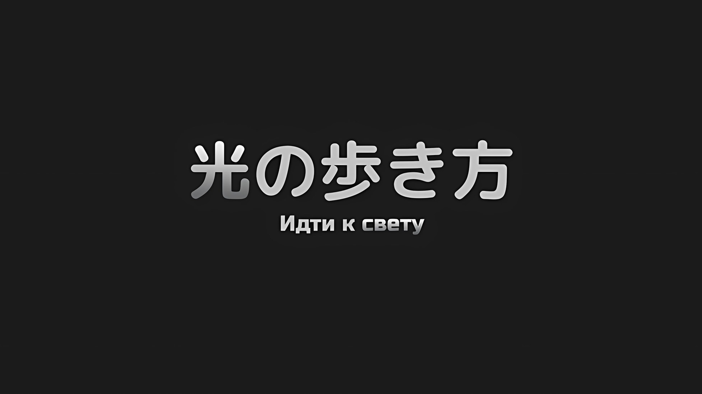
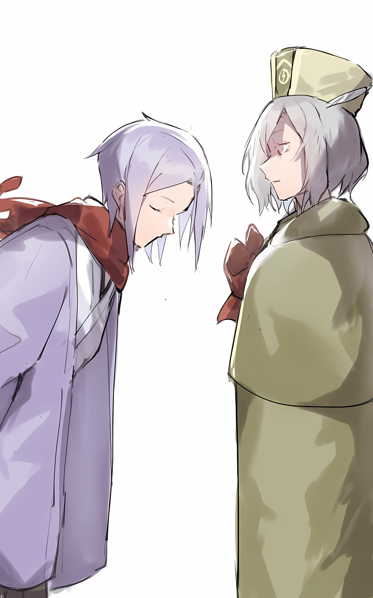
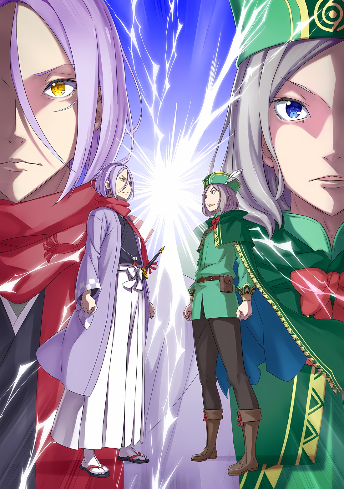
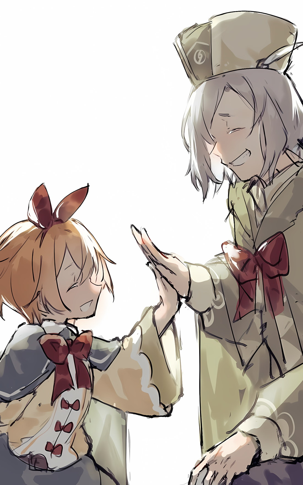

*※※※※※※※※※※※*

???: …Спика, да?

Когда он смотрел на двух плачущих людей, Рем и девочку, которая до этого момента была Луи, раздался голос.

Субару вытер слезящиеся глаза тыльной стороной ладони и обернулся, чтобы взглянуть на Рам, которая сказала это. Она сидела с обычным спокойным выражением лица, скрестив длинные ноги и подперев подбородок рукой, лежащей на столе.

Она слегка наклонила голову и посмотрела на Субару сузившимися светло-малиновыми глазами,

Рам: Откуда взялось это имя?

Субару: …Это название звезды у меня на родине.

Рам: Значит, ты поэт, что не характерно для Барусу. Но ты все понимаешь?

Сузив глаза, Рам перевела свой взгляд на обнимающуюся парочку.

Этого было достаточно, чтобы Субару понял, о чем говорит Рам.

Естественно, это было то, что он подробно обсуждал перед тем, как прийти в эту гостевую комнату.

Рам: Ты точно понимаешь, что значит использовать Архиепископа Греха, даже если это делается с великой целью?

Субару: …Конечно, я думал об этом. Не скажу, что я точно понимаю, но…

Рам: Если так, то прекращай.

Субару: …Кх.

Из горла Субару вырвался тоненький звук, когда холодные, жесткие слова поразили его.

Однако Рам, не обращая внимания на его боль, добавила.

Рам: Если ты не понимаешь, то не делай этого. …Иначе говоря, посмотри в эти глаза.

Сказав это, Рам протянула руку, которая поддерживала ее подбородок, и коснулась стройного плеча рядом с собой.

Танза стояла рядом с Рам и вместе с ней наблюдала за обменом мнениями между Субару и остальными. Ее попросили быть свидетелем, так что она присутствовала здесь.

Ее черные глаза мерцали под взглядом Субару,

Танза: Я прекрасно понимаю чувства Шварца-сама, ведь мы пережили много трудностей в Гинунхайве и на протяжении всего последующего пути. Однако…

Субару: Танза.

Танза: Однако я склонна думать, что даже Шварцу-сама, который привел с собой самого Сесилуса-сама, не стоит брать с собой Архиепископа Греха.

Решительно поправив колеблющийся огонек в глазах, Танза посмотрела на Субару и сказала это.

Танза никому не льстила, подбирая приятные для слуха слова, а просто отстаивала свое честное мнение. Искреннее, но детское мнение Танзы было глубоко прочувствовано Субару.

Субару: …Да, знаю, я был идиотом.

После слов Танзы он вновь остро осознал, что за словами Рам стоит истина.

И в этом заключалась ошибочность выбора Нацуки Субару.

Субару: Я все понимаю. Мне много чего сказали, и я собираюсь взять все это на себя.

Рам: Да. Рам говорит тебе — что бы ни говорили Барусу или Рем, Рам этого не допустит.

???: …Кх, Сестра.

Рам: Нет, будучи твоей старшей сестрой, Рем, твоя доброта вызывает у Рам гордость, однако это совсем другое.

Крепко обняв Спику, Рем посмотрела на Рам заплаканными глазами. Но, покачав головой в ответ на взгляд сестры, Рам четко высказала свою точку зрения.

Это было естественно. Рам являлась очередной жертвой «Чревоугодия», лишившись своей второй половинки — Рем.

Ему и в голову не пришло бы сказать что-то столь самонадеянное, как то, что ее положение сравнимо с положением Субару.

Вот почему…,

Рам: Путь для того, чтобы она желала получить прощение, еще не открыт. Единственная причина, по которой эта девчонка… Спика, до сих пор не разорвана на части Рам, — это вопрос «Воспоминаний», вот и все.

Рем: …Я не знаю, как сейчас вернуть свои «Воспоминания», но если со Спикой что-то случится…

Рам: Хотя это и маловероятно, но невозвращение «Воспоминаний» Рем — это исход, который нельзя допустить. Рем сказала, что ничего страшного не случится, если они не вернутся, но Рам этого не хочет. Для того чтобы Рем и Рам помнили, как сильно любили друг друга, Рам позаботится о том, чтобы мы вспомнили.

Заявив, что она вернет свою любовь, Рам сделал тот же вывод, что и раньше.

Когда битва за Сторожевую Башню Плеяд завершилась гибелью Лея Батенкайтоса и успешным взятием Лоя Альфарда под контроль, жизнь последнего не была отнята, так как он был возможным средством помощи жертвам Полномочия «Чревоугодия».

Однако…,

Рам: Разница лишь в том, что по сравнению с Архиепископом Греха она более сговорчива.

Субару: Рам…

Рам: Перестань делать такое лицо, ладно? Если она хочет, чтобы ее простили, она должна сначала загладить свою вину. Это логично. В любом случае, ей уже сказали об этом.

Субару: …Верно.

Кивнув в ответ на слова Рам, Субару прижал свой маленький кулачок к груди.

Как она и сказала, Спика получила щедрую отсрочку. Люди, связанные с ней, продлили срок отсрочки наказания из-за ее поступков и полезности.

Все, что Субару мог ей дать, — это имя, чтобы зажечь ее решимость начать жить заново, и помочь ей, заставив многих других людей согласиться на продление отсрочки.

Субару: В настоящее время, Спика… Ты не можешь использовать силу своего Полномочия, чтобы восстановить «Воспоминания» и «Имя» Рем одним махом?

Спика: Уу, ау…

Субару: Как и ожидалось, это слишком большая просьба…

Заглянув через плечо Рем, Спика извиняюще покачала головой.

Она сжимала и разжимала обе руки, но, похоже, ей было нелегко свободно управлять своим Полномочием и возвращать то, что было собрано «Чревоугодием».

Рем: …Ты уверен, что Луи-чан… Нет, что Спика-чан сможет это сделать? Сможет ли Спика-чан вернуть мне и другим людям пропавшие «Воспоминания»?

Субару: По крайней мере, именно Спика имеет наибольшие шансы, ее способность к этому — минимальное требование. Это само по себе уже отличается от того, о чем говорил «Звездочет».

Рем была обеспокоена, но это было то, что Спика должна была уметь делать.

Это было необходимым условием для того, чтобы Спика могла идти, неся на своих плечах крест «Луи».

Для этого Спика должна была овладеть Полномочием «Чревоугодия»…,

Субару: …

Рем: …? Эм?

Мимолетное, скоротечное беспокойство заглушило слова Рем и заставило ее глаза дрогнуть.

Щедрость, проявленная Рам, условия, необходимые для ее осуществления, знание средств, которые должны быть для этого достигнуты, само существование Полномочия вызывали ужас.

Ужасно, что для того, чтобы стать чем-то, что не было бы непростительным Архиепископом Греха, Полномочие, применяемое Архиепископом Греха, будет использоваться и дальше, а образ жизни Спики снова приблизится к образу жизни «Луи Арнеб».

Сохранить жизнь Спики означало продолжить борьбу с этим страхом.

С этой решимостью…,

Субару: …Я попрошу тебя сделать это. Я рассчитываю на тебя, Спика.

Спика: У! Ауау!

С явной решимостью в голубых глазах Спика энергично кивнула в ответ на слова Субару.

Хотя Спика и злобная «Луи Арнеб» внешне были похожи, их внутренние чувства не пересекались. Это была надежда, в которую можно было верить.

Субару: Танза, прости, что не послушал твоего совета.

Танза: …Вы ждете, что я просто улыбнусь и прощу вас, сказав, что это то, что всегда случается?

Отведя взгляд от Рем и Спики, Субару снова повернулся к Танзе. Его тон ухудшился, и она ответила ему голосом, лишенным эмоций.

На это Субару пожал плечами, сказав: «Нет»,

Субару: Я не ждал этого. В конце концов, ты редко мне улыбаешься.

Танза: Это не то, что я…

Субару: Я понимаю, что ты имеешь в виду. Но дай мне передохнуть.

Танза: …Если это то, чего вы хотите, то должно быть бесчисленное множество способов. Почему бы просто не сказать, что ее сила нужна для Империи Волакия и, соответственно, для спасения Йорны-сама?

Плотно сжав губы, Танза решительно заявила об этом Субару.

Независимо от достоверности пророчества «Звездочета», если бы внимание было привлечено к тому факту, что присутствие Спики было необходимо для этой битвы, Танза не смогла бы отказаться, когда на кону стояла жизнь Йорны.

Но Субару такой подход не нравился.

Субару: Вероятно, я мог бы заставить Танзу делать то, что я говорю, используя эту нечестную тактику, но мне не нравится эта идея. Я не хочу ни к кому применять какие-либо нечестные методы. Ты одна из тех, к кому я испытываю особые чувства.

Танза: …В таком случае, для Шварца-сама это невозможно.

Танза, наконец, отвернулась от Субару, обхватив себя своими тонкими руками.

Столкнувшись лицом к лицу с жестами и словами, свидетельствующими о его трусости, Субару испустил долгий вздох.

Все, что Субару хотел сделать, всегда оказывалось путем, который не приносил ничего, кроме вреда окружающим его людям, тем, кто заботился о Субару.

Рам: Ну и как? Насколько хорошо разыграл свои карты нечестный и трусливый Барусу?

Субару криво улыбнулся тому, как Рам это сформулировала.

Рам проявила доброту, не позволив Субару таким образом сменить самобичевание на самодовольство. Хотя ему действительно хотелось, чтобы он мог разыграть свои карты так же хорошо, как это сделала Рам.

Субару: Я не сделал ничего такого уж идеального. У меня были возможности переделывать все заново, пока я не сделаю все правильно, но…

Например, на Острове Гладиаторов Субару мог делать это без колебаний.

Всякий раз, когда он шел по неправильному пути или вступал в нежелательные отношения, он начинал все сначала, используя метод исправления этих промахов, с напористостью, позволяющей повторять цикл проб и ошибок.

Субару: Но теперь, когда я со всеми воссоединился, я не хочу этого делать.

Сказав это, Субару провел языком по своему рту; там ужасно долгое время хранилась упаковка с ядом, спрятанная за моляром… Убедившись, что он больше ее не чувствует, Субару закрыл глаза.

Даже если бы он снова прибег к этому способу, он никогда бы не стал использовать его для того, чтобы отвести глаза от ошибок в своих отношениях.

И именно потому, что он твердо решил это в своем сердце…,

Субару: …В конце концов, Отто очень сильно ударил меня.

Что даже если путь, по которому он идет, вынудит его пойти на жертвы, он не должен его повторять.

*△▼△▼△▼△*

Гарфиэль: Оттобро, покажь мне свою руку, я ее вылечу.

Услышав это, Отто повернулся лицом к стоявшему перед ним Гарфиэлю.

Этот грубоватый на вид юноша, несмотря на свою суровую внешность, обладал очень тонкой натурой. Он был внимательным и добросердечным, олицетворяя собой сущность члена лагеря Эмилии.

В ответ на предложение Гарфиэля Отто покачал головой и ответил,

Отто: Не стоит так беспокоиться, все не так серьезно…

Гарфиэль: Оттобро, на тебя это не похоже.

Отто: ……

Гарфиэль: Знаешь, не то чтобы у крутого меня не было собственных мыслей и чувств. Так что отчасти я понимаю, что ты чувствуешь.

Гарфиэль почесал свою голову и закрыл один глаз. Затем, вздернув подбородок, он жестом указал на руку Отто.

Правая рука Отто, распухшая и покрытая синяками, представляла собой болезненное зрелище.

На мгновение Отто попытался отвернуться, спрятать руку от посторонних глаз, но глупо было думать, что он сможет сделать это в присутствии своего названного младшего брата, который являлся опытным воином. Прежде всего…,

Гарфиэль: Ты же не собираешься участвовать в важном сражении с незалеченной рукой, брат?

Отто: …Раз ты так говоришь, я не могу спорить, не так ли?

С кривой улыбкой, поддавшись на разумные уговоры, Отто протянул свою поврежденную правую руку.

Потемневший, распухший кулак пульсировал от боли. Судя по ощущениям, накопленным за два с лишним десятилетия жизни, Отто был уверен, что в его кулаке сломаны кости.

Но от этой мысли боль только усиливалась. Независимо от того, сломаны они или нет, ощущение было такое, будто они сломаны.

Гарфиэль: Это похоже на то, как «Робкий Домус Первым Умирает на Поле Боя».

Отто: Не означает ли это, что тот, кто обычно робок, выходит на поле боя и умирает бессмысленной смертью?

Гарфиэль: Ну, я бы не стал связывать слово «робкий» с тобой, Оттобро.

Говоря это, Гарфиэль осторожно взял предложенную руку и произнес заклинание исцеления.

Ощущение, похожее на мягкое согревание горячей водой, окутало его руку вместе со слабым светом. Всего через несколько секунд боль в кулаке Отто утихла.

Гарфиэль: Рана только что зажила, так что, если снова собираешься бить, используй левую руку.

Отто: Я не хочу ломать обе руки. Следующий удар я оставлю тебе, Гарфиэль.

Гарфиэль: Если бы это сделал крутой я, то образовалась бы огромная дыра. Только благодаря твоей силе все остановилось на этом, понимаешь?

Скрежеща молярами, Гарфиэль повернул голову, устремив свой взгляд на стену повозки.

Действительно, как и сказал Гарфиэль, на стене была небольшая вмятина и трещина. Этот след был сделан кулаком Отто, а высота этого следа…,

Гарфиэль: …Прямо в районе головы нашего уменьшенного Капитана.

Отто: Нацуки-сану повезло, что он маленький. Если бы я ударил его в таком состоянии, независимо от объяснения, я бы прослыл злодеем.

Гарфиэль: Это уж точно. Что ж, если бы Капитан имел свои обычные размеры, то после того, как вы закончили, я бы, возможно, и сам замахнулся.

Гарфиэль усмехнулся легкомысленному замечанию Отто.

Увидев реакцию Гарфиэля, уголок рта Отто дернулся в улыбке. «Ох, честное слово», — пробормотал он, почесывая свою голову только что исцеленной правой рукой.

Свежеисцеленная правая рука все еще болела, когда он грубо обращался с ней. Однако эта боль успокаивала.

Отто: Боль, хоть и простая, может быть целебной… О, может быть, мне стоило просто пойти и ударить Нацуки-сана, несмотря на его размеры?

Гарфиэль: Раз уж ты так думаешь, может, пойдем и врежем ему вместе?

Отто: Спасибо, нет. Если мы пойдем сейчас, то увидим то, чего бы мы не хотели увидеть.

Гарфиэль, изо всех сил стараясь его утешить, издал «Гх…», с трудом подбирая слова, когда услышал ответ Отто.

Отто, хоть и не собирался этого делать, задумался над своими словами, чувствуя, что набросился на него несправедливо. …Но неужели у него действительно не было такого намерения?

Мог ли он с уверенностью сказать, что не направил эти резкие слова в адрес Гарфиэля, который всегда заботился о его интересах и знал, что тот никогда против него не пойдет?

Отто: …Это удручает.

Пробормотав что-то себе под нос, Отто снова ударил себя по лбу правой рукой, на сей раз чуть сильнее.

Лоб, по которому ударили, и правая рука, которой ударили, отозвались болью.

…В настоящее время Субару направился к каюте, где его ждали Рам и Рем. Там он должен был встретиться с «Луи» и начать разговор.

Тема, которая будет там обсуждаться, представляла собой нечто такое, чего Отто от всей души не желал. Он мог бы громко заявить, что совершенно не хочет при этом присутствовать.

Эмилия и Беатрис, больше обеспокоенные самим Субару, чем характером разговора, последовали за ним. Войдут ли они в каюту, оставалось неясным, но он легко мог себе представить, как они с тревогой ожидают развязки.

Однако, учитывая обстоятельства…

Гарфиэль: …

Гарфиэль, с неловким выражением лица и молчанием, вероятно, решил остаться здесь из беспокойства за Отто.

Эмилия, Беатрис и Гарфиэль — все они умели заставить сердце Отто раскиснуть.

…Позиция Отто в отношении Архиепископа Греха «Чревоугодия», Луи Арнеб, неизменно сводилась к тому, что она должна быть устранена любой ценой.

Поскольку он верил в это и твердо решил, что так и будет, существовал факт, которым Отто намеренно не делился с Эмилией и остальными.

С момента их воссоединения в Городе-крепости Гуарал и нескольких встреч с «Луи», девочкой, которая не умела говорить…… его слух ни разу не уловил от нее никакого злого умысла.

Отто: …

«Божественная Защита Духовной Речи» Отто выполняла простую функцию — она позволяла ему общаться с любым живым существом. Хотя чаще всего он использовал ее для общения с наземными драконами или насекомыми в целях сбора информации, при желании Отто мог общаться даже с младенцем.

Было время, когда в трудные дни своей жизни в качестве странствующего торговца он брался присматривать за младенцами влиятельных лиц самых различных земель, просто чтобы заработать немного денег на свои дорожные расходы.

Даже если голос младенца был не в состоянии сформировать слова, Отто мог понять его намерения.

Таким же образом, пусть высказывания «Луи» и не складывались в связную речь, Отто мог уловить ее намерения. И в них он не обнаружил никакой враждебности по отношению к другим; напротив, большую часть ее составляла привязанность к Субару и Рем.

Именно поэтому Отто закрыл глаза на эту правду и никогда не рассказывал о ней ни Эмилии, ни остальным.

Пока сомнения оставались, он мог помешать им подойти к «Луи» слишком близко.

Как только сомнения рассеются, излишне говорить о том, как добросердечная Эмилия и другие отнесутся к «Луи» или как они будут подходить к ней с точки зрения эмоциональной дистанции.

Тогда бы…,

???: …Отто-кун, Гарф-кун, можно вас на пару слов?

Отто: …

После легкого стука в дверь каюты, в нее заглянула Анастасия, одетая в кимоно.

Увидев Анастасию, которая таким же образом привела с собой Юлиуса, Отто подтянул щеки и кивнул, сигнализируя «Да».

Анастасия: Похоже, дела там затянулись, и я решила, что ждать всем вместе это слишком. К тому же я беспокоилась за руку Отто-куна…

Гарфиэль: Даже без твоего беспокойства, я уже вылечил руку брата. Кроме того…

Анастасия: Хм?

Гарфиэль: Не нравится мне, что ты называешь меня «Гарф-кун».

Гарфиэль высказал свое недовольство, сморщив нос, на что Анастасия удивленно расширила глаза. Затем она усмехнулась: «Прости за это», и сказала,

Анастасия: Видишь ли, Мими постоянно называет тебя «Гарф» и говорит о тебе в таком духе, поэтому я привыкла думать о тебе как о «Гарфе-куне». Разве «Гарф-кун» это странно?

Гарфиэль: Не то чтобы это странно, но…

Отто: Гарфиэль, не нужно суетиться.

Пока Гарфиэль нехотя противостоял Анастасии, Отто похлопал его по плечу и покачал головой.

Когда Анастасия и компания зашли в каюту, Гарфиэль сменил позицию, оказавшись между ними и Отто. …Если быть точным, то это произошло не из-за Анастасии.

Гарфиэль: …

Причиной было присутствие Юлиуса, стоявшего рядом с Анастасией.

Когда он появился в каюте, поведение Отто изменилось, и Гарфиэль это заметил. Благодарный Гарфиэлю за его заботу, Отто кивнул.

А затем, встав рядом с Гарфиэлем, который в этот момент был, по сути, его младшим братом, Отто протянул свою правую руку Анастасии и компании.

Отто: Как и сказал Гарфиэль, моя рука уже вылечена.

Анастасия: Вижу, вижу. Рада слышать. Я думала попросить Юлиуса ее вылечить, если возникнет необходимость, но, видимо, я была чересчур любопытна.

Анастасия игриво высунула язык и с самодовольным видом заговорила, что не могло не раздражать Отто. Если она думала, что они не смогут отказаться от ее предложения, то, увы, ошибалась.

Поскольку Отто и Гарфиэль отсутствовали в Песчаных Дюнах Аугрии, вполне возможно, что дуэт Анастасии и Юлиуса укрепил свою дружбу с Субару, Эмилией и остальными, однако…,

Отто: В отличие от них, я прекрасно помню, что вы двое — наши враги.

Анастасия: …Ты действительно неплох, Отто-кун. Конечно, я не испытываю неприязни к Эмилии-сан и остальным, но… без такой реакции я бы потеряла свое конкурентное преимущество.

Взгляд Отто стал острым, на что Анастасия ответила нежной улыбкой. Хотя выражение ее лица и голос были мягкими, свет в ее бледно-голубых глазах был непреклонным, и Отто все понял.

Несмотря на то, что им пришлось пересечь границу Империи Волакия, Анастасия четко определила границы лагеря. Именно поэтому они сели в драконью повозку, занимая столь важное положение для Городов-государств Карараги.

В этом отношении проблема заключалась не в Анастасии,

Отто: Рыцарь Юлиус.

Юлиус: Ранее я сделал чрезмерное заявление. Позвольте мне за это извиниться.

Отто: Извиниться, хах.

После резкого обращения к собеседнику ответ Юлиуса заставил Отто вздохнуть.

Судя по всему, «чрезмерное заявление» — это комментарий, который был высказан по поводу обращения с Архиепископом Греха «Чревоугодия» во время предыдущего обмена мнениями.

По сути, Юлиус высказал собственное мнение, воспользовавшись на это своим правом.

Предположительно, это были слова Юлиуса, обращенные к тогдашнему взволнованному Отто.

Отто: Значит, ты хочешь сказать, что пересмотрел свое мнение? Что ты все-таки посторонний?

Юлиус: Нет, Полномочие Архиепископа Греха «Чревоугодия»… Я вовлечен в это дело в том смысле, что пострадал от него. У меня также есть младший брат, о существовании которого я не могу вспомнить. С этой точки зрения я не считаю себя посторонним.

Отто: …В таком случае, в чем же ты себя превысил?

Понизив свой голос, Отто нахмурил брови и внимал.

Несмотря на извинения, Юлиус заявил, что не намерен менять свое мнение относительно той части, которая волновала Отто.

Однако другой причины для извинений Юлиусу в голову не пришло.

Тогда, обращаясь к недоумевающему Отто, Юлиус добавил.

Искренняя благодарность и даже некоторое уважение к собеседнику пронизывали его желтые глаза,

Юлиус: Отто-доно, я прошу прощения за то, что лишил вас этой роли.

Отто: …

Юлиус: Я понял это по вашей реакции. Если бы я не заговорил об этом, вы бы сами сказали то же самое. Тем не менее, используя в качестве предлога тот факт, что я сам являюсь жертвой «Чревоугодия», я лишил вас роли человека, причастного к лагерю. Поэтому,

Прервав на этом свои слова, Юлиус отвесил глубокий поклон.

Затем, повернув к ним макушку своих светло-фиолетовых волос,

Юлиус: Я от всего сердца прошу прощения. Я искренне сожалею.

Да, когда ему продемонстрировали столь искреннее извинение, Отто сильно прикусил внутреннюю сторону щеки.

Будь его реакция хоть немного медленнее, он бы чуть не прикусил губу на глазах у собеседника. Склонив голову, Юлиус не мог этого наблюдать, но Анастасия могла.

Этого нужно было избежать.

Анастасия: Юлиус действительно хотел извиниться за это, не так ли? Поэтому я подумала, что если рука Отто-куна еще не зажила, то проще начать разговор именно так.

Гарфиэль: …Это правда? Что ж, тогда извиняюсь.

Анастасия: Все в порядке. Если даже у него нет и шанса, мой Рыцарь умеет правильно извиняться.

Не считая Отто и Юлиуса, двумя вовлеченными сторонами, обменявшимися такими словами, были Анастасия и Гарфиэль. Юлиус тем временем продолжал склонять голову, и Отто с запозданием понял, что от него ждут ответа.

Отто должен был дать ответ, иначе это извинение будет неполным.

Отто: …Подними голову, пожалуйста.

Не торопясь, Отто медленно обратился к собеседнику.

В ответ Юлиус стал медленно поднимать свою голову. При виде Рыцаря в васу, со шрамом под левым глазом, подчеркивающим его мужественные черты, Отто вздохнул.

Затем…,

Отто: В том, что твое заявление не было злонамеренным, и что ты пытался сотрудничать с Нацуки-саном, я не сомневаюсь. Но ты наш враг. Это остается неизменным.

Юлиус: Отто-доно.

Отто: Я не Рыцарь, поэтому у нас нет возможности скрестить мечи. Ты не торговец и не гражданское лицо, поэтому у нас нет возможности скрестить слова. …И все же, не скрестив ни слов, ни мечей, ты — мой враг, а я — твой.

До боли сжав свой кулак, Отто заявил это Юлиусу.

Приняв слова Отто за чистую монету, Юлиус расширил глаза. Было ли это удивление или недоумение, но тот факт, что это был не тот сюрприз, который можно было бы преподнести тому, кого не считаешь врагом, защищал гордость Отто.

Отто: Анастасия-сама, я хотел бы сказать это заранее… Независимо от мнения Нацуки-сана и Эмилии-сама, причина использования Архиепископа Греха кроется в Империи. Если на нас будут клеветать из-за существования Архиепископа Греха, то вина за это ляжет на Империю.

Анастасия: …Хм, я тоже не возражаю против этого. Но даже если бы и возражала, не думаю, что взяла бы такое в свои руки. Потому что, знаешь, так оно и есть, да?

Анастасия закрыла один глаз, глядя на Отто, который повернулся в ее сторону и привел уместный аргумент.

Поглаживая свой белый лисий шарф, она перевела взгляд в другую сторону — на каюту, где, вероятно, находились Субару и остальные.

Анастасия: Каким бы ни был план, как только в него будет вовлечен Архиепископ Греха, все вокруг будут испытывать отвращение, независимо от того, насколько глубоки или поверхностны наши отношения. Это касается не только Империи, не только лагеря Эмилии, это касается и нас.

Отто: …Если вы поняли, то отлично.

Кивнув в ответ Анастасии, Отто слегка расслабил плечи.

Если в каком-то деле был замешан Архиепископ Греха, то в любой ситуации оно не могло быть воспринято положительно. Таковы были рамки этого мира и незыблемая истина.

Что бы ни говорил пострадавший Юлиус, как бы добросердечная Эмилия ни указывала на путь к прощению, и чего бы ни добивался глупо надеющийся Субару, это оставалось истиной.

Именно поэтому они должны противостоять друг другу.

Ножи, приставленные к шеям друг друга, взаимно давили на смертельные раны.

Отто: …Извините, мне нужно кое-что сделать. Простите.

Подтвердив общее понимание, Отто внезапно заявил об этом.

Услышав это, Анастасия наклонила голову со словами: «Неужели?». Стоявший рядом с ней Юлиус переваривал сказанное, его удивленное выражение лица напряглось, но Отто не мог смотреть на него слишком долго, поэтому быстро отвернулся.

Гарфиэль: Брат! Крутой я тоже…

Отто: Гарфиэль.

Гарфиэль: А?

Отто: Я сам справлюсь.

Отто стремительно направился к выходу из каюты. В ответ на попытку Гарфиэля последовать за ним, он преградил ему путь рукой, сказав это в понятной манере.

Дело было не в том, что ему хорошо одному, а в том, что он хотел, чтобы его оставили в покое. И тогда внимательный младший брат послушно его выслушал, кивнул и проводил взглядом.

Отто: …

Тихо закрыв дверь каюты, Отто длинными шагами удалился прочь.

Он оставил Гарфиэля в одной комнате с Анастасией и Юлиусом. Он беспокоился по поводу того, что они будут обсуждать, но у него не было достаточной эмоциональной свободы, чтобы поддержать его.

Он не бежал, но его мысли были в таком беспорядке, что ему хотелось убежать.

Отто: Лишил моей роли…?

Желание извиниться, его склоненная голова, слова Юлиуса — все это эхом отдавались в голове Отто, заставляя его стиснуть коренные зубы.

Юлиус действительно был Рыцарем Анастасии, искренним и честным человеком. Такая приятная мысль вовсе не приходила ему в голову.

Просто ему было очень горько от непонимания Юлиуса.

Юлиус совершил большую ошибку.

Если бы Юлиус промолчал, Отто никогда бы не сказал ничего такого, что могло бы пробить брешь в тупике Субару.

Правда, как сказал Юлиус, он бы солгал, если бы сказал, что у него нет тех же мыслей, что и у него, но можно быть уверенным, что Отто никогда бы не сказал этого, даже перед смертью.

Он пришел в ярость не потому, что его лишили роли.

Отто был в ярости на Юлиуса, потому что тот сказал то, чего ему не следовало говорить… Нет, он не хотел, чтобы тот говорил. Юлиус не понимал этого.

И, тем не менее, тот, кто совершил это недоразумение…,

Отто: Действительно, эти двое похожи.

В своей основе это являлось доказательством того, что Юлиус был таким же идеалистом, как и Субару.

Он верил, что человеческие существа в своей основе являются добрыми. Но это не потому, что он был легкомысленным. И не потому, что он был безразличен к реальности. Даже зная реальность, он все равно ею хвастался.

Таким же был путь Нацуки Субару и Эмилии, их путь к свету.

Отто: …Кх.

??? …Отто-кун, это никуда не годится.

Внезапно Отто почувствовал, как кто-то схватил его за руку, что вернуло его к реальности.

Оглянувшись, он понял, что неосознанно поднял руку, которую теперь кто-то удерживал сзади.

Скорее всего, в порыве эмоций он собирался ударить кулаком по стене. Той самой правой рукой, которую совсем недавно исцелил Гарфиэль.

Розвааль: Это ведь магия исцеления Гарфиэля, не так ли? Похоже, она совсем недавно была исцелена, поэтому будет неприятно, если ты снова ее сломаешь.

Отто: …Я признаю, что совершил глупость, так что не мог бы ты меня отпустить?

Он невольно пробормотал это тихим голосом, несколько удивившись самому себе. Но собеседник, видимо, привыкший к этому, ничего не сказал и отпустил руку Отто.

Перед ним стоял Розвааль, с которым он никогда не хотел пересекаться. И хотя Отто никогда не хотел с ним сталкиваться, сейчас он чувствовал себя особенно против.

Розвааль: Это выражение лица говорит о том, что ты даже не хочешь со мной разговаривать, не так лиии~?

Отто: Если ты это понимаешь и все равно обращаешься ко мне, значит, ты, Маркграф, действительно неумолим.

Розвааль: Это нехарактерно скучный ответ с твоей стороны. Похоже, ты воспринимаешь это тяжелее, чем я предполагааал~.

Отто: …

Разумеется, Розвааль тоже был участником той дискуссии в гостевой каюте.

Ему было хорошо известно, что во время той встречи Отто находился в ярости, а также то, что он занимал непреклонную позицию в вопросе отношения к Архиепископам Греха.

Зная это и продолжая вести себя подобным образом, было ясно как день, что Розвааль намеревался спровоцировать Отто.

Если же это было не так, то он слишком неумело взаимодействует с другими людьми.

Отто: Уверен, тебе есть, что сказать, Маркграф, но сейчас у меня нет на это терпения. Если ты не хочешь, чтобы все твое тело обглодали купленные мною крысы, я бы не советовал меня раздражать.

Розвааль: Если я когда-нибудь окажусь обглоданным крысами, я буду знать, что за этим стоишь ты. Возможно, это было полезно услышать, однако… Я искренне переживаю за тебя.

Отто: …За меня?

На скептический ответ Отто Розвааль кивнул.

По этой реакции Отто понял, что Розвааль донимает его с другого угла. То, что это было сделано в ситуации, когда у Отто не хватало терпения, вызывало у него самую настоящую тошноту, что делало это еще более отвратительным.

Отто: Маркграф, какие у тебя мысли?

Розвааль: У меня? Я, безусловно, в той же лодке, что и ты, Отто-кун. Мне все равно, если Империя будет уничтоженааа~.

Отто: …

Розвааль: О, возможно, я ошибся? Архиепископы Греха — это не что иное, как яд, который не может принести никакой пользы. Вместо того, чтобы размышлять о том, как их использовать, лучше бы Империя просто исчезла. Как ты и предложил Субару-куну, было бы прекрасно, если бы мы просто вернулись домой, прихватив с собой только тех, за отказ от которых Субару-кун будет чувствовать себя виноватым.

Поведение Розвааля, который пожал плечами, как бы говоря: «Это была отличная идея», явно отражало мнение Отто, вызывая у того плохое настроение.

Бессовестно пытаясь к нему подступиться, Розвааль из кожи вон лез, чтобы спровоцировать Отто на ответную реакцию, показывая тем самым, что мерзость его характера достигла своего апогея.

В то же время, несмотря на то, что Отто осознавал прагматическую сторону своего предложения, его отталкивала собственная склонность считать это наилучшим решением.

Наблюдая за ненавидящим себя Отто, Розвааль присмотрелся повнимательнее и заметил,

Розвааль: Я скажу тебе вот что — я считаю, ты делаешь более чем достаточно, Отто-кун.

Отто: …Похоже, что без макияжа твой острый язык притупился, Маркграф. Это звучит так, будто ты пытаешься сократить со мной дистанцию.

Розвааль: У меня нет таланта сближаться с людьми, так что не думай, что это так. В любом случае, я считаю, ты делаешь более чем достаточно. Однако, также существует вопрос «сколько бы ты ни боролся».

Отто: …Сколько бы я ни боролся?

Застигнутый врасплох выбором слов Розвааля, Отто дернул бровями.

Когда Отто повторил это, Розвааль глубокомысленно кивнул. Он положил руку на тонкий подбородок своего лица без макияжа и закрыл один глаз, оставив открытым лишь голубой,

Розвааль: Этот недавний инцидент служит прекрасным примером. В большинстве случаев все идет так, как того желают Субару-кун и Эмилия-сама. Все вокруг объединяются, организуют свои усилия, выстраивают путь к исполнению их желаний.

Отто: …О чем ты говоришь?

Ошеломленный неожиданным заявлением Розвааля, Отто насупил брови.

Идея о том, что желания Субару и Эмилии всегда исполняются, была невероятно абсурдной. Если бы это было так, Эмилия уже бы давно была провозглашена Королем и стала бы Нацуки Эмилией.

Тот факт, что этого не произошло, означал, что это было не так.

Отто: Ты издеваешься надо мной? Или, может, ты насмехаешься над Нацуки-саном и Эмилией-сама?

Розвааль: Ни то, ни другое. Я просто жалею тебя. Вклад твоей семьи сыграл свою роль в нашем путешествии из Лугуники в Волакию. За это я тебе благодарен, и именно из этой благодарности я дам этот искренний совет.

Отто: …

Розвааль: Чрезмерная увлеченность и разногласия с Субару-куном и Эмилией-сама токсичны для тебя. Этот токсин разъедает, и я боюсь, что в конце концов он может тебя убить. В конце концов, такого способного человека, как ты, трудно найти.

Спокойно, сбавляя тон своего голоса, Розвааль сказал это в прямолинейной манере.

В какой-то момент он отбросил клоунские интонации в своей речи и обратился к Отто Сувену с искренностью в своих гетерохромных глазах.

При этих словах и отношении Отто замолчал, а через мгновение заметил.

Цель человека по имени Розвааль L. Мейзерс.

Отто: Маркграф, мне ясны твои слова. Поэтому я не последую твоему совету.

Розвааль: Хмм…

Прищурив глаза, Розвааль испустил долгий вздох с нотками беспокойства.

Затем, когда он попытался услышать правду о том, почему его совет был отвергнут, Отто заявил.

Отто: Понимаю. …Должно быть, я тебе мешаю. В конце концов, я не простил того, что ты устроил, Маркграф, и я все еще продолжаю подозревать, что ты что-то замышляешь.

Розвааль: …О?

Отто: Именно поэтому ты решил подойти ко мне, увидев, что во мне накопилось большое недовольство. Возможно, ты посчитал это прекрасным шансом избавиться от меня под благовидным предлогом, но это было грубой ошибкой.

Действительно, оценка Розвааля была точной.

За то время, что прошло с тех пор, как Отто присоединился к лагерю Эмилии, этот обмен мнениями был, пожалуй, тем самым моментом, когда он испытывал наибольший гнев. До того, как он присоединился к лагерю, произошел инцидент, который разозлил его до такой степени, что он ударил Субару, и нынешний гнев мог с этим посоперничать.

Отто: Если ты думаешь, что из-за этого я просто все брошу, то ты сильно ошибаешься.

Розвааль: Отто-кун…

Отто: Прежде всего, что за чушь ты только что нес? Все, чего желают Нацуки-сан и Эмилия-сама, обязательно произойдет? Прошу, не говори чего-то столь абсурдного. Это совершенно не так, вот почему я, Гарфиэль, Беатрис-чан, Рам-сан, Петра-чан, Фредерика-чан, Патраш-чан и все остальные так отчаянно боролись, чтобы добраться до этого момента.

Сказав, что он сильно заблуждается, Отто впал в ярость по отношению к Розваалю.

Ранее Розвааль утверждал следующее.

Чего бы ни желали Субару и Эмилия, окружающие их люди так или иначе сделают это, так что ему нет необходимости чрезмерно беспокоиться и изнурять себя. Что сколько бы он ни возражал, его мнение будет подавлено, что сделает его присутствие бессмысленным.

Однако…,

Отто: Я бы никогда такого не смог.

Розвааль: …

Отто: Маркграф, по поводу твоих слов, я не знаю, в какой степени ты имел в виду, что все объединяются вокруг них… В крайнем случае, предположим, что я встану на сторону всех мнений Нацуки-сана, подтверждая их все и выстраивая путь так, чтобы все сбылось. …Я не считаю себя способным на такое.

Он не был похож на Беатрис или Гарфиэля, которые могли предоставить свои могущественные способности.

Он не был похож на Рам, Фредерику или Петру, которые могли оказать незаменимую поддержку.

И он также не обладал силой, способной исполнить все их желания, так какой же тогда был смысл в присутствии Отто?

Отто: Я не могу этого сделать. Я этого не признаю. Я этого не допущу. Всякий раз, когда Нацуки-сан и Эмилия-сама чего-то желают, в тот момент, когда я перестаю говорить, исчезает сам смысл моего существования.

Розвааль: …

Отто: К сожалению для тебя, Маркграф, все будет не так, как ты хочешь.

Напряженно глядя на Розвааля, Отто прямо заявил об этом.

Вероятно, Розвааль впервые подвергся такому одностороннему давлению на одном дыхании.

Конечно, хотя это и не высказывалось вслух, между Отто и Розваалем всегда существовала такая напряженность.

Поэтому, когда Розвааль увидел возможность, он подошел к Отто, чтобы устранить помеху и попытаться перевести доску в свою пользу.

Но Отто не уступил. По крайней мере, не из-за сегодняшних смехотворных рассуждений.

Отто: Я определился со своей позицией. Я не могу идти к свету, и это нормально.

Розвааль: …

Отто: Это был плохой ход, Маркграф. Уж лучше бы ты ко мне не обращался.

В любом случае, результат остался бы неизменным, или так бы ему хотелось сказать.

Однако, если бы он потратил больше времени, прежде чем прийти к какому-то решению, все могло бы измениться. Но поспешность Розвааля в достижении желаемого результата привела к обратному, к нежелательному результату.

И именно в тот момент, когда Отто перевел дыхание перед Розваалем, у которого было приятно угрюмое лицо,

???: Ах, Отто-сан! Нашла тебя!

На зов высокого голоса, который сопровождался топотом мелких шагов, Отто обернулся.

И тут его глаза встретились с глазами Петры, которая бежала к нему, размахивая рукой.

Отто: Леди Петра… То есть Петра-чан.

Рефлекторно обратившись к ней по привычке, сформировавшейся еще во время их работы под прикрытием, Отто заслонил рот рукой и поправил себя. Подбежавшая к нему Петра, слегка запыхавшись, спросила его,

Петра: Отто-сан, с твоей рукой все в порядке? Я слышала, что ты со всей силы ударил кулаком по стене…

Отто: Кажется, все меня об этом спрашивают. К счастью, Гарфиэль ее вылечил, так что все в порядке. Прости, что заставил тебя волноваться.

Петра: Нет, вовсе нет, если ты в порядке, то все хорошо… Что делает Господин?

С кривой улыбкой Отто показал Петре свою невредимую руку, так как она очень волновалась. Облегченно вздохнув, Петра тут же изменила выражение своего лица и уставилась на Розвааля.

В ответ на этот взгляд Розвааль слабо покачал головой и сказал: «Нет-нет»,

Розвааль: Я просто разжевывал самому себе свое привычное поведение.

Петра: Господин…? Поскольку ты никогда ни о чем не размышляешь, не будет ли это на вкус как ничто?

Розвааль: Уах.

Отто также намеревался оказать сильное давление на Розвааля, но эффект от одного замечания Петры был несравним.

Плечи Розвааля поникли, но Петра, внимательно наблюдавшая за ним, вдруг воскликнула «Ах», словно что-то вспомнив.

Затем она повернулась к Отто, отчего ленточка на ее голове колыхнулась, и,

Петра: Кстати говоря, я не только про твою руку слышала. Некоторое время назад вы, ребята, говорили о Луи-чан, так что…

Отто: Ах, да, точно. И за это тоже, прости, что заставил тебя…

Петра: Так что я, вместо Отто-сана, пошла и ударила Субару.

Отто: …

Выставив свою маленькую ручку, крепко сжатую в кулак, Петра заявила об этом.

Глядя попеременно то на протянутый кулак, то на восторженное лицо Петры, Отто удивленно моргнул.

От реакции Отто дыхание Петры стало немного прерывистым, и,

Петра: Отто-сан, я слышала, что ты сдержался. Потому что Отто-сан мог бы пожалеть, если бы ударил теперь уже маленького Субару. Поэтому я сделала это сама!

Разжав сомкнутый кулак, Петра показала свою ладонь. Когда она взглянула на него из-под своей ладошки, Отто на некоторое время замолчал.

Но он не смог сдержаться.

Отто: Ха, хахаха, аххаха!

Когда Юлиус извинялся перед ним, он терпел дискомфорт.

Когда Розвааль перешел в наступление, он терпел беспомощность от того, что на него сыпались удары судьбы.

Но сейчас, столкнувшись с добрыми словами Петры, он не смог этого вынести.

Смех не означал, что все улажено.

Вопрос оставался открытым, и Отто, как и прежде, был не согласен с мыслями Субару.

Даже так, оставаясь в оппозиции, Отто продолжал твердить, что компромисс, найденный Субару, неприемлем.

Он никогда бы не сдался.

Отто: Петра-чан.

Петра: Да?

Отто: Спасибо.

Сказав это, Отто приложил свою ладонь к ладони, которую протянула девушка.

Раздался легкий хлопок, и Петра рассмеялась, сказав: «Не за что».

