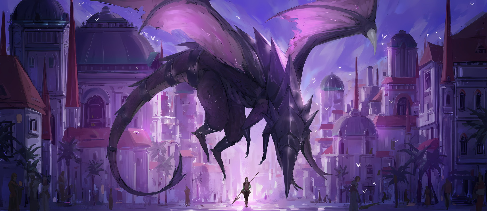
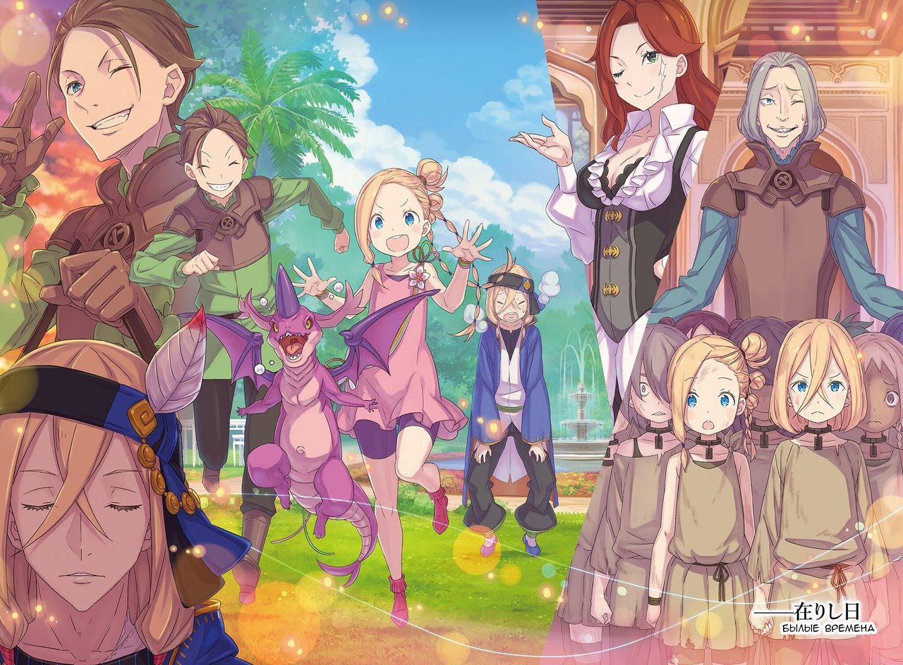
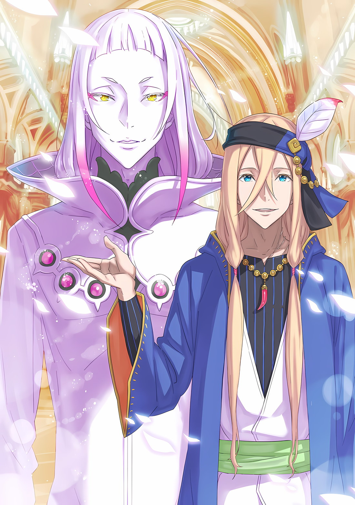
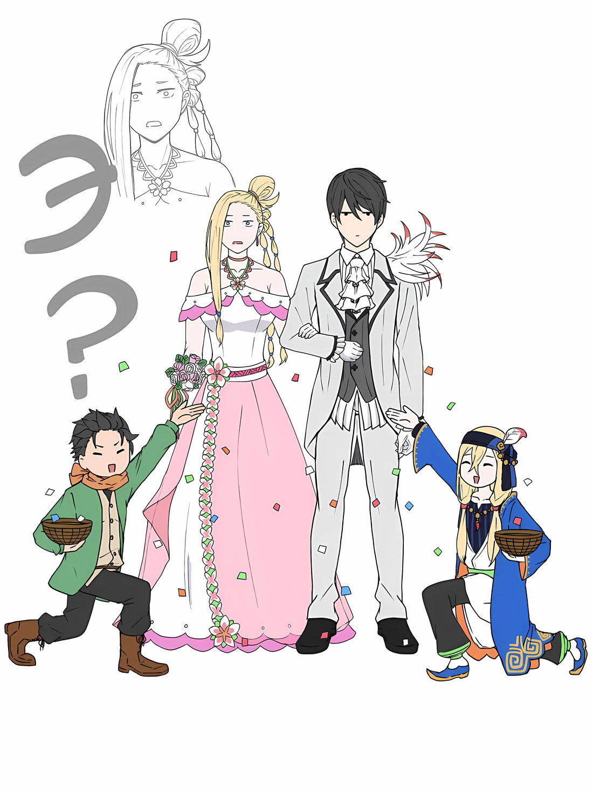

*※※※※※※※※※※※*

*…Ваше Превосходительство Император, Винсент Волакия.*

С серьезным выражением лица Флоп обратился к нему с такой речью, на что Винсент закрыл один глаз.

Флоп и Медиум внезапно заточили Винсента в каюте соединенных драконьих повозок; этот светловолосый дуэт брата и сестры не понимал, насколько ужасный поступок они совершили.

Безрассудный поступок, за который, если бы кто-то стал его свидетелем, полагалась смертная казнь; причиной такого поступка была передача чужого послания.

И в довершение ко всему…,

Флоп: Прежде чем я передам послание, могу ли я немного отвлечься и рассказать вам одну старую историю?

Все еще сохраняя серьезное выражение лица, он выдвинул такое предложение.

Винсент: …

Неспособный разгадать мотивы Флопа, Винсент молчал с по-прежнему закрытым глазом. Возможно, решив, что молчание ставит его в выгодное положение, Флоп продолжил: «И еще…»,

Флоп: Я понимаю, что это дерзко, однако… после того как вы выслушаете послание, не позволите ли вы мне попросить вас об одном одолжении?

Винсент: Эй.

Флоп: Оуоу, это довольно страшное лицо, Ваше Превосходительство Император! Однако, пожалуйста, не забывайте. Я единственный, кто знает, какое послание вы должны услышать, поэтому не стоит бездумно пытаться заставить меня замолчать.

Винсент: Я также могу приказать Ольбарту Данкелькену заставить тебя вымолвить это посредством пыточных методов шиноби.

Флоп: А не лучше ли нам просто мирно поболтать, Ваше Превосходительство Император!?

Как только Винсент перешел к угрозам, Флоп тут же поднял обе руки.

Речь шла не только о том, что у него хватило смелости вступить в переговоры с Императором. При этом и старая история, которой он предварил свое выступление, и последовавшее за ней одолжение, видимо, были для него очень важны, раз он взялся их поднимать.

Однако, опять же…,

Медиум: Но, братух, у нас мало времени, ведь так? При таком раскладе, если Авель-чин не вернется~, разве Гоз-чин и остальные не поднимут суматоху? Независимо от твоей просьбы, что это за старая история?

Наклонив голову, Медиум заметила, что, похоже, брат не поделился с ней никакой информацией.

Винсент: Ты, не поддерживай безрассудные действия своего брата, не подвергая их сомнению.

Медиум: А~? Но ведь это то, что делает братуха, так? Если это он, то я буду помогать, что бы он ни делал~. Это моя семейная клятва. А разве с Авелем-чин не так же?

Винсент: Бестолочь. Ты не знаешь, как рождаются Императоры Волакии?

Медиум спокойно произнесла эту глупую фразу, а когда услышала его ответ, удивленно моргнула глазами. Увидев ее искреннюю реакцию, Винсент бросил на Флопа укоризненный взгляд, как бы говоря: «Даже отсутствие общих знаний должно иметь свои границы».

Хотя это была отнюдь не приятная история, общеизвестно, что братья и сестры Императорской Семьи Волакия убивали друг друга, чтобы определить следующего Императора.

Поскольку Медиум не знала даже об этом, Винсент заподозрил некоторую предвзятость в методах обучения Флопа.

Но, по какой-то причине, Флоп улыбнулся, встретив этот взгляд Винсента,

Флоп: Я понимаю, что означает этот взгляд, Ваше Превосходительство Император. Вы удивлены отсутствием общих знаний у моей сестры, не так ли?

Винсент: Что еще я могу сказать? Вдобавок, перестань каждый раз обращаться ко мне «Ваше Превосходительство Император». Если другого обращения нет, то достаточно просто «Ваше Превосходительство».

Флоп: Понял, понял. Все ясно, Ваше Превосходительство Император-кун.

Винсент: …

Кивнув головой и сохраняя улыбку, Флоп продолжил, на что Винсент сузил глаза.

Это также чувствовалось и по его серьезному выражению лица, но сегодня Флоп был не просто дружелюбным торговцем, скорее, казалось, что он намеревался показать лицо, скрывающееся за его титулом.

Говоря точнее, перед Винсентом должен был предстать человек, испытывающий какие-то сомнения.

Флоп: Дорогая сестра, ты ведь только что спрашивала меня об этом, так? О том, почему я хочу рассказать эту старую историю. Ну, это потому, что в нашем прошлом существует связь между нами и Его Превосходительством Императором-куном.

Медиум: Хаах!? Серьезно!? Между нами и Авелем-чин!? И какая же!?

Флоп: Хахаха, да ладно, как ни посмотри, ты слишком забывчива, дорогая сестра. Его Превосходительство Император-кун — это же Император Империи. То есть, поскольку у него есть связи с «Девятью Божественными Генералами»…

Медиум: …Ты имеешь в виду братка Балра?

Ее глаза расширились от удивления, а живость в выражении лица Медиум внезапно исчезла.

Она произнесла чье-то прозвище, к тому же перед этим прозвучал термин «Девять Божественных Генералов». Проводя связь между этими двумя понятиями, Винсент естественным образом вспомнил одно-единственное имя.

Винсент: Вы родственники Балроя Темегрифа?

Флоп: Да, именно так, Ваше Превосходительство Император-кун. Он наш заклятый брат. С ним мы провели самые душещипательные года нашей жизни, он наша очень-преочень ценная и любимая семья!

Крепко сжав свой кулак, Флоп повысил голос, давая ответ, в результате чего Винсент издал вздох.

Кончики бровей Медиум опустились, и она переводила взгляд то на брата, то на Винсента. Было видно, что на ее лице появилось замешательство и признаки печали.

Флоп: Кажется, Верховная Графиня Серена Дракрой тоже едет в этой драконьей повозке. Собственно говоря, мы с сестрой также некоторое время были под опекой Графини Дракрой.

Медиум: Сеструха Серена…

Флоп: Кстати, Графиня Дракрой заставила использовать это прозвище Медиум, чтобы никто не чувствовал себя незнакомцем, и чтобы к Графине никогда не относились как к женщине, которая старше, чем она есть на самом деле. Занятно, не правда ли?

Винсент: Ближе к делу.

Поднимать бессмысленные темы и заставлять людей терять концентрацию было присуще торговцам.

Он оценил ситуацию сразу, как только стало известно, что эта пара брата и сестры связана с Сереной и Балроем. Изначально Балрой Темегриф был подчиненным Серены Дракрой, и благодаря своим определенным способностям он был призван стать одним из «Девяти Божественных Генералов»; на его будущее в качестве «Генерала» возлагались большие надежды.

Однако, зная всю историю Балроя, взгляды многих генералов и солдат становились разочарованными.

Он восстал против Императора и умер насильственной смертью после своей неудачи… Таков был конец Балроя, о котором знал весь мир; конец этого человека, которого эти двое называли семьей, был вписан в книги по истории.

Винсент: …Нет.

Воскресший и ставший нежитью, вполне вероятно, что описание Балроя Темегрифа, оставленное в книгах по истории, закончится не просто восстанием, а тем, что он стал существом, принесшим гибель Империи.

Несмотря на то, что Винсент думал об этом факте, он не стал говорить о нем Флопу и Медиум.

Он предвидел, что если затронуть вопрос о Балрое-нежити прямо здесь и сейчас, то желанная Винсентом тема будет только отдаляться все дальше и дальше.

В любом случае…,

Флоп: Итак, давайте перейдем к делу. Моя старая история на самом деле не такая уж и длинная. В конце концов, Медиум уже затронула главную тему.

Слегка опустив кончики бровей, Флоп медленно покачал головой.

На его слова Медиум сделала непонимающее лицо, но Винсент никак это не прокомментировал. Этот разговор с братом и сестрой постоянно сбивался с курса, и поэтому он вмешивался в него только тогда, когда он действительно отклонялся от темы.

Флоп: Я и Медиум с детства были сиротами, нас воспитывали в бедном приюте. Оттуда нас спасли и доставили во владения Графини Дракрой… Там мы встретили Балроя и стали с ним родными по мечу. Пока все хорошо, да?

Винсент: …Продолжай.

Флоп: Это были действительно насыщенные деньки. Мы с Медиум были довольно невежественны в отношении внешнего мира, и поэтому все, что мы встречали, было для нас свежим и новым. Графиня Дракрой была человеком с очень широким взглядом на вещи, а потому она дала нам, не знавшим куда себя деть, образование.

Винсент: Учитывая все это, для твоей сестры это не принесло никаких плодов.

Медиум: Это потому, что я больше предпочитала заниматься физическими упражнениями с братком Балро и остальными…

Надув губы, Медиум, казалось, вернула себе хотя бы малую толику хорошего настроения.

Винсент также слышал об обстоятельствах во владениях Дракрой, о которых говорил Флоп, и, что удивительно, управление этой территорией можно было оценить положительно.

Серену Дракрой, известную как «Палящая Леди», часто оценивали как обладательницу грубого нрава, но особенным ее качеством была гибкость идей, которые не были связаны никакими предвзятыми представлениями.

В большинстве случаев жители Империи Волакия не умели смотреть на вещи в долгосрочной перспективе.

Поскольку большинство детей не были способны эффективно выполнять ручную или военную работу, рождалось много людей, и среди них выживали только те, кто был одарен способностями и обстоятельствами, и лишь немногие достигали большого успеха как сильные личности.

Хотя в случае с членами собственной семьи дело обстояло иначе, в этой стране стремление вырастить широкий круг способных людей путем их воспитания в детстве считалось в основном неосуществимой теорией.

Флоп и Медиум были братом и сестрой, которым выпала такая редкая возможность. …Нет, Балрой, чей талант был обнаружен, тоже являлся одним из таких людей.

Флоп: Разумеется, все это было не просто развлечением, и Графиня Дракрой не всегда была к нам добра. В те времена Графиня Дракрой только-только самостоятельно узурпировала территорию у своего отца, так что ей было очень тяжело.

Медиум: Мы также сталкивались со множеством опасных ситуаций.

Флоп: Например, когда на нас напали те наемные убийцы, целясь в жизнь Графини Дракрой. Это были трудные времена.

Пока эти двое предавались приятным воспоминаниям, Винсент пытался разобраться в сути дела.

Но, опять же, главная мысль уже была затронута в самом начале. Выражаясь иначе, он привык к словам, которые ему говорили, и к взглядам, которые были на него обращены.

Слова и взгляды этих двоих, скорее всего, им соответствовали.

Другими словами…,

Флоп: Мы пережили те дни вместе, и между нами и Балроем была крепкая связь. Именно в силу этой связи я и хочу спросить вас об этом, Ваше Превосходительство Император-кун.

Винсент: …

Флоп: Наш заклятый брат, Балрой Темегриф, как всем известно, был глупым предателем, не видящим перспектив, и погиб, не сумев достичь желаемого… но так ли это на самом деле?

Задав этот вопрос, на лицо Флопа вновь вернулось спокойствие.

Для него самого и его сестры он являлся заклятым братом, но для Империи он был предателем; таково было положение Балроя Темегрифа, и теперь Флоп хотел узнать правду о его смерти у Винсента.

Как и ожидалось, это были слова, сказанные Винсенту много раз, и пристальный взгляд, обращенный к нему много раз.

Погибнуть на поле боя — честь воина, не сдаваться даже будучи пронзенным мечами — путь Волка Меча.

Даже в Империи Волакия, где ценились подобные вещи, не было тех, кто бы праздновал смерть близких. Вполне логично, что человеческие эмоции стремились найти смысл и причину смерти.

Флоп и Медиум, спрашивающие его об этом, относились к нему с ламентациями*, к которым он уже привык.

* Ламентация — сетование, жалоба.

Винсент: По какой причине ты сомневаешься? Ты подозреваешь, что к циркулирующим по улицам слухам добавилась примесь, и чувствуешь, что не можешь им доверять?

Флоп: Нет, дело не в этом. Просто я наконец-то получил свой долгожданный шанс поговорить с кем-то, кто к этому причастен. Тогда не так уж странно думать, что я хочу услышать историю, которая заслуживает гораздо большего доверия, чем сплетни, верно?

Винсент: Правда, эта возможность для диалога была насильственно создана вами двумя.

Когда Флоп попытался перевести разговор на тему маловероятного удобства, Винсент добавил этот короткий комментарий.

После чего он на некоторое время погрузился в необычное состояние глубокой задумчивости.

Смерть Балроя Темегрифа, о которой говорили на улицах.

Описания его смерти, оставленные в книгах по истории, сводились к тому, что он умер насильственной смертью при неудачной попытке восстания.

То, что слышали Флоп и Медиум, тоже не должно было быть ни больше, ни меньше, чем это. Таким образом, Винсент не стал бы рассматривать вопрос о восстановлении чести Балроя уже после его смерти.

История была не более и не менее чем историей, поэтому мир, в котором она распространялась, был прав.

Флоп: Я хочу, чтобы вы ответили, Ваше Превосходительство Император-кун. Как только я узнаю это, я передам вам послание…

Винсент: …Я не знаю, чего именно ты хочешь, но…

*Слухи, которые ты слышал, не ошибочны,* — попытался ответить Винсент.

Однако…,

Медиум: …Авель-чин.

Слова Винсента были прерваны слабым, коротким окликом.

Винсент: …

Медиум стояла перед дверью каюты и мешала ему выйти наружу… Нет, похоже, у нее больше не было таких намерений.

Медиум стояла неподвижно, ее плечи, довольно большие для женщины, стали меньше, когда она крепко обняла себя руками и посмотрела на Винсента. В ее голубых глазах заблестели слезы.

Он уже давно привык к тому, что у людей на глазах выступают слезы, когда они обращаются к нему с мольбами или просят сохранить им жизнь.

Поэтому сердце Винсента ничуть не дрогнуло. Однако, поскольку его сердце не дрогнуло, это ненадолго придало ему присутствия духа для размышлений.

…Флоп и Медиум, он так и не понял, чего именно они хотят.

Действительно, Винсент пытался дать такой ответ.

Однако так ли это на самом деле? Он был уверен, что знает, чего хотят эти двое. То, чего желали эти двое, было очевидно, и у Винсента имелся на это ответ.

Он знал его, но, несмотря на это, молчал. Таков был способ Винсента вести дела.

Но при таком подходе это можно было бы увенчать титулом «как всегда».

Винсент: …

Метод «как всегда» заключался в том, что все решалось на основе мыслей самого Винсента.

Однако, как только он применил метод «как всегда», Винсенту выбили почву из-под ног. Он получил жесткий удар от человека с наивным складом ума, заявившего, что принимать предположения за уверенность — это не по правилам.

Метод «как всегда» имел свои пределы.

То, что требовалось от Винсента, должно было быть методом «за гранью того, что когда-либо было».

Таким образом, для того, чтобы воспользоваться этим методом…,

Винсент: …Истинные обстоятельства смерти Балроя Темегрифа отличаются от слухов, которые ходят по улицам.

Действительно, Винсент решил дать ответ, отличающийся от метода «как всегда».

*△▼△▼△▼△*

Флоп & Медиум: …

Как только они услышали ответ Винсента, выражения лиц Флопа и Медиум изменились.

Глаза Флопа слегка расширились, а Медиум изумленно моргнула. Хотя изумление было заметно у обоих, его характер был разным.

Увидев разницу между их реакциями, Винсент все понял.

Винсент: Флоп О'Коннелл, ты ведь уже знал, что реальность не соответствует слухам, не так ли?

Медиум: Хм… братух?

Флоп: Сказать, что я знал, было бы немного некорректно. Просто эти слухи совсем не походят на Балроя, даже Медиум так считает.

Медиум: Д-да…

Привлекая к себе внимание, Медиум кивнула с выражением неувядающего удивления на лице.

Однако Флоп, побудивший свою сестру кивнуть, не опроверг вопрос Винсента.

Поймав взгляд Винсента, Флоп слегка наклонил голову,

Флоп: Только не говорите мне, что Ваше Превосходительство Император-кун думает, что, поскольку я был близок с Балроем, я уже заранее узнал об этом от него, и поэтому просто обманом заставил вас подтвердить правду?

Винсент: …Такая вероятность есть, но она близка к нулю. Человек, которого я знал, не стал бы даже немного повышать допустимую погрешность, и он никому не стал бы раскрывать свои действия до самого момента их совершения.

Флоп: …Верно. Думаю, все так, как вы и сказали, Ваше Превосходительство Император-кун. Я рад. Похоже, что с вами я могу поговорить о Балрое, которого я очень хорошо знал. В конце концов…

Винсент: …

Флоп: С тех пор как произошел тот инцидент, всякий раз, когда мы слышали где-нибудь в Империи имя Балроя, Медиум и я могли думать о нем только как о ком-то, кого мы не знаем.

Нахмурив красиво очерченные брови, в голубых глазах Флопа мелькнуло чувство одиночества.

Должно быть, так оно и было. Но Винсента это не поразило.

Для того чтобы все было именно так, Чиша подстроил слухи, а Беллстетз направил их в нужное русло, и все это по приказу Винсента.

Все было сделано для того, чтобы скрыть правду о ситуации, скрыть причину, по которой Балрой Темегриф стал мятежником.

Этим было…,

Флоп: …Это восстание не было истинным мотивом Балроя.

Медиум: Братуха!?

При словах Флопа Медиум громко вскрикнула.

Ее круглые глаза были широко открыты, и она энергично качала головой из стороны в сторону,

Медиум: Это же странно, ты говоришь ерунду. Браток Балро, он ведь… Авель-чин! Скажи что-нибудь! Скажи братухе, что он свихнулся…

Винсент: Если есть необходимость его поправить, то я это сделаю. Если нет, то я не стану этого делать. Вот и все.

Медиум: У тебя нет причин что-либо говорить…

Медиум не могла подобрать слов, ее лицо словно говорило о том, что она не может понять, что происходит.

Тем временем Флоп сделал долгий, глубокий вдох, смиряясь с тем фактом, что Винсент не опроверг высказанные им опасения… Об истинных обстоятельствах смерти Балроя.

Если верить уличным слухам, Балрой Темегриф был недоволен своим положением одного из «Девяти Божественных Генералов», поэтому он поднял восстание, стремясь достичь более высокого положения, и умер собачьей смертью из-за глупой неудачи.

Это сыграло свою роль, доказав прочность трона Винсента Волакии и ослабив пламя в сердцах многих, кто мог бы замыслить предательство.

Винсент: По иронии судьбы, в настоящее время именно моя собственная стратегия поспособствовала восстанию, заставив ослабленное пламя вновь разгореться.

Флоп: …Да, мирно было только некоторое время. Однако, возможно, это лишь способ использования результата, его первоначальная цель была иной.

Винсент: …

Флоп: У Балроя была другая цель. Ваше Превосходительство Император-кун просто воспользовался результатом, но предпосылкой должно было быть что-то другое. Ваше Превосходительство Император-кун, вам известна эта цель?

У него было достаточно времени, чтобы подумать об этом. Вероятно, именно по этой причине Флоп мог говорить без колебаний.

Со смертью Балроя поползли слухи, расходившиеся с правдой, и Флоп все время думал о том, где же истина. Поэтому он не упускал такой возможности.

«Магический Стрелок» Балрой Темегриф.

Цель его участия в этом восстании была…,

Винсент: …Отомстить убийце Рядового Первого Класса Майлза, который погиб, выполняя специальное задание в Королевстве Лугуника.

Флоп: …Хк.

Винсент: Что тебя так удивляет, Флоп О'Коннелл? Этот факт должен быть для тебя известен. На каждом шагу ты пытаешься испытывать Императора. Это непочтительно.

Когда Флоп затаил дыхание, Винсент произнес эти слова и фыркнул.

Подобно тому, как он ранее спрашивал, правдивы ли слухи о Балрое, это, скорее всего, была очередная ловушка, которую Флоп подготовил для Винсента.

Флоп хотел выяснить, есть ли смысл продолжать этот разговор.

Однако в ответ на голос Винсента Флоп покачал головой, сказав: «Нет».

На его лице отразилась смесь двух типов удивления,

Флоп: У меня нет намерения бессовестно оправдываться. Я, безусловно, пытался вас испытать. Однако…

Винсент: В чем дело?

Флоп: …В вашем ответе меня удивило то, что вы назвали имя братца Майлза.

Винсент: …

Когда в голосе Флопа прозвучало удивление, Винсент сузил глаза.

Если отбросить в сторону первый ответ о проверке Винсента, то второй ответ касался вопроса, не заслуживающего удивления. Винсент знал о Рядовом Первого Класса Майлзе, у которого были близкие отношения с Балроем. …Нет, он знал не только Майлза.

Винсент: Вполне естественно, что я запоминаю должности, имена и внешность тех, кто мне служит. Чьи приказы, по их мнению, получают эти солдаты и генералы, кому, по их мнению, они посвящают всю свою душу?

Если бы не это, положение Императора было бы равносильно тому, чтобы всегда иметь клинки, направленные в спину.

Он приказывал им поставить на кон свои жизни, а потому должен был их знать. Они могут прийти, чтобы попытаться лишить его жизни, поэтому он должен быть уверен, что знает их в лицо.

И имена тех, кто отдал свою жизнь, выполняя его приказы, он не никогда забудет.

Винсент: Я отличаюсь от жителей Королевства. Мое сердце не будет разрываться из-за смерти каждого солдата и генерала. Я просто должен их помнить. Поэтому, что касатеся Рядового Первого Класса Майлза и Балроя Темегрифа, я…

Медиум: Авель-чин, не забудешь…?

Винсент: …Вот и все. Я не буду предлагать утешения.

Так ответил Винсент на слабые и неуверенные слова Медиум.

Вдобавок ко всему, Винсент сделал еще один комментарий Флопу и Медиум.

Винсент: Полагаю, что вы оба хотите восстановить честь Балроя, но это невозможно.

Медиум: …! П-почему?

Винсент: Если станет известно, что слухи расходятся с правдой, люди начнут сеять недоверие к каждому слуху. Возникновение этого приведет к ненужным трещинам в фундаменте Империи. Такого бы не…

Флоп: Балрой бы этого не хотел. Верно?

Флоп подтвердил это Винсенту, который удивился тому, насколько тот все понимает.

Поскольку скрывать это было бы бесполезно, Винсент кивнул. Затем сильное смятение все больше и больше распространялось по лицу Медиум.

Со своей сестрой Флоп разговаривал мягко, как старший брат, но в то же время с некоторой долей строгости,

Флоп: Дорогая сестра, ты же сама это сказала, не так ли? Что ты будешь помогать мне, что бы я ни делал. Это наша семейная клятва. Я тоже могу выпятить грудь и сказать это.

Медиум: В-верно. Но, что ты имеешь в виду? Это…

Флоп: Если Балрой действительно намеревался начать восстание и убить Его Превосходительство Императора-куна, он бы пришел к нам и попросил о помощи. Даже если бы это лишь немного повысило шансы, если он действительно был настроен серьезно, он бы так и поступил.

Медиум: …Ах.

При этих словах Флопа глаза Медиум широко раскрылись.

«Семейная Клятва», о которой говорилось ранее, — Винсент не знал, насколько это обязательное условие, но если оно имело настолько большое значение, что человек не отказался бы от предложения восстать против Императора, то теория Флопа была верна.

Флоп: У Балроя не было реальных намерений добиться успеха в этом восстании. В то же время у него была цель — отомстить за братца Майлза. Нестыковка заключается в том, что Балрой не мог считать, что убийцей братца Майлза был Его Превосходительство Император-кун.

Винсент: …

Флоп: И наконец, могу я спросить еще кое-что?

Несмотря на то, что он уже должен был бессовестно потратить все свое время, не было слов, чтобы описать мужество Флопа, так как он все еще держал вверх один палец.

Винсент ничего не ответил, но Флоп воспринял это как то, что ситуация складывается в его пользу,

Флоп: Исполнил ли Балрой свое самое заветное желание? Отомстил ли он за братца Майлза?

Винсент: …Нет.

Флоп: Понятно.

В этом кратком ответе Винсент не стал сообщать больше никакой информации.

Даже если бы Флоп попросил об этом, он не собирался ее передавать. Даже если бы Флоп хотел отомстить за двух своих братьев, за Балроя и Майлза, для него это было бы невозможно.

И прежде всего потому, что…,

Винсент: Балрой Темегриф бы этого не хотел.

*△▼△▼△▼△*

Флоп: Извините, что так долго, Ваше Превосходительство Император-кун.

Закончив диалог с Винсентом по поводу Балроя Темегрифа, Флоп склонил голову.

Его голова была опущена. Действительно, диалог занял много времени.

Винсент: Неужели ты не можешь себе представить, насколько ценно мое время во время этого кризиса?

Флоп: Я уверен в своей оценке вещей. Вот почему я решил, что доверенное мне послание сейчас имеет наивысшую ценность, и воспользовался им, чтобы получить ответы, которые нужны были мне и моей сестре.

Винсент: Твоя непочтительность не знает границ. Кроме того, не говори мне лжи.

Флоп: Хм?

Винсент: Это не те ответы, которые нужны были тебе и Медиум, это те ответы, которые нужны были только тебе. Для нее это было не больше, чем просто выполнить твою просьбу. Это была та самая «Cемейная Клятва», о которой ты говорил, не так ли?

Дернув подбородком, Винсент исправил ошибку в речи Флопа. При этих словах Медиум широко распахнула глаза, и после секундного удивления Флоп кивнул, сказав: «Верно».

Флоп: Я единственный, кто хотел знать ответ. Если вы планируете казнь, то моя голова единственная, которую нужно отрубить.

Винсент: Глупец. Ты думаешь, что я и дальше буду слушать твои неосторожные высказывания? Медиум, не смотри на меня такими глазами.

Давая понять, что у него нет времени на легкомысленную болтовню, Винсент фыркнул, заметив взгляд Медиум, которая, казалось, умоляла сохранить жизнь ее брату, а затем,

Винсент: Итак, ты остался доволен?

Флоп: Да, все так. Я прекрасно понимаю, что, несмотря на драгоценное время Вашего Превосходительства Императора-куна, вы искренне вступили со мной в разговор. И вы сделали это, даже не попавшись на мои неоднократные уловки.

Винсент молчал, пока Флоп без обиняков заявлял, что испытывал Императора.

Если бы ответы Винсента не удовлетворили желания Флопа, что бы он сделал?

Уловив этот вопрос из молчания, Флоп улыбнулся.

Флоп: Если бы это случилось, я бы передал послание Мистеру, а не Вашему Превосходительству Императору-куну, спас бы Империю, а затем заставил бы его стать Императором.

Винсент: Ты…

Флоп: Не-не, это очень, очень хорошо, что мы уладили все без этого! …Вы же не являетесь одним из создателей, давших жизнь этому миру, и которым я должен отомстить.

Винсент: Отомстить, миру?

При этих словах, смешанных со вздохом облегчения Флопа, Винсент поднял бровь.

Затем, глядя на разговор между братом и Императором, Медиум фыркнула, сказав: «Эм, ну»,

Медиум: Братуха постоянно говорит об этом. Причина, по которой происходят плохие вещи, заключается не в одном плохом человеке, а в мире, который сделал этого человека плохим~.

Флоп: Это довольно вольное перефразирование, но да, именно так! Что ж, поскольку это плохой мир, где беспричинно происходят такие плохие вещи, я стремлюсь неуклонно улучшать его, пусть даже и через мелочи. Это моя месть миру.

Винсент: …Какая чушь.

Мир, которому нужно отомстить, и создатели этого мира.

Подумав о том, что эти слова напоминают Сесилуса Сегмунта, Винсент пробормотал это. В ответ Флоп криво улыбнулся, а Медиум рассердилась и с пылающими глазами сказала: «В чем дело~?».

Наблюдая за реакцией брата и сестры, Винсент думал о том, что это становится все более и более глупым.

Не было никаких сомнений в том, что Винсент был одним из тех, кто сформировал мир, который Флоп считал абсурдным. Даже если бы кто-то по каким-то причинам задумывался о переменах, то, пока он не приводил их в действие, он оставался объектом этой мести.

Так почему же тогда Винсент был исключен из этого списка? Он не мог этого понять.

Если учесть, что он отказался от метода «как всегда», а затем использовал чужое мышление в качестве ориентира, стремясь к методу «за гранью того, что когда-либо было», то об этом даже думать не хотелось.

Что еще более важно…,

Винсент: Ранее ты сказал это. Если бы я не оправдал твоих ожиданий, ты бы передал содержание послания другому человеку и тем самым устранил бы опасность для Империи.

Флоп: Да? Именно так. Я собирался передать его Мистеру.

Винсент: Не имеет значения, кому ты его передашь. Скорее, если доверить его означает, что таким образом можно устранить «Великое Бедствие», то это должна быть очень важная мера.

Мера, оставленная Чишей, который обманул Винсента и замышлял всевозможные козни.

Что же это была за мера?

Винсент: Произноси каждое слово и фразу, ничего не упуская. Учти, что даже одна пропущенная фраза может изменить будущее Империи.

Флоп: Я с самого начала так и хотел, но, блин, это действительно страшно! В общей сложности мне поручили три послания… кхм-кхм. Подбадривай меня, чтобы у меня все получилось, дорогая сестра.

Медиум: Ага! Положись на меня, братух! Постарайся изо всех сил~!

Получив угрозу от Винсента, Флоп воодушевился, когда Медиум повысила голос.

Пока Винсент наблюдал за их шарадой, Флоп еще раз слегка прочистил горло,

Флоп: Первое и номер один. *…Что касается Сесилуса Сегмунта, то я воспроизвел технику Ольбарта Данкелькена, чтобы уменьшить его, после чего он был отправлен на Остров Гладиаторов. Скорее всего, он уже выбрался оттуда своими силами, но если предположить, что он запоздал с побегом, считай, что он там.*

Винсент: …

Флоп: Ну, это потому, что, когда он разговаривал со мной, он выглядел точь-в-точь как вы, Ваше Превосходительство Император-кун. Его тон и манера речи тоже были похожи на ваши. Но именно так он и выразился.

Когда Винсент сузил свои черные глаза, Флоп добавил это в панике.

Но ему не было нужды ничего объяснять. На самом деле, с тех пор как Чиша сверг Винсента с трона, он стал играть роль Императора, что было неоспоримой истиной.

Поскольку Чиша был осторожен, он, вероятно, никогда бы не вернулся к своей первоначальной форме, и не было никаких сомнений в том, что он приближался к своим последним мгновениям, подражая даже тону голоса Винсента.

Когда он увидел уменьшившегося Сесилуса в столице Империи, у него возникло предположение, что это дело рук Чиши. Цель этого также была ясна, поскольку после свержения Винсента с трона присутствие Сесилуса все еще оставалось бы помехой.

Винсент: Даже Чиша никогда бы не смог его обмануть. Если бы Сесилус вел нормальную жизнь в столице Империи, то меня невозможно было бы сместить с трона, что бы там ни готовил Чиша.

Проще говоря, это было правильное решение — уменьшить и изгнать помеху его плану. Если противником был Чиша, то Сесилусу хватило бы неосторожности, чтобы уменьшиться.

Винсент: Никаких возражений. Продолжай.

Флоп: Далее, номер два. *…«Святыня» хранится в Укрепленном Городе. В зависимости от его присутствия, ты можешь узнать способ существования «Великого Бедствия», несущего гибель Империи.*

Винсент: …

Флоп: Честно говоря, это кажется довольно важным, но я не очень понимаю, что это значит. Но, похоже, вам не нужно, чтобы я это повторял, так что…

Затем Флоп произнес свои слова с неуверенностью и затаил дыхание.

Причиной этого было то, что, услышав это послание, выражение лица Винсента изменилось.

Винсент крепко стиснул зубы, затем приложил руку ко рту и замолчал. Он не закрывал оба глаза одновременно. Таким образом, он с силой закрыл только правый глаз.

Причина, по которой он нацелился на Укрепленный Город Гаркла, заключалась в том, что он думал, что если бы это был Чиша, то он оставил бы там какую-нибудь контрмеру. …Но это было неверно.

То, что Чиша Голд оставил в Укрепленном Городе, не было контрмерой. Это было «Ответом».

Винсент: Нам нужно как можно скорее прибыть в Укрепленный Город.

Медиум: Погоди-погоди, Авель-чин! Было же ведь три послания? Осталось еще одно!

Винсент направился к двери, поскольку его время было слишком дорого, чтобы оставаться в бездействии, но Медиум его остановила. Приостановив шаг при ее словах, Винсент глубоко вздохнул.

Первый вопрос касался Сесилуса, второй был «Ответом», что же тогда оставалось в качестве третьего?

Винсент: Дай мне это услышать. Если есть карта, которая все еще остается нераскрытой…

Он воспользуется ею в полной мере и защитит Империю Волакия от «Великого Бедствия».

Когда Винсент попросил об этом, Флоп вновь посмотрел в его черные глаза и, опять прочистив горло, попытался передать послание именно так, как оно ему было доверено…,

Флоп:* …Ваше Превосходительство.*

Винсент: …

Флоп: *На этом моя помощь в вытаскивании колеса из канавы подходит к концууу.*

…

…

…

Винсент: …Какой безмерный глупец.

Заявив это и ничего больше, Винсент направился к двери каюты.

Флоп, прекратив подражание, повысил свой собственный голос, сказав: «Пожалуйста, подождите!» в спину Винсенту.

Флоп: Даже если вы поторопитесь и выскочите из каюты, скорость, с которой мы достигнем Гарклы, не изменится! Она изменится только в том случае, если Ваше Превосходительство Император-кун сможет бегать быстрее, чем земной дракон!

Винсент: У меня нет иного выбора, кроме как поспешить в Укрепленный Город. Если понадобится, я долечу туда с помощью драконьего корабля или другими способами.

Флоп: Небо тоже небезопасно! Там могут быть мертвые летающие драконы! Кроме того, осталась еще одна часть этого разговора… Медиум!

Медиум: Д-да! Поняла, братух!

Ему не терпелось отправиться в Укрепленный Город.

Флоп указал на опасность драконьего корабля с разумной точки зрения, и когда он приказал это Медиум, его младшая сестра вновь преградила Винсенту путь.

Винсент: Даже если речь идет о том, чтобы поторопить драконью повозку или поделиться информацией с Беллстетзом и остальными, для меня нет лучшего варианта, чем поспешить. Встанешь на пути, и будешь казнена.

Медиум: Братух, глаза Авеля-чин стали серьезными!?

Флоп: Но если речь идет о том, насколько серьезно мы проживаем свою жизнь, то мы ни за что не проиграем! Ваше Превосходительство Император-кун! Я сказал об этом с самого начала. После того, как вы выслушаете послание, я хотел бы попросить вас об одолжении.

Винсент: …

Подавляя нетерпение, Винсент повернулся лицом к Флопу, который вместе с Медиум его сдерживал.

Если он правильно помнил, Флоп нагло всучил ему два условия — старую историю и одолжение.

Он не помнил, чтобы соглашался с этим, но, желая услышать послание, он не стал их в открытую отвергать.

Винсент: Говори.

Он уже сообщил ему, что восстановление чести Балроя это невозможная цель.

Если Флоп и Медиум желали чего-то большего, чем это, то Винсент не мог придумать ни одну кандидатуру, которая была бы недостижима.

Если бы это было слишком притянуто за уши и неприемлемо, тогда он ничего не смог бы сделать, однако……

Флоп: Ваше Превосходительство Император-кун, после того, как нынешний кризис пройдет, вы опять займете трон Императора Волакии, и Империя вернется к нормальной жизни… Нет, вы сделаете все возможное, чтобы она стала еще лучше, верно?

Винсент: У меня есть сомнения по поводу того, как ты это сформулировал, но в целом это так.

Когда-то у Винсента был свой план, но теперь, когда он потерял свою опору из-за интриг Чиши, он почувствовал, что ему необходимо обсудить, насколько он осуществим.

По этой причине Винсент кивнул, так как для отрицания не было места.

Флоп издал «мм-хмм» и, улыбнувшись, словно говоря, что это пошло на пользу его намерениям, кивнул,

Флоп: Тогда я задам вопрос. Думаю, после того, как все закончится, Ваше Превосходительство Император-кун будет иметь много жен… но позволите ли вы Медиум стать одной из них?

Медиум: Э?

Винсент: Значит, что-то в этом роде? Я не против.

Медиум: Э?

Первоначально причина, по которой Винсент до сих пор не принимал никаких жен, заключалась в том, чтобы уменьшить количество раздражающих факторов, не способствующих реализации его вышеупомянутого плана.

Теперь же, когда этот план рухнул, у него не было причин чрезмерно его придерживаться.

Что касается «Церемонии Императорского Отбора», то и здесь он чувствовал необходимость внести изменения в игру.

Отныне Винсент просто выполнял обязательства, которые он должен исполнять как Император Волакии.

Когда Винсент дал такой ответ, Флоп с облегчением похлопал себя по груди.

И затем…,

Медиум: Э?

При этом только Медиум, которая была назначена испытуемой, продолжала растерянно наклонять голову.

*※※※※※※※※※※※*

**Примечание автора:**

Тема Балроя Темегрифа упоминается довольно часто, но в книге «Re:Zero. Жизнь с нуля в альтернативном мире EX 4 — Великие Путешествия» его персонаж затрагивается в значительной степени.

И точно так же довольно редко всплывает тема «Майлза» — персонажа, который появляется в книге «Re:Zero. Жизнь с нуля в альтернативном мире EX 1 — Мечта Короля-Льва».

Поскольку в основном повествовании будет написано не более чем о содержании, которое всплывает в основной части, читатели, желающие узнать больше подробностей, непременно ознакомьтесь с этими книгами!
