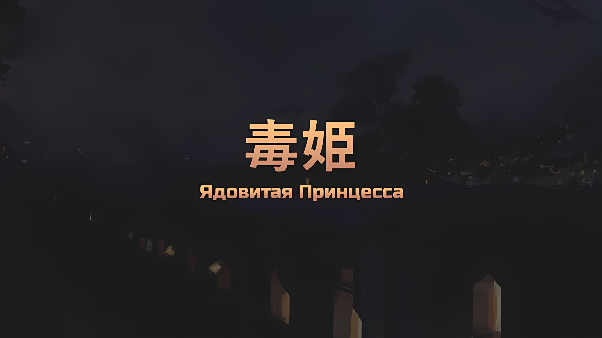
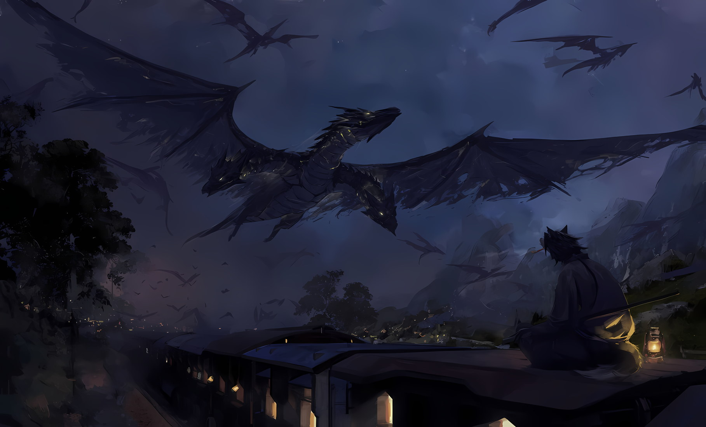
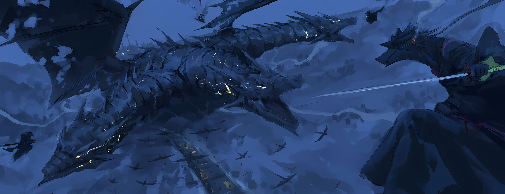
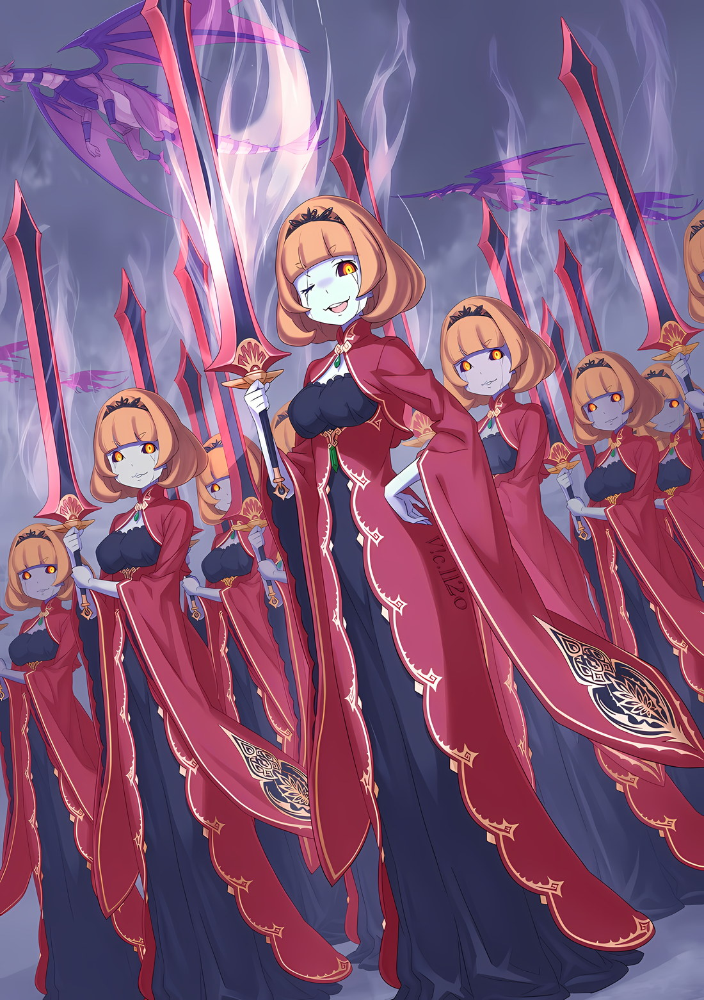

*※※※※※※※※※※※*

…В то же самое время, когда ладонь Петры Лейт заставила опухнуть щеку Нацуки Субару, а неожиданное заявление Флопа О'Коннелл привело Медиум О'Коннелл в замешательство.

???: …Как и ожидалось, вы даже не стали дожидаться нашего прибытия.

Глядя вверх и грызя свое кисэру, сильнейший шиноби Городов-государств томно пробормотал это.

Ссутулив свои и без того покатые плечи и сидя со скрещенными ногами, человек-волк… Халибель, среди струящегося ночного пейзажа, в тихие вечерние часы сохранял бдительность на крыше драконьей повозки.

Незадолго до этого соединенные драконьи повозки подверглись нападению.

Благодаря ребенку, который заметил внезапное нападение раньше Халибеля, им удалось избежать этой опасности, но подобные происшествия случались нечасто. Следить за тем, чтобы этого не происходило, являлось обязанностью Халибеля.

Халибель: После этого взгляд маленькой Аны стал чертовски суровым. Я должен наверстать упущенное.

Молодая девушка, которую он знал с давних пор благодаря родственным связям, заплатила невероятную цену за то, чтобы по этому случаю отправиться в Империю.

В сопровождении Халибеля она взяла на себя роль эмиссара Городов-государств. …Вопреки ожиданиям, что речь идет о неиспользованных деловых возможностях, которые воспламенили ее душу торговца, на самом деле ее целью были поиски исчезнувшего друга.

Она была девушкой, которая не хотела проявлять слабость. Конечно, в этом она никогда не признается.

Халибель: Именно поэтому она попросила давно знакомого мужчину средних лет не протягивать ей руку помощи.

Сказав это, Халибель медленно встал.

Состоящие из нескольких драконьих экипажей, соединенных вместе, эти повозки без отдыха тянуло множество наземных драконов… Выдающееся инженерное творение, поистине характерное для жадной Империи, которое в полной мере демонстрировало бессистемность «Божественной Защиты Уклонения от Ветра».

Тем не менее, Халибель никак не мог привыкнуть к этому неестественному ощущению.

Несмотря на то, что колеса спотыкались на неровной дороге, ни ветра, ни тряски не ощущалось. В Карараги было мало наземных драконов, и обычно использовались именно звериные повозки, так что он был хорошо знаком с тряской и медлительностью.

И, говоря о неестественных ощущениях, к которым он не привык…,

Халибель: Черт, ходячих трупов и так было довольно немало… судя по всему, летающие драконы тоже могут становиться «Зомби».

Просунув палец в прореху своей одежды японского стиля, Халибель небрежно почесал живот и проворчал это.

В его щелевидных глазах, которыми он вглядывался в ночное небо, отражались огромные тела с трещинами и расправленными крыльями — это были превратившиеся в нежить летающие драконы… стая «Мертвых Летающих Драконов».

Плотная стая, скрывавшая звезды, словно темные облака, медленно приближалась к соединенным драконьим повозкам.

Халибель: …Там есть один неприятный тип.

Халибель дал такую оценку присутствию среди стаи мертвых летающих драконов.

Словно заметив присутствие этого отвратительного врага, среди наземных драконов, тянущих драконьи повозки, началось волнение.

Несмотря на то, что наземные драконы слыли верными друзьями людей, они не утратили своей дикости после одомашнивания. Почувствовав надвигающуюся опасность, даже у них от страха екнуло сердце.

Соединенные драконьи повозки были большим изобретением, но такая опасность присутствовала всегда. Наземные драконы и без того были очень чуткими существами. Если один из них пугался, то страх распространялся подобно цепной реакции…,

???: …ДОДОГЮЮЮН!!!

Как раз в тот момент, когда Халибель забеспокоился об этом, раздалось пронзительное ржание, словно прорвавшее сумерки.

Смертоносный вопль о приближающейся угрозе, парализовавший наземных драконов страхом, — это не совсем то, что было на самом деле.

Ржание раздалось возле самой крайней повозки, где несколько десятков наземных драконов выстроились в ряд, чтобы тянуть соединенные драконьи повозки; самую важную роль сыграл громкий вопль единственного черного наземного дракона.

Халибель: Хех, похоже, этот молодой парниша обладает большой мужественностью.

Благодаря быстрому и остроумному воплю черного наземного дракона, зараза страха не распространилась среди наземных драконов.

Благодаря этому удалось избежать худшей из возможных ситуаций, когда испуганные наземные драконы отказались бы от выполнения своих обязанностей, что привело бы к поломке соединенных драконьих повозок во время их движения. И как раз в тот момент, когда Халибель был под впечатлением, он внезапно осознал.

Халибель: Боже, этот молодой черный дракон на самом деле оказался самкой. Пожалуй, в ней не столько мужественности, сколько девичьего духа.

Необычно расширив свои тонкие щелевидные глаза, Халибель негромко рассмеялся, издав «Какка».

Улыбаясь, шиноби-оборотень беззаботно прогуливался подле драконьих повозок, которые продолжали мчаться вперед… Выйдя в пустое пространство, он прыгнул в небо.

Он собирался вступить в бой. С грозным врагом, которого даже «Хвалитель» счел опасным, дабы не дать ему приблизиться.

Этим грозным врагом был…,

*△▼△▼△▼△*

Субару: Оа-оа-оа, что это за чертовщина!?

Зацепившись за оконную раму в коридоре, Субару закричал, глядя на происходящее снаружи.

Закончив разговор с Рем и Луи… нет, со Спикой, в пассажирском салоне, он присоединился к Эмилии и остальным, которые с тревогой его ждали; в самый разгар доклада он получил пощечину от Петры.

Петра: Это от меня и немного от Отто-сана!

Получив физический выговор, он задумался о беспокойствах, которые он причинил девушкам, а также о том, чем он будет обременять их в будущем, и тогда он взял себя в руки.

Внезапно раздался вопль, способный расколоть само ночное небо, заставивший Субару и остальных броситься к окну.

Субару: Это черный летающий дракон… Нет, он слишком большой, чтобы его можно было сравнить с летающим драконом!

Беатрис: Таких размеров, в самом деле, это не летающий дракон. Несомненно можно сказать, что это класс Дракона, я полагаю. И более того…

Эмилия: …У этого Дракона три головы!

Над Субару и Беатрис, прильнувшими к оконной раме бок о бок, Эмилия также прижалась к окну и воскликнула это; не только Субару, но и жители этого альтернативного мира признали в нем нетипичное существо внушительной внешности.

Посреди ночного пейзажа, взмывая в небо, словно мчась наперегонки с соединенными драконьими повозками, грозный колоссальный черный Дракон взмахнул своим массивным телом и тремя головами.

По его величественной фигуре и широким крыльям пробегали трещины, а три пары золотых глаз подчеркивали его присутствие даже в ночном небе, наглядно демонстрируя его истинную природу.

Субару: Зомби Дракон…!!!

Рам: Черный Дракон с тремя головами… Не может быть, «Трехголовый» Вальгрен?

Субару: Ты его знаешь, старшая сестра!?

Все еще прижимаясь щеками к оконному стеклу, троица Субару, Беатрис и Эмилия обратили свои взоры на стоящую позади них Рам. Она, обняв себя за локоть, смотрела на Дракона своими светло-малиновыми глазами,

Рам: Это печально известный Злой Дракон, который однажды посеял хаос в городе на границе между Империей и Королевством.

Субару: Так я и думал! Само собой разумеется, что уникальный монстр с таким прозвищем будет грозным…

Рам: Через несколько лет после «Войны Полулюдей» этот Дракон почти дотла сжег Торговый Город. Кроме того…

Субару: Кроме того, что? Есть что-то еще?

Рам: …Это была та битва, в которой глава семьи двух предыдущих поколений, бабушка Розвааля-сама, потеряла свою жизнь.

После секундного колебания слова Рам заставили Субару и остальных затаить дыхание.

Угроза со стороны врага становилась гораздо более ощутимой, когда человек узнавал, что жертвой стал родственник близкого ему человека. Тем более, если речь шла о бабушке Розвааля. Она никак не могла быть слабой.

Этот ужасающий Злой Дракон был остановлен, и в настоящее время его сдерживал Халибель, однако…,

Танза: Эм, а кто эти люди-волки?

Придвинувшись поближе к Субару, Танза выглянула в окно, не в силах скрыть своего удивления от разворачивающегося снаружи противостояния.

Несмотря на то, что она была удивлена, ее формулировка не являлась ошибочной, сколь бы сильно это ни казалось.

Что касается внешнего вида сражающегося Халибеля, то ее фраза «эти люди-волки» была действительно точной.

Причиной тому было…,

Субару: Похоже, что там около трех Халибелей-сан…

Эмилия: Нет, их там четверо, Субару. Похоже, один из них все это время находился на спине Дракона, пытаясь подрезать ему крылья.

Беатрис: В данном случае Бетти не думает, что дело в точном количестве, в самом деле…

Халибель, известный как сильнейший шиноби Городов-государств, в одно мгновение отразил смертоносную атаку Сфинкс. Уже одно это действие соответствовало его репутации, но битва, происходившая сейчас на глазах у Субару и компании, была не менее, если не более, достойна этой репутации.

Для него это не было большой проблемой. Халибель, подобно ниндзя, разделил себя на несколько клонов и вступил в воздушный бой со Злым Драконом.

Учитывая эту скоростную схватку, вполне очевидно, что Танза, не знакомая с Халибелем, могла обмануться иллюзией и подумать, что истинная форма сильнейшего существа Городов-государств — это группа шиноби, состоящая из множества людей, называемых «Хвалителями».

В любом случае…,

Спика: Уау!

Рем: Я думаю, что этот Злой Дракон наш не единственный враг. Не лучше ли нам перегруппироваться со всеми остальными?

Спика повысила в тревоге голос, а Рем, которая держала ее за руку, предложила перегруппироваться.

В идеале Субару хотел бы поделиться всеми подробностями, касающимися обращения со Спикой, в более спокойной обстановке. Однако, учитывая то, как развивалась ситуация, подобной роскоши у них не было.

Субару: Да, ты права… Мы должны отправиться ко всем остальным! Авель и другие тоже должны быть в движении. Прямо сейчас мы… Агх!?

Эмилия: Субару!?

Следуя предложению Рем и Спики, Субару как раз собирался предложить отправиться в другое место.

Внезапная жгучая боль в груди Субару прервала его слова, и Эмилия поддержала его тело, когда он попытался присесть.

Однако не только Субару столкнулся с этим странным явлением.

Танза: …Вы в порядке?

Беатрис: Быть вырученной тобой унизительно, я полагаю, олениха…

Рам: Даже Беатрис-сама… Барусу, что случилось?

Как и Субару, внезапная боль ошеломила Беатрис, и она выразила свое недовольство, когда Танза быстро поддержала ее.

Рам задала вопрос, став свидетелем этого обмена, на что Субару ответил: «Я-я не знаю».

Субару: Я просто внезапно почувствовал боль в груди… Аа!?

При этих словах Субару оттянул вырез своей одежды и растерянно расширил глаза.

Увидев то же самое, что и Субару, Эмилия с Рам в замешательстве нахмурили брови.

Там был след, похожий на распухший красный рубец… И это был не просто обычный след.

Беатрис: Что это…? Он имеет форму чьего-то глаза?

Субару: А, так ты тоже это видишь? Эта метка в форме глазного яблока… Подожди, только не говорите мне, Беако! Ты…

Беатрис: …На нежной коже Бетти тоже есть такая метка, в самом деле.

На груди Субару появилась метка размером с детскую ладонь… деформированный рисунок, изображающий глаз.

Похоже, что на Беатрис была нанесена точно такая же эмблема, и Танза, заглянув в вырез ее платья, глубокомысленно кивнула в подтверждение этого.

Субару: Только я и Беако? Почему все остальные не пострадали?

Рам: Мерзкий.

Субару: Я искренне за всех волнуюсь! Ты действительно думаешь, что я скажу что-то настолько гадкое, учитывая ситуацию и мои нынешние размеры?

Убедившись, что у остальных нет такой же метки, которая все еще пульсировала болью, Субару потер ее у себя на груди и нахмурился.

Это был аномальный знак, появившийся в данной ситуации. Разумеется, очевидно, что это были действия, предпринятые кем-то из противников Субару и его компании, но намерения, стоявшие за этими целями, были неясны.

Возможно, из-за контракта, связывающего Субару и Беатрис, что-то, наложенное на одно из их тел, могло проявиться и на другом.

Субару: Ничего хорошего, границы неясны сколько бы я об этом ни думал. Лучше всего было бы поговорить с кем-нибудь сведущим в этом вопросе. А пока нам нужно убираться отсюда…

Спика: Аау!!!

Рем: …Кх! Вы не должны!

В очередной раз, как только он попытался предложить им уйти, его прервали.

Взволнованные Спика и Рем с силой оттолкнули Субару и остальных от места, где они выстроились. Это был внезапный шаг, однако он оказался правильным.

…Потому что прямо над ними проломилась крыша, и силуэт врага, вооруженного огромными ножницами, с силой обрушился на то место, где несколько мгновений назад стояли Субару и компания.

*△▼△▼△▼△*

Отто: Маркграф!

Петра: Господин!

В унисон два голоса обеспокоенно окликнули его, вызвав у Розвааля язвительную улыбку.

Возможно, этим двоим было нелегко прислушиваться к его советам, и они, конечно, не доверяли Розваалю, но их искреннее беспокойство было налицо. Присущая им доброта не только говорила сама за себя, но и служила свидетельством того, что они тоже принадлежат к фракции Эмилии.

…Это отличало их от Розвааля, который в глубине души никак не мог по-настоящему с ними сблизиться.

Розвааль: …Хк, они пометили меня.

Подавив мимолетную улыбку, Розвааль распахнул рубашку, обнажив свою грудь.

Там выделялась красная припухшая метка, изображающая узор в виде глаза. Увидев это, Петра в шоке расширила глаза и прикрыла свое лицо.

При виде этой метки выражение лица Отто омрачилось, и он пробормотал: «Это…»

Отто: Маркграф, ты сказал «пометили»? Надеюсь, это не то, о чем я подумал…

Розвааль: Это именно то, о чем ты дууумаешь~. …Скорее всего, это знак того, что нас признали врагами, или, возможно, назначили мишенями. В любом случае, это не очень радууушный~ звоночек.

Петра: Врагами или мишенями?

Глаза Отто мимолетно переместились на Петру, стоявшую рядом с ним. Она быстро уловила подтекст его взгляда и пылко покачала головой в ответ.

Судя по их реакции, ни на Отто, ни на Петре этой эмблемы не было.

Хотя это уже само по себе было облегчением…,

Петра: Какой эффект оказывает эта эмблема?

Отто: …На мой взгляд, это может быть медленное высасывание жизни, способность читать мысли цели или просто средство постоянного определения местонахождения помеченного человека.

Петра: Ты намеренно перечислил сначала самые худшие эффекты, не так ли? Значит, наиболее вероятной является возможность того, что эта метка служит для определения местонахождения?

Розвааль: Действительно, вы оба поииистине~ проницательны.

Розвааль закрыл глаза, видя широкое, спокойное суждение Отто и Петры о спектре возможных вариантов.

Самый опасный вид проклятия, высасывающий жизнь, не поддавался дистанционному наложению и, пожалуй, не нуждался в рассмотрении.

Однако постоянное нахождение под прицелом из-за метки само по себе было бы проблематичным.

Розвааль: Возможно, нам придется разделиться, чтобы наши перемещения не были полностью прозрачными. При помощи Халибеля-доно снаружи, вам двоим следует держаться от меня подальше…

Отто: …Нет, кажется, уже слишком поздно.

Сразу после своего тихого ответа Отто за плечо притянул к себе Петру.

Петра, расширив глаза от шока, лицезрела, как огромная фигура внезапно влетела в окно прямо рядом с ней, попав в коридор соединенных драконьих повозок.

От незваного гостя, с ног до головы облаченного в черные доспехи и вооруженного большими ножницами, исходила злобная аура… это была нежить.

Петра: …Хк.

Подавив крик, Петра из объятий Отто указала на врага рукой.

Восхваляя храбрость девочки, которая в неожиданной ситуации попыталась взять инициативу на себя, Розвааль сделал шаг вперед и вытянул свою ладонь, прежде чем противник успел взмахнуть вверх большими ножницами.

Он, подобно мечу, молниеносно просунул руку в щель шлема, закрывавшего лицо врага, и, напевая заклинание, вогнал свои пальцы в глазницы противника.

Розвааль: Гоа.

В одно мгновение пламя объяло и вырвалось из головы этого существа, заставив его броню разорваться изнутри.

Несмотря на яркое появление, незваный гость не нанес ни одного удара. Полагая, что он выбрал наилучший вариант действий, Розвааль обернулся, но тут же понял, что был слишком оптимистичен.

Один за другим солдаты в таком же снаряжении стали врываться в повозку с крыши и из коридора.

В мгновение ока вся соединенная драконья повозка превратилась в движущееся поле боя.

*△▼△▼△▼△*

Медиум: Авель-чин, сюда! Быстрее! Братух, ты тоже беги!

Флоп: Сказать по правде, сейчас я бегу в полную силу, дорогая сестра!

Повысив голос, Медиум изо всех сил защищала тыл, отражая атаки противника своими двойными мечами.

Варварские мечи и огромные ножницы яростно лязгали, проскальзывая сквозь созданные ею проемы, а двое защищаемых ею людей… Винсент и Флоп, убегали от вражеского натиска.

На первый взгляд, это выглядело жалко, но на то были свои причины, помимо того, что эти двое были соответственно раненым и небоевым.

Флоп: Ваше Превосходительство Император-кун! Вы в порядке? Пожалуйста, не говорите мне, что вас отравили! Я буду обеспокоен, если вы не сможете выполнить свое обещание!

Винсент: …Хм. Если уж ты беспокоишься, то хоть немного скрывай свои амбиции. Это непочтительно.

Флоп: Возможно, для вас это будет неожиданностью, поскольку вы окружаете себя амбициозными людьми, но в мире есть люди, которые обращаются к вам по причинам, отличным от амбиций, Ваше Превосходительство Император-кун!

Винсент фыркнул на Флопа, который, поддерживая его за плечо, бросил такое необдуманное замечание.

Выражение лица Винсента напряглось, когда он ощутил слабую боль, словно ему пронзили грудь. Казалось, что эта внезапная боль вместе с красным следом была шипом, впивающимся в его плоть.

Сразу же после этого на Винсента обрушилось нашествие врагов, которых теперь сдерживала Медиум. Он был убежден, что сейчас на него напало то же самое существо, которое уже однажды в прошлом покушалось на его жизнь, причем в еще более неприятном виде, чем в тот раз.

Этим было…,

Флоп: Эта болезненная рана на груди…

Винсент: Хотя это и раздражает, но, скорее всего, это Злой Глаз одного из моих родственников, Палладио Манески. Во время «Церемонии Императорского Отбора» он умер в результате своего поражения, однако, похоже, ему не удалось упокоиться с миром.

Флоп: Злой Глаз…! Значит, этот эффект…?

Винсент: Тогда это было нечто, что позволяло ему передавать свой голос кому-то, чье местоположение он знал, но после его смерти точность этого эффекта, похоже, повысилась.

Отвечая на вопрос Флопа, Винсент вспомнил брата, которому он однажды позволил умереть.

Среди своих братьев и сестер, претендовавших на трон Империи, Палладио считался особенно грозным противником, однако причиной его поражения в конечном итоге стало то, что он слишком самонадеянно относился к силе своего Злого Глаза и не смог в полной мере использовать эту способность.

Ему и в голову не приходило, что Палладио сможет исправить эту ошибку после своей смерти, однако…

Винсент: …Нет, даже если он умер, его образ жизни нельзя так просто изменить. Существует нечто, что приказало Палладио сделать это со мной.

Флоп: Если он ваш брат, то этот Палладио тоже должен быть членом Императорской Семьи, верно? Какой бы нежитью он ни стал, для такого человека просто делать то, что ему говорят…

Винсент: …Ты, в общем-то, правильно догадался. Если бы Палладио и подчинился, то только бывшему Императору, Драйзену Волакии, либо же тому, кого он счел выше себя.

Единственным человеком, который подходил под эти критерии, был сам Винсент, однако, учитывая, что Палладио находился на стороне нежити, он был исключен из числа кандидатов еще с самого начала.

В качестве однозначного кандидата на роль нежити фигурировал Драйзен, бывший Император и его биологический отец, а в качестве важного вопроса, не заслуживающего внимания, всплыло лицо его пропавшей младшей сестры.

Но, принимая во внимание экипировку противника, с которым столкнулась Медиум, для настоящего врага оставался только один возможный вариант…

Винсент: …Ламия, хм?

Существо, которое удовлетворяло условиям подчинения Палладио и которое сопровождали жестокие солдаты с огромными ножницами… «Корпус Резчиков»; никто иная, как Ламия Годвин.

Винсент предположил, что противником был один из трех его родственников, которых он высоко ставил, когда боролся за трон Империи на «Церемонии Императорского Отбора», после чего он с силой схватился за свою ноющую грудь.

И тут…,

???: Какие же вы чертовски назойливые, мертвебляди!!!

Послышался грубый, ревущий голос, и на пути Винсента и семьи О'Коннелл появилось выхваченное лезвие.

Навскидку, солдат, шедший с противоположной стороны от Винсента и компании… мужчина с неухоженными волосами и повязкой на глазу, кромсал нежить, которая прорвалась через окно и проникла в повозку, превращая ее в пыль.

Затем, тяжело дыша, солдат заметил Винсента и компанию, и,

???: Эй! Ну-ка, подсобите! Моя сестра обессилела там внутри…

Винсент: Нет, сейчас ты обязан помочь нам.

???: А? Че ты несешь… В-в-Ва-ва-Ваше Превосходительство Император!?

Мужчина, подошедший к ним с такой грубой манерой речи, воскликнул, узнав Винсента.

Считая эту реакцию естественной, Винсент находил удовлетворение в такой реакции тех, кто вел себя нагло и неуважительно, и, подперев подбородок рукой, жестом указал себе за спину,

Винсент: Скооперируйся с той, кто стоит за моей спиной, и пресеки действия вражеских сил. С этим твоя сестра будет спасена.

???: Т-так точно! Рядовой Первого Класса Джамал Орели вас понял!

Винсент: Приложи все свои усилия, Джамал Орели. От твоей работы зависит выживание Империи.

Джамал: …Хк!

От слов Винсента одноглазый Джамал затрясся всем телом. Сразу же после этого он издал свирепый, звериный рев и, перепрыгнув через головы Винсента и Флопа, бросился на помощь Медиум, которая упорно сражалась за их спинами, принявшись сдерживать нежить.

Флоп: Эй вы, с повязкой на глазу! Сражающаяся рядом с вами Медиум является кандидаткой на пост достопочтенной Императрицы, поэтому, прошу, будьте с ней вежливы!

Медиум: Я все еще не дала своего согласия~!

В ответе Медиум на голос Флопа не было напряжения.

Позади нее Флоп ворвался в комнату, где находилась сестра Джамала, и вывел оттуда девушку в инвалидном кресле, глаза которой метались по сторонам.

Девушка вцепилась в инвалидное кресло, и из ее глаз полились слезы,

Катя: Ч-что? Что происходит? Почему, почему вы не можете оставить меня в покое…!

Винсент: …Вероятно, об этом сейчас думает каждый житель Империи.

Искренне согласившись с голосом женщины, сетовавшей на сложившуюся ситуацию, Винсент покачал головой.

Какой бы тяжелой ни была ситуация, они не могли позволить себе, чтобы колеса соединенных драконьих повозок остановились прямо здесь и сейчас.

Если они остановятся, то сколько времени потребуется драконьей повозке, чтобы снова начать движение?

Если это произойдет…,

Винсент: …Нельзя терять ни минуты. Мы должны прибыть в Укрепленный Город.

*△▼△▼△▼△*

Серена: Если вы остановите драконью повозку прямо сейчас, мы будем окружены еще большим количеством вражеских сил. Механизм соединенных драконьих повозок опирается на «Божественную Защиту Уклонения от Ветра». Так что если мы начнем движение без Божественной Защиты, то, скорее всего, опрокинемся.

Анастасия: Я знала, что это было бы слишком удобно, но это довольно большой недостаток, не так ли?

Серена раскрыла недостатки соединенных драконьих повозок, когда было предложено их остановить, ввиду ситуации, когда они были атакованы, а враги и союзники перемешались в движущихся повозках.

Как только Анастасии сказали об этом, стало ясно, что останавливаться нецелесообразно.

Анастасия: Даже так, наземные драконы мчатся уже почти полдня… если мы остановимся, то сегодня они уже не смогут начать бежать снова.

Серена: Также существует разница в живой силе между нами и нашими противниками. Это, несомненно, компенсируется мобильностью драконьих повозок. Если бы этот разрыв исчез, нас постигла бы та же участь, что и стареющего премьер-министра Беллстетза.

Гарфиэль: Сейчас не время для таких разговоров! Дед, не позволяй всем указывать тебе, что делать!

Беллстетз: Такова природа характера Верховной Графини Дракрой, не говоря уже о том факте, что меня закономерно казнят после того, как «Великое Бедствие» будет устранено…

Гарфиэль: Не будь таким чертовски решительным, чтобы так просто сдаться!

Серена сделала легкое замечание, которое трудно было расценить как таковое, и Беллстетз ответил словами, в которых не было и тени легкомыслия, на что Гарфиэль повысил голос.

Это новое нападение произошло в тот момент, когда Анастасия и Гарфиэль находились в одной комнате. В обычной ситуации Гарфиэль хотел бы присоединиться к Эмилии и остальным, однако…,

Анастасия: Мне жаль, что ты вынужден быть с нами, Гарф-кун, но благодаря тебе я, Серена-сан и остальные были спасены, так?

Гарфиэль: Тц… Я не волнуюсь о Капитане, пока с ним Рам и Эмилия-сама. А вот за Оттобро я переживаю…

Анастасия: Наш разум не исчезнет, даже если мы станем эмоциональными. Отто-кун торговец, так что не стоит волноваться, он сможет о себе позаботиться. Упс…

Гарфиэль, руки которого не выглядели особенно сильными, раздраженно зарычал, перехватывая забиравшегося в повозку охотника с большим ножницами.

Нанося молниеносные удары и сокрушительные выпады, он в мгновение ока расправился с охотником.

Затем Беллстетз, который стоял на одной стороне с Анастасией как неспособный к сражению, еще больше сузил глаза при виде избитой и раздавленной в пыль нежити,

Беллстетз: «Корпус Резчиков»… Похоже, Ее Превосходительство Ламия все-таки здесь.

Серена: Ее Превосходительство Ламия Годвин? Это тот человек, с которым я хотела бы хоть раз встретиться.

Анастасия: Неужели? Что это за человек?

Серена: Премьер-министр знает о ней больше, чем я. В конце концов, именно премьер-министр хотел, чтобы она стала Императрицей.

Серена пожала плечами и подняла свой меч, лезвие которого сверкнуло в воздухе, а Анастасия перевела взгляд на Беллстетза.

Старик, не отрицая слов Серены, кивнул, его глаза сузились настолько, что стали похожи на нити, отчего невозможно было понять, куда он смотрит,

Беллстетз: Она была женщиной, достойной стать Императрицей Империи Волакия. Если бы Винсент Авелюкс и Приска Бенедикт не принадлежали к одному поколению, она бы стала Императрицей.

Серена: Может ли быть так, что она восстала в виде нежити, чтобы прийти и осуществить это стремление? Премьер-министр, может, вас простят, если вы еще раз присягнете на верность?

Беллстетз: …К сожалению, мы с Ее Превосходительством Ламией проиграли. Это не соответствует имперскому укладу.

Серена закрыла один глаз и вздохнула, когда Беллстетз медленно покачал головой.

Похоже, серьезный ответ Беллстетза пришелся Серене не по вкусу. Анастасия тоже уловила смешанные чувства между бывшим хозяином и слугой, но не более того.

???: …Ана.

Внезапно, когда она размышляла, Анастасия услышала зов у себя над ухом и подняла голову.

Зов исходил с шеи Анастасии, от Ехидны, замаскированной под лисий шарф. Оглянувшись, темные глаза Ехидны обратились ко входу в гостевую комнату.

???: …Анастасия-сама, я вернулся.

Проследив за ее взглядом, Юлиус появился с другой стороны двери.

Статный Юлиус держал в одной руке свой рыцарский меч, а в другой стройного мужчину. Юлиусу было приказано отделиться от остальных и забрать его.

Фигура тряхнула своими длинными седыми волосами, и когда он поднял голову с жалким выражением лица,

???: Я в шооооке от того, что все это произошло так внезапно. Моя грудь горит и болит, а тут еще и этот мечник меня трясет, все это так ужасно.

Анастасия: Вместо того, чтобы жаловаться, как щебечущая птичка, не следует ли тебе поблагодарить меня и моего Рыцаря? В конце концов, ты можешь быть их целью.

???: Чегоооо!?

Это был тот, кого ранее приковали к задней части повозки, «Звездочет» Убирк.

Судя по всему, он занимал выгодное для Империи положение и служил ценным источником информации в борьбе с «Великим Бедствием». Чтобы не дать ему погибнуть, к нему был послан Юлиус.

Анастасия: C Гарфом-куном, было бы много обходных путей из-за его блужданий и дурачеств.

Гарфиэль: Я нормально дерусь! Хватит жаловаться!

Анастасия: Правда? А если бы я не попросила тебя сделать эту работу, разве ты не пошел бы вместо этого помогать Халибелю на улице?

Гарфиэль: Грааррр…!

Он зарычал с выражением, доказывающим, что она попала в самое яблочко, и клыки Гарфиэля заскрежетали.

На соединенную драконью повозку постоянно нападали враги, но следить за тем, чтобы самая большая угроза не могла к ним приблизиться приходилось Халибелю, в одиночку сдерживая Злого Дракона.

Время от времени слышался рев свирепого Дракона, сопровождаемый грохотом, который сотрясал небо… если бы он не был сильнейшим из Городов-государств, то остановить самый могущественный в мире вид было бы просто невозможно.

Юлиус: Гарфиэль, большое спасибо за то, что защитил Анастасию-сама и остальных. Я уважаю тебя за твою храбрость.

Гарфиэль: Заткнись! Как и Капитан, крутой я не слишком хорош в общении с тобой!

Юлиус: Это прискорбно. Как и в случае с Субару, я надеялся с тобой подружиться.

Гарфиэль: ГРРРРРР!!!

Гарфиэль грозно зарычал на слова, произнесенные Юлиусом ему в лицо, и выставил вперед свой кулак. Словно пересекаясь с ним, их координация разрушала нежить, которая появлялась друг за другом.

Даже если Гарфиэль и не признавал этого, два первоклассных воина прекрасно согласовывали свои действия.

Анастасия: Однако все это лишь временная мера… Я не хочу останавливать драконью повозку, но если она остановится, то это будет конец. Мы должны как-то сдвинуть ситуацию с мертвой точки, верно?

*△▼△▼△▼△*

???: АААААГГГГХ…!!!

С глубоким и мощным ревом взметнулась золотая булава.

Горизонтальный удар разом рассек нежить, облаченную в громоздкие доспехи, и враги, сорвавшиеся с вершины драконьей повозки, рассыпались в пыль еще до того, как врезались в землю.

Однако даже после того, как он расправился сразу с несколькими врагами, их количество не уменьшилось.

???: Проклятье, проклятье, проклятье! Такие хитрые трюки!!!

Разгневанный, с суровым лицом, покрытым бородой и шрамами, Гоз Ральфон зарычал, как лев.

В поле зрения Гоза был виден рой мертвых летающих драконов, застилающих небо и сбрасывающих зажатую в их когтях нежить на соединенные драконьи повозки.

Этот смелый способ транспортировки был наихудшим из всех возможных механизмов, с помощью которых вражеские солдаты могли попасть на соединенные драконьи повозки.

…Сбрасывание вниз вражеских солдат не гарантировало, что каждый из них сумеет зацепиться за соединенные драконьи повозки.

Более того, почти половина солдат не успевала за них зацепиться и, будучи сброшенными мертвыми летающими драконами, просто разбивались об землю, отчего вопиющий момент, когда от удара их воскресшие тела превращались в пыль, повторялся снова и снова.

Однако даже такое военное развертывание, которое для живого солдата можно было назвать самоубийственным поступком, превратилось в эффективное средство передвижения, которым, за счет использования мертвых солдат, можно было пользоваться, не опасаясь потерь.

И, таким образом, реализация его была…,

Гоз: …Это «Корпус Резчиков» Ее Превосходительства Ламии!

Гоз бросился защищать наземных драконов, занимавших самое важное место в передней повозке соединенных драконьих повозок, и устремил взгляд в небо, где стая мертвых летающих драконов несла самый худший ассортимент нежити.

«Корпус Резчиков» был той самой злобной группой, которая осуществила то, что в Империи Волакия стало известно как Великая Чистка.

Каждый член корпуса был облачен в доспехи, скрывающие черты лица, и, орудуя своими огромными ножницами, обрезал всех, кого считал ненужным для верховенства своего хозяина. …Такова была цель Корпуса Резчиков.

Причина, по которой название этой группы вошло в историю Империи, заключалась в том, что девочка из Императорской Семьи… Ламия Годвин, которой в то время было девять лет, уничтожила все армии Графов Среднего Класса, которые были связанны с восстанием.

Жертвы этой чистки были подвергнуты страшным мучениям, в полной мере вкусив ад этого мира.

Естественно, юная Принцесса заставляла всех своих подчиненных совершать все виды злонамеренного насилия, которое было бы непосильной ношей даже для тех, кто замарал свои руки, тем самым совершенствуя свой злобный эскадрон с железобетонной преданностью.

То, насколько сильно она контролировала сердца своих солдат, в полной мере проявилось и в этой стратегии. …Даже после смерти яд Ламии, разъедающий их души, ничуть не ослабел.

И тогда…,

???: …Боже-боже. Сколь радостно мне от того, что, несмотря на минувшие года, помнишь ты меня и моих очаровательных зверюшек.

Внезапно с высоты раздался внушающий страх, тошнотворно сладкий голос.

В этот момент Гоз, не обращая внимания на внешность врага, занес над головой свою булаву и, отразив ярко-красный удар, отскочил назад. Сразу же после этого булава, которую держал Гоз, воспламенилась.

Это было само собой разумеющимся. …В конце концов, великолепие «Меча Света» ослепительно озаряло все вокруг.

Гоз: Подумать только, что вы сами решитесь спуститься на поле боя…! Ваше Превосходительство Ламия Годвин!!!

Ламия: Неужели это столь удивительно? Сему телу такой выбор как нельзя под стать, разве не так?

Сжав коренные зубы, Гоз уставился вперед, и в его поле зрения появилась благородная нежить, которая завораживающе улыбалась.

Кроваво-красное роскошное платье, ослепительное множество украшений и природная краса, присущая Императорской Семье Волакия, из-за чего стоимость предметов, украшающих ее красоту, резко падала. …Однако и это, в сочетании с бледной потрескавшейся кожей и жуткими золотыми радужками, делало ее лишь тенью прежней себя.

В прошлом, во время «Церемонии Императорского Отбора», «Ядовитая Принцесса» Ламия Годвин боролась за трон с Винсентом Волакией и могла стать Императрицей… Словно в подтверждение того, что полностью изменилась, она посмотрела вниз на ту половину своего тела, которую Гоз раздробил своей контратакой.

Однако там, где другая нежить рассыпалась бы в пыль от такого удара, тело Ламии не разлетелось вдребезги. Вместо этого трещины затянулись сами собой, восстанавливая ее первоначальную форму.

Гоз: Это тело…

Ламия: Бессмертное тело, которое не исчезнет, сколь бы сильно его ни крушили и ни ломали… увы и ах, но сие тело не настолько удобно, чтобы я могла хвастаться им подобным образом.

Ламия, нежно поглаживая свою восстановленную часть тела, этой же рукой взяла в руки «Меч Света», словно желая показать, что она действительно оправилась. В ее руках ослепительная красота непоколебимого драгоценного меча казалась еще более кощунственной.

Гоз нахмурился из-за этого факта, на что Ламия пробормотала: «Как некрасиво».

Ламия: Ты и в Кристальном Дворце не мог угомониться и спокойно поболтать, однако же не мог бы ты перестать делать столь страшное лицо, Генерал Второго Класса Ральфон?

Гоз: Гхх…

Ламия: Ах, так ты стал Генералом Первого Класса? Я слышала об этом. Выходит, братец Винсент восстановил систему «Девяти Божественных Генералов»? Это как раз в его духе.

Поднеся руку, не держащую «Меч Света», к подбородку, Ламия раздвинула губы в стороны.

Эти жесты и речь были безошибочно присущи Ламии, с которой Гоз общался еще при ее жизни, и его одновременно ужасала и возмущала техника, которая позволяла нежити копировать ее прежнее поведение.

Ламия, безразличная к его внутренним мыслям, оглядела доспехи Гоза сверху донизу, сказав,

Ламия: «Девять Божественных Генералов» организованы таким образом, что восхождение на вершину измеряется исключительно силой. Это идеальный способ собрать безмозглых, легко управляемых пешек.

Гоз: …Безусловно, частью контекста, стоящего за восстановлением Его Превосходительством «Девяти Божественных Генералов», было намерение подготовить контрмеры против нынешнего «Великого Бедствия». Это то, что я признаю.

Ламия: Однако, судя по тому, как ты это говоришь, у тебя есть возражения?

Гоз: При всем своем уважении!

Заявление Ламии прозвучало так, словно она похвалила мысли Винсента.

Поговаривали, что до того, как они стали противостоять друг другу на «Церемонии Имперского Отбора», Ламия очень любила Винсента. Хотя жизнь и смерть разделили их пути, ее к нему доверие сохранилось даже после смерти.

Однако…,

Гоз: Ваше Превосходительство Ламия, как много вы знаете о том времени, когда вас не было в живых?

Ламия: Какой странный вопрос. …К сожалению, я не ведаю ничего о том времени, когда была мертва. Прямо сейчас я как раз в процессе сбора информации о различных произошедших событиях. Не отказалась б я, если б ты меня немного просветил.

Гоз: Тогда только одно! При всем уважении к вам, я бы хотел вас поправить!

Ламия: …

Гоз: Как справедливо заметила Ваше Превосходительство Ламия, все «Девять Божественных Генералов» нынешней эпохи обладают большими способностями. Все они сильные личности, которые способны затмить даже меня… но среди них нет никого, кто был бы легко управляемой пешкой!

Выпятив свою грудь, украшенную золотыми доспехами, Гоз выразительно похвастался этим.

Если предположить, что, готовясь к битве с «Великим Бедствием», Винсент восстановил «Девять Божественных Генералов» в надежде получить пешки, которые будут делать то, что им прикажут, то можно сказать, что его план провалился.

Каждый Генерал Первого Класса был закоренелым нарушителем спокойствия, и не могло быть и речи о том, чтобы сделать это так просто.

Гоз: Все не так, как считает Ваше Превосходительство Ламия, великолепие Империи не сводится только к Его Превосходительству!

Ламия: …Интересно, может ли это быть оскорблением братца Винсента?

Гоз: Нет! Никогда! Никоим образом, Ваше Превосходительство Ламия!

На сузившиеся глаза Ламии и несколько резкий тон, которым она произнесла свои слова, Гоз покачал головой.

Ламия была возмущена его отношением к Винсенту, однако Гоз также был чувствителен к любым проявлениям непочтительности или грубым высказываниям в адрес Его Превосходительства Императора. Однако с тех пор, как было принято решение покинуть столицу Империи, его позиция несколько изменилась.

На это повлиял не сам Гоз, а скорее перемена в Винсенте.

Гоз: «Я полагаюсь на твою работу», — сказал он мне.

Ламия: …Что ты только что сказал?

Гоз: Ваше превосходительство Ламия, Его Превосходительство Винсент Волакия, которого вы знали, был действительно превосходен! Но! Теперь! Теперь даже больше! Его Превосходительство Император меняется, стремясь к еще большему совершенству!!!

Ламия: …

Гоз: Отныне Империя Волакия будет процветать все больше и больше! По этой причине мы не можем допустить, чтобы препятствия со стороны тех, кто когда-то умер, оставались неконтролируемыми!

Гоз и Ламия были схожи в том, что оба хотели, чтобы Император был идеален. Но решающее различие между ними заключалось в соответствующих знаниях, полученных за прошедшие девять лет.

Тот, кто продолжает идти вперед по течению времени, оставляет позади тех, кто прекратил свой шаг; это было фактом.

Гоз: Мудрый человек, который не прекращает своего продвижения вперед! Превосходя ожидания и предсказания тех, кто остановился, и стремясь еще дальше! Это и есть вершина Империи Волакия — Его Превосходительство Император!

Подняв вверх пылающий наконечник своей булавы, Гоз отбросил колебания и устремился вперед.

До этого момента его любовь и почтение к Ламии, члену Императорской Семьи Волакия, несмотря на ее изменившуюся внешность, сковывали Гоза. …Но эти оковы были полностью разорваны более сильной и пылкой преданностью.

Гоз: ОООААААГХ…!!!

Издав могучий рев, одиночный взмах Гоза прочертил полукруг и обрушился на Ламию.

Обладая непревзойденной геркулесовой силой, удар Гоза, использующего всю свою мощь, было нелегко заблокировать, даже если противником был один из «Девяти Божественных Генералов». А уж тем более это было непросто для тонкой женской руки, пусть и держащей «Меч Света».

В действительности Ламия даже не попыталась блокировать удар Гоза «Мечом Света».

Ламия: Со столь дурной головой ты много болтаешь, Генерал Первого Класса Ральфон. …Я весьма впечатлена, и поэтому сообщу тебе.

Ее тонкие губы шевельнулись, и Ламия с прекрасной улыбкой устремила свой взгляд на Гоза.

Фигура женщины целиком приняла на себя наконечник нисходящей булавы и, не оказав ни малейшего сопротивления, разбилась вдребезги, словно керамика.

Сразу же после того, как она заявила о своем намерении что-то ему рассказать, ее превратили в пыль без всякой надежды на восстановление.

Конечно, существовал еще вопрос, поднятый ранее на военном совете. Даже если нежить была побеждена, оставалась вероятность того, что она снова восстанет при помощи так называемого Жука-ядра, обнаруженного магами Королевства.

Гоз: Даже так…

Поражение Ламии здесь должно стать переломным моментом в ситуации.

Если у «Корпуса Резчиков» больше не будет человека, который отдавал бы им четкие приказы, зависящие от наличия или отсутствия командира… Нет, разница в их способностях уже окажется преимуществом его стороны.

Эта уверенность Гоза была…,

???: …Ты слушаешь, Генерал Первого Класса Ральфон?

Гоз: …Хк!?

И снова, в тот момент, когда тошнотворно сладкий голос коснулся его ушей, булава Гоза взметнулась прямо у него за спиной; на своем пути, она врезалась в тело противника и, пробив туловище, рассекла его надвое со звуком, похожим на разбивающуюся керамику.

Увидев в углу своего зрения, как все это разбилось и унеслось ветром, Гоз ахнул.

Ибо у врага, по которому он рефлекторно ударил, у того, кто превратился в пыль и растворился, было то самое лицо, которого уже не должно было быть.

Причина заключалась в том, что оно было таким же, как у той, кого Гоз победил собственными руками всего мгновение назад.

???: Хоть ты и редко говоришь умные вещи, но все именно так, как ты и сказал.

Гоз: Невозможно…

Столкнувшись со странным зрелищем, которого никогда не должно было быть, его рука, сжимавшая булаву, начала трястись.

Было ли это от гнева или от каких-то других эмоций, не мог понять даже сам Гоз. Но что было несомненно, так это то, что происходящее перед ним являлось кощунством.

Кощунством по отношению к Империи Волакия, которой «Рыцарь Лев» Гоз Ральфон поклялся в верности.

???: …Это война на уничтожение, между нами, оставшимися в прошлом, и всеми вами.

???: …Это война на уничтожение, между нами, оставшимися в прошлом, и всеми вами.

???: …Это война на уничтожение, между нами, оставшимися в прошлом, и всеми вами.

Провозгласив это, Ламия Годвин, которая должна была быть разбита вдребезги, улыбнулась Гозу.

…С неисчислимыми «Мечами Света» в руках, бесчисленные «Ядовитые Принцессы», несчетные Ламии Годвин, они все улыбались ему.
