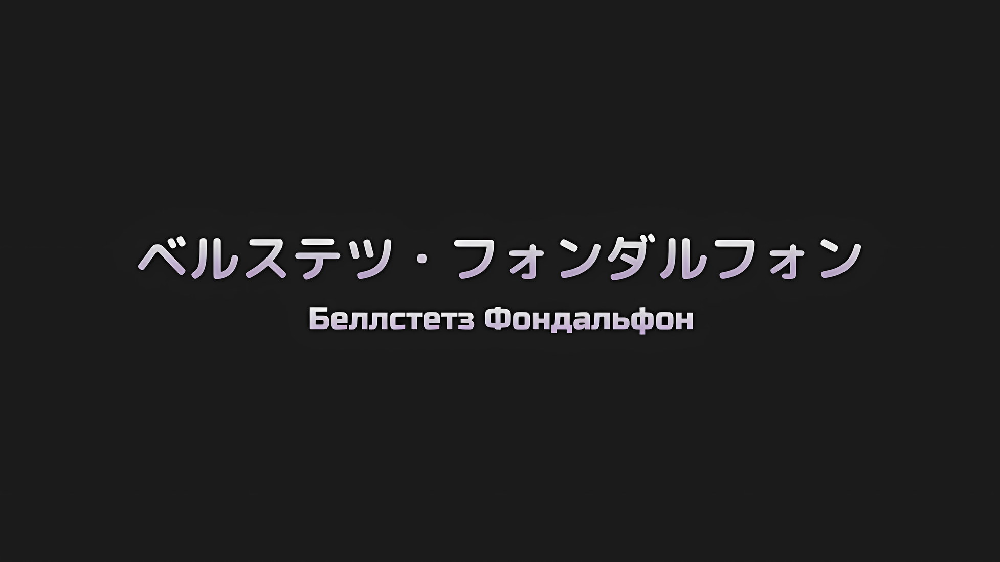
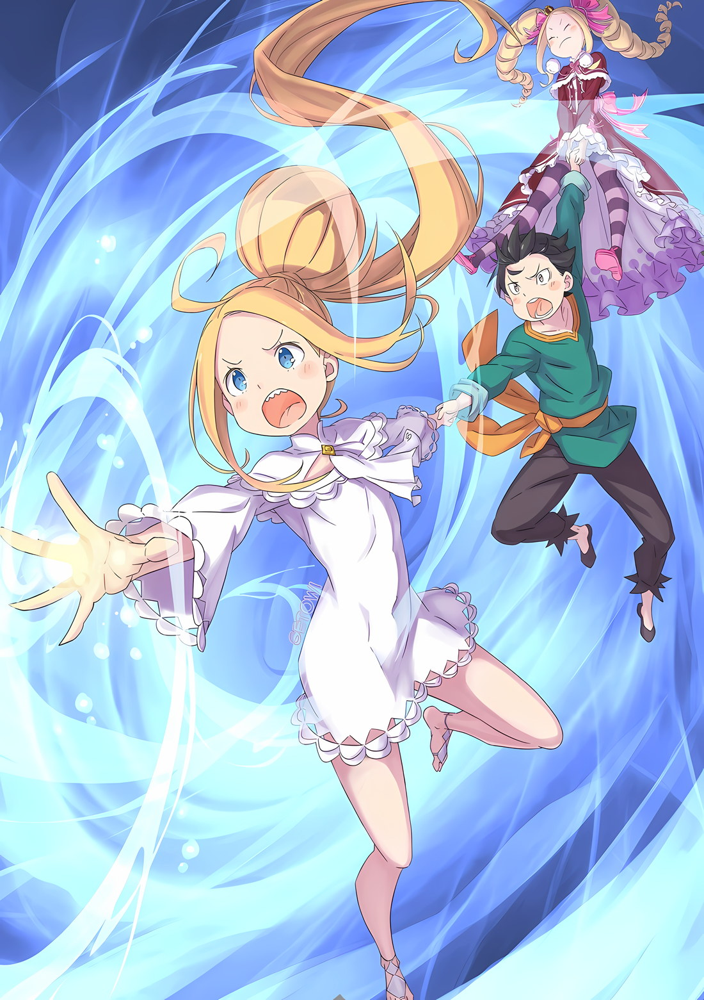

*※※※※※※※※※※※*

Ламия: Беллстетз, на тебе линия фронта. Удерживай их здесь даже ценой собственной жизни.

Беллстетз: Да, Ваше Превосходительство. Берегите себя.

…Это был их последний разговор.

Если спросить, основана ли их связь на так называемой «сильной привязанности», выходящей за рамки простого профессионального отношения «хозяин — слуга», то ответ был бы отрицательным.

Тем не менее, чувствуя огромный потенциал в ее интеллекте и поведении, он, используя накопленную годами мудрость, стремился проложить ей путь, направляя ее к трону, на котором должен восседать Император.

Даже не испытывая к ней преданности или страсти, их отношения «хозяин — слуга» были искренними.

Ее не учили считать от одного до десяти. И все же эта особа, разобравшись с числом «один», сразу же постигала «сто», а затем и «сто один».

Она была способна самостоятельно определить свою и чужую роль, соответствующую их способностям, и обязанности, соответствующие их положению.

Он не был одарен боевыми способностями, но всегда жаждал стать Волком Меча Империи, однако так этого и не достиг.

Не снискав уважения окружающих, он мог жить лишь в презрении, но тот факт, что она сочла его полезным, пожалуй, заслуживал благодарности.

Поэтому в последних словах, которыми они обменялись, не было ни капли обмана.

Во время «Церемонии Императорского Отбора» ему было строго приказано стоять на своем, даже если это означает рисковать своей жизнью, и он твердо решил так и поступить.

Не в силах провозгласить себя Волком Меча, это была последняя служба человека, который попросту стал слишком стар.

Несмотря на то, что он являлся бесстрастным слугой, он был полон решимости стать мучеником, чтобы исполнить свой долг.

И все же Беллстетз выжил.

А госпожа, надеявшаяся на его безопасность, лишилась своей жизни.

И по сей день Беллстетз Фондальфон продолжал жить в позоре.

Не выполняя своих обязанностей, занимая положение Императора, ведущего Империю к упадку, он оставался в неведении о замыслах, стоящих за развернувшимся «Великим Бедствием». Теперь именовать себя Волком Меча было бы не более чем высокомерием и бесчестием.

Не выполнив ни одного из данных ему приказов, он жил и жил в позоре.

*△▼△▼△▼△*

???: Генерал Первого Класса Ральфон, что на тебя нашло?

???: Не слишком ль это нехарактерно для человека, питающего симпатию к Императорской Семье Волакия?

???: Или, быть может, ты больше не благоволишь мне с тех пор, как я потерпела поражение на «Церемонии Императорского Отбора»?

Один и тот же голос исходил из разных уст, и Гоз Ральфон оказался под неумолимым взглядом бесчисленных золотых глаз.

Гоз Ральфон, облаченный в золотые доспехи того же цвета, что и эти глаза, исказил шрамы на своем лице и стиснул коренные зубы от ужасающей реальности, отразившейся в его взгляде.

Изо всех сил он нанес сокрушительный удар своей булавой.

Кровь Волка Меча Империи текла в жилах Гоза, и он с криком неповиновения сразил Ламию, уважаемого члена Императорской Семьи, теперь считающегося врагом.

Разрываясь на части от душевной боли, вызванной его поступком, Гоз наконец осознал мрачную истину.

…«Великое Бедствие», несомненно, грозило уничтожить Империю Волакия.

Гоз: Ради чего…!

Когда Гоз скрежетал молярами от ярости, перед ним стояла Ламия… Или, точнее, несколько Ламий, склонивших головы в унисон.

Вид ее каскадных оранжевых волос, ниспадающих на стройные плечи, разжег в Гозе пламя гнева.

Гоз: Почему вы допускаете эту имитацию?! Такое… Такое кощунство недопустимо! Вы насмехаетесь над жизнью Ее Превосходительства Ламии!!!

Охваченный гневом, с дрожью в голосе, когда набегающие слезы вытеснялись от кипящей крови, Гоз обратился к бесчисленным клонам Ламии, стоящим перед ним.

Однако в ответ на его искреннюю мольбу Ламии дружно приложили тыльные стороны ладоней к своим губам, а затем игриво произнесли,

Ламия: Не пойми меня неправильно, Генерал Первого Класса Ральфон. Сие деяние рук моих, а не то, что мне навязал кто-то другой.

Гоз: …Что, вы…

Ламия: Эта Ведьма весьма ригидна в своем мышлении. Коли я могу воскреснуть после своего уничтожения, то я, безусловно, также могу воскреснуть и до него. Сосудов сотворить можно сколь угодно много, поэтому все, что мне нужно сделать, это разбавить источник и заполнить их все. Как только это будет интуитивно понято… Что ж, чего-то столь сказочного, как это, вполне можно достичь, не так ли?

Грациозно улыбаясь, Ламия Годвин, на бледном лице которой играл озорной румянец, с гордостью демонстрировала множество версий себя, отражающих остроумие времен ее жизни.

Гоз: …

Видя подобное сну состояние, описанное Ламией, Гоз мысленно не мог не согласиться.

Ламия, бесконечно множась, кощунственно копировала собственное существование. И каждая из этих Ламий держала в руках «Меч Света», символ Империи.

Если это не сон — или, скорее, кошмар, — то что же это такое?

Ламия: Знаешь, Генерал Первого Класса Ральфон, сны нельзя разбить наяву. Почему бы тебе не признать это… и, быть может, примкнуть к нашей стороне?

Гоз: …Что, что вы имеете в виду?

Ламия: Ничего сложного. Если бы ты умер, то оказался бы в том же положении, что я и остальные. Так почему бы не выбрать сторону победителя как можно скорее?

Ламия, сжимая в руках меч и наклонив голову, поманила Гоза.

Если кто-то падет в бою, он пополнит ряды армии нежити Ламии. Это была реальность, разворачивающаяся на поле боя, но представить ее было невыносимо тяжело для психики.

Непоколебимо верный имперский солдат Гоз и разделяющие его взгляды солдаты, пав, без раздумий присоединятся к тем, кто стремится уничтожить Империю.

Точно так же, как это сделала Ламия Годвин, некогда боровшаяся за трон Императрицы Империи.

Здесь, по завершении строительства, должна была возникнуть Империя нежити. …В стране Волка Меча не будет видно и тени.

Гоз: Я недостоин ваших слов, Ваше Превосходительство Ламия!

Крепко зажмурив веки, Гоз поднял лицо и встретился глазами с Ламией.

Перед лицом сильного духа Гоза красиво изогнутые брови Ламии нахмурились.

Ламия: Ты, похоже, намерен ответить отказом.

Гоз: Как бы ни была щедра ваша милость, Ваше Превосходительство Ламия! Я, Гоз Ральфон, должен почтительно отказаться!

Ламия: Как и ожидалось, ты отклонил мое предложение.

Глядя в сузившиеся золотые глаза Ламии, Гоз подумал о видении, которое он узрел в момент своего закрытого самоанализа.

Видение, в котором он, погасив собственную жизнь, стал нежитью, как Ламия и другие, с бледным лицом и золотыми глазами, орудуя своей булавой, чтобы уничтожить Империю… Он уничтожил это видение наповал.

Полностью уничтожив окутавшую его иллюзию, он зарычал.

Гоз: Я должен исправить свое предыдущее заявление! Я сказал, что ни один из «Девяти Божественных Генералов» не находится под полным контролем Императора! Я — верная пешка Его Превосходительства Императора! Независимо от того, что могут делать другие! Я и только я! Желаю оставаться таковым!!!

Отвергнув судьбу стать предвестником разрушения в смерти, он жаждал остаться живым слугой Его Превосходительства Императора.

Таков был избранный путь Гоза Ральфона как Волка Меча Империи.

Глубокие мысли, возвышенные идеалы — все это он оставил своему властителю Винсенту, намереваясь лишь исполнить отведенную ему роль.

А именно…,

Гоз: Я — «Пятый» из «Девяти Божественных Генералов», избранных Его Превосходительством Императором Винсентом Волакией! Я — Гоз Ральфон!!!

Он поднял свою золотую булаву, заявляя о своем намерении противостоять бесчисленным Ламиям, не делая ни шагу назад.

В следующее мгновение множество Ламий, размахивая своими «Мечами Света», ринулись на Гоза, так смело заявившего об этом. Одно прикосновение меча — и искрящееся пламя Волакии сожжет человека до самой души.

Но, прежде чем он успел коснуться, мышцы Гоза запульсировали, и его булава взметнулась в воздух.

Гоз: …Кх.

С непоколебимым намерением удар Гоза пришелся в бок атакующим Ламиям, одним махом разнеся около пяти из них и превратив их хрупкие, похожие на фарфор тела в пыль.

Наблюдая за этим зрелищем, оставшиеся Ламии расширили глаза, выражения их лиц переменились.

Они воззрились на упрямого и прямолинейного Волка Меча и жестоко улыбнулись.

Ламия: Сколь храбро не рычи и не буйствуй, после своей смерти ты все равно станешь моим рабом.

Гоз: Если этому действительно так трудно сопротивляться! Тогда я превращусь в камень прежде, чем закончится моя жизнь! Я останусь непоколебимым, чтобы предложить свой последний акт верности Его Превосходительству Императору!!!

Он взмахнул своей булавой вверх, рассчитывая на то, что ни одна из собравшихся Ламий не сбежит.

Если бы Ламии, владеющие «Мечами Света», рассредоточились по соединенным драконьим повозкам, их сияющий свет мог бы испепелить Винсента. Он был полон решимости этого не допустить.

И для этой цели всегда присутствовала колоссальная фигура «Рыцаря Льва». В своей ярости Гоз Ральфон рванул вперед.

*△▼△▼△▼△*

Ламия: …Похоже, ты закалил в себе доблестную решимость, но, увы, как жаль.

На самой крайней повозке из соединенных драконьих повозок, несущихся к месту назначения, Гоз Ральфон яростно вопил о причине своего существования, не давая колесам остановиться.

Хотя пыл его был весьма велик, его главные желания никак не могли осуществиться.

К несчастью для отчаянных попыток Гоза удержать на расстоянии Ламий, они уже добрались до других частей соединенных драконьих повозок.

Дело не терпело отлагательств. Даже если бы она размножалась, ей не было нужды делать это только в одном месте. Она не была связана такими ограничениями. Хотя она и не сказала бы, что доблестные усилия Гоза были напрасными, они не имели существенного влияния.

Таким образом, в драконьей повозке, полной тех из ныне живущих, кто играл решающую роль в жизни Империи, важность сохранения такой грозной силы, как Гоз Ральфон, была несомненна.

Ламия: К превеликому для тебя сожалению, это не ты подавляешь меня, Генерал Первого Класса Ральфон. Это я подавляю тебя.

Пока Гоз в одиночку отбивался от «Меча Света», сдерживая его пыл, Ламия посмотрела вдаль и направилась к одной из центральных повозок.

В далеком небе виднелась фигура человека-волка, сражающегося с могучим Злым Драконом, темным, как почерневшие тучи.

Ламия: То, что Вальгрен не может быть использован, выходит за рамки моих расчетов, но успешно удерживать его занятым — это весьма большое достижение.

Сквозь сузившиеся золотые глаза Ламия смогла увидеть, насколько исключительным был человек-волк, которого она наблюдала вместе с Вальгреном.

Гоз, один из девяти Генералов Первого Класса Империи, несомненно, входил в число самых могучих воинов мира. А это существо, превосходящее даже Гоза, сражалось с представителем самой могущественной в мире формы жизни.

…Нет, напротив, именно Злой Дракон был тем, кого одолевали.

Единственная причина, по которой Злой Дракон не был полностью побежден, заключалась в том, что его способность к восстановлению превышала ущерб, наносимый атаками. Даже будучи раз за разом разбитым вдребезги, шиноби не мог прикончить регенерирующего Дракона.

Тот факт, что его нельзя было убить в одиночку, и без того делал это зрелище более чем необычным.

Ламия: Однако, жаль, что от человека-волка не будет никакого толку, даже если он умрет.

???: …Этот комментарий невозможно оставить без внимания.

На звук легких шагов, сопровождаемый грубым голосом, Ламия медленно обернулась.

В том же направлении, откуда Ламия наблюдала за битвой Дракона и человека-волка, стоял светловолосый мужчина… нет, это был парень.

Ламия тихонько фыркнула и одарила парня улыбкой.

Ламия: Учитывая, что от тебя исходит вонь мерзкого животного, возможно, ты полузверь?

Парень: …Я не хочу слышать это из уст женщины, смердящей грязью. Не-а, дело не только в этом.

Ламия: …?

Парень: Куча женщин с одинаковыми лицами, для чего-то подобного мне более чем достаточно моей бабули!

Едкие слова парня-полузверя заставили всех Ламий сузить свои глаза, и он с силой сжал кулаки перед грудью.

Смысл жалобы парня был неясен. Но было очевидно, что ранее он сталкивался с другой группой существ, которые имели одинаковую форму, такую же, как у Ламии.

Более того…,

Парень: Не скажу, что крутой я дружу с этим золотым мужиком, но у него чертовски громкий голос… Так что я знаю, что из всех, кто сейчас нас штурмует, ты — самая живучая тварь!

Ламия: …

Действительно, сразу после того, как парень обнажил свои клыки и зарычал, Ламия почувствовала изменения в атмосфере.

Это были перемены в различных каретах соединенных драконьих повозок — если предположить, что весь кортеж был разделен на пять частей, то Ламия в данный момент столкнулась лицом к лицу с парнем в третьем сегменте. Помимо сопротивления Гоза в первом сегменте, эти изменения произошли во втором и четвертом сегментах.

Крыша второго сегмента была охвачена пламенем, в то время как четвертый покрылся льдом под воздействием морозного ветра.

Оба случая произошли с повозками, в которых находились независимые Ламии, а также «Корпус Резчиков».

Остро осознав эту реальность на собственном опыте, Ламия прикоснулась тыльной стороной ладони к своим губам и улыбнулась.

Ламия: Воооот~ как. Судя по всему, люди из Королевства действительно не знают, когда нужно сдаваться.

Парень: …Откуда ты знаешь, что крутые мы родом из Лугуники?

Ламия: Только сейчас об этом догадалась. В конце концов, вы показались мне не столь типичными для граждан Империи, поэтому я просто попробовала спросить. По-моему, это весьма очаровательно.

Парень: Нет, это не так. Раздражать крутого меня — не единственная цель.

Заметив улыбку Ламии, которая насмехалась над ним, парень покачал головой.

Дело было не в том, что он не мог признать свое поражение. И уж тем более не в проницательности. Если это нужно выразить словами, то это были бы инстинкты самого парня. Это была первобытная, врожденная способность вынюхивать правду.

Парень мысленно соединил все точки между тем, что он учуял, и словами Ламии.

Парень: Принимая во внимание разговоры о том, что ты не можешь использовать «Хвалителя», и твое разочарование по поводу того, откуда взялся крутой я…

Ламия: …Хватит болтовни.

Очевидно, парень воспользовался своей головой, невзирая на то, что это не было его сильной стороной.

Ламию очень раздражало, когда кто-то прилагал максимум усилий к тому, для чего он не годился.

Не успела Ламия пожать стройными плечами, как другая Ламия нанесла парню ответный удар.

Пригнувшись, парень уклонился от острого кончика красного лезвия, ударив Ламию тыльной стороной кулака в живот. Однако другая Ламия рассекла тело своей отлетевшей копии. Рассеченное пополам тело Ламии загорелось, и из-за завесы полыхающего ада последовал смертоносный удар, направленный на жизнь парня.

С коротким ревом парень оттолкнулся от крыши.

Мертвый летающий дракон при приближении рассекал воздух, и взлетевший парень, был схвачен прямо в его пасть. С парнем во рту он поднялся вверх, и вскоре к нему подлетело множество других драконов.

Ламия: Так было и с Генералом Первого Класса Ральфоном, но те, кому нужно сократить дистанцию, обнаружат, что у них плохое сродство с Мечом Света.

Поправляя рукоять «Меча Света», Ламия обратилась к парню, на которого набросились мертвые летающие драконы.

Всего лишь один взмах «Меча Света», и его пламя выжжет душу дотла. Эффект магического клинка, усиливающий физические способности владельца, мог превратить даже избалованных членов Императорской Семьи Волакия в первоклассных бойцов.

А для того, кто посвятил время искусству владения мечом, его преимущества были несомненны.

Ламия: Что ж, с парнем со звериной вонью покончено. Осталось только узнать, где находится братец…

Не торопясь, Ламия собиралась отправиться на неспешную прогулку, как вдруг над ее головой раздался громоподобный рев.

Более десяти из стаи мертвых летающих драконов, которых было так много, что они казались круглой сферой, разлетелись в воздухе, превратившись в осколки. Из центра этой вспышки, не имеющий ни малейшего сходства со стройным и ловким парнем, возник могучий, гигантский тигр.

Огромный тигр, взмахнув своими могучими руками, превосходящими по размеру связки многих бревен, разогнал стаю мертвых летающих драконов и тут же ринулся вниз. От его веса заскрипела крыша соединенных драконьих повозок, и в следующее мгновение он бросился на Ламию.

Ламия: …

Обернувшись, Ламия нанесла удар «Мечом Света» снизу вверх.

На мгновение она опешила. Однако, из-за звериного облика он стал более крупной мишенью. А против обладателя «Меча Света», которому одно лишь касание могло обеспечить победу, это был плохой ход.

Когда огромный тигр прыгнет к ней, его грудь будет мгновенно рассечена «Мечом Света»…,

Парень-тигр: …РРРРРАХ!!!

Ламия: …Боже~боже.

Раздался звук, когда острие «Меча Света» скрежетнуло по стали, и золотые глаза Ламии расширились.

Гигантский тигр бросился вперед, но вместо того, чтобы ударить Ламию своей мускулистой рукой, в полушаге перед ней он впился когтями в крышу, с силой ее приподняв, чтобы воспользоваться ею как щитом.

Удар меча Ламии скользнул по ее поверхности, и, повернувшись, тигр запустил вторую руку прямо в нее.

От удара у Ламии оторвало верхнюю часть туловища, и она, разбитая вдребезги, отлетела к борту повозки.

Гигантский тигр превзошел все ожидания Ламии. Однако, как и в случае с Гозом, это были тщетные попытки.

Ламия: Даже если эта «я» умрет…

Рассыпаясь в пыль, прежде чем упасть на землю, с губ Ламии сорвались эти слова.

Даже если это тело погибнет, оно просто восстановится, как и другие ее тела. Более того, преимущество этой регенерации заключалось не только в том, что смерть не означала конца.

Следующая воскрешенная Ламия унаследует весь опыт предыдущей.

Что означало…,

Ламия: …

Когда Ламия падала, видя, как остальные Ламии и «Корпус Резчиков» устремляются к гигантскому тигру, ее разрушающееся поле зрения уловило проблеск внутри одной из соединенных драконьих повозок, которые она оставила позади.

Ее глаза встретились с человеком, выглядывающим из окна внутри повозки. Она выяснила, в какой повозке находится искомый человек, чтобы передать эту информацию следующей Ламии.

Ламия: …Нашла тебя, братец Винсент.

*△▼△▼△▼△*

Беллстетз: …Ваше Превосходительство.

Несомненно, это была Ламия Годвин, воскресшая в виде нежити, которая только что была сброшена с крыши и разбилась о землю.

Беллстетз воочию убедился в этом.

Как только он увидел, что «Корпус Резчиков», с которым он был хорошо знаком, участвует в этом яростном нападении на драконью повозку, он сразу же понял, что за этим стоит Ламия.

И все же вид того, как тело Ламии разлетелось на куски и превратилось в пыль, поверг Беллстетза в шок.

Серена: Я надеялась увидеть вас хотя бы раз, но не ожидала, что это произойдет так.

Беллстетз: Верховная Графиня Дракрой…

Серена: Не смотрите на меня так, премьер-министр. Вы видели то же самое, что и я. Если Ее Превосходительство Ламия была раздавлена подобным образом, может ли это остановить ее частную армию «Корпус Резчиков»? Правильно ли я понимаю?

Беллстетз: …

Серена: Это выглядит не очень многообещающе, однако.

Нежить Ламия только что встретила свой конец за окном кареты, и Серена, улыбаясь, пожала плечами.

Она говорила со смутными надеждами, и, хотя Ламия, которой она поклялась в верности, была убита, не было ни малейшей надежды в отношении наступления «Корпуса Резчиков».

Исходя из предыдущего обсуждения на военной конференции, смерть, похоже, не была концом для нежити.

Сфинкс, главная зачинщица «Великого Бедствия», намеревалась использовать даже саму смерть, чтобы уничтожить Империю. В конце концов, если уж эта Ведьма сумела это сделать, то чего не могла сделать «Ядовитая Принцесса»?

Даже не будучи свидетелями неугасающего боевого духа «Корпуса Резчиков», конец Ламии, несомненно, был еще впереди.

???: Анастасия-сама, пожалуйста, отойдите назад!

Возвысив полный достоинства голос, молодой человек в васу взмахнул ниспадающим мечом.

Радужное лезвие легко прорезало прочную черную броню «Корпуса Резчиков», словно раскаленная сталь лед.

Даже Беллстетз, не обладающий боевым мастерством, видел, что этот молодой человек… Юлиус, не уступает лучшим воинам Империи.

Анастасия: Однако даже мой Юлиус не может сражаться вечно. Мы должны сдвинуть ситуацию с мертвой точки.

Анастасия пробормотала это, поглаживая шарф на своей шее, защищенной в результате борьбы Юлиуса.

Юлиус сражался с врагом внутри кареты, а Гарфиэль с врагом на крыше, но вместе с упавшей ранее Ламией, как внутри, так и снаружи шли ожесточенные бои.

Это была ситуация, в которой сражались все, кто мог сражаться, включая стражников.

Убирк: Даааже~ если так, не кажется ли вам, что мы слишком часто становимся мишенью?

Анастасия: Возможно, но разве это не потому, что ты здесь? Я вижу эту болячку на твоей груди, и она выглядит так, будто ее хорошенько на тебе пометили.

Убирк: Пометили…? Чтооооо~, это правда!

Убирк, которого вывели из комнаты предварительного заключения, опустил взгляд на свою распахнутую блузку и повысил голос.

Как и сказала Анастасия, на его белой коже были видны следы рубца, который она случайно заметила, и если это произошло одновременно с этим нападением…,

Беллстетз: Злой Глаз, позволяющий определять местонахождение цели… Этого не может быть, Его Превосходительство Палладио Манеска?

Серена: Так-так-так, все ли участники «Церемонии Императорского Отбора» в сборе? Тогда я хотела бы пообщаться с Его Превосходительством Бартроем, который прислал мне цветы, когда я принимала правление от своего отца.

Злой Глаз Палладио Манески, принца Волакии, наследника крови Племени Злого Глаза, захватил свою цель, и, должно быть, именно поэтому «Корпус Резчиков» продолжал атаковать это место.

Беллстетз догадался об этом, и Серена, которая сама с помощью меча сдерживала врага, облизнула губы,

Серена: Неважно, двинемся мы с этого места или нет, я не хочу умирать из-за того, что мы сделали выбор между фронтом и тылом. Если мы потерпим поражение, то Империя погибнет не только с головы, но и с пояса. Любопытно узнать, есть ли другой способ умереть для таких существ, как эти…

Беллстетз: Я был бы обеспокоен, если бы вы сказали что-то недобросовестное. Я не уверен в своем старом теле, но меня не заменят такие, как Его Превосходительство или вы.

Серена: Никто не является незаменимым, премьер-министр. Действительно, я восхищаюсь вами, так же как и тем, что вы были назначены представлять Его Превосходительство Императора. Как бы то ни было…

Серена, которая никогда и ни при каких обстоятельствах не теряла своей язвительности, была тронута, когда подтрунила над поведением Беллстетза в столице Империи.

Выбор, двигаться вперед или назад, возник сам собой.

???: Вот вы где! А вы стоите на своем, хах!

Анастасия: Нацуки-кун!

Переступив порог двери задней кареты, которая уже была пробита атакой «Корпуса Резчиков», маленький силуэт ворвался в повозку, где находились Беллстетз и его группа.

При виде черноволосого мальчика, стоявшего во главе своей группы, Анастасия повысила голос в знак приветствия.

Среди поспешно прибывших были мальчик по имени Нацуки Субару и девушка в платье, держащая его за руку. За ними следовали девочка-олень, девочка со светлыми волосами и две молодые леди с одинаковыми чертами лица, за исключением того, что у одной волосы были розовыми, а у другой голубыми…

Юлиус: Субару! Что случилось с Эмилией-сама?

Субару: Эмилия-тан упорно сражается в задней части! Она замораживает повозки, чтобы их укрепить, и если бы мы остались, то тоже были бы заморожены!

Анастасия: Это довольно бесцеремонный поступок… Но, тем не менее, это выигрышный вариант.

Субару ответил на вопрос Юлиуса, заданный в тот момент, когда он вытолкнул пытавшуюся влезть в окно нежить. Анастасия захлопала глазами в ответ на хмурый взгляд мальчика, а затем устремила свой светло-голубой взгляд за его спину — на светловолосую девочку.

Девочка: Аау…

Анастасия: В связи со всем происходящим, я так понимаю, твой разговор отложен?

Субару: …Нет, я уже завершил свою дискуссию. Просто возможность донести ее до всех прервалась. А что насчет этого ублюдка Авеля? У него такая же метка, как и у меня?

Стоя рядом со светловолосой девочкой, Субару произнес эти слова и стянул с себя рубашку, чтобы показать им пятно на груди. Там виднелся рельефный рубец, идентичный тому, что был на «Звездочете» Убирке.

Как только он заметил это, Убирк громко воскликнул «Ааах~!»,

Убирк: Вот виииидишь~, я так и знал! На тебе такая же метка! Это, должно быть, означает, что мы — «Коллеги-Звездочеты»!

Субару: Я повторяю тебе, это не так! Такая же метка есть не только на мне, но и на моей милашке Беако, и мне ее очень жаль! Что же здесь общего!?

???: …Скорее всего, это обозначение препятствий на пути к «Великому Бедствию», которые необходимо устранить.

На этот раз голос раздался из двери, противоположной той, в которую вошли Субару и остальные, и тот, кому он принадлежал, ворвался внутрь из коридора, ведущего к стоящей впереди повозке.

Бок о бок появились Отто, тактик Королевства, имеющий большое влияние в военном совете, и девушка, посвятившая себя лечению раненых солдат.

Когда они вошли, Субару повернулся к ним, глаза его расширились от удивления,

Субару: Отто! Петра! Вы оба в порядке? Я сожалею о том, что произошло ранее!

Отто: Давай оставим это на потом. Прямо сейчас нам необходимо обменяться важной информацией.

Петра: Метка, о которой ты сказал, появилась на Субару и Беатрис-чан, а также еще она появилась и на Господине! Сейчас Господин находится в драконьей повозке впереди, привлекая к себе зомби…

Розоволосая девушка: У Розвааля-сама тоже есть метка…

Услышав доклад девочки по имени Петра, девушка с розовыми волосами, вероятно, родственница Рем, опустила глаза.

Однако, если метка была не только у Убирка, Субару и девушки по имени Беатрис, но и у Главного Придворного Мага Королевства, то квалификация, необходимая для того, чтобы быть помеченным, становилась несколько очевидной.

А именно…,

Анастасия: …Маркграф Мейзерс и Беатрис-чан, которые сражались со Сфинкс на равнине. Также Нацуки-кун, который остановил нападение на драконью повозку, и, если мне не изменяет память, «Звездочет»-сан тоже.

Беллстетз: Здесь это невозможно подтвердить, но есть вероятность, что такая же метка была выгравирована и на Халибеле-сан, который сражается с черным Драконом снаружи.

Серена: А также, я думаю, на Нашем Превосходительстве Императоре. Я бы сказала, что это вполне вероятно. Каждый из названных незаменим в своих способностях.

Серена быстро подтрунила над предыдущим комментарием Беллстетза, одновременно соглашаясь с мнением экспертов.

Что касается дискуссии, начатой Анастасией и остальными, Беллстетз также согласился с ней. До тех пор, пока действие Злого Глаза Палладио сохраняется, за теми, на кого он нацелен, будут посылать бесконечное количество убийц.

Однако…,

Рем: Подождите, пожалуйста. Если ваша догадка верна, то я не понимаю, почему такая же метка не появилась на этом ребенке… На Спике-чан.

Это сказала Рем, которая сзади держалась за плечи девочки.

Эта девочка, которую она назвала Спикой, несмотря на то, что ее значимость еще не была подробно описана, по слухам, является одной из тех, кто был назван в пророчестве Убирка.

В связи с этим не оставалось никаких сомнений в том, что она была важной для Империи Волакия персоной…,

Отто: Спика, да?

В ответ на обращение Рем Отто пробормотал это с эмоциями, отличными от эмоций Беллстетза и остальных.

Услышав его бормотание, Субару посмотрел на Отто и с серьезным выражением лица сказал,

Субару: Я определился со своей позицией. Доказательством будет служить ее образ жизни.

Отто: …Какое странное совпадение. Я тоже только что принял решение относительно того, где мне быть.

Постороннему человеку невозможно было бы догадаться, сколько сложных эмоций было задействовано в этом тихом обмене мнениями. Более того, в разгар нападения это была ситуация, которую следовало бы отодвинуть на второй план.

Сейчас первоочередной задачей должно быть…,

Розоволосая девушка: Нам нужно поторопиться, пока Гарф, воющий над нашими головами, не превратился в поджаренного тигра.

Субару: Не говори так, будто он превратится в курицу-гриль… Но Рем права.

Субару кивнул на слова розоволосой девушки, и когда он обернулся, все взгляды были прикованы к девочке по имени Спика. Она издала сдавленный звук под их пристальными взглядами и с озадаченным лицом огляделась по сторонам.

Беатрис: Если верить этому «Звездочету», то эта девочка… Спика — естественный враг «Великого Бедствия», в самом деле. Тогда почему же на нее не обращают внимания, я полагаю?

Петра: …? Это действительно так странно? В смысле, мы бы никогда не узнали, если бы тот парень не рассказал нам об этом, так? Если это так, то не следует ли из этого, что они тоже не знают?

Субару: …Означает ли это, что на стороне нежити нет ни одного «Звездочета»?

Субару пробормотал это осознание, пока девушки продолжали обмениваться вопросами.

Убирк обернулся на это замечание, но с несчастным выражением лица лениво покачал головой,

Убирк: Даааа~, мне очень жаль. Я не знаю этого, поскольку это не связано с моей заповедью.

Рем: Даже если так, можете хотя бы сказать, что такого есть в Спике-чан, что заставляет вас говорить, якобы она — огонек? С вашей стороны было бы безответственно просто разбрасываться ее именем.

Убирк: Простииите~ за мою безответственность.

Вызывающее выражение лица Убирка придало лицу Рем напряженный оттенок. Впрочем, его ответ был менее чем желателен, а вот ее перекошенная тема, пожалуй, заслуживала внимания.

Беллстетз: С теми материалами, которыми мы располагаем на данный момент, у нас нет иного выбора, кроме как использовать соединенную драконью повозку, которая может развалиться в любой момент, чтобы направиться к Укрепленному Городу, защищая при этом тех, кто был помечен. Этот город, предположительно, все еще восстанавливается.

Субару: Не думаю, что у нас осталось так много времени.

Пока они разговаривали, драконья повозка медленно теряла свою первоначальную форму под ударами «Корпуса Резчиков». Как уже говорилось ранее, если она перестанет двигаться, то неизбежно будет уничтожена.

Чтобы остановить это сражение, они должны разобраться с командующей… Ламией, возглавляющей вражеские силы.

Беллстетз: …

Поскольку они искали средства, которые в настоящее время были чем-то большим, чем просто средством преодоления трудностей, Беллстетз заметил своим узким, как нить, зрением, что на лице Субару появилось ужасно противоречивое выражение. Страдание, охватившее его лик, было результатом того, что он что-то осознал и не решался сказать, что именно.

В данной ситуации мальчик не решался произнести это заявление. Его конфликт отличался от конфликта Серены, которая недостаточно внимательно изучала свои высказывания, и содержание этого было…,

Розоволосая девушка: …Барусу.

Отто: Нацуки-сан.

Одновременно два человека окликнули Субару.

Как и Беллстетз, они, должно быть, тоже заметили перемену в выражении лица мальчика. И эти двое, знавшие мальчика гораздо лучше, чем Беллстетз, смогли понять, что его беспокоит.

Закрыв глаза от их пристальных взглядов, Субару глубоко вздохнул и, напрягшись, сказал,

Субару: …Полномочие Спики, это может стать прорывом в данной ситуации.

*△▼△▼△▼△*

???: Оряаааа~!

Держа в каждой руке по варварскому мечу, Медиум с силой разрубила приближающуюся нежить.

В результате такого сильного взмаха ее задняя сторона оказалась полностью открытой, и в нее вот-вот должна была вонзиться еще одна пара огромных ножниц нежити. Однако на их пути возник тонкий длинный меч.

Джамал: Не связывайтесь с ней так легкомысленно, вы, ублюдища!

Тот, кто дико рычал и наносил удары, был одноглазым имперским солдатом, назвавшимся Джамалом.

В паре с ним Медиум пыталась защитить своего брата Флопа, сестру Джамала Катю и самовлюбленного Авеля от постоянных атак нежити.

Даже сейчас Медиум остановила врага ударом вперед, а затем отрубила ему голову варварским мечом, превратив нежить обратно в пыль. Джамал также разрубил колени врага своими мечами-близнецами, распоров ему грудь и уничтожив.

Джамал: Достопочтенная Императрица! Я позабочусь об этом, а вы пока просто оставайтесь в стороне!

Медиум: Как~ я~ и~ сказала~! Я все еще не дала своего согласия!

Джамал: Кандидатка на роль достопочтенной Императрицы! Отойдите!

Медиум: Блин~!

Медиум, не привыкшая к такому уважительному отношению, не могла скрыть своего недоумения.

Так было с самого начала разговора между Флопом и Авелем. Последний уже указывал ей на это, однако Медиум подчинилась брату, не спрашивая ничего о его мыслях.

Оглядываясь назад, она должна была немного расспросить его, как и сказал Авель.

Медиум: И тогда бы я не была так удивлена…!

Флоп: Дорогая сестра! Беспокойство и переживания тебе не к лицу!

Медиум: И чья же, по-твоему, это вина, братух!

Вложив раздражение в меч, Медиум направила всю свою силу в ноги, пытаясь справиться с огромными ножницами, которые на нее нацелились. Она устояла на ногах и оттолкнулась, чтобы не быть побежденной. Из-под ее подмышки высунулся клинок, и Джамал, зашедший с тыла, пронзил противника в грудь, тем самым с ним расправившись.

После того, как Джамал сделал это, скрестив в воздухе свои мечи-близнецы,

Джамал: Катя! Не волнуйся! Я никому не позволю к тебе подобраться!

Катя: П-просто прекрати… Мне уже все равно… Т-так что ничего хорошего не будет, даже если я буду продолжать жить…

Джамал: Не будь такой дурой! Если ты сдохнешь, Тодд не сможет упокоиться с миром!

Катя: …Кх, м-мой брат дурак…! Ты собираешься это сказать? Т-ты ведь не скажешь этого, правда? Умри! У-умри, брат…!

Катя, сидящая в своей инвалидной коляске, начала плакать, когда прозвучало имя, которое не было знакомо Медиум. Последней стало очень жалко Катю. Если бы не нынешняя ситуация, она бы с удовольствием доверилась ей, как младшей сестре, которой помыкает брат.

Но сейчас такой роскоши не было.

Потому что…,

???: …«Достопочтенная Императрица», это то, что я просто не могу оставить без внимания, не находишь?

Медиум: …Кх.

???: Интересно, достаточно ли ты квалифицирована, чтобы сопровождать Волка Меча среди Волков Мечей?

На фоне мчащейся к ним нежити в черных доспехах выделялась очень красивая, даже с точки зрения Медиум, нежить, которая наклонила голову.

Если бы не ее бледная кожа и жуткие золотые глаза, она представляла бы собой зрелище, достойное восхищения.

Независимо от того, была ли сила ее слов вызвана тем, что она умерла, или тем, что она была жива, они были удивительно пугающими, из-за чего Медиум ничего не смогла ответить.

Винсент: Какой бы ответ ни дала тебе эта девушка, толку от него не будет, поскольку она уже мертва.

Таким образом, именно Авель, а не Медиум, стал говорить.

Авель и эта прекрасная нежить смотрели друг на друга, а Медиум, Джамал и мертвые солдаты стояли между ними, от передней части повозки до самой задней. …Нет, Авель и эта прекрасная нежить уставились друг на друга.

???: Здравствуй-здравствуй, братец Винсент. Ты выглядишь как всегда величаво… Быть может, ты даже немного похудел?

Винсент: Только я начал думать, что мои братья и сестры больше не в состоянии досаждать мне, как тут снова появляетесь вы с Палладио. Поэтому неизбежно, что мои щеки выглядят несколько изможденными.

???: Хихи, разумеется, я бы хотела вернуться. …Ты ведь сохранил жизнь Приске, да? Братец.

Винсент: …

???: Интересно, вправе ли ты судить меня и брата Палладио, когда именно ты, братец, нарушил условия «Церемонии Императорского Отбора»? Коли бы эта правда всплыла, никто бы не признал тебя Императором, не так ли?

Принцесса-нежить ехидно рассмеялась, прикрыв свой рот рукой.

Черные глаза Авеля слегка дрогнули от ее слов. Он попытался что-то сказать ей в ответ, однако…,

Медиум: Есть кое-кто! Я думаю, что Авель-чин — это Император!

Джамал: Я тоже, Ваше Превосходительство Император! Не стоит слушать покойников!

Не в силах сдержаться, голоса Медиум и Джамала, воспользовавшихся ситуацией, сотрясли повозку.

Услышав их слова, глаза Авеля расширились еще больше, чем прежде, а глаза Принцессы, наоборот, сузились. С радужками, сияющими блеском Аврелии, характерным для нежити, она посмотрела на Медиум и Джамала, после чего…,

???: Пожалуйста, скажи мне. Эти солдаты, имеют ли они хоть какое-то представление о том, кто я такая?

Джамал: А? Судя по всему, ты принадлежишь к Императорской Семье Волакия, но какое это имеет значение, когда ты сдохла? Те, кто сдыхает собачьей смертью — неудачники, а те, кто остается в живых — Волки Меча! Вот так! Таков Путь Империи!

Выкрикивая самую простую в мире логику, Джамал возобновил рукопашную схватку с вражескими солдатами.

От приятности этого импульса Медиум моргнула и улыбнулась. Заулыбавшись, Медиум, как и Джамал, возобновила бой.

Медиум: Ты намного круче, чем Авель-чин, Джамал-чин!

Джамал: Это неуважительно, достопочтенная Императрица!

Дико ухмыльнувшись похвале Медиум, Джамал стал яростно орудовать своими мечами-близнецами.

Противостояние Авеля и Принцессы продолжалось, а между ними происходили драки. Авель сузил свои черные глаза, глядя на Принцессу, которая, казалось, была слегка недовольна.

Винсент: …Я чувствую присутствие множества «Мечей Света». Ты не одна, Ламия.

Ламия: И что с того? Полагаю, ты можешь быть счастлив, обретя столь много очаровательных маленьких сестричек? Или, быть может, поскольку это не Приска, братец Винсент не заинтересован?

Винсент: Предположим, что ты используешь механизмы нежити для вызывания явлений, выходящих за рамки разумного, но по какой причине ты предстаешь передо мной без этих чисел?

Насмешливое отношение Принцессы Ламии ничуть не обеспокоило Авеля. И все же в ее молчании он нашел ключ к разгадке.

Сузив черные глаза, Авель посмотрел на свою младшую сестру, которая, похоже, полностью изменилась,

Винсент: Существует предел этому числу. Более того, большинство из них уже подчиняется. …Гоз, хм?

Ламия: Ты говоришь это столь спокойно, братец. Коли это правда, то усилия Генерала Первого Класса Ральфона были бы достойны медали, не находишь? Этот бедняжка говорит, что его устраивает быть пешкой…

Винсент: …Именно поэтому я его и выбрал.

Тихим голосом Авель прервал Ламию.

Авель, естественно, тут же скрестил руки на груди, приняв взгляд и слова Ламии в штыки,

Винсент: Он является одним из выбранных мною «Генералов». Вполне естественно, что он должен выполнять свою работу в этом качестве.

Сделав столь внушительное заявление, Авель продолжил, назвав ее по имени «Ламия».

Затем, обращаясь к Ламии, которая смотрела на него слегка расширившимися глазами, он заговорил.

Винсент: Я никогда не считал твое существование незначительным.

Ламия: …

При этих словах выражение лица Ламии сильно изменилось.

До этого момента она выглядела не иначе как очарованной, очень садистской и в остальном недовольной, но, услышав слова Авеля, выражение ее лица изменилось.

Ее аврелианские глаза расширились, и она прикусила губу.

Ламия: …ВИНСЕНТ ВОЛАКИЯЯЯЯЯ!!!

В следующее мгновение выражение лица, которое видела Медиум, невероятным образом исчезло, и на его месте появилось другое.

На ее лице, в котором не было ни капли крови, отразилось явное негодование, и когда ее радужки цвета Аврелии яростно затрепетали, она подняла руку в воздух и обнажила свой драгоценный меч, сияющий ослепительным красным светом.

С ненаглядным клинком, ослепительно сияющим в руке, Ламия шагнула вперед, оттолкнувшись от пола, а затем и от стены, проскальзывая в щель между нежитью, она устремилась к Авелю.

Это сияние, словно пламя или даже сам свет, ярко осветило внутреннее пространство повозки, заполненной нежитью, и попыталось погасить Авеля целиком.

Смотря на это в упор, драгоценный меч взметнулся к носу Авеля.

Медиум: Авель-чин!!!

Отбросив нежить ногой, Медиум отскочила назад, поймав драгоценный меч своим варварским мечом. После того как время на мгновение остановилось, варварский меч Медиум расплавился, а драгоценный меч продолжил движение по своей траектории.

Джамал: Ваше Превосходительство Император!

Мгновение спустя мечи-близнецы Джамала, как и в случае с Медиум, попытались отразить драгоценный меч. Но и они тоже оказались поглощены сиянием заветного меча, и их лезвия в одно мгновение исчезли.

Преодолев препятствия, созданные Медиум и Джамалом, удар меча Ламии вот-вот должен был настигнуть Авеля.

В этот момент все тело Авеля поглотил красный свет, и Медиум закричала.

Именно в этот момент.

Винсент: …

Никто не знал, что именно произошло.

Ни Медиум, почувствовавшая огромную боль в груди при мысли о смерти Авеля, ни Джамал, на лице которого застыло отчаяние из-за осознания того, что уже слишком поздно, ни Флоп с Катей, потянувшие Авеля за сюртук.

…В тот же миг, словно подхваченное ветром, тело Ламии рухнуло.

*△▼△▼△▼△*

Ламия: Подумать только, что ты все еще жив. А ты весьма живуч, Беллстетз. …Итак, скажи мне, кто победил на «Церемонии Императорского Отбора»? Братец Винсент? Или Приска?

…Это были первые слова, с которыми она обратилась к нему при их воссоединении.

Воссоединение со своей госпожой, чей внешний вид претерпел радикальные изменения.

Даже спустя девять лет, закрыв глаза, он мог вспомнить ее внешность еще при жизни, как если бы это было вчера. С возрастом события далекого прошлого, как правило, становятся более ясными, чем то, что произошло накануне.

Вот почему ему хватило одного взгляда, чтобы понять, какая аномалия произошла с его госпожой.

Ее потрескавшаяся, бледная кожа и золотые глаза, больше не желавшие света, принадлежали умершим, предавшим свою жизнь забвению.

Он также понял это из первого вопроса, который она ему задала. Часы внутри нее перестали тикать. Это было правильно. Именно так и должно было быть. Живые и мертвые должны находиться далеко друг от друга.

Следовательно…,

Беллстетз: …Резчики, ПРЕКРАТИИИТЬ!!!

Он прокричал приказ, повысив голос до такой степени, что казалось, он сможет разорвать его пересохшее горло.

Благодаря «Божественной Защите Уклонения от Ветра», ни сильный ветер, который должен был сбить его с ног, ни сильные толчки драконьей повозки не ощущались, что позволило его голосу парить и разноситься по всей округе.

В тот момент, когда они услышали эту команду, нежить с огромными ножницами в руках перестала двигаться.

«Корпус Резчиков» внезапно остановил свое движение, и он не знал, что думать по этому поводу. Должен ли он оплакивать это или должен гордиться?

Доверив свои сердца «Ядовитой Принцессе», они представляли собой символ страха, в жилах которых текла холодная кровь. Именно Беллстетз сделал их такими. Они оправдали его ожидания в соответствии с его целями.

И даже после смерти их тела отреагировали на команду Беллстетза Фондальфона.

Беллстетз: Время для нежити остановило свой ход. Если так, то для них та битва во время «Церемонии Императорского Отбора» произошла только накануне… То, что укоренилось в их телах, никогда не потеряет своего цвета.

Они продемонстрировали идеальный пример следования за своим господином даже в смерти.

Ламия: …И что дальше? Ты ведь способен подчинить себе моих зверюшек лишь на мгновение, не так ли?

Беллстетз: …Да. Однако, благодаря этому, теперь вы здесь.

Обернувшись на голос позади себя, Беллстетз поприветствовал ее лично, наедине.

Драконья повозка с разрушенной крышей и стенами была лишь тенью своего былого великолепия. Несмотря на это, на одной из платформ повозки, полной надежд Империи, Беллстетз и Ламия столкнулись лицом к лицу.

Убедившись, что он виден в отражении золотых глаз Ламии, Беллстетз выдохнул.

Беллстетз: Я ждал вас, Ваше Превосходительство Ламия.

Ламия: Да, похоже на то. Однако мне интересно, почему ты здесь один?

Ламия слегка наклонила голову, разведя руки в стороны, и окинула взглядом пустую драконью повозку.

Кроме Беллстетза, здесь не было ни Серены, ни представителей Королевства. Он остался здесь один, потому что у него был секретный план обездвижить Ламию и «Корпус Резчиков».

Собственно говоря, ему удалось сделать это для «Корпуса Резчиков», пусть и на мгновение.

Беллстетз был уверен, что его команды больше никогда не вступят в силу, но он знал, что его товарищи в драконьей повозке смогли воспользоваться открывшейся возможностью за те несколько секунд времени, которые он выиграл.

Таким образом, Беллстетз сдержал свое обещание, данное тем, кто ушел раньше него.

Беллстетз: Я уже не в том возрасте, чтобы делать заявления, которые не смогу сдержать.

Ламия: Не нужно себя так принижать. С тех пор прошло девять лет, но ты ни капельки не изменился. Ты такой же, как и тогда, когда я умерла.

Беллстетз: …Вероятно, все так, как вы и говорите, Ваше Превосходительство.

Беллстетз ответил на поддразнивающие слова Ламии низким, хрипловатым голосом.

Услышав это, Ламия нахмурила брови. Стоявший перед ней Беллстетз сжал свою костлявую руку в кулак, стиснув зубы, которые до сих пор чудом не выпали.

Он не изменился даже по прошествии девяти лет. То, что сказала Ламия, было верно.

Беллстетз: С того момента и мое время тоже остановилось, Ваше Превосходительство Ламия.

Пробормотал Беллстетз, а затем сделал шаг вперед.

Полный решимости, он сделал большой шаг. Как только его вытянутая нога коснулась пола, он сделал еще один шаг. Заставляя свое старое тело двигаться, Беллстетз продолжал шагать вперед, шаг за шагом.

Ламия: …

Ламия в раздражении сузила свои золотые глаза.

Время текло медленно, казалось, что оно застыло и остановилось. Оно не только ощущалось, но и на самом деле тянулось медленно. По сравнению с Юлиусом и Гарфиэлем, которые совсем недавно сражались, защищая Беллстетза и остальных, это было настолько ничтожно, что сравнивать его с ними было бы самонадеянно.

Он был выкрашенной в черный цвет овцой в стае волков. Он превратился в старого хитрого козла. Заставляя свои рога казаться больше, чем они есть на самом деле, он отчаянно демонстрировал, что у него присутствует своя роль в волчьей стае.

Ламия: …«Меч Света».

Когда Ламия потянулась к небу, в ее руке материализовалась рукоять почитаемого багрового меча.

Ее тонкие пальцы крепко сжались вокруг нее, извлекая драгоценный меч — символ Волакии. Огненно-красное, искрящееся пламя, заключенное в лезвии, впилось ему в глаза.

Он был рад, что всегда держал глаза прищуренными. Благодаря этому его глазные яблоки в любом случае были бы защищены, даже если бы ему опалило веки.

Прогнав эти тривиальные, бесполезные мысли, Беллстетз поднял кулак. На одном из его пальцев красовался перстень. Это служило доказательство того, что он является премьер-министром Империи Волакия.

Это был «Метеор», пропитанный маной стихии огня.

Ламия: Я уже это видела.

Холод во взгляде Ламии сохранял ледяной оттенок, поскольку она уже сталкивалась с этим Метеором воочию в столице Империи, внутри Кристального Дворца, в тронном зале.

Продвижение Беллстетза было крайне медленным, а его последнее средство уже однажды было отбито. С другой стороны, его противник обладал одним из Десяти Зачарованных Мечей, по силе сравнимых с высшим эшелоном мира…,

Беллстетз: …Ваше Превосходительство.

Он знал, что ей потребуется меньше секунды, чтобы его разрубить и превратить в пепел.

Несмотря на это, из всей своей жизни, которая насчитывала уже около семидесяти лет, Беллстетз в полной мере использовал самую долгую секунду, которую он прожил.

А затем он еще раз сказал своей госпоже о том же, о чем говорил ей в прошлом.

Беллстетз: …Мы проиграли…!

С этими словами Беллстетз опустил поднятый кулак, направив кольцо в пол.

Там он активировал «Метеор». Пламя взметнулось и вырвалось у него из-под ног, придав вялому продвижению старца молниеносный импульс.

С огромной силой все тело Беллстетза устремилось к Ламии.

Золотые глаза Ламии расширились, когда она увидела, как тело старика бросилось на нее с близкого расстояния. В ее широком золотом глазу отразился Беллстетз Фондальфон.

Вглядываясь в лицо, увиденное Беллстетзом в ее глазах, Ламия продолжала держать «Меч Света», и,

Ламия: …Значит, ты был способен сделать столь разочарованное лицо.

Они были леди и вассалом, между которыми сохранялась длительная связь на почтительной дистанции, но при этом они никогда не разговаривали друг с другом по душам.

Впервые на лице загадочного вассала Ламии появилось выражение, которого она никогда раньше не видела. На этом лице, испещренном морщинами, с тонкими глазами, сузившимися до такой степени, что не было видно зрачков, пожилой мужчина выглядел так, словно вот-вот заплачет. Ее рука замерла.

…Тела Беллстетза и Ламии встретились лоб в лоб.

Не в состоянии смягчить силу взрыва, они врезались в стену повозки, переплетясь конечностями. Их отбросило к стене, снесенной в результате проникновения «Корпуса Резчиков», и они оказались выброшенными наружу.

Крепко сжав ее голыми, как засохшее дерево, пальцами, пожилой мужчина вцепился в платье красивой девушки и не отпускал.

Не отрываясь друг от друга, их тела с силой выбросило из соединенной драконьей повозки……,

*△▼△▼△▼△*

…В это мгновение ударная волна обрушилась на всех бесчисленных Ламий Годвин, появившихся в соединенных драконьих повозках.

Ламия: …

Ламии, сражающиеся с Гозом Ральфоном, Ламии, борющиеся с Гарфиэлем Тинзелем, Ламии, противостоящие Розваалю L. Мейзерсу, Ламии, бьющиеся с Эмилией, и Ламии, находящиеся в других частях драконьей повозки, одновременно были поражены ударной волной.

«Божественная Защита» — это благословение, которое может быть даровано жизням, рожденным в этом мире; их истинная природа не выяснена до сих пор, и многое по-прежнему окутано тайной.

Однако, что касается Божественных Защит, многие придерживаются одного убеждения, которое они интуитивно понимают.

А именно, что Божественные Защиты влияют на душу, как тех, кому они дарованы, так и тех, на кого они направлены.

Правда это или нет, так и не было доказано. Однако можно сказать следующее.

…Беллстетз Фондальфон был выброшен из драконьей повозки вместе с одной из Ламий Годвин, и они оба одновременно оказались лишены действия «Божественной Защиты Уклонения от Ветра».

И затем, когда одна из Ламий Годвин обрушила свой меч на Винсента Волакию, а Медиум О'Коннелл и Джамал Орели не смогли блокировать атаку, именно в этот момент на глазах Флопа О'Коннелл и Кати Орели разыгралась трагедия.

Ламия: …Кх

Словно под порывом ветра, тело Ламии, поднявшей свой «Меч Света», было отброшено назад.

В этот момент ни Ламия, ни Медиум, ни остальные не поняли, что произошло. Однако истина заключалась в том, что Винсент, которого повалили на землю, вытянул ногу и отбросил Ламию назад.

Затем за спиной Ламии, которую отбросило назад, была пробита дверь, соединяющая соседнюю повозку…,

Ламия: …

Заплясало радужное сияние, и «Корпус Резчиков», стоявший перед дверью, был разрублен.

Проскользнув мимо света этой радуги, три маленьких силуэта вскарабкались в повозку.

Один из них поднял руку, и слабое свечение окружило три силуэта, ускоряя их движение. Тот, что был посередине и держался за руку с предыдущим силуэтом, закричал.

Мальчик: …Ламия Годвин!

Повысив голос, это крикнул черноволосый мальчик, державшийся за руки с двумя девочками по обе стороны от него.

Девушка в платье вызвала свечение, черноволосый мальчик выкрикнул имя, а последняя, вскочив, протянула руку, противоположную той, что была связана с мальчиком…,

Девочка: …Ияоо аеиа*.

…Убирая руку после того, как коснулась спины, к которой прыгнула, она зачеркнула имя «Ядовитой Принцессы».

* Вокализация здесь намеренно напоминает фразу «Приятного аппетита», которую произносила Луи Арнеб, когда использовала свое Полномочие.
