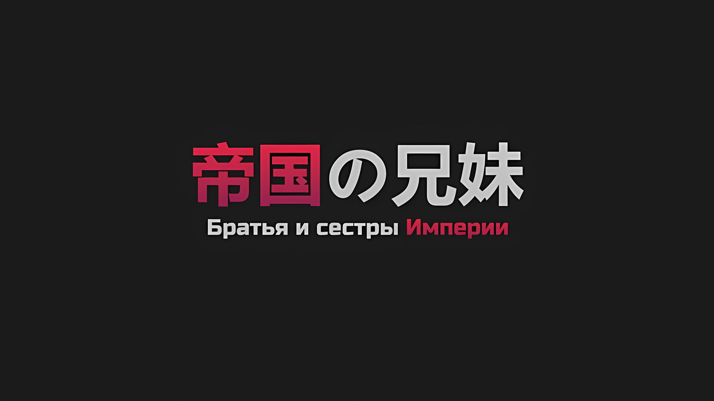
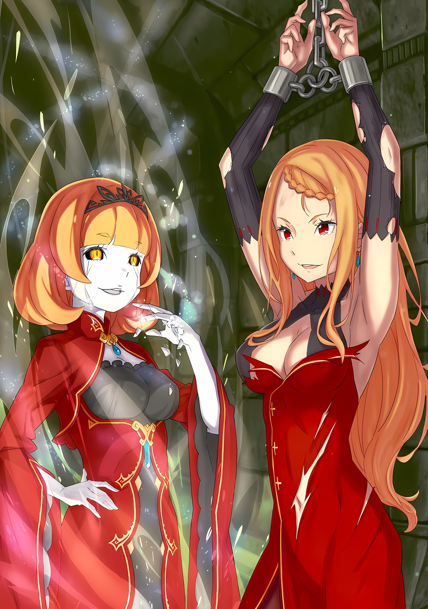
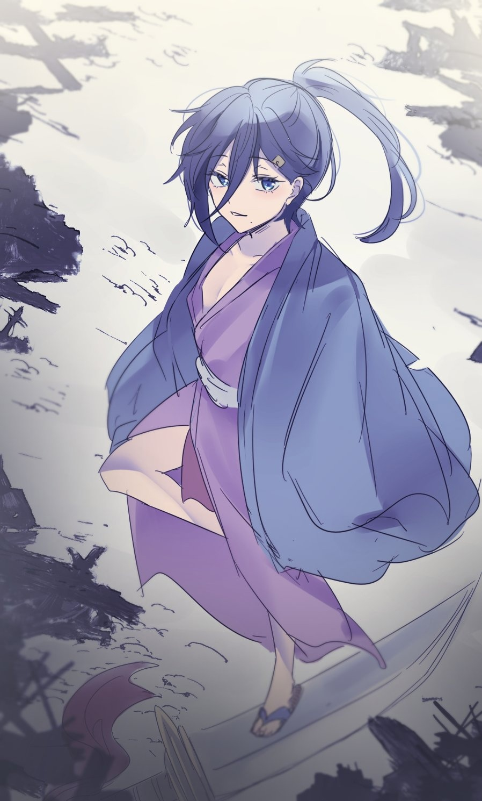
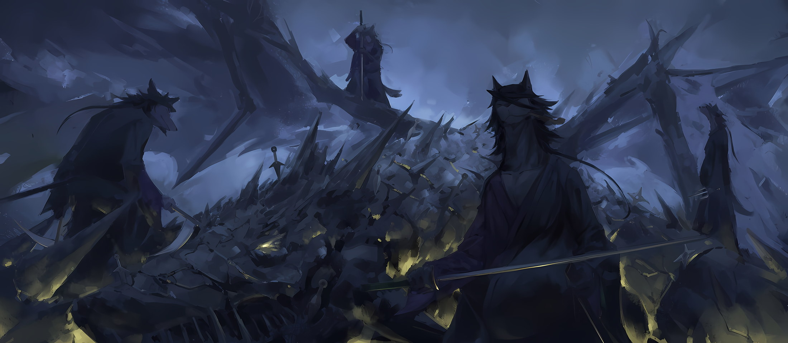

*※※※※※※※※※※※*

В нем зародилось предчувствие.

Когда «Звездочет» Убирк назвал ее огоньком, который спасет Империю, он всерьез призадумался, погрузившись в размышления.

Как она могла стать заклятым врагом воскрешенных мертвецов?

Что именно в ней было не похоже на других людей?

Быть доброй девочкой. Быть искренней. Уметь терпеть ради кого-то. Все это было прекрасно, но эти качества были присущи и другим.

Дело было не столько в этом, сколько в особенности, которой обладала только она и никто другой…

Субару: …Полномочие «Чревоугодия».

Даже если бы она захотела расстаться со своим прошлым Архиепископа Греха, этот крест никогда ее не отпустит.

Субару пообещал, что не позволит ей освободиться от этого креста.

А она пообещала Субару, что не сбежит от этого креста.

…Таким образом, в этом была заложена надежда.

Субару: Я обладаю Полномочиями «Лени» и «Жадности».

Омерзительный Культ Ведьмы, отвратительные Архиепископы Греха.

Петельгейзе Романе-Конти и Регулус Корниас, Полномочия, которыми они обладали, теперь, благодаря множеству событий, находились в самых глубинах Субару.

Почему это произошло? Отшатнувшись, словно они передали ему эстафету, Субару не стал противостоять этому с подобающей серьезностью. Но для него это было уже невозможно.

Ради нее, ради Субару, который ее выбрал, он должен был этому противостоять.

И поэтому…,

Субару: …Если ты собираешься выбрать жизнь Спики, а не Луи Арнеб, тогда ты сумеешь изменить способ использования Полномочия, так же как это сделал я.

У каждой медали есть две стороны, любой инструмент зависит от того, как его используют. …Нет, не только инструмент.

Станет ли кто-то добрым или будет покрыт лаком зла. Последнюю черту подводил сам человек. Существовали обстоятельства, при которых что-то подобное ускользало от возможности. Однако ей была предоставлена возможность сделать это.

…Лей Батенкайтос — «Изысканное Поедание».

…Лой Альфард — «Причудливое Поедание».

…Луи Арнеб — «Сытное Поедание».

Обладая силой, которой они были наделены, те, кто стали грешниками, никогда не будут прощены миром.

Обладающая той же силой, что и они, искупительница шла по пути возмещения ущерба миру.

Субару: …«Звездное Поедание*».

* Титул Спики «Звездное Поедание» (星食) может быть интерпретирован и как титул, и как способность. Титул соответствует титулам трех Архиепископов Греха Чревоугодия: «Изысканное Поедание», «Причудливое Поедание» и «Сытное Поедание»; способность представляет собой что-то вроде «Астрального Затмения», что соответствует способностям Чревоугодия «Солнечное Затмение» и «Лунное Затмение». Это связано с тем, что 食 может означать как «поедание», так и «затмение».

Неразрывно связанные между собой братья и сестра, выгравировавшие в себе антецедент зла.

Искупительница заново съедала их антецедент — деяния грешников, унаследовавших имена звезд.

Новорожденная девочка, затмившая звезды, Спика — «Звездное Поедание».

Спика: …Ияоо аеиа.

Называя «Имена» тех, кто воскрес в сосудах, сотканных из земли, чьи «Воспоминания» были запечатаны в жуках, «Звездное Поедание» девочки, удостоенной имени Альфы Девы, активировалось ее вытянутой рукой, прикосновением ее пальцев.

Он знал о белом пустом месте, где ничто не имело смысла.

Место, где элементы всех душ, будь они красивы или грязны, очищались и рождались заново.

Пожирая роль тех, кого извлекли из того места.

Поедая их судьбу, дабы эти души никогда более не могли стать пищей для других.

…Поглощая деяния Архиепископов Греха, закрепленных именами звезд, «Звездное Поедание» стало материализовываться.

Спика: …Аио а оеие ияоо аеиа*.

* Здесь вокализации Спики намеренно напоминают фразы «приятного аппетита» и «спасибо за угощение», которые произносила Луи Арнеб, когда использовала Полномочие.

*△▼△▼△▼△*

В тот же миг всех Ламий охватил ветер, остановивший их движение.

Гоз Ральфон, на теле которого зияли раны, не упустил эту мимолетную возможность.

Гоз: …Есть.

В разгар боя он оказался под угрозой надвигающегося со всех сторон «Меча Света»; однако Гоз, сбросив объятые пламенем доспехи, выдержал этот натиск.

Умело справляясь с каждой атакой, Гоз закрыл глаза, не ослабляя воли к борьбе, и полностью отдался звукам вокруг себя.

Благодаря «Божественной Защите Уклонения от Ветра» он мог сосредоточиться на звуках, издаваемых Ламиями, которым он противостоял. Когда Ламий было более двадцати, а звуки между ними оставались одинаковыми, Гоз понял, что столкнулся с действительно грозным противником.

Но при всей идентичности Ламий их совместимость с Гозом была наихудшей из всех возможных.

По какой-то неизвестной причине все Ламии одновременно рухнули.

Наверняка это дело рук Винсента. Император Волакии, которому Гоз присягнул на верность, подготовил средство, позволяющее выйти из тупика даже в такой ситуации. Этого было достаточно, чтобы довести Гоза до слез.

Сдерживая свои эмоции, Гоз поднял булаву и, повернув середину длинной рукоятки, разобрал ее на две части — ударный наконечник и древко. С помощью древка он с огромной силой ударил по ударному наконечнику.

В мгновение ока возникшая звуковая ударная волна обрушилась прямо на рухнувших Ламий.

Ламия: …

Золотая булава Гоза, сочетающая в себе длинную копьевидную рукоять и сферический ударный наконечник, была шедевром, выкованным исключительно для его использования.

Весом в десять человек при одном взмахе, в сочетании с геркулесовой силой и уникальным слухом Гоза, она реализовывала недостижимую для других технику… каждый живой организм обладает уникальными для себя вибрациями, и «Вой», позволяющий поражать противников этими же вибрациями в форме звука, был достигнут Гозом.

Вопреки своему смелому и бесстрашному виду, Гоз Ральфон обладал слухом, способным даже различать нюансы в звуках ветра, и мастерством гения, умеющего изящно играть на любых музыкальных инструментах.

Именно из-за этого смертоносного «Воя» Гоза и прозвали «Рыцарем Львом».

Уловив в пылу битвы ее уникальные вибрации, «Вой» Гоза обрушился на Ламию… Нет, он обрушился на всех Ламий, заставляя трещины внутри каждой из них расти, сокрушая неупокоенных Принцесс.

…Аналогичные события происходили и в других повозках, расположенных отдельно от поля боя Гоза.

Розвааль счел пламя неэффективным против «Меча Света», и вместо него противостоял Ламии и «Корпусу Резчиков» с помощью клинков ветра и оползней земли.

Гарфиэль, используя огромную силу своего звериного облика, яростно разрывал когтями Ламию, «Корпус Резчиков» и даже саму драконью повозку.

Эмилия укрепляла драконьи повозки льдом, когда они разрушались одна за другой, проскальзывала мимо группы ледяных скульптур, созданных ею для борьбы с «Корпусом Резчиков», и сражалась с Ламиями.

Все, кто находился на борту соединенных драконьих повозок, не упускали из виду неожиданно возникшие возможности.

Они не оставили без внимания этот мимолетный случай, веря, что кто-то, даже если они и не знали кто, создаст такой момент.

С сияющим «Мечом Света» в руках Ламии Годвин были разбиты одна за другой…,

*△▼△▼△▼△*

Ламия: …Кх.

Спика: Ауу!!!

Сжав коренные зубы, Ламия развернулась всем телом и ударила своими длинными ногами по девочке, которая коснулась ее спины… по Спике. Получив удар Ламии, ее тело с силой отлетело в сторону. Субару, державший Спику за руку, и Беатрис полетели вместе с ней.

Причина была не только в силе ног Ламии. Из-за воздействия «Мулака» Беатрис, гравитация, действующая на Субару и двух других, уменьшилась настолько, насколько это было возможно, и они стали легкими, как шарики для настольного тенниса.

Субару: Вперед!

Юлиус: Уже!

Проскользнув под Субару и остальными, которые были отправлены в полет, Юлиус приблизился к Ламии.

Рассекая пыль от разрубленного им «Корпуса Резчиков», на Ламию обрушился удар рыцарского меча, покрытого радужной оболочкой. Пропитанный авророй, удар меча Юлиуса прорезал огромные ножницы могучих солдат, словно пудинг.

Однако «Меч Света», который держала Ламия, испустил свет и жар более сильный, чем сияющая радуга меча Юлиуса, и остановил удар, нанесенный им в упор.

Когда при столкновении мечей вспыхнул свет, Юлиус и Ламия оттолкнули друг друга. Обе стороны немедленно контратаковали, и следующий бой на мечах… так и не начался.

Ламия: …Даже на «Церемонии Императорского Отбора» ты ни разу ничего не делал сам, не так ли?

Винсент: …Да, это так.

Разжав губы, Ламия пробормотала эти слова, похожие на вздох. Авель ответил на это, стоя прямо за ее спиной.

В руке Авель сжимал полурасплавленный варварский меч, и, хотя лезвие стало коротким и тупым, оно все еще смогло пронзить спину Ламии.

Ламия: Наконец-то ты решился собственноручно убить своего кровного родственника.

Слабым местом нежити не являлось ни сердце, ни череп.

Внутри сосудов земли действовали Жуки-ядра, обнаруженные Беатрис и Розваалем. До тех пор, пока они оставались в целости и сохранности, активность нежити не прекращалась.

Однако «Меч Света», красное лезвие которого было направлено в пол, колыхаясь, упал. Не успел кончик падающего «Меча Света» пронзить пол, как он исчез, словно поглощенный воздухом.

Причина, по которой Ламия позволила ему упасть, заключалась в том, что кончики ее пальцев раскрошились, и она больше не могла держать меч.

Ламия: …

Повернувшись всем телом, с варварским мечом, все еще вонзенным в ее тело, Ламия вырвалась из рук Авеля.

Шатаясь, ее умирающее тело было таким, что казалось, любой может взять оружие и одним ударом разнести ее на мелкие кусочки. И действительно, Джамал взмахнул своими расплавленными мечами-близнецами, намереваясь нанести ей удар, но Авель остановил его, вытянув руку.

Затем, очень слабо дыша, Ламия оглянулась на Авеля, и,

Ламия: Похоже, что ни отец, ни брат Бартрой так и не вернулись. В конце концов, эти двое были довольны.

Винсент: …Ламия.

От этих коротких слов, оставленных Ламией, черные глаза Авеля дрогнули.

Увидев эту реакцию, Ламия сузила свои безжизненные аврелианские глаза, и ее потрескавшееся лицо бледного оттенка исказилось в улыбке. …Это была ужасно дьявольская улыбка.

Ламия: …Генерал Первого Класса Темегриф!

Сразу же после этого выражение лица Ламии изменилось, и она пронзительным голосом выкрикнула чью-то фамилию.

Эта фамилия не была известна Субару, но для нескольких присутствующих она имела огромное значение.

Разумеется, это относилось и к тому самому человеку, чья фамилия была названа.

Юлиус: Аль Клаузерия!

Мгновенно среагировав, Юлиус стремительно нарисовал радужную аврору.

Подняв вверх острие готового меча, Юлиус задействовал силу своих Духов и создал барьер из интенсивного света. Благодаря быстрому решению Юлиуса, жизни всех, кто находился в повозке, были спасены.

Но в то же время, поскольку аврора, созданная для их защиты, препятствовала их мобилизации, они медлили с дальнейшими действиями.

В ответ на призыв Ламии со стороны соединенных драконьих повозок вылетела световая пуля и пробила повозку насквозь.

Похожий на пулю предмет разнес стенку драконьей повозки, но аврора не позволила ему застрелить находившихся внутри людей. Однако не остановленная световая сфера смогла сорвать крышу и полностью обнажила внутреннюю часть повозки.

Рассекая воздух и приближаясь к открытой повозке, один из стаи мертвых летающих драконов, которые один за другим развертывали «Корпус Резчиков»… Нет, это был тот, кто овладел акробатическим полетом в несравнимой с остальными степени.

Овеваемый свирепым ветром, этот темный мертвый летающий дракон спикировал на драконью повозку и схватил Ламию.

Выронив «Меч Света», рука Ламии свелась к плечу, и она была поднята в воздух; сидя верхом на мертвом летающем драконе, нежить, совершившая это действие, оказалась…,

Юлиус: …Балрой-доно!?

Винсент: Балрой…

Флоп: Балрой!?

При виде этой неожиданной фигуры раздалось несколько удивленных голосов.

Но один из них был наиболее сильный от шока и в то же время самый душераздирающий.

Медиум: Браток Балро?

Ее голубые глаза широко раскрылись, однако бормотание Медиум не встретило никакого отклика со стороны нежити, к которой она обратилась.

Лишь потянув за поводья мертвого летающего дракона, на котором тот сидел, он тут же поднялся в воздух с Ламией на руках. Когда нежить оседлала мертвого летающего дракона, тот повернулся головой к задней части драконьей повозки и полетел в противоположном направлении.

Сколько бы ни мчались соединенные драконьи повозки, сколько бы ни летел мертвый летающий дракон, расстояние между ними увеличивалось.

Медиум: БРАТОК БАЛРО! БРАТОК БАЛРООООО…!!!

Потеряв контроль над собой и вытянув руки, Медиум попыталась догнать силуэт, который тут же исчез из виду.

Сзади к своей младшей сестре подскочил Флоп и остановил ее необдуманные действия. «Корпус Резчиков» по-прежнему оставался в соединенных драконьих повозках.

Корпус Резчиков: Охх, РАААААААГХХ…!!!

Те, кто закрывал лица черными шлемами, издали глубокий рев и яростно занесли над головой свои огромные ножницы.

Казалось, что их коллективная воля была направлена на то, чтобы попытаться осуществить побег своей хозяйки.

В прошлом, когда их хозяйка была убита на «Церемонии Имперского Отбора», они не смогли этого осуществить из-за поражения от «Синей Молнии»; теперь же, когда они превратились в нежить, это было их предсмертное желание, которое они пытались исполнить.

Анастасия: Всем не терять концентрации, пока все не закончится!

Анастасия выкрикнула команду, и Юлиус, первым воспринявший этот порыв, ринулся в бой.

Те, кто мог сражаться, взяли в руки оружие и сошлись в схватке с «Корпусом Резчиков», которые только что подняли свой дух. Таким образом, нынешнее столкновение уничтожило их до последнего солдата.

…Но, выиграв время, необходимое для побега их хозяйки, можно было не сомневаться, что последние мгновения этого рейда «Корпуса Резчиков», безусловно, расцвели цветком успеха.

*△▼△▼△▼△*

…Примерно в то же время, когда Балрой Темегриф подхватил Ламию Годвин и улетел.

Далеко-далеко, рухнув на колею, оставленную соединенными драконьими повозками, старик закрыл лицо руками.

Все его тело скрипело от боли, а ужасно обожженные ноги нагло ныли. И все же ни боль, ни воспаленные раны не являлись тем, чего желал этот старик.

Боль, раны и тому подобное его ничуть не волновали. …Почему, почему же он снова не умер?

???: Мне была предоставлена возможность.

Она сказала это старику, который лежал на спине, проклиная свою позорную сущность.

Она была не в человеческом обличье. Однако ее гибкая, но в то же время сильная звериная внешность олицетворяла то, что люди Империи Волакия считали высшим и прекрасным.

Действуя вместе с силами, оставленными позади драконьей кареты, преследовавшей соединенные драконьи повозки, чтобы передать сообщение, она, несомненно, была свидетелем фигуры старика, выпрыгнувшего вместе с пламенем «Метеора».

И как раз перед тем, как старик должен был разбиться о землю, она спасла его от смерти.

Старик: Под возможностью вы имеете в виду…?

Женщина: Когда вас выбросило из драконьей повозки, я бы не успела вовремя до вас добраться на своих ногах. Но нежить, вылетевшая вместе с вами, отправила вас в полет.

Старик: …

Женщина: За этот короткий промежуток времени мои ноги смогли сделать это. Это все, что я могу сказать.

Медленно покачав головой, прекрасная леопардша с золотистой шерстью сообщила об этом старику.

Он понял, что она сказала, и понял намерения, стоящие за этим. Однако абсолютной правды он не знал.

Возможно, эта особа просто оттолкнула набросившегося на нее старика, сочтя его надоедливым. Она была личностью, истинные намерения которой он не мог понять ни в малейшей степени.

Таким образом, то, что он не имел ни малейшего представления о том, что думает кто-то другой, касалось каждого члена Императорской Семьи Волакия.

*???: «…Значит, ты был способен сделать столь разочарованное лицо.»*

Старик: …Хк

Вспомнив ее удивленное выражение лица, у старика отчего-то запершило в горле.

Что именно это было, не знал даже сам старик. У него была только одна единственная мысль.

Старик: Если уж вы зашли так далеко, чтобы убить свою младшую сестру… убить Ее Превосходительство Ламию, чтобы заполучить эту Империю, то возьмите на себя ответственность…! Исполните свой долг Императора… хк!

Быть может, он был овцой или козлом, который, маскируя даже собственную шерсть, лишь притворялся Волком Меча? Старик, который одновременно являлся ни тем, ни другим, и в то же время был в какой-то степени всем этим, выдавил из себя голос.

Это были его собственные истинные чувства, которые таились в глубине его глаз, сузившихся до тонких нитей.

Старик… Премьер-министр Империи, Беллстетз Фондальфон, размышлял о позоре своей жизни и выдавливал его из себя в виде слов.

*△▼△▼△▼△*

…Кристальный Дворец, часто оцениваемый как самый красивый дворец в мире, претерпел значительные изменения в своем состоянии.

В его стенах свободно разгуливала нежить, а раны от недавнего конфликта, разгоревшегося в столице Империи, ничуть не затянулись; здесь остались только смерть и разрушение, без аналогов жизни и восстановления.

По этой причине Кристальный Дворец утратил свою первоначальную красоту и превратился в жуткое царство безудержного отвращения.

Однако…,

???: …

Тихо приоткрыв веки багровых глаз, она увидела существо, которое даже в этом царстве страданий не утратило своей красоты.

Ее длинные оранжевые волосы были распущены и растрепаны, роскошное кроваво-красное платье было изорвано, белоснежная кожа была покрыта пылью и грязью, но все это ничуть не омрачало ее очарования.

Ведь истинно красивые люди обладали чертами, которые не нуждались ни в каких поверхностных украшениях.

Но все же…,

Женщина: По сравнению с твоим нынешним видом даже растрепанные волосы и порванная одежда кажутся великолепными, как золото.

???: …Это то, что ты бы сказала, Приска.

От тошнотворно-сладкого тона голоса, назвавшего ее по старому имени, Присцилла Бариэль сузила глаза.

Ее руки были подняты вверх, скованные специальными цепями, и она выглядела как военнопленная, которую заставляют стоять. Несмотря на это, в глазах и поведении Присциллы не было ни малейшего намека на уязвимость.

В конце концов, где бы ее ни держали и как бы ни заставляли стоять, у нее не было ни единой причины уступить.

Присцилла, запертая в подземной темнице Кристального Дворца в столице Империи Рапгане, скептически отнеслась к той, кто специально пришел ее навестить… к Ламии Годвин, которая теперь стала нежитью.

На вид ей было столько же лет, сколько и девять лет назад, и хотя она обладала кожей и глазами, характерными для нежити, ее манящая внешность, благодаря которой ее прозвали «Ядовитой Принцессой», осталась нетронутой.

С изорванным платьем и разрушенной половиной тела она была лишь тенью прежней себя.

Поскольку она являлась нежитью, то должна была уметь восстанавливать разрушенные части тела. Даже если бы это было не так, она могла бы легко перенести себя в новый земляной сосуд. Понаблюдав за нежитью и сделав такие выводы, Присцилла все поняла.

Она поняла, почему Ламия, которая до крайности презирала неприглядность и безобразие, предстала перед ней в таком жалком виде.

Присцилла: Что, снова собираешься умереть, Ламия?

Ламия: Божечки, ну и манера разговаривать со своей старшей сестричкой. Но, право. В конце концов, моя связь с пустой коробкой была разорвана… нет, скорее, связь была съедена.

Присцилла: …

Ламия: Ах да, послушай-ка, Приска. Братец Винсент сделал это со мной своими собственными руками. Это то, чего он никогда не делал для тебя, которой он так дорожит, не так ли?

Ламия прикрыла рот рукой, все еще целой, хотя и готовой вот-вот рассыпаться, и рассмеялась.

Заслуживало ли это хвастовства, зависело от собственных ценностей, но Присцилла лишь тихо фыркнула. Увидев ее реакцию, Ламия сузила свои аврелианские глаза и сказала,

Ламия: Воистину, мне было так скучно. Кроме тебя и братца Винсента, нет более способных поддержать со мной здравую беседу.

Присцилла: Тем не менее, между тобой и мной количество здравых бесед можно пересчитать по пальцам.

Ламия: Это не вопрос количества. Глупая младшая сестричка.

С этим бормотанием рука, которой Ламия закрыла свой рот, рассыпалась и исчезла.

Ламия медленно теряла остатки своей формы. Поскольку она стояла прямо перед ней, это зрелище заполнило поле зрения Присциллы, независимо от того, хотела она это видеть или нет.

Однако Присцилла не сомкнула век. Эти багровые глаза устремили свой взгляд на Ламию.

И с этим взглядом, устремленным на нее,

Присцилла: Коли роль твоя завершена, то поспеши уйти, Ламия. …Я снова приду к твоему смертному одру.

При этих словах Присциллы Ламия слегка приподняла брови.

Затем, с улыбкой, похожей на сладкий-пресладкий яд,

Ламия: Из младших сестричек ты противнее всех.

Насколько могла вспомнить Присцилла, это были точно такие же слова и улыбка, как и в последние минуты ее жизни.

*△▼△▼△▼△*

???: Для заключительной беседы между сестрами этого достаточно, чтобы вас удовлетворить?

До Присциллы, только что ставшей свидетелем конца Ламии, откуда-то донесся веселый мужской голос.

Повернув лицо в сторону слабых шагов, она встретилась взглядом с нежитью, спускавшейся по лестнице в подземную темницу с бесстрашным выражением лица. Золотое сияние, вырисовывающееся сквозь черноту, он обладал общими для всей нежити глазами.

Однако, как и Ламия, атмосфера, которую он излучал, отличала его от прочей нежити низкого мастерства.

Присцилла: Так это был ты? Тот, кто вернул Ламию во дворец.

???: Она, несомненно, была крепким орешком, да? С таким состоянием тела она сама спустилась в подвал. Как и ожидалось от благородной Принцессы Волакии… Как гражданин Империи, я очень горжусь этим.

Присцилла: Для мятежника, обратившего свои клыки против Императора, эти слова достаточно бесстыдны.

???: У меня нет никакой опоры, если вы так говорите, однако… если речь идет о том, чтобы быть изгоем Империи, то между мной и миледи нет особой разницы.

С этими словами из темноты выступила стоящая фигура.

Облик человека четко вырисовался в поле ее зрения, и Присцилла подтвердила догадку, сделанную ею на основании одного лишь голоса. Эту нежить звали Балрой Темегриф, бывший член «Девяти Божественных Генералов» Империи.

В прошлом он был знакомым Присциллы, когда она еще жила в Империи. Тогда она была женой имперского Графа Среднего Класса, являвшегося ее первым мужем.

Тем не менее, это был не тот случай, когда живые и мертвые возобновляли старую дружбу давно ушедших времен.

Присцилла: Какое у тебя дело? Невозможно подумать, что твой глупый вопрос, заданный ранее, был единственной целью.

Балрой: Конечно, выяснение последних мгновений жизни Ее Превосходительства Ламии входило в мои обязанности… но я также принес угощение для миледи.

Говоря это, Балрой поднял серебряное блюдо, которое он прятал за спиной.

С серебряной крышкой, накрытой сверху, все соответствовало формальностям, которые можно увидеть в ресторане, но когда Присцилла сузила свои багровые глаза,

Присцилла: Не нужно.

Балрой: Что ж, это само собой разумеется. В конце концов, мы все мертвы, так? А раз у нас нет нужды в еде, то немыслимо, чтобы у нас была еда для таких живых людей, как миледи. Если бы я ничего не принес, то погубил бы такую редкую красавицу.

Балрой, цвет кожи которого был лишен жизни, улыбнулся, поднимая крышку с блюда.

Затем от блюда пошел теплый пар с приятным ароматом, и Присцилла закрыла один глаз, глядя на еду перед собой.

Для чего-то, приготовленного нежитью, это выглядело весьма прилично.

Балрой: К сожалению, я не могу попробовать это блюдо, так как у меня пропало чувство вкуса, но у меня есть опыт в кулинарии, так что я не думаю, что оно будет невкусным. О-оу, прошу простить меня за то, что я предлагаю вам кухню простолюдинов.

Присцилла: …

Поскольку Присцилла молчала, Балрой взял вилку, лежавшую на блюде, и наколол ею еду; затем он поднес вилку к ее рту.

Руки Присциллы были привязаны к потолку. Она понимала, что у нее нет иного выхода, кроме как сделать это, однако,

Присцилла: Я собственноручно отрублю тебе голову.

Спокойно заявив об этом, Присцилла проглотила предложенную ей еду.

Это было неплохо. Но она была дешевой. Даже при использовании ингредиентов из дворца, если навыки и представления повара были дешевыми, готовый продукт не мог быть назван высококачественным.

В ответ на молчаливое давление Присциллы Балрой с лицом нежити криво улыбнулся. В этой улыбке она уловила проблеск чего-то иного, чем то, что было обращено к ней самой,

Балрой: Ах, это напомнило мне о том, как в прошлом я кормил одну такую же юную девицу, которую посадили в тюрьму в наказание за хулиганство.

Почувствовав перемену в атмосфере, Балрой раскрыл истинный смысл своей кривой улыбки.

Почувствовав недовольство в его ответе, Присцилла произнесла: «Вытирай», чтобы он вытер ей рот, а затем,

Присцилла: По какой причине вы уничтожаете Империю? Чего ты желаешь, когда воскрешаешься?

Балрой: …Не мое дело давать ответ на первый вопрос. Но вот ответ на второй довольно прост.

Получив этот вопрос, Балрой отреагировал на него, и его кривая улыбка и легкомысленный тон исчезли.

В ответ на изменение атмосферы, окружающей Балроя, Присцилла снова насторожилась. Внутри него… Нет, и в Ламии тоже, было то самое явное негодование.

Не изменяя впечатлениям Присциллы…,

Балрой: Желания мертвых фиксируются с момента зарождения мира, это делается для того, чтобы устранить все оставшиеся обиды или затаенные недовольства.

Действительно, раскрывая искренние желания нежити, Балрой Темегриф произнес эти слова голосом, полным безжизненного смеха.

*△▼△▼△▼△*

Мужчина: Меня… убили? Да чтоб тебя!

С плеском оттолкнувшись от мокрой дороги, он энергично свернул за угол. В этот момент он ударился бедрами о деревянный ящик, оказавшийся прямо перед ним, и с силой кувыркнулся, вскрикнув «Аггх».

Внутри шлема, когда он ударился о мокрую каменную поверхность, вспыхнула боль, и в глазах его промелькнула искра. Однако, поскольку над его головой кружился нимб из птиц, это была не та ситуация, в которой он мог позволить себе упасть духом.

Опустив правую руку на землю, у него не было другого выхода, кроме как спешно подняться на ноги.

Если он этого не сделает, то придет тот самый человек. …Облаченный в черные одежды, тот, кто желал наблюдать, известный как Вива «Вскрыватель», должен был прийти.

Мужчина: Если я этого не сделаю, он снова заставит мои органы вывалиться наружу…

Вива: Я уже тут, усек?

Мужчина: …Хк.

Почувствовав холодок в легких, он в мгновение ока вытащил из-за пояса Меч Синего Дракона. Не обладая какой-либо техникой или формой, он взмахнул им, чтобы нанести противнику грубый удар, где бы тот ни находился.

Однако, хотя он должен был нанести удар независимо от того, где находился противник, Меч Синего Дракона промахнулся; вместо этого обжигающая боль пронзила его подмышку, и Меч Синего Дракона выскользнул прямо из его руки.

Мужчина: Гах… кх.

Вива: Сопротивление бесполезно, усек? Даже при самых благоприятных обстоятельствах условия, в которых ты находишься, отличаются от условий других, усек? Если ты проливаешь кровь впустую, не в силах соответствовать желаниям Императора, то ты не будешь представлять никакой ценности, усек?

Зажав руку в том месте, где из его подмышки хлестала кровь, он тщетно пытался сократить объемы кровопотери. Он бы хотел, по возможности, прижать открытую рану противоположной рукой, но прошло уже слишком много времени с тех пор, как он с ней распрощался, поэтому такое желание не могло быть выполнено.

Когда он издавал крики боли, синеволосая нежить развернулась к нему, держа в двух руках ножи с изогнутыми концами и прикрывая рот черной тканью.

Пара золотых глаз впилась в него взглядом, пристально наблюдая за тем, как он проливает кровь.

То, что его противнику нравилось постепенно мучить людей до смерти, вовсе не соответствовало действительности. Если верить словам Вивы, сказанным до сих пор несколько десятков раз, его целью были эксперименты.

Используя тело живого человека, он, похоже, хотел что-то выяснить. Скорее всего, он занимался этим еще при жизни, отсюда и его псевдоним «Вскрыватель».

Мужчина: Значит, я не могу ни сражаться, ни убегать… Я хочу двигаться дальше, так что не мог бы ты сделать это безболезненно?

Вива: Сделать это «безболезненно» было бы нелогично, усек? Не то чтобы я хочу тебя мучить, просто есть вещи, которые я хочу выяснить, усек?

Мужчина: Как я и думал~… Да будет так.

Оставив всякую надежду на то, что ему удастся образумить противника, он перевел взгляд на свой упавший Меч Синего Дракона. К счастью, он лежал от него не очень далеко, и казалось, что он сможет к нему допрыгнуть.

Проблема заключалась в том, удастся ли ему отрубить себе голову или нет. Если не удастся, то мучения безнадежно затянутся. …Сейчас не время колебаться.

Мужчина: …Кх!

Решение было принято за одну секунду, равно как и решимость; ему не потребовалось и секунды, чтобы начать действовать. Не успел «Вскрыватель» приступить к своим злодеяниям, как мужчина без предупреждения нырнул в сторону Меча Синего Дракона.

Реакция Вивы на его действие была слишком медленной, и в этот момент он использовал лезвие Меча Синего Дракона, чтобы перерезать собственную шею…,

???: Нет-нет, не слишком ли рано расставаться с этой жизнью и переходить в мир иной?

Мужчина: Ах!?

Когда он попытался рубануть себя Мечом Синего Дракона, что-то прижало его лезвие к земле. Насколько он мог видеть, это была маленькая ножка, а еще выше — тонкая талия и безумная улыбка.

Стоя на Мече Синего Дракона одной ногой, ребенок в японском наряде поступил безрассудно.

Вива: Ребенок, это еще одно нежелательное условие, усек?

При появлении этого ребенка Вива крутанул в руках два ножа и, ни секунды не колеблясь, попытался нанести тот же удар, который пронзил подмышку мужчины, в жизненные органы ребенка.

Это была самая ужасная процедура — приведение в негодность рук и ног, а затем осмотр внутренних органов.

Увидев, что эти лезвия приближаются к нему, ребенок поднял бровь и,

Ребенок: Хо-хо! Полностью проигнорировать внезапные притязания незваного гостя — это, надо сказать, браво! Однако…

Вива: …Хк!?

В следующее мгновение голова Вивы с широко раскрытыми глазами слетела с плеч.

Ребенок ударил ногой по руке, державшей нож, которым Вива пытался замахнуться, и, когда эта рука разлетелась вдребезги, Виве отсекло голову его же оружием.

Затем ребенок проворно переменил ногу, стоявшую на Мече Синего Дракона, и следующим ударом пробил то, что осталось от туловища Вивы, из-за чего тело нежити, которому не требовалось расчленение, разлетелось на мелкие кусочки.

Ребенок: К сожалению, совместная игра со злодеем с такими низкими вкусами, как у тебя, это NG*!

* Not Good (нехорошо).

В противовес смертельной битве, в которой он принимал участие, ребенок заявил об этом легкомысленным тоном.

С противоположной стороны от этого замечания голова Вивы, чье тело было уничтожено, с изумленным выражением лица смотрела, как оно рассыпается в пыль, уносимая ветрами столицы Империи.

Мужчине оставалось только смотреть с ошарашенным видом на то, как ребенок, все еще стоя на одной ноге, повернулся к нему лицом,

Ребенок: Прости меня за то, что я стою на твоем мече. Ты же сам видишь, что пол здесь мокрый. Мне было бы очень неудобно, если бы мои зори промокли. Вот почему я так поступил!

Мужчина: Ах, впрочем, я не особо против…

Глядя на дурацкую позу ребенка с поднятой ногой, он поднялся со своего места и уселся, скрестив ноги. Как и сказал ребенок, было неприятно намочить задницу, однако он находился в таком состоянии, что было уже слишком поздно, что бы он ни делал.

Мужчина: Что еще важнее, я хотел попросить кого-нибудь протянуть мне руку помощи в том, что еще пока не поздно сделать. Могу ли я рассчитывать на твою помощь?

Ребенок: Ах, и правда, иметь одну руку ведь жуть как неудобно. Знаешь, лично мне очень симпатизирует твоя необычная внешность, и будет напрасной тратой если из-за одного несчастного происшествия придется с ней распрощаться. Хорошо!

Равнодушно улыбнувшись, ребенок энергично добавил: «Однако!» и указал на крышу здания прямо рядом с ними,

Ребенок: Как уже было сказано, я не хочу, чтобы мои зори намокли! Поэтому давай сначала переберемся на возвышенность. А до тех пор, пожалуйста, следи за тем, чтобы не терять кровь, мистер Шлем!

Мужчина: …Меня зовут Ал, ты, янча* мальчик.

* Янча — японское слово, означающее «непослушный» или «озорной».

Ребенок: Хахахаха! Янча мальчик! То, как ты говоришь, очень похоже на Босса!

Когда ребенок разразился хохотом, мужчина, все еще сжимающий свою подмышку… Ал испустил протяжный вздох.

Ребенок явно не был обычным человеком, но Ал остро почувствовал влияние некоего лица, которому были знакомы многие слова, изрекаемые мальчиком.

К чему бы ни привела эта встреча — к добру или к худу, в любом случае…,

Ал: Жди меня, Присцилла… Я, несмотря ни на что, обязательно спасу тебя.

*△▼△▼△▼△*

В его трех головах больше не осталось сил, и колоссальное тело, наконец, безвольно повалилось на землю.

С разорванными крыльями и множеством инструментов ниндзя, пронзивших его тело, даже когда большинство жизненно важных точек были пробиты и уничтожены, трудно было сказать, какой именно удар был смертельным.

Если бы было хоть что-то, что он мог бы сказать…,

Халибель: Так не пойдет, я не силен против нечеловеческих «Зомби», это уж точно.

Размахивая рукавами, Халибель пробормотал это, наблюдая, как «Трехголовый» Дракон превращается в пыль.

Три дополнительных тела, отделившиеся от него самого, также исчезли, и он протяжно вздохнул от изнеможения. Как и ожидалось, сражение с противником уровня Дракона требовало огромных усилий.

По возможности, ему не хотелось, чтобы его снова поставили на истребление монстров.

Халибель: Маленькая Ана и остальные сказали, что одна и та же девушка могла постоянно превращаться в зомби.

Если это правда, то вполне возможно, что «Трехголовый», которого он только что победил, появится снова.

В следующий раз Халибель, вероятно, снова победит его, но он не был уверен, что они окажутся в таком месте, где люди поблизости не будут втянуты в схватку. Кроме того, ему, как наемному охраннику, было бы не по себе, если бы его руки в этот момент были заняты.

Юлиус тоже был вполне компетентен рядом с Анастасией, однако…,

Халибель: Похоже, он не дотягивает до моего уровня.

Хрустнув суставами в шее, он поджег кисэру, которое не мог курить во время боя, и вдохнул его пары.

Убедившись, что тело «Трехголового» полностью исчезло, он обернулся в поисках соединенных драконьих повозок, которые оставили его позади и умчались далеко-далеко вдаль.

И тут…,

Халибель: Черт возьми, после такой тяжелой работы мне хочется конфеток… Ох, упс, я умру, если съем хоть одну.

Проворчав эти слова, он принялся преследовать следы, оставленные драконьими повозками, уходящими вдаль.
