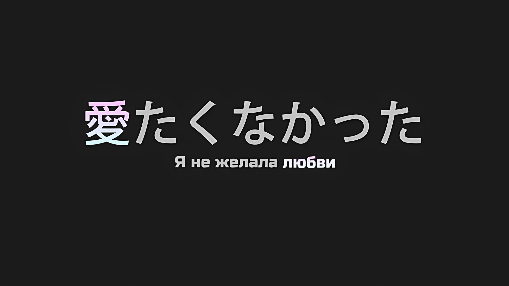
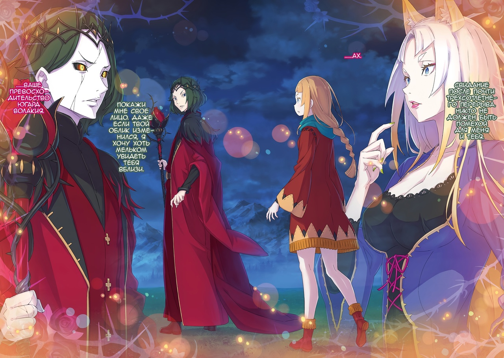

*※※※※※※※※※※※*

…Стоя на вершине холма, мужчина вглядывался в далекий горизонт.

Солнце уже давно село, и бедная деревня, лишенная источников света, не могла справиться с ночной глушью.

С учетом того, что многие мужчины-рабочие были ранены, а костров было меньше, чем обычно, вид стоящего в темноте мужчины показался девочке очень странным.

Разбойники совершали набеги на близлежащие деревни, и ее родная деревня несла их основное бремя, перенося большие потери в виде домашнего скота, продовольствия и раненых мужчин.

Но даже в этом случае то, что деревня не погибла, было лучом надежды среди темных туч, и человек на вершине холма тоже мог считаться частью этой удачи.

Когда разбойники напали на деревню, мужчины, оказавшие сопротивление, были убиты или ранены, а женщины и дети попадали в плен один за другим.

В тот момент, когда девочка оказалась перед угрозой быть проданной или пережить что-то еще более страшное, появились солдаты, присланные из столицы, в числе которых был и человек на вершине холма.

Они в мгновение ока окружили разбойников и уничтожили их без особого сопротивления.

Впоследствии, быстро отреагировав на их действия, они расположились рядом с деревней, чтобы помочь в ее защите и восстановлении, в результате чего деревня получила более прочную ограду, чем до того, как стала жертвой разбойников.

Если раны мужчин заживут, то деревня на какое-то время будет в безопасности.

Как и взрослые женщины, девочка суетилась, ухаживая за ранеными, разнося еду солдатам и заботясь о детях деревни.

По дороге домой, закончив работу, она заметила мужчину на вершине холма.

Мужчина: …

Вид человека, молча вглядывающегося в ночную тьму, можно было назвать комичным.

Поступки, подобные вглядыванию в темноту, где, скорее всего, ничего нельзя было разглядеть, были верхом бесполезности. Ценность действий, не приводящих к результату, не признавалась; таков был суровый уклад Империи.

Однако в глазах девочки мужчина не выглядел комичным.

Он пристально вглядывался вдаль, словно пытаясь разглядеть что-то, чего не могли заметить остальные.

И то, что произошло дальше, было вызвано непреодолимым любопытством девочки к тому, что именно он пытался разглядеть.

Девочка: Не удобнее ли считать звезды на небе, чем смотреть в темноту?

В следующий момент она окликнула этого мужчину в спину.

Он обернулся с легким удивлением в глазах, что вызвало у нее некоторую гордость.

…Эта встреча девочки и Короля станет сказкой, которую будут пересказывать еще очень и очень долго.

*△▼△▼△▼△*

…Это воссоединение было чем-то, что нельзя было предвидеть.

Возможно, его следовало бы назвать жестоким поворотом судьбы или странным стечением обстоятельств.

В разгар небывалой беды, постигшей Империю Волакия, полное лицо «Великого Бедствия» одновременно стало известно почти всем.

Шествие восставшей из могил нежити ввергло всех живых в пучину хаоса.

Однако нашлись и те, кто пережил это неизбежное погружение в хаос и сумел из него выкарабкаться.

Независимо от степени физической силы, они могли возвыситься как существа огромной душевной и духовной мощи… В глазах посредственных и обычных людей они воспринимались как герои и исключительные существа. Часто такие грозные личности были сильны и физически, но их действия в любом случае существенно влияли на судьбу столицы Империи.

Ужасное внезапное нападение на живых, удар «Великого Бедствия», привело к потерям ниже ожидаемых.

Но это не означало, что такой исход был лучшим, даже если он свидетельствовал о доблестных усилиях живых.

Все дело в том, что в самом начале беспорядков люди, которых по праву следовало бы причислить к исключительным, были поглощены первоначальной засадой гораздо быстрее, чем успели над ней возвыситься.

???: …Нгх.

С губ сорвался слабый вздох, и сознание плавно потекло к пробуждению.

Веки, обрамленные длинными ресницами, дрогнули, как солнце, боящееся рассвета, глаза медленно начали отражать мир; раз, два, голубые глаза моргнули… в одно мгновение эфемерный сон лопнул, и сознание прочно обосновалось в реальности.

???: …Хк

Поспешно сев, зрелище, отразившееся в этих глазах, было незнакомым.

В комнате был высокий потолок, а материалы стен и пола, наряду с мастерством исполнения, были на высшем уровне. Изящная мебель украшала роскошную комнату, с первого взгляда создавая впечатление благородства.

Осознание происходящего на мягкой кровати в этой просторной комнате только его усиливало, а само оно было необычным.

По сравнению с воспоминаниями, которые непосредственно этому предшествовали, это было крайне неестественно.

???: Я должна была участвовать в…

*Я должна была участвовать в битве за столицу Империи*, — так она про себя размышляла.

Мгновенно вспомнился мир, где небо и земля были окрашены в багровый цвет, а также воспоминания о том, как вместе с чудом воссоединившейся дочерью она усердно пыталась утешить плачущего ребенка.

В буквальном смысле слова это была ситуация, в которой у них горели руки*, но сама попытка должна была увенчаться успехом.

* Японское выражение «руки горели» (手を焼く) имеет значение «испытывать трудности» и «не знать, что делать».

Тем не менее, они оказались в таком месте. Это было слишком непонятно…,

???: …Мое кимоно…

Так далеко зайдя, она запоздало заметила непривычное ощущение прикосновения собственной руки, лежащей на груди.

При взгляде на свое тело, лежащее на кровати, она увидела, что одеяние, украшающее ее конечности, было не привычным кимоно, а голубым платьем из ткани высочайшего качества, от которого так и веяло роскошью.

Завязанные в пучок волосы теперь были распущены, и казалось, что с нее сняли и украшения для волос, и серьги.

Все эти вещи были для нее незаменимы, с ними она не рассталась бы даже в бессознательном состоянии…,

???: …Пробудилась ли ты, О Звезда Моя?

Как раз в тот момент, когда она собиралась покинуть кровать в поисках своих потерянных украшений, раздался голос.

Женщина: …Ах.

Голос, неожиданно ударивший по барабанным перепонкам, без преувеличения лишил ее мозговой активности.

Голос раздался от входа в комнату, которая была обставлена элегантной и ослепительной мебелью, приковывающей взгляд. Однако ничего из этого не было видно.

Будто ее уши были пойманы в ловушку, словно сердце ее было порабощено, а ее сознание было обращено в ту сторону.

Для нее… Для Йорны Миссигр это было неизбежно.

Йорна: …

С широко открытыми глазами Йорна, все еще лежащая на кровати, уставилась на фигуру, стоящую у входа.

Там находилась небольшая фигурка. Он был значительно ниже Йорны, которая и без того была высокой для женщины, а его стройная фигура производила впечатление ребенка. Однако он был красивым мужчиной с резкими чертами лица.

Его волосы зеленого оттенка, близкого к черному, доходили до плеч, а нездоровые глубокие тени вокруг глаз, свидетельствующие о недовольстве, казалось, ярко отражали его недружелюбный характер.

Однако Йорна знала, что на самом деле люди просто боялись его, и он не старался держать их на расстоянии. …Более того, он не пытался от нее отдалиться.

Даже в последние минуты своей жизни он искренне отказывался от нее отдаляться.

И сейчас Йорна понимала, что именно поэтому она здесь.

Потому что она знала…,

Йорна: …Ваше Превосходительство, да?

Мужчина: Странная манера говорить*. Но я позволю. Все, что касается души твоей, я разрешаю.

* Здесь мужчина ссылается на уникальную манеру Йорны говорить по-японски (аринсу-котоба), которая, к сожалению, теряется при переводе на русский язык.

Вынашивая совершенно невероятную мысль, Йорна задала вопрос, и этот человек небольшого роста ответил именно так.

Ужасно резкий, холодный, навевающий меланхолию, для столь короткого заявления этот голос был наполнен таким количеством эмоций, что казалось, он разорвется на части.

Это был избыток одержимости, присутствующей в нем самом, и источником этой одержимости была любовь.

Мужчина, стоящий перед ее глазами, был влюблен в Йорну Миссигр.

Это было понятно не потому, что он обладал какой-то особой силой в результате того, что Йорна его «Любила», а скорее потому, что это было сильное чувство, настолько явное, что оно сразу же стало бы очевидным для любого другого человека, присутствующего в этой комнате.

В конце концов, это было…,

Мужчина: Свидание после почти трехсотлетнего перерыва. Никто не должен быть помехой для меня и тебя.

Йорна: …

Мужчина: Покажи мне свое лицо. Даже если твой облик изменился, я хочу хоть мельком увидеть тебя вблизи.

Когда мужчина медленно приблизился к ней, произнося эти слова, сердце Йорны дрогнуло.

Какие именно эмоции это вызвало, она и сама не могла сказать. Конечно, в этом невозможном воссоединении была радость, и ей захотелось броситься ему на грудь.

Но в то же время существовало триста лет причин, по которым она не должна была этого делать. Последние десятилетия на данный момент были главной причиной, по которой Йорна не совершала столь импульсивных поступков.

Поэтому Йорна испытывала противоречивые эмоции по отношению к подошедшему к ней мужчине, и ее губы дрожали…,

Йорна: …Ваше Превосходительство Югард Волакия.

На ее оклик мужчина приостановил свой шаг, и Йорна плотно сомкнула губы.

Раз он остановился, услышав ее зов, значит, она его не перепутала. Она никак не могла его перепутать. Даже если бы кто-то принял его за другого человека, только для Йорны это было невозможно.

Только для Йорны… Нет, только для этой души, которая начинала как девушка по имени Ирис, было совершенно невозможно перепутать того, кто был известен как «Терновый Король», Югард.

…Ирис и Терновый Король.

Это была сказка, которую рассказывали в этом мире с давних пор, и одновременно — старый исторический факт.

История, известная встречей и разлукой девушки по имени Ирис и Императора Волакии по прозванию «Терновый Король», а также трагической развязкой, запечатленной в ней.

Душа Ирис не вознеслась на небеса, вместо этого она оказалась скованной в бескрайних землях Империи, в результате чего после многочисленных реинкарнаций появилась Йорна Миссигр. А тем, кто привязал душу Ирис к обширным землям Империи, был не кто иной, как «Терновый Король» Югард Волакия.

Иными словами, это был ненаписанный эпилог к истории «Ирис и Терновый Король»,

Йорна: Этого не может быть в такой красивой сказке.

Медленно покачав головой, Йорна подавила порывы, возникшие в ее сердце.

Воссоединение с Югардом после нежелательной разлуки — можно сказать, что это было самым заветным желанием Йорны. Именно в этот момент ее самое заветное желание исполнилось.

Однако это было бы неверно. Воссоединение, о котором мечтала Йорна, не имело такой формы.

Йорна: Я не хотела видеть вас с таким лицом и глазами, Ваше Превосходительство.

Поскольку казалось, что злая судьба над ней насмехается, Йорна с горестным укором посмотрела на Югарда.

Остановив шаг, любимый Император Йорны встретил ее пристальный взгляд… Он, с бледной кожей и золотыми радужками, был полностью изменен по сравнению с тем обликом, который помнила Йорна.

Она не знала, что именно с ним произошло.

Но она была уверена, что форма Югарда необычна и точно не окажет никакого положительного влияния ни на нее, ни на ее любимых детей.

Полностью изменив форму, Югард добился невозможного воскрешения… Если по какой-то случайности это незнакомое место, в котором она очнулась, являлось комнатой Кристального Дворца, то в ее голове пронеслась самая худшая возможность.

Возможность того, что произошла какая-то абсурдная ситуация, и состояние Империи изменилось.

Йорна: Ваше Превосходительство, мой повелитель, что же случилось такого, что вы…?

Рассказов было столько же, сколько и слез.

И все же Йорна попыталась избавиться от этих чувств, стараясь спросить то, что нужно было спросить.

Однако…,

Югард: …О Звезда Моя.

Вопрос, который Йорна хотела задать, был заглушен простым жестом Югарда, поднявшего палец.

Но не сам жест заставил Йорну замолчать. Вместе с этим пришла острая боль, сжимающая сердце и заставляющая молчать.

Йорна: Кха, агх…

Интенсивная боль пронзила ее сердце, и вместо вопроса из горла Йорны вырвался стон.

Йорна рефлекторно схватилась за грудь, и тут взгляд ее обнаружил на платье своем рисунок, которого раньше не было… Там появились шипы пепельного оттенка.

Шипы закрутились спиралью вокруг центра груди, проникая сквозь бледную кожу и заходя внутрь.

Шипы вонзались в сердце Йорны, вызывая сильнейшую боль, переполнявшую все ее тело. Пытаться прикоснуться к ним было бесполезно; они проскальзывали сквозь пальцы Йорны, оставаясь неосязаемыми.

Когда ее мысли затуманились болью, в голове Йорны промелькнуло прозвище Югарда… Сменявшие друг друга Императоры Волакии назывались разными именами в зависимости от стиля правления и завоеваний, которых они добились, но титул, обозначавший Югарда, был «Император Терний*».

* В титуле Югарда «Император Терний» (荊棘帝) термин «Терний» может также использоваться в идиоматическом смысле для обозначения препятствия или причины затруднений.

В буквальном смысле слова, Югард обладал способностью связывать и подчинять себе других с помощью боли от шипов.

В конце концов, Югард подчинял себе подданных Империи с помощью посаженных им неприкасаемых шипов, и именно он, Великий Император, использовал боль и страх, чтобы расширить территории Империи до нынешних размеров.

Терзаемая нестерпимой болью, Йорна судорожно глотала воздух.

И тут она вспомнила. …В разгар битвы за столицу Империи, после того как они с Присциллой усмирили плачущую и бушующую Аракию, какое же поражение она потерпела?

Это было совсем не так.

Охваченная внезапным появлением Югарда, Йорна не смогла избежать связывания шипами. И вот, держа на руках связанную Йорну и потерявшую сознание Аракию, Присцилла оказалась лицом к лицу с Югардом, а позади него было множество существ с золотыми глазами…,

Йорна: …Приска, она в безопасности?

Этот вопрос был задан на фоне резкой, сильной боли.

То, что ее губы, которые до этого издавали только стоны, терпя боль, смогли сформулировать связный вопрос, объяснялось лишь тем, что ее чувства превзошли страдания.

На самом деле боль, которую она испытывала, ничуть не ослабевала.

Югард не ослаблял терновых пут. Неважно, кто был жертвой — Йорна или кто-то другой. Начнем с того, что действия Югарда не были направлены на то, чтобы выплеснуть гнев или порицание.

Для Югарда сажать шипы и связывать других было таким же естественным действием, как дышать.

Как люди ходят на двух ногах, так и Югард связывал других шипами.

Крики и кровь, которая текла из тех, кто был глубоко пронзен этими шипами, были для него не более чем средством взаимодействия с другими людьми.

Поэтому быть рядом с ним означало быть вместе с этой болью.

Вспомнив об этом на личном опыте, Йорна слабо улыбнулась, задавая вопрос.

Йорна: Те двое, что были со мной в том месте, они в безопасности?

Югард: Если ты и была с ними, то они не попались мне на глаза. Все, что попадает в поле моего зрения, О Звезда Моя, есть не что иное, как ты.

Йорна: Это так…

Ответ Югарда на ее повторный вопрос был не таким, как она ожидала.

Но, услышав, что тон голоса Йорны от этого ухудшился, Югард сузил глаза, словно о чем-то размышляя,

Югард: …Однако «Ведьма» привела во дворец несколько живых существ. Возможно, среди них есть те, о ком ты говоришь.

При этих словах Югарда Йорна резко вздохнула.

Глаза Югарда отличались от глаз цвета индиго, запечатленных в ее воспоминаниях, в его черных глазницах горело золотое сияние, но мягкий взгляд, которым он смотрел на Йорну, и его бестактное внимание казались неизменными.

Йорна почувствовала, как боль, отдельная от шипов, сжимает ее сердце,

Йорна: Если это так, Ваше Превосходительство, у меня есть просьба.

Югард: Просьба?

Йорна: …Это была «Ведьма»? Те, кого привела «Ведьма», я хочу выяснить, являются ли они моими спутниками.

Приска и Аракия — она хотела убедиться, что эти двое в безопасности.

Для Йорны, не до конца понимавшей сложившуюся ситуацию, главным приоритетом в данный момент было благополучие этих двоих.

Если бы это было возможно…,

Югард: …Откажешься ли ты от смерти, О Звезда Моя?

Слова, произнесенные Югардом, вновь пронзили грудь Йорны болью иного рода.

Йорна: …

Когда Йорна подняла лицо, не издав ни звука, Югард посмотрел на нее сверху вниз.

Услышав слова Югарда, Йорна не сразу смогла что-либо произнести. Сказать что-то вроде «Что за глупости» она никак не могла. Это безошибочно пробило истинные мотивы Йорны.

Ее душа была привязана к бескрайним землям Империи, и каждый раз после смерти она воскресала с новым именем в другом теле. …Повторяя это снова и снова, Йорна, Ирис, вынашивала желание.

Югард Волакия видел это насквозь.

Йорна: …Кровь — это то, что нельзя оспаривать.

То же самое видел и Винсент Волакия.

По этой причине Йорна решила объединить усилия с Винсентом и броситься в бой за освобождение столицы Империи от предателей. Конечно, крах Города Демонов сыграл немаловажную роль, но Йорна считала, что это нечестно по отношению к себе, когда она терялась в догадках относительно своих намерений.

Вот почему Йорна кивнула в ответ на вопрос Югарда.

Йорна: Если это спасет жизни этих детей, то моя смерть — сущий пустяк.

Югард: Этого должно хватить. Я исполню твою просьбу, О Звезда Моя.

Когда Йорна улыбнулась, превозмогая боль, Югард кивнул, не меняя выражения лица.

Затем он возобновил свой замедленный шаг, оказался прямо перед глазами Йорны и нежно коснулся ее щеки протянутой рукой.

Вопреки ласковому движению руки, пальцы его были холодны, и пропорционально расстоянию, которое он сократил, острия шипов вонзались в нее все глубже.

Югард: Немного подожди.

И сердцем, и телом Йорна ощутила пронзительную боль; отпустив ее, Югард оставил эти слова, повернувшись к ней спиной.

Как всегда, он быстро принимал решение о своих действиях.

Переживая столь глубокие эмоции, Йорна обратилась с вопросом к спине, которая направлялась к двери комнаты.

Йорна: Что случилось с кимоно, которое было на мне изначально, а также с моими украшениями для волос и ушей?

Югард: Они мне не понравились. Но это были предметы, которые украшали тебя. Я отложил их в сторону.

Сказав это, Югард жестом указал на полку рядом с кроватью и, не тратя лишних слов, закончил свой ответ Йорне.

Выйдя из комнаты, Югард, несомненно, был тем человеком, которого знала Йорна. При жизни он всегда жил быстро и безрассудно, как будто у него постоянно было мало времени.

Желая сказать ему, что нет необходимости спешить, Ирис однажды встала рядом с ним…

Йорна: …Совсем как маленькая беспомощная девочка.

Неодобрительно покачав головой, Йорна соскочила с кровати и потянулась к полке.

Открыв ящик, Йорна обнаружила аккуратно сложенные кимоно и оби, а также мешочек с украшениями для волос и серьгами, что вызвало у нее вздох облегчения.

Возможно, потому, что это чувство облегчения было слишком велико…,

Йорна: …ах.

Из ее горла вырвался необычайно слабый звук, и в то же время по щекам пробежал жар.

Йорна: Кху.

Наклонившись вперед, Йорна крепко стиснула зубы и подавила рыдание.

Она не могла позволить слезам пролиться. Это было проклятие, которое превратило бы крепко сложенную «Ярчайшую», Госпожу Города Демонов, известную как Йорна Миссигр, в простую деревенскую девушку Ирис.

Возвращение в облик Ирис означало бы сужение круга ее интересов до одного-единственного человека, которого она любила.

За эти триста лет она была чьим-то ребенком, чьим-то родителем, чьей-то женой; вернуться к роли Ирис означало бы сделать вид, что всех этих дней никогда и не было.

Йорна: Почему, Ваше Превосходительство… Почему же именно сейчас?

Приска, жители Города Демонов, многие люди, живущие в этой Империи; она хотела оставаться прежней, той, что любила их.

Боль от шипов, вонзающихся в ее сердце, пыталась заставить ее забыть обо всем этом.

Эта сладкая боль была достаточно ностальгической, чтобы свести ее с ума, и Йорна была невыносимо ею напугана.

Невыносимо.
