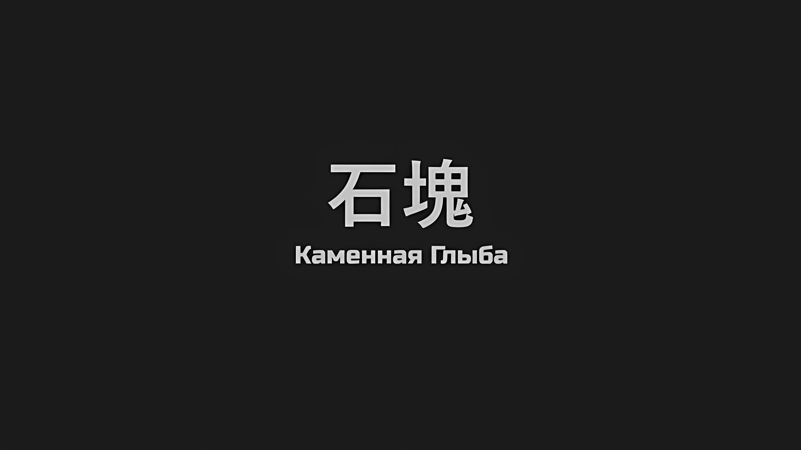
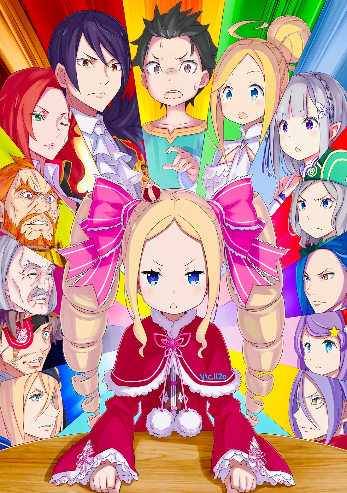

*※※※※※※※※※※※*

…«Каменная Глыба», Муспель.

Считаясь одним из Четырех Великих, он был древним Великим Духом, укоренившимся в обширных землях Империи Волакия.

В отличие от «Сакрального Зверя», «Истребительницы» и «Арбитра» других стран, это было существо, которое не оставило в анналах истории никаких добровольных действий или претензий. Хотя о его существовании в Волакии было известно, никакой дополнительной информации или наблюдений не всплывало; можно даже сказать, что это был самый что ни на есть Дух.

Такова была природа «Каменной Глыбы», Муспеля, считавшегося неизменной Святыней.

Субару: Именно так мне мило объяснила Беако, но разве это не другое?

Поскольку Субару не хватало знаний о Четырех Великих Духах, Беатрис пересказала ему анекдот о Муспеле. Он с интересом выслушал ее анекдот, но его содержание сильно противоречило реальной ситуации.

Великий Дух, местонахождение и истинная форма которого были неизвестны, — такова была история Муспеля, однако…,

Субару: Твоя уверенность в том, что враг его украл, противоречит тому, что ты выяснил его местоположение. Но на самом деле все наоборот, Муспель был здесь, в Укрепленном Городе. …Это ошибочно?

Субару с вопросом ткнул указательным пальцем в угрюмое лицо Авеля. От его вопроса черные глаза Авеля сузились, но, прежде чем он успел открыть рот…,

???: Эй, да у тебя дохера наглости, раз ты так разговариваешь с Его Превосходительством Императором.

Неожиданно резкий тон вклинился между Субару и Авелем, и со сцены подул ветер. Сразу же после этого кончик указательного пальца Субару, белая часть ногтя, был внезапно срезан.

Со свистом обнаженное лезвие рассекло ветер и его ноготь, в результате чего Субару закричал: «Дхоуоу!».

А затем…,

???: Ты, сопляк! Знай свое место, свое место, мать твою!

Субару: Именно это я и должен был сказать! Ты же не станешь внезапно срезать мечом ногти ребенку!

Держась руками за внезапно вырвавшийся наружу порыв, Субару плюнул в сторону виновника чудовищного поступка… в сторону Джамала.

По какой-то причине Джамал, которому было позволено сопровождать Авеля с момента прибытия в Гарклу, внезапно отрезал Субару ноготь с помощью выхваченного меча.

Субару посмотрел на него в недоумении от такого чересчур необдуманного поведения,

Субару: Я думал, ты стал немного лучше, но, как и ожидалось, я тебя ненавижу!

Джамал: А? Я тоже не горю желанием, чтобы меня любил соплежуй. …И,

Когда он сообщил Кате новость о гибели Тодда, он наивно полагал, что сможет вести рациональный разговор.

Когда Субару протестовал против неизменно грубого отношения Джамала, последний попытался проигнорировать разницу в возрасте и вступить в конфронтацию, но это незрелое отношение было пресечено поднятием руки.

Не кто иной, как Авель, сидящий за круглым столом, приказал ему «Прекратить».

Винсент: Не затевай ненужных склок. Учти, что твоя ценность, как я ее понимаю, заключается в том, что ты относительно легко используемая пешка. Сейчас не время воевать с Королевством.

Субару: Воевать с Королевством… ах.

Субару насупил брови, услышав, как Авель это сказал, а затем обернулся, когда понял, в чем заключалось его намерение.

Когда он это сделал, те, кто был на стороне Королевства, стали свидетелями текущего обмена мнениями между Субару и другими… Понятно, что Эмилия, Беатрис и Спика посмотрели на Джамала с упреком.

Если бы это противостояние продолжалось, то скорое вступление девушек в бой было бы неизбежным.

Однако, не понимая всей серьезности ситуации, Джамал нахмурился и нехотя осекся.

Джамал: Если Его Превосходительство Император так сказал… Тц, ты избежал казни, сопляк.

Субару: Удивительно, что у тебя все еще хватает смелости говорить это в такой ситуации… У меня такое ощущение, что мы только что были на грани распада нашего альянса и гибели Империи.

Когда Император остановился, вздохнув при виде Джамала, который под взглядами друзей Субару так и остался невозмутимым, Субару посмотрел на Авеля.

Он оценивал Джамала как легкого в использовании, но на самом деле все выглядело совсем не так.

Субару: Ты же не собираешься совершать что-то вроде неосторожного убийства на таком позднем этапе игры?

Винсент: Фактически, если бы кто-то сдался с моей головой на руках, полагаю, это не было бы для него ущербом. Такое отношение крайне нормально для имперского солдата… слегка избыточно вспыльчив, но не до такой степени, как Сесилус.

Субару: Нечестно использовать Сеси в своем сравнении…!

Субару был взбешен Авелем, который сказал такую несмешную шутку и привел пример, который нельзя было ни подтвердить, ни опровергнуть. Не обращая внимания на его реакцию, Авель жестом велел Джамалу отойти, а затем снова посмотрел на Субару.

Его поза, отвечающая на указательный перст и вопрос Субару, показывала, что он готов раскрыть информацию о «Каменной Глыбе», которая чуть не отклонилась в сторону по касательной.

Винсент: Вопрос, который ты фыркнул минуту назад, подтверждаю. «Каменная Глыба» действительно находилась в пределах Укрепленного Города. Были приняты меры, чтобы задержать ее здесь, превратив этот город в Святыню.

Беатрис: …Невероятно, я полагаю.

Вновь Авель постучал пальцем по круглому столу, производя твердый звук и раскрывая правду. В ответ на это Беатрис непроизвольно подала голос.

С ее очаровательным профилем, когда она плотно сжала губы,

Беатрис: Какая, в самом деле, возмутительная история. Среди Четырех Великих Духов «Каменная Глыба» — самая сложная для достижения взаимопонимания; так ее описывала Матушка, я полагаю.

Субару: Среди Четырех Великих Духов самая сложная…

Беатрис: Кстати, среди Четырех Великих Духов тот, кто больше всего не умеет правильно слушать, — это «Сакральный Зверь», а тот, с кем больше всего не следует разговаривать, — это «Истребительница». А еще тот, с кем больше всего бесполезно разговаривать, — это, в самом деле, «Арбитр».

Субару: Разве это все не одно и то же!? Пак, пожалуйста, вернись!

Он не мог скрыть своего ошеломления при виде состава, который заставлял его все сильнее тосковать по Паку.

По сравнению с вызывающими тревогу титулами «Истребительница» и «Арбитр», титулы «Каменная Глыба» и «Сакральный Зверь», как ни странно, производили более мягкое впечатление.

Субару: Если с «Каменной Глыбой» нельзя поговорить, то я думал, что «Сакральный Зверь», по крайней мере, звучит чуть лучше, однако…

Беатрис: Матушка называла «Сакрального Зверя» доброжелательным монстром, я полагаю.

Субару: Ой-ой, я склонен увидеть все достопримечательности этого мира, но нет ни одной знаменитости, с которой я хотел бы повстречаться… Разве это не удивительно?

Проведя в этом мире больше года, Субару время от времени слышал имена известных личностей, но большинство из них носили довольно тревожные титулы, так что они ему немного надоели.

Хотя, возможно, большую роль в этом сыграл тот факт, что он уже был знаком с такими положительными знаменитостями, как Королевские Кандидатки и «Святой Меча».

Тем не менее…,

Отто: Я впервые слышу такие выражения, как Святыня и задержание «Каменной Глыбы». Я думаю, что это, возможно, фразы, уникальные для Волакии, но что именно они означают?

Винсент: Говоря простым языком, «Каменная Глыба» — это Великий Дух, управляющий атрибутом Земли. Поэтому земля, которую он использует в качестве места отдыха, естественно, получает защиту его особых качеств. Помимо того, что он возделывает плодородную почву, он также оказывает положительное влияние на оздоровление тех, кто живет на этой земле.

Отто: …Понятно, это гораздо более значимая роль, чем я думал.

Отто, который вмешался с вопросом, прикрыл рот рукой в удивлении от ответа Авеля.

По сути, в пределах влияния Муспеля процветало сельское хозяйство, а также ускорялось выздоровление больных и раненых. Казалось, он обладал преимуществами сродни горячему источнику, состоящему из одних только благ.

Если бы можно было управлять положением Муспеля по своему усмотрению, это было бы…,

Анастасия: Должна сказать, эту историю нужно скрывать гораздо больше, чем ложь о том, что Укрепленный Город находится в процессе реконструкции. Что одним из столпов, поддерживающих сильную национальную мощь Империи, является «Каменная Глыба».

Юлиус: И все это он раскрыл нам, жителям другой страны. …Я приму это как знак степени решительности Его Превосходительства Императора Винсента.

Анастасия: Не знаю, почувствуют ли они себя в опасности, если будут слишком открыто рассказывать о своих секретах, но… Я в некотором роде понимаю чувства, связанные с желанием избежать внутренних конфликтов.

Отношение Анастасии и Юлиуса было естественным для представителей иностранных держав.

Конечно, как добавила Анастасия в конце, не похоже, чтобы у Империи не было перспектив раскрыть слишком много неблагоприятной информации.

Эмилия: Если это было что-то, что он действительно хотел сохранить в тайне, разве Авель не мог использовать различные способы выражения, чтобы это скрыть? Поскольку он этого не сделал, это наводит меня на мысль, что это был не совсем тот случай.

Субару: Все так, как говорит Эмилия-тан. У этого парня отвратительный характер и он действует с извращенной мудростью. Он мог бы даже обмануть таких людей, как Розвааль или Анастасия-сан, если бы захотел. Даже если вам так не кажется, это предельная искренность Авеля.

Винсент: И все же удивительно, что полуэльфийка не источает никакого чувства наглости. Ты, в наши дни такая похвала дается нелегко.

Несмотря на то, что Субару из кожи вон лез, чтобы проследить за ходом разговора, Авель ответила так, что дальнейшие действия были бы бесполезны, поэтому он поджал губы.

Положив конец действиям Субару и других, Флоп хлопнул в ладоши, чтобы привлечь всеобщее внимание. Затем он кивнул со словами: «Все так, как говорят Мистер и остальные».

Флоп: Его Превосходительство Император-кун раскрыл правду. Уже одно это говорит о срочности дела, наряду с темой, которую нельзя обойти стороной, чтобы объяснить наихудший вариант развития событий.

Розвааль: Наихудший вариант… Вы имеете в виду гибель обширных земель Империи, о которой упоминааал~ Его Превосходительство Император?

Флоп: Именно так!

Энергично кивнув, Флоп подтвердил слова Розвааля.

Гибель обширных земель Империи… Использование «Каменной Глыбы», Муспеля, было самым наихудшим из возможных сценариев «Великого Бедствия», обрушившегося на Империю Волакия.

И, прежде чем этот сценарий был раскрыт Субару и остальным, выяснилась причина, по которой Авеля сопровождал Флоп, считавшийся не более чем гражданским лицом…,

Флоп: Это был фальшивый Император-кун, который доверил мне информацию о Святыне, чтобы я передал ее Его Превосходительству Императору-куну… но его намерения заключались не в сотрудничестве с Великим Духом, которым является «Каменная Глыба», а в предупреждении о том, что «Каменная Глыба» может быть использована в планах врага.

Субару: Понятно. Флоп-сан, ты смог напрямую встретиться с самозванцем-Авелем, хах.

Флоп: Да. У меня нет квалификации, чтобы дать ответ или высказать мнение о том, почему он так себя повел, но… Это в моей природе — выполнять то, что мне поручено.

Флоп все еще выглядел бледным из-за потерянной крови. Его ответ, демонстрирующий неизменное сильное чувство долга, стал облегчением для Субару, который теперь думал о фальшивом Императоре.

Фальшивый Император, который сверг Авеля с трона и потерял свою жизнь вместо него…… О его истинных намерениях можно было только догадываться, как и тогда, когда он соперничал с Авелем, и ответ на этот вопрос не будет услышан до конца вечности.

Тем не менее, тот факт, что человеком, которому он доверил послание, оказался Флоп, был одним из наилучших возможных ходов, которые сделал фальшивый Император.

Эмилия: Хмм, исходя из того, что вы говорите, возможно, у Империи есть контракт с Муспелем?

Винсент: Если контракт, о котором ты думаешь, это тот, что связывает вместе Духа и Пользователя Духовных Искусств, то ты ошибаешься. У «Каменной Глыбы» нет для этого сознания. Мы никак не можем предложить ему контракт, в котором наша сторона была бы выше или равнее.

Субару: Волакия поднимает вопрос о преимуществах и недостатках в контрактах с Духами. Взгляни на наши с Беако чистые, праведные и очаровательные отношения.

Беатрис: Верно, в самом деле.

Винсент: Это выглядит не более, чем игра детей.

Взявшись за руки с Беатрис, они вдвоем продемонстрировали, как легко шагают вместе, и Авель сделал комментарий. Не обращая внимания на Субару, который вместе с Беатрис надул щеки, он продолжил обсуждение.

Винсент: С «Каменной Глыбой» не было заключено никаких клятв. Тем не менее, он продолжал находиться на территории Империи. Вот почему мы воспользовались нашими с ним отношениями, однако… в то же самое время он продолжал продвигаться в недра Империи, распуская свои корни.

Субару: Свои корни?

Винсент: Думай об этом, как о корнях дерева. Дерево с толстыми и длинными ветвями может укрепить почву, к которой оно прикреплено, но, наоборот, если это дерево вырвать с корнем, что станет с землей?

Анастасия: …Она станет настолько пористой и хрупкой, что рассыплется от малейшего прикосновения.

Анастасия вкратце подытожила вопрос Авеля.

В обмен на продолжение обогащения обширных земель Волакии Муспель связал свою судьбу с самой Империей.

И затем…,

Субару: Подожди, то есть, когда ты говоришь, что смерть Муспеля станет концом для Волакии, ты имеешь в виду, что это будет буквально конец Волакии? Разве это не безумно плохо!?

Другими словами, это было что-то сродни раскрытию существования бомбы, способной разнести саму Империю на куски.

Это была государственная тайна, которую необходимо было скрывать, нечто, с чем Волакии придется иметь дело не только сейчас, но и навсегда после этого. На этом факте удивление Субару, наконец, догнало разумных людей.

Однако…,

Винсент: Глупец, не будь таким паникером.

Субару: Как ты можешь не паниковать! Хах! Только не говори мне, что, как только все это закончится, ты намерен заставить замолчать всех и каждого из нас, кто знает этот секрет…

Винсент: Не стоит недооценивать нас в этом отношении. Если бы таково было мое намерение, неужели ты полагаешь, что я позволил бы тебе питать такие подозрения? Интриги и заговоры являются прерогативой не только Священного Королевства.

Субару: Не лучше ли будет, если Империя, которая этим кичится, и Священное Королевство, которое этим славится, окажутся уничтоженными?

В связи с размахом дела, темы национального масштаба поднимались с дикой несдержанностью, и хотя Империя шла в разрез, Священное Королевство тоже не представляло собой ничего достойного. Субару также думал, что ему пришлось пережить довольно плохие вещи, однако следует помнить, что Королевство Лугуника было гораздо более приятным местом для жизни.

Субару: Ну, хоть это и был ад на земле, но как только я встретил Эмилию-тан и других, больше не было сомнений в том, что Королевство Лугуника является самым райским местом.

Эмилия: Извини, я понятия не имею, о чем ты говоришь.

Субару: Ничего, ничего, я просто разговариваю сам с собой. …Так что смысл предыдущей темы пусть обсуждает он сам.

Субару улыбнулся Эмилии, когда она наклонила свою голову, а затем вернулся к попытке поймать интерес Авеля относительно рассматриваемой темы. В ответ на это Авель спокойно закрыл глаз и скрестил руки на груди,

Винсент: Правитель, который закрывает глаза на нелепый поступок, вопиющий до такой степени, как вверение своего сердца другому, должен быть не в своем уме. Конечно, процесс отсоединения корней «Каменной Глыбы» от этой страны продвигался вперед. Твои опасения не учитывают сложности обнаружения этого и утверждения жизней в соответствии с этим, что, попросту говоря, является бессмыслицей. Подобное равносильно вызову Дракона с помощью пера.

Субару: Если бы я сказал: «Попался! Рад это слышать!», то это не соответствовало бы тому, как мы говорили о нехватке времени ранее. Процесс отсоединения может и продвигался, но не мог быть выполнен вовремя, что и вызвало эту ситуацию… Так?

Винсент: …

Субару: Не молчи только потому, что шансы против тебя!

Молчание Авеля в ответ на точную догадку стало подтверждением того, что подозрение Субару попало в точку.

Когда-нибудь Волакия, возможно, сможет разорвать их общую с Муспелем судьбу. Однако сейчас это время не наступило, и на него нельзя было ссылаться как на ключ к выходу из их бедственного положения.

Винсент: Другими словами, судьбы «Каменной Глыбы» и нас, граждан Империи, переплетены. До тех пор, пока эти орды нежити будут нас преследовать, а мы будем отчаянно продолжать их отгонять, мана «Каменной Глыбы» в конце концов иссякнет, и земли Волакии не смогут спастись от разрушения. Также я слышал, что солдаты, потерявшие свои жизни в бою, сразу подвергаются воскрешению. Одним словом…

Розвааль: Мы оказались в ситуации, когда и победа над слишком большим количеством противников, и потери с нашей стороны являются нежелааательными~.

Серена: Похоже на то. Их намерения завораживающе нелогичны, а их жестокости нет предела.

Вдобавок к тому, что они были вынуждены отвечать на инициативу противника, даже условия их оборонительного сражения были заданы как нечто ужасно злое.

Субару не понимал, почему Серене это так нравилось, но, присмотревшись к неумолимой тактике противника, который не ограничился использованием нежити для пробивания себе пути, он смог уловить проблески их инициативы в том, чтобы привести Империю к окончательному краху…,

Эмилия: …Но, интересно, почему Сфинкс совершает такие поступки?

Субару: А?

Когда Эмилия озвучила сомнение, всплывшее у нее в голове, Субару моргнул от ее слов.

Страшный враг, воскресивший многих мертвецов, покоящихся под землей Империи, и в настоящее время принимающий меры для ее гибели — это событие, расцениваемое как «Великое Бедствие». Личность и планы такого врага… Сфинкс, «Ведьмы», были совершенно ясны в деталях.

Однако мотив «Ведьмы», в отношении которого Эмилия выразила свое сомнение, был…,

Субару: Конечно, разве это не потому, что она хочет уничтожить Империю…? Впрочем, не то чтобы я не понимал ее чувств.

Отто: Оставляя в стороне истинные чувства Нацуки-сана, это не является адекватным ответом на вопрос Эмилии-сама. Если предположить, что лидером оппозиции является «Ведьма», которая в прошлом бесчинствовала в Королевстве Лугуника, то все обиды, которые они затаили, должны быть направлены на Королевство.

Юлиус: Тем не менее, «Ведьма» устроила восстание с участием мертвецов Империи. Это, конечно, неправдоподобно. Однако есть вероятность, что Империя была тем местом, где могли быть выполнены условия.

Отто: Условия?

Обозначив вопрос Эмилии как начало своей теоретизации, Отто и Юлиус установили зрительный контакт друг с другом.

Пока Отто выяснял остальную часть дедукции Юлиуса, Рыцарь приложил пальцы к своему узкому подбородку,

Юлиус: Армия зомби с сочетанием «Таинства Бессмертного Короля» и магии восстановления… Для того чтобы это осуществилось, необходимо было существование Четырех Великих, которые обладают необычайным количеством маны. Именно поэтому «Ведьме» удалось актуализировать заклинание в Империи, и…

Тут Юлиус сделал небольшую паузу, а затем окинул взглядом лица всех присутствующих в зале заседаний,

Юлиус: Возможно, это может быть план вторжения в Королевство после разрушения Империи.

Субару: Что…

Гоз: …Это просто нелепо!!!

Как раз в тот момент, когда Субару потерял дар речи, услышав о вероятности такого события, которого так боялся Юлиус, Гоз взорвался ревом негодования. Собрав руку в чрезмерно сжатый кулак размером с детскую голову, Гоз скрежетал зубами, сохраняя при этом минимум рациональности, чтобы не сломать круглый стол.

Гоз: Если вы правы в своих рассуждениях! Вы хотите сказать, что нахождение нашей дорогой Родины на грани уничтожения является лишь побочным результатом этого бедственного положения!?

Анастасия: Если быть точнее, то это, скорее всего, первый этап плана по нанесению удара в сторону реальной цели. Что ж, с учетом местонахождения «Каменной Глыбы», запасов зомби и всего прочего, этот этап, вероятно, движется шаг за шагом с очень давних пор.

Гоз: Гх, гррррррх…!!!

Анастасия, вероятно, не имела такого намерения, но ее дополнительное объяснение не смогло утихомирить гнев Гоза. Скорее наоборот, он рычал от досады, и Джамал, похоже, был в такой же ярости. Никто, наверное, не смог бы смириться, если бы им сказали, что кризис, происходящий на их родине, был чисто случайным.

Субару обдумал их переживания с долей сочувствия, а затем заметил выражение лица Беатрис, которая была рядом с ним.

Субару: Беако?

Беатрис: …Идея Юлиуса понятна, я полагаю. Однако… Розвааль.

Розвааль: Конечно, я понимаю твои опасения. …Может ли быть так, что Сфинкс действительно несет в себе человеческие эмоции, достаточные для того, чтобы ее действия были расценены как месть Королевству? Именно поэтому я не могу отделаться от мысли, что идея, предложенная Рыцарем Юлиусом, верна лишь наполовину.

Субару: Под половиной идеи Юлиуса ты подразумеваешь…

Розвааль: В Империи были соблюдены все условия. Поэтому она сделала то, что сделала. Вот и все.

Розвааль закрыл один глаз, оставив свой желтый открытым, в то время как Субару резко вдохнул при его словах. Беатрис, мрачно стоящая рядом с ним, хранила молчание, поскольку была с ним согласна.

Если линия мышления Юлиуса была точна, то нынешние события в Империи никак не были связаны с Королевством, а значит, Королевство очень скоро может столкнуться с таким же кризисом.

Однако если теория Беатрис и Розвааля была верна, то ситуация между ними и оппозицией была за гранью спасения.

И тогда…,

Беллстетз: Так или иначе, «Ведьма» уже взяла в руки оружие и натянула тетиву против Империи. Теперь, когда опозорены даже жизни имперской знати, у нас не осталось другого выбора, кроме как искоренить нашего врага. Разве не так?

Серена: Ваше заявление произвело на меня довольно пылкое впечатление, премьер-министр. Как я и думала, инцидент с Ее Превосходительством Ламией породил гнев, который ваш желудок не в силах подавить?

Беллстетз: …Да, есть проблемы?

Если Серена хотела над ним подшутить, то его реакция была не совсем такой, какой она ожидала.

Хотя Беллстетз сохранял внешнее спокойствие, по его невыразительному, узкоглазому лицу ясно чувствовалась ярость по отношению к оппозиции.

Услышав его слова, Серена провела пальцем по шраму, оставшемуся после ранения мечом на ее лице,

Серена: Нет? То, какой ты сейчас, гораздо больше соответствует моим вкусам в отношении мужчин.

Беллстетз: Это довольно пугающие слова.

Серена: Хахаха! Хотя, я считаю себя симпатичной, если сделать вид, что моего шрама не существует.

Оценив Беллстетза, который таким образом изменил свое мнение, Серена разразилась смехом.

Если не принимать во внимание обмен мнениями между этими двумя, то истина в этом вопросе была именно такой, какой и сказал им Беллстетз. У них не было другого выбора, кроме как встретиться с командиром армии нежити, Сфинкс, в финальной схватке.

Независимо от ее цели, они должны были это сделать.

Субару: Итак, ты в порядке, Эмилия-тан?

Эмилия: …Мхм. Это то, чего мы не узнаем, даже если изо всех сил постараемся подумать. Было бы здорово, если бы у нас была возможность услышать это непосредственно от Сфинкс, но…

Субару: Мы столкнулись с ней лишь на мгновение, но она не показалась нам кем-то, с кем можно было бы поговорить.

Беатрис: В самом деле, Бетти согласна с Субару. Бетти, я полагаю, также считает, что с ней трудно поддерживать разговор.

Используя свою собственную жизнь для «Посмертного Бегства», Сфинкс нацелилась на соединенные драконьи повозки.

За то небольшое количество бесед, которое состоялось между ним и Сфинкс, Субару почувствовал, что она совершенно лишена какого-либо рвения, точно так же, как и ее тактика, которая рассматривала жизнь как одноразовый ресурс. Она не реагировала ни на какие провокации, исходящие от тех, против кого ее эмоции оставались непоколебимыми. Она была тем типом врагов, с которым Субару было тяжело иметь дело.

Следовательно, даже с «Посмертным Возвращением» она была чрезвычайно сильным противником.

Субару: Тем временем наш враг неуклонно увеличивает количество своих зомби, а также сокращает силу, оставшуюся в Великом Духе Муспеле. Мы просто окажемся в невыгодном положении в битве на выносливость.

Анастасия: Хотя собирать боеспособные войска со всей Империи и начинать очередную атаку на столицу Империи… тоже не лучший вариант. Столкновение больших армий друг с другом — это простая война на истощение. Ущерб будет еще больше.

Отто: Мы связаны условием, при котором мы не можем позволить себе никаких потерь с нашей стороны и со стороны оппозиции… А это значит, что для плана по спасению Империи от надвигающегося «Великого Бедствия» остался только один вариант.

Субару, Анастасия и Отто говорили друг за другом, и спонтанно все взгляды устремились на Авеля, который сидел за круглым столом. Каждый гражданин Империи был вовлечен в этот инцидент, и как человек среди них, стоящий на гребне, он рассматривал взгляды всех как нечто ожидаемое, а затем,

Винсент: …Мы вторгнемся в столицу Империи с небольшим элитным подразделением и захватим «Ведьму», которая является организатором. Таким образом, путь к «Великому Бедствию», который они так скрупулезно проложили, будет ликвидирован.

…Знаменуя начало заключительной фазы битвы, начавшейся в Империи Волакия, он уверенно объявил об их стратегии по предотвращению «Великого Бедствия».

*△▼△▼△▼△*

С завершением заседания круглого стола они достигли точки остановки.

В соответствии с установленной политикой, с этого момента должен был начаться отбор личного состава для отправки на блицкриг и разработка плана по нападению на столицу Империи.

Однако, прежде чем это обсуждение началось всерьез…,

Беллстетз: …Я и не подозревал, что «Каменная Глыба» была расположена в Гаркле.

В конференц-зале, где остались только Император и премьер-министр, именно Беллстетз растопил лед.

Это был короткий промежуток времени, на котором отсутствовали не только члены союзного Королевства, но и те, кто был на стороне Империи, такие как Серена и Гоз. Даже Джамала, сопровождающего, заставили ждать снаружи комнаты, так что в дискуссии участвовали только лидеры Империи… хотя если бы это было правдой, то присутствовал бы еще один человек.

Винсент: В итоге ты тоже полностью поддался на схему Чиши?

Беллстетз: Похоже, что так. Если бы все шло по плану, то Святыня должна была находиться недалеко от юго-западного Города Облачного Моря… Мезореи примерно в это время. В какой момент времени я был лишен зрения?

Винсент: Твои глаза кажутся закрытыми. Лишить тебя зрения, должно быть, было очень просто.

Беллстетз: Они кажутся закрытыми, но это не так. Как раз поэтому они так эффективны в профилактике… именно так сказал бы обиженный неудачник после того, как его действительно обманули.

Медленно покачав головой, Беллстетз пробормотал это, словно сокрушаясь о своей оплошности. Однако Винсент не считал это виной Беллстетза.

Как это часто бывало, Чиша просто превзошел ожидания Винсента и Беллстетза.

В дополнение к обману Императора и премьер-министра, Чиша также подготовился к тому, чтобы выяснить, какие ловушки расставит грядущее «Великое Бедствие».

Беллстетз: Если «Каменная Глыба» не была использована, мы могли бы воспользоваться Укрепленным Городом в качестве базы и укрепить нашу оборону. Если же «Каменная Глыба» была скомпрометирована, то…

Винсент: Другими словами, его используют для реализации плана «Великого Бедствия». Похоже, этот безмерный глупец придумал множество способов уничтожить Империю и мысленно воплотил их в жизнь. Следовательно, он попал прямо в цель.

Беллстетз: Я не знал, какие меры предпринять против того, кто замышляет узурпацию, и никак не ожидал увидеть того, чьей целью было посеять хаос. Отныне я буду стараться быть строже.

Винсент: …Тогда действуй.

Винсент был немного озадачен тем, что Беллстетз озвучил свое видение будущего этим «отныне».

После того как это дело будет улажено, Беллстетз уйдет с поста премьер-министра, так как, по его мнению, не исключена возможность того, что он попытается совершить мученическую смерть за Ламию.

Беллстетз: Поскольку Ее Превосходительство Ламия отказалась это сделать.

Найдя вопрос в этой мгновенной пустоте, Беллстетз сам на него ответил.

Услышав это, Винсент ничего не сказал. Только слегка фыркнул. В ответ на реакцию Винсента Беллстетз продолжил: «Тем не менее»,

Беллстетз: Я был удивлен, услышав, что Ваше Превосходительство говорит о «Каменной Глыбе» и Святыне. Трудно сказать, есть ли у нас хоть какая-то надежда отделить «Каменную Глыбу» от земли.

Винсент: Как только этот вопрос будет решен, мы приступим к работе над национальной политикой, которую мы отложили на потом. Если мы не сможем добиться результатов к тому времени, когда через два года истечет срок действия пакта о ненападении с Королевством, то не будет завтрашнего дня, чтобы добиться успеха сегодня.

Беллстетз: Это так? Кстати,

При этих словах Беллстетз сделал небольшую паузу и слегка приоткрыл свои нитевидные глаза.

Беллстетз: Хотя я уверен, что вы осведомлены, метод, использованный для удержания «Каменной Глыбы», не подлежит разглашению. Это не только тайна Империи, но и вопрос твердой уверенности наших союзников.

Винсент: В конце концов, Нацуки Субару и полуэльфийка-Пользователь Духовных Искусств категорически не приемлют даже видимость несправедливости. …Было бы неприятно, если бы они узнали, что мы использовали осужденных на смертную казнь в качестве контракторов «Каменной Глыбы», избавляясь от них после их смерти.

Беллстетз: Ваше Превосходительство.

*Не говорите неосторожных слов*; когда Беллстетз сделал ему такое предупреждение, Винсент пожал плечами.

Во время конференции Эмилия спросила его, есть ли у «Каменной Глыбы» и Империи договорные отношения, и Винсент ответил, что договорных отношений в том виде, в котором она их понимает, не может быть.

Это не было ложью; это была простая констатация факта.

Самым простым способом удержать «Каменную Глыбу» был контракт между Духом и человеком.

Однако «Каменная Глыба» не обладала самосознанием, и у нее не было ни места, ни окна для переговоров относительно контракта. Поэтому ценой заключения контракта с «Каменной Глыбой» неизменно было бремя огромного количества небытия, которое вливалось в контрактора.

Ощущение того, что ты круглосуточно делишь свое тело с абсурдно большим существом, с которым невозможно взаимопонимание, очень легко сломило бы человеческий разум, доведя его до состояния, когда он уже не мог бы сохранять свою первоначальную форму.

В обмен на неизбежное обесчеловечивание природа «Каменной Глыбы» заключалась в том, чтобы соответствовать текущему местоположению контрактора.

Поэтому Империя удерживала «Каменную Глыбу» и принудительно законтрактованных смертников в землях, где требовалась Святыня, и распределяла ее преимущества по различным регионам. Поскольку разыскать «Каменную Глыбу» после потери ее местонахождения было практически невозможно, пополнение рядов приговоренных к смерти было делом первостепенной важности.

И перед началом решающей битвы за столицу Империи, Чиша, замаскировавшись под Императора, переместил «Каменную Глыбу» в Укрепленный Город Гарклу, готовясь к «Великому Бедствию».

Но в городе не было никаких следов смертника, заключившего контракт с «Каменной Глыбой».

Беллстетз: Если он был перемещен, то выследить его без каких-либо зацепок будет невозможно. Если это так, то единственное, что можно получить, разгласив подробности, — это недоверие наших союзников.

Винсент: Хотя, даже если я намеренно не произносил этого вслух, наверняка нашлись те, кто об этом догадался.

Вспоминая лица на конференции, Винсент закрыл один глаз, когда в его памяти всплыло несколько подходящих личностей.

Беллстетз был прав; они не хотели создавать внутренний разлад в этой ситуации. Наверняка те люди, которые об этом догадывались и молчали, имели такое же намерение.

В любом случае, после того как «Каменная Глыба» была украдена из Укрепленного Города, она перестала быть пригодной для использования пешкой и превратилась в ожидающую катастрофу, местонахождение которой теперь было неизвестно.

Если не было лучшего решения, чем подчинить себе «Ведьму», Сфинкс, то даже если бы они сознательно обеспокоились этим существованием, в этом не было бы никакого смысла…

Винсент: …

Беллстетз: Ваше Превосходительство?

Завидев реакцию Винсента, который внезапно замолчал, Беллстетз окликнул Императора.

На этот зов Винсент покачал головой, ответив: «Нет».

На мгновение ему в голову пришла некая мысль, но это была слишком ничтожная возможность, чтобы включать ее в свои планы на будущее.

И уж тем более с тем, с кем трудно было справиться, уступая лишь самому сложному существу в Империи, которое нужно было обуздать…

Винсент: …Если и есть какая-то возможность постичь местонахождение «Каменной Глыбы», то только с помощью кого-то сродни охотничьей собаке с чутким нюхом на необычную добычу, однако это слишком большие надежды.

*△▼△▼△▼△*

…В то же самое время, где-то в столице Империи Рапгане.

В темноте, лежа на сырой и твердой земле, это существо оставалось неподвижным.

Оно несло на себе тяжесть ран. Истощение разума и тела также сыграло немалую роль. Однако самая главная причина, по которой оно не могло двигаться, заключалась в том, что была нанесена рана в гораздо более важную часть себя, чем сердце… Рана в душу — вот в чем была причина.

То, о чем это существо всегда молилось и во что верило с давних пор, было отвергнуто и пало на землю.

С самого рождения и до сегодняшнего дня, несмотря на то, что не было ничего, чем бы оно дорожило больше, оно было отвергнуто никем иным, как этим самым сокровищем.

Оно потеряло из виду свою причину, свой смысл жизни.

Оно отказалось от своей собственной ценности, от причины своего существования и от того, что оно может делать.

Однако, только лишь однако, когда оно растянулось на влажной земле, грудь этого существа поднялась и опустилась в дыхании, и оно пробормотало.

???: Принцесса…

Обращаясь к тому, кто отрицал его значение, будто цепляясь, словно молясь, слабым голосом, оно пробормотало это.

И это существо лишь слабо продолжало бормотать и бормотать.
