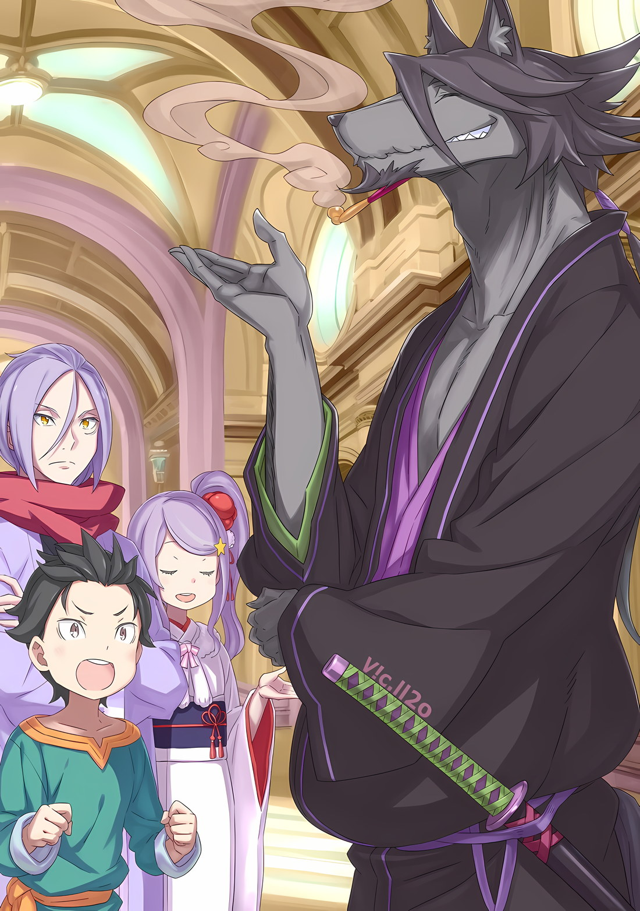

*※※※※※※※※※※※*

…Операция блицкрига по предотвращению разрушения Империи Волакия, вызванного «Великим Бедствием».

Теперь, когда стало ясно, что лобовая конфронтация с постоянно возрождающейся армией нежити — это риск, который только ускорит их гибель, требовалось урегулирование быстрым ударом.

Поскольку они не могли позволить себе натравить друг на друга большие армии в решающей битве между живыми и мертвыми, вполне естественно, что они решили отправить небольшое количество элитных войск на миссию по штурму вражеских линий.

Если и возникала проблема, то она заключалась в…,

Субару: …Кто будет совершать набег на оперативную базу противника?

Скрестив руки, Субару наблюдал за происходящим, сидя на полу в центре комнаты.

В просторной комнате большой крепости Укрепленного Города Гаркла, идеально подходящей для сбора больших групп людей, были собраны союзники Субару, за исключением лиц, связанных с Империей.

Присутствовали и те, кто пропустил предыдущую встречу, потому что занимался лечением раненых… Рам и Гарфиэль, Петра и Фредерика, а также, разумеется, Рем.

Естественно, Анастасия и Юлиус тоже присутствовали, так как не были связаны с Империей…,

Субару: Я рад, что Халибель-сан тоже вернулся целым и невредимым.

Халибель: Оу, как мило с твоей стороны обо мне беспокоиться. Что ж, маленькой Ане очень со мной тяжело, поэтому я искренне рад, что ты так ценишь мои старания.

Халибель, прислонившись спиной к стене и держа во рту кисэру, улыбнулся, отвечая на ободряющие слова Субару.

Сильнейший человек-волк Городов-государств противостоял черному Дракону, появившемуся перед атакой нежити во время битвы на соединенных драконьих повозках… ему приписывали победу в удержании зомби-Дракона на расстоянии.

Благодаря тому, что он не дал зомби-Дракону приблизиться к драконьим повозкам, ущерб был сведен к минимуму. Он был выдающимся шиноби, о чем свидетельствовал тот факт, что он в одиночку убил Дракона.

Однако, услышав комментарий Халибеля, Анастасия сделала недовольный вид.

Анастасия: О чем ты? Если так рассуждать, то можно подумать, что я бессердечный работодатель. Разве я тебе не говорила, что за свою работу ты получишь достойную плату?

Халибель: Видишь, именно об этом я и говорю. Она превратилась в не очень милого ребенка, который пытается все решить, оценивая прибыль и убытки… Вседозволенная родительская политика Рикардо сделала ее хитроумной, не находишь?

Анастасия: Хааалииибееель.

Халибель: Да, да, я принимаю свое поражение.

Разговор на карарагском диалекте между этими двумя был улажен легкомысленным обращением Анастасии.

Хотя они знали друг друга уже давно, легкость, с которой они общались, напоминала пожилого мужчину и маленькую девочку, которые являлись родственниками. Анастасия была миниатюрной, с детским личиком, но ее характер был противоположен детскому, поэтому было необычно получить от нее такое впечатление.

Независимо от впечатления Субару, Халибель, проигравший в споре с Анастасией, сказал: «Что ж, так тому и быть», чтобы вернуть разговор в нужное русло.

Халибель: Сражаясь с ними, я выяснил, что зомби в Волакии немного отличаются по принципу действия от зомби в Карараги. Пожалуй, они мне ужасно не подходят.

Субару: Зомби в Волакии и в Карараги отличаются друг от друга? Что ты имеешь в виду? Только не говори мне, что на данном этапе есть еще одна причина для возникновения зомби-паники?

Халибель: Не, ни в коем случае. У меня сложилось впечатление, что… зомби в Империи круче. Я слышал, что та, кто все это устроила, причиняет вред Великому Духу Империи, так что, возможно, дело в расстоянии.

Субару: В расстоянии…

Халибель высказал свое мнение, покачивая кисэру вверх-вниз между зубами.

Тонкая разница в нюансах была непонятна Субару, который не был знаком с нежитью в Карараги. Однако раз кто-то столь компетентный, как Халибель, почувствовал это, то разница должна была присутствовать.

Но ему не хотелось думать, что зомби действительно использовались одновременно и по разным причинам.

Юлиус: У меня складывается впечатление, что это скорее вопрос полноты, чем расстояния.

Анастасия: Что ты имеешь в виду, Юлиус?

Юлиус: Поскольку Халибель описал их как крутых, то, должно быть, это правда, что зомби, появившиеся в Империи, превосходят их по способностям. Однако зомби в Городах-государствах появились в более ранний период. Итак, из этого можно сделать вывод…

Рам: Что зомби в Карараги были лишь для тренировки, а зомби в Волакии — для реальной операции. Это пытается сказать Рыцарь Юлиус?

Рам спросила об этом Юлиуса, который, отвечая на вопрос Анастасии, развернул свои рассуждения, потрогав шрам под левым глазом. Он выпрямил спину при словах Рам, а затем подтянул подбородок, сказав: «Да»,

Юлиус: Если мои текущие мысли верны, то это объясняет впечатление Халибеля. Кроме того, Халибель, могу ли я спросить, почему ты считаешь, что не подходишь для зомби Империи?

Халибель: Я лично не видел, но слышал, что количество зомби в драконьей повозке увеличивалось в несколько раз. Тот черный Дракон делал то же самое. Видишь ли, главная фишка моих атак в том, что это проклятие смерти, после попадания которого наступает конец, так что я абсолютно не совместим с противниками, которые не прекращают свое существование даже после того, как их настигает смерть.

Субару: …

Халибель: А? Чего молчишь?

Субару: Нет, я просто удивился, когда ты как бы невзначай сказал, что твой главный козырь — убивающее проклятие.

Субару не мог поверить своим ушам, когда Халибель так легко раскрыл свои карты. Однако последний, похоже, кивнул головой в знак согласия с точкой зрения Субару, сказав: «Да»,

Халибель: Не похоже, что что-то случится, даже если ты будешь знать. Да и даже если бы ты знал, не так много людей смогли бы обойтись без того, чтобы не получить от меня ни единого удара, ведь так?

Субару: Даааа, может, ты и кажешься скромным, но это совершенно не так. То же самое с Райнхардом и Сеси, я чувствую, что у сильнейших представителей каждой страны есть нечто общее…

Субару был глубоко впечатлен уверенным и внушительным заявлением Халибеля.

Нет нужды говорить, что Сесилус, воплощение зависимости от одобрения, и Райнхард, воплощавший скромность и искренность так, как если бы они являлись самой его одеждой, были абсолютно уверены в своих силах.

На самом деле, если бы кто-то, кто был так же силен, как они, сказал: «Во мне нет ничего особенного», это прозвучало бы не очень убедительно. Куда более впечатляющим было бы заявление о том, что он гордится этим фактом.

В любом случае…,

Эмилия: Я знаю, что Халибель-сан не так уж и хорош в бою с этими «Зонби»… но, что нам с этим делать? Кто должен штурмовать столицу Империи?

Анастасия: Хотя Халибель и не говорит как сильнейший в Карараги, я все же могу гарантировать его способности. Я думаю, что для того, чтобы он не испортился, его следует взять в штурмовую группу.

Халибель: Ну, я же не собираюсь плакать и шуметь, говоря, что мне это не нравится, правда?

Халибель криво улыбнулся Анастасии, которая была сурова даже без всяких споров.

На самом деле, даже если его особое проклятие убийцы не подействовало на зомби, способность Халибеля в одиночку противостоять черному Дракону была неоспоримой. Считая, что ему определенно точно следует войти в состав штурмовой группы, Субару хотел перейти к делу и со словами: «Могу я кое-что сказать?» — поднял руку.

А затем…,

Субару: Перво-наперво, я вступаю в штурмовую группу.

Действительно, прежде чем кто-либо еще выступил вперед, Субару заявил о своей позиции.

Все: …

Все взгляды собрались на Субару, который выдвинул свою кандидатуру, и возникла кратковременная пауза.

Воспользовавшись этим пробелом, Субару использовал возможность объяснить, почему он должен участвовать в этой миссии.

Субару: Во-первых, всем должно быть ясно, что Полномочие Спики способно свести на нет их специализацию… воскрешение зомби. Однако в настоящее время мне необходимо ее сопровождать в качестве опекуна, дабы она могла его использовать. Если Халибелю-сан так тяжело справляться с воскресающими врагами, то для штурма Спика крайне необходима.

Во время нападения на соединенные драконьи повозки Спика внесла значительный вклад в победу над грозным противником, «Ядовитой Принцессой», Ламией Годвин.

Если бы ей удалось в полной мере овладеть Полномочием «Чревоугодия», она смогла бы пресечь бесконечное «Посмертное Бегство» воскресающей нежити. С точки зрения победы над Сфинкс, казалось, не было лучшей стратегии, чем использование Спики.

Субару: И у меня, и у Спики есть незаменимые роли… Так что, неизбежно, Беако тоже придется отправиться с нами в столицу Империи.

Беатрис: В самом деле, именно это и желалось. Бетти больше не хочет разлучаться с Субару, я полагаю.

Субару: Прости, спасибо за твою помощь.

Удобно устроившись рядом с Субару после того, как он поднял руку, Беатрис крепко сжала его поднятую руку в своей, выражая согласие сопровождать штурмовую группу.

Почувствовав уверенность в ответе своей напарницы, Субару посмотрел на Спику, играющую решающую роль в этой операции… и на Рем, за которую она держалась.

Спика, вцепившаяся в талию Рем, когда та ее обнимала, и Рем, поддерживающая ее за плечо, встретили взгляд Субару.

Рем: …Почему ты смотришь на меня таким тревожным взглядом?

Субару: Ну, я снова буду подвергать Спику опасности, и если это вызовет у Рем неприязнь, то мое сердце разобьется вдребезги…

Рем: …Кроме того, это не значит, что ты не можешь искать утешения у Эмилии-сан, верно?

Субару: А?

Услышав робкий ответ Субару, Рем недовольно отвела взгляд и что-то пробормотала себе под нос.

Пока Субару пытался полностью осознать смысл ее слов, стоящая рядом Рам сузила свои светло-малиновые глаза и сказала: «Рем»,

Рам: Что ты собираешься делать? Разорвать Барусу на куски?

Субару: Не надо вдруг говорить что-то настолько тревожное, старшая сестра!

Рам: Просто шучу. Если бы ты разорвала его на куски сейчас, он бы просто ожил, не так ли? Барусу, возрастающий на вершине трупов… Настоящий кошмар. Мерзость.

Субару: Не убивай меня без разрешения, а потом не находи это омерзительным!

На замечание Рам Рем ухмыльнулась, покачав головой. Затем она поблагодарила свою сестру словами: «Большое тебе спасибо»,

Рем: Сестра, я очень ценю твою заботу. Однако, как правильно отметила сестра, что бы мы сейчас ни делали, он просто вернется к жизни, так что давай пока отложим это в сторону. Важнее другое…

Спика: У?

Рем: Спика-чан, как ты думаешь, ты сможешь усердно работать с этим человеком?

Рем с ухмылкой посмотрела на прижавшуюся к ней Спику и задала вопрос. Последняя расширила свои голубые глаза, быстро приняв решительное выражение лица.

На вопрос о ее роли и о том, что она должна делать, девочка, осознавая свой долг, многократно кивнула головой,

Спика: Аау!

И вот, она решительно кивнула.

Восприняв это как безмолвное подтверждение, Рем сделала смешанное выражение горечи и опустошения. Чтобы выразить свои истинные чувства, ее голос дрогнул, когда она продолжила.

Рем: Если это правда, тогда я тоже хочу пойти… Но, если нынешняя я последую за тобой, я понимаю, что буду только обузой. Однако…

Эмилия: …Тогда тебе не стоит беспокоиться, Рем.

Искренняя просьба Рем была прервана успокаивающим голосом.

Неосознанно Рем выпустила «Э?», и ее бледно-голубые глаза расширились, когда Эмилия сказала это, ударив себя по груди.

Она кивнула Рем, ее красивые аметистовые глаза были полны решимости.

Эмилия: Что касается этого ребенка и остальных, идущих вместе с Субару, то я тоже ооочень хорошо понимаю твои опасения. Так что для того, чтобы они были в безопасности, несмотря ни на что, я буду их защищать!

Рем: Эмилия, -сан…

Эмилия: Предоставь это мне. Я ооочень сильная.

Напрягая свои бицепсы, Эмилия улыбнулась Рем.

При словах чересчур надежной Эмилии обескураженная Рем потеряла дар речи, а ее глаза начали блуждать по сторонам.

Однако…,

Отто: Нет, нет, нет! Что вы говорите, Эмилия-сама! Эмилия-сама, вы не можете пойти, и я ни за что не одобрю нечто подобное!

Эмилия: Э!? Почему нет!??

Отто: Что значит «почему нет», неужели вам нужно это объяснять!?

Эмилия распахнула глаза, полные удивления, но еще больше ее удивил Отто.

Отто, который, казалось, постоянно хмурился с тех пор, как объединился с Империей, наконец-то показал свое типичное взволнованное лицо… Это довольно смехотворный способ выразиться.

На самом деле мнение Отто на этот раз было гораздо более уместным, чем мнение Эмилии.

Отто: Как бы сильно вы ни хотели пойти, но это миссия по походу в самую опасную часть Империи, разве нет? Я категорически не могу отправить туда Эмилию-сама.

Гарфиэль: Притормози, Оттобро. Если ты хочешь поговорить об опасных местах, то почему ты не сказал об этом, когда мы только прибыли в Волакию?

Отто: Возможно, трудно это отрицать, но это вопрос, касающийся масштабов опасности. Нацуки-сан прав, столица Империи — это ядро врага… их твердыня, защита селения, не имеющего стратегической ценности, не может обладать подобной прочностью. Без сомнения, столица Империи — самое опасное место.

Гарфиэль: Что ж, думаю, ты прав.

После того как его законный вопрос был опровергнут разумным аргументом, Гарфиэль отказался от своего мнения.

Движимый этим импульсом, Отто перевел взгляд на Субару и Беатрис,

Отто: По правде говоря, я также и против отправления Нацуки-сана и остальных. Это проблема Империи, поэтому рисковать нашими жизнями ради чужой страны — абсурд.

Субару: Какой честный парень. Однако, я уже несколько раз говорил об этом…

Отто: Я понимаю. Ты хочешь сказать, что будь то Королевство или Империя, не имеет значения, где это произойдет. Поскольку цель «Ведьмы» достигает Лугуники, это также и мое мнение. Однако, если бы она появилась рядом с моим родным городом, я бы гораздо больше предпочел, чтобы Империя превратилась в пустошь.

Субару: Ты уже больше не скрываешь своего откровенно сильного родства, не так ли?

Обычно Отто имел серьезное лицо, но взвешивание преимуществ и недостатков вовлечения в дела Империи Волакия, похоже, не уравновешивалось у него в голове. Именно поэтому он постоянно находился в несогласии.

Но, как и понимал Отто, для Субару это не было вопросом того, какие затрагивались земли.

Даже Субару недолюбливал Империю Волакия, но в этой Империи были люди, которых он полюбил, и которых презирал. Ради них он хотел сделать все возможное.

И именно по этой причине…,

Субару: …Не только Спике, но и мне нужно отправиться в столицу Империи.

Спешка Субару, который вызвался добровольцем, заключалась, конечно же, в том, чтобы обеспечить полную реализацию Полномочия Спики, путешествуя с ней в качестве ее опекуна.

Однако самой главной причиной, по которой он отправился на это крупнейшее поле битвы, в столицу Империи, было… как и следовало ожидать от этого места, желание опрокинуть неизбежную «Смерть», с которой кто-то может столкнуться, перекрасить гобелен судьбы.

Чтобы заручиться поддержкой всех гладиаторов с «Острова Гладиаторов», Субару пришлось пережить немало трудностей.

Но это того стоило. Если бы за это была обещана награда, Субару без колебаний взял бы ее.

Беатрис: Бетти тоже не хочет, чтобы Субару делал что-то опасное, в самом деле.

И тут Беатрис, говорившая от имени Субару, в направлении Отто, который смотрел и на Субару, и на нее, начала излагать свои мысли.

С этим характерным рисунком в голубых глазах, Беатрис, одновременно устанавливая контакт с глазами Отто, которые смотрели в ее направлении,

Беатрис: Но, я полагаю, сила этой девушки пригодится при ликвидации «Таинства Бессмертного Короля». И, в том маловероятном случае, когда нам понадобится запечатать Сфинкс, сила Бетти будет необходима, в самом деле.

Субару: Запечатать, хах?

Беатрис: Если Полномочие Спики не сработает, у нас не останется другого выбора, кроме как использовать метод, который запечатает ходы и остановит ее буйство, я полагаю. Если она покончит жизнь самоубийством, чтобы сбежать, это станет началом бесконечной погони, в самом деле. Для того, чтобы это предотвратить, настанет время, когда в дело вступит магия Бетти, я полагаю.

Держась одной рукой за Субару, Беатрис протянула другую свободную руку.

Пока он смотрел на округлые руки девушки, в голове Субару всплыла сцена, когда Беатрис рассказывала о «Печати»… Успешная поимка Архиепископа Греха «Чревоугодия», Лоя Альфарда, в Сторожевой Башне Плеяд.

Все тело Лоя было затвердевшим, как воск, под воздействием Магии Тени, и он был скован в таком состоянии, что не мог ни двигаться, ни даже думать.

Субару: Верно, «Ведьма Зависти» была захвачена под той же печатью…

Беатрис: В самом деле, так оно и есть. Это надежная и проверенная печать «Ведьмы», я полагаю. Если запечатывание Сфинкс необходимо для контроля над ситуацией, жаль тебя и Петру, но Бетти и Субару незаменимы, в самом деле.

Поскольку Беатрис прикрывала его с магической точки зрения, Субару украдкой взглянул на Отто, а также на Петру, которая стояла с Фредерикой напротив него.

Петра, которая стала более надежной и перспективной с тех пор, как он видел ее в последний раз, по понятным причинам не хотела отпускать Субару в столицу Империи при его уменьшенном состоянии.

Однако она была достаточно умна, чтобы понять обоснованность мнения Беатрис, что если армию нежити не остановить прямо здесь, то ущерб будет расти в геометрической прогрессии.

Ради этого она неохотно вздохнула, а затем,

Петра: Конечно, все так и обернется.

Субару: Петра…

Петра: Как и Рем-сан, я не в состоянии пойти с вами… По крайней мере, то, что Беатрис-чан пойдет в качестве сопровождающей, будет огромным подспорьем.

Сердце Субару болело за чрезмерно понимающую девушку, чье беспокойство было вызвано не кем иным, как им самим. Беатрис кивнула головой в знак доверия Петре.

Беатрис: Чувства Петры, безусловно, понятны, я полагаю. Пока Бетти рядом, она не допустит причинения вреда Субару, в самом деле.

Петра: Да, спасибо, Беатрис-чан.

Эмилия: Именно так. То, что Беатрис находится рядом с Субару, доставляет мне радость и облегчение. Но я бы чувствовала себя более спокойно, если бы они и я были вместе…

Отто: Эмилия-сама…

Эмилия: Эххх…

Вслед за прекрасной дружбой между Беатрис и Петрой, Эмилия попыталась упрямо навязать свое мнение не слишком удачным способом, и была сбита с толку суровым взглядом Отто.

Однако, как уже упоминалось ранее, Субару также считал, что мнение Отто в данном вопросе было правильным.

Субару хотел бы исполнить любое желание Эмилии, если бы мог, но исполнение этого желания привело бы Эмилию прямиком в самое опасное место в Империи.

С другой стороны, Гарфиэль был прав.

Во-первых, не было никаких сомнений в том, что на момент их прибытия Империя представляла собой опасность, и даже если бы она осталась в Гаркле, ее личная безопасность не была бы гарантирована.

В этом смысле идеальной ситуацией было бы держать всех, кого знал Субару, поближе к себе…

Розвааль: …Я за то, чтобы добавить Эмилию-сама в группу, которая отправится в столииицу~ Империи.

Фредерика: Господин?!

Но тут неожиданно возникло мнение, которое на сто восемьдесят градусов отличалось от предыдущего.

Фредерика была настолько поражена этим мнением, что не поверила своим ушам и повысила голос с выражением недоверия на лице. Однако, хотя первой это высказала только Фредерика, большинство присутствующих не могли скрыть своего удивления по поводу этого мнения… заявления Розвааля.

На фоне царившего удивления именно Анастасия относительно быстро пришла в себя. Нахмурившись, она погладила свой лисий шарф,

Анастасия: Это удивительное мнение. Я, честно говоря, думала, что все вы, кроме Эмилии-сан, единодушно против.

Розвааль: Поскольку Эмилия-сама является представителем лагеря, жаль, что к ее мнению не прислушиваются… Прооосто~ шучу. Я вовсе не хотел быть шутом и противоречить здравому смыслу.

Отто: …Позволь нам это услышать.

Розвааль пожал плечами, и Отто своим безэмоциональным голосом и выражением лица призвал его продолжать.

И Субару, и та, кого поддерживали, Эмилия, затаив дыхание ждали его мыслей. Розвааль, под пристальным вниманием окружающих, закрыл один глаз, оставив открытым только желтый,

Розвааль: Это несложно. В этом союзе с Империей способности Эмилии-сама являются мощным преимуществом, которое мы можем предложить. Если бы Анастасия-сама сказала, что пойдет, мы бы все ее остановили, но с Эмилией-сама дело обостоит иначе. На самом деле, мы все одобрили участие Эмилии-сама в войне еще до того, как появились зомби.

Эмилия: Да, верно! Знаете, в тот раз я тоже сражалась с Мэделин и Мезореей, и мне удалось вернуться без сучка и задоринки!

Отто: Текущая ситуация отлична от предыдущей. Здесь требуется внезапная атака небольшого количества элитных войск, а чрезмерно… смелый стиль боя Эмилии-сама для этого не подходит.

Розвааль: У нее более чем достаточно средств, чтобы это компенсировать. И если Эмилия-сама будет там, то даже если операция провалится, в нее можно будет включить восстановление. Она может заморозить половину города, не так ли?

Это было возмутительное заявление Розвааля, который поднял вверх один палец, однако оно не было удивительно чрезмерным.

Способности Эмилии как единицы трудно было заменить, у нее имелось смехотворное количество маны, которое она могла обеспечить самостоятельно, и сверхдальние способности, которые она могла использовать в полной мере.

Короче говоря, Эмилия в одиночку могла превратить поле боя в заснеженный ландшафт и бегать по нему в сильный мороз, оставаясь при этом милой и энергичной. Для того, чтобы идеально использовать ее непревзойденные боевые способности, Субару разработал «Искусство Ледяного Бренда», которое также было признано Розваалем.

На самом деле, не было никаких сомнений в том, что Эмилия являлась одним из самых сильных бойцов лагеря.

После тщательного участия в событиях вокруг Сторожевой Башни Плеяд и решающей битвы в столице Империи, это не было убедительным аргументом, чтобы держать Эмилию подальше от опасности.

Кроме того, у Розвааля было убеждение, которым мог обладать только он.

Этим было…,

Розвааль: Субару-кун был бы более мотивирован, если бы Эмилия-сама находилась рядом с ним, не так ли?

Субару: Ты…

Субару не мог не прикусить губу, когда Розвааль так явно злорадно улыбнулся.

Было очевидно, что это замечание высмеивало Полномочие Субару… «Посмертное Возвращение», о котором знал только Розвааль.

Розвааль понятия не имел, что «Смерть» являлась для Субару спусковым крючком на пути к возвращению в прошлое, но он знал, что в рукаве у него есть такой секретный трюк.

Ради Эмилии также существовала уверенность в том, что он не позволит этому трюку пропасть даром.

Расчеты Розвааля оказались верными.

Субару воспользовался бы «Посмертным Возвращением», если бы что-то с кем-то случилось, но если бы рядом оказалась Эмилия, то стремление и отчаяние Субару было бы всем тем, чего хотел Розвааль, и даже больше.

Однако только таких людей, как Розвааль, могли убедить подобные обстоятельства.

Фредерика: Господин, я, как и Отто-сама, против того, чтобы Эмилия-сама уходила.

Несмотря на это, мнение Розвааля не поколебало оппозицию.

Даже Фредерика, которая относилась к тем членам лагеря, которые склонялись на сторону Розвааля, была против того, чтобы Эмилия присоединялась к команде, подчеркивая опасность ситуации.

Однако…,

Фредерика: Конечно, я понимаю, что Эмилия-сама сильнее, чем Отто-сама и я, но все же она слишком важна…

Розвааль: …Поэтому я и буду сопровождать их. Правильно ли я говорююю~?

Фредерика: А?

Так и не придя к согласию, Фредерика расширила свои глаза, услышав это опровержение.

Розвааль сделал краткое, но безошибочное заявление, взмахнув своими поднятыми руками, чтобы все обратили внимание,

Розвааль: Я буду сопровождать Эмилию-сама и остальных участников команды в столииицу~ Империи. К счастью, теперь, когда мне больше не нужно скрывать свою истинную личность, я смогу продемонстрировать свои способности, как великие, так и малые.

Эмилия: Хм, Розвааль идет? Эмм, ты идешь с нами?

Розвааль: Вы удивлены?

Эмилия: Ну, у меня сложилось впечатление, что ты всегда просто отдыхал в своем особняке, Розвааль.

Розвааль язвительно улыбнулся искренне удивленной реакции Эмилии.

Хотя выражение «отдыхал» было скорее в духе Эмилии, Розвааль обычно не занимался решением проблем, поскольку часто сам был их причиной, да и вообще был ненадежным союзником.

Тем не менее, в данных обстоятельствах Розваалю не имело смысла предавать их доверие.

Учитывая, что не было никакой вероятности вынашивания Розваалем каких-либо темных планов внутри Империи, в каком-то смысле здесь они могли доверять ему гораздо больше, чем в Королевстве.

Субару: Это заставляет задуматься о том, какой союзник вызывает больше доверия в другой стране…

Услышав, что Розвааль будет их сопровождать, Субару показалось, что у этого предложения нет ничего, кроме достоинств, если не считать выражение отвращения на лице Беатрис.

Если говорить о самых сильных членах лагеря, то Розвааль, несомненно, был одним из них.

Отто: Я, тоже…

На мгновение Отто вдруг начал что-то говорить.

Однако слова, которые он собирался произнести, были прерваны скрежетом зубов, поэтому Отто сделал глубокий вдох и выдох,

Отто: Гарфиэль! Пожалуйста, сопровождай Нацуки-сана и остальных!

Гарфиэль: …Ты в этом уверен? Помимо «Трех Рыцарей», туда пойдут все сильнейшие.

Отто: Раз уж мы зашли так далеко, было бы глупо прилагать лишь половину усилий. В этом отношении мне не нравится, что дело находится в руках Маркграфа.

Розвааль: Отто-кун всегда слишком много обо мне думает, не так лиии~?

Розвааль расслабленно улыбнулся, а Отто приложил руку ко лбу. Гарфиэль, видя, что его брат переживает, скрежетнул клыками и сложил кулаки перед грудью.

С сухим стуком Гарфиэль решительно топнул ногой по полу,

Гарфиэль: Хорошо, тогда. Я возьму на себя все заботы Оттобро, Петры и сестрицы — и все это вместе с крутым мной.

Рам: Гарф, заботы Рам пропущены.

Гарфиэль: Я не хочу тащить с собой твою заботу о Розваале!

Рам: Идиот. Не надо беспокоиться о Розваале-сама. Рам беспокоится о тебе.

Несмотря на то, что Гарфиэль сделал свой выбор с готовностью и решительностью, единственный удар, полученный им от Рам, заставил его попятиться, издав «Ррр…».

Продемонстрировав свою греховную склонность подначивать Гарфиэля, Рам взглянула на Розвааля, который вызвался быть частью сил вторжения,

Рам: Пожалуйста, будьте добры. Устройте для Империи шоу с применением своих способностей.

Розвааль: Конечно. В конце концооов~, в Империи слишком мало уважения к магии.

В ответ на его улыбку Рам приподняла юбку своего дорожного наряда, сделав реверанс.

Наблюдая за взаимодействием, в ходе которого произошел обмен определенной долей доверия, не чрезмерной и не недостаточной, Эмилия моргнула, оторвавшись от течения разговора.

Эмилия: Эм, значит, Розвааль и Гарфиэль идут с нами, и я также вторгнусь в столицу Империи вместе с группой Субару… Правильно?

Субару: Да, все должно быть в порядке. Мы собрали сильнейшую команду, как и сказал Отто.

Вместе с ними будут Эмилия, Гарфиэль и Розвааль, три самых могущественных человека в лагере Эмилии, так что можно сказать, что в качестве союзной фракции они проявят свой максимальный потенциал.

Субару беспокоила перспектива того, что трио из него, Беатрис и Спики станет для них обузой.

Субару: А тут еще и Халибель-сан к команде присоединяется, хах. Осталось только…

???: …Субару.

Как раз в тот момент, когда Субару собирался объявить команду, состоящую, несомненно, из сильнейших участников, он обернулся, услышав, что кто-то его зовет.

Тот, кто позвал его, был человеком, которого не было среди упомянутых имен. Более того, если в команду собирались только сильнейшие, то Субару однозначно хотел видеть в ней именно его.

Однако мужчина в традиционной японской одежде, красивый лицом, подтвердил свое решение с выражением достоинства в глазах.

Мужчина: Я останусь рядом с Анастасией-сама. Привлечение внимания противника к Укрепленному Городу поможет вашему вторжению, не так ли?

Субару: …

Мужчина: Конечно, оборона города возложена на тех, кому доверяет Его Превосходительство Император, но я тоже планирую оказать помощь. В первую очередь…

Здесь, он… Юлиус на мгновение прервал свои слова и бросил взгляд на стоявшую рядом с ним Анастасию.

Чтобы разыскать пропавших Субару и компанию, Анастасия заставила себя проделать весь путь до Волакии. Учитывая чувство благодарности Субару по отношению к ней, было необходимо, чтобы она вернулась в целости и сохранности.

Поэтому Юлиус сделал недвусмысленное заявление.

Юлиус: В конце концов, я единственный и неповторимый Рыцарь Анастасии-сама.

Субару молча перевел дыхание от этих самоуверенных слов, безоблачных и бодрящих до такой степени, что это было впечатляюще.

Это произошло потому, что Субару понял. Это было заявление Юлиуса, чтобы показать, на какой позиции он находится, и в то же время, чтобы разжечь огонь в Субару, который находился в том же положении, что и он.

…Толчок в спину, чтобы защитить Эмилию, точно так же как Юлиус защитил бы Анастасию.

Субару: Говорю тебе, то, что ты остаешься здесь, не означает, что ты можешь расслабляться. Если ты ослабишь бдительность, тебя ждет такое же унижение, как и в случае с Рейдом.

Юлиус: Как устрашающе. Даже сейчас я дрожу от страха всякий раз, когда смотрю в зеркало и вижу рану на своем лице.

Субару: Что за чушь ты несешь!

Засмеявшись в ответ на шутку Юлиуса, Субару тут же вскочил на ноги.

Таким образом, он окинул взглядом всю группу и продолжил уточнять.

Субару: Иду я, Беако и Спика. С нами будут Эмилия-тан, Гарфиэль и Розвааль, а еще в команду войдет Халибель-сан.

Эмилия: Мхм, давайте сделаем все, что в наших силах. Поскольку группа Рам и группа Анастасии-сан остаются позади, пожалуйста, будьте очень осторожны с «Зонби».

Анастасия: Вы все — те, кто проникает в ядро дворца. Однако, в зависимости от того, насколько мы сможем себя проявить в привлечении клиентов, сложность вашей миссии будет меняться. Настало наше время блеснуть, не так ли?

Анастасия, словно воспрянув духом, ответила злой ухмылкой.

Почувствовав уверенность, Субару сжал кулаки в предвкушении грядущей битвы, которая станет решающей для Империи.

Несмотря ни на что, они приложат все усилия, чтобы предотвратить «Великое Бедствие».

По этой причине они должны были поспешить к столице Империи.

Если бы его спросили почему, то это было бы потому, что…,

Субару: …Если Сеси в любой момент по неосторожности решит убить тысячу или даже десять тысяч человек в том месте, где он остался, мана Великого Духа иссякнет, и Империя будет уничтожена… Это будет просто ужасно.

В этом случае нельзя будет сказать, виноват ли Субару в том, что взял Сесилуса с собой, или это цена, которую Империя должна была заплатить за то, что до сих пор оставляла этого парня без присмотра.
