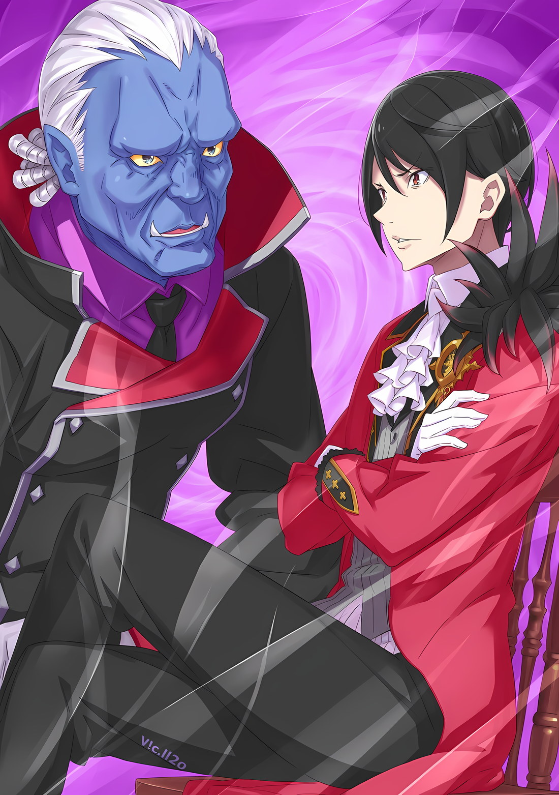

*※※※※※※※※※※※*

…Губернатор «Острова Гладиаторов» Гинунхайв, Густав Морелло.

Получение этой должности от всемогущего Императора Священной Империи Волакия имело огромное значение.

В Волакии, где жило и дышало учение «Люди Империи Должны Быть Сильными», роль проводимых на острове зрелищ с участием гладиаторов была чрезвычайно важна в эти мирные времена.

Они проводились не просто для развлечения, а для того, чтобы в правление нынешнего Императора, гасившего даже малейшие очаги тлеющих углей, называемых внутренними распрями, человеческая природа имперских народов не была слишком далека от «Сражений», дабы не притупились их клыки.

Не то чтобы Император так уж прямо заявлял об этом, но когда Винсент Волакия назначил Густава губернатором, тот понял, что именно такие профессиональные обязанности он и должен исполнять.

В действительности, следуя этому до конца, Густав справлялся с этой задачей лучше, чем кто-либо другой из его предшественников в длинной череде губернаторов острова. …До сегодняшнего дня.

Густав: …Я, Густав Морелло, в сопровождении гладиаторов Гинунхайва, успешно прибыл на место.

Перед Императором, обратившим на него свой взор, перед Винсентом Волакией, Густав опустил на землю все четыре руки Племени Многоруких и, преклонив колено, заговорил.

…Великая гражданская война, потрясшая всю Империю; ее предпосылки полностью пали из-за вмешательства мертвых.

Чтобы спастись от сонмов свирепой нежити, жители столицы Империи и прилегающих районов были одновременно эвакуированы, и без разбора, воины регулярной армии и армии повстанцев были вынуждены сотрудничать, чтобы противостоять разрушению.

Эвакуация избыточного количества беженцев все еще продолжалась, но даже в этом случае Укрепленный Город Гаркла принимала более половины всех беженцев. В составе этого числа эвакуированных, сразу же после того, как они вошли в Гарклу, Густаву была предоставлена аудиенция с Винсентом.

Густав: ……

В одной из комнат большой крепости, рядом с коленопреклоненным Густавом, стоял озадаченный Идра Мисанга.

Группа преступников, представлявшая собой банду гладиаторов, сменила название на «Эскадрон Плеяд», и Густав, возглавляемый Нацуки Шварцом, выполнял роль военного советника. В этой роли Густав избрал Идру, чтобы он помогал ему в делах, отличных от насилия.

Среди гладиаторов, с которыми у Шварца были особенно близкие отношения, Идра, как оказалось, обладал достаточной долей благоразумия и самообладания, а также был чрезвычайно полезным сокровищем в группе грубиянов.

Однако, как бы то ни было, когда Идра неожиданно предстал перед Его Превосходительством Императором, проявить это самообладание ему не удалось.

Винсент: Что касается твоей деятельности, я получил доклад от Зикра Османа. Этот человек… Нацуки Шварц, также щебетал, хвастаясь твоими достижениями.

Идра: Щебетал… ах

Возможно, из-за чрезмерного напряжения Идра подсознательно произнес эту фразу, и лицо его побледнело.

Винсент, сузивший свои черные глаза, славился свирепым характером, который скрывался за его красивой, нежной внешностью. Вполне понятно, что граждане Империи, знавшие об Императоре только по слухам, готовы были умереть, лишь обратив на него свой взгляд.

Однако, когда Густав, все еще стоя на коленях, поднял глаза на Винсента,

Густав: Ваше Превосходительство Император, это Идра Мисанга. Он — гладиатор, однако он помогает мне, как официальному лицу, выполнять работу, на которую неспособны другие. Пожалуйста, в зависимости от того, разрешится ли текущий конфликт, ваше помилование будет…

Винсент: Ты необычайно разговорчив, Густав Морелло. Однако…

Идра: …ух.

Винсент: Раз он говорит, что ты представляешь ценность, значит, так оно и есть. Старайся изо всех сил. Если уж и говорить о том, что будет потом, то оставь после себя достижения и жизнь, о которых можно будет говорить после войны.

Идра: П-понятно! Я благодарен и рад!

С такой силой, что его лоб ударился об пол, Идра решительно опустился на землю.

Идра был настолько захвачен чувством едва избежавшей смерти, что не замечал окружающего, но, будучи простым сыном мельника, он не осознавал, насколько необычными были слова, сказанные ему Винсентом.

Конечно, Густав считал, что он внес достаточный вклад, чтобы заслужить такие слова, но в то же время он заметил перемену в Винсенте… Терпимость, которую он проявлял по отношению к другим.

С самого начала Винсент был мудрым Императором, возможно, даже слишком мудрым.

Поэтому, столкнувшись с кем-то, кто не обладал исключительной проницательностью Императора, Винсент был довольно хладнокровен. По этой причине окружающие его люди были вынуждены ставить на кон свои жизни, пытаясь понять, что видит Император.

Император считал это приемлемым; однако, судя по всему, он этого лишился.

Винсент: Тем не менее, ты сделал довольно смелый шаг, не так ли?

Внезапно, словно для того, чтобы прервать размышления Густава, Винсент заговорил.

На предложение Императора Густав, все еще стоя на коленях, закрыл рот с торчащими клыками и стал ждать следующих слов Винсента.

В ответ на молчание Густава Винсент сузил свои черные глаза,

Винсент: Мой приказ должен был быть долгом губернатора «Острова Гладиаторов». Подумать только, что ты отказался от этой обязанности во время чрезвычайной ситуации, возглавив выступление гладиаторов острова далеко на восток, к столице Империи… Как смеет такой человек приносить свою единственную голову перед Императором, пред которым естественно трепетать?

Винсент, сидя в большом кресле, произносил эти слова, положив подбородок на руку, которая опиралась на подлокотник; со стороны было слышно, как Идра издал горловой звук.

Это была ситуация, в которой по отношению к Императору было проявлено высшее неуважение, в которой любой гражданин Империи был бы пессимистично настроен на то, что потерял свою жизнь.

Густав: …Могу ли я воспользоваться привилегией и прояснить некоторые моменты?

Винсент: Разрешаю. Однако подбирай слова тщательно. Даже если ты лишишься двух рук, ты все равно сможешь продолжать работать как обычный человек, ясно?

Но Густав не поддался такому пессимизму и вежливо ответил Императору. Смерив его взглядом, который можно было бы назвать садистским или подстрекательским, Винсент дал согласие.

Густав был поражен тем, насколько спокойно он себя вел. Склонность действовать подобным образом, вероятно, была следствием влияния отважного мальчика, который был бесстрашнее, чем кто-либо другой.

Густав: Ваше Превосходительство Император, вы заявили, что я, в своем качестве, отказался от обязанностей губернатора, но на самом деле это не так. Кроме того, во главе гладиаторов стою не я, как официальное лицо, а…

Винсент: Не ты?

Густав: …Достопочтенный сын Вашего Превосходительства Императора.

Реакцию Винсента в этот момент Густав, вероятно, не забудет до конца своих дней.

Винсент: …

В одно мгновение черные глаза Винсента расширились, и на лице его появилось несчастно-грубое выражение.

Эту реакцию нельзя было описать иначе, чем «нападение в самый неподходящий момент». Это было свидетельством того, что для Винсента и говорящий, и содержание сказанного выходили далеко за рамки его ожиданий.

Винсент прикрыл рот рукой и стер это редкое выражение, а затем,

Винсент: Я оценил твою преданность профессиональным обязанностям как не имеющую свободы действий.

Густав: В своем качестве я согласен. Но если бы все шло в соответствии с мыслями Вашего Превосходительства Императора и меня, как должностного лица, я бы только и делал, что наблюдал за этим серьезным кризисом Империи с дальних западных рубежей.

Возможно, если бы Шварц не захватил контроль над «Островом Гладиаторов», Густав все еще оставался бы на острове во время этого серьезного кризиса Империи, полностью погруженный в свои обязанности по управлению гладиаторами.

Даже если бы в столице Империи что-то случилось с Винсентом, он бы послушно выполнял возложенные на него профессиональные обязанности; возможно, ему бы даже пришло в голову добиться результатов, которые никто не оценил бы как своего рода прощальный подарок.

То, что этому не суждено было случиться, что такая версия его самого не осталась позади, радовало его до глубины души.

По наущению Шварца он истолковал приказ Императора довольно эгоцентрично… Что он может самостоятельно решить, является ли это «Чрезвычайной Ситуацией», даже если это был результат того, что он исказил его до предела, чтобы поспешить в столицу Империи.

Винсент: …Император погиб бы вместе со столицей Империи, а он, вероятно, нашел бы вам хорошее применение.

Густав: Ваше Превосходительство Император?

В отличие от Густава, который считал, что может подтвердить свое собственное суждение независимо от того, является ли оно истинным или нет, в словах Винсента прозвучало что-то вроде предположения.

Однако Винсент не стал затрагивать проявившуюся догадку.

Вместо этого он покачал головой, и,

Винсент: Хорошо, соглашусь с твоими словами. В разгар этой ситуации, когда речь идет о выживании Империи, величественно старайся добиться помилования гладиаторов и сохранить свое положение. …Покинуть помещение.

Густав: Так точно. Насколько позволяют мне мои руки, я, в своем качестве, буду работать, пока моему телу не придет конец.

Между Густавом и Винсентом существовало взаимное понимание того, что они рассматривают это как «Чрезвычайную Ситуацию».

Отклонился ли Густав от своих профессиональных обязанностей губернатора «Острова Гладиаторов» или нет, докажет работа, проделанная самим Густавом и Эскадроном Плеяд с этого момента.

У него не было уверенности в том, что им однозначно удастся это сделать. Но в данный момент Густав решил, что, по крайней мере, закончит дело, не жалея о том, что спровоцировал Шварц.

И действительно, именно в этот момент Густав слегка искривил уголки своего рта и приготовился оправдываться перед Императором.

Идра: П-при всем своем уважении, Ваше Превосходительство Император, есть вопрос, который я хотел бы… хк

Уткнувшись лбом в пол, Идра вдруг заговорил, отчего Густав рефлекторно ахнул.

Дрожащим голосом Идра невежливо обратился к Винсенту, искусно запрокинувшему голову в распростертой позе, и обратил свой взгляд, все еще находящийся на грани слез, к Императору.

Идра, проявивший свою силу воли в «Спарке» острова, обладал достойным восхищения мужеством, но отказ подчиниться после приказа Императора отступить был, как и следовало ожидать, крайне возмутительным поступком, не стоящим его жизни.

Однако…,

Винсент: …Что такое?

Густав снова был потрясен немыслимой реакцией Винсента.

Воспользовавшись этой прекрасной возможностью, Идра, не упуская своего шанса, без колебаний протянул руки. Подобно гладиатору, в полной мере использующему свои инстинкты в критический момент, когда на кону стояла его жизнь, Идра шевельнул пересохшими губами и выдал напрашивающийся вопрос.

Этим было…,

Идра: Ваше Превосходительство, после этой битвы, что вы намерены сделать со своим достопочтенным сыном… с принцем Шварцом?

Густав: Мисанга!?

Это был неуместный и несвоевременный вопрос, который не смог бы задать никто, кроме самого храброго человека во всей Империи.

Слух о «Черноволосом Наследном Принце», распространившийся по всем землям, был неотделим от великой гражданской войны, которая останется в истории Империи, по крайней мере, до тех пор, пока обстоятельства не будут закрашены битвой между живыми и мертвыми.

Первоначально основанием для создания Эскадрона Плеяд послужило то, что Шварц заявил о своей решимости вступить в противостояние с Винсентом, что и стало общей целью эскадрона.

Поэтому для Идры было совершенно естественно желать получить ответ от Винсента.

Проблема заключалась в том, что это являлось крайним неуважением, представлявшим весьма реальную угрозу для его жизни, однако Идра был настолько переполнен напряжением, что не смог этого осознать.

Густав: …

Во время воцарившегося молчания Густав заметил в себе редкостное смятение.

Оглядываясь назад, можно сказать, что все его душевные переживания за последнее время были связаны либо со Шварцом, либо с Сесилусом; если к этому списку прибавится и Идра, то это будет событие, которое заставит мир вокруг него стать совсем уж мрачным.

Неосознанно даже Густав пытался убежать от разворачивающейся перед его глазами картины…,

Винсент: …Идра Мисанга.

Губы Винсента произнесли имя Идры.

Услышав это, не только Идра, но и Густав удивленно на него воззрились, одновременно сглотнув слюну. Прямо перед ними Император переставил свои скрещенные ноги и продолжил.

Винсент: Не мое дело разбираться в обоснованности его действий.

Ответ Винсента нельзя было назвать вразумительным.

То, что Винсент, стоящий на вершине Империи, не имел права принимать решение относительно положения Шварца; не было никого, кто мог бы быть удовлетворен, получив такой ответ.

Но, более того, нельзя было допустить, чтобы Идра продолжал упорствовать.

Винсент: Покинь помещение, пока голова твоя все еще прикреплена к туловищу. …Любое превышение этого требования будет считаться неуважением.

Не обращая внимания на все, что было до сих пор, Император провел четкую линию; исходя из этого, Густав поспешно поднял Идру двумя руками, а остальными двумя закрыл ему рот.

Неся на руках Идру, который, вероятно, был самым счастливым человеком в этом Укрепленном Городе, а возможно даже и во всей сегодняшней Империи, Густав отвесил очень глубокий поклон Винсенту.

А затем…,

Густав: Я искренне прошу вашего благородного снисхождения к почетной должности принца Шварца.

Разделяя удачу Идры, Густав использовал ее в своих интересах, оставив после себя этот последний комментарий, и занавес над актом объяснения их отъезда с «Острова Гладиаторов» был закрыт.

*△▼△▼△▼△*

Винсент: Значит, он даже смог заставить Густава Морелло говорить в подобной манере. Этот человек — тот, кого я не в состоянии полностью прочесть.

Густав понес Идру, как преступника, и ушел, добавив комментарий, который вполне можно было бы оставить невысказанным. Проводив их взглядом, Винсент тихо вздохнул.

Мало того, что его неожиданно отправили на «Остров Гладиаторов», так он еще и исказил мысли всех тамошних гладиаторов, а также Густава, который был честно предан своим профессиональным обязанностям; этот факт заслуживал похвалы.

Честно говоря, сколь бы данный человек этого ни отрицал, его действия были таковы, что отсутствие у него статуса «Звездочета» не имело никакого логического смысла.

Как бы то ни было…,

Винсент: Даже если они будут включены в оборону города, она будет далека от стабильной. Мы не должны срезать углы при выборе атаки на столицу Империи, однако…

У Винсента было много мыслей по поводу того, как следует с ними поступить.

Личный состав со стороны Королевства отбирался из числа разумных людей, и в союзе с ними этой стороне тоже нужно было найти подходящую руку. Беллстетз и Серена останутся в Укрепленном Городе, а что касается тактики, то присутствия Гоза будет более чем достаточно.

Если говорить о боевой мощи, то нехватка личного персонала в ударной группе будет сказываться, однако…,

Винсент: Личный состав, преуспевающий в крупномасштабной тактике, незаменим. Эта точка зрения, вероятно, имеет большее значение, чем если бы десять Сесилусов остались позади… Если бы их было десять, то это стало бы настоящим кошмаром, но я полагаю, что причина, по которой он до сих пор не вернулся, заключается в том, что что-то в столице Империи возбудило его любопытство. Мне бы не хотелось, чтобы он стал причиной разрушения нашей страны.

Все, кто осознавал степень опасности, исходящей от «Каменной Глыбы», и природу Сесилуса, питали один и тот же страх; что Сесилус будет массово истреблять нежить, высасывая всю ману Великого Духа.

Подобно тому, как Халибель подавил черного Дракона у соединенных драконьих повозок, он не думал, что Сесилус, даже несмотря на более короткие конечности, будет отставать от нежити, однако сам факт того, что он не будет отставать, и являлся той самой проблемой.

Винсент: Если предположить, что это приведет к гибели страны, то, полагаю, ответственность за это ляжет на плечи этого треклятого Чиши, который забрал его в тот самый день. Сама мысль о том, что его прогнозы не оправдались, приятна, однако…

Он был не настолько безумен, чтобы смеяться от восторга по этому поводу, да и неизвестно, было ли у него вообще время, чтобы восторженно рассмеяться.

И действительно, в тот самый момент, когда Винсент подтвердил в себе причину спешки…,

???: …Эй, постойте! Я же сказал, что не могу вас впустить, достопочтенная Императрица!

???: Как! Я! И! Сказала! Я все еще не дала на это своего согласия!

Внезапно раздавшийся из-за двери громкий голос привнес в размышления Винсента странный привкус.

Раздался хриплый и зычный, а также сердитый и пронзительный голоса, и, когда Винсент поднял голову, пред ним предстала дверь, которую энергично распахнули с другой стороны.

???: Авель-чин! Дай мне минутку!

Винсент: Не дам.

Пинком распахнув дверь, внутрь вошла высокая девушка с длинными развевающимися светлыми волосами. Выйдя пред Императором с двумя варварскими мечами, пристегнутыми к ее поясу, Медиум О'Коннелл дерзко совершила этот возмутительный, казалось бы, лишенный здравого смысла поступок.

Позади Медиум стоял Джамал Орели с плачевным выражением лица, и Винсент пронзил его своим ледяным взглядом.

Винсент: Я же приказал тебе пропускать только тех, кого я велел пропустить, нет?

Джамал: Д-да, это правда, но… Когда дело доходит до достопочтенной Императрицы, такой низкопоставленный солдат, как я, не знает, что делать… кх

Винсент: В таком случае, если вдруг к нам заявится «Генерал» более высокого класса, охваченный мятежным духом, ты будешь бессилен?

Джамал: Да! Нет! Если сравнивать Ваше Превосходительство и «Генерала», то я думаю, что Ваше Превосходительство определенно выше. Но я действительно не совсем понимаю положение достопочтенной Императрицы… вот и все!

Хотя его вульгарность всегда была на виду, Джамал показал, что способен тщательно подбирать слова. Получив его ответ, Винсент решил пока оставить эту затею и посмотрел на Медиум, которая стояла с внушительным видом.

Вошедшая Медиум, тяжело дыша, произвела на Винсента совсем другое впечатление, чем то, что он слышал ранее.

Винсент: Я слышал, что ты закрылась в комнате и хнычешь.

Медиум: Кто сказал, что я хнычу! Это совершенно на меня не похоже! Хотя, совсем чуть-чуть… Может, я и поплакала немножко…!

Винсент: Это был твой брат, Флоп О'Коннелл.

Медиум: Братух! Братуха! Ты зачем такое рассказал!?

Флоп: Все очень просто, дорогая сестра. Конечно же, в связи с предстоящим конфликтом между достопочтенными женами, у Его Превосходительства Императора-куна возникнет сильное беспокойство и желание защитить Медиум!

Медиум энергично развернулась, и, побуждаемый ею, Флоп безропотно признался в своем плане с глупым выражением лица.

Винсент уже ничего не говорил Джамалу, который только что беспрепятственно пропустил Флопа, однако у него не было времени вникать в начинающуюся ссору брата и сестры.

Медиум: Я уже сказала это и Джамалу-чин, но я не давала своего согласия! Дело не в том, что я ненавижу Авеля-чин, просто я не знаю, что бы я делала в качестве достопочтенной Императрицы!

Флоп: Понял, понял. Однако, дорогая сестра. Ты являешься моей младшей сестрой, но стала ли ты ей, зная, что должна делать сестра? Или ты стала моей сестрой, не зная ничего конкретного… Я прав?

Медиум: А? О, возможно, так оно и есть…

Флоп: В этом случае неважно, знаешь ли ты, как стать кем-то. Важно то, что ты чувствуешь, пытаясь стать этим кем-то, и окружающая обстановка. Можно даже сказать, что фундамент младшей сестры и достопочтенной Императрицы — это одно и то же!

Медиум: Ооо~! Я поняла, ты невероятен, братух… Ты ведь не обманываешь меня, да, братух!?

Почувствовав себя обманутой всего на мгновение, Медиум яростно закричала, а Флоп сказал: «Видимо, ничего не поделаешь~», положив ладонь на лоб своего мокрого лица.

Хотя на внезапно возникшую ссору между братом и сестрой это не походило,

Винсент: Не приходите ко мне с вопросами, которые вы даже между собой не уладили. Я занят. Джамал, уведи их.

Медиум: Ах, постой, погоди! Сейчас не имеет значения, являюсь ли я достопочтенной Императрицей! Желание, чтобы Авель-чин уделил мне минутку, заключалось не в этом…

Винсент: Тогда в чем же?

Медиум: Я тоже хочу отправиться в столицу Империи!

С твердым звуком Медиум ударила рукой по груди и четко изложила свою просьбу.

Услышав это, Винсент нахмурил брови. Затем, рядом с Медиум, у которой было храброе выражение лица, Флоп поднял палец и сказал: «Можно?»,

Флоп: Возможно, вы удивлены столь неожиданным поступком, но это не просто идея, пришедшая в голову моей сестре. Прямо перед тем, как мы прибыли в этот город, это было последнее, что мы увидели в той драконьей повозке.

Винсент: …Балрой Темегриф, не так ли?

Флоп: Да, верно.

Когда Флоп без удивления кивнул, Винсент вспомнил финальный конфликт на соединенных драконьих повозках.

Субару заставил девочку, которую он стал называть Спикой, что-то сделать, в результате чего воскрешение мертвой Ламии стало дефектным, и Винсент проткнул ее своими руками.

Затем, управляя мертвым летающим драконом, тот, кто забрал у Винсента в очередной раз умирающую сестру, оказался «Магическим Стрелком», Балроем Темегрифом.

Увидев там Балроя, Медиум, несомненно, что-то сказала.

Медиум: Браток Балро…

Слабым, немощным голосом Медиум пробормотала это.

Ее голос дрожал, она много раз повторяла эти слова, обращаясь к улетающему Балрою.

Флоп: Медиум и я давно знакомы с Балроем. В прошлом он много помогал нам в доме Верховной Графини Дракрой. То, что Балрой оказался там… мы никак не могли ожидать, что воссоединимся с ним подобным образом.

Винсент: Назвать это воссоединением было бы, пожалуй, слишком иронично.

В ответ на слова Винсента Флоп произнес: «Да» необычно мрачным для него голосом.

Медиум и Флоп питали непростые чувства по отношению к нежити-Балрою; если кто-то, с кем они были очень близки, появился в форме, совершенно не похожей на ту, в которой он был при жизни, то причиняемая при этом душевная боль была вполне понятна Винсенту.

Однако…,

Винсент: …

Винсент, несмотря ни на что, никогда бы не признался, что может сочувствовать этим эмоциям.

В конце концов, он собственноручно совершил над своей воскресшей сестрой последний обряд.

Винсент: Итак, как отношения между вами и Балроем связаны с твоей предыдущей просьбой?

Медиум: Авель-чин ведь умный, так что ты должен понимать, что я пытаюсь донести, да? Но то, как ты это сейчас сказал, вызывает очень неприятное чувство, так что будет лучше, если ты на этом остановишься.

Винсент: ……

Медиум: Я хочу встретиться с братком Балро и пообщаться с ним. Пускай я и не знаю, о чем он думает, но раз уж он стал таким, я хочу с ним поговорить. В конце концов…

Вначале она была энергична, но, постепенно сбиваясь, стала подбирать слова, чтобы точно передать свои душевные переживания; по мере того как Медиум это делала, в ее словах наступала пауза.

Для того чтобы подобрать наиболее точные слова, она тщательно их обдумала, и,

Медиум: В конце концов, я хотела стать невестой братка Балра.

Винсент: …То есть это не более чем эмоциональный довод.

В ответ на слезливый призыв Медиум Винсент взглянул на Флопа.

Именно Флоп одобрил кандидатуру Медиум, которая все еще находилась на грани того, чтобы разрыдаться, на роль одного из его жен. Скорее всего, истинным мотивом являлись не амбиции, а забота о благополучии Медиум.

Винсент: Ты согласен с тем, чтобы не останавливать свою сестру на пути к такому смертельно опасному месту?

Флоп: Надо же, Ваше Превосходительство Император-кун, похоже, вы не понимаете, насколько мы с сестрой дорожим нашими повседневными беседами. Разумеется, перед тем как сюда прийти, я сделал все возможное, чтобы ее остановить, однако она отпихнула меня силой, а я ведь только-только закончил заново накладывать все свои бинты!

Винсент: Другими словами, она одолела тебя с помощью грубой силы, хм? Неожиданно, что она способна пренебречь рекомендациями своего брата.

Медиум: Я люблю братуху, и его слова, как правило, всегда верны. Но я и братуха — разные люди, поэтому бывают моменты, когда мы хотим делать разные вещи. Сейчас как раз один из таких моментов.

Медиум, словно ее нельзя было остановить ни силой, ни словами, вновь обрела бодрость в голосе.

Наблюдая за ее решительным призывом, Винсент на короткое время задумался.

Если говорить о простой силе, то возможности Медиум были лишь немногим лучше, чем у рядового имперского солдата.

Джамал, который не мог выполнять даже простые команды, вероятно, обладал более высоким уровнем владения мечом. Будь она взята с собой, трудно было представить, что она сможет внести существенный вклад в ход сражения.

Однако это, напротив, означало, что ее присутствие не повлияет на военную ситуацию.

Винсент: …Поступай как знаешь.

Медиум: …! Правда? Авель-чин…

Винсент: Не сомневайся, твоя просьба принята. Твое присутствие или отсутствие не повлияет на военную ситуацию. Однако именно поэтому ты должна взять на себя эту ответственность.

Медиум: Это означает…

Медиум была поражена его первоначальным ответом, но последующие слова Винсента заставили ее моргнуть. Видя, что она находится в таком состоянии, Флоп вмешался: «Другими словами»,

Флоп: Тебе придется защищаться. У них не хватит сил, чтобы защитить Медиум, вот что он имеет в виду.

Винсент: Истинно. Без этой решимости бросаться в водоворот битвы было бы…

Медиум: Что ж, в таком случае все будет в порядке! Необходимость защищаться — это то, что я делала все время, когда путешествовала с братухой.

Винсент: ……

Когда он попытался донести до нее, что она ошибается, если рассчитывает получить защиту только потому, что является кандидаткой в Императрицы, ожидания Винсента были быстро развеяны самой Медиум.

Медиум была встревожена тем, что ей сказали, однако она с облегчением похлопала себя по груди так, как если бы ей просто объяснили пустяковое условие.

Медиум: Божечки~, я так нервничала из-за того, что именно ты мне скажешь~. Но я рада, что Авель-чин не такой уж и недоброжелательный, как я опасалась.

Получив ответ, примерно соответствующий его ожиданиям, Винсент скривил губы в слегка удрученном выражении.

Во всяком случае, таково было заявление Медиум после того, как она высказала свою просьбу и осознала опасность, которая может возникнуть в данной ситуации.

Раз так, Винсенту больше нечего было добавить.

Винсент: Завтра утром.

Медиум: Э?

Винсент: Завтра утром отобранный личный состав отправится в столицу Империи. Будь готова.

Отрывисто сообщив ей об этом, Винсент посмотрел на Флопа.

Винсент: Ты же ведь не намерен заявлять, что и ты пойдешь, не так ли? Я скажу это сейчас, но я не намерен обсуждать вопрос о том, правильно это или неправильно, когда человек, неспособный себя защитить, таким образом добровольно идет на самоубийство.

Флоп: Спасибо за вашу заботу. Как и следовало ожидать, я не собираюсь добровольно идти на верную смерть. И также я не хочу быть помехой для своей сестры… Что касается Балроя, то я поручаю это Медиум.

Медиум: Братуха…

Винсент: …Тем не менее, нет никакой уверенности в том, что они смогут встретиться.

Не став комментировать решимость Флопа, Винсент коснулся возможности того, что их желание может не исполниться.

Однако, услышав слова Винсента, Флоп улыбнулся.

Флоп: Не волнуйтесь, они обязательно встретятся.

Винсент: По какой причине ты в этом уверен?

Флоп: Я верю в судьбу. Быть может, она и недоброжелательна, но не бестактна.

Этот необоснованный призыв был столь же убедителен, как и предыдущий эмоциональный довод Медиум.

Но Винсент пока избегал на это ссылаться. Если бы он что-то сказал, то брат и сестра О'Коннелл ответили бы ему вдвое больше сказанного.

Кроме того, они наверняка понимали это и без его слов.

Медиум: Ну что ж, Авель-чин, тогда до завтра! У меня будут мешки под глазами, если я не высплюсь как следует!

Широко взмахнув рукой, Медиум галантно развернулась.

В ее прямой, как стрела, спине не было и малейшего намека на то, что буквально несколько минут назад на глазах у нее стояли слезы. Если это были не притворные слезы, то он мог только почувствовать, что она — девушка с бурными эмоциями.

В этот момент Флоп, который должен был следовать за Медиум, вдруг приостановил свой шаг, и,

Флоп: Ваше Превосходительство Император-кун, спасибо.

Винсент: За что конкретно выражается твоя благодарность?

Флоп: За то, что приняли во внимание чувства Медиум… нет, за то, что приняли во внимание наши чувства. А также за то, что не стали упрекать Медиум, невзирая на то, что ей нравится Балрой. Знаете, она же ведь кандидатка в ваши достопочтенные жены.

С довольным выражением лица Флоп коснулся своего лба.

В ответ на это Винсент фыркнул, как бы сомневаясь в словах Флопа.

Чувства Медиум, связанные с желанием встретиться с Балроем; само понятие благодарности за то, что он не упрекнул ее в этом.

Винсент: Наказывать за любовь? Любой, кто совершает такой хамский поступок, должен быть несчастен.

Ужасно обрадовавшись такому ответу, Флоп стал для Винсента бельмом на глазу.
