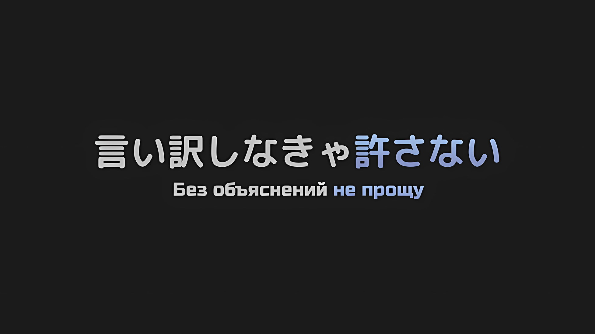

*※※※※※※※※※※※*

…Наступило утро отъезда в столицу Империи Рапгану.

На въезде в Укрепленный Город Гаркла с самого утра толпами прибывали беженцы из столицы Империи и прилегающих районов, число которых достигало такого уровня, что даже города, способные принять самое большое количество людей, не могли их вместить.

Все были заняты тем, что разбирались и реагировали на ситуацию, но, к сожалению, никто, несвязанный с Империей, не мог ничего сделать или сказать по этому поводу.

Именно поэтому порученные им задания должны были быть выполнены надлежащим образом.

Если же это не произойдет…,

???: Хоть мне весьма и весьма больно… Я не могу быть вам полезен.

Маленькие плечики розоволосого мальчика поникли от досады, и Эмилия, словно почувствовав ту же боль, что и он, сжала кулаки.

Эмилия слишком хорошо понимала боль от невозможности сделать то, что хочется, по причине недостатка сил.

К тому же этот мальчик… Шульт, был маленьким ребенком. Эмилия тоже не могла быть рядом со своими близкими, когда была ребенком.

Потому она с болью понимала чувства Шульта.

Шульт: Эмили-сама, я умоляю вас. Пожалуйста, я хочу, чтобы вы спасли Присциллу-сама, Ала-сама и Хейнкеля-сама.

С круглыми глазами, полными слез, Шульт умолял Эмилию о помощи.

Такому маленькому ребенку требовалось много храбрости, чтобы сдерживать свои слезы и умолять кого-то помочь людям, которых он очень любил.

Это было то, на что не смогла бы пойти Эмилия. Так что она уважала храбрость Шульта.

Вот почему Эмилия хотела принести в дом Шульта концовку, отличную от той, что была у нее тогда.

Эмилия: Ага, предоставь это мне. Я ценю то, что ты попросил меня об этом.

Шульт: Эмили-сама…

Эмилия: Потому что теперь, что бы ни говорила Присцилла, пытаясь удержать меня на расстоянии, я могу сказать ей в ответ, что ты попросил меня, как следует!

Ударив себя в грудь, Эмилия успокоила Шульта этими словами.

Когда Шульт услышал это, его круглые глаза расширились еще больше, а выражение лица быстро засияло,

Шульт: Да, мэм! Присцилла-сама нечестна сама с собой, поэтому я надеюсь, что вы с ней поговорите!

Голос Шульта вновь обрел энергию, пусть и немного глуховатую, и Эмилия, стараясь соответствовать его словам, решительно кивнула с ответным: «Да!».

???: На Эм можно положиться. Но это опасно. Будет лучше, если за тобой присмотрит Бея.

???: …Тебе не нужно ничего говорить, поскольку так и было задумано, я полагаю.

Пока Эмилия и Шульт разговаривали, две маленькие девочки обменялись друг с другом словами.

Беатрис, сопровождающая Эмилию, и Утаката, сопровождающая Шульта, с удовлетворением наблюдали за их разговором, а после обменялись друг с другом взглядами,

Беатрис: Вероятно, тут тоже не совсем безопасно, в самом деле. Полагаю, хорошей идеей будет спрятаться здесь, обхватив голову руками, вместе с этим мальчишкой Шультом, и тогда вас не заметят.

Утаката: Когда дело дойдет до драки, Уу защитит Шуу и будет сражаться, а Бея сделает все возможное вместе с Суу и остальными.

Беатрис: …Боже правый, какие ободряющие слова, в самом деле.

Несмотря на их внешнее сходство, поскольку внутри у двух девочек была разница в возрасте, они поклялись сражаться достойно и обменялись решимостью для битвы, которая должна предрешить судьбу Империи Волакия.

*△▼△▼△▼△*

А затем, где-то чуть дальше…,

Медиум: …Ну, я пошла, братух! Сеструха Серена!

Объявив это живым и громким голосом, Медиум храбро улыбнулась двум провожающим ее людям.

Медиум входила в состав группы, штурмующей столицу Империи, и провожал ее, конечно же, Флоп, а также ностальгирующий человек, коему она была очень обязана, — Серена Дракрой, с которой она воссоединилась на этом фронте.

О'Коннелл долгое время, еще с детских пор, находились под ее опекой, и, с белым шрамом на лице среди ее прекрасных черт, Серена прощалась с Медиум, когда та отправлялась на поле битвы.

Это было точно так же, как когда Флоп и Медиум покинули ее руки и отправились в самостоятельное путешествие более пяти лет назад.

Серена: Подумать только, Медиум превосходит меня не только ростом, но и положением. Если ты без проблем устроишься в качестве спутницы Его Превосходительства, помни, что ты в большом долгу передо мной.

Медиум: Боже~, я стараюсь сейчас не думать об этом! С этого момента я собираюсь встретиться с братком Балро, так что мне не нужно думать об Авеле-чин.

Серена: Да. Ты не такая уж и умная девица. Именно поэтому…

Подойдя к Медиум, Серена нежно погладила ее по щеке.

Серена была довольно высокой для женщины, но Медиум была еще выше. Однако, когда она прикоснулась к Медиум, последней показалось, что она вновь вернулась в то время, когда была еще совсем маленькой девочкой.

В прошлом, в день их отъезда, Серена точно так же погладила Медиум по лицу. Прикоснувшись к тому месту, где находился ее белый шрам, она нежно провела по нему пальцем.

Серена: Я завидую тому, что ты так непоколебимо желаешь с ним диалога.

Медиум: Сеструха Серена…

Серена: И с Балроем, и с Майлзом я не смогла обменяться последними словами. Похоже, что и в этот раз мне не будет предоставлена возможность поговорить с Балроем… Больно ли это, или же это приносит облегчение, я и сама не знаю. Впрочем, бояться нечего.

Бесстрашная — таково было впечатление Медиум о Серене.

Когда она узурпировала домашнее хозяйство у своего отца, даже когда он кричал жалобы и нанес ей пожизненную рану на лице, Серена ничуть не изменила своего выражения; так слышала Медиум.

Серена: Ложь. Это было больно, так же как и слова моего отца. Я просто пролила кровь вместо слез.

Флоп: Эмм? Интересно. Разве в очень болезненные моменты не проливаются слезы, даже если при этом проливается кровь? Учитывая это, невозможно, чтобы Графиня Дракрой не…

Серена: Тишина, умолкни.

Холодным голосом заставив Флопа, ломающего голову, замолчать, Серена, все еще касаясь лица Медиум, сузила свои глаза и посмотрела на нее с любовью.

Серена: Шрам на моем лице — это то, что я должна была получить, чтобы родиться заново. Я не хочу, чтобы у тебя была такая же рана, но я хочу, чтобы ты что-то приобрела.

Медиум: …Да. Сеструха Серена, ты хочешь что-то передать братку Балру? Я обязательно передам сообщение.

Серена: …Да.

Увидев решимость Медиум, Серена собралась с духом, чтобы передать сообщение, и, приостановившись на мгновение, задумалась. Однако, будучи довольно мудрой женщиной, она тут же ответила на вопрос Медиум.

То, что она хотела бы передать Балрою, было…,

Серена: …Поторопись и усни. Майлз постоянно сетует, что без тебя становится скучно.

В характерной для Серены манере, строгой, но с определенной любовью, это было сообщение, наполненное искренними чувствами к тому, кого нельзя было назвать ни подчиненным, ни ее заклятым младшим братом.

*△▼△▼△▼△*

Идра: …Шварц, в худшем случае я не буду винить тебя, если ты не вернешься.

Субару: Эй, эй.

Идра сказал это с серьезным лицом, и Субару рефлекторно распахнул глаза.

Он попытался возразить: «Не могу поверить, что ты шутишь в такое время», но серьезное выражение лица Идры не изменилось, так что в итоге он упустил свой шанс.

Вместо Субару на сцену вышел Хиайн и, повысив голос, сказал: «Не говори ерунды!».

Человек-ящер уставился на Идру и удивленно заморгал своими круглыми глазами,

Хиайн: Скажи мне, ублюдок, какого хера ты несешь! Что значит, не будешь его винить, если он не вернется! Только не говори мне, что ты советуешь братишке умереть!

Идра: Не пойми меня неправильно, но да.

Хиайн: Ха!? Я ничего не напутал! Ты предатель! Среди нас есть предатель! Братишка, что за черт, это реально ужасно!

Субару: Постой-постой, успокойся, Хиайн. Разве не странно, что Идра вдруг говорит такие вещи? Быть того не может.

Лицо Идры поникло, когда Хиайн на него накинулся. Хотя Субару пребывал в очень серьезном настроении, он был не настолько глуп, чтобы принять его слова за чистую монету.

Его отношения с Идрой, напротив, ничего подобного из себя не представляли.

Субару: Итак, почему ты так сказал? Давай, расскажи мне, почему.

Идра: …Вместе с губернатором Густавом я был на аудиенции у Его Превосходительства Императора. Во время нее я кое-что спросил. Я задал Его Превосходительству Императору вопрос о том, что он планирует сделать с тобой, Шварц.

Идра крепко сжал кулак и с горечью произнес это, на что Субару издал «Ох».

Он слышал, что Густав собирался поговорить с Авелем накануне вечером, но не знал, что Идра тоже там присутствовал, и что он бросил довольно серьезную бомбу.

Однако если Идра действительно находился там, то это был естественный вопрос.

Первоначально члены «Эскадрона Плеяд» являлись сосредоточенной вокруг Субару группой, которая была создана для того, чтобы он нанес удар по лицу Императора Винсента Волакии.

Только из-за зомби-паники ситуация оставалась неурегулированной; но, как только этот вопрос будет решен, вновь возникнет необходимость в завершении гражданской войны.

Тем не менее, для того чтобы напрямую спросить об этом у Авеля, требовалось немало мужества.

Хиайн: С-серьезно… и тогда Император сказал, что он собирается делать с братишкой?

Идра: Его Превосходительство Император сказал, что жизнь или смерть Шварца зависит от его собственных действий…

Хиайн: У-у него, черт побери, хватает наглости валять дурака…! Разве это не означает, что все зависит от того, что чувствует Император?

Услышав информацию, которую принес Идра, голос Хиайна задрожал от гнева.

Мысленно Субару видел, как Авель это говорит, и примерно догадывался о его намерениях, но для тех, кто не знал личности Авеля, это прозвучало бы как оправдание, чтобы дать повод избавиться от Субару после войны.

Субару: Так вот почему ты сказал мне умереть?

Хиайн: Аа? Так значит, ты предаешь братишку и присоединяешься к Императору…

Субару: Дело не в этом, он сделал это, чтобы сказать мне бежать, верно?

Субару перебил Хиайна, который слишком увлекся экстраполяцией, и Идра кивнул в ответ на его слова.

Затем Идра в отчаянии опустил глаза,

Идра: Именно Его Превосходительство Император собрал вместе граждан Империи в условиях хаоса, который распространялся по мере того, как мертвые массово возрождались. Семена недовольства, приведшие к гражданской войне, будут выкорчеваны, как только ситуация будет взята под контроль… Если он выживет, трон Императора Винсента будет обеспечен.

Хиайн: А-а что, если братишка добьется чего-то великого? Например, завалит вражеского босса одним ударом…

Идра: Даже тогда это будет непросто. Его Превосходительство Император признает подвиги Шварца, оставит на некоторое время у себя, а потом, когда пыль уляжется, его могут где-нибудь убить.

Субару: И снова Империя Волакия слишком жестока…

Тот факт, что для Идры и Хиайна это не было излишним размышлением, свидетельствовал о том, что таков был национальный обычай Империи.

По крайней мере, он надеялся, что Авель станет мягче, когда его положение будет восстановлено, но в данный момент было трудно полностью изменить мнение Идры и остальных.

Однако ему было жаль Идру и Хиайна, которые волновались и пытались найти способ это преодолеть.

Субару: Я не буду притворяться мертвым. Но и на самом деле умирать не собираюсь. Я обязательно вернусь. Когда я это сделаю, мне нужно будет кое-что всем вам рассказать.

Идра: Шварц…

Субару: Не делай такое серьезное выражение лица. Результат всего этого… Я не знаю, удастся ли разрешить это мирным путем, но думаю, что худшего сценария можно избежать.

В любом случае, «Борьба за Трон Империи», о которой они оба так беспокоились, рухнет в самом начале.

Субару беспокоился о том, что станет с его отношениями со своими товарищами по эскадрону, но у него не было другого выхода, кроме как принести им свои искренние и сердечные извинения.

Субару: Я обязательно вернусь. …Вот почему, Вайц, ты можешь перестать прятаться в драконьей повозке.

???: Гх…

Субару выкрикнул это, и послышался приглушенный голос.

Пока Идра и Хиайн оглядывались по сторонам, гадая, откуда он доносится, Субару вздохнул и присел на корточки.

Позади того места, где разговаривали Субару и остальные, стояла драконья повозка, которая должна была отправиться в путь со штурмовой группой на борту.

Под повозкой, цепляясь за вал ходовых колес, виднелась фигура татуированного мужчины. С изображением черепа, выгравированным на его теле, Вайц нехотя выбрался оттуда.

Субару: Неважно, насколько сильно тряска подавлена «Божественной Защитой Уклонения от Ветра», если ты будешь держаться там целый день, то, естественно, просто сорвешься и умрешь.

Вайц: Я доверил тебе свою жизнь… Если я умру ради тебя, то я буду доволен…

Субару: Если бы ты тихо умер, и никто бы об этом не узнал, это не было бы смертью ради меня!

Вайц, чье чувство товарищества было направлено не в то русло, замолчал, издав «Нгх…» на замечание Субару.

Затем, когда Хиайн и Идра шагнули вперед,

Хиайн: Слушай сюда, разве ты, блядь, не обещал послушно защищать это место, пока братишка не вернется! Сейчас не время для попыток вырваться вперед, гнида предательская!

Вайц: Заткнись, не смешивай меня с вон тем омерзительным бородатым ублюдком…!

Идра: Перестань обращаться со мной как с предателем! Ты уже должен знать, что это не так!

Субару: Эй, успокойтесь! Прекратите шуметь! Давайте жить дружно!

Субару вмешался и положил руку на бедро, видя, что эти трое снова затеяли свой обычный балаган.

Действительно, эти люди были настолько ему знакомы, что он чувствовал, что для них это было обычным поведением. Однако они должны были оставаться в Укрепленном Городе, готовясь к предстоящей битве с ордой зомби.

С их силой и стойкостью, группа, чья сопротивляемость смерти была лучшей в Империи… В битве с зомби, которые не умрут, даже если их убить, не было силы, столь же надежной, как Эскадрон Плеяд.

Субару: Я рассчитываю на всех присутствующих. Многие из моих драгоценных союзников останутся здесь. В отличие от вас, ребята, эти союзники не могут сражаться… ээ, относительно не могут сражаться.

Хиайн: Будь точен в своих словах!

Рем, Рам и остальные, оставшиеся в городе, промелькнули в его голове; было бы ложью сказать, что они совершенно неспособны сражаться, но он также не мог с уверенностью заявить, что у него не было никаких опасений по поводу участия этих людей в битве, поэтому ответ Субару был довольно двусмысленным.

Услышав, что Хиайн значительно повысил голос, Субару криво улыбнулся.

Субару: Дело не в том, могут они сражаться или нет, а в том, что я не хочу позволять всем этим людям сражаться. Вот в этом вы, ребята, и расходитесь. Сражайтесь сколько душе угодно!

Идра: …Это искреннее доверие, и мы можем воспринимать его как таковое, верно?

Субару: Верно. Вайц, пожалуйста, пойми и ты.

Вайц: …

Он посмотрел на Хиайна и Идру, а затем, наконец, на Вайца, после чего заговорил с ними. Последний скрестил руки, закрыв свои напряженные, пугающие глаза, которые подчеркивала татуировка в виде черепа.

После некоторого раздумья Вайц медленно развел руки, и,

Вайц: По… по-по… по… н..

Субару: Пожалуйста, пойми и ты!

Вайц: Понял… кх

С подавляющим чувством горького решения Вайц согласился с планом Субару.

Затем Вайц медленно протянул руку к Субару и положил ее ему на плечо. И необычным, нежным голосом произнес,

Вайц: Теперь, когда я сказал это, обязательно возвращайся, братишка…

Субару: Ах.

Субару слегка опешил, но быстро улыбнулся и кивнул,

Субару: Понял, брат.

Таким образом, он почувствовал себя обязанным не только ответить на протянутую руку, но и оправдать их доверие.

Услышав это, Вайц удовлетворенно улыбнулся. Однако…,

Хиайн: Эйэйэйэй, не смей, мать твою, копировать мой способ обращения к людям, ублюдок и ворюга!

Вайц: Ты сам его так назвал… И Шварц вообще-то отозвался…

Идра: Не ввязывайся в бессмысленный спор! Мне казалось, мы все на одной волне!

Субару: Эй, прекратите! Братки!!!

В очередной раз разнимая начавшуюся по разным причинам перебранку, Субару пожалел о предстоящем расставании с этими хлопотливыми собратьями.

*△▼△▼△▼△*

???: Ты должна осознавать, какую роль тебе предстоит сыграть. Не забывай, что от твоей работы зависит, переживет ли твоя жизнь эту войну.

???: Ауау.

Когда девочка с покорным выражением лица кивнула, предположительно с намерением сделать это, Винсент закрыл один глаз.

Сама сила, которой обладала девочка, ведомая Нацуки Субару и возмутительно именуемая Архиепископом Греха, была серебряной пулей против нежити, которая возникала одна за другой.

Даже если бы это было правдой, реализация плана, предусматривающего сотрудничество с Архиепископом Греха, была бы невозможна для Империи Волакия, о которой другие страны отзывались как об эксцентричной.

Начнем с того, что ситуация, в которой можно было бы добиться сотрудничества с Архиепископом Греха, была немыслимой.

???: Ваше Превосходительство! Подготовка драконьей повозки завершена! Если все пройдет без заминок, пусть даже это и не соединенные драконьи повозки, дорога до столицы Империи займет не так много времени!

Голос Гоза донесся до Винсента, который стоял лицом к лицу с девочкой… Спикой, и его можно было услышать из-за горы. Конечно, поскольку он находился рядом с Винсентом, а не на другой стороне горы, громкость его голоса была чрезмерной.

Во всяком случае…,

Винсент: Если к моменту нашего прибытия у «Каменной Глыбы» уже закончится запас маны, то никаких обсуждений не будет. У вас тоже есть строгие приказы. Не убивайте нежить без необходимости.

Гоз: Война без смертей и убийств — это что-то непривычное, но я постараюсь сделать так, чтобы все офицеры и солдаты получили ваши почтенные приказы! Однако же…

Гоз сделал паузу и сжал свой кулак, который был размером с голову ребенка. Даже не глядя на его профиль, можно было заметить, что он в досаде искажает шрамы от мечей на своем лице.

И тут раздался строгий, сотрясающий землю голос Гоза, который дрожал от разочарования,

Гоз: Пожалуйста, могу ли я сопровождать вас!!!

Спика: Ау.

Призыв Гоза был слишком энергичным и сильным, чтобы его можно было сдержать, и Спика отшатнулась, словно почувствовав дуновение ветра в лицо; а Винсент и вовсе ощутил, как звук задрожал у него на коже.

Он мог свирепствовать не только со своей любимой булавой, но и без нее, а громкость голоса Гоза заставляла мир содрогаться.

Винсент: Но сколько бы ты ни сетовал, решение отменено не будет.

Гоз: Ваше Превосходительство!

Винсент: Помимо тебя, командирами могут стать лишь Верховная Графиня Дракрой и Генерал Второго Класса Зикр Осман. Даже если им обоим можно доверить поле боя, целая война — это отдельный вопрос.

Гоз: То есть…

Винсент: Теперь, когда этого треклятого Чиши больше нет, я не могу доверить всю армию никому, кроме тебя. Ты должен понимать, насколько это важно.

Глаза Гоза расширились, и все его тело напряглось в ответ на заявление Винсента.

Беллстетз был гражданским должностным лицом, а Серена была компетентна как Верховная Графиня, но не как военный. У Зикра не было опыта командования такой большой армией, поэтому не было никого, кроме Гоза, кто мог бы взять на себя общее командование. Такова была оценка Винсента, лишенная домыслов.

Винсент: Я вверяю тебе всех своих офицеров и солдат. Учти, что на твоих крепких плечах зиждется само выживание Империи.

Таков был комментарий Винсента, который смотрел прямо на Гоза.

В ответ Гоз крепко зажмурил глаза и одним этим актом медитации стряхнул с себя нерешительность.

Со свирепостью в глазах, достойной звания «Рыцаря Льва», Гоз сжал кулаки перед грудью и поклялся Винсенту.

Гоз: …Я, Гоз Ральфон, повинуюсь досточтимому приказу Его Превосходительства!

Винсент: Это великая услуга.

Гоз: ТАК ТОЧНО!!!

Сделав краткое заявление, Гоз отвесил глубокий поклон Винсенту, который откинул назад свой подбородок.

Он бы с удовольствием сопровождал Винсента и служил ему охранником, используя свои сильные руки для выполнения трудных задач. Однако Гоз сдержал чувства, и вместо этого…

Гоз: Я рассчитываю на тебя, Генерал Третьего Класса Орели! С честью обеспечь защиту Его Превосходительства!

Джамал: Да, предоставьте это мне, Генерал Первого Класса Ральфон! Раз уж меня выбрали специально, я непременно исполню свой долг!

Так Гоз поручил эту задачу Джамалу, и тот энергично ударил себя в грудь.

Винсент назначил его своим охранником, а Гоз даже возложил на него эту обязанность, поэтому, тяжело дыша, он вульгарно ухмыльнулся.

Прежде всего, дом Орели был семьей Низших Графов, у них не было никаких атрибутов благородства.

Однако…,

Гоз: Отлично сказано! Именно этого и следовало ожидать от солдата Империи Волакия!

Гоз гордо выпятил свою крепкую грудь, провожая его взглядом, — такое отношение было абсолютно в духе Волакии.

Учитывая это, Субару и жители Королевства, с которыми все еще было трудно справиться, должны были считаться неподходящим для использования персоналом, даже несмотря на то, что они могли понимать и сочувствовать друг другу.

Винсент: Повторю еще раз — не становись бесполезным инструментом в одиннадцатый час.

Спика: Уу, ау.

Пока Гоз и Джамал громко переговаривались, Винсент посмотрел на Спику, которая прикрыла свои уши, и сказал ей об этом.

При словах Винсента губы Спики надулись.

По какой-то причине Винсенту показалось, что это совпадает с выражением лица Медиум вчера вечером, когда она настороженно отнеслась к его словам и поведению, отчего он вздохнул.

А после…,

*△▼△▼△▼△*

…Три драконьих повозки отбыли, и это было далеко не то количество людей, которое прибыло в Укрепленный Город на звериных повозках или пешком.

Но это, несомненно, был проблеск надежды, посланный для того, чтобы предотвратить «Великое Бедствие», обрушившееся на Империю Волакия… или, скорее, «Великое Бедствие», которое вот-вот должно было ее уничтожить.

Каждый из них с твердой решимостью и множеством надежд на своих плечах вернется в столицу Империи, ныне превращенную в город нежити, и нанесет там удар по их предводителю, «Ведьме», известной как Сфинкс.

Вот почему…,

???: …Поверить не могу, что брат присоединился к ним.

Катя пробормотала это, подкатив свое инвалидное кресло к окну и разглядывая происходящее внизу. Рем, услышав эти слова, встала рядом с ней, опуская уголки своих глаз.

Брат Кати, Джамал, был одним из тех, кто направлялся в столицу Империи в качестве сопровождающего Авеля.

У Рем не было приятных воспоминаний о встречах с ним, но, поскольку он был старшим братом Кати, она не могла проявлять излишнюю враждебность, ибо с ним было трудно иметь дело.

Однако, похоже, Авель доверял ему настолько, что выбрал его в качестве сопровождающего на этом последнем этапе.

Катя: Брат прост, с ним легко обращаться и легко отбросить; вот почему.

Рем: Каким бы ни был Авель-сан, я не думаю, что он настолько бессердечен…

Катя: Не знаю. Во всяком случае, брат, видимо, хочет казаться таким… т-ты же ведь слышала, что он вчера сказал, да?

Рем: Ах, насчет этого… да.

Катя подняла взгляд на Рем и, поскольку последняя не могла оправдаться, она кивнула головой.

Когда вчера вечером Джамал навестил Катю, он сообщил, что его выбрали в качестве сопровождающего Авеля в столицу Империи, а затем со смехом сказал ей,

*Джамал: «Не волнуйся, Катя. Я умру достойно, служа Его Превосходительству, и тогда, благодаря награде, тебе не придется страдать всю оставшуюся жизнь, даже если этого ублюдка Тодда не будет рядом!»*

Рем: Не похоже, что в этом был какой-то злой умысел.

Катя: Н-некоторые вещи могут быть плохими даже без злого умысла… Почему и брат, и Тодд ведут себя так, ведь речь же идет об их жизнях. Это очень эгоистично…

Возможно, Джамал по-своему заботился о жизни своей сестры Кати как ее брат, но Рем искренне надеялась, что он будет более внимателен к чувствам Кати, чем к средствам ее существования.

Потеряв Тодда, своего жениха, и потеряв брата, Джамала, Катя действительно осталась бы совсем одна.

Такую пустоту не заполнить, даже если бы Рем была рядом с ней в качестве друга.

Рем: Я тоже себя так чувствовала, когда… Когда воссоединилась с сестрой.

Поскольку у Рем не было «Воспоминаний», для нее было новым опытом снова встретиться с Рам.

Однако, несмотря на то, что у Рем не было «Воспоминаний» о Рам, ее «Душа» помнила о ней, и ее присутствие помогло ей понять, что в этом мире она далеко не одинока.

С точки зрения Кати, Джамал наверняка тоже был таким.

И все же, то, что Джамал думал иначе, являлось провалом имперской культуры.

Рем: Независимо от того, каким Императором является Авель-сан, мне не очень нравится Империя…

Катя: …Какое совпадение. У меня тоже нет любимой страны или места.

Рем: В данный момент я с тобой согласна.

По словам Субару и Рам, домом Рем было место под названием Королевство Лугуника, соседняя страна.

Поскольку Субару так часто критиковал Империю, то, должно быть, Королевство было более комфортным местом для жизни.

Тем не менее…,

Рем: …Когда эта битва закончится…

*Поеду ли я в Королевство?*

Было бы трудно расставаться с Рам, и она не сомневалась, что Королевство — ее родина. Однако сейчас Рем знала больше вещей и людей в Империи, чем в Королевстве.

Она не могла адекватно представить себя в незнакомом Королевстве.

Катя: …Рем, похоже, они уезжают.

Внезапно Катя окликнула Рем, которая погрузилась в раздумья.

Когда ее позвали, она тоже выглянула в окно и увидела три драконьих повозки, которые собирались отбыть в столицу Империи.

Спика, Авель и Субару были уже на борту.

Катя: Ты проводила его как следует?

Рем: Мы говорили за завтраком. А ты, Катя-сан, поговорила со своим братом…?

Катя: Я сказала все, что должна была сказать. Не было смысла злиться, но я все-таки разозлилась.

Катя отвернула лицо и с горьким видом вспомнила ссору с Джамалом.

Но, по-своему, слова, которые она сказала брату, отправляющемуся в опасное место, вероятно, должны были передать ее самые глубокие чувства. Вот почему Катя вновь обратила свой взгляд на Рем,

Катя: Ты сказала то, что хотела сказать?

Рем: …То, что я хотела сказать, хах?

Катя: Ты, кажется, немного расстроена.

Рем удивленно моргнула от такой неожиданной оценки.

Слово «расстроена» производило впечатление дующегося ребенка. Во-первых, Рем вовсе не дулась, как намекала Катя.

Рем: Да тут даже дуться не на что…

Катя: Если это правда, то, думаю, все в порядке.

Рем: …

Не выдержав тыканья и понукания, Рем поджала губы в ответ на слова Кати.

В ее устах это звучало так, будто Рем лжет. Она не дулась, и ей не было нужды посвящать этому лишние слова.

Субару сопровождали Эмилия и Беатрис.

Кроме того, его сопровождали Спика и Авель, а также Халибель, очень сильный человек-волк. Окруженный такими надежными людьми, он, должно быть, чувствовал себя совершенно спокойно.

Вот почему…,

Катя: Я-я…

Рем: …

Катя: Я сожалею об этом.

Отвернув лицо и устремив взгляд только на Рем, Катя нерешительно шевельнула губами.

Не было нужды спрашивать, что это значит и к каким мыслям может привести.

Крепко зажмурив глаза, Рем вместе с Катей потянулись к окну, из которого они наблюдали за происходящим внизу, и распахнули его так широко, как только смогли.

Сразу же в комнату крепости ворвался прохладный утренний ветерок, лаская голубые волосы Рем.

К этому ветерку примешивался запах, который вряд ли можно было назвать освежающим. Драконьи повозки возвращались к месту, где все это началось…,

Рем: …Лучше тебе объясниться, как только ты вернешься!

Рем с криком бросила свое желание в сторону удаляющихся драконьих повозок.

Она не могла сказать, что желает ему благополучного возвращения. Как и не могла сказать, что желает им удачи. Но Катя подтолкнула ее к этому, и она не могла промолчать.

Как бы то ни было, это был голос встревоженного сердца Рем.

Кем, в конце концов, Нацуки Субару приходился Рем?

Он так отчаянно нуждался в Рем, а ведь у него уже были Эмилия и Беатрис. Он рисковал жизнью ради Империи, он присматривал за Спикой ради всеобщего блага, но кем был он сам?

Рем: Пока ты мне не скажешь, я тебя не прощу.

Дело было отнюдь не в его зловещем, сворачивающем нос зловонии.

Рем, лишенная «Воспоминаний»; она хотела получить ответ на вопрос о том, что же ей о нем думать, который был за каждым углом в ее недавно созданных «Воспоминаниях».

Громкий голос Рем был поглощен ветром, и она не была уверена, донесся ли он до него.

Однако в хвосте трех отъезжающих драконьих повозок через открытое окно ей помахала маленькая детская ручка.

Катя: Ты выглядишь глупо. С таким счастливым выражением лица.

…Когда Рем увидела это, ей показалось, что она слышит, как Катя вздыхает при этих словах.
