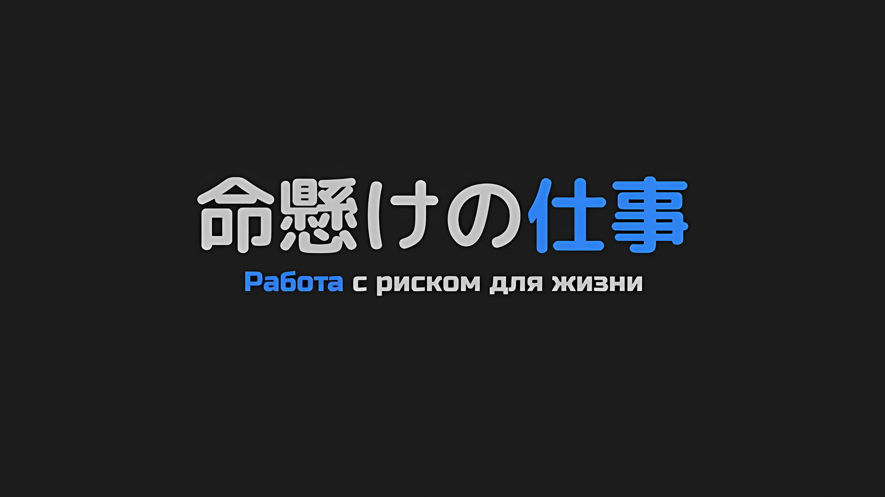

*※※※※※※※※※※※*

???: А? Что ты сказал?

???: Я не буду повторяться трижды. …Насколько могу судить, с тех пор как я занял место Императора, я могу сопоставить лица и имена всех граждан Империи.

???: Ты что, совсем больной?

Абсурдный ответ Авеля со сложенными руками и загадочным взглядом заставил Субару поднять голос.

Действие происходило в драконьей повозке, которая направлялась из Укрепленного Города Гаркла в столицу Империи Рапгану, ныне ставшую оплотом нежити.

В трех драконьих повозках находились представители Королевства, Империи, необходимая для них провизия и т. д. Это было подразделение штурмовой группы под названием «Отряд по Спасению Империи Волакия от Гибели». В настоящий момент Субару целенаправленно сел в драконью повозку, предназначенную для представителей Империи.

Причиной его поступка было не предательство по отношению к Королевству, а желание узнать… по какой причине Император, Авель, присоединился к штурмовой группе.

Разумеется, учитывая важность битвы за выживание Волакии, для Авеля было вполне естественно занять видное положение на поле боя. Однако, пережив вместе с Авелем множество неблагоприятных ситуаций, можно было сказать, что, хотя он и обладал мудростью, ему не хватало боевого мастерства.

Поэтому у него не было никакой веской причины сопровождать их, когда в будущем будет востребована только чистая военная сила.

Субару никогда бы не подумал, что даже Авель окажется под влиянием Волакии, так что если он собирался с ними, то должна была быть причина, чтобы это отменить. Однако существовала вероятность, что он не захочет раскрывать причину перед жителями Королевства, поэтому Субару взял на себя инициативу сесть в эту повозку.

Не ходя вокруг да около, Субару спросил: «В чем будет заключаться твоя роль?»…,

Субару: Можешь сопоставить лица и имена всех граждан…

Рот Субару так и остался широко открытым от такого абсурдного и ненормального заявления. Видя, как он удивлен, Авель недовольно нахмурил брови.

Винсент: Не пойми меня неправильно, я не имею в виду каждого гражданина Империи. Подобно «Племени Судрак», которые продолжают жить в лесу, личности тех, кто остается незаметным и нераскрытым, постичь невозможно. Таким образом, бесполезно пытаться охватить всех граждан Империи.

Субару: На что ты сердишься, это уже и так достаточно глупо! Ведь, по сути, это означает, что ты помнишь всех своих подчиненных, имперских солдат, верно?

Винсент: Это необходимо.

Он изложил свою мысль кратко, но она не была типичной для обычного человека.

Конечно, Авеля нельзя было считать обычным человеком, и тот факт, что он мог сопоставить лица и имена всех граждан Империи, имел значение в сложившейся ситуации.

Потому что…,

Винсент: Для того, чтобы эта девчонка сняла иго нежити, необходимы их имена.

При этих безразличных словах Авеля Субару забеспокоился за Спику, которая сидела на краю драконьей повозки.

В силу своего положения Спика не могла оставаться без присмотра, поэтому она, как и Субару, села в эту драконью повозку. В данный момент она сидела тихо, ее утешали как Медиум, так и Беатрис, которая неотступно находилась рядом с Субару.

Для того, чтобы в полной мере использовать Полномочие Спики, пригодилась аномалия Авеля… его замечательная память.

…В «Звездном Поедании» было слишком много неясных аспектов, касающихся его проявления.

Когда ей удалось использовать «Звездное Поедание» на Ламии Годвин, потомке Императорской Семьи, Спика, похоже, не съела ее «Имя», поскольку никто ее не забыл. Тем не менее, совпадение лица и «Имени», по-видимому, было ключом к этому Полномочию.

Поэтому им не оставалось ничего другого, кроме как положиться на метод, который однажды уже дал результат.

Субару: И все же меня бесит, что твоя чересчур дурацкая память пригодилась для этой цели…

???: Шварц-сама, это ложное обвинение, не так ли? Даже если человек, с которым вы имеете дело, — безжалостный Император, зачастую холодно обращающийся с Йорной-сама.

Субару: Это твой совет этому парню? Или твое недовольство ко мне?

???: Разумеется, мой совет Шварцу-сама.

Танза, девочка, одетая в кимоно, спокойно ответила на это и отвернулась от пристального взгляда Авеля.

Она являлась частью штурмовой группы, и, судя по всему, у нее были какие-то мысли относительно Авеля, связанные с Йорной, главной причиной ее участия в этой битве.

Насколько он слышал, Авель упорно отвергал предложения Йорны о женитьбе. Таким образом, у Танзы не было причин иметь благоприятное мнение об Авеле, а скорее негативное, учитывая его холодное отношение к Городу Демонов.

Винсент: Скажу тебе так, Йорна Миссигр желала не меня, а бывшего Императора.

Субару: О, это так? Типа твоего отца или что-то в этом роде?

Винсент: Далеко не так. Если ты хочешь узнать подробности, тебе следует расспросить того человека напрямую. Возможность для этого все еще есть, по крайней мере, сейчас. Я не прав, девчонка?

Танза: …Да. Даже сейчас я все еще чувствую присутствие Йорны-сама.

После слов Авеля Танза осторожно прикрыла свой глаз рукой и тихо ответила.

Ее слова не были выдачей желаемого за действительное, а, скорее, четкой убежденностью, продиктованной силой Йорны, которой она была наделена. Пока эта сила присутствовала, выживание Йорны было гарантировано.

Однако неопределенность ситуации в столице Империи удручала.

Это касалось не только Йорны, но и Присциллы, чье местонахождение было неизвестно, а также Ала, который остался, чтобы ей помочь, и Сесилуса, который отправился в самостоятельное плавание.

Субару: Даже если так рассуждать… разве это не свидетельствует о чрезмерном дисбалансе сил?

С трудом сдерживая переполнявшие чувства, Субару озвучил то, что его беспокоило, еще раз вспомнив состав «Отряда по Спасению от Гибели».

Авель закрыл глаз от его слов, а Танза наклонила голову вбок.

Танза: Дисбаланс боевых сил?

Субару: Да, потому что у нас есть я, Беако, Эмилия-тан, Спика и Розвааль, а также наш перспективный Гарфиэль, так?

Беатрис: Ты только что хвастался Бетти, я полагаю?

Субару: Да, хвастался. Люблю тебя, очаровательная Беако.

Беатрис: Бетти тоже тебя любит, в самом деле.

Подтвердив свою любовь друг к другу с Беатрис, которая вмешалась в разговор, Субару поднял палец.

За пределами этой драконьей повозки за ними ехала другая повозка, в которой находились Эмилия и остальные.

Субару: Халибель-сан — это секретное оружие, которое Анастасия-сан отправила с нами. Предполагалось, что это будет битва за Империю, но здесь полно внешних коллаборационистов.

Очевидно, это было не так, как если бы штурмовая группа была сформирована без участия кого-либо из людей Империи.

Однако во главе списка стоял Авель, который в деталях показал, что его сообразительность превосходит человеческие пределы, а также Медиум, которая появилась в качестве компаньона после переговоров с ним. В дополнение был еще Джамал, триумфально взявший на себя обязанности кучера, которого зачем-то повысили до звания «Генерала», а также назначили телохранителем. Из людей Империи в команде были только эти трое.

Двое из них, Медиум и Джамал, несомненно, относились к категории людей с высоким уровнем сил даже среди имперцев, но нельзя сказать, что они были сильнее Гарфиэля.

Субару: Танза тоже моя, так что, по сути, она на нашей стороне, верно?

Танза: …

Субару: А? Я думал, ты сразу же разозлишься и ударишь меня, но тут такое разочарование… Задержка во времени!

Танза: Пожалуйста, не говори таких эгоцентричных вещей.

Субару вскрикнул, поплатившись за произнесенную им шутку, пощечина была нанесена с силой, превосходящей его готовность принять результат. Он инстинктивно присел на корточки со слезами на глазах, а Танза просто посмотрела на него сверху вниз холодным взглядом.

Он понимал, что зашел слишком далеко, но она выглядела чересчур злой даже для этого.

???: Какакакка! Они говорят вам, Ваше Превосходительство. Что они неспособны понять, насколько серьезно настроена Империя. Если они так считают, то ничего не поделаешь, верно?

Субару: Да, да, ничего не поделаешь, даже если мы… Убгхааа!?

Беатрис: Субару!? Что случилось, я полагаю!?

Как раз в тот момент, когда он собирался кивнуть в ответ на неожиданный хрипловатый голос, из горла Субару вырвался крик.

Когда Беатрис поспешно к нему бросилась, Субару, кувыркаясь, отскочил назад и вцепился в нее. В поле зрения Беатрис и Субару, заключивших друг друга в объятия, стояла маленькая сгорбленная тень.

Из ниоткуда появился неуловимый «Порочный Старик», Ольбарт Данкелькен…,

Беатрис: Субару, успокойся, в самом деле. Это просто внезапно появившийся крошечный пожилой человек, я полагаю.

Субару: Если внезапно появился крошечный пожилой человек, то это либо Ольбарт-сан, либо японский хоррор фильм! И их объединяет то, что оба они страшные! Опасные! И сумасшедшие!

Ольбарт: Ух ты, ну ты и выдал, парниша. Похоже, ты, как всегда, маленький, но как у тебя дела?

Субару: Кто, по-твоему, виноват в том, что я маленький! У меня все отлично! А что насчет тебя!?

Ольбарт: У меня тоже все отлично. Правда, я руку правую потерял.

Ольбарт взмахнул правой рукой, отчего сгиб его рукава затрепетал. Когда Субару увидел его развевающийся рукав, он замолчал, чувствуя, что не сможет ничего сказать, не создавая неловкой ситуации.

Какой коварный трюк придумал этот безумный старик, пытаясь вызвать сочувствие демонстрацией своей травмы.

Субару: Но я попался в его ловушку, вот так просто…!

Винсент: Отложи свой внутренний конфликт на другой раз. …Итак, ты уже слышал подробности, Ольбарт Данкелькен.

Не обращая внимания на Субару, голову которого поглаживала Беатрис, обхватившая его руками, пока он корпел над своими мыслями, Авель позвал Ольбарта. Порочный старец кивнул в ответ на его зов, сказав: «Что ж»,

Ольбарт: Заклинатель, управляющий этими мертвецами, находится в столице Империи, так что мы собираемся пойти и прикончить его, верно? Так и представляю, как Гоз плачет, словно дитя малое, после того, как его бросил Ваше Превосходительство. Ну разве он не бедняга?

Винсент: Есть роль, которую может исполнить только он один. Разумеется, это в равной степени касается и тебя.

Ольбарт: Я старый чудак, которому давно уже за девять десятков, понимаете? Я вкалываю до упаду, и даже несмотря на все это… Вам не хватает доброты.

Винсент: Если ты хочешь обсудить вопрос о своей отставке, то можешь запросить ее после того, как эта чрезвычайная ситуация будет устранена. Кроме того, я скажу тебе следующее…

Легкомысленное отношение Ольбарта не дрогнуло даже перед лицом Авеля, Императора. Не обращая внимания на страшно непочтительное поведение жуткого старца, Авель добавил в конце своего предложения еще кое-что.

Ольбарт приподнял брови, издав «Хм?» в ответ на это предисловие,

Винсент: Не думаю, что до конца твоей оставшейся жизни нам доведется еще раз столкнуться с твоими дурными привычками.

Ольбарт: …

Винсент: Поэтому я приказываю тебе. Исполняй свой долг безо всякого притворства, Ольбарт Данкелькен.

Губы Ольбарта сжались в ответ на короткие, но явно нарочитые слова Авеля.

Скорее, это была ссылка на серьезные опасения Субару по поводу Ольбарта и превентивная попытка их проверить.

Если бы Ольбарт разбушевался здесь, никто в их драконьей повозке не смог бы его остановить.

Однако Ольбарт на мгновение замолчал, а затем похлопал себя по пояснице оставшейся левой рукой,

Ольбарт: Боже милостивый, не люблю молодых, потому что у них есть большой потенциал для роста. Поверить не могу, что этот мир столь недоброжелателен к старикам, включая и Его Превосходительство.

Винсент: Я очень великодушен.

Ольбарт: Какакакка!

Ольбарт рассмеялся так, словно только что услышал величайшую шутку века.

Плечи Субару, наконец, расслабились, так как он почувствовал, что это был конец тихого поединка между Авелем и Ольбартом.

Независимо от шутки Авеля, они избежали конфронтации.

Танза: Тогда… Ольбарт-сама присоединится к нам в столице Империи?

Танза, очевидно, испытывала ту же нервозность, что и Субару. Ее голос слегка ожесточился, а глаза Ольбарта сузились под кустистыми бровями в ответ на ее вопрос,

Ольбарт: Это просьба Его Превосходительства, и мне не по душе мысль о том, что ребенок будет указывать мне, что делать. Страна, которая не разыгрывает свои карты, когда ей угрожает опасность, — это не повод для смеха. Кроме того…

Танза: Кроме того?

Ольбарт: Те ребята тоже все еще в столице Империи. По крайней мере, Могуро и мерзавец Сеси.

Танза: …И Йорна-сама.

Временное партнерство в Городе Демонов… Хотя он и не знал подробностей, оно было заключено между Ольбартом, который «Инфантилизировал» его и некоторых других, и Танзой, которая работала вместе из взаимного интереса.

У этих двоих были сложные отношения, но на время они оставили свои разногласия в стороне.

Из названных лиц существо по имени Могуро и Субару не были знакомы друг с другом, но, по крайней мере, Йорна была тем, кому можно было доверять с точки зрения способностей и личности, а Сесилус был достаточно компетентен, чтобы компенсировать свой характер. Если бы к ним присоединился Ольбарт, возможности Империи, несомненно, расширились бы.

Субару: Но у нас также есть Халибель-сан, так что даже с Сеси и остальными у нас имеется небольшое преимущество… или, лучше сказать, Сеси тоже один из моих товарищей.

Винсент: Думаешь, ты сможешь надеть ошейник на эту вещь? Если да, то твое о нем представление ограничено.

Ольбарт: О, этот парень, Халибель, здесь. Он единственный превосходящий меня по силе шиноби, и я его люто ненавижу.

Каждому из них, соответственно, было что сказать о двух сильнейших личностях, которые были в их арсенале как карты.

Как бы то ни было, причины участия Авеля, его позиция, а также военная мощь имперской стороны были решены с присоединением Ольбарта к группе; сомнения Субару также на время рассеялись… Хотя все еще оставались некоторые темы для обсуждения, например вопрос о выдвижении Медиум в качестве кандидатки на пост Императрицы.

Субару: Я оставлю тему Медиум-сан на потом, когда вернусь. И еще, то, что сказала Рем…

Почувствовав мягкую руку Беатрис в своей, Субару вспомнил напутственные слова Рем, сказанные ему в крепости, когда они собирались уезжать.

Ее слова можно было расценить самым положительным образом — как пожелание благополучного возвращения Субару.

Субару: Вероятно, когда я вернусь, меня будут сильно ругать, но пока этого не произошло, я буду считать положительным тот факт, что Рем обо мне беспокоится.

Беатрис: Б-Бетти считает, что она проявила за тебя беспокойство, не нуждаясь в таком унизительном менталитете, в самом деле.

Танза: Я тоже восприняла это именно так…

Субару: Эй-эй, ничего не поделаешь, но вы двое не знаете Рем. Что ж, в этом есть немного от того, что она добра, но в основном это злость на меня… Нет, нет, оставайся позитивным, позитивным…!

Субару почти непроизвольно отменил наложенное внушение, и ему пришлось заново накладывать на себя заклинание позитивного мышления.

Беатрис и Танза посмотрели на Субару с явной жалостью, но выражение их лиц никак на него не повлияло, поскольку он вновь применил свою магию. *Бац*, и он отскочил назад.

Джамал: …Ваше Превосходительство, мы почти у перевалочного пункта, драконья повозка остановится на некоторое время.

Как раз в тот момент, когда Субару мысленно перегруппировывался, маленькое окошко драконьей повозки открылось, и Джамал, заглянувший внутрь со скамейки кучера, произнес доклад.

Джамал, наблюдавший за движущейся драконьей повозкой, был поражен, увидев Ольбарта, которого там не должно было быть, рядом с Авелем, кивавшим в знак согласия с докладом. Ольбарт в ответ приветливо помахал рукой, причем самым худшим из возможных способов.

В любом случае, как только он прибудет в указанную точку, Субару, разрешив свои сомнения, вернется в драконью повозку вместе с Эмилией и остальными жителями Королевства. Но сначала он решил крикнуть Джамалу «Эй» через маленькое окошко.

Субару: Я просто случайно услышал об этом, но ты сказал, что умрешь за Катю-сан?

Джамал: А? И че с того, сопляк?

Субару: Нет, просто хочу сказать, что это не имеет смысла. Катя-сан сильно горевала после смерти своего жениха. Представляешь, что она будет чувствовать, если и ее семья тоже умрет?

Услышав, что Джамал с уверенностью сказал Кате, что «пойдет и умрет достойной, мужественной смертью», Субару усомнился в его здравомыслии, а также почувствовал головокружение от серьезной проблемы в виде образа мышления Волакии.

По этой причине он хотел заставить Джамала отказаться от своего заявления, а также поклясться и подтвердить, что он вернется к Кате живым.

Однако Джамал недовольно фыркнул на слова Субару,

Джамал: Слушай сюда, сопляк. Хорош чепуху молоть.

Субару: Чепуху? И где же здесь чепуха?

Джамал: Катя будет горевать из-за моей смерти? Мне плевать. Важно то, насколько я буду полезен Его Превосходительству и стране, когда умру, и будет ли за это награда.

Субару: Вы, ребята, пренебрегаете своими жизнями из-за чести и всего такого…

Джамал: Что за тупоголовый сопляк! Она даже не может встать на ноги и родить детей! Если этого парня, Тодда, здесь нет, то нет и мужчины, который взял бы ее в жены! Кате нужны деньги, чтобы жить!

Когда Субару попытался отстоять свою позицию, Джамал плюнул в него, повысив голос.

В этот момент взгляд Джамала перескочил через Субару и устремился на стоящего позади Авеля,

Джамал: Сейчас я Генерал Третьего Класса. Если я смогу быть полезен Его Превосходительству в этом деле, то после смерти смогу рассчитывать на то, что мне присвоят звание Генерала Второго Класса. Тогда Катя сможет спокойно жить. Я, если сдохну, смогу выполнять свои обязанности ее старшего брата больше, чем если останусь жив!

Субару: …Кх.

У Субару непроизвольно перехватило дыхание от интенсивности хода мыслей Джамала.

Медиум: Субару-чин…

Медиум обеспокоенно опустила уголки своих бровей, глядя на молчаливого Субару. Однако на этом ее действия закончились, и она не стала возражать против логики Джамала. Подобное относилось не только к Медиум. То же самое можно было сказать об Авеле и Ольбарте.

Мнение Джамала имело смысл. С точки зрения народа Империи, это была общая вера.

И лишь у Беатрис хватило благоразумия встать с Субару плечом к плечу, отойдя на полшага для того, чтобы его обнять.

Спика: Уау.

…Нет, Спика также, пытаясь его поддержать, осторожно положила свою руку ему на спину.

Субару: …

Слова Субару были невежественны по отношению к реалиям Империи, в них звучала эмоциональная аргументация против логики Джамала.

Но то, что сказал Джамал, и то, что Авель и остальные промолчали, было неправильным. Хотя за его смерть будет назначена награда, которая обеспечит Катю средствами к существованию, Джамал мог бы вместо этого жить, поживать, выживать, делать успешную карьеру, а затем гарантировать Кате ее жизнь своей зарплатой.

Субару: Такое возможно, если только зарплата, которую Авель платит своим «Генералам», не ничтожно мала. …Я решил, Джамал.

Джамал: Что? Че еще…

Субару: Этот твой план на будущее… Я определенно помешаю ему осуществиться. …Ты не умрешь, никогда.

Сильно прикусив моляры, Субару сделал заявление в такой манере, будто бросал вызов.

В тот момент, когда окружение Субару услышало его слова, Авель коротко фыркнул, а Ольбарт оскалился в ликующей ухмылке и ехидно засмеялся. Танза обхватила себя руками, а Медиум широко раскрыла глаза, прежде чем кивнуть.

А затем Беатрис и Спика выстроились рядом с Субару, пристально глядя на Джамала.

Когда трое детей уставились на него, Джамал прищурил свой левый глаз, который не был скрыт под повязкой,

Джамал: Знаешь, а ты очень жуткий, сопляк.

Субару: Твой друг тоже говорил мне об этом. …Я не собираюсь отступать.

Они обменялись последними словами, прежде чем маленькое окошко закрылось, и Джамал вернулся к своей роли — бдительно следить за окружающей обстановкой, чтобы остановить драконью повозку в пункте назначения.

Проводив его взглядом, Субару закрыл глаза, а затем честно встретился лицом к лицу с собственным сердцем.

Он понимал, что у Джамала были свои идеи. И что это был один из вариантов мышления, рассматриваемый в Империи как правильный.

Имея это в виду, Субару рассудил, что *с таким мышлением можно пойти и пожрать дерьма.*

Субару: Пытаться что-то спасти, умирая… Это просто…

Не более чем душераздирающий метод, который не смог бы вынести даже Авель.

Вот почему Нацуки Субару должен был продолжать отвергать такой метод, несмотря ни на что.

Вопреки скорости спешащей драконьей повозки, столица Империи была далеко, и это ужасно огорчало. Чем больше он думал о том, что там происходит, тем сильнее ощущал жгучую потребность прибыть туда как можно скорее.

*Скорее, скорее!* Субару продолжал томиться, его терпение тлело на исходе.

*△▼△▼△▼△*

…Затем сцена резко изменилась на тревожную ситуацию под тем же небом.

Нависли темные тучи, словно погода предвещала неминуемую кончину Империи.

Из-за огромного количества воды, хлынувшей из разрушенной подпорной стены, внутренние защитные ограждения в форме звезды оказались затопленными и заставили жителей спасаться бегством, превратив столицу Империи Рапгану в город нежити.

Вокруг бродили воскресшие мертвецы, а выжившие продолжали бороться, пытаясь скрыть свое дыхание в страхе быть обнаруженными… Среди них были не только те, кто прятался и трусил, но и неистовые личности, стремившиеся защитить свою жизнь, сражаясь.

Однако многие из тех, кто взял в руки оружие, вскоре пожалели о своем необдуманном решении.

Начавшись, битва означала бесконечную борьбу с бесконечно воскресающей нежитью, в которой они сравнивали свои иссякающие жизненные силы с теми, кто уже их исчерпал, поэтому у них не было никаких шансов на победу.

По иронии судьбы самые храбрые в итоге погибали, пополняя ряды нежити в поисках следующего живого существа.

Столица Империи превратилась в спиральный город мертвых, где нежить порождала еще больше нежити, и стала воплощением ада, в котором отчаяние этого мира зашло в тупик.

Однако…,

???: …Как бы редко ни приходилось наблюдать подобную ситуацию, она становится не столько интересной, сколько хлопотной, стоит только привыкнуть к этому зрелищу. Вот если бы было чуть больше конкуренции, чтобы еще раз вернуться на сцену! Тогда, пожалуй, можно было бы ожидать еще несколько ярких моментов.

Во время этих слов завязанные назад синие волосы мальчика колыхались на влажном ветру, пропитанном неприятным запахом.

В традиционном японском наряде и зори мальчик характерной внешности огляделся по сторонам и сделал такое замечание, затеняя ладонями верхние уголки своих глаз.

Его здоровый цвет лица и голубые глаза выдавали в нем живого, значительно отличаясь от наиболее явных черт нежити.

Однако его взгляд на хаос радикально изменившейся столицы Империи в некотором роде был более отстраненным от живых, по сравнению с типичной нежитью.

В зависимости от личности, истинное трансцендентное создание можно было бы определить как существо, которому позволительно обладать эгоизмом, делающим различие между живыми и мертвыми бессмысленным.

Как бы то ни было, в глазах мальчика светился некий блеск, казавшийся веселым и в то же время безумным… Безумие не было порождено полным отсутствием страха перед сложившейся ситуацией.

А скорее потому, что с самого рождения он ни разу не испытывал страха, и потому блеск его глаз можно было назвать сумасшедшим.

Мальчик: Что ж, перекрашивание поля боя, планомерно и в одиночку уничтожая всех видимых врагов, кажется леджэндэри* демонстрацией моего превосходства, однако…

* Legendary — легендарный.

Со взглядом, который мог бы вселить в других страх, мальчик опустил руку, перестал смотреть вдаль и покрутил головой.

Мальчик: Интересно, почему? Я думаю, это не приведет к благоприятному развитию событий!

Вскинув руки и воздев их к небу, мальчик открыто признался в своих чувствах.

С его способностями он мог, без преувеличения, в одиночку уничтожить большую часть нежити, которой кишела столица Империи. Однако мальчик воздержался от этого. И потому он мучился, не в силах словами выразить причину, по которой от него ускользнуло это решение.

Для множества людей, страдающих в столице Империи, это была забота, далеко отклонившееся от курса, роскошь, настолько выбившаяся из колеи, что впору было впасть в отчаяние. Забота, которую мог постичь только мальчик, не имевшая никакого значения для других, но обладавшая значительным весом для него самого.

Мальчик простонал в знак признания этого факта, а затем озабоченно вздохнул,

Мальчик: Кажется, я не могу это толком объяснить. Что ты об этом думаешь?

???: Ну, я не совсем понимаю, но…

Мальчик: А?

???: Неужели это действительно тот разговор, который мы должны вести, прежде чем ты затащишь меня наверх…?

Мальчик присел на корточки и посмотрел вниз.

В поле его зрения попал мужчина в железном шлеме, крепко державшийся за край крыши высокого здания, выбранного им в качестве площадки для передышки, и отчаянно пытавшийся не упасть.

Он поддерживал весь вес своего тела одной рукой, но иного выхода у него не было. Он был одноруким, что не позволяло ему поддерживать себя обеими руками.

Тем не менее, глядя сверху вниз на мужчину, оказавшегося в столь опасной ситуации, мальчик… Сесилус улыбнулся.

Сесилус: Это нехорошо, Ал-сан. Поскольку я понятия не имею, кто ты и что ты, я не могу решить, стоит ли мне позволять тебе стать частью моей будущей хистэри*!

* History — история.

Под улыбающимся Сесилусом висящий мужчина…… Ал выпустил из своего горла напряженный звук.

Столица Империи превратилась в спиральный город мертвых, где нежить порождала еще больше нежити, и стала воплощением ада…,

Ал: О, черт, эт реально херово…

По крайней мере, в данный момент эта уникальная сцена превратилась в ситуацию, когда живые безо всякого конфликта задавались вопросом о местонахождении жизни.
