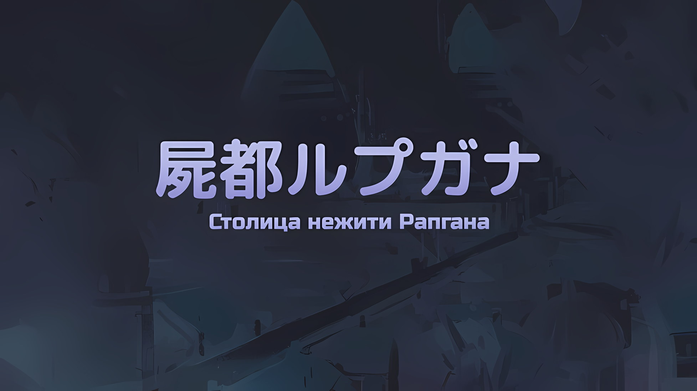
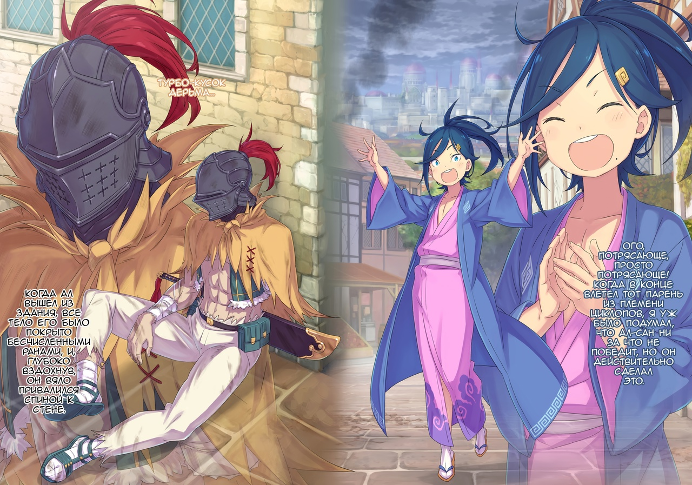
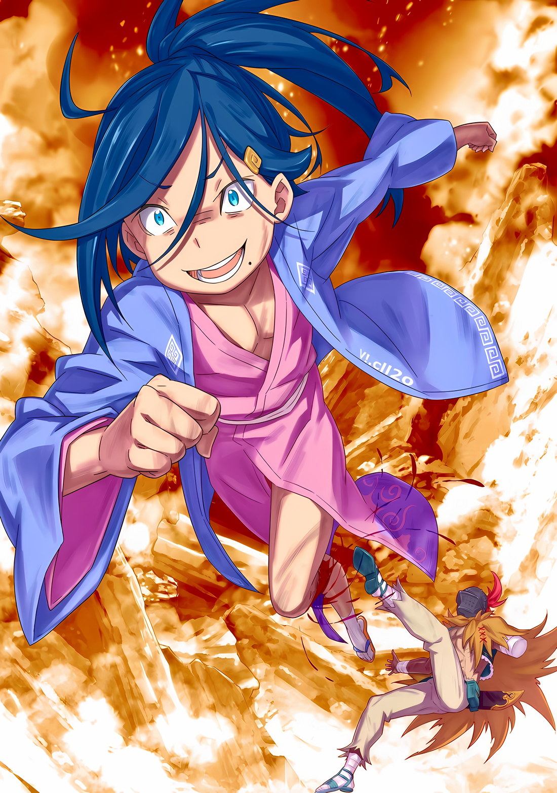

*※※※※※※※※※※※*

…Столица Империи Рапгана была захвачена нежитью.

В Рапгане, городе, который теперь лучше было назвать столицей нежити, а не столицей Империи, Ал в одиночку искал и боролся за пропавшую без вести Присциллу.

Однако нельзя было сказать, что поиски его госпожи шли успешно.

Основным методом поиска людей было обращение к очевидцам. Но здесь не было никого, к кому можно было бы обратиться, ни за убедительными показаниями, ни даже за бесполезными сплетнями.

Кругом была только нежить, которая подбиралась к живым со зловещей целью; уцелевшие выжившие не высовывались, затаив дыхание и не предпринимая никаких действий.

Как бы то ни было, они были бесполезны для целей Ала.

Тем не менее…,

???: Абсурдность этого мира в том, что если ты встретил живого человека, это еще не значит, что твоя цель продвинется дальше, верно, Ал-сан?

Сесилус восклицал про абсурдность самого мира.

Хотя он был полностью согласен с этой оценкой, сейчас у Ала не было возможности придираться к тому или иному вопросу. …Ал свисал с края крыши пятиэтажного дома.

Ал: …Черт.

Выругавшись в своем железном шлеме, Ал отвел взгляд от ухмыляющегося лица Сесилуса.

В данной ситуации говорить что-либо Сесилусу было бесполезно. Прежде всего, Ал висел так потому, что его сбросил с крыши не кто иной, как Сесилус. Более того, он пнул Ала со спины после того, как подозвал его к краю крыши и заставил думать, что вдалеке что-то есть.

Если это не признак злого умысла, то что же тогда?

Сесилус: Как бы ты это ни называл — тест или чек*, цель — выяснить. Реакция твоя, похоже, лучше, чем у Босса, ибо ты не упал вниз головой.

* Check — проверка.

Ал: Эмм, ага. Понятия не имею, о чем ты.

Сесилус: Не велика беда, раз не понимаешь! Ведь я знаю, что думаю и чего хочу. Кстати, скажу сразу, я не стану помогать тебе подняться, Ал-сан.

Давая нежелательный ответ на вопрос Ала, Сесилус невозмутимо хлопнул в ладоши.

Ал не знал причины такого кровожадного поведения, пока не заговорил Сесилус; по правде говоря, он и сейчас понятия не имел, в чем заключалась причина. Даже если бы он заговорил о враждебности или убийственном намерении, Ал и до этого не слишком много общался с Сесилусом.

После спасения от опасного врага-нежити они кратко представились друг другу. Ал рассказал о своих передвижениях до этого момента и целях на будущее, а затем его сбросили с крыши.

И хотя столкновение с ним могло показаться неудачей, его ответ не особо обескуражил Ала.

Поскольку…,

Ал: …Мне приходилось слышать это множество раз, так что я на тебя и не надеюсь.

С этими словами Ал ослабил свою хватку за край и пустился в свободное падение.

Сесилус: Ойо.

Голос Сесилуса прозвучал удивленно и издалека, а Ал стал размышлять на фоне чувства парения.

Расстояние до земли составляло около пятнадцати метров — высота, на которой легко могли бы приземлиться сверхлюди, но Ал был обычным человеком и вполне мог умереть. Помидор был бы полностью раздавлен.

Приближающаяся земля представляла собой мокрый булыжник, воды было недостаточно, чтобы смягчить удар при падении, а грязная почва не обеспечивала никакой амортизации, что делало этот способ чересчур жестким.

Следовательно, для того, чтобы спастись, требовалось действие, отличное от падения.

Ал: Оаааа!

Издав гортанный звук, Ал вытянул согнутые колени и изо всех сил ударил ногой по стене.

Тело Ала, которое должно было упасть прямо вниз, пошло по диагонали, сокращая расстояние до противоположного здания, высота которого была такой же, как и у того, за которое он держался. Время удара составило одну-две секунды после начала падения, а если бы это произошло чуть раньше или позже, он бы ударился о стену, и превращение в раздавленный помидор со сломанной шеей стало бы неизбежным.

Но если момент был выбран правильно… мгновение спустя тело Ала пробило окно здания.

Ал: Гуох!

Ал влетел в безлюдную комнату с разбитым окном в качестве сопутствующего ущерба. При ударе о пол стекло рассекло ему плечо и спину, нанеся серьезные повреждения.

Ал: Но я выжил…

Влетев спиной вперед в комнату, Ал вскочил на ноги и убедился, что жив. Затем он проверил, нет ли у него смертельных ран и сломанных конечностей, и только пройдя эту проверку, смог объявить себя выжившим.

Любые повреждения, которые на данный момент не поддавались восстановлению, необходимо было устранить.

Ал: Воуу, моей левой руки больше нет!? Я имею в виду, что она такая уже почти двадцать лет…

Выдержав небольшую вялую паузу, Ал тут же спрятался за дверью, выходящей в коридор, и быстро вытащил из-за пояса Меч Синего Дракона.

Ему удалось избежать гибели. Правда, из-за такого спасения он с громким треском влетел в здание.

Естественно, этот звук привлек внимание всех в округе…,

???: Где-то здесь!

???: Да!!!

Вместе со шквалом торопливых шагов нежить выломала дверь и ворвалась в комнату.

Нежить ринулась на него, но стоило их бледным лицам оказаться перед ним, как Ал взмахнул своим Мечом Синего Дракона и обезглавил их всех.

Первый нападавший был убит мгновенно, и, используя его обезглавленное тело в качестве щита, он определил количество прибежавших сюда врагов. За выломанной дверью их было двое, а по звуку шагов, доносившихся с лестницы, — трое… За трупом первого из них, второй, оправившись от удивления, метнул вперед короткое копье, которое держал в руках.

*Быстро же они восстанавливаются.* От этой мысли его затошнило.

Размышляя об этом, Ал направил обезглавленный труп на траекторию полета копья своего противника…,

Ал: Я облажался.

Когда тело нежити получило смертельный удар, оно мгновенно разлетелось вдребезги, словно потерявшая форму глиняная посуда.

Таким образом, привычная тактика использования мертвого тела в качестве щита не сработала; Ал понял это, почувствовав, как короткое копье противника смертельно вонзилось ему в грудь.

*× × ×*

???: Где-то здесь!

???: Да!!!

Вместе со шквалом торопливых шагов нежить, выбившая дверь, была обезглавлена.

Отшвырнув мешающий безголовый труп в сторону, Ал отпрыгнул в конец комнаты. Преследуя его, второй враг бросился вдогонку с коротким копьем в руке.

Ал: Дона!

Наконечник короткого копья впился в поднявшуюся из пола земляную стену, с силой ее захватив.

Как только Ал увидел, что привлек внимание своего противника, он поставил подошву ноги на земляную стену и…,

Ал: Дона! Дона! Дона!

Из стены, на которую он поставил ногу, вылетел столб земли, ударивший нежить с другой стороны прямо в лицо и отбросивший ее назад.

Столб земли отбросил назад как второго нападавшего, так и третьего, пытавшегося последовать за ним; из острия столба он выпустил другой столб земли, а из него — еще один, с силой многоступенчатой ракеты впечатав обоих представителей нежити друг в друга и насмерть разбив их о стену коридора.

Ал: Остался один…!

Услышав громкий звук разбивающейся керамики между столбом и стеной, Ал задумался о том, как он на одном дыхании расправился с тремя врагами, и остался следить за движением противника, по-прежнему опираясь ногой на земляную стену.

Первого нападавшего он одолел неожиданной атакой, второго и третьего — тонкой техникой. Оставался только четвертый, последний, нападающий, так что Ал был бы в безопасности, если бы смог поменять плохие перспективы на хорошие, однако…,

Ал: Ну, не все же будет так гладко!!!

Вся стена преграждавших вход земляных столбов, была разрушена, и последняя нежить ворвалась в комнату силой.

Вооруженный массивным боевым топором, он являлся нежитью из Племени Циклопов с огромным глазом золотого оттенка в центре лица. Увидев это и рассудив, что он гораздо опаснее, чем трое других, Ал повернулся к нему спиной и сосредоточил все свои силы на том, чтобы добраться до окна комнаты…,

Ал: Я успею!!!

Как раз в тот момент, когда он собирался успеть, его кричащую спину настигла разрушительная сила боевого топора, окончательно снесшая его с ног и оставившая внутри здания гротескное убранство из разбросанных внутренностей Ала.

*× × ×*

???: Где-то здесь!

???: Да!!!

Вместе со шквалом торопливых шагов первая нападающая нежить, которая выбила дверь, была обезглавлена.

В следующий момент он понял, что в коридоре находятся двое, а самый страшный враг поднимается по лестнице. Тогда Ал сделал большой прыжок назад…,

Ал: Дона!

Разобравшись со вторым и третьим нападающими, ему не оставалось ничего другого, кроме как открыть стратегический путь к спасению от последнего монстра.

*△▼△▼△▼△*

Сесилус: Ого, потрясающе, просто потрясающе! Когда в конце влетел тот парень из Племени Циклопов, я уж было подумал, что Ал-сан ни за что не победит, но он действительно сделал это.

Ал: Турбо-кусок дерьма…

Сесилус: Ну и ну, уверен, он был крайне грозным противником, но я бы не сказал, что такое отношение к своему врагу, с которым ты так упорно сражался, может быть приятным. Конечно, нецензурная брань и оскорбления, как правило, производят впечатление, но мне не нравится идея о том, что дурная слава лучше анонимности!

Ал: Я про тебя…

Когда Ал вышел из здания, все тело его было покрыто бесчисленными ранами, и, глубоко вздохнув, он вяло привалился спиной к стене.

Затем Сесилус широко распахнул свои глаза, одновременно приветствуя и упрекая Ала.

Ал: Хах, я серьезно не понимаю, как ты можешь быть так удивлен. Ты чуть не убил меня, причем в двух смыслах. Даже ублюдок-саикопас*, как минимум, должен знать, что к нему питают злобу…

* Psychopath — психопат.

Сесилус: О, как и ожидалось, я не смог выучить все словечки Босса за этот короткий промежуток времени, так что есть некоторые слова, о которых я не знаю. Что означает «саикопас»?

Ал: Это что-то вроде ненормального человека. Он идет и убивает людей, сохраняя при этом спокойствие.

Сесилус: Это так? Но в таком случае не думаю, что я саикопас. …Ведь Ал-сан по какой-то причине не умер, верно?

Глупо рассмеявшись, Сесилус изрек извращенную фразу самозащиты.

Получив ответ Сесилуса, Ал присел на корточки и сосредоточился на регулировании своего дыхания. Пока Ал молчал, Сесилус поднял один палец и продолжил.

Сесилус: Тот парень из Племени Циклопов был весьма искусен. К сожалению, до меня ему далеко, но если бы против него был Ал-сан, то ты бы проиграл сто раз из ста. Это правда, которую я видел собственными глазами!

Ал: …Но я ведь жив, не так ли? Или ты хочешь сказать, что я мертв?

Сесилус: Нет-нет, я уверен, что ты жив. У меня было подозрение, что, возможно, ты — нежить, выдающая себя за живого, но, похоже, это не так. В таком случае я могу предположить только одно. …Ал-сан вытянул сто первую возможность.

Подняв один палец на своей руке, а другой — на противоположной, Сесилус показал два пальца.

При подсчете этих двух пальцев получилось бы не больше двух, а если проявить щедрость, то их можно было бы расценить как одиннадцать, но вместо того, чтобы сосредоточиться на жесте, который на самом деле не отражал его намерений, Ал, услышав эти слова, с трудом перевел дыхание.

Сесилус: Я не зацикливаюсь на числе сто один. Сто два, сто три или даже двести — это прекрасно! Ал проиграл бы этому парню из Племени Циклопов сто раз из ста. А что, если сделать это тысячу раз, десять тысяч раз или сто тысяч раз? В буквальном смысле этого слова, шанс один на десять тысяч. А ты вытянул его в самом начале. Я ошибаюсь?

Ал: …Кх.

Обман, заключавшийся в том, что он молчал, сосредоточенно переводя дыхание, достиг своего предела.

Выражение лица Ала внутри стального шлема, которое не мог видеть Сесилус, дрогнуло; он от всего сердца боялся Сесилуса. Его взгляд, речь и поведение — даже Ал не мог понять, что это вообще такое.

По тому, как говорил Сесилус, он почти безошибочно угадал каким Полномочием обладает Ал. И это было не логикой, а скорее пониманием, так сказать, через догадки.

Мальчик, назвавшийся Сесилусом Сегмунтом, не только носил то же имя, что и «Синяя Молния», сильнейший в Империи Волакия, но и явно был исключительным существом этого мира.

Ал: Его рост, возможно, объясняется той же причиной, что и у нас с братом…

Точно так же, как Ал и Субару были «Инфантилизированы» техникой Ольбарта, вполне возможно, что Сесилус тоже был уменьшен.

Человек, о котором идет речь, не считал себя «Первым» из «Девяти Божественных Генералов», но когда «Инфантилизация» Ала обострилась, он почувствовал, как его сознание возвращается назад, чтобы соответствовать внешнему виду. То же самое, по всей видимости, произошло и с Сесилусом.

В случае с Алом он был вынужден оптимизировать свой разум, но на такую радикальную меру мог пойти только он сам и Субару. Таким образом, можно считать, что интеллект Сесилуса снизился.

Если именно это и превратило Сесилуса в такого малолетнего монстра, то последствия действий Ольбарта были очень серьезными.

Сесилус: Ты не отвечаешь мне потому, что не можешь ответить, или потому, что не хочешь… что именно?

На тихий вопрос Сесилуса Ал уселся, опираясь на стену, к которой прислонился.

В этом молчании Сесилус таил оттенок опасности, и это было признаком того, что внутри него вращался маятник. От этого маятника зависело, станет ли Ал его союзником или врагом.

Совершенно не заботясь о постигшем столицу нежити беспрецедентном бедствии, он зациклился на пустяковом вопросе.

Сесилус: Любопытно. Любопытно, знаешь ли. Предположим, Ал-сан обладает чем-то, что может с первого же раза вытянуть вероятность один к десяти тысячам… Интересно, сможешь ли ты вытянуть такую вероятность со мной в качестве противника?

В таком случае вероятность того, что это произойдет, будет не одна на десять тысяч, а одна на миллиард, нет, вполне возможно, одна на триллион.

Однако, если она не равна нулю.

Ал: Я скажу это сейчас, но… тебе не стоит заходить так далеко, копаясь в моей привлекательности. В противном случае за тобой будет следить нежелательная сторона, и ты очень об этом пожалеешь.

Сесилус: Невероятно! Говорить со мной в подобной манере. Мне это не противно, скорее даже нравится.

Ал вздохнул, наблюдая за реакцией Сесилуса, который, казалось, все больше забавлялся.

Он хотел найти слова, чтобы ослабить очарование Сесилуса, но, судя по всему, у него не было времени. Он, наконец, пережил наплыв нежити, который последовал за его смертельным прыжком.

Бремя было тяжелым, но он должен был перейти на следующую ступень.

Ал: …Освобождение территории, последующее перерасширение, повторный мысленный эксперимент.

Прежде чем Сесилус успел сделать хоть одно лишнее движение, Ал переопределил установленную им ранее матрицу.

Отдача была слишком велика из-за частоты и масштаба, но, по крайней мере, Ал решил продолжать игнорировать последствия, пока не выберется за пределы Империи Волакия. …Возвращение Присциллы — его главный приоритет.

Ал: Если все делается ради этой цели, то неважно, сколько раз это потребуется, я буду… Аааа!?

Как раз в этот момент он собирался произнести свое решительное заявление.

Не успел он договорить, как фигура Сесилуса расплылась, и сразу же после этого Ал был отброшен в сторону, получив удар зори в бок.

В ответ на такое возмутительное поведение Ал закричал, скользнув по земле.

Ал: Какого черта! После всех этих разговоров о том, как произвести грандиозное впечатление на сцене, ты нападаешь на кого-то в самый разгар диалога!

Сесилус: Нет, нет, нет, ты все неправильно понял! Для меня совершенно немыслимо совершить такую грубость! Это было бы преступлением, за которое полагается каппуку*. Так что дело не в этом, а в том, чтобы взглянуть.

* Каппуку (割腹) означает выпотрошить себя в качестве наказания; харакири, сэппуку.

Ал: Взглянуть на что…

Когда Ал закончил скользить по земле и начал подниматься на ноги, Сесилус в качестве оправдания указал жестом на стену. Там, на высоте груди от того места, где всего несколько мгновений назад находился Ал, зияла дыра размером с кулак.

Еще мгновение назад ее там не было. Однако дыра появилась внезапно.

Это означало…,

Ал: Снайпер… Гхааа!!!

Сесилус: Прости меня за грубость!

В тот же миг его глаза распахнулись, облик Сесилуса вновь расплылся, и сразу после этого Ал почувствовал ускорение во всем своем теле, когда его отбросило прямо назад.

Сесилус, неистово побежав, обхватил Ала за талию и потащил его за собой в стремительном спринте. А за ними по пятам, когда они стали единым целым с ветром…,

Ал: Эй, эй, эй, эй, эй, что за чертовщина, что за чертовщина, что за чертовщина!

Среди иллюзии того, что его отбросило назад, поле зрения Ала заполнили городские улицы и стены зданий, пробиваемые одна за другой, поскольку что-то огромное преследовало их с безрассудной скоростью.

Если его первоначальное впечатление соответствовало действительности, это был снайперский огонь. Снайпер гнался за Алом и Сесилусом.

Ал: При обстреле снайперы должны оставаться на месте — это железное правило!

Они должны были терпеливо затаиться, прицелиться, как только цель окажется в поле их зрения, и нанести смертельный удар.

Таковы основы ведения снайперской стрельбы, которые должны были быть непреложным правилом. Однако данный снайпер бросил вызов всему этому, точно преследуя убегающую пару, предугадывая их движения в поисках укрытия и ведя огонь.

Казалось, будто они были окружены сотней снайперов, или же их преследовал один снайпер, имеющий полную свободу передвижения на высокой скорости.

Сесилус: Вау! Вот это да! Опа!

Ал: Бхаа! Уф! Яжык прикушил!

Находясь под прицелом этого ужасающе точного и проворного снайпера, Сесилус, неся на себе Ала, двигал телом вправо, влево, вверх и вниз, постоянно уклоняясь от атак.

Однако он, казалось, совсем не смотрел на окружающую обстановку. И тут Ал понял. …Это были предположения. Сесилус уклонялся от атак снайпера высшего класса только благодаря своим предположениям.

Сесилус: Это не совсем так. Но разве ты не испытываешь определенный трепет в моменты, кои противник считает критическими? Это оно.

Ал: Можешь не обращать внимания на мои подозрения! Лучше сосредоточься на том, что ты делаешь!

Сесилус: Хорошо. Однако наш противник обладает выдающимися способностями. …Я уже несколько раз сталкивался с ним, но он никогда не позволял мне подобраться к нему вплотную.

Земля разлетелась со взрывным звуком, который, казалось, не мог быть вызван ударом его зори, и по мере того, как он набирал силу, Сесилус начал ускоряться. Почувствовав близость невидимого снайпера, преследующего их снайперским огнем, Ал испытал двукратный шок от заявления Сесилуса.

Первый шок заключался в том, что Сесилус уже несколько раз сталкивался с этим врагом и все равно остался жив.

Второй шок заключался в том, что даже Сесилус не смог победить этого врага, а это означало, что он является необычайно грозным противником.

Сесилус: Кажется, он летает, но по какой-то причине, кроме скорости, его не видно.

Ал: Невидимый враг… кх.

По словам Сесилуса, который, похоже, не обладал должным чувством опасности, Ал получил ключевое слово — «невидимый враг».

Если бы только они могли разгадать механизм, лежащий в основе этой невидимости, или хотя бы найти способ ему противостоять.

Сесилус: Ух ты, ой-йо…

В очередной раз Сесилус заговорил без чувства опасности, и тут же раздался сильнейший грохот, заставивший Ала оглянуться… то есть посмотреть в ту сторону, куда они направлялись.

Затем в пределах видимости Ала рухнули три здания, стоявшие на их пути.

Спереди и с каждой стороны улицы на них начали обрушиваться строения. Фундамент каждого из них был выбит снайпером, в результате чего они накренились и стали рушиться внутрь.

Если они столкнутся с ними, то не смогут избежать гибели. Поняв это, Ал стиснул моляры,

Ал: Территория, переопределение!!!

Сесилус: Я мчусь прямо вперед!

Сразу же после своевременного переопределения территории Сесилус, оттолкнувшись от земли и удерживая Ала, пробил окно самого переднего разрушающегося здания и нырнул внутрь.

Когда они накренились и послышался негромкий звон бьющегося оконного стекла в сочетании с прогибающимися стенами, Сесилус ударил ногой в пол разрушающегося здания, пробил потолок и рванул вверх, насильно прокладывая прямой путь с нижнего этажа на верхний.

Сесилус: Вперед-вперед-вперед-вперед-вперед-вперед-вперед-вперед!

Учитывая, как рушилось здание, можно было предположить, что в первую очередь оно будет раздавлено при соприкосновении с улицей на нижних этажах.

С другой стороны, такой возмутительный подвиг по спасению от раздавливания нельзя было назвать разумным поступком. Не стоит даже говорить об этом.

Однако, благодаря этому эксцентричному решению, Алу и Сесилусу удалось пробить потолок верхнего этажа и выбраться наружу быстрее, чем здание успело полностью обрушиться…,

Ал: …Нет, ничего не выйдет.

Пробив потолок, Ал и Сесилус взмыли в небо.

Внизу они увидели, как три разрушающихся здания столкнулись друг с другом, их колоссальная масса вызвала сильнейшее землетрясение. В одном из упавших зданий, по-видимому, хранились легковоспламеняющиеся спиртные напитки или, возможно, магические камни, поскольку на другой стороне улицы разгорелся настоящий ад.

Однако…,

Сесилус: Вот это грозный враг!

Радостное восклицание Сесилуса и сотрясающееся от удара тело Ала прозвучали одновременно.

Но Ал был не единственным, кто пострадал от удара. Вместе с Алом в небо взмыл Сесилус… В результате попадания снайперского огня ему оторвало одну из ног.

Небольшая левая нога мальчика была оторвана от колена, и он, скрежеща зубами, разбрызгивал в воздухе свою кровь. Пережив подобное, Ал понимал, каково это. Боль наступала сразу, заставляя горло кричать…,

Сесилус: …Вон там!

Вместо того, чтобы закричать, Сесилус выкрикнул это, вероятно, определив местонахождение врага в небе.

Затем Сесилус поставил свою оставшуюся ногу на тело Ала, которое он все еще держал в руках, и, используя ее как рычаг, направил себя к чему-то, что он заметил.

Благодаря тому, что он опирался только на одну ногу, его импульс был очень сильным и, казалось, достаточным для того, чтобы настичь врага.

И все это в состоянии потери одной ноги…

Ал: …Так не пойдет.

Даже без одной ноги Сесилус все равно был в сто раз сильнее Ала.

Но это не годилось. Необходимо, чтобы он был в идеальном состоянии. Поэтому Ал достал Меч Синего Дракона и прислонил его к собственной шее.

Затем, без колебаний, он с силой надавил на лезвие…

*× × ×*

Сесилус: Я мчусь пря…

Ал: Нет, к зданию справа!!!

Поскольку здания рушились с трех разных сторон, в тот момент, когда Сесилус готовился ринуться внутрь самого переднего из них, Ал закричал голосом, не уступающим по громкости рушащимся строениям, и приказал изменить их путь.

Услышав призыв Ала, Сесилус рассмеялся и облизнул губы.

В тот же миг Сесилус резко изменил направление своего движения и, неся Ала, устремился к разрушающемуся зданию справа.

Услышав каскад осколков оконного стекла, Ал указал на внутреннюю часть комнаты, в которую они запрыгнули,

Ал: Вон та комната! Защитить ящик внутри!

Сесилус: Есть, сэр!

Сесилус не стал задавать никаких вопросов, услышав уверенные указания Ала.

С силой пробив стену в соседнюю комнату, он обнаружил железный ящик… часть состояния, хранившегося у владельца здания, предназначенная для чрезвычайных ситуаций.

К сожалению, хозяин, похоже, был не в состоянии забрать этот ящик с собой, но благодаря этому Ал и Сесилус смогли его уберечь.

Ал: Вверх!

Сразу же после того, как ящик был зафиксирован, путь побега из наклоненного здания был изменен на тот, который использовал необычайную силу ног и новаторское мышление Сесилуса.

Таща на себе Ала, который нес ящик, Сесилус пробил потолок нижнего этажа и пол верхнего, и, повторяя это в быстром темпе, они одним махом преодолели весь путь до последнего этажа.

В тот момент, когда Сесилус ударом ноги пробил потолок последнего этажа и они вылетели наружу, пред Алом предстал пейзаж, который он видел уже бессчетное количество раз, а потому он выронил ящик из рук.

И как раз перед тем, как снайпер успел издалека отстрелить Сесилусу хоть одну из его конечностей…,

Ал: …Дона.

Внутри ящика, который он уронил, никудышная магия Ала вызвала огонь, воспламенивший магический камень высокой чистоты, принадлежащий одному из жителей Империи, а затем раздался взрыв, и пламя охватило их прямо снизу.

Ал: …

Наслаждаясь ощущением палящего жара, обжигающего их кожу, Ал и Сесилус оказались скрыты от окружающих завесой пламени. Однако, даже если бы пламя скрыло их только на это мгновение, если бы там действительно был снайпер, он бы выстрелил сквозь него… Нет, он бы прострелил Сесилуса насквозь, не теряя его из виду.

Поэтому цель была не в том, чтобы помешать снайперу.

Сесилус: …Вон там.

Пробормотав это, Сесилус улыбнулся, обнажая свои зубы.

Из щеки Сесилуса хлынула кровь, а его длинные синие волосы растрепались и разметались, когда снайпер сорвал с них заколку. Однако все его конечности остались невредимы.

Огненная завеса предназначалась не для того, чтобы скрыть Сесилуса от врага, а для того, чтобы он смог заметить приближающиеся к нему пули прежде, чем они его настигнут.

Перед тем как попасть в Сесилуса, пуля должна была пройти через огненную завесу.

Как бы глупо это ни звучало, но он верил в это настолько, что поставил на то, что Сесилус не пропустит мгновенное изменение в пламени. И он выиграл это пари.

…В этот момент взгляды Сесилуса и снайпера пересеклись через завесу пламени.

Сесилус: …

В одно мгновение зрачки глаз Сесилуса сузились, и подошвы его сандалий «зори» уперлись в бедро Ала.

Как и прежде, Сесилус намеревался совершить прыжок, к месту, где находился снайпер. Разница заключалась лишь в том, что все конечности Сесилуса были прикреплены к его маленькому туловищу.

Все, что теперь оставалось, это…,

Ал: …Не теряй бдительности.

Пробормотав это, Ал начал подготовку к следующему повторному расширению своей территории.

Каждый раз, когда это происходило, он испытывал в голове чувство потери, как будто что-то разрывалось на куски, но Сесилус был прав. Можно сказать, что возможность, выпадающая раз в жизни, — это шанс, который, случившись, нельзя упускать.

Если кто-то хотел получить его дважды, то он не мог позволить себе идти на компромисс.

Именно поэтому Ал собирался установить следующую матрицу.

???: …Разрез Облаков.

Как раз перед этим в поле зрения Ала промелькнула поразительная перемена.

За огненной завесой, в том направлении, где, по предположению Сесилуса, находился снайпер, в небе, откуда Ал все еще не мог разглядеть врага; там произошло необычное изменение.

Проще говоря, облака были разрезаны.

Густые черные тучи, закрывавшие небо столицы нежити Рапганы, были неожиданно рассечены. Кучевые облака получили не один, а два-три разреза подряд.

Они словно преследовали невидимого врага в небе… Нет, не словно.

Режущие удары преследовали врага, а их последствия разрывали черные тучи.

Сесилус: Аааа!!! Он уходит, он уходит! Он удирает!!!

Этот визжащий голос принадлежал Сесилусу, который держал ногу на спине Ала.

Его глаза расширились, и причиной его крика, вероятно, послужило то, что снайпер бросился прочь от удара, который прорезал облака… отказываясь от боя и отступая.

С точки зрения Ала, это можно было расценить только как благоприятный поворот событий, но не для Сесилуса. Он уставился на открывающийся внизу вид глазами, полными разочарования.

А там…,

???: Ха-ха-ха-ха! Беги, беги в страхе перед моим мастерством фехтования!

Ал и Сесилус отпрыгнули в сторону, подальше от трех рушащихся строений; одинокая фигура виднелась на крыше одного из зданий.

Фигура с мечом в руке, провожающая взглядом врага вдалеке и указывающая своим клинком, рассекающим облака, на небеса, широко улыбалась.

Ал нахмурился, задаваясь вопросом, кем или чем является этот незнакомец.

Позади Ала Сесилус издал звук «А», глядя на внезапно появившегося незваного гостя,

Сесилус: Похоже, ты постарел за то время, что я тебя не видел, пап.

Ал: Это твой старик?

Ал был ошеломлен тем, что Сесилус произнес это с совершенно притворным неведением.

Встреча с этим человеком, которого Сесилус назвал своим отцом, была бы, наверное, хорошей, но проблема заключалась в том, что…,

Ал: …Ты же ведь не умрешь после этого, правда?

После того, как грозный снайпер ушел, Ал, глядя прямо вниз на три здания, которые все еще продолжали бурно разрушаться, пробормотал Сесилусу о том, что ждет его впереди, при этом ощущая чувство парения в воздухе.
