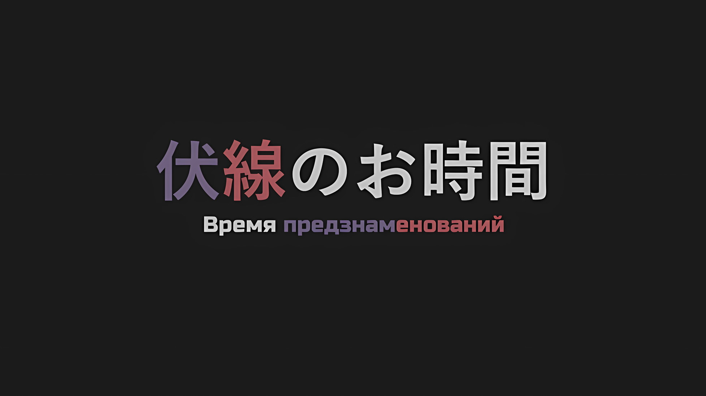

*※※※※※※※※※※※*

С мечом в одной руке и багажом под мышкой, он медленно открыл дверь перед собой.

Он никогда бы не стал безрассудно открывать дверь пинком или ее разрубать. Бездумно шуметь и провоцировать нежить, которая потенциально могла скрываться поблизости, — вот чего он хотел избежать. То же самое касалось и привлечения внимания со стороны его окружения.

Если бы это были обычные имперские солдаты, которые превратились в нежить, с этим еще можно было бы справиться, но он предпочитал не ввязываться в бой с опытными противниками. Его нежелание усиливалось еще и тем, что он нес что-то, что нельзя было просто выбросить.

???: …

Он принюхался к воздуху вокруг себя, а затем поморщился от вони ржавого железа, которая исходила изнутри комнаты.

Это был запах крови. Когда к нему привыкаешь, отличить ее свежесть становится более или менее просто. Вышеупомянутый запах был вызван недавно пролитой кровью, и исходил он не только от одного человека.

Как и ожидалось, при осмотре самой дальней комнаты обнаружилось два тела, сваленных друг на друга.

В единственном доме, выходящем на главную улицу, лежали трупы пожилой женщины и молодого мужчины.

Преступником, должно быть, была та нежить, которую он прямо перед этим зарубил у дома. Меч в его руке был залит кровью не иначе как потому, что эти трупы были свежими.

Жертвами, предположительно, являлись родитель и ребенок. К сожалению, выражения их лиц в последние минуты жизни нельзя было назвать безмятежными, поэтому он не смог сравнить их черты. Пожилая женщина лежала на кровати, а молодой мужчина, казалось, навалился на нее сверху, словно накрыв собой, — рядом с ними валялся сломанный меч.

???: Они не успели убежать… Нет, дело в другом.

Композицией сцены являлись не два человека, которые не успели вовремя спастись, а сын, оставшийся для того, чтобы защитить свою мать, так как та была не в состоянии бежать.

Интуитивное восприятие этого зрелища было слишком ироничным, чтобы произойти в столице Империи, которая находилась в самом сердце Волакии — месте, где попирание слабых было вполне естественным.

Тем не менее, он не мог посмеяться над этой иронией. Если бы только он прибыл на несколько минут раньше…

???: …

Вложив извлеченный меч обратно в ножны, он молча смотрел на труп человека, который решил, как он распорядится собственной жизнью в разгар визита неизбежной трагедии.

Окажись в такой же ситуации, смог бы он бороться до тех пор, пока не иссякнет его жизнь, подобно этому человеку, вставшему спиной к кровати, на которой лежала его самая дорогая семья?

???: Это бессмысленно, ответ очевиден.

Он раздраженно сплюнул, избавляясь от горькой слюны с томительным отвращением, которое так и не исчезло.

Да, это был вопрос к самому себе с очевидным ответом. Было совершенно ясно, что он подожмет хвост и сбежит, невзирая ни на что. …В тот самый момент, когда он себя так высмеивал.

????: Эээй, Красноволосый! Ты где!? Я уже закончил свои дела!

Внезапно он услышал невероятно громкий голос, доносившийся снаружи здания, и поднял голову, чтобы посмотреть в окно.

Румяное лицо, с которым он совсем недавно расстался, всплыло в его памяти, и он почувствовал, что отрезвел, когда кровь отхлынула от его лица из-за безрассудства повышать голос в этом городе, который кишит нежитью.

Его голова загудела под тяжестью реальности, от которой он был не в силах отмахнуться из-за опьянения, вызванного тем, что он пил и пил, снова и снова, — он прищелкнул языком, выглядывая из окна, к которому подошел.

И тут, в самой нижней части его поля зрения, на улице появился одинокий синеволосый мужчина в васу, который искал его, размахивая рукой… нет, рядом с ним еще находился небольшой силуэт в похожей одежде.

?????: Где же ты можешь быть, папин компаньон! Это место не подходит для долгой и приятной беседы, так почему бы нам не переместиться в другое место! Ну, конечно, если только сказанное папой про наличие компаньона не является пьяной иллюзией или какой-нибудь подобной шуткой!

????: Ого, да как же ты мог такое сказать? Говорить подобные вещи после того, как прихватил с собой своего родителя… Мое дитя выросло в неблагодарного сынка. Интересно, интересно! Что же пошло не так с моим воспитанием…!

?????: Нет-нет-нет, это не твоя вина, пап! В конце концов, ты почти никогда меня не воспитывал!

Учитывая, что эти двое собрались вместе, назвать их шум в два раза более громким было бы большим преуменьшением.

Хотя существовала разница между тем, чтобы быть пьяным от алкоголя или пьяным от самого себя, услышав голос, который, как он знал, принадлежал такому же пьяному человеку, компаньон, которого они вдвоем искали… Хейнкель, схватился за свою голову свободной рукой.

Когда пульсирующая головная боль, вызванная похмельем, разбушевалась и заявила о том, что она была вызвана не алкоголем, а чем-то другим, он покрепче ухватился за запасную еду… за человека-гиену, шевельнувшегося в его руках, а затем испустил глубокий вздох, от которого разило спиртным.

*△▼△▼△▼△*

Эти два идиота продолжали шуметь на главной улице, не обращая внимания на то, что находятся на виду у всех.

Если бы он оставил их позади, и в результате они были бы поглощены толпой нахлынувшей нежити, можно было бы считать, что они пожинают плоды своих же действий. Однако, поскольку Хейнкель не хотел быть втянутым в этот процесс, он сразу же их позвал.

Когда эти двое были приглашены в дом, к ним неожиданно присоединился еще один человек.

???: Не ожидал, что ты останешься в столице Империи, Хейнкель-сан. Думал, ты уже сбежал, а если же нет, то…

Хейнкель: Умер, хочешь сказать? Я собираюсь ответить тебе тем же, Альдебаран.

Ал: Просто Ал, пожалуйста.

Ал, человек в стальном шлеме, отреагировал на их нежданное воссоединение, одновременно возясь пальцем с металлическими частями своего шлема.

Во время тотальной битвы, охватившей столицу Империи, между регулярной армией и революционерами, Хейнкель, как член повстанческой группировки, находился на отдельном от Присциллы и Ала поле боя, поэтому он не знал ни об исходе битвы, ни об их состоянии.

Он не мог получить ответы на эти вопросы, даже если бы захотел. Но по чистой случайности ему досталась эта информация.

В дополнение к этому…,

Хейнкель: Значит, мисс Присцилла попала в плен, хах. В это немного трудно поверить.

Ал: Ну, бросаться с головой в неожиданные события — это часть проблемного обаяния Принцессы, но на этот раз даже я чувствую, что не должен оставлять ее одну. Так что я решил задержаться в столице Империи, однако…

Хейнкель: А затем ты наткнулся на эту компанию.

Ал кивнул в ответ на слова Хейнкеля, сказав: «Да».

На голове у него был стальной шлем, поэтому выражение его лица и цвет кожи были неизвестны, но по усталости в его тоне и общему настроению Хейнкель мог судить о степени тягот, выпавших на долю Ала.

Ал был человеком, способным поладить с Присциллой, живым воплощением возмутительного и бессистемного поведения. Если он дошел до такого состояния, то Хейнкель мог легко догадаться, с кем ему пришлось иметь дело.

Как бы то ни было, встреча с человеком, который довел Ала до полного изнеможения, также была странным поворотом судьбы.

???: Так, так, не ожидал я встретиться с тобой в таком месте, пап. Я думал, что давненько тебя не видел, но, быть может, это ты забросил меня на Остров Гладиаторов и придумал для меня роль в истории о легенде острова или что-то в этом роде?

Болтая без умолку и выстраивая одно предложение за другим с головокружительной скоростью, мальчик, уплетавший сушеное мясо, которое он самовольно достал из шкафа в доме — или Сесилус, как он себя называл — оказался сыном Роуэна, который, к его большому удивлению, таскался вместе с Хейнкелем.

Вдобавок ко всему, это могло быть и шуткой, но полное имя Сесилуса, включая его фамилию, было…,

Хейнкель: …Сесилус Сегмунт. «Синяя Молния» Волакии.

Сильнейший мечник Империи Волакия и непоколебимый «Первый» из «Девяти Божественных Генералов» Империи.

Как бы далеко он ни пал, Хейнкель все еще оставался заместителем командующего Королевской Гвардией Королевства Лугуника. Он, по крайней мере, знал имена известных личностей из коварной соседней страны. В частности, «Синяя Молния» была слишком известна.

Не имеющий себе равных даже в пропитанной кровью истории Империи, он был человеком, забравшим больше всего жизней в этом мире, и, как говорили, настолько могущественным, что мог посоперничать со «Святым Меча» Королевства.

Хейнкель: …

Хейнкель сузил глаза, глядя на Сесилуса, выглядевшего примерно на одиннадцать-двенадцать лет, и презрел себя за то, что вообще подумал высмеять его способности только из-за молодости.

Для по-настоящему могущественных существ такие темы, как внешность и возраст, были попросту бессмысленны и не оставляли ничего, кроме страданий.

Когда Хейнкель впервые проиграл на мечах своему сыну Райнхарду, тому еще не исполнилось и шести лет. …В этом мире существовали подобные личности.

Если уж на то пошло, Хейнкель должен был признать, что такой человек, как Роуэн, был для него редкостью.

Аналогично Хейнкелю, если он был отцом того, кого провозгласили сильнейшим, то иметь собственные сомнения относительно навыков владения мечом и славы его сына, Сесилуса, было бы…,

Роуэн: Хахаха, ты меня рассмешил. Смертельные бои на Острове Гладиаторов — это, в конце концов, просто показательные выступления, так что ты не научишься ни мечу, ни технике, независимо от того, кого и сколько людей ты там зарубил. Бросить тебя в такое место было бы не более чем препятствием на пути к достижению «Небесного Меча».

Безразличный к мыслям, рождающимся в уродливой голове Хейнкеля, румяный Роуэн пожал плечами, поднося ко рту наполненную выпивкой тыкву и пребывая в приподнятом настроении во время разговора со своим сыном.

Сесилус ответил: «О, тогда понятно», — похоже, это его ничуть не взволновало, и он наклонил голову, откусывая кусочек сушеного мяса.

Сесилус: Что ж, я подозревал, что это не так, потому что направление такого метода совершенно непонятно для кого-то вроде тебя. Но тогда это становится еще более странным-странным мистэри*, ибо я абсолютно не понимаю, почему вообще оказался на острове.

* Mystery — загадка/тайна/секрет.

Роуэн: Это, похоже, еще один странный, причудливый и необычный способ сказать об этом. В любом случае, это было организовано не мной… Хмм?

Роуэн сделал паузу на середине своего предложения, а затем окинул Сесилуса долгим взглядом с головы до ног.

Заметив пристальный взгляд отца, Сесилус заставил рукава своего васу колыхаться взад-вперед, совершая круговые движения, отчего его длинные, распущенные синие волосы разметались.

Сесилус: В чем дело? Даже если прошло много времени, я думаю, трудно забыть великолепие ведущего актера, коим я являюсь.

Роуэн: Помимо этого, погоди-ка, сынок! Куда ты дел Мурасаме и Масаюме? Столь ценные мечи нельзя так небрежно снимать с пояса.

Сесилус: «Ценные мечи»? Ты имеешь в виду катану? Что ты хочешь этим сказать? Между нами существует негласный договор, согласно которому я не буду держать в руках катану, а также то, что ты не позволишь мне ее держать, пока я не получу достойный меня клинок? К сожалению, моя талия так и остается легкой, потому что я все еще не наткнулся на исключительную катану, которую так долго ищу. Трясь, трясь!

Роуэн: Хммммм?

Глаза Роуэна все сильнее затуманивались подозрением, пока Сесилус продолжал трясти бедрами без оружия. В конце концов, его глаза расширились, «Ах», как будто он понял смысл ситуации.

А затем…,

Роуэн: Присмотревшись к тебе повнимательнее из-за этого чувства странности, спрошу, что это с тобой? Сесилус, да ты же в росте уменьшился!

Ал: Ты понял это только сейчас!?

Ал повысил голос на удивленного Роуэна, испытав чувство недоумения, которое выходило за рамки его шока.

Рядом с ним Сесилус, о котором шла речь, повторил: «Уменьшился?» с ничего непонимающим выражением лица. Излишне говорить, что и Хейнкель также не имел ни малейшего понятия о том, что происходит.

Вместо него Ал, выглядевший так, словно у него появилась идея, бодрым шагом сократил расстояние между собой и Роуэном,

Ал: Хочу прояснить ситуацию, итак, ты — отец Сесилуса, а Сесилус, которого ты знаешь, на самом деле был взрослым. Так ведь, да?

Сесилус: Пожалуйста, подожди, Ал-сан, я в этом не уверен. Прежде всего, мне интересно, когда и в какой момент человек может сказать, что он стал взрослым? Например, если кто-то впервые зарубил другого человека, то, если не считать его полноценным, получается, что тот, кого зарубили, был убит кем-то, кто является взрослым лишь наполовину, так что мне кажется, что это бессмысленное обсуждение…

Ал: Ты пока заткнись! Ну, что скажешь, старик?

Роуэн: Не стоит так сильно на меня давить, мистер в шлеме. Во-первых, с точки зрения родителей, даже если их ребенок немного подрос, он всегда будет оставаться ребенком. К тому же, если говорить о Сесилусе, его слова и поступки ничуть не изменились с тех пор, как он был ребенком, сколько бы времени ни прошло…

Ал: Я уже достаточно наслышан о том, что вы двое — родитель и ребенок…!

Засыпанный ответами, сравнимыми с лавиной, со стороны Роуэна, к которому он приблизился, и Сесилуса, который находился рядом с ним, Ал топнул ногой по земле, словно выпуская наружу свой сдерживаемый гнев.

Хейнкелю стало его жаль, и он грубо почесал свои красные волосы,

Хейнкель: Итак, Альдебаран. Ты это хотел сказать? Что Сесилус Сегмунт по какой-то причине уменьшился и стал ребенком.

Ал: Просто Ал… Ну, да, я знаю, как это произошло и как это отменить.

Хейнкель: И как отменить тоже знаешь…?

Было бы нелепо просто кивнуть со словами «Понятно», услышав, что человек уменьшился в размерах, но, вспоминая сцену, похожую на самый настоящий ад, которую он видел во время решающей битвы в столице Империи, он мог согласиться, что большинство увиденных им вещей не совсем исключены.

Если они могли ожидать, что Сесилус вернется в прежнее состояние, то, вероятно, это не было слишком большой проблемой.

Хейнкель: Что ж, тогда почему бы нам не начать разговор после того, как мы вернем его в прежнее состояние?

Ал: Как бы мне этого ни хотелось, нам нужен один старый шиноби, который вернет его в нормальное состояние. Так что на данный момент нам нужно идти дальше, пока он остается в таких же размерах… Эй, почему ты с первого взгляда не заметил, что твой сын уменьшился?

Ал медленно покачал головой, а затем перевел тему разговора на Роуэна.

Однако Роуэн в ответ на вопрос Ала провел пальцем по своему заметно заросшему щетиной подбородку,

Роуэн: Разумеется, для меня не так важно, большой мой сын или маленький.

Ал: Эй-эй, это что, конкурс на звание самого дерьмового отца? А отцы сильнейших в каждой стране все такие?

Хейнкель: …А как насчет тебя? Ты знаешь, что уменьшился в размерах?

Ал раздраженно заворчал, услышав ответ Роуэна, сказанный с неловкостью человека, который был далек от образцового отца. Не желая реагировать на недовольство Ала, Хейнкель поднял тему с Сесилусом.

На его слова Сесилус, уже приступавший к третьему куску сушеного мяса, рассмеялся: «Ну»,

Сесилус: Если ты спрашиваешь меня, осознаю я это или нет, то не осознаю! Уменьшаясь или увеличиваясь, я уже вышел на сцену в образе самого себя!

Хейнкель: Хорошо…

Сесилус: Однако! Как бы то ни было! Все сказанное Боссом, Густавом-сан, другими людьми на острове и остальными второстепенными персонажами встает на свои места! Думаю, предзнаменования сошлись воедино!

Сесилус ударил кулаком по поверхности стола, который находился рядом, его голос клокотал от энтузиазма.

Выражение его лица говорило о том, что для него в этом есть какой-то смысл, но для Хейнкеля, который следил лишь за словами, произнесенными во время их разговора, все это звучало как тарабарщина. Уменьшение тела — очень серьезная проблема, но все, что знал Хейнкель, это то, что ни отец, ни ребенок не воспринимали это слишком серьезно.

Роуэн: Впрочем, теперь все сходится. Неудивительно, что при встрече со мной он выглядел таким спокойным. Видите ли, расставание у нас было не из легких.

Сесилус: О? Я ничего об этом не помню, но мне любопытно, как мы расстались…

Сесилус склонил голову набок в ответ на откровение Роуэна, заинтересованно поглаживая подбородок.

Расставание с отцом, о котором забыл сын. Учитывая их взаимодействие до сих пор, Хейнкель полагал, что оно не могло быть ничем иным, как ужасным.

В этот момент…,

???: …Этот хер — тот самый выблядок, который планировал злоебучее убийство Его Превосходительства и был за это прирезан.

Раздался резкий голос, заставивший Хейнкеля и остальных перевести взгляд в его сторону.

И тут маленький человек-гиена, который до сих пор крепко спал, поднялся с пола, на котором его оставили. Усевшись со скрещенными ногами, он с кислым выражением лица уставился на Роуэна,

???: Я тоже охуеть как удивился, увидев этого ублюдка живым, когда он же, блядь, должен был подохнуть. В особенности из-за того, что я даже представить себе не мог, что этот блядский безмозглый Сесилус сможет так проебаться.

Сесилус: О, ты наконец очнулся, Песик. Гав-гав! Рад, что ты в порядке.

???: А ты, как всегда, пиздец какой тупой, дерьма кусок!

Сесилус надул губы с сердитым выражением лица, глядя на кричащего человека-гиену.

Судя по реакции, человек-гиена, похоже, был знаком с Сесилусом. Однако надо сказать, что Сесилус не помнил этого факта. …Нет, исходя из течения разговора, правильнее было бы сказать, что он забыл о том, что произошло до того, как он уменьшился.

Это была нелепая история, но, возможно, из-за того, что он ничего не помнил из своей взрослой жизни, он, Роуэн и человек-гиена говорили каждый со своей страницы.

Ал: Кстати, кто этот парень, который ранее был в отключке? Он кажется довольно энергичным…

Роуэн: Ах, мистер Пушистик — это Генерал Первого Класса Груви. Он один из «Девяти Божественных Генералов» Империи и коллега Сесилуса.

Ал: Груви… О, ты имеешь в виду Груви Гамлета!

Ал повысил голос, обескураженный непредсказуемой личностью незнакомца, но Хейнкель был удивлен не меньше его.

В конце концов, Роуэн только сказал ему, что это кто-то важный, не предоставив никакой дополнительной информации, поэтому он тащил его с собой как багаж.

В зависимости от ситуации он мог использовать этот багаж, коим являлся человек-гиена, как щит от атак нежити.

Ал: Это означает, что, несмотря на то, что один из них уменьшился в размерах, здесь два Генерала Первого Класса. Хочу сказать, что это вселяет в меня неожиданную надежду, но…

Роуэн: …? В чем дело?

Ал: Разве мистер Генерал Первого Класса только что не сказал что-то безумное? Планировал убийство Императора?

Как только Ал вернул тему разговора в нужное русло, Роуэн снова оказался в центре внимания.

На мгновение пробуждение человека-гиены — Груви — и его обмен мнениями с Сесилусом отвлекли внимание Хейнкеля, но он действительно сказал это.

Встретив недоверчивые взгляды, Роуэн приложил руку ко лбу и сказал: «Упс»,

Роуэн: Видите ли, это недоразумение. Я не планировал убийство Его Превосходительства Великого Императора. Я лишь пытался поручить это своему сыну.

Хейнкель: …Это не оправдание. Выходит, как родитель и ребенок, вы оба виновны в покушении на Императора?

Хейнкель уставился на синеволосых родителя и ребенка, ошеломленный объяснением, которое так и не смогло выполнить свою задачу.

Он никогда не слышал о том, что Императора пытались убить, так что, скорее всего, это была просто попытка, однако такой слух был довольно вопиющим.

Тем не менее, на вопрос Хейнкеля Груви покачал головой со словами: «Ты ошибаешься»,

Груви: Этот ублюдок сказал Его Превосходительству, что его дерьмовый батя планировал это. После чего, как гласит история, он вместе со своим дерьмовым батей отправился положить конец этому злоебучему заговору.

Ал: Но разве он жив не потому, что Сесилус не положил этому конец?

Груви: Да я и сам не в курсе, вашу мать! ЭЙ, СЕСИЛУС, ТЫ МУДАК ЕБАНЫЙ! О чем ты, сука, только думал, оставляя в живых своего дерьмового батю?

Сесилус: Кто знает? Даже если ты скажешь мне, что это был мой поступок, между мной вчерашним, сегодняшним и завтрашним, цитаты и исключительные направления такого рода, промелькнувшие в этот момент у меня в голове, также поменяются. Однако трудно представить, что мне это не удалось, так что, быть может, я намеренно не стал этого делать?

Груви вскочил на ноги, надвигаясь на Сесилуса, но тот с таким же размером махнул рукой, словно говоря, что ответ потерян из-за его недостающего роста.

В действительности спрашивать Сесилуса об этом, когда он, по всей видимости, не может вспомнить свои собственные причины, было бы бесполезно. Вместо того, чтобы цепляться за неизвестный ответ…,

Хейнкель: Синеволосый, почему ты замышлял убийство Императора? Твоя цель заключалась в свержении правительства?

Роуэн: Хахаха, ты говоришь такие глупые-глупые вещи, Красноволосый. Моя цель очень проста. Если мой сын избавится от Его Превосходительства Императора, то вся Империя станет его врагом.

Хейнкель: Это довольно… Очевидно, однако?

Роуэн: Это и есть моя цель. Ситуация, когда эти имперские солдаты будут продолжать атаковать, не жалея времени на еду и сон… Нет лучшей среды, чем эта, чтобы отточить свои навыки владения мечом между жизнью и смертью!

Хейнкель: …

С видом, будто ему пришла в голову замечательная идея, Роуэн добродушно и звонко хлопнул себя по колену.

Хейнкель мог лишь расширить глаза, застыв на месте и не в силах постичь озвученную логику. С другой стороны, Сесилус, услышав эти слова, издал «Ах, ах, ах!»,

Сесилус: Понятно, понятно, так вот почему! Я ничего об этом не помню, но если это папа, то он бы заставил меня сделать нечто подобное. Он ни перед чем бы не остановился, чтобы достичь «Небесного Меча»!

Роуэн: У тебя настоящий талант владения мечом. …Однако ты бьешься о потолок прямо перед титулом «Небесного Меча». Раз так, я подумал, почему бы не использовать несколько жесткий метод, чтобы позволить тебе вырваться из своей скорлупы… Из родительской любви.

Сесилус: Хаххахха, родительская любовь? Это на тебя совсем не похоже! Если бы в тебе еще оставались такие человеческие чувства, пап, ты бы не убил пятерых или шестерых своих детей, пока не родился талантливый я.

Роуэн: О боже! С этим не поспоришь!

Их самые большие сомнения были развеяны, и эксцентричный смех хохочущих отца и сына разнесся по округе.

В то время как Груви хмуро внимал этим словам, а Ал слушал их, прижав руку к шее, у Хейнкеля закружилась голова, и он ударился плечом о стену.

Их отношения родителя и ребенка были непостижимы.

Он изо всех сил пытался понять, что заставило его зайти так далеко. Внезапно слабая надежда, которую он питал по отношению к Роуэну еще мгновение назад, некое общее чувство, которое он испытывал к человеку, стоявшему с ним на одной ступени… отцу того, кто считался сильнейшим, — стремительно угасла, прежде чем исчезнуть окончательно.

Он замышлял убийство Императора Волакии, был предан собственным сыном и не достиг своей цели, к тому же считался давно мертвым и находился в положении, когда о нем ходила бы ужасающая дурная слава.

Учитывая все это, Хейнкель не мог понять, почему тот мог так беззаботно смеяться.

Хейнкель был в подобном положении у себя на родине. Но даже в этом случае ему было невыносимо душно.

Даже если бы его подозревали только в преступлении, о совершении которого он не помнил, например, в причастности к похищению членов Королевской Семьи Лугуника, это все равно было бы нестерпимо удушающе…,

Ал: …Ладно, я понял, что у каждого из нас есть свои обстоятельства.

Ал говорил спокойно, не обращая внимания на Хейнкеля, у которого кружилась голова.

У него тоже могли быть свои мысли по поводу предыдущего разговора между отцом и сыном, а также состояния Груви. Однако он проглотил все эти эмоции и накрыл их крышкой.

Это было связано с тем, что Ал уже решил, чему отдать приоритет в этом месте, нежели лежащим перед ним сомнениям.

Ал: Все мы — члены команды, у которых есть что-то, что мы ищем, или есть какая-то цель в столице Империи. В составе может быть полно талантливых людей, которым на самом деле никто не нужен, но у них нет причин отвергать желающих сотрудничать. Не так ли?

Спросил он, окинув взглядом собравшихся в комнате.

Груви скрестил свои короткие руки, выпятив грудь в ответ на вопрос Ала,

Груви: Я только очнулся, так что знаю лишь, что в столице Империи стоит этот дерьмовый запах земли. Плюс я не хочу остаться наедине с этим дегенератом и его злоебучим батей. …Я также не знаю, что планирует Его Охуенно Мудрое Превосходительство.

Ал: Основная цель — отбиться от нежити, независимо от того, враги мы или союзники… По крайней мере, я могу считать, что у тебя та же идея, что и у нас, да?

Груви: Тебе не стоит так париться, я придерживаюсь того же мнения.

Груви заявил это бычьим тоном, довольно агрессивно демонстрируя свое согласие с мнением Ала. Получив его ответ, Ал перевел взгляд на Сесилуса,

Ал: Я понимаю, что у вас с отцом уникальные детско-родительские отношения. Не знаю, почему вам удается ладить и вместе смеяться, учитывая то, что произошло, но для меня тема родителей также очень щекотлива. Не буду вдаваться в подробности. Но вместо того, чтобы…

Сесилус: Не стоит беспокоиться, Ал-сан. Тебе не нужно так тщательно подбирать слова. Было несколько случаев, когда твои решения спасли меня во время предыдущей битвы с тем стрелком. Так что! На данный момент я считаю, что нет необходимости в столкновении наших целей только для того, чтобы наши пути разошлись.

Ал: Это здорово. Это здорово, но также, прошу тебя, не пытайся убить меня из прихоти. Мне с этим не справиться, сколько бы жизней у меня ни было.

Сесилус: Хахаха, сколько бы жизней у тебя ни было! Найс джоук*!

* Nice joke — хорошая шутка.

Ал: Это вовсе не джоук…

Ал вздохнул, когда Сесилус издал радостный гогот, подняв большие пальцы вверх.

Наконец, он собрал в своем поле зрения и Хейнкеля, и Роуэна,

Ал: Как насчет тебя, старик? Что ты собираешься делать?

Роуэн: Воооу, мистер в шлеме! По сравнению с моим сынком и мистером Пушистиком, то, как вы разговариваете, когда приглашаете меня, выглядит так, будто вас заставляют говорить… Это ранит меня, знаете ли.

Ал: О тебе у меня сейчас самое худшее впечатление.

Пожимая плечами, однорукий Ал в грубой форме дал Роуэну понять, что он о нем думает, а затем повернул свою голову в сторону Хейнкеля,

Ал: Возможно, тебе нечем было похвастаться во время тотальной битвы, но ты можешь наверстать упущенное, если пойдешь и спасешь Принцессу. Без нее твое желание не исполнится. Верно, Хейнкель-сан?

Хейнкель: Я…

Когда Ал сказал это, Хейнкель стиснул зубы и опустил взгляд.

Как и сказал Ал, Хейнкель был частью лагеря Присциллы потому, что ему было что-то нужно — награда, которую он мог получить, если она победит на Королевских Выборах.

В сущности, от самого Хейнкеля не ожидалось никакого вклада и возможностей. Единственное, чего от него ожидали, — это выступить в качестве сдерживающего фактора против Райнхарда, который был в союзе с другой Кандидаткой.

Если рассуждать подобным образом, то независимо от того, насколько он сможет помочь Присцилле в этой ситуации, он лишь добьется результатов, отклоняющихся от его первоначальной роли.

В дополнение к этому…,

Хейнкель: …

Хейнкель уже однажды пал на колени посреди поля боя, отказавшись от попыток сопротивляться.

Когда он стал свидетелем потустороннего зрелища, будто мир перевернулся с ног на голову, его охватило отчаяние. …Хейнкель хотел сдаться.

Именно поэтому он покинул поле боя, наглотался спиртного, пока Роуэн тащил его прочь, и закрыл крышку над всем.

И все же, подумал он,

Хейнкель: …Луанна.

В глубине его сердца, где ему говорили, что у него есть возможность искупить свою вину, появилось постыдное сожаление.

Если Присцилла не видела его, когда он убегал, и его душевного состояния, когда он сдался… Если он может притвориться, что все идет хорошо, он хотел бы закрыть глаза на страх, который когда-то сжимал его горло, и продолжать протягивать руку в ответ.

Хейнкель: …Но что мы можем сделать? Даже если мы объединимся, нас всего пятеро. Ты хочешь сказать, что мы сможем спасти находящуюся на грани гибели Империю с этой группой из пяти человек?

Сесилус: Это, несомненно, обидное и оскорбительное мнение. Конечно, мы кажемся группой из пяти человек, если смотреть только на цифры, но сила, которая заключена во мне одном, превосходит эквивалент сотни других, так что лучше перефразировать это в миллион и четыре чело-мгхфмгхфмгхф…

Груви: Завали уже свое ебало.

Сражаясь со своими внутренними переживаниями, Хейнкель пытался определить их шансы на успех и взгляды на то, что их ожидает.

Как и следовало ожидать, Генерал Первого Класса Груви собственной рукой прикрыл рот Сесилуса от бессмысленной болтовни, направленной на слова Хейнкеля. Прикрыв его рот, он взглянул на Ала со словами: «Впрочем»,

Груви: Все, блядь, именно так, как и сказал этот красный старпер. Даже если у нас есть я и этот дегенерат, не так-то просто выбить все дерьмо из этих выблядков снаружи.

Сесилус: Кстати, я думаю, нам не стоит этого делать. Почему? Из-за предчувствия ведущего актера!

Груви: Еблище свое завалил!

Если оставить в стороне этих двоих, которые начали спорить о том, следует ли им закрывать рот Сесилусу, сомнения Хейнкеля продолжали висеть в воздухе, оставаясь неразрешенными.

По правде говоря, Хейнкель уже в какой-то степени принял решение. Если он мог уладить дело, не опуская рук, значит, он не должен был сдаваться. Оставалась только причина, которую он искал.

Ал щелкнул пальцем по металлической фурнитуре своего шлема, указывая на Хейнкеля, который продолжал искать причину,

Ал: Как и сказал Хейнкель-сан, мы слишком амбициозны, если думаем, что сможем переломить ситуацию только впятером. Однако нам нужно сделать не что-то настолько грандиозное, как спасение Империи. …Мы должны проложить дорогу.

Роуэн: Дорогу, говоришь?

Роуэн слизнул остатки алкоголя со своей тыквы, а затем вытер рот рукавом. Ал кивнул в ответ на его вопрос, сказав: «Да».

Он повернул голову и посмотрел на закрытое окно; за ним виднелась столица Империи, превратившаяся в город трупов.

И тогда…,

Ал: Спасение Империи — это работа для Героя. Мы создадим для него отправную точку. Столько точек, сколько сможем, и везде, где только можно, ибо неизвестно, что может пригодиться.

Хейнкель моргнул, услышав слова Ала, которые показались ему до странности уверенными.

Он как будто намекал, что у него есть идея насчет того, кто бы мог это провернуть, но Хейнкель понятия не имел, кто этот человек, равно как и Роуэн с Груви.

Однако неограниченный смотрел на эти слова сверкающими глазами,

Сесилус: …Другими словами, это предзнаменование!!!

В приподнятом настроении и с большим энтузиазмом юная «Синяя Молния» заявила об этом, приняв цель Ала с распростертыми объятиями.

Что касается динамики силы в этом месте, то не потребовалось много времени, чтобы выразить коллективное мнение пяти человек, которые учавстовали в этой встрече.
