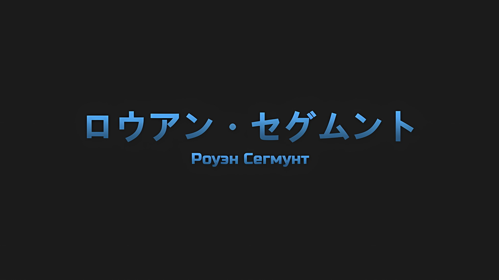
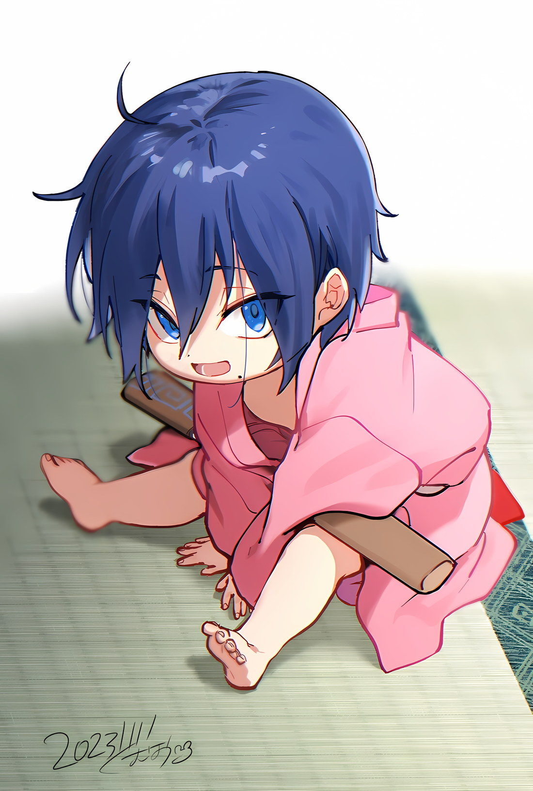
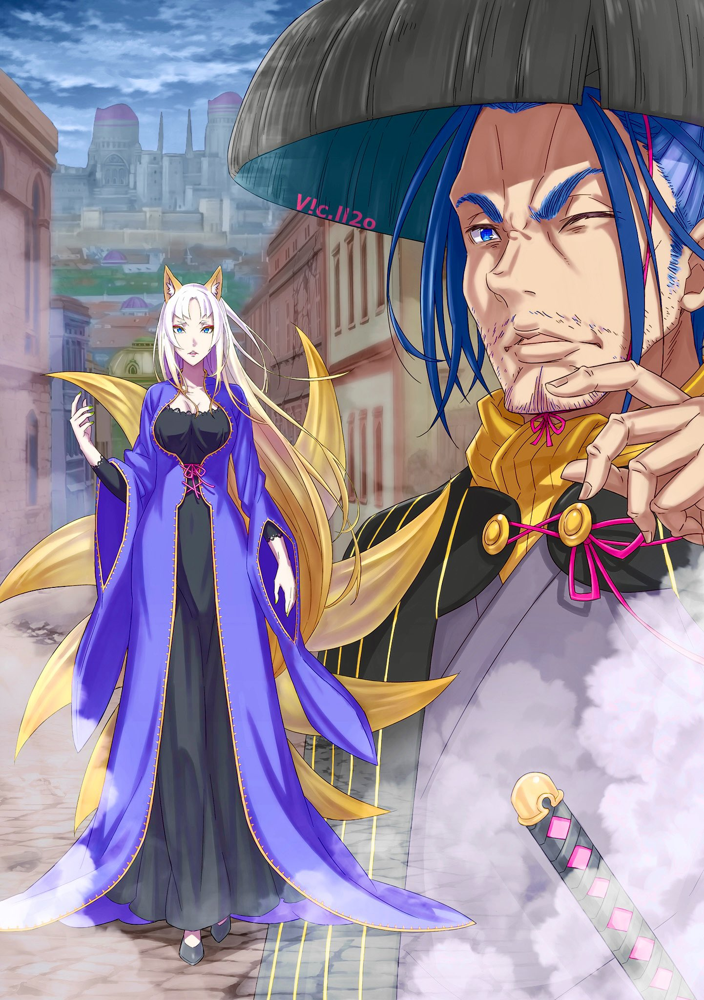

*※※※※※※※※※※※*

…Роуэн Сегмунт был «Звездочетом».

«Звездочет», в некотором смысле отличающийся от официальной должности Империи Волакия, на которую Винсент Волакия впервые назначил Убирка; он был «Звездочетом» в первоначальном смысле этого выражения.

Наделенный заповедью, которая должна быть приоритетнее чего-либо другого в его жизни, существо, готовое отказаться от всего и вся ради исполнения своего великого предназначения; это и есть «Звездочет».

Можно предположить, что поступок Винсента, намеренно присвоившего титул «Звездочета» официальной должности, занимаемой Убирком, преследовал не только цель придать смысл вышеупомянутому посту, но даже имел намерение свести само существование «Звездочетов» к формальности. Впрочем, истинные мотивы Мудрого Императора можно пока не принимать во внимание.

Важен был тот факт, что Роуэн Сегмунт являлся одним из тех людей, которым была дарована заповедь.

Сила принуждения, которая действовала на человека, наделенного заповедью, становившегося таким образом «Звездочетом», была весьма сильна.

Она была наделена властью вмешиваться в человеческую жизнь так, что могла обеспечить простому мужчине-проституту влиятельный голос, позволяющий ему часто бывать во дворце, чтобы высказывать свое мнение Императору, могла заставить хрупкую мать забыть любовь, которую она испытывала к дочери, рожденной ею на пороге смерти, могла легко заставить человека отказаться от цели, которой он посвятил всю свою жизнь.

После получения заповеди у многих «Звездочетов» искажалась жизнь, которую они вели до этого момента, их принуждали, заставляли изменить принципы своего образа жизни. И они не рассматривали это как трагедию.

Напротив, получив великую цель, которую им необходимо было осуществить, пусть даже бы на это ушла вся их жизнь, несомненно веря, что ее исполнение является смыслом их рождения, они испытывали огромное счастье.

Каким бы ненормальным, каким бы жалким это ни казалось окружающим, так оно и было.

Но, что касается этой общей для всех «Звездочетов» трагедии, то положение, в котором оказался Роуэн, было исключением в сравнении с его «Коллегами-Звездочетами».

В конце концов, заповедь, дарованная Роуэну Сегмунту, заключалась в том, чтобы достичь «Небесного Меча».

…И это было не что иное, как великое стремление, которое Роуэн питал еще до того, как ему была дарована заповедь.

*△▼△▼△▼△*

Роуэн: Чтобы овладеть искусством владения мечом, необходимо много месяцев и лет провести со сталью в руках…

Покачивая головой из стороны в сторону, Роуэн пел в хорошем настроении, лицо его раскраснелось от запаха спиртного.

Особой мелодии не было, но раз уж он пребывал в таком приподнятом настроении, то просто не мог не запеть. Радостно раскачиваясь взад-вперед, его движения ног походили на танец.

Некоторое время назад, незадолго до того, как начался шум вокруг «Черноволосого Наследного Принца», ностальгический аромат крови витал в воздухе по всей Империи.

Это было предзнаменованием войны; поскольку правление Винсента было до смешного покорным, Роуэн предчувствовал, что его ответная реакция вызовет в мире чрезвычайно большие волнения.

И это предчувствие оказалось верным. Сейчас Империя переживала момент катастрофы, когда даже граница между живыми и мертвыми была весьма туманна.

Роуэн: Ахх, вот это действительно тот мир, который мне по душе.

Мир был отчужден от покоя, и чем более хаотичным являлось его состояние, тем более утонченным становился путь стали.

Он не имел в виду, что в этом случае следует прилагать больше усилий, просто врагов, которых стоит убивать, должно было стать больше. Но, как правило, удивительно могущественным существам было довольно трудно появиться на свет в мирное время.

Даже если души знали, куда они прибудут, их душевный настрой, казалось, гармонизировал с их сосудами из плоти, пред тем как в них вселиться.

Рожденные в неспокойные времена появлялись на свет, будучи наделенными способностью в них жить.

Поэтому ожидать, что те же самые души будут обитать в людях, родившихся не в бурные времена, — ставка с очень низкими шансами. Роуэн много раз проигрывал эту авантюру и был благословлен Сесилусом только после того, как собственными руками убил восьмерых своих детей.

Увидев обнаженный клинок во время их первого купания после появления на свет, Сесилус был единственным, кто посмеялся над этим как над чем-то, что он будет любить всю свою жизнь.

Роуэн: Подумать только, Сесилус тоже достиг своего потолка, а до «Небесного Меча» все еще далеко. Ахх, ахх, правда, правда… Я действительно родился не в ту эпоху.

Прижав ладонь ко лбу в качестве козырька, Роуэн много раз изрек свои сетования.

Чем более хаотичным становился мир, чем больше он разрушался, тем сильнее эпоха требовала подавляющей мощи сильных. Поскольку путь к «Небесному Меча» стал таким далеким и тяжелым, он задумался о том, как хорошо было бы жить в эпоху четырехсотлетней давности, когда все живое боялось «Ведьмы».

Если бы он родился в ту эпоху, то можно было бы не опасаться, что путь к «Небесному Меча» окажется отрезанным.

И уж тем более, был бы у Роуэна Сесилус…,

???: …Эй, ты намерен делать это всерьез? Ты.

Роуэн: Хмм?

Сзади его окликнул чей-то голос, и Роуэн с любопытством обернулся.

Обе ноги твердо стояли на каменном тротуаре, а сверкающие глаза, смотревшие на него сверху, принадлежали красноволосому мечнику высокого роста… человеку по имени Хейнкель.

Этот человек, казалось бы, еще недавно пил вместе с Роуэном, но сейчас у него было резко контрастирующее с ним абсолютно трезвое выражение лица. Хотя ожидалось, что он будет выглядеть опрятнее по сравнению с тем временем, когда Роуэн впервые нашел его на равнине, он выглядел еще более изможденным, чем раньше, что весьма странно.

Роуэн: Ты все еще не в духе? Давай же тогда, Красноволосый, пропустим по стаканчику. В городе слегка не хватает еды и выпивки, но, к счастью, нежить оставляет их нетронутыми.

Хейнкель: К счастью… Кх.

Роуэн: Оххх, похоже, это задело тебя за живое.

Когда Роуэн высоко поднял свою наполненную алкоголем тыквенную бутыль, Хейнкель скрежетнул зубами, его щеки напряглись.

Поскольку такой ответ означал отказ, Роуэн с неохотой пропустил этот бесцельный алкоголь через свою глотку.

Как он сообщил Хейнкелю, не обращая особого внимания на заметные рестораны и жилые дома, нежить рыскала вокруг в поисках живых, но их целью была не еда или алкоголь, а кровь.

Иными словами, они были вольны утолять свой голод и пьянствовать столько, сколько им заблагорассудится.

Роуэн: Что в этом может не нравиться? Раз все это и так испортится, то рациональнее всего было бы нажраться досыта.

Хейнкель: Еда, алкоголь и все прочее не имеют ни малейшего значения! Я не питаю надежд на то, что у тебя есть чувство долга… чувство долга как тебя, так и твоего пацана. Что важнее, ответь мне, ты намерен делать это всерьез?

Роуэн: …

Стоило Хейнкелю повысить голос, как Роуэн закрыл один глаз и замолчал.

Красноволосый мечник, казалось, разозлился просто потому, что не смог выждать эти несколько секунд; не в силах догадаться, в чем заключалась его проблема, Роуэн так и не понял смысла этого вопроса.

Угадывать чужие мысли и чувства Роуэн умел не очень хорошо.

Этот же недостаток, по-видимому, унаследовал и Сесилус, но он преодолевал эту проблему силой, используя другую точку зрения. Роуэн не мог сделать то же самое.

В любом случае…,

Роуэн: Красноволосый, ты беспокоишься о том, приму ли я участие в плане этого джентльмена в шлеме?

Хейнкель: Да. Поток событий привел меня сюда, но, как сказал Альдебаран, это шанс на искупление. Я не хочу все испортить.

Кивком Хейнкель указал вдаль… Нет, далеко вдаль, — он указал на прочные бастионы, из-за которых нельзя было увидеть изнутри внешнюю часть столицы Империи.

На бастионы в форме звезды, использовавшиеся для защиты горожан от армии повстанцев в решающей битве за столицу Империи, и, таким образом…,

Хейнкель: Это один из пяти бастионов, которые мы должны захватить.

Его голос был суровым и напряженным, Хейнкель говорил о цели их тактики.

Человек в стальном шлеме, известный под именем Ал, говорил о «Пути», который они должны проложить… предвещание ради «Героя», который придет следом за Роуэном и другими, находящимися сейчас в столице Империи.

В настоящее время единственными живыми людьми в этом месте были Роуэн и Хейнкель, и, к счастью, они не встретили ни одного мертвеца. Сесилус, Груви и Ал ушли отдельной группой.

Все они пытались пробить брешь в мощном оплоте, защищавшем столицу Империи.

Метод, которым Роуэн, Хейнкель и Груви проникли в столицу Империи, был весьма необычным, поэтому другим, вероятно, будет сложно его повторить. В таком случае идея о том, что они должны создавать проходы, имела смысл.

Расставшись с сыном, который и после уменьшения был шумным, дуэт средних лет пустился в беспечное путешествие… помешал им в этом пыл, которым был наполнен Хейнкель. Размышляя, что делать, Роуэн почесал щеку.

Игнорируя слова Роуэна, Хейнкель щелкнул языком, и,

Хейнкель: Честно говоря, я так и не понял, что твой сын имел в виду под «предзнаменованием», но…

Роуэн: Ну, не стоит слишком беспокоиться о том, что он говорит. В любом случае, нет никаких сомнений в том факте, что пока эти бастионы используются, события не будут развиваться.

Хейнкель: Если ты это понимаешь…!

Роуэн: …Почему я решил не участвовать?

Когда Хейнкель оскалил зубы и закричал, Роуэн прервал его слова и пожал плечами.

Его обескураженное лицо было очень забавным, и Роуэн хотел бы сказать, что было бы восхитительно пить алкоголь, глядя на него, но чересчур налегать на выпивку было бы ошибкой. Достать спиртное в этом месте было бы проблематично, и не было никакой гарантии, что стоящий перед ним человек опрометчиво не обнажит свой меч.

Роуэн: Не, Красноволосый против меня свой меч не вытащит.

Хейнкель: …Кх.

Роуэн: Ахх, ахх, тебе действительно не нужно испытывать никакого стыда. В конце концов, я отношусь к тому типу людей, которые не считают очень храбрым направлять свой клинок на всех и каждого без исключения… поскольку я ни в малейшей степени не улавливаю разницы между тем, что страшно, а что нет.

Постучав пальцем по своей голове, он коснулся недостатка, который не имел отношения к его опьянению.

Заметив, как Хейнкель расширил глаза, Роуэн посмотрел в сторону бастионов,

Роуэн: Причина, по которой я не соглашаюсь на предложение джентльмена в шлеме, очень проста… Его цель — отвоевать столицу Империи у мертвецов, так? Это не то, чего я действительно желаю.

Следовательно, у него не было причин сотрудничать с планом по устранению обороны столицы Империи.

Таковы были искренние чувства Роуэна, но Хейнкель все еще с недоумением озирался по сторонам. Роуэн считал, что дал относительно ясный ответ, и поэтому в замешательстве наклонил голову.

Хейнкель: То есть, другими словами, ты принимаешь сторону нежити?

Роуэн: Почему ты так решил? Это совершенно разные вещи, не так ли? Как по мне, страна разрушается из-за бушующей в ней нежити. Просто ситуация подобного рода удобна, я не принимаю сторону нежити.

Хейнкель: …Бесполезно, я ни капельки не понимаю, о чем ты думаешь. Начнем с того, что…

Роуэн: Хм?

Хейнкель: Даже если тебе не хочется этого делать, твой сын… «Синяя Молния» стремится к этому. Неужели ты сознательно это проигнорируешь?

Прикрыв свой рот рукой, Хейнкель попытался переварить информацию, которой его насильно напичкали. Однако то, что он сказал, также не имело к Роуэну никакого отношения.

Хотя Сесилус и впрямь горел желанием поддержать план Ала.

Роуэн: Я — это я, а мой сын — это мой сын, вот и все. Кроме того…

Хейнкель: Кроме того?

Роуэн: Для Сесилуса в его нынешнем состоянии вершина «Небесного Меча» вновь стала чем-то далеким. Из-за того, что он уменьшился, его мастерство владения мечом притупилось. В таком состоянии он не сможет выполнить обещание, которое мы дали, когда он убил меня.

Хейнкель: …

Слегка коснувшись своей груди, Роуэн задумался о выгравированном там разрезе.

Груви с отвращением рассказывал о случае «Покушения на Императора». Причастность Роуэна заключалась в попытке склонить к этому Сесилуса, так что его можно было считать подстрекателем к убийству. В любом случае, после того, как эта попытка закончилась неудачей, он в качестве наказания испытал на себе удар меча, и даже сейчас он не забыл обжигающий жар того мгновения.

Размышляя об этом, Роуэн внезапно склонил голову набок.

Роуэн: Однако, Красноволосый, ты, кажется, ужасно зациклился на мне и моем сыне. Если подумать, то твоя реакция была самой бурной. …Что-то не так?

Реакция Хейнкеля на то, что уменьшенный Сесилус оставался Сесилусом, и на то, что Роуэн — отец Сесилуса, независимо от того, большой он или маленький, была тяжелой и тупоголовой.

На вопрос Роуэна об истинном смысле происходящего Хейнкель дал неожиданный ответ.

Этим было…,

Хейнкель: …Я Хейнкель Астрея.

Роуэн: Астрея… Астрея, Астрея, Астрея… Оо, ОООООООООО!

Напустив на себя более чем достаточный вид, Хейнкель назвал свое имя, и Роуэн удивленно на него воззрился.

Поначалу услышанный звук вертелся у него на языке, но убеждение не укладывалось в голове до тех пор, пока он не обдумал его несколько раз. Однако в тот самый момент, когда оно четко закрепилось, у него закипела кровь от осознания его значимости.

Роуэн: Так значит, Красноволосый! Ты, ты принадлежишь к роду «Святого Меча»!

Семья Астрея из Королевства Лугуника; это был титул существ, считающихся сильнейшими в Драконьем Королевстве Лугуника, или, возможно, сильнейшими во всех землях Четырех Великих Стран.

Особого упоминания заслуживал «Святой Меча» нынешнего поколения, Райнхард ван Астрея, о существовании которого он слышал, как об исключительном среди всех поколений семьи Астрея до сих пор.

Роуэн: Не может быть, не может быть, Красноволосый! Не будешь же ты притворяться Хейнкелем, в то время как на самом деле являешься «Святым Меча» этого поколения, не так ли? А это значит, что твой кровный родственник… Нет, твой сын!? Твой сын — Райнхард! Ты отец «Святого Меча»! Вот это неожиданное совпадение! Какой причудливый поворот судьбы!

Он слышал, что Райнхард был того же возраста, что и Сесилус… того же возраста, что и Сесилус изначально.

Если это так, то Роуэн мог примерно догадаться о родстве между Райнхардом и Хейнкелем, поскольку последний по возрасту напоминал его самого. В то же время Хейнкель, покончив со своими горькими переживаниями, изобразил на лице выражение понимания.

Роуэн и Хейнкель — отцы «Синей Молнии» и «Святого Меча»……

Роуэн: Что важнее, это означает, что ты потомок предка, достигшего «Небесного Меча», да?

Хейнкель: …а?

Роуэн: Репутация «Святого Меча» первого поколения, Рейда Астрея, соответствует памяти и слуху! В таком случае, как собрат по мечу, я с уважением отношусь к тем, кто достиг вершины, к которой мы все должны стремиться.

Титул «Святого Меча» был доказательством экстраординарности семьи Астрея, а представители первого поколения считались теми, кто впервые достиг концепции «Небесного Меча», трансцендентного существа, стоящего на вершине всех мечников.

В тот момент, когда он подумал об этом, ему показалось, что его отношение к Хейнкелю до сих пор было грубым; отсюда и желание извиниться. Насколько же он был груб с потомком того, кто достиг «Небесного Меча»?

Роуэн: Прости, Красноволосый. Я прошу прощения за всю свою невежливость до этого момента. Я и представить себе не мог, что член семьи Рейда Астрея, достигший «Небесного Меча», мог так низко пасть.

Хейнкель: …

Роуэн: Красноволосый?

Ответ Хейнкеля так и не последовал, когда Роуэн положил руку на катану, висевшую на его поясе, и глубоко поклонился.

Заподозрив неладное, Роуэн поднял взгляд и увидел, что Хейнкель закрыл лицо ладонью и покачал головой. Затем, когда он испустил долгий, разочарованный вздох,

Хейнкель: …Понял. Я наконец-то понял. Вплоть до самых корней я совершенно на тебя не похож.

Роуэн: Что бы ни случилось, не позволяй этому слишком сильно тебя расстраивать. Я — это я, а мой сын — это мой сын. И ты — это ты, Красноволосый. Как бы то ни было, ты не сможешь нанести глубокий порез, если не будешь упорствовать со сталью.

Хейнкель: …Я должен поблагодарить тебя за то, что не дал мне там умереть. Я благодарен только за это.

Не желая продолжать этот разговор, Хейнкель повернулся к Роуэну спиной.

На мгновение Роуэн поднял голову с желанием нанести глубокий режущий удар в эту прямую спину, но Хейнкель был не из тех, кто достает оружие, если его жизни угрожает опасность, поэтому он решил воздержаться от бесполезного убийства.

Убийство без какой-либо выгоды лишь затупит сталь.

Далее Хейнкель направился к бастиону, на который он указывал, где, вероятно, приложит все свои усилия, чтобы его саботировать.

Если вдруг там окажется способный боец, то неизвестно, учитывал ли Хейнкель в своих расчетах возможность того, что он окажется не в состоянии что-либо сделать, однако если в этом вопросе он намеревался положиться на Роуэна, то тому было очень жаль.

У Роуэна была своя цель, и отношения с Хейнкелем не имели для него ни малейшего приоритета.

И хотя, разлучаясь со своим собутыльником, он чувствовал себя немного одиноко, им предстояло расстаться лишь ненадолго…,

Хейнкель: Чего же ты хочешь добиться, пренебрегая собственным сыном, а?

Прежде чем убежать, Хейнкель окликнул его, все еще стоя к нему спиной, на что Роуэн криво улыбнулся.

Это также относилось и к выражению его лица, но Хейнкель действительно не производил впечатления человека, лишенного мужественности. Как бы то ни было, Роуэн не колебался в ответ на этот вопрос и, поглаживая рану от меча на груди, сказал,

Роуэн: Конечно же, все ради моего самого заветного желания. …Красноволосый, я такой же, как и ты.

Если он имел в виду пренебрежение к своему сыну, то в этом отношении они были одинаковы.

Совершенно не интересуясь тем, как отреагирует на это Хейнкель, Роуэн направился к своей собственной цели и пустился в легкий бег по столице Империи, где не осталось ни одного живого человека.

*△▼△▼△▼△*

…Роуэн Сегмунт был «Звездочетом».

Поклявшись своей честью, Роуэн и до того, как стать «Звездочетом», обладал личностью, желаниями и жизнью, пока всецело не посвятил себя исполнению данной ему заповеди.

Разумеется, как и большинству «Звездочетов», Роуэну была дарована заповедь, и он был вынужден изменить свой образ жизни. Однако окружающие не заметили в Роуэне никаких заметных перемен.

А все потому, что еще до того, как он получил заповедь, самым заветным желанием Роуэна Сегмунта являлось достижение «Небесного Меча», и он был одержим идеей сделать все, что могло бы поспособствовать достижению этой цели.

Сильные личности, стремившиеся овладеть своими техниками точно так же, как и Роуэн, страшные Зверодемоны, нападавшие на деревни, жители деревень, уничтоженных этими Зверодемонами, подлецы, тиранившие других, святые, жертвовавшие другим; он систематически и с безрассудной беспечностью убивал все, что могло пригодиться для закалки его стали, однако это не приносило особых результатов.

Он учился в различных школах, овладевал техниками, а затем отправлялся рубить головы этих школ; он пытался объединить множество впитанных им техник, но когда понял, что это приводит лишь к тому, что равновесие его собственных навыков рушится, отказался и от этого.

В буквальном смысле этого слова он продолжал идти, идти и идти по кровавому пути, однако дорога к «Небесному Меча» оставалась недостижимой; желая этого от всего сердца, он даже подумывал о том, чтобы покончить с собой… это произошло как раз в тот момент.

Именно тогда Роуэн получил заповедь и стал «Звездочетом».

Титул «Небесного Меча» должен быть достигнут во что бы то ни стало, такова была судьба Роуэна; это не означало, что ему самому надо достичь «Небесного Меча», но он должен был идти путем проб и ошибок, чтобы создать существо, способное этого добиться.

Однако он не знал правильной интерпретации. В основе своей методы Роуэна всегда оставались неизменными.

Поначалу он не мог сделать ничего другого, кроме как попытаться действовать систематически. Он сразу же отказался от идеи найти тех, у кого есть талант, и помочь им его реализовать.

Он всегда мог добиться большего мастерства, если все делал сам. Если же они не смогут справиться с поставленной задачей лучше него, то «Небесный Меча» окажется лишь мечтой в мечте, так что для него было лучше отбросить эту эфемерную надежду.

Пока он это делал, его осенило.

В том факте, что он ожидал, что именно он достигнет «Небесного Меча», должен был быть какой-то смысл.

Размышляя об этом, он снова попытался самостоятельно достичь «Небесного Меча», но когда даже после безрассудных попыток и бессмысленных убийств людей путь остался недостижимым, он отказался и от этой затеи.

Но дело было не в этом. Для самого Роуэна этому не суждено было случиться. …Вместо него этого должен был достигнуть род Роуэна.

Таким образом, благодаря усердным стараниям Роуэна Сегмунта родился сосуд для достижения «Небесного Меча», Сесилус Сегмунт, и его долг был выполнен.

Увидев, как его ребенок купается в своей первой ванне и хихикает, глядя на обнаженное лезвие, прижатое к его шее, Роуэн освободился от пут, сковывавших его долгое-долгое время.

Когда «Звездочет» убеждался, что его заповедь была выполнена, он освобождался от возложенной на него роли.

После этого разум одолевала потеря понимания смысла ценностей, которым они спокойно подчинялись до этого момента без всякой причины, искажая даже свои верования и убеждения.

Разумеется, то же самое произошло и с Роуэном.

Чтобы исполнить свою заповедь, он отчаянно стремился создать ребенка с талантом, способным достичь «Небесного Меча»; увидев ребенка, появившегося на свет в конце всего этого, в тот момент, когда он понял, что добился своего, это уже не имело для него никакого значения.

В результате остался только его сын, которого признали за его потенциал достичь «Небесного Меча», и он сам, который потерял из виду свою цель дотянуться до «Небесного Меча» и растратил лучшие годы своей жизни ради других.

Столкнувшись с этой невыносимой правдой, Роуэн на этот раз принял решение о самоубийстве, которое не смог осуществить в прошлом.

Однако…,

Сесилус: Аааа.

Смеясь над обнаженным лезвием, угрожавшим его жизни, сын, которому с рождения было обещано пройти путь к «Небесному Меча», сжал палец своего отчаявшегося отца, и все эти мысли исчезли без следа.

Для Роуэна, оборвавшего столько жизней и искупавшегося в таком количестве крови, что хватило бы на целое озеро, потрясение, которое принесла ему эта жалкая жизнь, было непостижимым.

Он все понял.

В данный момент существо, настолько слабое, что не могло удержать даже палочку для еды, приобретало способности к владению мечом, достойные в конечном итоге достичь «Небесного Меча». В таком случае, где же основания полагать, что после достижения расцвета его дальнейшие перспективы только ухудшатся?

Если младенец мог дотянуться до «Небесного Меча», то для старого мечника все еще оставался путь.

Поэтому Роуэн забыл о своей печали по поводу того, что путь закрыт, и вновь поклялся стремиться к своему желанию.

Роуэн Сегмунт был освобожден от обязанностей «Звездочета», выполнив свою заповедь и подарив миру ребенка, способного достичь «Небесного Меча».

…Но даже сейчас он не отказался от пути к «Небесному Меча» и продолжал двигаться вперед.

*△▼△▼△▼△*

Отделившись от Хейнкеля, Роуэн бдительно направился к северной части столицы Империи.

На его пути находилось здание, которое больше всего выделялось на территории столицы Империи, — Кристальный Дворец, и не было никаких сомнений в том, что в настоящее время он был превращен в базу нежити.

Вероятно, лидер, занимавшийся воскрешением мертвецов, к которому Груви и Ал имели претензии, также находился во дворце, но для Роуэна это не было причиной останавливаться на достигнутом.

Вторгнуться во дворец и обезглавить вражеского главаря быстрее, чем кто-либо другой… Да будет известно, что он направлялся в Кристальный Дворец не для того, чтобы взять ситуацию под свой контроль.

То, что он сказал Хейнкелю, не являлось ложью, для Роуэна не имело ни малейшего значения, спасена Империя или нет. По его мнению, было бы лучше, чтобы хаос и катастрофа были повсеместными.

Была причина, по которой Роуэн был одержим идеей поспешить в Кристальный Дворец.

Причиной, конечно же, являлся его биологический сын, Сесилус Сегмунт. Однако, даже если причиной являлся Сесилус, это не было связано с родительской любовью или привязанностью.

Роуэн: Этот чертов тупица, совершенно возмутительно, что он расстался с «Мечом Грез» и «Мечом Дьявола».

В голове Роуэна, пока он скрежетал зубами, возникли две катаны, таившие в себе огромную силу… Хотя в мире существовало множество магических и священных мечей, только десять из них являлись мечами абсолютной силы.

Двумя из них были любимые катаны Сесилуса, с которыми он расстался после своего уменьшения, — «Меч Грез» Масаюме и «Меч Дьявола» Мурасаме.

Даже если все обернется к худшему, потеря этих двух катан будет очень тревожной.

Само собой разумеется, что для того, чтобы достичь «Небесного Меча», человек должен обладать мастерством владения мечом и талантом. Но чтобы доказать всему миру свое истинное мастерство, он не должен был уступать в использовании достойной стали.

И, несомненно, Масаюме и Мурасаме представляли собой два достойных клинка.

Роуэн: Не знаю, когда он вернется к нормальной жизни, но без своих катан он не сможет полностью принять форму.

Когда уменьшившийся Сесилус вернется к своим первоначальным размерам, ни о каком его пребывании без мечей не может быть и речи.

Было вполне возможно, что в момент такого масштабного бедствия Сесилус достигнет «Небесного Меча». Если бы у Сесилуса при этом не оказалось его катан, это было бы абсолютно возмутительно.

…Пусть Сесилус и достигнет «Небесного Меча», но если в тот момент, когда Роуэн его зарубит, тот не будет владеть своими совершенными катанами, то у него не будет доказательств того, что он сам достиг «Небесного Меча».

Чтобы получить это доказательство, у него не было другого выбора, кроме как вернуть мечи Сесилуса.

Роуэн: Этот мерзавец, какой же он имбецил, раз уменьшился и забыл обещание, данное своему отцу.

В прошлом Роуэн и Сесилус дали обещание как родитель и ребенок.

Когда Роуэн попытался быстро превратить всю Империю во врага, чтобы Сесилус смог добраться до «Небесного Меча», тот отказался, потому что «Это типично для грубого злодея», и встал на сторону Винсента.

Тогда, чтобы заставить Сесилуса закрыть на это глаза, Роуэн дал обещание.

Что в конечном итоге, как только Сесилус достигнет «Небесного Меча», Роуэн обязательно придет, чтобы его убить.

Приняв это, Сесилус сбросил тяжело раненного Роуэна в реку, позволяя ему сбежать. Выжив на грани смерти, Роуэн продолжал совершенствовать свои навыки в ожидании обещанного времени.

И теперь, постоянно приближаясь, этот момент был неминуем.

Роуэн: Если место не изменилось…

Занимая пост «Первого», Сесилус тратил почти все свои деньги на мечи.

Поэтому у него не было особняка, подобающего Генералу Первого Класса, и жил он в небольшой хижине, построенной в поле к северу от Кристального Дворца. Если ничего не поменялось, то велика вероятность, что «Меч Грез» и «Меч Дьявола» хранились в этой маленькой хижине.

Чтобы забрать их и доставить Сесилусу, Роуэн отправился в глубь Кристального Дворца…,

Роуэн: …Кх.

Скрываясь от глаз нежити, Роуэн миновал Кристальный Дворец, а когда попытался пройти к основанию разрушенной стены водохранилища, то сделал большой прыжок в сторону из-за внезапного присутствия.

И это было правильным решением.

…Огромный удар обрушился сверху, и от его неистовой разрушительной силы на главной улице образовалась круглая воронка.

Стены, окружающие Кристальный Дворец и выходящие на улицу, деформировались и рассыпались, а затем, когда шлейф дыма, похожий на взрыв, заполонил его зрение, Роуэн щелкнул языком и обнажил свой клинок.

Применив технику разрезания облаков, он нанес удар, разорвав клубы дыма, после чего смог разглядеть существо, находящееся за их пределами, виновника, который произвел этот удар.

Там стояла одинокая женщина, высокого и стройного телосложения.

С длинными распущенными белыми волосами она была одета в голубое платье и стояла в элегантной позе. Хотя Роуэн был совершенно несведущ в понятиях красоты и уродства, по его представлениям, ее изящное телосложение можно было назвать довольно красивым.

Ее голубые глаза с длинными разрезами были полны печали, что вызвало у Роуэна подозрение.

В отличие от нежити, она не обладала черными глазами с золотыми радужками. В ее белой коже текла кровь, так что женщина, устремившая на него свой пристальный взгляд, скорее всего, являлась живым человеком.

Тем не менее, это был дворец мертвых, столица нежити, и такое поведение положено врагу живых.

Роуэн: Вы, вон там…

Женщина: …Ирис.

Роуэн: …Не думал я, что вы представитесь так внезапно.

Держа катану на поясе, Роуэн смочил губы и прищурил глаза.

Она была женщиной, но это не повод ее недооценивать. Более того, она производила впечатление невероятно могущественной личности. У нее, похоже, не было положительного отношения к обладанию этой силой, но для Роуэна это являлось вопросом тривиальным.

С выражением лица, которое, казалось, было чрезвычайно обеспокоено этим тривиальным вопросом, и с дрожащими лисьими ушами, спрятанными в ее белых волосах, женщина, назвавшая себя Ирис, сказала,

Ирис: Возвращайтесь туда, откуда вы пришли. Никому не нужно умирать в пределах досягаемости моих глаз*.

* Несмотря на то, что теперь она идентифицирует себя как Ирис, следует отметить, что стиль ее речи по-прежнему остается уникальным аринсу-котоба Йорны.

Роуэн: Боже ж ты мой, мне ужасно жаль, что так получилось.

Закрыв один глаз перед женщиной, которая искренне к нему взывала… Перед Ирис, Роуэн поправил рукоять своей катаны.

Каковы бы ни были намерения его противника, если он преграждал ему путь, то ничего не поделаешь. А отступить в сторону, столкнувшись с таким могущественным существом, для мечника было просто невозможно.

Это означало, что…,

Роуэн: …Путь к «Небесному Меча» все еще непомерно высок. Я зарублю тебя, а затем продолжу свой путь.
