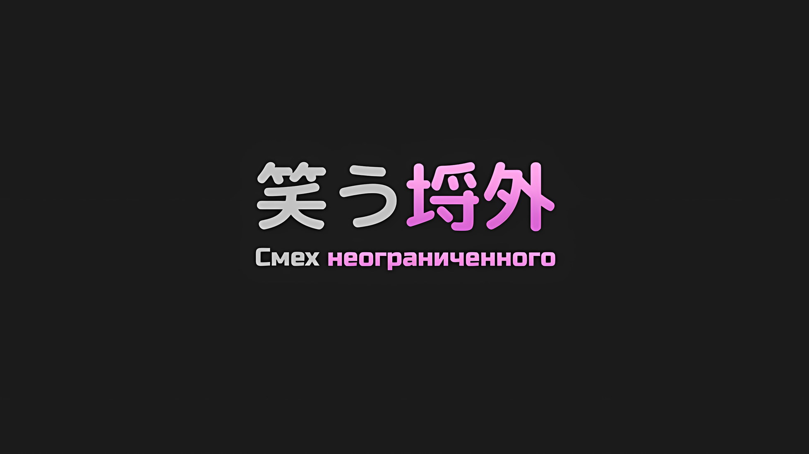
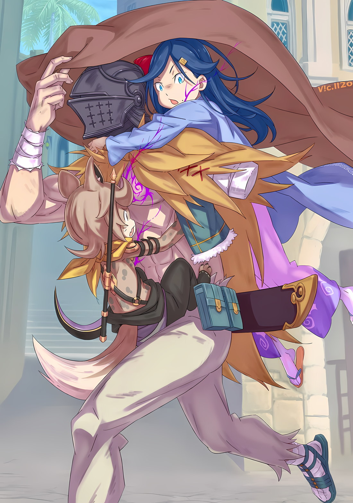

*※※※※※※※※※※※*

…Сесилус Сегмунт был «Звездочетом».

«Звездочет», в некотором смысле отличающийся от официальной должности Империи Волакия, на которую Винсент Волакия впервые назначил Убирка; он был «Звездочетом» в первоначальном смысле этого выражения… Наделенные заповедью, они были существами, готовыми отказаться от всего и вся ради достижения своей великой цели.

Сила принуждения, которая действовала на человека, наделенного заповедью, становившегося таким образом «Звездочетом», была весьма сильна.

Она была наделена властью вмешиваться в человеческую жизнь так, что могла обеспечить простому мужчине-проституту влиятельный голос, позволяющий ему часто бывать во дворце, чтобы высказывать свое мнение Императору, могла заставить хрупкую мать забыть любовь, которую она испытывала к дочери, рожденной ею на пороге смерти, могла легко заставить человека отказаться от цели, которой он посвятил всю свою жизнь, вплоть до мысли о самоубийстве во имя своего назначения.

После получения заповеди у многих «Звездочетов» искажалась жизнь, которую они вели до этого момента, их принуждали, заставляли изменить принципы своего образа жизни. И они не рассматривали это как трагедию.

Каким бы ненормальным, каким бы жалким это ни казалось окружающим, так оно и было.

Среди этих «Звездочетов» Роуэн Сегмунт был единственным исключением.

В конце концов, дарованная ему заповедь совпала с той великой амбицией, к которой он стремился изначально, и потому окружающим не казалось, что его образ жизни изменился; так думал только сам человек, о котором идет речь.

О том, как желание, которым он дорожил, и заповедь, которой он был наделен, пришли к компромиссу, а также о том, как сформировалась его нынешняя вера, уже рассказывалось, так что мы это опустим.

Сейчас речь пойдет о существе, которое родилось в этом мире в результате исполнения заповеди, данной Роуэну Сегмунту, Сесилусе Сегмунте, о том, что он тоже был «Звездочетом», и…,

…Реальность того, что среди «Звездочетов» Сесилус Сегмунт был единственным неограниченным.

*△▼△▼△▼△*

Сесилус, подол хакамы* которого развевался на ветру, приложил руку козырьком ко лбу, вглядываясь в дальние пейзажи.

* Хакама — традиционные японские длинные широкие штаны в складку, похожие на юбку.

Ал предложил стратегию по разрушению пяти звездообразных бастионов, которые окружали столицу Империи.

Чтобы привлечь подкрепление извне, они должны были пробить дыры в прочной обороне нежити. Сесилус радушно приветствовал бы новых актеров, блистающих на сцене, и зрителей, которые стали бы свидетелями его процветающей деятельности.

Если это можно было назвать предзнаменованием последующих захватывающих событий, то не помешало бы прилежно поработать на скромной работе.

Сесилус: Тем не менее! Не забывайте, что это только потому, что я пообещал награду в будущем!

В театре, на войне, да и во всем остальном, существовал так называемый «нужный человек на нужном месте».

Где бы человек ни находился, он всегда был на сцене… объяснять философию Сесилуса можно долго, но разные люди подходят к разным вещам, и если говорить о том, являются ли мелкая работа и постоянное накопление сильными сторонами Сесилуса, то это должно было быть серьезным просчетом в кастинге.

С точки зрения режиссуры, это было бы равносильно тому, чтобы поставить наземного дракона перед повозкой, как если бы ведущий актер, центр сцены, приковывающий взгляды зрителей, работал под покровом темных одежд рабочего сцены.

Сесилус: Разве не все одиэнс* с этим согласны?

* Audience — зрители.

Задрав голову, чтобы посмотреть на небо, Сесилус адресовал свои слова невидимому собеседнику.

Конечно, при обычных обстоятельствах, если бы кто-то совершил подобное действие, небо, затянутое черными тучами, никогда бы не дало ответа. …При обычных обстоятельствах.

Однако Сесилус не был обычным, он являлся ведущим актером этого мира.

…Неслышимые для других, голоса зрителей доносились только до Сесилуса.

Громким шепотом, манерами столь же достойными, сколь и неосмотрительными, и божественным тоном, казалось, не знающим самого понятия этикета, голоса обращались к Сесилусу.

Причем…,

?̢́?̴̨̛?̨̧̕͞: «■■■■.»

?̢́?̴̨̛?̨̧̕͞: «■●■●■●■.»

?̢́?̴̨̛?̨̧̕͞: «…■■.»

?̢́?̴̨̛?̨̧̕͞: «●●●●●!!!»

?̢́?̴̨̛?̨̧̕͞: «■■■■●●■■.»

?̢͢͡?̛̛͞͏?̛͏͢: «●●■■●■■●●.»

?̢͢͡?̛̛͞͏?̛͏͢: «■■!!!»

?̢͢͡?̛̛͞͏?̛͏͢: «●●●■■■.»

?̢͢͡?̛̛͞͏?̛͏͢: «■■■●■●●■■●●.»

?̢͢͡?̛̛͞͏?̛͏͢: «●●■●■●●●■■●…»

?̢͢͡?̛̛͞͏?̛͏͢: «●●…■.»

?̢͢͡?̛̛͞͏?̛͏͢: «●■●■●■●■.»

С чрезмерной силой и в большом количестве они обрушились на Сесилуса.

В диком восторге от того, что к ним обратился ведущий актер Сесилус, зрители охотно давали ему свои ответы… нет, это было неверно. Это были не те ответы, которые готовились с целью ответить на вопрос Сесилуса.

Это были голоса, которые изливались на каждый шаг Сесилуса, каждое отдельное предпринятое им действие.

Они были чем-то, что Сесилус непрерывно слышал с тех самых пор, как начал осознавать свое окружение, чем-то, что заставляло его поступать так или этак…,

Сесилус: Хахаха, похоже, вы и сегодня пребываете в ужасно хорошем настроении! Знаю, знаю. В конце концов, я не могу не очаровывать людей каждым своим действием! В будущем вы не сможете ни на секунду оторвать глаз от моей деятельности, так что следите за развитием событий!

Сесилус, который никогда ничего не слушал из того, что ему говорили, воспринял эти слова как восторженные возгласы своих поклонников.

…Как уже было сказано ранее, Сесилус Сегмунт был «Звездочетом».

У многих «Звездочетов»… нет, даже у Роуэна Сегмунта, который был исключением, искажался образ жизни, чтобы исполнить данную им заповедь.

Такова была степень силы принуждения заповеди, и жизнь «Звездочетов» была ей подчинена.

Так было, за исключением Сесилуса Сегмунта, единственного неограниченного «Звездочета».

Сесилус: Спасибо, спасибо, спасибо вам за все ваши аплодисменты. Как обычно, я вообще не имею ни малейшего представления о том, что вы говорите, и не имею ушей, чтобы вас послушать, но не волнуйтесь! Я предам ваши предсказания! Я оправдаю ваши ожидания! Ведь именно так я и живу в качестве ведущего актера!

???: …Ах, ты отбитый дегенерат. Прекрати поднимать шум; если нас найдут, это будет пиздец как хуево.

Сесилус: Упс.

Взяв на вооружение только энтузиазм публики и, как обычно, проигнорировав все остальное, Сесилус обернулся на зов человека-гиены… Груви, который приближался к нему со спины.

Положив руку на бедро, Груви смотрел на него бдительным взглядом, что не могло не восхищать Сесилуса.

Этот зверочеловек-воин, Груви, ростом не выше его самого, был очень хорош.

Прежде всего, в его внешности были обаяние и красота. Кроме того, он был достаточно силен, чтобы войти в пятерку самых квалифицированных бойцов, которых Сесилус видел с тех самых пор, как покинул остров. Сесилус очень надеялся на то, что у того есть интересный стиль боя, который нельзя будет измерить простым умением владеть мечом.

Сесилус: К сожалению, у тебя есть небольшая проблема с использованием слов. Если ты будешь употреблять так много нецензурных слов подряд, то твое достоинство начнет портиться! А когда оно испортится, ты даже не сможешь сохранить свой статус квалифицированного персонажа. Если ты пойдешь по пути смертельного поединка со мной, я бы, как минимум, хотел, чтобы мой противник имел соответствующий статус!

Груви: Не будь таким ебнутым недоумком, говоря все эти пизданутые нелогичности! Во-первых, кто, сука, собирается биться с тобой насмерть, дегенерата кусок!? У этого мудака, Чиши, хватило, блядь, ума натворить таких бессмысленных дел…

Сесилус: Ну и ну, мимоходом я уже слышал это имя. Твой недружелюбный ответ настораживает, но какое конкретно ко мне отношение имеет человек, имя которого здесь всплыло?

Груви: Он имеет много чего общего с тобой, с твоим уменьшением, а также потерей памяти. …Тот, кто тебя уменьшил, — это Чиша, парень с ебануто большой головой.

Услышав ответ Груви, Сесилус издал горлом звук «Мммм».

Ему часто говорили, что он уменьшился, но, как обычно, Сесилусу это не очень нравилось. Независимо от того, уменьшился он или нет, его «я», присутствующее здесь и сейчас, являлось им целиком и полностью.

Конечно, тот факт, что Роуэн постарел за то небольшое время, что прошло с их последней встречи, и что псевдоним «Синяя Молния», имя, которое, несомненно, потрясет мир в ближайшие годы, уже был известен далеко и широко, не мог не иметь своей убедительной силы.

Сесилус: То, что этот человек, Чиша, сделал меня маленьким, — довольно сомнительная история, не так ли?

Груви: А? Ты, дегенерат, собираешься нести мне какую-то поебень о том, что люди не могут уменьшиться в размерах?

Сесилус: Нет, нет, ты все не так понял. Нет никаких пределов тому, что люди могут вообразить, и то, что они воображают, может непременно сбыться. Подобная фернэс* — одна из причин, почему мне так нравится сцена, которой является этот мир, так что всегда будут загадки вроде того, что люди уменьшаются. То, во что мне трудно поверить, довольно просто. …Кто мог так неожиданно на меня напасть?

* Fairness — справедливость.

Груви: …

В ответ на вопрос Сесилуса, Груви сделал серьезное лицо, сцепив руки за головой.

Даже в его морщинистом выражении было какое-то очарование, заставляющее думать, что на каждой сцене нужен такой живой персонаж, как Груви. Тем не менее, вопрос Сесилуса произвел впечатление даже на него.

Сам Сесилус не считал себя непобедимым или бессмертным.

Если бы ему вырвали сердце, перерезали тонкую шею или выкачали почти половину крови, он бы умер, как и любой другой человек.

Но кто, если уж на то пошло, способен на такой поступок?

В связи с этим Груви осознал противоречие в собственных мыслях. Кем бы ни был противник, никто не мог уменьшить Сесилуса…

Груви: …Этот выблядок, Чиша, тебе мозги выкрутил, или ты, дегенерат, просто, блядь, был неосторожен?

Сесилус: А!? Ты говоришь это, глядя на меня!?

Груви: Да. Я говорю это, мать твою.

Сесилус: Это действительно так естественно? Ахаха, это удар ниже пояса, но ты меня поймал!

Смеясь и хлопая в ладоши в ответ на слова Груви, Сесилус покачал головой, как бы говоря: «Подожди-ка».

Такая оценка вызывала желание прикрыть лицо от смущения. Однако Сесилус понимал свои возможности, и даже такой сильный человек, как Груви, не мог полностью развеять подобные сомнения.

Сесилус: В конце концов, такой большой человек, как я, не является чем-то особенным! Я никогда не стану тем, кто получает такие оценки, учитывая мое нынешнее плачевное состояние! Пожалуйста, ждите, а затем взгляните на меня через лет десять!

Груви: Да кто будет ждать твоего роста целых десять лет! Заканчивай нести всякую хуйню и возвращайся к своим первоначальным размерам!

Сесилус: Но даже если ты прямо сейчас скажешь мне вернуться к моим первоначальным размерам, я не очень-то и хочу этого делать… А ты, Груви-сан, знаешь, как мне вернуть свои прежние размеры?

Груви: Я нет, но выблядок Чиша, который все это устроил, наверняка знает. Трюки шиноби имеют какие-то дерьмовые ограничения по времени или по условиям. У Чиши, скорее всего, тоже есть какие-то условия.

Сесилус: Хо-хо, так этот Чиша — шиноби? Он знакомый, друг или кровный родственник того энергичного старика?

Груви: Не в курсах, да и Чиша не шиноби. Просто его метод напоминает шиноби… Ах, это пиздец как бесит.

Груви энергично почесал голову, жалуясь, словно всезнайка.

Сесилус догадывался, что Груви разбирается в разных вещах, но важнее истинной личности этого Чиши было, пожалуй, выполнение поставленных им условий.

Если бы он спросил об этом, то Груви, вероятно, рассердился бы и сказал: «Я откуда знаю!».

Сесилус: Так каковы, по-твоему, условия для моего возвращения?

Груви: Да я даже не представляю, мать твою!

Сесилус: Видите?

Ровно как он и предполагал, Сесилус захихикал, в то время как Груви недовольно издал «А?».

Как раз в тот момент, когда они разговаривали…,

???: Извините, что прерываю вашу увлекательную беседу, друзья, но не могли бы мы пока прекратить это веселье?

Сесилус: Оо, это Ал-сан.

Обладателем этого усталого, раздраженного голоса оказался Ал, который пришел на крышу, где стояли Сесилус и Груви.

Он появился с лестницы на верхнем этаже и постучал ногой по ступенькам.

Ал: Я серьезно, пожалуйста. Тяжко, когда ты случайно запрыгиваешь на крышу, вынуждая меня пользоваться лестницей. Груви, ты тоже.

Груви: Блядь, мои извинения. Я увлекся болтовней этого тупоголового дегенерата.

Груви, нахмурившись, искренне извинился перед Алом, которого оставили ждать внизу.

Сесилус поднялся на крышу здания, чтобы осмотреться, поскольку Груви выразил беспокойство по поводу чего-то на другой стороне улицы, однако немного отвлекся.

В любом случае…,

Сесилус: Ну-ну, Ал-сан, не сердись ты так. Груви-сан, похоже, отражает свое настроение через опущенные уши, так что ты, должно быть, уже чувствуешь себя снисходительно, да?

Ал: Меня уже больше не удивляет твоя безжалостная позиция «делай, как я хочу». Но, что более важно, заметил ли ты что-нибудь во время наблюдения?

Сесилус: Точно. …Как и ожидалось, оборона под номерами три, четыре и пять выглядит сильной. Похоже, это естественная стратегия, учитывая направление, в котором, по всей видимости, отступила группа Босса.

Ал: Эти три точки…

Однорукий Ал коснулся правой ладонью фурнитуры своего шлема, и Сесилус задумался над его ответом.

Названные Сесилусом цифры являлись обозначением бастионов городских стен в форме звезды, которые окружали столицу Империи.

В самом северном из них находился дворец, а входы в эту столицу… Самый южный бастион был первым, юго-восточный — вторым, юго-западный — третьим, северо-восточный — четвертым, а северо-западный — пятым; так нумеровались бастионы.

С северной и западной стороны оборона трех соответствующих точек была достаточно сильной, чтобы ее можно было назвать непробиваемой. С другой стороны, два других места могли бы стать их шансом, однако…,

Груви: Намеренное оставление таких легко идентифицируемых дыр попахивает чем-то подозрительным.

Сесилус: Может ли нос Груви-сана уловить запах таких зловещих замыслов?

Груви: Не может, блядь, быть, чтобы все было построено так странно! Это всего лишь мое мнение как «Генерала»! И не пытайся использовать свое уменьшение в качестве оправдания… ах, неважно, в этом нет смысла.

Ал: Что такое? Тебя не напрягает, когда кто-то замолкает на середине своей фразы?

Груви: Этот долбоеба кусок и до того, как уменьшился, не справлялся со своими обязанностями «Генерала».

После слов Груви, скорчившего горькую гримасу, Сесилус и Ал издали «Ахх» в знак понимания.

У Сесилуса сложилось впечатление, что над ним не смеются, а просто констатируют факт. Если предположить, что Сесилус действительно уменьшился из-за неосторожности, то невозможно представить себе, чтобы до своего уменьшения он мог кем-то руководить или с кем-то сближаться.

Поэтому у него не было особых возражений против слов Груви.

Сесилус: Но, если говорить откровенно, я с тобой согласен. Однако, если это так, то ты понимаешь, что это значит, верно? На удивление, или, скорее, вопреки ожиданиям, Ал-сан — отличный тактик.

Ал: …Что ты имеешь в виду?

Сесилус: В конце концов, номер один и номер два выглядят так, будто их легко завоевать, но на самом деле это ловушка… Именно туда ты отправил моего папу и его друга, так что ты тактик.

Ал: ……

Когда они заговорили о двух людях, которые не присутствовали и работали отдельно, Роуэне и Хейнкеле, Сесилус улыбнулся Алу, предложившему разделить группу.

На глазах у улыбающегося Сесилуса Ал затаил дыхание и замолчал.

В данный момент группа из пяти человек была разделена на команды по три и два человека соответственно, и каждая из них выполняла задание по захвату пяти бастионов.

Тем, кто поручил Роуэну и Хейнкелю атаковать юг и юго-восток, первый и второй бастионы, оказался Ал, и его намерения были ясны.

Сесилус: Если есть связь или военное имущество, потерять которое не так больно, они будут использованы в качестве жертвенных пешек, чтобы привлечь внимание противника. Ал-сан пусть и скромный, но все равно тактик!

Ал: …Ты не против того, как я использовал твоего старика?

Сесилус: Нет? Как актер, я это приветствую, нежели быть в центре внимания, когда пять человек собрались в кучу, и с точки зрения тактики, это очень практичный способ мышления. Конечно, не мне это говорить, но ожидать от папы сотрудничества совершенно бесполезно!

Ал: Да, это проблема.

Когда дело доходило до сотрудничества, можно было только предположить, что дуэт Сегмунтов родился с изъяном.

В любом случае, Ал ломал голову над тем, как наилучшим образом использовать свой ограниченный боевой потенциал. Если бы у человека работала голова или тактическая интуиция, он мог бы представить, какая роль от него потребуется.

Груви: Мы ни за что, блядь, не сможем захватить их одного за другим без спешки группой из пяти человек. Если те старперы не в состоянии этого понять, то у нас нет другого выбора, кроме как заставить их выполнять свою злоебучую работу в качестве жертвенных пешек.

Ал: Верно. Мы не можем устроить большой переполох в одном месте и собрать там все наши ресурсы.

Сесилус: Отсюда и распределенная атака… однако это было немного неожиданно. Ал-сан разговаривал с Хейнкелем-сан так, будто у них были товарищеские отношения.

Ал: Я не Герой. Мои приоритеты в полном порядке.

Сказанное в несколько насмешливой манере, это, казалось, относилось не к полезности Хейнкеля, а скорее к тому, как он себя использовал; так показалось Сесилусу.

Этот ответ не изменил его впечатления об Але, однако…,

Сесилус: …Понятно. Ты определенно отличаешься от Босса.

Ал: …

По какой-то причине Ал повернулся лицом к Сесилусу, который высказал вслух то, о чем он думал.

Выражение лица Ала было скрыто под железным шлемом, но иногда острота и жар взгляда красноречивее слов и выражений говорили о том, что человек чувствует внутри.

Сесилус: Ну, то, что иногда это правда, не означает, что это правда и сейчас.

Ал: …Я не понимаю, о чем ты говоришь, но ладно. Ты прав, что я не такой, как брат.

Сесилус: Хм? Естественно, что все может быть по-разному, так что это не имеет особого значения, да? Хотя, я думаю, Ал-сан жестче Босса.

Уловив, что Ал по какой-то причине считает себя хуже, Сесилус наклонил голову.

Сильные и слабые, красивые и грязные, нравящиеся и не нравящиеся — все это было похоже на смену фаз одной и той же луны. Даже если в колебаниях от радости и горя и была какая-то польза, они не имели веса, чтобы склонить чашу весов жизни.

Даже добро и зло не были абсолютными.

Сесилус: Босс — тот, кто борется со смертью в грубой манере, но все же выбирает метод, который позволяет ему красиво блистать на сцене. Ал-сан, напротив, совсем другой. Помимо грубой борьбы со смертью, ты выбираешь грязный метод, из-за которого все хотят отвести от тебя взгляд. Я не говорю, что один превосходит другого. Это просто разница между тобой и Боссом.

Ал: …

Сесилус: О, отбросив разговоры о превосходстве или неполноценности, вопрос о том, кем бы ты хотел быть, — это совсем другая история. Каким ты хочешь быть в глазах других, каждый решает сам… Испражнения могут быть грязными, но даже испражнения я хочу превратить в нечто красивое и привлекательное!

Ал: Чувак, я же сейчас пытался все переосмыслить…!

Сесилус: Прости, любимое слово Груви-сана все еще застревает у меня в ушах*.

* Обычно **クソ** Груви переводится как «блядь», но буквальное определение этого слова — «фекалии», или, говоря более вульгарным языком, «дерьмо». Сесилус ссылается на буквальное определение этого слова.

Но, несмотря на то, что направление, в котором развивался разговор, могло быть обусловлено влиянием Груви, само это утверждение не являлось ложью.

Теория Сесилуса заключалась в том, что главный актер должен давать людям повод не сводить с него глаз, даже если он совершает поступки, которые кажутся грязными, неприглядными и заставляют людей отводить взгляд.

Груви: Так и что? Ты, блядь, закончил тратить наше время на свою бессмысленную дичь? Консультации по жизни — это полное дерьмо. После того, как все это закончится, я просто, блядь, проведу вскрытие ваших могил.

Ал: …Когда он так часто такое говорит, неудивительно, что это застревает у тебя в ушах.

Сесилус: Да?

Когда плечи Ала опустились от непрекращающейся ругани Груви, Сесилус рассмеялся.

Хотя Сесилус привел множество неуместных аргументов, он не возражал против плана Ала и был не против, если Роуэн и Хейнкель столкнутся с трудностями, как и планировалось.

Была лишь одна вещь, которая, по мнению Сесилуса, могла стать проблемой в плане Ала.

Сесилус: Интересно, последует ли мой запредельно эгоистичный папа тому, что сказал Ал-сан?

Необычно то, что Сесилус не выболтал то, о чем подумал, потому что, что также необычно, Сесилус полностью отрешился от характера своего отца, Роуэна.

Роуэн не стал бы делать того, чего не желал, и абсолютно точно сделал бы все, что хотел.

Эту склонность унаследовал и Сесилус, однако Роуэн и Сесилус были не похожи друг на друга. То же самое он сказал Алу всего минуту назад, а еще раньше — своему боссу, Шварцу.

Это не было вопросом добра или зла. Речь шла о том, как человек живет и как умирает.

Груви: Так с какой, блядь, стороны ты собираешься атаковать, шлемоголовый?

Ал: …Я хочу избежать номера три, так как именно в этом районе был снайпер. Так что это будет номер четыре или номер пять на северной стороне… Если даже самая незначительная вероятность является условием, то это будет северо-восточный номер четыре.

Сесилус: Ээх! А я так хотел ривендж*!

* Revenge — месть/отомстить.

Груви: Не говори такой хуйни, когда у нас нет никакой свободы действий! С кем, по-твоему, ты имеешь дело…

Сесилус: Тц, я понимаю.

Он огрызнулся, и Сесилус, надув губы, отказался от своего комментария. Груви, поднявший кулак в воздух, расширил глаза от реакции Сесилуса.

Увидев это, Сесилус спросил: «В чем дело?», и когда Груви опустил поднятую руку,

Груви: Ты слишком легко слушаешь. Выблядок, ты стал еще более ебанутым, чем был до уменьшения.

Сесилус: Хо-хо, кажется, мне делают комплимент?

Груви: Завались! У нас пиздец как мало времени. Давайте поторопимся и уйдем.

Дернув подбородком, Груви повернул голову в сторону четвертого бастиона. Сесилус уже собирался сказать «Да, да», как вдруг Ал, предложивший эту идею, спросил: «Ну что, нормально?»,

Ал: Я ответил, поскольку меня спросили, но по сравнению со мной вы, ребята… нет, скорее, ты более осведомлен о столице Империи.

Груви: Даже я не согласился бы на план, который выглядит как пиздец. К твоему плану у меня претензий нет… Я также не хочу ввязываться в драку с этим ублюдком Балроем.

Ал: …Твой бывший коллега?

Груви: Отчасти так и есть, но причина в том, что он дохуя силен. Если уж кому и драться с этим ублюдком, так это Могуро. Он ни за что не проиграет.

Груви утверждал, что способности снайпера очень сильны.

Сесилус тоже не раз сталкивался с этим противником в столице Империи, но ему еще не доводилось увидеть его как следует. Не было никаких сомнений в том, что он силен. Возможно, он действительно зря кивнул головой. Даже если он начнет жаловаться на это сейчас, одобрят ли они изменение плана? А что, если не одобрят?

Сесилус: Давайте сделаем это быстро. Цель же не в том, чтобы сохранить открытые нами дыры, так что нет смысла откладывать это на потом.

Груви: Будь осторожен. Этот отбитый дегенерат собирается провернуть все по-быстрому, а затем отправиться на поиски Балроя.

Ал: …Как только настоящая звезда сделает свой выход, во что бы то ни стало, так и поступи.

Сесилус: Как высокомерно с твоей стороны называть звездой кого-либо, кроме меня!

Ал медленно покачал головой и проворчал что-то в знак смирения, на что Сесилус воскликнул с досадой.

*△▼△▼△▼△*

Путешествие к четвертому бастиону прошло без происшествий.

Не то чтобы они не видели нежити, ищущей выживших по пути. Однако они были не более чем статистами, которые проходили мимо, а если и преграждали путь, то их просто устраняли.

Был ли хоть один актер, который, чтобы оживить сцену, старался бы уделить внимание второстепенной роли?

Сесилус: К сожалению, интерес публики ограничен. Я не говорю, что не бывает второстепенных ролей, дающих отличные спектакли, которые повышают общее квалити* сцены, но пользуются ли они активным спросом или нет — это уже другой вопрос… Тем не менее.

* Quality — качество.

Хотя Сесилус наслаждался мирным путешествием, он нахмурил брови.

Безусловно, Сесилус был сторонником устранения лишних хлопот, и он считал нежелательным, чтобы выступление требовало времени и сил на общение с рядовыми солдатами.

И все же то, как Сесилус и его группа выглядели сейчас, было весьма неуклюже, не правда ли?

В конце концов, Сесилус лежал на спине Ала, а Груви прижимался к его животу… другими словами, Сесилус и Груви представляли собой бутерброд с Алом.

Если кто-то задался вопросом, почему они оказались в такой ситуации, то это потому, что в противном случае Сесилус и Груви торчали бы из-под плаща, который Ал накинул на голову.

Сесилус: Но это как-то нестильно! Так я себя не рекламирую, Груви-сан!

Груви: Блядь, да засуньте уже кто-нибудь носок в его глотку! Мы можем скрыть свое присутствие, но наши звуки и запахи — нет! Если близлежащие выблядки заметят нас и окружат, мы окажемся по уши в дерьме!

Ал: Вы оба слишком шумные…! И не дергайтесь, а то я упаду…!

Жалуясь и тряся Ала за плечи, они оба, закутанные в один плащ, получили выговор.

Меховой плащ, который подготовил Груви, был весьма впечатляющей работой. Судя по всему, это был исключительный предмет, с помощью которого можно предотвратить привлечение внимания окружающих. Роуэн, Хейнкель и Груви использовали этот меховой плащ, чтобы проскользнуть мимо вражеских радаров и войти в столицу Империи.

Хотя они выбрали неприметный путь, меховой плащ, вероятно, сыграл самую большую роль в том факте, что их ни разу не обнаружила нежить.

Сесилус: Несмотря на знойную жару при нашем разном телосложении, я не могу представить себе, как вам с моим папой удалось пробраться в столицу Империи. Но все же, где ты купил такой странный плащ?

Груви: Я его не покупал. Я его сделал. Ты слишком, блядь, туп, чтобы это запомнить, но я также переплавил твой «Меч Дьявола» и перековал его в катану.

Сесилус: Хо-хо, «Меч Дьявола»! Какое крутое название! Я бы хотел его увидеть, узнать о нем и боготворить его!

Груви: Как я тебе уже, блядь, и сказал, эта ебучая катана — твоя, дегенерата ты кусок!

Груви совершил подвиг, закричав приглушенным голосом.

Оставляя в стороне споры о уменьшении и неуменьшении, было довольно интересно слушать, как Груви описывает биографию Сесилуса, о которой сам он не знал. В частности, ему понравилась тема катан.

Сесилус: Однако интересно, что ты перековал его в катану. Быть может, ты Мастер Меча, Груви-сан? Ты, наверное, очень загружен, будучи и «Генералом», и кузнецом.

Груви: Не то чтобы я специализировался на мечах. Я делаю мечи, плету одежду, а также занимаюсь магическими инструментами.

Сесилус: Значит, этот таинственный плащ — тоже какой-то магический инструмент.

Груви: Не, эт просто шкура оборотня.

Сесилус издал восхищенное «Хо» в ответ на слова Груви, а плечи Ала затряслись от удивления. Тогда Сесилус внимательно осмотрел меховой плащ,

Сесилус: Оборотни довольно редки. Я знаю, что они существуют, но мне еще не доводилось встретить хотя бы одного.

Груви: Это потому, что в первую очередь их охуеть как сложно найти. Вся их раса находится под Божественной Защитой, точно так же, как наземные драконы или народ Уруха в Священном Королевстве. Если содрать с них кожу живьем, то Божественная Защита останется на их шкуре. Это очень эффективное использование этих трусливых кусков дерьма.

Ал: «Божественная Защита Облачного Покрова»…?

Груви: А? Так значит, ты знаешь об этом дерьмовом и старомодном названии. «Божественная Защита Засады» более распространена… хотя тема злоебучих оборотней и так не слишком популярна.

Услышав невнятный комментарий Ала, Груви продемонстрировал свои знания.

Как бы то ни было, в Империи ненавидели оборотней, и это вытекало из старой-престарой истории. Но, поскольку эта история была основана на историческом факте, она также была глубоко связана с реальностью.

Сам Сесилус не испытывал особой враждебности к оборотням или людям-волкам, однако…,

Сесилус: Не правда ли, ужасно иронично, что шкура оборотня помогает нам, учитывая то, как в Империи к ним относятся. Пусть даже это всего лишь их шкура.

Груви & Ал: …

Сесилус: Хах? Игнорируете меня? Вы меня игнорируете? Я думал, что сказал что-то довольно умное…

Именно тогда, когда Сесилус решил, что Ал и Груви пренебрежительно отреагировали на его комментарий по поводу мехового плаща… Сесилус предположил, что это не так.

?̢͢͡?̛̛͞͏?̛͏͢: «…■■■■■■.»

И дело было не в том, что Наблюдатель вел себя оживленно, как это обычно бывает.

Все тело Ала напряглось, пока Сесилус прижимался к нему, и последний почувствовал, как причина этого напряжения проникает и в него самого.

Оставляя в стороне вопрос о уменьшении, в тонкой груди Сесилуса что-то кольнуло.

…Серые шипы вились вокруг груди Сесилуса.

Сесилус: У вас обоих, случаем, не так же?

Ал: …Да. Эй, Груви-сан. Я думал, с этим плащом нас не смогут обнаружить…

Груви: БЛЯДЬ… кх! Вы, сука, издеваетесь надо мной…!

Ал и Груви, похоже, находились в той же ситуации, что и Сесилус, причем недовольство Груви, а точнее говоря, его гнев, были особенно сильны.

Быть может, дело в том, что кто-то заметил эффект мехового плаща, в котором он был так уверен? …Нет, это было не совсем верно.

Если бы другая сторона обнаружила Сесилуса и остальных, они бы не оставили их троих в состоянии бутерброда так надолго. Конечно, можно также сказать, что эти шипы были предупреждением.

Ал: На это не похоже. А ты что думаешь?

Груви: …Это неизбирательная атака дальнего боя. Что за мудак это делает? Кто, блядь, накладывает такие тупорылые проклятия…!?

Горло Груви затряслось от ярости, и он проклял иррациональность пока еще не явившегося хозяина шипов.

Мгновение спустя шипы вокруг груди каждого из троицы начали медленно извиваться, а острые иглы, проскальзывая прямо сквозь их руки, вознамерились в полной мере реализовать эффект своего проклятия.

А затем…,

Сесилус: …Как и ожидалось, похоже, мир не одобряет моего скрытного поведения. А теперь о вновь возникших трудностях! Давайте же преодолеем их с восторгом и «та-дам»!

Так разразился возбужденный смех неограниченного, как раз перед тем, как острая боль пронзила его сердце.
