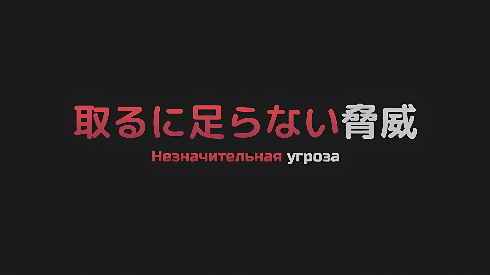
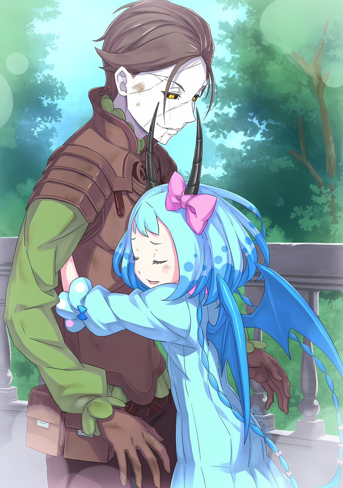

*※※※※※※※※※※※*

…Хейнкель Астрея не был даже «Звездочетом».

Как известно, он не был ни «Святым Меча», ни получил имя меча «Ван», которое присваивалось тем, кто добился выдающихся успехов в фехтовании; его должность Заместителя Командующего Королевской Гвардией Королевства Лугуника тоже была лишь украшением.

В общем, он являлся человеком, который не был избран ни для одной вещи, которую можно было получить, только будучи избранным; это была личность, известная как Хейнкель, и она не изменилась даже после прибытия в Империю Волакия.

Когда его унесло течением, он участвовал в битве, и сердце его разорвалось от немыслимых для этого мира зрелищ; он едва избежал смерти, когда ему удалось спастись, а когда его снова унесло, он вернулся на то же самое место, цепляясь за слабую надежду.

Эта надежда тоже была всего лишь указателем к бегству, представленным кем-то, кто рассчитывал, что Хейнкель сыграет роль жертвенной пешки, и, отбросив все свои мысли, он был слишком глуп, чтобы осознать, что именно так и было задумано.

…Поэтому, в отличие от Роуэна Сегмунта, который по своим безумным причинам воспротивился плану нападения, он, пытаясь честно сыграть свою роль, сам попал под удар наихудшей из возможных палок.

Хейнкель: Твою ж…

Из пяти бастионов крепостных стен, служивших краеугольным камнем обороны столицы Империи, южная и юго-восточная точки, которые должны были быть разделены между ним и Роуэном, теперь находились в ведении одного лишь Хейнкеля; он решил, что ему следует захватить первый бастион, который изначально служил городскими воротами, обеспечивавшими въезд и выезд из столицы, и потому направился на юг.

Проще говоря, это было разумное решение и правильный выбор, который не имел ничего общего с эксцентричностью.

Таким образом, Хейнкель, наконец, столкнулся с результатом своего разумного и правильного выбора.

*???: «…Я — Мезорея. В соответствии с голосом моего драгоценного ребенка, я стану ветром с небес.»*

Величественная фигура белого Дракона расправила крылья, как бы защищая первый бастион, а затем…

*△▼△▼△▼△*

Комната была завалена грудами драгоценностей.

Искусные изделия из золота и серебра, украшения для волос и одежды, усыпанные драгоценными камнями, различные изящные предметы — все это было разложено по порядку, разбросано повсюду и валялось в комнате с притягивающим взгляд великолепием.

Прямо посреди ослепительной комнаты проснулась Мэделин Эшарт.

Мэделин: …

Она несколько раз моргнула своими золотыми глазами, в которых туманно отразилась реальность, два черных рога, растущих из ее небесно-голубых волос, качнулись из стороны в сторону, и ее миниатюрное тело поднялось на ноги. В одно мгновение она столкнулась с окружающими драгоценностями, а затем упала на них, однако Мэделин не обратила внимания на то, что они были беспорядочно разбросаны по полу.

Ювелирные изделия и сокровища из золота и серебра — ей очень нравились такие ослепительные вещи.

Ей не нравилось, что люди, несмотря на свою слабость и хрупкость, были такими шумными, но их мастерство в использовании драгоценных камней и золота обладало незаменимым очарованием.

Неплохой идеей было бы выполнять задания, возложенные на нее людьми, чтобы в награду получать такие вещи.

То, что Мэделин складывала их в своем логове и окружала себя ими, играло очень важную роль в качестве ее сна. …Однако ни драгоценные камни, ни золото не могли заполнить пустоту в ее сердце.

Мэделин: …

Повернув высоко поднятую голову, Мэделин толкнула дверь логова.

Это было не то логово, в котором Мэделин жила некоторое время после того, как стала одной из «Девяти Божественных Генералов», а новое, наспех сделанное для этого случая.

Не хватало ее собственного запаха, а сокровища были собраны во дворце, так что, хотя она и не чувствовала себя удовлетворенной, это было лучше, чем ничего.

Прежде всего, было достаточно причин, чтобы покинуть логово, в котором она привыкла жить, и переселиться сюда.

Вот только…,

Мэделин: …Карильон.

Выйдя из норы и пройдя через проход, она вышла на балкон, где дул прохладный ветерок, и увидела фигуру летающего дракона, раскинувшего крылья.

*Карильон: «……»*

Когда его окликнули, летающий дракон повернул голову в ее сторону… по чешуе на всем его теле пробегали болезненного вида трещины, а в сумрачных глазах вырисовывались золотые радужки; явный признак того, в каком состоянии находится этот потерявший жизнь сосуд.

Подобно тому, как люди воскресали один за другим, из потустороннего мира возвращалось немалое количество летающих драконов.

Только она не могла общаться с теми, кто при жизни был диким, зато могла установить взаимопонимание с такими, как летающий дракон перед ней… с такими, как Карильон, которого удалось приручить.

Откликнувшись на зов Мэделин, Карильон спокойно опустил голову.

Если другие умершие летающие драконы… летающие драконы-нежить, столкнутся с Мэделин, они воспримут ее как живую и начнут безжалостно атаковать.

Разумеется, она не щадила тех, кто не знал своего места, и без колебаний разбивала их на мелкие кусочки.

Мэделин: Я, дракон, ужасно сожалею, что разбила тебя на куски.

Поглаживая опущенную голову Карильона, уголки рта Мэделин напряглись, когда она почувствовала, насколько холодна его шея.

По своей природе летающие драконы не имели лишнего жира, чтобы парить в воздухе, поэтому температура их тела была низкой. Как бы то ни было, температура, передававшаяся кончикам ее пальцев, была примерно такой же холодной, как и от прикосновения к декоративным драгоценностям.

Однако, в отличие от драгоценностей, она не ощущала ни великолепия, ни красоты.

Но, несмотря на это, то, что Карильон присутствовал перед ней и передвигался подобным образом, было для нее незаменимой ценностью.

…Для Мэделин Карильон являлся тем летающим драконом, которого приручил первый попавшийся ей на глаза человек.

Будучи последним драконидом, Мэделин жила, не вступая в контакт ни с чем за пределами Облачного Моря, в котором она родилась, отчасти из-за природы Мезореи, ставшего Драконьей оболочкой.

Кроме Мезореи, единственными существами, с которыми Мэделин могла контактировать, были дикие летающие драконы, обитавшие в окрестностях Облачного Моря, но даже они были не более чем созданиями, подчиняющимися дракониду.

Между формами жизни существовало различие; между ней, драконидом, и летающими драконами.

Это было нечто, уходящее корнями в инстинкт, нечто, не оставляющее места для размышлений о причине или цели. Не оставалось места для пессимизма или сомнений относительно разделения, которое было естественным в их существовании.

Тот, кто никогда не был свидетелем красоты золота, ни за что бы не пожелал иметь золотую корону.

Однако счастливые дни Мэделин, когда она ничего не знала о том, что находится за Облачным Морем, внезапно подошли к своему концу.

Причиной тому был не кто иной, как этот Карильон и, успокаивая своего любимого дракона, не желавшего взлетать из-за присутствия «Облачного Дракона», Мезореи, отставший, который нырнул прямо в середину Облачного Моря…

Мэделин: …Где возлюбленный дракона, Балрой?

Щекоча его шею, Мэделин вопросительно посмотрела на Карильона.

Произнесенное имя было очень знакомо Мэделин, и, когда этот звук коснулся ее языка, он просочился и в ее грудь, словно запоздалый яд.

Именно из-за этой боли, сродни яду, разъедающему душу, Мэделин и сбежала из Облачного Моря, а затем спустилась на поверхность, где жили люди.

Но прямо сейчас боль от этого яда была на грани того, чтобы стать чем-то отличным от того, чем она была до сих пор.

*Карильон: «……»*

Мэделин чувствовала боль от яда в своем сердце. Находясь рядом с ней, Карильон медленно поднял свою голову, которую все еще поглаживали, и издал горлом тихий звук.

Поняв, что этот жест и звук указывают на то, что находится позади нее, Мэделин обернулась.

Затем из прохода, соединенного с балконом, вышел человек. Столкнувшись с драконидом, он взмахнул рукой и принял непринужденный вид.

Мэделин: …Какая наглость, если бы это был не ты, то я, дракон, разорвала бы тебя на куски своими клыками.

???: Ну, если бы это был не я, то никто бы не стал себя так вести, столкнувшись с возвышенным драконидом. Так бы я и хотел сказать, но, вопреки ожиданиям, среди «Генералов» есть масса грубых личностей.

Мэделин: Это чертовски верно. Человеческие существа так утомительны.

???: Тхаха, мне нечего на это сказать.

Когда собеседник, натянуто рассмеявшись, пожал плечами, Мэделин в раздражении выдохнула через нос.

Однако, почувствовав, что позволила эмоциям, которые было трудно скрыть, проскользнуть в этом вздохе, она приструнила свое беспокойное сердце и прикрыла рот рукой, словно желая спрятать свое взволнованное дыхание.

Эмоции, которые было трудно скрыть… ее непрерывно переполняющая страсть к человеку, который стоял перед ней.

Даже если цвет лица и глаз казался совершенно разным, ее эмоции не лгали.

То, как сильно она дорожила Карильоном, ставшим теперь мертвым летающим драконом, заставляло ее испытывать к нему еще более сильные чувства.

Мэделин: Балрой, где, черт возьми, ты был?

Подойдя на полшага ближе к тому, кто появился прямо перед ней, Мэделин спросила его об этом.

Он был рядом с Мэделин, когда она заснула в логове, полном сокровищ. Если это возможно, ей бы хотелось, чтобы он оставался рядом все время, пока она не проснется.

Вопрос Мэделин остался невысказанным, и, словно почувствовав ее невыраженные чувства, Балрой коснулся своей головы и сказал: «Прости»,

Балрой: Похоже, в столице Империи разгуливают какие-то крысы. Его Превосходительство Палладио засуетился, когда они попались ему на глаза, так что я просто отправился на разведку и доложил о случившемся.

Мэделин: Крысы… ты убил их как следует?

Балрой: Неа, это были очень живучие крысы. Когда я сказал, что дал им ускользнуть, Его Превосходительство Палладио яростно меня отругал, действительно очень яростно.

Слабо покачав головой, слова Балроя заставили зрачки глаз Мэделин сузиться.

Палладио, о котором он говорил, был, если она правильно помнила, воскрешенным членом Императорской Семьи Волакия. Происходя из Племени Злого Глаза, он, по обычаю Волакии, когда братья и сестры убивали друг друга, проиграл Винсенту, который вышел победителем и стал Императором, и впоследствии был воскрешен…

Мэделин: Если он причиняет неприятности возлюбленному дракона, то я, дракон, собственноручно разорву его на части.

Балрой: Не говори таких пугающих вещей. Даже если однажды он умер, он все равно является членом Императорской Семьи Волакия… Среди тех, кто был воскрешен, немало таких, кто беспрекословно ему подчиняется. Ты сделаешь этих людей своими врагами.

Мэделин: …Кх, ты хочешь сказать, что я, дракон, и Балрой проиграем этим мертвецам!?

Если так, то он сильно ошибается.

Нежить никак не смогла бы победить ранее сотрудничавших Мэделин и Балроя. Если кто-то встанет на их пути, они сокрушат этих людей и положат им конец.

Дыхание Мэделин стало тяжелым; однако, когда Балрой нежно обнял ее за стройные плечи,

Балрой: Это совсем не так. Речь ведь не шла о том, победим мы или проиграем, не так ли?

Мэделин: Что ты…

Балрой: Ты должна понимать. В конце концов, свобода нас, трупов, зажата в руках этой «Ведьмы».

Мэделин: …Кх.

В ответ на, казалось бы, укоряющее заявление Балроя Мэделин с силой сжала моляры и замолчала.

«Ведьма» была ответственна за заселение столицы Империи нежитью, именно она создала причину, по которой Балрой и Карильон сейчас стояли перед Мэделин.

«Ведьма», создавшая себе неестественное тело, напоминающее Драконью оболочку, Мезорею, была связана с тайнами Од Лагуны, о которых не знала даже сама Мэделин, драконид.

Именно по этой причине она смогла призвать обратно так много душ и восстановить их в живом виде.

Но, с другой стороны, если бы «Ведьма» по своей прихоти прервала это чудо…,

Балрой: Как ты и сказала, Мэделин, если бы мы сражались, то победили бы почти всех этих парней. Однако нас всего двое и один летающий дракон, в то время как Его Превосходительство Палладио может командовать несколькими сотнями и тысячами людей. Понятия не имею, кого из них «Ведьма» сочла бы более полезным.

Мэделин: Вместо нас, драконов, она бы выбрала людей?

Балрой: Без понятия. В конце концов, никто не знает, в чем заключается экстравагантное желание «Ведьмы».

Хотя ответ Балроя не вызывал ничего, кроме досады, в нем имелся определенный смысл.

«Ведьма», чьи мысли были совершенно непостижимы, занимала Кристальный Дворец и поселила там Мэделин с условием, что та будет с ней сотрудничать. Было отвратительно, что ее заставляют работать в такой высокомерной манере, но она уже проглотила этот позор, когда изначально приняла предложение Беллстетза и спустилась на поверхность.

Но вот что было трудно проглотить, так это то, что она не понимала мотивов другой стороны.

Мэделин: …

Как сказал Балрой, пока они не знали цели «Ведьмы», ситуация была равносильна тому, чтобы Мэделин постоянно чувствовала, как кончик лезвия пронзает ее обратную чешую.

Если бы не это, Балрой не смирился бы со сложившейся ситуацией и наверняка сбежал бы за Облачное Море вместе с Мэделин, давая клятву на их обещанной свадебной церемонии.

И действительно, их невыполненное обещание, наконец…

Мэделин: Наконец-то мы снова встретились.

Балрой: …Мэделин.

Поддавшись порыву, Мэделин обняла тело Балроя, который стоял прямо перед ней.

Балрой был намного выше Мэделин, и, когда она прижалась к нему всем своим телом, ее черные рога, казалось, вот-вот пронзили бы его шею. Ловко уклонившись от них, Балрой похлопал Мэделин по спине.

При этом жесте Мэделин вспомнила, как однажды, когда она в порыве чувств обняла Балроя, ее рога со всей силы вонзились в него, вызвав катастрофический несчастный случай, в результате которого он потерял много крови, и на ее глазах выступили слезы.

Объятия его тела были холодными, а кожа, с которой она соприкасалась, совсем не мягкой.

Его глаза, которые раньше были того же цвета, что и голубые волосы Мэделин, превратились в черные глазницы с золотыми радужками, не дававшие ощущения тепла, поэтому его эмоции были легко затуманены внешним видом.

И все же у них были общие воспоминания. И все же он знал о ее желаниях.

Он потерял свою жизнь, его разлучила смерть, и вот теперь, когда он вновь вступил с ней в контакт, ни кровь, ни тепло не струились в его теле. Впрочем, какое это имело значение?

Мэделин: Балрой здесь, со мной… Я, дракон, не желаю ничего большего.

Это не имело никакого отношения к жизни или смерти.

Мертвым было не обязательно находиться под землей. Если же по какой-то случайности мертвецы возвышались над почвой, а среди них случайно оказался дорогой сердцу человек, кто имел право отрицать это отталкивающее чудо и расценивать его как ошибку?

В присутствии этого драконида, Мэделин Эшарт, какой человек мог такое сказать?

Мэделин: …Кто-то пришел.

Уткнувшись лицом в грудь своего любимого человека, наслаждавшаяся холодным свиданием Мэделин тихонько застонала.

Догадавшись, на что указывает тон ее голоса, Балрой, который нежно похлопывал ее по спине, остановил свою руку и перевел взгляд за пределы балкона… далеко вдаль, на юг столицы Империи.

Что-то было замечено. Чувствами Мэделин… нет, чувствами Драконьей оболочки, Мезореи.

Что бы ни случилось, Мэделин было приказано охранять это место.

Это должно повториться еще раз. Недовольство действительно было. Однако Мэделин не колебалась. То, чего она желала, было прямо здесь.

Мэделин: Я ухожу. Балрой, на этот раз…

Балрой: Я понял. Пока меня не позовут, я буду рядом с тобой.

Мэделин: …Как и ожидалось от возлюбленного дракона.

Такие слова, как «Я точно никогда тебя не оставлю» или «Я всегда буду рядом с тобой»; он не стал бы говорить того, чего не мог сделать.

В своей непринужденной манере Балрой прекрасно понимал, что находится в пределах его возможностей, поэтому Мэделин могла любить его таким, какой он есть, без лишних ожиданий и разочарований.

Она убедилась в этом еще раз… Внезапно тело Мэделин лишилось сил.

Мэделин: …

Конечности Мэделин стали вялыми и она начала падать на землю. Быстро притянув ее тело к себе, Балрой крепко поддержал невообразимый вес ее маленького роста.

Затем он поднял на руки Мэделин, которая потеряла сознание… Нет, она пришла в сознание.

*Карильон: «……»*

Балрой: Понял. Я буду нести ее осторожно.

Тихо застонав, его любимый дракон забеспокоился о безвольной Мэделин.

Кивнув на возглас Карильона, Балрой вновь обратил свой взор на состояние столицы Империи,

Балрой: Даже если она умрет, мы встретимся снова. Ничего большего я не желаю. Я такой же, как и ты, Мэделин. …Лишь бы мы снова встретились.

*△▼△▼△▼△*

…Битва началась односторонне, и закончилась она тоже односторонне.

Начнем с того, что «Битва» — это столкновение обладателей боевого духа, которые будут сражаться всей своей душой, пока их воля к борьбе не иссякнет.

Следуя этому определению, если одна из сторон в один момент потеряет всю свою волю к борьбе, то это уже не будет считаться «Битвой».

*Мезорея: «……»*

Это был настолько слабый человек, что его даже нельзя назвать угрозой.

С учетом сказанного, не было другого подходящего термина для обозначения того, кто явился сюда, все еще тая в себе враждебность и злобу. Таким образом, «незначительная угроза» было бы наиболее подходящим выражением.

В действительности же «незначительная угроза» была снесена взмахом хвоста, подобно тому, как метлой сметают листья, и оказалась погребена в пыли окружающих зданий, которые также попали под удар.

Это был весьма неудовлетворительный результат. Впрочем, это не было чем-то таким, о чем стоило бы особенно сокрушаться или жалеть.

Между Драконом и человеком, как между живыми существами, была беспрецедентная пропасть.

Столкнувшись лицом к лицу с Драконом, который отличался от них самой природой своего существования, человек легко превратился бы в пыль, причем в буквальном смысле.

Оставалось только признать, что по какой-то причине, в крайне редких случаях, встречались люди, с которыми такого не происходило, однако они были мутацией, возникшей внутри человеческого вида, и представляли собой, если говорить прямо, некие иные сущности, не принадлежащие к роду человеческому.

Какими бы ни были эти другие существа, как живые создания, они в конечном итоге не могли сравниться с Драконом.

В конце концов, этот факт должен быть доказан надежным способом, поэтому, как только «незначительная угроза» будет устранена, его снова признают в более сильной форме, с пониманием того, что все именно так, как и должно быть.

В этом смысле существование этой «незначительной угрозы» имело свою ценность.

В результате могущество «Облачного Дракона», Мезореи, вновь стало известно «Ведьме», а сам Дракон получил возможность пересмотреть ценность собственного существования…

???: …Как же все дерьмово.

Внезапно, услышав голос, который, казалось, проклинал этот самый мир, движение «Облачного Дракона» прекратилось.

Дракон взмахнул крыльями, повернулся спиной к выкошенной улице и двинулся обратно к бастионам. Этим он хотел показать, что, какое бы зло ни приближалось, оно не сможет прорваться через это место.

Однако это движение прекратилось. Потому что раздался голос, которого не должно было быть.

*Мезорея: «……»*

Дракон медленно развернулся обратно, после чего с грохотом обрушилась гора обломков.

Улица, разрушенная ударом его хвоста, и обломки зданий, сгрудившихся в шпиль; оттуда в избитом состоянии выполз грязный человек с красными волосами и голубыми глазами.

Человек, которого расценили как незначительную угрозу, оказался таким и на деле.

Следуя определению «Битвы», если он выполз наружу, снова достал меч с пояса и направился в ту же сторону, значит, «Битва», которая, как считалось, закончилась, еще не достигла своего занавеса.

Однако в теле выползшего человека не было ни боевого духа, ни стремления.

Человек: Вот так всегда…

Возможно, из-за того, что в его легкие попала пыль, человек пробормотал это с сильным кашлем.

И снова это был голос, который, казалось, только проклинал. И проклинал он не Дракона, а весь мир. Фундамент под ним, окутывающая его атмосфера, все, что его окружает, и, прежде всего, он сам, находящийся в центре всех этих событий; все это было проклято его голосом.

Человек: В самые ответственные моменты меня полностью покидает удача…

Слушать эти возмущенные жалобы было глубоко неприятно, поэтому на этот раз Дракон вертикально ударил по ним своим хвостом.

Ранее улица уже оказывалась под ударом и была сметена, но на этот раз «Облачный Дракон» ударил своим хвостом в слабую шатающуюся фигуру человека, подхватив ее.

Хвост совершил один оборот назад, и от этого прямого удара тело человека отлетело, как камешек, который пнули ногой; пробивая дыры в стенах и зданиях, он преодолел три или четыре квартала.

Если смотреть с неба, то городской пейзаж столицы Империи представал в очень приятном виде.

А отлетевшее человеческое тело хаотично все это разрушало; поскольку его способ существования, способ полета и даже способ смерти были такими бесформенными и неприглядными, нервы Дракона оказались основательно раздражены.

Тот факт, что прекрасные вещи были испорчены из-за такого человека, приводил в неописуемое бешенство.

И под конец всего этого…,

Человек: …угх.

Вдалеке, после разрушения множества кварталов, послышался стон.

Независимо от того, насколько велики были нанесенные повреждения, независимо от того, было ли это напряженным дыханием кого-то, кто находился на пороге смерти, подобного вообще не должно было быть слышно.

Существа, чья жизнь не оборвалась от удара Драконьего хвоста, просто не должно было быть.

Человек: …Я, я.

Он просто не должен был существовать.

*Мезорея: «ВСЕ ВЫ, ЧЕРТ ВОЗЬМИ, ИСЧЕЗНИТЕЕЕЕЕ…!!!!»*

Взметнувшись ввысь и позволив неконтролируемому импульсу заполнить все дыхание, белое разрушение вырвалось из пасти «Облачного Дракона», из пасти Мэделин Эшарт, облаченной в Драконью оболочку, и обрушилось на человека, который, как предполагалось, представлял собой незначительную угрозу.

Это была не «Битва».

Это было начало односторонней или, по крайней мере, ожидаемой односторонней бойни.
