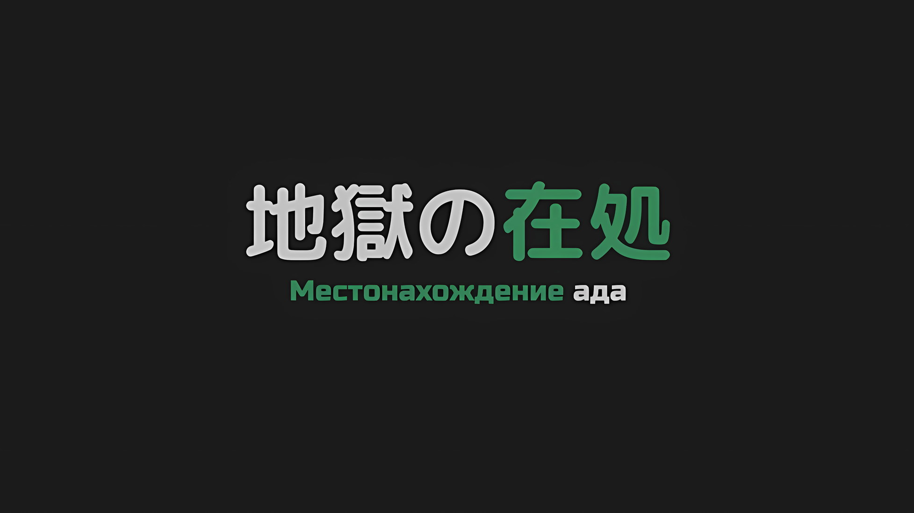
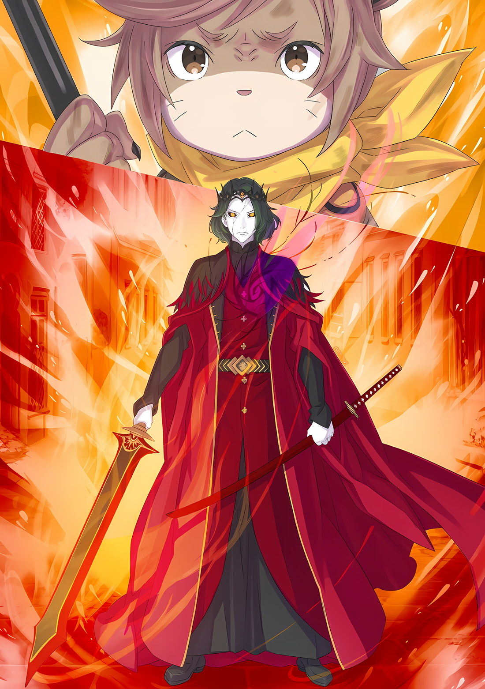

*※※※※※※※※※※※*

…Груви Гамлет не интересовался «Звездочетами».

Это было не чувство неприязни, порожденное отвращением или враждебностью, а скорее искреннее безразличие в самом прямом смысле этого слова.

Во-первых, обычному человеку редко доводилось контактировать с теми, кто изрекает подобную чушь, как это делали «Звездочеты». В своей должности «Генерала» он иногда сталкивался с Убирком, которому разрешалось входить во дворец, однако он редко общался с кем-либо, кроме тех, с кем у него были дела.

Груви также не мог припомнить ни одного разговора с ним, за исключением разве что того, чтобы заткнуть ему рот за постоянное прерывание совещаний.

Учитывая такое впечатление, трудно было понять, почему Винсент, Император, и Чиша, его доверенное лицо, проявляли необычайное внимание к движениям «Звездочета». Позиция премьер-министра Беллстетза в отношении «Звездочета» была неясна, но, насколько мог учуять Груви, его преданность Империи была искренней, и комплекс обиды, которую он питал к Винсенту, не влиял на его суждения.

Таким образом, поскольку лидеры Империи уже определились со своим отношением, у Груви, не имевшего возможности принять в этом участие, не было причин проявлять интерес к «Звездочету».

Именно по этой причине, если бы выяснилось, что о столкновении с «Великим Бедствием», угрожающем выживанию Империи, «Звездочету» было известно заранее, рот Груви, скорее всего, переполнился бы его привычными ругательствами.

Однако в данном случае причиной привычных бранных слов, слетавших с уст Груви, был не гнев, направленный на «Звездочетов» или кого-либо, кто был с ними связан.

Груви: …Блядь!

Серые шипы появились чуть выше левой стороны его груди, и в тот момент, когда его пальцы, попытавшиеся их вырвать, прошли прямо сквозь них, острые иглы пронзили его сердце, вызвав острую боль, от которой шерсть Груви встала дыбом.

Ощущение, когда острый предмет вонзается в самые сокровенные части тела, а тем более в место, непосредственно связанное с жизнью, вызывало настолько сильную боль, что даже опытный воин не смог бы удержаться от того, чтобы не скривиться.

Что самое ужасное, шипы не имели осязаемой формы. Из-за этого от них невозможно было избавиться.

Стиснув зубы от одностороннего натиска боли, Груви посмотрел в сторону… на человека в железном шлеме, которого он обхватил за талию.

Естественно, страдая от того же проклятия, что и Груви, он также корчился от боли…,

Груви: Еб твою мать, пригнись! Сейчас ситуация станет еще более дерьмовой!

Ал: Пригнуться… Гху!

Заметив, что его компаньон не реагирует, Груви ударил Ала кулаком в живот, заставляя его тело податься назад.

Когда он застонал и упал спиной на улицу, Груви схватил его и быстро затащил в тень здания неподалеку.

Это была неизбирательная атака дальнего боя. Такое укрытие на улице было не более чем временной передышкой.

Сесилус: Но даже в этом случае, мы не хотим, чтобы нас заметили по шуму, тем самым привлекая орду нежити со всей округи.

Груви: …А ты разве не обзавелся этими ебучими шипами?

Сесилус: Нет? Я их тоже получил. Думаю, это был бы в прямом смысле цветочный подарок, если бы они подарили нам не только лозы, но и цветы.

Выйдя на ту же улицу, что и Груви с Алом, Сесилус постукивал себя по левой стороне груди, пока говорил.

Как и у Груви, на его груди виднелись шипы, да и боль должна была быть такой же сильной. И все же он ухмылялся в лицо боли, от которой даже у Груви нахмурились брови…,

Сесилус: Поведение ведущего актера всегда находится в центре внимания зрителей. Если кто-то искажает выражение лица в агонии после потери любимого человека или близкого друга, это может эмоционально тронуть. Но если кто-то искажает свое лицо только потому, что ему больно, это только снизит его актерский уровень.

Груви: То есть, неважно, насколько это пиздецки больно или охуеть как сложно, ты не показываешь это на своем лице. Таково твое тупоголовое мышление.

Сесилус: А? Я уже говорил об этом раньше?

Груви: Говорил, но хуй с ним.

Несмотря на то, что он не хотел слышать ничего из этого, его заставляли выслушивать убеждения Сесилуса до такой степени, что они вызывали у него отвращение.

Хотя многие не обращали внимания на причудливые замечания Сесилуса, Груви, который не мог пустить все на самотек, когда его чувства были уязвлены, часто вступал с ним в перепалки. Именно из-за этого он и познакомился с упомянутыми выше убеждениями.

Однако теперь, когда Сесилус забыл даже о том, что делился ими, стало очевидно, что он жил по этой логике еще до того, как его конечности полностью выросли, и это перешло из разряда впечатляющего в разряд простой глупости.

И, пока Груви и Сесилус препирались друг с другом,

Ал: Гхагх… Хах, боль от шипов ушла?

Поднявшись на ноги после того, как его затащили в переулок, Ал пробормотал это, глядя вниз на шипы вокруг своей груди. Затем он потер живот в том месте, где его ударили, и направил обиженную ауру на Груви,

Ал: Мой живот болит еще сильнее от удара… Что, черт возьми, происходит?

Груви: Ты, блядь, сам виноват, что не отступил к хуям собачьим! …Эти шипы, на них, видимо, влияет расстояние.

Сесилус: О, так ты имеешь в виду расстояние между пользователем шипов и нами? Разумеется, в этом есть смысл, если боль исчезает, как только мы отступаем назад! Понять это становится еще проще, поскольку мы цеплялись друг за друга. Сначала был Груви-сан у живота, затем зажатый в бутерброде Ал-сан, и, наконец, я сзади, и, хотя это произошло меньше чем за секунду, разница все равно была.

Ал: …Но шипы не исчезли.

Начисто разрезая палец о неприкасаемые шипы, Ал горько пробормотал это.

Он был прав, боль утихла, но, что самое важное, шипы не исчезли. Было тревожно, что, хотя очевидная трудность — боль — ушла, связь с шипами — нет. В большинстве случаев этот вид остаточного заклинания давал эффект определения местонахождения цели.

До тех пор, пока эти шипы оставались, существовала большая вероятность того, что их местонахождение будет известно другой стороне.

Сесилус: В таком случае, даже если мы будем скрываться, они могут внезапно направить против нас свои силы. …Не думаю, что убивать большое количество врагов — это хорошая идея.

Ал: Ты уже это говорил. А причина в том,

Сесилус: Как я и сказал, это предчувствие.

Груви: …Твои ебаные предчувствия, ага.

Поскольку Сесилус без колебаний изложил суть своих рассуждений, Груви не смог рассмеяться над такой глупой шуткой.

Хотя эта ситуация не была смехотворной, у него был послужной список, который нельзя было отбросить как бессмыслицу. Сесилус и Аракия были полностью интуитивными типами Генералов Первого Класса, однако интуиция у них была разная.

Груви также не думал, что их противник, устроивший бедствие такого масштаба, сделает глупый ход, атакуя лишь грубой силой.

Скорее, если бы противник использовал только грубую силу, то он бы не смог сравниться ни с Винсентом, ни с Чишей…

Груви: …

На мгновение Груви бросил взгляд на профиль Сесилуса, но затем замолчал.

В его голове крутилось множество мыслей, однако он понимал, что если их противник с самого начала решил действовать тотальной силой, то столкновение с Империей, в которой есть такие люди, как Сесилус и Аракия, будет плохим выбором.

Противник, совершивший такую самонадеянную ошибку, никак не мог быть врагом Империи Волакия.

Конечно, все было бы по-другому, если бы уменьшенное состояние Сесилуса действительно являлось частью плана противника, но обоняние Груви опровергало эту теорию.

Именно Чиша уменьшил Сесилуса. В этом он был уверен из-за остаточной маны.

И Чиша ни за что бы не стал соучаствовать в уничтожении Империи. Но в конечном итоге Груви было трудно понять, каковы же истинные намерения Чиши.

Ал: Если наше местонахождение известно, то у нас нет времени на долгие раздумья. Что мы будем делать? Может, нам всем отправиться за ними и противостоять тому, кто наложил на нас это проклятие?

Сесилус: Угу. Это самое быстрое решение! Но теория Груви-сана гласила, что сила проклятия зависит от расстояния. Это значит, что если мы от него удалимся, то боль уйдет, а если же приблизимся, то…

Ал: На этот раз мы не отделаемся легкой болью, хах.

Сесилус: Похоже на то.

Пока Сесилус высказывал предположение, измученный Ал уставился на шипы в своей груди.

Груви согласился с Сесилусом. В этом и заключался весь ужас их врага, который беспорядочно раскидывал Терновые Проклятия по любой цели в пределах своей досягаемости.

Чем ближе человек подбирался к пользователю, тем сильнее действовало Терновое Проклятие. Большинство людей, вероятно, окажутся недееспособными от боли еще до того, как смогут добраться до пользователя.

Груви: И если это случится, то, какими бы невъебенно тупыми они ни были, пошевелиться им не удастся.

Сесилус: Итак, судя по этому взгляду в мою сторону, ты, должно быть, принимаешь меня за дурака, который бросается в бой, не подумав, верно? Но, как ты можешь себе представить, я тоже не буду бросаться без раздумий. Если я смогу решить проблему путем разрубания противника, терпя при этом боль, то это будет забавно, однако…

А затем, хлопнув, Сесилус сильно сцепил руки перед грудью, издав какой-то звук. В таком положении он переплел пальцы обеих рук вместе и поочередно посмотрел на Груви и Ала через щель между пальцами,

Сесилус: Это ведь не тот случай, да? Если бы речь шла о том, чтобы отрубить противнику голову, то Груви-сан уже бы давно заставил меня это сделать.

Груви: …Вот что так хуево в этом проклятии дерьма.

Сесилус злобно улыбнулся, и Груви не мог не вздохнуть.

Если бы это была магия, то убийство заклинателя обычно привело бы к прекращению его действия. Магия вызывается заклинателем, использующим ману для вмешательства в мир, так что если он исчезнет, то все закончится.

Однако проклятия специализируются на нанесении урона, приводящего к смерти цели.

По этой причине многие из них активируются в сочетании с Одом цели, и большинство не теряют своей эффективности до тех пор, пока цель продолжает жить, даже если заклинатель мертв. Например, эти шипы явно больше зависят от Ода цели, чем от Ода заклинателя, и являют собой прекрасный пример.

Единственный способ побороть этот тип проклятия — заставить заклинателя снять его или использовать секретный трюк.

Груви: Меч Мурасаме. Иди и возьми его.

Груви подергал подбородком, отдавая свои указания, на что Сесилус и Ал уставились на него в недоумении.

Груви не обратил внимания на Ала, поскольку тот никогда об этом не знал, зато он бесконечно ненавидел Сесилуса, который знал, но забыл. Груви схватил Сесилуса за воротник и оскалил зубы.

Груви: Это же «Меч Дьявола» Мурасаме! Этот ебучий меч — самый быстрый способ разрубить проклятия, контракты и прочие не имеющие формы вещи! Иди и найди его!

Сесилус: А!? Даже если ты так говоришь, я все равно не знаю о таком мече! Раз ты не знаешь, где он, то хочешь, чтобы я пошел его искать… или Груви-сан узнает о его местонахождении по запаху?

Груви: Бесполезно. Этот дерьмовый меч отсекает запах, так что я не смогу уловить его носом. Даже если бы он целый год провалялся в луже крови, я бы все равно его не учуял, каков пиздец.

Даже если бы не это, Мурасаме ненавидит Груви, который расплавил его из состояния меча и перековал в катану, из-за чего он не позволяет ему даже подержать его в руке.

Нос Груви не мог определить местонахождение «Меча Дьявола», с которым было так же трудно иметь дело, как и с его владельцем, Сесилусом.

Ал: …Но ведь с его помощью ты сможешь что-то сделать с этими шипами, верно?

Пока Груви и Сесилус обменивались парой слов, Ал встал и низким голосом подтвердил ситуацию.

На его серьезный тон Груви отпустил Сесилуса и кивнул.

Груви: Да. Если он и должен где-то находиться, то либо в доме этого тупоголового дегенерата, либо в секретном хранилище, но я не думаю, что этот тупоголовый дегенерат умеет хранить секреты, так что, скорее всего, у него нет ничего подобного.

Ал: Согласен. И где же этот дом?

Груви: Он находится в саду Кристального Дворца. Он живет с Аракией в дебильной, блядь, хижине.

Сесилус: Подождите, подождите! Груви-сан постоянно говорит о «дегенерате», и я полагаю, он говорит обо мне, но есть имя, которое я не узнаю, кто же это!

Ал: Аракия, та девушка, все ли у нее в порядке в саду дворца? Как же тесен мир…

Груви: Неа, с ней, возможно, не все в порядке.

Груви сморщил нос, отвечая на разумное бормотание Ала.

Отношения между Сесилусом и Аракией были непонятны даже Груви, способному наблюдать лишь со стороны. Они, очевидно, знали друг друга почти десять лет, однако оставалось загадкой, что Сесилус к ней чувствовал. Было ясно, что Аракия недолюбливала Сесилуса, но они все равно жили вместе и разделяли совместные трапезы.

Если бы они были вместе, Груви смог бы определить это по запаху, но никаких признаков этого не было. Временами они доставляли неудобства, поскольку, серьезно пытаясь убить друг друга, могли изменить топологию Империи.

Груви: Однако я не думаю, что «Меч Грез» или «Меч Дьявола» оставили бы в покое даже после того, как этот, блядь, дегенерат уменьшился в размерах. Так что вполне возможно, что…

Ал: …Если бы их нужно было положить во дворец, то это сделали бы с самого начала.

Ал был прав в своем беспокойстве относительно неопределенности того, поместили ли их по окончании во дворец.

Если бы им удалось проникнуть в Кристальный Дворец, они бы не смогли применить стратегию штурма бастиона, поскольку она опиралась на подкрепление. Однако для того, чтобы получить подкрепление, необходимо, чтобы этот заклинатель был остановлен.

Сесилус: Хммм, что же делать? Оставлять такое замечательное оружие во дворце было бы расточительством. Оружие, которое кажется значимым, должно быть использовано.

Тут вмешался Сесилус, сложив руки за головой.

Сесилус, стоя спиной к Алу и Груви, которые разговаривали друг с другом, взглянул на них и простонал: «Угх».

Груви: Заебешь. Если ты хочешь что-то сказать, то просто уже, блядь, скажи это.

Сесилус: Нет, нет. Разве вы не можете говорить только вдвоем? Не похоже, что вы оба услышите все, что я скажу, так что мне, в общем-то, все равно.

Груви: Ты, блядь, сердишься из-за Аракии? Ты и эта девка пытались друг друга поубивать! Вот из-за чего ты так дулся, да? Ну вот и все, дегенератище, а теперь говори, что хотел!

Сесилус: Аах, если уж ты так сильно хочешь это услышать. …Если прямо, то я говорю о том, что, с их точки зрения, лучше позволить кому-то другому получить это, чем оставить во дворце.

Сменив улыбку угрюмым выражением лица, Груви нахмурил брови на заявление Сесилуса и расстроился из-за того, что в ответ ему было высказано мнение, которое оказалось более честным и правдоподобным, чем он ожидал.

Другими словами, если Сесилус был прав, то «Меч Грез» и «Меч Дьявола», два мощных оружия, скорее всего, принадлежали кому-то из нежити.

Более того…,

Сесилус: Если это такое мощное оружие, то разве бы ты не отдал его в руки тому, кому доверил важное место?

Груви: Блядь.

Как заявил Сесилус, это был наиболее вероятный сценарий, и, таким образом, Груви с клятвой согласился.

Если это так, то в их интересах было сократить возможные варианты и направиться в нужные места.

Груви: Хоть тебе и не нравится Балрой под номером три, но с этим ублюдком все иначе. У него есть копье. Он не примет дерьмового решения сменить оружие.

Сесилус: Значит, в другом месте. Может, зря Ал-сан использовал моего папу и его друга в качестве приманки.

Ал: Тут я с тобой согласен, его нужно убрать с дороги в первую очередь… Без шуток, он единственный, кто может сдержать брата и остальных, когда они прибудут.

Сжатый кулак Ала задрожал, из-за чего Сесилус, закрыв один глаз, посмотрел на Груви.

План был доработан. Для того чтобы получить «Меч Дьявола», они отправятся на другие бастионы, дабы найти человека, у которого, по их мнению, он мог бы быть, — несколько бессистемная стратегия…,

Груви: Дегенерата кусок, хотя бы будь первым, кто пойдет и провернет это. Где же будут самые большие шансы?

Сесилус: Хмм… Наверное, номер два, нет?

Ал: Если на юго-восток, то это все равно довольно близко отсюда. Тогда мы снова воспользуемся кожаным плащом, и направимся втроем к…

Груви: Нет.

Как только они определились с бастионом, к которому собирались направиться, Груви перебил Ала.

Покачав головой, Груви бросил Алу шкуру оборотня, повернулся к ним спиной и направился ко входу в переулок.

И тут…,

Груви: Дальше мы пойдем разными путями. Я должен прижать голову этого злоебучего врага, да так, чтоб он не двигался. …Это дерьмовая роль, но я единственный, кто может это сделать.

Ал: …Кх, я понимаю, о чем ты, но ведь на нас есть шипы! Разве для тебя и меня условия не одинаковы!?

Груви не прекратил шаг, когда услышал голос Ала, который попытался его остановить.

Ал уже собирался погнаться за ним, как вдруг маленькая рука Сесилуса помешала ему, постучав по груди. По-прежнему сдерживая Ала, Сесилус обратился к Груви.

Сесилус: Ты же ведь сможешь победить, правда?

Груви: По крайней мере, я найду время, чтобы ты, дегенерат, выполнил свою работу. Да за кого ты меня принимаешь? Я — неповторимый Груви Гамлет, «Шестой» из «Девяти Божественных Генералов».

Груви поднял руки и через плечо поведал Сесилусу основу своей уверенности.

Казалось, это нашло особый отклик у Сесилуса. Он издал восхищенное фырканье, которое, даже не глядя на него, было очевидно,

Сесилус: Ну что ж, повеселись там. В следующий раз мы с тобой встретимся уже с «Мечом Дьявола»!

И вот, под знакомую витиеватую речь ведущего актера, Груви оттолкнулся ногой от булыжного покрытия и направился к полю боя.

*△▼△▼△▼△*

…Расставшись с Сесилусом и Алом, Груви, теперь уже в одиночку, поскакал по столице Империи.

Несмотря на то, что он находился на открытом пространстве, он пролетал мимо улиц, пинал стены и крыши зданий, подпрыгивая с большой силой.

С этого момента, в отличие от тайных операций, которые можно было бы провести, надев шкуру оборотня, ему приходилось привлекать внимание оппозиции, целенаправленно делая свой ход драматичным.

Наконец, в конце концов, у Груви появилась возможность начать действовать в своей стихии.

Груви: Заставляете меня, блядь, делать все это пиздецки раздражающее дерьмо…!

Выплеснув всю накопившуюся фрустрацию на язык, Груви выплюнул злобную порцию ругательств.

Во-первых, вести себя так, чтобы приходилось изворачиваться, например, бегать в попытках спастись или скрываться в тайне от посторонних глаз, было совсем не в духе Груви. Дело было не в том, хорошо у него это получалось или нет, он просто ненавидел это делать.

Несмотря на это, с тех самых пор, как он отступил с западного поля боя после появления нежити, ему неустанно навязывалась такая роль, вплоть до достижения столицы Империи, а потому он находился на абсолютном пределе своего терпения.

Конечно, его разочарование не являлось причиной предложения действовать самостоятельно, однако теперь, когда он получил прекрасный шанс разгуляться по собственному усмотрению, он собирался им насладиться.

Груви: …Вот блядь, оно здесь.

Острая боль, пронзившая его сердце, представляла собой нечто такое, что невозможно было выдержать без труда, даже если получатель являлся воином, привыкшим к боли. Это была полная правда без доли фальши, как уже говорилось ранее.

За исключением…,

Груви: Раз это дерьмовое проклятие, что мучает противника, то наверняка должна быть лазейка…!

Рявкнул Груви, вытаскивая один кинжал из пояса, надежно закрепленного вокруг его тела.

Из пояса, нагруженного множеством кинжалов, был извлечен один с фиолетовой линией поперек лезвия, и Груви направил острие этого кинжала на собственную шею, вонзив его в себя.

И тут же яд, нанесенный на острие лезвия кинжала, хлынул в его тело, быстро разъедая маленькое телосложение человека-гиены и циркулируя по его кровеносной системе. Смертоносный токсин разбушевался, радуясь тому, что исполняет свой долг — убивает живое существо, и, когда он уже спешил положить смертельный конец жизнедеятельности этого существа… лезвие было отведено назад прямо перед тем, как он смог это сделать.

Груви: …Аах.

Выдержав ощущение, вызвавшее рефлюкс содержимого его желудка, кровь прилила к расширившимся глазам Груви.

Из-за разрыва капилляров глазных яблок оба глаза окрасились в красный цвет, однако его физическое тело не погибло от вирулентного яда, и вместо этого в нем произошли изменения.

Часть чувств его тела была заглушена ядом. …Его чувство боли было подавлено.

В следующее мгновение боль от шипов, которой было бы достаточно, чтобы его обездвижить, исчезла, а ощущение, сжимавшее его сердце, уступило место ликованию, вызванному насильственным преодолением угрозы его жизни.

Первоначально яд предназначался для использования в качестве орудия пыток, процедура заключалась в том, что его вводили пленным врагам и позволяли им в полном сознании наблюдать за тем, как разрушается их собственное тело, не чувствуя при этом никакой боли.

Он считал, что, если отрегулировать дозировку, можно будет сохранить контроль над своим телом и продолжать жить с уничтоженным чувством боли, как это было сейчас. Он всегда хотел это проверить, но не представлялось возможности, а тут все прошло гладко без всякой предварительной подготовки.

Груви: Если я когда-нибудь протестирую его на этом тупоголовом Сесилусе, тогда, если я все испорчу, это станет необратимой ошибкой.

Если речь шла о его теле, то он запомнил его полностью, начиная с количества своих звериных волосков и заканчивая шириной клыка, без единой неточности. Благодаря этому он мог вносить даже малейшие коррективы, но испытывать яд на Сесилусе или Але означало бы делать приблизительные расчеты, ставя на кон их жизни.

Более того, у него возникло желание проверить, умрет ли Сесилус от этого яда… Подавив медленно поднимающееся любопытство, Груви отправился к третьему бастиону.

Текущая ситуация говорила сама за себя. Прямо сейчас его первоочередной задачей было спасти Империю Волакия от неминуемой гибели.

По правде говоря, он хотел извлечь максимум пользы из этой ситуации с возрождением нежити, отправившись собирать материалы с ограниченного числа редких рас и тех, что уже вымерли, однако ему пришлось подавить в себе сожаление и упустить эту возможность.

Причина допустить подобное кипела и пылала внутри Груви.

Груви: На хуй это дерьмо.

Он выкинул несколько коротких нецензурных слов. Они были вызваны постоянным чувством разочарования внутри него.

…С того момента, как он положил глаз на столицу Империи, которой управляла нежить, — то есть так, как он смотрел на нее сейчас, — Груви вспомнил о вероятности того, что либо Винсент, либо Чиша погибли. Более того, если кто-то из них действительно умер, то, по его мнению, это должен был быть Чиша.

За шагами Винсента тянулся слабый запах смерти. Однако, когда в какой-то момент этот запах резко исчез, или ему так показалось, ситуация пошла наперекосяк.

Груви: Ебаный бледнолицый выблядок.

Это был отрешенный человек, который держал свои эмоции закрытыми от чужих глаз, но в итоге он скрыл даже внутреннюю работу своего сердца от запаха.

С приближением решающей битвы в столице Империи именно приказ Винсента отправил Груви на запад, держа его подальше от поля боя, однако этим Винсентом, должно быть, был Чиша.

Он не мог узнать, что случилось с Винсентом за это время, но если представить себе обстоятельства, по которым Сесилус уменьшился в размерах, то единственным победителем во всем этом был Чиша.

Несмотря на это, если Империя будет повержена, то даже его победа будет сметена, как будто ее и не было.

Груви: В пизду это, блядь.

Нельзя было допустить, чтобы такая глупая идея стала фактом.

Груви родился в Империи, вырос в Империи и являлся человеком-гиеной, живущим в Империи. Повышение социального статуса его расы зависело от работы, которую он выполнял, и ему всегда говорили, что его долг — мужественно сражаться до последнего вздоха.

Он осознавал, что родился тем, кто оставит свой след в истории Империи. Фактически, он был разведан самим Императором, скачками поднимался по карьерной лестнице и в итоге дослужился до должности Генерала Первого Класса Империи.

Группой, которую такой человек, как Груви Гамлет, признавал равной себе или даже его превосходящей, были «Девять Божественных Генералов».

Груви являлся воином, принадлежащим к Империи, а также одним из тех, кто подчинялся философии, гласящей, что «Люди Империи Должны Быть Сильными».

Именно поэтому вопрос победы или поражения был для него священным. …В конце концов, победителю должны воздаваться почести.

Груви: Блядь, блядь, блядь, блядь, блядь, блядь…!

В Волакии, стране непрекращающихся сражений, мир погрузился бы в ад, если бы даже вышеупомянутый неписаный закон был искажен.

Более того, ад должен был обрушиться на врагов Волакии, поэтому превращать этот мир в такое место было нельзя.

Он должен сообщить врагу местонахождение ада.

Груви: …Нашел, блядь.

Груви повернулся и пробормотал это, когда увидел несколько движущихся силуэтов.

Орда нежити в нижней части его поля зрения что-то пронзительно выкрикивала. Однако их реакция была выше всяких похвал. Они были бы безвредны, даже если бы он оставил их в покое, но у него не было причин поступать подобным образом.

Прежде всего, Груви не мог позволить своей добыче удрать в окружении запаха крови.

Сомкнув клыки вместе со звучным щелчком, он достал цепь и серп, которые носил на спине.

Это было сложное в обращении оружие, состоящее из широкого одноручного серпа, соединенного цепью с грузом. Обычно длина цепи составляла всего несколько метров, и предполагалось, что цепь и серп будут использоваться в боях на ближней или средней дистанции, однако оружие Груви было сделано из уникальных материалов.

Из-за этого прикованный к цепи груз легко достиг группы нежити, даже если они находились почти в тридцати метрах от него.

Он взмахнул рукой с серпом, прочертив широкую дугу, и через мгновение закованный в цепи груз запел свои металлические мелодии, летя к земле с огромной скоростью. По размеру груз равнялся кулаку, однако сила, лежащая в основе его ускорения, была слишком огромной, чтобы преобразовать ее в простой удар.

Разумеется, нежить отпрыгнула с пути груза, не желая попасть под удар… как наивно.

Груви: ОТСТАЛЫЕ ВЫБЛЯДКИ!!!

Запущенный груз соприкоснулся с землей в направлении рева Груви.

Внезапно груз изнутри окрасился в красный оттенок, и окружающие здания были охвачены последовавшим сильным взрывом. Возникшая мощная ударная волна поглотила нежить, которая едва успела уклониться от взрыва, и вот так одна из улиц столицы Империи была уничтожена.

…Багровые Холмы Гираль располагались к северо-западу от Городов-государств Карараги, неподалеку от Великого Каскада.

Место, которое выглядело как красная пустыня, являлось самой опасной землей в мире, созданной из хрупких частиц Огненного Магического Камня, напоминающих песчинки. Поскольку даже дуновение ветра могло вызвать цепь взрывов в этом регионе, говорили, что оно было создано из кровавых слез Великого Духа, которому не удалось стать частью Четырех Великих.

Груз, соединенный с цепью и серпом Груви, содержал внутри себя Огненные Магические Камни, собранные с Багровых Холмов Гираль, и, поглощая ману из окружающей среды, он мог таким образом высвободить свою исключительно разрушительную силу.

Почувствовав на себе толчок взрывного жара, снесшего целую улицу, Груви приземлился на обугленные руины, которые продолжали испускать черный дым и пылать, а затем, наклонившись, выпрямил спину,

Груви: Рррааааааагхх!!!

Именно так он и зарычал, позволяя разрушительному импульсу, разбушевавшемуся внутри него, идти своим чередом.

Его колотящееся сердце ныло от ощущения сдавливания шипами, но никакой боли не было. Более того, он чувствовал, как палящий жар обжигает его тело изнутри, и выдохнул воздух, пахнущий кровью.

Затем он громко скрежетнул клыками, поправляя свою хватку на цепи и серпе,

Груви: Нельзя, сука, устраивать мне засаду с таким дерьмовейшим проклятием!!!

Как только в небе появилась тень, и подол ее красной шинели затрепетал в воздухе, он сразу же запустил в нее груз, прикованный цепью.

Аналогично тому, как ранее была продемонстрирована сила груза, противник перехватил его с мечом в руке, и сразу после этого извергающееся пламя охватило все целиком.

Однако…,

Груви: Тц!

Груви тут же отскочил назад, увидев, как пламя, охватившее небо, разделилось пополам.

Неестественное изменение, произошедшее с пламенем, свидетельствовало о том, что его разрубил летящий силуэт. Кроме того, шипы, яростно пульсирующие при появлении своего хозяина, словно завывая от радости, подсказали ему, что именно этот противник ответственен за распространение Тернового Проклятия на Груви, а также на его окружение.

Если бы он не заглушил свое чувство боли с помощью токсинов, то сейчас бы уже корчился на земле, извергая кровь.

В случае, если бы его противником оказался бы тот, кто полагается исключительно на свои шипы, Груви хотел бы сказать, что у него есть полное превосходство, однако, судя по всему, его врага будет не так-то просто победить.

???: Засада? Довольно странное замечание. С какой стати я стал бы прибегать к таким коварным уловкам?

Спустившись на выжженное поле и томно глядя в сторону Груви, силуэт заговорил.

Изломанная бледная кожа и золотые зрачки, плавающие над черными склерами. Его внешность, как и ожидал Груви, соответствовала требованиям нежити, но было кое-что, что перешагнуло через одну или две стены его ожиданий.

В первую и во вторую очередь это было эстетичное одеяние, которое разрешалось носить только Императорской Семье Волакия, и черты лица, которые чем-то напоминали Винсента Волакию. Но самое главное — это то, что его противник держал в руке.

Это было нечто, что мог держать только Император Волакии, багровое искрящееся сияние «Меча Света»…

Груви: Ебанный пиздец.

Если нежить является воскресшей, то, конечно, существовала вероятность того, что Императорская Семья Волакия станет частью орды.

Из-за этого, хотя Груви и был удивлен тем фактом, что у его противника есть «Меч Света», он смог это принять. А вот чего он не смог принять, так это того, что это был не единственный меч во владении его противника.

Крепко сжимая «Меч Света» в правой руке, в левой Император-нежить держал уже совсем другое оружие.

Это был клинок, который Груви никак не мог ожидать увидеть у этой нежити в этом месте…,

Груви: …Как далеко ты, сука, собираешься зайти, чтобы бросить мне вызов, ты, ебучая катана!!!

Когда Груви зарычал в порыве ярости, в поле его зрения появился Император-нежить с «Мечом Дьявола» Мурасаме… «Меч Света» и «Меч Дьявола», два клинка, принадлежащие к Зачарованным Мечам, противостояли, к его большому огорчению, «Мастеру Проклятых Инструментов» Груви.
