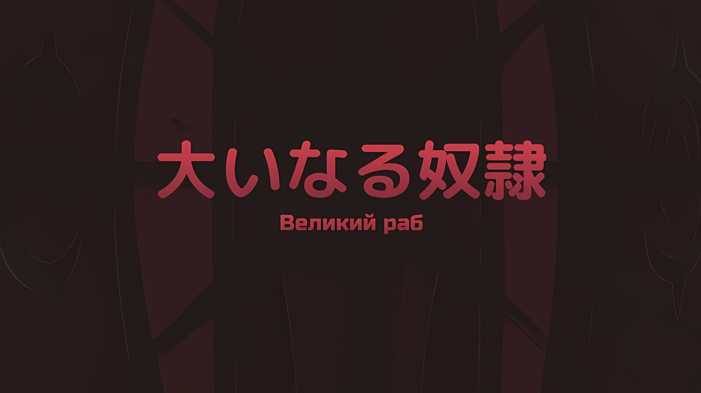
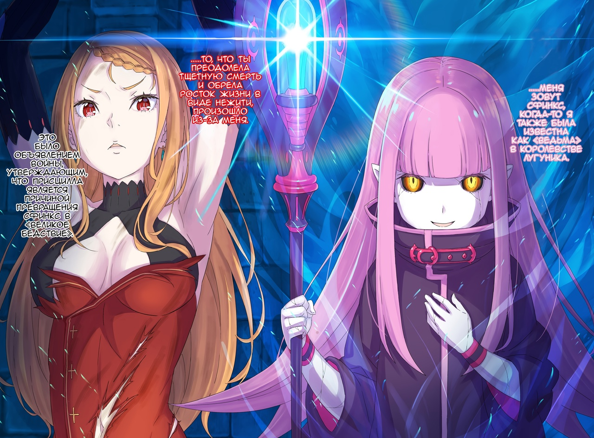

*※※※※※※※※※※※*

…Присцилла Бариэль не презирала «Звездочетов».

Появившиеся только в Империи Волакия, они являлись жалкими существами, обремененными психическими заболеваниями.

Таково было общее мнение тех, кто познакомился со «Звездочетами», хотя, по правде говоря, встретить тех, кто страдает болезнью общения с миром, было не таким уж и частым явлением.

Тем не менее, существовали должности, которые легко переплетались с теми, кто страдал болезнью «Звездочета».

Это были люди, тесно связанные с Императорской Семьей Волакия.

Будь то сами члены Императорской Семьи или, возможно, те, кто удовлетворял нужды Императорской Семьи в повседневной жизни. Те, кого назначали на должности управляющих, охранников и тому подобное, имели шанс столкнуться с людьми, зараженными болезнью «Звездочета».

В конце концов, «Звездочеты» были из тех, кто не мог не желать быть причастным к истории Империи, и всякий раз, когда происходил какой-нибудь крупный инцидент, который, казалось бы, должен был быть записан в историю Империи, все они принимались о нем рассказывать.

Впрочем, еще не было случая, чтобы высказываниям «Звездочетов», которых презирали как безумцев, придавали большое значение.

Конечно, наверняка находились любопытные, которые прислушивались к словам «Звездочетов», но не было ни одной книги по истории, по крайней мере общедоступной, в которой было бы записано, что их бредни оказались полезными.

До тех пор, пока нынешний Император, Винсент Волакия, не предоставил Убирку официальную должность и разрешение на вход и выход из дворца, таково было общее понимание отношений между Империей и «Звездочетами».

Не было ли это так, как если бы «Звездочеты» были подобны ухажерам, продолжающим излучать безответную страсть к Империи?

Наделенные заповедью, они были ухажерами, которые слепо жертвовали всем ради ее исполнения. Многие граждане Империи, знавшие об их существовании, относились к ним с презрением, однако Присцилла этого не делала. Но она и не испытывала к ним жалости.

«Звездочеты» и им подобные не были чем-то настолько особенным, чтобы стать объектом презрения или жалости.

С самого начала подавляющее большинство живых существ были рабами чего-то большего, чем они сами.

Будь то Король, семья, супруг или супруга, а может, любовь, ненависть или судьба; разница была только в этом.

Таким образом, получается…,

Присцилла: …Даже я сама не исключение.

С лязгом зазвенели цепи, сковывающие ее запястья, когда она забормотала в темноте.

Сплетая слова, она не слишком заботилась о том, присутствует ли здесь публика, но, по крайней мере, это бормотание не являлось монологом; оно было произнесено для того, чтобы быть кем-то услышанным.

Тем не менее, казалось, что другая сторона этого не желала, поскольку никакой ответной реакции не последовало.

Впрочем, если бы кто-то пытался скрыть свое присутствие, такие мелкие желания не были бы исполнены.

Присцилла: Как бы ты ни старалась подавить дыхание, нет способа скрыть присутствие такого существа, как ты. Или, быть может, ты не покажешься, пока я напрямую к тебе не подойду?

???: …До тех пор, пока твои руки связаны, это действие невозможно.

Присцилла: Да будет так. В таком случае у тебя нет иного выбора, кроме как сделать шаг в мою сторону. Я не намерена обмениваться словами с кем-то, кто даже лица своего не показывает.

???: …

Через мгновение, без замешательства и колебаний, мысль была прервана шагами. Постепенно, в сопровождении медленного, отдающегося эхом звука шагов, ударяющихся о холодный пол, в темноте возникла маленькая фигурка.

Источник света в подземной темнице был скудным, что позволяло лишь смутно разглядеть ее форму.

Существовал предел тому, насколько глаза могли приспособиться к темноте. И уж тем более, если человек не удосужился закрыть веки, чтобы приспособить зрение к ночному мраку.

Присцилла: Не совершай столь неприличных поступков, как сокрытие себя в неосвещенной темноте. Когда на свет выходишь, делай это великолепно.

???: Поистине горделивое заявление, характеризующее твою личность. Осторожность: Требуется.

И сразу же после безэмоционального голоса по каменному полу резко ударила твердь, отличная от ботинок. Высокий звук прорезал холодный воздух, а затем голубовато-белый свет с силой разогнал темноту в подвале.

Присцилла: …

Спустя мгновенье в этом свете появилось прекрасное белое лицо… С оранжевыми волосами и багровыми глазами, красавица, облаченная в красное, как кровь, платье, — это была Присцилла Бариэль.

Заточенная в подвале, Присцилла была ослеплена посохом, который сиял голубовато-белым светом, а держала этот посох девушка с длинными розовыми волосами… кожа ее была покрыта трещинами, а глаза ужасали своим видом, она явно являлась нежитью.

Приняв на глазах Присциллы облик маленькой девочки, если в этой нежити и было что-то особенное, так это то, что она…,

Присцилла: …Зачинщица этого «Великого Бедствия»?

Девушка: Отрицать не буду, однако, где ты узнала этот термин? У тебя была возможность его услышать?

Присцилла: Это был твой подчиненный, который подавал мне еду. Быть может, ты лишила его возможности говорить? Даже без моих расспросов он продолжал болтать о разных вещах, чтобы развеять свою скуку.

Девушка: Для Генерала Первого Класса Темегрифа, Предупреждение: Требуется. Однако…

В этот момент нежить прервала ее слова и, сделав шаг вперед, сократила расстояние между собой и Присциллой.

Несмотря на это, она все еще была далеко. Какими бы стройными и артистичными ни были ноги Присциллы, вряд ли бы она смогла дотянуться до челки своей собеседницы.

Девушка: Смогла ли ты это вынести? Скуку.

Присцилла: …

Сохраняя дистанцию между собой и Присциллой, нежить продолжила свои прерванные слова.

Глаза Присциллы слегка сузились в ответ на заданный вопрос. В высказывании этой девушки чувствовалась какая-то странная близость, будто она смотрела ей в лицо.

Речь шла не о физической дистанции, а о ментальной.

Присцилла: Ты говоришь так, будто давно знакома со мной.

Девушка: Что скажешь? Ты помнишь меня? У тебя есть какие-нибудь идеи о том, кто я?

Присцилла: К сожалению, я не настолько непостоянна, чтобы запоминать такие мелочи. Так что либо недостойна ты, либо это первый раз, когда ты являешь мне свой лик.

Девушка: Верно. Это первый раз, когда ты видишь мое лицо.

Однако кивок девушки не был исчерпывающим ответом на сомнения Присциллы.

Но опять же, именно потому, что в заявлении другой стороны были опущены все самые важные фрагменты, ее намерения были ясны. …Она проверяла Присциллу. Словно наблюдала за тем, проглотит ли привязанный зверь приманку.

Присцилла почувствовала ее намерение и слегка фыркнула.

Присцилла: Такое бесстрашное неуважение к себе.

Девушка: Действительно, мне неведома эмоция страха. То, чего я не знаю, не ограничивается одним лишь страхом, однако, как почтенная замена Матери, которая жадно желает знаний…

Присцилла: Значит, ты знаешь себя исключительно с односторонней точки зрения. …Ты та, кто стоит за морё* из деревни Каффлтон.

* Морё (魍魎) — это собирательный термин для духов гор, рек и различных других вещей.

Девушка: …Разъяснение: Требуется.

Присцилла прервала девушку, которая бессвязно рассказывала о себе, и когда она заговорила о чем-то, что зазвенело у нее в голове, та затаила дыхание.

Это бормотание было доказательством того, что идея Присциллы имела отношение к этой девушке, однако собеседнице было непонятно, как именно она связала это с ней.

Присцилла: Хм, это не так уж и запутанно, не так ли? Когда-то давно в пределах моих владений в Королевстве произошло то, что сейчас происходит со столицей Империи… или, точнее, со всей Империей, — произошел похожий инцидент. Когда такие редкие события происходят дважды вокруг тебя, естественно связать их воедино.

Инцидент произошел во владениях Бариэль Королевства Лугуника, в деревне Каффлтон, которая стала центром происшествия и жители которой были превращены в нежить.

Однако в то время речь шла не столько о возвращении мертвых к жизни, сколько о манипулировании трупами в соответствии с чужой волей. Королева, которая являлась очевидной причиной, была побеждена, и с тех пор не было никаких сообщений о подобных инцидентах. Считалось, что ситуация разрешилась.

Присцилла: Похоже, ты сменила местоположение гнезда и продолжила выполнять свои «Тэсты». Ты несколько улучшилась в своей ужасающей игре в куклы с насекомыми внутри их трупов.

Девушка: В предыдущем подходе было слишком много препятствий для достижения моих целей. Усовершенствование: Требуется.

Присцилла: Ты не отрицаешь свою причастность к Каффлтону?

Девушка: Не вижу смысла. Разве это не бессмысленные расспросы?

Реакция девушки, лишенная каких-либо эмоций, была скорее выражением отвращения, чем неприязни к расточительному использованию времени.

Если отбросить явное безразличие, такое отсутствие отрицания было полезно для получения желаемой информации. Однако, с другой стороны, диалог с таким собеседником был…,

Присцилла: Ты такая скучная.

Девушка: Это имеет значение?

Присцилла: Вне зависимости от того, полезен этот разговор или нет, это единственная ценность, которую можно из него извлечь.

Девушка: Тогда почему бы нам просто не проигнорировать, полезен он или нет?

Присцилла: Вот почему я сказала, что нахожу твои разговоры скучными. Это все равно, что разговаривать с мертвым человеком. Но разговор с надгробным камнем все же предпочтительнее, учитывая отсутствие твоих раздражительных реакций.

Девушка: …

Черные глаза девушки сузились, когда Присцилла заговорила, и она сделала к ней еще один шаг. Затем она положила руку на грудь, ту, что не держала посох,

Девушка: Не кажется ли тебе, что ты разговариваешь с мертвецом? Увидев меня, ты и не заподозришь, что я живая.

Присцилла: Было бы нелепо приписывать жизнь или смерть тому, что, по сути, даже не может быть признано живым. Однако то, что ты нежить, несколько неожиданно.

Девушка: …Почему?

Присцилла: Для тебя, организатора ритуала, было бы опрометчивой авантюрой самой стать нежитью. Более того, в момент смерти твоей техника, которую ты сплела, может оборваться, и все твои планы пойдут прахом.

Естественно, это могло быть необоснованным беспокойством, зависящим от информации и доказательств, о которых не знала Присцилла. Однако, учитывая характер этой девушки, даже это было весьма сомнительно.

Эта девушка, в особенности, не любила отсутствие эффективности и имела склонность не тянуться к вещам, которые, по ее оценке, имели не слишком однозначные доказательства.

Несмотря на это, даже к собственной жизни она относилась как к карте в руке, способной привести к «Великому Бедствию».

Присцилла: Вероятно, столкнувшись с неизбежной «Смертью», у тебя не было другого выбора, кроме как доверить свою надежду загробной жизни. Или, быть может, ты стала нежитью до того, как спровоцировала этот инцидент. Если нет…

Девушка: Если нет?

Присцилла: …Возможно, ты сочла приемлемым тот факт, что все это сойдет на нет, если твоя жизнь не продолжится дальше этого момента.

Догадываясь о необъяснимых истинных намерениях девушки, ставшей нежитью, Присцилла озвучила три возможности.

Перечисляя их по порядку и основываясь на характере девушки, проанализированном ею до сих пор, она удержалась от тех возможностей, которые были бы далеки от истины.

Однако…,

Девушка: Восхищение: Требуется.

Такова была реакция девушки в ответ на предположение Присциллы, когда она озвучила то, что должно было быть наименее вероятной возможностью.

По сути, это означало не что иное, как то, что девушка отказалась от планов, которые она привела в действие примерно во времена инцидента в Каффлтоне, то есть примерно в то же время, когда закончилась ее собственная жизнь.

Одного этого факта было достаточно, чтобы прекрасные брови Присциллы нахмурились, но что еще больше его усилило, так это реакция девушки на правдивость этого заявления.

С безжизненным, бледным лицом, лишенным каких-либо признаков жизни, девушка улыбнулась, как будто намерения Присциллы стали ей ясны.

В свете, излучаемом посохом, наблюдая за этой улыбкой, нахмуренные брови Присциллы стали еще отчетливее.

Присцилла: Наконец-то ты показала, что, невзирая на выгоду, в разговоре с тобой есть хотя бы польза.

Девушка: …Что-то изменилось?

Присцилла: Если ты сама еще этого не осознала, то позволь мне добавить несколько поздравительных слов. Превосходная ирония, прорастающая из жизни после смерти…

Затем Присцилла замолчала, закрыв один из своих багровых глаз. После краткого мгновения прекрасного и драгоценного созерцания Присцилла вновь открыла свое закрытое веко.

И, устремив оба своих багровых глаза на лицо девушки, с которого исчезла улыбка, сказала,

Присцилла: Нет, не совсем. Она не прорастает после смерти. Ты, ты пожертвовала собственной жизнью, чтобы доказать это?

Девушка: Я не лишала себя жизни. Возможность представилась сама собой. Однако предположение о том, что я столкнулась с неизбежной «Смертью», не является ошибочным. Исправление: Требуется.

В ответ губы девушки вновь изобразили улыбку, похожую на ту, что была ранее.

В этой явной реакции Присцилла отчетливо ощутила ритм жизни… Присутствие эмоций внутри этой девушки. Это было то, чего до сих пор в ней не наблюдалось.

Без этого мертвые не могли воскреснуть нежитью.

Таким образом, девушка доказала это на примере собственной жизни.

Возможно, у нее была квалификация, позволяющая стать нежитью, но должна была быть причина, чтобы поместить ее душу обратно в земляной сосуд и заставить цепляться за нынешнюю жизнь.

Это была стратегия с низкой степенью уверенности, и вряд ли ее можно было назвать эффективной.

Присцилла: Но ведь к такому выбору приводят эмоции, не так ли?

Девушка: Верно.

От девушки, все еще держащей руку на груди, исходило ощущение дерзости.

Прежняя пустота, как при разговоре с куклой, не имеющей сути, исчезла. Вместо этого появилось напряжение от столкновения с совершенно иным и неорганическим присутствием.

Девушка: План в Королевстве был сорван, поскольку прошлая «я» это отвергла. Однако, хотя мне и не удалось стать «Ведьмой» Королевства… похоже, я была избрана, чтобы стать «Великим Бедствием» Империи.

Присцилла: Избрана, говоришь. Это и есть причина, по которой ты вызвала бедствие?

Девушка: Исправление: Требуется. Это не мотив. Это основание.

На вопрос Присциллы последовал решительный ответ.

Услышав ответ девушки, смутные подозрения Присциллы начали обретать форму.

То, что погружалось в тень, более темную, чем мрак подземной темницы, постепенно становилось яснее благодаря словам и выражениям девушки, подобно тому, как когда она принесла свет своего посоха в этот подвал.

И тогда…,

Девушка: …Меня зовут Сфинкс, когда-то я также была известна как «Ведьма» в Королевстве Лугуника.

Присцилла: …

Так, глядя прямо на Присциллу и объявляя свое имя, слова и поведение девушки… Сфинкс, а также то, что они означали, были наконец до нее донесены.

Прямое упоминание о том, что в Королевстве Лугуника ее называли «Ведьмой», вероятно, явно отличало ее от тех, кого называли «Ведьмами» в других странах.

Шесть существовавших когда-то «Ведьм», за исключением «Ведьмы Зависти», практически исчезли из истории, однако они по-прежнему были широко известны во всем мире как «Ведьмы».

Однако, если ограничить понятие «Ведьма» рамками Королевства Лугуника, то под это описание подходила только одна особа.

Из истории можно было легко узнать, что это существо участвовало в «Войне Полулюдей».

Однако то, что эта самопровозглашенная «Ведьма», Сфинкс, хотела донести до Присциллы, не было просто какой-то банальной информацией о ее истинной личности.

То, что «Ведьма» хотела донести до Присциллы, было…,

Присцилла: …То, что ты преодолела тщетную смерть и обрела росток жизни в виде нежити, произошло из-за меня.

Это было объявлением войны, утверждающим, что Присцилла является причиной превращения Сфинкс в «Великое Бедствие».

*△▼△▼△▼△*

Во-первых, ей даже не нужно было размышлять над этим, чтобы понять, что ситуация слишком бросается в глаза.

На месте решающей битвы в столице Империи, где имперская армия и армия повстанцев вступили в прямое столкновение друг с другом, Сфинкс привела с собой нежить, вмешалась в битву как «Великое Бедствие» и привела к тому, что конец восстания остался нерешенным.

Во время битвы Присцилла и Йорна были сосредоточены на схватке с Аракией, поэтому они не сразу поняли, как изменилась ситуация по сравнению с другими полями сражений, и в результате потерпели поражение, слишком поздно разгадав намерения нежити.

На данный момент Присцилла была закована цепями в подземной темнице, а самочувствие Аракии и Йорны в сложившейся ситуации оставалось неизвестным.

Во время боя с Аракией «Техника Брака Душ», которую Йорна в нее вложила, все еще сохраняла свое действие, поэтому не было никаких сомнений в том, что Йорна выжила. Даже если бы это было не так, Присцилла смирилась с тем, что ее держат в плену в обмен на безопасность Аракии, которая потеряла сознание, а также Йорны, которая была сбита с толку появившейся нежитью.

Сделка не смогла бы состояться, если бы вторая сторона не имела намерения захватить ее в плен.

Следовательно, тот факт, что Присцилла была прикована к этой тюрьме, оставаясь живой, вот так просто, был вполне естественным, поскольку другая сторона хотела что-то с ней сделать.

Присцилла: Я думала, что, несомненно, именно Ламия была особо заинтересована в моей жизни.

Сфинкс: Принцесса Ламия Годвин согласилась сохранить тебе жизнь. Она была очень сильно к тебе привязана. В свои последние минуты…

Присцилла: …Я не намерена делить время, проведенное между мной и Ламией, с кем-то другим.

Она оборвала ее, прямо расценив эти слова как простое проявление любопытства, существующего ради сиюминутного удовлетворения.

Сфинкс просто отпрянула назад со словами: «Понятно», услышав заявление Присциллы. Она затронула этот вопрос в качестве темы их разговора, но ее интерес к нему, по всей видимости, отсутствовал.

Это было очевидно для Присциллы, которая осталась жива даже после второй смерти Ламии.

Сфинкс: Привязанность — загадочное явление. На нее слишком сильно влияют элементы, противоречащие рациональности. Несмотря на это, я изо всех сил пыталась понять результаты, в которых иррациональность порой преобладала над рациональностью.

Присцилла: Рациональность или иррациональность, чему из этого ты придаешь большее значение, чтобы в итоге говорить со мной в такой манере?

Сфинкс: Интересно, чему именно. Обдумывание: Требуется… Это само по себе является действием, побуждающим к размышлению.

Пока Сфинкс отвечала ей, Присцилла гадала, осознает ли она это.

Независимо от того, осознавала она это или нет, по мере того, как Сфинкс продолжала говорить с Присциллой в этом месте, в ее речи стремительно нарастали человекоподобные качества.

Вода, которая была ее разговором с Присциллой, вылилась на ее зарождающуюся человечность, вызвав значительный рост.

Присцилла: …

Присцилла поняла, что именно Сфинкс имела в виду, и это не было опровергнуто, когда она высказала это вслух.

Судя по тому, как Сфинкс сохраняла намеренное стремление не углубляться в эту тему, можно было сказать, что мысль о том, что это относится к ядру ее мотивов, подтвердилась безоговорочно.

Было одно обстоятельство, в котором Присцилла, как бы ей ни было неприятно это признавать, отставала от Сфинкс… то, что она была совершенно невежественна в отношении крайней привязанности Сфинкс.

Конечно, учитывая статус Присциллы, бывали случаи, когда совершенно незнакомые люди и те, кого она знала лишь по именам, питали к ней что-то вроде односторонней одержимости.

Однако привязанность Сфинкс явно выходила за рамки ее эгоистического единомыслия.

На то была причина. Причина, послужившая началом «Великого Бедствия».

Сфинкс: Ранее ты говорила на одну очень интересную тему.

Присцилла: …

Сфинкс: Все формы жизни являются рабами какой-то высшей сущности. В прошлом я не смогла этого понять, но в настоящее время я ощущаю знаки, которые приведут меня к пониманию.

Сфинкс заговорила, по-видимому, находя эту тему интересной, и Присцилла ответила на ее слова молчанием.

Она не презирала ее и не игнорировала. Если выразить словами, то это был вид любопытства, с которым нельзя было шутить. Сфинкс начала говорить, отметив, что находит это интересным, и сама ее речь вызвала у Присциллы глубокое восхищение.

«Ведьма» выразила свое понимание того, чего ранее она не смогла постичь, и даже продемонстрировала свое согласие со словами Присциллы. О чем же она собиралась говорить?

Конечно же, на глазах у Присциллы, которая молчанием побудила ее продолжить, Сфинкс возобновила свою речь.

Сфинкс: Благодаря этому я способна обнаружить новую рациональность посреди всей этой иррациональности. Внимание: Требуется.

Сказала она, а затем еще раз ударила концом своего светящегося посоха по полу. Посох с инкрустированным в него великолепным драгоценным камнем стал ослепительно ярким, и в этот момент с поверхностью этого самоцвета произошли изменения.

…На бледный прозрачный драгоценный камень был спроецирован вид столицы Империи, находящейся за пределами подземной темницы.

Возможно, принципы его действия были схожи с тем, как Зеркало Переговоров имитирует отражение на другой стороне зеркала. Присцилла, прищурив глаза от света, почувствовала, что такая формула кажется довольно грандиозной, чтобы использовать ее только для разглядывания чего-то на расстоянии.

Хотя Сфинкс сказала ей быть внимательной,

Присцилла: Что ты хочешь мне преподнести?

Сфинкс: Достоверность твоих слов и результаты моего обновленного уравнения.

Исходя из предположения, что достоверность слов Присциллы соотносится с тем, что сказала Сфинкс всего минуту назад, она задумалась о том, что будет изображено на драгоценном камне, а затем пришла к осознанию.

И потом, одновременно, осознание Присциллы и проекция драгоценного камня стали ясными.

Показанная сцена была…,

Сфинкс: Впервые обретя понимание эмоций и привязанности, я постигла методологию их использования. Она достойна похвалы, не так ли? Если это делается ради тебя, то она не принимает себя в расчет. …Размышления: Требуются.

*△▼△▼△▼△*

…В то же время, в реальном месте сцены, спроецированной внутри драгоценного камня.

???: О боже, похоже, я довольно плохо поступил с Груви-саном. Я мысленно утвердился в мысли, что моя интуиция не подведет меня в критический момент… но она изрядно подвела.

Озвученная в остроумной манере, противоречащей веселому тону слов, тема была посвящена его собственной ошибке.

Однако ни в выражении его лица, ни в тоне повествования не чувствовалось никакого смятения. Это было потому, что его совершенно не волновала его ошибка, а также потому, что его желание извиниться было несерьезным… ведь его интуиция была наполовину верна, наполовину ошибочна.

Оставив яркую роль отвлекающего маневра своему союзнику, он помчался по кишащей нежитью столице Империи к одному из бастионов, входящих в состав городских стен, к месту, которое было известно под номером два в этой последовательности, где должно было находиться то, что он искал.

Конечно, именно его интуиция привела к такому выводу; не было сомнений, что, назови он это своим убеждением, многие в конечном итоге его бы упрекнули.

Но, по крайней мере, сам он был в этом убежден. …Что сейчас его время блистать.

Что если бы он, ведущий актер этого мира, Сесилус Сегмунт, прибыл на это место, то всем зрителям, наблюдающим за ним, была бы устроена шумная демонстрация его великолепных деяний.

Так что…,

???: …Итак, у тебя есть какое-то оправдание?

Сесилус: Ой-йой, в этом ты прав, но как насчет этого? «Моя интуиция меня не подвела». Если ты хочешь знать почему, то это потому, что то, чего я действительно желаю, находится прямо здесь!

Рядом с ним, держа в руках тлеющую шкуру, которая уже потеряла значение «плаща-невидимки», Ал произнес слова горечи, на что Сесилус ответил с ликованием.

В действительности же, было ли это правдой или нет, находилось за пределами понимания Сесилуса, однако разве вера в себя не гораздо-гораздо более позитивна по сравнению с сомнениями в себе?

Сесилус: А ты так не считаешь, полуголая девица? За депрессивным выражением лица обязательно последует мрачный поворот событий. В таком случае, нет нужды говорить, какое лицо должно быть у ведущего актера, купающегося в лучах света.

???: …

Закинув голову вверх, к парящей в небе фигуре человека, находившегося на высоте, превышающей даже высоту бастионов, к которым они подошли, Сесилус повысил голос; но ответа от другой стороны так и не последовало.

Тем не менее, от них поступило первоначальное приветствие. Нечто, что превратило абсолютно все вокруг в море пламени в попытке свести на нет Сесилуса и Ала, скрывавшихся под меховым плащом.

Совершая столь грандиозный поступок, в нем не чувствовалось ни враждебности, ни намерения убить Сесилуса и Ала.

Единственным, что доносилось со стороны стройного тела, обнажившего большую часть коричневой кожи, были лишь слезливые мольбы молодой девушки, которая приняла в себя нечто настолько огромное, что казалось, ее вот-вот разорвет на части.

Он не знал, какие обстоятельства привели к тому, что это нечто вошло в нее, однако…,

Сесилус: Наверное, она съела что-то плохое… Ты и впрямь не промах.

Девушка: …

Сесилус: А? Только что было странное чувство…

*Что же это было?* Не успел он ответить на этот вопрос, как над его головой возникло движение.

Вспышка света, и огромная сила обрушилась сверху, чтобы уничтожить Сесилуса и Ала. Но, прежде чем это произошло, Сесилус облизнул губы и попятился в сторону, когда Ал отбросил меховой плащ,

Ал: Ах, черт подери! …Расширение территории!!!

Когда этот отчаянный крик был поглощен ударом, началось величайшее столкновение в столице нежити.
