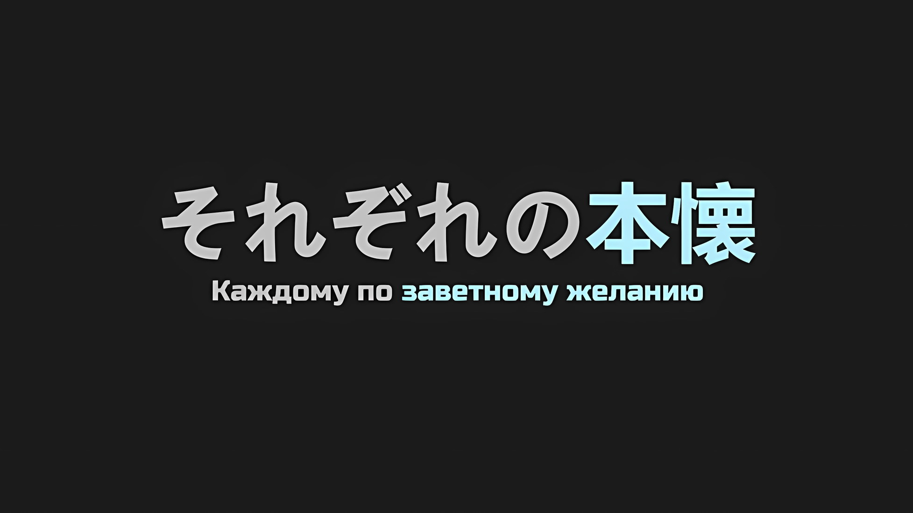
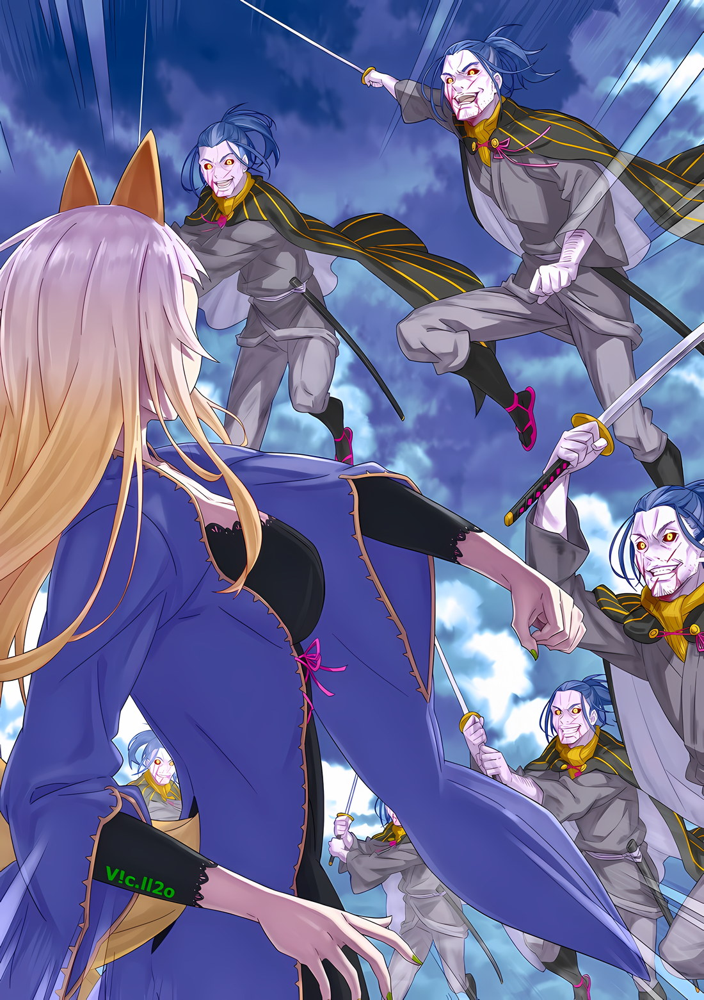

*※※※※※※※※※※※*

…Альдебаран знал о том, кто такие «Звездочеты».

Человек, который в прошлом сообщил Альдебарану об их существовании, был существом, знающим об этом мире практически все, но, тем не менее, жадно жаждущим неизведанного.

Отношения Ала с этим человеком были довольно сложными.

Нельзя было сказать, что их можно просто охарактеризовать как хорошие или же плохие.

Если бы его спросили, испытывает ли он к этому человеку благодарность, то, скорее всего, он бы ответил, что да. Однако, несмотря на чувство признательности, его мысли не могли избежать противоречия с тем, насколько они были несовместимы друг с другом. Такова была природа их взаимоотношений.

Во всяком случае, независимо от того, кто поведал ему об этих знаниях, он знал об обстоятельствах, в которых находились «Звездочеты».

А значит, они никак не повлияли на исход самого заветного желания Альдебарана. Гораздо важнее, чем его интерес к «Звездочетам» или к тому, связаны они с ним или нет, был тот факт, что они втянули *их* в это дело.

Когда Присцилла впервые заявила, что отправится в Волакию, он методом проб и ошибок попытался ее остановить; однако, как только она что-то решила, ее уже было не переубедить, несмотря ни на что.

Поэтому лучшее, что он мог сделать… это сопровождать ее, стараясь по возможности подстраховывать, но для Альдебарана тот факт, что он случайно встретил *их* в этой Империи, был, несомненно, жестокой иронией судьбы.

Судьба всегда вмешивалась в жизнь Альдебарана крайне одиозными способами.

Поэтому у него не было ни малейшего хорошего впечатления о судьбе, но на этот раз он был ей благодарен.

Если бы *они* были здесь, то результат был бы совершенно иным. Если бы *их* втянули в это дело, то развитие событий значительно бы изменилось.

Если *они* ограничат себя рамками и не смогут выйти за *их* пределы, если эти рамки будут расширяться все больше и больше, до такой степени, что *они* окажутся не в состоянии справиться со всем этим, тогда самое сокровенное желание Альдебарана исполнится.

Некогда Альдебаран уже отбрасывал все и вся.

В темноте, продолжая идти, полагаясь лишь на скудный звездный свет, он бросил все попытки.

По этой причине солнце сияло. Словно и не существовало такой вещи, как темнота, она свела на нет его смирение.

Если это было нужно для защиты ослепительного солнца, он был не против лизать сапоги судьбы. Терпя боль, которая, казалось, разрывала его, он, не колеблясь, смотрел *им* прямо в глаза.

Будь то «Ведьма», будь то «Звездочет», будь то «Великое Бедствие» — что бы ни встало на его пути, его это не остановит.

*…Я искренне прошу тебя, пожалуйста, не вставай у меня на пути.*

*△▼△▼△▼△*

…Двадцать два раза.

Именно столько попыток потребовалось Алу, чтобы понять, что с ним произошло. В одно мгновение наступило такое резкое помутнение, что он даже не понял, как его тело испарилось…

Ал: …Не, это произошло точно не из-за облаков или снега, причиной тому был огонь, так что, наверное, это из-за редаута*. Хотя, кримснаут* звучит круче.

* Redout — красная пелена.

* Crimsonout — багровый цвет.

Глубоко вздохнув, он произнес бессмысленное замечание.

Хотя он не мог с уверенностью сказать, в адеквате его разум или нет, по крайней мере, он смог заставить себя поверить в то, что это так.

На данный момент все было в порядке. И если возникнет проблема…,

Ал: Когда дело доходит до боя на таком левле*, я не могу вмешиваться!

* Level — уровень.

Перед Алом, в момент, когда он это говорил, стояла одна из обязанностей, которую нужно было выполнить в столице Империи… операция по покорению пяти бастионов была частично завершена в одной из точек.

Крепкие стены, обладавшие огромной обороноспособностью, были уничтожены без остатка. Как еще это можно назвать, кроме как выполнением поставленной задачи?

Но вот на втором бастионе, где высокие стены и окружающие их здания были полностью стерты с лица земли, на пути возникло еще более серьезное препятствие, чем исчезнувшие стены.

…Пасмурная высь окрасилась в красный цвет, и девушка отдалась небу благодаря действию какого-то неизвестного принципа.

У девушки были короткие серебристые волосы, красные глаза и смуглая кожа; однако, как бы ни были пленительны ее прекрасные черты, она обладала внешностью, которая создавала у наблюдающих инстинктивное чувство опасности.

Оставив хозяина шипов на Груви и воспользовавшись шкурой оборотня, Ал и Сесилус благополучно добрались до второго бастиона… нет, они попытались добраться до него.

Строго говоря, второй бастион был стерт с лица земли, и, оказавшись в зоне действия этого события, Ал, сам того не осознавая, многократно получал повреждения, пока наконец не разобрался в ситуации и способе, с помощью которого ее можно было продвинуть.

При этом он даже думать не хотел о том, сколько дополнительных попыток ему потребуется, чтобы достичь того же результата, если его попросят сделать это еще раз.

Вот почему…,

Ал: …Повторный мысленный эксперимент, переопределение территории.

Обновив матрицу на десять с лишним секунд, а может, и на несколько секунд, Ал направил все свои усилия на поиск возможности сбежать.

Как он и крикнул ранее, вмешаться было невозможно. В любом случае, когда Ал получал смертельный урон, он перезапускался с заданной точки, из-за чего мир не развивался.

Совсем другое дело, если бы Сесилус мог подхватить Ала и позволить ему вместе с ним выбраться из смертельной зоны, как в тот раз со снайпером, однако…,

Сесилус: Прости, Ал-сан, но чутье подсказывает мне, что сейчас мое время блистать и что забота о тебе испортит мое состояние.

Этими словами Сесилус быстро отрекся от защиты Ала и бросил вызов девушке в небе… Аракии.

Сколько раз Ал уже ее видел? Оглядываясь назад, можно сказать, что их отношения неуклонно ухудшались; когда он был гладиатором на Острове Гладиаторов, он сражался вместе с ней, пока она была еще маленькой девочкой; затем они столкнулись как враги в Городе-крепости Гуарал; и вот теперь она бесконечно испаряет его в столице Империи.

Но с точки зрения парня средних лет, который не раз c ней сталкивался, как и сказал Сесилус, с первого взгляда можно было понять, что Аракия находится не в своем обычном состоянии.

Аракия: …

Она корчилась в воздухе, и ее состояние было явно не в норме.

«Пожирательница Духов», Ал слышал об их особенностях вскользь от Присциллы. На самом деле он своими глазами видел, как она превращается в огонь и воду, но это явно противоречило тем прецедентам.

В отличие от тех случаев, когда она поглощала воду или парила, превращая часть своего тела в пламя, Аракия выглядела так, словно ее вот-вот сожрет изнутри огромный белый свет.

Внутри ее стройного коричневого тела словно выпирали полупрозрачные кристаллы бледно-желтого оттенка, которые, казалось, один за другим вырастали прямо из ее кожи.

Чистейшие магические камни, известные как магические кристаллы, опоясывали все тело Аракии.

Если бы она все еще могла оставаться невозмутимой, казалось бы, что появление Аракии было еще одним проявлением ее силы «Пожирателя Духов», однако…,

Аракия: …Кх

В ее красных глазах не отражалось ничего, а из затуманенного левого глаза текли слезы, и губы ее выплескивали мучительную мольбу о помощи.

Никто не посчитал бы такую ситуацию нормальной или такой, какой ее желала сама Аракия.

Если ребенок будет колотить что-то с разинутым ртом и со слезами на глазах, то как бы вы не пытались отрицать этот факт, все равно всем будет ясно, что этот ребенок плачет.

Именно этим сейчас и занималась Аракия.

Ал: Только не говори мне, что ты хочешь сказать, мол, не можешь оставить плачущего ребенка одного!?

Ал, находясь на волоске от гибели и изо всех сил пытаясь убежать от разрухи, в отчаянии крикнул это спешащему туда Сесилусу.

Услышав это, Сесилус не оглянулся, а лишь пожал плечами, давая понять, что ему стало забавно,

Сесилус: Слезы женщин и детей могут послужить толчком к развитию сюжета. Поэтому вполне естественно, что я не могу обойти их вниманием, однако в данном случае дело не в этом.

Ал: Тогда…!

Сесилус: Но… У меня есть дело к этим слезам.

Сразу же после этого он молниеносно прыгнул, используя кусок оплавленного обломка в качестве опоры.

Баррикады, возведенные для защиты второго бастиона, расплавились и превратились в инферно, наполненное магмой. Если кто-либо случайно наступит на эту магму, урон будет просто колоссальнейшим, а часть ноги, коснувшаяся ее, моментально сгорит, оставляя шрам, который никогда больше не будет виден. Источником и доказательством этой информации являлся сам Ал.

Однако Сесилус прыгнул в область, превратившуюся в сад магмы, и, используя ограниченные возможности опоры, вплотную приблизился к парящей в небе Аракии.

Его скорость не поддавалась описанию… Нет, поистине не поддавался описанию поступок, который был совершен сразу после этого, вперемешку с напеванием Сесилуса.

Ал: Что?!

Все тело Аракии излучало в воздух белое сияние, и мгновение спустя вспышка света опалила место, где бежал Сесилус.

Выпущенное копье света вонзилось в магму, и через мгновение все в радиусе нескольких метров вокруг него сжалось и тут же разлетелось на куски. Взорвавшаяся магма и вызвавшая ее разрушительная сила разлетелись по окрестностям, рассеявшись в радиусе, почти в десять раз превышающем размер первоначального сжатого пространства.

Лишившись дара речи, хотя он и знал, что находится вне зоны досягаемости, Ал рефлекторно прикрыл голову рукой, чтобы защититься; с закрытым зрением он понял, что хотя этот один-единственный выстрел был ужасающе мощным, бомбардировка все еще непрерывно продолжалась.

Один, два, три, четыре выстрела прозвучали в быстрой последовательности, и каждый из них изменял облик столицы Империи.

Улицы переставали быть улицами, а земля — землей.

Выстрелы следовали один за другим, преследуя Сесилуса, когда он бежал по земле, однако даже он…,

Сесилус: Та-та-та-та-та-та-та-та-та-та-та-та-та-та…!!!

Брызги палящего жара, называемого магмой, разлетались во все стороны, от взглядов мигающих огоньков разрушения удавалось уклоняться, и Сесилус прорывался сквозь белую пыль, бешено мчась по пространству, на которое непрерывно обрушивался дождь смерти.

Все точки опоры уже исчезли, и Сесилус стремительно бежал сквозь пространство, где магма пропитывала ноги вместо твердой почвы, с помощью зори, которые, казалось, не обладали никакими огнеупорными свойствами.

При виде этого зрелища в голове у Ала промелькнул абсурдный образ шиноби, бегущего по воде… техника шага левой ногой вперед, пока не утонула правая, а затем шаг правой ногой вперед, пока не утонула левая.

Несомненно, Сесилус выполнял эту технику не на воде, а на магме.

Ал: Да это просто невозможно!

Сесилус: Пока человек так думает, он никогда не сможет этого сделать!

Весело ответив на восклицание Ала, Сесилус совершил возмутительный поступок, насмехающийся над самыми законами физики. С разбегу он влетел в дом, который избежал опасности, и в тот же миг этот дом рухнул, а столб, выбитый из рухнувшего здания, взмыл в воздух, как стрела.

Это была довольно толстая стрела с неправильным соотношением размеров, но она приближалась к Аракии со скоростью, достаточной для того, чтобы пронзить туловище крупного животного. Но, прежде чем стрела попала в нее, она самовоспламенилась и сгорела в воздухе.

Вокруг Аракии, излучавшей свет, выделялось столько тепла, что казалось, будто и она сама, и пространство вокруг нее искажаются, так что никакая полусерьезная атака не смогла бы к ней приблизиться.

Даже Сесилус должен был это понимать. И все же…,

Сесилус: Вперед! Вперед-вперед! Вперед-вперед-вперед!!!

Издавая громоподобные звуки, Сесилус разрушал здания одно за другим и, пиная столбы, крыши и домашний скарб разрушенных зданий, летящих с немыслимой для глаза скоростью, непрерывно наступал в сторону летящей по воздуху Аракии.

Разумеется, вопрос о том, что из всего этого до нее долетит, отпадал — все это растворялось в воздухе, так и не успев попасть в цель.

Более того, в отместку за эти неудачные атаки были выпущены стрелы света, которые могли оказаться смертельными при одном лишь мизерном попадании.

Ал: Идиот! Остановись, неужели ты этого не понимаешь!? Если ты безрассудно привлечешь ее внимание…

Сесилус: Что же ты говоришь, Ал-сан! Все совершенно, абсолютно и с точностью до наоборот! Напротив, мне крайне необходимо привлечь к себе ее внимание!

Ал: Этот выпендреж… Хотя, нет.

Сесилус продолжал вносить свой вклад в разрушение декораций столицы Империи, если добровольно — зданий, а если случайно — то всего остального окружения. Пытаясь отмахнуться от своего обычного заявления о роли ведущего актера невеселым односложным высказыванием, Ал все понял.

Все действия Сесилуса были направлены на то, чтобы Аракия находилась внутри столицы Империи, а он — за ее пределами, чтобы отводить ее атаки… Иными словами, это была битва без атак, направленных на внутреннюю часть города.

Поняв это, Ал также понял, что хотел сказать Сесилус.

Сесилус: Сейчас у этой девицы нет ни сознания, ни рациональности. Все, что у нее есть — это защитные инстинкты, чтобы не быть убитой или разорванной на части. Если оставить ее в покое, она бесцельно направится к центру города, но если мы позволим ей бесчинствовать в центре, что произойдет?

Ал: Город превратится в дыру, в которой никто не сможет жить ближайшие сто лет…

Сесилус: Погибнет куча народу. Может, это и хорошо, если бы они были нашими врагами, но я не нахожу желательным, чтобы люди, которые не являются моими врагами, умирали в большом количестве. В конце концов, мир станет слишком одиноким.

Сказав это спокойным тоном, Сесилус уклонился от луча смерти, пытавшегося его задеть, и набрал молниеносную скорость, чтобы воплотить свое заявление в жизнь.

Не в силах скрыть удивления по поводу неожиданно достойной мотивации Сесилуса, Ал сунул палец в свой раскаленный железный шлем и отрегулировал угол его наклона, оставаясь на месте.

…Как и сказал Сесилус, в данный момент у Аракии не было возможности переключить свое внимание на что-то другое.

Аракия вбирала в себя нечто, выходящее за рамки воображения Ала, и, отчаянно сопротивляясь переполнявшей ее энергии, она просто рефлекторно контратаковала против любой угрозы, которая могла ей помешать.

Таким образом, Сесилус продолжал держаться на критическом расстоянии и вмешиваться в дела Аракии, чтобы удержать ее здесь, так как, по его словам, это было необходимо для предотвращения разрушения столицы Империи.

Ал: …

Цель Сесилуса и своеобразная ситуация, в которую попала Аракия.

В голове постоянно мелькала мысль отвернуться и бежать, поскольку он ничего не мог сделать, но даже Сесилусу однажды оторвало одну из ног.

Если благодаря присутствию Ала этого не случилось, значит, ему есть смысл здесь находиться.

Ал: …Я действительно собираюсь это делать?

Медленно покачав головой, Ал сделал продолжительный вдох.

С самого начала он уже двадцать два раза прошел по короткому концу палки, и теперь он не знал, сколько раз ему придется идти по этому пути. В результате он задался вопросом, что может случиться с его рассудком.

Однако независимо от того, в здравом он уме или нет, он никогда не сможет ошибиться в том, что солнце было ослепительным.

Ал: В таком случае, меня это вполне устраивает.

Металлические крепления на его шлеме зазвенели, и Ал сделал шаг вперед.

А затем…,

Ал: …

Выпущенный белый свет, направленный на Сесилуса, взорвался в десяти с лишним метрах перед ним, а капли магмы, разлетевшиеся от удара, попали прямо в Ала, который не успел уклониться…,

Ал: …Заново.

Переопределив территорию, обычный человек решился выйти на большую сцену.

*△▼△▼△▼△*

…Когда-то в прошлом Сесилус Сегмунт кое-что рассказал Аракии.

Он сделал это во время смертельной битвы между «Первым» и «Второй» — событие, считавшееся обычным в столице Империи.

В разгар беседы между Аракией и Сесилусом, побежденной и победителем соответственно, которая происходила на огромном поле, превратившемся в выжженную площадку, последний прорезал катаной облака — прием, который он назвал просто показухой.

На самом деле Сесилус считал, что он не имеет никакого смысла, кроме как удивлять людей; Аракия, наблюдавшая это воочию, тоже оценила это как умение, лишенное всякой пользы.

Это божественное чудо пустого неба, на создание которого Роуэн Сегмунт потратил всю свою жизнь… но для трансцендентных чудовищ, это было лишь не более чем яркое представление.

Иначе говоря…,

…Длинная нога скользнула по воздуху, и с задержкой сильный ветер сдул пыль.

Быстро пригнувшись, чтобы уклониться от мощного удара ногой, он заметил брешь в огромном размашистом ударе противника и направил клинок к тонкой талии, пытаясь рассечь ее надвое… Удар пришелся ему в грудь.

Воздух был выжат из легких, и, посмотрев вниз расширенными глазами, он увидел, что причиной этого жесткого удара стали многочисленные хвосты женщины.

Роуэн: …Кх

Пушистый хвост, очень похожий на лисий, осуществил чрезвычайно сильный удар, который отбросил тело назад, заставляя его отскочить от земли.

На первый и второй раз он увидел, как вращаются небо и земля, а на третий раз, прощаясь с небом, вонзил меч в землю, чтобы остановить свое движение. Каблуки врезались в землю, и, стиснув моляры, он тут же убрал клинок в ножны, приняв позу для извлечения меча…,

Женщина: Теперь ты понимаешь?

Роуэн: …!?

В самом начале движения, направленного на раскрытие своего мастерства фехтования, на клинке должен был отразиться отблеск света, сопровождающий извлечение его из ножен, однако его остановила рука женщины, надавившая на рукоять катаны, все еще находящейся в ножнах. Он замолчал, а когда женщина повернулась к нему лицом, уголки ее длинных раскосых глаз опустились, словно жалея его,

Женщина: Ты недостоин быть моим противником.

Роуэн: О-о-о-о…!!!

Как бы разрывая эту жалость, вместо того, чтобы вытащить зажатую катану с рукоятью, закрепленной на месте в качестве якоря, он оттянул ножны, повернулся на пол-оборота и врезал ножнами, сделанными из кости Зверодемона, ей в лицо.

Сила, угол, отдача от удара — все говорило о том, что этого было более чем достаточно, чтобы раздробить человеческую черепную коробку.

Однако…,

Женщина: …

Ножны были разбиты вдребезги, а женщина… женщина-лиса, назвавшаяся Ирис, не выказала ни малейшего признака боли.

Но когда она подняла руку, сжимавшую рукоять, ее губы, на которых еще оставалась жалость, дрогнули,

Ирис: Я не позволю тебе умереть, но боль будет невероятно сильной.

Ударив своей ладонью по его лбу, он откатился назад, словно его тело унесло ветром.

На этот раз его защитная позиция, позволяющая выдержать удар, была нарушена, а его мозг метался из стороны в сторону. Он несся по длинному, очень длинному бульвару перед Кристальным Дворцом, подпрыгивая на десятки метров без остановки.

Подпрыгивая, подпрыгивая и все подпрыгивая, он так же бесконечно катился, катился и катился, пока не оказался на земле.

А затем…,

Роуэн: …Аах.

Оставшись полумертвым после короткой битвы, Роуэн Сегмунт удивленно воззрился на нее.

Она была чрезмерно, чрезвычайно сильна.

Невероятно сильная особа. Конечно, он прекрасно понимал, что она грозный противник. И все же он верил, что, в конце концов, после того или иного случая, именно он окажется на высоте.

И раз уж до сих пор все шло именно так, то и это событие, скорее всего, закончится точно так же…

…Здесь будет рассказано о злоключениях человека, известного как Роуэн Сегмунт.

Путешествовавший с ним Хейнкель Астрея был человеком, чье несчастье заключалось в том, что он не был избран ни для одной вещи, которую можно было получить, только будучи избранным.

С другой стороны, Роуэн Сегмунт был человеком, которого продолжали избирать для вещей, которые можно было получить, только будучи избранным, что и привело к его несчастью.

У Роуэна Сегмунта было давнее заветное желание. То, к чему он постоянно стремился. Молитва, которую он продолжал возносить.

Чтобы достичь «Небесного Меча», он терпел всевозможные лишения, овладевал всеми мыслимыми потребностями; каким бы дьяволом или чудовищем его ни заклеймили, он жаждал исполнения этой цели.

В этом желании не было ни лжи, ни фальши. Оно не имело ничего общего с компромиссом или покорностью.

Он ни разу не обманывал, когда пытался овладеть мечом или техникой, и ни разу не пропускал тренировки.

Но Роуэн Сегмунт никогда не сталкивался с ними.

Он никогда не встречал достойного соперника, достигшего тех же высот, что и он, грозного врага, способного вдохновить его мыслью о том, что у него нет другого выхода, кроме как его победить, любви, толкающей его туда, куда он не мог добраться в одиночку; просто никогда.

Он рубил всех, кого встречал, и в силу каких-то причин никогда не сталкивался с теми, кого его умение владеть мечом не могло превзойти; он постоянно упускал возможность столкнуться со многими трансцендентными существами в этом мире, и, впав в отчаяние от того, чего не мог достичь, пожелав смерти, он получил заповедь, став «Звездочетом».

Если бы ему был дан шанс, мастерство Роуэна Сегмунта заставило бы трепетать весь мир.

Но, лишенный достойного соперника, лишенный грозного врага, лишенный любимой, Роуэн продолжал оставаться в полном одиночестве.

И дело было не в том, что он пришел к однозначному выводу, что чувства не нужны для овладения мечом, и не в том, что он пережил жестокое предательство со стороны того, с кем был связан.

Просто Роуэн никогда не встречал человека, который сообщил бы ему о его нынешнем положении, и не встречал того, кто мог бы поднять его с нынешнего положения.

Причина, по которой ему удалось избежать первоначальной атаки Ирис из Кристального Дворца, заключалась в том, что она, будучи нерасположенной к гибели других людей, не собиралась нападать.

Причина, по которой Балрой Темегриф бежал от техники «Разреза Облаков», заключалась в том, что он опасался неожиданной контратаки Сесилуса Сегмунта; таким образом, он не хотел преследовать их слишком далеко.

Причина, по которой он оставался в безопасности до сих пор, среди «Великого Бедствия», вызванного множеством нежити, заключалась в том, что единственные, кто появлялся перед ним, были противниками, с которыми его навыки владения мечом вполне позволяли справиться.

Роуэн не лишился жизни благодаря Сесилусу Сегмунту, который отверг его попытку спровоцировать убийство Империи, потому что тот по прихоти сказал: «Может, это и невозможно, папа, но стань очень сильным, а затем вернись и сразись со мной, у меня такое чувство, что подобное развитие событий будет очень жарким!».

Причина, по которой Роуэн Сегмунт до сих пор постоянно избегал смерти, заключалась не в чем ином, как в том, что весы удачи и несчастья всегда склонялись для него в сторону удачи.

И сейчас противник, с которым Роуэн столкнулся в столице Империи, превратившейся в столицу нежити, был единственным врагом, который не собирался лишать Роуэна жизни.

…Мир не исполнял желание Роуэна, но продолжал освещать лишь те пути, в которых он мог выжить.

Роуэн: …

Ирис: …Ты намерен продолжать?

Когда Роуэн медленно поднял свое тело из положения «распластанный орел», Ирис нахмурила брови.

Расстояние между ними сократилось на несколько десятков метров, однако, возможно, благодаря ее безошибочному присутствию, слова Ирис были полностью понятны Роуэну.

…Нет, скорее всего, это было изменение, вызванное первой встречей с сильным врагом.

Словно несокрушимая оболочка, которая всегда окружала его снаружи, была разбита, и, вероятно, причина заключалась именно в этом чувстве. Он все понял.

Ирис смотрела на него спереди, и от ее тела исходила мощная мана… ее колоссальные масштабы были понятны ему без тени сомнения, как и результат прямого столкновения всего за мгновение до этого.

В столице нежити Рапгане, охраняя Кристальный Дворец, где, скорее всего, находился предводитель врагов, Ирис преградила ему путь… Эта женщина была, без сомнения, сильнейшим существом в Империи Волакия.

Даже Сесилус, прославленный как «Первый» из «Девяти Божественных Генералов», не мог с ней сравниться.

Роуэн: Кхаха, как удачно, как же удачно! Какой хороший был день…!

Почувствовав это на собственном опыте, Роуэн обнажил зубы и улыбнулся, когда в его голове раздался звук, напоминающий громкое пение его сына.

Он полагал, что для того, чтобы добраться до «Небесного Меча», не будет иного способа, кроме как зарубить сына, когда тот в конце концов его достигнет. Однако, если бы ему пришлось столкнуться с существом, превосходящим даже Сесилуса, как это было сейчас, все произошло бы гораздо быстрее.

Пришло время действовать, и не когда-нибудь, а прямо сейчас.

Именно сейчас, в этот момент Роуэн Сегмунт достигнет вершины и займет место «Небесного Меча».

Для этого…,

Роуэн: …Мечник, Роуэн Сегмунт.

Снова убрав в ножны катану, которую он так и не выпустил из рук, он расставил ноги, приняв стойку с клинком на поясе.

Вдалеке стояла Ирис, и расстояние, открывшееся между ними, говорило о том, что его удача кончилась… нет, результат его дней, проведенных в крови и поту в стремлении достичь вершины меча, все еще оставался.

И теперь он получит награду, соизмеримую с этой, со стройной шеи Ирис.

Роуэн: …«Разрез Облаков».

Взмах меча, и неподвижно стоящая Ирис встретилась с ним лицом к лицу.

Воздух впереди был рассечен вспышкой, а листва, преграждающая путь, была разрезана, все понятия о звуке и ветре были преданы забвению; за всю его жизнь до сих пор это был самый отточенный клинок Роуэна.

Женщине в красивом платье, Ирис, отрубило бы голову…,

Ирис: …На этом все и закончится.

Просто наклонив голову, она избежала самого лучшего удара в жизни Роуэна, и, пробормотав эти слова как вздох, Ирис твердо ступила на землю и двинулась вперед.

Конечное существование «Великого Бедствия» не дало Роуэну времени на второй взмах мечом.

*△▼△▼△▼△*

От сильного удара, обрушившегося на него сверху, Роуэн не успел ничего сделать и оказался погребенным под землей.

Ирис: …

Посмотрев на фигуру мечника, погребенного в землю, Ирис взмахнула подолом платья, в котором совершила это деяние, и повернулась спиной к мужчине, с которым столкнулась.

Скорее всего, сил для борьбы у ее противника уже не осталось. Даже если бы она повернулась к нему спиной, ей бы ничего не угрожало.

Как ни печально это признавать, но даже если предположить, что силы у него действительно были, даже если он попытается провести внезапную атаку, она не достигнет Ирис.

Ирис: Пока у тебя еще есть жизнь, ты должен покинуть столицу Империи.

Такие слова следовало произносить в самом начале поединка со слабым; сильным же противникам их произносили только в конце смертельного поединка.

Как противник, которому следовало бы сделать эти заявления, Роуэн был ужасно хлопотным человеком. …Он не был слабым. Но и сильным его тоже нельзя было назвать. Если выразить это словами, то он был бы вершиной обычного человека.

Таким образом, с точки зрения реальности, распространившейся по столице Империи в данный момент, его присутствие можно было назвать даже грехом.

Ирис: Грех, да? Как я могла такое сказать…

Схватившись за грудь, Ирис выплеснула эти слова, словно проклиная себя.

Тем не менее, она приняла решение. Она все решила. И она выполнила его в такой форме, что не могла оправдаться. Неважно, кто и сколько человек сюда придет, она прогонит каждого.

Пока она это делала, история Ирис и Югарда…,

Ирис: …По какой причине ты все еще стоишь?

Ирис остановила свой шаг и, не оглядываясь, задала вопрос человеку, который стоял за ее спиной.

Мечнику, который мгновение назад должен был потерять сознание от удара, а именно Роуэну. Она полагала, что лишила его сознания, но теперь сожалела, что была крайне наивна. Однако если бы она приложила еще больше силы, его череп, скорее всего, разлетелся бы вдребезги. Она не собиралась пожинать его жизнь.

Может быть, она была слишком наивна, полагая, что правильно показала разницу в силе между ними? Бывали случаи, когда противник не отступал, несмотря на разницу в силе, так что, возможно, это был один из таких случаев.

Ирис: Бывают моменты, когда противник не намерен тебя отпускать, поэтому приходится сражаться, прижавшись спиной к стене. Но я…

Роуэн: …не намерена этого делать. В этом-то и проблема.

Ирис: …

Ответ, произнесенный хрупким, хриплым голосом, был непостижим для Ирис.

То ли гордость воина, то ли упрямство мужчины, но в любом случае это было нечто такое, чего Ирис не могла понять.

Она стала думать. Она задумалась о том, что ей хотелось бы беречь, даже больше, чем эти вещи.

Вот почему…,

Ирис: Если ты все еще не можешь заставить себя сдаться…

Пока его дух не будет сломлен, она будет продолжать, даже если в ее собственном сердце появятся трещины.

И действительно, это произошло в тот момент, когда Ирис собиралась противостоять решимости Роуэна.

Ирис: …А?

Обернувшись, Ирис изумленно расширила глаза.

И причина была не в том, что Роуэну удалось в мгновение ока преодолеть разницу в их навыках, и не в том, что некто иной явился в это место и направил свое оружие на Ирис вместо Роуэна.

Присутствовал лишь Роуэн, и именно он поразил Ирис.

…С катаной в руке он нанес смертельный удар по собственной шее.

Ирис: Что ты…

Прошел один удар, и в следующее мгновение кровь с огромной силой хлынула из перерезанных артерий на его шее.

На ее глазах бульвар окрасился струей крови, а из тела Роуэна Сегмунта вытекала жизненная сила, впитываясь в землю.

Ирис: Почему…?

С губ Ирис сорвался вздох, и она стала свидетелем непостижимой для нее сцены.

Увидев состояние Ирис, глаза Роуэна расширились с маньячным блеском, а из его шеи заструилась кровь. И пока эта кровь поднималась по пищеварительному тракту, вытекая из уголков его рта, он улыбался.

И, улыбаясь, он заговорил.

Роуэн: Даже если я умру, я со…

На середине этих слов голубые глаза Роуэна закатились, а когда его зрачки расширились, он упал в обморок.

Поняв, что это не потеря сознания, а потеря жизни, Ирис быстро бросилась к мужчине, пытаясь протянуть руки, чтобы хоть как-то спасти ему жизнь.

Однако ее руки не дотянулись до трупа мужчины.

А причиной тому…,

???: …Я собираюсь достигнуть «Небесного Меча».

???: …Я собираюсь достигнуть «Небесного Меча».

Едва успев умереть, несколько нежитей Роуэна Сегмунта в один голос обрушились со всех сторон на бежавшую Ирис.

*△▼△▼△▼△*

…Когда высвободившееся дыхание Дракона пронеслось по городскому пейзажу столицы Империи, Хейнкель мало что мог сделать.

Только, орудуя мечом в соответствии с призывами инстинкта выживания, вырыть в земле достаточно глубокую яму, чтобы хоть как-то утешиться. И как раз вовремя, чтобы просунуть в эту яму свое тело.

Но, опять же, утешение было всего лишь утешением; с учетом того, что траектория дыхания Дракона, приближающегося к нему, глубоко врезалась в землю, яма, скорее всего, была бы не более чем утешением.

Таким образом, жизнь нынешнего главы рода «Святого Меча», семьи, которая на протяжении многих лет непрерывно защищала Драконье Королевство, жизнь человека, известного как Хейнкель Астрея, по иронии судьбы, будет уничтожена дыханием Дракона, и от нее не останется и следа…,

???: …Эй-эй, ты не можешь так просто сдохнуть, мужик.

Схватив за шиворот, Хейнкеля силой вытащили из вырытого им отверстия. С яростной силой его тело подняли на ноги; сразу после этого до него донесся запах гари — дыхание Дракона, испепелившее весь мир.

Хейнкель: Уоу, УУАААААА!?

Его зрение закружилось, из разбитого лба хлынула кровь, а из уголков рта потекли желудочные соки; содержимое его тела беспрепятственно разлетелось по сторонам, и, испытав ощущение плавучести, он упал на землю.

В таком состоянии, когда невозможно было принять оборонительное или даже адекватное положение, он вытянул ноги, уперся руками в землю, чтобы приподнять тело, и оглядел окрестности.

Хейнкель: …Ахф.

Причина, по которой он рефлекторно издал стон, заключалась в том, что он был свидетелем катастрофической сцены в том месте, где он находился всего мгновение назад.

Под воздействием дыхания Дракона из полностью стертой области вырывался белый пар. Если бы он не успел сбежать, то, скорее всего, тоже бы стал частью этого белого пара.

???: Чтобы Капитану и остальным было легче войти, крутой я должен был бесчинствовать на юге и привлекать их внимание, но… Ха! Не могу поверить своим глазам!

Хейнкель: Ааа…?

???: Думал, ты точно сбежишь, но вижу у тебя есть яйца, не так ли, мужик?

В этом голосе, несмотря на его грубость, определенно звучала похвала; как только Хейнкель повернулся в ту сторону, откуда он доносился, там стояла фигура того, кто его вытащил.

Позади него было достаточно света, чтобы Хейнкель не смог разглядеть его лицо. В ушах все еще звенело от удара хвоста Дракона, поэтому он не был уверен, знакомый это голос или нет.

Но, словно желая сказать, что все это не имеет значения, человек оскалил клыки и пошел вперед.

Позади Хейнкеля, стоящего на коленях на земле, он направился в сторону колоссального «Облачного Дракона», ослепительно смотрящего на них двоих.

Затем, мощно ударив кулаками перед грудью, он ступил вперед,

???: …Крутой я протяну тебе руку помощи, мужик! «Камень Куайна не Поднять в Одиночку», не так ли!!!

…С ревом, подобным звериному, Гарфиэль Тинзель, как авангард отряда «Спасение Империи Волакия от Гибели», поднял боевой клич в начале схватки с «Облачным Драконом».
