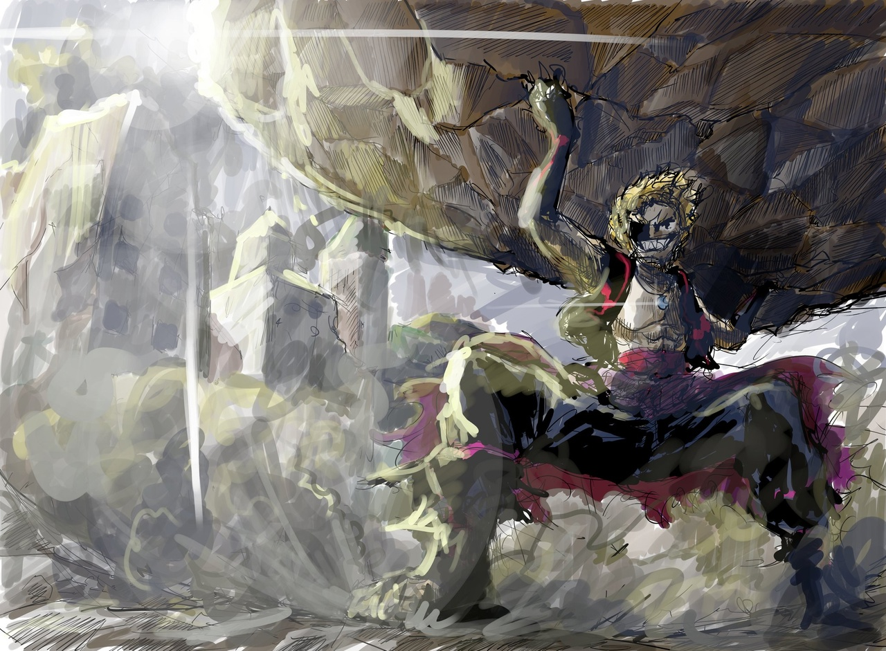
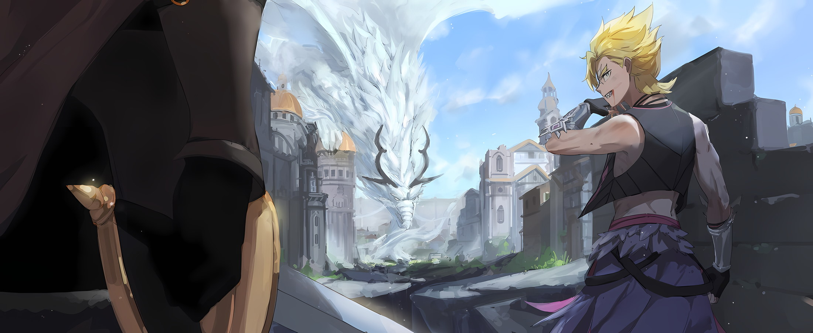
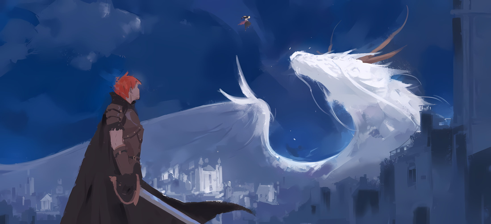

*※※※※※※※※※※※*

Все мышцы его тела запульсировали, а клыки заострились от прилива боевого духа.

Последовавшие за боем толчки раскололи, подкосили улицу, и, когда он твердо ступил на землю, жизненная сила, вытекающая из его подошв, переполнила его душу; глядя прямо вперед, на небо над головой, он впился взглядом в величественную фигуру, расправившую крылья.

Его кровь текла все быстрее, биение сердца становилось все громче и интенсивнее, как будто это был большой барабан, наполняющий энергией само его существование.

Что и говорить…,

???: …ЭТО, МАТЬ ТВОЮ, ЛУЧШЕЕ, ЧТО Я КОГДА-ЛИБО ЧУВСТВОВАЛ!!!

Гарфиэль скрежетнул клыками, пробил ногой дорогу и понесся вперед.

Перехватив небо, он увидел себя отраженным в глазах величественной фигуры… белого «Облачного Дракона»; кровь, плоть и даже сама душа Гарфиэля не могли сдержать оваций.

Будучи стрелой повстанческой армии, он сражался на кулаках с каждой сильной личностью в решающей битве за столицу Империи.

Человек, приблизившийся к «Девяти Божественным Генералам», и человек, занимающий место среди «Девяти Божественных Генералов»; сражаясь с теми, кто, несомненно, был силен, Гарфиэль по-настоящему ощутил долг, возложенный на него как на члена своей фракции.

Возможность сразиться с прославленными «Генералами» Империи Волакия была для воина поистине большой честью.

Однако, получая ценный опыт, он ждал именно этого момента.

Гарфиэль: Наконец-то мне представился шанс сразиться с Драконом!

Для жителя Драконьего Королевства Лугуника, для любого существа, живущего в этом мире, было известно, насколько могущественны и как далеко за пределами человеческих знаний находятся существа, называемые «Драконами».

Конечно, это относилось и к Гарфиэлю. Он знал, что «Драконы» — это не те существа, которых можно измерить логикой мира людей.

Однако и в Сторожевой Башне Плеяд, и в решающей битве за столицу Империи Эмилия получила возможность столкнуться с «Драконом» и великолепно пережила обе эти встречи.

*Эмилия: «Драконы? Да, Волканика и Мезорея были ооочень сильными. У них огромные тела, и вдобавок их дыхание довольно опасно… Они не переставали меня удивлять!»*

Таково было замечание Эмилии, когда она говорила об угрозе «Драконов».

В сочетании с жестами рук Эмилия говорила о том, что «Драконы» — это монументальные существа, но, независимо от вопроса о ее способности выражать мысли, весь масштаб этого так и не был передан.

Разница между этим и словами, которые Эмилия оставила невысказанными, теперь являлась тем, что он испытывал здесь на собственном опыте…

*Мезорея: «…!!!»*

Раскалывая землю под ногами, Гарфиэль яростно сокращал расстояние; навстречу ему, разинув пасть, несся «Облачный Дракон».

Гарфиэль был наготове, ожидая, что сейчас снова будет выпущено дыхание, аналогичное тому, что незадолго до этого испепелило столицу Империи; прицелившись в него, Мезорея выпустил дыхание в соответствии со своим предчувствием.

Однако…,

Гарфиэль: Гх-ах!?

От удара, который сопровождался необычным жаром, не похожим ни на палящий зной, ни на сильный холод, Гарфиэль издал крик боли.

Это произошло сразу после того, как он отпрыгнул в сторону, чтобы уклониться от траектории дыхания Мезореи. Уйдя в сторону от этой траектории, Гарфиэль был атакован вторым дыханием.

Не предпринимая ничего, что могло бы скрыть его действия, было ясно как день, чего хочет добиться его противник.

Дело было не в том, что он выпустил одно дыхание, чтобы махом уничтожить весь этот квартал столицы Империи, а скорее в том, что он разделил его на короткие очереди. Вместо того, чтобы выпустить один длинный выдох, он выпустил два дыхания в быстрой последовательности.

…Нет, не два. Если он делил одно дыхание, то мог сделать то же самое и в третий, и в четвертый раз.

Гарфиэль: Тц!!!

Обжигая левую руку, которая грелась в дыхании, Гарфиэль использовал импульс от прыжка в сторону, чтобы пробить стену частного дома на обочине дороги, и оказался скрыт от взгляда «Облачного Дракона».

Однако перед лицом дыхания «Облачного Дракона» не устояло бы даже каменное строение. Это отличалось от того поросячьего домика, что не был снесен дыханием волка, о котором Субару рассказывал ему в прошлом.

В результате череды дыханий стены дома очень быстро разлетелись на куски; по мере того как уничтожались мебель и вещи, ущерб дошел и до Гарфиэля, который нырнул внутрь дома… по крайней мере, так должно было произойти.

Гарфиэль: ОООООООАААААААГХ!!!

Затем, прежде чем дом, подвергшийся воздействию дыхания, успел превратиться в руины, ревущий Гарфиэль обеими руками вырвал его из-под самой земли и со всей дури швырнул в воздух.

Разлетаясь по улице, дом-пушечное ядро бешено вращалось… как ни странно, Гарфиэль в полной мере использовал ту же тактику, что и Нацуки Субару при эвакуации из столицы Империи. Когда брошенное из этих рук ядро приблизилось к нему, Мезорея сделал особенно сильный выдох.

*Мезорея: «Ты стоишь на моем пути!»*

Ревя с детским выражением лица, которое противоречило его колоссальному и величественному виду, «Облачный Дракон» разнес не долетевший до места назначения дом в щепки.

Однако со стороны Мезореи было бы наивно полагать, что в результате этого он сможет перевести дух.

Гарфиэль: НЫА НЫА НЫА НЫА НЫА НЫА НЫА НЫА НЫА НЫАААА!!!

Защитившись от первого пушечного ядра, Гарфиэль один за другим подхватывал их с планомерно выстроенного городского пейзажа столицы Империи и с огромной силой швырял их в сторону «Облачного Дракона» в небе.

Благодаря сочетанию физической силы Гарфиэля и того факта, что земля столицы Империи размягчилась от многократных ударов, аберрантные ядра были выпущены в быстрой последовательности; наблюдая за этим, Мезорея расширил свои золотые глаза.

*Мезорея: «ТЫЫЫ МЕНЯЯЯ ЧЕРТОООВСКИ БЕЕЕЕЕЕСИШЬ!!!»*

Когда дома-пушечные ядра полетели в его сторону, Мезорея взмахнул крыльями и перехватил их.

Его руки с острыми когтями бешено заметались в воздухе, снеся два дома, а взмахнув хвостом снизу вверх, он одним мощным ударом разрушил целых три здания.

А затем…,

*Мезорея: «…Да сдохни ты уже, черт возьми.»*

Гарфиэль: …Кх.

Используя обломки разрушенных домов в качестве опоры, Гарфиэль взмыл в воздух; заметив неожиданную атаку, Мезорея схватил его и вонзил в него свои Драконьи когти слева и справа.

Оказавшись зажатым по траектории, схожей с ударом кулаками друг о друга перед грудью, находящийся в воздухе Гарфиэль взмахнул своими облаченными в щиты руками с целью парирования; захватив левую руку Дракона своей правой, а правую — своей левой, он принял удары.

Сильный удар прошелся по всему телу Гарфиэля, его стиснутые зубы треснули, а из носа пошла кровь.

Если бы на этом месте был кто-то другой, помимо Гарфиэля, он был бы превращен в кусок мяса, не продержавшись и секунды. От такого исхода усы Мезореи дрогнули, его шок от того, что этот человек не был раздавлен, стал явным.

От такого потрясения Мезореи щеки Гарфиэля начали расплываться в улыбке,

Гарфиэль: Ну как…

*Тебе*; не успел он продемонстрировать свою силу на этих словах, как его тело, все еще удерживаемое двумя руками, получило прямой удар хвоста, который врезался в него прямо сверху… Гарфиэля отбросило с такой силой, что его тело оставило позади все представления о звуке, и, изменяя структуру городского пейзажа с каждым ударом, он крутился снова и снова, пока не врезался в бастион столицы Империи, где и произошла его остановка.

???: Э-эй!? Эй, сопляк!?

Среди плотного шлейфа дыма, повисшего над местом происшествия, человек, который стал свидетелем следов от отскоков Гарфиэля, его шкрябанья и столкновений с землей… Хейнкель подал дрожащий голос.

Мужчина, который не мог ничего сделать, кроме как ошарашенно наблюдать за тем, как «Облачный Дракон» и Гарфиэль сцепились друг с другом, ринулся в сторону последнего: тот получил удар, силы которого, казалось, хватило бы, чтобы превратить сотню обычных людей в фарш.

Хейнкель: Мертв… Ты мертв? Ты должен быть мертв! В таком духе…

Гарфиэль: …Я не позволю ему так просто меня прикончить.

Перед горой развалин голос донесся до Хейнкеля, который вообразил, что скоротечная жизнь была потеряна. В поле зрения Хейнкеля, когда он опешил, развалилась гора обломков, и в ней появилась фигура Гарфиэля с раскинутыми ногами.

Гарфиэль повернулся спиной к бастиону и томно повесил голову, не показывая своего лица. Затем его рот сделал жевательное движение, и он выплюнул свои раздробленные клыки вместе с кровью.

А после…,

Гарфиэль: Аах, твою-то… Они и правда чертовски раздражают, вся эта Драконья херня. Наконец-то я врубился, почему Эмилия-сама говорила о них так мягко.

Покачав головой, он медленно встал.

Пошарив языком по сторонам, он обнаружил, что его зуб, разломанный на две части, никак не хочет заменять себя новым, поэтому он засунул палец внутрь и вырвал его с корнем. Тут же он обнаружил, что под местом удаленного зуба появился кончик нового, и громко хрустнул суставами в шее.

Хейнкель: Неужели тебе это ни о чем не сказало…?

Гарфиэль: Да не может быть, чтобы мне это ни о чем не сказало. Я получил удар от Дракона… Не, даже три удара. Похоже, это случай «Чудесного Выживания Манфроя».

Хейнкель: …

Гарфиэль: Но знаешь, крутой я могу продолжить. …Я рад, что все еще способен на это.

Когда все его тело заныло от приступов боли, как тупой, так и острой, Гарфиэль сжал оба кулака и, прерывисто дыша, озвучил свою гордость.

Приняв на себя натиск Дракона, на голову превосходящего человеческие знания, он все равно устоял на ногах.

Он был искренне рад, что смог это сделать.

Хейнкель: …Какого дьявола, да что, черт возьми, с тобой не так!

Услышав бормотание Гарфиэля, Хейнкель невольно закричал.

Отразившись в широко раскрытых голубых глазах Гарфиэля, мужчина яростно и беспорядочно начал чесать свою голову, и,

Хейнкель: Какого черта ты вернулся? Я не понимаю! Это же Дракон… Это же гребаный Дракон!? Тебе ни за что его не победить. Ты полный идиот, раз пришел сюда! И все равно!

Гарфиэль: Что ж, мы с тобой в одной лодке, мужик.

Хейнкель: А…?

Гарфиэль: Я пытаюсь сказать, что если находиться здесь и противостоять Дракону — это то, что сделал бы только идиот, то разве это не относится и к тебе, мужик?

Потеряв дар речи от этих слов, Хейнкель остановил руку, которой чесал свою голову, и удивленно уставился на него.

Его поведение полностью говорило о том, что не стоит связывать их вместе, но если это действительно так, то он был безнадежен. А все потому, что в руке Хейнкеля, противоположной той, что чесала его голову,

Гарфиэль: Ты все еще держишься за свой меч, не так ли?

Хейнкель: …

Гарфиэль считал это доказательством того, что у Хейнкеля было слабое желание, которое он не отбросил.

Возможно, он просто не смог разжать пальцы от страха. *…Нет. Постарайся понять.*

Возможно, он забыл про себя и просто нес его. *…Нет. Постарайся понять.*

Возможно, в этот момент он как раз собирался спрятать его в ножны и убежать. *…Нет. Постарайся понять.*

Слабые мысли, подавленный дух, причины, по которым его охватывает страх, — он хочет понять все это.

Обдумав абсолютно все, он продолжал пытаться понять, потому что верил, что лицо мужчины станет целостным только в том случае, если он стиснет зубы, превозмогая боль, и встанет, чтобы бороться за желания других.

Гарфиэль: Капитан и Оттобро — тоже. Это касается и крутого меня.

Хейнкель: Я… я…

Хейнкель, дрожа, опустил взгляд на свою руку, которая все еще сжимала меч. Не сводя с него глаз, Гарфиэль энергично стукнулся спиной о бастион и выпрямился.

Затем, обращаясь к Хейнкелю, который так и не выпрямился,

Гарфиэль: Ты же спросил, почему крутой я вернулся, да?

Хейнкель: …А?

Тихий голос Гарфиэля заставил его расширить глаза.

Хейнкель замер в ожидании последующих слов, но Гарфиэль продолжил не словами, а ударом кулака ему в грудь, отправив того в полет.

Хейнкеля отбросило в сторону, а на улице начался масштабный переполох.

В следующее мгновение дыхание «Облачного Дракона» вырвалось из воздушной среды города, и оно стремительно приблизилось к Гарфиэлю, стоявшему спиной к крепостным стенам… Подпрыгнув, Гарфиэль сумел от него уклониться.

Гарфиэль: О, ОООООО…!

Прижавшись спиной к стене, Гарфиэль взлетел прямо вверх, а преследующий его раскаленный луч белого дыхания начал подниматься вверх. Опаляя городской пейзаж и превращая бастион в пыль, дыхание поднималось все выше, выше и выше, пока Гарфиэль поднимался в небеса над головой.

Оно обжигало пальцы ног Гарфиэля, и, прежде чем смогло полностью сжечь его тело,

Гарфиэль: Это все потому, что Капитан мне так сказал.

Когда дыхание Дракона, пытающегося опалить мир, коснулось подошв его ног, в голосе его не было и намека на раздражение. Зато присутствовала гордость за то, что он откликнулся на доверие.

Изогнувшись в воздухе, Гарфиэль уперся ногами в часть стены, которая все еще сохраняла свою первоначальную форму. …Сразу же после этого он оттолкнулся от нее с такой силой, что в ней образовался кратер, и полетел вперед.

Вперед, вперед, вперед, в сторону «Облачного Дракона», который парил в небе столицы Империи, и, с широко раскрытой пастью, когда его недавно выросший острый клык грелся на ветру…,

Гарфиэль: …Он сказал, что крутой я должен пойти и завалить громогласного Дракона, что летает в небе!!!

*Мезорея: «…Рах!?»*

Пролетев над дыханием и приблизившись к «Облачному Дракону», Гарфиэль нанес удары обеими своими ранеными руками, и разрушительная сила пушечного ядра настигла нос Мезореи.

Звук, такой же громкий, как от взрыва склада, набитого магическими камнями, разнесся по небу; получив прямой удар, «Облачный Дракон» был отброшен назад, и в следующее мгновение у него хлынула кровь.

Из разбитой морды Дракона потекла кровь, и, будучи впечатанным обратно в землю от отдачи собственного кулака, Гарфиэль грелся в лучах величия своего поступка. Упиваясь этим, Гарфиэль рассмеялся.

Гарфиэль: Тха-ха-ха-ха! Я пошел и пустил Дракону кровь из носа!

*Мезорея: «Ты, маленький!!!»*

Мезорея пришел в ярость от невозможного унижения, и, увидев его состояние, Гарфиэль рассмеялся еще сильнее.

Будучи отброшенным и спасенным от дыхания Дракона, Хейнкель сидел ягодицами на земле, оцепенело глядя на происходящее,

Хейнкель: …Он не в своем уме.

Пока Хейнкель что-то слабо бормотал, грянула битва между Гарфиэлем и Драконом… и это произошло примерно в то же время, что и изменения в атмосфере аналогичного масштаба в разных других местах столицы Империи.

Словно не обращая на это никакого внимания, развернулся бой между тигром и Драконом, и при виде этой сцены Хейнкель не смог пошевелиться.

Не в силах бежать, не в силах даже встать, он не сдвинулся ни на сантиметр.

…Но его правая рука по-прежнему держалась за меч.

*△▼△▼△▼△*

…Поворачиваем время вспять, на небольшой отрезок времени до завершения битвы между Драконом и тигром.

???: …

Ощущение холодной воды, попавшей на его щеки и лоб, заставило сознание Субару полностью прийти в себя.

Он не испытывал ни сонливости, ни физической усталости. И все же, словно по щелчку, он почувствовал, как что-то внутри него переключилось — после чего глубоко выдохнул.

Перед ним, на поверхности воды в корыте, виднелось его собственное потрясенное и подавленное лицо. Это было лицо с острыми глазами, которое сохранило свою молодость, или, скорее, его можно было назвать детским.

Он уже привык его видеть, однако он также не хотел думать, что может позволить своему лицу оставаться таким. Размышляя об этом, он осторожно погладил свое лицо пальцами…,

???: Субару, ты в порядке? Может, что-то случилось?

Вдруг рядом с ним раздался голос, и Субару оторвал взгляд от корыта с водой. Перед его поднятым лицом стояла Эмилия, которая смотрела на него своими прекрасными аметистовыми глазами.

Сердце Субару дрогнуло от неожиданности, когда он увидел лицо Эмилии так близко от своего собственного,

Субару: Я-я в порядке, Эмилия-тан. Просто мне нужно было немного расслабить щеки. Видишь ли, я всегда хочу демонстрировать Эмилии-тан только свою лучшую улыбку.

Эмилия: Я не привередлива. Если это не вынужденная улыбка, то я буду рада любой твоей улыбке, Субару…

Субару: Ооох, что-то сердце заколотилось… тук-тук.

Сказанные с прижатым к губам пальцем, слова Эмилии, в которых не было и намека на притворство, выбили Субару из колеи. Когда он попытался вытереть лицо рукавом, чтобы скрыть свои покрасневшие щеки, сбоку ему предложили полотенце для рук. …Беатрис и Танза протянули ему по два полотенца слева и справа.

Эти двое были шокированы тем, что их собственное действие повторил кто-то другой, и их обычно круглые глаза стали еще круглее, а затем вдруг резко сузились,

Беатрис: Оленина, Субару хочет полотенце Бетти, в самом деле. Ты можешь забрать его обратно, я полагаю.

Танза: Шварц-сама ничего подобного не заявлял. Говорить о своих мыслях так, как будто они принадлежат Шварцу-сама, не слишком ли ты далеко зашла?

Беатрис: Арггхх, такая несносная девчонка, в самом деле!

Субару: Стойте-стойте-стойте-стойте, почему вы ссоритесь! Смотрите, я использую оба! Я вытираю левую и правую стороны своего лица полотенцами от вас обоих.

Вмешавшись во внезапно вспыхнувшую ссору, Субару попытался разрядить обстановку, используя оба полотенца, которые он получил от этой пары. Однако те просто вздохнули, услышав его ответ. Ему не удалось разрешить спор.

При виде Субару, плечи которого поникли, Эмилия, положив руки на бедра, сказала: «Серьезно»,

Эмилия: Беатрис и Танза-чан, прекратите доставлять Субару неприятности. Учитывая трудности, с которыми он постоянно сталкивается, Субару вот-вот рухнет…

Субару: Ох, забота Эмилии-тан так трогательна… при этом я не хочу сказать, что вы оба не заботитесь обо мне, ясно? На самом деле, вы двое всегда мне помогаете… чем больше я говорю об этом вслух, тем сильнее кажется, что я оправдываюсь, не так ли!?

Беатрис: Боже мой, я полагаю.

Танза: Как и ожидалось от Шварца-сама.

Видя, что Субару на пределе, Беатрис и Танзе ничего не оставалось, кроме как смягчить свое отношение.

Неожиданно оказавшись в роли злодея, Субару в знак протеста наклонил голову, но, получив нежные поглаживания Эмилии по голове, решил смириться со своим затруднительным положением.

В любом случае…,

Субару: Я не строю из себя храбреца, со мной действительно все в порядке, Эмилия-тан. Прежде чем мы отправились в путь, я смог как следует отдохнуть в крепости… кроме того, если я по неосторожности упаду от недосыпания, весь Эскадрон Плеяд окажется на волоске.

Объединенный эскадрон представлял собой группу с неудержимым энтузиазмом, однако их объединяло присутствие Субару… «Кор Леонис», которым нельзя было похвастаться.

И этот эффект был бы прерван, если бы Субару заснул или потерял сознание, а потому с этого момента он не мог позволить себе беззаботно дремать.

Субару: Я понимаю это, так что все в порядке. Поверь мне, Эмилия-тан.

Эмилия: Правда? В таком случае это прекрасно, но можешь ли ты пообещать мне, что не будешь переусердствовать?

Субару: Эмилия-тан совсем мне не доверяет…

Эмилия: Если тебе интересно, почему так происходит, то попробуй обратиться к своей совести.

Доверие — это накопление прошлых поступков. Таков был подтекст замечания Эмилии, и это оставило Субару в растерянности.

Впрочем, тело и разум Субару были в настолько хорошей форме, что он и сам был удивлен. По всей видимости, из-за чрезмерного напряжения его разум был настолько бдителен, что, как только нынешний конфликт будет полностью разрешен, этот долг вырвется наружу и разом опрокинет все вокруг.

Однако, если ему удастся со всем справиться за счет одолженной энергии, он был более чем готов взять на себя последующий долг.

…В настоящее время, покинув Укрепленный Город и направившись в столицу Империи Рапгану, «Отряд по Спасению Империи Волакия от Гибели» находился в процессе обмена драконьими повозками, чтобы обеспечить свое прибытие в пункт назначения.

По пути из Гарклы в Рапгану, остановившись в одном из многочисленных лагерей, разбросанных по маршруту, Авель и другие стратеги изучали военную ситуацию, а измотанные наземные драконы менялись на тех, кто был в идеальном состоянии, в рамках подготовки к решающей битве.

Субару: Конечно, Патраш всегда будет с нами.

Протянув руку, Субару прикоснулся к своему любимому черному дракону, который был запряжен в повозку… Патраш, чью шею он сейчас гладил.

Благополучно воссоединившись с Субару в Империи, Патраш, не собираясь сдерживаться, даже невзирая на его уменьшение, нанесла ему мощный удар хвостом в отместку за то, что он заставил ее волноваться.

Этот удар, от которого он с громким стуком врезался в стену, напомнил ему о травмах, которые он получил в бою с Гилтилоу во время «Спарки» на Острове Гладиаторов, и он был рад, что все закончилось только одним ударом.

С тех пор, приняв искренние извинения Субару, она выкладывалась по полной, чтобы сопровождать их.

???: …Хех, этот молодой наземный дракон, она ведь одна из вас, не так ли?

И тут к месту, где резвились Патраш и Субару, подошел Халибель.

Высокий шиноби-оборотень, зажав кисэру между большими зубами, покачивал ее губами вверх-вниз,

Халибель: Когда я сражался с зомби-Драконом, она проделала великолепную работу, и я подумал, что это достойно восхищения.

Субару: Ооо! Халибель-сан в курсе, что наша Патраш просто восхитительна!

Халибель: Это правда. Ты счастливчик. …Маленькая Ана и остальные волнуются за тебя.

Субару был несказанно рад получить открытое одобрение от самой сильной и известной личности из Городов-государств, Халибеля. Его глаза широко раскрылись при этих словах, а затем он искренне кивнул.

Ему не нужно было говорить об этом, но упоминание этого факта заставило его снова задуматься. …Он был поистине благословлен.

Те, кто находился в лагере Эмилии, вместе с Юлиусом и Анастасией, не только преодолели различные неблагоприятные препятствия, чтобы попасть в Империю, но и согласились с эгоистичной просьбой Субару довести дело до конца.

Это было так надежно и ободряюще, но он не смог выразить им должной благодарности.

Субару: Вот почему я должен сделать все, что в моих силах.

Эмилия: Субару? Обещание, которое ты мне дал, ты ведь помнишь его?

Субару: Я помню, помню, никаких безрассудств! Но что, если вдруг…?

Эмилия: Снова повторять это было бы слишком невыносимо.

Надув губы, Эмилия нахмурилась, глядя на Субару, который почесывал щеку.

Халибель, смеясь, похоже, действительно наслаждался этим зрелищем. Несмотря на то, что впереди его ждала битва за существование Империи… а возможно, и за существование всего мира, он сохранял решимость.

???: Халибель-доно, увееерен~, вы не хотите, чтобы Субару-кун это услыыышал~.

Беатрис: Он здесь, в самом деле.

???: Конечно, раз мы вместе, почему бы мне не быть здееесь~. Хотя мне бы очень хотелось, чтобы Империя уже признала меня своим союююзником~.

Недоверчиво пожав плечами, Розвааль усмехнулся отношению Беатрис.

Когда он появился на краю лагеря, где была припаркована драконья повозка, Эмилия наклонила голову, спрашивая: «Ты уверен?».

Поскольку Розвааль на данный момент в большей или меньшей степени отвечал за разведку в лагере Эмилии, предполагалось, что он будет сопровождать Авеля во время его бесед с представителями лагерей.

Эмилия: Хотя я и считаю Розвааля достойным союзником, интересно, разделяют ли это мнение другие люди, такие как Авель…

Розвааль: Если так, то я в довольно затруднительном положении, поскольку, похоже, мне нет места ни в Королевстве, ниии~ в Империи. …Не волнуйтесь, в настоящее время Его Превосходительство Винсент обращается к солдатам поблизости, и они уже вступили в фазу поднятия своего боевого духа. В любом случае, я бы только мешааал~.

Эмилия: Ясно. Приятно слышать. И не переживай, законное место Розвааля рядом с нами. Это до тех пор, пока Розвааль не попытается выкинуть какую-нибудь хитрость.

Приоткрыв губы, Эмилия дала ангельский ответ на самоуничижение Розвааля.

Однако на эти слова Розвааль лишь криво усмехнулся, не отвечая на вопрос о том, будут ли от него какие-либо неприятности, что было весьма показательно.

Субару: Меня бесит, что все так удачно складывается для триумфального возвращения Авеля.

Сказав это, Субару бросил взгляд в сторону центра лагеря, откуда доносились радостные возгласы множества имперских солдат.

Вместо криков, поднимающих боевой дух и призывающих готовиться к битве, раздавались радостные возгласы людей, которые были так тронуты тем, что к ним обратился сам Император, которому они служат.

Неудивительно, что кислое лицо Авеля, с которым Субару был не только знаком, но и даже устал его видеть, являлось чем-то, что большинству граждан Империи не позволялось лицезреть вблизи.

Субару: Если бы я оказался в таком же положении, как эти люди, и не знал бы ничего, кроме лица и имени Эмилии-тан, что бы я чувствовал… о, нет, я сейчас расплачусь только от одной мысли об этом.

Эмилия: Что случилось, Субару, разве ты не должен быть моим Рыцарем? Возьми себя в руки!

Субару: Я знаю, ты права! Это ж не сон, в конце концов! Блин, это был очень нелегкий путь, и все из-за Авеля.

С тихим замечанием, которое заставило бы Авеля нахмуриться, услышь он его, Субару приветствовал тот факт, что идея Императора сама по себе принесла желаемый результат.

С другой стороны, Медиум пытались выставить в качестве потенциальной Императрицы, не заботясь о ее чувствах, поэтому нельзя было не воздержаться от похвалы.

Субару: Благодаря тому, что Спика постоянно находится рядом с ней, Медиум-сан, надеюсь, сможет немного отвлечься от всего этого… Этот придурок, что, черт возьми, по его мнению, означает брак?

Эмилия: Это точно. Я думаю, что Авель ооочень умный, но эта часть его взглядов не так уж и хороша.

Субару: За такое его надо вышвырнуть с трона.

Субару и Эмилия кивнули в унисон, соглашаясь с тем, что Авель в этом плане безнадежен. При виде этих двоих Халибель снова засмеялся,

Халибель: Они встают против Императора Волакии, эти дети точно не знают страха.

Беатрис: Не имеет значения, каков противник, пока Бетти рядом с Субару, у него нет причин бояться, я полагаю.

Танза: То, что Его Превосходительство Император бессердечен, известно всем, ведь он отверг Йорну-сама.

Розвааль: Воистину, мы бы не хотели, чтобы народ Империи услышал этот разговооор~.

В лагере, охваченном волнением по поводу триумфального возвращения Императора, где злословие в его адрес неизбежно привело бы к кровопролитию, Розвааль усмехнулся на фоне резких комментариев в адрес Авеля. С язвительной улыбкой Розвааль закрыл один глаз и сказал: «Итак»,

Розвааль: Раз он так и не появился, несмотря на все эти разговоры, Гарфиэль, похоже, очень сосредоточен. …После того, как Субару-кун выбрал его для выполнения грандиозного задания, кажется, он достаточно мотивииирован~.

Субару: …Да.

Розвааль перевел взгляд желтого глаза на Субару, который кивнул в ответ на его слова.

Гарфиэль, который в данный момент не участвовал в разговоре с Субару и остальными, находился внутри драконьей повозки, прицепленной к Патраш, и тихо медитировал, повышая свою концентрацию.

Это свидетельствовало о том, что он всеми силами старался оправдать ожидания Субару. …Чтобы оправдать ожидания Субару, который попросил его сразиться с «Облачным Драконом» Мезореей.

Субару: Он очень проворен, а его разрушительная сила просто удивляет, поэтому я хочу сделать что-то, чтобы сдержать движения Мезореи. В настоящее время Гарфиэль больше всех подходит для выполнения этой обязанности.

Халибель: Могу я спросить, почему? Маленькая Ана велела мне пока следовать твоим указаниям, однако… Я сильнее этого тигренка, ты ведь в курсе?

В ответ на суждение Субару Халибель наклонил голову и выдохнул дым.

Если бы его возмущало то, что его способности недооценивают, Субару, возможно, пришлось бы придумывать оправдание, однако манера речи Халибеля оставалась ровной.

Он просто задал вопрос о боевом потенциале, и Субару машинально откинул подбородок назад,

Субару: Нет сомнений, что Халибель-сан — сильнейший среди всех нас. Вопрос состоит в том, чтобы поставить нужного человека в нужное место… вернее, есть кое-кто еще, кого бы я хотел, чтобы Халибель-сан покорил.

Халибель: Ой-йой, как же пугающе. Отложить Дракона, чтобы сосредоточиться на ком-то другом… ты хочешь сказать, что есть кто-то еще более проблемный, чем Дракон?

Субару: В некотором смысле да.

Субару, зная, что нет смысла ходить вокруг да около, четко подтвердил это.

Услышав утверждение Субару, Халибель на мгновение закрыл рот. Но его характерный для людей-волков большой рот тут же искривился в улыбке,

Халибель: Ясно, ясно. Ну что ж, тогда мне тоже нужно хорошенько набраться сил.

Таким образом, он принял указания Субару, демонстрируя готовность их выполнить.

Эмилия: Гарфиэль и Халибель-сан… вдобавок, есть также места, куда ты хочешь, чтобы мы пошли, и дела, которые ты хочешь, чтобы мы сделали.

Как только обмен репликами между Халибелем и Субару подошел к концу, Эмилия с серьезным выражением лица посмотрела на последнего. Когда она коснулась пальцами магического кристалла на своей груди, ее аметистовые глаза пронзили его насквозь.

Эмилия была не единственной. Беатрис, Танза и Розвааль тоже смотрели в его сторону.

Субару: Верно. Для всех здесь присутствующих… включая группу Авеля на другой стороне, — это будет тотальная война.

Беатрис: …К счастью, у Субару есть общее представление о местонахождении врага, в самом деле.

Эмилия: Действительно. Хм, он также использовал его в Сторожевой Башне Плеяд, эту особую силу, называемую Полномочием.

Субару: Да. Именно благодаря этому.

В ответ на слова Эмилии и Беатрис Субару стукнул себя кулаком в грудь.

Достижения «Кор Леониса», которые были продемонстрированы в Сторожевой Башне Плеяд… определение местонахождения разлученных товарищей, которое помогло им справиться с проблемой внутри башни, являлось тем, во что Субару заставил поверить Эмилию и остальных.

Враги, поджидающие в столице Империи Рапгане… чтобы противостоять этим грозным противникам, Субару заставил их поверить в «Ложь» о том, как он получил знания о наилучших вариантах того, куда отправить каждого человека.

Субару: …Я сделаю все, что в моих силах.

Эмилия, Беатрис, Спика, Танза, Гарфиэль, Розвааль, Халибель, Авель, Медиум, Джамал, Ольбарт — он направит их всех.

Используя каждую карту, имеющуюся в его руке, чтобы выйти победителем в этой битве за столицу Империи…,

Субару: Конечно, я рассчитываю и на тебя, Патраш.

Протянув руку, Субару снова погладил Патраш по шее, и та жалобно заскулила в ответ.

При звуке голоса Патраш всеобщее настроение поднялось, а затем…,

Розвааль: …Субару-кун, это же лучший вариант действий, верно?

Розвааль твердо, пристально посмотрел на Субару.

На вопрос Розвааля Субару глубокомысленно кивнул и ответил.

Субару: Да, так будет лучше всего… Я уже убедился в этом.

Нацуки Субару просто делал то, на что был способен.

Таким образом, это не должно было стать нарушением его обещания Эмилии «не переусердствовать»; вот как он думал.
