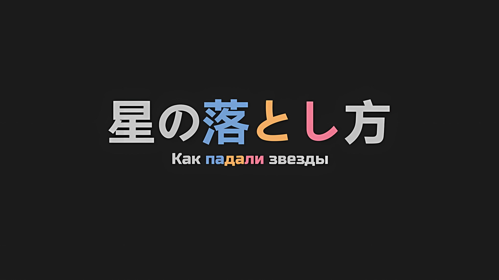
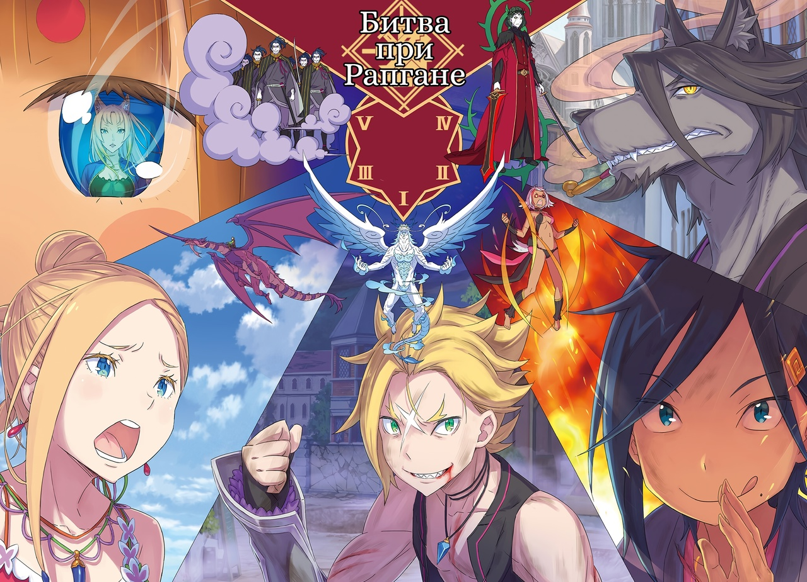

*※※※※※※※※※※※*

…Таким образом, время вновь вернулось к тому моменту, когда на поле боя возникла схватка между тигром и Драконом.

Взяв штурмом южные ворота столицы Империи Рапганы, являющиеся первым бастионом звездообразной крепости, Гарфиэль сразился с тем, кто правил небесами…… с «Облачным Драконом» Мезореей.

Вдалеке в небе виднелось странное скопление облаков — это свидетельствовало либо о том, что «Облачный Дракон» разбушевался, либо о том, что он готовится продемонстрировать свою максимальную мощь.

Как бы то ни было, жребий был брошен, и битва за то, чтобы он оказался на нужной стороне, началась.

Поручение Гарфиэлю возглавить атаку, чтобы он с самого начала подавил Мезорею, было связано с тем, что мобильность и агрессивность «Облачного Дракона» служили самым большим препятствием в битве за захват столицы Империи.

Один удар «Дракона», способного взлетать на большую высоту и атаковать на огромные расстояния при помощи своего дыхания, был бы непосилен для тех, кто не обладал необычайной боевой мощью.

Если бы в них безрассудно палили, а они ничего бы не могли с этим поделать, то это был бы самый худший исход для «Отряда по Спасению Империи Волакия от Гибели». …Гарфиэль сумел подавить эту возможность.

Однако, даже если Мезорея будет усмирен, все остальное отнюдь не пройдет гладко.

В случае ошибки в ответной атаке на них могли напасть другие «грозные враги», способные одним движением нанести катастрофический урон.

Поэтому…,

???: ООААААААХ!!!

Вопреки этому вульгарному боевому кличу, мечи-близнецы прочертили изящную траекторию.

С мастерством фехтования, прикрывающим его спереди и сзади, проворными движениями и ловкой стойкой, он с силой парировал острие алебарды противника, заставив его нарушить свою позу.

В тот же миг трепещущий клинок рассек ветер и смертельно перерезал шею противника…,

???: Идиот, не убивай их!

???: Ууооох!?

Когда вмешавшийся голос попытался удержать его, траектория движения его меча мгновенно изменилась.

Клинок, который должен был обезглавить противника, вместо этого рассек его левую руку от плеча; выдержав удар, враг стремительно отпрыгнул назад и, держа алебарду только правой рукой, попытался начать следующую атаку.

Но эта алебарда не достигла бы никого из его союзников.

???: ……«Повелитель Белых Облаков», Гаоран Пейcит.

Гаоран: ……

Тихий, но отчетливо слышимый мужской голос произнес как имя, так и псевдоним нежити.

В этот момент движение крупной белобородой нежити, которая должна была устремить алебарду вперед, было остановлено. Не упустив такой возможности, ряд из трех маленьких фигур подобрался к нежити вплотную.

Затем они сцепились взглядами с нежитью, которая смотрела на них сверху вниз. …Они смотрели в глаза, отрешенные от глаз живых, с белыми частями, окрашенными в черный цвет, и золотыми радужками, маячившими внутри.

А затем…,

???: Гаоран Пейcит!!!

???: Ияоо аеиа.

Снимая это с когда-то жившего существа, звезда, известная как Спика, съела роль, которая использовала его в качестве нежити.

Пролетев мимо него со скоростью, которая, казалось, сметет улицу, позади Спики, успевшей коснуться его своей маленькой рукой, когда она съела его роль, нежить… нет, тело Гаорана Пейcита превратилось в пыль.

Гаоран: …

В конце концов, воткнув свою алебарду в землю, он поклонился тому, кто назвал его имя.

Правда, было непонятно, какие именно эмоции заставили увядающую нежить сделать это.

???: Атлем Неви, Дифон Тревола, Гайон Тальфу, Леска Брейн, Ниольф Традд, Ярен Суокер, Веллум Джойто…

Тот же голос, что назвал имя Гаорана, стал выкрикивать и другие имена.

Из-за скорости создавалось впечатление, что он просто перечислял имена, которые приходили ему на ум, однако это было не так. То были имена людей, у каждого из которых, несомненно, имелась своя собственная жизнь.

Именно такими были имена появляющейся друг за другом нежити, желающей перехватить «Отряд по Спасению Империи Волакия от Гибели», который двигался по столице Империи.

Этих людей, чье состояние и внешний вид полностью изменились с тех пор, как они были живы, черноволосый Император… Винсент Волакия называл по именам, не ошибаясь ни в одном человеке и освещая тем самым путь для «Звездного Поедания».

Но что особенно раздражало, так это…,

???: Не слишком ли это круто, черт возьми!

???: В таком случае, Бетти не может позволить Субару проиграть, я полагаю!

Когда щеки Субару исказились при виде того, как Авель импозантно исполняет свой долг, Беатрис потянула его за руку.

Посреди столицы Империи, где бродила нежить… нет, посреди Рапганы, ныне ставшей столицей нежити, она направляла Субару своей неизменной внешностью и неизменной любовью; взмахнув подолом своего великолепного платья, Беатрис была поистине надежна.

Выставив руку, противоположную той, что была крепко сцеплена с Субару, в сторону улицы, она своими милыми губами и прекрасным голосом сплела магию, направленную на мертвецов, которые преграждали им путь.

Беатрис: Эль Минья!!!

Одновременно с произнесением заклинания из ладони Беатрис вырвались аметистовые кристаллы, которые заскользили по воздуху; лишая нежить рук, ног и оружия, они снижали их боевую мощь.

Магия Тени Беатрис могла атаковать нежить уникальным способом, но полное уничтожение противников противоречило цели их стратегии.

Именно поэтому они намеренно снизили ее силу; воспользовавшись мощью своей прекрасной партнерши, Субару прыгнул вперед. Затем, на противоположной стороне его правой руки, которая была связана с Беатрис… когда он изо всех сил потянул вверх свою левую руку, которая так же была связана со Спикой,

Субару: Начали! Атлем Неви, Дифон Тревола, Гайон Тальфу, Леска Брейн, Ниольф Традд, Ярен Суокер…

Спика: Ау! Уу! У~у! Аау! Уау! Уу~уу~!

Авель называл имена, точно перечисляя их в правильном порядке и сопоставляя с лицами каждой враждебно настроенной по отношению к ним нежити, а также он позаботился о том, чтобы Спика непременно до них добралась.

Спика также понимала свою роль и, протягивая руки по мере приближения нежити, иногда касалась, иногда пронзала, иногда твердо ударяла, иногда толкала, но во всех случаях она активировала Полномочие «Звездного Поедания».

Субару: Ласт ван*! Веллум Джойтооо!!!

* Last one — последний.

???: Ияоо аеиа.

Спереди последовал удар меча, нацеленный на то, чтобы раскроить Субару лоб, и, обменявшись взглядом с бледным, морщинистым лицом нежити, которая его наносила… с Веллумом Джойто, Субару стиснул моляры.

Не успело лезвие противника достичь его лба, как оно было остановлено кристаллизацией, распространившейся от плеч до бедер, лишив его возможности двигаться.

Благодарный Беатрис за прикрывающий огонь, Субару обратился к Спике, и ее рука коснулась груди Веллума.

Затем нежить медленно превратилась в пыль с выражением удовлетворения на лице.

Субару: Бха, хаах…

Убедившись, что они нейтрализовали всю нежить в округе, включая Веллума, Субару глубоко вздохнул.

Этот ближний бой, похожий на переход через мост, напомнил Субару о тех жестоких днях, которые он провел на Острове Гладиаторов. Сделав глубокий вдох, он похлопал по спине Спику, которая посмотрела на него со звуком «Аау~?», а затем выдохнул.

В отличие от Спики, Беатрис положила руки на бедра и уставилась на Субару,

Беатрис: В самом деле, ты слишком много на себя берешь! Я полагаю, Бетти говорила, что хочет, чтобы ты выглядел круто, прилагая при этом большие усилия. Однако Бетти не хочет увидеть твою смерть, даже если она будет крутой, в самом деле.

Субару: Знаю. Только что я сделал рисковый ход, который предполагал последующую поддержку от Беако. Мне жаль, что я так поступил.

Беатрис: …Если ты понимаешь это, то все в порядке, я полагаю.

Когда Субару извинился, Беатрис, находившаяся в режиме ругани, надула губы.

Хотя они не могли провести долгое совещание по оценке ситуации, на ее лице все равно явно читалось разочарование. Однако это не было похоже на то, что он бездумно впустил ее слова в одно ухо, а выпустил из другого. Ругань Беатрис была советом, который он должен твердо принять.

Даже сейчас он чуть не умер от того, что ему раскроили лоб. Если бы он сделал еще хоть один шаг вперед; эта мысль заставила его содрогнуться. …Такая смерть была бы бесполезной.

Винсент: Ты чуть не погиб, бросившись бежать, как только началась битва. Не действуй опрометчиво.

Субару: Ты…

Отруганный Беатрис и высоко ценимый Спикой, Субару скорчил гримасу, обернувшись на это лишенное всякого смысла заявление. Стоя со скрещенными руками, Авель даже не попытался помочь Субару и остальным двоим в их нелегкой схватке.

Субару был весьма впечатлен освежающим видом Императора, который полагался на других.

Субару: До сих пор случалось всякое, но я никогда не думал о тебе как об Императоре, даже сейчас.

Винсент: Мы только что расправились с небольшой работой. Ради тех двоих, что сейчас стоят рядом с тобой, я пропущу этот комментарий мимо ушей.

Субару: Знаешь, будет лучше, если ты поймешь, что с точки зрения постороннего человека ты выглядишь как ужасный представитель знати, который просто сложил руки и смотрит, как дети идут в бой.

Император, созерцающий битву между детьми и нежитью, представлял собой зрелище сродни неприглядному развлечению в постапокалиптическом мире после пандемии зомби. Существует предел тому, насколько плохой может быть репутация человека.

Но, учитывая положение Авеля, его роль и боевую мощь, Субару, как человек, путешествующий рядом с ним, должен был быть благодарен за то, что он не отправился на передовую, так что это была настоящая дилемма.

И, в связи с этим…,

???: Тц, мы решили вопрос с дозором сразу после входа в столицу Империи, но… с этим методом ничего не поделаешь, времени уйдет много.

Сказав это, Джамал провокационно плюнул на землю.

Сразившись со множеством нежити, он внес большой вклад в победу на начальном этапе битвы; держась за свои мечи-близнецы, он поправил повязку на глазу, осматривая окрестности.

Джамал: Хотя было бы гораздо быстрее, если б мы просто кромсали каждую встречную нежить. Так почему же мы этого не делаем?

Беатрис: …Какой же упорно не слушающий человечишка, в самом деле. Если бы мы так поступили, то не смогли бы воспользоваться Полномочием Спики, чтобы дать нежити «Дзебуцу*», я полагаю.

* Дзебуцу (ジョーブツ) — японское слово на катакане, которое означает мирную смерть, уход от сожалений и привязанности к миру, попадание в рай, а также оно имеет применение в буддизме.

Джамал: А? Че еще за дзебуцу?

Беатрис: В самом деле, это способ гарантировать, что нежить не воскреснет после многочисленных поражений! Тебе это уже миллион раз объясняли, я полагаю!

Беатрис в отчаянии затопала своими короткими ножками по земле, а Джамал сделал озадаченное лицо в ответ на ее призыв. От такой реакции лицо Беатрис покраснело еще больше, но, к сожалению, это не стоило усилий, поскольку голова Джамала отвергала любые мало-мальски сложные рассуждения, независимо от того, сколько раз ему их объясняли.

По этой причине…,

Винсент: Джамал Орели, повинуйся этим людям. Это наилучший вариант действий, ибо я сам так рассудил.

Джамал: Если так велит Ваше Превосходительство, то я сделаю все, что вы пожелаете!

Беатрис: Грррр, в самом деле…!

В конце концов, Авель вмешался, предлагая вкусное угощение, а Джамал ответил деньгами наготове; увидев это, Беатрис в досаде скрежетнула зубами. Как мило.

Поскольку этот обмен репликами малость успокоил Субару, Спика прекратила поглаживать его по спине и взглянула ему в глаза.

Спика: Уау?

Субару: А, я в порядке. А как насчет тебя, Спика, у тебя есть какое-нибудь странное ощущение или что-то в этом роде?

Спика: Уу! Аауу!

На этот вопрос Спика скорчила гримасу, передающую ее нежные чувства, и, чтобы успокоить Субару, она выпятила грудь, демонстрируя, как у нее все хорошо. Поскольку казалось, что в ее лице нет лжи, Субару крепко сжал свой кулак, радуясь тому, что «Звездное Поедание» не причиняет Спике никакого вреда, а также тому, что их операция идет полным ходом.

Увидев боковой профиль Субару, Авель сузил свои черные глаза, и,

Винсент: Хотя это и вызывает негодование, но, похоже, твое суждение попало в точку.

Субару: Не понимаю, с чего бы тебе негодовать, но что ты имеешь в виду?

Винсент: Нужно ли мне вообще говорить об этом? …Основные силы вражеской армии направляются в Укрепленный Город, где находится большая часть наших военных активов. То, что сейчас осталось в столице Империи, — это часть нежити и солдат, которые непригодны для войны.

Субару: …Да. Они оставили позади тех, кто не может действовать сообща. Меня бесит, что каждый из них силен, но этот несчастный Путь Империи выгоден для нас.

Оценив состояние столицы Империи, Авель высказал такое суждение, на что Субару кивнул в знак согласия.

Как и сказал Авель, основные силы нежити большой армией осаждали Укрепленный Город. Те, кто остался, были заперты в сильном городском форте и привлекали внимание противника… если они приложат столько усилий, сколько смогут, то появится надежда, что численное превосходство в столице Империи будет сглажено.

Суть этой стратегии заключалась в блицкриге с целью разгрома лидера в столице Империи, пока враг был отвлечен Укрепленным Городом.

При этом если враги Укрепленного Города делали упор на «количество», то в столице Империи упор ставился на «качество».

Начиная с «Облачного Дракона», Мезореи, который покрывал небо столицы Империи, остальные бойцы, оставленные для защиты города, по силе были равны тысяче, причем все они являлись трансцендентными существами, обладающими невероятной силой.

Именно поэтому…,

Субару: …Атакуя каждый бастион одновременно, мы получим отвлекающий маневр второго этапа.

Когда Субару произнес эти слова, Авель, Беатрис и Спика напряглись.

В настоящее время Субару и его группа находились на северо-западе столицы Империи… в окрестностях пятого бастиона. Он слышал, что именно благодаря достижениям Гарфиэля в битве за столицу Империи здесь была сильно разрушена звездообразная стена.

Он не мог в должной мере оценить, насколько надежным стал Гарфиэль за столь короткий срок, но через созданную им гигантскую веху сюда вошли Субару, Беатрис и Спика, а также суровый дуэт Авеля и Джамала… в целом, казалось, что их подразделение ненадежно с точки зрения боевой мощи, но на самом деле это была лучшая из всех возможных конфигураций.

При любом другом сочетании операция «Отряда по Спасению от Гибели» наверняка провалится.

Впрочем, даже если они шли в таком составе, это было не больше, чем просто стоять на стартовой линии.

Субару: Мы — стрела главной цели, и нет сомнений, что наша цель — массивный Кристальный Дворец. Даже если кто-то, кроме нас, станет враждовать со Сфинкс, она сможет просто убежать, так что в этом нет смысла.

Потратив долгие месяцы и годы, это существо бесчинствовало как в Королевстве, так и в Империи. Если им не удастся поймать ту, кто стоит за «Великим Бедствием», Сфинкс, они не знали, какую катастрофу она задумает в следующий раз.

Чтобы победить превратившуюся в нежить Сфинкс, единственным методом было «Звездное Поедание» Спики.

Однако…,

Джамал: Тогда, пока на нашем пути не встали новые ненужные неприятности, давайте со всех ног бросимся к Кристальному Дворцу и грохнем их босса. А затем, с заявлением Его Превосходительства, мы вновь овладеем столицей Империи!

Спика: Уу~ уу~!!!

Субару: Хотя это было бы идеально, все не так просто.

Джамал: А?

Спика: Аауу?

Указав мечом на Кристальный Дворец, считавшийся базой врага, Джамал снискал одобрение Спики. Потеряв энергию действовать, они повернулись к тому, кто их отговаривал, к Субару.

Однако Субару медленно покачал головой,

Субару: У нас нет никаких шансов направиться прямо к Кристальному Дворцу. Вообще-то нам не стоит даже беспечно приближаться к нему.

Джамал: Засранец, только не говори мне, что ты ссышь…

Беатрис: Не исключено, что причиной тому слабосердечие, я полагаю. Что же нас там ждет?

Субару: …Проклятие. Из-за этого, лишь чуть приблизившись ко дворцу, мы потеряем способность двигаться.

Прервав Джамала, который в гневе скрежетал зубами, Беатрис посмотрела на Субару и получила такой ответ. Он твердо положил руку на грудь, словно вспоминая неизбежную, невыносимую боль.

Пока оставалось это препятствие, они не могли приблизиться ко дворцу. …Если уж на то пошло, никто в этой столице не сможет действовать должным образом.

Джамал: Почему ты так много утверждаешь о том, чего сам не видел? А?

Конечно, были и те, кто не мог так просто проглотить объяснения Субару.

Джамал возглавлял этот список. В отличие от Эмилии и Беатрис, между ними не было такого доверия, чтобы он мог поверить Субару, не спрашивая, например, откуда берутся его идеи.

То же самое можно сказать и об Авеле.

Между Субару и Авелем тоже не было доверия, подобного тому, что было у него с Эмилией и остальными.

Поэтому Авель…,

Винсент: За этим поведением, которое на первый взгляд кажется безрассудным и окольным, скрываются твои намерения.

Джамал: Ваше Превосходительство!?

Винсент: Сдерживай себя, Джамал Орели. Третьего раза не будет. Повинуйся этим людям… этому человеку.

Император Винсент Волакия не доверял Субару, однако о его действиях и намерениях он судил по собственной сообразительности.

На повторный приказ Императора Джамал широко распахнул свой единственный глаз и замолчал, а затем ударил рукоятями своих мечей-близнецов себе в лоб. Ударяя, ударяя, ударяя с такой силой, что кровь хлынула из его лба,

Джамал: …Вас понял. Третьего раза не будет, я приложу все свои усилия.

С лица его исчезли все колебания, и он отвесил глубокий поклон.

Получив этот ответ, Винсент кивнул, и в глазах Беатрис вспыхнул гнев,

Беатрис: И зачем, спрашивается, себя калечить, я полагаю!? Тебя необходимо срочно вылечить, в самом деле!

Джамал: А!? Чтоб тебя, не делай ничего лишнего, мелкая! Это часть моей клятвы…

Беатрис: У тебя всего один глаз, что бы ты делал, если б кровь залила именно его, я полагаю!? Здесь нет никого, кроме людей, которые не думают о последствиях своих поступков, так что Бетти, в самом деле, приходится несладко!

Пока они громко спорили, Беатрис быстро залечила рану на лбу Джамала.

С другой стороны от этого обмена Авель еще раз взглянул на Субару со словами «Ну что ж»,

Винсент: Если мы не можем попасть во дворец, то нам остается только молча ждать, пока остальные разберутся со своими делами и проложат нам путь? Ты ведь не это имеешь в виду, не так ли?

Субару: Ты говоришь так, словно просишь рассказать, что еще у меня есть… В нашей борьбе тоже кроется важная цель.

Отвечая на пытливый взгляд, Субару положил руку на голову Спики, которая стояла у него под боком. Спика, ключевой элемент стратегии, уставилась на него со звуком «Уу?», на что Субару ей кивнул.

Бездумно врываться в Кристальный Дворец было самоубийством, но, с учетом сказанного, Субару никак не мог противостоять «Проклятию». В настоящее время никто не мог попасть внутрь дворца.

Поэтому, если они хотели сразиться со Сфинкс, которая была внутри дворца, они могли сделать только одно.

Субару: И потому…

Действительно, как только Субару собрался заговорить, звук разрушения внезапно потряс барабанные перепонки всех присутствующих.

Несколько зданий рухнуло, и, разбрасывая дым с обломками, структура улицы изменилась. Когда вся группа Субару быстро повернулась туда, откуда доносился звук, недавно ссорившиеся Беатрис и Джамал встали на защиту Субару и Авеля, поскольку те не могли сражаться и лишь хмуро глядели на извергающийся дым.

И тут, на острие их бдительных взглядов, из-за дыма показался…,

Джамал: …Как и ожидалось, быть охранником Его Превосходительства не так-то просто.

При виде существа, появившегося из дыма, щеки Джамала исказились, когда он выпалил этот комментарий.

Субару и остальные не возражали против слов Джамала. В конце концов, его чувства были примерно такими же, как и у всех остальных.

???: …O̴͍͖̼͌̈̈́͝o̴̘̫͑̄̍̂͜ǒ̴̲͚̼ơ̷͔̰̆̅͠.

Издавая звук, похожий на ветер, вырывающийся из глубокой и жуткой пещеры, гротескная фигура тащила свое тело по столице Империи. Возможно, изначально это был обычный человек, но количество и форма его конечностей были далеки от первоначального вида; это была фигура, сродни той, что нарисовал бы маленький ребенок, свободно орудуя кистью, чтобы впервые изобразить своего родителя, — воплощение невинности и хаоса.

Он размахивал своей странной длинной правой рукой, разветвляющейся на суставах, подобно хвосту зверя, а большой, но короткой левой рукой хватался за землю и тащил свое туловище вперед. Могло показаться, что у него есть четыре скудные ноги, но они плохо функционировали, поэтому он вяло продолжал волочить себя с помощью рук.

Толщина тела гротескного существа полностью варьировалась в области груди, живота и плеч, но только в той части, которая казалась головой, по центру располагался один большой золотой глаз…

Беатрис: …Субару.

Субару: Да, знаю.

Когда Беатрис назвала его имя, Субару кивнул в знак того, что ей незачем продолжать.

Странное, гротескное существо, с которым Субару и его друзья сталкивались уже не в первый раз. Воссоединение с тем, что, как он думал, наверняка было уничтожено взрывом пыли…,

???: …Ő̸̧̞͚̊̑͛̚Ó̷͓̩̜̌́Ô̶̢̟̺̖̼̑̉͐O̵̝̗̯̎̏!!!

Даже не успев вытереть холодный пот, поскольку этот факт был полностью доведен до его сведения, дефектная нежить распахнула свой рот, который, судя по всему, был разорван, и издала громкий, оглушительный рев.

*△▼△▼△▼△*

…В это же время команда Субару и Авеля сразилась с гротескным существом.

Вскоре после битвы за столицу Империи, Рапгана вновь превратилась в поле битвы.

Что касается битвы за Империю, то, несмотря на то, что люди, делающие ходы на доске, могли меняться, суть конфликта оставалась прежней. Целью этой решающей битвы было лишить головы того, кто правил прекрасным дворцом, возвышавшимся в самом сердце столицы Империи, — Кристальным Дворцом.

И дело было не только в условии победы; даже ход сражения оставался прежним… проще говоря, крепость в форме звезды, которая охватывала столицу Империи, и борьба за контроль над пятью ее бастионами определяли победу и поражение.

Следовательно…,

???: Я еще не закончил! «Бесшансовая победа Ифруза» еще только начинается, ты, Дракон с кровоточащим носом!

Не обращая внимания на боль, с боевым духом и моральным настроем, в попытке ответить на непреклонное доверие, парень поджег свое тело и душу, а затем бросил вызов легенде.

???: Свидетельствуйте, о Наблюдатели небесные. …Свидетельствуйте о выборе, который сделает мир.

Декламируя стих с претензией, прикрываясь улыбкой и танцуя на границе характерного и нехарактерного, молния детской формы устремилась к переливающемуся второму солнцу вместе с олицетворением отказа сдаваться.

???: …Наконец-то. Наконец-то мне удалось снова встретиться с вами.

С оленьими рогами на голове и голосом, не способным скрыть своего восторга, девочка в кимоно, сопровождаемая снегом, добралась до заветного человека, с которым она так долго ждала воссоединения.

???: Господи, я больше не позволю тебе уходить, куда вздумается. Спускайся и поговори со мной как следует, браток Балро.

Натянув на себя яркое, как солнце, выражение лица, девушка, решившаяся на это жестокое воссоединение и получившая помощь от мага, подняла глаза на драконьего всадника, парящего в небесных высях.

И…,

???: Блин, похоже, у некоторых заклинателей и впрямь скверные характеры. …В этом нет ни унции любви.

Облаченный в черное кимоно и черный мех, омерзительный зверь, представший перед проклятием, куда более отталкивающим, чем само его существование, обнажил радужные оболочки золотого оттенка, ранее скрытые нитевидной тонкостью, на которой он обычно держал прорезь своих глаз.

И, таким образом, над решающей битвой за столицу Империи, над осадой пяти бастионов, над битвой за падение самих звезд воистину был поднят занавес.
