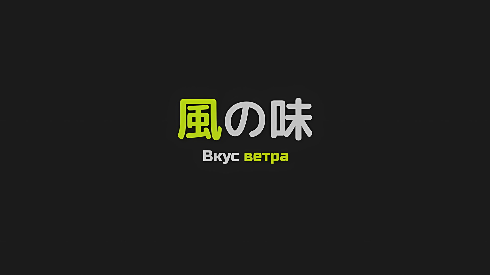
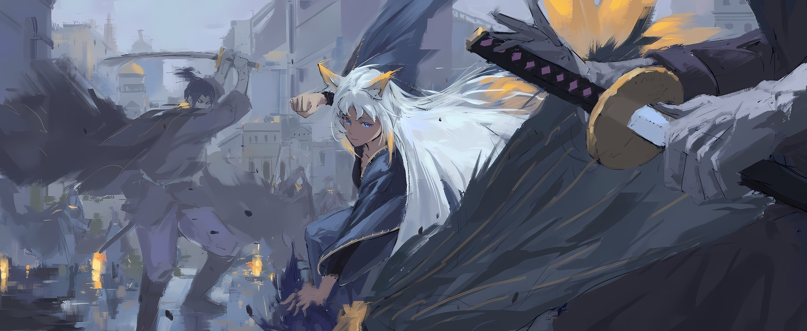

*※※※※※※※※※※※*

…Внутри сверкающего голубого самоцвета проецировалась сцена мерцающего пламени, казавшаяся концом света.

Будучи запертой в подземной темнице, перед глазами висящей Присциллы разворачивалась ожесточенная битва в одной из вершин столицы Империи, которая проецировалась смертельно бледной Сфинкс.

С одной стороны, завладеть самой сердцевиной Империи, а с другой — сразиться с грозным противником и отстоять свои позиции — реальность слияния этих двух необычных обстоятельств уже становилась поводом для сочинения легенд.

Многие песни и истории, передающиеся из глубин веков, как считается, родились именно таким образом.

???: …Впрочем, это возможно лишь только в том случае, если останется хоть кто-то, кто сможет передать увиденное и услышанное.

???: Не навязывай свои желания другим, а уж тем более мне. Когда хамство твое достигнет зенита, даже гнев станет утомительным.

Наблюдая ту же сцену внутри драгоценного камня, Присцилла отреагировала на слабые по энтузиазму слова своей собеседницы.

Слабые. Да, голос ее был слабым от страсти. Не то чтобы совсем ее лишенный, но просто слабый. Почувствовав это, Присцилла нахмурила свои изящные брови и стала наблюдать за человеком возле драгоценного камня.

Противостоящая ей нежить… Сфинкс, представившаяся зачинщицей «Великого Бедствия», спустилась вниз, чтобы встретиться с Присциллой, как бы выставляя напоказ трагическую ситуацию, в которой оказалась Аракия, чьи отношения с Присциллой были тесно связаны.

Присцилла не знала, что именно Сфинкс передала Аракии, пока она находилась в плену и изоляции. Но результат этого отразился в драгоценном камне, и цель происходящего предстала пред ее глазами.

Аракия была на грани того, чтобы разорваться, пытаясь удержать существование, которое было слишком для нее велико, а Сфинкс наблюдала за Присциллой, взирающей на страдания Аракии.

Эти златые зрачки побеждали черноту, поскольку в них читался оттенок любопытства, которое не удавалось скрыть до конца, а также ожидания.

Сфинкс ожидала. …Что страдания Аракии заставят сердце Присциллы дрогнуть.

Без сомненья…,

Присцилла: …Ты одержима мной.

Встретившись взглядом с Присциллой, Сфинкс разомкнула губы, не произнося ни слова.

Это служило подтверждением, выражением восторга. Таким образом, одержимость Сфинкс Присциллой была несомненна, ведь именно она послужила толчком к «Великому Бедствию».

Хотя до сих пор оставалось неясным, откуда возникла эта одержимость, любой поступок, ею мотивированный, заслуживал презрения.

Сфинкс: Получить что-то, что было тебе даровано, а затем насильно этого лишиться. По моим наблюдениям, это чрезвычайно душераздирающее чувство. И как же оно повлияет на тебя? Конфирмация: Требуется.

Присцилла: Твои желания сбываются. Ты в восторге?

Сфинкс: Истинно так. Подтверждаю. В соответствии с твоими словами, я испытываю чувство восторга. Раньше я считала само собой разумеющимся, что все будет происходить в соответствии с заранее составленными планами, однако же… моему прошлому «я» следовало бы понять это чувство достижения желаемого. В этом случае исход «Войны Полулюдей» был бы совсем иным.

Присцилла: …

Сфинкс: …Правда, тогда бы я не смогла ни отдавать, ни получать.

Бросив взгляд на Присциллу, Сфинкс, которая говорила с большим красноречием, положила руку себе на грудь, а затем опустила взгляд вниз, словно о чем-то размышляя.

И тут, заметив эмоцию, которая отличалась от обращенных к ней радости и гнева, Присцилла все поняла.

Эта фигура являла собой печаль в траурных одеждах. …И это также являлось тем, что побудило Сфинкс устроить «Великое Бедствие».

Присцилла: …

Отбросив мысли о мотивах Сфинкс, Присцилла вновь обратила свое внимание на сцену, изображенную в драгоценном камне.

Как бы то ни было, битва, развернувшаяся на поле боя, могла полностью изменить само положение дел в мире: столкновение между тем, что можно было назвать воплощением самой Империи, и неотвратимой молнией.

Однако, посреди всего этого, Присцилла не преминула заметить слабость, которая словно канула в лету.

Присцилла: Слабый, хрупкий, робкий, рожденный ни с чем и сопротивляющийся идее стать кем-либо; может ли такой человек оставить след в строфах мифов?

Сфинкс: Что ты…

Присцилла, отведя взгляд, заставила сознание Сфинкс задаться вопросом, что она увидела в этом драгоценном камне. Однако та не стала пытаться выяснить истинную природу того, что привлекло ее внимание.

Причина заключалась в том, что перед этим в разных частях столицы Империи произошли толчки, способные достичь даже подземелий.

Присцилла: Полагаю, это мой старший брат.

Сфинкс: Император Винсент Волакия?

Озадаченная ситуацией, Сфинкс нахмурила свои тонкие брови, услышав бормотание Присциллы.

Для нее такая вероятность была не слишком велика. Присцилла в подземной темнице никак не могла знать, какова общая численность сил, имеющихся в распоряжении Сфинкс.

Император, некогда покинувший столицу Империи, нашел способ прорваться сквозь орды нежити.

Сфинкс: Мечник, покончивший с моей жизнью, сейчас находится в разгаре битвы один на один с Генералом Первого Класса Аракией… Пусть Император Волакии и мудрый человек, есть ситуации, когда нельзя перевернуть безнадежную доску. …Нет.

Проведя пальцем по своим губам, Сфинкс попыталась развеять тревожные мысли. Однако в процессе этого размышления она сузила свои черные глаза.

И…,

Сфинкс: …Был ли задействован тот странный элемент, который помешал стратагеме Валги?

Присцилла: О, тебе что-то пришло в голову?

Сфинкс выпалила это, будто внезапно осознав.

Облекая свои мысли в слова, она тут же опровергла их, покачав головой. В этот же момент Присцилла намеренно вмешалась в разговор.

Когда Сфинкс оглянулась, Присцилла очаровательно заулыбалась,

Присцилла: Торопишься, когда это противоречит здравому смыслу? Если так, то я дам тебе один «Этвайз*». …То, чем ты сейчас овладела, называй это чутьем.

* Здесь применяется английское слово «advice (эдвайс)», что означает «совет», но Присцилла его неправильно произносит.

Сфинкс: Чутье…

Присцилла: Думай об этом как о вкусе ветра, который ощущает твое сердце. Хотя, быть может, для мертвых это и ирония.

Фыркнув в ответ, Сфинкс умолкла, обдумывая слова Присциллы.

Ни презрительно отвергнуть, ни отмахнуться со смехом не соответствовало ее врожденной привычке… назвать это врожденным тоже было бы иронично, однако Сфинкс продолжала размышлять, невзирая на концепцию жизни и смерти.

В конце концов, она медленно подняла глаза…,

Сфинкс: Признаю. Есть некий странный элемент, который может нарушить мой план. …Корректировка: Требуется.

Когда Сфинкс, стоя перед ней, признала свои перемены, Присцилла тоже посмотрела вверх.

Ее взору предстал тускло освещенный темный потолок подземной темницы, слабо освещенный светом драгоценного камня, но неспособный скрыть груз истории.

Впрочем, это лишь подтверждало узость обзора.

Присцилла не подняла глаз к небу, чтобы осмотреть грязный потолок.

Ибо сердце ее не упустило бы возможности ощутить вкус ветра.

*△▼△▼△▼△*

…Начавшись неожиданно и завершившись прагматично, битва разгорелась с новой силой.

Со всех сторон на нее набросились бесчисленные мечники с одинаковыми лицами, и Ирис, на мгновение оцепенев от шока, разнесла их в пух и прах.

Ирис: Странно, ты не более чем бумажный тигр.

Когда Ирис, облаченная в платье, взмахнула руками, у приближающихся синеволосых мечников… у группы Роуэнов Сегмунтов снесло головы, туловища, бедра и ноги. Их сдуло ветром, как листья с деревьев.

Но был и такой Роуэн, который проскочил мимо ее первоначальной атаки и оказался на расстоянии, на котором его клинок мог ее достать. Когда он набросился на нее со всей силы, Ирис легко перехватила его атаку двумя пальцами, наклонила тело, чтобы уклониться от меча, а затем взмахнула поднятыми вверх ногами, чтобы раздробить то, что от него осталось.

В буквальном смысле это было полное избиение, ведь даже если бы он обладал еще большей численностью, достойным противником от этого он бы все равно не стал.

Такова была разница в силе между Ирис и превращенным в нежить Роуэном.

И лишь…,

Роуэн: Дальше.

Роуэн: Дальше.

Роуэн: Дальше.

Роуэн: Дальше.

Роуэн: Дальше.

Роуэн: Дальше.

Роуэн: Дальше.

Роуэн: Дальше.

Роуэн: Дальше.

Роуэн: Дальше.

Роуэн: Дальше.

Роуэн: Дальше.

Роуэн: Дальше.

Роуэн: Дальше.

Роуэн: Дальше.

Роуэн: Дальше.

Роуэн: Дальше.

Роуэн: Дальше.

Роуэн: Дальше.

Роуэн: Дальше.

Роуэн: Дальше.

Роуэн: Дальше.

Роуэн: Дальше.

Роуэн: Дальше.

Роуэн: Дальше.

Роуэн: Дальше.

Роуэн: Дальше.

Роуэн: Дальше.

Роуэн: Кхахаха.

Ирис: …

Когда противники, которых она бессмысленно пинала, один за другим поднялись на ноги, ее мысли застыли.

Изобразив удовлетворенные улыбки, как бы говоря, что они осуществили свое желание, мужчины, приближающиеся к Ирис… нет, группа, состоящая полностью из одного и того же Роуэна, направила свои клинки в сторону Ирис.

В то время как она рефлекторно отбивалась от неистовых ударов мечей… в голове Ирис промелькнуло чувство вины за то, что она допустила ошибку.

Заставляя сдаваться грубой силой и отгоняя людей, не лишая их при этом жизни, она пыталась уменьшить число жертв, пускай даже и на несколько человек.

Ирис проигнорировала тот факт, что ее высокомерные идеалы сокрушали сердца тех, кто был пропитан Путем Империи, вероятно, заставляя тем самым их страдать.

В результате, став жертвой, Роуэн обрел такое состояние прямо на ее глазах.

Ирис: Я…

Уклоняясь от взмахов клинков, она ударила своим кисэру в несколько приближающихся лиц. Подбив одного из них внутренней стороной своей длинной ноги, она схватила ногу летящего по воздуху тела и со всей силы ударила ею по Роуэнам, сбив с ног еще десяток приближающихся.

Однако, сколь бы сильные удары она ни наносила, она не знала, удастся ли ей остановить энергию возрождающихся Роуэнов.

Ирис: Я…!

Под ударом Ирис тело Роуэна-нежити, не выдержав, разлетелось вдребезги.

Он разлетелся на куски, словно керамическая чаша, а затем следующий Роуэн, не обращая на него никакого внимания, растоптал его своими зори и при прыжке тоже разлетелся на куски.

Такое многократное повторение было равносильно тому, чтобы оказаться в положении палача, конца не знающего.

По природе своей люди не задумывались о том, чтобы уничтожать существ, имеющих форму людей.

Однако в большинстве случаев акт уничтожения человеческой формы, вместилища жизни, требовал огромной решимости и целеустремленности, а также, быть может, привыкания или смирения, чтобы стать возможным.

Можно сказать, что Ирис является крайним представителем последнего случая.

И все же, даже если это был противник, проявляющий по отношению к ней враждебность, она не могла его убить, не испытывая при этом душевных мук.

Именно по этой причине Ирис проявила «Технику Брака Душ», силу, овладеть которой невозможно без сострадания к другим.

Благодаря ей Ирис смогла достичь вершины силы, известной как «Девять Божественных Генералов», хотя истоки этой силы лежали в злонамеренном чуде, сковывающем ее душу с обширными землями Империи.

В любом случае, даже если это было такое аберрантное существо, как Роуэн Сегмунт, существо, которое продолжало появляться независимо от того, сколько раз его уничтожали, это терзало сердце Ирис каждый раз, когда она их разбивала.

Терзаемая нестерпимой болью, которая так и норовила вгрызться в ее сердце, Ирис обнажилась.

Каждый раз, когда она отнимала жизнь, каждый раз, когда уничтожала что-то, имеющее форму, каждый раз, когда она заставляла мир лишиться своего прежнего облика, потерять что-то из того, чем он был, душа Ирис трескалась, становясь обнаженной.

Ирис: Я*… хк.

* Здесь Ирис сменила местоимение Йорны, わっち (Вачи), на, вероятно, первоначальное местоимение Ирис, 私 (Ватаси).

И вот, наконец, конечный пункт назначения ее расколотой души.

Для Ирис, безвольно продолжавшей жить долгое-долгое время; для Сандры Бенедикт, трагически погибшей при рождении Приски; для Йорны Миссигр, потрясенной воссоединением с любимым спустя сотни лет, это было неведомое состояние души…,

Ирис: …ах.

Хриплый вздох сорвался с ее красных губ, а в следующий миг из них брызнула кровь.

Часть брызг попала на щеку владельца клинка, и он, высунув язык, слизнул кровь.

Лицо его озарила улыбка. …Злая улыбка мечника вырвалась наружу.

Роуэн: …Ступни к Небесному Меча, а на них — кончики пальцев моих ног.

*△▼△▼△▼△*

Вытянутая рука проскользнула, и обнаженное лезвие задело голое плечо женщины.

Мгновение спустя брызги крови окрасили серую улицу в яркий оттенок, и тончайшее владение мечом в жизни Роуэна… нет, теперь, когда он стал нежитью, его больше не было в живых, а значит, тончайшее владение мечом в существовании Роуэна было возобновлено.

Роуэн: Еще нет, я только начал.

Однако, когда его сердце перестало пульсировать, неутолимое желание вместо текущей крови подстегнуло все его тело к движению, и существо, известное как Роуэн, стало развиваться ускоренными темпами.

Прекрасная леди-лиса, с которой он столкнулся, была ужасающе сильна. Невероятно грозный противник. Разница в силе, не позволявшая ему с ней бороться, легко преодолевалась скоплениями Роуэнов.

По всем правилам, попытка Роуэна бросить ей вызов должна была закончиться еще тогда, когда он потерпел поражение. Однако эти странные обстоятельства, угрожающие столице Империи, самой Империи и всему миру, не дали Роуэну его конец.

Приставив клинок к собственной шее, он отказался от бесполезной, никчемной жизни.

Веря, что существует территория, которую можно достичь, лишь отбросив собственную жизнь, он пустил в ход свой клинок, зная, что сгниет и канет в безвестность, если не сможет ее достичь, и когда ему это удалось, перед Роуэном открылось видение в самом прямом смысле этого слова.

Роуэн: Аа, ааа, АААА! До чего же простым был мир, который я видел до сих пор.

В открывшемся видении Роуэн с легкостью превзошел тот уровень, которого он достиг за всю свою жизнь с налитыми кровью глазами.

Жизнь воистину бесполезна. В жизни не было ничего хорошего. Поскольку это первое, что дается человеку при рождении, даже такие отшельники, как Роуэн, питали к ней неразумную привязанность.

Только отбросив все это, Роуэн получил свободу отправиться к Небесному Меча.

Несомненно, отсутствие привязанности было именно тем условием, которое позволяло подняться по ступеням, ведущим к Небесному Меча.

Роуэн: А ну-ка, взгляни-ка, глупый сын мой. Для тебя это было бы невозможно.

Это было состояние, которого наконец-то смогли достичь те, кто потерял свою жизнь.

Иными словами, это была сцена, на которую даже Сесилус Сегмунт, неспособный победить смерть, никогда бы не взглянул.

Подумать только, его можно было достичь только через смерть, до чего же садистским было место, куда Бог Меча поместил титул Небесного Меча.

Он выиграл свою азартную игру. …Следовательно, он получит свой завышенный выигрыш.

Роуэн: ХахаХАхаХАХАхаХАХАХАХА!

Когда Роуэн разразился хохотом, его мастерство владения мечом стало достигать высот, некогда столь далеких.

Как бы ни размахивал мечом приближающийся Роуэн, его раз за разом сбивала с ног Ирис. Не в силах до нее дотянуться, когда она била ногами по земле, он оказывался не в состоянии встать лишь от одного удара ее тонкой руки.

Такое подавляющее несоответствие стало сокращаться с невероятной скоростью.

…Здесь еще раз будет рассказано о злоключениях человека, известного как Роуэн Сегмунт.

У Роуэна Сегмунта было давнее заветное желание. То, к чему он постоянно стремился. Молитва, которую он продолжал возносить.

Однако ему так и не представилась возможность воплотить это в жизнь; он так и не встретил достойного соперника.

Такова была трагедия Роуэна Сегмунта, человека, которого преследовали несчастья, пока жизнь его не оборвалась.

…Здесь будет рассказано о чуде человека, известного как Роуэн Сегмунт.

У Роуэна Сегмунта было давнее заветное желание. То, к чему он постоянно стремился. Молитва, которую он продолжал возносить.

И вот наконец-то ему представилась возможность воплотить это в жизнь; наконец-то он встретил достойного соперника.

Не утратив своей иллюзорной одержимости стать «Небесным Меча» даже после смерти, Роуэн Сегмунт возродился в виде нежити; независимо от того, сколько раз он был разбит, он порождал существ, которые разделяли одну и ту же душу, одного за другим, превращая себя в монстра, несравнимого с тем, каким он был при жизни.

Бывали случаи, когда те, кто вступал в схватку с грозным противником, свидетельствуя о способностях, намного превосходящих их собственные, и используя битву, на которую была поставлена их жизнь, как источник подпитки, переживали стремительный рост.

Роуэн стремился вызвать в себе это же явление подобно чуду.

Противостоять грозному врагу, Ирис, многократно свидетельствовать о способностях, намного превосходящих его собственные, и использовать битву как источник подпитки, когда его буквально раз за разом разбивали вдребезги; таковы были его нынешние условия.

Окажись здесь Нацуки Субару, он, возможно, даже назвал бы этот акт получения знаний «Посмертным Обучением».

Необычная одержимость нежити, в сочетании с желанием учиться, привели к тому, что меч Роуэна стал острее.

Оставив позади меч всей своей жизни, техника владения мечом нежити, предназначенная для убийства… работа «Нежити Мастера Меча», Роуэна Сегмунта, по пятам шла за Ирис.

Ирис: Ух, ох…

Осажденная со всех мыслимых сторон, Ирис не могла справиться с натиском мечей; ее руки и бока были изрезаны клинками, и, проливая кровь, она издала слабый стон.

Услышав этот слабый вздох, Роуэн с отвращением покачал головой.

Он не хотел этого слышать. Он не хотел этого слышать. Он не хотел слышать слабость сильного.

Роуэн был благодарен Ирис. Именно благодаря ей он стал сильным. Смерть сама по себе была не более чем толчком. Желая в конечном счете достичь «Небесного Меча», она оказалась ему просто необходима. Ирис не было нужды беспокоиться по этому поводу.

В конце концов, он не хотел этого слышать; в конце концов, это резало ему уши; в конце концов, даже если тот, кто был ниже, превосходил того, кто был выше, он хотел слышать не плач, а ликование.

Именно поэтому…,

Роуэн: Не плачьте, юная леди. Вы портите свой прекрасный образ.

Ирис быстро подняла кисэру, чтобы заблокировать удар меча, летящий сверху вниз, а противоположной рукой пробила дыру прямо в центре торса Роуэна.

Таким был конец этого Роуэна. Но это не имело значения. Следом выскочил другой Роуэн и приблизился к Ирис, когда ее рука все еще оставалась в пробитом Роуэне, покуда тот полностью не рассыпался.

Тут же ее нога резко поднялась и разбила Роуэна. Таким образом, у нее оказались заняты одна рука и одна нога. Затем, когда Роуэн выхватил свой меч из-за ее спины, она быстро ударила его хвостом, однако из основания этого хвоста брызнула кровь. Режущая атака прошла успешно. Выражение лица Ирис исказилось от боли. Плохо. Это было действительно плохо.

Роуэн: Не хочешь ли ты умереть, а затем воскреснуть, чтобы навсегда составить мне компанию?

Это было бы действительно волнующее будущее, однако, скорее всего, ему не суждено было сбыться.

Ирис: …

Когда Роуэн шагнул вперед, его взгляд столкнулся с Ирис, но глаза ее были обращены в другое место, не имеющее отношения к стоящей перед ней жизни или смерти.

Она смотрела не на победу или поражение, жизнь или смерть, а на что-то другое, как будто заглядывала в, так сказать, прошлое.

К тем, кто смотрит не в будущее, а в прошлое, слава не придет.

Только об этом, из самой глубины своего пустого, полого сердца, Роуэн и сожалел…,

Роуэн: …Твоя жизнь принадлежит мне.

Серебряная вспышка пронеслась на полной скорости, и, возобновив тончайшее в его жизни фехтование, устремилась к стройной шее женщины.

Затем состоялось блестящее с художественной точки зрения обезглавливание… или должно было состояться.

Роуэн: Что…

Из-за сильного, стойкого, жесткого и тяжелого чувства техника меча, пожинающего жизнь, была остановлена.

Женщина, грозный враг, достойнейший противник, своего рода учитель, когда его благодарность по отношению к ней была прекращена, Роуэн, поразившись, расширил свои золотые глаза с черными пятнами.

Было прискорбно, что его атака оказалась остановлена, однако человек, который это сделал, — это…

Это была не Ирис, которую он считал сильной, грозной и достойной соперницей. И дело было не в скрытой силе, которую она проявила, находясь в объятиях смерти. Несомненное вмешательство.

???: …Йорна-сама.

Действительно, выкрикивая имя ничтожества, молодой голос преградил путь мечу Роуэна.

Благодаря чистой силе, целое тело вклинилось между ними, чтобы остановить мощный меч, но даже так, с точки зрения Роуэна, это было невозможно.

Даже если бы все это стройное тело было использовано для того, чтобы попытаться встать у него на пути, в режущую атаку должно было быть вложено достаточно силы, чтобы полностью рассечь тело пополам. И тем не менее…,

???: Эй вы, все на одно лицо, уйдите с дороги!

Вслед за этим раздался голос, похожий на звон колокольчиков, и мир разорвал звук напряженной атмосферы.

В тот же миг ледяные цветы, распустившиеся на поверхности, одним махом заполонили все вокруг; в результате Роуэн, Роуэн и все остальные Роуэны превратились в пищу для цветов.

Увидев периферийным зрением, как застывают его тела, Роуэн отпрыгнул назад и приготовил свою катану, оглядывая произошедшее.

И тут…,

???: …Наконец-то. Наконец-то мне удалось снова встретиться с вами.

Тихим, но очень эмоциональным голосом пробормотала девочка-олень, крепко обнимая Ирис.

Обливаясь кровью и упав на колени, Ирис прижалась к тонкой груди невысокой девочки, и, хотя ее голубые глаза расширились от удивления, она приняла объятия.

Затем девочка, обнимавшая Ирис, обратила свои темные глаза на Роуэна, и,

???: Подлец, посмевший направить свой клинок против Йорны-сама, пусть я и недостойна, но я выступлю в качестве твоего противника.

Тем самым девочка с оленьими рогами сделала четкое заявление.
