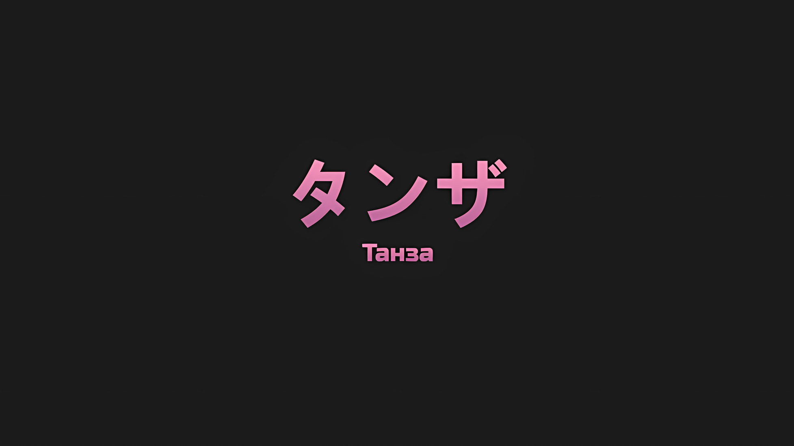
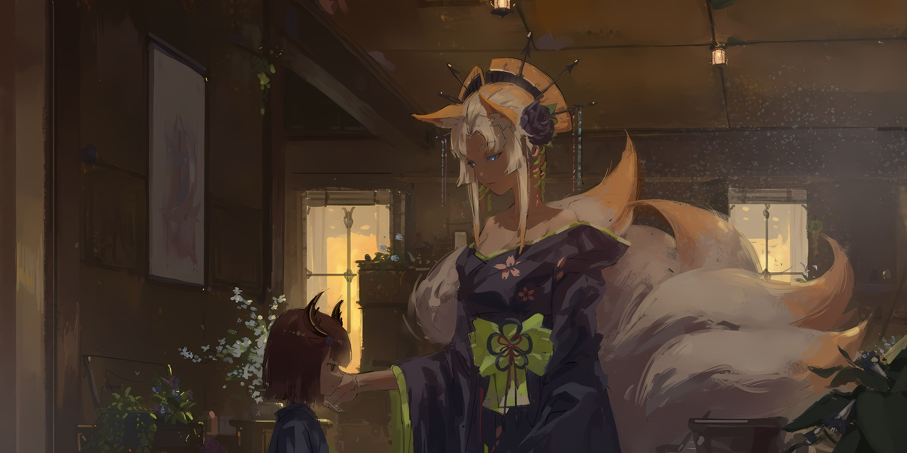
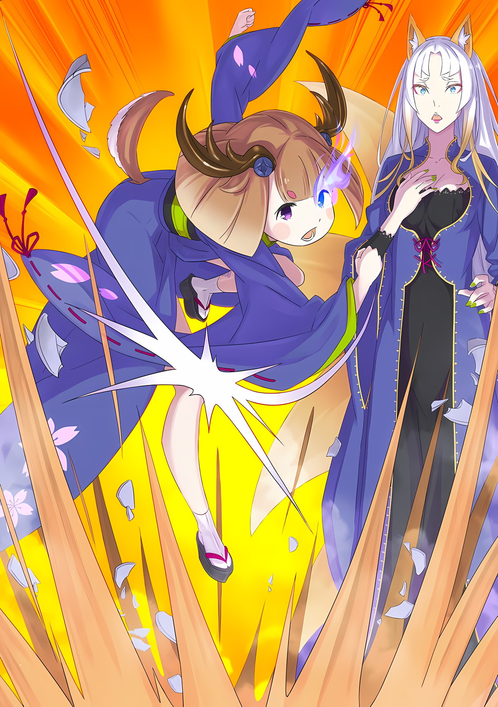

*※※※※※※※※※※※*

…Это было сложное чувство, но, как и Нацуки Шварц, Танза ненавидела Империю Волакия.

Люди Империи должны быть сильными, — такое мышление превозносилось до небес, и в соответствии с ним те, кому не хватало силы, подвергались притеснению, и даже если бы они погибли, было бы объявлено, что виной всему их слабость.

Слабые не имели права быть людьми Империи. …Если так, то она хотела бы оправдаться.

Никто не мог выбирать, где появиться на свет.

Поэтому ни Танза, ни кто-либо другой не родился в Империи Волакия по собственной воле.

Танза ненавидела Империю Волакия.

Она ненавидела Империю, которая забрала ее мать и отца; Империю, которая по какой-то непостижимой причине, вроде Пути Империи, замучила до смерти ее сестру; сестру, которая усердно растила Танзу; сестру, которая вздохнула с облегчением, когда наконец нашла место, где они могли жить в мире; сестру, которой Танза должна была наконец отплатить за все, что она для нее сделала.

Она была уверена, что именно в этом и кроется причина.

???: Ты, случаем, не питаешь ненависти к этой стране?

Когда был задан этот вопрос, выражение ее лица, которое редко проявляло эмоции, стало жестким, и она затаила дыхание.

Что-то, что не должно быть замечено, мысль, которая не должна стать известна, идеология, которая должна быть естественной для человека, подвергшегося остракизму; она подумала, что это было раскрыто.

Однако, увидев, что Танза опустила глаза и задрожала, прекрасная женщина, которая видела ее сердце насквозь, улыбнулась и ласково погладила напрягшуюся щеку Танзы.

Тепло этих пальцев было похоже на тепло сестры, которую она потеряла.

Тепло сестры, без остатка посвятившей себя Танзе, и умершей, так и не познав счастья, которое, казалось, должно было принадлежать и ей.

Женщина: Я тоже.

На мгновение, не понимая, что именно это значит, Танза растерялась.

Затем до нее дошло, какие именно чувства выражали слова этой женщины, — и она сглотнула слюну.

Если бы такой ребенок, как Танза, знать не знающий, как все устроено, сказал нечто подобное, то его бы просто отругали и наказали. Однако эта особа отличалась.

Она была не просто взрослым человеком, а человеком со статусом.

В этой Империи, где верили в мощь, она являлась одним из девяти человек, символизирующих силу…

Женщина: …Я тоже презираю устои этой страны.

Действительно, одарив Танзу нежной, ласковой улыбкой, она призналась ей в своих истинных чувствах.

*△▼△▼△▼△*

Танза: Пожалуйста, отправьте меня к Йорне-сама. Я хочу быть рядом с ней.

В битве, от которой зависело выживание Империи, она понимала, что ее просьба эгоистична.

Потому она была готова терпеть любые словесные оскорбления. Считая, что подобное обращение неизбежно, что пусть ее осыпают проклятиями и бранью, она все равно должна быть честна в своих чувствах.

И, хотя она так думала,

???: …Да, именно так я и собираюсь поступить. Дай ей хорошенько разглядеть твое лицо и как следует поговори с ней.

Несмотря на то, что чувства Танзы всегда отодвигались на второй план, только в этот раз кто-то заговорил о ее чувствах напрямую, словно отдавая ей приказ.

Именно это ей и не нравилось в этом черноволосом мальчике.

Танза: …Йорна-сама.

Сразу после того, как Танза это произнесла, она изо всех сил вытянула свое маленькое тело и, получив в лоб вспышку серебра, спасла драгоценную женщину, которую собирались обезглавить.

Шок охватил все ее существо, вызвав покалывание и онемение на концах конечностей.

Но, чтобы скрыть тот факт, что ей стало больно, она стиснула коренные зубы. Не для противника, который нанес удар мечом, а для того, чтобы скрыть это от драгоценной женщины, которую она так защищала.

Танза: …Хк.

С трудом сдерживая крики боли и выражение своего лица, она терпела.

Обычно ее это раздражало, но сейчас она была благодарна своему хладнокровному лицу. Должно быть, казалось, что она выдержала все это с таким выражением лица, как будто хотела сказать, что ничего страшного не произошло.

Хотя, по правде говоря, если бы не ледяной щит, спрятанный под ее кимоно, она, несомненно, была бы рассечена прямо надвое.

???: Эй вы, все на одно лицо, уйдите с дороги!

Вслед за блефом Танзы послышался храбрый голос с тоном, напоминающим звон серебряных колокольчиков.

Причина, по которой Танза не была рассечена на две части, та, кто спрятала для нее ледяной щит, сребровласая полуэльфийка… Эмилия галантно спикировала на столицу Империи и направила свои руки на ряды нежити, у которых были одинаковые лица.

Сразу же после этого окрестности охватил пронзительный звук, похожий на треск стекла; из-под земли вырвался чистый лед, который стал заключать нежить одну за другой в ледяные тюрьмы.

Нежить тут же попыталась либо отпрыгнуть и убежать, либо низко пригнуться, тем самым уклонившись, либо разрубить мечами ледяной покров. …Но тех, кто выбрал правильный ответ, было немного.

Те, кто отпрыгнул, те, кто пригнулся, и те, кто обнажил свой клинок, становились частью распускающихся ледяных цветов как в небе, так и на земле, и были буквально вморожены в лед, где бы они ни находились.

Около двадцати представителей нежити были поглощены целиком, и лишь немногим удалось спастись.

Она бы хотела исчерпать свой словарный запас, воздавая этому похвалу, однако сейчас…,

Танза: …Наконец-то. Наконец-то мне удалось снова встретиться с вами.

Разрезанный ледяной щит выпал из ее кимоно и превратился в ману прежде, чем успел упасть на землю.

Затем грудью, с которой исчезло ощущение тяжести, Танза прижалась к голове упавшей на колени женщины. Хотя Танза обнимала ее и раньше, поскольку та была женщиной высокой, она впервые заключила ее в такие объятия.

Честно говоря, подобные действия казались ей неловкими.

Она считала, что это не послужит хорошим примером, и ей было неприятно, когда с ней обращались как с ребенком. Однако же ей это никогда и не было противно, а ее мнение о том, что с ней обращаются как с дитем, также изменилось.

Ведь Шварц и Сесилус могли делать все, что им заблагорассудится, невзирая на то, что они были малы.

Даже если статус ребенка становился препятствием на пути к чему-либо, это ни в коем случае не повод сдаваться. Танза всем своим сердцем пыталась воздать этому человеку.

Проливая кровь, женщина, чьи голубые глаза расширились от удивления… Обняв Йорну, Танза обратила взор своих темных глаз на врага, на помеху, которая встала на ее пути.

А затем…,

Танза: Подлец, посмевший направить свой клинок против Йорны-сама, пусть я и недостойна, но я выступлю в качестве твоего противника.

Таким четким заявлением она утвердила свою точку зрения.

Нежить: …

Приняв заявление Танзы, ни мужчина-нежить, ни прижатая к ее груди Йорна, не проронили ни звука.

Быть может, их шокировал этот глупый поступок, или же причиной их шока стало внезапное появление Танзы? В любом случае это не имело значения, поскольку Танза вступила в готовность, все еще не выпуская Йорну из объятий.

И тут же…,

Эмилия: Хиияяя!

Нежить: Ууоооу!?

Стремительная атака Эмилии была еще быстрее, чем движения Танзы.

Шагнув вперед, Эмилия с размаху обрушила на неподвижную нежить ледяные молоты, которые она создала в обеих своих руках. Мужчина-нежить, сосредоточивший свое внимание на Танзе, был поражен: он отмахнулся от них и встал напротив Эмилии.

Эмилия: Я — ваш противник!

Нежить: А вон та девчонка разве не сказала, что будет моим противником?

Эмилия: Прямо сейчас Танза-чан наконец-то воссоединилась с Йорной-сан, встречу с которой она так долго ждала. Вы… У вас всех одинаковые лица, однако… Я не позволю вам препятствовать!

Нежить: Возможно, это трудно понять, но даже если их много, я — это я… Роуэн Сегмунт, личность. Не стоит путаться.

Эмилия: Я не позволю тебе препятствовать!

Поправляя себя, Эмилия выпустила из рук два ледяных меча, а бездушно улыбающаяся нежить… все многочисленные Роуэны, столкнувшись с Эмилией, приняли одинаковые стойки.

Сзади Танза попыталась поддержать ее словами: «Эмилия-сама!»,

Эмилия: Все в порядке, сначала ты можешь поговорить с Йорной-сан. …Субару попросил меня об этом.

Танза: …

Когда прозвучало имя Шварца, Танза замешкалась, не решаясь что-то сказать.

В этот момент Эмилия перестала улыбаться, выражение ее лица сменилось на жесткое, и она сделала шаг к Роуэнам, которые с катанами в ножнах стояли наготове,

Эмилия: …Айсикл Лайн*.

* Icicle Line — линия сосулек.

После того, как губы Эмилии произнесли эти слова, окружающая сцена окрасилась еще большим количеством белого.

Все цвета смешались с серебристо-белым, и, пытаясь противостоять двум мечам Эмилии, которая была облачена в снег, Роуэн удовлетворенно улыбнулся… вслед за этим на него обрушился шторм из сосулек.

Роуэн: ОООООО…!?

Роуэн: ОООООО…!?

Эмилия: А вот и я!

Роуэн, который, казалось, думал, что начинается соревнование по мастерству владения мечом, ошеломленный ледяной бомбардировкой, отбивался от наступающих атак Эмилии.

Легкое ледяное оружие столкнулось с катаной нежити, и начался танец мечей.

На фоне этого танца мечей Танза, полагаясь на внимание Эмилии, снова перевела взгляд на Йорну. Выражение ее лица было таким, словно она еще не до конца осознала всю сложившуюся ситуацию.

Танза: Впервые вижу, чтобы у Йорны-сама было такое лицо.

Йорна: …Танза, это ты?

Танза слегка опустила уголки своих глаз от счастья, и, глядя на это лицо, Йорна впервые с момента их воссоединения произнесла слова, наполненные смыслом. На этот вопрос Танза кивнула. С тех пор как они расстались в Хаосфлейме, она была разлучена с Йорной почти на два месяца.

Поскольку корреспонденции между ними не было, Йорна вполне могла решить, что Танза погибла.

Танза: Однако я осталась цела и невредима. С целью вернуться к Йорне-сама.

Заглянув в глаза Йорне, она ободряюще произнесла эти слова.

Слова, поразившие Йорну, когда ее глаза дрогнули от осознания реальности происходящего, были немыслимо обнадеживающими.

Возможно, это было связано с влиянием тех, кто умел говорить без всякого притворства.

Это было доказательством того, что за два месяца разлуки с Йорной она успела многое пережить… однако изменения претерпела не только Танза, но и Йорна.

Йорна была в красивом голубом платье. На ней не оказалось кимоно, которое Танза так привыкла видеть, а волосы ее были распущены; этот внешний вид вызывал у Танзы не столько восторг от новизны, сколько опасения.

Не то чтобы она скептически относилась к перемене вкусов. Украшения Йорны… предметы, подаренные ей жителями Хаосфлейма, тот факт, что она их не носила, вызывал подозрения.

Все жители Города Демонов Хаосфлейм очень любили и почитали Йорну.

Дабы передать то, что было у них на сердце, они брали части своих уникальных черт полулюдей, что служило основной причиной их остракизма, находили им хорошее применение и делали из них украшения, которые и дарили Йорне.

Все — от заколок до серьг, от обидомэ до булавок или нитей для кимоно — Йорна одевалась в любовь жителей Хаосфлейма, и ей хотелось предстать пред ними в величественном виде.

Среди них были и гребни, вырезанные из частей рогов Танзы и ее сестры.

Йорна: Танза…

Когда дрожащими губами произносили ее имя, Танза ждала, пока беспокойство Йорны спадет.

Ей также хотелось помочь Эмилии в борьбе с Роуэном, но сейчас она желала направить все свои силы на то, чтобы разобраться с эмоциями Йорны. Пальцы последней нервно потянулись к щеке Танзы; убедившись в этом чувстве, Танза должна была обменяться с ней словами.

Однако пальцы Йорны не коснулись щеки Танзы.

Танза: Йорна-сама?

Как раз в тот момент, когда они собирались ее коснуться, Йорна отдернула пальцы и крепко зажмурила глаза; затем она толкнула Танзу в грудь, тем самым заставив ее отступить на шаг назад.

Йорна и Танза, наконец-то обнявшись, снова разделились, и последняя растерянно моргнула глазами. Так как Танза не могла расшифровать намерение, стоящее за этим действием, Йорна открыла рот,

Йорна: По какой причине ты пришла в это место?

Танза: …

Йорна: В настоящее время столица Империи превратилась в столицу нежити… это место, покинутое не только солдатами Империи, но и даже «Девятью Божественными Генералами», а также Императором, что же здесь делать такой девочке, как ты?

Поднявшись с колен, Йорна сурово посмотрела на Танзу. Под пристальным взглядом этих миндалевидных глаз тонкие плечи Танзы слегка сжались.

На мгновение она не поняла, что ей сказали. Однако тут же осознала, что это был отказ.

Йорна, исполненная сострадания женщина, которая принимала всех и вся, отвергла Танзу.

Йорна: Это место слишком сурово и дико по отношению к живым. Было бы разумно покинуть его немедленно. Если же ты не в состоянии, мне отослать тебя своей рукой?

Танза: …Если вы проводите различие между живыми и мертвыми, то и для Йорны-сама это условие…

Йорна: Одинаково? …Ты полагаешь, что мы с тобой одинаковы?

Несмотря на шок, Танза попыталась протестовать, и Йорна протянула к ней свою руку. Однако не для того, чтобы погладить Танзу по щеке, а лишь чтобы схватить ее за воротник.

Пять тонких пальцев Йорны ухватились за край ее кимоно, и ноги маленького тельца Танзы оказались подвешенными.

Так ее держали и раньше. Однако еще никогда с ней не поступали столь жестоко.

Йорна: Мы с тобой на разных сторонах. У меня есть… тот, на чьей стороне я хочу остаться. Наконец-то я снова могу быть с этим человеком. Вот почему…

Танза: Йор… на-сама… хк.

Йорна: Мне больше не нужны ни ты, ни другие дети.

На расстоянии, достаточно близком для того, чтобы их дыхание достигало друг друга, Йорна заглянула в лицо Танзы. То, что сказала Йорна, являлось причиной, по которой она осталась в наполненной нежитью столице Империи.

Дело было не в том, что ее держали в плену, а в том, что она осталась здесь по собственной воле.

Танза: …

Так же как Йорна смотрела на нее, так и Танза глядела в ее голубые глаза.

В глубине этих радужек, пока Йорна коротала дни в Городе Демонов, нежно ухаживая за Танзой и жителями города, виднелись осколки тоски, которая никогда не исчезала.

Йорна Миссигр всегда что-то искала.

Что-то непостижимо большое и далекое для Танзы, что-то, чего не могла достичь даже Йорна; ей казалось, что она ищет что-то сродни звезде.

Нечто яркое, мерцающее и ослепительно сияющее, однако недоступное.

Йорна всегда стремилась к этому.

То, что она являлась человеком, к этому стремящимся, было известно и Танзе, и всем остальным. Она молилась, чтобы желание Йорны исполнилось, а если же нет, то хотела бы предложить что-то взамен.

Так думала не только Танза, так думали все.

И вот, наконец, она нашла это — желание Йорны достигло звезд.

Если это было причиной, по которой она вот так схватила Танзу за воротник…,

Танза: …Прошу, Йорна-сама, будьте счастливее, когда меня отвергаете.

И действительно, Танза ухватилась за ее запястье и сказала об этом бедной лгунье, коей она очень дорожила.

*△▼△▼△▼△*

*…Ах, я стала плохим ребенком.*

Хватаясь за тонкое белое запястье, Танза сожалела о том, что так сильно изменилась.

Все должно было быть иначе. Для Танзы ее идеал… это идеализированный образ, желание быть похожей на свою погибшую старшую сестру Зои.

…Зои была человеком очень волевым и добросердечным.

Причина, по которой родина Танзы была уничтожена, заключалась в распространенном суеверии относительно того, что варка рогов людей-оленей способна создать панацею, в результате чего на них напали бандиты, стремившиеся продать рога по высокой цене.

Когда ее отец и мать были убиты, совсем еще юную Танзу за руку вытащила ее сестра, и им едва удалось спастись.

Но на этом страдания двух сестер не закончились. Злые лапы тех, кто охотился за рогами, еще не раз их настигали, да и без этого в Империи Волакия было принято охотиться на слабых.

Их жизни неоднократно подвергались опасности, а о том, насколько суровые испытания приходилось проходить ее сестре ради одной тарелки супа, Танза могла представить себе лишь по прошествии нескольких лет. В то же время ей претило, что она полностью зависела от своей сестры и ничего не могла сделать, до такой степени, что ей хотелось покончить с собой.

Зои: Танза, ты не должна никого проклинать. Люди, которые могут легко осыпать проклятиями других, так же легко будут прокляты и сами.

Сестра Танзы, истощенная и одетая в рваную одежду, рассказывала ей об этом по вечерам, когда они делили одну тарелку супа.

Никто не относился к ним по-доброму, все были холодны по отношению к Танзе и Зои. Всякий раз, когда она плохо отзывалась об этом мире, добрая сестра Танзы непременно ругала ее, повторяя эти слова.

Сестра Танзы ругала ее не из досады, а из родительской любви. …Несмотря на то, что она была ее старшей сестрой и находилась в том возрасте, когда человек еще зависит от родных, ей было слишком рано становиться родителем.

Суеверие относительно оленьих рогов не утихало, поэтому сестры никогда не задерживались на одном месте.

Они постоянно бежали, бежали, бежали, и когда они уже устали от всех этих бегств, до ушей сестер дошел слух о «Городе Демонов», Хаосфлейме.

Рассказывали, что в этом месте многие племена полулюдей жили вместе и что это был рай для подвергшихся остракизму.

Госпожа, правившая там, слыла сильной, исполненной сострадания и замечательной личностью, не терпящей притеснения слабых. …Такая перспектива была нелепой, подумала Танза своим детским сердцем.

Такого человека просто не могло быть. Невозможно, чтобы такой удобный человек существовал на самом деле.

Даже если бы он действительно существовал, то почему же тогда умерли ее отец и мать? Почему же ее сестра, такая истощенная и потрепанная, вела Танзу за руку?

Следовательно…,

???: …Вы хорошо потрудились, Зои, Танза.

И вот, достигнув рая, коего не должно было быть, когда женщина в красивом кимоно привела двух потрепанных, грязных сестер в замок и заключила их в свои объятия, неуклюже представившись друг другу, Танза впервые услышала, как ее сестра повысила голос и заплакала.

Даже в тот день, когда умерли их отец и мать, даже в те дни, когда из нее делали посмешище ценой тарелки супа, и даже в те дни, когда несмышленая Танза обрушивала на нее бесцеремонные слова, Зои никогда не проливала слез.

Видя, как Зои, прижимаясь к груди женщины, льет слезы и всхлипывает, Танза тоже повысила голос и заплакала. В этот момент в глубине ее души зародилась мысль.

Она решила, что никогда не потеряет рай, созданный этой женщиной… Нет, она совершенно точно никогда не потеряет эту женщину, Йорну Миссигр; ее детское сердце твердо стояло на этом.

…Им предоставили еду и спальню, а Зои, одетая в кимоно, была просто прекрасна. Она составляла гордость Танзы.

Было много тех, кто обожал Йорну и искренне желал ей служить. Среди них Зои была самой серьезной и трудолюбивой, поэтому Йорна пришла, чтобы назначить ее на ответственный пост.

Танза гордилась тем, что Зои служит восхитительной Йорне и выполняет важную работу.

Она думала, что однажды станет такой же, как ее сестра, всем сердцем служа Йорне и желая, чтобы о существовании рая, известного как Хаосфлейм, узнало как можно больше слабых, страдающих людей.

Ее сестра умерла через два года после начала этой жизни.

За пределами Города Демонов жила группа племен полулюдей, которые искали защиты у Хаосфлейма.

Когда они проходили мимо крепости имперских солдат, проводивших военную кампанию, ее сестра, как доверенное лицо Йорны, связалась с этой группой и направила их в Город Демонов.

Имперские солдаты напали на группу полулюдей под предлогом того, что те являются потенциальными врагами, и ее сестра была внезапно убита. Замученная до смерти по причине, несвязанной с рогами людей-оленей, ее труп был подвергнут позору.

*Зои: «Танза, ты не должна никого проклинать. Люди, которые могут легко осыпать проклятиями других, так же легко будут прокляты и сами.»*

Слова старшей сестры промелькнули у нее в голове, и от горя сердце Танзы разорвалось в клочья.

Неужели даже после этого она не должна была ничего делать? Неужели даже после этого она не должна была никого проклинать? После того, как ее старшая сестра, которая, наконец, должна была стать счастливой, погибла, неужели она все еще не должна никого проклинать?

Йорна: Ты, случаем, не питаешь ненависти к этой стране?

Терзаемая отчаянием, Танза страдала так, словно у нее сломались рога, и в этот момент ее окликнул голос.

Она надела кимоно, чтобы подражать своей сестре, но с ее скудными знаниями о работе прислуги подражать ей было невозможно, а ее слабое, хрупкое сердце не могло скрыть того, что она на самом деле чувствовала.

Пока Танза сокрушалась о том, что эти чувства были обнаружены, рука женщины погладила ее по щеке.

Йорна: Я тоже.

Гладя ее, женщина подтвердила гнев Танзы, подтвердила ее проклятия.

И вместо Танзы, у которой не было ни сил, ни средств, чтобы придать форму этому проклятию, она начала действовать. Даже если это означало, что ей придется сразиться с могущественной Империей, ее это не волновало.

Йорна: …Я тоже презираю устои этой страны.

Всякий раз, когда «Ярчайшая», Йорна Миссигр, поднимала восстание против Империи, это всегда происходило ради другого.

Поскольку Танза знала, что она — женщина, готовая так поступить, она не хотела становиться причиной.

Она хотела остаться ребенком, который не стал бы подвергать Йорну опасности.

Она хотела остаться ребенком, который не заставит Йорну столкнуться с горем.

Как и ее сестра Зои, она хотела быть хорошей прислугой, которая не будет причинять Йорне беспокойства.

…И все же Танза стала плохим ребенком.

Танза: Йорна-сама спасла мою старшую сестру.

Крепко сжав запястье, схватившее ее за воротник, Танза произнесла это.

Возможно, из-за того, что реакция, поведение и слова Танзы были неожиданными, голубые глаза Йорны расширились, а губы слегка дрогнули.

Танза не оставила без внимания тот факт, что эти дрогнувшие губы произнесли имя ее старшей сестры — «Зои».

Танза: Йорна-сама удовлетворила мою эгоистичную просьбу.

После «Восстания», которое произошло непосредственно против столицы Империи, когда Зои погибла, Йорна отомстила за нее, а Танза в свою очередь попросила прислуживать ей вместо сестры.

Это была просьба, граничащая с верхом наглости, и она крайне не подходила на эту роль, однако Йорна приняла ее с радостью.

И Танза служила ей от всего сердца. Ей было позволено это делать.

Танза: Йорна-сама принесла счастье большому количеству людей.

Сколько же людей, кроме нее и ее сестры, получили поддержку Йорны?

Скольких людей спасла и защитила их связь с Йорной? Слова и действия Танзы были не более чем маленькой частичкой этого скопления благодарности.

Если бы Йорна оставила все это позади и продолжала бы действовать без оглядки, это было бы прекрасно.

Если бы Йорна посчитала их тяжелой ношей и захотела бы стать легкой, чтобы взлететь и достичь звезд, это тоже было бы прекрасно.

Если бы Йорна была несчастна, они бы не захотели, чтобы она оставалась с ними. Если бы они сказали, что хотят, чтобы Йорна осталась с ними, невзирая на то, что она несчастна, это было бы эгоистично, подобно проклятию.

Вот почему, если она собиралась освободиться от держащих ее рук, Танза хотела, чтобы она хотя бы улыбнулась, возжелав счастья.

Если же она не сможет этого сделать…,

Танза: …Йорна-сама, вы все еще любите нас.

Не отпуская эмоций, которые не остались в прошлом, а все еще присутствовали даже сейчас, Танза ясно заявила об этом.

Глаза Йорны расширились до предела, и она впала в состояние крайнего удивления. Выражение ее лица стало таким, словно было совершенно немыслимо, чтобы Танза могла когда-нибудь заговорить с ней в ответ.

На самом деле, должно быть, так оно и было. Танза хотела служить Йорне как можно лучше. Как и Зои, она молча повиновалась словам Йорны и прилагала максимум усилий, чтобы воплотить их в жизнь.

Но проблеск ее неспособности к этому должен был проявиться, когда ее разлучили с Йорной.

Император и Лжеимператор, посетившие Хаосфлейм; чтобы не дать им втянуть Йорну в свою войну, Танза действовала независимо от Йорны, что привело к ненужному усилению беспорядка.

В результате Танза оказалась разлучена с Йорной во время последовавших событий, и ей пришлось многое пережить.

И вот теперь, вновь воссоединившись, Танза прямо возражала Йорне.

Она была плохим ребенком. Она стала плохим ребенком.

Она не хотела, чтобы человек, которому она желала счастья, шел на компромисс в процессе обретения этого счастья. Для этой цели Танза даже пошла против слов и молитв этого человека.

Каким же плохим ребенком она стала.

Йорна: …ах.

Глаза Йорны были широко раскрыты от удивления, а с ее губ сорвался слабый вздох.

Это была реакция Йорны на боль от того, что ее запястье крепко сжимали. Поскольку запястье Йорны удерживало воротник Танзы, последняя крепко сжала его в ответ.

Если предположить, что все было так, как и говорила Йорна, что ей не было дела ни до Танзы, ни до остальных, и что она свободно делала то, что хотела, то этого не должно было случиться.

«Техника Брака Душ» Йорны распределяла силу между теми, кого она любила.

По логике самолюбования этот эффект распространялся бы и на саму Йорну… чувство одобрения по отношению к себе, которое можно было бы даже назвать проявлением веры в правильность своих действий.

До тех пор, пока она искренне верила в свою правоту, в Йорне Миссигр бурлила необычайная сила.

Но если бы она в это не верила, что бы произошло тогда?

Хотя Йорна и входила в число «Девяти Божественных Генералов», являясь вершиной военного сословия Империи Волакия, если бы она была не в состоянии верить в собственные деяния, то быстро потеряла бы силу.

И, несомненно, именно это явление имело место, поскольку меч расставшегося с жизнью «Нежити Мастера Меча» превосходил ее по силе.

Йорна не могла быть опорой для тех, кого не любила, для тех, кого не могла одобрить.

Вот почему она не могла обеспечить силой нынешнюю себя.

Поэтому…,

Танза: …Йорна-сама, чувства любви — единственное, что вы не можете сымитировать.

Танза верила в любовь Йорны без малейших сомнений, потому в ее левом глазу загорелось голубое пламя.

Йорна: …

Когда ее висящие ноги вернулись на землю, Танза посмотрела на нее своим пылающим глазом, отчего Йорна растерялась, не зная, что сказать.

При давлении на свое запястье, которое было так крепко сжато, Йорна взглянула на лицо Танзы; в нем не было ни единого доказательства «Любви», столь же великой, как и охватившее ее глаз пламя, отчего она смотрела на него так, словно это было невероятно.

Ей казалось, будто она полностью обманула собственное сердце.

Танза: Йорна-сама, вы не очень умелый человек. …Чтобы завязать волосы и нарядиться в кимоно, разве вы всегда не полагались на силу меня, моей сестры или всех любящих вас людей?

Сказав это, Танза встала на цыпочки, выпрямила спину и вытянутой рукой погладила Йорну по щеке.

Точно так же, как когда-то погладили ее, и точно так же, как однажды она погладит того, кого захочет лелеять. От прикосновения этих пальцев голубые глаза Йорны заметно дрогнули. Именно дрогнули.

Как тогда, когда ее старшая сестра впервые повысила голос и расплакалась, так и сейчас — в крепком сердце появилась трещина.

И тут…,

Эмилия: …Кх! Нет! Танза-чан!

Позади Танзы, стоящей лицом к Йорне, раздался голос загнанной в угол Эмилии и звук твердой поступи зори ударил по ее барабанным перепонкам.

Одновременно с этим раздался звук вынимаемого из ножен клинка… можно было предположить, что один Роуэн проскользнул мимо Эмилии и теперь пытался напасть.

Роуэн: С дороги, дорогуша. Вот она, сцена моей мечты!

Вместе с эгоистичным замечанием враг мчался, как сильный ветер.

Йорна, вероятно, увидела его из-за ее плеча. Она сразу же протянула руку к плечу Танзы и попыталась оттолкнуть ее тело.

Словно в благодарность за оказанную ранее услугу, на этот раз она попытается послужить Танзе щитом.

Танза: Однако я не могу этого допустить.

Йорна: Танза… хк?

Твердо выдержав удар руки, пытавшейся оттолкнуть ее с дороги, Танза не дала этому случиться. Вместо этого она развернулась, дабы защитить Йорну, теперь стоявшую позади нее, и столкнулась лицом к лицу с отвратительными золотыми радужками, устремившимися в ее сторону.

Выпущенный меч нацелился рассечь шею Танзы и разрубить пополам стоящую позади Йорну. Взмаха клинка было бы достаточно, чтобы опалить холодную атмосферу, и, когда он приближался к шее Танзы…,

Роуэн: …Кх.

Танза: Сцена твоей мечты, да?

Подавив потрясение в горле, Роуэн расширил свои золотые глаза.

Должно быть, так оно и было. Несомненно, он не ожидал, что атака, которую он со всей силы обрушил на них, будет поймана таким маленьким ребенком.

Подняв руку, Танза поймала и перехватила опалившую атмосферу вспышку серебра.

……«Техника Брака Душ» Йорны распределяла силу между теми, кого она любила.

Если человек верил в то, что он прав, а в том, что его любят, не было никаких сомнений, если они оба эгоистично верили в это от всего сердца, то эффект от техники мог быть просто колоссальным.

*???: «Танза тоже моя, так что, по сути, она на нашей стороне, верно?»*

*Ахх, как же раздражает.* Она была уверена, что ее любят; она заразилась этим, будучи плохим ребенком.

Это было слишком раздражающе и невыносимо. Она была искренне рада, что в ее характере — не показывать этого на своем лице.

Танза: Мои извинения. Я очень занята, так что у меня нет времени наблюдать за тем, как разворачиваются счастливые мечты.

Вложив силу в свою руку и раздробив зажатую в ней катану, Танза, с изумлением глядя на происходящее спереди и сзади, нацелилась на лицо стоящего перед ней неприятеля и вогнала в него свой сокрушивший катану кулак.

Нанеся удар, который прошел через его нос и впечатался во внутреннюю часть головы, Танза сказала это.

Дни, когда она просто мечтала о рае и продолжала молиться за своего драгоценного человека, закончились.

Если она не начнет действовать, то никогда не сможет обрести рай и исполнить свои драгоценные желания.

Будучи спасенной своей старшей сестрой, получив помощь Йорны, встретившись с Нацуки Шварцом и другими товарищами по Эскадрону Плеяд, и, наконец, оказавшись здесь, ответом Танзы было…

Танза: …Потому что здесь ждет суровая, жестокая, но прекрасная реальность.

В конце концов, чтобы добраться до звезд, у нее не было времени стоять на месте.
