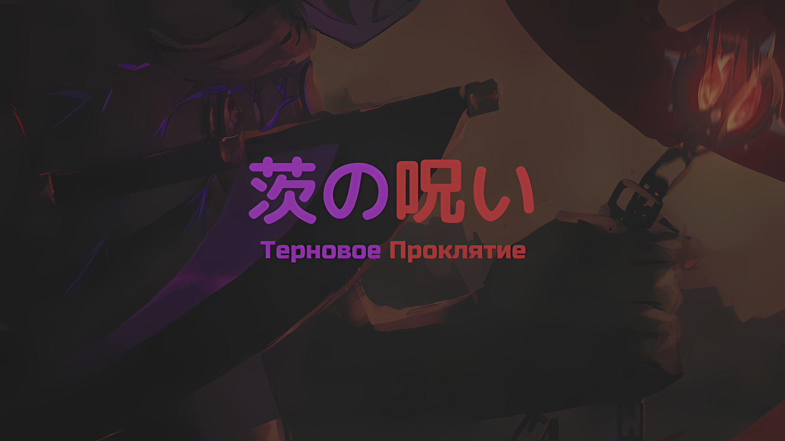
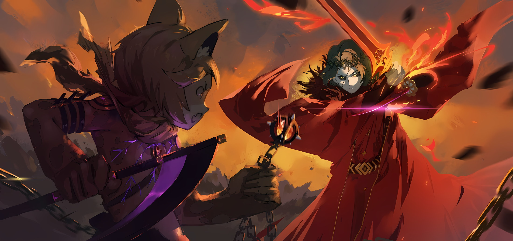

*※※※※※※※※※※※*

…Имя Югарда Волакии, «Императора Терний», было известно не только в пределах Империи Волакия, но и во всем остальном мире.

Причиной тому послужила вошедшая в историю Империи сказка о трагической любви, «Ирис и Терновый Король».

Сказка, повествующая о встрече и расставании добросердечной девушки по имени Ирис и Императора Волакии, которого боялись как «Тернового Короля», наряду с трагичностью ее финала, задела за живое сердца многих читателей.

Судьбоносная встреча этих двоих и их первое расставание. Впоследствии, преданный своими вассалами, «Терновый Король» был свергнут с трона и воссоединился с Ирис, и рука об руку они начали свое восстание… С тех пор прошло много-много времени, и, хотя способ изложения истории мог отклоняться от исторического факта, самый важный, основополагающий аспект — два глубоко влюбленных друг в друга человека — оставался совершенно неизменным по мере того, как история продолжала рассказываться.

Таким образом, история неизменной любви, известная как «Ирис и Терновый Король», оставалась любимой.

Однако в результате, будучи рассказанной как трагический любовный роман, зажегший огонь в сердцах людей, эта история проигнорировала и скрыла часть подлинной исторической правды.

Ирис и «Терновый Король», мирно проводящие время в любви, на самом деле были совсем не такими.

В те бурные времена, в Империи, где переплелись предательство и плач, они проводили свои дни вместе, рискуя жизнью, сражаясь день и ночь во имя желанного будущего и пылая любовью.

И действительно, Ирис и «Терновый Король» перевернули всю Империю Волакия с ног на голову и, в конце концов, сумели ее себе вернуть. …О трагедии, последовавшей за этим говорить, конечно, излишне.

Но до того, как произошла эта трагедия, они, несомненно, достигли своей цели.

Своим сострадательным сердцем и преданным образом жизни Ирис привлекла на свою сторону многих союзников. Рядом с ней «Терновый Король» добился в войне результатов, подобающих Императору Волакии.

Результаты войны, подобающие Императору Волакии… остались неизменными с былых времен, и это было воплощением закона железа и крови Империи Волакия. Другими словами, это являлось доказательством силы.

……«Император Терний», Югард Волакия, был самым сильным Императором за всю историю Империи.

???: ПШЕЛ НААА ХУЙ!!!

С громоподобным ревом, вырвавшимся из его горла, Груви Гамлет подпрыгнул высоко в воздух и отбросил кусаригаму*, рукоять которой была перерублена пополам.

* Кусаригама — японское холодное оружие, которое состоит из серпа (кама), к которому с помощью цепи (кусари) крепился груз (фундо).

Мгновение спустя кусаригама, покинувшая его руку, вспыхнула в воздухе темно-красным пламенем.

Если бы он замешкался хотя бы на мгновение, это пламя, скорее всего, поглотило бы его целиком; его шерсть инстинктивно встала дыбом, когда он понял, что чуть не сгорел заживо. Однако он не успел почувствовать облегчение.

Югард: Хорошо танцуешь, щенок. Однако, когда дело доходит до танцев, Звезда Моя представляет собой зрелище куда более впечатляющее.

Пока он с нежностью говорил о своей возлюбленной отстраненным, лишенным эмоций тоном, его натиск красных ударов был неумолим, словно расцветая в изобилии.

Оружие, которым тот владел, получив удар кусаригамы и заставив ее мгновенно воспламениться, не допуская даже обмена ударами, было поистине худшим… как и следовало ожидать от драгоценного меча, носящего имя Империи, — не только его острота, но и даже его особенность доставляли немало хлопот. Если бы это представлялось возможным, ему бы очень хотелось собственными руками изготовить изделие, сравнимое с ним по качеству.

Груви: Если б только Его Ебучее Превосходительство позволил мне рассмотреть его поближе!

Учитывая, что никто, кроме законного владельца, не мог обладать сокровенным мечом, возможности увидеть подлинный экземпляр были крайне редки.

Выражая недовольство тем, что с ним обошлись как с Генералом Первого Класса, Груви в полной мере использовал свой маленький рост, над которым насмехался его противник, и, уклоняясь от багровых ударов своим проворным телом, он уклонялся, уклонялся и еще раз уклонялся.

Он уклонялся, потому что попасть под удар не представлялось возможным; хотя это и примитивно, но против такого противника это было оптимальным решением. Будь на его месте Гоз или Могуро, они бы, не уклоняясь, получили удар и встретили бы свой конец в огненной вспышке.

Когда последствия ударов испепелили городской пейзаж, Груви носом уловил запах гари, поскольку ему успешно удалось увернуться от штормового удара багрового меча. Однако он все еще не мог перевести дух.

Даже бы если он уклонился от «Меча Света», который опалял мир, прорезая его насквозь, последующая вспышка черноты разделила бы мир пополам.

Груви: …Кх.

Даже привычные ругательства не смогли сорваться с его уст.

Когда от «Меча Света» понесся шквал мощных ударов, Югард крутанул своим телом и выпустил «Меч Дьявола», отчего шерсть Груви встала дыбом: он пригнулся, когда лезвие пронеслось буквально в сантиметре над его головой.

Результат этого удара не ограничился лишь простым облегчением от того, что голова его не слетела с плеч.

Вдоль траектории, которую прочертил клинок, в нескольких десятках метров от того места, куда пришелся удар, по диагонали наклонился городской пейзаж столицы Империи, а вслед за ним рухнул и ряд разрушенных зданий.

Его острие было настолько абсурдным, что даже создание специальных ножен для этого клинка было сопряжено с трудностями — такова была мощь этого оружия, известного как «Меч Дьявола» Мурасаме.

Для владения этим мечом, который обладал такой невозможной силой, естественно, требовалась соответствующая компенсация. Если бы его обладатель являлся обычным человеком, это был бы непочатый край, который мог стоить ему самой жизни…

Груви: Идешь размахивая-махая-маша им, да еще и так, блядь, нагло, небрежно…!

Югард: Волнуешься за меня, меж тем как мы друг другу противостоим? Если дело в этом, то опасения твои беспочвенны. Столь ничтожным существам, как ты, пристало беспокоиться исключительно о себе. Что же касается беспокойства в отношении меня, то Звезды Моей мне вполне достаточно.

Груви: Да ты, бля, нихуя не въезжаешь!

В его правой руке — «Меч Света» Волакия, а в левой — «Меч Дьявола» Мурасаме.

Хотя противник, владеющий самой худшей комбинацией двух мечей, которую только мог представить себе Груви, не назвал своего имени, то, что он держал «Меч Света», не вспыхнув при этом ярким пламенем, свидетельствовало о том, что он обладает должной для этого квалификацией.

Кроме того, зеленые волосы с терновым венцом, и эта ситуация, в которой мертвые возрождались в виде нежити… Личность человека, владеющего двумя самыми страшными мечами, — ужасная возможность всплыла в сознании Груви, и он выплюнул бесконечную череду проклятий.

Следовательно…,

Груви: Югард Волакия…

Югард: Даже если б ты меня не назвал, я сознаю свою личность. Однако, коли ты меня опознал, невзирая на разделяющее нас время, я воздаю хвалу твоей проницательности.

Держа клинки мгновенной смерти в обеих руках, он сокрушительным голосом заявил об этом своему врагу, который преодолел меж ними некоторое расстояние.

И тут нежить, стоящая на вершине горящих обломков зданий, торжественно вскинула подбородок в ответ на призыв Груви.

Услышав ответ нежити… Югарда, Груви недовольно фыркнул носом, и,

Груви: Среди ебучих Генералов Первого Класса я все еще тот, кто реально читает книги. И, блядь, могу сказать, что, раз уж я здесь, я — один из «Девяти Божественных Генералов».

Югард: «Девять Божественных Генералов»… Ах, так значит, эта должность все еще существует.

Груви: Кажется, в твою эпоху она полностью пошла по пизде.

На глазах у Югарда, чья бесстрастная речь не давала понять, интересно ему это или нет, Груви заложил руки за пояс, достал оттуда два топорика и держал их наготове.

Проклятых Инструментов у него было еще предостаточно. Однако проблема заключалась не в том, сколько у Груви осталось «Проклятых Инструментов», а в том, сколько у него осталось жизненной силы.

Груви: …

Сцепив взгляды с Югардом, он краем глаза посмотрел на свою грудь. Как и прежде, его грудь, в которой хранилось сердце, пронзали острые прозрачные шипы.

Хорошо, что он поспешно подготовился к борьбе с глодающим его сердце «Терновым Проклятием», пропустив через себя яд, однако эта смелая стратегия не была рассчитана на длительный срок.

Судя по тому, как выглядело «Терновое Проклятие», оно было мощным проклятием, которое без разбора охватывало широкую область, сосредоточенную на заклинателе. Поэтому он предполагал, что пользователь будет прятаться, сосредоточившись на управлении и поддержании проклятия.

Наивно. Очень наивно. Его предположение оказалось совершенно ошибочным: враг отнюдь не прятался, а внушительно орудовал мощным оружием… Нет, оружие действительно было мощным, однако не оно одно стало причиной столь ожесточенной схватки.

Дело было в том, что обладатель оружия являлся человеком необычайной силы.

В нынешней Империи Волакия статус Генерала Первого Класса обозначал положение «Девяти Божественных Генералов».

Эта система была восстановлена нынешним Императором Винсентом Волакией, и хотя на протяжении истории она неоднократно возрождалась и стиралась, именно во время правления не кого иного, как Югарда Волакии, система «Девяти Божественных Генералов» была впервые разрушена.

По какой же причине система «Девяти Божественных Генералов» была разрушена во время правления Югарда?

Этим было…,

Югард: …Ничего другого сделать было нельзя. Ибо те, кто был слабее меня самого, покусились на жизнь Звезды Моей.

…Именно поэтому «Император Терний» собственноручно казнил всю «Девятку Божественных Генералов» своего времени, никого из них не пощадив.

Конечно, в то время Груви не входил в число «Девяти Божественных Генералов», как и такие трансцендентные фигуры, как Сесилус или Аракия. Однако, несмотря на это, он не считал, что могущественные личности, носившие когда-то титул «Девяти Божественных Генералов», были настолько слабы, что не могли сравниться с Груви и остальными нынешними Божественными Генералами.

Проще говоря…,

Груви: …Это будет ебать какая краткосрочная решающая битва!

Югард: Прекращай лить непристойные высказывания. Это непочтительно.

Оттолкнувшись от улиц, на которых были вытравлены следы от режущих ударов, тело Груви полетело в сторону Югарда.

Груви был наготове с двумя топориками, и Югард, указывая на его манеру речи, а не на это оружие, спокойно приготовился перехватить удар «Мечом Света». Перед противником, готовым его перехватить, Груви яростно оскалил клыки и нанес вертикальный удар.

Естественно, удар был блокирован поднятым над головой «Мечом Света», но это было как раз то, чего он хотел.

Югард: Хм.

В тот момент, когда «Меч Света» столкнулся с топориками, на лице Югарда образовались трещины. Буквально.

Трещина на щеке его бледного, чопорного лица была доказательством того, что удар Груви прошел сквозь его противника.

Груви: Сработало, заебись!

Глядя искоса на недоумевающего Югарда, Груви рассмеялся, увидев, как его топорики разлетаются в разные стороны во вспышке пламени.

Чтобы избежать распространения огня, он отпустил топорики в тот момент, когда они ударились о «Меч Света», однако тут сработал эффект Проклятых Инструментов… они не резали, а пробивали насквозь.

Первоначально это был Проклятый Инструмент, предназначенный для убийства противников в толстых доспехах и стальных шлемах. Лезвие топорика вибрировало в таком малом масштабе, что его нельзя было увидеть; даже малейшее прикосновение вызывало распространение вибраций по всему телу противника, разрушая его кости и внутренности.

Хотя для живого человека это был бы смертельный урон, он не был уверен, насколько эффективным это будет против нежити,

Югард: Захватывающе. Однако если ты не в состоянии продолжать…

Груви: Кто тебе ваще такое сказал? У меня в запасе еще хуева туча Проклятых Инструментов!

Как будто одного или двух топоров было недостаточно, Груви вытащил еще два топорика и взял их в обе руки. Услышав его ответ, Югард слегка приподнял брови на своем потрескавшемся лице.

Тут же в него бросили топор, и Югард крутанулся всем телом, чтобы избежать угрозы, а затем сам нанес рубящий удар. Груви, подпрыгнув, тоже уклонился от удара и продолжил метать свои топорики один за другим.

Груви: На-на-на-на-на-на-на-НЫЫААА!

Югард: …

Между рычащим Груви и молчаливым Югардом кратковременная схватка переросла в ожесточенную борьбу.

В то время как Груви по своему усмотрению швырял Проклятые Инструменты, Югард продолжал наносить ответные удары своей комбинацией «Меча Света» и «Меча Дьявола».

На первый взгляд, бой выглядел равным, и для того, чтобы склонить чашу весов в свою пользу, требовалось всего одно движение с каждой стороны, однако в действительности Груви находился в невыгодном для себя положении.

Его остатки сил, количество имеющихся Проклятых Инструментов и смертоносность каждого из оружий — все это было для него невыгодно.

Смертельный яд, который струился по его венам, высасывал из него жизнь, а Проклятые Инструменты, которые он продолжал использовать, в конечном итоге должны были закончиться. Эти Проклятые Инструменты при столкновении могли нанести большой урон, однако же мечи противника в случае их попадания несли за собой верную смерть.

Даже неподготовленному глазу было очевидно, на чьей стороне находится преимущество, а уж тем более для двух сторон, участвующих в поединке.

Именно поэтому Груви извлек выгоду из собственного невыгодного положения.

Груви: Ща я тебе, блядь, кое-что покажу.

Груви не считал себя особенно сильным среди «Девяти Божественных Генералов».

Когда-то он гордился тем, что является сильнейшим в Волакии. Однако после того, как его завербовал Винсент и он увидел других, получивших то же самое звание «Генерала», эти иллюзии исчезли.

Он хотел быть сильным, но не желал переступать черту дозволенного, да и достаточной квалификации у него для этого не было.

Он не мог сравниться с Сесилусом — с его силой, Аракией — с ее взрывной мощью, Ольбартом — с его универсальностью, Чишей — с его интеллектом, Гозом — с его талантом «Генерала», Могуро — с его живучестью, Йорной — с ее неортодоксальностью, Мэделин — с ее противоармейскими возможностями, и Балроем — с его эффективностью против отрядов.

Такова была самооценка Груви и точка, к которой он пришел как «Генерал».

Однако, помимо этого, у Груви были сильные стороны, которыми не обладали другие «Генералы».

…Груви отличался своей неустанной самоотверженностью и методами убийства противников.

Груви: Пьфугх

Во время плевка изо рта Груви вылилось большое количество крови, а глаза его налились красным.

Это было результатом того, что яд, циркулирующий по всему его организму, привел к разрыву кровеносных сосудов, которые затем переполнились кровью и лопнули. При виде того, как Груви рвет кровью, выражение лица Югарда не дрогнуло.

Он тоже был мастером боевых искусств и, должно быть, догадывался, что Груви приблизился к нему с каким-то средством сопротивления «Терновому Проклятию». Однако он также понимал, что это накладывает на тело Груви нагрузку, которую ему долго не выдержать.

Кровь, которую тот из себя изверг, лишь подтвердила это предположение.

Даже если клинки Югарда его не достигнут, Груви сам умрет от истощения. Югард, вероятно, уловил это благодаря своей проницательности.

По этой причине он не смог бы полностью избежать кровавого тумана Груви, так как тот выплеснул всю скопившуюся кровь изо рта.

Югард: …

Югард слегка нахмурился, испаряя кровавый туман пламенем «Меча Света».

Кровь содержала яд, который принял Груви, но даже если бы кто-то попал под его воздействие, ущерб был бы незначительным. Цель, однако же, заключалась не в том, чтобы отравить противника.

Нужно было использовать кровь Груви. …Она была успешно нанесена на рукав Югарда, и он не смог ее стряхнуть.

Груви: Прямо в ебаное яблочко.

Сразу же после этого Груви расплылся в улыбке, показав свои окровавленные клыки. Вокруг Югарда… бесчисленные топорики, от которых он до сих пор уворачивался, начали приближаться к нему, как по ниточке.

Используя кровь в качестве средства для достижения цели, Груви управлял томагавками, применяя Проклятый Инструмент, называемый «Кровавыми Топориками».

Югард: Это…

Югард увернулся от летящего в него Кровавого Топорика, но затем глаза его расширились, когда он увидел, как этот же топорик делает круг и возвращается назад.

Югард, обладая невероятной физической силой, уворачивался, уворачивался, уворачивался и продолжал уворачиваться от бури Кровавых Топориков, летящих на него со всех сторон, однако, если он не собьет их с пути, они в конечном счете настигнут его, поскольку будут лететь к нему бесконечно.

Однако Груви не был настолько благовоспитанным, чтобы ожидать подобного развития событий.

Груви: Тебе, должно быть, интересно, когда же все это, блядь, кончится, да? Так вот, я дам тебе ответ!

Говоря это, Груви взял в руки не дополнительный Кровавый Топорик, а отрезанную утяжеленную цепь от кусаригамы, которую «Меч Света» опалил во время стартовой атаки.

Специально сконструированный цепной груз быстро раскрутился, а затем со скоростью стрелы метнулся к ногам Югарда, который пытался уклониться от Кровавых Топориков.

Югард: …!

Югард повернул запястье, чтобы поймать цепной груз серединой «Меча Света».

Сразу же заметив разницу между ним и Кровавыми Топориками, поскольку это был блестящий ход с его стороны, он решил, что защищаться от груза будет не так опасно. Однако в арсенале «Мастера Проклятых Инструментов», Груви Гамлета, не было ничего, к чему можно было бы безопасно прикоснуться.

В момент удара цепной груз засветился красным, и Югарда окутал мощный взрыв.

Югард: Ооох…

Отброшенный взрывом и пламенем, Югард испустил страдальческий стон и отлетел в сторону. Тем не менее, Югард выпрямил свое обмякшее тело и немедленно попытался подготовиться к последующей атаке.

Целясь в Югарда, Кровавые Топорики обрушились на неподвижную цель.

Один Кровавый Топорик способен раздробить кости, два — разрушить внутренние органы, а три и более — оборвать жизнь.

Десять или двадцать таких топориков не смог бы выдержать даже Югард.

Таким образом, Груви был уверен, что убил его…,

Югард: …Встань с гордо поднятой головой. Ты сильнее всех «Девяти Божественных Генералов» моей эпохи.

Мгновение спустя бесстрашное лицо Югарда предстало пред глазами Груви.

Взмах «Меча Дьявола» отсек правое ухо Груви, когда он наклонился вперед, а удар ногой прыгнувшего противника пришелся ему прямо в середину туловища, отбросив его маленькое тельце назад.

Но, когда его отправили в полет, Груви расстегнул пояс, взмахнул своим мечом-змеиным хлыстом, сделанным из серии клыков людей-змей, и начал кромсать голову преследующего его Югарда.

Югард: Коли б ты был среди тех повстанцев, жизнь Звезды Моей, быть может, оказалась бы под угрозой.

Раскручиваясь, меч-змеиный хлыст наносил длинные, волнообразные удары, напоминающие движение тела змеи.

Беспощадно разрубив его «Мечом Дьявола», когда к нему приближались удары, Югард оценил боевую мощь Груви, сопоставив ее со своим собственным опытом.

И в качестве доказательства своей чести при такой оценке со стороны сильнейшего Императора за всю историю, Груви выровнял ноги и выпустил два хватательных крюка из манжет своих штанов в попытке раздробить оба плеча противника.

Югард: Даже в таких обстоятельствах ты великолепен, как никогда.

Когда эти хватательные крюки раздробили пятки его ног, Югард нанес Груви удар ногой; кашляя кровью в результате этого удара, Груви сорвал ткань, обернутую вокруг своей шеи, и развернул ее в воздухе.

На мгновение видимость между Груви и Югардом оказалась закрытой.

Груви: Иди… НАААА ХУЙ…!!!

С одной стороны развернутой ткани Груви щелкнул магическим кристаллом, встроенным в его горло, и обрушил на Югарда мощный рев, от которого содрогнулась сама атмосфера.

С невидимой позиции, с натиском, эквивалентным самому звуку, это была неожиданная атака, от которой невозможно было уклониться.

Но, столкнувшись с этим звуком, Югард продемонстрировал истинную способность «Меча Дьявола».

…«Ближе к сути дела» — так гласило это высказывание.

Оно означало, что нужно вникнуть в самую сердцевину вопроса, ведь во всех вещах есть соответствующая «Суть». Независимо от предмета, явления, или даже понятия, существовала «Суть», отражающая его сущность.

«Меч Дьявола» Мурасаме представлял собой Зачарованный Меч, который рассекал эту «Суть».

Мурасаме ненавидел Груви, который в прошлом переплавил его и перековал, поэтому, чтобы помешать его выдающемуся обонянию учуять его, он перерезал суть своего «Запаха».

С тех пор преследовать Мурасаме по запаху стало невозможно.

Поэтому и здесь Мурасаме разрезал рев, который выпустил Груви.

В барабанных перепонках Груви раздался звук разбивающегося магического кристалла, который был вживлен в его горло, и в тот момент, когда он это понял, меч уже был готов разрубить Груви на две части…,

Груви: ……

Внезапный порыв ветра спас жизнь, которая должна была оборваться.

???: Блин, прямо на волоске от гибели. А я тут просто прогуливался и случайно спас тебе жизнь, приятель.

Когда все Проклятые Инструменты, выпущенные им для экстренной эвакуации, оказались бессильны, жизнь Груви оказалась на грани уничтожения; подхватив его, неожиданно появившаяся высокая фигура заговорила непринужденным тоном.

Груви был удивлен этим внезапным вторжением, да и Югард тоже не мог скрыть своего шока.

Он не только прервал ожесточенную битву, но и его присутствие стало ощутимым лишь сейчас.

Груви: Убхудох…

???: А, не стоит тужиться. Хоть эта техника и была нарушена, но эффект от нее отражается на твоем голосе. Если будешь пытаться говорить силой, то больше никогда не заговоришь.

В ответ на голос Груви, который звучал так, будто в нем запеклась кровь, тот, кто прекрасно осознал, что произошло… человек-волк с черным мехом отпустил Груви.

Затем он обратил свой взгляд тонких, как нити, глаз на Югарда, который пристально на него взирал,

Человек-волк: Понял. Проклятый Инструмент, который может преследовать тебя до самого конца света, безусловно, неплох, однако он стал бесполезным после удаления одной руки. Тем не менее…

Остановившись на полуслове, человек-волк наблюдал, как у Югарда отрастает правая рука.

Как и сказал человек-волк, в тот момент, когда взорвалась буря Кровавых Топориков, Югард отсек всю свою правую руку, на рукаве которой находилась кровь, и сумел этого избежать.

Не то чтобы этот способ избежать опасности был вне поля зрения Груви, но если бы кто-то лишился руки, то и действия его были бы соответствующими. Даже если учитывать тот факт, что он являлся нежитью, ситуация не должна была измениться.

Несмотря на все это, Югард демонстрировал неизменные движения как до, так и после потери руки.

Это превзошло все ожидания Груви, и, если бы не вмешательство человека-волка, он мог бы получить роковое повреждение, которое привело бы его к смерти. …Однако значение этого было,

Груви: Эй, выбхядох.

Человек-волк: …Ты только что назвал меня выблядком?

Груви: Обхати внимха… Кх.

Человек-волк: Знаю, знаю. Я был бы в курсе, даже если б ты мне не сказал.

Кивнув в ответ на его призыв, человек-волк положил золотое кисэру себе в свой рот и поджег его кончик.

Затем, выпуская дым, он слегка понизил тон своего голоса и продолжил.

Человек-волк: Блин, похоже, у некоторых заклинателей и впрямь скверные характеры. …В этом нет ни унции любви.

Увидев то же самое, что и человек-волк, когда он произносил эти слова, Груви испытал схожее впечатление.

Югард почувствовал, что его правая рука вновь отросла; взяв в левую руку «Меч Дьявола», могущественный Император былых времен сбросил с себя одежду, опаленную взрывом.

…На груди Югарда, как и у Груви, было наложено «Терновое Проклятие».
