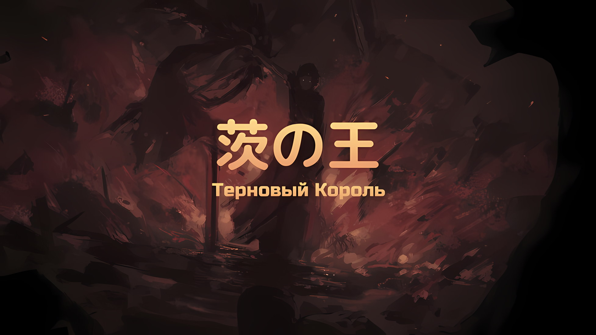
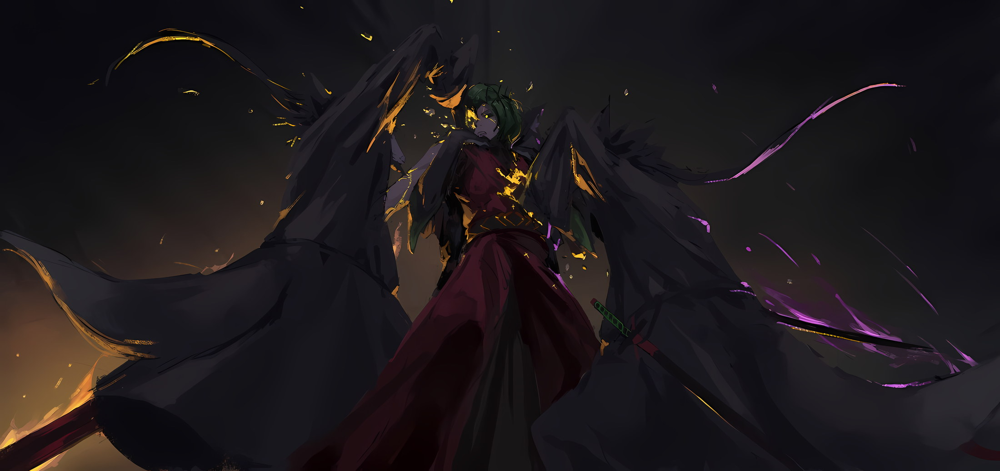

*※※※※※※※※※※※*

…Халибель, известный как «Хвалитель», в полной мере использовал свой титул сильнейшего жителя Городов-государств Карараги.

Даже если провести опрос среди всех Четырех Великих Стран, можно было с уверенностью сказать, что среди шиноби нет ни одного, кто бы мог его превзойти. Даже сильнейший шиноби Империи, Ольбарт, вынужден был бы с горьким выражением лица признать, что Халибель — самый сильный. Его оценивали как равного «Святому Меча», «Безумному Принцу» и «Синей Молнии», наряду с сильнейшими представителями каждой нации, и у него имелся послужной список, за который не было стыдно.

Между Халибелем и тремя остальными было лишь одно отличие: он не принадлежал ни к одной нации, провозгласив себя ронином без хозяина.

«Святой Меча», который был связан договором с Королевством, «Безумный Принц», которого заклеймили как национального предателя и заключили в самую северную башню, даже «Синяя Молния», чей эгоизм славился на весь мир, — они все занимали определенное положение.

Лишь Халибель «Хвалитель» оставался свободным человеком, который не занимал никакой официальной должности.

Конечно, сам Халибель испытывал чувство благодарности и принадлежности к своей родине, и иногда его просили расследовать и решать серьезные проблемы в Карараги. Однако идея о том, что его существование принадлежит кому-то другому, что его используют как разменную монету в переговорах и сделках, была ему крайне неприятна.

…Он становился на сторону тех, кому хотел помочь, и воротил нос от того, что его не интересовало.

Таков был девиз Халибеля как одного из сильнейших. Обладатель столь капризной натуры, естественно, вызывал у знавших его людей две крайности в оценках.

С одной стороны, были те, кого он отвергал со словами: «Без меня вы все были бы просто в порядке, прямо-таки просто, да, вы замечательные».

С другой стороны, были и те, кого он принимал со словами: «Поразительно, что вы способны тронуть такого человека, как я, вы замечательные».

В любом случае, он всегда раскованно говорил о своей похвале другим, и потому его постоянно называли «Хвалителем».

Естественно, это была не единственная причина его прозвища; с каким бы противником или действием он ни сталкивался, Халибель был всегда готов дать ему объективную оценку.

И поэтому…,

Халибель: Блин, похоже, у некоторых заклинателей и впрямь скверные характеры. …В этом нет ни унции любви.

Выпуская дым из своего кисэру, в словах, которые сорвались с губ Халибеля, не было ни капли восхищения.

Тон его голоса был чуть ниже, отчего он звучал раздраженным — те, кто знал его, наверняка бы удивились, поскольку он редко бывал недоволен.

У Халибеля не сложилось благоприятного впечатления об этой нежити, однако бывали случаи, когда размах и результат применения техники заставляли его испытывать некоторое восхищение противником-заклинателем.

Но состояние стоящего перед ним противника не вызывало ни малейшего восхищения.

Халибель: …

Слегка приоткрыв тонкие, как нити, глаза, Халибель взглянул на противника своими золотыми радужками… там стоял Югард, скинувший с себя рваную одежду и владеющий невероятно знаменитым мечом.

Всего несколько мгновений назад один из «Девяти Божественных Генералов», Груви, сражался лицом к лицу с этим грозным противником, однако сейчас он был не в силах стоять из-за тяжести техники, которая переплелась с его душой.

Понимая это, Груви вытер кровь, выступившую у него изо рта.

Груви: Эй, этхо…

Халибель: Сказал же, не заставляй себя говорить. Я и сам вижу. …Тот парниша, он сказал, что хочет поручить это эксперту по проклятиям.

Поглаживая свою бороду одной рукой, Халибель вспомнил мальчика, который направил его к четвертому бастиону.

Винсент признал мальчика, который завоевал огромное доверие своими суждениями об окружающей обстановке, настолько, что даже Анастасия возлагала на него немалые надежды и велела Халибелю как можно больше уважать его мнение.

Из-за глубоких познаний Халибеля в технике проклятий, мальчик поручил ему разобраться с этим противником, который, как утверждалось, был решающим фактором в битве за столицу Империи. При всей хвастливости Анастасии, ему не терпелось в полной мере продемонстрировать истинную силу сильнейшего Карараги.

Халибель: Серьезно, такого я не ожидал…

Без особого энтузиазма Халибель и Груви смотрели на одно и то же.

В левой части груди Югарда, там, где должно было находиться человеческое сердце, виднелся полупрозрачный ядовитый шип… то самое «Терновое Проклятие», которое без разбора распространялось по большей части столицы Империи, разъедало и Югарда.

Из этого загадочного факта вытекали две возможности.

Первая заключалась в том, что «Терновое Проклятие» охватывало даже его создателя, Югарда, и являлось неизбирательным проклятием в самом прямом смысле этого слова.

Однако, по мнению Халибеля, вторая возможность имела бóльшую вероятность оказаться правдой.

Иными словами…,

Югард: …Получеловек, ответь на мой вопрос.

Убедившись, что его правая рука регенерировала, Югард подал голос в их сторону.

Естественно, тем, кому он это сказал и кого пронзил взглядом, был незваный гость, Халибель. На это заявление тот спросил: «Я?» и указал на себя пальцем, после чего Югард кивнул.

Югард: Если суждение мое не ошибочно, ты — человек-волк, я верно говорю?

Халибель: Ах, так и есть. Я человек-волк… С тех пор, как Волакия впала в крайности, мы оказались в положении, когда нам до́лжно стыдиться самих себя по всему миру. Думаю, скоро мы вымрем.

Югард: Ясно. …Ясно.

Вторая часть фразы была наполнена намерением его искоренить, однако Югард спокойно кивнул, будто в подтверждение. Халибель с подозрением отнесся к этой ситуации, в то время как Груви повысил свой хриплый голос, чтобы крикнуть «Эй!».

Халибель: Я же сказал, не заставляй себя…

Груви: Дха невахгно, БХЯХДЬ! Этхо ебхучий Импхеатор…

Югард: …Лично на тебя я зла не держу.

Не успел Груви договорить, как в его голосе заиграла кровь, и это заявление было сделано одновременно с появлением физической формы.

Небрежно пущенный «Меч Дьявола» вспыхнул черным светом и, не обращая внимания на присутствие Груви, пронзил Халибеля насквозь от паха до макушки.

В мгновение ока Халибель был вертикально разрезан на две части.

Груви: …Кхх!

При виде этой ужасной сцены Груви, не успевший вовремя договорить, растерялся, в то время как Югард, разрубивший Халибеля, остался стоять в позе с поднятым над головой «Мечом Дьявола»,

Югард: Однако твоя раса когда-то была причастна к гибели Звезды Моей. Поэтому, подобно людям-кротам, на которых лежит тот же грех, в качестве примера я должен искоренить всех представителей твоего рода.

Халибель: …Ааа, наконец вспомнил. Древний Император-сан, вы были первопричиной нашего вымирания.

Югард: Хм?

Обратившись с речью к убитому противнику, Югард нахмурился, когда последовал ответ.

Перед ним стоял Халибель, чье тело было разрублено на левую и правую части. Югард медленно моргнул, глядя на его тело, каждая половина которого постепенно отделялась от другой.

Югард: Вот так сюрприз. Возможно, даже в таком состоянии тебе еще предстоит погибнуть. Быть может, для тех, кто доводит себя до крайности, это не предел?

Халибель: Довольно занятная оценка. Однако нет. …Просто это не мое настоящее тело.

Как раз в тот момент, когда Халибель игриво рассмеялся, левая и правая части его тела мгновенно обмякли, и на землю упало большое количество черного меха.

Привлекая внимание к такой нереальной сцене, за спиной Югарда…,

Югард: Бездумно подкрадываться к моей спине. Такое не прощается никому, кроме Звезды Моей.

Халибель: Хе, сейчас это не важно.

С противоположной стороны от своего рухнувшего клона тело Халибеля было разрублено пополам ударом правой руки Югарда… «Мечом Света», который тот снова держал в своей руке.

Однако разрубленные верхняя и нижняя половины, которые тут же вспыхнули огнем, снова не были его основным телом.

Только что справившись с внезапной атакой в спину, Югард удивленно воскликнул «Нгх», когда его тело резко опустилось вниз.

Причиной стал третий Халибель, который схватил его за обе ноги и потащил прямо вниз. Он выскользнул из-под земли и поменялся местами с Югардом, который, таким образом, оказался погребен по пояс. Идеально было бы закопать его по шею, чтобы ограничить подвижность, однако,

Халибель: Все будет не так гладко.

Третий Халибель с ворчанием был разорван на куски над горящими останками второго Халибеля.

Вертикальными, горизонтальными и диагональными ударами он нанес сетчатые разрезы и превратил его тело в куски; также этими ударами разрубив землю, Югард выскочил наружу.

С «Мечом Света» в правой руке и «Мечом Дьявола» в левой он восстановил свою боевую стойку.

Орудуя двумя Зачарованными Мечами, которые превосходили человеческие знания, Югард приготовился к бою, и тут на него слева и справа набросились два новых Халибеля. Это была своего рода месть за неиссякаемую атаку нежити, однако увеличение числа Халибелей отличалось от обычной нежити.

Югард: Ты — преданная угроза.

Невозмутимо приняв факт появления клонов Халибеля, Югард одновременно взмахнул двумя Зачарованными Мечами.

Против Халибелей, наступавших слева и справа, каждый Зачарованный Меч был готов нанести смертельный удар… но тут третий Халибель, появившийся позади Югарда, схватил его за руки и остановил.

Халибель: Прошу меня простить, на самом деле я способен потянуть лишь трех.

Сковав его руки, два Халибеля с запозданием использовали свои кисти, чтобы пронзить голову и туловище обездвиженного Югарда.

Как мастер «Метода Потока», острота кисти-копья Халибеля скорее напоминала знаменитый меч, чем заурядный режущий инструмент.

Не промахнувшись, они пронзили правый глаз и солнечное сплетение Югарда, демонстрируя свою мощь, которой было достаточно для мгновенной смерти.

Однако…,

Югард: Не пытайся строить мне козни. Для любого другого, кроме Звезды Моей, это непочтительно.

Сказав это, его непронзенный левый глаз встретился со взглядом Халибеля, и сразу же после этого сияние «Меча Света» заиграло еще ярче. В следующий момент красное зарево вспыхнуло, и все вокруг, включая Югарда, мгновенно охватило адское пламя.

Взрывное распространение огня охватило трех находившихся рядом с Югардом Халибелей и сожгло их дотла.

Затем, спустя мгновение, пламя исчезло, подобно иллюзии, и все трое Халибелей превратились в пепел. Югард, который тоже был обожжен, регенерировал обгоревшую кожу и невозмутимо шагнул вперед.

И тут, оглядевшись вокруг своими золотыми глазами, он заметил, что Груви, который был здесь всего мгновенье назад, исчез.

Югард: Не думал, что он настолько учтив, чтобы отступить. ……Какова же твоя цель?

*△▼△▼△▼△*

Халибель: …Мне это не по нраву. Ненавижу, когда кто-то раскусывает мои уловки.

Оставив Югарда далеко позади на поле боя, Халибель покачал головой и вздохнул от того, что тот доставлял ему немало хлопот, и не только из-за своего мастерства владения мечом.

Югард мастерски управлялся с мощными магическими мечами, оставаясь при этом им неподвластным.

Помимо значительной силы, он был практически бессмертен, поскольку являлся нежитью, и обладал высоким уровнем проницательности. Кроме того, он распознал обман о том, что существует ограничение в три клона, и умело среагировал на смертельно опасные ситуации.

Халибель: Этого я и ожидал от человека, который почти в одиночку переломил ход проигранной войны. Как думаешь, он гордый?

Груви: Еще спхрашиваешь, бхяхдь…

Халибель спросил об этом, а Груви, будучи уносимым с поля боя, трепыхался в его объятиях.

Если бы они остались там, то попали бы в последнюю вспышку пламени Югарда, что сделало бы их положение еще более невыносимым, однако у него не было причин быть слишком благодарным.

В конце концов, сам являясь воином, он мог понять, отчего Груви не хотел быть отстраненным от битвы.

Халибель: Но разве нет шанса, что все это приведет к твоей смерти? Начнем с того, что ты заставил себя двигаться с помощью яда… довольно-таки безрассудный поступок.

Груви: …

Груви был слегка удивлен, что он обратил на это внимание, тогда Халибель шмыгнул носом.

Как шиноби, знакомый со всеми видами ядов, он мог догадаться, что представляет собой слабовыраженный странный запах, смешавшийся с кровью Груви. Что же касается его применения, то Халибель никогда бы не додумался и не стал бы пытаться воплощать это в жизнь, потому одна мысль об этом вызывала у него дрожь.

Халибель: Честное слово, жители Волакии так решительны и пугающи. Не говоря уже об Ольбарте-сан, который по-прежнему ухмыляется, несмотря на то, что лишился своей правой руки. Хоть он и старик, однако ему нет равных.

Груви: А что насчет тебхя…

Халибель: Хмм?

Груви: Чхем дольше — тхем хуевей, вот кхак обычно этхо бхывает, кхриворукхое прокхлятие…!

Халибель: …И это проблема, да?

С нотками растерянности в голосе Халибель ответил Груви, который с трудом совладал со своим окровавленным горлом, состояние которого стремительно ухудшалось.

Именно поэтому он увел Груви с поля боя… не для того, чтобы бросить свои обязанности и бежать из столицы Империи, а как часть стратегии победы.

Безрассудно бросать вызов противнику, ничего о нем не зная, — глупая затея. Сила Халибеля была такова, что он мог победить большинство врагов одной лишь силой, но с этим противником дело обстояло иначе.

Впрочем, это не означало, что его противник был слишком талантлив.

Халибель: Что ж, если бы я и дальше сражался так, как мы сражались, уверен, я бы его победил. Такова правда, однако…

Одной победы над Югардом было недостаточно, чтобы выполнить задание, возложенное на Халибеля.

Халибелю было поручено разобраться с «Проклятием», которое определяло исход решающей битвы за столицу Империи, и простая победа над Югардом не решила бы эту проблему.

Этот факт был самым большим препятствием.

Груви: Твои шипы…

Халибель: Они все исчезли. Это вторая подсказка.

Груви: …А пхервая — этхо ебаные шипхы Императора.

Груви, которого он держал на руках, пока бежал и проворно пинал землю, бросил взгляд на его грудь. Под васу Халибеля не было «Тернового Проклятия».

Это проклятье причиняло невыносимую боль, поэтому неудивительно, что именно оно должно было стать самым большим препятствием на пути борьбы с нежитью. Однако Халибелю еще предстояло предпринять какие-либо активные действия по его устранению.

Шипы исчезли несмотря на то, что для этого ничего не было предпринято. И исчезновение шипов было вызвано не Халибелем.

Это означало, что…,

Груви: Этхот ебханый выбхядох…

Халибель: Судя по тому, как это звучит, мысли у нас с тобой одинаковые. Приятно слышать, что «Мастер Проклятых Инструментов» придерживается того же мнения, что и я.

Груви: Ебханый кхромешный пиздец. Этот выбхядок, его решхение меня пиздецки вывходит из себя…!

Груви выплеснул свой ненаправленный гнев, словно слюну.

Халибель, пребывая в том же состоянии духа, что и Груви, вновь вернул свои первоначальные сомнения и убедился, что вторая возможность, пришедшая ему в голову при виде шипов на груди Югарда, была правильной.

«Терновое Проклятие», логическая причина, по которой шипы впились в грудь Югарда, была проста.

Халибель: Эти шипы… не Император проклял всех людей вокруг себя…

Груви: Егхо Превосходительство Югхард был прокхлят кхакхим-то выблядком, и теперь вокхруг него ебашит это прокхлятие.

*△▼△▼△▼△*

…Югард Волакия, «Император Терний», получил проклятие в рамках диверсии, связанной с «Церемонией Императорского Отбора», обрядом наследования трона Императора, долгое время сохранявшийся в Империи Волакия.

По прошествии всего этого времени нельзя было с уверенностью сказать, кто из противоборствующих братьев и сестер Империи несет за это ответственность и насколько сильный пользователь проклятых искусств был к этому причастен.

Предназначенная только для предстоящей «Церемонии Императорского Отбора», жестокая стратегия, призванная уменьшить число соперников, сильно исказила судьбу молодого имперца, ставшего Югардом Волакией.

……Наложенное на Югарда «Терновое Проклятие» было ужасно жестоким и в то же время простым.

Через терновое связывание ему была дарована невыносимая мука, которая грызла его сердце.

То же самое касалось и людей из окружения Югарда.

Если юный Югард завопит от боли, которую будет причинять ему проклятие, члены его семьи и слуги попытаются его спасти. Но, при попытке приблизиться, все они окажутся под действием проклятия и, таким образом, откажутся идти дальше.

Проклятие было нацелено на то, чтобы убить Югарда в одиночестве и боли… такова была истинная форма «Тернового Проклятия».

Из-за ужасающе безжалостного «Тернового Проклятия» Югард не должен был попасть на «Церемонию Императорского Отбора», став просто трагическим имперцем, чья жизнь быстро оборвалась.

Именно так рассуждал тот, кто приказал наложить на Югарда проклятие; однако здесь произошло огромное, огроменное, настолько огроменное, что оно изменит судьбу Империи, совпадение.

От рождения у Югарда была «Врожденная Анальгезия» — неспособность чувствовать боль.

Таким образом, постоянно действующее «Терновое Проклятие» не даровало боль самому Югарду, а лишь продолжало причинять боль окружающим; в результате чего он остался совершенно один.

Даже его семья и слуги не приближались к нему, и, живя один в подаренном ему особняке, Югард провел свое детство без какой-либо возможности контактировать с другими людьми; он считал, что именно по этой причине выражение его лица всегда было таким жестким, однако вероятность между этим и его природной склонностью была пятьдесят на пятьдесят.

Как бы то ни было, Югард и «Терновое Проклятие» чудесным образом продолжали сосуществовать.

Его контакты с другими людьми были сведены к абсолютному минимуму, но, несмотря на это, все же бывали случаи, когда у него не оставалось иного выбора, кроме как вступить в контакт. В каждый из таких случаев люди, попавшие под «Терновое Проклятие», естественно, сообщали, что «Югард был тем, кто наложил это проклятие», а сам Югард никогда этого не отрицал.

На самом же деле Югард не знал, было ли это «Терновое Проклятие» наложено на него кем-то другим или же он сам вызвал его по неизвестной причине.

Кроме того, наложивший проклятие и, следовательно, знающий ответ, никогда впоследствии не появлялся в жизни Югарда, а тот, кто его заказал, оставался неизвестным.

Поэтому, так и не узнав истинную природу шипов, преследующих его на каждом шагу, «Терновый Король» продолжал свой путь еще долгое-долгое время.

Если бы на него никогда не было наложено это проклятие, то шаги его прервались бы где-нибудь во время «Церемонии Императорского Отбора» и навсегда бы остановились.

Шипы изолировали Югарда, и цель того, кто наложил на него это проклятие, была выполнена, пускай и не в первоначальном виде.

???: Не удобнее ли считать звезды на небе, чем смотреть в темноту?

…Так было до встречи с девушкой, которая, ступив в тернии Югарда, подошла к нему.

*△▼△▼△▼△*

Югард: А я полагал, что ты сделал ноги, человек-волк.

Халибель: Ну, не то чтобы я не думал об этом… Прошу простить, это ложь. Я даже не думал об этом.

Югард: По какой причине ты пытался меня обмануть?

Халибель: Это моя привычка — болтать без умолку. Я буду рад, если вы простите меня, не принимая все это слишком близко к сердцу.

Югард: Обман Императора — дело непочтительное. Однако, учитывая, что ты признал свою ошибку, я пропущу это мимо ушей.

Приветствуя Халибеля, когда тот вернулся на сцену, Югард сдержанно откинул подбородок назад.

Не испытывая неприязни к Халибелю, который в какой-то момент покинул поле боя, а затем вернулся, Югард, стоя в величественной позе, говорил с достоинством Императора.

Даже без силы, его уровень, несомненно, был достоин того, чтобы называться Императором.

Халибель: Неужели такой человек может быть зол, как раскаленная лава? Что же вы, предки мои, могли такое учудить?

Халибель почесал щеку, осознав свою неразрывную связь с Югардом, «Императором Терний».

С точки зрения Халибеля, как человека-волка, Югарда можно было назвать заклятым врагом всей его расы.

Империя Волакия и по сей день являлась средой, в которой люди-волки и полулюди-волки… оборотни, не могли избежать смертной казни и стыдились своей расы перед всем миром. Тем, кто закрепил это как закон, навсегда остающийся в Империи, был не кто иной, как этот самый Югард.

Две расы — люди-волки и люди-кроты — были признаны заклятыми врагами, предавшими Империю Волакия, и за долгие годы истории многие их собратья потеряли свои жизни, а сами они оказались истреблены до грани вымирания.

В будущем эта тенденция вряд ли будет полностью утрачена.

Поэтому, с точки зрения Халибеля, для него было вполне естественно питать такую же ненависть к этому противнику, однако…,

Югард: …Обращение на меня таких глаз прощено не будет.

Халибель: А что за глаза я делаю?

Югард: Глаза, которые при случае делает Звезда Моя. Кроме Звезды Моей, я не помилую никого, кто обратит на меня такие глаза… Мне это не по нраву.

Выслушав ответ Югарда, в котором, скорее всего, не было ни лжи, ни фальши, Халибель глубоко вздохнул и приложил свою руку к левой части груди.

Там не было «Тернового Проклятия». Он — тот, кто должен быть для Югарда мерзким, отвратительным человеком-волком, — не был проклят. …Это еще больше раззадорило чувства Халибеля.

Халибель: Если тот парниша взял и отправил меня сюда, зная заранее, что у меня возникнут такие чувства, то тебе, маленькая Ана, действительно стоит быть начеку.

Прикрыв веки и представляя себе девушку, которую он знал с тех пор, как она была маленьким ребенком, и которая в итоге выросла не очень высокой, Халибель сказал это с кисэру во рту.

Поджигая кончик кисэру, он хорошенько вдохнул дым, а затем выдохнул.

Выдохнув, он принял решение.

Халибель: Ничего страшного, если вы меня не простите, Император-сан. У нас же ведь такие отношения, не так ли?

Югард: Такие отношения?

Халибель: Между людьми-волками и «Императором Терний».

У каждого из них была причина ненавидеть, уничтожить другого.

Указывая на себя и своего противника, Халибель сказал это, но выражение лица Югарда не изменилось. Он не знал, сколько всего было скрыто по ту сторону этого неизменного выражения.

И хотя он не знал, Халибель уже принял решение.

Одной лишь победой над Югардом он не выполнит возложенный на него долг и свою собственную решимость.

А посему…,

Халибель: Я освобожу вас от этого чертового проклятия и сделаю не более чем просто королем, о «Терновый Король».
