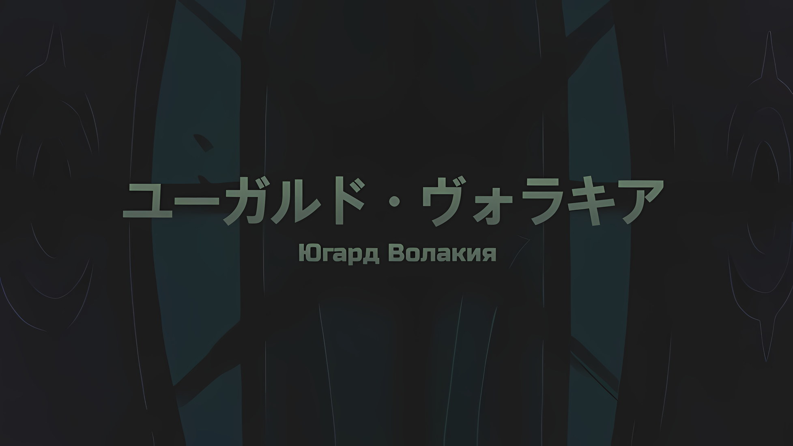
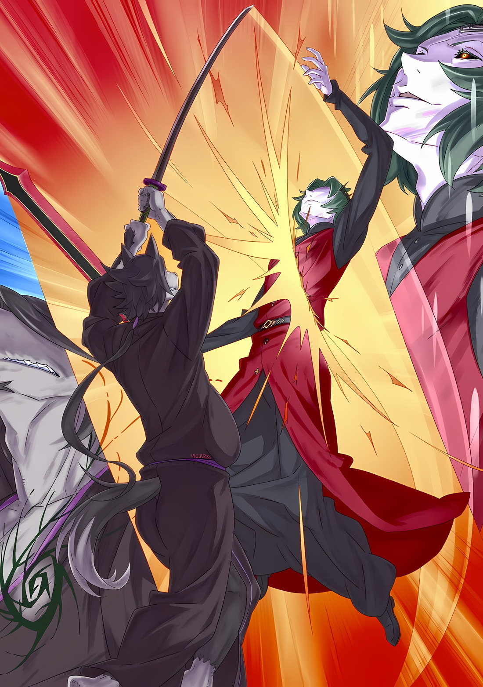

*※※※※※※※※※※※*

…Югард Волакия был королем, вынужденным жить в одиночестве.

Сколько он себя помнил, его мучило «Терновое Проклятие», потому он был вынужден расти в ужасно неуравновешенной среде, где даже его семья и слуги не могли к нему приблизиться.

Из-за своего недуга Югард не испытывал страданий от «Тернового Проклятия», источником которого он был, но по выражению боли и крикам окружающих он понял, что его существование доставляет людям мучения, и посему смирился с жизнью в изоляции.

Что же до «Церемонии Императорского Отбора», то его шансы на победу были весьма сомнительны.

Здравый смысл подсказывал, что, раз уж он заражен «Терновым Проклятием», ему крайне нежелательно занимать трон Императора и возглавлять правительство Империи Волакия.

Даже если бы ему удалось стать Императором, он считал, что не должен существовать Император, который никогда не сможет лично явиться на встречу с важными чиновниками или на переговоры с лидерами других стран.

И вот, решив, что ему не следует побеждать на «Церемонии Императорского Отбора», Югард постановил, что жизнь его закончится в том возрасте, когда начнется церемония.

До этого возраста Югард будет собирать все знания, какие только сможет, и служить Императорской Семье… а именно, для улучшения и сохранения мира в жизни граждан Империи.

Из-за гложущего его «Тернового Проклятия» Югард был вынужден оставаться в одиночестве.

Однако, вопреки обстоятельствам, Югард не считал себя несчастным. Он не чувствовал, что проклят, и, пока существовал рациональный ответ на вопрос «Почему», не гневался на того, кто это сделал.

Кто-то рождается слепым, кто-то калекой. Он полагал, что его неспособность жить бок о бок с другими — всего лишь одна из этих особенностей.

В мире, где люди то и дело теряли жизнь из-за слепоты или искалеченных конечностей, он считал, что ему повезло — он выжил благодаря своему положению члена Императорской Семьи.

Благодаря тому, что Югард происходил из Императорской Семьи, он мог жить без близких, а также никогда не знать голода. За это он и выполнял свои обязанности члена Императорской Семьи.

Как бы ни было ему жаль свою мать и близких ему людей, он никогда не сможет занять трон Императора. …Тогда, по крайней мере, он использует не столь уж долгие годы своей оставшейся жизни ради мира, который его окружает.

…Знакомство с ней стало самой большой ошибкой в жизни Югарда.

Не потому, что он стал желать трона Императора, от которого ему следовало бы отказаться. Он также не отказался от миссии Императорской Семьи.

Просто в душе его поселилось желание жить. …Жить с Ирис, именно так он и возжелал.

*△▼△▼△▼△*

«Терновое Проклятие» было наложено на Югарда Волакию, и действие его было направлено на принуждение Югарда к одиночеству.

Каковы же должны быть условия, при которых это проклятие проявит свою максимальную эффективность?

Противоположностью одиночества можно назвать любовь. Иными словами, «Терновое Проклятие» — это проклятие, которое держит любимых людей на расстоянии.

То есть…,

???: Шипы исчезли с моей груди, поэтому то, что они остались у других, должно послужить ответом.

Халибель слегка прикусил мундштук своего кисэру, похлопывая себя по груди.

Предавшие «Тернового Короля» люди-волки и люди-кроты даже в сказках, которые издавна передавались по наследству, были причислены к изменникам; поскольку сам он был одним из них, шипы исчезли с его груди лишь из-за того, что Югард признал Халибеля человеком-волком, и, таким образом, он не подпадал под условия «Тернового Проклятия».

«Терновое Проклятие» не активируется, если не будет направлено на то, что человеку дорого.

Халибель: Мне, как человеку с огромной привязанностью, остается только гадать, для кого это было плохо.

Смешав разочарование с фиолетовым дымом, Халибель сделал глубокую затяжку из своего кисэру.

Специальный табак, высыпанный в чашу, сгорел за одну затяжку, наполнив дымом необычайно большие легкие Халибеля. В тот же миг, стиснув зубы и подбросив кисэру в воздух, Халибель наклонился, а черные волосы на его спине рассек взметнувшийся по диагонали «Меч Дьявола».

Когда городской пейзаж столицы Империи наклонился по диагонали от этого удара, Халибель шагнул вперед, а за ним — еще три высокие фигуры.

Эти высокие фигуры и были Халибелем, каждый из которых был точной копией остальных.

Однако же…,

Югард: Свидетелем этого акробатического трюка я уже был.

«Меч Света», зажатый в его поднятой правой руке, опустился, и языки пламени охватили путь четырех Халибелей.

Оттенок палящего огня был слишком сильным, создавая на улице завесу из пламени, которая казалась даже белой, что заставило Халибеля и его двойников сделать выбор. А именно: перепрыгнуть через пламя или пойти в обход. Однако Халибель решил не делать ни того, ни другого, а пойти по третьему пути.

Халибель: Это несколько отличается от моего предыдущего трюка.

Двое из четырех Халибелей взяли инициативу на себя, устремив свои ладони в поднимающуюся завесу пламени.

Ладони Халибелей, выпущенные вместе с шагом, от которого разлетались булыжники, двигались подобно таранам, способным одним ударом снести плохо построенные ворота замка. Однако эти два удара были остановлены почти одновременно с пламенем, а возникший ветер превратился в бурю, унося огонь прочь.

Невыразительные брови Югарда слегка дрогнули при этом ударе, но удивляться было еще рано.

Двое отстающих опередили ранее наступавших и с силой врезались в торс Югарда все теми же таранными ладонями.

Югард: …Хк.

Подавив стон в горле, Югард отлетел в сторону. Однако удар был неглубоким. Через мгновение ладони Халибеля поймали плоскую сторону «Меча Света», и он тоже оказался отброшен назад.

Несмотря на то, что атака Халибеля не была полностью сведена на нет, Югард был вынужден признать его выдающиеся боевые навыки, невзирая на свое положение Императора.

Не будь он Императором, он бы чувствовал себя так, словно потерял лицо, ведь его противником был всего лишь шиноби.

Но ничего не поделаешь.

Учитывая свое телосложение, он не мог полагаться на подчиненных для своей защиты. Императору оставалось только защищаться самому.

Халибель: Я не собираюсь сдерживаться.

Не обращая внимания на обстоятельства, погоня за Югардом не ослабевала.

Чтобы погасить инерцию полета назад, Югард заскользил ногами по земле, повернулся в сторону голоса Халибеля, прозвучавшего неподалеку, и попытался нанести косой удар поворотом тела.

Находившийся там Халибель получил диагональный удар и тут же исчез в россыпи меха. Прямо под ним еще один Халибель взвился в воздух, настигнув пучеглазого Югарда.

Югард: Мгхх…

Получив удар в спину, Югард взлетел, и на него со всех направлений обрушились удары Халибелей. Со всех сторон появлялись зеркальные изображения людей-волков, которые размахивали руками, нанося удары карате. Югард, однако, не собирался сдаваться и использовал против них разрушающую способность «Меча Света».

В сущности, при взрыве атмосферы, вызванном сверхбыстрым нагревом, их движение будет нарушено.

Яркий, раскаленный докрасна «Меч Света» крутанулся во взрыве, и удар Югарда, описав круг в воздухе, разрубил всех четырех Халибелей пополам.

Мгновенно все четыре Халибеля вспыхнули пламенем… превратившись в мех.

Тут же сверху последовал мощный, как боевой топор, удар локтем в голову Югарда, и Император, вращаясь в вертикальной плоскости, рухнул на улицы столицы Империи, образовав круглый кратер, который сопровождался взрывом.

Приземлившись рядом с кратером, Халибель быстро протянул руку и поймал ртом кисэру, которое подбросил перед самым столкновением.

А затем…,

Халибель: От такого обычно умирают, но, полагаю, все будет не так просто?

Югард: …Безусловно.

Среди рассеивающегося дыма голос Халибеля, когда он посмотрел в центр кратера, был встречен спокойным ответом.

Хотя было довольно обидно не нанести никакого урона, несмотря на все, что он сделал, результат оказался ожидаемым, так что эмоций было по минимуму. В этом противостоянии Халибель пересмотрел свою оценку «Меча Света» и «Меча Дьявола». Изначально он считал, что «Меч Дьявола» более опасный, однако «Меч Света» оказался куда грознее.

И более того…,

Югард: Ты используешь одновременно и полых клонов, и клонов с веществом?

Поднявшись в кратере, Югард проанализировал их бой, состоявшийся всего несколько мгновений назад.

Не подтверждая и не отрицая правильности или неправильности его наблюдений, Халибель слизнул языком кровь, стекающую из пореза на своей левой щеке, и ответил молчанием.

Югард: Освоение такой техники требует леденящих кровь испытаний. Это достойно похвалы.

Халибель: Что ж, спасибо.

Его ответы были немногословны, дабы не выдавать лишней информации, однако замечание Югарда было верным.

Клонов «Разделения Тела» Халибеля можно было разделить на два типа: иллюзии из меха и настоящие клоны, по сути своей не уступающие настоящему телу Халибеля.

Суть боевого стиля Халибеля заключалась в издевательстве над противниками, и даже просто иллюзии могли полностью покорить любого среднего противника.

Беда была в том, что Югард — далеко не рядовой противник, и, вдобавок, фирменная техника Халибеля — искусство проклятий — с ним не работала.

Техники, призванные убить, не действовали на уже мертвого противника.

Не говоря уже о том, что душа Югарда и так была проклята настолько сильно, что никто другой превзойти его в этом отношении не мог.

И все же…,

Халибель: Если я не выполню то, что наметил, меня отругает маленькая Ана.

Повертев кисэру в руке, он поместил в чашу очередной кусок табака, после чего его зажег.

Как и прежде, он одним махом наполнил свои легкие дымом и обманул свой мозг иллюзией прилива сил к конечностям. Затем он направил свою следующую атаку на Югарда, который находился в самом центре кратера…,

Югард: Так не пойдет, ты слишком грозен. Остается только продемонстрировать свою истинную силу.

В следующее мгновение Югард выпрыгнул из кратера и поднял перед собой «Меч Света».

Как только «Меч Света» начал падать в атаке, Халибель спешно вмешался, однако целью его стал не меч, он поймал правую руку Югарда, чтобы блокировать атаку.

Сразу же после этого за спиной Халибеля прошла ударная волна, в результате которой искореженные и испепеленные остатки зданий столицы Империи превратились в разрозненные угли.

В данный момент Югард держал в руке лишь одинокий «Меч Света». «Меч Дьявола», который до этого находился в его левой руке, был засунут в кратер и оставлен.

Он не отказался от мощного оружия.

Югард: Вместо орудования двумя мечами, к чему мне еще предстоит привыкнуть, я столкнусь с тобой посредством одного клинка, коим я владею в совершенстве.

Халибель: Серьезно, вы чертовски неприятный тип, Ваше Превосходительство Император.

Во всех случаях выбор наименее предпочтительного варианта противника изначально был стилем шиноби.

Против Югарда, решительно и проницательно претворявшего это в жизнь, Халибель держал его руку скованной и заставлял своих клонов наступать с трех разных сторон.

Первый ударил ладонью, второй ударил ногой, а третий, стукнув по камню, который они достали из-под земли, разбросал летящие обломки… Югард, держа руку поднятой, отражал их своим непревзойденным мастерством фехтования.

«Меч Света» в его правой руке мгновенно исчез, а затем вновь появился в левой, благодаря этому он смог отбросить трех приближающихся Халибелей, попутно их испепелив.

Двое из них оказались клонами из меха, однако тот, кто совершил атаку каменной дробью, был настоящим телом.

Почувствовав запах горелого меха, Халибель нанес удар карате, который врезался в щеку пролетавшего мимо Югарда, и через несколько секунд прогремел бой сверхвысокого класса.

*△▼△▼△▼△*

…Здесь кроется ирония, которую следовало бы назвать поворотом судьбы.

«Терновое Проклятие» вынудило Югарда к одиночеству, но само оно не приносило Югарду, страдавшему врожденной анальгезией, никакой боли. Однако, даже если Югард и был лишен боли, проклятие все равно въедалось в его тело, и он продолжал получать его последствия.

Он испытывал удушье из-за гнетущей природы проклятия, и потому его действия были ограничены. Воздействие проклятья определяло количество оставшегося времени, что было весьма некстати для Югарда, который уже решил, чем займется.

Уровень согласия между его телом и разумом был неясен.

Однако в какой-то момент воздействие «Тернового Проклятия» перестало оказывать на тело Югарда какое-либо влияние, в результате чего он смог в полной мере действовать во имя достижения собственных целей.

Иными словами, тело Югарда окрепло и стало способно справляться с постоянной опасностью. …В этой иронии кроются подробности того, как родился сильнейший Император в истории Империи.

Перестроившись для того, чтобы просто жить, тело Югарда служило основой для развития его механического трудолюбия.

Находясь в положении, когда к нему нельзя было приставить охрану, Югард тренировался, чтобы суметь за себя постоять; получив талант, а также тело, способное полноценно его использовать, он становился все сильнее и сильнее.

Эта гипотеза не имела смысла, но поскольку «Терновое Проклятие» сделало Югарда сильнее, его сила и умение владеть мечом стали такими, что, даже если бы «Терновое Проклятие» отсутствовало, он все равно смог бы уничтожить «Девять Божественных Генералов» той эпохи.

В действительности же битвы Югарда почти всегда сводились к тому, что он обезглавливал своего противника, который страдал от воздействия «Тернового Проклятия», и его сражения с «Девятью Божественными Генералами» проходили в основном так же.

Для Югарда битвы были не состязанием сил, а скорее ситуацией, в которой он должен был исполнить обязанности палача.

Югард: Я воздаю тебе хвалу.

Это не столь широко известный факт, но, среди всех Императоров Волакии, Югард Волакия произносил эти слова чаще других.

Именно потому, что они стояли не на одной ступени, именно потому, что он понимал свое положение, которое отличалось от положения остальных, Югард был щедр на хвалу в отношении других.

Таким образом, эта встреча была весьма иронична.

Ирония заключалась в том, что «Император Терний», который за всю историю Империи больше всех воздавал хвалу другим, и человек-волк, который в наши дни перенял этот образ жизни, назвав себя «Хвалителем», столкнулись вот так, порознь, жизнь и смерть.

Но в этой случайной встрече была еще одна ирония, которую следовало бы назвать поворотом судьбы.

Как уже говорилось, битвы всегда были для Югарда делом односторонним.

По мере того, как «Терновое Проклятие» разъедало его цель, Югард сталкивался с врагами, состояние которых никак нельзя было назвать идеальным или обычным, а затем отсекал им головы; он никогда не добивался победы иным способом.

То общее представление, которое Югард Волакия имел о «Битвах», начало меняться.

В результате его ожесточенной схватки с «Хвалителем», Халибелем, человеком-волком, который не получил проклятия, в нем произошли перемены.

Югард: Ха…

Когда из слегка приоткрытого рта Югарда вырвался вздох, вспышка его клинка окрасила мир в багровый цвет.

Огненная вспышка меча по диагонали рассекла воздух, но на пути, который она прочертила, нигде не оказалось фигуры высокого человека-волка. Его противник перестал беспорядочно выпускать клонов и перешел к тщательному маневру уклонения.

Его целью было не выиграть время, а убедиться в мастерстве Югарда.

Югард: Прекрасное решение.

Искренняя хвала, подчеркивающая, что это было правильное решение, наполнила сердце Югарда.

Несмотря на плохое качество кожи, воскрешенное тело Югарда было в отличной форме, и он даже питал заблуждение, что может двигаться без устали.

Конечно, на самом деле все было не так. Это тело не могло превзойти его силы при жизни, и ему не стоило желать чего-то большего, чем способность восстанавливаться при любых повреждениях.

Даже тела нежити все равно чувствовали боль.

Таким образом, Югард стоял здесь один, как хранитель этого места. Даже если бы остальные были нежитью, пока они входили в зону действия проклятия, их бы все равно мучила связь.

Ибо, даже если они были нежитью, Югард не собирался без разбору причинять боль народам своей страны.

И прежде всего…,

Югард: Я не хочу, чтобы кто-то помешал нашей битве.

Битва, это действительно была битва.

Соревнуясь в мастерстве с Халибелем, изменяя саму форму столицы Империи, Югард направил всю свою мощь в руку, держащую «Меч Света», и с головой окунулся в схватку с врагом, который отказывался умирать.

С момента своего рождения, с момента своей смерти, это был первый раз, когда он почувствовал, как внутри него поднимается дух при замахе мечом на другого.

Впервые он причинил смертельное ранение человеку, когда убийца, ворвавшийся в его особняк, где он жил в изоляции от своей семьи, бился в агонии прямо во внутреннем дворе, держась за грудь и умоляя Югарда его прикончить.

С тех пор, в возрасте семи лет, Югард впервые лишил человека жизни. Для него извлечение меча было равносильно казни.

И как же это было?

Чувство того, что он в совершенстве владеет своим искусством владения мечом, но при этом стремится к жизни, которой не может достичь, — ох, какое же это было восхитительное и почитаемое чувство.

Югард: …

Вытянутая вперед рука Югарда была поймана сверху, а снизу — коленом и ударом карате противника, раздробив ему локоть. «Меч Света», выпавший из его руки, растворился в воздухе, и, переложив его в неповрежденную правую руку, он сверкнул горизонтальным ударом.

Его противник уклонился, скользнув по земле и задев кончиками пальцев левое бедро Югарда, в результате чего в его бедре образовалась дыра размером с кулак.

Развернувшись, он попытался достать «Мечом Света» далекую спину, однако ему помешала вытянутая рука клона с противоположной стороны; одновременно нанеся удар ногой в грудь клона, тот яростно отлетел. В сторону. Прочь.

Югард: Полшага.

В следующий раз он сделает еще полшага.

Несмотря на то, что мастерство Югарда в фехтовании всего за десять с лишним секунд до этого потерпело неудачу, он был уверен, что сможет сделать это в следующий раз. Это был подвиг, который он не совершал ни при жизни, ни после смерти, однако он мог представить себе бесчисленное множество вариантов для его выполнения.

Таков был рост жадной до отчаяния нежити.

…Загнанный в одиночество «Терновым Проклятием» и сменивший представление о сражениях на казни, Югард Волакия не имел возможности совершенствовать свою силу как воина.

В целях самообороны он мог тренировать меч столько, сколько надо в силу его уникальных обстоятельств, но большего и не требовалось.

Сейчас мастерство Югарда стремительно набирало огромный опыт, становясь все более и более отточенным.

Югард совершенно не осознавал, что против него выступает сильнейшее существо Городов-государств Карараги… существо, входящее в пятерку самых могущественных личностей нынешнего мира.

Но, впитав такой огромный боевой опыт в ходе этого противостояния, Югард, став нежитью, смог вырасти в существо, кое жадно становилось сильнее, гораздо сильнее, чем он был при жизни.

Югард: Я воздаю тебе хвалу… Нет, я выражаю тебе благодарность.

Таким образом, то, что лилось из уст Югарда, было не хвалой, а скорее благодарностью.

Потомок отвратительных людей-волков вызвал у Югарда сильные эмоции, которых он никогда прежде не испытывал. Поскольку это не было неприятным, то и оценка того, кто эти чувства подарил, должна быть соответствующей.

Это было то, что исходило из глубин сердца Югарда.

Халибель: Не стоит благодарности. Ведь, в конце концов, выиграю я.

Как всегда, быстрые ответы Халибеля были непочтительны, однако же эта непочтительность освежала.

Если вспомнить, Югард почти не сталкивался с разговорами, возможно потому, что люди не хотели выступать против «Тернового Проклятия». Не считая тех, кто решил его предать, только Ирис высказывала Югарду свое мнение.

Югард: …О Звезда Моя.

Как только Югард пробормотал это, фигура человека-волка растворилась перед ним, словно туман.

Сочетая особую технику ходьбы с невероятной скоростью передвижения, возникла оптическая иллюзия в форме, отличной от клонов. При виде остаточных изображений, послеобразов, Югард не мог не восхититься этой способностью.

Однако не стоило обманываться таким дешевым трюком. Приближающиеся существа находились прямо сверху, слева и справа от него; уловив, что смертоносные удары яростно приближаются, Югард повернулся в другую сторону, не теряя при этом самообладания.

Затем, пройдя на полшага дальше, чем в прошлый раз, он шагнул в тыл.

Югард: Ты явственно рассеиваешь свое присутствие. …Следовательно, направление, где нет никакого присутствия, — это место твоего истинного обитания.

Халибель: Гху.

Угол поворота был недостаточен, но все же нижняя часть рукояти «Меча Света» вонзилась в бок Халибеля. В тот момент, когда Югард почувствовал, как ломается кость его противника, он тут же пустил тепло по лезвию «Меча Света»… последовавший взрыв позволил нижней части рукояти меча вонзиться еще глубже, разрушая внутренности Халибеля.

Югард: ОООООО…!!!

Ударом такой силы, что он сломал себе запястье, Югард отбросил Халибеля.

Осознав, что он невольно закричал, когда отбросил своего противника, Югард испытал легкий шок. В его поле зрения отлетевший Халибель врезался в бастион, отчего стена с силой раскололась; высокий человек-волк вскинул ноги и опустил голову.

Это была вся сила Югарда. Он нанес мощнейший удар, самый отточенный из всех, которые ему доводилось наносить при жизни и после смерти.

Это ощущение вновь и вновь возвращалось к нему во время боя с Халибелем. Полшага, он продвинулся на полшага дальше. В следующий раз он сможет сделать еще полшага, а затем и еще полшага.

Или дальше, еще дальше, туда, где простирались зрелища, подобных которым Югард никогда не видал.

Если Халибель встанет на ноги и продолжит сражаться, он, возможно, постигнет и это. Отныне — *подъем… подъем, подъем и в бой*; Югард осознавал, что эти мысли идут из глубин его души…

Югард: …Я должен поспешить к Звезде Моей. С тобой я закончил.

Используя подъем духа, близкий к пику, и свои сильные эмоции воина, он превратил их в любовь к Ирис.

Халибель: …

Ему следует признать это. Битва с Халибелем действительно подняла его дух.

Во всех мыслимых смыслах это был стимул, которого он прежде не испытывал. Он понял, что на этом пути самосовершенствования, по которому он никогда не ступал, существуют такие зрелища.

Он не знал, удастся ли ему когда-нибудь в будущем получить столь же значимый опыт.

Однако, даже так, несмотря ни на что.

Югард: Это не идет ни в какое сравнение с тем, когда Звезда Моя находится в поле моего зрения, будь то даже миг.

Таково было чувство ценностей Югарда, то, что никогда не менялось ни при его жизни, ни после его смерти.

Какими бы ни были неизвестные стимулы или поднятие духа, они не смогли бы достучаться до Югарда, который знал Ирис.

Несмотря на то, что Югард осознавал, что должен от него отказаться, он желал получить трон Императора, потому что понимал, что без него он не сможет продлить время, проведенное с Ирис, ни на секунду.

Получив трон в обмен на этот эгоизм, он продолжал исполнять свои обязанности Императора несмотря на то, что время, прошедшее после потери Ирис, было намного дольше, чем время, проведенное с ней.

Югард Волакия был Императором, который за период своего правления меньше всего времени проводил в Кристальном Дворце.

Потеряв Ирис, Югард провел большую часть своей Императорской жизни в одиночестве. Он даже поставил перед собой цель произвести на свет наследников при минимальном контакте и посвятил свою жизнь Империи.

Все остальное в своей жизни он делал ради Ирис.

Посему…,

Югард: …Вот и твой конец, о черный человек-волк.

Решив, что медлить больше не стоит, Югард взял в руку «Меч Света» и направил свои стопы к бастиону.

Затем он вознамерился вспышкой меча испепелить рухнувшего Халибеля… но не смог. Как только он взмахнул «Мечом Света», правая рука Югарда оторвалась от плеча.

Югард: А?

От удара, который не вызвал у него никаких ощущений, Югард поднял брови. Но вершиной его шока стало то, что произошло после. …Рука его перестала регенерировать.

Осколки его правой руки разлетелись вдребезги, словно керамика, а «Меч Света» вонзился в землю.

И тогда…,

Халибель: …Наконец-то — мертвая точка.

На выдохе Халибель, поднявшись, негромко сказал это. Прислонившись спиной к изломанной стене, человек-волк встал на ноги и положил кисэру в рот.

Медленно насыпав в чашу табак, он щелкнул пальцами, дабы его поджечь, и вдохнул дым в легкие. Наблюдая за этим, Югард провел пальцем по ране своей правой руки, которая никак не заживала.

Рука, отсутствовавшая от правого плеча и далее, не подавала никаких признаков начала регенерации.

Он отчетливо понимал это. Правая рука Югарда стала первой частью его воскрешенного тела, которая умерла заново.

А сделал это стоящий перед его глазами Халибель. Похоже, это было результатом «Мертвой Точки», о которой он сказал.

Югард: Есть еще множество вещей, о коих я не знаю.

Халибель: Не правда ли. Просто фантастика, что я смог вас этому научить. Люди-волки вот-вот были бы стерты с лица земли, однако у меня получилось.

С улыбкой прочистив горло, Халибель кивнул, выпуская дым из ноздрей.

Универсальность этого человека-волка не раз поражала его, но это был высший класс. Подумать только, он даже владел техникой убийства нежити, его навыки и опыт внушали ужас.

Югард: Подобно тому, как отсек ты мою руку, теперь лишишь меня и жизни?

Халибель: В конце концов, моим намерением было понаблюдать за вами. Кажется, это будет трудновато, но… думаю, я смогу это сделать, вы согласны?

Югард: Хвастовство твое непочтительно. Однако, поскольку оно освежает, я его прощу.

Левой рукой вытащив из земли «Меч Света», он встретился взглядом с Халибелем. Хотя он не мог прочесть выражение лица Халибеля, который стоял в расслабленной позе, это заявление и поведение были дерзкими, в них отсутствовал блеф.

Оппонент Югарда уже готовился сразить его. Когда клокочущая в его груди страсть, то, что он впервые осознал, вновь разгорелась, он тут же ее растоптал.

Чувствуя в себе неведомую алчность, он мог четко заявить следующее.

В этом мире не существовало такого сияния, которое могло бы удовлетворить Югарда больше, чем Ирис.

Вот почему…,

Югард: …Шестьдесят Первый Император, Югард Волакия.

Халибель: …Халибель, «Хвалитель».

Они представились друг другу, и в следующий миг фигуры Югарда и Халибеля исчезли, как и исчезло само время.

Югард: …

Позади каждого из них, когда они ринулись вперед, взорвалась выбитая земля, и тотчас же поднялись клубы дыма. Используя эти взрывы в качестве движущей силы, десятки метров между Югардом и Халибелем превратились в ничто.

С такой невероятной скоростью, что казалось, будто мир сжался, клинок Югарда в предвкушении рассек воздух. Вырвавшийся на волю красный разрез окрасил свою диагональную траекторию в глубокий багровый цвет, а через мгновение в воздухе возникла палящая температура, способная расплавить даже камень и обратить его в жидкость.

Однако Халибель слегка наклонился, чтобы увернуться от удара, и, лишь слегка опалив свою плоть на спине у правого плеча, подался вперед.

Затем, направившись к Югарду, у которого не было руки, Халибель поднял переднюю ногу, совершая удар; Югард приподнял колено, поймал этот удар, и между ними возникла ударная волна.

Ударная волна разнесла пламя и обломки вокруг них, и на расстоянии, на котором они могли чувствовать дыхание друг друга, они яростно обменивались ударами. Меж ударами карате и драгоценным багровым мечом, меж ударами ногами и локтями переплетались приемы тарана и захвата. Мгновения ближнего боя по частям уничтожали тело Югарда.

Но и его противник тоже получал повреждения.

Как ни странно, несмотря на отсутствие руки, усталость у обеих сторон была примерно одинаковой.

Поэтому, чтобы обеспечить себе победу, Югард мысленно сделал еще полшага вперед.

Югард: ……«Меч Света» Волакия.

В разгар их поединка драгоценный меч, имя которого было названо, исчез из руки Югарда.

Вложенный в небесные ножны, он представлял собой высшее сокровище, которое могло быть свободно извлечено вновь. Отпустив меч, его опустевшая левая рука поймала колено Халибеля, и он сцепил взгляд с нитевидными глазами своего противника.

По иронии судьбы, и у человека-волка, и у нежити глаза отличались золотым цветом; вот только что же видели эти глаза? Вложив в челюсти силу, достаточную для того, чтобы прокусить мундштук своего кисэру, Халибель сильно отклонился назад.

Над его головой пронесся «Меч Света», который был выпущен с неба и едва его не задел.

«Меч Света», находившийся в небесных ножнах, был извлечен вновь. Используя этот механизм введения и выведения меча из ножен, Югард нанес смертоносный удар… хотя он использовал его впервые, от него великолепно уклонились.

Однако, поскольку его стойка была нарушена, Халибель воспользовался импульсом, полученным при отклонении назад, чтобы упереться руками в землю, и стал яростно совершать сальто назад, уклоняясь, уклоняясь и уклоняясь от следующих друг за другом ударов.

Когда Халибель ускользал от него, Югард на мгновение задумался, чтобы нанести следующий удар мечом… и тут он кое-что заметил.

Югард: …

За прыгающим назад Халибелем виднелся кратер в земле, который сделал Югард.

Вдруг, в этот кратер прыгнула маленькая фигурка, появившаяся из-за пределов поля боя… это был Груви. Груви Гамлет, который должен был уйти с поля боя, прыгнул туда, выкашливая кровь.

В том направлении, куда он мчался, в кратере был воткнут «Меч Дьявола», и он хотел протянуть к нему свою руку…,

Югард: Великолепная координация. …Однако…

Он не назвал внезапное вторжение актом трусости.

Он с самого начала знал о существовании Груви. То, что Груви помог Халибелю, было вполне естественно, ведь они были союзниками. Иначе и быть не могло.

Но он не допустил бы такого поступка. Преодолев даже это, Югард одержит победу.

Югард: …Я не позволю тебе взять «Меч Дьявола».

Держа «Меч Света» наперевес, Югард метнул его в Груви, когда тот прыгнул к кратеру.

В тот же миг скорость драгоценного меча увеличилась, из него вырвался огонь, а затем, превратившись в луч багрового света, он пронесся мимо Халибеля и с бешеной скоростью устремился к Груви.

Даже если он выпустил его из руки, сила «Меча Света» была такова, что он мог вернуть его в любой момент.

После того, как драгоценный меч разрубит Груви, он вернет «Меч Света» в свою руку и бросит вызов Халибелю. В этот момент его тело стало легче — без «Меча Света» он преследовал Халибеля.

Конечно, он также учитывал возможность того, что Халибель заранее рассчитывал на это и собирался предпринять контратаку, поэтому он приготовился и…,

Груви: …Кх.

Брошенный «Меч Света» пролетел по прямой траектории и пронзил маленькое тело Груви.

Несмотря на то, что Груви изогнулся всем телом, драгоценный багровый меч все равно вонзился в его правый бок. Когда лезвие глубоко вошло в его тело, Груви расширил глаза, выкашлял сгусток крови, а затем издал истошный вопль…,

Груви: …Мы тя развели, сын дерьма.

Меч не вытащили.

Вместо этого окровавленный рот Груви сложился в улыбку, и он вытянул палец, указывая на Югарда. Это было непочтительно, но помимо этого в глазах Югарда возникло потрясение.

Рука Груви всего в одном шаге не дотянулась до «Меча Дьявола». Едва он успел к нему прикоснуться, как меч выскочил из кратера, словно желая вырваться из его рук, и улетел прочь.

Груви: Просто, чтоб ты знал, эта сучья катана меня на хуй не переносит…

Это было выше его понимания, однако такие странные идиосинкразии были неизбежной частью Зачарованных и Драгоценных Мечей.

Вырвавшись наружу, «Меч Дьявола», вращаясь, вылетел из кратера, как вдруг его поймала рука, поросшая черным мехом, — на лезвии замерцал завораживающий блеск.

…Взяв в руки «Меч Дьявола», Халибель приготовился предстать перед Югардом.

Югард: …

На краткий миг боя Югард вспомнил о «Мече Света»; из живота Груви, в котором более не было драгоценного меча, хлынуло огромное количество крови.

Югард, естественно, взял в руку свое оружие и направил его на Халибеля, который держал в руках «Меч Дьявола».

Затем, когда багровая вспышка взметнулась вверх, он нанес удар, который показал высочайшее мастерство владения мечом за все время существования Югарда,

Халибель: Правда, это чертовски похвально. …Если б на этом месте был не я, то такой удар полностью уничтожил бы любого.

Югард: Какая высокомерная манера речи. Однако, принимая во внимание этот выдающийся подвиг, я ее прощу.

Когда Халибель сделал это заявление с такого близкого расстояния, Югард откинул подбородок назад, не меняя при этом выражения лица.

Получив сокрушительный удар «Мечом Дьявола», который превзошел его самый лучший удар, тело Югарда было рассечено наискосок.

Именно Халибель совершил этот подвиг… вокруг левой стороны его груди было сплетено «Терновое Проклятие».

То, что Югард Волакия от всего сердца восхищался «Хвалителем», было совершенно очевидно в отношении двух скрестивших мечи людей.
