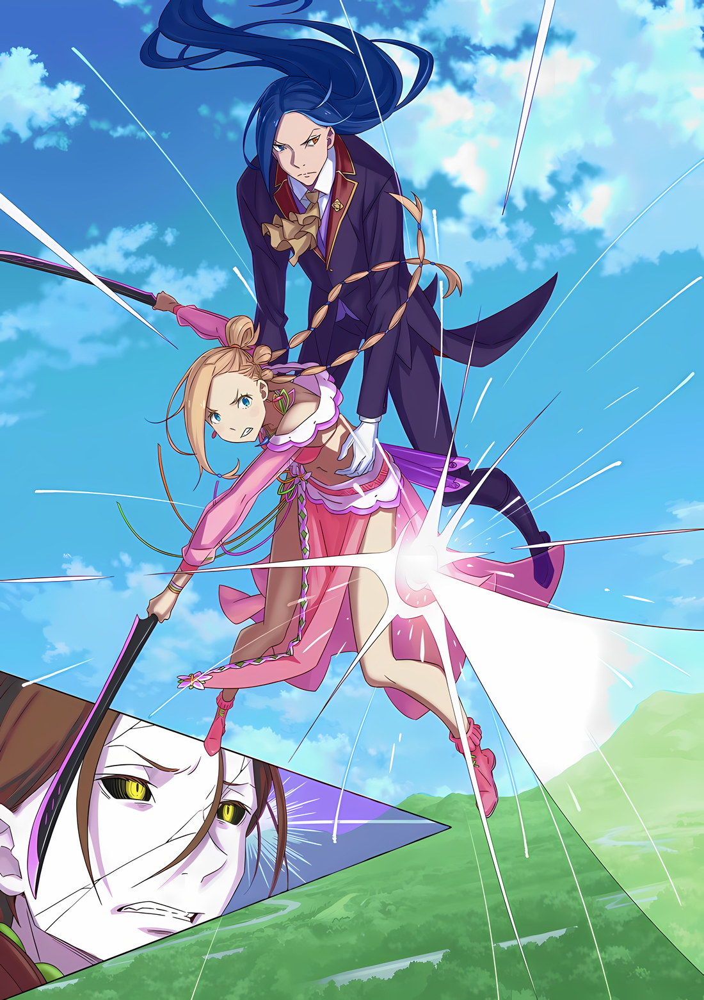
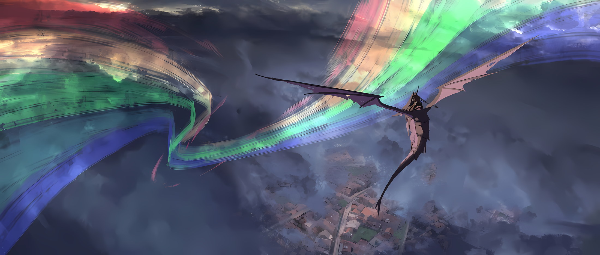

Фанарты: Rokaroka

*※※※※※※※※※※※*

…Розвааль L. Мейзерс был главным магом Королевства, да и всего мира.

Если бы кто-нибудь спросил у него об этом, он с бесстрашной улыбкой и уверенностью в себе подтвердил бы это мнение с условием, что: «На сегодняшний день, пожалуй, так оно и ееесть~».

Как только Розвааль отметил бы, что так обстоят дела в нынешнюю эпоху, в выражении его лица не было бы никакой досады. Вместо этого в его гетерохромных глазах отразилась бы глубокая любовь и чувство одиночества, будто он чего-то жаждет.

Когда он говорил о магии, это была та эфемерная страсть, что никогда не исчезнет из души Розвааля, и никто, кроме Рам и Беатрис, о ней не знал; даже он сам.

Исходя из этого, положение Розвааля, как величайшего мага на сегодняшний день, нисколько не колебалось.

Объявив это Медиум О'Коннелл, когда она бросила вызов в решающей битве, он взмыл в небо с ней на руках и столкнулся лицом к лицу с «Магическим Стрелком», который поднялся на большие высоты… учитывая, что Розвааль был уверен и горд в своей магии, он оценивал шансы на победу здесь как низкие.

Розвааль: …

Проникнув в небеса столицы Империи с юго-запада, Розвааль увидел, как небо над Кристальным Дворцом на севере окрасилось в ярко-красный цвет и расцвело множеством взрывов пламени. Розвааль был тем, кто послал этот огненный дождь, однако именно дракон и его всадник, которые взлетели из дворца, превратили его в огненные взрывы… или так казалось.

Причина этого «казалось» заключалась в том, что глаза Розвааля были неспособны засечь цель, движущуюся на огромной скорости с расстояния в несколько километров.

Это не было проблемой зрения Розвааля. Просто человеческий глаз был на такое не способен.

Однако Медиум и противостоящий ей «Магический Стрелок» преодолевали этот недостаток с помощью Божественной Защиты и какой-то другой техники, и потому они могли визуально идентифицировать друг друга.

В доказательство этого…,

Медиум: …Уу, хияя!

Вместе с восхитительным боевым кличем Медиум взмахнула своим варварским мечом, пока ее держали на руках.

Она находилась в состоянии, когда полностью зависела от другого. Ее равновесие никак нельзя было назвать хорошим, однако варварский меч Медиум все же поймал приближающуюся пулю света и, со звуком, похожим на всплеск воды, разрубил ее.

Застыв от удара и чувствуя, как разрубленная пуля света проносится позади них и рассеивается в ману, Розвааль не мог не содрогнуться от скорости и точности этой атаки.

…Это была магическая техника для убийства, доведенная до невероятного совершенства на самом пике мастерства.

Он мог предположить, что выпущенная световая пуля была разновидностью «Магии Света», однако она отличалась от Дзивальда, который стрелял раскаленным лучом света; технику выстрела такой световой пули нельзя было отнести ни к одной категории, ведь она была оригинальным творением.

Он не мог сказать ничего определенного по прошествии краткого мгновения боя, однако, вероятно, техника заключалась в подготовке света, схожего по форме и природе с сосульками Эмилии, и последующем пробитии жизненно важных органов противника. Следует отметить, что вместо пули изо льда или земли, которая сохраняла физическую форму, здесь использовался свет.

Благодаря тому, что световые пули не останутся в теле, противнику будет сложно распознать истинную природу атаки, к тому же область вокруг раны будет выжжена, что легко приведет к серьезным последствиям.

Розвааль: Превосходная магия.

Розвааль оценил это как атаку, несомненно, достойную называться «Магическими Пулями».

Если противник придумал это сам, то он должен обладать талантами, которые позволят ему стать первоклассным магом. Но на данный момент он, скорее всего, не желал такого престижа. С точки зрения Императора, он уже получил наивысшую оценку, став одним из «Девяти Божественных Генералов».

Не говоря уже о том, что трудно было представить, чтобы кто-то мертвый желал такой славы.

Розвааль: *Начнем с того, что даже при жизни он не был человеком, который цеплялся за славу или престиииж~. Я слышал об этом от тех, кто был с ним близок, и от того, кто был свидетелем его последних минут.*

Что касается информации о «Магическом Стрелке»… Балрое Темегрифе, то людей, знавших его при жизни, было неожиданно много, так что у Розвааля оказалось больше шансов узнать о нем, чем он надеялся изначально.

Однако то, что он услышал от О'Коннелл, было в основном отзывами о его личности, причем у Серены в тот момент появилось нехарактерное для нее чувство вины. Итак, Розваалю не удалось получить от них желаемую тактическую информацию, однако… появился непредвиденный свидетель.

Это был…,

Розвааль: *…Никогда бы не подумал, что Юлиус-кун был тем талантливым человеком, который победил этого «Божественного Генерала».*

Заботясь о том, чтобы Медиум, которая усиливала свою концентрацию в его объятиях, не услышала это, Розвааль упорядочил мысли, вспоминая Юлиуса, который выглядел так, словно был встревожен собственными размышлениями.

Как единственный и неповторимый Рыцарь Анастасии, он обладал сильным чувством долга, поэтому сопровождал свою госпожу на всем пути в Империю Волакия. «Безупречный Рыцарь» привез весьма ценную информацию о грозном враге, которому сейчас противостояли Розвааль и Медиум.

…С самого начала, независимо от того, где будет происходить битва — в столице Империи или в Укрепленном Городе — было решено, что Розвааль станет соперником Балроя Темегрифа.

И не потому, что Розвааль был старым знакомым Серены Дракрой, и что ему было поручено провести последний обряд над Балроем, о котором она заботилась с самого детства.

У Розвааля тоже были чувства, однако он всегда исключал решения, которые основывались на эмоциях.

Естественно, решение о том, чтобы Розвааль стал противником Балроя, было стратегическим.

Возможно, уже поздновато об этом говорить, но Империя Волакия и Королевство Лугуника долгое время были врагами.

Между всеми Четырьмя Великими Странами существовали предательские отношения, однако тот факт, что все они взаимно признавали, какие из этих отношений требуют наибольшей бдительности, изменить было нельзя.

Поэтому в тот период, когда Королевство проводило свои Королевские Выборы, подписание договора о ненападении с Империей стало выдающимся историческим достижением, однако это вовсе не означало, что холодные отношения между двумя странами резко потеплели.

В общем, Лугуника по-прежнему сохраняла бдительность по отношению к потенциальному врагу — Империи Волакия — и постоянно совершенствовала свои контрмеры против основной силы — «Девяти Божественных Генералов» — а также силы наблюдательной — Эскадрильи Летающих Драконов.

На этих стратегических совещаниях было принято следующее решение. …Магический полк Королевства выступит против Эскадрильи Летающих Драконов Империи, а его верхушка, Розвааль, сразится с самым могущественным «Всадником Летающего Дракона».

Розвааль: *Как бы то ни было, я никогда не думал, что столкнусь с такими требующими осторожности противниками, как «Порочный Старик» и «Магический Стрелооок~».*

Когда велись дискуссии о противостоянии Империи, эти два человека были признаны самой большой угрозой.

Конечно, если говорить об индивидуальных военных силах, то «Синяя Молния» и «Пожирательница Духов» занимали первые два места, однако у Королевства был «Святой Меча», который никак не мог им проиграть.

Но, когда дело доходило до войны, наличие руководства было жизненно необходимо.

Лучшим способом закончить войну было бы покончить с жизнью вражеских лидеров. …Именно поэтому больше, чем «Первого» и «Вторую», боялись «Порочного Старика» и «Магического Стрелка».

Таким образом, Розвааль, основываясь на слухах, догадался о технике и возможностях «Магического Стрелка».

Розвааль слышал, что в конце концов Балрой поднял восстание и погиб, так что их встречи друг с другом не должно было состояться, однако, по какому-то незадачливому стечению обстоятельств, сложилась эта ситуация.

И тогда, удостоверившись в способностях настоящего Балроя Темегрифа, сильнейший в мире маг, Розвааль, был убежден.

Розвааль: *…Как и ожидалось, я не смогууу~ победить в одиночку.*

Это не было ни шуткой, ни сарказмом, и у него не сдали нервы; Розвааль просто признал это как чистую правду.

Дело было не в том, что его магия уступала военным приемам, а в том, что существовала разница в условиях игры.

Во-первых, они различались в мобильности.

Розвааль был одним из ведущих в мире людей, способных к одиночным полетам, но его скорость и маневренность не могли сравниться с летающими драконами, которые были лучшими в этой области. Если бы кто-то бросил вызов Балрою в воздушном бою, то максимум, что он смог бы сделать, — это удивиться его скорости и попасть под удар сильных маневров.

Во-вторых, существовала разница в точности и цели их соответствующих методов атаки.

«Магические Пули», которыми овладел Балрой, несомненно, предназначались для убийства других, и допустимо сказать, что их сила и точность были доведены до совершенства.

Чтобы стать магом, которого не стыдилась бы его Наставница, Розвааль стремился овладеть всеми возможными видами магии, но он все еще был далек от их глубоких тайн, и даже если его разнообразие превосходило Балроя, он мог заявить, что не имеет ничего на том же уровне, что и этот противник, который специализировался в области убийства цели.

И в-третьих, существовала разница в условиях боя.

Досадно, но это было самым большим препятствием в данном противостоянии.

Если бы кто-то задумался над этим, то, скорее всего, пришел бы именно к такому выводу: если можно сражаться на расстоянии и односторонне атаковать противника, то проиграть будет невозможно. Таков, естественно, был стиль боя Розвааля. Сражение с максимально возможного для себя расстояния можно было назвать основополагающей тактикой для уверенной победы мага.

Проблема заключалась в том, что даже при максимальной дальности атаки противник все равно будет иметь преимущество.

Естественно, его противник не допустит односторонних атак, которые он привык использовать до сих пор. Для избежания такой ситуации, Розваалю нужно было сократить дистанцию, чтобы не уступать в дальности, а затем, когда это преимущество в расстоянии будет ликвидировано, превратить бой в соревнование их индивидуальных способностей.

Однако боевые условия, которые были навязаны Розваалю, не позволят выполнить эти предварительные действия.

*Субару: «Честно говоря, то, что нас могут расстрелять одного за другим издалека, беспокоит больше всего. Чтобы не позволить врагу вести по нам такой быстрый огонь, сделай что-нибудь, чтобы его подавить!»*

Когда Субару распределял членов «Отряда по Спасению от Гибели» для нападения на столицу Империи, эту обязанность он возложил на Розвааля.

По правде говоря, это было логичное решение. Не обращая внимания на Халибеля и Ольбарта, Розвааль не собирался утверждать, что он — самая мощная боевая единица, однако не было никаких сомнений в том, что именно он обладает наибольшим радиусом действия.

С Эмилией было так же, но ей не хватало точности в атаках, и у нее не было способа подняться в небо, где их противник устроил себе поле боя. Разумеется, это должен был сделать Розвааль.

В результате, чтобы не допустить нападения на других союзников, Розвааль был вынужден атаковать с расстояния, которое было слишком выгодно для его противника, тем самым привлекая к себе внимание и объявляя войну.

Розвааль: *Как я и опасался, даже на таком расстоянии атаки врага летят с точностью. Я привлек его внимание… дальше мне придется сократить дистанцию. Этот поступок действительно может привести к моей смееерти~.*

Три вышеупомянутых недостатка должны были показать, насколько это проблематично.

Против такого грозного врага у него не оставалось другого выбора, кроме как сражаться тактически и на расстоянии, когда противник может одержать победу. К тому же, осознавая разницу в силе между ними, Розвааль был уверен, что враг его превосходит.

Однако в его гетерохромных глазах не было ни жалоб, ни отчаяния.

Ибо…,

Медиум: Хияяя!

Сразу после того, как ему показалось, что он увидел вспышку, раздался звук всплеска воды и удар потряс Розвааля с Медиум.

Это было доказательством того, что Медиум сумела защититься от удара второй пули. Розвааль, восхищаясь ее способностями, улыбнулся еще шире.

А причиной этой улыбки было…,

Розвааль: Медиум-кун, думаешь, это возможно?

Медиум: Да! Мы сможем это сделать! Как и сказал Роз-чин… похоже, что браток Балро целится только в мои руки и плечи!

*△▼△▼△▼△*

Балрой: Тц…

Наблюдая увеличенным зрением левого глаза, как вторая выпущенная им пуля была разрублена варварским мечом, Балрой сжал коренные зубы от возросшего мастерства девушки, которую он сразу узнал, а также от порочности цели его противника.

В пределах области, которую он создал, искривив свет, он мог точно уловить, что Медиум с ее полным мотивации лицом и мужчина, который парил в небе, держа ее на руках, постепенно приближались.

Их цель очевидна: это была стандартная тактика ведения войны — сократить расстояние до противника, который специализируется на дальних атаках.

Атака огненными сферами из-за облаков была неожиданной, и после того, как она провалилась, они тут же переключились на другую тактику… все было совсем не так.

Если кто-то действительно думал, что такая простая атака попадет в цель незамеченной, то с ним что-то не так. Цель этой атаки заключалась в том, чтобы ее уничтожили. И хотя он это понимал, у него не было иного выбора, кроме как отбиваться.

Раз противник провел свою первую атаку подобным образом, значит, он начнет битву на сверхдальних дистанциях в свою пользу… при виде Медиум боевой дух Балроя был парализован.

Причина, по которой они позволили отразить эту внезапную атаку и начали бой, где преимущество было на чужой стороне, заключалась в стратегии, рассчитанной на то, что Балрою придется выбирать, в кого стрелять своими «Магическими Пулями».

Балрой: Меди…!!!

И в первый, и во второй раз Медиум смогла защититься от «Магических Пуль» Балроя.

Она была такой всегда. Когда Медиум чувствовала себя подавленной, ее мог одолеть даже хилый Флоп, а когда ее переполняла мотивация, она превращалась в упрямого и непоседливого ребенка.

Ни Флоп, ни Майлз ничего не могли с ней поделать, а Балрой, хотя и был ее любимчиком, тоже с трудом с ней справлялся. Серена была не из тех, кто любит упрекать, поэтому живость Медиум не знала границ.

Как бы то ни было, он абсолютно не ожидал, что она сможет отражать его «Магические Пули».

Карильон: …Кирьярарааах.

Балрой: …Понял, Карильон.

Когда Балрой стиснул зубы, его любимый дракон взмахнул крыльями и, как бы обращаясь к нему, пронзительно взревел.

Благодаря искусству «Укрощения Летающих Драконов» Балрой и Карильон были связаны друг с другом душами… через слияние Ода с Одом. Покорение свирепых, по своей природе, летающих драконов посредством этого процесса и было секретной техникой их укрощения.

Учитывая эту связь, любые колебания в мыслях и чувствах Балроя напрямую передавались Карильону. И наоборот, Балрой также чувствовал мысли Карильона.

Тут он понял. Способности Медиум были не единственной причиной, по которой ей удалось защититься от «Магических Пуль».

Балрой увидел, как фигура той, кто была ему, по сути, младшей сестрой, сделала очень искреннее выражение лица. Вот почему он не прострелил ее с безжалостностью воина.

Балрой: Ее конечности…

Если бы ему удалось отстрелить одну из них, Медиум наверняка бы покинула фронт войны.

Маг, которого она сопровождала, тоже рассудил бы, что, если она получит серьезное ранение, лететь с ней будет невыгодно. Если это возможно, то лучше, чтобы это была рука, а не нога. Если это будет рука, то в ее будущей жизни будет меньше трудностей, чем если бы это была нога.

Будет лучше, если он застрелит мага, заставит Медиум уйти с раной, а затем попросит Сфинкс сохранить ей жизнь. Если он поступит так, то его муки исчезнут.

Муки. Исчезнут.

Балрой: …За ними.

В золотых глазах Балроя таился определенный боевой дух.

Это было не выражение нерешительности атаковать Медиум, которое он носил всего мгновение назад, а, скорее, поиск консенсуса между своим положением, целью и воплощением ее в жизнь; это было выражение «Магического Стрелка».

Балрой: …

Пока в его золотых радужках витал боевой дух, жар, исходивший от тела Балроя, полностью угас.

Закрыв правый глаз и левым сосредоточив все свое внимание на прицеле, он, будучи на спине своего любимого дракона, встал на колени, зафиксировал копье на месте и создал на его наконечнике острую пулю света.

Балрой был нестандартным магом и не совершенствовал ничего, кроме этой единственной техники.

Один такой выстрел расходовал очень мало маны, а поскольку он достигал максимального эффекта при минимальном количестве необходимых процессов, это хорошо сочеталось с его характером. …Такой подход был воплощением надежного решения проблем.

Балрой: …

Когда Балрой сосредоточился, Карильон тоже усилил свою концентрацию.

В момент, когда он вглядывался в прицел и внимательно следил за поведением цели, ему приходилось пренебрегать бдительным наблюдением за остальным окружением, поэтому вместо Балроя за окружающей обстановкой следил Карильон.

Его любимый дракон, который следил за окрестностями с зоркостью и инстинктивной бдительностью летающего дракона, был совершенно незаменим для Балроя, когда он создавал эту тактику.

Балрой: Если вы хотите сразиться со мной, то вам придется сократить дистанцию. Неужели вы думали, что я, зная об этом, позволю сделать это так легко?

Он был удивлен, что существует нечто вроде магии полета, однако скорость их приближения не могла сравниться со скоростью полета всадника на драконе. Если бы он отступил на столько же, на сколько приближался его противник, то расстояние между ними никак бы не сократилось.

Разумеется, поскольку существовал предел тому, насколько сильно он мог отступить, для сохранения дистанции нужно было не просто отступать, но и в полной мере использовать маневрирование и высоту. Однако это не было проблемой.

В бескрайнем небе не существовало границ. Таким образом, была создана боевая техника «Магического Стрелка».

Балрой: …Выстрел.

Сплетя слова губами, что были лишены влаги, наконечник его копья вдруг засиял ярким светом.

В тот момент, когда была выпущена «Магическая Пуля», Балрой не почувствовал ни отдачи, ни каких-либо эмоций. Последовала лишь быстрая вспышка света, и в результате снайперский выстрел был произведен менее чем за секунду.

В пределах его видимости, увеличенной прицелом, Медиум защитилась от третьей «Магической Пули» своим варварским мечом.

Судя по движениям Медиум, она поняла, что Балрой целится в ее конечности. Была ли это ее природная интуиция или совет, который шепнул ей на ухо маг, было неясно.

Восхищаясь этим впечатляющим достижением, Балрой издал протяжный вздох,

Балрой: …Выстрел, выстрел, выстрел, выстрел, выстрел.

И на одном дыхании он последовательно выстрелил с четвертого по восьмой раз.

Балрой: …

«Магические Пули» Балроя не имели отдачи. Следовательно, не было никаких препятствий для стрельбы в быстром темпе.

Если бы и существовало ограничение, так это скорость, с которой создавались световые пули, однако Балрой вложил все свои таланты в освоение этой атаки «Магическими Пулями».

Произошло пять выстрелов за секунду, световые пули были выпущены с одинаковой точностью и без малейших отклонений… именно за это Балрой Темегриф и получил звание «Магического Стрелка», а также должность Генерала Первого Класса.

Балрой: Выстрел, выстрел, выстрел, выстрел, выстрел.

Яростно размахивая варварскими мечами в обеих руках, Медиум продолжала отражать «Магические Пули».

Это само по себе заслуживало похвалы, однако оставшиеся силы Балроя ничуть не уменьшились. Прошло не более десяти секунд, и, если бы они продолжали в том же духе еще секунд десять или двадцать, Медиум точно израсходовала бы все свои силы.

Если бы Балрой, выпуская свои «Магические Пули», равнодушно подошел к этому моменту, то…,

Балрой: …

На мгновение в мыслях Балроя зародилось подозрение.

Все это время он продолжал создавать пули света и вести непрерывный снайперский огонь, однако именно эта ситуация вызывала у него подозрение.

Взяв с собой Медиум для внезапной атаки, этот противник наложил значительное ограничение на «Магические Пули» Балроя.

Естественно, это был враг, который бросил перчатку с намерением противостоять Балрою, так неужели они будут применять такую халтурную стратегию, позволяя ему просто использовать свой фирменный прием?

Он не мог не находить это странным и своеобразным. Именно в этой ситуации он был способен в полной мере проявить свою истинную натуру.

Действительно, это произошло сразу после того, как Балрой закончил размышлять.

Карильон: …Кирьярарааах.

Вместо Балроя, когда он смотрел в оптический прицел, Карильон издал громкий клич, следя за окружающей обстановкой.

Пролетая на большой скорости в небе над Кристальным Дворцом, его любимый дракон, что держал постоянную дистанцию с противником, подал сигнал, и Балрой обратил внимание на причину воя Карильона.

Откуда-то сверху, еще выше Балроя и Карильона, которые находились в небе, на них что-то падало.

Балрой: …Кх, да ты и впрямь выкладываешься на полную, да?

Балрой заскрипел зубами и издал вопль: то, что пронзило густые облака и упало на них, было угрозой даже более прямой, чем огненные шары, которые ранее нацелились на Кристальный Дворец.

…Огромная масса льда, размером с небольшую гору, яростно обрушилась с небес на столицу Империи.

*△▼△▼△▼△*

Юлиус: Бой с Балроем-доно в месте, где нет укрытия, может оказаться роковым. В конце концов, он — величайший «Всадник Летающего Дракона» в Империи… потрясающий мастер своего дела, с дальнобойностью во всех мыслимых направлениях.

Следуя совету Юлиуса с серьезным выражением лица, Розвааль решил, что воздушный бой против лучшего «Всадника Летающего Дракона» в Империи — самый неудачный выбор поля боя.

Ведь в небе не было ничего, что могло бы послужить укрытием. Движение вперед, назад, влево и вправо было само собой разумеющимся, однако его противник мог гарантировать дальность стрельбы даже в вертикальной плоскости, что обеспечивало ему любое направление в трех измерениях; в общем, это было худшее из возможных условий.

Для воина было в порядке вещей подготовить наиболее невыгодную ситуацию для своего противника, поэтому, если человек пошел навстречу условиям противника и решил сражаться в невыгодной для себя ситуации, значит, он просто безумец.

Тогда, хотя с условиями ничего нельзя было поделать, делало ли это Розвааля безумцем, что решил позволить своему противнику сражаться на поле боя, на котором он превосходил других, на дистанции, на которой он одерживал верх, и с тактикой, которая считалась его сильной стороной?

…Конечно, это было не так.

Розвааль не назвал бы себя нормальным, однако он понимал, что не горит жаждой победы и не любит эксцентрично наслаждаться недостатками военной ситуации.

Он признавал свои ненормальности, однако в бою они не проявлялись.

Следовательно, Розвааль не совершил ничего столь глупого, как выйти на поле боя, где у него не было и шанса победить.

Медиум: Ха! Ха! Хаааа!!!

Находясь в объятиях Розвааля, Медиум тяжело дышала, от ее тела поднимался пар.

Высокий уровень тепла, передающийся его ладоням, свидетельствовал о том, что характеристики ее тела росли в ответ на ее боевой дух. В то же время это говорило о том, что всего за десять секунд она несколько раз превзошла свой предел.

Ужасающая скорострельность «Магических Пуль», даже если и было ясно, что они летят к ней так, чтобы избежать смертельной раны, произвела на Медиум сильное впечатление: всего ей удалось отразить пятьдесят.

Однако у них не было еще десяти секунд. Поэтому Розвааль перевел бой в следующую стадию.

…Прорвав облака, нависшие над столицей Империи, огромная масса льда обрушилась с небес на поверхность города.

Масса льда, настолько огромная, что ее легко можно было принять за гору, была, очевидно, создана Розваалем. Однако, если бы он сотворил ледяную глыбу такого размера, то, как бы Розвааль ни гордился тем, что является величайшим магом в мире, едва ли после этого у него осталась бы мана.

Поэтому для создания глыбы льда он использовал Эмилию, которая обладала огромным количеством маны.

Розвааль: И после создания чего-то такого масштаба у нее осталось столько энергии. Воистину, это абсурдная идея.

Совершив чудо, эквивалентное созданию айсберга, Эмилия спокойно последовала приказу Субару и вышла на другое поле боя. Как бы надежно это ни было, но при мысли о том, что, возможно, однажды ему придется сразиться с ней в поединке, у него начинала болеть голова.

Однако в данный момент он полагался на эту надежность и продолжал действовать по плану — обрушить айсберг.

Было неясно, хватит ли всей маны Розвааля на создание такого огромного айсберга, но он не стал бы перерасходовать ее, если бы просто поддерживал созданный Эмилией айсберг на плаву.

Розвааль держал его наготове с тех пор, как полетели шары пламени, и теперь, в этот момент, он освободил его от оков.

Розвааль: …

Атака имела такую же массу, как если бы с неба падала гора, но ее целью было отнюдь не расплющить Балроя сверху, когда он летел по воздуху. Если бы это удалось, история была бы более краткой, однако Балрою, скорее всего, не составило бы большого труда выбраться из зоны поражения, которую нанес бы айсберг.

Следовательно, причиной падения айсберга было не атакой на Балроя. …Айсберг должен был служить препятствием.

Розвааль: Если нет укрытия, то лучше его создать.

Сразу после этого Розвааль сузил глаза, и тут же по всему айсбергу начали образовываться трещины.

В этот момент небо пронзил громкий звук, как будто стекло, заполнявшее воздух, разом разбилось вдребезги, а из-за последующего явления могло даже показаться, что небо рушится.

Айсберг разбился, и, разбрасывая осколки, куски льда хаотично падали на землю.

Несмотря на то, что было использовано выражение «разбился», это были фрагменты горы. Каждый отдельный фрагмент был размером приблизительно со здание или драконью повозку, так что это походило на лавину айсбергов, что падали с неба.

Это зрелище было сродни тому, как если бы взяли коробку, до отказа наполненную мелкими камешками и песком, и перевернули ее вверх дном прямо над цветочной клумбой…,

Розвааль: Это и есть истинная способность мага.

Если бы можно было провести одностороннюю атаку с расстояния, на котором он превосходит других, проиграть было бы невозможно.

О том, что такая тактика является основополагающей для уверенной победы мага, говорилось ранее. Посему Розвааль предпочитал стиль боя, который соответствовал этой фундаментальной основе, и, соответственно, использовал его на практике.

Для того чтобы проводить односторонние атаки, крайне важно было сократить «Возможности» противника.

Владение навыками на определенной дистанции было не более чем легко расшифровываемым индикатором, что в этом помогал. Сократив «Возможности» противника, он мог переломить ситуацию в выгодную для себя сторону.

Таков был стиль боя сильнейшего в мире мага — Розвааля.

Медиум: Хияяяяя!!!

Сквозь непрекращающийся дождь осколков и кусков льда пробился свет, и Медиум рассекла приближавшуюся «Магическую Пулю».

Медиум было приказано не отступать, что бы ни случилось, но он был как нельзя более благодарен за то, что она двигалась в соответствии с этим приказом. «Магический Стрелок» тоже должен был быть в достаточной степени удивлен, но похвально то, что он сразу же великолепно переключился на атаку.

Однако его скорострельность и мобильность снизились до предела.

И, прежде всего…,

Розвааль: Если ты такой, какой мне рассказывали, то ты не станешь целиться в меня напрямую своими «Магическими Пулями». …В конце концов, если бы я упал с такой высоты, спасти Медиум-кун было бы невозможно.

*△▼△▼△▼△*

Враг, что превратил необычную военную ситуацию в реальность, был сродни дьяволу.

Столкнувшись с магом, который использовал Медиум как щит, дабы помешать ему в его тактике, Балрой признал своего противника как такового по явной враждебности.

В Империи Волакия так называемые маги были чрезвычайно ценны.

Это было связано с тем, что фундаментально и этнически склонность к неумению обращаться с магией передавалась по наследству, так что в конечном счете принципы имперцев не совпадали с магией.

В истоках имперского народа лежало почитание сильных, которое можно было выразить в виде преклонения пред талантами и умениями выдающихся воинов. Идеальный воин Империи Волакия владел собственным оружием и одолевал своего противника в обмене ударами, а сражения, которые не принимали подобной формы, избегались.

В отношении других стилей боя существовали глубоко укоренившиеся предубеждения и предрассудки, и, хотя при Винсенте ситуация улучшилась, должно было пройти еще какое-то время, чтобы они полностью исчезли.

Боевой стиль Балроя, известного как «Магический Стрелок», и методы убийства «Порочного Старика», Ольбарта, главы шиноби, не пользовались особой известностью в других странах, вопреки бдительности, которую питали к ним другие государства.

Впрочем, поскольку Балрой и Ольбарт сражались не ради славы, никого из них это не волновало.

Поскольку Балрой обладал таким здравым смыслом, он, в отличие от других имперцев, не питал особой ненависти к магам. …Он хотел бы опровергнуть ту оценку, что была еще при его жизни.

Балрой: Мне вообще не нравится ваш способ ведения дел, господин маг…

Он восхищался их умением использовать абсолютно все, что есть в их распоряжении, для создания собственного поля боя, однако, когда их ядовитые клыки были направлены на него, доходя даже до того, что он столкнулся с членом своей семьи, в нем взыграла ярость.

Ему так хотелось прострелить этому человеку голову и сердце, однако…,

Балрой: Карильон…

Карильон: …Кирьярарааах.

Когда его похлопали по спине, летающий дракон, взмахнув крыльями, набрал скорость и взревел.

Танцуя в темном небе, Балрой и Карильон пронеслись сквозь град невероятных масштабов и сосредоточились на покорении внезапно возникшего ледяного лабиринта.

В прошлом бывали случаи, когда люди пытались избежать «Магических Пуль» Балроя, убегая в густой лес или прячась в прочной крепости.

Когда это случалось, Балрой расчищал деревья быстрым огнем «Магических Пуль», чтобы обеспечить себе прямой обзор, а во втором случае он определял, где прячется противник, а затем выстреливал «Магической Пулей» в стену, чтобы убить врага.

Но до сих пор он ни разу не сталкивался с таким абсурдным методом.

И потому, естественно, он ни разу не отменял столь же абсурдную стратегию.

Балрой: Значит, если я пройду через это, то победа будет за мной, да?

Уклоняясь от осколков разбитого айсберга, которые, вполне вероятно, могли бы оборвать чью-то жизнь от одного лишь касания, Балрой представил себе фигуры Медиум и мага, что все это подстроили.

Кроме этих двоих, в небо столицы Империи больше никто не поднимался. Иными словами, карты, которые будут разыграны в воздушной битве с Балроем, состояли исключительно из этих двоих.

Похоже, Серена не стала посылать сюда Эскадрилью Летающих Драконов, свою гордость и отраду, для противостояния Балрою.

Балрой: Как я и ожидал, Верховная Графиня все прекрасно понимает.

Даже в воздушных боях, где используются летающие драконы, существует четкая иерархия.

Например, дикие летающие драконы без напарника никогда не смогут сравниться с летающими драконами со всадником. Одна выдающаяся пара летающего дракона и всадника могла уничтожить стаю из сотни летающих драконов.

Таким образом, если один всадник на летающем драконе вступал в схватку с другим, победа всегда оставалась за сильнейшей стороной. Независимо от преимущества или недостатка в численности, побеждала сторона с более сильным всадником.

Если не существовало всадников, более способных, чем Балрой, то, сколько бы Эскадрилий Летающих Драконов ни было послано, единственным возможным результатом были бы горы трупов ценных летающих драконов и их всадников.

Вот насколько ценным был лучший «Всадник Летающего Дракона»; они были выдающимся персоналом.

Именно поэтому Балрой не испытывал к Серене неприязни. То, что она позволила Майлзу отправиться с секретным заданием в Королевство Лугуника, было необходимо. …И с этим ничего нельзя было поделать.

Балрой: Даже если так, я собираюсь…

Скрежеща зубами, вторую часть этой фразы не смог расслышать даже сам Балрой.

А все потому, что под Балроем и Карильоном осколки разбитого айсберга один за другим врезались в столицу Империи, отчего раздался громоподобный звук и поднялось огромное количество пыли; осколки разрушили городской пейзаж, изменив саму его форму.

Непомерный ущерб, нанесенный столице Империи магией, хаос, который следовало бы назвать магическим бедствием, продолжался.

Это был город, который он защищал всю свою жизнь и к виду которого он так привык. Не сказать, что он не переживал по поводу его разрушения, однако внимание Балроя было приковано скорее к его врагу, чем к рушащемуся городу.

Балрой: …

Среди осколков льда, которые сыпались вниз, словно пыль, возникла иллюзорная видимость, вызванная рассеянным светом, и он смог более четко разглядеть фигуру Медиум, что должна была находиться дальше.

Однако между ними все еще оставалось расстояние. После того, как айсберг свалился с облаков и нанес ущерб, разрушив городской пейзаж столицы Империи, расстояние, которое они преодолели, было ничтожно малым.

Балрой: Выстрел, выстрел, выстрел.

Чтобы отыграть завоеванное расстояние, Балрой сократил время, необходимое для того, чтобы выпущенные им «Магические Пули» достигли цели.

А значит, Медиум потребуется соответствующая мгновенная скорость реакции. Сколько еще выстрелов сможет отразить уставшая Медиум?

Даже если Балрой снизит свою мобильность, ограничив линию и угол обстрела, у него все равно останется преимущество.

Это означало, что следующий ход уже близок.

Балрой: …? Те же сгустки пламени, что и до этого… нет.

Над облаками появились признаки перемен, и, отбив копьем осколок льда и расчистив линию огня пулей света, Балрой поднял голову — его брови нахмурились.

Сквозь огромную дыру в густых облаках, которую проделала ледяная гора, неслись многочисленные огненные шары и айсберги; хотя они и не были такими огромными, как ледяная гора, но все же имели внушительные размеры. При виде падающих айсбергов Балрой подумал, что их цель состоит в создании дополнительных препятствий в небе… и тогда он понял истинные намерения своего противника.

Айсберги падали куда-то в сторону от того места, где находились Балрой и Карильон… они рисовали траекторию прямого попадания в Кристальный Дворец.

Балрой: Какого черта ты делаешь, выродок…!!!

Он наблюдал, как лед и пламя, не избрав его целью, падают вниз; однако Балрой закричал так, будто это была атака на него самого.

Они не причинят Балрою никакого прямого вреда. Вместо этого они безжалостно раздавят тело Мэделин, которое осталось во дворце, и остальных людей, живущих в его стенах.

Он не мог позволить этому случиться. …Он не мог позволить Сфинкс умереть.

Балрой: ОООООООО…!!!

Расправив крылья и сделав резкий поворот, Карильон внезапно затормозил в положении, где в него не попали бы куски льда. Балрой поднял свое тело, словно отталкиваясь от спины дракона, направил острие копья в небо над Кристальным Дворцом и выпустил свои «Магические Пули».

Поскольку скорость выпуска пяти выстрелов за секунду не смогла бы остановить эту атаку, в это мгновение он превзошел предел, который еще никогда не преодолевал в своей жизни, и шквал «Магических Пуль» Балроя накрыл небо.

Неистовые пули света начисто сбили падающие огненные сферы и куски льда. Ему удалось защитить Кристальный Дворец от масштабных повреждений, которые могли бы привести к его разрушению.

Однако в этот момент стало очевидной истиной, что противник Балроя будет целиться в него, пока он повернут спиной…

Балрой: …Выстрел.

Поэтому, когда Балрой целился острием копья в объекты, падающие на Кристальный Дворец, он направил его заднюю часть на приближающегося противника и ответил выстрелом «Магических Пуль» одновременно как вперед, так и назад.

Балрой: …

Он выпустил только одну «Магическую Пулю» в свой тыл, однако этого оказалось достаточно.

Когда Балрой находился к ним спиной, создавалось впечатление, что он открылся, а потому магическое пламя понеслось прямо на него… пронзенное «Магической Пулей», пламя взорвалось в воздухе.

Легкая пуля, прошившая магию противника, продолжила свое движение и направилась прямо к Медиум и магу, который решил, что воспользовался открывшейся возможностью. Эта пуля была встречена варварским мечом.

Балрой: Меди, я человек, который когда-то был одним из «Девяти Божественных Генералов».

Когда дело доходило до военного искусства, он не отставал от своей младшей сестры, невзирая на ее переполненность мотивацией.

Чтобы застать ее врасплох, «Магическая Пуля», что Балрой выпустил в обратном направлении, была немного больше тех световых пуль, которыми он стрелял до сих пор, а значит, и мощность ее была выше.

Медиум: …У-уах!

С шумом, похожим на всплеск воды, оба варварских меча были вырваны из рук Медиум.

Инстинктивно заметив, что что-то изменилось, она перехватила пулю двумя мечами, вместо одного. Хотя этим выстрелом он намеревался снести ей все под левым локтем, только благодаря своей реакции она сохранила себе обе руки.

Однако исход все равно остался тем же, поскольку она лишилась средств защиты. Следующим выстрелом он отстрелит ей руку и положит этому конец.

Балрой: Выстрел.

Наконечник копья замерцал в такт его решимости, и он закончил расправляться со льдом и пламенем, которые собирались сравнять Кристальный Дворец с землей.

Затем он немедленно приподнялся на Карильоне и, вновь открывая закрытое ранее расстояние, создал «Магическую Пулю», которая заставит Медиум отступить…,

Балрой: Что…

…В тот же миг, словно для того, чтобы полностью перекрыть поле зрения Балроя, небо заволокло сияние радуги.

*△▼△▼△▼△*

…Для победы над Балроем Темегрифом советы Юлиуса оказались как нельзя кстати.

Совет от человека, что уже однажды его победил.

Даже Субару не смог бы предоставить столь полезную информацию. В конце концов, Субару не был воином и, как правило, давал довольно расплывчатые рекомендации, когда дело касалось боевых стилей.

В любом случае…,

Юлиус: Я победил в бою с Балроем-доно. Конечно, без помощи Ферриса я не смог бы одержать эту победу… Почему человек такого уровня, как Балрой-доно, участвовал в восстании и покушался на жизнь Его Превосходительства Винсента, даже в далеком будущем останется неизвестным…

Розвааль: Ты видел его «Книгу Мертвых», не тааак~ ли? Воистину, злополучное совпадение. Юлиус-кун, если возможно, я бы хотел, чтобы ты описал увиденное в мельчайших подробностях…

Юлиус: …Маркграф Мейзерс, единственная информация, которую я сообщу, — это стиль боя Балроя-доно и то, как я с ним сражался. Я хочу, чтобы вы поняли: о том, свидетелем чего я стал без его разрешения, о чувствах, которые испытывал Балрой-доно, я не расскажу до конца своих дней.

Расценив поведение Юлиуса, который говорил с серьезным выражением лица, как действие, отвечающее интересам врага, Розвааль имел в своем распоряжении несколько способов выведать информацию, почерпнутую из «Книги Мертвых». Однако Розвааль не стал этого делать и предпочел выслушать единственную информацию, о которой решил сообщить Юлиус.

Даже он сам нашел этот выбор удивительным.

По своей природе, если бы у Розвааля были средства для получения информации от кого-либо, он счел бы приемлемым получить все возможные знания, сформулировать план, а затем использовать его для противостояния в битве.

И все же, почему он сочувствовал эмоциям Юлиуса и уважал его намерения?

У него не было определенного ответа на вопрос, почему он изменил свое мнение, однако… это не имело значения.

Даже если он не знал всего о Балрое Темегрифе, Юлиус дал ценный ответ. С точки зрения Розвааля, одного этого было достаточно.

Розвааль: То, что именно Юлиус-кун убил тебя, действительно факт. …Интересно, неужели ты даже не помнишь причину своей смерти, Балрой Темегриф-кун?

Из-за Полномочия «Чревоугодия» «Имя» Юлиуса было съедено.

В результате все окружающие Юлиуса люди, за вычетом Субару, о нем забыли. Розвааль не был исключением, и, по всей видимости, умершие тоже.

Даже Балрой, который погиб от руки не кого иного, как Юлиуса, не помнил, что именно стало причиной его смерти.

Другими словами…,

Розвааль: …Я убью тебя тем же способом, что и в первый раз.

Это было поистине злополучное совпадение и чудесная случайность.

Именно это средство использовал Юлиус для убийства Балроя. Это был шанс на победу, за который можно было ухватиться только потому, что «Имя» Юлиуса было съедено.

Было бы самонадеянно даже пытаться представить себе муки Юлиуса и Балроя, которые были непосредственно вовлечены в это дело, но, как посторонний человек, Розвааль был благодарен за это обстоятельство от всего сердца.

…Расширение радужного барьера преградило путь Балрою и его летающему дракону, когда они пытались взмыть вверх.

Барьер из авроры — он слышал, что именно такая магия стала решающим ударом в победе Юлиуса над Балроем.

Это была оригинальная магия, которую разработали Юлиус и его Духи, и ее воспроизведение, даже для Розвааля, требовало аномально большого расхода маны.

Розвааль был способен использовать несколько видов магии одновременно, однако использовать все шесть в одно время было поступком, напрочь лишенным здравомыслия.

Слыша, как внутри вопят его собственные Врата, Розвааль все же воссоздал условие Юлиуса, чтобы повысить свои шансы на победу.

Целью этого не были насмешки или преследования, скорее это был стратегический выбор.

Конечно, если бы его целью было просто перекрыть Балрою путь к отступлению, Розвааль мог бы сделать то же самое, используя пламя и ветер, коими он владел в совершенстве. Однако магия, которую он привык использовать, одним взглядом была бы распознана как опасная.

Необходимо было применить магию, которую Балрой увидел бы впервые, что лишило бы его проницательности, пусть даже на миг.

Поэтому, предположив, что это радужное сияние — тоже часть того, что забыл Балрой из-за Полномочия «Чревоугодия», Розвааль намеренно довел ситуацию до финальной стадии, намереваясь взять это бремя на себя.

Медиум: …Кх.

Медиум стиснула зубы, хотя оба варварских меча были вырваны из ее рук, она все еще сохраняла свой боевой дух и сжимала кулаки.

Возможно, один или два выстрела «Магических Пуль» можно было бы отразить, пожертвовав обеими руками, однако он не собирался ввязываться в бой, требующий столь высокой цены.

В том смысле, что противник был лишен возможности выбора, Медиум уже сделала более чем достаточно.

По дороге в столицу Империи Медиум выразила свою благодарность Субару, а затем и сам Субару поблагодарил Медиум, однако Розвааль чувствовал то же самое.

*Субару: «О чем ты, Медиум-сан? Если уж и говорить о благодарности, то это я должен тебя благодарить. Меня пробирает дрожь при мысли о том, что было бы, если б я не встретил тогда Флопа-сан и Медиум-сан.»*

То, как Субару разыграл застенчивый спектакль, вызвало у Розвааля желание ему поаплодировать.

Конечно, без помощи О'Коннелл это нападение не увенчалось бы успехом.

Розвааль: Но…

Оказавшись заслоненными радугой, они начнут опускаться.

Поскольку именно к такому выводу пришел лучший «Всадник Летающего Дракона» в Империи, Розвааль сузил свои глаза…,

Розвааль: …

…В этот момент удар пронзил Розвааля по диагонали сзади, отчего его сознание сильно пошатнулось.

*△▼△▼△▼△*

Как только перед ним раскинулся радужный свет, по всему телу Балроя пробежали мурашки.

Как ни странно, несмотря на тело нежити, его боевая интуиция, называемая инстинктом выживания, продолжала работать.

Следуя призывам этих мертвых инстинктов, Балрой столкнулся с барьером из авроры и выпустил «Скрытую Пулю», что и стало основой для преодоления этого препятствия.

…Как и предполагал Розвааль, Балрой не мог помнить причину собственной смерти.

Почему он лишился жизни? Хотя он помнил и суматоху, послужившую ее толчком, и свой стимул, а также причину участия, причина его смерти была единственным, что оставалось неясным.

Он подумал, что было бы лучше, если бы он забыл не только о причине собственной смерти.

Однако если бы он забыл и об этих вещах, то точно бы перестал быть самим собой.

Как бы то ни было, Балрой не мог вспомнить момент своей смерти.

Но, выслушав рассказы другой нежити, исключая тех, кто умер, не понимая, что происходит, он не смог найти никого, кто бы позабыл подробности собственной смерти.

И потому Балрой погрузился в раздумья. Он думал о том, почему умер, о том, почему не мог прийти к ответу.

И он думал о том, как должен был умереть, рассматривая все возможные варианты.

Например, что его причастность к восстанию была раскрыта, и кто-то вроде Сесилуса отрубил ему голову, или его коллеги, Генералы Первого класса, такие как Груви и Могуро, устранили его.

Однако у него были свои причины устроить это восстание. …Подумав, что это, возможно, связано с людьми из Королевства Лугуника, он размышлял о том, что это могла быть за битва.

…Способ победить, преградив ему путь в полете, был последним вариантом, который он рассматривал.

Балрой пришел к этой мысли после битвы на соединенных драконьих повозках, где он забрал тело Ламии Годвин и заметил Флопа с Медиум.

Тогда, когда Балрой выпустил «Магическую Пулю», чтобы сдержать врага, он увидел, как кто-то внутри соединенной драконьей повозки защитился от нее с помощью радужного барьера. …Это было после того, как он увидел эту радугу.

Он не мог быть в этом уверен. Однако ему показалось, что это была сложная техника.

Вот почему, в какой бы угол его ни загнали, он всегда держал наготове одну запасную «Магическую Пулю», чтобы в любой момент мгновенно ею выстрелить.

Именно она и пригодилась ему при преодолении радужного барьера.

Карильон: …Кирьярарааах.

Карильон с ревом пробил радугу, и, получив раны по всему телу, они вырвались из загона.

Воспользовавшись преимуществами превращения в нежить, его любимый дракон летел навстречу спасению, пока его болезненные раны начали регенерировать; Балрой зарядил копье «Магической Пулей» и приготовил его к диагональному удару,

Балрой: Выстрел.

Выпущенная пуля полетела в сторону, которая оказалась вне зоны поражения противника. Однако на линии огня оказалось несколько падающих обломков айсберга, и пуля скользнула в диагональном направлении по поверхности льда.

За счет этого импульса световая пуля огибала окружающие обломки, отскакивая, отскакивая и еще раз отскакивая… А затем она пронзила спину врага, который обрушил на них радугу.

Родившись и умерев, ему впервые удалось испытать рикошет света.

Буквально перелетев через границу смерти, Балрой еще больше усовершенствовал свою магическую технику.

…Увы, Розвааль, пытаясь выбрать магию, которую враг должен был увидеть впервые, дабы замедлить его реакцию, в действительности допустил инстинктивную реакцию на радугу, которую Балрой наблюдал уже во второй раз.

???: Роз-чин…!!!

Удар рикошетом под неожиданным углом затормозил полет мага, после чего послышался крик.

Находясь в объятиях мага, Медиум ничего не могла сделать с атакой из позиции, которую она не могла защитить, по этой причине прозвучал ее жалобный крик.

Если бы Балрой прицелился прямо в мага и выстрелил, они бы упали с большой высоты, из-за чего существовала вероятность, что он не смог бы спасти Медиум.

Однако падение айсберга и атака на Кристальный Дворец обернулись против его противника.

Балрой: На таком расстоянии я смогу подхватить тебя до того, как ты упадешь.

В ходе сражения на расстоянии нескольких километров между юго-западной и самой северной точкой столицы Империи, между ними сократилась дистанция; теперь она была такой, что он мог поймать Медиум до того, как его противник врежется в землю.

Балрой похлопал Карильона по шее, и тот, проскользнув мимо кусков льда, взмахнул крыльями и полетел ловить Медиум.

Приготовившись вытерпеть все словесные оскорбления, которые Медиум на него выплеснет…,

Медиум: Роз-чин?

Внезапно раздался невинный голос, совершенно не похожий на крик.

Если что-то и следовало сказать, то это был тон, лишенный характерного для Медиум оттенка, но странность услышанного в разгар этой битвы и последующее развитие событий привлекли внимание Балроя.

Балрой: Чего…

Нежить с черными глазницами и золотыми радужками; распахнув эти глаза, Балрой потерял дар речи.

В поле зрения Балроя Медиум высвободилась из рук мага, который летел в небе, и спрыгнула вниз… нет, она не спрыгнула. Она была брошена.

Медиум с огромной скоростью и силой устремилась к земле.

Со скоростью, куда большей, чем при свободном падении, она падала вниз. Если он сейчас же не бросится ее ловить, то не успеет.

Сразу после того, как он подумал об этом, Балрой догадался, о чем думает этот дьявол.

Балрой: …

За мгновение до того, как он решил полететь к Медиум, глаза Балроя пересеклись с глазами мага.

С расстояния, где он наконец-то смог без прицела четко разглядеть лик своего противника, это был человек с крайне неприятным лицом.

Его спина была пробита, а изо рта текла кровь, однако он все еще улыбался.

Выстрелив «Магической Пулей» в эту улыбку, он тут же устремился к Медиум. Он не собирался пускать все на самотек в соответствии с намерениями своего противника…,

Карильон: …Кирьярарааах.

В этот момент рев Карильона привлек внимание Балроя к Медиум.

Будучи брошенной, Медиум падала вниз. Скорость ее падения была велика, однако Балрой и Карильон, скорее всего, успеют ее настичь. …Или же нет.

По окончании падения Медиум ждали шипы из обломков разбитых ледяных глыб.

Балрой: …

Ему привиделось, что тело Медиум разрывается на куски ледяными лезвиями.

С точки зрения его противника, Медиум должна была быть союзником. Его разум кричал о том, что столь очевидный факт не послужит гарантией перед подобным противником.

Этот противник был магом. Магом, который использует в своих целях абсолютно все, что находится в его распоряжении…

Балрой: …

У него было всего мгновение, чтобы подумать, и сразу же после этого появится результат.

На наконечнике копья Балроя хранилась одна-единственная «Магическая Пуля», и у него был всего один шанс принять решение. Выстрелить этой пулей в мага или в ледяные шипы.

…Балрой больше всего на свете ненавидел смерть своих людей.

Балрой: …Разве не так, а, братец Майлз?

Карильон: …Кирьярарааах.

Когда он прошептал это обращение, его любимый дракон взревел, словно выражая свое одобрение.

В тот же миг выпущенная «Магическая Пуля» полетела прямо, начисто уничтожив ледяные шипы, грозившие пронзить падающую Медиум.

А затем…,

Розвааль: …Причиной твоего поражения стало то, что ты дрогнул, когда дело дошло до самого важного.

Вместе с бесчувственным голосом этого человека «Магическая Пуля», на этот раз выпущенная его противником, пронзила грудь Балроя вместе с крылом его любимого дракона, поставив точку в этой небесной битве.
