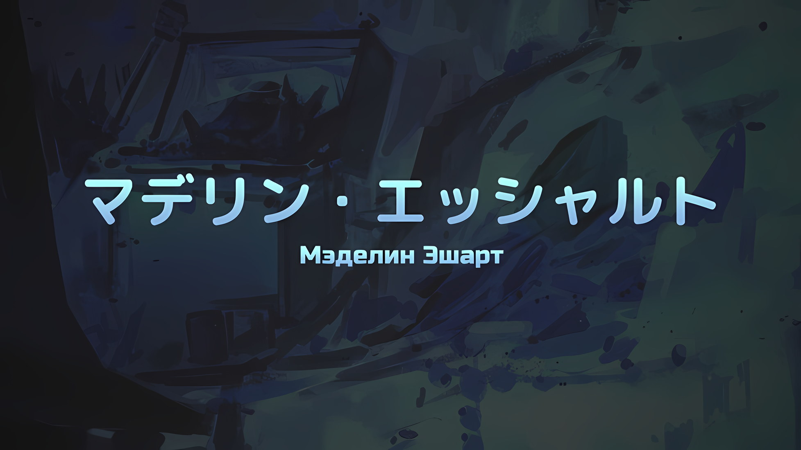
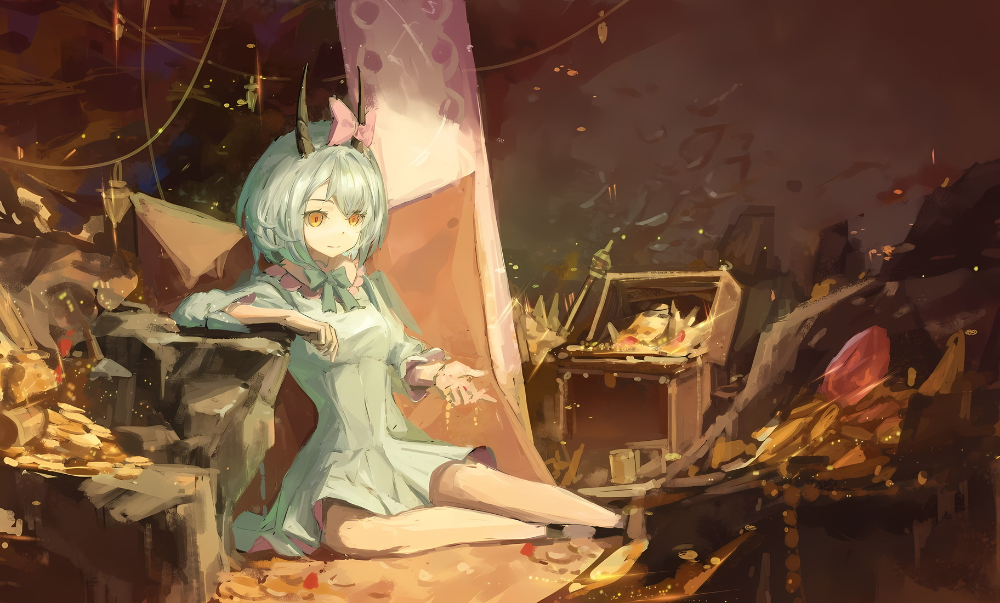
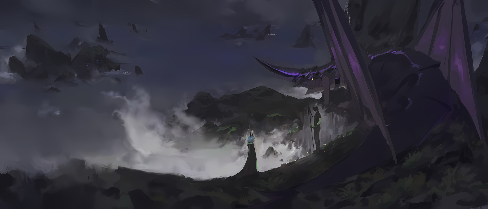
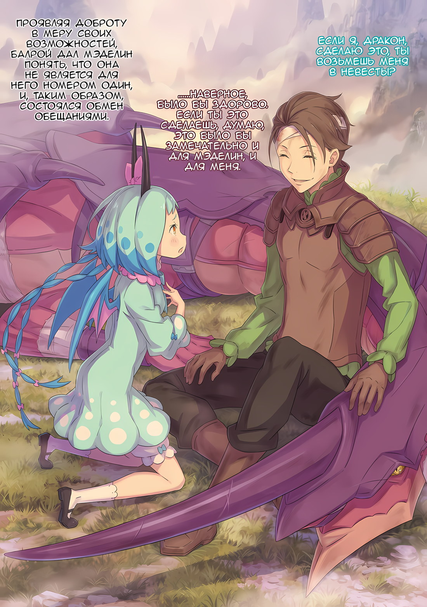
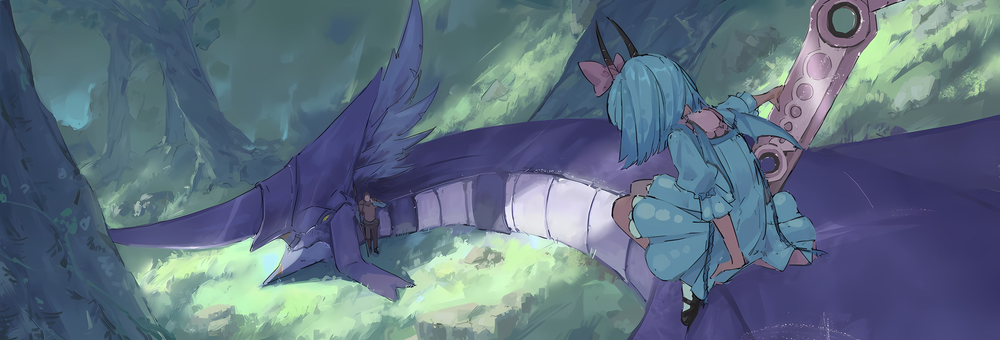
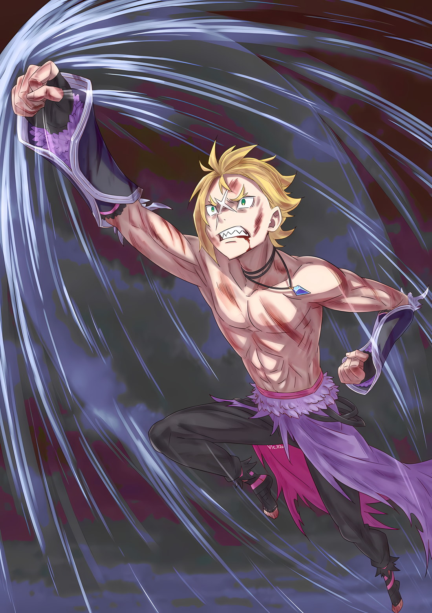

Фанарты: Rokaroka

*※※※※※※※※※※※*

…Мэделин Эшарт была самым молодым драконидом из всех существующих.

По своей природе, в силу механизмов, лежащих в основе генезиса драконидов, они имели происхождение, отличное от всех остальных рас. Чтобы точно объяснить их экологию, сначала необходимо выяснить отношения между драконидами и «Драконами».

В наши дни количество «Драконов», которых можно было встретить на поверхности, значительно сократилось. На это в немалой степени повлиял тот факт, что в былые времена любимым блюдом «Палочника», Рейда Астрея, было «Драконье» мясо.

Рейд истреблял их, сколько душе угодно, а также убивал тех «Драконов», которые бросали ему вызов в попытке отомстить; так продолжалось несколько лет, поэтому и без того небольшое количество «Драконов» вмиг сократилось еще сильнее и все они оказались на грани вымирания.

На фоне этого, большую роль в исчезновении «Драконов» сыграла их экология.

Прежде всего, «Драконам» не требовалось спариваться для размножения. Даже без пары самца и самки они могли размножаться бесполым путем. Их тела были сотворены из большого количества маны, а посему они кардинально отличались от других рас, и, если уж сравнивать, то, пожалуй, ближе всего к ним были Духи.

Только, в отличие от Духов, которые имели такие уровни, как Микро, Квази и Великий, «Драконы» были «Драконами» по рождению, и не было никаких сомнений в том, что их несравненная мощь находилась на вершине всего живого.

Таким образом, «Драконы» не испытывали необходимости в защите других особей своей расы или сохранении вида.

Поскольку они были способны к партеногенезу, то не испытывали особого интереса к другим «Драконам». Те, кто бросил вызов Рейду во имя возмездия за свой вид, сделали это не ради убитых «Драконов», а потому, что их гордость считала недопустимым пренебрежение к расе «Драконов».

В результате, к тому времени, когда «Драконы» наконец осознали, насколько плохо их положение, они уже стояли на грани вымирания… даже могучий «Дракон», что был вожаком стаи, наполнил желудок Рейда, а в другой стране их противостояние с «Ведьмой Лени» оказалось роковым, так что им пришлось принять решение.

Это решение касалось того, стоит ли им следовать за «Драконьей» гордостью или же нет.

«Драконы», которые следовали за гордостью, покинули свои земли и, не одобряя отдельных особей, что враждовали с Рейдом или «Ведьмой Лени», предпочли улететь куда-то вдаль.

«Драконы», которые не следовали за гордостью, остались на своих землях и, не обрывая отношений с теми, кто высокомерно противостоял «Драконьему» роду, решили враждовать и дальше.

На человеческий взгляд, могло показаться, что объяснения тех, кто последовал и не последовал своей гордости, были противоположными, однако это было правильно, если учесть восприятие «Драконов».

Прежде всего, «Драконы» были высшими существами, коих нельзя было сравнивать с иными расами. Дабы это доказать, им незачем было вступать в схватку с другими видами. Для «Драконов» сражение означало борьбу за выживание, поэтому, если кто-то желал побороться именно за победу, они действовали по принципу сохранения своей жизни. Следовательно, те, кто был на это способен, именовались высшими особями.

В соответствии с этой точкой зрения, «Драконы», что не смогли дойти до этой мысли, сражаясь вместо этого с людьми, чтобы доказать свою ненужную точку зрения, а также держась за землю и рискуя своими жизнями, вызывали презрение ко всем «Драконам» в целом, и, таким образом, поступали неправильно.

Поэтому большинство «Драконов» покинули свои земли, а те, что остались, стали эксцентриками… проще говоря, к ним относились как к изгоям среди «Драконов».

На первом месте в этом списке стоял «Божественный Дракон» Волканика, который был наиболее активно дружелюбен по отношению к людям из всех тех, кто остался, однако тема об этом известном «Драконе» отходит от сути дела, а потому будет опущена.

Итак, наконец-то мы возвращаемся к теме драконидов.

Вопреки намерениям «Драконьей» расы, все оставшиеся в стране «Драконы» действовали независимо друг от друга.

Некоторые «Драконы» погибли, бросив вызов Рейду или «Ведьме Лени», другие жили отшельниками в знакомых им краях, а еще часть «Драконов» стала людьми. …Решение последней части «Драконов» послужило основой для возникновения драконидов.

Как это ни парадоксально, но существование Рейда Астрея сыграло большую роль в появлении драконидов.

Независимо от того, последовали ли «Драконы» своей гордости или нет, в человеке, что подтолкнул их к этому решению, была своя дерзость, однако именно его сила произвела сильное впечатление на гордость «Драконов».

Как уже говорилось, «Драконы» считали себя вершиной всего живого и прекрасно понимали, что являются высшей формой существования. Точно так же, как они знали, каким образом двигать конечностями, как смотреть на вещи и как слышать звуки без необходимости учиться, — это было интуитивное понимание.

Следовательно, принадлежность к высшим существам была важна для «Драконов», и если бы они действительно были таковыми, то не было бы нужды суетиться по поводу изначальной формы «Дракона». …Если бы они были высшими существами, то даже человеческая форма была бы вполне приемлема.

Уже упоминалось, что строение тел «Драконов» было близко к строению тел Духов, и что здесь пригодится экология.

Первоначально причина, по которой «Драконы» принимали величественную форму огромных тел с крыльями, острыми клыками и когтями, а также прочной чешуей, заключалась не в чем ином, как в демонстрации их способностей высших существ. «Драконы» так долго сохраняли один и тот же вид, поскольку никогда еще не появлялось формы, которая могла бы более точно отобразить их силу.

Но с веянием времени и переменами в мире, если бы возникла необходимость изменить себя в более подходящую форму, «Драконы» не гнушались бы отказаться от своего величественного облика, приняв вместо него форму людей.

Таково было происхождение драконидов, их связь с «Драконами». …По сути, дракониды были эволюционировавшей формой «Драконов», следующим поколением, появившимся на свет в результате партеногенеза.

Хотя они обладали теми же физическими качествами, что и люди, но именно это и стало причиной того, что каждый драконид, имея необычайную силу, мог двигаться несравнимо лучше человека.

Однако за всю долгую историю «Драконов» это был первый случай столь внезапной и резкой эволюции формы, и рождение драконидов вызывало множество проблем.

Самая серьезная из них заключалась в том, что «Драконья» душа, что стала родителем драконида, получала критические повреждения, после чего сам «Дракон» превращался в лишенную разума пустую оболочку… иначе говоря, это был феномен «Драконьей Оболочки».

«Дракон», ставший пустой оболочкой, фактически превращался в живой труп, и, за исключением инстинктивного акта самозащиты, становился марионеткой, что подчинялась воле драконида, с коим его связывала глубокая связь.

Несмотря на это, необычайная сила, которой обладали «Драконы», сохранялась, и для обычного человека они все еще представляли более чем достаточную угрозу, однако это было не самое желанное состояние.

«Драконов», что остались на земле в собственном теле, было немного, а «Драконов», которые превратились в драконидов, и подавно. С разных точек зрения это считалось отвратительным примером неудачи тех «Драконов», что эволюционировали в драконидов.

Но, зная о неудачах других «Драконов», дракониды продолжали существовать с малой популяцией.

Они понимали, что их вид будет презирать это как глупую борьбу изгоев, что отказались от своей «Драконьей» гордости и остались на земле, так и не сумев осознать ошибочность своего решения.

…Дракониды все еще продолжали рождаться, и как одна из них, Мэделин Эшарт пришла в этот мир.

*△▼△▼△▼△*

Непостижимый удар сбил с ног Мэделин, которая находилась в оболочке «Облачного Дракона».

В своем первоначальном теле, в человеческом облике молодой девушки, Мэделин знала, каково это, когда тебя швыряют.

Мэделин было это известно, — и ее это раздражало. Однако для громадного «Облачного Дракона» быть подброшенным существом — таким же маленьким, как кончик его хвоста — было событием, совершенно отрешенным от здравого смысла.

Абсолютная бессмыслица. Такого не должно было быть. Подобные вещи не поддавались никакому разумному объяснению.

*Мэделин: «…ЧЕЛОВЕК!!!»*

В перевернутом поле зрения Мэделин появился окровавленный парень, что манил ее к себе с разбитого каменного тротуара.

Золотистые волосы и острые клыки — по его свирепой, жуткой ауре она могла предположить, что он зверочеловек, — однако в том, что он человек, сомневаться не приходилось. Не было никаких причин для того, чтобы пламя негодования Мэделин исчезло.

В конце концов, пострадать от прямого попадания дыхания «Дракона», а затем остаться в живых — дело не шуточное.

…Храня свой разум в Драконьей оболочке Мезореи, она управляла его движениями так, словно это была ее собственность.

Это была привилегия Мэделин как драконида, и, хотя с момента ее появления в этом мире прошло совсем немного времени, она могла использовать эту мощную технику, так как между ней и Мезореей сохранялась прочная связь.

Разрушительные порывы и сила, что для ее маленького тела были слишком велики, — в этом большом теле она могла распоряжаться ими по своему усмотрению. Она громко провозглашала, что именно эта могучая сила и есть истинная Мэделин.

Она не хотела рождаться в таком маленьком, хрупком, легко раздавливаемом и беспомощном теле.

Не будь это так, не будь этого тела, Балрой не оставил бы Мэделин, когда отправлялся на последнюю битву.

Если бы Мэделин была «Драконом» со страшной мордой и большим, мощным телом… хотя она им и была.

Парень: …«Щит Святилища», Гарфиэль Тинзель.

Скрежеща острыми клыками и твердо ставя ноги на разбитую улицу, парень… Гарфиэль, назвал свое имя.

Воин бросил перчатку и представился, на что драконид усилил блеск в глазах «Облачного Дракона» и сильно взмахнул хвостом.

С этой силой она оторвала свое перевернутое тело от стены, поставила все четыре конечности на землю и уставилась на парня.

Проигрывать она не собиралась. Даже если ее противником было существо, что пережило дыхание, которое, как ей казалось, должно было его убить, существо, что выскочило из-под обломков спустя всего несколько секунд, — Мэделин ему не проиграет.

Ведь именно эту оболочку «Облачного Дракона» Мэделин, ради Балроя, желала использовать в качестве свадебного платья.

*Мэделин: «Такие, как ты, ни черта не особенные…!!!»*

Длинные белые усы «Облачного Дракона» задрожали, а из его горла вырвался вопль. Несмотря на то, что он находился прямо перед ревом «Дракона», что наводил страх на весь мир, полумертвый-полуживой Гарфиэль не дрогнул.

Он выглядел так, словно его сопровождала целая гора надежных союзников.

Гарфиэль: …Аах, да знаю я.

*Мэделин: «…»*

Гарфиэль: Чтоб убедиться, что у крутого меня нет никаких заблуждений, женщина, в которую я влюбился, не дала мне рвануть вперед и сказала, что я настоящий тупица!!!

Сложив кулаки перед грудью, его серебряные перчатки мощно лязгнули, и Гарфиэль зарычал.

Пред существом, что должно было быть хрупким, однако при этом не проявлявшим ни малейшего намека на слабость, Мэделин, в дополнение к чему-то еще, воспылала гневом. Что-то, что она чувствовала, — она отрицала то, что «Дракон» никогда не должен питать по отношению к человеку.

*Мэделин: «…ИСЧЕЕЕЗНИ, ЧЕРТ ВОЗЬМИИИ!!!»*

В следующий момент, в ответ на вспышку гнева Мэделин, рев «Облачного Дракона» вновь потряс столицу Империи.

До этого Гарфиэль удерживал Мэделин внутри города и прилагал все усилия, чтобы направление, в котором она выпускала свое дыхание, было направлено на внешнюю сторону столицы. Таким образом, он сражался, внимательно следя за длиной и шириной радиуса атаки дыхания «Дракона», однако сейчас эти старания были сведены на нет.

Кристальный Дворец, что находился в самой северной точке города, оказался в зоне поражения дыхания, выпущенного с южной части города. Лучи разрушения, что шли из тела «Дракона», выжигали улицы, превращая здания в пыль и уничтожая все на своей линии огня, — и вот-вот эти лучи должны были проникнуть на север… конечно, если бы там не было Гарфиэля.

Гарфиэль: Оо, ОООООООООООООООО…!!!

Твердо упершись своими двумя в землю, будто желая ее пронзить, и вытянув пред собой обе руки в серебряных перчатках, Гарфиэль поймал дыхание «Облачного Дракона».

Несмотря на то, что хоть немного побороться с дыханием уже считалось бы чудом, парня не сбило с ног, не разнесло, и он смог выстоять, защитив столицу Империи от разрушения.

Механизм, позволивший осуществить эту невероятную борьбу, заключался в двух его ногах, что уперлись в землю.

Глаза «Облачного Дракона», который принял форму оболочки, созданной из большого количества маны, уловили, что мана с ненормальной силой течет из земли прямо в Гарфиэля.

То, что Гарфиэль до сих пор обладал аномальной способностью к восстановлению и выносливостью, вероятно, было следствием поглощения энергии из земли, однако его сила резко возросла.

В доказательство этого Гарфиэль не просто держался на ногах, а, греясь в дыхании «Облачного Дракона», продвинулся на один шаг вперед.

Один шаг, и затем же другой, — он неуклонно продвигался вперед, сокращая расстояние до Мэделин.

Гарфиэль: Чтоб убедиться, что крутой я не дрогну, меня похлопало по спине куча народу, они сказали, чтобы я продолжал идти вперед!!!

Пока Мэделин не верила своим глазам, среди разрушений, где даже звук был выжжен дотла, послышался голос.

Невозможно. Однако Гарфиэль заявил, что это так. Сделав это, он продолжил наступать. Вопреки дыханию «Облачного Дракона», среди разрушений, которые, вероятно, приведут к перерисовке карт, он двигался вперед.

Один шаг, а затем другой, — делая шаги, которые не должны были стать возможными…

*Мэделин: «…Раахфваах!!!»*

Наблюдая за его наступлением, Мэделин резко выдохнула.

Рев и дыхание, если выражаться иначе, были не чем иным, как разрушительным боевым кличем «Дракона». Так как разум ее был в смятении, если закончится дыхание, то закончатся и разрушения.

Наступления и сопротивления Гарфиэля было достаточно, чтобы победить дыхание «Облачного Дракона».

Гарфиэль: ГхаааРААААААА!!!

С грохотом прорвавшись вперед, Гарфиэль взмахнул вверх обеими руками.

В результате этого последний отрезок дыхания «Облачного Дракона» взметнулся в небо. «Дракон» застыл с широко раскрытыми глазами, а из всего его тела шел белый пар, — он наблюдал, как тело Гарфиэля, что горело темно-красным цветом до такой степени, что хотелось отвести глаза, быстро заживало.

За спиной Гарфиэля виднелся городской пейзаж столицы Империи, который он защищал собственными руками, а также фигура красноволосого мужчины, что рухнул на спину.

*Мэделин: «…»*

Будучи полностью защищенной, Мэделин была шокирована.

Однако больше, чем то, что дыхание «Дракона» не сработало, настоящий шок, который сейчас обрушился на Мэделин, имел более ужасающую форму.

Сглотнув слюну, красноволосый мужчина посмотрел на городской пейзаж, что не был разрушен дыханием Дракона, а затем сказал,

Красноволосый: Ты… не в своем уме… это дыхание должно было снести весь дворец… а ты просто его остановил…!

*Мэделин: «…ах.»*

Слова красноволосого мужчины, что дрожал от страха, относились к реальности, которая предстала пред его глазами. Он даже испытывал некоторый страх перед Гарфиэлем, который противостоял дыханию «Дракона» и в итоге выстоял, однако же для Мэделин все было иначе.

Размышляя над собственными поступками, Мэделин ощущала тяжесть.

Все было так, как сказал красноволосый мужчина. Если бы Гарфиэль не остановил дыхание, ее рев стер бы с лица земли столицу Империи.

А там, в Кристальном Дворце, что оказался на линии огня, находилось тело Мэделин, а также Балрой и Карильон.

*Мэделин: «Э-это неправильно, черт возьми… хк.»*

Вяло качая головой, она отрицала свои действия жестами, что не подобали «Дракону».

Кровь прилила к ее голове, а мысли окрасились в белый цвет, Мэделин судорожно пыталась что-то сделать с врагом, который встал перед ней, и в результате едва не разнесла все и вся.

Подумать только, ее спас маленький, слабый, хрупкий, беспомощный человек.

*Мэделин: «Это неправильно, неправильно, неправильно, неправильно, неправильно, неправильно, НЕПРАВИЛЬНО, НЕПРАВИЛЬНО, НЕПРАВИЛЬНО, НЕПРАВИЛЬНО, НЕПРАВИЛЬНО, НЕПРАВИЛЬНОООООО…!!!»*

Гарфиэль: А? Эй, че эт с тобой…

*Мэделин: «Я, дракон! Ради Балроя! Все, абсолютно все и вся, черт возьми, было ради Балроя!!!»*

В конце концов, Мэделин разразилась отрицанием, на что Гарфиэль взглянул на нее с недоверием. Словно закрашивая голос Гарфиэля, который она больше всего не хотела слышать, Мэделин кричала.

Подняв крик, который даже она сама не могла до конца понять, «Облачный Дракон» взмахнул крыльями.

Гарфиэль: …Хк!

Как только поднялся сильный порыв ветра, Гарфиэль тут же пригнулся, его волосы интенсивно затрепетали; «Облачный Дракон», Мезорея, одним махом взлетел в небесные выси.

Вслед за этим появились темные, густые тучи, что накрыли всю Рапгану.

*Мэделин: «Такие, как ты, ни черта не особенные…!!!»*

По зову «Облачного Дракона» тучи собрались со всей Империи… в них была запечатана мана, которую Мезорея не мог хранить внутри себя, — сами тучи представляли собой разрушительный порыв белого цвета.

Она собрала их вместе одним махом. …Мэделин никак не могла с ними справиться. Однако, даже в этом случае, она способна спустить их на поверхность в виде сгустка абсурдной силы.

*Мэделин: «Я, дракон, а ты ни черта не особенный…!»*

Как только Мэделин обрушит эти облака на землю, она уничтожит Гарфиэля и красноволосого мужчину, а затем убьет всех, кто узнает о ее поступке.

Сделав это, Мэделин бы…,

*Мэделин: «Единственный, кто особенный, это Балрой…!!!»*

Плачущий голос «Дракона» доносился с небес, а жалкие людишки просто наблюдали за этим с земли.

Глядя вверх, парень, маленький, но отнюдь не слабый и не хрупкий, скрежетнул клыками,

Гарфиэль: …Этот громадный придурок.

*△▼△▼△▼△*

…Мэделин Эшарт родилась на вершине горы Пальзоя, где располагался «Город Облачного Моря» Мезорея.

Этот город, венчавший имя «Облачного Дракона», был местом, куда стремились попасть те, кто хотел использовать исконную технику Империи — езду на летающих драконах.

Благодаря силе поселившегося там «Дракона», большие облака круглый год вились по поверхности высокой горы, и на ее вершине был построен город.

Гора была местом обитания диких и жестоких летающих драконов, а на вершине Города Облачного Моря едва могли выжить люди… те, кто стремился подняться еще выше, либо оказывались в плену драконьих клыков, либо возвращались домой с яйцом летающего дракона, становясь тем самым на путь «Всадника Летающего Дракона».

Никому еще не удавалось увидеть вершину горы, что была скрыта от глаз густыми облаками.

Неизведанная вершина горы Пальзоя стала местом рождения Мэделин.

Будучи окутанной белыми облаками, в месте, где, несмотря на наличие неба, нельзя было надеяться увидеть его лазурный оттенок, Мэделин появилась на свет как одно из редчайших существ в этом мире — драконид. Высшее существо, новое поколение «Драконов», и пока она обретала инстинктивное разумение, ее ждала трагедия.

Этим было…,

*???: «…Я — Мезорея. В соответствии с голосом моего драгоценного ребенка, я стану ветром с небес.»*

Ее биологический родитель, Мезорея, стал Драконьей оболочкой и радушно принял рождение Мэделин в состоянии, когда общение было затруднено.

Не имея ответных слов и понимая лишь то, что рядом находится «Дракон», новорожденная Мэделин безрезультатно проводила свое время.

Почему «Облачный Дракон», который мог жить еще долго, прекрасно сознавая суровость и абсурдность этого мира, решил заняться этой жестокой сменой поколений, Мэделин не могла понять даже сейчас.

Единственное, что можно сказать, так это то, что Мэделин проводила свои дни среди облаков в полном одиночестве несмотря на то, что одной она не была.

И тот, кто положил конец этому одиночеству, был человеком, совершившим то, чего в истории Империи еще никогда и никто не делал, — он достиг вершины горы, что была скрыта Облачным Морем; его звали Балрой Темегриф.

Балрой: Серьезно… конечно, замечательно, что я отправился сюда, желая испытать свои силы, однако… Никогда бы не подумал, что на вершине меня будут ждать очаровательная девица и устрашающий «Дракон».

???: …Кирьярарааах!

В мире, что представлял собой скорее плотные облака, чем густой туман, обнаружив там Мэделин… совсем юную драконидку, которой еще только предстояло получить это имя, Балрой обеспокоенно почесал щеку.

Летающий дракон, Карильон, был ошеломлен присутствием «Облачного Дракона» и совсем юной драконидки, но все же встал на защиту своего спутника, Балроя.

*Мезорея: «…Я — Мезорея. В соответствии с голосом моего драгоценного ребенка, я стану ветром с небес.»*

«Облачный Дракон», неспособный произнести ничего, кроме этих слов, и питавшийся лишь облаками, что были наполнены маной, не отверг неожиданного гостя только потому, что не питал к нему вражды.

До появления Балроя и Карильона «Облачный Дракон» инстинктивно отвергал летающих драконов, что неосторожно отбивались от стаи и терялись в облаках, — он убивал их прежде, чем они успевали попасть в поле зрения его маленького ребенка.

Таким образом, это был первый раз, когда сие дитя столкнулось с жизнью другой, кроме себя и «Облачного Дракона».

Ребенок: …

Ребенок молчал. Вернее, она не знала слов, которые можно было бы произнести.

При виде пары человека и летающего дракона, что появились без предупреждения, она могла только сжаться в комок. В такие моменты «Облачный Дракон» ничего не говорил и держал свое сознание погруженным в глубины двусмысленности.

Конечно, в зависимости от последующих действий человека «Облачный Дракон» мог насильно устранить Балроя и Карильона, как он делал это со всеми летающими драконами, что до сих пор заглядывали на вершину.

Однако пред грозным присутствием «Дракона», а также драконида, Балрой, не особенно волнуясь, снял с себя плащ, и,

Балрой: Пока наденьте это, маленькая мисс. Деве не подобает так безрассудно обнажать свою кожу.

И, с этими словами, ребенок… девочка, кою Балрой впоследствии назовет Мэделин, впервые в своей жизни получила подобие доброты и тепла.

*△▼△▼△▼△*

…Необычные встречи Мэделин с Балроем всегда происходили на территории Облачного Моря.

Балрой: Мэделин, это снова я. Ты была хорошей девочкой?

Мэделин: Балрой!

Балрой: Уаатхх!?

Сквозь густые белые облака показался Балрой, а навстречу ему побежал маленький ребенок… Мэделин.

Поймав тело прыгнувшей к нему девочки, Балрой, только приземлившись, от такого сильного порыва упал навзничь вместе с Карильоном и, несмотря на появившееся головокружение, погладил Мэделин по голове.

С момента их первой встречи Балрой часто появлялся на вершине горы Пальзоя.

Это была вершина, ради покорения которой многие «Всадники Летающего Дракона» рисковали своей жизнью, однако никто раньше ее не достигал. Тогда она и не подозревала, через какие трудности приходилось проходить Балрою, дабы до нее добраться, и насколько ценным был этот поступок.

Благодаря тому, что Балрой часто посещал гору и давал Мэделин связь с неизвестным внешним миром, он стал для нее незаменимым существом.

Имя Мэделин также было тем, что дал ей Балрой.

Балрой спросил, как ее зовут, и когда она ответила, что у нее нет имени, он серьезно пораскинул мозгами и в итоге остановился на этом варианте.

Балрой: Когда я был ребенком примерно твоего возраста, так звали человека, который очень хорошо ко мне относился. Именно она дала мне мое имя… Я ей очень обязан.

Мэделин: Балрой, этот человек, она была тебе чертовски дорога…?

Балрой: Мы расстались прежде, чем я успел об этом подумать. И все же, раз после стольких лет она до сих пор остается в моей голове, значит, так оно и есть.

Он широко улыбнулся, однако при этом казался каким-то одиноким, поэтому Мэделин нежно прижалась щекой к его груди.

Он дал Мэделин имя дорогого ему человека. Другими словами, это говорило о том, что Мэделин была дорога Балрою.

То, что Балрой думал о ней подобным образом, вызывало у Мэделин глубокие, теплые чувства.

Желая большего, гораздо, гораздо большего, она с нетерпением ждала времени, что проведет вместе с Балроем.

Желая как можно больше общаться с Балроем, она старательно запоминала слова людей.

В связи с этим Балрой был удивлен высокой обучаемостью Мэделин, однако это, вполне вероятно, являлось чертой драконидов, которую они унаследовали от природы «Драконов».

По какой-то причине ее диалект* не исчезал, несмотря ни на что, однако это не мешало ей разговаривать с Балроем.

* Диалект, о котором идет речь, — это причуда речи Мэделин на японском языке, где она часто добавляет っちゃ (-тча) в конце своих предложений. В переводе в таких случаях обычно добавляется «чертовски» или «черт возьми» (и то иногда, в русском эта деталь почти утрачена), однако, по общему признанию, это не совсем точно передает суть японской речевой причуды, и в русском языке мало что можно сделать в этом отношении.

Балрой: Хехе, похоже, я не ошибся в своих суждениях. Тебе идет, Мэделин.

Мэделин: Э-это так? Хихи…

Подперев рукой подбородок, Балрой удовлетворенно кивнул, и, покружившись перед ним, Мэделин почувствовала, как развевается ткань… одежда, которую он ей подарил.

Нежный цвет одежды, судя по словам Балроя, был «небесно-голубым». Того же цвета были и волосы Мэделин, — Балрой приложил все усилия, чтобы подготовить для нее этот наряд.

Честно говоря, Мэделин, как драконид, испытывала раздражение от ношения подобной одежды, поскольку она стесняла ее движения, однако это чувство быстро исчезло, стоило ей посмотреть на Балроя.

Дав ей имя, слова и одежду, он подарил Мэделин счастье.

Мэделин пересчитала все, что подарил ей Балрой, и запомнила это. Такова была природа «Драконов». «Драконы» никогда не забывали о сокровищах, кои они копили.

Все вещи и эмоции, которые подарил ей Балрой, были для Мэделин сокровищами.

Балрой: Что ж, пока луна не стала наполовину полной, я еще прилечу к тебе, Мэделин.

Когда драгоценное, хрупкое время, которое они провели вместе, печально подошло к концу, Балрой сел на Карильона и улетел из гнезда «Облачного Дракона».

С обещанием их следующей встречи в сердце, Мэделин сдержала свои грустные чувства, а затем проводила его.

…Он оставил Мэделин на вершине. Можно ли в таком случае назвать Балроя бессердечным?

В окутанном белыми облаками «Драконьем» гнезде Балрой пытался вытащить Мэделин, которой еще предстояло увидеть небо того же оттенка, что и ее волосы.

Вот только сделать ему это не удалось. Даже если бы «Облачный Дракон», что жил в туманном мире, не заметил бы Балроя и Карильона в своем гнезде, он бы не позволил им попытаться вывести Мэделин наружу.

*Мезорея: «…Я — Мезорея. В соответствии с голосом моего драгоценного ребенка, я стану ветром с небес.»*

Мезорея принял Балроя и Карильона, поскольку они не питали к нему вражды; однако, как только они попытались увести Мэделин, он, следуя своим инстинктам, обнажил клыки.

В «Драконьем» гнезде, под оком «Дракона», что был его хозяином, у человека не было и шанса на победу.

Посему Балрой не стал забирать Мэделин. Она тоже не желала смерти Балроя. Вот почему Мэделин ни разу не сказала, что хочет, чтобы он вывел ее наружу.

Вместо этого, всего один раз, она обратилась к нему с мольбой.

Мэделин: Балрой, не хочешь ли ты остаться… вместе со мной, драконом, здесь? Навсегда.

Балрой: …

Увидев, как напряглись щеки Балроя, Мэделин пожалела об этом.

Наступившая тишина послужила точным отражением ответа Балроя на мольбу Мэделин. Балрой не остался бы здесь, на вершине.

За пределами этого мира, что был окутан белыми облаками, у Балроя оставалось много того, что было ему дорого.

Как у Мэделин не было ничего, кроме этого белого мира, так и у Балроя не было ничего, кроме внешнего мира. Это был мир, непригодный для жизни Балроя, для жизни человека.

Балрой: …Мне правда очень жаль, Мэделин.

Извинившись перед Мэделин, Балрой попытался погладить ее по голове, как делал это обычно. Впервые она отвергла ладонь Балроя и прогнала его прочь.

На глаза Мэделин навернулись слезы, она закатила истерику, повысила голос и, прогнав Балроя с Карильоном, как бы обвиняя их, зарыдала.

Рыдая три дня и три ночи, Мэделин сожалела о своем поступке.

В течение всего этого времени она давала волю эмоциям, размышляя о том, что будет делать, если Балрой больше никогда не вернется, — от всего сердца она рыдала. При мысли о том, что она видела Балроя в последний раз, Мэделин печалилась до глубины души. Она горевала всем своим нутром.

Однако Мэделин была еще молода, и ее мысли с воображением были наивно поверхностны.

Самое большое сожаление в жизни Мэделин пришло после трех дней и ночей рыданий.

…В тот день, когда «Облачный Дракон» покинул ее, Мэделин не особо беспокоилась.

Даже если бы он покинул ее, крылья «Облачного Дракона» не унесли бы его далеко за пределы этой горы, объятой облаками. В лучшем случае он улетал на такое расстояние, где его громовой рев был еще слышен.

Охотился ли он на летающих драконов, неосторожно забравшихся в гнездо «Облачного Дракона», или же это был безрассудный противник, что ступил на горную тропу, стремясь к вершине, — она полагала, что это было что-то из этого.

Как бы то ни было, она не сомневалась, что со временем Мезорея вернется.

Гораздо больше проблем ей доставляло сожаление, которое не исчезало, сколько бы дней ни прошло, а также способ контролировать свои эмоции, так как она продолжала плакать навзрыд.

Именно поэтому ее не волновал тот факт, что «Облачный Дракон», Мезорея, впервые вернулся с многочисленными ранами на чешуе, равно как и то, что за противник нанес эти раны.

Балрой: …Мне правда очень жаль, Мэделин.

Мэделин узнала этот ответ, когда стала свидетелем того, как Балрой, вновь прибывший на вершину через несколько дней после страшного расставания, нес по всему своему телу раны, от которых хотелось отвести взгляд.

Слова Балроя перед потерявшей дар речи Мэделин не были ни извинениями за то, что он долго не появлялся, ни извинениями за то, что не смог выполнить просьбу Мэделин.

Балрой: …Я хотел победить «Облачного Дракона» и вытащить тебя отсюда.

Сказав это с ранами, которые, казалось, могли быть смертельными, и поглаживая спину своего столь же израненного любимого дракона, Балрой жалко улыбнулся, и по лицу Мэделин потекли слезы.

Она сожалела об этом. За всю Драконью жизнь Мэделин это стало самым большим сожалением, кое невозможно было стереть.

…«Драконы» всегда цепляются за свои сокровища. Такова их природа.

Так, для «Облачного Дракона», что погрузился в туманный мир после того, как стал Драконьей оболочкой, это была часть его природы, которую он не забыл даже в таком состоянии, а потому Мэделин являлась для него тем сокровищем, потерять которое он не мог.

Балрой рисковал собственной жизнью, пытаясь ее украсть.

Мэделин: Чертов идиот…

Балрой: Я думал, что смогу это сделать, но… правда, даже я сам был в ужасе.

Мэделин: Неправильно! Чертовски неправильно! Это не Балрой чертов идиот, а я, дракон…!

Не обращая внимания на Балроя, который занимался жалким самобичеванием, Мэделин решительно прикусила коренные зубы.

До сегодняшнего дня, до этого самого момента, она проклинала себя за то, что всегда получала что-то только от Балроя, и вот теперь, без чьих-либо подсказок, она наконец поняла, что ей следует сделать.

Эти плотные белые облака, в которых Мэделин существовала с рождения, были стенами, что Мэделин должна была разрушить собственными когтями.

Мэделин, полагаясь на доброту Балроя, продолжала позволять ему приходить сюда, и, пока он, наконец, не бросил вызов смертельной опасности, она даже не пыталась осознать это.

Насколько же бесстыдной она была? Было ли такое поведение достойно драконида, высшего существа?

Мэделин: Я, дракон, сделаю это сама, черт возьми.

Балрой: Мэделин?

Мэделин: Я, дракон, сама выйду наружу. Меня выводить не стоит, я сама по себе… На этот раз я, дракон, пойду на встречу с Балроем. Если я это сделаю…

Крепко ухватившись за подол одежды, что дал ей Балрой, вместе со словами, которым она научилась у Балроя, она взяла свои эмоции, подаренные ей Балроем, и передала их ему.

Как высшее существо, как драконид, она передаст эти эмоции особенному человеку, который ее очаровал.

Мэделин: Если я, дракон, сделаю это, ты возьмешь меня в невесты?

Балрой: …

После вопроса Мэделин наступила минута молчания, похожая на ту, что была ранее.

Однако на этот раз молчание Балроя отличалось от того, что мучило глупую и невежественную Мэделин, которая по итогу рыдала три дня и ночи, — она знала, что за этим сейчас стоит нечто другое.

Тогда Мэделин могла видеть только то, что хотела видеть.

Даже если она обращалась к Балрою, все, чего она хотела, — это чтобы он смотрел на нее.

Вот почему…,

Балрой: …Наверное, было бы здорово. Если ты это сделаешь, думаю, это было бы замечательно и для Мэделин, и для меня.

Проявляя доброту в меру своих возможностей, Балрой дал Мэделин понять, что она не является для него номером один, и, таким образом, состоялся обмен обещаниями.

*△▼△▼△▼△*

…Вероятно, найдутся те, кто возразит, что чувства Мэделин не были настоящей любовью.

Возможно, кто-то сочтет это чем-то сродни птенцу, что вылупился из яйца и вцепился в первое попавшееся существо, чтобы использовать его в качестве опоры.

Или все дело в том, что ей хотелось верить, будто первый человек, с которым она вступила в контакт, не считая глубоко близких ей лиц, первое существо, что проявило к ней доброту, и отношения, подарившие ей столько первых встреч, были особенными.

Возможно, найдутся те, кто посмеется над ответом Балроя, мимолетно улыбнувшегося в ответ на ухаживания Мэделин, как над добросердечной ложью отца, цель которой — не ранить чувства дочери, заявившей, что в будущем она выйдет за него замуж.

Возможно, найдутся те, кто посочувствует Балрою, который испытывал чувства к кому-то другому, сочтя его просто очень внимательным к Мэделин, ведь оба они находились в схожей ситуации, когда не могли сказать о своих скрытых чувствах.

Но каждый из этих вариантов был не более чем мерилом человеческих чувств.

Дракониды, или даже «Драконы», имели иные ценности и образ мышления, нежели человек. Если бы кто-то отрицал, что дракониды и «Драконы» отличаются друг от друга, то именно ценности Мэделин были бы уникальны для всех остальных.

Мэделин желала Балроя Темегрифа всем сердцем, поистине из самых глубин своей души.

Если это не романтика или любовь, то Мэделин проведет остаток вечности, так и не узнав, что это такое. При мысли об этом в ее душе разгорался пыл, с которым она готова была поставить на кон собственную жизнь.

Поклявшись Балрою, который едва не погиб ради нее, Мэделин рванула сквозь белые облака.

Бросив вызов «Облачному Дракону», который встал на ее пути и использовал свою «Драконью» силу, чтобы полностью воспрепятствовать ее желанию уйти, она вонзила в него свои клыки и, в конце концов, подчинила его себе.

Впервые она вышла под небо того же цвета, что и ее волосы; впервые она сделала что-то самостоятельно; впервые она попыталась отправиться к любимому человеку по собственной воле, и именно тогда узнала, что…

…Балрой Темегриф сражался против Империи и погиб.

Мэделин: …И что же мне делать?

Сейчас Мэделин не знала ответа на этот вопрос.

Столкнувшись с чем-то слишком большим, чтобы это проглотить, Мэделин лишилась любви.

А поскольку бесцельная любовь была для нее слишком тяжела, Мэделин потеряла смысл своей жизни, и, не зная, что делать, она даже подумывала о том, чтобы стать одним из «Злых Драконов», что останутся в истории Империи; тогда ее нашел Беллстетз, который искал кого-то, кто мог бы занять освободившееся место в «Девяти Божественных Генералах».

Местом поисков стала резиденция Балроя, находившаяся в столице Империи, которую Мэделин обнаружила по его запаху.

Балрой вошел в историю как повстанец, и причина, почему Беллстетз, которому было поручено распоряжаться его резиденцией, не был убит случайно оказавшейся там Мэделин, заключалась в том, что в его нитевидных глазах горел тот же свет утраты, что и в глазах Мэделин.

Беллстетз терпеливо слушал, пока Мэделин с трудом рассказывала ему свою историю; узнав, что Мэделин — драконид, и что у нее были отношения с Балроем, он выдвинул ей два варианта.

Первый — поступить импульсивно, поддавшись своим неуправляемым эмоциям, и пойти по тому же пути, что и Балрой, который был повержен как враг Империи.

Второе — принять поддержку Беллстетза, которого она только-только встретила, стать членом «Девяти Божественных Генералов», как когда-то Балрой, и, идя по его стопам, ждать удобного случая для возмездия.

Решение она принимала недолго. Почему это не заняло у нее много времени, не знала и сама Мэделин.

Возможно, ей просто хотелось найти то, что оставил после себя Балрой, пусть и чуть-чуть.

Беллстетз: …Мэделин Эшарт. Это старинная фамилия Волакии, коей больше нет, однако она перейдет к вам. В конце концов, престиж очень важен.

Мэделин: Престиж?

Беллстетз: Причина, по которой ее больше нет, кроется в том, что они пошли против Империи. Возможно, это лишь интуиция моих старых костей, однако я чувствую, что это вполне соответствует вашему дорогому желанию.

Следуя совету Беллстетза, что он дал низким голосом, родилась Мэделин Эшарт.

Приняв поддержку Беллстетза, она развивала ситуацию в соответствии с его намерениями; получив место, которое раньше занимал Балрой, Мэделин отправилась в путешествие, чтобы познать неизвестность.

Это было путешествие, в котором она не знала, к какой цели следует стремиться.

Даже когда она сошла с вершины горы, вышла из узкого мирка, что был окутан облаками, и попала в мир, о котором ей рассказал Балрой, сердце Мэделин по-прежнему оставалось привязанным к тому дню, когда ее очаровал человек, что прилетел вместе со своим летающим драконом.

Несмотря на это, она выполняла свои обязанности одного из «Девяти Божественных Генералов». Вместо Балроя.

Несмотря на это, она демонстрировала престиж, что требовали от «Генералов» Империи. Вместо Балроя.

Несмотря на это, она обладала силой, необходимой для победы над врагами Империи. Вместо Балроя.

Беллстетз, вероятно, руководствовался благими намерениями, когда советовал Мэделин занять ее нынешнюю должность.

Или, возможно, у Беллстетза было желание, которое не исчезло с возрастом, и, чтобы исполнить его, он рассчитал, какие пешки ему понадобятся, для чего и использовал Мэделин.

В любом случае, Мэделин не держала зла на Беллстетза.

Да и не только на Беллстетза. …В ее сердце просто не было такого места.

Получив должность одного из «Девяти Божественных Генералов», она проводила свое время в качестве «Генерала», идя по следам Балроя. Для Мэделин это были дни непостижимого ужаса.

Каждый раз, когда она упорно сражалась, каждый раз, когда она думала о нем, каждый раз, когда она пыталась заполнить пустоту, Мэделин чувствовала, что убивает его.

Каждый раз, когда Мэделин компенсировала отсутствие Балроя, она забирала его место в мире, следы, которые он после себя оставил.

В таком случае, должна ли она передать это место кому-нибудь другому? Скорее всего, Мэделин почувствует, что человек, получивший этот пост, тоже убивает Балроя, и, несомненно, убьет его собственными руками.

По крайней мере, она могла понять, что Балрой бы этого не хотел, поэтому Мэделин продолжала себя изнурять.

Поскольку Мэделин не позволила бы сделать это никому другому, она продолжала убивать Балроя. И, когда она, наконец, убьет его, умрет ли после этого ее сердце?

Если так, то, по ее мнению, это был бы лучший вариант.

Он дал ей сердце, эмоции. Со смертью Балроя, когда Мэделин в самый важный момент не смогла быть рядом с ним, они должны были погибнуть.

И все же…,

Мэделин: Почему клык дракона… Почему клык Карильона висит у тебя на шее?

В самый разгар беспорядков, что сотрясали Империю, она встретила человека с клыком летающего дракона, который погиб вместе с Балроем.

От этого человека Мэделин услышала рассказы о Балрое тех времен, когда он еще не был с нею знаком, когда он еще не стал «Генералом», и в сердце ее вновь расцвело чувство любви.

И вот, когда потрясения тянулись за новыми потрясениями, это случилось в конце череды этих толчков.

…«Великое Бедствие», без сомнения, воскресило то, что Мэделин потеряла.

Похвалив ее небесно-голубые волосы и сказав, что это его любимый цвет, он погладил ее по голове.

Он одарил ее нежной, мягкой улыбкой, от которой у нее сжалось в груди… то невыполненное обещание, она хотела обнять его под ясным небом, в месте, где не было бы облаков.

Мэделин наконец-то встретилась с Балроем где-то за пределами той горной вершины.

Однако над небом все еще висели густые тучи, и мир по-прежнему был погружен во тьму.

Мэделин: …И что же мне делать?

Она понятия не имела, что ей теперь делать.

Мэделин чувствовала такую сильную любовь, но что делать за ее пределами, она не знала.

Да и не хотела знать.

*△▼△▼△▼△*

В небе собрался вихрь сумрачных облаков с «Облачным Драконом» в центре.

Когда он смотрел на это с земли, все волоски на теле Гарфиэля встали дыбом, а кровь, текущая по его телу, забурлила; в мозг его ударил порыв инстинктов.

Выдержав дыхание «Дракона», его тело быстро восстанавливалось от испепеляющей жары.

Однако разрушительные черные тучи полностью закрыли небеса, и в них скрывалась такая избыточная сила, что регенерация Гарфиэля и даже увядающий городской пейзаж столицы, который он так отчаянно защищал, были бы сведены на нет.

Гарфиэль: Эти огроменные облака, вся эта гребаная масса сделана из маны «Дракона»…!!!

Это — скрытый трюк, что не был им известен, пока Мезорея их не взбудоражил.

Козырь «Облачного Дракона», который был дерзко скрыт, в данный момент оскаливал против них свои клыки; однако сердце Гарфиэля трепетало не от разрушений, которые принесет это скопление могущественной силы, а от состояния «Облачного Дракона», что его контролировал.

«Облачный Дракон», Мезорея… нет, он прекрасно понимал, что внутри него находится совсем другое существо.

Слова и поступки «Дракона», что прожил столько веков, паря в небесах этого мира, были слишком лишены достоинства.

Это была интуиция совсем иного типа, чем интуиция силы, и Гарфиэль понимал ее, поскольку знал Рюдзу, которая, вопреки своей юной внешности, была личностью, что прожила очень долгое время.

В то же время Гарфиэль ощутил, насколько невероятным был приказ Субару.

Гарфиэль: Капитан, ты и впрямь сказал крутому мне пойти и завалить «Дракона» в небе…

То, что его подтолкнули в спину, заставив сразиться с «Драконом», существом, что представляло собой сильнейшую форму жизни в этом мире, и то, что его сочли достаточно надежным, чтобы доверить эту обязанность, было просто невероятно.

Сила, которую он получил, дала Гарфиэлю достаточно энергии, чтобы вернуться в реальность из того непостижимого театра, что он увидел, находясь на грани смерти.

Но, по правде говоря, в том, что Гарфиэля послали сюда, был и другой смысл.

Он не знал, стремился ли к этому Субару.

В любом случае, это не имело значения. Этот «Облачный Дракон», Мезорея, нуждался в Гарфиэле.

А причина заключалась в том, что…,

Гарфиэль: …Ты кричишь, плачешь, умоляешь кого-то защитить твой мир.

Когда Мезорея кричал, безрассудно собирая свою силу воедино, Гарфиэль испытал ужасно неприятное чувство стыда.

В прошлом Гарфиэль обрушивал на окружающих такую же ярость и страдания, какие сейчас испытывал Мезорея.

Тогда друзья остановили его силой, так что теперь у Гарфиэля была его нынешняя позиция и решимость, а также крепкое тело с двумя ногами, на которые он мог твердо встать.

Естественно, Гарфиэль и Мезорея занимали разные позиции, находились в разных обстоятельствах и даже принадлежали к разным расам. По этой причине Гарфиэль вряд ли бы смог применить то же решение к Мезорее.

Но, тем не менее, не было никаких веских оснований для того, чтобы он вовсе не мог его использовать.

Чтобы убедиться в этом, Гарфиэлю не оставалось ничего другого, кроме как заставить его скрыть свои клыки и поговорить, подобно тому, как это сделали с ним.

Для этого…,

Гарфиэль: …Кх.

Оглядев суматошное окружение, Гарфиэль с силой скрежетнул клыками.

Защитная стена была на грани разрушения, а предыдущее дыхание «Дракона» испепелило столицу Империи, доведя ее до состояния частичного разрушения.

Гарфиэль, даже если и хотел добраться до Мезореи, не смог бы дотянуться до высоты облаков.

Поэтому он отказался от идеи действовать в одиночку.

Гарфиэль: Мужик!!!

Хейнкель: …а?

Гарфиэль оглянулся с изменившимся выражением лица и увидел, что Хейнкель, свалившись задом на землю, ошарашено смотрит на небо.

Его голубые глаза дрожали, их фокус затуманился, и когда Гарфиэль увидел в них свое отражение, он схватил Хейнкеля за плечи.

Гарфиэль: Помоги мне! Мне нужно, чтобы ты сделал что-нибудь такое, что заставит меня полететь вверх!

Хейнкель: По… полететь? Полететь, говоришь? Что за, что за херню ты несешь! У нас ничего не получится! Это ж как, блядь, высоко придется подбрасывать!

Когда Гарфиэль прокричал ему свою просьбу, Хейнкель расширил глаза и тоже закричал в ответ.

Пытаясь освободиться от рук, что схватили его за плечи, Хейнкель указал пальцем вверх.

Грозовые тучи изменили свой оттенок, словно поглотив цвет неба, что лежал за черными облаками, и небеса стали пурпурными, с оттенком лазури.

Хейнкель с бледным лицом указывал на то, что можно было бы назвать стихийным бедствием, и,

Хейнкель: Все уже кончено!

Гарфиэль: Я такого не допущу!

Хейнкель: …Кх.

Гарфиэль: Я не дам всему закончиться! И я, и мужик, мы не можем проиграть!

Крепко схватив его за плечи, чтобы тот не смог стряхнуть с себя руки, Гарфиэль обратился к Хейнкелю с настоятельным призывом.

Судорожно глотая ртом воздух, Хейнкель напряг щеки. Когда дрожащий палец мужчины указывал на небо, его противоположная рука по-прежнему сжимала меч, поэтому Гарфиэль решил в него поверить.

Гарфиэль: Сейчас у тебя нет никакого чувства реальности происходящего. Я понимаю, мужик. …Будто наступил конец света.

Гарфиэль сузил глаза и, глядя на руины, что приняли форму облачного вихря высоко над его головой, уставился на небеса различных полей сражений вдали — после чего кивнул.

Действительно, казалось, каждое отдельное место было Теннозаном, о котором говорил Субару.

На севере столицы Империи, пронзая облака, падал айсберг; на северо-востоке вспышки меча рассекали сам мир, достигая стен крепости и даже гор за ними. На востоке небо и земля были окрашены в более чем сто оттенков красного; каждое поле битвы пыталось навлечь на Империю разную гибель.

Однако Гарфиэль не терял надежды.

Гарфиэль: Не так ли, Капитан?

Субару выбрал свой метод борьбы с надвигающейся гибелью.

И вот, чтобы справиться с гибелью в этом месте, Субару выбрал в качестве самой сильной карты не кого иного, как Гарфиэля Тинзеля.

Ни Эмилию, ни Беатрис, ни Розвааля, ни Спику, ни Халибеля, ни Ольбарта, ни Танзу, ни Медиум, ни Джамала. Он выбрал именно Гарфиэля.

Гарфиэль: …«Пред Ликом Дракона, Святой Меча Рейд Смеется и Обнажает Свой Меч».

Хейнкель: …Не смешивай меня с моим безумным предком.

Гарфиэль: …«От Райнхарда Не Убежишь».

Хейнкель: Не упоминай это имя! Я! Я…!

Гарфиэль: …

Хейнкель: Я…

В том месте, где небо и земля вот-вот должны были встретить свою гибель, Хейнкель закрыл лицо рукой, воздетой к небесам, и слабым голосом произнес эти слова.

Что должно было излиться из уст Хейнкеля дальше, Гарфиэль не знал. Быть может, Хейнкелю и самому еще предстояло узнать об этом.

В таком случае…,

Гарфиэль: …Мужик, давай же разберемся какие слова ты не можешь из себя выдавить.

*△▼△▼△▼△*

Возможно ли вообще такое представить?

Бескрайнее небо простиралось во все стороны, а облака, что полностью его покрывали, превратились в град пуль и лес лезвий; зрелище этого проливного дождя было бы равносильно концу света.

Именно это сейчас и происходило.

Однако, в отличие от впечатления, которое производила формулировка «град пуль и лес лезвий», тучи разрушений, что несли гибель миру, не обрушивались на все необъятные земли Империи, а, наоборот, сосредоточившись в одном месте, вот-вот должны были пронзить очаговую область.

…Вихрь черных туч закрутился в спираль, образовав огромный конус, что уходил в небесные выси.

Эта могучая форма была искаженной и зловещей; однако в том, что она предназначалась для разрушения, была своя красота.

Расправив свои белые крылья в небесных высях, «Облачный Дракон» поднял руки вверх, создавая разрушительную конструкцию; вопреки своему огромному телосложению, «Дракон», выпуская ее из рук, закричал, словно младенец.

*Облачный Дракон: «…Исчезните, черт возьми.»*

То ли этот плачущий голос был направлен на кого-то из обитателей поверхности, на коих обрушился дождь разрушений, то ли на саму поверхность, которая, скорее всего, не выдержит и разлетится на куски, то ли он вообще не был направлен ни на кого, а являлся наказанием, что он наложил сам на себя, было неясно.

В любом случае результат был бы одинаков.

Против козыря, который долгое время заготавливал «Дракон», не было никаких средств защиты; почти вся южная половина столицы будет разрушена, что повлечет за собой многочисленные жертвы и осуществит замыслы «Великого Бедствия».

Падение столицы, в связи с бедствием, означало бы полное поражение Империи, и неисчислимые сонмы нежити заполонили бы разрушенные земли, направляясь в оставшиеся страны со всей своей неистовой энергией.

Таким образом, мир окажется втянут в цепь бедствий, которым не будет границ.

Таков был бы незыблемый итог гибели мира.

Это был финал, которым не будет доволен никто, кроме «Ведьмы», что являет собой воплощение любопытства, и единственными, кто сможет его предотвратить, будут низкорослые, но отважные воины, которые ринутся навстречу своей неминуемой гибели…,

Отважный воин: …

Ощущая в душе присутствие бескрайних земель, отважный воин, пред тем как взлететь, собрал все силы, какие только мог, и направил их по всему своему телу.

Его ноги, крепко раскинутые в стороны, опустились на меч, что оставался в ножнах, и сразу после мгновения силового равновесия он яростно взметнулся вверх в полную силу.

Это был великолепный удар.

Он не был направлен против ужасающе могучего «Дракона» в качестве противника, и это не было чем-то, что глубоко врежется в конус, стремящийся принести гибель миру, — он не применил ни одного из навыков, которые использовал для тренировки.

Противник даже не вступил с ним в зрительный контакт; однако удар был великолепен.

По крайней мере, так считал отважный воин, что получил этот удар подошвами ног.

Останется ли этот великолепный удар незамеченным, что не запомнится никому, зависело только от него самого, ведь именно ему был доверен этот момент.

*Облачный Дракон: «…»*

Не обращая внимания на приближающуюся гибель, он встретился взглядом с «Драконом», что возносился к небесам.

Увидев, как эти глаза дрожат от ужаса, он улыбнулся.

Эта улыбка была неуместной, она вызывала беспокойство.

Ее тут же закрасила улыбка воинственного, сильного, дикого, свирепого тигра.

Отважный воин: Попробуй эти кулаки на вкус.

Используя всю свою силу, не сдерживаясь, он ударил по нему кулаком.

Он ударил его, а затем…,

Отважный воин: Позволь крутому мне выслушать твою историю. …Так же, как когда-то Капитан и остальные выслушали мою.

Когда мощные серебряные руки взметнулись вверх, они врезались в темные конусообразные облака руин.

В тот же миг сложенные слои неба и спиралевидные черные облака разразились взрывом, поглотившим весь мир.

Отважный воин: …

Результатом этого столкновения стал мир, в котором исчезли звуки.

К какому итогу это привело, станет ясно после вспышки света.

И вот, небо, что появилось после этого столкновения, иначе говоря, небо, с которого исчезли черные тучи, стало голубым.

В прошлом «Всадник Летающего Дракона» дал имя одинокому дракониду; и, как и цвет волос, которые он не раз с любовью и заботой гладил, над ними раскинулось небесно-голубое небо. Это было все, что произошло.
