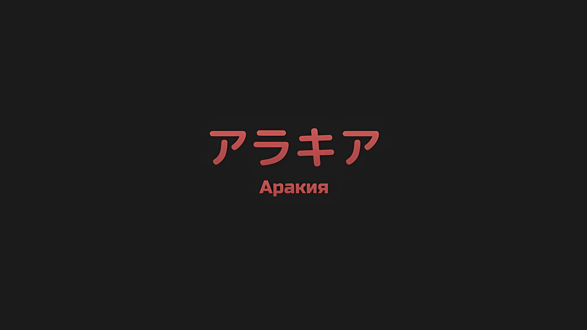
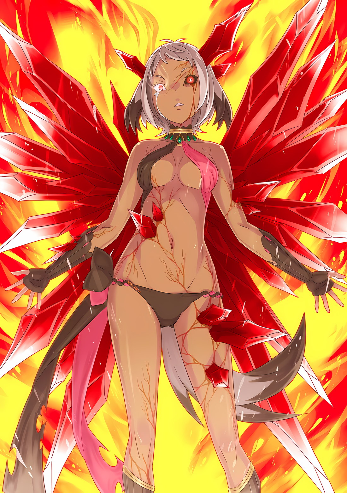

*※※※※※※※※※※※*

…Без чьих-либо указаний. Аракия поглотила его.

Аракия: …

С сильной пульсацией звук текущей крови отозвался болью.

Сердце ее колотилось быстрее, чем в разгар битвы, и каждый стук становился ударом, сродни гвоздю, вбиваемому в душу, — эта боль разливалась по всему телу. Тем не менее, Аракию это успокаивало.

То, что ее сердце по-прежнему перекачивает кровь, свидетельствовало о том, что она все еще сохраняет свой человеческий облик.

Даже если это было лишь незначительное утешение, сродни допустимой погрешности, Аракии было необходимо удержаться от волнения, дабы не дать своей душе рассеяться.

…Среди уникальных существ, известных как «Пожиратели Духов», не существовало в этом мире никого, кроме Аракии.

Она была рождена из крайних заблуждений людей, которых нельзя было назвать исследователями, а скорее аберрантами; запретная сущность, которой являлась «Пожирательница Духов», по имени Аракия, была оставлена в живых как единственное существо с судьбой, которую не разделял больше никто в этом мире.

С дерзким, раздутым эго, цепляясь лишь за существование «Столпа», который она считала для себя таким важным, Аракия пожирала духов, действовала как грозное существо и выполняла свою роль.

Ей казалось, что этого достаточно.

Однако, потеряв «Столп», она поняла, что это не так.

К тому времени, когда она это осознала, было уже слишком поздно; скорее всего, ее ждал типичный конец «Пожирателя Духов» — быстрый крах эго, пожирание Духами, которых она приняла, и закрашивание ее души.

Однако Аракию такая участь не постигла. Это объясняется двумя факторами.

Один из них заключался в том, что человек, которого Аракия считала своим «Столпом», был подобен ослепительному солнцу, сияющему так ярко, что даже когда они были разлучены, его нельзя было потерять из виду.

Вторая причина, в которой Аракия ни за что не захотела бы признаться… в дни после разлуки со своим «Столпом» Гром, напоминавший Аракии о том, что она — сама по себе, непрерывно сотрясал ее душу, вызывая чувство неполноценности и стимулируя ее обособленность.

Купаясь в лучах ослепительного солнца под аккомпанемент непрекращающегося Грома, Аракия сохраняла свою душу.

???: …К такому выводу я и пришел, однако я хотел бы услышать, есть ли у тебя какие-либо соображения на этот счет.

Аракия: …Нет.

Это произошло в тот год, когда Аракия обогнала Ольбарта по рангу и была повышена до «Второй».

Мнение Чиши, основанное на его поисках оставшейся литературы о «Пожирателях Духов», придало лицу Аракии суровый оттенок; такое было впервые за все время их долгого знакомства.

Это было вполне объяснимо. Чиша обладал высоким интеллектом, и его объяснения были понятны, однако Аракии трудно давалась его точка зрения.

Сама же Аракия осознавала свое существование в качестве «Пожирателя Духов» лишь на уровне чувств, и все же ей хотелось верить, что вся она целиком состоит исключительно из Приски.

Она не хотела, чтобы это обнадеживающее желание было разбавлено наименее предпочтительным из всех компонентов.

Для начала…,

Аракия: …Почему ты заговорил об этом?

Чиша и сам был удивлен, что затронул эту тему.

«Столп» Аракии, Приска… тот факт, что она в порядке исключения избежала «Церемонии Императорского Отбора», получив возможность покинуть страну живой, был тщательно охраняемым секретом даже в Империи Волакия.

Аракия и Чиша, что принимали участие в ее изгнании, естественно, знали об этом, но долгие годы не обсуждали, и никому другому не рассказывали.

Так почему же сейчас, в этот момент, Чиша решил затронуть эту тему?

Чиша: Я хочу знать, являешься ли ты хрупкой, эфемерной и исчезающей особью. Должен ли я включать тебя в число участников предстоящей великой битвы?

Аракия: …Это бессмысленно. Я же одна из «Девяти Божественных Генералов».

Вполне естественно, что их отправят подавить восстание или что-то в этом роде, как и предсказывали Чиша с Винсентом.

Однако, услышав ответ Аракии, глаз Чиши дернулся вниз, и на лице его появилось непривычное выражение. Это была улыбка, что так редко появлялась на лице Чиши, который почти всегда носил выражение либо безразличия, либо недоумения.

С этой улыбкой, что поразила уязвимую Аракию, Чиша продолжил.

Чиша: Судя по всему, эта битва окажется куда масштабнее, чем та, о которой ты думаешь. Я прекрасно понимаю, что ты служишь Его Превосходительству не от всего сердца и не считаешь меня своим союзником.

Аракия: …

Чиша: Хоть я и знаю, что это так, но все равно немного неприятно, что меня не опровееергли.

Аракия: …Ради принцессы я не исчезну.

Не обращая внимания на реакцию Чиши, что коснулся собственного лба, Аракия провела рукой по своей повязке на глазу.

На вопрос, почему она была сама собой, у души, известной как Аракия, имелся подходящий ответ. Опасения Чиши не оправдались. Поэтому, хотя и не для того, чтобы успокоить Чишу, она заявила,

Аракия: Это не имеет никакого отношения к Сесилусу.

Чиша: Хм. Это лишь мои умозаключения. Если ты действительно намерена заставить меня признать, что это не так, мне бы хотелось, чтобы ты победила Сесилуса хотя бы раз.

Сесилус: Аааааа? Разве вы не обо мне только что говорили? Что за дела, что за дела, это очень некрасиво со стороны Ани и Чиши — обращаться со мной как с чужаком — так что я хотел бы, чтобы вы это прекратили, пожалуйста? А, может, вы как раз об этом? О ничтожно малых шансах на победу Ани, что продолжает продлевать свою серию поражений, так и не усвоив урок?

Аракия: Сесилус, умри.

В итоге сразу после этого началась стычка Аракии с Сесилусом, и Чиша, который не хотел в этом участвовать, убежал, так что разговор не получил дальнейшего развития.

Впоследствии она не помнила, чтобы когда-либо продолжила этот разговор с Чишей.

Аракия: …

Смутная мысль пришла ей в голову.

Когда же наступит великая битва, о которой так беспокоился Чиша? И когда это произойдет, будет ли она в числе его войск?

Если бы представилась возможность, она хотела бы спросить его об этом.

Аракия была знакома с Чишей уже долгое время.

Из-за их отношений, возникших после «Церемонии Императорского Отбора», на которой ее разлучили с Приской, Аракия питала неприязнь к Чише, что был глубоко причастен к причинам ее с ней расставания.

Тем не менее, Чиша научил Аракию читать и писать. Она находилась у него в долгу. За эту услугу она была готова участвовать в сражениях, которых требовал от нее Чиша.

…Или, быть может, и это будет объяснено причинами, отличными от Приски?

Она ненавидела Сесилуса. Винсент был человеком сложным, но она склонялась к тому, что не сможет простить его за то, что случилось с Приской. Ольбарт забавлял ее своими шутками. У Гоза было комичное лицо. Груви сквернословил, но на самом деле был крайне полезен, а Могуро всегда выслушивал то, что она хотела сказать, не делая при этом неприятных физиономий. Йорна ей не нравилась, но почему-то она не могла ее ненавидеть. Балрой иногда брал ее покататься на своем летающем драконе, и потому Аракия чувствовала, что они с Мэделин взаимно стараются избегать встреч друг с другом. Тодду она была благодарна.

…Неужели все это тоже можно отнести к причинам, отличным от Приски?

Аракия: …

Чувствуя, что вот-вот разлетится на части, что ее вот-вот разорвут на куски, что она потеряет каждую частичку себя, которую могла вспомнить, Аракия собрала осколки «Аракии».

Если бы она этого не сделала, то исчезла бы сама… нет, это было не так.

Аракия: …нцесса.

Не сделав этого, она бы не смогла сдержать то, что бушевало у нее внутри, что-то, что готово было вот-вот вырваться наружу.

Это что-то было невероятно колоссальным. Немыслимо тяжелым. Невыносимо сложным. Если его не контролировать, он уничтожит Империю.

Если она не сможет держать его под контролем, ее «Столп»… Приска, не будет защищена.

Вот почему Аракия, без чьих-либо указаний, поглотила его. В свое несравненно тонкое и маленькое тело она приняла «Каменную Глыбу», Муспеля.

Империя не должна быть погублена чудовищем, что называло себя Ведьмой, с помощью этого «Великого Духа».

С этой целью…,

???: Наверное, она съела что-то плохое… Ты и впрямь не промах.

Оглушительный раскат Грома казался галлюцинацией, что собрал воедино разорванную на части душу.

Терзаемая утратой и болью, сродни грозовой туче, Аракия продолжала собирать воедино, собирать воедино, собирать воедино фрагменты «Аракии» и сопротивляться рассеиванию своего неспокойного «я».

Она продолжала сопротивляться и терпела. …Цепляясь за свою душу, что находилась на грани гибели, она ждала единственной надежды.

*△▼△▼△▼△*

Считать становилось все утомительнее, но это уже вошло в привычку.

Смелость вдаваться в подробности цифр способна принизить реальность, с которой сталкивается человек… не то чтобы это было умно. Без такого мышления это действительно было просто привычкой.

Привычка считать продолжалась. …Это был сто девяносто первый раз.

???: Как же сложно быть обычным человеком…

Ал пробормотал это себе под нос, чувствуя, как внутри шлема нарастает жар, а пот пропитывает его изнутри.

На сцене расплавленного второго бастиона продолжалась тщетная борьба актера, что оказался не на своем месте и играл второстепенную роль. Атмосфера неустойчиво колебалась из-за воздействия тепловой волны, охватившей все вокруг, явно превращая пространство во что-то из другого измерения.

Люди не смогли бы приспособиться к миру, который с каждым мгновением все больше превращался в ад.

Деревья и здания были подожжены, а куски улицы начали плавиться. Его ладонь, сжимавшая Меч Синего Дракона, издавала шипящий звук, и у него не было сомнений, что даже его одежда в любой момент может воспламениться.

Обстоятельства, в которых они оказались, были таковы, что, если бы они просто стояли на месте, то в следующий момент превратились бы в клубок пламени. Собственно, так уже происходило не раз и не два.

И все же, несмотря на эти невероятно суровые обстоятельства…,

???: Та-та-та-та-та-та-та-та-та-та-та-та-та!!!

Ведущий актер яростно бежал по бурлящей, кипящей магме, маневрируя со скоростью, которую можно было принять за молнию.

Со взъерошенными темно-синими волосами и в ярко-розовом кимоно, что развевалось на ветру, танцевал-бежал Сесилус Сегмунт, эпатажный, самопровозглашенный ведущий актер этого мира.

Его скорость, с которой он бежал по магме, его невероятная сила ног, кою никак нельзя было ожидать от тонких детских ножек, его, казалось, неисчерпаемая выносливость, его мужество, проявленное при встрече с врагом, способным в мгновение ока переделать весь мир, и сила судьбы — все это было первоклассно.

Объявив мир своей сценой и взяв на себя роль ведущего актера, Сесилус осознавал, что предстает пред невидимой публикой, и демонстрировал себя таким образом, что не стеснялся этих грандиозных заявлений.

Кто же еще мог бы выступить против столь могущественного, неординарного противника?

Сесилус: …Кхо!

С высоким криком, характерным для ребенка, тело Сесилуса подлетело под углом.

Через мгновение после его прыжка земля, на которой он только что находился, вздыбилась и взорвалась изнутри. Воспользовавшись взрывом, подброшенный Сесилус крутанулся в воздухе.

Молниеносный удар, способный снести даже каменный столб толщиной с гигантский ствол дерева, полетел в сторону сребровласого человека-собаки… в сторону Аракии, что парила в небе.

Аракия: …А-а, ух.

На фоне обнаженной коричневой кожи Аракии ее красные глаза, что были похожи на драгоценные камни, проливали кровавые слезы.

Подошвы обгоревших зори Сесилуса полетели прямо в ее торс, и она издала крик, когда они приближались все ближе и ближе… В момент удара в небе раздался громкий звук.

Сесилус: *～～*Кх!!!

Сразу же после этого Сесилус упал вниз быстрее, чем когда подпрыгнул, и с силой ударился об улицу, подавив крик боли, — а затем он поднял голову.

Мгновение спустя кровь хлынула из его бледного лба, окрасив лицо маленького ребенка в красный цвет.

Сесилус: Наконец-то ты смогла со мной сравниться, хах.

Слизывая кровь, что стекала по хорошо очерченной переносице, Сесилус прокомментировал тот факт, что его удар был успешно парирован.

В этом не было и намека на удивление. Ведь она парировала его не в первый раз.

Уже десяток или около того раз молниеносные атаки Сесилуса парировались, их продолжали сбивать. В результате ситуация стремительно ухудшалась.

Ал: Мисс Аракия находится в весьма плачевном состоянии.

В поисках возможности вмешаться Ал увидел Аракию, что парила в воздухе и искажала пространство вокруг себя.

Ее внешний вид был еще более причудливым, чем несколько мгновений назад: магические кристаллы росли из тонкого тела девушки, словно пронзая его изнутри.

Издалека наросты на руках и спине Аракии напоминали крылья ангела.

Однако в действительности Аракия поглотила чрезвычайно большое существо, которое сейчас пыталось разъесть тело девушки и вырваться наружу.

Ал: Твою ж мать.

Пока выбор Аракии постепенно лишал ее сил и заставлял отклоняться от человеческой формы, Ал только и делал, что ругался и выплескивал свой неконтролируемый гнев.

Он знал, каково это — желать компенсировать недостаток силы, не имея возможности реализовать свои желания.

Ал прекрасно понимал, что у Аракии есть потенциал для достижения гораздо больших высот, чем у него самого, и что ей подвластны многочисленные возможности.

Тем не менее, поглотив что-то, что не соответствовало ее возможностям, выдающиеся способности Аракии обернулись бы против нее, ее окружения и того, что ей дорого.

Поэтому простым ответом, пришедшим взамен, была нынешняя ситуация.

…Поначалу именно Сесилус одерживал верх в борьбе с Аракией.

Чтобы сдержать Аракию, которая превратилась в нечто опасное, способное разрушить второй бастион и стереть с лица земли всю столицу Империи, Сесилус направил против нее свою жгучую враждебность, подготавливая сцену и продолжая провоцировать ее интуитивное чувство опасности.

Говоря простым языком, это была битва двух трансцендентных существ, которые стояли не на одну-две ступени выше как воины, а скорее на десять.

Ал остался позади, но у него еще оставались возможности вмешаться; все же из почти двухсот попыток он смог дважды предотвратить отрыв конечностей Сесилуса.

Все это время Аракия была подобна бесконечно переполняющемуся стакану, что переливался через край и беспорядочно выплескивал воду, ставя под угрозу жизни Ала и Сесилуса.

Но, даже если бы все это повторилось, что, конечно же, произошло бы, если бы Ал воспользовался хитростью своей территории, никогда не удалось бы захватить Сесилуса, поскольку он прыгал вокруг, как существо, лишенное разума.

Однако ситуация изменилась.

Причиной тому стало вышеупомянутое усиливающееся обезображивание Аракии, которое тотчас же изменило ее стиль боя.

Сесилус: …Ко мне!

Подняв энергичный, полный воинственности крик, Сесилус сверкнул глазами и вытер кровь.

Мгновение спустя пространство вокруг Сесилуса исказилось, и со всех сторон, словно гигантские змеи, вырвались каменные столбы и обрушились на него. Сесилус пригнулся, отпрыгнул в сторону и закрутился, чтобы избежать каменных столбов, что яростно пытались его атаковать, причем скорость, с которой он отпрыгнул в сторону, возросла до максимальной.

Но, проливая кровавые слезы, натиск Аракии не давал молнии ускользнуть.

Когда он оттолкнулся от поверхности, земля на пути Сесилуса вздулась, создав серию огромных рук из камня и земли, которые вцепились в мальчика в попытке его раздавить.

Сесилус: К сожалению, прикасаться к актерам на сцене строго запрещено!

Остроумно заявив об этом, Сесилус использовал эти созданные руки, которые взметнулись вниз, как мухобойки, в качестве опоры для прорыва, тем самым взмыв в небо, словно по лестнице; набрав высоту, он изменил свое направление и, используя каменные кулаки, что пытались нанести ему удар, снова прыгнул в сторону Аракии.

Однако…,

Сесилус: Я облажался…!

Сесилус принял удар огромного каменного кулака, который превратил бы любого нормального человека в кровавый шлейф, подошвами своих зори, и, используя все свое тело как пружину, с криком полетел в сторону, задействовав полученный порыв.

Когда он устремился к Аракии с силой баллистической ракеты, на пути его возник белый свет, и Сесилус, которому в небе было некуда бежать, нырнул прямо в него…,

Ал: Ооооо!

С воем Ал поднял Меч Синего Дракона и метнул клинок вперед, прежде чем Сесилус успел нырнуть в этот свет.

Мгновенно получив прямое попадание от Меча Синего Дракона, свет с силой вспыхнул на миг, поглотив и уничтожив тела Ала и Сесилуса…,

*× × ×*

Сесилус: Я облажался…!

Приняв огромный каменный кулак нижней частью своих зори, Сесилус задействовал полученный порыв и закричал, летя с силой баллистической ракеты.

Однако прежде, чем он успел закричать, Ал направил острие своего Меча Синего Дракона в пустоту, и,

Ал: Донааа!!!

По сравнению с Аракией, разница в их магии была подобна разнице между луной и обычным камнем, однако выпущенные им каменные фрагменты пронеслись по небу, сокрушая выступающий свет разрушения, который вот-вот должен был родиться.

На мгновение сильная вспышка обожгла глаза Ала даже сквозь шлем, однако она не была достаточно мощной, чтобы покончить с его жизнью, а уж тем более со скоростью Сесилуса.

Сесилус: Ал-сан, давай сделаем это!!!

По вспышке света сразу стало понятно, чья это работа, и Сесилус, радуясь, что его жизнь была спасена, мгновенно подавил свои эмоции и устремился к Аракии.

Он поднял свою правую руку в виде удара карате, по остроте превосходящего неплохой меч. Она пронеслась по воздуху и ударила Аракию, у которой выросли крылья из магических кристаллов, наискосок…,

Ал: …Кх!

В этот момент у Ала было видение, без преувеличения, громового раската и разорванного неба.

На самом деле, это было не видение, а ударная волна от карате-рубящего удара Сесилуса, которая вышла из-за его спины и нанесла сокрушительный удар по группе зданий, находящихся на грани обрушения, что привело к краху всего района.

Но, тем не менее, Аракия получила этот удар карате.

Аракия: …

Сверкнув кроваво-красными глазами, она взглянула на Сесилуса, что находился всего в нескольких метрах от нее.

Несмотря на мощный удар карате в лоб, Аракия, ничуть не дрогнув, удержалась в воздухе и в ответ подняла свои крылья из магического кристалла…,

Аракия: …

И сразу после того, как эти тонкие губы издали слабый звук, Сесилуса пронзил смертельный удар.

*△▼△▼△▼△*

Мгновение за мгновением, по мере того как время шло, текло, проходило, «Аракия» исчезала.

Постепенно ощущая, что ее существование, местонахождение ее души закрашивается, среди боли и мучений, Аракия искренне пыталась вспомнить сияние своего Солнца.

Она вела упрямый образ жизни. Несмотря на то, что она родилась в результате многих жертв, ей было безразлично, что произойдет после, — она представляла собой опасный объект, который некуда было деть.

Не зная, как эффективно или правильно использовать столь пугающее существо, эта девушка спокойно поставила Аракию рядом с той жизнью, которую она вела, и уверенно велела ей себя сопровождать.

Но почему, почему она попыталась противостоять этому совершенному великолепию?

В ней не могло зародиться чувство сопротивления или несогласия. Эта девушка была воплощением всего того, что она считала правильным, и само ее существование было смыслом рождения Аракии.

Чтобы не потерять это сияние, чтобы не потерять то, что та считала прекрасным в этом сиянии, она, считая это необходимым, решила покинуть ее и каким-то образом сумела вынести мысль о разлуке.

Она терпела, терпела, терпела все это, потому что верила, что Солнце взойдет снова.

…Пока она могла защищать рассвет нового дня, ничего страшного не случится, если она сама не сможет погреться в лучах восходящего Солнца.

Безрассудно крича и скуля о том, что не может поднести к нему руки, в то время как на нее смотрели разочарованные глаза самого Солнца, именно тогда она и пришла к такому выводу.

Она думала, что Солнце покинуло ее.

Она думала, что Солнце больше не будет ей светить.

Однако, вступив в решающую битву за столицу Империи и направив «Меч Света» на рыдающую Аракию, Солнце… Приска не разрубила Аракию своим драгоценным багровым мечом.

После этого, в окружении слуг возникшего «Великого Бедствия», ей следовало бы бежать. Но, в обмен на безопасность Аракии, она предпочла попасть в плен.

Те сокровенные чувства, тот ослепительный блеск ничуть не изменились.

Если Приска осталась неизменной, то и Аракия желала, чтобы ее клятва оставалась неизменной.

…Приска Бенедикт.

Символ Империи Волакия, символ Солнца, которое зашло, но взойдет снова.

При мысли о ней Аракия могла оставаться «Аракией».

Аракия могла отсрочить предел, когда ее душа становилась все раскаленнее и разрывалась на части.

Однако, даже если ее любовь и преданность Приске были вечными, этот предел не мог быть продлен до бесконечности.

Она удерживала существо, которое могло поглотить и полностью завладеть ее присутствием.

Пока Аракия продолжала сопротивляться этому безобразию в своем разуме, существо, что даже сейчас занимало ее тело, усиливало свое разрушение в реальном мире, на который она не могла обратить внимание.

Разрушения становились все более изощренными, гибель набирала обороты, и до полного краха оставалось совсем немного.

Пребывая в стагнации на протяжении долгих веков, «Каменная Глыба», Муспель, не обращал внимания ни на то, что часть его силы использовалась в конфликтах между людьми, ни на то, что она использовалась для обогащения человеческой деятельности… однако, попав в хрупкий сосуд, известный как Аракия, он научился сопротивляться.

Великий Дух, которого поглотила Аракия, проявлял защитные инстинкты, которые, вероятно, не использовал бы, будь он в своей первоначальной форме, и, как ни странно, усиливал уровень угрозы, чтобы защитить свой сосуд.

Аракия: …

Кто-то, кто-то боролся, чтобы остановить Аракию; она чувствовала это.

Казалось, что из-за того, что кто-то заставил силу Аракии несколько истощиться, тормоза «Аракии» были нажаты.

Но этого было недостаточно. Просто ослабить ее, просто держать в узде было недостаточно.

Чтобы помешать достижению цели Великого Бедствия, Аракия поглотила его.

«Великий Дух», который подчинялся воле других, независимо от того, что с ним делали, оказавшись в руках Аракии, познал страх, известный как «потерять себя».

Нужен был только один толчок. После еще одного толчка Великий Дух поймет.

Дабы не дать «Аракии» исчезнуть, требовалось Солнце.

А для того, чтобы «Аракия» выполнила свою клятву, требовалось кое-что еще. …Гром, нужен был он.

Кто-то, кто-то боролся, чтобы остановить Аракию; она чувствовала это.

Этого было недостаточно. Этого кого-то было недостаточно. Однако она знала, кто именно был необходим.

Именно поэтому, пока она была на грани того, чтобы разорваться, Аракия ждала его с надеждой.

…Грома, раскат настоящего Грома, она ждала его с надеждой.

*△▼△▼△▼△*

Аракия: …Сесилус, убей меня.

В тот момент, когда он услышал это, из всех возможных вариантов развития событий его мысли зашли в тупик.

Он со всей силы обрушил на противника удар карате, но в ответ получил лишь взгляд, будто это было совершенно неэффективно, а сразу после этого, когда прекрасная девушка зарыдала кровавыми слезами, слабым голосом она произнесла такую мольбу.

Сесилус: …

Затем, быстрее, чем он смог переварить эти слова, Сесилус получил мощный удар в грудь.

Тонкие руки девушки, за счет остроты магических кристаллов, которые густо росли на ее теле, были, по сути, лезвиями, отчего тонкая грудь Сесилуса оказалась безжалостно разрезана, и он начал падать, запятнав кровью свое любимое кимоно.

Боль — присутствовала. Осознание того, что он допустил ошибку, — присутствовало. Признаки того, что он попал в затруднительное положение, — присутствовали, и с лихвой.

Однако сильнее, чем рана, что глубоко в него вонзилась, больше, чем кровь, прочертившая след в воздухе, Сесилус не мог отвести взгляд от жалких глаз и лица девушки, от которой он отдалялся все больше… он не мог отвернуться от сказанных ею слов…

?̢́?̴̨̛?̨̧̕͞: «■■!!!»

?̢͢͡?̛̛͞͏?̛͏͢: «■■■■.»

?̢́?̴̨̛?̨̧̕͞: «■●■●■●■.»

?̢͢͡?̛̛͞͏?̛͏͢: «■■■■●●■■.»

?̢́?̴̨̛?̨̧̕͞: «●●●■■■.»

?̢͢͡?̛̛͞͏?̛͏͢: «…■■.»

?̢́?̴̨̛?̨̧̕͞: «●●●●●!!!»

?̢͢͡?̛̛͞͏?̛͏͢: «■■■●■●●■■●●.»

?̢́?̴̨̛?̨̧̕͞: «●●…■.»

?̢͢͡?̛̛͞͏?̛͏͢: «●●■■●■■●●.»

?̢́?̴̨̛?̨̧̕͞: «●■●■●■●■.»

?̢͢͡?̛̛͞͏?̛͏͢: «●●■●■●●●■■●…!»

Сесилус: …Мои самые искренние извинения, но я попрошу вас всех соблюдать тишину!!!

В этот момент Сесилус обратился с решительным призывом к непрерывно звучащим голосам зрителей.

?̢͢͡?̛̛͞͏?̛͏͢: «…»

В обычной ситуации Сесилус никогда бы не сделал ничего такого, что заставило бы зрителей замолчать.

Он использовал их голоса как основу для повышения собственной мотивации и, когда они говорили с ним, всегда спокойно позволял им влетать в одно ухо и вылетать из другого.

На этот раз он замолчал и сам. Тишина, даже несмотря на мучительную боль, он желал тишины.

Сесилус: …

Падающий Сесилус, когда все зрители затихли, в тишине продолжал смотреть на девушку.

Страдая и проливая кровавые слезы, горестные призывы девушки приняли форму уничтожения мира, и посреди бессмысленных криков она, наконец, смогла осуществить свое желание.

То, что там оказалось его имя, можно, несомненно, назвать судьбой ведущего актера.

Однако…,

Сесилус: …«Убей меня», сказала ты. Теперь это то, что я просто не могу оставить без внимания.

Не столько от боли или шока, сколько от того, что ему было трудно смириться с этими словами, Сесилус стиснул зубы.

В этот момент, когда он падал на землю вперед головой, Сесилус согнул колени, кувыркнулся и, стараясь обеспечить себе безопасное приземление, уклонялся, уклонялся, уклонялся от серии каменных столбов, что нацелились на него, а затем, когда его пятки коснулись почвы, остановился.

После чего Сесилус поднял голову.

Сесилус: Не думаю, что эти слова предназначались мне.

Конечно, он не считал, что среди присутствующих есть кто-то еще с именем Сесилус.

Однако он прекрасно понимал, что человек, к которому взывала плачущая девушка и которому она доверила свое желание, — это не он. …И было это крайне неприятно.

Важнейший поединок, авантюра, на которую поставлено все, решающая сцена, момент, когда нужно было выложиться по полной, — подойдет любая формулировка.

Но раз уж такой момент, такая сцена, такая кульминация были подготовлены, то и речи не могло быть о том, чтобы вызванный Сесилус Сегмунт оказался кем-то другим, а не им самим.

Поэтому…,

Ал: …Сесилус! Ты, эта рана…

Сесилус: Я принял решение, Ал-сан.

Получив серьезную рану, Сесилус истекал кровью, и, увидев это, Ал закричал, зачем-то прижимая к собственной шее Меч Синего Дракона. В ответ Сесилус сорвал веревку с разорванного кимоно и, используя ее как шнурок, завязал назад свои растрепанные синие волосы.

Затем, улыбнувшись, он посмотрел на плачущую девушку… на героиню, и провозгласил.

Сесилус: Свидетельствуйте, о Наблюдатели небесные. …Свидетельствуйте о выборе, который сделает мир.
