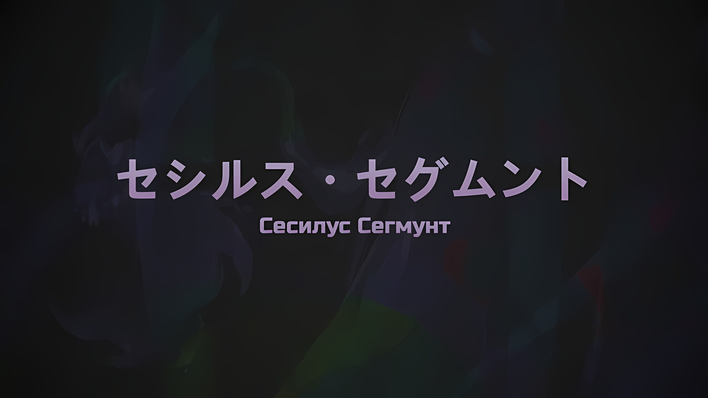
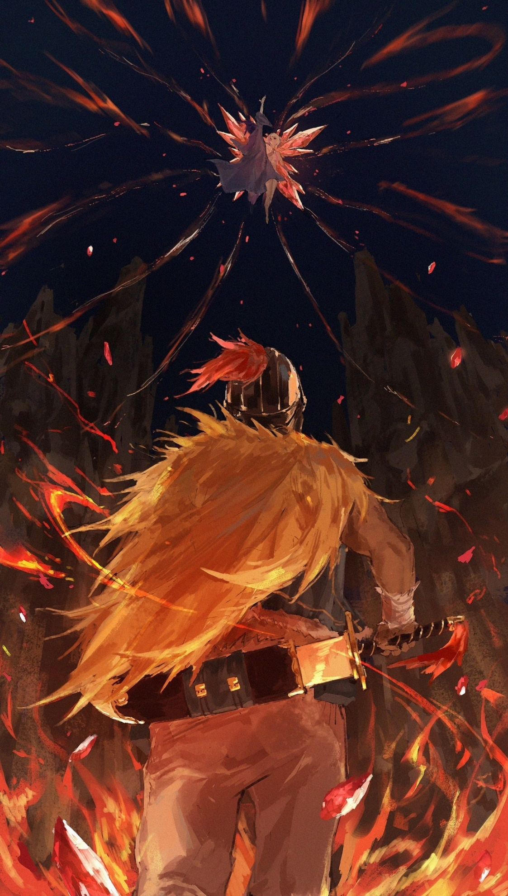
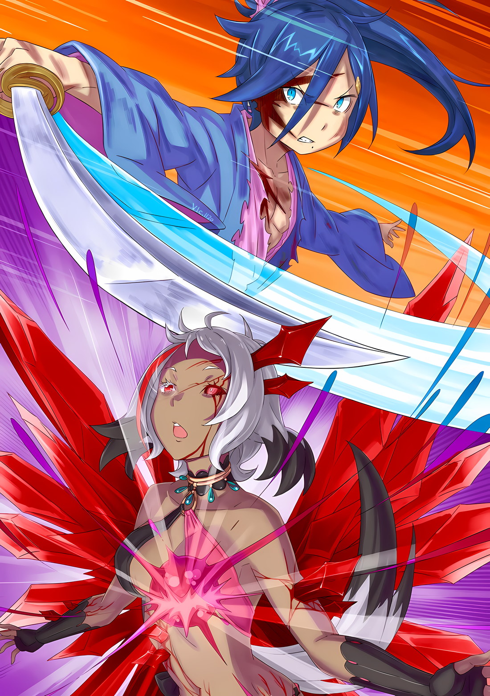

*※※※※※※※※※※※*

…Сесилус Сегмунт был «Звездочетом».

Этот вступительный отрывок уже использовался, поэтому он отклоняется.

…Сесилус Сегмунт был ведущим актером этого мира.

Этот факт подтверждается тем, как Сесилус очаровывал других действиями, а не просто рассказами, поэтому он довольно безыскусен.

…Сесилус Сегмунт был совершенно уникален.

Этот пункт не ограничивался только Сесилусом, и потому вызывает головную боль.

…Сесилус Сегмунт был Сесилусом Сегмунтом.

Это наиболее подходящее определение, а, значит, в этот раз оно будет использовано в качестве вступительного.

Итак…,

*△▼△▼△▼△*

…Сесилус Сегмунт был Сесилусом Сегмунтом.

Присягнув Тенчи Шинмею*, этот факт послужил абсолютной, непоколебимой основой Сесилуса.

* Тенчи Шинмей (天地神明) — японская фраза, означающая «Боги Неба и Земли». В выражениях, где им присягают, это передает чувство благоговения и преданности.

Что бы ни случилось с его телом, даже если, как говорили окружающие, в прошлом существовала его взрослая версия — красивый молодой человек с цветущей внешностью и конечностями длиннее, чем у него сейчас — это уже был Сесилус До, и в данный момент не существовало никакого Сесилуса Сегмунта, кроме его собственного индивидуального «я».

Таким образом, он должен доказать это.

Сесилус: Свидетельствуйте, о Наблюдатели небесные. …Свидетельствуйте о выборе, который сделает мир.

Закончив туго завязывать волосы веревкой от одежды, он крепко хлопнул себя по щекам пустыми ладонями.

Сесилус редко прибегал к такому способу мотивации, но в драматургии было очень важно, чтобы перемена чувств была легко заметна. Посредством такой интермедии зрители узнавали о чувствах актера на сцене и о том, что пьеса переходит к следующей стадии.

Затем Сесилус склонил голову набок со словами «Подумать только»,

Сесилус: Вы, ребята, на удивление разумны. Я нисколько бы не возражал, если б вы возобновили свою обычную болтовню.

?̢́?̴̨̛?̨̧̕͞: «●●■▼●■●!»

?̢͢͡?̛̛͞͏?̛͏͢: «▼■■…»

?̢́?̴̨̛?̨̧̕͞: «■■■■■!!!»

?̢͢͡?̛̛͞͏?̛͏͢: «▲■■▲●●●■▲●●▲▼■●▲■●●●.»

?̢́?̴̨̛?̨̧̕͞: «●■●●■■■!»

?̢͢͡?̛̛͞͏?̛͏͢: «…▲▼▲.»

?̢́?̴̨̛?̨̧̕͞: «●●▲▼▲●●.»

?̢͢͡?̛̛͞͏?̛͏͢: «■●▲●■■●●▲■●! ●■●! ▲▼■!»

?̢́?̴̨̛?̨̧̕͞: «●●■■■▼●■…»

В тот же миг голоса зрителей, что до этого были вынуждены замолчать, взорвались, и Сесилус, внутренне кивнув их привычным действиям, вернулся в свое русло.

Их присутствие, постоянно к нему прикованное, удовлетворяло потребность Сесилуса в одобрении, так что это был первый раз, когда он заставил их замолчать. Подобное для него было совершенно немыслимо, однако то, что они действительно замолчали, тоже вызывало удивление.

Он был весьма доволен таким поворотом событий, и это послужило хорошим предзнаменованием грядущих событий.

В конце концов…,

Сесилус: …Я собираюсь одержать победу над недооценивающим меня противником.

Как только Сесилус это сказал, в его лицо ударила вспышка света.

Ал: Сеси…

Увидев, как лицо Сесилуса пронзило прямо в центре его широкой улыбки, Ал повысил голос.

При виде фигуры Сесилуса Ал вскочил и уже собирался приложить силу к Мечу Синего Дракона, который зачем-то прислонил к собственной шее. Однако он остановился.

Образ Сесилуса, который пронзил свет, расплылся, и он понял, что то, что произошло, было остаточным изображением.

И тогда…,

Сесилус: Тебе лучше немного отойти.

Сразу после того, как это достигло барабанных перепонок Ала, остаточное изображение Сесилуса исчезло, и образовалась ударная волна.

Звук, что раздался позже вспышки света, вызвал разрыв пространства, и, покрывая расстояние в десять с лишним метров, а затем расширяясь, словно в погоне за разрастающимися разрушениями, он образовал на улице круглый кратер.

Ал: Оооаааааа!?

Так как Ала накрыло ударной волной, его крик оборвался, что, однако, не попало в поле зрения Сесилуса, который устремился вперед. Впрочем, он не стал полностью игнорировать присутствие Ала.

Собрав информацию о своем окружении, например, о поведении и физических способностях Ала до сих пор, а также о том, насколько его прежняя позиция и крик становились все дальше, как естественный результат сцены, что вытекал из характера атаки противника, Сесилус представил себе фигуру невидимого Ала в театре своего разума.

С большой долей вероятности именно так и произошло. Потому что его нынешнее состояние как нельзя лучше подходило для разыгрывания спектакля.

…И, хотя актеры не могли постоянно видеть все точки на сцене, им было крайне важно всегда быть в курсе того, что происходит в каждом ее уголке.

Это чувство нарастало… нет, нарастало воображаемое поле зрения в его мозгу.

Сесилус занял центральное место на сцене, руководил сценическими эффектами, а также игрой актеров, что играли роли по своему усмотрению; иначе говоря, он с головокружительной скоростью мчался к воплощению самых ярких событий во всем мире.

Сесилус: …

По мере того, как Сесилус балансировал на границе между жизнью и смертью, фигура парящей над ним героини становилась все более и более гротескной.

Не дрогнув даже под ударами Сесилуса, на стройных плечах и руках героини выросло множество маленьких магических кристаллов, а ее внешность напоминала фантастическую иллюзию облачения в сверкающие крылья.

Что особенно привлекало внимание в этой фигуре, которую можно было даже назвать красивой, так это нежно ласкающие небо ленты света, что парили вокруг героини… это были магические кристаллы тонкой и плоской конструкции.

В силу какого-то принципа одна из лент магической природы, колыхаясь на ветру, плыла в небе по плавной траектории и освещала пылающий городской пейзаж; в тот же миг лента, рассекая мир, устремилась в сторону Сесилуса.

Та же атака, что уничтожила Ала ранее, снова приблизилась к лицу Сесилуса — глаза его сверкали — приближаясь, приближаясь и приближаясь…,

Сесилус: …Лизь. Да, понял, довольно своеобразный вкус. Наверное, это следует назвать вкусом драгоценного камня?

В этот момент Сесилус, прежде чем уклониться, высунул кончик своего языка и попробовал на вкус ленту света, которая вот-вот должна была вонзиться ему в лицо. Его язык ощутил твердый и в то же время мягкий вкус.

Вкус был похож на тот, какой можно получить, если положить в рот драгоценный камень, что напоминал твердую конфету, и после чего разочароваться… ибо это были ленты с драгоценностями, в кои облачилась героиня.

Сесилус: Если подумать, ты начинала с того, что посылала в полет свет и огонь, а затем, по ходу дела, переключилась на каменные столбы и земляные конечности. Значит, эти драгоценности служат продолжением… они и впрямь весьма изысканны, мне нравится! Как великолепно, ох, как же великолепно, ощущение кульминации все нарастает и нарастает!

Спрятав язык, которым лизнул ленту, Сесилус расхохотался от прилива боевого духа.

В этот одиннадцатый час, в этом решающем поединке, он был преисполнен благоговения пред тем, что его противником стала небесная дева, одетая в украшенное крыльями одеяние из драгоценных камней. Кроме того, по результатам их предыдущего боя он пришел к пониманию.

Удары карате, которые Сесилус наносил с молниеносной скоростью, были способны расколоть надвое железный замок, не говоря уже о каменной стене. Но, хотя он и не мог сказать этого наверняка, ему доводилось слышать, что среди драгоценных камней есть такие, которые по твердости превосходят даже эти материалы.

То есть героиня, против которой выступал Сесилус, была…,

Сесилус: …Небесная девица из алмаза!!!

Как только он произнес эти слова, из крылатого одеяния небесной девы выстрелили алмазные ленты.

Со вспышкой ленты света охватили весь мир… их было около двенадцати, нет, одиннадцать, если исключить ту, которую он лизнул и от которой уклонился, однако же они окружили Сесилуса с одиннадцати разных сторон в попытке его убить.

В этой области, несомненно, обитала сама «Смерть», — битва шла напряженно, так, как если бы ему приходилось уворачиваться от капель дождя во время грозы…,

Сесилус: Если это необходимо! Будь то капли дождя или песчинки, я буду уклоняться от них!

Одиннадцать линий, разделяющих жизнь и смерть, разбежались в разные стороны, а еще одна вернулась — теперь их стало двенадцать — и он уклонялся от них, уклонялся, уклонялсяуклонялсяуклонялсяуклонялся…

Если хоть одна из них его заденет, это окажется смертельным, а если это окажется смертельным, то он рухнет, а если он рухнет, то занавес закроется.

Кончики его пальцев ног поджались, когда он ступил вперед, кровь, что сочилась из его раны на груди, испарилась, и он протиснулся сквозь щели в решетчатых лентах, которые преграждали ему путь, — он не даст опустить занавес. Ну же, как вам такое, вы вообще когда-нибудь видели нечто подобное? Будь это тело взрослого, он бы не смог проскользнуть сквозь щели, так что, после различных умозаключений, это была победа нынешнего Сесилуса.

Одержав на этом этапе победу, он решил, что будет побеждать и дальше, поэтому, чтобы закрепить свой успех, он сверкнул зубами в улыбке…,

Сесилус: Тут-то воображение и расправит свои крылья!

Не в силах остановиться, когда на него сыпался яростный натиск, он игнорировал все вокруг, пока из его глубокой раны хлестала кровь.

Ускорение его мыслей в разгар битвы впечатляло, и до сих пор бой удостаивался похвал, аплодисментов и громких возгласов. Однако такими темпами он будет становиться все хуже, скучнее и ненавистнее для всех; чтобы разработать лучший режиссерский план, ему придется сделать гир чэиндж* своего тела, поставив во главу угла блистательность на сцене.

* Gear change — переключение передач/переключение скоростей.

…Прежде всего, он отключил способность различать цвета. Весь мир окрасился в черно-белый цвет.

Краски мира потеряли свою яркость, но, в свою очередь, у монохромного мира имелось одно преимущество: он показывал истинную природу вещей, показать которую можно было только в нем.

…Далее он отключил способность распознавать звуки. Голоса зрителей и биение его сердца, замедленные звуки разрезающих ветер лент света и звуки разваливающейся сцены — все это было полностью отключено.

Беззвучный мир был скучен, однако в нем присутствовал аромат, что мог возникнуть только от изысканного вкуса наслаждения дискомфортом. Именно в этой обстановке можно было найти тот самый аромат — восторг, что распирал грудь при виде мастерского исполнения лиц и жестов актеров.

…Кроме того, он еще и отключил свои вкусовые, обонятельные и болевые чувства. Он полностью овладел своим телом ради битвы, полностью сконцентрировал свой разум на мыслях, которые мелькали в голове, и поднял занавес над театром, что представлял собой воображаемое поле зрения в его сознании.

Сесилус: …Что ж.

Так, с этим вздохом, мир разделился на черное и белое… в пространстве, где он продолжал уклоняться от яростных атак алмазных лент, Сесилус в буквальном смысле смотрел на себя сверху вниз, когда добросовестно боролся, напуская на себя важный вид.

Если выразить ускорение его мыслей в фантастической форме, то это было ощущение, сродни продлению одного мгновения. Однако оно не было всемогущим. Ведущий актер мог великолепно поддерживать сцену, но был предел тому, как сильно он мог увлечь зрителя, если ситуация не сдвигалась с места. Именно развитие сюжета покоряло сердца.

Алмазная героиня, роняя слезы, обратилась к нему с мольбой, и, хотя Сесилус был крайне этим обижен, он исказил намерения этого обращения в угоду себе, и ему не оставалось ничего другого, кроме как обрести силу, необходимую для приведения в движение этой ситуации, что неуклонно развивалась в слоумо*.

* Slow-mo — замедленная съемка.

Сесилус: …

Если рассуждать по обычным стандартам, то эта девушка была связана с Сесилусом. Существовала также вероятность того, что она была его хардкорной фанаткой, которая однобоко знала чересчур знаменитого Сесилуса, — если предположить, что это так, это не создаст никаких проблем в его мыслях, так что не стоит подвергать сомнению, правда это или нет.

Важно то, что Сесилус Сегмунт, с коим она была знакома, — это не он нынешний, а тот назойливый Сесилус, который часто всплывал в его разговорах.

Другие бы, наверное, удивились, узнав об этом, а Шварц и Танза и вовсе были потрясены, но Сесилуса совершенно не интересовала тема Сесилуса До.

Что бы ему ни говорили, это были дела какого-то чужака; что бы он ни делал, это было случайное сходство; что бы ни оставалось, это были достижения кого-то другого.

Таково было его восприятие, а значит, «до» и «после» внутри Сесилуса четко различались. Такое же восприятие было и у героини, которая, похоже, пребывала в шатком состоянии после того, как что-то съела.

Героиня не рассматривала Сесилуса До и Сесилуса После как единое целое.

Сесилус: Само по себе это приятное развитие событий, и так как оно не перерастает в нечто, что велит мне снова стать большим, у меня не остается другого выбора, кроме как развивать ситуацию в том виде, в котором она находится сейчас!

???: Как интересно. Я благодарен за то, что меня считают самостоятельным типом, но в то же время чувствую явное недовольство тем фактом, что я не тот, кто требуется.

Пока Сесилус размышлял, рядом с ним внезапно появился Другой Сесилус.

И хотя он только-только заявил, что Сесилус «до» и «после» существуют отдельно друг от друга, появление здесь Другого Сесилуса сбивало с толку, однако присутствие его означало, что он идет по верному пути.

Сесилус: Ну, думаю, это результат повышенной концентрации, что облегчает понимание ускорения моих мыслей через визуальную метафору. Сейчас важнее тема нынешней героини.

Сесилус: Думаю, речь идет не столько о героине, сколько о ее позиции, когда дело касается меня. Конечно, если ты посмотришь на Босса и Танзу-сан, то нетрудно догадаться, что отношения между ключевой фигурой в истории и героиней могут породить кемистри*, которой до этого момента не существовало.

* Chemistry — химия.

Сесилус: То есть ты хочешь сказать, что такая же кемистри может возникнуть между мной и ней?

Сесилус: Интересно. Почему ты снова решил сделать ее героиней?

Сесилус: Просто плыл по течению.

Сесилус: По течению, да~?

Сесилус: Но, но ты же знаешь, что то, что Босс называет чувством жизни, — это не то, на что стоит смотреть свысока. Быстрые решения и рефлексы — это, по сути, инспирейшн*, что полагается на инстинкт, но разве я не проходил через многие сцены, потому что следовал своим инстинктам?

* Inspiration — вдохновение.

Сесилус: Да, раз уж ты об этом заговорил. То есть ты хочешь сказать, что, так как твое нынешнее состояние это результат следования собственным инстинктам, лучше всего продолжать следовать им и дальше?

Сесилус: Именно так. Однако, если все так, как и должно быть, то, ну… …Мои инстинкты задаются вопросом, почему здесь полагаются не на меня, Сесилуса Сегмунта, а на кого-то другого.

Сесилус: Понимаю. Но дело ведь в том, что ей не нужен нынешний я, да? Она хочет Сесилуса До, но неужели это значит, что Сесилус После не сможет сделать то, что мог бы сделать Сесилус До?

Сесилус: Ах, в таком случае, нынешний я должен превзойти предыдущего.

Сесилус: Бееез~ возражений!

Оба Сесилуса кивнули друг другу, и, придя к взаимному согласию, возник спор о том, кто из них вернется к Настоящему Сесилусу, на которого они смотрели свысока.

Началась бесполезная битва за то, чтобы решить, кто из них является истинной душой Сесилуса, — а затем она завершилась… сразу после этого время для Настоящего Сесилуса пошло как обычно, и он возобновил свою борьбу с двенадцатью линиями смерти, которые родились из алмаза, выпущенного из крылатого одеяния небесной девы.

Сесилус: …Так как до этого я смотрел на все медленно, скорость моих ощущений стала очень-очень-очень быстрой!

Двенадцать танцующих световых лент действовали каждая по своей воле и чертили неровные траектории, словно живые существа, отличные от обычного оружия. Когда он попытался сбить одну из них ударом карате, часть, на которую пришелся удар, оказалась полностью отколота, и на нее стало больно смотреть. По его ощущениям, они были даже острее, чем драгоценный «Онибами» Роуэна, так что это был довольно сложный противник.

И вот, находясь в окружении роя смертоносных, но прекрасных драгоценных камней, Сесилус задумался.

Сесилус: Фраза «убей меня» говорит о том, что она думает, что Сесилус в ее голове сможет это сделать.

Другими словами, это было выражение уверенности в том, что если бы это был Сесилус в ее голове, то он смог бы легко прорваться сквозь эту алмазную осаду и подобраться к ней, а затем великолепным образом остановить ее сердце.

Естественно, поскольку Сесилус намеревался превзойти предыдущего Сесилуса, необходимым условием было идти дальше…,

Сесилус: Если это то, чего никогда не делал Сесилус До, то как насчет этого?

Из-за препятствия, которое он установил, чтобы превзойти самого себя, в мыслях Сесилуса промелькнул спарк*.

* Spark — искра.

Если бы это был Сесилус До, он, возможно, смог бы полностью избежать приближающейся атаки, но если бы это был Идеальный Сесилус, что возник из единства Сесилуса После и Другого Сесилуса, то он создал бы кульминацию, которая была бы больше, чем просто уклонение.

Лента света была нацелена на его шею, мерцание приближалось к его туловищу, рассекающий удар был направлен на то, чтобы отсечь его ноги; он шагнул левой и правой ногой последовательно, чтобы уклониться, а затем наклонился назад, присел, вытянул колени и подпрыгнул, полностью уклоняясь от всех ударов, и как результат…,

Сесилус: Это кэтс крэидл* из света!

* Cat’s cradle — колыбель для кошки. Это выражение означает игру в плетение с помощью нитки или бечевки, надетой на пальцы, которая складывается в различные узоры.

Он продолжал уклоняться от двенадцати независимых световых лент на волосок от гибели и, направляя их так, чтобы они запутались в воздухе, великолепно связывал их в паутину, которая превратилась в «Башню Токио».

Во время их путешествия с Острова Гладиаторов Шварц показал свое времяпровождение, заключавшееся в игре с пряжей, и, поскольку Танза была открыто впечатлена этим, это заставило Шварца серьезно засмущаться; именно это и воссоздал Сесилус.

Конечно, даже если он воссоздал это, смысла в этом не было.

Алмазные ленты были сотворены из большого количества маны, и их длина не имела предела; как только образовывался узел, его можно было развязать путем разрушения и восстановления, так что все прошло так, как будто ничего и не произошло.

Он не испытывал ошибочного чувства триумфа от того, что таким образом сдержал атаки противника.

Просто он кое-что приобрел. Убежденность.

Сесилус: Я превзойду себя.

Он не видел себя настоящего. Он также не мог сравнить себя с ним.

Однако Сесилус До, каким его себе представлял Сесилус, никогда не создавал эту «Башню Токио». Ибо внутри него не существовало никакой «Башни Токио».

И даже если Сесилус До мог успешно уклоняться, когда дело доходило до триумфального создания кульминации, что выходило за рамки простого уклонения, нынешний Сесилус лидировал на шаг.

Сесилус: …

Сразу после этого убеждения под Сесилусом разрушилась сформировавшаяся из света «Башня Токио».

Возвращаясь к мане, ленты, как и предполагалось, восстановились… то, что немного выходило бы за рамки гипотезы, состояло в том, что в момент восстановления образовался бесцветный взрыв.

Если бы ленты просто стерлись, Аракия бы продолжала проигрывать, и это событие показалось бы бунтарским духом…,

Сесилус: А ты, видимо, не любишь проигрывать!

В мире, где не было цвета, где даже его собственный голос игнорировался барабанными перепонками, Сесилус впечатлился героиней, глядя на нее издалека.

После того, как он впечатлился, прямо под ним постепенно поднялся бесцветный луч света… прямое попадание в этот луч аннулирует его уклонение от лент, к тому же степень свободы, которой он обладал в воздухе, была значительно ниже, чем на земле.

Это было плохо, плохо-плохо-плохо-плохо; он разгорячился.

…Еще раз расширив свое воображаемое поле зрения, он сделал гир чэиндж своего тела.

Чувство цвета, сохранить текущее состояние. Чувство слуха, сохранить текущее состояние. Чувство боли и чувство осязания, активировать вновь; пряча мгновенно вскипевшую боль за улыбкой с обнаженными зубами, он искал «Ключ» среди ощущения, что одна секунда разделилась на сто частей.

Так он сможет найти «Ключ», который перевернет сценарий на следующую страницу.

Сесилус: …Вот он.

Обнажая нервы своего тела и выставляя их на волю ветра, Сесилус совершил гиперпространственный акт дикости — его вытянутая нога что-то задела.

Это не было ни удобной стеной, ни зданием. От разрушенного городского пейзажа, поглощенного битвой Сесилуса и героини, отлетела часть обломков, которую закрутило вихрем, — одна песчинка гравия.

Ее он использовал в качестве опоры.

Сесилус: Шха.

Используя чрезвычайно слабое чувство, возникшее у подошвы его ноги, как точку опоры, тело Сесилуса подпрыгнуло в воздух.

Чтобы избежать настигающих его ахроматических разрушений, Сесилус снова наступил на разлетевшиеся щепки дерева и осколки оконного стекла, а затем, ступив на чуть более крупную золу, взлетел выше.

Но почему он смог это сделать? Он был способен на это только потому, что мог, и заставлял верить в это всех, кто его видел.

Пренебрегая различными логическими и общепринятыми представлениями, поступок Сесилуса — бегство в небо — противоречил здравому смыслу. Те, кто стал свидетелем этого, могли бы назвать такое чудом, но для Сесилуса это было только начало, не более чем горстка чудес, которые каждый день в разные моменты окрашивали мир.

И, если он продолжит творить эти чудеса…,

Сесилус: Нетерпеливая реальность обнажит свои клыки.

Сесилус избежал луча света благодаря своему безрассудному взлету, и не успел появиться результат этого побега, как восстановленные световые ленты прорвали бесцветный луч света изнутри и стали преследовать Сесилуса по небу.

Двенадцать лент сплелись в спираль, ее кончик радиально расширился в сторону Сесилуса, и, подобно тому, как плотоядное растение пленяет жуков своими прекрасными лепестками, она укусила его. Лепестки закрылись, как бутон, Сесилус не сможет избежать того, чтобы быть проглоченным алмазным цветком.

Такое, конечно, произошло бы только в том случае, если бы это был Сесилус, а не нынешний Сесилус.

Сесилус: Бум.

Звук атмосферного взрыва, в сто раз превышающий изданный им звук, потряс поле боя.

К сожалению, хотя сам Сесилус отгородился от всех звуков и потому не мог этого слышать, ему было жаль барабанные перепонки героини и Ала, которые также находились в этом месте. Но больше всего ему хотелось пожаловаться, наверное, на взорвавшееся небо, по которому Сесилус ударил ногой.

Сесилус, способный не слышать звуков и бегать с молниеносной скоростью, прекрасно знал, что в воздухе есть стены. Ударять эти стены оказалось не так-то просто, однако было бы неприятно прослыть плохим актером, что испортил кульминационный момент. Даже если он выступал без репетиции, для ведущего актера было важно идеально захватить публику.

В результате, вместе со звуком взрыва, тело Сесилуса устремилось прямо вниз. Он резко перевернулся, и быстрее, чем алмазный бутон успел закрыться, вырвался из лепестков, упав на землю.

Сесилус пробил землю и, несомненно, произвел удар, сродни удару молнии.

Он поплатился за это своей правой ногой, которая теперь находилась в ужасном состоянии от колена вниз, но трудно было определить, что лучше — галантная фигура, одерживающая победу невредимой, или свирепая фигура, получающая травмы во время схватки с противником. Было бы невежливо со стороны зрителей продолжать обсуждать, что следовало сделать постфактум, поэтому он выпятил грудь, предчувствуя громовые аплодисменты, и двинулся вперед, вперед, вперед…

Сесилус: …Десять шагов.

На глаз он измерил расстояние до героини в небе и намеренно шагнул вперед окровавленной ногой.

Нацелившись на Сесилуса, когда тот перешел на бег, некогда закрытый бутон цветка вновь распустился, и когда алмазные лепестки посыпались на него, словно споры, он одним большим шагом превратил их в пыль.

Сесилус: …Девять шагов.

Пространство слева и справа от Сесилуса деформировалось, и из него появились каменные столбы.

Здесь возобновились иные способы атаки, отличные от лент алмазного света, и, стиснув зубы от такого отвратительного расклада, он бездумно задействовал свою правую ногу, что была опрометчиво поставлена на землю, а затем, набирая скорость, пожертвовал несколькими прядями волос, проскочив сквозь щели в столбах, которые надвигались на него слева и справа; в результате обстановка превратилась в сплошную пыль.

Сесилус: …Восемь шагов.

Раскалывая землю, он увидел несколько четырехугольных блоков размером с дом… из них высыпались каменные глыбы в форме кубов и устремились к нему, как шквал метательных копий.

Вытянув колено левой ноги, Сесилус наступил на наконечник приближающегося каменного копья и, используя это копье, которое было настолько смертоносным, что могло бы превратить его в могильный камень сразу после прямого попадания, как точку опоры, бросился под шквал.

Сесилус: …Семь шагов, шесть шагов, остальное пропустить!

Приспособившись к непредвиденной ситуации, он сделал рисет* счета шагов, и, проскользнув мимо бури каменных столбов, возведенных, чтобы противостоять Сесилусу После, расстояние, которое раньше казалось бесконечным, теперь приблизилось к нулю.

* Reset — обнулить/сбросить.

Героиня кипела от ярости, не позволяя приблизиться никому, кроме Сесилуса, которого она признала, Сесилуса, который мог до нее дотянуться.

При виде этой упрямой, неподатливой героини Сесилус воспылал желанием доказать, что нынешний он может до нее дотянуться.

Это, несомненно, было лучшее в мире разрушительное состязание в упрямстве такого уровня опасности, что оно войдет в историю Империи.

Взяв под контроль эту борьбу упрямства, Сесилус добьется своего.

И дело было не в том, что он сделает после. Он просто хотел этого добиться, и он сделает это.

Сесилус: …Два шага!!!

Ударами карате с двух рук Сесилус, прикидывая расстояние до затаившейся героини, снес преградившие ему путь каменные столбы и с места, откуда выскочил, заметил ее примерно в десяти метрах в небе над собой; аплодируя стоя своим инстинктам в мозгу, он захватил дистанцию.

Сесилус: …

Вслед за этим, в процессе разрушения и восстановления, двенадцать лент алмазного света снова преградили ему путь.

Вырвавшись из бури каменных столбов, Сесилус поднял голову, и, встретив его взгляд, героиня вновь направила на него свои ленты света. В тот же миг, значительно увеличив свой диапазон, ленты света разошлись, их кончики слабо замерцали; ультратонкие изделия разделились еще больше: от двенадцати до двадцати четырех, от двадцати четырех до сорока восьми, от сорока восьми до девяноста шести, от девяноста шести до ста девяноста двух, от ста девяноста двух до трехсот восьмидесяти четырех, от трехсот восьмидесяти четырех до…,

Сесилус: *～～*Кх.

По мере того, как ленты света разветвлялись до такой степени, что перечислять их становилось слишком абсурдно, они красиво сверкали в небе, падая вниз, подобно водопаду.

Слева, справа и позади, — в тех направлениях, где можно было бы спастись, стояли каменные столбы; сцена превратилась в непреодолимый барьер. Единственный путь лежал прямо вперед, и даже простое попадание капель падающего света было бы роковой, неизбежной смертью, не говоря уже о том, чтобы получить удар в лоб.

…Фатально, неизбежно, смертельно, неминуемо, летально, неисправимо, безвозвратно, непоправимо, неотвратимо.

Сесилус: …

Мир, лишенный цвета и звука, был пронизан вероятностью «Смерти».

Перед судьбой неизбежной «Смерти» он вспомнил все накопленные им чудеса.

Чудо, что его правая нога все еще была прикреплена к колену; чудо, что он все еще мог двигаться с чрезвычайно глубокой раной в груди, которая практически обнажала его сердце; чудо, что он все еще был переполнен мотивацией, глядя на фигуру героини, которая продолжала плакать.

А затем…,

Сесилус: …

…Чудо, что в руке Сесилуса, которая потянулась к небу, как нельзя кстати появился какой-то реквизит.

*△▼△▼△▼△*

…Двенадцать тысяч двести восемьдесят восемь.

Именно такое число раз Ал потратил на то, чтобы понять свою роль в этой сцене.

Ал: …

Тотчас же после того, как Сесилус с собранными в пучок волосами изменил свое решение по непонятной для Ала причине, битва еще больше ускорилась и перешла на уровень, который смеялся над мыслью о вмешательстве Ала.

С самого начала это было поле боя, где он понимал, что мало чего сможет сделать.

В пределах определенной им территории, даже после почти двухсот попыток, у него было всего две возможности вмешаться. Эти два раза были, несомненно, значимыми, однако в битве, которая перешла на новую ступень, у Ала практически не было шансов вмешаться.

Начнем с того, что даже сама Аракия не могла выдержать последствий атак, которые она направляла на Сесилуса.

По сравнению с атаками Аракии до ее превращения в деформированное магическими кристаллами состояние, когда она просто стреляла накопившейся маной, нынешние ее атаки были явно более изощренными. Разрушительная сила, которой обладала Аракия — то, что можно было назвать «лентами света» — привела к полному разрушению всей местности, а Ал, что оказался ими окружен, был уничтожен более двух тысяч раз.

Какой смысл участвовать в битве, где одно лишь присутствие может оказаться смертельным?

У него не было другого выхода, кроме как отказаться от любого вмешательства и покинуть поле боя. Но в противном случае Сесилус будет убит лентой света еще до того, как успеет добраться до Аракии.

Чтобы изменить этот исход, Ал искал возможность вмешаться… и не раз попадал впросак. После многих сотен, тысяч попыток он пришел к пониманию.

С позиционированием у Ала возникали проблемы, и бывали случаи, когда одна из лент просто убивала его, словно он лишь букашкой, которую нужно было смахнуть. И все же, если ему удавалось увидеть Сесилуса раньше Аракии, он становился свидетелем его непонятных движений в момент неизбежной атаки.

…За мгновение до того, как ленты света, что окутали Аракию, разветвились до невероятного количества и посыпались вниз, Сесилус протянул руку к небесам.

Ал: …

Сначала Ал подумал, что Сесилус собирается использовать всю свою силу в ударе карате. Однако правая рука Сесилуса не шелохнулась даже в тот момент, когда на нее обрушился дождь света.

Лишь спустя сотни раз он понял, что тот не наносил рубящий удар карате, а просто вытягивал свои пять пальцев.

Это был не удар карате или сжатый кулак, а открытая ладонь, обращенная к небесам. Он понятия не имел, что это значит. Ал допускал возможность того, что тот вдруг использует магию, но так или иначе Сесилус, с его никчемной магией, в итоге будет поглощен мерцающим светом, — и Ал, в свою очередь, тоже будет схвачен и уничтожен.

Ал: …

Убедившись в этом, он продолжал свои тщетные попытки, без возможности вмешательства.

В сражениях со сверхбыстрым темпом результаты наступали в мгновение ока, и еще до того, как ситуация была определена, возможности изучены, а идеи получили форму, количество обратимых поражений накапливалось со стремительной скоростью.

Даже если он не испытывал особого нетерпения по этому поводу, его расстраивал тот факт, что он не мог добраться до места назначения.

Огромное сожаление снедало его, заставляя задуматься, не совершил ли он ошибку, когда решился не отступать, не зашел ли он в тупик, и не превратился ли он в пепел вместе с этими чувствами.

Несмотря на отчаянные попытки Ала, Сесилус даже на него не взглянул, да и Аракия не обращала на него ни малейшего внимания. Очень досадно.

Он чувствовал, что это была их личная борьба и что они лишь бесконечно, тысячами раз, жестокими и импульсивными способами говорили ему об этом.

…А что, если это не так?

Ал: …

Такая возможность вдруг промелькнула в его голове, и Ал быстро тряхнул головой в знак отрицания.

Несколько раз он чувствовал зарождающуюся идею и был свидетелем признаков ее развития, однако в каждом случае она не приносила результатов, и в итоге исчезала в свете гибели.

Однако на этот раз, что нехарактерно, идея была доведена до конца в следующем перезапуске.

А что, если это не так? …Что, если есть возможность вмешаться?

Ал: …

Тщательно проанализировав ситуацию, Ал решил ухватиться за появляющиеся возможности.

Сесилус избежит всех атак Аракии и окажется перед ней. Мерцающие ленты света, что ее окутывали, разойдутся на бесчисленные ветви и польются вниз, а под конец свет охватит весь мир.

Снова и снова он пытался получить полную картину происходящего вплоть до этого финального акта.

Во время этого он заметил, как Сесилус облизал ленту света, — и это его обескуражило.

Во время этого он заметил, что Сесилус отталкивался от пустого пространства и летел вверх, — и это его тоже обескуражило.

Во время этого он заметил, что на самом деле тот отталкивался не от пустого пространства, а от камешков и кусочков пепла, — и это обескуражило его еще больше.

И так он углублял свое понимание, углублял, углублял, а затем поднял голову.

Возможно, может быть, скорее всего, Сесилус…,

…Тянулся к небесам в качестве части своего представления.

Ал: …

Ал в шоке подумал: «Что же от меня хотят?».

Препятствия, связанные с этими требованиями, были настолько высоки, что в его голове начали проноситься мысли вроде «Никаких шансов» и «Невозможно…». Но затем его осенило. Его втянули в это.

Колеблясь между тем, сойти с нее или нет, он находился в самом центре сцены, а не на ее вершине…

Ал: …

Дальше понеслась упорная борьба. Никто его не поймет. Да и не нужно.

Он должен был дожить, догрести, достичь и вмешаться в этот момент.

Чтобы добиться этого, он боролся и боролся. Однако это было прекрасно. …Не больше, чем звезд.

Из-за этого…,

Ал: …Давай же, звездный актер.

В двенадцать тысяч двести восемьдесят восьмой раз рукоять Меча Синего Дракона была переброшена в руку Сесилуса, и он крепкой хваткой воздел ее к небу.

*△▼△▼△▼△*

…В прошлом существовало здание, известное как «Склад Краденных Товаров».

В трущобах столицы Лугуники, символе давнего долга Королевства, находилось место, окутанное мраком, где открыто торговали крадеными товарами.

На фоне сражений за важнейший предмет, который мог решить судьбу Королевства, Склад Краденных Товаров стал ареной противостояний и, в конце концов, пал смертью храбрых в результате боя нынешнего «Святого Меча», Райнхарда ван Астрея, который вмешался, чтобы победить «Охотницу за Потрохами», Эльзу Гранхирт.

В тот момент меч, которым орудовал Райнхард, был безымянным клинком массового производства.

Он не обладал особой остротой; это был просто меч, который Райнхард позаимствовал у Склада Краденных Товаров и использовал для битвы.

Однако всего один взмах «Святого Меча» Райнхарда — и этот меч воспроизвел такой удар, какого не испытают даже самые знаменитые и драгоценные мечи.

Конечно, ни один обычный меч не смог бы выдержать такой удар, и он мгновенно рассыпался в руках Райнхарда, закончив свою жизнь как материальный объект.

Однако был ли сломанный меч действительно несчастным?

Нельзя было понять, что чувствует инструмент, но что же лучше — меч, собирающий пыль в углу Склада Краденных Товаров, который будет ржаветь десятилетиями, прежде чем его выкинут, или меч, выполнивший свое предназначение, — что лучше выполнило свое истинное предназначение?

Можно сказать, что этот меч за один взмах выполнил то, на что в руках обычного владельца потребовалась бы тысяча или даже десять тысяч взмахов.

История начала отклоняться от своей основной темы, поэтому мы вернем ее в нужное русло.

Проще говоря, причина краха Склада Краденных Товаров заключалась в том, что обычный тупой клинок нашел владельца, который смог выполнить его истинное предназначение как меча.

Если это так, тогда…

Если «Святой Меча» смог добиться этого, то не было причин, по которым столь же опытный владелец не сумел бы сделать то же самое.

Сесилус: …Ты отлично справился, Ал-сан.

Уверенно подтвердив ощущения в своей протянутой руке, Сесилус похвалил человека, что совершил это чудо.

Так он подтвердил и так он заявил. Сесилус даже представить себе не мог, с какими трудностями столкнулся Ал, передавая ему сейчас Меч Синего Дракона.

Человеческое воображение было безгранично, но даже опрометчивая мысль о достижении бесконечности была самонадеянной.

Подобно вершине горы, о существовании которой было известно, но до которой нельзя было добраться… фантастическая мечта, сродни «Небесному Меча», к которому продолжал стремиться Сесилус.

Ал успел как раз вовремя.

Непостижимыми даже для Сесилуса средствами Ал преодолел гору и доставил в руки Сесилуса желанное чудо.

Браво, браво, браво, и ничего кроме браво, — громовые овации под звуки расцветающего невероятного.

Ал: …

Дождь света стал неизбежной «Смертью» и полился на Сесилуса.

Когда становишься актером уровня Сесилуса, можно понять, что зрители часто желают красивого, звездного финала, а не обыденной кончины, и при определенных обстоятельствах можно было бы даже счесть это уместным, однако сейчас было неподходящее время. Это был не тот выход под занавес, который он себе представлял.

Поэтому…,

Сесилус: Этот эндинг* нужно переписать.

* Ending — концовка.

Сесилус, с мастерством опытного фехтовальщика, взмахнул слегка большим для себя Мечом Синего Дракона, как будто он взмахивал им уже тысячи, десятки тысяч или даже сотни миллионов раз до этого.

Даже если бы впервые взял в руки это оружие, в богатом воображении и театре разума Сесилуса существовала запись того, как он размахивал этим Мечом Синего Дракона утром, днем и вечером, выблевывая кровь и обильно потея. Однако изображать такие сцены Сесилусу было бы накладно, поэтому он просто сорвал плоды своих усилий.

…В одно мгновение вспышка молнии, что превзошла пределы возможностей Меча Синего Дракона, обратила проливной дождь света в ничто.

В этой вспышке были уничтожены не только многочисленные нити света. Густой лес каменных столбов, что охватили Сесилуса слева, справа и сзади, пытаясь перекрыть ему пути отхода, разлетелся на кусочки.

В этот момент удар меча Сесилуса Сегмунта превзошел «Пожирательницу Духов», Аракию… Нет, он превзошел «Каменную Глыбу», Муспеля, который, как говорили, был самой землей Империи Волакия.

???: …

Затем, за ливнем света, взгляды Сесилуса и Аракии встретились…,

Сесилус: …Кх.

Сесилус вывернул шею, чтобы уклониться от тринадцатой выпущенной нити света. Она задела его правую щеку и снесла нижнюю половину правого уха; кровь стекала по шее и плечу, но он успешно уклонился от атаки.

Он оценил тот факт, что ей все же удалось скрыть свой козырь за дождем света, и более того, скрыть его хорошо…,

Сесилус: Один шаг…

Возобновив счет шагов, которые осталось сделать, чтобы преодолеть дистанцию, он оттолкнулся левой ногой от земли и взмыл в воздух.

Оттуда Сесилус молниеносно настиг Аракию…,

Сесилус: …

В одно мгновение нити света, от которых он уклонился, породили бесцветный взрыв, и ударная волна ударила Сесилуса по голове.

*△▼△▼△▼△*

*Сесилус: «…А?»*

Внезапно обнаружив себя неподвижно стоящим в незнакомой комнате, окутанной полумраком, Сесилус наклонил голову.

Он огляделся вокруг, но не припомнил, чтобы когда-либо видел это место. У Сесилуса была репутация забывчивого человека, но, как ни странно, он никогда не забывал места и вещи, которые видел.

Независимо от ситуации или реквизита, в конце концов может представиться возможность их использовать. Сценические эффекты также иногда рождались из непредвиденных идей.

*Сесилус: «Значит, это место, о котором не знаю даже я. Вернее, сам факт моего присутствия в таком месте заставляет работать мое чувство дискомфорта.»*

Несмотря на то, что Сесилус не помнил этого места, он не был настолько беспечен, чтобы забыть о том, чем занимался до этого.

В столице Империи, что кишела нежитью, рыдающая героиня умоляла убить ее, на что Сесилус оскорбился и решил превзойти себя прошлого — а затем он уже должен был разбить в клочья Меч Синего Дракона.

*Сесилус: «Похоже, я сбежал от реальности, так как все кончилось, а сейчас я переживаю из-за того, что уничтожил Меч Синего Дракона Ала-сан. Как и ожидалось, это… воу-воу-воу.»*

Сломав чужую собственность, даже Сесилус почувствовал бы боль в груди. Однако у всех вещей есть свой срок жизни и своя судьба. Если представлялся случай, то не стоило беспокоиться о вещах, что были уничтожены. Меч Синего Дракона Ала как раз подходил под эту категорию. После того, как все будет улажено, можно будет рассчитывать на то, что Шварц возместит ущерб Алу.

Как только он уже собирался прийти к такому выводу, в комнате произошла перемена. …Когда лучи заходящего солнца проникли в окно, дверь в незнакомой комнате отворилась.

А затем…,

???: Что ж, довольно приятно быть вызванным, не так ли, хотя я и не помню, что бы меня вызывали. Всякий раз, когда я сюда вызываюсь, это неизменно связано с желанием меня за что-то отругать, однако сегодня я об этом не беспокоюсь!

*Сесилус: «…Хахаа, понятно.»*

Смеясь, в комнату легкими шагами вошел синеволосый стройный человек… на нем было кимоно, а на ногах — зори, этот человек был кем-то, кого Сесилус никогда раньше не видел, однако уже мог догадаться, кто это.

С длинными конечностями и утонченной внешностью, что по-прежнему производила впечатление мягкости, в нем было много общих черт с его собственными, которые он каждый день осматривал в зеркале, так что теперь не оставалось ни малейшего повода для сомнений.

*Сесилус: «Это взрослый я. Получается, это воспоминания меня До?»*

Убедившись в существовании своего прошлого «я»… «Сесилуса», Сесилус прикинул ситуацию.

Поскольку о «Синей Молнии» знали так много людей, было неразумно подозревать, что его не существовало, однако видеть большую версию самого себя в таком виде было очень трогательно.

Поскольку он стремился превзойти самого себя, этот «Сесилус» должен был стать для него кем-то вроде райвэла*, но…,

* Rival — соперник/противник.

*Сесилус: «Хм-хм, разве это не прекрасно! То, как я вырос, поистине великолепно! Цветочная красота сохранилась в полной мере, в то время как сексуальная привлекательность возросла, а миловидность теперь просто зашкаливает!»*

Увидев перед собой фигуру «Сесилуса», он был совершенно очарован.

Поскольку его образ мыслей, скорее всего, был таким же, как и у нынешнего Сесилуса — он считал себя ведущим актером этого мира — вполне естественно, что он поддерживал свой разум и тело в идеальном состоянии.

То, что такой образ мыслей старательно воплощался в жизнь, само по себе было очень приятным.

*Сесилус: «Посмотрим. Хотя, наверное, приятно, когда перед тобой предстает твоя взрослая версия, я не могу прочесть дальнейшее развитие событий. Возможно, для того чтобы воплотить в жизнь идею о том, что я превзошел самого себя, меня пригласили сразиться на мечах* *со мной прошлым? Однако, судя по всему, этот я не могу быть виден тому я…»*

Сдерживая волнение, Сесилус еще раз с сомнением посмотрел на сложившуюся ситуацию.

Даже когда прямо перед его глазами помахали рукой, «Сесилус» не заметил присутствия Сесилуса. Если он не мог вмешаться в эту сцену, то какой же тогда в ней смысл?

Ответ на этот вопрос станет ясен по мере развития ситуации.

???: …Ругать тебя или не ругать, думаю, все зависит от того, обладаешь ли ты данном случае самосознанием, однако не преждевременно ли ты успокаиваешься просто потому, что ничего не понимаааешь?

Затем раздался голос человека, который вошел в комнату чуть позже «Сесилуса».

Этот человек, заложив руку за спину, закрыл дверь и, глядя на вошедшего раньше него «Сесилуса», сузил свои глаза с длинными разрезами.

У этого человека была ужасно странная внешность.

Длинные белые волосы, что обрамляли его белое лицо, белая форма, вплоть до одежды и тактического веера, — фигура, которая была стройнее и выше «Сесилуса», выглядела как подозрительное существо, что можно было бы увидеть в книжке с картинками.

Такой внешний вид пришелся Сесилусу по вкусу.

«Сесилус»: Ух. Ты хочешь сказать, что я просто не понял, и это на самом деле ругань? В таком случае я действительно облажался, войдя в комнату первым. Я выскочу через окно и помчусь по стене, чтобы спастись, Чиша.

Чиша: Это взбудоражит солдат дворца, так что я бы предпочел, чтобы ты воздержался от подобных эксцентричностей. Сегодня не до ругани. Тебе не нужно быть таким бдительным.

«Сесилус»: Прошу, не пугай меня так. Боже, Чиша действительно плохо ладит с людьми. Сколько бы лет ни прошло, эта черта не меняется.

Чиша: …Да. Редко когда я с тобой соглашаааюсь.

Этого белого персонажа «Сесилус» в непринужденной манере назвал Чишей.

По всей видимости, этого человека звали «Чиша», и «Сесилус» был с ним довольно близок. В настоящее время Сесилус не был знаком с Чишей, но по их общению он понял, что они знают друг друга не первый год. И, судя по высказываниям «Сесилуса», речь здесь шла о немалом количестве лет.

*Сесилус: «Хм.»*

Возраст «Сесилуса» составлял около двадцати лет, с погрешностью в один-два года. Это означало, что с нынешним состоянием Сесилуса был разрыв примерно в десять лет, поэтому он предположил, что его отношения с Чишей пришлись примерно на это время.

Учитывая, как распространилось имя Сесилуса — «Синяя Молния», десять лет казались вполне разумным сроком. …Другими словами, существовала большая вероятность того, что сцена из прошлого, которую сейчас наблюдал Сесилус, находилась в пределах одного-двух лет от настоящего.

Поняв это, Сесилус продолжил свои размышления и одновременно наклонил голову.

Было естественно зациклиться на этом, но причина, по которой это прошлое можно было увидеть, и причина, по которой он видел это прошлое… независимо от последнего, он мог понять первое.

*Сесилус: «Предположим, правда, что я уменьшился, тогда, думаю, воспоминания о том, как я стал маленьким, были просто запечатаны и никуда на самом деле не исчезали.»*

Поскольку Сесилус ничего не помнил о том, как его уменьшили, он не очень понимал механизм, лежащий в основе уменьшения, однако это не должно было полностью стереть десять прожитых Сесилусом лет. Тем не менее, причина, по которой он не смог сохранить воспоминания о тех десяти годах, заключалась не в чем ином, как в том, что его тело и разум взаимно влияли друг на друга.

Как тело Сесилуса могло воплотить в жизнь все, что он считал возможным, так и его разум не имел бы другого выбора, кроме как регрессировать в тандеме, если бы его тело заметно уменьшилось. …Вероятно, так оно и было.

Поэтому Сесилус решил, что его воспоминания просто дремали, в то время как на самом деле все это время находились внутри него самого. Раз он так думал, то сам факт того, что их можно было увидеть, не вызывал вопросов.

Проблема, как и прежде, заключалась в причине, по которой он их видел.

*Сесилус: «…Это похоже на воспоминание о том времени, когда я уменьшился.»*

Действительно, причина, по которой Сесилус пробормотал это с горьким выражением лица, заключалась в том, что он столкнулся с неприятной вероятностью.

Сесилус никогда не испытывал этого на себе, но, когда люди оказывались на пороге смерти, казалось, они искали способ избежать приближающейся гибели и обращались к воспоминаниям своей жизни. Это была функция поиска идей отказаться от «Смерти» среди той жизни, которую они накопили до этого момента.

Таким образом, причиной горького лица Сесилуса, несомненно, было подозрение, что эта сцена пред его глазами могла быть искрой из жизни Сесилуса, призванной спасти его жизнь.

Другими словами, если все так, как подозревал Сесилус, и это было воспоминание о том времени, когда он был уменьшен, то могла ли это быть сцена, где верно и обратное?

*Сесилус:* *«Не похоже ли это на то, как если бы я увидел место, где меня уменьшили, а затем получил подсказку о способе возвращения к первоначальной форме и выходе из тупиковой ситуации? Разве это не отстой?»*

Несмотря на заявление о том, что он превзойдет самого себя, на то, что он шагнул к героине с решимостью умереть, когда она лила слезы, и на то, что Ал оказал ему величайший ассист*, выходящий за рамки его второстепенной роли, он не смог осуществить свое первоначальное намерение.

* Assist — помощь.

Когда перед глазами Сесилуса предстал такой ответ на неудачу, в глубине его души зародились неприятные чувства.

*Сесилус: «Не нравится, мне это не нравится, мне это вообще не нравится!»*

Бросившись на пол комнаты, он закатил истерику и замахал руками. Но недовольство Сесилуса не остановило разговор между «Сесилусом» и Чишей.

Оставив Сесилуса, который растянулся на полу, они продолжили беседу.

«Сесилус»: У тебя какое-то сложное выражение лица, Чиша.

Чиша: …Господи, хотя обычно ты не обращаешь внимания на лица других людей, только в такие моменты ты и бываешь остр; вот почему я нахожу тебя проблееемным.

«Сесилус»: Хахаха, ты, конечно, говоришь забавные вещи. На самом деле я часто смотрю на лица людей в моем окружении. Просто чаще всего я смотрю на них, а затем игнорирую, не затрагивая эту тему!

Чиша: Тогда по какой причине ты затронул эту тему сейчас?

«Сесилус»: Почему бы мне не побеспокоиться, если мой друг устал? По-моему, это вполне нормальное явление.

Чиша: Довольно забавно слышать из твоих уст такое слово, как «нормальный».

С лицом, на котором не появилось даже намека на улыбку, Чиша так и ответил, на что «Сесилус» надул губы.

В этот момент Сесилус, не в силах помешать воспоминаниям, бросил ныть и поднял глаза, при этом усаживаясь со скрещенными ногами. Друг… то, что он произнес это слово, и то, что он у него есть, были верхом удивления.

Даже если Шварц и Танза, Густав и Эскадрон Плеяд были его союзниками, они не являлись его друзьями или семьей. Подумать только, что у него может быть друг.

Однако, не обращая внимания на глубокие эмоции Сесилуса, Чиша вдруг бросил отстраненный взгляд и назвал имя «Сесилуса»,

Чиша: Предположим, что мои взгляды и взгляды Его Превосходительства стали противоположны друг другу, как, по-твоему, будут развиваться собыыытия?

«Сесилус»: Если бы такое случилось между Его Превосходительством и Чишей? В таком случае, если вы можете договориться, вы должны договориться, но если нет смысла договариваться, то, думаю, лучшим вариантом будет устроить разборки.

Чиша: Когда наступит время разборки, как ты поступишь?

«Сесилус»: Естественно, буду союзником Его Превосходительства. Это же ведь очевидно, нет?

Без утайки, без пыла, «Сесилус» ответил ему совершенно спокойным тоном. Затем, подпрыгнув и усевшись на письменный стол во внутренней части комнаты, он свесил ноги и посмотрел на Чишу.

Подперев подбородок руками, «Сесилус» закрыл один из своих синих глаз, и,

«Сесилус»: Как-то это все очень окольно и загадочно… Быть может, Чиша что-то замышляет?

Чиша: Полагаю, что тааак… Необходимо подготовиться к большой-большой битве.

*Сесилус: «…Большой битве.»*

«Сесилус»: …Большой битве.

Реагируя на заявление Чиши, и прошлый, и нынешний Сесилус пересеклись в своих репликах.

Это был вопрос, о котором «Сесилус», похоже, не имел ни малейшего представления, да и сам Сесилус не знал Чишу настолько хорошо, чтобы утверждать, что это относится к текущим событиям. При этих словах Чиша сложил руки за спиной и, подойдя к окну, сказал,

Чиша: Это битва, которую мы должны выиграть любой ценой. Однако в отношении этой великой битвы у нас с Его Превосходительством расходятся мнения. Даже в том, что касается условий победы, моя точка зрения не совпадает с точкой зрения Его Превосходительства. Я не нашел места, где бы мы смогли прийти к общему мнению.

«Сесилус»: Чиша довольно редко действует вразрез с Его Превосходительством. Или, скорее, не редко, а впервые?

Чиша: Не думаю, что это тааак. Я часто высказываю Его Превосходительству свое мнение…

«Сесилус»: Ага. Значит, это первый раз, когда Чиша бросил попытки убедить Его Превосходительство.

Чиша: …

Разглядывая пейзаж за окном, Чиша просто молчал, — и тут «Сесилус» позади него повернул голову. То, что он не ответил, скорее всего, означало, что «Сесилус» попал прямо в точку.

Они знали друг друга уже давно, и именно поэтому Винсент всегда обращался к Чише с невыполнимыми просьбами. Его слава самого мудрейшего Императора со времен зарождения Империи была построена на крови, поте и слезах Чиши.

*Сесилус: «…Хмм.»*

Размышляя, Сесилус почувствовал, что он действительно хорошо знал Чишу. Что касается Его Превосходительства, который тоже часто упоминался в разговорах, то в его памяти всплыло смутное лицо. Почему-то это было лицо с морщинами на лбу. Оно было как в тумане, но морщины на лбу отчетливо выделялись и, казалось, составляли его суть.

Однако Сесилус был не в том состоянии ума, чтобы приветствовать это ощущение, — у него проснулся интерес к разговору между «Сесилусом» и Чишей, и он хотел дослушать его до конца.

Чиша действовал независимо от Его Превосходительства… от Винсента. И с этого момента,

Чиша: Я не намерен спорить с Его Превосходительством по этому вопросу. Нужно обязательное условие, чтобы Его Превосходительство не питал ни малейших сомнений. И для этого…

«Сесилус»: …Думаю, я мешаю, да?

Тихо, но слегка весело «Сесилус» задал вопрос, обращенный к спине Чиши. Получив его, Чиша, не проронив ни слова, обернулся и сузил глаза, а его белое тело окрасилось в оранжевый цвет заходящего солнца.

И снова он не стал отрицать. Отсутствие слов свидетельствовало о подтверждении.

«Сесилус»: Если Его Превосходительство и Чиша, разделившись во мнениях, будут противостоять друг другу, то я, несмотря ни на что, последую за Его Превосходительством. Это главное условие для меня и моей непоколебимой клятвы меча.

Чиша: Да, я принимаю твой ответ. В то же время, если ты встанешь на сторону Его Превосходительства, то мои шансы на победу, по сути, окажутся нулевыми. Даже если бы на мою сторону встала Аракия или Генерал Первого Класса Ольбарт… нет, даже если бы на моей стороне были все «Девять Божественных Генералов», не считая тебя, то я бы все равно не смог бы с тобой справиться.

«Сесилус»: Хо-хо-хо-хо, довольно захватывающе. На самом деле я уже давно подумывал об этом. Несмотря на то, что «Девять Божественных Генералов» — это сильнейший армейский корпус Империи, не слишком ли это много народу?

*Сесилус: «Я тоже так думаю.»*

Если они сократят четыре или пять членов, что-то вроде Пяти Великих Вершин или Четырех Небесных Королей оказалось бы не так уж плохо.

Сесилус думал так же, и «Сесилус» постепенно повышал свой боевой дух. Находясь под пристальными взглядами двух Сесилусов, выражение лица Чиши не дрогнуло.

Всякий раз, когда Чиша делал такое лицо, нужно было проявлять осторожность, так как у него мог возникнуть какой-то немыслимый план.

Чиша: К сожалению, не похоже, что я смогу убедить «Девять Божественных Генералов».

«Сесилус»: О, серьезно? Что ж, значит, все именно так, да? Гоз-сан и Могуро ни за что не предадут Его Превосходительство. Но что же, в таком случае, ты собираешься делать?

Чиша: …

«Сесилус»: Чиша не сдастся. У тебя сейчас именно такое лицо.

В нем зашевелились ностальгические чувства, однако реакция «Сесилуса» отложила их на потом. Облокотившись на стол, «Сесилус» следил за каждым движением Чиши.

Как бы Чиша ни двинулся, «Сесилус» мог полностью контролировать ситуацию. Однако Чиша это прекрасно понимал.

Так что же он попытается сделать? Как он одержит верх над этим «Сесилусом Сегмунтом» и превратит его в маленького ребенка?

Чиша: Сесилус, я удалю тебя с доски. Пока мы с Его Превосходительством будем просчитывать ходы друг друга, для твоего появления сцена подготовлена не будет. Для тебя найдется другая роль.

«Сесилус»: Даже если ты мне такое говоришь, я не могу ответить в хорошем расположении духа типа: «Ах, да, конечно». С другой стороны, раз уж ты не можешь убрать меня силой, быть может, ты воспользуешься силой слова? Как, я уверен, известно Чише, я — имперский «Генерал» с наименьшей способностью слушать.

Сказав это, «Сесилус» слез со стола, приземлился на пол и, кружась, словно в танце, столкнулся с Чишей лицом к лицу. Фигура Чиши, что стояла на фоне заходящего солнца, была ослепительна, и «Сесилус» наклонился вперед, глядя на него прищуренными глазами.

Это были давние отношения, в которых они оба были полностью осведомлены о хороших и плохих сторонах друг друга, и, глядя на выражение лица своего друга, «Сесилус» улыбнулся.

Улыбаясь, он провоцировал Чишу на то, чтобы тот привел в исполнение план, который он приготовил в своем рукаве.

«Сесилус»: Давай же посмотрим, какими словами, взглядами или доводами ты сможешь меня убедить? Это будет довольно сложное испытание даже для мудреца, что уступает только Его Превосходительству, Чиша Голд.

На эту дешевую провокацию со стороны «Сесилуса» Чиша закрыл глаза и выждал такт.

Затем, открыв глаза, в них отразился «Сесилус»,

Чиша: Сесилус. …Пожалуйста, я доверяю Его Превосходительство тебе.

…

…

…

…Это не было ни небрежностью, ни убеждением; сам факт того, что это была мольба, наполнил его благоговением.

«Сесилус»: …Это нечестно.

*Сесилус: «…ПЁРФЕКТ*!!!»*

* Perfect — прекрасно/отлично/великолепно.

*△▼△▼△▼△*

Ощущение хлынувшей красной крови сильно перекликалось с красным закатом в его воспоминаниях.

В лучах вечернего солнца Чиша Голд победил Сесилуса в своем кабинете. Он не был пойман в момент уязвимости, и его не убеждали в выгоде; ему просто доверились.

Именно поэтому «Сесилус Сегмунт» стал Сесилусом Сегмунтом.

Сесилус: …Хк.

Когда палящий жар охватил его чувства, сознание Сесилуса вернулось к реальности.

Боль в голове и половине его тела была результатом того, что он попал под взрыв световой ленты, который должен был предотвратить; время, за которое его сознание растворилось в сумерках того дня, составило меньше половины-половины-половины секунды.

Но этого застоя было более чем достаточно для героини… для Аракии, что преградила ему путь

Аракия: …

Меч Синего Дракона, который рассыпался в его руке, всей мощью своего удара должен был уничтожить ленты света, но, будучи восстановленными силой Аракии, пять, шесть из них вернулись обратно.

Даже она не смогла бы мгновенно восстановить утраченную в результате этой атаки силу. Крылья из магического кристалла, что находились у нее на спине, раскололись, и среди сверкающих осколков, которые разлетелись вокруг, появилась Аракия.

Неужели в глубине этого стройного тела скрывалась та самая «Каменная Глыба», Муспель, которого она поглотила?

Обратить свои клыки против земли Империи Волакия — его удивляла ее неразборчивость. Даже Сесилус, видя эти слезы, не подумал бы о подобном.

Когда Сесилус услышал слова Аракии, он не смог высмеять ее своим обычным тоном.

Сесилус: Но, поскольку это было сделано с таким лицом, я вынужден отклонить твою просьбу.

Если она хотела сообщить Сесилусу о своей просьбе во что бы то ни стало, ей следовало хотя бы улыбнуться. Если бы она сделала такой выбор без сожаления и фальши, сказав ему об этом с улыбкой на лице, то и Сесилус принял бы его со всей серьезностью.

Точно так же, как тот беспомощный друг, который с улыбкой попросил Сесилуса уменьшиться.

Сесилус: Ааа, так вот что это было?

Даже сейчас конечности Сесилуса были короткими, а его ожившие воспоминания оставались лишь фрагментами того, что пребывало во сне.

Он не знал, как вернуть свое уменьшившееся тело в прежнюю форму. Воспоминание закончилось прежде, чем он смог вспомнить, какой именно метод использовал Чиша, ибо цель была достигнута.

Существует феномен, когда люди, что столкнулись со смертью, искали в своих воспоминаниях способ выйти из тупика. То, что произошло сейчас, было тому ярким подтверждением. Только вот ответ на вопрос, как выйти из тупика, был не таким, как он предполагал.

В конце этого воспоминания Сесилус думал, что узнает, как вернуть свое тело к состоянию взрослого. Однако этого не произошло. То, что этого не произошло, привело его в восторг.

Люди, что столкнулись со смертью, рылись в своих воспоминаниях в поисках способа выйти из тупика.

Он видел то лицо Чиши и слышал его просьбу. …Для Сесилуса Сегмунта это было более чем достаточным основанием, чтобы поверить в то, что он может бросить вызов смерти.

Сесилус: Прежде всего, я ни за что не проиграю.

Уверенности и гордости у него было предостаточно, однако это не означало, что его заявления были основаны только на собственной силе.

Согласно философии Сесилуса, здесь был ответ на вопрос, почему он не проиграет Аракии.

А причина заключалась в том, что в этом месте…,

Сесилус: …Здесь нет Босса. Если б мне приспичило умереть, он, не моргнув и глазом, нарушил бы наше обещание и примчался бы сюда.

Сказав это, Сесилус горько улыбнулся своим налитым кровью добрым взглядом.

Именно таким мальцом был Нацуки Шварц. Покинув Остров Гладиаторов, Сесилус и Шварц, в разгар экспедиции Эскадрона Плеяд на восток, дали обещание под луной.

Согласно ему, Шварц не станет использовать силу своего «Истинного Зрения», чтобы спасти Сесилуса.

Это обещание было дано из взаимного уважения друг к другу, но Сесилус все понимал. Если бы дело дошло до драки, Шварц, не моргнув и глазом, нарушил бы свое обещание. Да и сам Сесилус поступил бы так же. Он был того же типа, что и Шварц.

Вот почему, он все понимал.

Если бы Шварц увидел смерть Сесилуса своим «Истинным Зрением», то, несмотря ни на что, примчался бы сюда.

Однако этого не произошло. Иначе говоря, это была вера Шварца.

То же самое Сесилус направил и на него.

Сесилус: …

К Сесилусу, что обрел нелогичную убежденность, яростно приближались шесть лент света.

Находясь в воздухе, было сложно предпринять какое-либо движение, поэтому Сесилус не смог бы уклониться. Но, даже если он не сумеет уклониться, кое-что он все-таки может сделать. Это была козырная карта, которую он принес с собой из сиюминутных грез.

…В руке Сесилуса, что потеряла Меч Синего Дракона, была зажата рукоять другого клинка.

Сесилус: …Масаюме.

Он прочитал его надпись, и узор на лезвии Зачарованного Меча задрожал, как волна. Это был клинок Сесилуса Сегмунта, который обладал невероятной силой, — «Меч Грез» Масаюме.

К большому огорчению Роуэна, который не знал о его местонахождении, это был сверхъестественный меч, что мог разрезать вещи, выходящие за рамки логики этого мира, подобно «Мечу Дьявола» Мурасаме.

Он был утерян вместе с воспоминаниями Сесилуса, поэтому неудивительно, что все ломали голову над его местонахождением.

«Меч Света» Волакия использовал небо в качестве ножен. А «Меч Грез» Масаюме использовал в качестве ножен сны. …Таким образом, Сесилус позаимствовал Масаюме с талии «Сесилуса» из мира грез.

Когда Масаюме запульсировал в его руке, он признал в маленьком Сесилусе своего владельца. С Мурасаме все прошло бы не так просто. Он был благодарен за эту удачную встречу.

Получив его признание, он взмахнул этим клинком… шесть приближающихся лент света были уничтожены — он победил их.

Сесилус: Я целюсь в…

Аракию… в центр ее груди, в большую массу силы, что там обитала.

Он изгонит ее. Никогда прежде он этого не делал. Но, веря, что сможет, он доведет дело до конца. Ведь такая сила жила в Сесилусе. Масаюме был надежен. А Ал присутствовал в качестве наблюдателя. Он не мог потерпеть неудачу, и это его подстегивало.

Оставалось…,

Сесилус: Сны должны пробуждать и очаровывать тебя, Аня.

С этими словами Сесилус заглянул в глаза Аракии. Из ее левого глаза, что был лишен света, текли кровавые слезы, поэтому эмоции на лице прекрасной девушки читались труднее, чем обычно.

В ее глубоко эмоциональном правом глазу, который он уже привык видеть, появилось видимое голубое пламя…

Сесилус: …Тот, кем ты дорожишь, дорожит и тобой.

С нежностью произнеся эти слова, вспышка, что вызвал Гром, положила конец ее кошмару.

Таким образом, ведущий актер на сцене доказал, что грезы — это то, чем он может очаровывать публику.

…Таков был ответ Сесилуса Сегмунта на мольбу героини.
