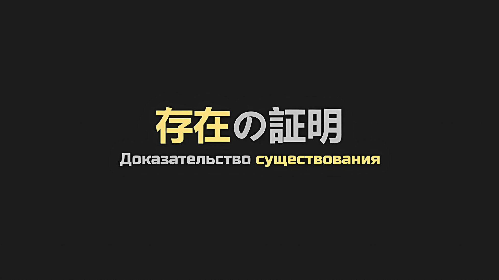
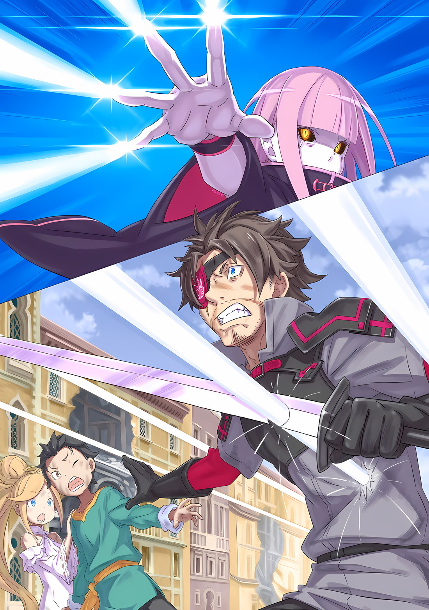

*※※※※※※※※※※※*

…Зайдя за спину охранника, что стоял на страже, он ударил его по точкам давления, проходящим вдоль центрального меридиана тела.

Охранник: …

В тот же миг поза противника была нарушена, и он, не издав ни звука, повалился на землю. Причина, по которой он поддержал тело, когда оно начало падать, заключалась не в том, что это вызвало бы проблемы, если бы раздался звук ударов доспехов о землю, а,

???: Боже правый, для такого старика, как я, чертовски трудно нести большого человека одной рукой. …Даже несмотря на то, что у них полые внутренности, они имеют солидный вес, как же раздражает.

Сказав это, седовласый старик с белыми бровями… Ольбарт взвалил рухнувшего врага на свою единственную левую руку, слегка ударив кончиками пальцев по защитной стене рядом. При этом поверхность стены покрылась рябью, как будто это была вода, и он с силой впихнул в нее тело врага; тело было поглощено, а поверхность стены снова заполнилась.

К счастью, нежить, похоже, была способна не дышать, поэтому он мог замуровывать их в стены, чтобы уладить дела без необходимости убивать.

Их сердца не бились, равно как и не текла их кровь. Если бы они оказались убиты, можно было бы просто смести осколки веником, так что, к счастью, с уборкой все было просто.

Ольбарт: Однако все остальное, кроме этого аспекта, ничуть не радует. Некоторые из них, если убить, имеют дерзость вставать сразу после смерти, так что безрассудное убийство только усугубит ситуацию.

Среди особых свойств нежити самым опасным, по мнению Ольбарта, было возрождение.

Столкнувшись с врагами, которые продолжали воскресать, сколько бы раз их ни побеждали, даже у переполненных боевым духом имперских солдат щемило в сердце… причина была не в Ольбарте, а в том, что убитая, а затем воскрешенная нежить наследовала воспоминания о своей смерти.

Таким образом, противник мог использовать заменяемые жизни для мгновенного обмена всевозможной информацией.

Ольбарт, глава шиноби, прекрасно понимал, насколько важно иметь точную и свежую информацию во время войны. Именно поэтому наибольшее количество врагов, которых Ольбарт убил за свою жизнь, приходилось на долю разведчиков и посыльных.

Изначально убийства совершались для того, чтобы предотвратить передачу информации, поэтому тот факт, что даже если их убьют, информация все равно будет передана, был настоящим абсурдом.

Ольбарт: Что ж-ж, в техниках шиноби тоже есть нечто, что заставляет тебя самоликвидироваться после смерти, посылая тем самым информацию через цвет извергающегося дыма, так что мы в одной лодке, честное слово, в одной лодке.

Хотя злить других было основной сферой деятельности шиноби, с этим они точно выйдут из бизнеса.

В ходе расследования, которое проводилось во время эвакуации из столицы Империи, было обнаружено, что у нежити есть жизненно важная точка, известная как «Жук-ядро», и именно она, похоже, является источником их воскрешения. Была и такая нежить, которая могла регенерировать, даже если ее голова отправлялась в полет, однако это объяснялось тем, что Жук-ядро оставался неуничтоженным.

В конце концов, источником силы Жука-ядра был Великий Дух, именуемый «Каменной Глыбой», поэтому, даже если нежить будет полностью уничтожена, вплоть до Жуков-ядер, это приведет к тому, что Муспель потеряет свои силы и не сможет поддерживать обширные земли Империи.

Поэтому Ольбарт прилагал все усилия, чтобы обеспечить соблюдение политики «не убивать нежить».

Нанося точные удары по слабым местам человеческого тела, которые были известны как точки давления, можно было лишить тело свободы и сделать его бессильным, подобно той нежити, что была замурована в стене ранее. Таким образом, нежити, что Ольбарт замуровал в стены, насчитывалось около пятидесяти… хотя конструкция и внутренности их тел были как у папье-маше, он был рад, что их точки давления все еще функционировали в качестве слабых мест.

Но, учитывая огромное количество нежити, это было не более чем жалкое сопротивление.

Ольбарт: Для имперцев, что специализируются на теме «убить или быть убитым», не слишком ли сурово теперь говорить им «не умирай и не убивай»?

Это мнение не вызвало бы одобрения у союзных войск Королевства и Городов-государств, которые сейчас сотрудничали ради спасения Империи, однако с ним бы согласились относительно многие имперцы.

В результате, поскольку враг, что возглавлял «Великое Бедствие», оказался худшим из возможных соперников для Империи Волакия, они вступили в оборонительную битву с непреложным условием «не убивать». …Нет, это было не «в результате».

Ольбарт: Это дурная привычка стариков — всегда представлять себе худшее. Враг, у которого хватает наглости использовать всю кровь, что до сих пор впитывалась в земли Империи… они полностью нацелены на нашу слабость.

Поле боя, на котором солдаты былых времен возрождались один за другим, — такая ситуация сложилась благодаря тому, что Волакия представляла собой место, где конфликты никогда не затихали.

Учитывая, что даже при тех же условиях ни в одной из других стран не произошло бы подобного бедствия, для завоевания Волакии враг предпринял самые подходящие меры.

Вот почему и эта сторона должна была уяснить, что это — доска, которая недопустима для ошибочного интерпретирования.

Ольбарт: …

Прищурив глаза, скрытые белыми бровями, Ольбарт затаил дыхание в Кристальном Дворце, куда он проникал самостоятельно.

Невидимость, максимально устраняющая присутствие человека, оправдывала имя главного шиноби… если учесть, что он незаметно убирал охранников, то его присутствие никак не могло быть обнаружено.

Если бы его присутствие обнаружилось, и он стал бы мишенью «Тернового Проклятия», Ольбарт оказался бы бессилен. Он был слаб к боли. От одной только мысли о шипах, что вонзятся в его сердце, он начинал корчиться.

Чтобы избежать этого, Ольбарт был предельно осторожен в своих действиях.

…Вторгнувшись в столицу Империи с отрядом избранных, они быстро разгромят вражеского лидера.

Именно такой план использовался на заключительном этапе войны с «Великим Бедствием», и, хотя для Винсента это было само собой разумеющимся, Ольбарт без возражений счел его наилучшим из возможных методов.

Количество нежити превышало число имперских солдат, и даже если бы они вступили в войну на истощение, жизненная сила «Каменной Глыбы», вместе с продолжительностью жизни Империи, была бы истощена; вот насколько основательно они были загнаны в угол.

То, что у них не осталось другого выбора, кроме как поспешить с решением, было очевидным для любого.

Ольбарт: Конечно, враг должен это предвидеть.

Даже если противник был в курсе, при отсутствии других альтернатив не оставалось ничего другого, как выбрать этот вариант. Теперь оставалось лишь выяснить, сколько всего у них есть на руках — их тактика уже раскрыта — и что может превзойти ожидания противника.

Поэтому избранных разделили еще больше, и они подготовили несколько приманок для привлечения внимания противника.

Пока эти приманки действовали, Ольбарт должен был выполнять возложенные на него обязанности.

…Роль Ольбарта состояла в том, чтобы проникнуть в Кристальный Дворец, а затем вернуться с разведданными о его неопределенном внутреннем устройстве.

Особенно важное значение имело местонахождение зачинщицы «Великого Бедствия», известной как Сфинкс, и освобождение «Стального», Могуро Хагане, чьи передвижения, скорее всего, были засекречены во дворце. Кроме того, если у него появится некоторая свобода действий, можно будет вернуть любимые катаны Сесилуса — «Меч Грез» и «Меч Дьявола».

Ольбарт: Хотя, думаю, я не смогу найти катаны Сеси. «Меч Дьявола» имеет свойство убегать, а о местонахождении «Меча Грез» я не имею ни малейшего понятия.

Сесилус всегда был не прочь поболтать о чем угодно, но, хотя он и говорил о том, какими невероятными были его любимые катаны, он не был настолько глуп, чтобы рассказывать об их особых качествах. Если бы его спросили об этом, он бы наверняка ответил, но расспрашивать о руке оппонента было равносильно тому, чтобы вызвать подозрение, что у человека есть на то причины.

Ольбарт не был настолько глуп, чтобы беспечно провоцировать Сесилуса.

Как бы то ни было, из-за маловероятности Ольбарт отложил поиски катан на потом.

В идеале он должен определить местонахождение Сфинкс и обеспечить сохранность ее тела. Если бы ему это удалось, то с помощью силы того достойного похвалы мальчика, который, хоть и уменьшился в размерах, не желал возвращаться к нормальной жизни… Шварца, и девушки, что он привел с собой, можно было бы полностью уничтожить нежить, вплоть до их душ.

Возможность осуществить это была бы самым желанным завершением битвы с «Великим Бедствием».

Однако дело это будет нелегким.

Ольбарт: …Боже правый, еще один тупик.

Вопреки его стремлению к быстрому завершению, ноги Ольбарта часто останавливались.

Способность прекрасно ориентироваться в местности, просто взглянув на карту, и абсолютно не забывать место после одного посещения — вот основополагающие навыки шиноби, а для Ольбарта Кристальный Дворец был еще и местом работы, которое он часто посещал.

Несмотря на это, причина, почему поиски Ольбарта продвигались не слишком успешно, заключалась в том, что интерьер Кристального Дворца, с которым он должен был быть знаком, полностью изменился по сравнению с тем, что он когда-то знал.

Ольбарт: И это даже несмотря на то, что подобные затруднения должны быть нашей специализацией.

Хотя Ольбарт и не считал, что в этом есть какая-то ценность, Кристальный Дворец был известен как самый красивый дворец во всем мире. Из-за решающей битвы за столицу Империи часть его стен была разрушена, но даже это не оказало сильного влияния на его внешний вид, если смотреть издалека.

Однако внутреннее убранство дворца представляло собой совершенно другую историю.

Различные аспекты, такие как устройство проходов, расположение комнат и размер дверей, были изменены, и дворец стал совершенно другим, таким, что даже бы сам Винсент, который когда-то здесь жил, потерялся.

Отсутствие изменений во внешнем виде дворца гарантированно поставит в тупик любого, кто ворвется сюда без плана.

Даже если бы он вернулся только с этой информацией, в проникновении Ольбарта было бы более чем достаточно смысла. Или, возможно, Шварц, что исполнял роль стратега, уже предположил подобную ситуацию.

Если это так, то его способность к проницательности была многообещающей, но в то же время она представляла собой будущую угрозу.

Никто не знал, как Королевство и Города-государства, которые сейчас находились в отношениях сотрудничества с ними, поступят с Империей после того, как «Великое Бедствие» нежити будет остановлено.

Ведь когда это время наступит, Чиши уже больше не будет рядом с Винсентом.

Ольбарт: …Как бы то ни было, ты действительно добился своего, Чеши.

Пламя войны, ветер крови и атмосфера «Смерти», неизменно благоухающая как от живых, так и от мертвых.

По этим причинам у его сердца не было времени на скорбь, однако Ольбарт похвалил Чишу за то, что тот украл его технику с помощью своей «Cпособности» и, более того, подменил Винсента так, что он этого даже не заметил.

Ольбарту нравилось красть чужие техники, но он не любил, когда их крали у него самого.

В конце концов, рост был привилегией молодых. Даже если они не воровали, перед ними были открыты неограниченные возможности того, что они могли создать собственными руками. У стариков же, напротив, не было такой возможности для роста. Вот почему Ольбарт не любил, когда у него воровали.

Что бы произошло, если бы вместо того, чтобы создавать что-то новое, молодые просто воровали, а затем жаждали чего-то большего?

Неужели этот мир перестал бы создавать что-то новое, вследствие чего Ольбарту стало бы нечего воровать?

Ольбарт: Черт, у этого мерзавца, Чеши, хватило наглости поступить так хитро. …Не то чтобы я не понимал, что он чувствовал.

В ограниченных временных рамках Чиша хотел добиться наилучшего результата.

Другими словами, Чиша и Ольбарт поступали одинаково. Ольбарт был стариком, который приближался к концу своей жизни, а Чиша — мертвым солдатом, которому суждено было встретить конец своей жизни в ближайшем будущем.

Таким образом, речь шла о том, чтобы не выбирать средства, которые увеличили бы количество карт в руке.

Вступив в бой с ограниченным количеством карт в руке, Чиша одержал победу.

…В этой ситуации Винсент остался жив, а Ольбарт был привлечен в качестве союзника.

Ольбарт: …

…У Ольбарта Данкелькена были амбиции.

Это была финальная цель его жизни — оставить свое имя в истории Империи так, чтобы никто другой не смог с ним сравниться; выгравировать, доказать, что существо, известное как он сам, действительно обладало индивидуальной жизнью.

Ольбарт был принят как шиноби, был воспитан как шиноби и жил как шиноби.

В роли, где многие использовали и выбрасывали свои жизни, где было естественно не иметь возможности прожить долгую жизнь, Ольбарт дожил до ста лет. Но за свою долгую жизнь гражданина Империи, как шиноби, Ольбарт провел большую часть своих дней, выполняя чужие цели.

Такое положение можно было бы назвать судьбой шиноби, однако Ольбарт среди всех них прожил исключительно долгую жизнь. …В таком случае и его конец был бы для шиноби неподобающим.

Если для шиноби было типично тихо исчезнуть во тьме истории, не оставив после себя имени, то не лучше ли Ольбарту намеренно стремиться к обратному?

Таким образом, Ольбарт бдительно ждал этой возможности.

Чтобы расцвести в конце своей жизни, он счел, что самой эффективной мерой было бы лишить головы «Мудрого Императора», Винсента Волакию, однако…,

Ольбарт: Если противником оказалась сама гибель, то в предательстве нет никакого смысла.

Их противником стало «Великое Бедствие»… сонмы нежити, а поскольку их целью было полное уничтожение Империи Волакия, план Ольбарта был не более чем преходящей, хрупкой вещью, которая вот-вот рассыплется.

Ольбарт хотел оставить свое имя в истории Империи.

Если Империя будет разрушена, то желание Ольбарта не исполнится. Поэтому ему пришлось снять шляпу перед актерской игрой Чиши, которая не торопила его до нынешних событий.

Ольбарт: После того, как все эти дела будут закончены и улажены, было бы неплохо, если бы у меня еще оставалось время для того, чтобы что-то сделать. Моя жизнь по неосторожности закончится раньше, чем я успею это осознать.

После войны, когда истощенная Империя начнет восстанавливаться, он хотел бы величественно убить Императора, прежде чем Королевство или Города-государства успеют сделать хоть шаг… не то чтобы у него не было подобных мыслей, но ему не хотелось бы так поступать, поскольку это выглядело бы как извлечение выгоды из «Великого Бедствия».

К сожалению, не найдя идеальной возможности, Ольбарт скрыл свои амбиции, так как они, покуда «Великое Бедствие» оставалось непобежденным, были бы излишне оптимистичны, а затем посмотрел вперед. …Перед взором Ольбарта предстала большая дверь, которая вела к месту, служившему в первоначальном дворце залом для аудиенций.

Ольбарт: …

В голове Ольбарта, пока он безмолвствовал, возникли два противоречивых чувства.

Ощущение, что ему не следует заходить в эту дверь, и ощущение, что ему все-таки следует зайти в эту дверь… Первое коренилось в его инстинктах, а второе основывалось на интуиции, что развилась за долгое время его пребывания в качестве шиноби.

В обычной ситуации Ольбарт не стал бы отклоняться от первого варианта. Однако интуиция Ольбарта заговорила с ним. За этой дверью, несомненно, скрывался смысл проникновения Ольбарта.

Он не знал, была ли это Сфинкс, Могуро, катаны или что-то совершенно другое, однако…,

Ольбарт: …О горе, я уже отжил свои годы, однако мне, старику, которому осталось совсем недолго, нельзя умирать, так и не получив возможности свергнуть государство.

Произнося эти слова хриплым голосом, Ольбарт решал, наступать ему или отступать.

Если там располагался зал для аудиенций, то он должен был иметь возможность осмотреть его состояние через отверстие в стене, не входя через дверь; поэтому, выйдя через окно коридора, Ольбарт двинулся вдоль внешней стены, чтобы прибыть к месту назначения.

Выбрав не открывать дверь, он заглянул в комнату…,

Ольбарт: …Ойой, даже бы я не зашел так далеко.

В полностью изменившемся зале, увидев плод трудов «Ведьмы», глава шиноби, известный как «Порочный Старик», пробормотал это, не в силах скрыть своего дискомфорта.

*△▼△▼△▼△*

…Душа этого существа уже потеряла свой первоначальный облик, оказавшись разорванной в клочья.

Вызванные на поверхность неортодоксальными способами, жалкие души оказались в плену, их заставили встать на колени, чтобы уничтожить Империю, подданными которой они были; такова была ситуация, в которую попала нежить.

В большей или меньшей степени был применен процесс, изменяющий ментальную структуру нежити так, чтобы она отличалась от той, какой была при жизни. Если бы не это, воскрешенные мертвецы, скорее всего, не стали бы помогать в уничтожении Империи.

Степень применения этого процесса варьировалась от случая к случаю, но существовала опасность, что из-за большой нагрузки, возложенной на изначальную форму и природу, чтобы сделать их лояльными к приказам, они станут неспособны действовать с прежней силой.

Поэтому обычно заклинатель стремился облегчить нагрузку пропорционально тому, насколько сильным был тот или иной человек при жизни.

В действительности же такие способные личности, как «Император Терний» и «Магический Стрелок», испытывали бы значительный упадок сил из-за нагрузки на их разум, поэтому «Ведьма» переключилась на предоставление им некоторой свободы воли, дабы сохранить их силу.

Если бы она превратила этих могущественных личностей в покорные марионетки, они, скорее всего, подверглись бы позору из-за того, что не смогли бы проявить даже половины своей истинной силы.

В любом случае, если не считать таких исключительно сильных личностей, и Ламию Годвин, которая проявила инициативу в сотрудничестве с «Ведьмой», с душами нежити жестоко играли.

Чего бы они ни желали при жизни, какими бы благородными воинами ни были, чем бы ни дорожили, их, попирая все это, использовали в своих целях.

Таким образом, они были вынуждены стать авангардом бедствия, что несло разрушение Империи.

Исключений среди них не было.

Лишенные свободы воли, ставшие существами, используемыми и выбрасываемыми как орудия ради битвы, их души, даже если бы им пришлось неоднократно вкусить «Смерть», призывались вновь — земляные сосуды возрождались с новым якорем.

Увы, такое положение вещей полностью соответствовало условиям, которые «Ведьма» установила для создания нежити.

Обладая умеренно высокими способностями, будучи одержимым битвой, без какого-либо ущерба для своей силы, когда его превратили в покорную марионетку, он испытывал яростное сожаление и ненависть в последние мгновения своей жизни…

По этой причине он свирепо бушевал в непрекращающемся порыве ярости.

Разорванный в клочья, в форме, которая растягивала его душу, в процессе потери своей первоначальной формы, забывая, что его тело когда-то было человекоподобным, он превратился в отталкивающую, гротескную фигуру.

С большими, длинными руками, чрезмерно увеличенным количеством ног и хрупким туловищем из кожи и костей, даже если его внешность полностью изменилась, он не мог избежать ситуации, когда его использовала «Ведьма».

Даже когда его убивали снова и снова, его душа растягивалась все больше, и он возрождался как новое чудовище.

Чтобы положить этому конец, не оставалось ничего другого, кроме как исполнить желание «Ведьмы». Чтобы исполнить желание «Ведьмы», не оставалось ничего другого, кроме как стереть с лица земли Империю как своего рода предвестника «Великого Бедствия».

В настоящее время, став невообразимым чудовищем, он желал именно этого. Это было его единственное желание.

Это было его единственное, это было его, это было, это, желание, это было его единственное…

???: …«Гигантский Глаз», Измаил.

… … …

Внезапно среди жуткого рева и яростной битвы раздался этот голос.

Несмотря на то, что в его уши, которые уже не были ушами, должно было вливаться множество других звуков, только этот голос прозвучал ужасно четко, твердо и странно правильно.

Какой именно смысл это имело, существо не знало.

Оно не…,

???: Измаил!

???: Ияоо аеиа.

Подозрение застопорило мысли, отчего его многочисленные руки и ноги, что были предназначены для убийства, прекратили свое движение. Словно пробираясь сквозь это пространство, протянулась рука и, коснувшись его тонкого туловища, что-то утащила.

Казалось, будто что-то выскользнуло наружу.

Непонятно, было ли это что-то важное или что-то большое. Но в тот момент, когда это что-то выскользнуло наружу, бурные импульсы, наполнявшие его тело, одним махом улетучились.

Пустым, он был пустым. Его внутренности стали полыми.

Многочисленные причины для буйства, насильно впихнутые в него извне, ушли, и, когда его внутренности стали полыми, в них осталось только то, что было с самого начала.

А именно — причина для борьбы. Можно было даже назвать это стремлением или амбициями.

Причина, по которой он поспешно вступил в бой, заключалась в том, что ему нужно было сражаться. А сражался он для того, чтобы оставить свое имя в истории. Целью этого было доказать, что «он сам», гордость своего клана, точно существовал.

Существо, известное как он сам, «Гигантский Глаз», Измаил, цель всего этого…

Измаил: Ах, удалось ли мне…

В золотой радужке одного черного глазного яблока четко отразилось лицо этого человека.

Черные волосы и миндалевидные глаза, ничуть не дрогнувшие пред лицом клинка, что угрожал его жизни, внушительно смотрели и взывали к обезображенному Измаилу.

Вершина Империи Волакия узнала Измаила.

Таким образом…,

Измаил: …Это честь для Волка Меча, Ваше Превосходительство Император.

*△▼△▼△▼△*

Сдерживая боевой топор, Джамал парировал удары, пока Субару и Беатрис с помощью магии ограничивали свободу передвижения многочисленным конечностям.

Тем временем множество атак, несущих в себе смертельную силу, были с силой отбиты прыгающей и отскакивающей Спикой, что едва уберегло ее спутников от ранений.

И тут…,

Авель: …«Гигантский Глаз», Измаил.

Окинув гротескно преобразившуюся нежить острым взглядом, Авель назвал его имя.

На мгновение Субару засомневался, однако с самого начала было принято решение, что если Авель назовет имя нежити в столице Империи, то он поверит в это на все сто процентов. К тому же, до сих пор Авель ни разу не ошибался в именах нежити.

Как бы то ни было…,

Субару: Измаил!

Спика: Ияоо аеиа.

Спика, замахнувшись, ударила ладонью в область груди гротескного существа по имени Измаил.

Было задействовано «Звездное Поедание», не являющееся ни ударом, ни выпадом, и Субару с остальными затаили дыхание.

При соблюдении всех условий, даже если его форма отклонилась от человеческой, Измаила должен постигнуть тот же конец, что и другую нежить.

Как и ожидалось, на глазах у Субару и остальных, что наблюдали за происходящим, затаив дыхание, Измаил медленно покачивался и смотрел на Авеля своим огромным золотым глазом.

А затем…,

Измаил: …Ах.

Последние слова он произнес беззвучным голосом, и тут же его гротескное тело рассыпалось в прах.

???: Аах, блядь! Охереть! Что это было за чудище!

Авель: Доблестный воин Племени Циклопов, Измаил, тот, кого называют «Гигантским Глазом». Именно его я назвал в конце.

???: Племя Циклопов, не только одно глазище, ха, они еще и такие чудища, э… О, прошу прощения за мой тон.

Закончив бой с нежитью, Джамал с ворчанием вытер кровь и пот с подбородка.

Мужчина сожалел о своих грубых выражениях, которые использовал, позабыв, что его собеседником был Авель.

Измаил изначально не обладал такой внешностью.

Субару: Беако.

Беатрис: Знаю, в самом деле. Полагаю, этот человек — жертва «Таинства Бессмертного Короля». Из-за того, что его воскрешали снова и снова, он оказался в критическом состоянии, в самом деле.

Спика: Уу, ау…

Беатрис резко дернула подбородком, и Спика удрученно посмотрела на свои ладони. Поглаживая Спику по голове, Субару сделал глубокий вдох.

Он уже сталкивался с Измаилом, когда спасался вместе с Рем и Флопом во время решающей битвы за столицу Империи, но изменения в его внешности выглядели настолько ужасно, что на них было трудно смотреть.

Возможно, из-за того, что он погиб от взрыва пыли, или же из-за того, что после смерти его снова воскресили, он становился все более и более обезображенным.

Но даже этот бесконечный ад должен был прекратиться после «Звездного Поедания» Спики.

Субару: Блин, несмотря на его внешний вид, ты смог узнать, кто это.

Авель: Когда люди воскресают в виде нежити, это в некоторой степени отражается на их лике. Таким образом, характеристики, что присущи каждому, играют важную роль в их распознавании. Он был простым для понимания.

Субару: Простым для понимания, хах…

От его человеческой формы оставались лишь остатки, и, поскольку Субару уже видел, как тот теряет свой гуманоидный облик и превращается в гротескное существо, он мог сопоставить его с врагом, с которым столкнулся в разгар эвакуации, однако с Авелем дело обстояло иначе.

Несмотря на это, чтобы делать такие точные предположения, следовало бы подозревать не чудовищную память, а какую-то нечестную игру.

Авель: Вполне естественно знать о могущественных жителях страны. Неважно, станут ли они врагами или союзниками, всегда предпочтительнее иметь множество оснований для принятия решений.

Однако слова Авеля были не о простом распознавании по физическим характеристикам, а скорее об оценке других аспектов противника.

Субару: …

Услышав это, Субару вспомнил последние мгновения жизни Измаила прямо перед превращением в пыль.

Хотя он едва ли произнес что-то похожее на слова, да и значение их было неразборчиво, в них, казалось, не было ни обиды, ни горечи, а скорее торжественность.

Возможно, это было почтение к Императору, который правильно определил его имя.

В любом случае…,

Субару: …Кх, ситуация становится все напряженнее.

Субару пробормотал это, глядя на небо, откуда доносились непрекращающиеся раскаты грома.

В поле зрения Субару, посреди затянутого тучами неба, виднелись горы льда, что падали на Кристальный Дворец… их создала Эмилия, а Розвааль, в свою очередь, использовал это в тактических целях.

В далеком небе виднелись клубящиеся облака, что стали зловещим оружием, с другого направления доносился громовой раскат, и, рушась под безмятежным ударом меча, городской пейзаж разрывался на части.

Было видно, что каждый бастион выполняет поставленные Субару условия: на каждом из них шли ожесточенные бои.

Беатрис: Розвааль устраивает настоящее шоу, я полагаю. В самом деле, он слишком сильно проявляет свой энтузиазм.

Субару: Когда я смотрю на это, то вспоминаю, что он довольно опасный парень. Ольбарт-сан же пробирается во дворец, его ведь не раздавит, да?

Беатрис: Если есть необходимость его раздавить, то он это сделает, я полагаю. Такой уж он человек, в самом деле.

С грохотом, напоминающим раскол небес, ледяные горы разлетелись бесчисленными искрами.

Розвааль вместе с Медиум противостоял врагу… «Всаднику Летающего Дракона», одному из самых сложных противников, поэтому им оставалось только верить в его победу.

Конечно, существование «Тернового Проклятия» и «Облачного Дракона» тоже являлось непреодолимой угрозой.

Субару: Осталось только узнать, смогут ли Эмилия-тан и Танза выстоять…

Посреди ситуации в столице Империи, что выходила за рамки ожесточенных сражений, Субару беспокоился об Эмилии и Танзе, судьба которых оставалась неопределенной среди разосланных им по городу товарищей.

В настоящий момент он считал, что оптимально распределил свои силы, хотя и не определил четко позицию Эмилии, что делало эту ситуацию несколько неоднозначной. Однако, учитывая возложенную на нее роль, поручить ей работать вместе с Танзой было бы правильным решением.

Субару: Честно говоря, когда появился Измаил, я подумал, что у нас большие проблемы, но…

То, что им удалось самостоятельно, без участия Эмилии, обуздать преображенного Измаила, несомненно, было заслугой их слаженных усилий.

Особенно значителен был вклад Джамала, который с каждым мгновением заметно совершенствовался. Возможно, в таких тяжелых обстоятельствах он повышал свой уровень невероятными темпами.

Это само по себе было приятным событием. Джамал был чрезвычайно надежен, если, конечно, не обращать внимания на его мысленное нежелание придерживаться тактики.

Винсент: Джамал Орели, ты в состоянии продолжать?

Джамал: Да! Если Ваше Превосходительство прикажет, я возьму на себя еще сотню или даже две сотни вражищ.

Винсент: Правильно. Тебе тоже следует стараться.

Субару: Черт, ведешь себя высокомерно только потому, что выполняешь работу, которая не под силу никому другому.

Выругавшись на Авеля, который не участвовал в драке и был единственным, кто выглядел спокойно, Субару взглянул на Беатрис и Спику.

Это была серия хождений по натянутому канату, но борьба с нежитью всегда представляла собой тотальную войну всех сил, которые они противопоставляли друг другу. Поскольку действовать нужно было осторожно, было бы неразумно двигаться вперед, когда кто-то отстает.

Беатрис: У Бетти ноу проблем*, я полагаю.

* No problem — нет проблем.

Спика: Аау!

На взгляд Субару они обе решительно кивнули. Можно сказать, он опасался больше всех.

Однако, так как Субару все еще был связан с «Эскадроном Плеяд», было очевидно, что больше всего опасался именно Авель.

В любом случае…,

Субару: Ход битв в скором времени должен измениться, и, если Халибель-сан выполнит свою часть работы, у нас появится возможность приблизиться к Кристальному Дворцу. И там…

Он хотел бы раздобыть информацию о других местах сражений и получить материал для рассмотрения этого цикла, а также того, как будут разворачиваться дальнейшие события.

В этот момент он как раз собирался окликнуть своих спутников.

???: …Понятно. Странное явление. Наблюдения: Требуются.

Внезапно все обернулись, услышав голос, что раздался за пределами их сознания.

Глаза Субару расширились, и в них появилось третье лицо, которого раньше не было… невысокая бледнокожая нежить присела на корточки, проверяя пальцами пыль на земле.

Знакомая розоволосая нежить играла с пылью разрушенного «Звездным Поеданием» Измаила…,

Субару: …Кх, ты.

???: Судя по всему, вы не вмешивались напрямую в работу стержневого жука. Жук умер, потому что ему стало негде паразитировать… или же он потерял душу? Лишение, захват и возвращение… весьма занимательно.

Та, что сказала это, в подтверждение своих слов слизывая языком прилипшую к кончикам пальцев пыль, была существом, в точности похожим на одного из родственников товарища Субару, но в глазах ее не было и намека на теплоту… Сфинкс.

Здесь появился организатор «Великого Бедствия», цель этой финальной битвы.

Субару: …

Сознание Субару на мгновение помутилось при виде ее внушительного появления.

Присутствие «Тернового Проклятия» и «Магического Стрелка» затрудняло Субару и его спутникам с их козырем, Спикой, противостоять Сфинкс, которая должна была находиться в Кристальном Дворце. Поэтому в качестве разведчика был отправлен Ольбарт, что умел действовать скрытно, а Субару и его группа надеялись продолжать охоту на нежить до тех пор, пока не станет ясно, как уменьшить силы противника и получить преимущество в предстоящей решающей битве.

Подумать только, что это предположение может быть так легко подорвано…,

Субару: …Нет.

Субару скрыл свое волнение, посчитав это шансом, и крепко сжал руку Беатрис. Взглянув на нее, он взял за руку удивленную Спику.

Перед ними стояла Сфинкс, зачинщица «Великого Бедствия».

Как и другая нежить, она была возрождена силой «Таинства Бессмертного Короля», поэтому «Звездное Поедание» Спики должно было сработать. То, что она была нежитью, давало ей преимущество в «Посмертном Бегстве», но в то же время у нее была одна неизбежная слабость: Спика.

Отними у нее этот шанс воскрешения, и битва будет окончена.

Можно было бы закончить бой, не зная о намерениях и целях противника.

И поэтому…,

Субару: Сфи…

Сфинкс: Требование — соответствие между «Именем» и «Душой» цели. Неожиданно, что вы вообще использовали Полномочие «Чревоугодия». Контрмеры: Требуются.

Субару: …Кх.

Спокойный анализ Сфинкс подавил любые упреждающие действия.

Субару ахнул от того, что Сфинкс только что упомянула Полномочие «Чревоугодия» и даже с первого взгляда определила истинную природу «Звездного Поедания» Спики.

Его намерения стали понятны, из-за этого Субару забыл о силе Полномочия, которое, просто поразив цель, лишило бы ее возможности сбежать.

Поэтому ему пришлось за это заплатить.

???: …Дегенератище!

И тут между Субару и Сфинкс прорезался нецензурный голос — он оттолкнул Субару.

Сфинкс подняла свои тонкие пальцы, направив их кончики в сторону Субару и его спутников. Прежде чем лучи белого жара, испускаемые каждым кончиком пальцев, успели пронзить головы Субару и Спики, к ним подскочил мужчина.

Меч Джамала был направлен против теплового луча, однако он не смог его блокировать, в результате чего торс этого храбреца был пробит насквозь; тут же свежий запах паленой крови чрезвычайно сильно ударил в ноздри Субару.

