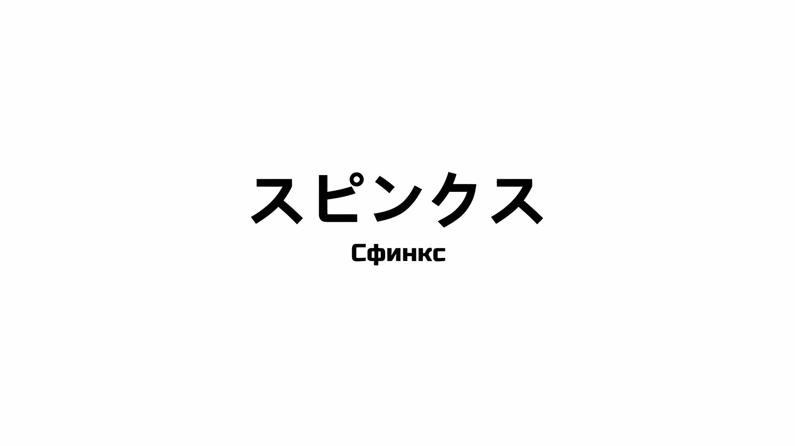
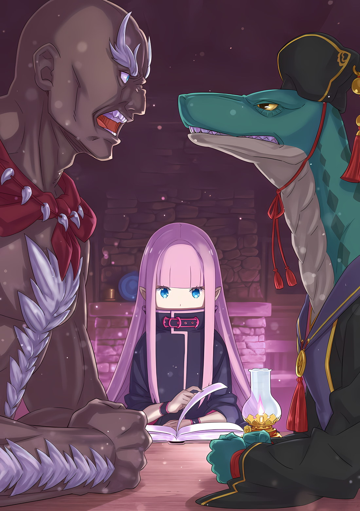
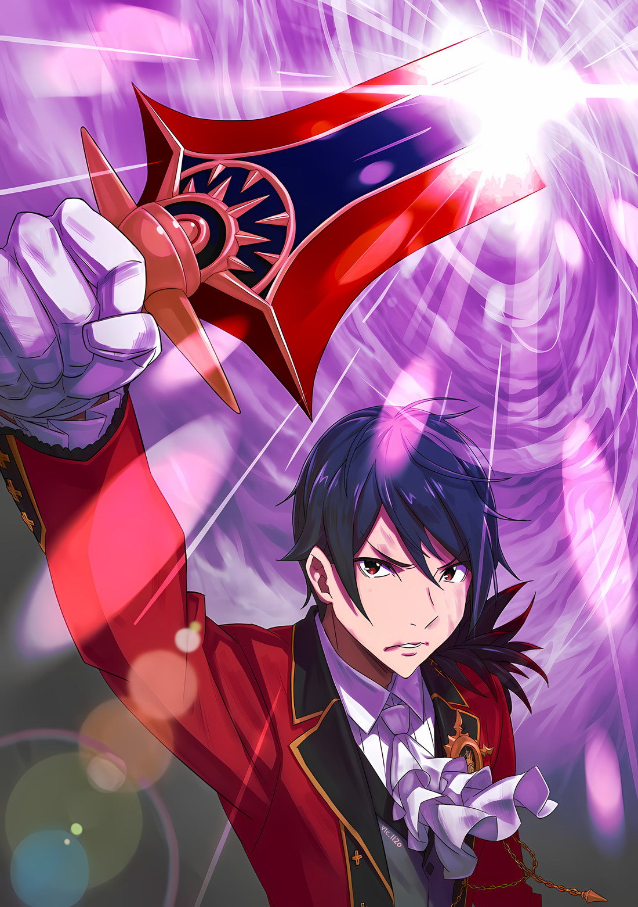

*※※※※※※※※※※※*

…Сфинкс была неудачным результатом исследований «Ведьмы Жадности» в области бессмертия.

Девушка, что пожертвовала собой, чтобы стать ядром для создания миниатюрного сада, известного как «Святилище»… с телом Рюдзу Мейер в качестве основы, Сфинкс была репликой, сотворенной из маны с использованием той же структуры, что и у Духа.

«Ведьма» полагала, что если в пустое тело реплики влить уже существовавшую душу, то можно добиться псевдобессмертия за счет дублирования душ.

Однако эта перспектива легко разбилась о тот факт, что размер и форма души, а также жизненного сосуда различались по отдельности.

Душа «Ведьмы Жадности» не могла быть заключена в реплике Рюдзу Мейер.

Результатом этой откровенной ошибки стал ее провал, существо, что на долгие годы ознаменует мир множеством несчастий, — «Сфинкс».

От этого существа, что получило имя злого монстра, должны были избавиться ввиду его непригодности к первоначальному предназначению, однако по воле судьбы оно выжило.

И, как и многие другие искусственные жизни, Сфинкс приступила к работе, дабы претворить в жизнь цель своего появления на свет.

Цель, ради которой была создана искусственная «Ведьма»… чтобы стать совершенной «Ведьмой Жадности», Сфинкс будет продолжать порождать множество бедствий.

*△**▼**△**▼**△**▼**△*

Джамал: …Дегенаратище!

А затем, с кровью, что хлынула изо его рта при ругани, Джамал рухнул на землю.

Предполагалось, что выпущенный белый свет пронзит головы Субару и остальных. Поэтому Джамал, встав на их защиту, получил повреждение примерно на уровне головы ребенка, однако даже так это была, несомненно, серьезная рана, что пробила одну сторону его туловища.

Субару: Джамал…

Сфинкс: Предполагаемая цель избежала урона? Впрочем, это подпадает под рамки того, с чем можно справиться.

После того как его оттолкнули, Субару мигом откликнулся. Сфинкс, что была ответственна за эту атаку, безразлично приняла ее безуспешность.

Субару скрежетнул молярами, когда услышал слова предводителя нежити, который говорил все так же спокойно.

Джамал потерял сознание, он больше не сможет сражаться; если ему не окажут немедленную помощь, его жизнь будет в опасности.

Беатрис: Субару! Сфокусируйся на том, что находится перед тобой, в самом деле!

Субару: …Кх.

В тот же миг Беатрис резким голосом окликнула Субару и дернула его за руку.

Отвернувшись от Джамала, Субару взглянул на Сфинкс. Беатрис, Спика и Авель тоже устремили на нее свои взгляды.

Все трое пребывали в состоянии повышенной готовности, их внимание было сосредоточено на враге, Сфинкс.

Лечение Джамала придется отложить на потом.

Да. Именно так и следует поступить.

При всем этом…,

Сфинкс: Я думала, ты чужеродец, что сорвет мои планы, однако, похоже, я ошиблась?

Даже отведя взгляд, Субару не смог полностью переключить свое внимание с раненного Джамала, поэтому, глядя на него, Сфинкс склонила голову набок и заговорила. Он заглянул в эти золотые глаза, отчего его мысли заметались в еще большем беспорядке.

Беатрис: …Кх, Спика, работаем вместе, я полагаю!

Спика: Аау!

Одновременно эти двое двинулись на смену Субару.

Спика, по команде Беатрис, устремилась в сторону Сфинкс, взмахнув своими длинными светлыми волосами. В момент прыжка Спики Беатрис выпустила аметистовые стрелы в левую, правую и заднюю части неподвижной Сфинкс, перекрыв ей путь к отступлению и обеспечив себе прикрытие.

Поскольку координация этих двоих преграждала Сфинкс путь со всех сторон, сделать она ничего не могла… не тут-то было.

Сфинкс: Эль Дзивальд.

Вопреки дешевизне заклинания, эффект от последующего разрушения был колоссальным.

В ответ на нависшую угрозу Сфинкс раскрыла обе руки и, как и в случае с Джамалом, выпустила белые лучи жара, на этот раз из пальцев левой и правой рук.

Однако на сей раз это был не кратковременный луч тепла, как у лучевой пушки, а световой меч, который продолжал проецироваться.

Орудуя десятью световыми лезвиями на пальцах рук, которые по дальности действия превосходили примерно половину двуручного меча, Сфинкс господствовала над окружающим ее пространством, нанося удары во всех возможных направлениях.

Каждая из выпущенных фиолетовых стрел была разрублена белым светом… под их ярость попала и Спика, что бросилась навстречу Беатрис.

Спика: …Уу!

Не успел белый свет рассечь тонкое тело Спики пополам, как она исчезла из поля зрения.

Она переместилась. Активировав свой телепорт ближнего действия, Спика ушла с линии огня Сфинкс, оказавшись на руинах здания, что стояло неподалеку от улицы.

Вслед за Спикой на линии огня белого света оказались Субару и Беатрис…,

Винсент: Глупец, ты что, растерялся от вида вражеского предводителя?

С суровым замечанием Авель, схватив за головы Субару и Беатрис, заставил их пригнуться.

Винсент: Ожидать, что Джамал Орели сумеет встать на ноги, нельзя. Сейчас необходим ваш вклад.

Беатрис: Н-нет нужды говорить нам об этом, когда мы и так все знаем, в самом деле! Ты будешь вознагражден за быстроту своих мыслей нашим выступлением, так что лучше наблюдай, я полагаю!

Беатрис, которую спасли силой, надула щеки, отмахнулась от Авеля и встала на ноги.

Фыркнув от бескомпромиссного ответа Беатрис, Авель тоже поднялся на ноги и посмотрел на Субару, который все еще лежал на земле,

Винсент: В чем дело? Твой напарник в хорошем расположении духа, а ты так и…

*Не встаешь.* Авель, возможно, хотел произнести именно эти провокационные слова.

Однако он, почувствовав что-то неладное, быстро замолчал… затем его брови нахмурились.

Беатрис: Субару?

Беатрис, что стояла рядом с ним, моргнула, заметив то же странное зрелище, что и Авель.

Субару: …

Субару по-прежнему лежал лицом вниз у ног Беатрис и Авеля. Спика, которая телепортировалась в отдаленное место, тоже заметила это, и в глазах ее появилось недоумение.

По всей видимости, девочки не имели ни малейшего понятия, что произошло.

Поэтому вместо Беатрис, Спики и Авеля, которые не могли постичь разворачивающиеся на их глазах события, по иронии судьбы именно их враг, Сфинкс, первым понял, что произошло с Субару.

Сфинкс, с бледным лицом нежити, без способностей к выражению эмоций, но все же с недоумением и сомнением в глазах, поняла это,

Сфинкс: …По какой причине ты проглотил яд? Объяснение: Требуется.

Винсент: …Кх, ТЫ!

Сразу же после вопроса Сфинкс выражение лица Авеля изменилось… он поднял Субару за воротник. Довольно агрессивный поступок, однако Субару не выказал никаких жалоб.

Дело в том, что Субару уже прокусил упаковку с ядом за своим моляром, поэтому ему предстояло пережить адскую агонию, которая несла за собой «Смерть».

Беатрис: НЕЕЕЕТ! СУБАРУ!? СУБАРУУУ!?

Спика: УАУ…!?

Когда Беатрис и Спика увидели Субару, судорожно бьющегося в конвульсиях, с хлещущей изо рта кровью, они завопили.

Беатрис попыталась вцепиться в дрожащего Субару, однако Авель оттолкнул девушку, сунул свой палец ему в рот и вытащил упаковку с препаратом… от такого его лицо залилось яростью.

Винсент: Ты, что все это значит? У тебя что, крыша поехала?

Субару: Бхубхухбху, бухбхухбух…

Винсент: Столько кичился своим противостоянием судьбе, и вот что ты делаешь!?

Разъяренный тон Авеля, слезливые крики Беатрис, горестный голосок отчаянно бросившейся к нему Спики и чувство гибели, когда все его тело медленно умирало — Субару слышал все это.

На их гневный тон, на плач, на отчаяние он ничего не мог ответить.

Даже так, в этом имелся свой смысл. Это была необходимая мера. …Наилучший вариант действий.

Чтобы прийти к будущему, в котором не умрет никто, это был лучший, идеальный, оптимальный, подходящий, предпочтительный, эффективный, возможный метод.

Субару: Бхубух, бху.

Сфинкс: Объяснение: Требуется.

Без возможности поделиться с кем-либо этой информацией, с неразрешенным вопросом «Ведьмы», его дыхание иссякло.

Жизнь Нацуки Субару подошла к концу. …Снова, как и много раз прежде в этой последней битве.

*△**▼**△**▼**△**▼**△*

…Первые несколько лет путешествия Сфинкс, которое правильнее было бы назвать поисками, сопровождались большими трудностями.

Тело Рюдзу Мейер, послужившее основой для создания реплики, не было приспособлено для выживания в этом суровом мире; ее жизни часто угрожали чрезвычайно плохая погода, перепады температур, а иногда и Зверодемоны со злобными людьми. Не имея средств для противостояния всему этому, она была многого лишена.

А поскольку такие понятия, как рост и формирование, не имели для тела из маны никакого смысла, ей не приходилось даже надеяться на улучшение ситуации.

Хотя можно было получить знания и навыки, которые не зависели бы от тела, на пути к их получению ее жизнь могла оказаться под угрозой, так что те дни всегда были сопряжены с опасностью.

Кроме того, базовой моделью Рюдзу Мейер стал полуэльф, а поскольку Сфинкс также унаследовала эти физические особенности, она часто подвергалась преследованиям и странным взглядам.

Однако она не решалась вносить какие-либо значительные изменения во внешние черты своей оригинальной формы.

Это стало первым, что было даровано Сфинкс, поэтому она опасалась, что если слишком сильно изменит заложенные в нее качества, то не сможет выполнить цель своего появления на свет.

По этой причине Сфинкс не считала приемлемой идею маскировки, предпочитая искать другой способ для выживания.

Пока у нее была жизнь, бывало, что она унижалась до зрелищ и рабства. А поскольку внешность Рюдзу Мейер отличалась изяществом, были времена, когда она прислуживала щедрому хозяину.

Жадная к знаниям, алчная к обучению, Сфинкс применяла свои способности, где бы ни находилась.

Стоило ей понять, насколько хороша ее память, как она стала приносить пользу в самых разных ситуациях. Одновременно с этим Сфинкс поняла, что это отличный способ обеспечить себе безопасность.

Чтобы странствовать по миру со слабым телом, что лишено потенциала выжить, лучше всего было создать ценность, предоставить ее тем, кто в ней нуждается, и заручиться их поддержкой.

Именно так Сфинкс и поступила, выбрав способ продолжать жить под покровительством других, пока не обретет способность защищать себя самостоятельно.

Так продолжалось около ста пятидесяти лет.

*△**▼**△**▼**△**▼**△*

…Какова была самая распространенная причина смерти Нацуки Субару с тех пор, как он был призван в альтернативный мир?

Если бы ему задали этот вопрос, Субару с уверенностью бы ответил: «Самоубийство Ядом».

В Замке Красного Лазурита «Города Демонов» Хаосфлейм за игру в пятнашки с Ольбартом он пережил немало смертей, однако если не обозначать причину гибели как «Ольбарт», то способы его «Смерти» были самыми разнообразными.

Если не считать особых случаев, вроде тех одиннадцати секунд отчаяния, то рекорд по их количеству, несомненно, принадлежал яду.

Как ни стыдно об этом заявлять, но вполне можно утверждать, что человек, убивший Субару больше всех в этом мире, — это старик Нулл, который и состряпал ему яд.

В любом случае, яд, которым он так часто пользовался во время своей одинокой борьбы за побег без потерь с «Острова Гладиаторов» Гинунхайв, тем самым сформировав Эскадрон Плеяд, даже сейчас оставался наготове в его рту.

Субару: …Я верну всех домой, целыми и невредимыми.

Таково было непреложное условие, которое Субару поставил перед собой, вступая в последнюю битву за столицу Империи, и он не собирался идти на компромисс.

Изначально он придерживался такого образа мыслей еще до того, как его отправили в Империю и уменьшили тело, однако за время пребывания в этой стране его решимость укрепилась еще больше.

Во многом именно этим объяснялся бунтарский дух Субару по отношению к Империи Волакия, которая всеми возможными способами пыталась навязать им конец, известный как «Смерть».

…Если Империя навязывает им «Смерть», он отвергнет ее, чего бы это ни стоило.

И ради этого он сделает абсолютно все, что в его силах.

Неважно, сколько десятков, сотен раз это займет, даже если это будет означать, что ему придется пройти через адские муки, без разницы.

Субару: …Гха, гхыыа!!!

Его зрение окрасилось в ярко-красный, горло кричало в агонии, казалось, будто всю его кровь, плоть и кости, каждый кровеносный сосуд и каждую клетку тела пропускали через блендер.

Однако сильная боль, которую он испытывал вплоть до момента смерти, а также крики и гневные голоса, причинявшие Субару еще больше страданий, чем эта пытка, исчезли в небытие. …«Посмертное Возвращение» активировалось.

Оно было приведено в действие через самоубийство ядом… Нацуки Субару повернул время вспять.

Вот-вот Субару вернется к тому, что произошло в момент, когда он умылся в последнем лагере имперских солдат перед вторжением в столицу Империи…,

Джамал: …Дегенератище!

Субару: …

Он почувствовал толчок в грудь и услышал ругательство; Субару явно дали понять, что точка перезапуска «Посмертного Возвращения» была обновлена.

Сфинкс: Предполагаемая цель избежала урона? Впрочем, это подпадает под рамки того, с чем можно справиться.

Проливая кровь, Джамал рухнул на землю, а в лезвии его меча была проделана круглая дыра. В самый разгар этой сцены холодный, безразличный голос виновника, Сфинкс, проанализировал ситуацию.

И эта сцена, и эти слова были тем, что он видел и слышал всего несколько десятков секунд назад.

Беатрис: Субару! Сфокусируйся на том, что находится перед тобой, в самом деле!

Субару: …Кх.

Беатрис резко окликнула Субару, чьи мысли пребывали в беспорядке от понимания и осмысления текущей ситуации.

Ее голос разворошил содержимое его головы, а шок от боли, вызванной предыдущим отравлением и обновлением точки перезапуска, улетучился вместе с выдохом. Он приспособился к новой возникшей перед ним ситуации.

Времени на растерянность у него не было.

За этот промежуток времени слишком многое можно потерять.

…Контрольная точка «Посмертного Возвращения» была обновлена.

Это означало, что в ходе решающей битвы за столицу Империи, коя уже началась, членов «Отряда по Спасению от Гибели», что были назначены на каждый бастион, уже нельзя было перераспределить.

Как бы то ни было, он верил, что на лучшие поля сражений были направлены лучшие из возможных людей.

Однако его огорчало то, что он не смог полностью удостовериться в условиях, которые были бы способны нанести минимальный ущерб. В частности, тот факт, что ему еще предстояло убедиться в результате объединения Эмилии и Танзы в пару, был серьезным психологическим ударом.

Конечно, безопасность остальных участников была неисчерпаемым источником его беспокойства и тревоги, однако…,

Сфинкс: Я думала, ты чужеродец, что сорвет мои планы, однако, похоже, я ошиблась?

Когда Сфинкс склонила голову набок и задала этот вопрос, Субару воззрился на стоящую впереди нежить.

Все, что он собирал в своей голове до этого момента, с грохотом рассыпалось.

Мысленные конструкции, которые он выстраивал методом проб и ошибок, представляли собой нечто, что он стремился сделать гораздо более совершенным, с разных точек зрения. Однако все они бесследно рассыпались. …Нет, они были разрушены.

Рядом с конструкциями, которые он мысленно возводил, возник Нацуки Субару, что с силой рвал и крушил все это, пока от них ничего не осталось.

До тех пор, пока стало невозможным определить, какова была первоначальная форма этих конструкций, до тех пор, пока никто ничего не смог бы предпринять, даже если это касалось его самого, он крушил, сносил, разрушал и безжалостно уничтожал их.

Затем он навсегда забыл об этих мысленных конструкциях, с коими уже ничего нельзя было поделать.

И вот теперь Нацуки Субару наконец-то может приступить к новой серии проб и ошибок.

Субару: …Нет, ни в коем случае.

После предположительно долгой паузы Субару схватил руки Беатрис и Спики, сузил свои черные глаза — точно так же как Авель — и, прожигая Сфинкс взглядом, провозгласил свой ответ.

Ему еще предстояло найти выход из этого тупика. К тому же он не знал, в безопасности ли его товарищи. А Джамал все еще продолжал истекать кровью.

Его решимость во что бы то ни стало разобраться со всем этим ничуть не изменилась.

Он победит «Ведьму», Сфинкс, и положит конец «Великому Бедствию».

По этой причине…,

Субару: Я — тот, кто сорвет твои планы, настоящий враг бедствия.

*△**▼**△**▼**△**▼**△*

…В настоящее время Сфинкс была известна как «Ведьма», однако в первые несколько сотен лет после своего создания она не обладала силой, достойной такого титула.

Между понятиями «Душа» и «Вместилище» существовала взаимосвязь, что стало откровением, пришедшим с созданием Сфинкс, и если бы между ними возник диссонанс, то это стало бы значительным недостатком.

По природе своей вместилища создавались так, чтобы соответствовать душе.

Иными словами, техники и способности «Ведьмы Жадности» могли быть в полной мере использованы только самим же ее телом. Как существо с неполноценной душой «Ведьмы Жадности», что заполняло вместилище Рюдзу Мейер, Сфинкс с самого момента появления на свет не имела возможности исполнить свое предназначение.

В результате Сфинкс потребовалось сто пятьдесят лет, чтобы обрести силу, достойную ее титула «Ведьмы».

Для Сфинкс, чья душа не соответствовала вместилищу, такие навыки, как ходьба, дыхание и даже сердцебиение, требовали от нее усилий, сродни тому, чтобы учиться всему заново.

Чтобы стать магом, ей потребовалось бы почти в сто раз больше времени, чем обычному человеку со средними способностями.

Более того, сейчас, в нынешнюю эпоху, на пути Сфинкс к выполнению цели своего рождения стояло слишком много факторов, что препятствовали ее деятельности.

Из-за своих физических особенностей к Сфинкс относились как к полуэльфу, поэтому ее использовали в качестве козла отпущения за обиды и претензии к воплощению «Ведьм», «Ведьме Зависти».

Подозревая о существовании Сфинкс, результата исследований «Ведьмы Жадности», человек, выдававший себя за ее ученика, вел за ней упорную охоту.

Хотя были и другие, однако именно эти две причины не позволяли ей оставаться на одном месте, что привело к многочисленным неудачам в стремлении Сфинкс выполнить цель своего появления на свет.

В конце тех дней, когда ей впервые удалось самостоятельно сотворить магию и увидеть маленькое пламя, вспыхнувшее на кончиках пальцев, Сфинкс сильно разочаровалась.

…Неужели именно такая степень магии была под силу той, что должна была стать преемницей «Ведьмы Жадности»?

*△**▼**△**▼**△**▼**△*

Джамал: …Дегенератище!

И вот, вместе с ругательством из его губ хлынула кровь, он снова рухнул на землю.

Джамал в очередной раз оттолкнул его, и в тот момент, когда он попятился назад вместе с Беатрис и Спикой, которые держали его за руки, Субару подтвердил повторную активацию «Посмертного Возвращения».

Сфинкс: Предполагаемая цель избежала урона? Впрочем, это подпадает под рамки того, с чем можно справиться.

Промахнувшись мимо цели, Сфинкс не слишком беспокоилась о том, что результат не совпал с ее ожиданиями.

Целью «Ведьмы» стало устранение Субару и его спутников. С этой точки зрения, убрать Джамала, который считался одной из их боевых сил, было вполне достаточно для первого удара.

Однако…,

Беатрис: Субару! Сфокусируйся на том, что…

Субару: Беатрис! Исцели Джамала!

Беатрис: …Кх, поняла, в самом деле!

Предвидя, что Беатрис повысит голос, Субару велел ей вылечить Джамала. Услышав это, ее глаза расширились, она тут же бросилась к имперскому солдату.

Субару, быстро получив ответ Беатрис, переглянулся со Спикой, которая держала его за противоположную руку,

Субару: Спика, я рассчитываю на тебя!

Спика: Аа~, уу!

Спика резко прыгнула в сторону Сфинкс, подобно резиновому мячику.

Чтобы остановить Спику, Сфинкс выпустила десять лучей белого света из кончиков пальцев. …Однако, прежде чем это произошло, Субару подобрал меч, который уронил Джамал, и метнул его в Сфинкс.

Сфинкс: Эль Дзивальд.

Меч Джамала, что вращался вертикально, был разрублен лучами жара, которыми орудовала Сфинкс.

Световые лезвия разрубили меч на шесть равных частей прямо в воздухе, тем не менее, это дало Спике достаточно времени. Если бы не эта помощь, телепортация Спики не была бы своевременной.

Спика: …Уу!

Спика коротко взвыла, ее фигура телепортировалась к обломкам на обочине улицы.

Целью лучей тепла была не только Спика, но и Субару, который стоял за ее спиной… он смог увернуться от угрозы, благодаря руке, что протянулась к нему сзади и с силой повалила на землю.

Это сделал Авель.

Винсент: Глупец, ты что, растерялся от вида вражеского предводителя?

Субару: Ты — Император, что независимо от ситуации провоцирует других…!

Упираясь руками, чтобы не упасть, Субару быстро встал на ноги и посетовал на гадкие слова Авеля.

Без всякого возражения Авель продолжал наблюдать за Сфинкс,

Винсент: Ожидать, что Джамал Орели сумеет встать на ноги, нельзя. Лучше оставить его.

Субару: Никогда. Дома его ждет младшая сестра.

Винсент: Его семья получит надлежащую компенсацию.

Субару: Ничто не заполнит пустоту в сердце, когда умирает кто-то дорогой.

Беатрис протянула руки к раненому Джамалу и наложила на его раны исцеляющую магию.

Как бы ни было досадно, но Авель оказался прав. Даже при максимальном эффекте магии исцеления шансы Джамала вернуться в бой равнялись нулю.

Однако если они спасут Джамала от гибели, это перечеркнет одну из тревог Субару.

Для развития битвы со Сфинкс это играло важную психологическую роль.

Следовательно…,

Субару: Сфинкс! Именно я тебя и прикончу!

Сфинкс: …

Сфинкс, что оглядывалась по сторонам в целях оценки ситуации, бросила взгляд на Субару — на его прямолинейное заявление.

Перевести ее внимание с Беатрис на себя — значит добиться успеха.

Субару: Как нежить, ты наверняка думаешь, что победила «Смерть», однако это большое заблуждение и откровенная ложь. Никому не суждено жить вечно. Никаких исключений.

Сфинкс: …Пожалуй, звучит убедительно. Как-никак, вы закрашиваете мое «Таинство Бессмертного Короля» и вмешиваетесь в души мертвых. Полагаю, я не стану исключением. Вот только…

Субару: А?

Сфинкс: …Нет, в этом нет необходимости. Подтверждение: Требуется.

На дерзкую провокацию Субару Сфинкс медленно покачала головой. От такого ответа его щеки напряглись.

И дело не в том, что ответ Сфинкс оказался сколь-нибудь тревожным.

А в том, что, давая такой ответ, Сфинкс слегка расслабила губы и улыбнулась.

Субару: …Впрочем, Рюдзу-сан тоже не отличалась особой мимикой.

То, что она была воскрешена в виде нежити, вероятно, сыграло свою роль, однако улыбка Сфинкс казалась еще более невыразительной, чем у Рюдзу… Субару охватил холодный ужас.

Это чувство ужаса, похоже, проистекало из чего-то более глубокого и фундаментального, чем простое отвращение к человеку с прекрасной внешностью, что теперь превратился в нежить.

А со следующими словами Сфинкс это стало еще яснее.

Сфинкс: Для начала, еще раз, Подтверждение: Требуется. …Вон там, правильно ли я понимаю, что ты Император Винсент Волакия?

Следующим, на кого Сфинкс обрушила всю тяжесть своих слов, стал Авель.

Субару поднял бровь, когда фокус разговора неожиданно переместился на Авеля. Учитывая его положение, для Авеля было вполне естественно оказываться в центре внимания, однако Субару не ожидал, что Сфинкс станет его замечать.

В сложившихся обстоятельствах не было причин опасаться Авеля, поскольку он страдал от недостатка боевого мастерства.

Сфинкс: Ничего? Реакция: Требуется.

Винсент: Я не намерен скрывать свое имя или должность перед таким ничтожным преступником, как ты. …Не сомневайся, я — Винсент Волакия, Император этой Империи.

Сфинкс: Ответ принят. Остался еще один вопрос, для которого — Подтверждение: Требуется.

Вопреки грозному взгляду Авеля, Сфинкс безбоязненно стояла на своем.

Быть может, из-за того, что он знал о «Великом Бедствии», которое уничтожало Империю, Субару пребывал в растерянности, не зная, как в дальнейшем поступить со Сфинкс, что противостояла Империи Волакия, противостояла Авелю.

Если они хоть немного затянут разговор, это даст Беатрис больше времени, чтобы залечить раны Джамала.

Понимая важность такого развития событий, Субару старался их не прерывать.

В этой связи…,

Винсент: Ответа я не гарантирую. Тем не менее, я разрешаю тебе говорить.

Сфинкс: …Присцилла Бариэль, или лучше сказать, Приска Бенедикт.

Субару: …А?

Субару был шокирован столь внезапным упоминанием Присциллы.

После участия в решающей битве за столицу Империи, когда началось отступление вследствие «Великого Бедствия», судьба Присциллы оказалась под вопросом. Поскольку и она, и Йорна пропали без вести, их сохранность была гарантирована посредством «Техники Брака Душ», которую Присцилла по какой-то причине тоже могла использовать.

«Техника Брака Душ», наложенная Йорной на Танзу и жителей Хаосфлейма, а Присциллой — на Шульта, служила доказательством того, что они еще живы.

Разумеется, речь шла о Йорне, одной из «Девяти Божественных Генералов», и о Присцилле.

Если учесть, что Ал остался в столице, чтобы спасти Присциллу, он, понятное дело, считал, что она выжила, однако Субару никак не ожидал, что из уст Сфинкс может раздаться ее имя, тем более в форме вопроса к Авелю.

Определенно, Присцилла была причастна к происходящему еще в Городе-крепости Гуарал, что указывало на ее связь с Империей Волакия и Авелем. Исходя из обстановки, можно предположить, что в прошлом мужей Присциллы были какие-то свои заморочки.

Значит…,

Субару: …

После мыслей об отношениях между Авелем и Присциллой, которые он так и не выяснил, Субару бросил короткий взгляд на вышеупомянутого Авеля и заметил, как тот сузил свои черные глаза.

Субару знал, что эта едва заметная реакция говорит о сильном волнении Авеля.

Хотя было неясно, заметила ли она эту перемену, Сфинкс взглянула на молчаливого Императора,

Сфинкс: Правильно ли я понимаю, что ты ее брат? Убеждение: Требуется.

И тут она продолжила, обрушив на Субару все его ожидания.

*△**▼**△**▼**△**▼**△*

…И хотя она стала способна самостоятельно использовать магию, в жизни Сфинкс не произошло никаких внезапных изменений.

Успешно вызвав магию, она смогла стабилизировать метод применения Врат тела Рюдзу Мейер, что было основано на мане, а также воспроизвести бóльшую часть магии, заложенной в душу «Ведьмы Жадности».

Однако это не изменило опасного положения, в котором была Сфинкс, и она, как всегда, держалась в стороне от угроз — иначе говоря, не задерживалась на одном месте.

Правда, по сравнению с прежними временами оставаться вне поля зрения и избегать угроз стало проще.

Поэтому, спустя сто пятьдесят лет после своего рождения, Сфинкс наконец-то смогла приступить к исследованию, целью которого было воссоздание «Ведьмы Жадности».

…Первые сто лет она посвятила изучению «Ведьмы Жадности».

Несмотря на то, что в ее основе лежала та же душа, что и у «Ведьмы Жадности», Сфинкс многое из нее потеряла, поэтому конечная цель, к которой она должна была стремиться, оказалась размытой.

Чтобы получить информацию о давно умершей «Ведьме Жадности», она отправилась в путешествие за легендами и книгами в разные места, однако там оказалась некая организация, известная как Культ Ведьмы, которая пыталась стереть «Ведьм» из истории… не похоже, что это было изначальной целью ее создания, однако их деятельность служила помехой, поэтому результаты приходили очень медленно.

В итоге, изменив курс действий, что за сто лет не дали никаких плодов, Сфинкс стала искать другой метод.

…Следующие сто лет она посвятила тому, чтобы заполнить в себе пробелы «Ведьмы Жадности».

Поскольку она путешествовала по миру уже сто лет и, по сути, не добилась никакого успеха, Сфинкс решила, что, возможно, величайшим ключом к познанию «Ведьмы Жадности» является она сама, обладательница той же самой души.

Так и не сумев воссоздать «Ведьму Жадности», Сфинкс родилась провалом.

Если бы ей удалось восполнить недостающие части своей души, вернув ее к первоначальному виду, разве это не стало бы осуществлением ее предназначения — реплицировать «Ведьму Жадности»?

…Однако, потратив сотню лет на эту затею, стало ясно, что дело это невыполнимое, а потому она зашла в тупик.

В поисках источников информации о «Ведьме Жадности», от которых она не отказалась, даже изменив курс действий, произошло событие, заставившее Сфинкс потерять из виду вершину горы, куда она стремилась.

Похоже, «Ведьма Жадности» обладала ужасно сложной человеческой натурой.

Согласно найденному ею источнику, «Ведьма Жадности» обменивалась словами со многими людьми и наделяла их желаемыми знаниями или мудростью, которые, к лучшему или худшему, часто влияли на ход истории.

Однако, с другой стороны, в смутных воспоминаниях Сфинкс сохранилась фигура «Ведьмы Жадности», что по возможности избегала общения с людьми и редко вмешивалась в чужие жизни.

Эти противоречивые образы породили сомнения в расследовании Сфинкс.

К этому моменту прошло уже более трехсот лет с момента ее появления на свет, и, желая продолжить свое расследование, она снова пришла к выбору.

Именно тогда Сфинкс и решила. …Она внесет значительные изменения в методы, которые использовала до сих пор.

*△**▼**△**▼**△**▼**△*

…Авель и Присцилла приходились друг другу братом и сестрой.

Именно такой удивительный факт подметила Сфинкс; это связало воедино семена, которые уже были заложены в Субару, и разрешило многие сомнения, что он вынашивал.

То, что Присцилла вмешалась в гражданскую войну Империи, и то, что она была знакома с несколькими имперцами, начиная с Серены. Порой она заводила разговоры, намекающие на то, что ее история связана с Империей, а порой вела себя так, словно ее связывали с Авелем некие особые отношения.

Как и у Авеля, у нее был такой же причудливо высокомерный и самодовольный характер.

Субару полагал, что высокомерие Авеля объяснялось его статусом Императора.

Так почему же тогда Присцилла вела себя так самонадеянно? Ответ на этот вопрос напрашивался сам собой: потому что она тоже являлась членом Императорской Семьи.

…Нет. Если говорить точнее, некогда, раньше, когда-то давно, она принадлежала к Императорской Семье.

Субару: Чтобы решить, кто станет Императором, вроде бы существовало бредовое правило, по которому все братья и сестры должны были сражаться до смерти.

Винсент: Я не намерен обсуждать с тобой этичность структуры «Церемонии Императорского Отбора».

Субару: С обсуждениями или без них, но с того момента, как ты начал исполнять обязанности Императора и позволил Присцилле остаться в живых, я понял, что вы, брат и сестра, обдумывали это правило.

Чем чаще он слышал о кровном родстве между Авелем и Присциллой, тем охотнее их понимал, однако, чем больше он узнавал о сложившейся ситуации, тем сильнее убеждался в невозможности подобного положения для Империи.

Первоначально правило гласило, что все в Империи Волакия, обладающие правом наследования трона, будут сражаться насмерть, и до тех пор, пока не останется лишь один человек, решение об избрании Императора принято не будет. …Авель нарушил это правило.

Другими словами, Авель и Присцилла вступили в сговор, и их нынешние позиции противоречили «Церемонии Императорского Отбора».

Винсент: Мы не сговаривались. Я принял решение и выполнил его. После смерти Приски осталась только Присцилла. Вот и вся суть вопроса.

Субару: Вот как… А!? Разве это не означает, что Присцилле абсолютно не стоило возвращаться в Империю?

Винсент: Можешь представить степень моего беспокойства тогда, в Городе-крепости? Если уж мы об этом заговорили, то я не переставал беспокоиться с тех пор, как узнал, что она стала Кандидаткой Королевских Выборов.

Субару: Как бы необычно это ни звучало, но я тебе сочувствую…

Как посторонний человек, Субару и представить себе такого не мог, ведь для того, чтобы спасти свою сестру, Присциллу, Авелю пришлось пересечь опасный мост. Несомненно, даже сейчас, если бы эта информация просочилась наружу, она стала бы сенсацией, что поставила бы под угрозу положение Авеля как Императора.

Если сестра, ради бегства которой он приложил столько усилий, за то короткое время, что он ее оставил, стала Кандидаткой в Короли соседней страны, а затем вернулась и вступила в гражданскую войну Империи уже в качестве иностранного игрока, то Авель, должно быть, боролся с адской болью в животе под маской Óни, что выглядело почти как розыгрыш.

Как бы то ни было…,

Субару: Ладно, пока забудем про новость о том, что вы родные брат и сестра. Думаю, то, что Сфинкс интересуется Присциллой, не так уж и плохо. К тому же, если Присцилла жива в Кристальном Дворце, то это подтверждается и «Техникой Брака Душ».

Винсент: …На мой взгляд, отношения между Присциллой и этой чертовой «Ведьмой» нельзя назвать дружескими.

Субару: Возможно, ты не в курсе, но с вами обоими довольно трудно ужиться, так что лучше бы вам это исправить. Так обстоит дело даже с вашими союзниками, поэтому не слишком ли это чересчур по отношению к врагам?

Винсент: Какое неуважение; пусть я и пропущу его мимо ушей, с Присциллой такого не будет.

Как только стало известно, что они брат и сестра, Авель без колебаний обошел тему их кровных уз.

На самом деле Субару больше боялся разозлить Присциллу, которая безжалостно рубила тех, кого считала неугодными, чем Авеля, что не обладал достаточной силой, чтобы расправиться с наглецами.

Субару: Кстати о рубке, меч, которым Присцилла постоянно размахивает…

Винсент: …«Меч Света» Волакия.

Он никогда не видел его вблизи, однако понимал, что вещь, которую Присцилла часто внезапно выхватывала из воздуха, представляла собой драгоценный меч, таивший в себе огромную силу.

Когда Субару затронул эту тему, Авель дал лучший из возможных ответов.

Субару: …Если я не ошибаюсь, этот «Меч Света» передается в Империи из поколения в поколение?

Винсент: Да.

Субару: Разве тогда не плохо, что она вообще им пользуется, когда ее личность нужно скрывать?

Винсент: …Да.

Когда Авель ответил ему жестким голосом, у Субару начала болеть голова из-за дерзкого поведения Присциллы.

Скорее всего, так оно и было. …То, что она осталась в живых, как бывший член Императорской Семьи Волакия, было настоящей бомбой, которая могла создать серьезную угрозу правлению Императора; и все же она смело заняла большое место в качестве Кандидатки на Королевские Выборы, да еще и не соблюдала осторожность, часто орудуя драгоценным мечом Императорского происхождения.

Немудрено, что всякий раз, когда появлялся кто-то, знавший Присциллу раньше, он делал движения, которые указывали на то, что он знает о ее прошлом. Это происходило потому, что человек, о котором идет речь, ничего не скрывал.

Субару: Она похожа на Эмилию-тан, которая думала, что сможет обойтись только именем Эмили…

Если Эмилия была просто очаровательной, легкомысленной от природы, красивой девушкой, что не имела себе равных, то в случае с Присциллой, которая должна была полностью осознавать свое положение, все дело было в ее плохом характере.

Так или иначе…,

Субару: По правде говоря, разве у тебя не должен быть «Меч Света»?

Винсент: …

На вопрос Субару Авель промолчал.

Если бы это было так, Авель ответил бы ему красноречивыми аргументами. То, что он этого не сделал, говорило о правильности предположения Субару.

Вот почему…,

*△**▼**△**▼**△**▼**△*

Джамал: …Дегенератище!

Теперь, когда он об этом задумался, на кого же, собственно говоря, было направлено это ругательство?

В сторону Субару и двух девочек, которых он внезапно бросился защищать, или в сторону Сфинкс, что безжалостно атаковала детей? …Или же на самого себя, ибо он сократил возможности дальнейших событий?

Конечно, это должен был быть один из первых вариантов, вряд ли последний.

С точки зрения Субару, который использовал «Посмертное Возвращение», чтобы выйти из тупика, действия Джамала по защите его и двух девочек были вмешательством, не имеющим никакого смысла.

Если бы Джамал его не защитил, внезапная атака Сфинкс снесла бы Субару голову, активировав «Посмертное Возвращение», что позволило бы ему начать ответные действия с более раннего момента.

А вот где бы он оказался, после контакта со Сфинкс, или раньше, неизвестно.

Только в этом случае Джамал не был бы ранен, что расширило бы возможности стратегии в ситуации, когда сражение со Сфинкс было бы неизбежно.

В результате, когда Джамал потерял сознание под ударом магии, его вычли из боевой силы группы Субару, а Беатрис была вынуждена прибегнуть к магии исцеления, чтобы спасти его от смерти.

Если взглянуть на произошедшие события, то действия Джамала стали для группы Субару тяжелым бременем.

Однако…,

Субару: …

С гордостью за то, что он — Волк Меча, стремящийся прорубить будущее для своей сестры, Джамал пожертвовал собой, дабы защитить Субару и двух девочек; Субару же не оставит этот поступок без внимания.

В конце концов, жизни, инстинкты и сердца — это не просто мелочи.

Сфинкс: Предполагаемая цель избежала урона? Впрочем…

Субару: Ты заставил меня съесть ботинок! Теперь мы квиты!

Сфинкс: …

Промахнувшись мимо цели из-за Джамала, который теперь рухнул, Сфинкс как раз собиралась что-то сказать. Однако Субару, перебив слова «Ведьмы», громким голосом обратился к имперскому солдату.

Он не знал, дошел ли его громкий голос до Джамала.

В лагере, сразу после того, как его отправили в Империю Волакия, Субару подвергся ужасно жестокому обращению со стороны Джамала. И он простил ему это только сейчас. …Ведь Джамал, несомненно, стал одним из его товарищей.

Субару: Беатрис! Исцели Джамала!

Беатрис: …Кх, поняла, в самом деле!

По указанию Субару Беатрис поспешила к Джамалу. Почувствовав, как ее тонкие пальцы уходят в сторону, он притянул Спику, которая держала его противоположную руку,

Субару: Спика, я рассчитываю на тебя!

Спика: Аа~, уу!

С выражением лица, полным мотивации, Спика оттолкнулась от земли и с энергией прыгающего резинового мячика понеслась в сторону Сфинкс.

Она прыгнула прямо на нее, отчего ее длинные светлые волосы затрепетали. Сфинкс, не обратив внимания на то, что ее речь была прервана, подняла обе руки.

Она создала десять световых лезвий, и тут же Субару снова бросил один из мечей Джамала.

Сфинкс: Эль Дзивальд.

Спика: …Уу!

Белый свет расплавил вращающийся меч Джамала, а также нацелился на Спику, которая находилась прямо за ним. Но прежде, чем световые лезвия смогли до нее добраться, она телепортировалась на обочину улицы. В то же время Авель заставил Субару пригнуться, — им удалось уклониться от контратаки Сфинкс.

Винсент: Правильно сделал, что сразу взялся за голову. Однако, если не продолжать в том же духе, толку будет мало.

Субару: Знаю! Скажу как есть, мы не бросим Джамала!

Винсент: …Его семья получит надлежащую компенсацию.

Субару: Я спасу всех тех, кого не спасешь ты!

Возражая чересчур рациональному Авелю, Субару устоял на ногах. И вот он уставился на Сфинкс, чья атака прошла безрезультатно,

Субару: Сфинкс! Именно я тебя и прикончу!

Сфинкс: …

Субару: Я собираюсь покончить с тобой, нежить. Магия воскрешения не всесильна. Думаешь, я вру?

Сфинкс: …Пожалуй, звучит убедительно. Как-никак, вы закрашиваете мое «Таинство Бессмертного Короля» и вмешиваетесь в души мертвых. Полагаю, я не стану исключением. Вот только…

Чтобы привлечь к себе внимание, Субару попытался спровоцировать ее, на что Сфинкс покачала головой из стороны в сторону. Признав, что его утверждение было несколько убедительным,

Сфинкс: …Нет, в этом нет необходимости. Подтверждение: Требуется.

Несмотря на то, что она сохраняла бдительность по отношению к своему истинному врагу, Субару — или, если быть точным, к «Звездному Поеданию» Спики, — она улыбнулась, что, казалось, было полной противоположностью ее мысленному образу.

Улыбка «Ведьмы», происхождение которой было ему неизвестно. Впрочем, и знать-то было незачем.

Винсент: Не теряй самообладания.

Тихо обратившись к Субару, Авель встал рядом с ним и нахмурил брови. Намерение этих черных глаз требовало объяснений, однако Субару решил оставить это на усмотрение событий.

С оставшимся послевкусием улыбки Сфинкс перевела взгляд на Авеля,

Сфинкс: Для начала, еще раз, Подтверждение: Требуется. …Вон там…

Субару: …Этот парень — Винсент Волакия, Император этой страны. Кроме того, ты правильно думаешь, он старший брат Присциллы.

Сфинкс: …

Не успела Сфинкс закончить свой вопрос, как Субару прервал ее ответом.

В тот же миг Сфинкс впервые удивленно приподняла бровь. Авель, что только что его предупредил, был удивлен не меньше, однако это были вынужденные расходы.

Спика: Уу~, ау!

Подскочив к Сфинкс, Спика стала компенсировать эти расходы действием.

С проворством, напоминающим охоту кошки, Спика приблизилась к «Ведьме», но вместо взмахов когтей у нее была мощь удара льва, тигра или, возможно, даже медведя.

Это был такой удар, который, если его получить напрямую, мог уничтожить даже нежить; не жалея сил, Спика впечатала его в хрупкое тело Сфинкс…,

Сфинкс: Я удивлена. Похоже, у тебя есть способности, выходящие за рамки вмешательства в душу.

Спика: Аа~у!?

Тихий анализ Сфинкс совпал с высокочастотным удивлением Спики.

Ее недоумение было естественным. Удар, в который она вложила всю свою мощь, и правда обрушился на Сфинкс. Однако, подняв одну руку, та его умело парировала.

Распахнув свои голубые глаза, Спика уставилась на золотые радужки «Ведьмы»,

Сфинкс: Ты удивлена? Мое поражение в «Войне Полулюдей» отчасти объясняется незнанием боевых искусств. Принимая это во внимание, я стала учиться с нуля. Тем не менее…

Спика: Уу!?

Сфинкс: Есть предел прогрессу способностей, которые могут быть достигнуты посредством «Метода Потока» для этого тела-реплики.

С этими словами Сфинкс использовала порыв, полученный от парирования, и повалила Спику вниз головой.

Такие плавные движения и техника не были получены в результате поверхностных тренировок. Как призналась сама «Ведьма», она использовала свое поражение как источник для извлечения уроков.

Поэтому упоминание человека, который в прошлом победил «Ведьму» в кулачном бою, излишне.

Субару: Спииика!

Спика: …Уу~, ау!

Когда Субару повысил голос, Спика крепко стиснула свои зубы.

За мгновение до того, как ее голова ударилась о землю, Спика извернулась и вновь использовала свое тело подобно кошке. Мягко приземлившись на колени, она быстро отстранилась от Сфинкс.

Спика: Ау!?

Однако движения Спики были остановлены.

Сфинкс вцепилась в рукав правой руки Спики, что не позволило ей отступить. …Сразу же после этого девочка и «Ведьма» обменялись взглядами, а затем началась их схватка в ближнем бою.

Спика: Уу! Ау! А~ау! Аау!

Сцепившись друг с другом одной рукой, Спика и Сфинкс устроили высокоуровневый бой с минимальным количеством движений.

Пока Спика отчаянно уворачивалась от ударов, Сфинкс применяла плавную технику, как бы говоря: «Мягкое управляет твердым», а иногда она вплетала магию, которая выпускалась из кончиков пальцев, в свои контратаки.

Субару: Беако!

Беатрис: Еще немного, я полагаю!

Наблюдая за бурной битвой, Субару окликнул своего партнера. Беатрис со святящимися руками прилагала все усилия, чтобы исцелить пострадавшего Джамала.

Должен ли он продолжать ждать Беатрис, которая все еще не могла вернуться в строй, и действовать без прикрытия?

Субару: Будто я когда-нибудь смогу такое сделать!

Исключив вариант бездействия, Субару внезапно достал из-за пояса хлыст Гилтилоу.

Когда Субару принял это решение, Авель с силой сжал его плечо.

Винсент: Стой, Нацуки Субару. Если ты будешь действовать неосторожно…

Субару: Ты придурок! Сейчас не время!

Громко отозвавшись на резкую жалобу Авеля, Субару высвободился и пустился в бег.

Позади себя он услышал, как Авель цокнул языком, однако, не останавливаясь, Субару занес хлыст над головой, чтобы прикрыть Спику, над которой издевалась Сфинкс за счет тактики переплетения магии и боевых искусств.

Субару: Ш…!

Кончик хлыста полетел со скоростью, несравнимой с силой ребенка.

Это было не так хорошо, как когда его тело было первоначальных размеров, однако он отлично использовал свою собранность в этой экстремальной ситуации. Даже если его уменьшившееся тело забыло о днях тренировок, потраченных на освоение хлыста, его сила воли сотворила чудо.

Хлыст рассек воздух и, подобно клыкам змеи, впился в спину Сфинкс…,

Субару: …Что…

Сфинкс: Чувства защищенности и нетерпеливости подобны яду, вызывающему провалы в суждениях. Поскольку я хоть и слабо, но все же имею представление о том, что такое эмоции, мне известно об их пагубности.

С безразличием ответила Сфинкс, поймав правой рукой хлыст Гилтилоу. Однако для этого она использовала руку. Ее левая рука вцепилась в правый рукав Спики, а правая — в хлыст Субару, так что теперь обе ее руки были заняты.

Однако…,

Спика: Аа, уу…кх

Издавая жалобные крики боли, Спика упала на колени, ее левое бедро пронзил белый свет. …Она не смогла защититься ни одной из своих рук, ибо пострадала от выстрела золотого правого глаза Сфинкс.

Сфинкс: Только пальцы и инструменты могут использоваться для призыва заклинаний. Такое ошибочное представление свойственно тем, кто не разбирается в магии.

Субару: Спика… ооаааа!?

Спика стонала от боли, после чего закричал и сам Субару… Сфинкс с силой дернула его хлыст… из-за этого он упал на землю прямо перед «Ведьмой».

Стиснув зубы, Субару терпел боль. Лицо Спики, что стояла на коленях рядом с ним, и лицо Сфинкс, которая смотрела на него сверху вниз, — он ясно видел их обоих.

Встретившись взглядом с золотыми радужками, в коих не чувствовалось тепла…,

Сфинкс: …Почему ты улыбаешься?

Субару: Потому что до сих пор все шло именно так, как я и планировал.

Увидев выражение лица Субару, что лежал на земле лицом вверх, Сфинкс задала вопрос.

Затем Субару отпустил хлыст, который специально держал в руке, и, освободив руку, направил палец-пистолет в ее сторону.

А затем…,

Субару: …Минья!

Кончик пальца Субару засветился, и сразу после этого была выпущена хрустальная стрела аметистового цвета.

Неожиданность, ближняя дистанция, небрежность, исполнение, достойное Оскара… как бы ни переплетались различные факторы, у Сфинкс не было мер против приготовлений Субару.

Сфинкс: …Несомненно, Размышления: Требуются.

Сфинкс тут же откинула голову и забормотала слегка надтреснутым голосом.

Фиолетовая стрела Субару насквозь пронзила правый глаз Сфинкс. Область вокруг повреждения начала кристаллизоваться, распространяясь по ее бледной коже.

Изначально предполагалось, что Магия Тени будет особенно эффективна против нежити, однако это произошло мгновенно.

Субару: Ты думала, я просто сообразительный сопляк? Это заблуждение, которое свойственно всем.

…Субару был Пользователем Духовных Искусств, что заключил контракт с милой и талантливой Беатрис.

Даже если тело его уменьшилось, его связь с Беатрис никуда не делась. Они были связаны Вратами. Беатрис черпала ману Субару, чтобы использовать магию.

Верно было и обратное. Субару также мог заимствовать энергию Беатрис, чтобы использовать магию. Именно так, в первой битве после заключения контракта с Беатрис, они использовали магию, чтобы уничтожить Великого Кролика.

Правда, в той первой битве Беатрис израсходовала всю ману, что накопила за четыреста лет, и теперь максимум, на что был способен Субару, — это пустить в ход козырь, да и то не более чем на один выстрел в пределах видимости Беатрис.

Но главное, что у него был козырь, и то, что он не допустил ошибки, когда его использовал.

Субару: Спика, финальный рывок!

Спика: Ууу!

Сфинкс была застигнута врасплох ударом магии, поэтому Субару приступил к действию.

Ее нога была повреждена, и, скрывая искаженное болью выражение лица, с непоколебимым боевым духом Спика вскочила и схватила Субару за руку.

Его раны болели. Однако сколько бы он ни старался, они не становились менее серьезными, чем сейчас.

Поэтому это было лучшее развитие событий, чтобы двигаться дальше, когда все остались живы… Субару заменил левую ногу Спики, и они вместе двинулись к Сфинкс.

Если «Звездное Поедание» Спики достигнет цели, они победят…,

Сфинкс: Тебе, как минимум, удалось разгадать стратагему Валги. Восхищение: Требуется.

Когда область кристаллизации расширилась от ее правого глаза, Сфинкс похвалила Субару.

Затем затвердевающее лицо «Ведьмы» приняло форму улыбки, а указательный палец левой руки она приставила прямо под собственную челюсть. Этот палец, словно назло Субару, изображал пистолет.

Субару: …Кх.

Субару понял, что ее действия были попыткой «Посмертного Бегства».

Это был план покончить жизнь самоубийством, снеся себе голову и изменив ситуацию. …Если она покончит с собой здесь и сбежит, получив информацию о группе Субару, Сфинкс больше никогда не появится перед ними.

Шанс на то, что «Звездное Поедание» достигнет своей цели, больше не представится.

Прежде чем он успел сделать шаг, чтобы положить этому конец, на кончике пальца Сфинкс засиял слабый огонек…,

???: …ДЕГЕНЕРАТИЩЕЕЕЕЕ!!!

Режущая атака сопровождалась руганью, сродни кашлю кровью, в результате чего левая рука Сфинкс оказалась отрублена по локоть.

Сфинкс: …

Сфинкс расширила глаза, увидев, как ее рука отлетела в сторону.

Джамал, с налитыми кровью глазами, метнул меч с дырой в лезвии, отрубив ей руку и предотвратив задуманное Сфинкс «Посмертное Бегство».

С тяжелыми ранениями Джамал атаковал, и именно Беатрис поддержала его тело. Применяя исцеляющую магию к его ране, она проследила за броском меча Джамала.

На мгновение взгляды удивленной Сфинкс и Беатрис, которая ранее заявила, что исцеление займет больше времени, столкнулись,

Беатрис: Это была чистейшая ложь, в самом деле.

Высунув язык, Беатрис показала, что возвращение Джамала на самом деле не было чудом.

Как бы то ни было, лишившись одной руки, Сфинкс вполне могла сделать то же самое своей правой. …Нет, если бы не момент с Беатрис, то на это были бы шансы.

Винсент: От такого у меня пробежали мурашки.

Вопреки смыслу сказанного, его голос был таким же безразличным, как и всегда.

Тем не менее, опасность была вполне реальной. …В конце концов, к мечу Джамала было приложено столько силы, что не скажешь, что он просто перекинул его через себя.

Сфинкс: Восхищение: Требуется.

Винсент: Я в этом не нуждаюсь.

Когда Сфинкс расширила оставшийся левый глаз от увиденного, Авель холодно отреагировал. Затем черноволосый Император, взмахнув полученным мечом, отрубил правую руку Сфинкс от плеча.

Сфинкс: Аа…

Левая рука была потеряна, правая отрублена, равновесие ее тела нарушилось, когда она попыталась бежать, и, не удержавшись на ногах, Сфинкс с силой врезалась спиной в улицу столицы Империи.

Субару глубоко выдохнул, глядя на «Ведьму», что лежала на земле.

Чтобы загнать ее в угол, потребовалось множество тактик и, конечно же, проб и ошибок. Наконец, добравшись до этой точки, которая потребовала столько усилий, Субару предстал перед Сфинкс.

Субару: Это наша победа.

Сфинкс: …Да. Признаю. Я проиграла.

Серьезное ранение Джамала, несколько травм у Спики с Субару и ни одной раны у Беатрис и Авеля; таков был результат. Полностью сознавая это, Субару сделал заявление, на что Сфинкс кивнула.

Даже без двух рук она вполне могла выстрелить из глаза, как сделала это со Спикой. Правая половина ее лица уже кристаллизовалась, поэтому было крайне важно не позволить ей сделать что-либо еще.

Субару: Сфинкс.

То, что это не было его обращением к ней, понимала даже сама Сфинкс.

Он просто дал Спике понять, чтобы она приступила к работе, к тому пути, который он подготовил для ее Полномочия, «Звездного Поедания». Опираясь на плечо Субару, она протянула руку к Сфинкс.

Вмешавшись в душу «Ведьмы»-нежити, они наконец-то положат конец этому «Великому Бедствию»…,

???: …Дзивальд.

В следующее мгновение, прежде чем пальцы Спики успели ее коснуться, кристаллизующееся лицо Сфинкс испарилось… раскаленный белый свет разнес череп «Ведьмы», разрушив план Субару.

Все: …

Сфинкс оказалось полностью уничтожена со стороны, отчего у группы Субару перехватило дыхание. На их глазах Сфинкс рассыпалась и превратилась в пыль.

И виновником произошедшего оказался…,

???: Судя по тому, как это выглядит, я пришла к выводу, что эта сцена чрезвычайно опасна. Реакция: Требуется.

???: Эффекты «Таинства Бессмертного Короля» полезны, однако, когда эта польза ощущается, раздражает, что информацией нельзя поделиться сразу же на месте. Улучшение: Требуется.

???: Перед этим, полагаю, нам следует уделить первоочередное внимание их устранению. Контрнаступление: Требуется.

На раздавшиеся быстрой чередой шумные голоса он через плечо почувствовал, как напряглось тело Спики. Вероятно, и она тоже почувствовала, как напрягся Субару.

Вполне естественно, что они испытали такой шок.

???: …Сражение: Требуется.

???: …Сражение: Требуется.

???: …Сражение: Требуется.

В конце концов, избавившись от загнанной в угол Сфинкс, несколько нетронутых «Ведьм», несколько невредимых Сфинкс, они все собрались вместе.

*△**▼**△**▼**△**▼**△*

…Для Сфинкс вмешательство в «Войну Полулюдей» было очень кстати.

Антипатия между людьми и полулюдьми, разгоревшаяся в Драконьем Королевстве Лугуника, превратилась в большое пламя, и многолетний преходящий мир был разрушен.

Обстановка, преследовавшая полулюдей независимо от их участия в гражданской войне, полностью исключала противоестественность контакта Сфинкс с Альянсом Полулюдей. Если бы она представилась полуэльфом, ей не потребовалось бы никаких дополнительных оснований для вступления в альянс.

Встреча с двумя главными лидерами Альянса Полулюдей, Валгой Кромвелем и Либре Ферми, оказалась для Сфинкс весьма удачным событием.

В частности, Валга из племени гигантов, который, несмотря на свой свирепый вид, обладал недюжинным интеллектом, оценил полезность магии и знаний, которыми владела Сфинкс, и смело включил ее в свою тактику, обеспечив Альянсу Полулюдей победы на многих полях сражений.

Сфинкс также раскрыла многие знания «Ведьмы Жадности», которые до тех пор оставались необнаруженными, и помогла осуществить планы Валги, или, быть может, наоборот, помогли именно ей.

…«Таинство Бессмертного Короля» представляло собой запретное искусство, успешно воспроизведенное только благодаря Альянсу Полулюдей.

Даже если она и знала саму технику, именно изучение деталей, необходимых для ее применения, и стратегических планов, в которых эта техника использовалась, позволило Валге умело руководить ходом «Войны Полулюдей».

Сфинкс не была заинтересована в победе Альянса Полулюдей, она просто использовала эту возможность, и все же присутствие Валги и остальных ей очень помогло. Однако Либре, змеечеловек, который занимал ту же позицию лидера, что и Валга, не очень-то и хотел иметь дело со Сфинкс, поэтому у них сложились не лучшие отношения.

В любом случае, Сфинкс получила многое из того, чего желала, благодаря «Войне Полулюдей».

Однако больше всего ей хотелось испытать «Любовь»… для того, чтобы выполнить цель своего появления на свет, именно ее больше всего недоставало неполноценной Сфинкс. Чувство привязанности, которое обычно определяли как «Любовь», она получила множество возможностей наблюдать ее вблизи, и это стало для нее выдающимся достижением.

В Валге, в Либре, во многих полулюдях и людях присутствовало это чувство, «Любовь».

Факт ее существования и уверенность в том, что она действительно отсутствует внутри нее, — вот что стало для Сфинкс самым ценным.

Вот только, когда ситуация, не развивающаяся более трехсот пятидесяти лет, наконец сдвинулась с мертвой точки, Сфинкс, надо сказать, немного пожадничала. …Она воссоединилась с давно забытой угрозой.

Зная, что Сфинкс была создана с целью воспроизведения души «Ведьмы Жадности», с невыносимой мстительностью желая, чтобы ее существование было стерто, он был учеником «Ведьмы Жадности».

…В итоге Сфинкс оказалась побеждена учеником «Ведьмы Жадности».

*△**▼**△**▼**△**▼**△*

Ситуация, наступления которой он так опасался, сложилась именно в этот момент.

Ощущение холодных пальцев во рту и чувство, что упаковку с препаратом, к которому он так привык, вытаскивают наружу, заставило Субару опомниться.

???: Видимо, это яд для самоубийства? Непонятный препарат.

???: Действительно ли это так непонятно? Когда кто-то отправляется на поле боя, он, как правило, уже настроен на смерть. Кроме того, если он попадет в плен к своему врагу, это эффективно ликвидирует возможность добыть информацию.

???: А как насчет поля боя, на котором такая идея неуместна? Они должны знать, что если потеряют здесь жизнь, то это не означает, что их рты закроются навсегда.

С тем же голосом, с той же манерой речи, с тем же тоном, анализы накапливались, накапливались, и, в конце концов, несколько пар глаз впились в Субару.

«Ведьмы», у которых было одно и то же лицо, одновременно заглянули в черные глаза Субару…,

Ведьма: Ответ: Требуется.

Ведьма: Ответ: Требуется.

Ведьма: Ответ: Требуется.

Затем, отобрав у Субару способ самоубийства и сковав ему руки за спиной, они стали его расспрашивать.

…Несколько новоявленных «Ведьм» менее чем за минуту полностью одолели группу Субару, которой стоило большого труда загнать в угол всего одну Сфинкс.

Спика: Уа, уу…

Спика, что была прижата к земле, отчаянно извивалась, пытаясь помочь плененному Субару.

Однако рана на ее ноге была слишком глубокой, поэтому даже если бы ей оказали помощь, она все равно не смогла бы высвободиться из рук Сфинкс. Это касалось не только Спики. Беатрис и Джамал тоже валялись избитыми на улице.

В частности, из-за того, что Джамал продолжал осыпать Сфинкс ругательствами, его стали пытать до тех пор, пока он полностью не потерял сознание.

И тогда…,

Винсент: От одной нерешительности к другой, неужели ты не устала от всего этого?

Сфинкс: Несмотря на то, что тебя загнали в угол, ты все еще не сдаешься, я поражена. Чувствую кровное родство с твоей сестрой… с Присциллой Бариэль.

Винсент: Хмф, неужели ты думала, что я дрогну при упоминании Присциллы? В дополнение к подражанию Ламии, та, что известна как «Ведьма», совершает ужасно дерзкие поступки.

Авель окинул Сфинкс враждебным взглядом и выплюнул эти слова вместе с кровью изо рта.

В данный момент против Сфинкс действовали он и Субару, чьи руки были скованы за спиной. Авель был единственным, кто стоял на ногах.

Здесь же присутствовала троица Сфинкс.

Одна из них удерживала Субару, другая прижимала Спику к земле, а последняя была вольна двигаться, как ей заблагорассудится.

Встретившись с ними лицом к лицу, в ходе короткого сопротивления Авель получил немало ран. Его одежда была испачкана и порвана, рукавом он вытирал кровь со щеки, а у его ног лежал меч, который он выбросил, так как тот потерял лезвие.

Но, невзирая на столь значительный ущерб, Авель не получил смертельной раны.

В этот час, благодаря расцвету замечательного мастерства Авеля в обращении с мечом… на самом деле ничего подобного не было, ведь именно благодаря намерениям Сфинкс Авель остался жив.

Сфинкс: Да, Ламия Годвин, это правда, что я многому у нее научилась. Она отличалась особой наблюдательностью и способностью видеть истинную природу вещей. Она была гораздо ближе к истине о «Душах», чем я.

Сфинкс: Благодаря ей удалось параллельное воспроизведение «Таинства Бессмертного Короля». Оно немного отклоняется от желаемого результата, но, бесспорно, это продвинуло нас на один уровень выше.

Сфинкс: Без этого предстать перед вами в таком виде было бы невозможно.

Сфинкс соединяли слова между собой в одно целое; трюк с одновременным созданием нескольких одинаковых нежитей был злоупотреблением «Таинством Бессмертного Короля», которое использовала сестра Авеля, Ламия Годвин, когда напала на соединенные драконьи повозки.

По правде говоря, если «Звездное Поедание» Спики безупречно, то размножение нежити было не более чем актом увеличения числа целей, которые можно было поразить. Поэтому Сфинкс разделила Субару и Спику, обуздав их.

А причина, по которой Сфинкс оставили Авеля в живых, была…,

Сфинкс: …Как член Императорской Семьи Волакия, твой «Меч Света» представляет угрозу. Бдительность: Требуется.

Винсент: …

На слова Сфинкс Авель слегка сузил свои черные глаза.

Сфинкс сохраняла бдительность в отношении «Меча Света»… великого сокровища Империи, таящего в себе огромную силу. Субару тоже однажды воочию убедился в удивительной силе «Меча Света».

Однако тогда владельцем «Меча Света» был не Авель, а…,

Сфинкс: …Присцилла Бариэль. Или, точнее, Приска Бенедикт.

Субару: Гх, Авель…!

Сфинкс: Он же Император Волакии, Винсент Волакия. А ты называешь его Авелем, мне кажется, неправильно называть его по прозвищу или псевдониму. Исправление: Требуется.

Указав на столь незначительный момент, она крепко прижала его лицом к земле. Не обращая внимания на стоны Субару, что терся лицом о почву, Сфинкс наклонила голову к Авелю,

Сфинкс: Похоже, ты и правда не владеешь «Мечом Света».

И действительно, стоя перед Авелем… перед Винсентом Волакией, она открыто заявила, что у него нет «Меча Света», иначе говоря, доказательства того, что он Император.

Субару: …Кх.

Когда Сфинкс заявила об этом, Авель промолчал, однако у Субару перехватило горло.

Насколько унизительным это было для Императора Волакии, он не знал.

Зато он знал, что точно так же, как и то, что он оставил в живых сестру, которую должен был убить на «Церемонии Императорского Отбора», расспросы о характере Императора недопустимы.

А ведь именно выяснение этого факта и послужило причиной того, что Сфинкс оставила Авеля в живых.

Сфинкс: Не соизволишь ли ты составить мне компанию, Император Винсент Волакия? Если ты не против, я бы хотела сводить тебя к твоей младшей сестре, Присцилле Бариэль. Анализ: Требуется.

Винсент: К Присцилле, говоришь? Что ты замышляешь?

Сфинкс: От ответа отказываюсь. Обдумывание: Требуется.

Авелю, что не обладал возможностью нанести решающий удар, чтобы оказать сопротивление, Сфинкс сделала необычное предложение. Истинные намерения, скрывающиеся за этим, озвучены не были. Однако, если Авель согласится, он сможет прожить еще немного.

Тем не менее, у верхушки Империи не было ни малейшего желания легкомысленно следовать такому предложению.

Винсент: Не шути со мной, «Ведьма». Если бы возникла необходимость поговорить с Присциллой, я бы сделал это сам, без твоего разрешения. Да за кого… за кого ты меня принимаешь?

Сфинкс: …

С дерзким ответом Авель скрестил руки, отвергая предложение «Ведьмы».

С льющейся из ран кровью, с собственной жизнью на ладони противника; при всем этом, Авель, что сохранял непоколебимость, несомненно, был тем самым Волком Меча, которого так чтила Империя Волакия.

Сфинкс: …Размышления: Требуются.

Ни лицо, ни ее слова не переменились, однако в голосе Сфинкс прозвучало явное разочарование.

Причина этого так и оставалась нераскрытой. Однако Сфинкс сочла досадным, что не может отвести Авеля туда, где находится Присцилла.

И тут, поразмыслив над фактом, который вызвал у нее такое разочарование, Сфинкс как бы отвергла его,

Сфинкс: А как насчет обмена на жизни этих людей? Еще раз, Анализ: Требуется.

Она задала этот вопрос, указывая пальцем на прижатых к земле Субару и Спику.

Чтобы придать этому больше убедительности, Сфинкс усилила давление на Субару.

Спика: Ауу! Уу~, Уау!

Субару: Спика…!!!

Вероятно, такое же давление оказывалось и на Спику. У нее было больше шансов вырваться, чем у Субару, поэтому она попыталась дать отпор.

Но не успела она оказать сопротивление, как…,

Субару: Гх, гкх, кхаааааа…!

Сфинкс: …Размышления: Требуются.

Раздался глухой хруст, звук ломающейся кости. Правый локоть Субару оказался вывернут в противоположную сторону.

Острая боль вонзилась в его мозг, на мгновение перекрыв болевые ощущения от синяков и царапин. Когда он прикусил губу из нее хлынула кровь. Невыносимо. Его слезы потекли капля за каплей.

В процессе этого показательного примера ни Сфинкс, сломавшая ему руку, ни Сфинкс, собиравшаяся сломать руку Спике, ни Сфинкс, приказавшая им это сделать, не проявляли эмоций.

Все для исполнения своего желания. Она смотрела на происходящее со стороны, гадая, принесет ли поданный пример результат.

Однако…,

Винсент: …Утомительно.

В ответе Авеля, несмотря на сломанную руку Субару, не прозвучало никаких эмоций.

От такого Сфинкс, наконец, коротко выдохнула и…,

Сфинкс: По возможности, я бы хотела привести тебя живым, однако…

Винсент: Хватит юлить. Если ты хочешь добиться своего несмотря ни на что, то разумнее было бы превратить меня в нежить.

Сфинкс: Сказанное было бы сложно, это вывод из всех материалов анализа до сих пор.

При ответе Сфинкс Авель закрыл один глаз, словно погружаясь в раздумья. Но, прежде чем эти размышления привели к какому-либо результату, они начали действовать.

Сфинкс, прижавшие Субару и Спику к земле, подняли по одному пальцу. …Удерживая Субару и Спику, они приложили эти пальцы к затылкам каждого из них.

Субару: А-Авель…

С трудом дыша и потея от боли в сломанной руке, Субару обратился к Авелю. В той же ситуации, что и Спика, которая пыталась сопротивляться, стало очевидно, какую цель преследовали Сфинкс.

Однако все было напрасно. В конце концов, приведенные примеры пользы не принесут.

Винсент: В захвате заложников нет смысла. Или, быть может, «Ведьма» не понимает таких простых истин?

Сфинкс: Так ли это?

Винсент: Хм?

Сфинкс: С эмоциями или чувством защищенности довольно трудно совладать. Даже ты, вершина Империи, не являешься исключением. …Усилие: Требуется.

Единственная свободная Сфинкс обратилась к Авелю, а затем медленно подняла руку.

Вытянув палец этой руки, она направила его в грудь Авеля,

Сфинкс: Не шевелись, если тебе дороги их жизни…

Винсент: …Как раболепно.

Короткие слова Авеля, который, похоже, стиснул зубы, отразились на губах Сфинкс кривой улыбкой.

В этот момент кончик ее пальца озарился светом. …Причем засветился не только палец, направленный на Авеля, но и пальцы других Сфинкс, приставленные к затылкам Субару и Спики.

…Он ждал, когда «Ведьма» сделает этот жестокий выбор.

Субару: Прыжок, Спика!!!

Сфинкс: А?

Перед роковым выстрелом Субару забыл о своей боли и закричал. Сразу же после этого одна из озадаченных Сфинкс исчезла. …Она была насильно унесена телепортом Спики.

Вслед за прыжком Спики, ставшим сигналом, со стороны Субару тоже возникло движение. Правда, это было движение не самого Субару, а…,

???: С какой стороны ни посмотри, это зашло слишком далеко, я полагаю!

Возмущенно заявила Беатрис, которая до сих пор молча дожидалась сигнала Субару в лежачем состоянии.

Вытерпев все это, она вложила в свои аметистовые кристаллы желание рвануть вперед, которое сдерживала с тех пор, как Субару сломали руку, и выстрелила ими прямо в виновника содеянного — Сфинкс.

Сфинкс: …

Ситуация суматошно перевернулась.

Атаки Сфинкс, которые сдерживали Субару и Спику, обернулись провалом.

Со стороны Субару препятствовала Беатрис, а со стороны Спики — сама Сфинкс.

…Телепортировавшись, Спика перехватила линию огня Сфинкс, которая выстрелила в Авеля своей магией, отчего луч света поразил другую Сфинкс — ту, которая сдерживала Спику.

Сфинкс: Это…

Последняя Сфинкс расширила глаза при виде огня по своим.

Первую сразила и прикончила ее же магия, а вторая превратилась в аметистовую статую под действием магической стрелы.

Впрочем, это все, что можно было сделать с помощью внезапной атаки.

Сфинкс: Не думаю, что и последний из вас встанет на ноги.

Субару со сломанной рукой, удерживаемая Спика и Беатрис, которая, как полагали, была без сознания, предприняли попытку контратаки. Но, к сожалению, изрядно избитый Джамал на ноги не встал.

Убедившись в этом, последняя из оставшихся Сфинкс быстро подняла обе руки, выпустила десять световых лезвий из пальцев и, на сей раз, попыталась окончательно разделаться с Субару и его друзьями.

Из-за этого она и не заметила, как отвлеклась от того, от кого ей совершенно не стоило отводить глаз.

Винсент: …Явись, «Меч Света» Волакия.

Тихий, надежный до отвращения, но полный достоинства голос, зазвучал в барабанных перепонках Субару.

Каким бы ни был переполох, сколько бы людей ни собралось, какая бы ожесточенная битва ни разворачивалась, голос этого человека всегда беспрекословно достигал цели.

Такова была величавость того, кто возвышался над всеми остальными и вершил судьбу их пути.

Как бы в подтверждение этого, глаза всех присутствующих ослепил красный свет…,

Сфинкс: …Мне казалось, тебе не положено иметь его в своем распоряжении.

Винсент: Как глупо. …Я никогда не заявлял, что отказался от «Меча Света».

Из небесных ножен он извлек драгоценный багровый клинок, который не доставал ни разу, какие бы трудности ни вставали на его пути, лишь для того, чтобы приблизить возможность победы в этот самый момент.

И тогда…,

Субару: В этой битве хитростей победа за нами.

Винсент: Хитросплетения двух моих стратегов. …Ты их недооценила.

Превозмогая боль, Субару гордился их победой, а Авель — способностями стратега, которого здесь не было, и того, кто разработал план, заставивший даже «Ведьму» твердо поверить, что Авель утратил свой козырь.

…В следующий миг Авель с «Мечом Света» в руке оттолкнулся от земли.

Это был рывок человека, обладающего несомненной силой, несравнимой с той, что была у Авеля до сих пор. Как владелец, избранный самим «Мечом Света», он был вознесен на уровень, соответствующий этому статусу.

Мир словно озарился солнечным светом, и Авель с силой поднял драгоценный меч над головой…,

Винсент: …«Меч Света» режет то, что я хочу разрезать, и сжигает то, что я хочу сжечь.

Сфинкс: …

Багровая вспышка пронеслась по диагонали и, без всякого сопротивления, сожгла десять белых огней Сфинкс, тотчас попытавшихся атаковать Авеля.

Было нелогично, что свет может воспламениться, однако в сиянии «Меча Света» заключалась сверхъестественная сила, способная заставить поверить в естественность такого развития событий, а потому последующий вывод был неизбежен.

Сфинкс: …ах.

Хрипло выдохнув, Сфинкс сделала большой прыжок назад и посмотрела на себя.

«Ведьма» ловким движением отступила назад, но один локон ее розовых волос был срезан ударом «Меча Света»… в тот же момент все тело Сфинкс воспламенилось.

Огонь охватил не только эту Сфинкс; он распространился и на Сфинкс, в которую она выстрелила и превратила в пыль, а также на Сфинкс, что превратилась в аметистовый кристалл.

…«Меч Света» Волакия сожжет «Ведьму» дотла.

Следствием этого стали ее горящие фигуры.

Сфинкс: …

Вероятно, было бы лучше следить за Сфинкс, пока она тщетно боролась с огнем, прежде чем превратиться в пепел, однако…,

Винсент: Излишне. Пламя «Меча Света» испепелит ее.

Субару: …понял. А то я уже начал сомневаться в твоей смелости скрывать это до самого конца.

Авель, опустив «Меч Света», показал, что осторожность Субару была напрасной. Тот же в ответ проворчал что-то невнятное.

Затем он, опаленный разгорающимся пламенем, перевел взгляд на Сфинкс, которая была объята огнем, способным охватить даже ее душу.

Глядя на нее, Авель… нет, Винсент Волакия, заговорил.

Винсент: Предложение по такому случаю. …Это была великая услуга, Чиша Голд.
