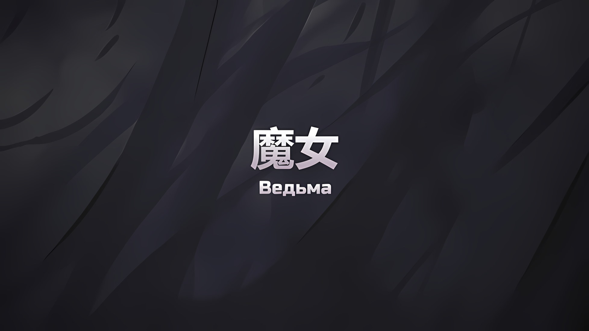
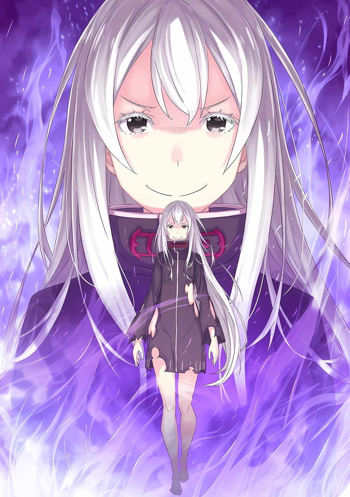

*※※※※※※※※※※※*

В Кристальном Дворце столицы Империи, в месте, что когда-то было аудиенц-залом, Ольбарт Данкелькен взмахнул правой рукой, отсутствующей от локтя вниз, и нахмурил белые брови.

Ольбарт: Что, наконец-то перестал двигаться, да? Черт, для меня, чудака, это так раздражающе.

Перед Ольбартом, который медленно пожал плечами и вздохнул, лежала та самая гротескная фигура, из-за которой он, старик-шиноби, впал в уныние… ее форма была изменена до такой степени, что даже нежитью ее назвать было бы нелепо; то, что осталось от лица этого гротеска, распласталось по полу.

Он счел свое обращение с этой причудливо омерзительной тварью за помощь.

Воскрешение нежити происходило без повреждений их памяти. Вдобавок, для этого расходовалась мана «Каменной Глыбы», Муспеля, который владел обширными землями Империи. …Поэтому ему было приказано свести убийства нежити к минимуму.

Ольбарт: Даже так, уж лучше его убить. Как ужасно, как ужасно.

Ценить человеческую жизнь или проявлять милосердие к слабым. От такой свободы действий, присущей только людям с большим сердцем, Ольбарт, жить которому осталось совсем недолго, давным-давно отказался.

По мнению Ольбарта, этот зал для аудиенций… нет, этот полигон для проведения экспериментов над «Душами» зашел слишком далеко.

Ольбарт: Это напоминает мне создавшую Араки группу, их подход. Пусть это и делалось не ради забавы или мести, но мне так невыносимо было от них избавляться. У них хватило наглости вытворять подобное. Впрочем, с ними разобрались.

В голове Ольбарта, когда он это говорил, возникла непревзойденная, неортодоксальная группа, с которой он имел дело в прошлом.

Чтобы создать совершенную «Пожирательницу Духов», известную как Аракия, эти преступники принесли в жертву множество людей и заявили, что действуют из чувства долга, что все это ради будущего Империи.

А эта ужасная сцена в зале для аудиенций… Что-то вмешалось в души нежити, которые были воскрешены в земляных сосудах, что-то примешалось к ним, что-то изуродовало их. И это было сделано не ради выигрыша в войне, а как варварский акт, совершенный с целью, что абсолютно не зависела от предстоящей победы или поражения. В деталях, породивших эти гротескные формы, он чувствовал, как и в случае с неортодоксальными преступниками, любопытство, жаждущее результата и далекое от эмоций.

И суть этого любопытства Ольбарт уловил одним лишь касанием.

Ольбарт: …Какая наглость — пытаться вмешиваться в души.

Сам Ольбарт частенько использовал технику шиноби, которая влияла на души других… на их Од, что приводило к уменьшению жертвы. Ее же украл и использовал Чиша. Тем не менее, эта техника затрагивала лишь внешний слой.

И все же, этот любознательный ум жаждал результатов, выходящих за рамки обычного.

Каковы именно были эти результаты, Ольбарт, незнакомый с этим любознательным человеком, знать не мог, однако…,

Ольбарт: Нехорошее у меня предчувствие по этому поводу, Ваше Превосходительство. …Похоже, здесь нет места моему предательству.

*△▼△▼△▼△*

…В ходе «Войны Полулюдей» Альянс Полулюдей был разгромлен. Отдельно потерпела поражение и Сфинкс.

По поводу этого поражения ей было нечего сказать.

Она прожила более трехсот пятидесяти лет, однако бóльшую часть этих дней и месяцев пряталась, продолжая выжимать из себя все силы, чтобы просто выжить; Сфинкс не могла сравниться с противником, который твердо вознамерился и готовился ее убить.

Если бы она рассказывала о произошедших событиях, то это была бы вся история.

Честно говоря, в сознании Сфинкс, когда ее побеждал ученик «Ведьмы Жадности» и ей грозила верная смерть, особых эмоций не было.

Прежде всего, у нее не было привязанности к собственной жизни. Многие годы она изнуряла себя, ставя во главу угла выживание лишь потому, что считала это рациональным для выполнения цели своего появления на свет.

И тогда, когда стало казаться, что она вот-вот умрет, так и не выполнив свое предназначение, у нее проснулось инстинктивное стремление бежать, ведь отказаться от поставленной цели было сложно.

Вот почему она бежала в подвал Королевского Замка, который стал местом решающей битвы; то, что она проявила силу воли, чтобы оторваться от ученика «Ведьмы Жадности», тоже было результатом следования инстинктам.

Этот побег, во время которого у нее не было особой привязанности к собственной жизни, изменил судьбу Сфинкс.

???: …Я хочу тебя использовать. Дабы исполнить мое желание, ты должна мне хорошенько послужить.

В безнравственных глазах этого человека мерцало сильное пламя честолюбия.

*△▼△▼△▼△*

…Пламя «Меча Света» Волакия сжигало дотла все, что решило уничтожить.

План Винсента Волакии и Нацуки Субару заключался в том, чтобы заставить Сфинкс твердо поверить в то, что по какой-то причине Император отказался от своего драгоценного багрового меча.

В результате, в конце грандиозного пари на жизни, Сфинкс оказалась охвачена пламенем, проиграв в битве хитростей.

Лезвие «Меча Света», что достигло «Ведьмы», Сфинкс, обрушило сверкающее пламя на носительницу «Великого Бедствия», воскресшую в виде нежити; несколько Сфинкс, противостоявших группе Винсента, Сфинкс, ожидавших в Кристальном Дворце, Сфинкс, наблюдавших за каждым полем боя в столице Империи, и бесчисленные Сфинкс, которые должны были начать атаки по всей Империи, одновременно вспыхнули огнем.

Сфинкс: …Контрмеры: Требуются.

Охваченная ярко-красным пламенем Сфинкс пробормотала это. Однако даже если бы она воспользовалась преимуществом нежити — слабой чувствительностью к боли — то все равно не смогла бы продержаться долго, потому что сгорела бы дотла.

В таком случае, может ли она бросить несколько уже обгоревших тел и продолжить план, как новая Сфинкс, наученная этой «Смертью»? …Нет, это было бы невозможно.

Пламя «Меча Света» сжигало саму душу Сфинкс.

Даже если бы она попыталась создать новую версию себя, пока горит ее душа, было бы невозможно предотвратить сгорание земляного тела при его создании.

Сфинкс: …

У нее не было никаких контрмер. Вместе с ощущением тупика тело этой Сфинкс рассыпалось.

Даже если бы она умерла в огне и перешла в следующую итерацию, вынеся уроки из этой «Смерти», восстановленная Сфинкс пришла бы к тем же выводам, а именно, что у нее нет никаких контрмер и что ей пришел конец.

Конец, такой будет ее конец. После долгих скитаний провала «Ведьмы Жадности», Сфинкс, ее расследование закончится здесь.

Она исчерпала все возможные меры, расставила достаточное количество ловушек, однако этого оказалось недостаточно.

Это поражение было сродни тому, что она пережила в прошлом, во время «Войны Полулюдей». Тогда Сфинкс тоже исчерпала все возможности, но этого все равно не хватило, и ей ничего не оставалось, кроме как погибнуть с поражением.

Причина, по которой этого не произошло, заключалась не в действиях самой Сфинкс, а во вмешательстве извне.

Но в этот раз она не могла надеяться на нечто подобное.

Ведь обладателя амбиций, который тогда спас Сфинкс, уже не существовало.

Лейп Бариэль был мертв. А потому…,

Сфинкс: …Анализ: Требуется.

Внезапно Сфинкс, которая должна была принять свою кончину, начала действовать.

Пока пламя «Меча Света» обжигало все ее тело, Сфинкс приложила палец к челюсти; уничтожив Жука-ядро, что находился в ее черепе, она вызвала собственную «Смерть».

Затем Сфинкс, которые присутствовали на поле боя, в столице и по всей Империи, последовательно повторили то же самое действие.

Сфинкс: …Анализ: Требуется.

Сфинкс: …Анализ: Требуется.

Дело было не в том, что она сдалась. И не в том, что ее охватили суицидальные мысли.

Только через смерть все воспоминания Сфинкс могли сойтись в ее душе. Если бы все бесчисленные Сфинкс умерли одновременно и все бессчетные воспоминания сошлись, то накопилась бы коллективная база знаний, известная как она сама.

Конечно, было лишь вопросом времени, когда ее душа, в которой собирались все эти воспоминания, будет выжжена дотла.

Однако за время, пока душа ее не сгорела, Сфинкс, что естественно, продолжала создавать собственные горящие «я», благодаря чему ей удалось накопить множество анализов и рассуждений о сложившейся ситуации и мерах по ее устранению.

Раньше она не испытывала никаких сильных эмоций по поводу «Смерти». Однако теперь все изменилось.

Сфинкс: …Сопротивление: Требуется.

Сфинкс: …Сопротивление: Требуется.

Сфинкс: …Сопротивление: Требуется.

Сопротивляясь, сопротивляясь, и снова сопротивляясь, Сфинкс собрала воедино все мыслимые возможности и подвергла их анализу.

Результаты каждого бастиона, эксперименты над душами в Кристальном Дворце, история Императорской Семьи Волакия, «Пожирательница Духов», чужеродное существо из Королевства, «Звездочеты», заповеди, «Великое Бедствие», все до последней возможности, осколки самого существования; она анализировала все это.

И затем…,

*△▼△▼△▼△*

…Багровые глаза Присциллы, которая находилась в заключении, в полной мере созерцали всю цепь событий, происходящих со Сфинкс.

Тело «Ведьмы» внезапно вспыхнуло красным огнем, и Присцилла с первого взгляда поняла, что это было искрящееся пламя «Меча Света», который передавался в Империи Волакия из поколения в поколение.

Она также поняла, что тот, кто поджег «Ведьму» этим искрящимся пламенем, был не кто иной, как Винсент Волакия.

Присцилла: Значит, все-таки ты раскрыл карту, которую держал перевернутой? А ты до последнего коварен, братец.

Присцилле, как члену Императорской Семьи Волакия, был совершенно понятен тот факт, что Винсент не доставал «Меч Света», а хранил его в качестве козырной карты. Конечно, учитывая, что владение «Мечом Света» сопряжено с определенными трудностями, неудивительно, что Винсент не стал бездумно на него полагаться.

Так или иначе, потерпев поражение в битве хитростей, «Ведьма» сгинула в пламени… по крайней мере, так должно было случиться.

Присцилла: Ты, что ты сделала?

Сфинкс: …Анализ: Требуется.

Пламя «Меча Света» сжигает то, что хочет сжечь, а лезвие «Меча Света» разрезает то, что хочет разрезать.

Это была незыблемая истина. Несмотря на это, «Ведьма» медленно избавилась от ярко-красного пламени, которым должна была быть объята на глазах у Присциллы.

Пламя перестало сжигать «Ведьму».

Пламя «Меча Света» сжигает то, что хочет сжечь, а лезвие «Меча Света» разрезает то, что хочет разрезать.

Следовательно, судьба «Ведьмы», сжигаемой и рассекаемой «Мечом Света» Винсента, не могла быть изменена.

Однако…,

Присцилла: Кто ты такая?

Если бы тот, кого сожгли, тот, кого рассекли, стал кем-то другим, это была бы совсем другая история.

С большой долей вероятности Винсент убил «Ведьму», убил Сфинкс с помощью «Меча Света».

Однако облик «Ведьмы», которая избавилась от пламени, отличался от того, что знала Присцилла.

Потрескавшаяся бледная кожа, черные глазные яблоки с золотой радужкой и юная внешность маленькой девочки — все это было отброшено, теперь перед Присциллой встало нечто совсем иное.

Длинные белые волосы, что доходили до спины, и черные глаза, в которых читался ясный ум и любознательность. …Белый и черный — если бы кто-то попытался обрисовать это существо, то эти два цвета вполне бы могли его представить.

Присцилла: Кто ты такая?

???: …«Ведьма Жадности».

На повторный вопрос Присциллы последовал тихий, но полный убежденности ответ.

Осуществив цель своего создания по прошествии долгого времени, существо, чья душа изменилась по своей природе… нынешнее воплощение* «Ведьмы Жадности», которое избежало участи быть сожженным пламенем, заговорило.

Ведьма: Цель создания достигнута. …Пора мне* приступить к выполнению своего предназначения в жизни.

Вот как она заявила.

* В оригинале здесь, судя по всему, присутствует игра слов, подразумевающая, что Ведьма Жадности сбросила оболочку Сфинкс.

* Здесь Ведьма Жадности говорит, используя местоимение ワタシ, которое является местоимением не Сфинкс, а Ехидны. Исходя из этого, можно сделать вывод, что теперь, когда цель Сфинкс достигнута, она будет стремиться к выполнению изначальной цели Ведьмы Жадности.
