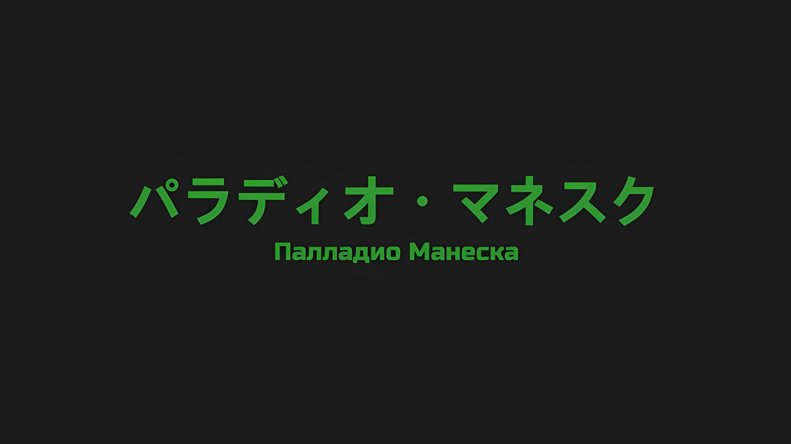

*※※※※※※※※※※※*

Палладио Манеска, один из принцев, конкурировавших с Семьдесят Седьмым Императором Волакии, Винсентом Волакией, на «Церемонии Императорского Отбора».

На семьдесят седьмой «Церемонии Императорского Отбора», которая была значительно ожесточеннее в сравнении с предыдущими, он союзничал с предполагаемой предшественницей Ламией Годвин и почти загнал в угол Винсента Авелюкса, на тот момент еще не ступившего на трон Империи, а также Приску Бенедикт.

В конечном счете способности Палладио сочли угрозой, и в результате тайного сговора Винсента и Приски его принудительно сняли с «Церемонии Императорского Отбора»; впрочем же, сам он не был виноват в своем поражении.

Именно тот факт, что Ламия, с которой он сформировал альянс, без ведома Палладио оказалась преждевременно убрана, привел к роковому изменению хода «Церемонии Императорского Отбора» и обернулся для него поражением.

Палладио: И правда, разве она не была просто безнадежной младшей сестрой, искусной лишь в пустословии?

Лишившись жизни, Ламия наглядно показала, что может только лаять, но не кусаться.

Когда она напала на драконьи повозки, что покидали столицу Империи, по ее просьбе Палладио присмотрел за ней. И все же Ламия потерпела сокрушительное поражение и погибла. И в жизни, и в смерти она была не более чем глупой сестрой, не оставившей после себя никаких свершений, достойных ее величественных слов.

Усмехнувшись жалкому поведению Ламии, Палладио с золотыми зрачками, что свидетельствовали о его природе нежити… включая третий на лбу, сузил свои три глаза и окинул взглядом поле боя.

По полю боя перед ним маршировало огромное количество нежити, вооруженной бессмертием и глубоко укоренившимся желанием захватить город. Они без устали проводили свои решительные и мерзкие атаки.

Командовать нежитью, заполонившей эти обширные земли, и захватить город… «Укрепленный Город» Гаркла, тем самым раз и навсегда сокрушив Империю Волакия, которая до сих пор пребывала в неведении, — таков был долг Палладио.

Это была обязанность, возложенная на него как на избранника небес.

…Палладио происходил из племени Злого Глаза, расы, благословленной миром.

В древние времена считалось, что племя Злого Глаза руководило заурядной человеческой расой с помощью своих особых способностей, а Божественная Защита, которой обычно удостаивались лишь избранные, была дарована каждому потомку их расы, избранной небесами.

Однако люди страшились племени Злого Глаза — его превосходящей силы. Их несчастная раса была вытеснена с центральной сцены истории… И на Палладио была возложена миссия спасти своих соплеменников, погрязших в страданиях.

Доказать, он должен был доказать. Что племя Злого Глаза — самая могущественная раса в мире.

Именно поэтому…,

Палладио: Империю, построенную такими же трусами, как вы, я разрушу и отстрою заново.

В голове Палладио, чье неживое лицо исказилось, возникли раздражающие образы Винсента и Приски.

Нарушив неписаное правило «Церемонии Императорского Отбора», согласно которому только одному человеку дозволялось остаться в живых, он, как член той же Императорской Семьи Волакия, не испытывал ничего, кроме презрения, презрения к подлому характеру этих двоих, что вступили в сговор с целью совместного выживания. При таком раскладе неудивительно, что во время «Церемонии Императорского Отбора» были предприняты подлые попытки растоптать многовековую историю Империи Волакия и ее вес. …Нет, скорее, было бы вполне естественно предположить, что здесь имеет место некий заговор.

Палладио: Если б не это, то я бы не отстал от таких, как вы и вам подобных.

Как потомок племени Злого Глаза, избранник небес, Палладио в силу своего необычайного таланта сметал всех своих врагов и утверждал свое положение принца Волакии.

Как приверженец закона железа и крови Империи, он никогда бы не уступил слабакам, которые промышляют лишь сговорами и махинациями.

Посему…,

Палладио: …Винсент и Приска, я вынесу приговор вам обоим.

Таким образом, как только Империя Волакия обретет идеальную форму, ею будет править Палладио, обладающий родословной и качествами, подобающими ее правителю.

Что касается стиля правления, то он будет основан на примере того, кого Палладио с давних пор считал величайшим Императором всех времен, того, кто правил Империей Волакия с болью и страхом, — «Император Терний»… Югард Волакия станет для него примером.

Правление Югарда, который, по слухам, опутывал сердца своих людей шипами, сделало власть Императора широко известной. Именно таким был идеал Палладио.

В более поздних художественных произведениях рассказывалось о глупых слухах, касающихся «Императора Терний», живущего ради любви простой деревенской девушки; после восшествия Палладио на трон все они будут сожжены и похоронены.

Основой уверенности Палладио, конечно же, была способность, дарованная ему как члену племени Злого Глаза, которая и стала основой его уникальной природы, его необычайной силы.

Палладио: …

Закрыв два глаза, он сосредоточил свое внимание на третьем, на Злом Глазе, который был расположен у него на лбу.

В тот же миг поле зрения Палладио стало уже не просто узким полем битвы, а обширным, небесным взором, охватившим все пространство вокруг.

Действительно, это была точка зрения солнца… третий глаз Палладио объединял его собственное поле зрения с полем зрения солнца, создавая перспективу правителя, взирающего на мир свысока.

Опираясь на это, Палладио с достоинством выполнял свою роль командующего армией нежити.

Обычные люди могли бы похвастаться тем, что способны одержать победу грубой силой над неиссякаемыми силами нежити, однако использование столь убогой тактики для пробивания себе пути не подобало бы битве, достойной Императора.

Поставить противника на колени с помощью силы и изобретательности — таково было истинное воплощение закона железа и крови.

Палладио: Ты подготовил достойных людей и запасся всем необходимым. Видно, ты одарен подчиненными… но, похоже, это твой предел, Винсент.

Скоординированная атака солдат, размещенных на стенах, и мощных отрядов, устремившихся вперед, была впечатляющей, и нежить, несмотря на свое превосходство в численности, не смогла прорвать даже первый слой обороны Укрепленного Города. Однако тот факт, что они так рано использовали карты высшего качества в своей руке, был не чем иным, как признаком неуверенности в своей боевой мощи.

В конце концов, Злой Глаз Палладио мог видеть город насквозь… большинство жителей были беженцами столицы Империи и различных городов с деревнями, поэтому, не имея возможности сражаться, они представляли собой лишь обузу.

С их точки зрения, оборона самых толстых и больших стен была единственной ниточкой, за которую они могли уцепиться.

Палладио: Я объясню этим невежественным глупцам, что все это — лишь хрупкая и мимолетная иллюзия. …Жалкие людишки, мир, который вы видите своими глазами, настолько узок, что я просто не могу вас не пожалеть.

Смеясь над столь глупым сопротивлением, Палладио поднял руку и передал свой голос куда-то вдаль.

Это была врожденная способность Палладио как члена племени Злого Глаза… телепатическая связь, которая позволяла ему передавать свой голос любому человеку, чьи волосы, ногти или части тела он забрал, независимо от расстояния, которое их разделяло.

Таким образом, Палладио сделал решающий ход, способный покончить с Укрепленным Городом.

Этим было…,

Палладио: …Мертвые летающие драконы должны быть задействованы немедленно. А тех недоумков, которые сосредоточили все свои силы на городские стены, мы научим методам, с помощью которых настоящий Император ведет войну.

*△▼△▼△▼△*

???: …Вражеская эскадрилья летающих драконов пролетела над большой горой позади великой крепости и вторглась в воздушное пространство над укреплениями! Они уже высаживают вражеских солдат, нежить ворвалась в город!

Примчавшийся в командный пункт посыльный доложил об изменении ситуации за один вдох.

Крепость, окруженная стенами, и так терпела простые, но мощные атаки грубой силы, а теперь противник решил напасть с воздуха, что было самым большим слабым местом Гарклы.

Выдолбленная в могучем горном склоне, величайшая крепость города могла похвастаться прочностью, которую нелегко было бы преодолеть, даже если бы крепостные стены, окружающие город, оказались прорваны. Тем не менее, небо оставалось единственным местом, где она была беззащитна.

Серена: Как только ситуация стала внушать опасения, они сделали свой ход. Этой тактикой, как я и предполагала, руководит Его Превосходительство Палладио Манеска.

Отто: Принц Волакии, который конкурировал с Его Превосходительством Императором на «Церемонии Императорского Отбора»?

Отто обратился к Серене, которая следом нахмурилась и провела пальцем по белой ране от меча на своем лице.

Среди противников, перешедших на сторону нежити, он значился целью, опасаться которой следовало заранее. Он был редким человеком с уникальными способностями, унаследованными от племени Злого Глаза, и его характер отличался садизмом и безжалостностью.

Справиться с противником, сосредоточившим всю свою силу в беззащитной слепой зоне, будет непросто, однако это было распространенной военной стратегией.

Особенно в осадной войне, ведь небольшая брешь часто приводила к разрушениям.

В таких масштабах возникновение подобной бреши стало бы фатальным.

По этой причине…,

Отто: Это соответствует сиэри*.

* Theory — теория.

Серена: …? Сиэри?

Отто: Неважно, не стоит об этом беспокоиться. Важнее другое…

Серена наклонила голову от незнакомого слова и слегка взмахнула рукой, после чего Отто одобрительно кивнул Беллстетзу, который стоял в центре комнаты, дабы тот дал указания посыльному.

В ответ на это нитевидные глаза Беллстетза слегка приоткрылись,

Беллстетз: Отдай им приказ. …Пришло время для «Спешл Форсес*».

* Special forces — войска специального назначения.

Да, он уместно использовал незнакомые ему слова.

*△▼△▼△▼△*

…Это должна была быть стрела, выпущенная в качестве решающего удара в битве за «Укрепленный Город».

О пользе «Всадников Летающих Драконов» жители Империи знали не понаслышке, но в нынешних условиях такое было возможно только при условии, что и всадник, и летающий дракон были воскрешены.

Учитывая это условие, «Всадников Летающих Драконов», пополняющих ряды нежити, было ничтожно мало. Поэтому с ними обращались осторожно, только там, где их участие будет иметь первостепенное значение.

*Палладио: «…Мертвые летающие драконы должны быть задействованы немедленно. А тех недоумков, которые сосредоточили все свои силы на городские стены, мы научим методам, с помощью которых настоящий Император ведет войну.»*

От командира нежити поступил телепатический приказ.

Повинуясь странному голосу, который, казалось, отдавался прямо в их головах, несколько всадников на взмахах крыльев своих любимых драконов поднялись в небо Укрепленного Города.

Преодолеть высоту огромной горы, служившей границей с соседними странами, было опасно для жизни, какими бы опытными «Всадниками Летающих Драконов» они ни были. И все же, не придавая значения этому серьезному препятствию, рискуя своей жизнью, всадники-нежить выполнили поставленную перед ними задачу.

Всадник-нежить: …

Под золотым светом их мертвых глаз виднелась великая крепость, защищенная прочной каменной стеной.

Здесь был развернут драконий корабль, который несли около сотни мертвых летающих драконов, и непокорная группа нежити поднялась на борт.

Те, кто отвечал за транспортировку, были нежитью, а значит, и те, кого посылали, тоже должны были быть нежитью… такова была кощунственная и безразличная к выживанию тактика.

???: Вперед.

Получив этот короткий приказ, мертвые летающие драконы с воплем отпустили драконий корабль.

Этот варварский акт, не учитывающий ни скорости, ни места приземления, более уместно было бы назвать броском; чтобы нанести смертельный удар по Империи Волакия, он кружился и вращался, приближаясь к центру города.

И вот…,

???: ТАКОЕ В НАШИХ СИЛАХ, ВЕДЬ МЫ…!!!

???: СИЛЬНЕЙШИЕ! СИЛЬНЕЙШИЕ! СИЛЬНЕЙШИЕ…!!!

???: СИЛЬНЕЙШИЕ! СИЛЬНЕЙШИЕ! СИЛЬНЕЙШИЕ…!!!

???: СИЛЬНЕЙШИЕ! СИЛЬНЕЙШИЕ! СИЛЬНЕЙШИЕ…!!!

Группа, выскочившая подобно буре со склона горы, ворвалась во фланг падающего драконьего корабля и изнутри разнесла в пух и прах то, что должно было стать роковым ударом для имперских солдат.

*△▼△▼△▼△*

…Будучи войсками специального назначения, они, несмотря на большую ответственность, мучительно долго ждали.

Однако, невзирая на заманчивость, не было опасений, что их усилия приведут лишь к промаху.

Ведь Нацуки Шварц был человеком, который уже завоевал доверие Густава Морелло.

Безоговорочно помогая в делах, которые тот задумал, веря в события, которые, по его убеждению, произойдут безо всяких оснований, Густав решил сражаться в меру своих сил с любым врагом, коему, как тот заявил, они будут противостоять.

Поэтому с тех пор, как началась битва вокруг Укрепленного Города, они, чувствуя, как разворачивается ожесточенная битва не только с членами Эскадрона Плеяд, но и с другими, терпеливо ждали своего часа.

Но, конечно, само ожидание и нетерпение к нему сильно различались.

Густав: OООООО…!

С мощным ревом Густав замахнулся четырьмя руками и стал буйствовать на падающем драконьем корабле.

Нежить, что находилась на борту драконьего корабля, всадила свое оружие в судно, закрепив свои тела на месте, чтобы их не отбросило. Из-за этого их реакция на внезапную атаку отряда Густава была задержана.

Вместе с Густавом в состав войск специального назначения входили отнюдь не личные охранники Шварца — Хиайн, Вайц и Идра, а гладиаторы-ветераны, что провели долгое время на «Острове Гладиаторов». Иными словами, это были люди, с которыми Густав был хорошо знаком.

Как губернатор Гинунхайва, Густав был обязан бесперебойно управлять «Островом Гладиаторов», поэтому он разбирался в способностях гладиаторов лучше, чем они сами.

Однако он и представить себе не мог, что подобная служба будет входить в круг его обязанностей губернатора.

Гладиатор: Подумать только, они послали кроликов убивать волков.

Гладиатор: Мы — ветер, и никто, сука, не в силах окружить ветер!

Гладиатор: Кхахахаха! Драчка, точно назревает драчка, говорю вам! Когда я ставлю крест на собственной жизни, мне, бляха, крышу сносит по полной!!!

Вспыльчивые, но в то же время способные личности, такие как волк-одиночка Джосуро, Фенмель и Мильзак, вместе с Густавом орудовали на драконьем корабле и подчиняли себе нежить одну за другой.

Таинственный феномен поднятого боевого духа, царящего вокруг Эскадрона Плеяд, позволил гладиаторам, знающим толк в сражениях, выступить против могучих бойцов с многолетним военным опытом и в достаточной мере продемонстрировать свою силу даже в условиях падающего драконьего корабля. …Нет, скорее, именно ситуация, в которой на карту были поставлены их жизни, позволила им проявить способности, превосходящие даже их истинную силу.

Густав: Именно поэтому выбор отряда самоубийц… нет, именно поэтому выбор спешл форсес эффективен.

На этом поле боя служба отряда Густава была сопряжена с не меньшей, если не большей, опасностью для жизни, чем для тех, кто сдерживал полчища нежити на передовой.

Им доверили столь важное задание, однако было крайне необходимо, чтобы отряд Густава не погиб.

Ни один из них не должен был погибнуть — таков был строгий приказ, отданный им боссом Эскадрона Плеяд.

Густав: Как должностное лицо, я не приемлю служения двум господам. Поэтому я не считаю тебя своим господином, однако… искренняя просьба друга — это то, что мне хочется выполнить в меру своих сил.

С этими словами Густав схватил за головы нежить, которая уже вытащила оружие с целью контратаки, и вдребезги сокрушил четыре тела над собственной головой.

С грохотом разбрасывая их земляные останки, он тут же принялся за следующих врагов.

Густав ненавидел жестокий и дикий нрав Племени Многоруких.

Как мог, он обуздал собственное сердце и, не желая поддаваться воинственности или гневу, намеревался прожить жизнь в строгих ограничениях.

В Империи Волакия, на посту губернатора «Острова Гладиаторов», он придерживался своих принципов.

Густав: Оо, ООООООООО…!!!

Однако сейчас Густав полностью забыл о них.

В этот момент он бушевал с тем же темпераментом, что и Племя Многоруких, чье поведение он считал раздражающим.

И потому…,

Густав: ТАКОЕ В НАШИХ СИЛАХ, ВЕДЬ МЫ…!!!

Гладиаторы: СИЛЬНЕЙШИЕ! СИЛЬНЕЙШИЕ! СИЛЬНЕЙШИЕ…!!!

Гладиаторы: СИЛЬНЕЙШИЕ! СИЛЬНЕЙШИЕ! СИЛЬНЕЙШИЕ…!!!

Гладиаторы: СИЛЬНЕЙШИЕ! СИЛЬНЕЙШИЕ! СИЛЬНЕЙШИЕ…!!!

Густав и остальные войска специального назначения выполнили свой жизненно важный приказ.

В конце концов, именно этот громовой рев как ничто другое доказывал, что Шварц и его эскадрон сражаются во имя триумфа Империи.

*△▼△▼△▼△*

Привлекая внимание к количеству или выдающейся силе своих войск, он мог впоследствии разыграть козырь в ключевых областях, где было мало людей.

В случае успешной реализации план Палладио Манески разрушил бы оборону города и, несомненно, стал бы решающим фактором в исходе осады.

Впрочем, такое могло произойти только при удачном стечении обстоятельств.

Серена: Размещая нежить, в первую очередь следует продумать тактику, которая позволит использовать их характерные особенности. Они неизбежно попытаются пересечь Гору Гилдрей с готовностью умереть.

Отто: С учетом этого, при виде стены, которую невозможно пробить одной лишь силой, естественно захотеть разыграть свои карты в пустом небе.

Серена: Однако я не ожидала, что все обернется именно так.

Войска специального назначения были развернуты для перехвата штурмового отряда нежити, атаковавшего город с неба. Командный пункт кивнул в знак согласия, так как вражеская атака, которая, с точки зрения противников, была выигрышной стратегией, оказалась предотвращена.

Как отмечалось ранее, для нежити это была подходящая стратегия. Тем не менее, с точки зрения использования неблагоприятной ситуации, она была слишком прямолинейной и ортодоксальной.

Прямые атаки относились к стандартным методам и действовали эффективно, однако на них можно было легко ответить.

Серена: Если верить тому, что я слышала, смерть Палладио во время «Церемонии Императорского Отбора» также объясняется его чрезмерной сосредоточенностью на правильном способе атаки. К добру или к худу, но время нежити замерло.

Серена, отправившая свою Эскадрилью Летающих Драконов, чтобы уничтожить появившихся в небе всадников мертвых летающих драконов, описала их противника как не сумевшего разгадать ее план.

Палладио Манеска считался вражеским командиром, а его имя упоминалось в качестве цели, с которой следует быть начеку, правда, это только в том случае, если он будет помогать другим, используя преимущества племени Злого Глаза.

Фактически, налет Ламии Годвин на соединенные драконьи повозки едва не разрушил Империю благодаря помощи Палладио.

Однако среди несчастий есть и положительная сторона: противник не знал, как использовать свои способности в полной мере.

Серена: Похоже, Его Превосходительство Палладио хочет сказать, что нельзя проиграть ставку, если видишь руку противника.

Отто: Логично. Если видишь руку противника, то имеешь значительное преимущество.

Серена: Да? Я могла бы заключить с тобой пари на тех же условиях. Только вот если ты сыграешь со мной, твоя семья окажется в опасности.

Отто: Так вот почему они называют это Путем Волакии!

Серена: Жажда победы — это добродетель. …Ты такой же, как и я, не так ли?

На лице Отто отразилась неподдельная горечь от взгляда Серены, которая словно намекала на то, что у него плохой характер.

Во всяком случае, можно сказать, что по качеству командного пункта они превзошли своего противника. Лишившись победной стратегии, противнику ничего не оставалось, как сделать следующий шаг.

И этим было…,

Серена: Он разыгрывает свой лучший козырь. …Непрерывное развертывание сил — это цветок проигранной битвы.

*△▼△▼△▼△*

???: …РЫЫЫААААААААААХХ!!!

???: …РЫЫЫААААААААААХХ!!!

???: …РЫЫЫААААААААААХХ!!!

С громоподобным ревом, что сотрясал все и вся, в небо взмыл трехголовый Дракон, покрытый черной чешуей.

Взмахивая крыльями, пролетая над полчищами нежити и даже не вздрагивая от града бесчисленных стрел, в небе Империи вновь возник черный Злой Дракон.

Ранее уничтоженный рукой «Хвалителя», внушительный «Трехголовый» Вальгрен был угрозой, несопоставимой ни с одной другой нежитью. Несомненно, он представлял собой козырную карту армии мертвецов.

Учитывая провал внезапной атаки из-за Горы Гилдрей, командир рассудил, что их одолеют, если они тут же не попытаются восстановиться.

…Однако, как и прежде, до лобовой атаки дело не дошло.

???: Хааа…!

Вместе с мужественным голосом от городских стен к небу потянулись выпуклые шипы, яростно приближаясь к Дракону с расправленными крыльями… это был натиск Кафмы Ирулюкс.

Подавляющая сила Кафмы, способная в одиночку удерживать фронт войны, кишащий нежитью, насколько хватало глаз, опутала все тело Вальгрена и связала его крылья.

Конечно, было лишь вопросом времени, когда шипы будут разорваны в клочья физической силой Дракона.

Кафма: Впрочем, моим долгом будет выиграть даже секунду!

Кровь хлынула из носа Кафмы, его вены запульсировали по всему телу пятнистым узором, и он со свирепым выражением лица обратился к Вальгрену в небе.

Злой Дракон зарычал, повернув три свои головы, как бы в гневе от заявления этого ничтожного существа.

Его рев заставил все живое замереть в страхе… однако на этом поле боя не было трусов, которые бы дрогнули перед боевым кличем Дракона.

???: …Аль Клаузерия.

Опутанный шипами, Вальгрен прекратил свое движение в воздухе. Целясь в одну из извивающихся голов Дракона, по небу диагонально пронеслась радужная вспышка.

Она вибрирующим порывом охватила правую голову Вальгрена, оторвав ее от основания.

Это был изящный, великолепный и ослепительный удар магии, исполненный «Безупречным».

???: Прицелиться!

Вслед за этим в глаза одной из оставшихся голов Злого Дракона с молниеносной скоростью вонзилась стрела.

По сравнению с огромным телом Дракона она была незначительной, однако вождь «Племени Судрак» великолепно пробила его насквозь, а затем резко окликнула двоих, что стояли рядом с ней.

Одна из них прицелилась на глаз, а другая использовала все свое тело, чтобы натянуть огромный лук, для которого потребовалось бы десять обычных людей.

???: А теперь… получай!!!

???: Завалим его~!!!

Объединив свои усилия, чтобы овладеть мощным луком, они с громким звуком, похожим на пробивание звезды, нанесли прямой удар по ослепшей голове Злого Дракона, полностью снеся все, что было выше его челюсти. Трехголовый превратился в Двухголового, а затем и в Одноголового.

Вальгрен: …РЫЫЫААААААХХ!!!

Лишившись левой и правой головы, Вальгрен воздел глаза к небу, чувствуя, как внутри его огромного черного тела разгорается неимоверный жар.

Дыхание разрушения, столь синонимичное Драконам, было направлено на Укрепленный Город внизу. …В этот момент глаза обезумевшего Злого Дракона встретились с глазами того, кто наблюдал за ним изнутри великой крепости, захват которой он должен был осуществить.

Стоявший у окна человек направил свою руку в сторону Дракона, что рвал с себя шипы…,

???: …Эль Фула.

Если цель могла быть достигнута с минимальными затратами, не требовалось ни яркой магии, ни чудовищной силы.

С точностью, которая могла бы послужить примером, последняя голова Злого Дракона оказалась отрублена лезвием ветра, отличавшимся неослабевающей остротой.

Вальгрен: …

Все три его головы были отрублены. Злой Дракон пал.

Таково было жалкое поражение «Трехголового» Вальгрена, который должен был стать козырной картой сил нежити.

*△▼△▼△▼△*

Палладио: Невозможно, невозможно-невозможно-невозможно-невозможно-невозможно-невозможно…!

Палладио дрожал всем телом и ерошил свои волосы. Он никак не мог смириться с увиденным через Злой Глаз поражением Вальгрена.

Невозможные события продолжали происходить одно за другим.

Из-за этого Палладио пал с выгодной позиции, и его гордость, как человека, который должен был неспешно вести войну подобающую настоящему Императору, была уязвлена. Он вкусил унижение.

Палладио: Но как!? Как они разгадали все мои планы!

Тактика внезапного нападения, когда мертвые летающие драконы несут драконий корабль и перебираются через гору, была идеальной.

Он не знал, предвидели ли они это или сразу отреагировали, используя сохранившиеся боевые единицы, однако тактика внезапного нападения была сорвана. Впрочем, это не было чем-то неприятным или роковым. …Точнее, не должно было.

Палладио: Что это вообще за Злой Дракон, «ТРЕХГОЛОВЫЙ»…!

«Трехголовый» Вальгрен был немедленно послан как предвестник отчаяния… в прошлом он, страшный Злой Дракон, творил тиранию в отвратительном соседнем государстве, Королевстве Лугуника.

Если бы этот Дракон, что лишился разума, показал свои истинные достоинства, то свершилось бы господство на основе силы и страха.

Подумать только, что могущественный Вальгрен будет повержен так, лишившись трех голов.

Палладио: Почему вы все такие безмозглые? Почему вы не можете просто исполнить обязанности, возложенные на мои плечи?

Поверженный Злой Дракон, потерпевший неудачу отряд засады, полчища нежити, все еще с трудом покоряющие первую стену, — все они не принесли Палладио никакой пользы. Они были лишь скопищем недоумков, которые продолжали тянуть его вниз.

Если подумать, то у Винсента, Приски и Ламии были компетентные слуги.

Проще говоря, разница между Палладио, Винсентом и остальными сводилась к тому, благословлены они слугами или нет. Они не имели ничего общего с силой Палладио и были не более чем внешним украшением.

Кичась этим и пытаясь превзойти Палладио, они представляли собой бесстыдную кучку, недостойную быть частью Императорской Семьи.

Палладио: Одиночество «Императора Терний» — вот истинное стремление Императора Волакии. Я никогда не опущусь до методов вашего трусливого сброда…!

Даже на «Церемонии Императорского Отбора» Винсент избежал стратегии, которую разработал Палладио, и перехитрил его, вырвав себе победу.

То же самое происходило и сейчас. …Палладио не мог оставить без внимания столь возмутительный поступок.

Палладио: Кто-нибудь, выдвигайте свои предложения! С этого момента я приму все, что угодно!

Сгорая от унижения, Палладио громко воззвал к лагерю нежити.

В действительности Палладио хотел оставаться одиноким Императором, который не спрашивает чужого мнения. Однако противник воспользовался его надменностью, пустив в ход копье злого умысла.

В таком случае Палладио не оставалось ничего другого, кроме как продемонстрировать могущество Императора своей строгостью.

Палладио: Есть здесь хоть кто-нибудь!? Подайте голос! Иначе…

???: …Что ж, с позволения.

Вертя головой, Палладио окинул взглядом все собравшиеся бледные лица, и тут один-единственный человек подал голос.

На первый взгляд, это была стройная фигура, медленно идущая сквозь толпу нежити… заметив ауру, которая заметно отличалась среди остальных, Палладио сузил свои три глаза.

Внешний вид явно выделял эту личность из числа посредственностей. Оставалось только одно: будут ли способности этого человека соответствовать произведенному впечатлению.

Палладио: На что ты способна?

???: Ах, точно. …Для начала, давай я покажу тебе.

Затем беловолосая девушка, вставшая перед Палладио, улыбнулась и подняла руку к небу.

И тут…,

*△▼△▼△▼△*

???: …Ана!!!

Когда в небе обезглавили «Трехголового» Дракона, чье появление было ожидаемым, а его колоссальное черное тело превратилось в пыль от падения, Анастасия вздохнула.

Хотя это и предвиделось, но тот факт, что противник обладал большим весом, оставался неизменным.

Даже при соответствующей подготовке существовала возможность того, что противник превзойдет или обойдет их с фланга. Избежав такого сценария, она с облегчением почувствовала, что могущественный враг повержен.

Однако успокоение, которое испытывала Анастасия, было разорвано в клочья голосом Ехидны у нее на шее.

Анастасия: …

За десять лет их знакомства Дух Ехидны всегда оставался неподвижным, маскируясь под шарф Анастасии; теперь, вскочив на ее плечо, она уставилась своими черными глазами в небо над великой крепостью.

Проследив за взглядом Ехидны, светло-бирюзовые глаза Анастасии расширились.

Анастасия: Это что, звезды…?

Слова Анастасии прозвучали невнятно, что свидетельствовало о ее неуверенности.

Как минимум, можно сказать, что это было зрелище, которого Анастасия никогда прежде не видела; пейзаж, который она и представить себе не могла.

Выше, чем стая мертвых летающих драконов, перелетевших через Гору Гилдрей, выше, чем «Трехголовый» Злой Дракон, сверху на город каскадом падали огни… падали звезды.

Рядом с Анастасией, изумленной необыкновенным зрелищем, в то время как Отто и Беллстетз лишились дара речи, Серена, что наблюдала ту же сцену, исказила шрам от меча на своем лице в улыбку,

Серена: Атмосфера изменилась. …Победа или поражение, близится развязка.

*△▼△▼△▼△*

Палладио: Хаха, хахахаха! Превосходно, да, вот оно! Зрелище, которого я так жаждал!

Наблюдая за разворачивающимся в небе действом, Палладио пустился в восторженный пляс.

Оборона Укрепленного Города, известного своей прочностью, превратилась бы в ничто, как только каскадный свет достиг бы земли. Сопротивление этих тщедушных имбецилов будет равносильно мусору перед сиянием звезд.

Палладио: Ты правильно сделала, что передо мной предстала! Зачисляю тебя в ряды моих вассалов! Как мне к тебе обращаться?

Радость мерцала в его трех золотых глазах. Палладио задал этот вопрос даме, которая и породила это зрелище. Еще раз окинув взглядом беловолосую девушку, которая на этот вопрос повернулась к нему лицом, Палладио затаил дыхание.

Прекрасные белые волосы и утонченные черты лица, от которых по спине пробегали мурашки. Однако ее лицо и глаза были лишены тех физических черт, по которым можно было бы определить, что она нежить. …Такая внешность говорила о ее принадлежности к живым.

Но тогда с какой стати ей переходить на его сторону?

Когда Палладио задал свой вопрос, девушка выразительно наклонила свою талию в поклоне.

Затем она ответила на его вопрос. …О том, кем именно она является.

???: Какое же имя будет правильней использовать, затруднительный момент. Поэтому пока что… Полагаю, ты можешь называть меня просто «Ведьмой Жадности».

Так она и заявила.
