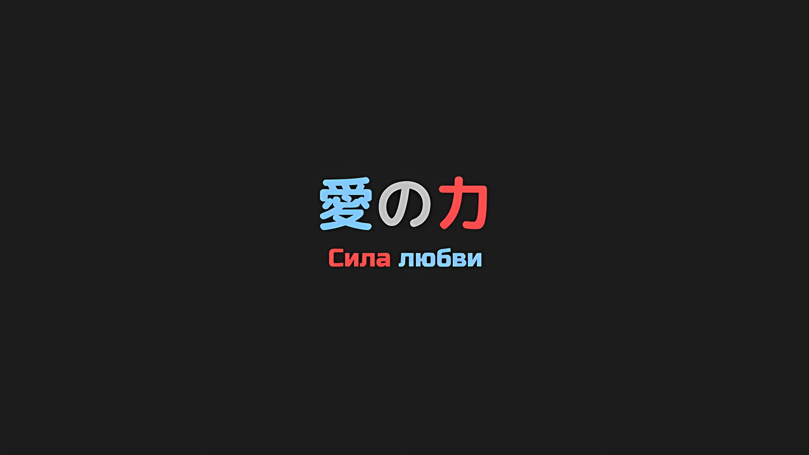
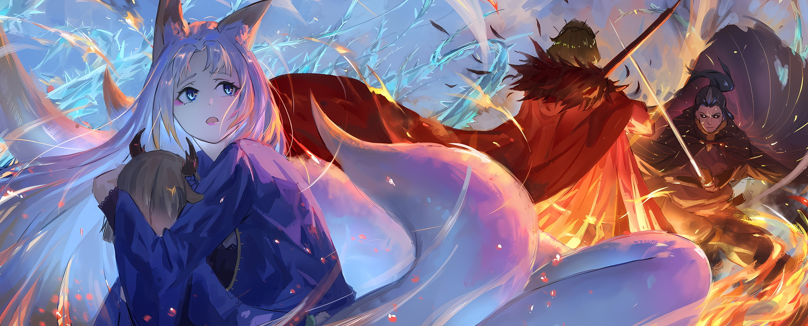

*※※※※※※※※※※※*

…Все ее тело полыхнуло огнем. «Ведьма» обратилась в пепел.

Впечатляющая мощь «Меча Света», который наконец-то освободился от своего покрова, украл ее душу и свирепым пламенем испепелил, превзошла все ожидания Субару от задуманного им плана.

Субару: Получается, это и есть истинная сила «Меча Света»…

«Ведьма» попала под удар. Следом багровое пламя распространилось и на два других ее тела. При виде такого результата Субару оставалось только разинуть рот.

Прежде Субару не раз доводилось быть свидетелем владения «Мечом Света», правда, его владельцем всегда выступала Присцилла. С точки зрения того, превосходил ли Авель Присциллу как обладатель «Меча Света», простого ответа не находилось.

Противники, на коих Присцилла обрушивала свой «Меч Света», всегда отличались грозностью. На сей раз «Ведьма»… Сфинкс оказалась таким же грозным противником, и, чтобы победить ее, Авель пошел на невероятную авантюру.

На всех полях сражений, при любом возможном расположении доски и во всех критических ситуациях до сих пор он ни разу не использовал «Меч Света», поэтому для Сфинкс, или, что вернее, для всех, эта возможность исключалась.

Дабы претворить все это в жизнь, и вообразить страшно, какова была необходима степень выдержки.

Винсент: Ты, что за полное непонимания лицо?

Субару: Просто я поражаюсь. Мы через столько всего вместе прошли, а мне по-прежнему так легко находить поводы, чтобы на тебя все жаловаться и жаловаться…!

Винсент: Хм, к чему ты клонишь… Быть может, речь идет о карте, которую я держал нераскрытой? Разве ты не из тех, кто вынашивает подобного рода планы?

Субару: Тут дело не в моем характере. У меня-то все в поряде, ибо это плоды смекалки, отваги и читинга*. А теперь давай вспомним прошлое: «Ритуал Крови», сражение с Зикром-сан и всеми прочими в Гуарале, появление Аракии, встречу с Йорной-сан в Хаосфлейме, игру в пятнашки с Ольбартом-сан и вообще все то время, что мы были на соединенных драконьих повозках! Ты скрывал это до последнего!

* Cheating — жульничество/обман.

Винсент: Ну да, и?

Субару: «Ну да, и»!? Гххххх!

Бесстыдное заявление Авеля с драгоценным багровым мечом в руках повергло Субару в глубочайший шок, однако через мгновение боль в его правой руке, которую сломала ему Сфинкс в качестве предупреждения, вновь нахлынула на него.

И пока он в слезах сжимал свою сломанную конечность, Беатрис со словами: «Субару!» поспешила к нему и приложила к его травме руку, пустив в ход магию исцеления.

Затем, нежно заботясь о Субару, она сказала,

Беатрис: Сколько ему ни говори, складывается впечатление, что на этого человечишку, в самом деле, слова не действуют. Его чувство вины, полагаю, умерло уже давно. Он из той же породы, что и Розвааль, в самом деле.

Субару: Кхххх…!

Беатрис: Ну вот, теперь тебе должно стать немножечко лучше, я полагаю.

Осыпав Авеля всеми возможными словесными оскорблениями, она закончила лечение Субару.

Боль так и не утихала, однако сломанная кость, по ощущениям, уже зажила. Правда, двигать ею было нельзя, да и для полного заживления требовалось время. Впрочем, сейчас имелись другие приоритеты.

Винсент: Сможешь ли ты спасти Джамала Орели?

Беатрис: Пока он еще дышит, я сделаю все возможное, в самом деле. Полагаю, это долг Бетти как партнера Субару.

На этих словах она рысью направилась к Джамалу.

Одолев первую Сфинкс, следом появились еще три. Джамал спровоцировал их, за что и получил больше всего травм. То, как он действовал — лил брань, слушать которую было больно — выглядело достаточно дерзко; но и это тоже было проявлением его верности Императору.

Спика: Уау.

Субару: О, Спика, ты отлично справилась. Как твое тело? Нигде не болит?

Спика: Ау!

Энергично кивнув, Спика с улыбкой постаралась его успокоить. Он вытер грязь с ее щеки и погладил по голове в награду за усердную работу.

Воистину, без всяких сомнений, это была победа, которую одержали все присутствующие, выложившись на полную для исполнения своего долга.

При всем этом он не мог не признать, что козырная карта Авеля внесла свой вклад больше, чем что-либо еще…,

Субару: И все равно я буду держать на тебя зуб до конца своих дней.

Винсент: Если уж я заставил тебя так много наговорить, то и тот, кто это предложил, тоже должен быть доволен.

Каким бы укоризненным ни был взгляд Субару, Авель невозмутимо его игнорировал.

Хотя его холодный характер и раздражал, когда дело доходило до того, чтобы скрывать «Меч Света» и твердо следовать этой цели, Субару ничего не оставалось, кроме как похвалить его.

…То, что Авель мог использовать «Меч Света», но скрывал этот факт, стало известно Субару только в цикле, где бой со Сфинкс уже начался.

Если говорить простым языком, то это был уровень секретности, что лежал мертвым грузом.

Первоначально для Субару единственным козырем, которым можно было надеяться остановить «Великое Бедствие» Империи Волакия, являлось объединение его силы со «Звездным Поеданием» Спики.

В случае же, если «Меч Света» Авеля достигал основы душ нежити, дело обстояло иначе.

«Меч Света» и «Звездное Поедание», два главных действующих элемента в этой осаде территории нежити, могли быть использованы как козыри, чтобы победить «Великое Бедствие».

Субару: И ты это прекрасно осознавал, а потому решил присоединиться к нашей группе, ведь так?

Спика: Уу…?

Субару: Видишь ли, Спика, этот хитрожопый Император всегда был в состоянии использовать «Меч Света» и даже знал, что он может послужить одним из ключевых элементов в победе над зомби — прям как Спика. Мы стали активно истреблять зомби «Звездным Поеданием». И что же произошло потом?

Спика: Аа, аау?

Субару: Да. Главные силы противника двинулись к нам. Метод, который мы использовали против этих главных сил, тоже стал «Звездным Поеданием» Спики. В конце-то концов, я не знал, какова вероятность того, что существует другой метод. Так что было бы просто замечательно, если б Спика смогла справиться. Однако в случае, если бы не смогла…

Спика: Ауаа!

После того, как Субару закончил свое объяснение, глаза Спики расширились, и она указала на «Меч Света» Авеля. На ее внезапное озарение он ответил: «Правильно!» и погладил по голове.

Вместе со Спикой он посмотрел на Авеля так, словно тот превратился в живой мусор.

Субару: Смотри, Спика. Это глаза человека с очень хреновым характером. Чтобы стать Императором Волакии, нужно обладать именно таким… Все ясно, может, лучше все-таки уничтожить Волакию?

Винсент: Переходишь на другую сторону, едва вражеский лидер обратился в пепел? Ужасное время для предательства.

Беатрис: Ты ведь не умолял нас помочь спасти Империю только для того, чтобы тут же стать главой восстания, я полагаю…

Хотя они оказались здесь по необходимости, Империя плохо сказывалась на эмоциональном воспитании Спики. Авель был тому ярким примером, поэтому, за исключением такой ситуации, как эта, от него ей следовало держаться подальше в первую очередь.

Спику следует окружить более приятными и жизнерадостными спутниками, которым она могла бы подражать, такими как Эмилия и Рем или Беатрис и Танза.

Субару: Заодно нам следует держать ее подальше от Отто и Розвааля. Что же касается старшей сестры… Она мне нравится, но совладать сразу с двумя будет тяжко. Гарфиэль мог бы дать хороший пример, вот только…

Беатрис: Субару! Почти закончила с исцелением, в самом деле!

Субару: О. Понял!

Повинуясь ее голосу, Субару и остальные направились к тому месту, где упал Джамал.

Однако Джамал не поднял голоса при появлении Субару и остальных. Он все еще лежал на земле.

Беатрис: Пока что его жизни ничего не угрожает, я полагаю. Но любое дальнейшее лечение, в самом деле, потребует времени, а также отнимет остатки сил Бетти.

Субару: Остатки сил Беако… В смысле, твоей оставшейся маны?

Беатрис: Все верно, полагаю… Конечно, есть ирегюлэрити*, заставляющая ее походить на роскошный банкет, но рассчитывать на нее было бы опрометчиво, в самом деле.

* Irregularity — неравномерность, непостоянство.

Субару: Ирегюлэрити…

Получив ответ Беатрис, Субару уставился на свои руки.

То, что она назвала неравномерностью, касалось оставшейся маны в его теле… Поскольку он заключил контракт с Духом, мана внутри него стала оставшимся MP* Беатрис, так что в его нынешнем состоянии количество маны, предоставленное ей, действительно можно было считать нерегулярностью.

* Mana Point — количество маны.

У Субару было несколько идей относительно того, почему это может быть так.

Одна из них заключалась в том, что связь между всеми в «Эскадроне Плеяд» и Субару дала положительный эффект; другая — в том, что инфантилизация привела к каким-то странным явлениям в его Вратах.

Но в последнем случае маловероятно, что Беатрис сможет это понять, поэтому он счел первый вариант более возможным.

Субару: Стать сильнее за счет связей. Я из тех типов, которые грешат подобными делами.

Беатрис: Субару…

Субару: Не волнуйся, Беако. Я согласен, что использовать столько магии, сколько нам хочется, наверное, идея не из лучших, поэтому мы будем стараться беречь ее как можно больше. Однако если нас загонят в угол…

Уважая мнение Беатрис, Субару неотрывно смотрел на лежащего Джамала.

Естественно, они не могли его бросить, ведь он сыграл важную роль в их победе. Однако если Джамал не придет в сознание, кому-то неизбежно придется его нести.

Винсент: К слову, нести его буду не я.

Субару: Ах ты ж, на шаг впереди… А ты в ударе с тех пор, как достал свой меч, хаха. Даже несмотря на то, что ты был со мной на равных в нашем кошачьем поединке, ты еще и брыкаешься… разве для тебя не будет пустяком понести Джамала?

Винсент: Даже если б мог, то все равно бы не стал. Теперь, когда Джамал Орели пал, я должен быть самым проворным из присутствующих. Наше текущее положение требует бдительности, поэтому я не могу таскать багаж.

Субару: Не называй его багажом! Лады, уговорил! Я…

Спика: Уууу.

Разозлившись на непокорного Императора, который привел веский аргумент, Субару попытался понести Джамала. Однако Спика проскользнула мимо него и взяла инициативу в свои руки, подхватив тело имперского солдата.

Смотреть на то, как миниатюрная девочка легко поднимает взрослого мужчину, было тягостно, пусть она и не особо напрягалась.

Субару: Что ж, так бы это выглядело в любом из случаев. И как тебе?

Винсент: Это великая услуга. Не останавливайся и продолжай.

Субару: Ты была права, Беако, у этого парня в принципе мертво чувство вины!

Беатрис: Как я и говорила, полагаю… Спика, в самом деле, не переусердствуй.

Беатрис вздохнула от дерзости Авеля, а Спика в ответ на ее размышления с улыбкой издала «Ууу!». По правде говоря, то, что она не сочла Джамала тяжелым, было облегчением.

В любом случае, хотя реальность победы над грозной Сфинкс постепенно начинала проникать в их сознание, они не могли быть до конца довольны этим.

А все потому…,

Винсент: …Похоже, в том, что я держал руки свободными, уже появился свой смысл.

Сказав это, Авель дернул подбородком в сторону череды силуэтов, что приближались к улице, на которой находились Субару и остальные. Похоже, они услышали битву со Сфинкс… там можно было заметить фигуры нежити.

Субару стиснул зубы от осознания происходящего и удручающей правды слов Авеля.

Таким образом, факт оставался фактом: нежить направлялась к ним.

Беатрис: …Даже после победы над Сфинкс «Таинство Бессмертного Короля» не оборвалось, я полагаю.

Субару: Черт, самая прямолинейная логика, что магия пропадет, если победить заклинателя, оказалась неверной. Беако…

Беатрис: Хотя это и исказилось, ее создали с целью стать «Ведьмой Жадности», я полагаю. Вероятно, она провела ритуал так, что «Таинство Бессмертного Короля» будет действовать даже в ее отсутствие, в самом деле. Если мы не уничтожим саму систему, то ограничения «Каменной Глыбы» все равно останутся ограничениями этой страны, я полагаю.

Субару: Думаю, что, скорее всего, так оно и есть…

Переварив все сказанное Беатрис, взгляд Субару обратился к самой северной части столицы Империи… он посмотрел на Кристальный Дворец.

Именно там обосновалась Сфинкс и ее сторона, так что это было самое подходящее место для размещения знакового объекта. Конечно, не исключено, что Сфинкс, которая не ценила подобную романтику и драму, разместила свое творение в другом месте.

Винсент: …Нет, сомнений быть не может, в Кристальном Дворце. Каковы бы ни были намерения «Ведьмы», если ей потребовалась связь с «Каменной Глыбой», то нужен контакт с ядром Кристального Дворца… с Могуро Хагане.

Субару: Разве Могуро не один из «Девяти Божественных Генералов»…?

Винсент: Да. В настоящее время он упокоен в Кристальном Дворце. Или, если точнее, упокоен сам Кристальный Дворец.

Субару: Ага, да! Нужно объяснение получше! Но позже.

Субару сказал это Авелю, у которого, похоже, было еще много секретов, помимо «Меча Света», и принял решение, что им определенно нужно отправиться в Кристальный Дворец.

Субару: …

Честно говоря, даже зная, что ядро «Великого Бедствия» находится в Кристальном Дворце, он все равно хотел убедиться в сохранности своих товарищей, которых он отправил на разные поля сражений. В частности, он хотел проверить Эмилию и Танзу.

Их положение было единственной частью, в которой Субару не смог удостовериться.

А причиной тревоги Субару было…,

???: …Блин, да вы ужасно выглядите. Даже лоб Императора-сан в поту и грызи; а он на удивление трудолюбив, не правда ли?

Вдруг черная тень спустилась вниз и непринужденным тоном перевернула ситуацию с ног на голову.

Фигура приземлилась между Субару и наступающей нежитью, подошла к ним и присела на корточки.

Затем он рассмеялся, держа во рту золотое кисэру, и протянул к ним согнутые ладони.

???: Это вам, работягам… Вот, держите сувенирчики.

С этими словами он раскрыл ладони, в которых лежало несколько странных кристаллов размером с монету.

Субару не знал, что это такое, однако держащая его за руку Беатрис поняла.

Беатрис: Это же Жуки-ядра…!

???: Да-да. Прямиком из тех бледнолицых.

Спокойно кивнув, фигура свела ладони вместе и потерла их друг о друга.

В следующее мгновение нежить на другой стороне улицы испустила вопль страдания и превратилась в пыль. …Их ядра, которые и порождали нежить, были разрушены, и они больше не могли сохранять свои тела.

Высокий, беззаботный черный человек-волк сделал это в мгновение ока…,

Субару: Халибель-сан!

Халибель: Ооо, ооо, теплейший души прием. Обожаю энергичных и громкоговорящих детей.

Халибель, что работал отдельно от них, кивнул на удивленный голос Субару.

Ему поручили устранить самого важного противника в решающей битве за столицу Империи… врага, от которого нужно было избавиться, дабы все показали себя с лучшей стороны.

А то, что он был здесь в таком виде, означало…

Халибель: Все просто зашибись, с моей работой покончено. В конце концов, я же представляю лицо маленькой Аны.

Субару: …! Это невероятная помощь! Спасибо тебе! Могу ли я рассчитывать на то, что ты продолжишь в том же духе?

Халибель: Хмм, а ты, парень, явно не из застенчивых. Ну что ж, думаю, было бы шикарно, давай-ка, выкладывай.

Субару: Я хочу, чтобы ты направился со мной во дворец! Я хочу поручить тебе прикрыть одних девушек по дороге. А Авеля я заставлю вкалывать до смерти!

Винсент: Безобразие…

Авель что-то проворчал по поводу предложения Субару, которое тот сознательно проигнорировал.

В любом случае, повезло, что Халибель справился со своей задачей. Субару очень беспокоился о Эмилии и остальных, но если он согласится пойти, это сделает их еще сильнее и поможет Эмилии расцвести.

Субару: Ольбарт-сан должен быть во дворце. Вот почему я хочу, чтобы ты отправился к Эмилии и Танзе…

Винсент: Стой, Нацуки Субару, это что, стратегическое решение? Если нет…

Субару: Если это заставит тебя согласиться, то да, это стратегическое решение! Все это часть моего выступления, как-никак!

Субару ответил на вмешательство Авеля и грозно посмотрел на него.

Обнадеживало то, что Беатрис крепко держала Субару за руку, тем самым показывая, что всегда будет на его стороне. Халибель прервал их обмен суровыми взглядами словами: «Погодите, погодите».

Он выставил свою руку с клинком между Субару и Авелем, как бы прерывая их игру в гляделки, и…,

Халибель: Нет нужды воинствовать. А что касается битвы вокруг дворца, думаю, я в ней не понадоблюсь.

Субару: А?

Глаза Субару округлились от комментария Халибеля, который поглаживал свои волосы под подбородком.

«Хвалитель» обратил свои узкие, похожие на нити глаза в направлении взгляда, который искал основание для такого заявления,

Халибель: Сила любви могущественна, видимо, это как раз тот случай.

А затем он рассмеялся с выражением, в котором смешались изумление и восхищение.

*△▼△▼△▼△*

…Разгоралась немыслимая сцена.

Эта женщина уже не могла определить, кто она — Йорна Миссигр или Ирис. Все, что ей оставалось, это наблюдать за тем, как та сдерживает слезы, которые могли вот-вот застлать ей глаза.

Женщина: …Танза.

Это имя, сорвавшееся с дрожащих губ женщины, принадлежало девушке-оленю, в чьем единственном глазу горел огонь. С развевающимся подолом кимоно, которое они когда-то выбирали вместе, Танза противостояла яростному натиску мечников-нежити.

Гораздо более ловкая и сильная, чем та Танза, которая была ей знакома, она сражалась с уверенностью в себе.

А ведь некогда она была неуверенной в себе девушкой.

Для своих юных лет Танза обладала невероятным умом и способностями, и все же она оценивала себя как совершенно неполноценную, что было слишком низкой оценкой. Когда женщине было столько же лет, сколько и Танзе, она и близко не была такой способной.

Она была глупым ребенком, увлеченным мыслью о том, что ее долг — выполнять порученную ей работу, дабы не стать обузой для своих родителей и жителей деревни. При этом она не замечала заботы окружающих ее людей.

По сравнению с прежней собой Танза была куда более достойна восхищения. И вот теперь, после того как она поверила, что смерть лишила ее Танзы, они воссоединились в этой ситуации, когда ее собственное положение стало неопределенным.

Разрываясь между Приской, Империей, Городом Демонов, Танзой и Югардом, ее разум пребывал в состоянии величайшего смятения за все ее жизни, которых насчитывалось более десяти.

Единственные сравнимые случаи, которые могли прийти на ум, — это когда она впервые узнала, что реинкарнировала из-за проклятия, когда обнаружила, что Приска жива, когда воссоединилась с Югардом и когда уцелевшая Танза полностью отказалась ее слушать.

Женщина: В последнее время таких случаев стало гораздо больше…

Ей хотелось посетовать на непрекращающуюся череду потрясений нынешней жизни, однако в данный момент вокруг было слишком суматошно.

Различные ментальные тяготы продолжались. Танза защищала ее, когда она уже не могла восстановить волю к борьбе, и нагло использовала эффекты «Техники Брака Душ» в придачу к чему-то совсем другому. Спина этой маленькой девочки производила впечатление мощи.

Сколько же, сколько же ей пришлось пережить после их разлуки в Городе Демонов?

С тех пор, как Танза прибыла в Хаосфлейм вместе со своей сестрой Зои, женщина собиралась самым тщательным образом следить за развитием Танзы. Но если бы она осталась рядом с ней, стала бы Танза такой, какой она есть сейчас?

Кто-то, кроме нее, сблизился с Танзой, подтолкнул ее и сделал сильнее.

Она чувствовала это по ее сильному взгляду, по ее походке и по кулаку, которым она ударила мечника по лицу.

???: Танза-чан!

Танза: Да, Эмилия-сама, мы не дадим им свободы действий.

Когда ее голос зазвучал подобно серебряному колокольчику, сребровласая девушка… Эмилия присоединилась к Танзе.

Ее длинные волосы развевались, когда она махала оружием, созданным изо льда, чтобы отражать атаки мечников-нежити. Она сражалась синхронно с Танзой, поддерживая друг друга как в нападении, так и в обороне.

И это несмотря на то, что у Танзы и Эмилии не было много времени, чтобы построить такие отношения.

Под воздействием неожиданной силы совместной работы Танзы и Эмилии синеволосые мечники… «Нежити Мастера Меча» были разбиты по округе один за другим.

Однако…,

Мечник: Аах, ааах, аааах, жаль говорить, но, похоже, для живых есть предел. Ты, конечно, обладаешь огромной силой, но надолго ли, по-твоему, этой силы хватит?

Эмилия: Боже! Не хвастайся, когда жульничаешь!

Его характерные для нежити золотые глаза блестели, «Нежить Мастер Меча» вызывающе улыбнулся, и Эмилия поддалась на эту провокацию.

Она подняла обе руки и с силой ударила ими по земле. В следующее мгновение, минуя Эмилию и Танзу, по улице расползся лед, похожий на ветви, и опутал руки, ноги и туловища мечников.

…Этот лед напоминал терновую лозу.

Женщина: …Уф.

Танза: Йорна-сама!

На секунду женщина съежилась, схватившись за грудь, так как почувствовала боль внутри.

Уловив краем глаза эту странную реакцию, Танза пронзительно выкрикнула ее имя. Пусть и на мгновение, но то, что сознание Танзы оставило поле боя, означало,

Мечник: Нужно быть жадным до победы, ха, проще простого.

Танза: …Кх!

Яростный удар ногой отправил маленькое тело Танзы в полет.

Тело девочки подлетело, и в конце траектории ее полета оказалась женщина, что сидела на корточках. Она тут же подняла лицо и уже собиралась выкрикнуть имя Танзы, но что бы это дало?

Это стало бы просто еще одним бессмысленным привлечением внимания Танзы.

Женщина: …Танза!

Танза: Да, Йорна-сама.

В ответ на крик, который, в конечном счете, невозможно было сдержать, летящая Танза приняла позу в воздухе. Перед самым столкновением она сумела остановиться; ее маленькая, но в то же время мощная спина оказалась пред глазами женщины.

И вслед за этим безжалостный удар «Нежити Мастера Меча» приблизился с угрозой разрубить их обоих на две части…,

Танза: …Эмилия-сама!

Эмилия: Да!

Не колеблясь ни секунды, Эмилия откликнулась на этот призыв, и Танза взмахнула ногой вверх.

Поднятая вверх нога… обутая в гэта* изо льда, приняла на себя удар катаны «Нежити Мастера Меча».

* Гэта — японские деревянные сандалии в форме скамеечки.

Это была пара гэта на толстой подошве, такие же, как те, что обычно носила «Ярчайшая», Йорна Миссигр.

Танза: ХИ, ЯЯЯЯЯЯ…!!!

Танза, остановив катану подошвой гэты, украшающей ее поднятую ногу, прыгнула вверх, используя ту же поднятую ногу в качестве отправной точки, и вертикально крутанулась в воздухе… обрушив ледяную гэту противоположной ноги на голову «Нежити Мастера Меча», она вогнала его в землю.

Затем, когда голова нежити упала на землю и обозначила собой центр, на улице образовался почти пятиметровый кратер. Обратив своего противника в пыль таким мощным ударом, Танза взмахнула подолом кимоно.

Женщина: …

При виде столь галантного вида Танзы женщина могла лишь безмолвно смотреть. На ее взгляд Танза обернулась и, слегка опустив уголки глаз, улыбнулась.

Эти губы вот-вот должны были обратиться к ней.

Эмилия: …Кх, нет!

Эмилия, что находилась поодаль, вытянула обе руки вперед. Вместе с этим криком, прозвучавшим сквозь ледяную атмосферу, Танза ощутила присутствие «Нежити Мастера Меча» в количестве двух штук, которые тут же оказались пронзены льдом за ее спиной и превратились в ледяные статуи.

На это она не вымолвила ни слова благодарности Эмилии.

Вдобавок, Эмилии нужно было остановить другой варварский поступок «Нежити Мастера Меча», что возник за спиной Танзы после того, как она обернулась… нет, она не успеет. Таким образом, у женщины не оставалось другого выбора, кроме как защитить Танзу самой.

Женщина: Я…!

Она много чего упустила из виду, много чего потеряла, много кого подвела, и много каких жизней пережила, чтобы оказаться здесь и сейчас.

И хотя до сих пор она не смогла отплатить ни одному из этих многочисленных людей, она сделает это ради Танзы.

Женщина: …

Заключив Танзу в крепкие объятия вытянутой рукой, она решительно наклонилась вперед, чтобы защитить ее от клинка.

Движения женщины отличались мастерством. Только в этот момент она была рада, что не дрогнула и не встала как вкопанная.

Как минимум, теперь, со своим нынешним телом, что было выше и обладало конечностями более длинными, чем когда-то давно, она сможет защитить это маленькое золотце, это дорогое дитя Империи, которое так тщательно оберегала та особа…

???: …Так меня удивить, воистину, можешь только ты.

Этот нежный голос, такой сладкий, словно его прошептали ей на ухо, такой спокойный, что его невозможно даже представить на поле боя, где бушуют удары мечей, вдруг зазвучал, растопив ее сердце, которое еще мгновение назад приняло смерть, да так, что аж не верилось.

Женщина: …

Прежде чем удар катаны «Нежити Мастера Меча» достиг цели, он был остановлен вставшим на его пути драгоценным багровым мечом.

И тут, увидев, что за присутствие к этому привело, она не смогла сдержать вздоха.

Их воссоединение было неожиданным и непреднамеренным.

Она не знала, радоваться ей или горевать, и с той самой секунды чувствовала, что ее сердце разрывается на части.

В конце концов, этот вопрос остался без ответа, и наступил настоящий момент.

Только сейчас, в этот самый момент, она могла сказать наверняка.

???: Даже в напряжении, твой лик прекрасен, О Звезда Моя.

Женщина: Ваше Превосходительство… кх

Перед мужчиной, который сказал это, поглаживая ее по щеке рукой, противоположной той, что заблокировала атаку противника… перед Югардом Волакией, с кожей из плоти и крови, идентичной той, что была при его жизни, и с ясной волей, заключенной в его глазах, ни Йорне, ни Ирис не было под силу сдержать переполняющий их поток любви и эмоций.
