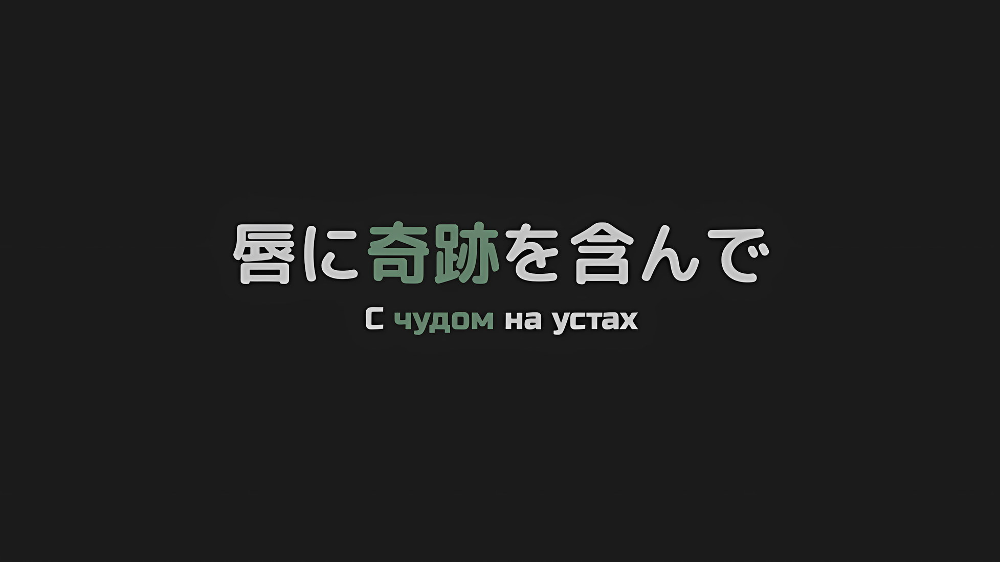
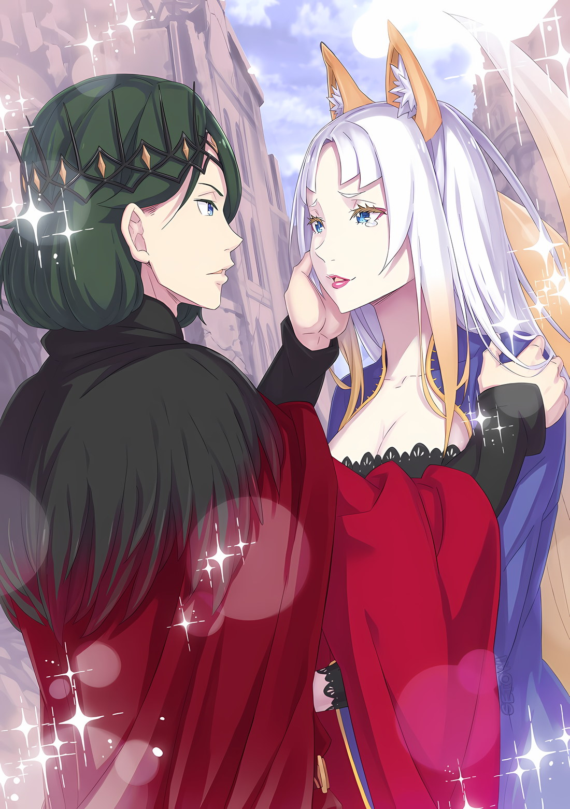

*※※※※※※※※※※※*

В момент, когда он грелся под восходящим лезвием, впервые в своей жизни… да что там, впервые за все время до и после смерти Югард Волакия решился вкусить поражение.

Это был первый раз, когда кто-то скрестил с ним мечи, вступил с ним в равный бой и, в довершение всего, одержал над ним победу в тяжелой борьбе.

Хотя он и восторгался столь высоким уровнем мастерства, факт поражения в решающий момент, когда он не должен был проиграть, заставил его грудь, в которой больше не билось сердце, сжаться.

То, о чем он и мечтать не мог, сбылось, однако, вновь воссоединившись с Ирис, ему еще предстояло обменяться с ней множеством слов. Они еще не прикоснулись друг к другу. Ему еще не довелось проявить свою любовь во всей ее полноте.

Несмотря на это, Югарду было даровано воссоединение.

Дабы желания Югарда и Ирис исполнились, вероятно, не обошлось и без тех, кто не смог обменяться словами, прикосновениями и передать свою любовь возлюбленным, при всем их желании.

Между Югардом и Ирис сошлись звезды.

…И действительно, все произошло именно так, как он и ожидал.

???: Я все еще полный дилетант, когда дело доходит до обращения с этой катаной. Один взмах отнимает у меня столько энергии, что аж как-то тошно.

С шипами, свидетельствующими о том, что в его груди поселилось проклятие, после удара «Мечом Дьявола», объятого зловещей энергией, человек-волк в черном одеянии… Халибель сказал это.

Его лик напомнил Югарду человека-волка, с которым он когда-то был знаком, хотя на деле они ничуть не походили друг на друга, пусть и принадлежали к одной расе.

Тот тоже смотрел на него такими глазами. Югард помнил это.

Халибель: Хотя, наверное, клинок-то этот не за что ненавидеть. Все-таки потраченную энергию он отрабатывает сполна.

Халибель не обратил внимания на глубокие эмоции Югарда и продолжил свою речь.

Очевидно, что он просто поделился впечатлениями о катане в своей руке… «Мече Дьявола» Мурасаме. По тому, как он это сказал, следовало, что сила, скрытая в «Мече Дьявола», не просто сыграла свою роль в его победе.

Казалось, будто «Меч Дьявола» даровал Халибелю нечто большее, чем просто победу…,

Югард: …Наваждение нежити, хм?

Оглядев свое тело, которое приняло на себя рубящий удар, Югард описал ощущение, которое поначалу не мог выразить словами.

В теле воскрешенного Югарда сидела некая беспричинная одержимость… порывистое чувство враждебности и насилия, взывающее к его инстинктам и направленное на все живое в Империи.

По всей вероятности, такое не ограничивалось только Югардом. Кроме того, он сдерживал этот порыв своими более сильными чувствами к Ирис.

Однако, не имея возможности выступить против зачинщика воскрешений, Югард был вынужден подчиниться его намерениям и в итоге скрестил клинки с человеком-гиеной и Халибелем.

Теперь же та непреодолимая, всепоглощающая сила принуждения пропала.

Словно ее перерубил «Меч Дьявола», окутанный темной, зловещей аурой.

*△▼△▼△▼△*

Югард: По этой причине внутри меня нет ничего, кроме мыслей о Звезде Моей.

Приложив руку к ее лицу, Югард ласково заговорил с женщиной, которая была и Ирис, и Йорной… от такого Йорна-Ирис в полном очаровании потеряла дар речи.

Его кожа не была ни бледной, ни холодной, а зрачки перестали быть теми бутафорскими золотыми радужками, что плавали в море пустоты, взамен приобретя характерный голубой цвет.

Его мышцы лица, что не двигались даже без учета статуса нежити, источали серьезное и хорошо знакомое ей настроение.

…Без сомнения, именно этого человека Йорна-Ирис знала как Югарда Волакию.

???: Ворвался сюда без какого-либо разрешения, как ужасно.

Воссоединение этих двоих было прервано властным, хриплым голосом.

Вопреки содержанию своих слов, повысив голос в знак приветствия неожиданного вторженца, мечник-нежить… нет, «Нежить Мастер Меча» облизнул губы и с блеском в глазах посмотрел на Югарда.

Под взглядом «Нежити Мастера Меча» его лицо не дрогнуло,

Югард: Способностями ты наделен весьма недюжинными; но увы, ты просчитался со временем. Сам я желаю лишь одного — все свое оставшееся время провести в компании Звезды Моей.

Мечник-нежить: Да ладно уж, незачем ко мне так холодно…

Югард с безразличием изложил ему свое желание, на что «Нежить Мастер Меча» быстро осекся… нет, он попытался было ответить, но не смог договорить.

???: Держись от нас подальше!

Ибо с этим резким криком маленькое тельце, удерживаемое в руках Йорны-Ирис, крутанулось, и его ноги, покрытые ледяными гэтами, яростно влетели в тело «Нежити Мастера Меча».

Мечник-нежить: Воу!

Нежить использовала свои ножны, чтобы парировать удар девочки. Он избежал прямого попадания и сделал шаг назад.

Удар не был полностью стерт, однако «Нежить Мастер Меча» ответил скорее с радостью, чем с гневом, так как его лицо расплылось в злорадной ухмылке…,

???: Хия!

Ледяной молот мощным ударом разбил его довольную морду.

Обрушившийся сзади удар сокрушил его с головы до пят, отчего человек, известный как «Нежить Мастер Меча», разлетелся в щепки. Однако это вовсе не означало, что наступил его покой.

Будь это так легко, «Нежить Мастер Меча» был бы убит раз эдак пятьдесят. Но, как и всегда, нежить имела свойство возрождаться столько раз, сколько ей вздумается.

Однако прежде, чем они с ним расправились…,

Югард: …Ммм, удар, насквозь пронизанный эмоциями, что, надо полагать, ребенку не присуще. За блестящий потенциал, коим ты обладаешь, я прощу твое хамство.

???: Держись подальше от Йорны-сама.

Йорна: Т-Танза! Его Превосходительство… что ты вытворяешь с Его Превосходительством!

В поле зрения закричавшей Йорны-Ирис рукоять «Меча Света» Югарда столкнулась с ледяными гэтами Танзы, издав резкий пронзительный звук.

Чтобы защитить Йорну-Ирис, Танза в воздухе пнула «Нежить Мастера Меча», однако это была не единственная ее цель; она нацелилась на внезапно вмешавшегося Императора.

Поскольку все произошло так внезапно, вполне естественно, что Танза не смогла определить, друг Югард или враг.

Йорна: И все-таки нельзя делать что-то подобное так внезапно…! Ваше Превосходительство, прошу простить мою Танзу. Эта девочка не держит зла…

Югард: Такой скорбный вид, не стоит. Мне мило любое твое лицо, но в душе возникают мысли о том, чтобы презирать сердце мое, кое желает любить тебя столь истово, сколь искренне ты меня просишь.

Йорна: О-он именно такой каким был…

Хотя Йорна-Ирис от всего сердца извинилась за Танзу, ответ Югарда не затронул сути вопроса. Когда-то подобное было для Югарда обычным делом.

Да, в те давние поры с Югардом такое случалось ежедневно.

Танза: …Йорна-сама.

Танза сжала руки, что крепко ее обнимали, и обратилась к Йорне-Ирис.

Сбросить с себя эти объятия и снова наброситься на Югарда — Танза не настолько потеряла самообладание и проницательность. Хотя она и не разбиралась в их отношениях, но поняла, что между Йорной-Ирис и Югардом нет никакой вражды.

К тому же…,

???: Эй! Думаю, рановато еще отвлекаться на разговоры!

К ним поспешила Эмилия, которая вместе с Танзой сражалась с «Нежитью Мастером Меча».

Она безжалостно ударила нежить сзади ледяным молотом и при этом пристально смотрела своими аметистовыми глазами на Югарда, что стоял рядом с Танзой и Йорной-Ирис,

Эмилия: Вы за нас?

Югард: Истинно так.

Эмилия: Слава богу! Вы кажетесь ооочень сильным! Разрешите на вас положиться!

Югард: Да. Предоставь это мне.

Получив мгновенный ответ от Югарда, Эмилия с облегчением похлопала себя по груди.

Глаза Йорны-Ирис блестели от того, как быстро Эмилия смогла отличить друга от врага, однако, учитывая ее положение полуэльфа, с ее стороны было бы самонадеянно говорить об обычных чувствах.

Как бы то ни было…,

Йорна: Ваше Превосходительство, этот вид…

Югард: Увы, это лишь угольки, коим еще предстоит догореть.

Йорна: …

Даже когда он говорил это, Югард не сводил глаз с Йорны-Ирис. Выражение его лица не искажалось от печали или одиночества.

Слова его прозвучали именно так, какими бы безжалостными они ни были.

А затем, глядя прямо на Йорну-Ирис, Югард продолжил.

Югард: Однако, на эти мгновенья, покуда огонь не угаснет, я весь твой.

Йорна: …Да, Ваше Превосходительство.

Он сделал это только для того, чтобы у Йорны-Ирис не было причин грустить или чувствовать себя одиноко.

Этот ласковый «Терновый Король», которого боялось все и вся, всегда хранил в своем сердце спокойствие, дабы шипы его не ранили никого, кроме него самого.

Йорна: Ч-что вы… я так счастлива.

Хотя их время было ограничено, она могла прикасаться к Югарду, разговаривать с ним.

С тех пор, как те дни подошли к концу, это было то, чего она… то, чего Ирис так и не смогла достичь. И из-за этой беспомощности пришлось понести бесчисленные жертвы.

Во искупление этих ошибок и сожалений Ирис присоединилась к Империи под именем Йорны…,

Мечник-нежить: …Этот мечище в твоей руке, на вид драгоценный, это же «Меч Света» Волакия, да?

Внезапно раздался хриплый голос, который, казалось, сдерживал свое рвение, что заставило Йорну-Ирис и остальных поднять глаза.

На некотором расстоянии от места, где собралась четверка, из земли медленно поднималась фигура одинокой нежити. Подобно насекомым, вылезающим из-под большого камня, под властью отвратительного наваждения мечники-нежить стали появляться один за другим.

Все они были идентичны, без индивидуальности, с идеально слаженными движениями, сияющими золотыми зрачками и злорадной ухмылкой.

Мечник-нежить: Легендарный меч, знаменитый на весь мир, выкованный безрассудным человеком магический инструмент, что стоит в одном ряду с «Мечом Грез» и «Мечом Дьявола», которые достались этому избалованному сопляку… хотя я его видел, мне редко выпадала возможность обменяться с ним ударами.

Йорна: …После того, как ты так далеко зашел, твой воинский дух воспрял еще больше?

Мечник-нежить: Это смущает… но да, ты все правильно поняла.

Эти слова прозвучали наигранно, ибо он ничуть не смутился. Об этом свидетельствовали пары глаз, которые светились все ярче, и леденящий жар их злорадных ухмылок.

Даже по сравнению с прочей нежитью, дьявольская аура и безумство «Нежити Мастера Меча» были явно ненормальными, из-за чего истинная сила и отступила перед Йорной-Ирис. Она со стыдом сжала кулаки.

Ее крепко сжатые кулаки были нежно обхвачены руками Танзы прямо из объятий.

Югард: Дитя, взять руку Звезды Моей и оставаться в объятиях ее, я разрешаю.

Танза: …Я сделала бы это и без вашего разрешения.

Возмущенный тон Танзы не изменил сурового лица Югарда. Однако Йорна-Ирис почувствовала, что он воспринял ее ответ положительно.

Пока Югард продолжал идти к нескончаемому потоку «Нежити Мастеров Меча», которых, казалось, становилось все больше, по десять-двадцать человек за раз, Эмилия с напряженным выражением лица попыталась к нему приблизиться.

Однако Югард остановил ее взглядом.

Югард: Твое стремление помочь благородно. Тем не менее, предоставь это мне.

Эмилия: Но вы же один…

Югард: …Югард Волакия, таково мое имя.

Эмилия: Волакия…

Эмилия удивилась фамилии Югарда и посмотрела в сторону Йорны-Ирис. Ответив на ее взгляд кивком, та проводила Императора взглядом, когда он двинулся вперед.

Югард и «Нежить Мастер Меча», которых отделяло расстояние примерно в десять метров, встали друг напротив друга.

Мечник-нежить: Югард Волакия… хм, ты «Император Терний»?

Югард: Никогда к себе так не обращался, однако же есть те, кто меня так называет, да. Воистину, вполне уместное прозвище, лаконично отражающее мое пребывание на троне Императора. Оно прекрасно ляжет на страницы будущих летописей.

Мечник-нежить: Хаха, хахаха! Вот так сюрпризище! Сильнейший среди всех Императоров Священной Империи Волакия! Подумать только, и я встретил такого человека… ожидаемо, я заполучу его!

С приторной ноткой в голосе напор зловещей ауры «Нежити Мастера Меча» усилился во всем своем великолепии.

Зная, что его противник Югард Волакия, сам «Император Терний», «Нежить Мастер Меча» не ужаснулся, а наоборот, воспрянул духом в силу нестандартной логики.

Золотые глаза «Нежити Мастера Меча» заблестели при виде Югарда и его «Меча Света».

Мечник-нежить: Если я одолею Его Превосходительство Императора, смогу ли я получить «Меч Света»?

Югард: Если меч сочтет это нужным, то так тому и быть. Однако так просто я не сдамся.

Мечник-нежить: Хо.

Югард: Многие из моих подданных ставили на кон свои жизни, стремясь воплотить мечту о том, чтобы завладеть этим мечом.

Только Йорна-Ирис, разделявшая совместное правление многочисленными подданными Югарда, могла понять весь пыл ласкового «Тернового Короля», которого боялись больше всех остальных.

…На глазах у наблюдающей за происходящим Йорны-Ирис Югард и «Нежить Мастер Меча» синхронно пришли к действию.

Мечник-нежить: …Ха.

С коротким выдохом и молниеносными шагами их расстояние друг от друга стерлось.

Двадцать одинаковых людей разделились на четыре группы, и сверкающая сталь мечей двинулась на Югарда, подобно вихрю.

Варварский акт обычного человека, что собрал в кучу первоклассных мастеров меча, дабы достичь высочайшего уровня… Эмилия и Танза ахнули от атак, которые можно было назвать бурей мечей, превосходящих по силе стиль владения мечом.

Однако у Йорны-Ирис не было ни капли сомнений.

На него неслось двадцать мечей… однако все закончится одним точным ударом.

Бушующий шторм мечей нежити нацелился на Югарда. Со всех сторон.

Но, прежде чем эти клинки смогли достичь «Тернового Короля», сияющий «Меч Света» вспыхнул… он сжег все двадцать приближающихся клинков. Шея же одной из «Нежити Мастера Меча» оказалась порезана багровым острием.

Мечник-нежить: Эта сила… хк.

Его шею рассекло. Однако эту смертельную рану получил лишь самый передовой.

«Нежить Мастер Меча» скорчил гримасу, когда его оставшиеся девятнадцать «я», а точнее, поток других его «я», несмотря на уничтоженные клинки, один за другим перегоняли его.

Но если кто-то ошибочно полагал, что их сила в возможности повторить попытку после смерти, то…,

Йорна: Это конец.

…В следующий миг «Нежить Мастер Меча», чье тело было порезано, вспыхнул; то же самое произошло и с остальными девятнадцатью. Их всех разом объяло пламя.

Мечник-нежить: …Чт-оо.

В руках Югарда Волакии «Меч Света» запылал своим истинным пламенем. Душа «Нежити Мастера Меча», которую задел косой удар, стала искрой, откуда и зародилось пламя.

Совпадение: «Меч Света» Винсента Волакии так же поджег душу «Ведьмы» Сфинкс, что принесла «Великое Бедствие». Развязка была аналогичной.

Мечник-нежить: Кха!

Мечник-нежить: Ух, ух!

Мечник-нежить: …Ооо!

Сжигаемые неимоверным пламенем, все они превращались в пепел. Каждый раз, когда погибал один из них, возрождался и пополнял ряды новый, однако и его захлестывало пламя.

Все больше и больше, раз за разом, без исключения, он оставлял после себя не один десяток угольков. «Нежить Мастер Меча» посмотрел вниз — на свои руки, которые так и жгло неугасающее пламя.

И вот…,

Мечник-нежить: Ах, ааах, чтоб тебя. Неужели это мой конец, такова моя остановочка…?!

Невнятный голос вырывался из его прожженной глотки. Он скорчил гримасу.

На какой-то миг подумалось, будто это была последняя отчаянная попытка того, кто не смог признать собственного поражения, однако это беспокойство прервал конец «Нежити Мастера Меча». Он просто сгорел и превратился в уголь.

Потянувшись к небесам своими изувеченными, обмякшими руками, «Нежить Мастер Меча» встретил свою кончину.

В конце концов…,

Танза: …Это конец?

Танза, ставшая свидетелем того же самого, выразила свое беспокойство.

Взяв ее руку в свою, Йорна-Ирис ответила на переживания Танзы. Она обхватила ее маленькую ладошку своей рукой и заверила, что все будет хорошо.

Эмилия: …Те люди, они что, все сгорели?

Югард: Несколько проблематично найти для этого соответствующее высказывание, но да. Пламя «Меча Света» сжигает все, что пожелает его владелец. Души не исключение.

Эмилия: Понятно… Спасибо, это ооочень помогло.

Но даже после слов благодарности Эмилия мрачно смотрела на многочисленные остатки сгоревшей нежити.

Даже если противник был нежитью, даже если он был тем, кто использовал особенности нежити в зловещих целях, тот факт, что его жизнь была потеряна, потряс аметистовые глаза Эмилии.

Йорна-Ирис когда-то испытывала то же чувство, что и Эмилия. Думать об этом — один из тех моментов, от которых, по прошествии стольких жизней, ей пришлось отказаться.

Однако было кое-что, что она не могла оставить.

Югард: …О Звезда Моя.

Ее позвали еще раз. Йорна-Ирис встретилась взглядом с Югардом.

Воскрешенный Югард-нежить был освобожден от этого отвратительного ига. Его утонченные черты, красивые и элегантные, его голос, который отдавался в ее груди слишком сильно по сравнению с его реальной громкостью, стали продолжением тех дней.

Однако было и то, что нельзя объяснить только этим.

Йорна: Ваше Превосходительство, шипы…

То, что сковывало других, вонзая шипы в их сердца; «Терновое Проклятие».

Оно изолировало Югарда и послужило толчком к тому драгоценному времени, которое он провел вместе с Ирис. И даже после смерти оно по-прежнему опутывало его душу, сковывающее проклятие, от коего нет спасения.

Но в настоящий момент оно не ощущалось. Это касалось не только Йорны-Ирис, но и Танзы с Эмилией.

Другими словами, Югард был освобожден от «Тернового Проклятия».

Йорна: Проклятие, оно развеялось?

Югард: …Не совсем. «Терновое Проклятие» все еще в силе, однако оно перешло к другому; во мне его больше нет.

Йорна: Перешло к другому…? Такое, такое возможно?

Югард: …Благодаря ему стало. Во времена моей жизни нечто подобное было бы невозможно. Но с тех пор время текло и текло, немало мудростей явилось свету. Наш мир великолепен.

Югард Волакия был освобожден от «Тернового Проклятия».

В ответе Югарда, когда он молча вздернул подбородок, прозвучало глубокое чувство восхищения тем, кто этого добился.

Йорна: Ваше Превосходительство, проклятие…

С другой стороны, Йорна-Ирис лишилась дара речи.

Хотя она понимала, что в характере Югарда было стремление точно показать, что «Терновое Проклятие» в конечном счете не исчезло, все равно это было исполнением самого заветного желания Ирис и Йорны.

Даже если это произошло после его смерти, душа Югарда рассталась с «Терновым Проклятием».

Танза: Йорна-сама, этот человек…

Йорна: Танза, этот мужчина — Его Превосходительство Император Югард Волакия… непростой человек, которого я, которого я люблю.

На представление Йорны-Ирис Танза слегка выпучила глаза. Затем она подняла лицо, обменялась взглядом с Югардом и после небольшого колебания сказала,

Танза: Меня зовут Танза, я слуга Йорны-сама.

Югард: Вот как, Танза. За время моего отсутствия Звезда Моя была на твоем попечении. Это великая услуга.

После того, как Танза робко произнесла эти слова, Югард кивнул.

На расстоянии, на котором они могли видеть лица друг друга, на расстоянии, на котором они могли слышать голоса друг друга, на расстоянии, на котором они могли вступить в физический контакт, если бы протянули друг другу руки; на этом расстоянии Югард и Танза обменялись словами.

Хотя в прошлом никто, кроме Ирис, не мог добиться подобного без адской боли.

Эмилия: Я Эмилия, просто Эмилия. Югард, вы и дальше будете нам помогать?

Словно опираясь на глубокие эмоции Йорны-Ирис, Эмилия без колебаний заговорила с Югардом.

На это он вздернул подбородок со словами: «Безусловно», и,

Югард: Тот, кто освободил меня от терний долгих мук… долг, возложенный на меня Груви Гамлетом. Я должен действовать вместо него.

Йорна: Груви… он освободил Ваше Превосходительство от проклятия…

Югард: О Звезда Моя.

Йорна: Д-да.

Застигнутая врасплох именем благодетеля Югарда, она издала голос, похожий на голос деревенской девушки, что услышала внезапный зов.

То, что воздух, испускаемый Югардом, стал нежным, похоже, доказывало, что он считает реакцию Йорны-Ирис милой, однако она не стала затрагивать эту тему.

И вот, когда Югард поймал взглядом своих голубых глаз Ирис и Йорну,

Югард: Я посвящу тебе всего себя. В этих словах нет лжи. Отныне и навсегда…

Йорна: Само собой разумеется, мы будем вместе. Я не хочу расставаться с вами ни на миг.

*До того самого момента, как я вас потеряю, я хочу сохранить это чудо на своих устах.*

Таков был ответ Йорны, лишенный всякой лжи, и исходил он прямо из глубин сердца Ирис.

*△▼△▼△▼△*

…Палящий аромат его души врывался в ноздри.

Боли не было. Когда все его тело охватило пламя, жар от страшных ожогов был сродни дуновению легкого ветерка.

Однако, не в силах от него избавиться, этот легкий ветерок превращал его новосозданные тела в пепел, силясь положить конец его существованию.

Даже если окунуть его в воду, пламя не угаснет. Даже если он попробует распространить огонь в другом месте, пламя не распространится. Даже если бы точка возникновения пламени была срезана, все остальное его тело немедленно воспламенилось бы от неизбежного огня конечного пункта… да, это был его конечный пункт.

Он чувствовал. Он понимал. Пламя не потухнет. Пока он не встретит свой конец, оно не угаснет.

Мечник-нежить: Ааа, аааа, ААААА, ну какая же все это бредятина…

Зайдя настолько далеко, что собственным клинком довел себя до живого трупа, он пытался освоить путь меча.

Пламя «Меча Света», с которым он столкнулся на своем пути к заветной цели, сжигало душу Роуэна Сегмунта, человека, что так страстно желал стать «Небесным Меча». Оно испепеляло его целиком.

Он отказался оставаться на месте. Роуэн бежал с поля боя в безумном порыве.

Его нога крошилась, когда он делал шаг вперед, поэтому, чтобы очередной шаг не привел к потере всей нижней половины тела, он, не теряя времени попусту, отрубал себе голову, и, таким образом, следующий шаг по его останкам делал уже его новый «я».

Повторяя этот процесс, Роуэн бежал. …Он отдалился от «Императора Терний», чтобы добраться до места, которое он был обязан посетить до того, как сгорит дотла.

Роуэн: Черт бы вас всех побрал… я заполучу его.

По мере того, как угли разгорались по всему его телу, на лице Роуэна появилась жуткая ухмылка.

Превратившись в нежить, Роуэн остро осознал состояние собственной души и поставил кончики пальцев своих ног на ступни к «Небесному Меча». Для того, чтобы уверенно подняться на ступень выше, ему предстояло пройти следующее испытание.

В недалеком будущем душа Роуэна окажется сожжена. Тем не менее, пламя свечи горит ярче всего, когда вот-вот погаснет.

…Для Роуэна Сегмунта достичь «Небесного Меча» — самое заветное желание.

Он уже доказал, что ради этой цели без колебаний отдаст собственную жизнь.

По правде говоря, пережив смерть и получив осознание формы своей души, Роуэн неуклонно приближался к исполнению собственного желания.

Таким образом, пока он достигал «Небесного Меча», не имело значения, что это длилось лишь секунду.

Пусть даже на секунду перед тем, как сгорит его душа, пусть даже это будет не более чем мгновение, важно лишь то, что он его достиг.

И для этой цели…,

???: …Ну и ну, а я-то думал, кто сюда так яростно мчится, а тут такое огненное шоу! Хм, раз уж я так сказал, не пафосная ли это постановочка?

Раздался чей-то голос; место, куда он хотел попасть, прежде чем сгореть в ничто.

Узрев обладателя этого голоса за пределами своего горящего поля зрения, Роуэн возблагодарил свою карму.

Он прибыл в то место, куда хотел попасть. Оставалось только добраться до него.

И действительно, перед Роуэном, который одарил его горящей ухмылкой, стоял мальчик, что держал на руках смуглую девушку.

Как и положено иронии судьбы, мальчик улыбнулся так же, как и Роуэн, а затем заговорил.

Мальчик: Из-за тебя я только что впервые об этом призадумался, пап. …Мне это не противно, скорее даже нравится.

Именно так он и заявил.
